# 第1章: プロジェクト概要

## 1.1 財務会計システムとは

### 財務会計システムの業務概要

財務会計システム（Financial Accounting System）とは、企業の財務活動を正確に記録・管理するための情報システムです。日々の取引を仕訳として記録し、元帳への転記、残高試算表の作成、そして財務諸表（貸借対照表・損益計算書）の生成までを一元的に管理します。

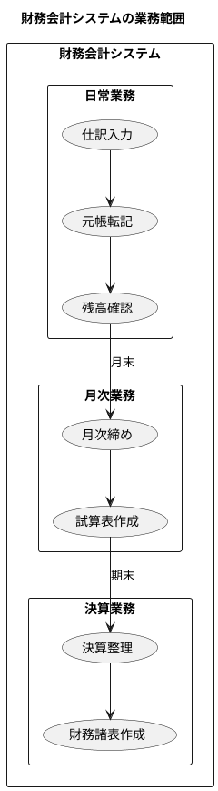

### 複式簿記の基礎

財務会計システムの根幹をなすのが「複式簿記」です。複式簿記とは、すべての取引を「借方（Debit）」と「貸方（Credit）」の両面から記録する記帳法です。

#### なぜ複式簿記なのか

複式簿記は、取引の二面性を捉えます。例えば「現金で商品を仕入れた」という取引は：

- **原因**：商品（資産）が増加した
- **結果**：現金（資産）が減少した

この二面性を同時に記録することで、取引の全体像を正確に把握できます。

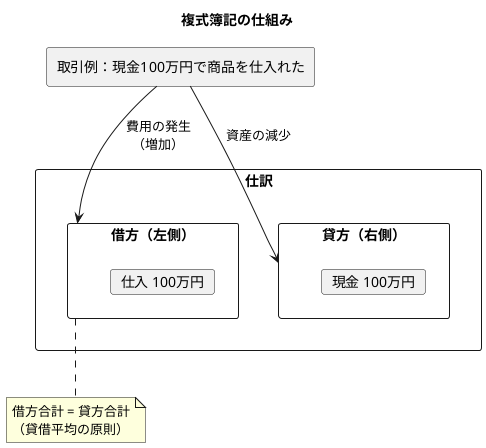

#### 勘定科目の5分類

すべての勘定科目は、以下の5つに分類されます。

| 分類 | 説明 | 借方増加 | 貸方増加 | 代表的な科目 |
|------|------|:--------:|:--------:|-------------|
| 資産 (Asset) | 会社が所有する財産 | 増加 | 減少 | 現金、売掛金、商品、建物 |
| 負債 (Liability) | 会社が負っている債務 | 減少 | 増加 | 買掛金、借入金、未払金 |
| 純資産 (Equity) | 資産から負債を引いた正味財産 | 減少 | 増加 | 資本金、利益剰余金 |
| 収益 (Revenue) | 事業活動による収入 | 減少 | 増加 | 売上高、受取利息 |
| 費用 (Expense) | 事業活動による支出 | 増加 | 減少 | 仕入高、給与、家賃 |

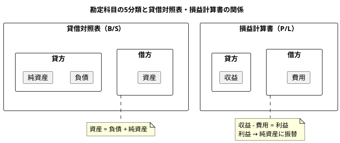

### 財務会計の業務フロー

財務会計システムが扱う業務フローを以下に示します。

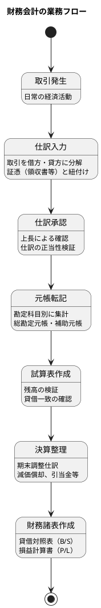

### ビジネス要件の整理

本システムが満たすべきビジネス要件を以下に整理します。

#### 機能要件

| カテゴリ | 要件 |
|---------|------|
| マスタ管理 | 勘定科目、勘定科目構成、自動仕訳設定を管理できる |
| 仕訳管理 | 仕訳の入力・承認・確定の一連のワークフローを管理できる |
| 自動仕訳 | 定型取引について自動で仕訳を生成できる |
| 元帳管理 | 総勘定元帳・補助元帳を照会できる |
| 残高管理 | 勘定科目別の残高を集計し試算表を生成できる |
| 財務諸表 | 貸借対照表・損益計算書を生成できる |
| 財務分析 | 各種財務指標を算出できる |
| ユーザー管理 | ロールベースのアクセス制御ができる |
| 監査 | 操作履歴を記録・参照できる |

#### 非機能要件

| カテゴリ | 要件 |
|---------|------|
| 可用性 | 業務時間中は安定して稼働する |
| 性能 | 一覧表示は3秒以内に応答する |
| セキュリティ | 認証・認可により不正アクセスを防止する |
| 保守性 | 機能追加・変更が容易な構造とする |
| 監査性 | すべての操作について監査ログを保持する |
| データ整合性 | 仕訳の貸借は常に一致する |

---

## 1.2 システム全体像

### ユースケース概要図

本システムの主要なユースケースを以下に示します。

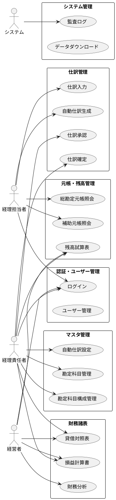

### 主要機能モジュール

#### 認証・ユーザー管理

システムへのアクセスを制御する認証機能と、ユーザー情報を管理する機能を提供します。

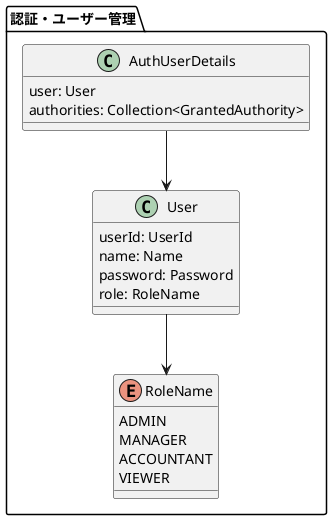

- **ログイン/ログアウト**: JWT トークンによる認証
- **ユーザー CRUD**: ユーザーの登録・編集・削除
- **ロール管理**: 管理者・経理責任者・経理担当者・閲覧者のロール割当

#### マスタ管理

システムで使用する基本情報（マスタデータ）を管理します。

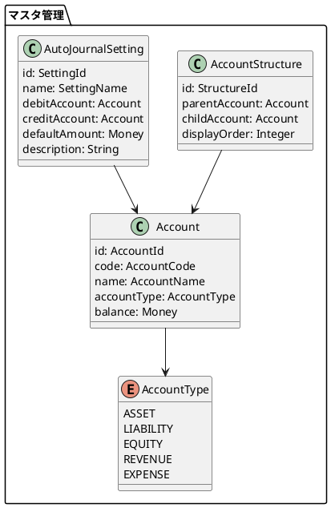

- **勘定科目管理**: 勘定科目コード、名称、種別の管理
- **勘定科目構成管理**: 科目の階層構造（親子関係）の管理
- **自動仕訳設定**: 定型仕訳のテンプレート管理

#### 仕訳管理

仕訳の入力から確定までのワークフローを管理します。

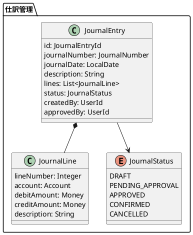

- **仕訳入力**: 借方・貸方の明細入力、貸借一致検証
- **自動仕訳生成**: 設定に基づく仕訳の自動作成
- **仕訳承認**: 上長による承認ワークフロー
- **仕訳確定**: 確定済み仕訳のロック

#### 元帳・残高管理

元帳への転記と残高集計を管理します。

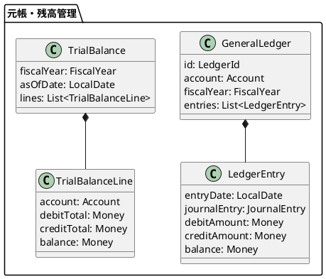

- **総勘定元帳**: 勘定科目別の取引履歴と残高
- **補助元帳**: 取引先別、部門別等の詳細管理
- **残高試算表**: 全勘定科目の残高一覧と貸借検証

#### 財務諸表

期末の財務諸表を生成します。

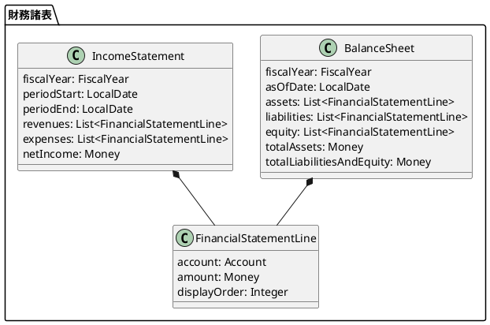

- **貸借対照表（B/S）**: 資産・負債・純資産の状況
- **損益計算書（P/L）**: 収益・費用と当期純利益
- **財務分析**: ROE、流動比率等の財務指標

---

## 1.3 開発手法

### エクストリームプログラミング（XP）の採用

本プロジェクトでは、アジャイル開発手法の一つであるエクストリームプログラミング（XP）を採用しています。

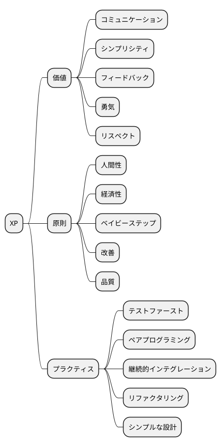

#### XP の価値

| 価値 | 本プロジェクトでの実践 |
|------|----------------------|
| コミュニケーション | コードとテストによる意図の明示化 |
| シンプリシティ | 必要最小限の実装から始める |
| フィードバック | TDD による即座の検証 |
| 勇気 | 大胆なリファクタリング |
| リスペクト | コード品質への継続的な配慮 |

### テスト駆動開発（TDD）

本プロジェクトでは、テスト駆動開発（Test-Driven Development）を実践しています。特にデータベース設計においてもTDDの原則を適用し、「テスト」という形でデータ要求を具体化します。

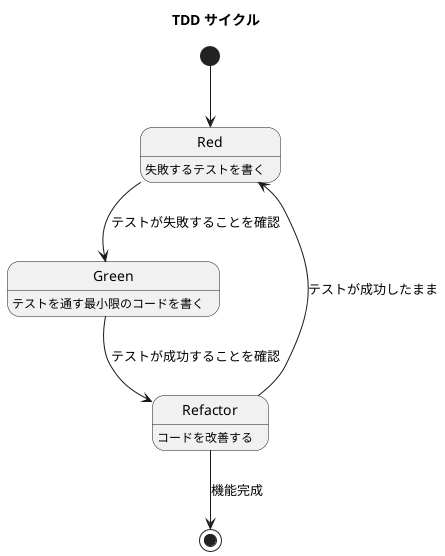

#### TDD の3つのステップ

1. **Red（レッド）**: まず失敗するテストを書く
2. **Green（グリーン）**: テストを通す最小限のコードを実装する
3. **Refactor（リファクタ）**: テストを維持しながらコードを改善する

#### なぜTDDでデータベース設計？

- **要求が明確になる**: 「テスト」という形で、その時点で必要なデータ要求を具体的に定義します
- **設計がシンプルに保たれる**: 今必要なことだけを実装するため、過剰な設計を防ぎます
- **変更に強くなる**: テストが既存の要求を守るため、安心してリファクタリング（設計改善）を行えます

#### TDD の効果

- **設計の改善**: テストしやすいコードは疎結合で凝集度が高い
- **ドキュメント**: テストがコードの仕様書となる
- **リグレッション防止**: 変更による退行を即座に検出
- **開発リズム**: 小さなサイクルで着実に前進

### 継続的インテグレーション

変更を頻繁に統合し、自動テストで品質を担保します。

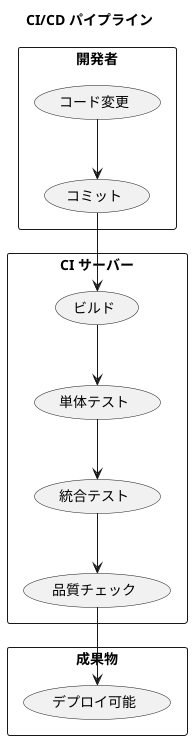

- **10分ビルド**: ビルドと全テストを10分以内に完了
- **自動テスト**: 単体・統合テストの自動実行
- **品質チェック**: SonarQube、Checkstyle、PMD、SpotBugs によるコード品質分析

### イテレーティブな開発サイクル

週次・四半期のサイクルで計画と振り返りを繰り返します。

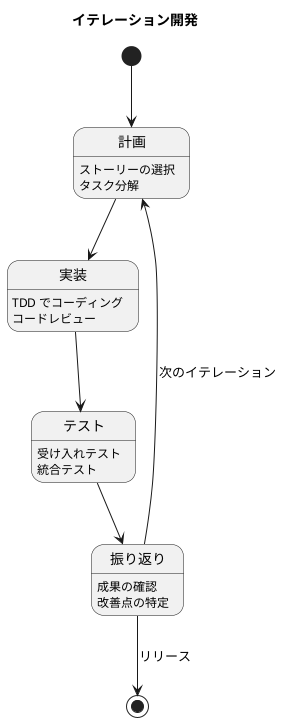

---

## 1.4 本書の構成

### 各章で扱う機能とテーマ

本書は9部30章で構成され、財務会計システムの開発過程を段階的に解説します。

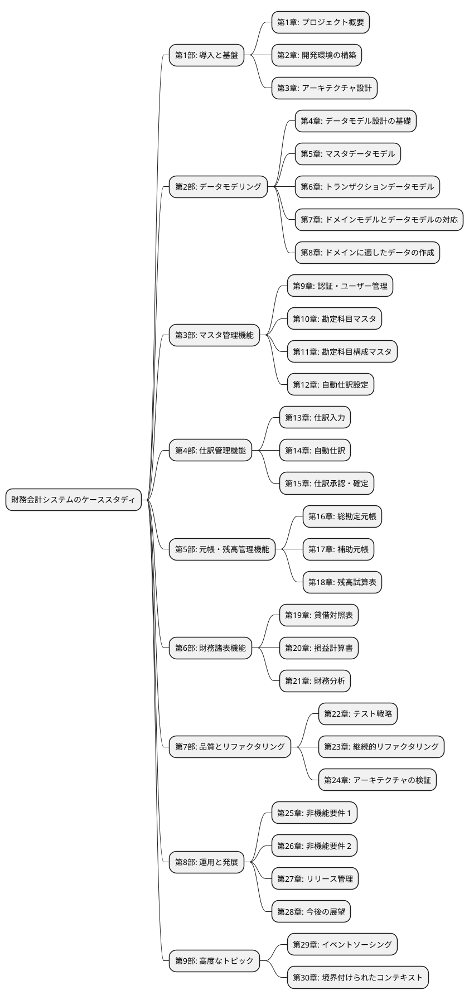

#### 第1部: 導入と基盤（第1〜3章）

システムの概要と開発環境、アーキテクチャの基盤を解説します。

- **第1章**: 財務会計システムの業務概要、複式簿記の基礎、システム全体像
- **第2章**: Java、Spring Boot、PostgreSQL/MySQL、Gradle、Docker の環境構築
- **第3章**: レイヤードアーキテクチャ、パッケージ構造、依存関係の設計

#### 第2部: データモデリング（第4〜8章）

TDDによるデータベース設計を先行して実施し、システム全体のデータ構造を設計します。

- **第4章**: ER モデリングの基礎、全体データモデル設計
- **第5章**: 勘定科目マスタ、勘定科目構成マスタのデータモデル
- **第6章**: 仕訳テーブル、自動仕訳テーブルのデータモデル
- **第7章**: 貧血ドメインモデルからリッチドメインモデルへの進化
- **第8章**: テストデータ設計、テストフィクスチャの作成

#### 第3部〜第6部: 機能開発（第9〜21章）

各機能を TDD で実装していく過程を、実際のコードとともに解説します。

#### 第7部: 品質とリファクタリング（第22〜24章）

テスト戦略、継続的なリファクタリング、アーキテクチャの検証について解説します。

#### 第8部: 運用と発展（第25〜28章）

非機能要件（実行履歴管理、監査ログ）、リリース管理と今後の展望について解説します。

#### 第9部: 高度なトピック（第29〜30章）

イベントソーシング、DDDの戦略的設計（境界付けられたコンテキスト）について解説します。

### コードリポジトリの活用方法

本書のコードは GitHub で公開されています。

#### リポジトリ構成

```
case-study-accounting/
├── app/
│   └── backend/
│       └── api/              # Spring Boot バックエンド
├── docs/
│   ├── article/              # 本書原稿
│   ├── assets/               # 図表、仕様書
│   ├── reference/            # リファレンスガイド
│   └── wiki/                 # 開発 Wiki
├── docker/                   # Docker 設定
│   ├── postgres/
│   └── mysql/
├── scripts/                  # ビルド・開発スクリプト
└── docker-compose.yml
```

#### 実行方法

```bash
# リポジトリのクローン
git clone https://github.com/k2works/case-study-accounting.git
cd case-study-accounting

# Docker でデータベースを起動
docker-compose up -d postgres

# バックエンドの起動
cd app/backend/api
./gradlew bootRun

# テストの実行
./gradlew test
```

---

## まとめ

本章では、財務会計システムの概要と本書の構成について説明しました。

- 財務会計システムは**複式簿記**に基づき、**仕訳入力**から**財務諸表作成**までを一元管理する
- 勘定科目は**資産・負債・純資産・収益・費用**の5分類に区分される
- **エクストリームプログラミング（XP）**と**テスト駆動開発（TDD）**を開発手法として採用
- 本書は**TDDによるデータベース設計**を先行し、段階的にシステムを育てていく構成

次章では、開発環境の構築について解説します。
