# 第6章: トランザクションデータモデル

## 6.1 複式簿記とデータモデルの関係

### 複式簿記の原理

複式簿記は、すべての取引を「借方」と「貸方」の両面から記録する記帳法です。この原理は、データモデル設計の根幹をなします。

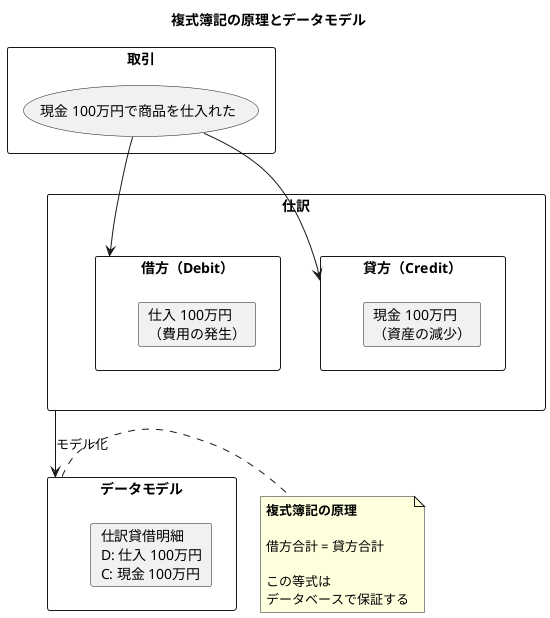

### 貸借区分の設計

| 記号 | 名称 | 意味 | 増加時 |
|------|------|------|--------|
| `D` | Debit（借方） | 資産・費用の増加、負債・純資産・収益の減少 | 左側に記入 |
| `C` | Credit（貸方） | 負債・純資産・収益の増加、資産・費用の減少 | 右側に記入 |

---

## 6.2 仕訳テーブルの3層構造設計

### 2層構造の限界と3層構造の必要性

実務では、1つの取引が複数の借方・貸方を持つ「複合仕訳」が頻繁に発生します。

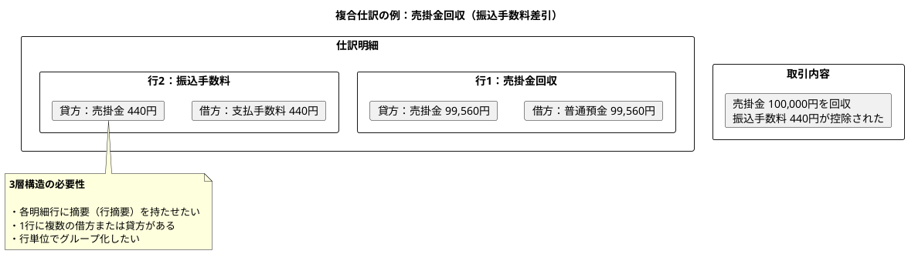

### 3層構造 ER 図

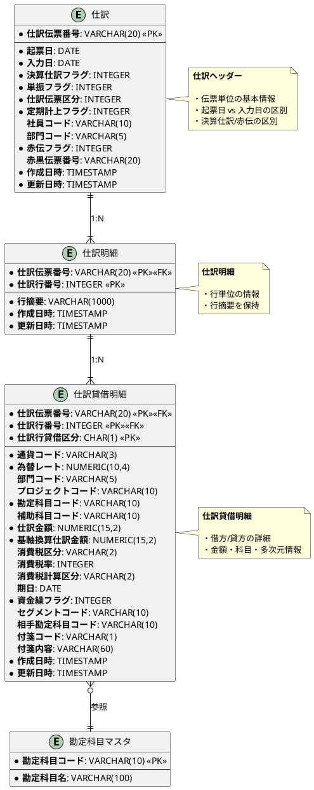

### 3層構造の各層の役割

| 層 | テーブル名 | 役割 | 主キー |
|---|----------|------|--------|
| 第1層 | 仕訳 | 伝票単位の基本情報（起票日、入力日、フラグ類） | 仕訳伝票番号 |
| 第2層 | 仕訳明細 | 行単位の情報（行摘要） | 仕訳伝票番号 + 仕訳行番号 |
| 第3層 | 仕訳貸借明細 | 借方・貸方の詳細（金額、科目、多次元情報） | 仕訳伝票番号 + 仕訳行番号 + 仕訳行貸借区分 |

---

## 6.3 TDD による3層構造仕訳テーブルの実装

### 6.3.1 Red：3層構造のテストコード

まず、3層構造の要求をテストとして表現します。

```java
package com.example.accounting.journal;

import org.junit.jupiter.api.BeforeEach;
import org.junit.jupiter.api.Test;
import org.springframework.beans.factory.annotation.Autowired;
import org.springframework.boot.test.context.SpringBootTest;
import org.springframework.jdbc.core.JdbcTemplate;
import org.springframework.test.context.DynamicPropertyRegistry;
import org.springframework.test.context.DynamicPropertySource;
import org.testcontainers.containers.PostgreSQLContainer;
import org.testcontainers.junit.jupiter.Container;
import org.testcontainers.junit.jupiter.Testcontainers;

import java.math.BigDecimal;
import java.time.LocalDate;
import java.util.List;
import java.util.Map;

import static org.assertj.core.api.Assertions.assertThat;

/**
 * 3層構造仕訳テーブルのテスト
 */
@SpringBootTest
@Testcontainers
class Journal3LayerTest {

    @Container
    static PostgreSQLContainer<?> postgres = new PostgreSQLContainer<>("postgres:15-alpine")
            .withDatabaseName("testdb")
            .withUsername("test")
            .withPassword("test");

    @DynamicPropertySource
    static void configureProperties(DynamicPropertyRegistry registry) {
        registry.add("spring.datasource.url", postgres::getJdbcUrl);
        registry.add("spring.datasource.username", postgres::getUsername);
        registry.add("spring.datasource.password", postgres::getPassword);
    }

    @Autowired
    private JdbcTemplate jdbcTemplate;

    @BeforeEach
    void setUp() {
        // テストデータのクリーンアップ
        jdbcTemplate.execute("DELETE FROM \"仕訳貸借明細\"");
        jdbcTemplate.execute("DELETE FROM \"仕訳明細\"");
        jdbcTemplate.execute("DELETE FROM \"仕訳\"");
    }

    @Test
    void test_3層構造での仕訳登録_単純な仕訳() {
        // Given: 現金100,000円で商品を仕入れる仕訳
        String journalNo = "JE-20250101-001";
        LocalDate journalDate = LocalDate.of(2025, 1, 1);
        LocalDate inputDate = LocalDate.of(2025, 1, 1);

        // When: 仕訳を登録
        // 1. 仕訳ヘッダー
        jdbcTemplate.update("""
            INSERT INTO "仕訳" (
                "仕訳伝票番号", "起票日", "入力日", "決算仕訳フラグ", "単振フラグ",
                "仕訳伝票区分", "定期計上フラグ", "赤伝フラグ"
            ) VALUES (?, ?, ?, 0, 1, 0, 0, 0)
            """, journalNo, journalDate, inputDate);

        // 2. 仕訳明細（1行）
        jdbcTemplate.update("""
            INSERT INTO "仕訳明細" (
                "仕訳伝票番号", "仕訳行番号", "行摘要"
            ) VALUES (?, 1, '商品仕入')
            """, journalNo);

        // 3. 仕訳貸借明細（借方：仕入、貸方：現金）
        jdbcTemplate.update("""
            INSERT INTO "仕訳貸借明細" (
                "仕訳伝票番号", "仕訳行番号", "仕訳行貸借区分",
                "通貨コード", "為替レート", "勘定科目コード",
                "仕訳金額", "基軸換算仕訳金額", "資金繰フラグ"
            ) VALUES (?, 1, 'D', 'JPY', 1.00, '5110', 100000.00, 100000.00, 0)
            """, journalNo);

        jdbcTemplate.update("""
            INSERT INTO "仕訳貸借明細" (
                "仕訳伝票番号", "仕訳行番号", "仕訳行貸借区分",
                "通貨コード", "為替レート", "勘定科目コード",
                "仕訳金額", "基軸換算仕訳金額", "資金繰フラグ"
            ) VALUES (?, 1, 'C', 'JPY', 1.00, '1010', 100000.00, 100000.00, 0)
            """, journalNo);

        // Then: 複式簿記の原理を確認（借方合計 = 貸方合計）
        List<Map<String, Object>> balance = jdbcTemplate.queryForList("""
            SELECT
                SUM(CASE WHEN "仕訳行貸借区分" = 'D' THEN "仕訳金額" ELSE 0 END) as debit_total,
                SUM(CASE WHEN "仕訳行貸借区分" = 'C' THEN "仕訳金額" ELSE 0 END) as credit_total
            FROM "仕訳貸借明細"
            WHERE "仕訳伝票番号" = ?
            """, journalNo);

        BigDecimal debitTotal = (BigDecimal) balance.get(0).get("debit_total");
        BigDecimal creditTotal = (BigDecimal) balance.get(0).get("credit_total");

        assertThat(debitTotal).isEqualByComparingTo(creditTotal);
        assertThat(debitTotal).isEqualByComparingTo(new BigDecimal("100000.00"));
    }

    @Test
    void test_3層構造での仕訳登録_複合仕訳() {
        // Given: 売掛金の回収（振込手数料差引）
        // 売掛金 100,000円 → 普通預金 99,560円 + 支払手数料 440円
        String journalNo = "JE-20250102-001";
        LocalDate journalDate = LocalDate.of(2025, 1, 2);

        // When: 仕訳を登録
        jdbcTemplate.update("""
            INSERT INTO "仕訳" (
                "仕訳伝票番号", "起票日", "入力日", "決算仕訳フラグ", "単振フラグ",
                "仕訳伝票区分", "定期計上フラグ", "赤伝フラグ"
            ) VALUES (?, ?, ?, 0, 0, 0, 0, 0)
            """, journalNo, journalDate, journalDate);

        // 仕訳明細（2行）
        jdbcTemplate.update("""
            INSERT INTO "仕訳明細" ("仕訳伝票番号", "仕訳行番号", "行摘要")
            VALUES (?, 1, '売掛金回収（A社）')
            """, journalNo);

        jdbcTemplate.update("""
            INSERT INTO "仕訳明細" ("仕訳伝票番号", "仕訳行番号", "行摘要")
            VALUES (?, 2, '振込手数料')
            """, journalNo);

        // 仕訳貸借明細
        // 行1-借方: 普通預金 99,560円
        jdbcTemplate.update("""
            INSERT INTO "仕訳貸借明細" (
                "仕訳伝票番号", "仕訳行番号", "仕訳行貸借区分",
                "通貨コード", "為替レート", "勘定科目コード",
                "仕訳金額", "基軸換算仕訳金額", "資金繰フラグ"
            ) VALUES (?, 1, 'D', 'JPY', 1.00, '1020', 99560.00, 99560.00, 1)
            """, journalNo);

        // 行1-貸方: 売掛金 99,560円
        jdbcTemplate.update("""
            INSERT INTO "仕訳貸借明細" (
                "仕訳伝票番号", "仕訳行番号", "仕訳行貸借区分",
                "通貨コード", "為替レート", "勘定科目コード",
                "仕訳金額", "基軸換算仕訳金額", "資金繰フラグ"
            ) VALUES (?, 1, 'C', 'JPY', 1.00, '1130', 99560.00, 99560.00, 0)
            """, journalNo);

        // 行2-借方: 支払手数料 440円
        jdbcTemplate.update("""
            INSERT INTO "仕訳貸借明細" (
                "仕訳伝票番号", "仕訳行番号", "仕訳行貸借区分",
                "通貨コード", "為替レート", "勘定科目コード",
                "仕訳金額", "基軸換算仕訳金額", "資金繰フラグ"
            ) VALUES (?, 2, 'D', 'JPY', 1.00, '5410', 440.00, 440.00, 0)
            """, journalNo);

        // 行2-貸方: 売掛金 440円
        jdbcTemplate.update("""
            INSERT INTO "仕訳貸借明細" (
                "仕訳伝票番号", "仕訳行番号", "仕訳行貸借区分",
                "通貨コード", "為替レート", "勘定科目コード",
                "仕訳金額", "基軸換算仕訳金額", "資金繰フラグ"
            ) VALUES (?, 2, 'C', 'JPY', 1.00, '1130', 440.00, 440.00, 0)
            """, journalNo);

        // Then: 借方・貸方の合計が一致する
        List<Map<String, Object>> balance = jdbcTemplate.queryForList("""
            SELECT
                SUM(CASE WHEN "仕訳行貸借区分" = 'D' THEN "仕訳金額" ELSE 0 END) as debit_total,
                SUM(CASE WHEN "仕訳行貸借区分" = 'C' THEN "仕訳金額" ELSE 0 END) as credit_total
            FROM "仕訳貸借明細"
            WHERE "仕訳伝票番号" = ?
            """, journalNo);

        BigDecimal debitTotal = (BigDecimal) balance.get(0).get("debit_total");
        BigDecimal creditTotal = (BigDecimal) balance.get(0).get("credit_total");

        assertThat(debitTotal).isEqualByComparingTo(creditTotal);
        assertThat(debitTotal).isEqualByComparingTo(new BigDecimal("100000.00"));
    }
}
```

### 6.3.2 Green：マイグレーション作成

テストを通すために、3層構造のテーブルを作成します。

`src/main/resources/db/migration/V010__create_journal_3layer.sql`:

```sql
-- ==========================================
-- 3層構造仕訳テーブルの作成
-- ==========================================

-- 1. 仕訳テーブル（ヘッダー）
CREATE TABLE IF NOT EXISTS "仕訳" (
    "仕訳伝票番号" VARCHAR(20) PRIMARY KEY,
    "起票日" DATE NOT NULL,
    "入力日" DATE NOT NULL,
    "決算仕訳フラグ" INTEGER DEFAULT 0 NOT NULL,
    "単振フラグ" INTEGER DEFAULT 0 NOT NULL,
    "仕訳伝票区分" INTEGER DEFAULT 0 NOT NULL,
    "定期計上フラグ" INTEGER DEFAULT 0 NOT NULL,
    "社員コード" VARCHAR(10),
    "部門コード" VARCHAR(5),
    "赤伝フラグ" INTEGER DEFAULT 0 NOT NULL,
    "赤黒伝票番号" VARCHAR(20),
    "作成日時" TIMESTAMP DEFAULT CURRENT_TIMESTAMP NOT NULL,
    "更新日時" TIMESTAMP DEFAULT CURRENT_TIMESTAMP NOT NULL
);

-- インデックス作成
CREATE INDEX "idx_仕訳_起票日" ON "仕訳"("起票日");
CREATE INDEX "idx_仕訳_部門コード" ON "仕訳"("部門コード");
CREATE INDEX "idx_仕訳_赤伝フラグ" ON "仕訳"("赤伝フラグ");

-- CHECK制約
ALTER TABLE "仕訳"
  ADD CONSTRAINT "check_決算仕訳フラグ"
  CHECK ("決算仕訳フラグ" IN (0, 1));

ALTER TABLE "仕訳"
  ADD CONSTRAINT "check_赤伝フラグ"
  CHECK ("赤伝フラグ" IN (0, 1));

-- 赤伝票の場合は赤黒伝票番号が必須
ALTER TABLE "仕訳"
  ADD CONSTRAINT "check_赤伝票_赤黒伝票番号"
  CHECK (
    ("赤伝フラグ" = 0)
    OR
    ("赤伝フラグ" = 1 AND "赤黒伝票番号" IS NOT NULL)
  );

-- 2. 仕訳明細テーブル
CREATE TABLE IF NOT EXISTS "仕訳明細" (
    "仕訳伝票番号" VARCHAR(20),
    "仕訳行番号" INTEGER,
    "行摘要" VARCHAR(1000) NOT NULL,
    "作成日時" TIMESTAMP DEFAULT CURRENT_TIMESTAMP NOT NULL,
    "更新日時" TIMESTAMP DEFAULT CURRENT_TIMESTAMP NOT NULL,
    PRIMARY KEY ("仕訳伝票番号", "仕訳行番号"),
    FOREIGN KEY ("仕訳伝票番号") REFERENCES "仕訳" ("仕訳伝票番号") ON DELETE CASCADE
);

-- 3. 仕訳貸借明細テーブル
CREATE TABLE IF NOT EXISTS "仕訳貸借明細" (
    "仕訳伝票番号" VARCHAR(20),
    "仕訳行番号" INTEGER,
    "仕訳行貸借区分" CHAR(1),
    "通貨コード" VARCHAR(3) DEFAULT 'JPY' NOT NULL,
    "為替レート" NUMERIC(10,4) DEFAULT 1.0000 NOT NULL,
    "部門コード" VARCHAR(5),
    "プロジェクトコード" VARCHAR(10),
    "勘定科目コード" VARCHAR(10) NOT NULL,
    "補助科目コード" VARCHAR(10),
    "仕訳金額" NUMERIC(15,2) NOT NULL,
    "基軸換算仕訳金額" NUMERIC(15,2) NOT NULL,
    "消費税区分" VARCHAR(2),
    "消費税率" INTEGER,
    "消費税計算区分" VARCHAR(2),
    "期日" DATE,
    "資金繰フラグ" INTEGER DEFAULT 0 NOT NULL,
    "セグメントコード" VARCHAR(10),
    "相手勘定科目コード" VARCHAR(10),
    "相手補助科目コード" VARCHAR(10),
    "付箋コード" VARCHAR(1),
    "付箋内容" VARCHAR(60),
    "作成日時" TIMESTAMP DEFAULT CURRENT_TIMESTAMP NOT NULL,
    "更新日時" TIMESTAMP DEFAULT CURRENT_TIMESTAMP NOT NULL,
    PRIMARY KEY ("仕訳伝票番号", "仕訳行番号", "仕訳行貸借区分"),
    FOREIGN KEY ("仕訳伝票番号", "仕訳行番号")
        REFERENCES "仕訳明細" ("仕訳伝票番号", "仕訳行番号") ON DELETE CASCADE,
    FOREIGN KEY ("勘定科目コード")
        REFERENCES "勘定科目マスタ" ("勘定科目コード")
);

-- インデックス作成
CREATE INDEX "idx_仕訳貸借明細_伝票番号" ON "仕訳貸借明細"("仕訳伝票番号");
CREATE INDEX "idx_仕訳貸借明細_勘定科目" ON "仕訳貸借明細"("勘定科目コード");
CREATE INDEX "idx_仕訳貸借明細_部門" ON "仕訳貸借明細"("部門コード");
CREATE INDEX "idx_仕訳貸借明細_プロジェクト" ON "仕訳貸借明細"("プロジェクトコード");

-- CHECK制約
ALTER TABLE "仕訳貸借明細"
  ADD CONSTRAINT "check_貸借区分"
  CHECK ("仕訳行貸借区分" IN ('D', 'C'));  -- D=借方、C=貸方

ALTER TABLE "仕訳貸借明細"
  ADD CONSTRAINT "check_仕訳金額"
  CHECK ("仕訳金額" >= 0);

ALTER TABLE "仕訳貸借明細"
  ADD CONSTRAINT "check_為替レート"
  CHECK ("為替レート" > 0);

-- コメント追加
COMMENT ON TABLE "仕訳" IS '仕訳ヘッダー（伝票単位の基本情報）';
COMMENT ON TABLE "仕訳明細" IS '仕訳明細（行単位の情報）';
COMMENT ON TABLE "仕訳貸借明細" IS '仕訳貸借明細（借方・貸方の詳細情報）';

COMMENT ON COLUMN "仕訳"."起票日" IS '実際の取引発生日';
COMMENT ON COLUMN "仕訳"."入力日" IS 'システムへの入力日';
COMMENT ON COLUMN "仕訳"."決算仕訳フラグ" IS '0=通常仕訳、1=決算仕訳';
COMMENT ON COLUMN "仕訳"."単振フラグ" IS '0=複合仕訳、1=単一仕訳';
COMMENT ON COLUMN "仕訳"."赤伝フラグ" IS '0=通常、1=赤伝票（取消仕訳）';

COMMENT ON COLUMN "仕訳貸借明細"."仕訳行貸借区分" IS 'D=借方（Debit）、C=貸方（Credit）';
COMMENT ON COLUMN "仕訳貸借明細"."資金繰フラグ" IS '0=資金繰に影響なし、1=資金繰に影響あり';
```

---

## 6.4 仕訳ヘッダーの実務項目

### 起票日と入力日の区別

| 項目 | 説明 | 例 |
|------|------|-----|
| 起票日 | 実際の取引が発生した日付 | 2025/01/15（納品日） |
| 入力日 | システムに入力した日付 | 2025/01/20（経理処理日） |

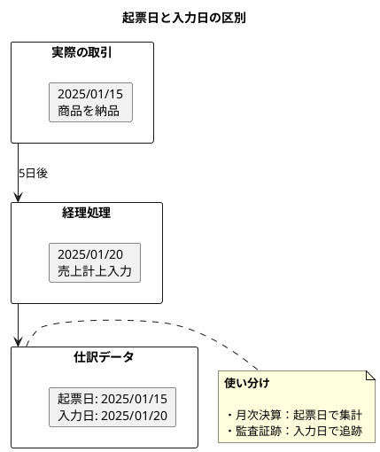

### 決算仕訳フラグ

| 値 | 意味 | 用途 |
|----|------|------|
| 0 | 通常仕訳 | 日常の取引 |
| 1 | 決算仕訳 | 決算整理仕訳（減価償却、引当金など） |

```java
// 決算仕訳を除外した集計
String sql = """
    SELECT 勘定科目コード, SUM(仕訳金額) as 合計
    FROM 仕訳貸借明細 jdi
    JOIN 仕訳 j ON jdi.仕訳伝票番号 = j.仕訳伝票番号
    WHERE j.決算仕訳フラグ = 0  -- 通常仕訳のみ
    GROUP BY 勘定科目コード
    """;
```

### 単振フラグ

| 値 | 意味 | 構造 |
|----|------|------|
| 0 | 複合仕訳 | 複数の明細行を持つ |
| 1 | 単一仕訳 | 1つの明細行（1借方:1貸方） |

---

## 6.5 赤黒処理の設計

### 赤黒処理とは

仕訳の修正方法として、**赤黒処理**があります。これは、元の仕訳を赤伝票（マイナス仕訳）で取り消し、正しい仕訳を黒伝票で入力する方法です。

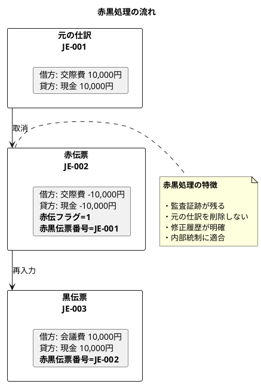

### CHECK 制約による保証

```sql
-- 赤伝票の場合は赤黒伝票番号が必須
ALTER TABLE "仕訳"
  ADD CONSTRAINT check_red_slip_voucher
  CHECK (
    ("赤伝フラグ" = 0)
    OR
    ("赤伝フラグ" = 1 AND "赤黒伝票番号" IS NOT NULL)
  );
```

---

## 6.6 多通貨対応と消費税管理

### 多通貨対応

外貨建て取引を記録するための項目を設けています。

| 項目 | 説明 | 例 |
|------|------|-----|
| 通貨コード | ISO 4217 通貨コード | JPY, USD, EUR |
| 為替レート | 基軸通貨への換算レート | 1.0000（JPY）, 150.5000（USD→JPY） |
| 仕訳金額 | 取引通貨での金額 | 1,000.00 USD |
| 基軸換算仕訳金額 | 基軸通貨での金額 | 150,500.00 JPY |

```java
// 外貨建て取引の登録例
jdbcTemplate.update("""
    INSERT INTO "仕訳貸借明細" (
        "仕訳伝票番号", "仕訳行番号", "仕訳行貸借区分",
        "通貨コード", "為替レート", "勘定科目コード",
        "仕訳金額", "基軸換算仕訳金額", "資金繰フラグ"
    ) VALUES (?, 1, 'D', 'USD', 150.50, '1130', 1000.00, 150500.00, 0)
    """, journalNo);
```

### 消費税管理

| 項目 | 説明 | 値の例 |
|------|------|--------|
| 消費税区分 | 課税/非課税/免税/不課税 | 01=課税, 02=非課税 |
| 消費税率 | 適用税率 | 10, 8（軽減税率） |
| 消費税計算区分 | 内税/外税 | 01=外税, 02=内税 |

---

## 6.7 多次元管理

### 部門・プロジェクト・セグメント

仕訳貸借明細に多次元の管理項目を持たせることで、様々な切り口での集計が可能になります。

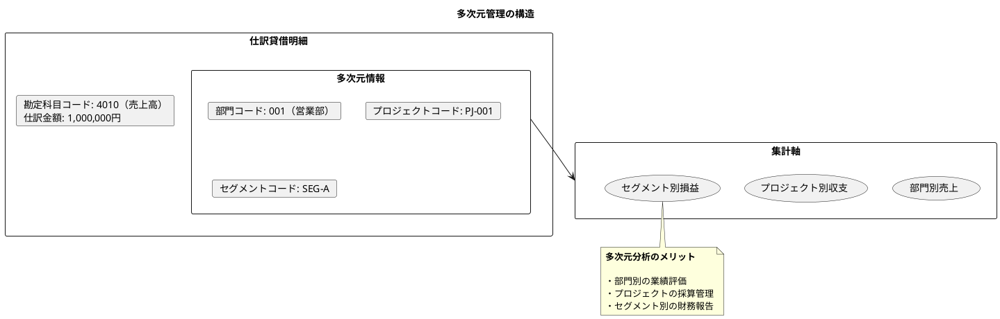

---

## 6.8 自動仕訳テーブルの設計

### フラグ管理方式 vs 日付管理方式

自動仕訳には主に2つの管理方式があります。

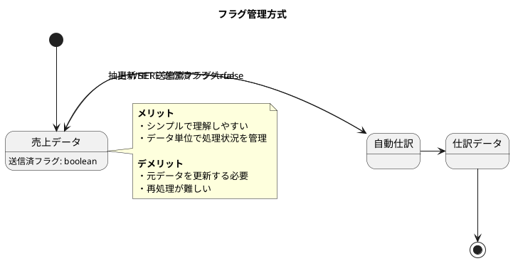

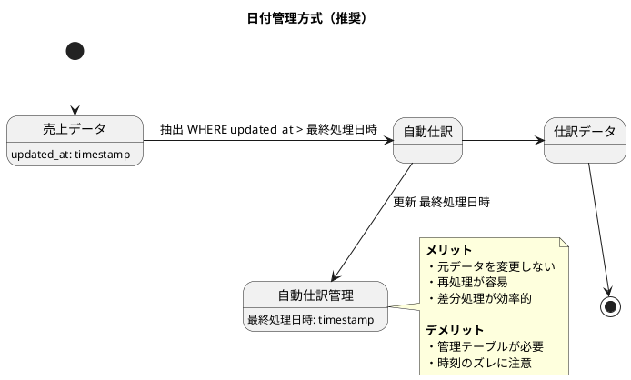

### 自動仕訳スキーマ

日付管理方式を採用した自動仕訳テーブルの ER 図：

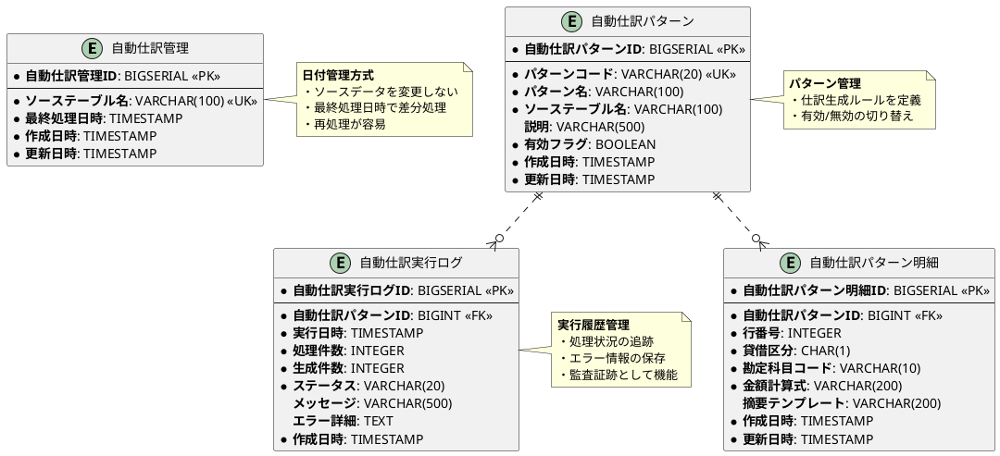

### 自動仕訳テーブルの DDL

`src/main/resources/db/migration/V011__create_auto_journal.sql`:

```sql
-- ==========================================
-- 自動仕訳テーブルの作成
-- ==========================================

-- 1. 自動仕訳管理テーブル
CREATE TABLE IF NOT EXISTS "自動仕訳管理" (
    "自動仕訳管理ID" BIGSERIAL PRIMARY KEY,
    "ソーステーブル名" VARCHAR(100) NOT NULL UNIQUE,
    "最終処理日時" TIMESTAMP NOT NULL,
    "作成日時" TIMESTAMP DEFAULT CURRENT_TIMESTAMP NOT NULL,
    "更新日時" TIMESTAMP DEFAULT CURRENT_TIMESTAMP NOT NULL
);

COMMENT ON TABLE "自動仕訳管理" IS '自動仕訳の処理状況を管理';
COMMENT ON COLUMN "自動仕訳管理"."ソーステーブル名" IS '処理対象のソーステーブル名';
COMMENT ON COLUMN "自動仕訳管理"."最終処理日時" IS '最終処理日時';

-- 2. 自動仕訳パターンテーブル
CREATE TABLE IF NOT EXISTS "自動仕訳パターン" (
    "自動仕訳パターンID" BIGSERIAL PRIMARY KEY,
    "パターンコード" VARCHAR(20) NOT NULL UNIQUE,
    "パターン名" VARCHAR(100) NOT NULL,
    "ソーステーブル名" VARCHAR(100) NOT NULL,
    "説明" VARCHAR(500),
    "有効フラグ" BOOLEAN DEFAULT true NOT NULL,
    "作成日時" TIMESTAMP DEFAULT CURRENT_TIMESTAMP NOT NULL,
    "更新日時" TIMESTAMP DEFAULT CURRENT_TIMESTAMP NOT NULL
);

COMMENT ON TABLE "自動仕訳パターン" IS '自動仕訳の生成パターン定義';
COMMENT ON COLUMN "自動仕訳パターン"."パターンコード" IS 'パターン識別コード';
COMMENT ON COLUMN "自動仕訳パターン"."有効フラグ" IS '有効/無効の切り替え';

-- 3. 自動仕訳パターン明細テーブル
CREATE TABLE IF NOT EXISTS "自動仕訳パターン明細" (
    "自動仕訳パターン明細ID" BIGSERIAL PRIMARY KEY,
    "自動仕訳パターンID" BIGINT NOT NULL,
    "行番号" INTEGER NOT NULL,
    "貸借区分" CHAR(1) NOT NULL,
    "勘定科目コード" VARCHAR(10) NOT NULL,
    "金額計算式" VARCHAR(200) NOT NULL,
    "摘要テンプレート" VARCHAR(200),
    "作成日時" TIMESTAMP DEFAULT CURRENT_TIMESTAMP NOT NULL,
    "更新日時" TIMESTAMP DEFAULT CURRENT_TIMESTAMP NOT NULL,
    FOREIGN KEY ("自動仕訳パターンID") REFERENCES "自動仕訳パターン" ("自動仕訳パターンID") ON DELETE CASCADE,
    FOREIGN KEY ("勘定科目コード") REFERENCES "勘定科目マスタ" ("勘定科目コード"),
    CONSTRAINT "check_貸借区分" CHECK ("貸借区分" IN ('D', 'C'))
);

COMMENT ON TABLE "自動仕訳パターン明細" IS '自動仕訳パターンの借方・貸方明細';
COMMENT ON COLUMN "自動仕訳パターン明細"."金額計算式" IS '金額計算式（例: 売上金額 * 1.10）';
COMMENT ON COLUMN "自動仕訳パターン明細"."貸借区分" IS 'D=借方、C=貸方';

-- 4. 自動仕訳実行ログテーブル
CREATE TABLE IF NOT EXISTS "自動仕訳実行ログ" (
    "自動仕訳実行ログID" BIGSERIAL PRIMARY KEY,
    "自動仕訳パターンID" BIGINT NOT NULL,
    "実行日時" TIMESTAMP NOT NULL,
    "処理件数" INTEGER NOT NULL DEFAULT 0,
    "生成件数" INTEGER NOT NULL DEFAULT 0,
    "ステータス" VARCHAR(20) NOT NULL,
    "メッセージ" VARCHAR(500),
    "エラー詳細" TEXT,
    "作成日時" TIMESTAMP DEFAULT CURRENT_TIMESTAMP NOT NULL,
    FOREIGN KEY ("自動仕訳パターンID") REFERENCES "自動仕訳パターン" ("自動仕訳パターンID"),
    CONSTRAINT "check_ステータス" CHECK ("ステータス" IN ('成功', '一部成功', '失敗'))
);

COMMENT ON TABLE "自動仕訳実行ログ" IS '自動仕訳の実行履歴';
COMMENT ON COLUMN "自動仕訳実行ログ"."ステータス" IS '成功, 一部成功, 失敗';

-- インデックス作成
CREATE INDEX "idx_自動仕訳パターン_ソース" ON "自動仕訳パターン"("ソーステーブル名");
CREATE INDEX "idx_自動仕訳実行ログ_パターン" ON "自動仕訳実行ログ"("自動仕訳パターンID");
CREATE INDEX "idx_自動仕訳実行ログ_実行日時" ON "自動仕訳実行ログ"("実行日時");
```

---

## 6.9 複式簿記の原理をデータベースで保証する

### 仕訳残高チェックビュー

```sql
-- 仕訳ごとの借方・貸方の合計を算出するビュー
CREATE OR REPLACE VIEW 仕訳残高チェック AS
SELECT
  "仕訳伝票番号",
  SUM(CASE WHEN "仕訳行貸借区分" = 'D' THEN "仕訳金額" ELSE 0 END) AS 借方合計,
  SUM(CASE WHEN "仕訳行貸借区分" = 'C' THEN "仕訳金額" ELSE 0 END) AS 貸方合計,
  SUM(CASE WHEN "仕訳行貸借区分" = 'D' THEN "仕訳金額" ELSE 0 END) -
  SUM(CASE WHEN "仕訳行貸借区分" = 'C' THEN "仕訳金額" ELSE 0 END) AS 差額
FROM "仕訳貸借明細"
GROUP BY "仕訳伝票番号";
```

### 複式簿記チェック関数

```sql
-- 差額が0でない仕訳を検出する関数
CREATE OR REPLACE FUNCTION 複式簿記チェック()
RETURNS TABLE(不整合伝票番号 VARCHAR(20), 差額 DECIMAL) AS $$
BEGIN
  RETURN QUERY
  SELECT "仕訳伝票番号", (借方合計 - 貸方合計) as 差額
  FROM 仕訳残高チェック
  WHERE 借方合計 != 貸方合計;
END;
$$ LANGUAGE plpgsql;
```

**使用例**:

```sql
-- 複式簿記の原理に違反する仕訳を検出
SELECT * FROM 複式簿記チェック();
```

---

## 6.10 セット中心のアプリケーション設計

大量データを処理する際は、ループ処理よりもセット中心処理（一括処理）の方が効率的です。

### ループ処理 vs セット中心処理

```java
// 非効率：1件ずつ INSERT
@Transactional
public void generateJournalsFromSales_Loop(List<SalesData> salesList) {
    for (SalesData sales : salesList) {
        AutoJournalPattern pattern = patternRepository.findByCode("SALES_001");
        Journal journal = convertToJournal(sales, pattern);
        journalRepository.insert(journal);  // ← N回のDBアクセス
    }
}

// 効率的：一括 INSERT
@Transactional
public void generateJournalsFromSales_Batch(LocalDateTime lastProcessedAt) {
    String sql = """
        INSERT INTO "仕訳" (仕訳伝票番号, 起票日, ...)
        SELECT CONCAT('SA-', s.sales_no), s.sales_date, ...
        FROM sales_data s
        WHERE s.updated_at > ?
        """;

    jdbcTemplate.update(sql, lastProcessedAt);  // ← 1回のDBアクセス
}
```

---

## 6.11 勘定科目別残高テーブルの設計

### 残高管理の全体像

仕訳データを蓄積するだけでなく、勘定科目別の残高を効率的に管理する仕組みが必要です。

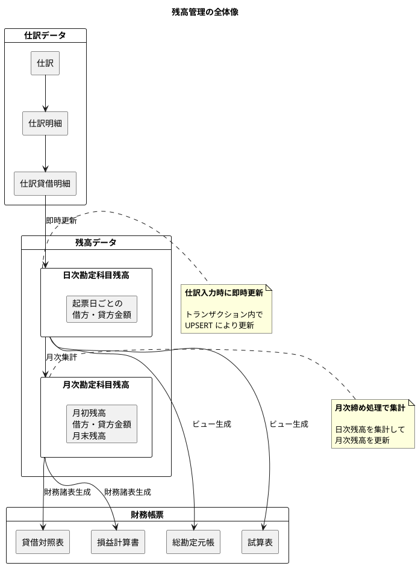

### 残高管理の重要性

| 観点 | 説明 |
|------|------|
| 高速な照会 | 仕訳データを毎回集計するのではなく、残高テーブルから即座に照会 |
| リアルタイム更新 | 仕訳入力時に残高も同時に更新することで、常に最新の状態を維持 |
| 多次元分析 | 部門別・プロジェクト別の残高を効率的に管理 |
| 財務諸表の基礎 | 残高データから貸借対照表や試算表を高速に生成 |

---

## 6.12 日次勘定科目残高テーブル

### ER 図

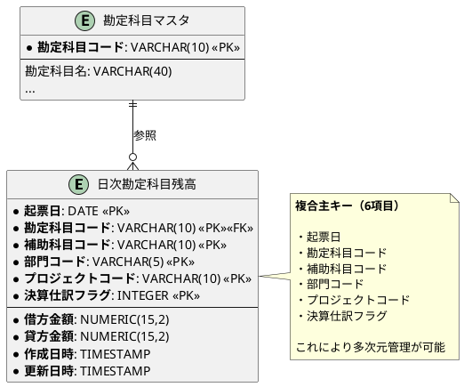

### DDL

`src/main/resources/db/migration/V012__create_daily_account_balance.sql`:

```sql
-- ==========================================
-- 日次勘定科目残高テーブルの作成
-- ==========================================

CREATE TABLE IF NOT EXISTS "日次勘定科目残高" (
    "起票日" DATE NOT NULL,
    "勘定科目コード" VARCHAR(10) NOT NULL,
    "補助科目コード" VARCHAR(10) NOT NULL DEFAULT '',
    "部門コード" VARCHAR(5) NOT NULL DEFAULT '',
    "プロジェクトコード" VARCHAR(10) NOT NULL DEFAULT '',
    "決算仕訳フラグ" INTEGER NOT NULL DEFAULT 0,
    "借方金額" NUMERIC(15,2) NOT NULL DEFAULT 0,
    "貸方金額" NUMERIC(15,2) NOT NULL DEFAULT 0,
    "作成日時" TIMESTAMP DEFAULT CURRENT_TIMESTAMP NOT NULL,
    "更新日時" TIMESTAMP DEFAULT CURRENT_TIMESTAMP NOT NULL,
    PRIMARY KEY (
        "起票日",
        "勘定科目コード",
        "補助科目コード",
        "部門コード",
        "プロジェクトコード",
        "決算仕訳フラグ"
    ),
    FOREIGN KEY ("勘定科目コード")
        REFERENCES "勘定科目マスタ" ("勘定科目コード")
);

-- インデックス作成
CREATE INDEX "idx_日次勘定科目残高_起票日" ON "日次勘定科目残高"("起票日");
CREATE INDEX "idx_日次勘定科目残高_勘定科目" ON "日次勘定科目残高"("勘定科目コード");
CREATE INDEX "idx_日次勘定科目残高_部門" ON "日次勘定科目残高"("部門コード");
CREATE INDEX "idx_日次勘定科目残高_プロジェクト" ON "日次勘定科目残高"("プロジェクトコード");

-- CHECK制約
ALTER TABLE "日次勘定科目残高"
  ADD CONSTRAINT "check_日次残高_借方金額"
  CHECK ("借方金額" >= 0);

ALTER TABLE "日次勘定科目残高"
  ADD CONSTRAINT "check_日次残高_貸方金額"
  CHECK ("貸方金額" >= 0);

ALTER TABLE "日次勘定科目残高"
  ADD CONSTRAINT "check_日次残高_決算仕訳フラグ"
  CHECK ("決算仕訳フラグ" IN (0, 1));

-- コメント追加
COMMENT ON TABLE "日次勘定科目残高" IS '日次勘定科目残高（日ごとの借方・貸方金額を記録）';
COMMENT ON COLUMN "日次勘定科目残高"."起票日" IS '実際の取引発生日';
COMMENT ON COLUMN "日次勘定科目残高"."補助科目コード" IS '補助科目（得意先、仕入先など）';
COMMENT ON COLUMN "日次勘定科目残高"."部門コード" IS '部門別管理用';
COMMENT ON COLUMN "日次勘定科目残高"."プロジェクトコード" IS 'プロジェクト別管理用';
COMMENT ON COLUMN "日次勘定科目残高"."決算仕訳フラグ" IS '0=通常仕訳、1=決算仕訳';
```

### 設計のポイント

| ポイント | 説明 |
|---------|------|
| 複合主キー | 6項目による多次元管理（起票日 + 勘定科目 + 補助科目 + 部門 + プロジェクト + 決算フラグ） |
| デフォルト値 | 補助科目・部門・プロジェクトは空文字列がデフォルト |
| 外部キー制約 | 勘定科目マスタとの参照整合性を保証 |
| CHECK 制約 | 金額は非負、決算仕訳フラグは 0 または 1 |

---

## 6.13 月次勘定科目残高テーブル

### DDL

`src/main/resources/db/migration/V013__create_monthly_account_balance.sql`:

```sql
-- ==========================================
-- 月次勘定科目残高テーブルの作成
-- ==========================================

CREATE TABLE IF NOT EXISTS "月次勘定科目残高" (
    "決算期" INTEGER NOT NULL,
    "月度" INTEGER NOT NULL,
    "勘定科目コード" VARCHAR(10) NOT NULL,
    "補助科目コード" VARCHAR(10) NOT NULL DEFAULT '',
    "部門コード" VARCHAR(5) NOT NULL DEFAULT '',
    "プロジェクトコード" VARCHAR(10) NOT NULL DEFAULT '',
    "決算仕訳フラグ" INTEGER NOT NULL DEFAULT 0,
    "月初残高" NUMERIC(15,2) NOT NULL DEFAULT 0,
    "借方金額" NUMERIC(15,2) NOT NULL DEFAULT 0,
    "貸方金額" NUMERIC(15,2) NOT NULL DEFAULT 0,
    "月末残高" NUMERIC(15,2) NOT NULL DEFAULT 0,
    "作成日時" TIMESTAMP DEFAULT CURRENT_TIMESTAMP NOT NULL,
    "更新日時" TIMESTAMP DEFAULT CURRENT_TIMESTAMP NOT NULL,
    PRIMARY KEY (
        "決算期",
        "月度",
        "勘定科目コード",
        "補助科目コード",
        "部門コード",
        "プロジェクトコード",
        "決算仕訳フラグ"
    ),
    FOREIGN KEY ("勘定科目コード")
        REFERENCES "勘定科目マスタ" ("勘定科目コード")
);

-- インデックス作成
CREATE INDEX "idx_月次勘定科目残高_決算期月度" ON "月次勘定科目残高"("決算期", "月度");
CREATE INDEX "idx_月次勘定科目残高_勘定科目" ON "月次勘定科目残高"("勘定科目コード");

-- CHECK制約
ALTER TABLE "月次勘定科目残高"
  ADD CONSTRAINT "check_月次残高_月度範囲"
  CHECK ("月度" >= 1 AND "月度" <= 12);

-- コメント追加
COMMENT ON TABLE "月次勘定科目残高" IS '月次勘定科目残高（月ごとの月初残高・借方・貸方金額・月末残高を記録）';
COMMENT ON COLUMN "月次勘定科目残高"."決算期" IS '会計年度（例：2025）';
COMMENT ON COLUMN "月次勘定科目残高"."月度" IS '月度（1〜12）';
COMMENT ON COLUMN "月次勘定科目残高"."月初残高" IS '月初時点の残高';
COMMENT ON COLUMN "月次勘定科目残高"."月末残高" IS '月末時点の残高（月初残高 + 借方金額 - 貸方金額）';
```

### 月次残高の計算式

```
月末残高 = 月初残高 + 借方金額 - 貸方金額
```

---

## 6.14 仕訳入力時の残高即時更新

### UPSERT による効率的な更新

仕訳登録と同時に日次残高を更新するサービスを実装します。

```java
package com.example.accounting.balance;

import lombok.RequiredArgsConstructor;
import org.springframework.jdbc.core.JdbcTemplate;
import org.springframework.stereotype.Service;
import org.springframework.transaction.annotation.Transactional;

import java.math.BigDecimal;
import java.time.LocalDate;

/**
 * 残高管理サービス
 */
@Service
@RequiredArgsConstructor
public class BalanceService {

    private final JdbcTemplate jdbcTemplate;

    /**
     * 日次残高を更新（UPSERT）
     */
    @Transactional
    public void updateDailyBalance(
            LocalDate entryDate,
            String accountCode,
            String subAccountCode,
            String departmentCode,
            String projectCode,
            Integer settlementFlag,
            BigDecimal debitAmount,
            BigDecimal creditAmount) {

        // PostgreSQL の ON CONFLICT ... DO UPDATE を使用
        String sql = """
            INSERT INTO "日次勘定科目残高" (
                "起票日", "勘定科目コード", "補助科目コード", "部門コード",
                "プロジェクトコード", "決算仕訳フラグ", "借方金額", "貸方金額"
            ) VALUES (?, ?, ?, ?, ?, ?, ?, ?)
            ON CONFLICT (
                "起票日", "勘定科目コード", "補助科目コード",
                "部門コード", "プロジェクトコード", "決算仕訳フラグ"
            )
            DO UPDATE SET
                "借方金額" = "日次勘定科目残高"."借方金額" + EXCLUDED."借方金額",
                "貸方金額" = "日次勘定科目残高"."貸方金額" + EXCLUDED."貸方金額",
                "更新日時" = CURRENT_TIMESTAMP
            """;

        jdbcTemplate.update(sql,
                entryDate,
                accountCode,
                subAccountCode != null ? subAccountCode : "",
                departmentCode != null ? departmentCode : "",
                projectCode != null ? projectCode : "",
                settlementFlag != null ? settlementFlag : 0,
                debitAmount,
                creditAmount);
    }
}
```

### UPSERT のポイント

| 項目 | 説明 |
|------|------|
| ON CONFLICT | 同じキーが存在する場合の動作を指定 |
| DO UPDATE SET | 既存レコードに金額を加算 |
| EXCLUDED | INSERT しようとした値を参照 |
| @Transactional | 仕訳登録と残高更新を同一トランザクションで実行 |

---

## 6.15 総勘定元帳と試算表のビュー

### 総勘定元帳ビュー

残高テーブルから総勘定元帳を生成する PostgreSQL ビューを作成します。

```sql
-- ==========================================
-- 総勘定元帳ビュー
-- ==========================================

CREATE OR REPLACE VIEW "総勘定元帳" AS
SELECT
    d."起票日",
    a."勘定科目コード",
    a."勘定科目名",
    a."BSPL区分",
    d."補助科目コード",
    d."部門コード",
    d."プロジェクトコード",
    d."借方金額",
    d."貸方金額",
    -- ウィンドウ関数で累積残高を計算
    SUM(d."借方金額" - d."貸方金額") OVER (
        PARTITION BY d."勘定科目コード", d."補助科目コード", d."部門コード", d."プロジェクトコード"
        ORDER BY d."起票日"
        ROWS BETWEEN UNBOUNDED PRECEDING AND CURRENT ROW
    ) as "残高"
FROM "日次勘定科目残高" d
INNER JOIN "勘定科目マスタ" a ON d."勘定科目コード" = a."勘定科目コード"
WHERE d."決算仕訳フラグ" = 0  -- 通常仕訳のみ
ORDER BY d."勘定科目コード", d."起票日";

COMMENT ON VIEW "総勘定元帳" IS '総勘定元帳（日次残高から生成される勘定科目ごとの取引履歴）';
```

### 試算表ビュー

```sql
-- ==========================================
-- 試算表ビュー
-- ==========================================

CREATE OR REPLACE VIEW "試算表" AS
SELECT
    a."勘定科目コード",
    a."勘定科目名",
    a."BSPL区分",
    a."貸借区分",
    COALESCE(SUM(d."借方金額"), 0) as "借方合計",
    COALESCE(SUM(d."貸方金額"), 0) as "貸方合計",
    -- 貸借区分に応じて残高を計算
    CASE
        WHEN a."貸借区分" = '借' THEN
            COALESCE(SUM(d."借方金額"), 0) - COALESCE(SUM(d."貸方金額"), 0)
        ELSE
            COALESCE(SUM(d."貸方金額"), 0) - COALESCE(SUM(d."借方金額"), 0)
    END as "残高"
FROM "勘定科目マスタ" a
LEFT JOIN "日次勘定科目残高" d
    ON a."勘定科目コード" = d."勘定科目コード"
    AND d."決算仕訳フラグ" = 0  -- 通常仕訳のみ
GROUP BY a."勘定科目コード", a."勘定科目名", a."BSPL区分", a."貸借区分"
ORDER BY a."勘定科目コード";

COMMENT ON VIEW "試算表" IS '試算表（全勘定科目の残高一覧）';
```

### ビューのポイント

| ビュー | 特徴 |
|--------|------|
| 総勘定元帳 | ウィンドウ関数 `SUM() OVER()` で累積残高を計算 |
| 試算表 | 勘定科目マスタ全科目に LEFT JOIN で残高を集計 |

---

## 6.16 残高管理の ER 図（全体像）

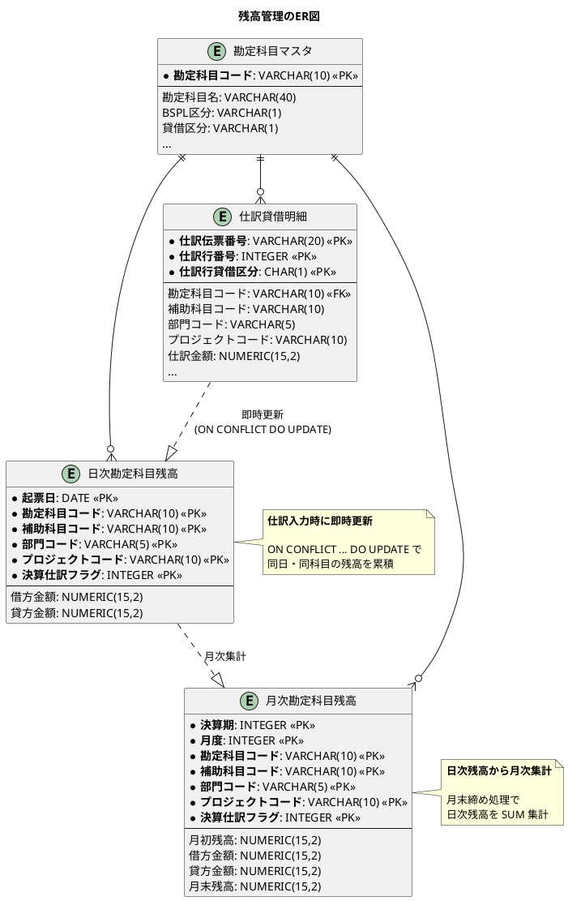

---

## 6.17 主要テーブル一覧

| テーブル名 | 説明 | 主キー |
|-----------|------|--------|
| 仕訳 | 仕訳ヘッダー（伝票単位の基本情報） | 仕訳伝票番号 |
| 仕訳明細 | 仕訳明細（行単位の情報） | 仕訳伝票番号 + 仕訳行番号 |
| 仕訳貸借明細 | 仕訳貸借明細（借方・貸方の詳細） | 仕訳伝票番号 + 仕訳行番号 + 仕訳行貸借区分 |
| 自動仕訳管理 | 自動仕訳の処理状況管理 | 自動仕訳管理ID |
| 自動仕訳パターン | 自動仕訳の生成パターン定義 | 自動仕訳パターンID |
| 自動仕訳パターン明細 | パターンの借方・貸方明細 | 自動仕訳パターン明細ID |
| 自動仕訳実行ログ | 自動仕訳の実行履歴 | 自動仕訳実行ログID |
| 日次勘定科目残高 | 日ごとの借方・貸方金額 | 起票日 + 勘定科目コード + 補助科目コード + 部門コード + プロジェクトコード + 決算仕訳フラグ |
| 月次勘定科目残高 | 月ごとの月初残高・借方・貸方・月末残高 | 決算期 + 月度 + 勘定科目コード + 補助科目コード + 部門コード + プロジェクトコード + 決算仕訳フラグ |

---

## まとめ

本章では、財務会計システムの核心である仕訳テーブルの3層構造設計、自動仕訳テーブル、および勘定科目別残高テーブルの設計を行いました。

### 設計のポイント

1. **3層構造**: 仕訳 + 仕訳明細 + 仕訳貸借明細による柔軟な管理
2. **複式簿記の原理**: 「借方合計 = 貸方合計」をデータモデルとテストで表現
3. **実務項目**: 起票日/入力日、決算仕訳フラグ、赤黒処理
4. **多通貨対応**: 通貨コード、為替レート、基軸換算金額
5. **消費税管理**: 消費税区分、税率、計算区分
6. **多次元管理**: 部門、プロジェクト、セグメント
7. **自動仕訳**: 日付管理方式による柔軟で再処理可能な設計
8. **データ整合性**: CHECK 制約、ビュー、関数による品質保証
9. **残高即時更新**: UPSERT（ON CONFLICT DO UPDATE）による効率的な更新
10. **財務帳票生成**: ウィンドウ関数による総勘定元帳・試算表の動的生成

### 達成したこと

- 複式簿記の原理をデータベーススキーマで表現
- 実務で必要な多通貨・消費税・多次元管理に対応
- 赤黒処理による監査証跡の確保
- 自動仕訳による他システム連携の基盤構築
- PostgreSQL の機能を活用したデータ品質の保証
- 仕訳入力時の残高即時更新により、常に最新の残高を維持
- 複合主キーによる多次元管理（部門・プロジェクト・補助科目）
- ビューによる総勘定元帳と試算表の動的生成

### 次のステップ

第7章では、これらのデータモデルをドメインモデルにどのように対応させるかを解説します。貧血ドメインモデルからリッチドメインモデルへの進化過程と、MyBatis によるマッピングについて学びます。
