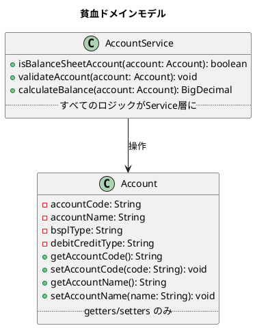
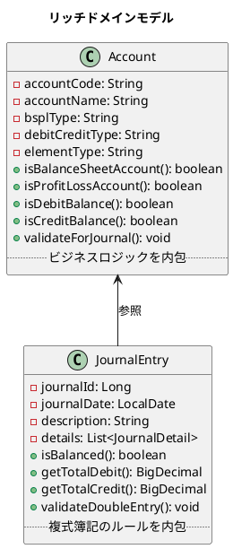
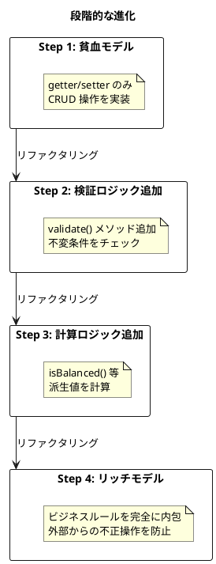
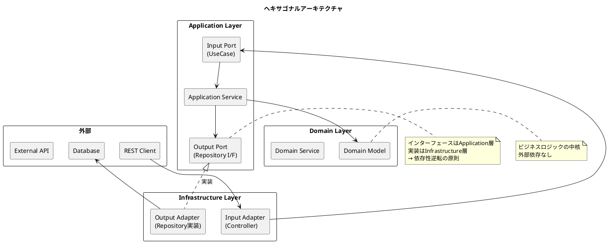
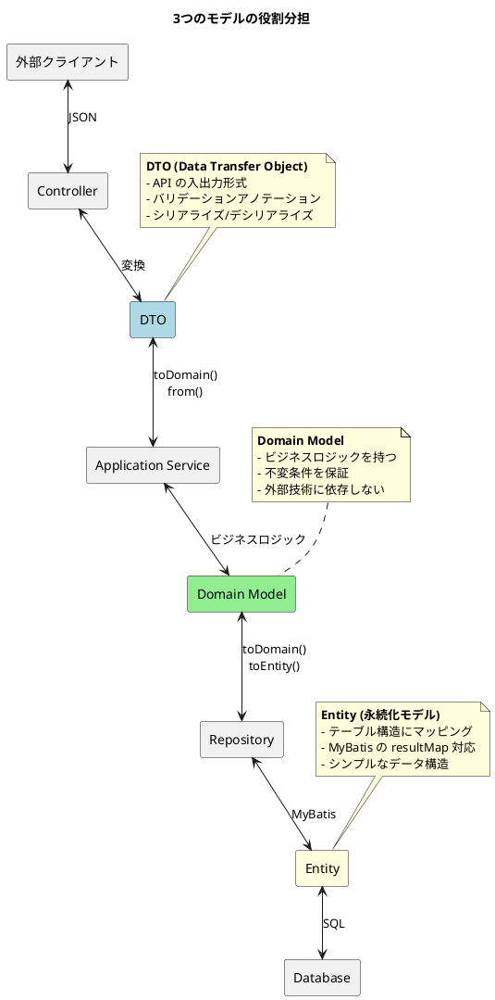
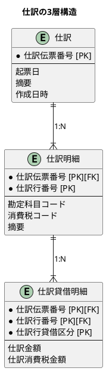
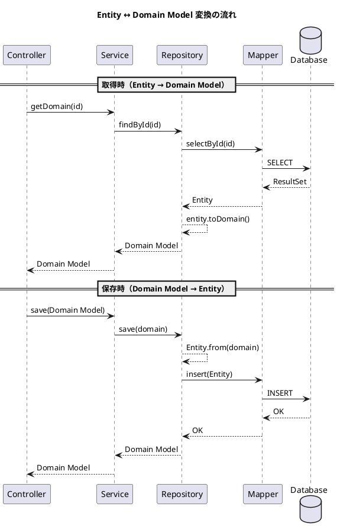
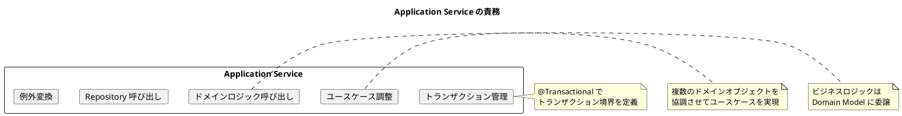

# 第7章: ドメインモデルとデータモデルの対応

## 7.1 貧血ドメインモデルとリッチドメインモデル

### 貧血ドメインモデルとは

貧血ドメインモデル（Anemic Domain Model）は、ドメインオブジェクトがデータのみを保持し、ビジネスロジックを持たない設計パターンです。



**貧血ドメインモデルの特徴**:

| 特徴 | 説明 |
|------|------|
| データ中心 | getter/setter のみを持つ「データ袋」 |
| ロジック外出し | ビジネスロジックは Service 層に集中 |
| 手続き的 | オブジェクト指向というより手続き型プログラミング |
| テスト困難 | Service 層のテストに多くのモックが必要 |

### リッチドメインモデルとは

リッチドメインモデル（Rich Domain Model）は、ドメインオブジェクトがデータとビジネスロジックの両方を持つ設計パターンです。



**リッチドメインモデルの特徴**:

| 特徴 | 説明 |
|------|------|
| 振る舞い中心 | データとロジックが一体化 |
| 自己完結 | オブジェクト自身がビジネスルールを知っている |
| オブジェクト指向 | カプセル化、ポリモーフィズムを活用 |
| テスト容易 | ドメインオブジェクト単体でテスト可能 |

### 貧血からリッチへの進化

TDD サイクルを通じて、貧血ドメインモデルからリッチドメインモデルへ進化させます。



---

## 7.2 ヘキサゴナルアーキテクチャの各層

### アーキテクチャ概要

ヘキサゴナルアーキテクチャ（Ports and Adapters）では、ドメインモデルを中心に配置し、外部との接続点を Port と Adapter で抽象化します。



### パッケージ構造

```
com.example.accounting
├── domain/                          # ドメイン層
│   ├── model/
│   │   ├── account/
│   │   │   ├── Account.java         # ドメインモデル
│   │   │   └── AccountType.java     # 値オブジェクト
│   │   └── journal/
│   │       ├── JournalEntry.java    # 集約ルート
│   │       └── JournalDetail.java   # エンティティ
│   ├── service/
│   │   └── BalanceCalculator.java   # ドメインサービス
│   ├── exception/
│   │   └── InvalidJournalException.java
│   └── type/                        # 共通型（値オブジェクト）
│       ├── Money.java
│       └── AccountingPeriod.java
│
├── application/                     # アプリケーション層
│   ├── port/
│   │   ├── in/
│   │   │   └── AccountUseCase.java  # Input Port
│   │   └── out/
│   │       └── AccountRepository.java  # Output Port
│   └── service/
│       └── AccountService.java      # Application Service
│
└── infrastructure/                  # インフラストラクチャ層
    ├── persistence/
    │   ├── entity/
    │   │   └── AccountEntity.java   # MyBatis Entity
    │   ├── mapper/
    │   │   └── AccountMapper.java   # MyBatis Mapper
    │   └── repository/
    │       └── AccountRepositoryImpl.java  # Output Adapter
    └── web/
        ├── controller/
        │   └── AccountController.java  # Input Adapter
        └── dto/
            ├── AccountRequest.java
            └── AccountResponse.java
```

### 各層の責務

| 層 | 責務 | 依存方向 |
|----|------|----------|
| Domain | ビジネスロジックの表現 | 依存なし |
| Application | ユースケースの調整 | Domain に依存 |
| Infrastructure | 外部システムとの接続 | Application, Domain に依存 |

---

## 7.3 Entity と Domain Model と DTO の違い

### 3つのモデルの役割



### コード例: 勘定科目

**DTO (Request/Response)**:

```java
// infrastructure/web/dto/AccountRequest.java
@Data
public class AccountRequest {
    @NotBlank(message = "勘定科目コードは必須です")
    @Size(max = 10)
    private String accountCode;

    @NotBlank(message = "勘定科目名は必須です")
    @Size(max = 50)
    private String accountName;

    @NotBlank
    @Pattern(regexp = "B|P", message = "B/S または P/L を指定してください")
    private String bsplType;

    @NotBlank
    @Pattern(regexp = "借|貸", message = "借方 または 貸方 を指定してください")
    private String debitCreditType;

    @NotBlank
    private String elementType;

    /**
     * DTO から Domain Model への変換
     */
    public Account toDomain() {
        return new Account(
                accountCode,
                accountName,
                null,  // accountAbbr
                null,  // accountKana
                bsplType,
                debitCreditType,
                elementType,
                null   // displayOrder
        );
    }
}
```

**Domain Model**:

```java
// domain/model/account/Account.java
@Value
@With
public class Account {
    String accountCode;
    String accountName;
    String accountAbbr;
    String accountKana;
    String bsplType;
    String debitCreditType;
    String elementType;
    Integer displayOrder;

    /**
     * 貸借対照表科目かどうか
     */
    public boolean isBalanceSheetAccount() {
        return "B".equals(bsplType);
    }

    /**
     * 損益計算書科目かどうか
     */
    public boolean isProfitLossAccount() {
        return "P".equals(bsplType);
    }

    /**
     * 借方残高科目かどうか
     */
    public boolean isDebitBalance() {
        return "借".equals(debitCreditType);
    }

    /**
     * 貸方残高科目かどうか
     */
    public boolean isCreditBalance() {
        return "貸".equals(debitCreditType);
    }

    /**
     * 資産科目かどうか
     */
    public boolean isAsset() {
        return "資産".equals(elementType);
    }

    /**
     * 負債科目かどうか
     */
    public boolean isLiability() {
        return "負債".equals(elementType);
    }
}
```

**Entity (永続化モデル)**:

```java
// infrastructure/persistence/entity/AccountEntity.java
@Data
public class AccountEntity {
    private String accountCode;
    private String accountName;
    private String accountAbbr;
    private String accountKana;
    private String bsplType;
    private String debitCreditType;
    private String elementType;
    private Integer displayOrder;
    private LocalDateTime createdAt;
    private LocalDateTime updatedAt;

    /**
     * Entity から Domain Model への変換
     */
    public Account toDomain() {
        return new Account(
                accountCode,
                accountName,
                accountAbbr,
                accountKana,
                bsplType,
                debitCreditType,
                elementType,
                displayOrder
        );
    }

    /**
     * Domain Model から Entity への変換
     */
    public static AccountEntity from(Account account) {
        AccountEntity entity = new AccountEntity();
        entity.setAccountCode(account.getAccountCode());
        entity.setAccountName(account.getAccountName());
        entity.setAccountAbbr(account.getAccountAbbr());
        entity.setAccountKana(account.getAccountKana());
        entity.setBsplType(account.getBsplType());
        entity.setDebitCreditType(account.getDebitCreditType());
        entity.setElementType(account.getElementType());
        entity.setDisplayOrder(account.getDisplayOrder());
        return entity;
    }
}
```

---

## 7.4 Repository パターン（Output Port/Adapter）

### Output Port の定義

Repository インターフェースを Application 層に配置し、Domain Model を操作します。

```java
// application/port/out/AccountRepository.java
public interface AccountRepository {
    /**
     * 全件取得
     */
    List<Account> findAll();

    /**
     * コードで検索
     */
    Optional<Account> findByCode(String accountCode);

    /**
     * B/S/P/L 種別で検索
     */
    List<Account> findByBsplType(String bsplType);

    /**
     * 保存（新規/更新）
     */
    Account save(Account account);

    /**
     * 削除
     */
    void deleteByCode(String accountCode);
}
```

**ポイント**:
- インターフェースは Application 層に配置
- 戻り値・引数は Domain Model
- Entity やデータベース固有の型は使わない
- 依存性逆転の原則（DIP）を適用

### Output Adapter の実装

Repository の実装を Infrastructure 層に配置し、MyBatis Mapper を使用します。

```java
// infrastructure/persistence/repository/AccountRepositoryImpl.java
@Repository
@RequiredArgsConstructor
public class AccountRepositoryImpl implements AccountRepository {

    private final AccountMapper accountMapper;  // MyBatis Mapper

    @Override
    public List<Account> findAll() {
        return accountMapper.selectAll()
                .stream()
                .map(AccountEntity::toDomain)
                .collect(Collectors.toList());
    }

    @Override
    public Optional<Account> findByCode(String accountCode) {
        AccountEntity entity = accountMapper.selectByCode(accountCode);
        return Optional.ofNullable(entity)
                .map(AccountEntity::toDomain);
    }

    @Override
    public List<Account> findByBsplType(String bsplType) {
        return accountMapper.selectByBsplType(bsplType)
                .stream()
                .map(AccountEntity::toDomain)
                .collect(Collectors.toList());
    }

    @Override
    public Account save(Account account) {
        AccountEntity entity = AccountEntity.from(account);

        if (accountMapper.selectByCode(account.getAccountCode()) != null) {
            accountMapper.update(entity);
        } else {
            accountMapper.insert(entity);
        }

        return account;
    }

    @Override
    public void deleteByCode(String accountCode) {
        accountMapper.deleteByCode(accountCode);
    }
}
```

**ポイント**:
- 実装クラスは Infrastructure 層に配置
- Entity ↔ Domain Model の変換をこの層で行う
- MyBatis Mapper への依存はこの層に閉じ込める

---

## 7.5 MyBatis マッピング設定

### 単純なテーブルのマッピング

**Mapper Interface**:

```java
// infrastructure/persistence/mapper/AccountMapper.java
@Mapper
public interface AccountMapper {
    List<AccountEntity> selectAll();
    AccountEntity selectByCode(String accountCode);
    List<AccountEntity> selectByBsplType(String bsplType);
    void insert(AccountEntity entity);
    void update(AccountEntity entity);
    void deleteByCode(String accountCode);
}
```

**Mapper XML**:

```xml
<!-- resources/mapper/AccountMapper.xml -->
<?xml version="1.0" encoding="UTF-8" ?>
<!DOCTYPE mapper PUBLIC "-//mybatis.org//DTD Mapper 3.0//EN"
    "http://mybatis.org/dtd/mybatis-3-mapper.dtd">

<mapper namespace="com.example.accounting.infrastructure.persistence.mapper.AccountMapper">

    <resultMap id="accountResultMap"
               type="com.example.accounting.infrastructure.persistence.entity.AccountEntity">
        <id property="accountCode" column="勘定科目コード"/>
        <result property="accountName" column="勘定科目名"/>
        <result property="accountAbbr" column="勘定科目略称"/>
        <result property="accountKana" column="勘定科目カナ"/>
        <result property="bsplType" column="勘定科目BS区分"/>
        <result property="debitCreditType" column="勘定科目貸借区分"/>
        <result property="elementType" column="勘定科目要素区分"/>
        <result property="displayOrder" column="表示順"/>
        <result property="createdAt" column="作成日時"/>
        <result property="updatedAt" column="更新日時"/>
    </resultMap>

    <select id="selectAll" resultMap="accountResultMap">
        SELECT * FROM "勘定科目マスタ"
        ORDER BY "表示順"
    </select>

    <select id="selectByCode" resultMap="accountResultMap">
        SELECT * FROM "勘定科目マスタ"
        WHERE "勘定科目コード" = #{accountCode}
    </select>

    <select id="selectByBsplType" resultMap="accountResultMap">
        SELECT * FROM "勘定科目マスタ"
        WHERE "勘定科目BS区分" = #{bsplType}
        ORDER BY "表示順"
    </select>

    <insert id="insert">
        INSERT INTO "勘定科目マスタ" (
            "勘定科目コード", "勘定科目名", "勘定科目略称", "勘定科目カナ",
            "勘定科目BS区分", "勘定科目貸借区分", "勘定科目要素区分", "表示順",
            "作成日時", "更新日時"
        ) VALUES (
            #{accountCode}, #{accountName}, #{accountAbbr}, #{accountKana},
            #{bsplType}, #{debitCreditType}, #{elementType}, #{displayOrder},
            CURRENT_TIMESTAMP, CURRENT_TIMESTAMP
        )
    </insert>

    <update id="update">
        UPDATE "勘定科目マスタ"
        SET "勘定科目名" = #{accountName},
            "勘定科目略称" = #{accountAbbr},
            "勘定科目カナ" = #{accountKana},
            "勘定科目BS区分" = #{bsplType},
            "勘定科目貸借区分" = #{debitCreditType},
            "勘定科目要素区分" = #{elementType},
            "表示順" = #{displayOrder},
            "更新日時" = CURRENT_TIMESTAMP
        WHERE "勘定科目コード" = #{accountCode}
    </update>

    <delete id="deleteByCode">
        DELETE FROM "勘定科目マスタ"
        WHERE "勘定科目コード" = #{accountCode}
    </delete>

</mapper>
```

### 階層構造のマッピング（collection）

仕訳のような3層構造（仕訳 → 仕訳明細 → 仕訳貸借明細）を持つデータは、`<collection>` を使ってマッピングします。



**Entity クラス**:

```java
// infrastructure/persistence/entity/JournalEntity.java
@Data
public class JournalEntity {
    private String journalNo;
    private LocalDate entryDate;
    private String description;
    private LocalDateTime createdAt;
    private List<JournalDetailEntity> details;  // 明細リスト
}

@Data
public class JournalDetailEntity {
    private String journalNo;
    private Integer lineNo;
    private String accountCode;
    private String taxCode;
    private String description;
    private List<JournalItemEntity> items;  // 貸借明細リスト
}

@Data
public class JournalItemEntity {
    private String journalNo;
    private Integer lineNo;
    private String debitCreditFlag;  // 'D' or 'C'
    private BigDecimal amount;
    private BigDecimal taxAmount;
}
```

**Mapper XML（collection を使用）**:

```xml
<!-- resources/mapper/JournalMapper.xml -->
<mapper namespace="com.example.accounting.infrastructure.persistence.mapper.JournalMapper">

    <!-- 仕訳貸借明細の resultMap -->
    <resultMap id="journalItemResultMap"
               type="com.example.accounting.infrastructure.persistence.entity.JournalItemEntity">
        <id property="journalNo" column="仕訳伝票番号"/>
        <id property="lineNo" column="仕訳行番号"/>
        <id property="debitCreditFlag" column="仕訳行貸借区分"/>
        <result property="amount" column="仕訳金額"/>
        <result property="taxAmount" column="仕訳消費税金額"/>
    </resultMap>

    <!-- 仕訳明細の resultMap（貸借明細を含む） -->
    <resultMap id="journalDetailResultMap"
               type="com.example.accounting.infrastructure.persistence.entity.JournalDetailEntity">
        <id property="journalNo" column="仕訳伝票番号"/>
        <id property="lineNo" column="仕訳行番号"/>
        <result property="accountCode" column="勘定科目コード"/>
        <result property="taxCode" column="消費税コード"/>
        <result property="description" column="摘要"/>
        <!-- 貸借明細をネストして取得 -->
        <collection property="items"
                    ofType="com.example.accounting.infrastructure.persistence.entity.JournalItemEntity"
                    select="selectItemsByJournalNoAndLineNo"
                    column="{journalNo=仕訳伝票番号,lineNo=仕訳行番号}"/>
    </resultMap>

    <!-- 仕訳の resultMap（明細を含む） -->
    <resultMap id="journalResultMap"
               type="com.example.accounting.infrastructure.persistence.entity.JournalEntity">
        <id property="journalNo" column="仕訳伝票番号"/>
        <result property="entryDate" column="起票日"/>
        <result property="description" column="摘要"/>
        <result property="createdAt" column="作成日時"/>
        <!-- 明細をネストして取得 -->
        <collection property="details"
                    ofType="com.example.accounting.infrastructure.persistence.entity.JournalDetailEntity"
                    select="selectDetailsByJournalNo"
                    column="仕訳伝票番号"/>
    </resultMap>

    <!-- 仕訳を取得（明細も一緒に取得） -->
    <select id="selectByJournalNo" resultMap="journalResultMap">
        SELECT * FROM "仕訳"
        WHERE "仕訳伝票番号" = #{journalNo}
    </select>

    <!-- 仕訳明細を取得 -->
    <select id="selectDetailsByJournalNo" resultMap="journalDetailResultMap">
        SELECT * FROM "仕訳明細"
        WHERE "仕訳伝票番号" = #{journalNo}
        ORDER BY "仕訳行番号"
    </select>

    <!-- 仕訳貸借明細を取得 -->
    <select id="selectItemsByJournalNoAndLineNo" resultMap="journalItemResultMap">
        SELECT * FROM "仕訳貸借明細"
        WHERE "仕訳伝票番号" = #{journalNo}
          AND "仕訳行番号" = #{lineNo}
        ORDER BY "仕訳行貸借区分"
    </select>

</mapper>
```

**N+1 問題への対策**:

上記の `select` 属性を使った方式は N+1 問題が発生しやすいため、大量データの場合は `JOIN` を使った方式を検討します。

```xml
<!-- JOIN を使った一括取得 -->
<resultMap id="journalWithDetailsResultMap"
           type="com.example.accounting.infrastructure.persistence.entity.JournalEntity">
    <id property="journalNo" column="仕訳伝票番号"/>
    <result property="entryDate" column="起票日"/>
    <result property="description" column="j_摘要"/>
    <collection property="details"
                ofType="com.example.accounting.infrastructure.persistence.entity.JournalDetailEntity">
        <id property="journalNo" column="仕訳伝票番号"/>
        <id property="lineNo" column="仕訳行番号"/>
        <result property="accountCode" column="勘定科目コード"/>
        <collection property="items"
                    ofType="com.example.accounting.infrastructure.persistence.entity.JournalItemEntity">
            <id property="journalNo" column="仕訳伝票番号"/>
            <id property="lineNo" column="仕訳行番号"/>
            <id property="debitCreditFlag" column="仕訳行貸借区分"/>
            <result property="amount" column="仕訳金額"/>
        </collection>
    </collection>
</resultMap>

<select id="selectWithDetailsByJournalNo" resultMap="journalWithDetailsResultMap">
    SELECT
        j."仕訳伝票番号",
        j."起票日",
        j."摘要" AS j_摘要,
        d."仕訳行番号",
        d."勘定科目コード",
        i."仕訳行貸借区分",
        i."仕訳金額"
    FROM "仕訳" j
    LEFT JOIN "仕訳明細" d ON j."仕訳伝票番号" = d."仕訳伝票番号"
    LEFT JOIN "仕訳貸借明細" i ON d."仕訳伝票番号" = i."仕訳伝票番号"
                              AND d."仕訳行番号" = i."仕訳行番号"
    WHERE j."仕訳伝票番号" = #{journalNo}
    ORDER BY d."仕訳行番号", i."仕訳行貸借区分"
</select>
```

---

## 7.6 Entity ↔ Domain Model 変換

### 変換パターン



### 変換メソッドの配置

変換メソッドは Entity クラスに配置します。

```java
// infrastructure/persistence/entity/JournalEntity.java
@Data
public class JournalEntity {
    private String journalNo;
    private LocalDate entryDate;
    private String description;
    private LocalDateTime createdAt;
    private List<JournalDetailEntity> details;

    /**
     * Entity → Domain Model 変換
     */
    public JournalEntry toDomain() {
        List<JournalDetail> domainDetails = this.details.stream()
                .map(JournalDetailEntity::toDomain)
                .collect(Collectors.toList());

        return new JournalEntry(
                this.journalNo,
                this.entryDate,
                this.description,
                domainDetails
        );
    }

    /**
     * Domain Model → Entity 変換
     */
    public static JournalEntity from(JournalEntry journal) {
        JournalEntity entity = new JournalEntity();
        entity.setJournalNo(journal.getJournalNo());
        entity.setEntryDate(journal.getJournalDate());
        entity.setDescription(journal.getDescription());
        entity.setDetails(
            journal.getDetails().stream()
                .map(JournalDetailEntity::from)
                .collect(Collectors.toList())
        );
        return entity;
    }
}

@Data
public class JournalDetailEntity {
    private String journalNo;
    private Integer lineNo;
    private String accountCode;
    private String taxCode;
    private String description;
    private List<JournalItemEntity> items;

    public JournalDetail toDomain() {
        List<JournalItem> domainItems = this.items.stream()
                .map(JournalItemEntity::toDomain)
                .collect(Collectors.toList());

        return new JournalDetail(
                this.lineNo,
                this.accountCode,
                this.taxCode,
                this.description,
                domainItems
        );
    }

    public static JournalDetailEntity from(JournalDetail detail) {
        JournalDetailEntity entity = new JournalDetailEntity();
        entity.setLineNo(detail.getLineNo());
        entity.setAccountCode(detail.getAccountCode());
        entity.setTaxCode(detail.getTaxCode());
        entity.setDescription(detail.getDescription());
        entity.setItems(
            detail.getItems().stream()
                .map(JournalItemEntity::from)
                .collect(Collectors.toList())
        );
        return entity;
    }
}
```

---

## 7.7 Application Service の実装

### サービス層の責務

Application Service は、ユースケースの調整役として以下の責務を持ちます。



### 仕訳サービスの実装例

```java
// application/service/JournalEntryService.java
@Service
@RequiredArgsConstructor
@Transactional
public class JournalEntryService {

    private final JournalEntryRepository journalEntryRepository;
    private final AccountRepository accountRepository;
    private final DailyBalanceRepository dailyBalanceRepository;

    /**
     * 仕訳を登録する
     */
    public JournalEntry createJournalEntry(JournalEntry journalEntry) {
        // 1. ビジネスルール検証
        validateJournalEntry(journalEntry);

        // 2. 仕訳を保存
        JournalEntry saved = journalEntryRepository.save(journalEntry);

        // 3. 日次残高を更新
        updateDailyBalances(saved);

        return saved;
    }

    /**
     * 仕訳の検証
     */
    private void validateJournalEntry(JournalEntry entry) {
        // 複式簿記の原則: 貸借一致
        if (!entry.isBalanced()) {
            throw new InvalidJournalEntryException(
                "貸借が一致していません。借方合計: " + entry.getTotalDebit() +
                ", 貸方合計: " + entry.getTotalCredit());
        }

        // 明細は2件以上必要
        if (entry.getDetails().size() < 2) {
            throw new InvalidJournalEntryException(
                "仕訳明細は2件以上必要です");
        }

        // 勘定科目の存在確認
        for (JournalDetail detail : entry.getDetails()) {
            accountRepository.findByCode(detail.getAccountCode())
                .orElseThrow(() -> new AccountNotFoundException(
                    "勘定科目が存在しません: " + detail.getAccountCode()));
        }
    }

    /**
     * 日次残高の更新
     */
    private void updateDailyBalances(JournalEntry entry) {
        for (JournalDetail detail : entry.getDetails()) {
            for (JournalItem item : detail.getItems()) {
                dailyBalanceRepository.upsert(
                    entry.getJournalDate(),
                    detail.getAccountCode(),
                    item.isDebit() ? item.getAmount() : BigDecimal.ZERO,
                    item.isCredit() ? item.getAmount() : BigDecimal.ZERO
                );
            }
        }
    }

    /**
     * 仕訳を取得する
     */
    @Transactional(readOnly = true)
    public JournalEntry getJournalEntry(String journalNo) {
        return journalEntryRepository.findByJournalNo(journalNo)
                .orElseThrow(() -> new JournalNotFoundException(
                    "仕訳が見つかりません: " + journalNo));
    }

    /**
     * 期間内の仕訳を取得する
     */
    @Transactional(readOnly = true)
    public List<JournalEntry> getJournalEntries(LocalDate startDate, LocalDate endDate) {
        return journalEntryRepository.findByDateRange(startDate, endDate);
    }
}
```

**ポイント**:
- `@Transactional` でトランザクション境界を定義
- `@Transactional(readOnly = true)` で参照系を明示
- ビジネスロジックの検証は Domain Model のメソッド（`isBalanced()`）を活用
- 複数の Repository を協調させる

---

## 7.8 ドメインモデルの不変条件

### 不変条件とは

ドメインモデルが常に満たすべき条件（ビジネスルール）を不変条件（Invariant）といいます。

```java
// domain/model/journal/JournalEntry.java
@Value
@With
public class JournalEntry {
    String journalNo;
    LocalDate journalDate;
    String description;
    List<JournalDetail> details;

    // コンストラクタで不変条件を保証
    public JournalEntry(String journalNo, LocalDate journalDate,
                        String description, List<JournalDetail> details) {
        // 不変条件1: 明細は2件以上必要
        if (details == null || details.size() < 2) {
            throw new IllegalArgumentException("仕訳明細は2件以上必要です");
        }

        this.journalNo = journalNo;
        this.journalDate = journalDate;
        this.description = description;
        this.details = List.copyOf(details);  // 不変リスト
    }

    /**
     * 複式簿記の原則: 借方合計 = 貸方合計
     */
    public boolean isBalanced() {
        return getTotalDebit().compareTo(getTotalCredit()) == 0;
    }

    /**
     * 借方合計を計算
     */
    public BigDecimal getTotalDebit() {
        return details.stream()
                .flatMap(d -> d.getItems().stream())
                .filter(JournalItem::isDebit)
                .map(JournalItem::getAmount)
                .reduce(BigDecimal.ZERO, BigDecimal::add);
    }

    /**
     * 貸方合計を計算
     */
    public BigDecimal getTotalCredit() {
        return details.stream()
                .flatMap(d -> d.getItems().stream())
                .filter(JournalItem::isCredit)
                .map(JournalItem::getAmount)
                .reduce(BigDecimal.ZERO, BigDecimal::add);
    }
}
```

### 値オブジェクトによる制約

```java
// domain/type/Money.java
@Value
public class Money {
    BigDecimal amount;

    public Money(BigDecimal amount) {
        if (amount == null) {
            throw new IllegalArgumentException("金額は必須です");
        }
        if (amount.compareTo(BigDecimal.ZERO) < 0) {
            throw new IllegalArgumentException("金額は0以上である必要があります");
        }
        this.amount = amount.setScale(2, RoundingMode.HALF_UP);
    }

    public Money add(Money other) {
        return new Money(this.amount.add(other.amount));
    }

    public Money subtract(Money other) {
        return new Money(this.amount.subtract(other.amount));
    }
}

// domain/type/AccountCode.java
@Value
public class AccountCode {
    String code;

    public AccountCode(String code) {
        if (code == null || code.isBlank()) {
            throw new IllegalArgumentException("勘定科目コードは必須です");
        }
        if (!code.matches("^[0-9]{4}$")) {
            throw new IllegalArgumentException("勘定科目コードは4桁の数字です");
        }
        this.code = code;
    }
}
```

---

## 7.9 まとめ

本章では、ドメインモデルとデータモデルの対応について解説しました。

### 学んだこと

1. **貧血 vs リッチドメインモデル**: ビジネスロジックをドメインモデルに持たせることの重要性
2. **ヘキサゴナルアーキテクチャ**: 依存性逆転の原則に基づく層構造
3. **Entity / Domain Model / DTO の使い分け**: 各層での役割分担
4. **Repository パターン**: Output Port と Output Adapter による抽象化
5. **MyBatis マッピング**: resultMap と collection による階層構造のマッピング
6. **Entity ↔ Domain Model 変換**: 変換メソッドの配置と実装
7. **Application Service**: ユースケースの調整とトランザクション管理
8. **不変条件**: ドメインモデルが常に満たすべきビジネスルール

### 設計のポイント

| 観点 | ポイント |
|------|----------|
| 依存方向 | Infrastructure → Application → Domain |
| 変換の位置 | Entity と Repository 層で変換 |
| ロジックの配置 | ビジネスロジックは Domain Model に |
| 不変条件 | コンストラクタで保証 |
| トランザクション | Application Service で管理 |

次章では、ドメインに適したテストデータの作成について解説します。

