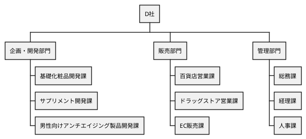
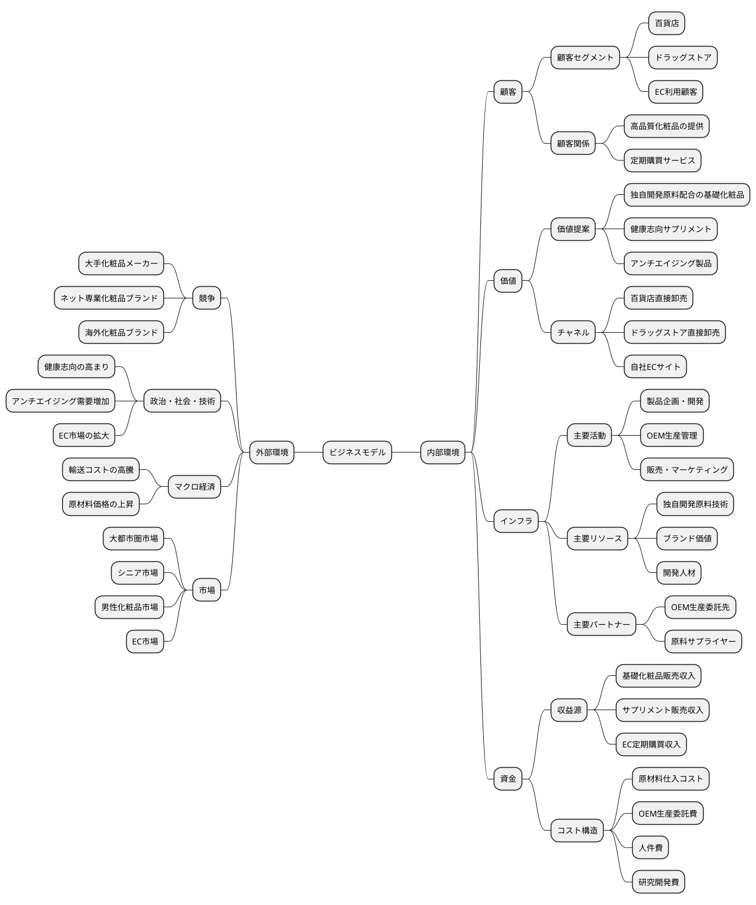
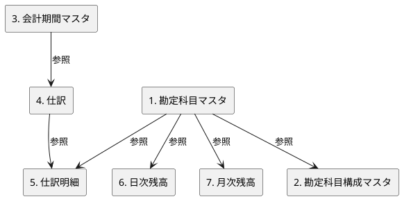

# 第8章: ドメインに適したデータの作成

## 8.1 テストデータ設計の考え方

本章では、実際のビジネス事例に基づいた財務データを作成し、財務会計システムに実践的なテストデータを投入します。中小企業診断士試験で使用される事例データを活用することで、リアルなビジネスシナリオに対応したシステム開発を体験します。

### テストデータの重要性

財務会計システムのテストには、以下の特性を持つデータが必要です。

| 特性 | 説明 | 例 |
|------|------|-----|
| 現実性 | 実際のビジネスシナリオを反映 | 期首残高、期中取引、期末残高の整合性 |
| 網羅性 | すべての勘定科目タイプをカバー | 資産、負債、純資産、収益、費用 |
| 検証可能性 | 計算結果を検証できる | 貸借バランス、財務指標の計算 |
| 再現性 | 繰り返しテストに使用可能 | Seed データによる自動投入 |

### 事例企業の活用

本書では、化粧品製造販売を行う D 社の事例を活用します。実際の企業に近い財務データを使用することで、以下のメリットが得られます。

1. **リアルな数値感覚**: 億単位の売上高、千万単位の利益など実務に近い金額
2. **財務分析の実践**: 経営指標の計算と解釈を学習
3. **複数期間の比較**: 2期分のデータで推移分析が可能

---

## 8.2 D 社の事例

### 8.2.1 企業概要

D 社は、資本金1億円、総資産約30億円、売上高約45億円、従業員31名の、化粧品を製造する創業20年の企業です。D 社は独自開発の原料を配合した基礎化粧品、サプリメントなどの企画・開発・販売を行っており、製品の生産は OEM 生産によっています。

同社は大都市圏の顧客をメインとしており、基本的に、卸売会社を通さずに、百貨店やドラッグストアなどの取り扱い店に直接製品を卸しています。また、自社 EC サイトを通じて美容液の定期購買サービスも開始しています。

直近では、実店舗やネット上での同業他社との競争激化により販売が低迷してきており、このままでは売上高がさらに減少する可能性が高いと予想されます。

### 8.2.2 組織構造



### 8.2.3 ビジネスモデル



### 8.2.4 財務諸表

D 社の直近2期分の財務諸表は以下の通りです。

**貸借対照表**

（単位：千円）

|  | 令和3年度 | 令和4年度 |  | 令和3年度 | 令和4年度 |
|:---|---:|---:|:---|---:|---:|
| **（資産の部）** |  |  | **（負債の部）** |  |  |
| 流動資産 | 2,676,193 | 2,777,545 | 流動負債 | 851,394 | 640,513 |
| 現金預金 | 593,256 | 1,133,270 | 買掛金 | 191,034 | 197,162 |
| 売掛金・受取手形 | 1,085,840 | 864,915 | 短期借入金 | 120,000 | 70,000 |
| 棚卸資産 | 948,537 | 740,810 | 未払金 | 197,262 | 104,341 |
| その他の流動資産 | 48,560 | 38,550 | 未払法人税等 | 250,114 | 184,887 |
| 固定資産 | 186,973 | 197,354 | その他の流動負債 | 92,984 | 84,123 |
| 建物及び構築物 | 64,524 | 63,256 | **固定負債** | 22,500 | 27,153 |
| 無形固定資産 | 37,492 | 34,683 | 長期借入金 | 22,500 | 24,360 |
| 投資その他の資産 | 84,957 | 99,415 | リース債務 | — | 2,793 |
|  |  |  | **負債合計** | 873,894 | 667,666 |
|  |  |  | **（純資産の部）** |  |  |
|  |  |  | 資本金 | 100,000 | 100,000 |
|  |  |  | 資本剰余金 | — | — |
|  |  |  | 利益剰余金 | 1,889,272 | 2,207,233 |
|  |  |  | **純資産合計** | 1,989,272 | 2,307,233 |
| **資産合計** | 2,863,166 | 2,974,899 | **負債・純資産合計** | 2,863,166 | 2,974,899 |

**損益計算書**

（単位：千円）

|  | 令和3年度 | 令和4年度 |
|:---|---:|---:|
| **売上高** | 5,796,105 | 4,547,908 |
| **売上原価** | 2,185,856 | 1,743,821 |
| **売上総利益** | 3,610,249 | 2,804,087 |
| **販売費及び一般管理費** | 2,625,222 | 2,277,050 |
| **営業利益** | 985,027 | 527,037 |
| **営業外収益** | 368 | 11,608 |
| **営業外費用** | 2,676 | 1,613 |
| **経常利益** | 982,719 | 537,032 |
| **特別利益** | — | — |
| **特別損失** | — | — |
| **税引前当期純利益** | 982,719 | 537,032 |
| **法人税等** | 331,059 | 169,072 |
| **当期純利益** | 651,660 | 367,960 |

### 8.2.5 財務分析（主要指標）

| 指標 | 計算式 | 令和3年度 | 令和4年度 | 変化 |
|:---|:---|---:|---:|:---:|
| **収益性** |  |  |  |  |
| 売上高総利益率 | 売上総利益 ÷ 売上高 | 62.29% | 61.66% | ▲0.63% |
| 売上高営業利益率 | 営業利益 ÷ 売上高 | 16.99% | 11.59% | ▲5.40% |
| 売上高経常利益率 | 経常利益 ÷ 売上高 | 16.95% | 11.81% | ▲5.14% |
| 売上高販管費比率 | 販管費 ÷ 売上高 | 45.29% | 50.07% | +4.78% |
| **効率性** |  |  |  |  |
| 総資本回転率 | 売上高 ÷ 総資本 | 2.02回 | 1.53回 | ▲0.49回 |
| 売上債権回転率 | 売上高 ÷ 売上債権 | 5.34回 | 5.26回 | ▲0.08回 |
| 棚卸資産回転率 | 売上高 ÷ 棚卸資産 | 6.11回 | 6.14回 | +0.03回 |
| **安全性** |  |  |  |  |
| 流動比率 | 流動資産 ÷ 流動負債 | 314.33% | 433.64% | +119.31% |
| 当座比率 | 当座資産 ÷ 流動負債 | 197.22% | 311.97% | +114.75% |
| 自己資本比率 | 自己資本 ÷ 総資本 | 69.48% | 77.56% | +8.08% |

### 8.2.6 財務状況の分析

D 社の財務諸表から以下の経営状況が読み取れます。

**1. 売上高の大幅減少**
- 令和3年度：5,796,105千円 → 令和4年度：4,547,908千円（▲21.5%）
- 実店舗やネット上での競争激化により販売が低迷

**2. 収益性の悪化**
- 営業利益：985,027千円 → 527,037千円（▲46.5%）
- 売上高営業利益率：16.99% → 11.59%（▲5.4ポイント）
- 売上減少に対して、販管費の削減が追いつかず

**3. 効率性の低下**
- 総資本回転率：2.02回 → 1.53回（▲0.49回）
- 売上減少により、資産の効率的活用が低下

**4. 安全性の大幅改善**
- 流動比率：314.33% → 433.64%（+119.31ポイント）
- 自己資本比率：69.48% → 77.56%（+8.08ポイント）
- 短期借入金の返済と利益剰余金の増加により、財務の健全性が向上

---

## 8.3 Seed データの設計

### 8.3.1 データ構造の設計

D 社の与件に基づいて、以下の7種類のデータを設計します。

| データ種別 | 件数 | 説明 |
|-----------|------|------|
| 勘定科目マスタ | 42科目 | 資産、負債、純資産、収益、費用の各科目 |
| 勘定科目構成マスタ | 42件 | チルダ連結による階層パス |
| 会計期間マスタ | 2期間 | 令和3年度、令和4年度 |
| 仕訳データ | 2件 | 各年度の期末仕訳 |
| 仕訳明細データ | 26件 | 借方・貸方のエントリ |
| 日次勘定科目残高 | 26件 | 各年度期末時点の残高 |
| 月次勘定科目残高 | 26件 | 各年度期末月の残高推移 |

### 8.3.2 勘定科目の階層構造

Seed データで投入される勘定科目は以下のような階層構造を持ちます。

```
資産(1)
├── 流動資産(11)
│   ├── 現金預金(111)
│   ├── 売掛金(112)
│   ├── 売上債権(113)
│   ├── 棚卸資産(114)
│   └── その他流動資産(115)
└── 固定資産(12)
    ├── 有形固定資産(121)
    │   ├── 建物及び構築物(1211)
    │   ├── 機械装置及び運搬具(1212)
    │   ├── 工具器具備品(1213)
    │   ├── 土地(1214)
    │   └── その他有形固定資産(1215)
    ├── 無形固定資産(122)
    └── 投資その他の資産(123)

負債(2)
├── 流動負債(21)
│   ├── 買掛金(211)
│   ├── 短期借入金(212)
│   ├── 未払金(213)
│   ├── 未払法人税等(214)
│   └── その他流動負債(215)
└── 固定負債(22)
    ├── 長期借入金(221)
    └── リース債務(222)

純資産(3)
├── 資本金(31)
├── 資本剰余金(32)
└── 利益剰余金(33)

収益(4)
├── 売上高(41)
├── 営業外収益(42)
└── 特別利益(43)

費用(5)
├── 売上原価(51)
├── 販売費及び一般管理費(52)
├── 営業外費用(53)
├── 特別損失(54)
├── 法人税等(55)
└── 当期純利益(56)
```

### 8.3.3 チルダ連結方式

階層構造は、**チルダ連結方式**（`~` 記号を使用）で勘定科目構成マスタに保存されます。

| 勘定科目コード | 勘定科目パス |
|---------------|-------------|
| 1 | 1 |
| 11 | 1~11 |
| 111 | 1~11~111 |
| 12 | 1~12 |
| 121 | 1~12~121 |
| 1211 | 1~12~121~1211 |

**利点**:

1. **階層検索が容易**: LIKE 検索で子孫を取得可能
2. **祖先・子孫の関係が明確**: パスを見れば階層がわかる
3. **パフォーマンス**: 再帰クエリ不要で高速検索

**階層検索の例**:

```sql
-- 固定資産(12)に属するすべての科目を検索
SELECT a.account_code, a.account_name, s.account_path
FROM account a
JOIN account_structure s ON a.account_code = s.account_code
WHERE s.account_path LIKE '%~12~%' OR s.account_path = '12';
```

---

## 8.4 Seed データの実装

### 8.4.1 AccountingSeedData.java

各種データを表現する Java Record を定義します。

```java
package com.example.accounting.infrastructure.seed;

import java.math.BigDecimal;
import java.time.LocalDate;
import java.util.List;

/**
 * 財務会計システムの Seed データを提供するクラス
 */
public class AccountingSeedData {

    public static final LocalDate ACCOUNT_START_DATE = LocalDate.of(2021, 4, 1);

    /**
     * 勘定科目マスタデータを返す
     */
    public record AccountData(
        String accountCode,
        String accountName,
        String accountType,
        int level,
        LocalDate startDate
    ) {}

    public static List<AccountData> getAccounts() {
        return List.of(
            // 資産の部
            new AccountData("1", "資産", "ASSET", 1, ACCOUNT_START_DATE),
            new AccountData("11", "流動資産", "ASSET", 2, ACCOUNT_START_DATE),
            new AccountData("111", "現金預金", "ASSET", 3, ACCOUNT_START_DATE),
            new AccountData("112", "売掛金", "ASSET", 3, ACCOUNT_START_DATE),
            new AccountData("113", "売上債権", "ASSET", 3, ACCOUNT_START_DATE),
            new AccountData("114", "棚卸資産", "ASSET", 3, ACCOUNT_START_DATE),
            new AccountData("115", "その他流動資産", "ASSET", 3, ACCOUNT_START_DATE),
            new AccountData("12", "固定資産", "ASSET", 2, ACCOUNT_START_DATE),
            // ... 省略

            // 負債の部
            new AccountData("2", "負債", "LIABILITY", 1, ACCOUNT_START_DATE),
            new AccountData("21", "流動負債", "LIABILITY", 2, ACCOUNT_START_DATE),
            // ... 省略

            // 純資産の部
            new AccountData("3", "純資産", "EQUITY", 1, ACCOUNT_START_DATE),
            new AccountData("31", "資本金", "EQUITY", 2, ACCOUNT_START_DATE),
            // ... 省略

            // 収益の部
            new AccountData("4", "収益", "REVENUE", 1, ACCOUNT_START_DATE),
            new AccountData("41", "売上高", "REVENUE", 2, ACCOUNT_START_DATE),
            // ... 省略

            // 費用の部
            new AccountData("5", "費用", "EXPENSE", 1, ACCOUNT_START_DATE),
            new AccountData("51", "売上原価", "EXPENSE", 2, ACCOUNT_START_DATE)
            // ... 省略
        );
    }

    /**
     * 勘定科目構成マスタデータを返す
     */
    public record AccountStructureData(
        String accountCode,
        String accountPath
    ) {}

    public static List<AccountStructureData> getAccountStructures() {
        return List.of(
            new AccountStructureData("1", "1"),
            new AccountStructureData("11", "1~11"),
            new AccountStructureData("111", "1~11~111"),
            new AccountStructureData("12", "1~12"),
            new AccountStructureData("121", "1~12~121"),
            new AccountStructureData("1211", "1~12~121~1211")
            // ... 省略
        );
    }

    /**
     * 会計期間マスタデータを返す
     */
    public record AccountingPeriodData(
        int fiscalYear,
        String periodName,
        LocalDate startDate,
        LocalDate endDate,
        boolean isClosed
    ) {}

    public static List<AccountingPeriodData> getPeriods() {
        return List.of(
            new AccountingPeriodData(
                2021,
                "令和3年度",
                LocalDate.of(2021, 4, 1),
                LocalDate.of(2022, 3, 31),
                true
            ),
            new AccountingPeriodData(
                2022,
                "令和4年度",
                LocalDate.of(2022, 4, 1),
                LocalDate.of(2023, 3, 31),
                true
            )
        );
    }

    /**
     * 仕訳明細データを返す
     */
    public record JournalEntryData(
        String accountCode,
        BigDecimal debitAmount,
        BigDecimal creditAmount,
        String description
    ) {}

    public static List<JournalEntryData> getFY2021Entries() {
        return List.of(
            // 貸借対照表
            new JournalEntryData("11", new BigDecimal("2676193000"), BigDecimal.ZERO, "流動資産"),
            new JournalEntryData("12", new BigDecimal("186973000"), BigDecimal.ZERO, "固定資産"),
            new JournalEntryData("21", BigDecimal.ZERO, new BigDecimal("851394000"), "流動負債"),
            new JournalEntryData("22", BigDecimal.ZERO, new BigDecimal("22500000"), "固定負債"),
            new JournalEntryData("31", BigDecimal.ZERO, new BigDecimal("100000000"), "資本金"),
            new JournalEntryData("33", BigDecimal.ZERO, new BigDecimal("1889272000"), "利益剰余金"),

            // 損益計算書
            new JournalEntryData("51", new BigDecimal("2185856000"), BigDecimal.ZERO, "売上原価"),
            new JournalEntryData("52", new BigDecimal("2625222000"), BigDecimal.ZERO, "販売費及び一般管理費"),
            new JournalEntryData("53", new BigDecimal("2676000"), BigDecimal.ZERO, "営業外費用"),
            new JournalEntryData("55", new BigDecimal("331059000"), BigDecimal.ZERO, "法人税等"),
            new JournalEntryData("41", BigDecimal.ZERO, new BigDecimal("5796105000"), "売上高"),
            new JournalEntryData("42", BigDecimal.ZERO, new BigDecimal("368000"), "営業外収益"),
            new JournalEntryData("56", BigDecimal.ZERO, new BigDecimal("651660000"), "当期純利益")
        );
    }
}
```

**ポイント**:

1. **Java Record の活用**: 各データ型を Record として定義し、不変性を確保
2. **BigDecimal の使用**: 金額データは BigDecimal で扱い、精度を保証（千円単位で保存）
3. **チルダ連結**: 勘定科目構成マスタでは `~` 記号で階層パスを表現

### 8.4.2 DatabaseSeeder.java

CommandLineRunner を実装してアプリケーション起動時に Seed データを投入します。

```java
package com.example.accounting.infrastructure.seed;

import lombok.RequiredArgsConstructor;
import lombok.extern.slf4j.Slf4j;
import org.springframework.boot.CommandLineRunner;
import org.springframework.boot.autoconfigure.condition.ConditionalOnProperty;
import org.springframework.stereotype.Component;
import org.springframework.transaction.annotation.Transactional;

/**
 * データベースに Seed データを投入する CommandLineRunner
 *
 * application.properties で以下を設定すると実行される:
 * accounting.seed.enabled=true
 */
@Slf4j
@Component
@RequiredArgsConstructor
@ConditionalOnProperty(name = "accounting.seed.enabled", havingValue = "true")
public class DatabaseSeeder implements CommandLineRunner {

    private final AccountRepository accountRepository;
    private final AccountStructureRepository accountStructureRepository;
    private final AccountingPeriodRepository accountingPeriodRepository;
    private final JournalRepository journalRepository;
    private final JournalEntryRepository journalEntryRepository;
    private final DailyBalanceRepository dailyBalanceRepository;
    private final MonthlyBalanceRepository monthlyBalanceRepository;

    @Override
    @Transactional
    public void run(String... args) throws Exception {
        log.info("Seeding database...");

        // 既存データのクリーンアップ（外部キー制約を考慮した順序で削除）
        cleanupExistingData();

        // マスタデータの投入
        seedAccounts();
        seedAccountStructures();
        seedAccountingPeriods();

        // トランザクションデータの投入
        seedJournalsAndEntries();
        seedDailyBalances();
        seedMonthlyBalances();

        log.info("Seeding completed!");
    }

    /**
     * 既存データの削除（外部キー制約を考慮した順序）
     */
    private void cleanupExistingData() {
        log.info("Cleaning up existing data...");

        // 子テーブルから順に削除
        monthlyBalanceRepository.deleteAll();
        dailyBalanceRepository.deleteAll();
        journalEntryRepository.deleteAll();
        journalRepository.deleteAll();
        accountingPeriodRepository.deleteAll();
        accountStructureRepository.deleteAll();
        accountRepository.deleteAll();

        log.info("Cleaned up existing data");
    }

    /**
     * 勘定科目マスタの投入
     */
    private void seedAccounts() {
        var accounts = AccountingSeedData.getAccounts();

        for (var accountData : accounts) {
            accountRepository.insert(
                accountData.accountCode(),
                accountData.accountName(),
                accountData.accountType(),
                accountData.level(),
                accountData.startDate()
            );
        }

        log.info("Created {} accounts", accounts.size());
    }

    // ... 他のメソッドは省略
}
```

**実装のポイント**:

| ポイント | 説明 |
|---------|------|
| @ConditionalOnProperty | 設定で実行を制御、本番環境での誤実行を防止 |
| @Transactional | 全処理を単一トランザクションで実行、エラー時はロールバック |
| 削除順序 | 外部キー制約を考慮して子テーブルから削除 |
| ログ出力 | 進捗を可視化して処理状況を把握 |

---

## 8.5 技術的なポイント

### 8.5.1 外部キー制約の考慮

データ投入順序は外部キー依存関係に基づいて設計されています。

**投入順序**:



**削除順序**（投入の逆順）:

```java
// 子テーブルから順に削除
monthlyBalanceRepository.deleteAll();      // 7. 月次残高
dailyBalanceRepository.deleteAll();        // 6. 日次残高
journalEntryRepository.deleteAll();        // 5. 仕訳明細
journalRepository.deleteAll();             // 4. 仕訳
accountingPeriodRepository.deleteAll();    // 3. 会計期間
accountStructureRepository.deleteAll();    // 2. 勘定科目構成
accountRepository.deleteAll();             // 1. 勘定科目（最後）
```

### 8.5.2 複合キーの扱い

日次・月次勘定科目残高テーブルは複合主キーを使用しています。

**日次勘定科目残高の複合主キー**:

| フィールド | 説明 |
|-----------|------|
| balanceDate | 起票日 |
| accountCode | 勘定科目コード |
| auxiliaryCode | 補助科目コード |
| departmentCode | 部門コード |
| projectCode | プロジェクトコード |
| isClosingEntry | 決算仕訳フラグ |

**MyBatis Mapper の例**:

```xml
<insert id="insertDailyBalance">
    INSERT INTO daily_account_balance (
        balance_date,
        account_code,
        auxiliary_code,
        department_code,
        project_code,
        is_closing_entry,
        debit_amount,
        credit_amount
    ) VALUES (
        #{balanceDate},
        #{accountCode},
        #{auxiliaryCode},
        #{departmentCode},
        #{projectCode},
        #{isClosingEntry},
        #{debitAmount},
        #{creditAmount}
    )
</insert>
```

### 8.5.3 BigDecimal の使用

財務データの金額は **BigDecimal** を使用します。

```java
// NG: double や float は精度の問題がある
double amount = 2676193000.0;  // 浮動小数点数の誤差が発生

// OK: BigDecimal で正確な金額を扱う
BigDecimal amount = new BigDecimal("2676193000");
```

**BigDecimal を使う理由**:

| 理由 | 説明 |
|------|------|
| 精度の保証 | 小数点以下の計算で誤差が発生しない |
| 金額計算の正確性 | 会計処理では1円単位の正確性が必要 |
| 四則演算のサポート | add、subtract、multiply、divide メソッドで計算 |
| 丸め処理の制御 | RoundingMode で丸め方法を指定可能 |

**計算例**:

```java
BigDecimal sales = new BigDecimal("5796105000");
BigDecimal costOfSales = new BigDecimal("2185856000");

// 粗利益 = 売上高 - 売上原価
BigDecimal grossProfit = sales.subtract(costOfSales);
// 結果: 3,610,249,000 円

// 粗利益率 = 粗利益 / 売上高 * 100
BigDecimal grossProfitMargin = grossProfit
    .divide(sales, 4, RoundingMode.HALF_UP)  // 小数点第4位まで、四捨五入
    .multiply(new BigDecimal("100"));
// 結果: 62.29%
```

### 8.5.4 Java Record の利点

Seed データの定義に **Java Record** を使用しています。

```java
// Record（5行）
public record AccountData(
    String accountCode,
    String accountName,
    String accountType,
    int level,
    LocalDate startDate
) {}
```

**Record の利点**:

| 利点 | 説明 |
|------|------|
| 不変性 | すべてのフィールドが final で変更不可 |
| 簡潔な記述 | getter、constructor、equals、hashCode、toString が自動生成 |
| 型安全 | コンパイル時に型チェックが行われる |
| 可読性 | データ構造が一目で分かる |

### 8.5.5 CommandLineRunner と条件付き実行

**@ConditionalOnProperty** で実行を制御:

```java
@ConditionalOnProperty(name = "accounting.seed.enabled", havingValue = "true")
public class DatabaseSeeder implements CommandLineRunner {
    // accounting.seed.enabled=true の場合のみ実行
}
```

これにより、以下のメリットがあります:

1. **開発環境**: `accounting.seed.enabled=true` でテストデータを自動投入
2. **本番環境**: プロパティを設定しないことで誤投入を防止
3. **柔軟な制御**: 環境変数でも制御可能

### 8.5.6 トランザクション管理

**@Transactional** アノテーションで全処理を単一トランザクション化:

```java
@Override
@Transactional
public void run(String... args) throws Exception {
    // すべての処理が成功するか、すべて失敗（ロールバック）
    seedAccounts();
    seedAccountStructures();
    // ...
}
```

これにより、以下が保証されます:

| 保証 | 説明 |
|------|------|
| 原子性 | すべての処理が成功するか、すべて失敗 |
| 一貫性 | 中途半端な状態でデータが残らない |
| エラー時の安全性 | 例外発生時は自動ロールバック |

---

## 8.6 実行方法

### 8.6.1 application.properties の設定

```properties
# src/main/resources/application.properties

# データベース接続設定
spring.datasource.url=jdbc:postgresql://localhost:5432/accounting_db
spring.datasource.username=postgres
spring.datasource.password=postgres
spring.datasource.driver-class-name=org.postgresql.Driver

# MyBatis 設定
mybatis.mapper-locations=classpath:mapper/**/*.xml
mybatis.configuration.map-underscore-to-camel-case=true

# Seed データ投入を有効化
accounting.seed.enabled=true
```

**重要**: 本番環境では `accounting.seed.enabled=false` に設定するか、プロパティ自体を削除してください。

### 8.6.2 Gradle コマンドで実行

```bash
# プロジェクトルートディレクトリで実行
./gradlew bootRun
```

Windows の場合:

```cmd
gradlew.bat bootRun
```

### 8.6.3 実行結果の例

```
2025-11-18 10:30:15.123  INFO ... : Seeding database...
2025-11-18 10:30:15.234  INFO ... : Cleaning up existing data...
2025-11-18 10:30:15.456  INFO ... : Cleaned up existing data
2025-11-18 10:30:15.567  INFO ... : Created 42 accounts
2025-11-18 10:30:15.678  INFO ... : Created 42 account structures
2025-11-18 10:30:15.789  INFO ... : Created 2 accounting periods
2025-11-18 10:30:15.890  INFO ... : Created 13 journal entries for FY2021
2025-11-18 10:30:16.001  INFO ... : Created 13 journal entries for FY2022
2025-11-18 10:30:16.112  INFO ... : Created 13 daily balances for FY2021
2025-11-18 10:30:16.223  INFO ... : Created 13 daily balances for FY2022
2025-11-18 10:30:16.334  INFO ... : Created 13 monthly balances for FY2021
2025-11-18 10:30:16.445  INFO ... : Created 13 monthly balances for FY2022
2025-11-18 10:30:16.556  INFO ... : Seeding completed!
```

### 8.6.4 投入されたデータの確認

```sql
-- 勘定科目マスタの件数確認
SELECT COUNT(*) FROM account;
-- 結果: 42

-- 勘定科目構成マスタのチルダ連結確認
SELECT account_code, account_path
FROM account_structure
WHERE account_code = '1211';
-- 結果: account_code='1211', account_path='1~12~121~1211'

-- 令和3年度の貸借対照表データ確認
SELECT
    a.account_name,
    CASE
        WHEN je.debit_amount > 0 THEN je.debit_amount
        ELSE je.credit_amount
    END as amount
FROM journal_entry je
JOIN account a ON je.account_code = a.account_code
JOIN journal j ON je.journal_id = j.id
WHERE j.fiscal_year = 2021
  AND a.account_code IN ('11', '12', '21', '22', '31', '33')
ORDER BY a.account_code;
```

---

## まとめ

本章では、ドメインに適したテストデータの設計と実装について解説しました。

- **事例企業の活用**: D 社の財務データを使用し、リアルなビジネスシナリオを再現
- **階層構造の設計**: チルダ連結方式による勘定科目の階層管理
- **Seed データの実装**: Java Record と CommandLineRunner による自動投入
- **技術的ポイント**: BigDecimal、外部キー制約、トランザクション管理

次章では、認証・ユーザー管理の実装について解説します。
