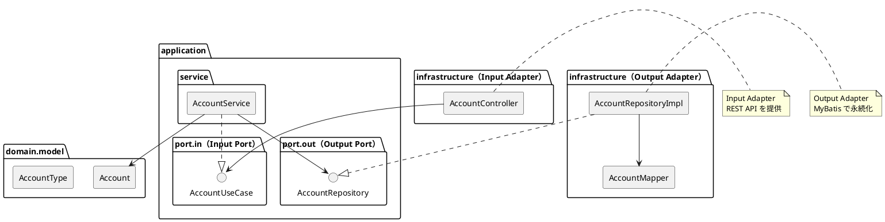

# 第9章: 勘定科目マスタ

## 9.1 本章の概要

第5章でデータベーススキーマの設計が完了しました。本章では、第3章で解説したヘキサゴナルアーキテクチャに従い、勘定科目マスタの機能実装を TDD で進めます。

### アーキテクチャの全体像



### パッケージ構成

```
com.example.accounting/
├── domain/
│   └── model/
│       └── account/
│           ├── Account.java            # ドメインモデル
│           └── AccountType.java        # 値オブジェクト（列挙型）
├── application/
│   ├── port/
│   │   ├── in/
│   │   │   ├── AccountUseCase.java     # Input Port
│   │   │   └── command/
│   │   │       ├── CreateAccountCommand.java
│   │   │       └── UpdateAccountCommand.java
│   │   └── out/
│   │       └── AccountRepository.java  # Output Port
│   └── service/
│       └── AccountService.java         # Application Service
└── infrastructure/
    ├── persistence/
    │   ├── mapper/
    │   │   └── AccountMapper.java      # MyBatis Mapper
    │   └── repository/
    │       └── AccountRepositoryImpl.java  # Output Adapter
    └── web/
        ├── controller/
        │   └── AccountController.java  # Input Adapter
        ├── dto/
        │   ├── AccountRequest.java
        │   └── AccountResponse.java
        └── exception/
            └── GlobalExceptionHandler.java
```

### TDD の流れ

1. **Domain Model**: ドメインモデルの作成（Account, AccountType）
2. **Output Port**: リポジトリインターフェースの定義
3. **Output Adapter**: Testcontainers でリポジトリ実装をテスト
4. **Input Port**: ユースケースインターフェースの定義
5. **Application Service**: Mockito でアプリケーションサービスをテスト
6. **Input Adapter**: Testcontainers で REST API 統合テスト

---

## 9.2 Domain Model の実装

### 9.2.1 AccountType 列挙型

```java
package com.example.accounting.domain.model.account;

/**
 * 勘定科目種別
 */
public enum AccountType {
    ASSET("資産", "B", true),
    LIABILITY("負債", "B", false),
    EQUITY("純資産", "B", false),
    REVENUE("収益", "P", false),
    EXPENSE("費用", "P", true);

    private final String displayName;
    private final String bsplType;
    private final boolean isDebitBalance;

    AccountType(String displayName, String bsplType, boolean isDebitBalance) {
        this.displayName = displayName;
        this.bsplType = bsplType;
        this.isDebitBalance = isDebitBalance;
    }

    public String getDisplayName() {
        return displayName;
    }

    public String getBsplType() {
        return bsplType;
    }

    public boolean isDebitBalance() {
        return isDebitBalance;
    }

    public boolean isBalanceSheet() {
        return "B".equals(bsplType);
    }

    public boolean isProfitAndLoss() {
        return "P".equals(bsplType);
    }

    public static AccountType fromDisplayName(String displayName) {
        for (AccountType type : values()) {
            if (type.displayName.equals(displayName)) {
                return type;
            }
        }
        throw new IllegalArgumentException("Unknown account type: " + displayName);
    }
}
```

### 9.2.2 Account ドメインモデル

```java
package com.example.accounting.domain.model.account;

import lombok.Value;
import lombok.With;

import java.math.BigDecimal;
import java.time.LocalDateTime;

/**
 * 勘定科目ドメインモデル
 */
@Value
@With
public class Account {

    Integer accountId;
    String accountCode;
    String accountName;
    AccountType accountType;
    String bsplType;
    Boolean isSummaryAccount;
    Integer displayOrder;
    Boolean isAggregationTarget;
    BigDecimal balance;
    LocalDateTime createdAt;
    LocalDateTime updatedAt;

    /**
     * 新規勘定科目を作成
     */
    public static Account create(String accountCode, String accountName, AccountType accountType) {
        return new Account(
            null,
            accountCode,
            accountName,
            accountType,
            accountType.getBsplType(),
            false,
            null,
            true,
            BigDecimal.ZERO,
            null,
            null
        );
    }

    /**
     * 合計科目として作成
     */
    public static Account createSummaryAccount(
            String accountCode, String accountName, AccountType accountType) {
        return new Account(
            null,
            accountCode,
            accountName,
            accountType,
            accountType.getBsplType(),
            true,
            null,
            true,
            BigDecimal.ZERO,
            null,
            null
        );
    }

    /**
     * 残高を加算
     */
    public Account addBalance(BigDecimal amount) {
        return this.withBalance(this.balance.add(amount));
    }

    /**
     * 残高を減算
     */
    public Account subtractBalance(BigDecimal amount) {
        return this.withBalance(this.balance.subtract(amount));
    }

    /**
     * 貸借対照表科目かどうか
     */
    public boolean isBalanceSheetAccount() {
        return accountType.isBalanceSheet();
    }

    /**
     * 損益計算書科目かどうか
     */
    public boolean isProfitAndLossAccount() {
        return accountType.isProfitAndLoss();
    }

    /**
     * 借方残高科目かどうか
     */
    public boolean isDebitBalance() {
        return accountType.isDebitBalance();
    }
}
```

---

## 9.3 Output Port（リポジトリインターフェース）

Output Port は、アプリケーション層からインフラストラクチャ層への依存を逆転させるためのインターフェースです。

```java
package com.example.accounting.application.port.out;

import com.example.accounting.domain.model.account.Account;
import com.example.accounting.domain.model.account.AccountType;

import java.math.BigDecimal;
import java.util.List;
import java.util.Optional;

/**
 * 勘定科目リポジトリ（Output Port）
 */
public interface AccountRepository {

    Account save(Account account);

    Optional<Account> findByCode(String accountCode);

    Optional<Account> findById(Integer accountId);

    List<Account> findAll();

    List<Account> findByType(AccountType accountType);

    List<Account> findSummaryAccounts();

    List<Account> findDetailAccounts();

    void updateBalance(String accountCode, BigDecimal balance);

    void deleteByCode(String accountCode);

    boolean existsByCode(String accountCode);

    long count();
}
```

---

## 9.4 Output Adapter（リポジトリ実装）

### 9.4.1 MyBatis Mapper

```java
package com.example.accounting.infrastructure.persistence.mapper;

import com.example.accounting.infrastructure.persistence.entity.AccountEntity;
import org.apache.ibatis.annotations.Mapper;
import org.apache.ibatis.annotations.Param;

import java.math.BigDecimal;
import java.util.List;

@Mapper
public interface AccountMapper {

    void insert(AccountEntity entity);

    AccountEntity selectByCode(@Param("accountCode") String accountCode);

    AccountEntity selectById(@Param("accountId") Integer accountId);

    List<AccountEntity> selectAll();

    List<AccountEntity> selectByType(@Param("accountType") String accountType);

    List<AccountEntity> selectSummaryAccounts();

    List<AccountEntity> selectDetailAccounts();

    void update(AccountEntity entity);

    void updateBalance(
        @Param("accountCode") String accountCode,
        @Param("balance") BigDecimal balance
    );

    void deleteByCode(@Param("accountCode") String accountCode);

    void deleteAll();

    long count();
}
```

**AccountMapper.xml**:

```xml
<?xml version="1.0" encoding="UTF-8" ?>
<!DOCTYPE mapper PUBLIC "-//mybatis.org//DTD Mapper 3.0//EN"
        "http://mybatis.org/dtd/mybatis-3-mapper.dtd">
<mapper namespace="com.example.accounting.infrastructure.persistence.mapper.AccountMapper">

    <resultMap id="AccountEntityResultMap"
               type="com.example.accounting.infrastructure.persistence.entity.AccountEntity">
        <id property="accountId" column="勘定科目ID"/>
        <result property="accountCode" column="勘定科目コード"/>
        <result property="accountName" column="勘定科目名"/>
        <result property="accountType" column="勘定科目種別"/>
        <result property="bsplType" column="BSPL区分"/>
        <result property="isSummaryAccount" column="合計科目"/>
        <result property="displayOrder" column="表示順序"/>
        <result property="isAggregationTarget" column="集計対象"/>
        <result property="balance" column="残高"/>
        <result property="createdAt" column="作成日時"/>
        <result property="updatedAt" column="更新日時"/>
    </resultMap>

    <insert id="insert" useGeneratedKeys="true" keyProperty="accountId" keyColumn="勘定科目ID">
        INSERT INTO "勘定科目マスタ" (
            "勘定科目コード", "勘定科目名", "勘定科目種別",
            "BSPL区分", "合計科目", "表示順序", "集計対象", "残高"
        ) VALUES (
            #{accountCode}, #{accountName}, #{accountType},
            #{bsplType}, #{isSummaryAccount}, #{displayOrder},
            #{isAggregationTarget}, #{balance}
        )
    </insert>

    <select id="selectByCode" resultMap="AccountEntityResultMap">
        SELECT * FROM "勘定科目マスタ"
        WHERE "勘定科目コード" = #{accountCode}
    </select>

    <select id="selectById" resultMap="AccountEntityResultMap">
        SELECT * FROM "勘定科目マスタ"
        WHERE "勘定科目ID" = #{accountId}
    </select>

    <select id="selectAll" resultMap="AccountEntityResultMap">
        SELECT * FROM "勘定科目マスタ"
        ORDER BY "表示順序", "勘定科目コード"
    </select>

    <select id="selectByType" resultMap="AccountEntityResultMap">
        SELECT * FROM "勘定科目マスタ"
        WHERE "勘定科目種別" = #{accountType}
        ORDER BY "表示順序", "勘定科目コード"
    </select>

    <select id="selectSummaryAccounts" resultMap="AccountEntityResultMap">
        SELECT * FROM "勘定科目マスタ"
        WHERE "合計科目" = true
        ORDER BY "表示順序", "勘定科目コード"
    </select>

    <select id="selectDetailAccounts" resultMap="AccountEntityResultMap">
        SELECT * FROM "勘定科目マスタ"
        WHERE "合計科目" = false
        ORDER BY "表示順序", "勘定科目コード"
    </select>

    <update id="update">
        UPDATE "勘定科目マスタ"
        SET "勘定科目名" = #{accountName},
            "勘定科目種別" = #{accountType},
            "BSPL区分" = #{bsplType},
            "合計科目" = #{isSummaryAccount},
            "表示順序" = #{displayOrder},
            "集計対象" = #{isAggregationTarget},
            "残高" = #{balance},
            "更新日時" = CURRENT_TIMESTAMP
        WHERE "勘定科目コード" = #{accountCode}
    </update>

    <update id="updateBalance">
        UPDATE "勘定科目マスタ"
        SET "残高" = #{balance},
            "更新日時" = CURRENT_TIMESTAMP
        WHERE "勘定科目コード" = #{accountCode}
    </update>

    <delete id="deleteByCode">
        DELETE FROM "勘定科目マスタ"
        WHERE "勘定科目コード" = #{accountCode}
    </delete>

    <delete id="deleteAll">
        DELETE FROM "勘定科目マスタ"
    </delete>

    <select id="count" resultType="long">
        SELECT COUNT(*) FROM "勘定科目マスタ"
    </select>
</mapper>
```

### 9.4.2 Entity クラス

```java
package com.example.accounting.infrastructure.persistence.entity;

import com.example.accounting.domain.model.account.Account;
import com.example.accounting.domain.model.account.AccountType;
import lombok.Data;

import java.math.BigDecimal;
import java.time.LocalDateTime;

/**
 * 勘定科目エンティティ（MyBatis 用）
 */
@Data
public class AccountEntity {

    private Integer accountId;
    private String accountCode;
    private String accountName;
    private String accountType;
    private String bsplType;
    private Boolean isSummaryAccount;
    private Integer displayOrder;
    private Boolean isAggregationTarget;
    private BigDecimal balance;
    private LocalDateTime createdAt;
    private LocalDateTime updatedAt;

    /**
     * ドメインモデルからエンティティを作成
     */
    public static AccountEntity from(Account account) {
        AccountEntity entity = new AccountEntity();
        entity.setAccountId(account.getAccountId());
        entity.setAccountCode(account.getAccountCode());
        entity.setAccountName(account.getAccountName());
        entity.setAccountType(account.getAccountType().name());
        entity.setBsplType(account.getBsplType());
        entity.setIsSummaryAccount(account.getIsSummaryAccount());
        entity.setDisplayOrder(account.getDisplayOrder());
        entity.setIsAggregationTarget(account.getIsAggregationTarget());
        entity.setBalance(account.getBalance());
        entity.setCreatedAt(account.getCreatedAt());
        entity.setUpdatedAt(account.getUpdatedAt());
        return entity;
    }

    /**
     * ドメインモデルに変換
     */
    public Account toDomain() {
        return new Account(
            accountId,
            accountCode,
            accountName,
            AccountType.valueOf(accountType),
            bsplType,
            isSummaryAccount,
            displayOrder,
            isAggregationTarget,
            balance,
            createdAt,
            updatedAt
        );
    }
}
```

### 9.4.3 Repository 実装（Output Adapter）

```java
package com.example.accounting.infrastructure.persistence.repository;

import com.example.accounting.application.port.out.AccountRepository;
import com.example.accounting.domain.model.account.Account;
import com.example.accounting.domain.model.account.AccountType;
import com.example.accounting.infrastructure.persistence.entity.AccountEntity;
import com.example.accounting.infrastructure.persistence.mapper.AccountMapper;
import lombok.RequiredArgsConstructor;
import org.springframework.stereotype.Repository;

import java.math.BigDecimal;
import java.util.List;
import java.util.Optional;

/**
 * 勘定科目リポジトリ実装（Output Adapter）
 */
@Repository
@RequiredArgsConstructor
public class AccountRepositoryImpl implements AccountRepository {

    private final AccountMapper accountMapper;

    @Override
    public Account save(Account account) {
        AccountEntity entity = AccountEntity.from(account);

        if (account.getAccountId() == null) {
            accountMapper.insert(entity);
            return entity.toDomain();
        } else {
            accountMapper.update(entity);
            return account;
        }
    }

    @Override
    public Optional<Account> findByCode(String accountCode) {
        AccountEntity entity = accountMapper.selectByCode(accountCode);
        return Optional.ofNullable(entity).map(AccountEntity::toDomain);
    }

    @Override
    public Optional<Account> findById(Integer accountId) {
        AccountEntity entity = accountMapper.selectById(accountId);
        return Optional.ofNullable(entity).map(AccountEntity::toDomain);
    }

    @Override
    public List<Account> findAll() {
        return accountMapper.selectAll().stream()
            .map(AccountEntity::toDomain)
            .toList();
    }

    @Override
    public List<Account> findByType(AccountType accountType) {
        return accountMapper.selectByType(accountType.name()).stream()
            .map(AccountEntity::toDomain)
            .toList();
    }

    @Override
    public List<Account> findSummaryAccounts() {
        return accountMapper.selectSummaryAccounts().stream()
            .map(AccountEntity::toDomain)
            .toList();
    }

    @Override
    public List<Account> findDetailAccounts() {
        return accountMapper.selectDetailAccounts().stream()
            .map(AccountEntity::toDomain)
            .toList();
    }

    @Override
    public void updateBalance(String accountCode, BigDecimal balance) {
        accountMapper.updateBalance(accountCode, balance);
    }

    @Override
    public void deleteByCode(String accountCode) {
        accountMapper.deleteByCode(accountCode);
    }

    @Override
    public boolean existsByCode(String accountCode) {
        return accountMapper.selectByCode(accountCode) != null;
    }

    @Override
    public long count() {
        return accountMapper.count();
    }
}
```

### 9.4.4 Repository 実装のテスト（Testcontainers）

```java
package com.example.accounting.infrastructure.persistence.repository;

import com.example.accounting.application.port.out.AccountRepository;
import com.example.accounting.domain.model.account.Account;
import com.example.accounting.domain.model.account.AccountType;
import org.junit.jupiter.api.*;
import org.springframework.beans.factory.annotation.Autowired;
import org.springframework.boot.test.context.SpringBootTest;
import org.springframework.test.context.DynamicPropertyRegistry;
import org.springframework.test.context.DynamicPropertySource;
import org.testcontainers.containers.PostgreSQLContainer;
import org.testcontainers.junit.jupiter.Container;
import org.testcontainers.junit.jupiter.Testcontainers;

import java.math.BigDecimal;
import java.util.List;
import java.util.Optional;

import static org.assertj.core.api.Assertions.assertThat;

@SpringBootTest
@Testcontainers
@TestMethodOrder(MethodOrderer.OrderAnnotation.class)
@DisplayName("勘定科目リポジトリ実装のテスト")
class AccountRepositoryImplTest {

    @Container
    static PostgreSQLContainer<?> postgres = new PostgreSQLContainer<>("postgres:16-alpine")
            .withDatabaseName("testdb")
            .withUsername("testuser")
            .withPassword("testpass");

    @DynamicPropertySource
    static void configureProperties(DynamicPropertyRegistry registry) {
        registry.add("spring.datasource.url", postgres::getJdbcUrl);
        registry.add("spring.datasource.username", postgres::getUsername);
        registry.add("spring.datasource.password", postgres::getPassword);
        registry.add("spring.flyway.enabled", () -> "true");
    }

    @Autowired
    private AccountRepository accountRepository;

    @Test
    @Order(1)
    @DisplayName("勘定科目を保存できる")
    void shouldSaveAccount() {
        // Given
        Account account = Account.create("1000", "現金", AccountType.ASSET);

        // When
        Account saved = accountRepository.save(account);

        // Then
        assertThat(saved.getAccountId()).isNotNull();
        assertThat(saved.getAccountCode()).isEqualTo("1000");
        assertThat(saved.getAccountName()).isEqualTo("現金");
    }

    @Test
    @Order(2)
    @DisplayName("勘定科目コードで検索できる")
    void shouldFindByCode() {
        // When
        Optional<Account> found = accountRepository.findByCode("1000");

        // Then
        assertThat(found).isPresent();
        assertThat(found.get().getAccountName()).isEqualTo("現金");
        assertThat(found.get().getAccountType()).isEqualTo(AccountType.ASSET);
    }

    @Test
    @Order(3)
    @DisplayName("すべての勘定科目を取得できる")
    void shouldFindAllAccounts() {
        // Given
        accountRepository.save(Account.create("2000", "買掛金", AccountType.LIABILITY));
        accountRepository.save(Account.create("4000", "売上高", AccountType.REVENUE));

        // When
        List<Account> accounts = accountRepository.findAll();

        // Then
        assertThat(accounts).hasSizeGreaterThanOrEqualTo(3);
        assertThat(accounts)
            .extracting(Account::getAccountCode)
            .contains("1000", "2000", "4000");
    }

    @Test
    @Order(4)
    @DisplayName("勘定科目種別で検索できる")
    void shouldFindByType() {
        // Given
        accountRepository.save(Account.create("1100", "普通預金", AccountType.ASSET));

        // When
        List<Account> assets = accountRepository.findByType(AccountType.ASSET);

        // Then
        assertThat(assets).hasSizeGreaterThanOrEqualTo(2);
        assertThat(assets)
            .extracting(Account::getAccountName)
            .contains("現金", "普通預金");
    }

    @Test
    @Order(5)
    @DisplayName("残高を更新できる")
    void shouldUpdateBalance() {
        // When
        accountRepository.updateBalance("1000", new BigDecimal("100000"));

        // Then
        Optional<Account> found = accountRepository.findByCode("1000");
        assertThat(found).isPresent();
        assertThat(found.get().getBalance())
            .isEqualByComparingTo(new BigDecimal("100000"));
    }

    @Test
    @Order(6)
    @DisplayName("勘定科目コードの存在確認ができる")
    void shouldCheckExistence() {
        // Then
        assertThat(accountRepository.existsByCode("1000")).isTrue();
        assertThat(accountRepository.existsByCode("9999")).isFalse();
    }

    @Test
    @Order(7)
    @DisplayName("勘定科目を削除できる")
    void shouldDeleteAccount() {
        // Given
        Account temp = Account.create("9999", "テスト科目", AccountType.ASSET);
        accountRepository.save(temp);

        // When
        accountRepository.deleteByCode("9999");

        // Then
        Optional<Account> found = accountRepository.findByCode("9999");
        assertThat(found).isEmpty();
    }

    @Test
    @Order(8)
    @DisplayName("存在しない勘定科目コードで検索すると空を返す")
    void shouldReturnEmptyWhenNotFound() {
        // When
        Optional<Account> found = accountRepository.findByCode("NOT_EXIST");

        // Then
        assertThat(found).isEmpty();
    }
}
```

---

## 9.5 Input Port（ユースケースインターフェース）

### 9.5.1 ユースケースインターフェース

```java
package com.example.accounting.application.port.in;

import com.example.accounting.application.port.in.command.CreateAccountCommand;
import com.example.accounting.application.port.in.command.UpdateAccountCommand;
import com.example.accounting.domain.model.account.Account;
import com.example.accounting.domain.model.account.AccountType;

import java.util.List;

/**
 * 勘定科目ユースケース（Input Port）
 */
public interface AccountUseCase {

    /**
     * 勘定科目を作成
     */
    Account createAccount(CreateAccountCommand command);

    /**
     * 勘定科目コードで検索
     */
    Account findByCode(String accountCode);

    /**
     * すべての勘定科目を取得
     */
    List<Account> findAll();

    /**
     * 勘定科目種別で検索
     */
    List<Account> findByType(AccountType accountType);

    /**
     * 勘定科目を更新
     */
    Account updateAccount(UpdateAccountCommand command);

    /**
     * 勘定科目を削除
     */
    void deleteAccount(String accountCode);
}
```

### 9.5.2 Command クラス

```java
// application/port/in/command/CreateAccountCommand.java
package com.example.accounting.application.port.in.command;

import com.example.accounting.domain.model.account.AccountType;

import java.util.Objects;

/**
 * 勘定科目作成コマンド
 */
public record CreateAccountCommand(
    String accountCode,
    String accountName,
    AccountType accountType
) {
    public CreateAccountCommand {
        Objects.requireNonNull(accountCode, "勘定科目コードは必須です");
        Objects.requireNonNull(accountName, "勘定科目名は必須です");
        Objects.requireNonNull(accountType, "勘定科目種別は必須です");

        if (accountCode.isBlank()) {
            throw new IllegalArgumentException("勘定科目コードは空にできません");
        }
        if (accountName.isBlank()) {
            throw new IllegalArgumentException("勘定科目名は空にできません");
        }
    }
}

// application/port/in/command/UpdateAccountCommand.java
package com.example.accounting.application.port.in.command;

import java.util.Objects;

/**
 * 勘定科目更新コマンド
 */
public record UpdateAccountCommand(
    String accountCode,
    String accountName,
    Integer displayOrder,
    Boolean isAggregationTarget
) {
    public UpdateAccountCommand {
        Objects.requireNonNull(accountCode, "勘定科目コードは必須です");
    }
}
```

### 9.5.3 例外クラス

```java
// application/port/in/exception/AccountNotFoundException.java
package com.example.accounting.application.port.in.exception;

public class AccountNotFoundException extends RuntimeException {
    public AccountNotFoundException(String accountCode) {
        super("勘定科目が見つかりません: " + accountCode);
    }
}

// application/port/in/exception/AccountAlreadyExistsException.java
package com.example.accounting.application.port.in.exception;

public class AccountAlreadyExistsException extends RuntimeException {
    public AccountAlreadyExistsException(String accountCode) {
        super("勘定科目コードは既に存在します: " + accountCode);
    }
}
```

---

## 9.6 Application Service

### 9.6.1 アプリケーションサービス実装

```java
package com.example.accounting.application.service;

import com.example.accounting.application.port.in.AccountUseCase;
import com.example.accounting.application.port.in.command.CreateAccountCommand;
import com.example.accounting.application.port.in.command.UpdateAccountCommand;
import com.example.accounting.application.port.in.exception.AccountAlreadyExistsException;
import com.example.accounting.application.port.in.exception.AccountNotFoundException;
import com.example.accounting.application.port.out.AccountRepository;
import com.example.accounting.domain.model.account.Account;
import com.example.accounting.domain.model.account.AccountType;
import lombok.RequiredArgsConstructor;
import org.springframework.stereotype.Service;
import org.springframework.transaction.annotation.Transactional;

import java.util.List;

/**
 * 勘定科目アプリケーションサービス
 */
@Service
@RequiredArgsConstructor
@Transactional
public class AccountService implements AccountUseCase {

    private final AccountRepository accountRepository;

    @Override
    public Account createAccount(CreateAccountCommand command) {
        // 重複チェック
        if (accountRepository.existsByCode(command.accountCode())) {
            throw new AccountAlreadyExistsException(command.accountCode());
        }

        // ドメインモデルを作成
        Account account = Account.create(
            command.accountCode(),
            command.accountName(),
            command.accountType()
        );

        // 永続化
        return accountRepository.save(account);
    }

    @Override
    @Transactional(readOnly = true)
    public Account findByCode(String accountCode) {
        return accountRepository.findByCode(accountCode)
            .orElseThrow(() -> new AccountNotFoundException(accountCode));
    }

    @Override
    @Transactional(readOnly = true)
    public List<Account> findAll() {
        return accountRepository.findAll();
    }

    @Override
    @Transactional(readOnly = true)
    public List<Account> findByType(AccountType accountType) {
        return accountRepository.findByType(accountType);
    }

    @Override
    public Account updateAccount(UpdateAccountCommand command) {
        Account existing = findByCode(command.accountCode());

        Account updated = existing
            .withAccountName(
                command.accountName() != null
                    ? command.accountName()
                    : existing.getAccountName()
            )
            .withDisplayOrder(
                command.displayOrder() != null
                    ? command.displayOrder()
                    : existing.getDisplayOrder()
            )
            .withIsAggregationTarget(
                command.isAggregationTarget() != null
                    ? command.isAggregationTarget()
                    : existing.getIsAggregationTarget()
            );

        return accountRepository.save(updated);
    }

    @Override
    public void deleteAccount(String accountCode) {
        // 存在チェック
        findByCode(accountCode);
        accountRepository.deleteByCode(accountCode);
    }
}
```

### 9.6.2 アプリケーションサービスのテスト（Mockito）

```java
package com.example.accounting.application.service;

import com.example.accounting.application.port.in.command.CreateAccountCommand;
import com.example.accounting.application.port.in.command.UpdateAccountCommand;
import com.example.accounting.application.port.in.exception.AccountAlreadyExistsException;
import com.example.accounting.application.port.in.exception.AccountNotFoundException;
import com.example.accounting.application.port.out.AccountRepository;
import com.example.accounting.domain.model.account.Account;
import com.example.accounting.domain.model.account.AccountType;
import org.junit.jupiter.api.*;
import org.junit.jupiter.api.extension.ExtendWith;
import org.mockito.InjectMocks;
import org.mockito.Mock;
import org.mockito.junit.jupiter.MockitoExtension;

import java.util.List;
import java.util.Optional;

import static org.assertj.core.api.Assertions.*;
import static org.mockito.ArgumentMatchers.any;
import static org.mockito.ArgumentMatchers.anyString;
import static org.mockito.Mockito.*;

@ExtendWith(MockitoExtension.class)
@DisplayName("勘定科目アプリケーションサービスのテスト")
class AccountServiceTest {

    @Mock
    private AccountRepository accountRepository;

    @InjectMocks
    private AccountService accountService;

    @Test
    @DisplayName("勘定科目を作成できる")
    void shouldCreateAccount() {
        // Given
        CreateAccountCommand command = new CreateAccountCommand(
            "1000", "現金", AccountType.ASSET
        );
        when(accountRepository.existsByCode("1000")).thenReturn(false);
        when(accountRepository.save(any(Account.class)))
            .thenAnswer(invocation -> invocation.getArgument(0));

        // When
        Account created = accountService.createAccount(command);

        // Then
        assertThat(created.getAccountCode()).isEqualTo("1000");
        assertThat(created.getAccountName()).isEqualTo("現金");
        assertThat(created.getAccountType()).isEqualTo(AccountType.ASSET);
        verify(accountRepository).save(any(Account.class));
    }

    @Test
    @DisplayName("重複する勘定科目コードは登録できない")
    void shouldNotCreateDuplicateAccount() {
        // Given
        CreateAccountCommand command = new CreateAccountCommand(
            "1000", "現金", AccountType.ASSET
        );
        when(accountRepository.existsByCode("1000")).thenReturn(true);

        // When & Then
        assertThatThrownBy(() -> accountService.createAccount(command))
            .isInstanceOf(AccountAlreadyExistsException.class)
            .hasMessageContaining("1000");

        verify(accountRepository, never()).save(any());
    }

    @Test
    @DisplayName("勘定科目コードで検索できる")
    void shouldFindByCode() {
        // Given
        Account account = Account.create("1000", "現金", AccountType.ASSET);
        when(accountRepository.findByCode("1000")).thenReturn(Optional.of(account));

        // When
        Account found = accountService.findByCode("1000");

        // Then
        assertThat(found.getAccountCode()).isEqualTo("1000");
        assertThat(found.getAccountName()).isEqualTo("現金");
    }

    @Test
    @DisplayName("存在しない勘定科目コードで検索すると例外")
    void shouldThrowWhenNotFound() {
        // Given
        when(accountRepository.findByCode("9999")).thenReturn(Optional.empty());

        // When & Then
        assertThatThrownBy(() -> accountService.findByCode("9999"))
            .isInstanceOf(AccountNotFoundException.class)
            .hasMessageContaining("9999");
    }

    @Test
    @DisplayName("すべての勘定科目を取得できる")
    void shouldFindAll() {
        // Given
        List<Account> accounts = List.of(
            Account.create("1000", "現金", AccountType.ASSET),
            Account.create("2000", "買掛金", AccountType.LIABILITY)
        );
        when(accountRepository.findAll()).thenReturn(accounts);

        // When
        List<Account> result = accountService.findAll();

        // Then
        assertThat(result).hasSize(2);
    }

    @Test
    @DisplayName("勘定科目種別で検索できる")
    void shouldFindByType() {
        // Given
        List<Account> assets = List.of(
            Account.create("1000", "現金", AccountType.ASSET),
            Account.create("1100", "普通預金", AccountType.ASSET)
        );
        when(accountRepository.findByType(AccountType.ASSET)).thenReturn(assets);

        // When
        List<Account> result = accountService.findByType(AccountType.ASSET);

        // Then
        assertThat(result).hasSize(2);
        assertThat(result).allMatch(a -> a.getAccountType() == AccountType.ASSET);
    }

    @Test
    @DisplayName("勘定科目を更新できる")
    void shouldUpdateAccount() {
        // Given
        Account existing = Account.create("1000", "現金", AccountType.ASSET);
        when(accountRepository.findByCode("1000")).thenReturn(Optional.of(existing));
        when(accountRepository.save(any(Account.class)))
            .thenAnswer(invocation -> invocation.getArgument(0));

        UpdateAccountCommand command = new UpdateAccountCommand(
            "1000", "現金及び預金", null, null
        );

        // When
        Account updated = accountService.updateAccount(command);

        // Then
        assertThat(updated.getAccountName()).isEqualTo("現金及び預金");
        verify(accountRepository).save(any(Account.class));
    }

    @Test
    @DisplayName("勘定科目を削除できる")
    void shouldDeleteAccount() {
        // Given
        Account existing = Account.create("1000", "現金", AccountType.ASSET);
        when(accountRepository.findByCode("1000")).thenReturn(Optional.of(existing));

        // When
        accountService.deleteAccount("1000");

        // Then
        verify(accountRepository).deleteByCode("1000");
    }

    @Test
    @DisplayName("存在しない勘定科目は削除できない")
    void shouldNotDeleteNonExistentAccount() {
        // Given
        when(accountRepository.findByCode("9999")).thenReturn(Optional.empty());

        // When & Then
        assertThatThrownBy(() -> accountService.deleteAccount("9999"))
            .isInstanceOf(AccountNotFoundException.class);

        verify(accountRepository, never()).deleteByCode(anyString());
    }
}
```

---

## 9.7 Input Adapter（REST Controller）

### 9.7.1 DTO クラス

```java
// infrastructure/web/dto/AccountRequest.java
package com.example.accounting.infrastructure.web.dto;

import com.example.accounting.application.port.in.command.CreateAccountCommand;
import com.example.accounting.domain.model.account.AccountType;
import jakarta.validation.constraints.NotBlank;
import jakarta.validation.constraints.NotNull;

public record AccountRequest(
    @NotBlank(message = "勘定科目コードは必須です")
    String accountCode,

    @NotBlank(message = "勘定科目名は必須です")
    String accountName,

    @NotNull(message = "勘定科目種別は必須です")
    String accountType
) {
    public CreateAccountCommand toCommand() {
        return new CreateAccountCommand(
            accountCode,
            accountName,
            AccountType.valueOf(accountType)
        );
    }
}

// infrastructure/web/dto/AccountUpdateRequest.java
package com.example.accounting.infrastructure.web.dto;

import com.example.accounting.application.port.in.command.UpdateAccountCommand;

public record AccountUpdateRequest(
    String accountName,
    Integer displayOrder,
    Boolean isAggregationTarget
) {
    public UpdateAccountCommand toCommand(String accountCode) {
        return new UpdateAccountCommand(
            accountCode,
            accountName,
            displayOrder,
            isAggregationTarget
        );
    }
}

// infrastructure/web/dto/AccountResponse.java
package com.example.accounting.infrastructure.web.dto;

import com.example.accounting.domain.model.account.Account;

public record AccountResponse(
    Integer accountId,
    String accountCode,
    String accountName,
    String accountType,
    String accountTypeDisplayName,
    String bsplType,
    Boolean isSummaryAccount,
    Integer displayOrder
) {
    public static AccountResponse from(Account account) {
        return new AccountResponse(
            account.getAccountId(),
            account.getAccountCode(),
            account.getAccountName(),
            account.getAccountType().name(),
            account.getAccountType().getDisplayName(),
            account.getBsplType(),
            account.getIsSummaryAccount(),
            account.getDisplayOrder()
        );
    }
}
```

### 9.7.2 Controller 実装

```java
package com.example.accounting.infrastructure.web.controller;

import com.example.accounting.application.port.in.AccountUseCase;
import com.example.accounting.domain.model.account.Account;
import com.example.accounting.domain.model.account.AccountType;
import com.example.accounting.infrastructure.web.dto.AccountRequest;
import com.example.accounting.infrastructure.web.dto.AccountResponse;
import com.example.accounting.infrastructure.web.dto.AccountUpdateRequest;
import jakarta.validation.Valid;
import lombok.RequiredArgsConstructor;
import org.springframework.http.HttpStatus;
import org.springframework.http.ResponseEntity;
import org.springframework.web.bind.annotation.*;

import java.util.List;

/**
 * 勘定科目 REST Controller（Input Adapter）
 */
@RestController
@RequestMapping("/api/accounts")
@RequiredArgsConstructor
public class AccountController {

    private final AccountUseCase accountUseCase;

    @PostMapping
    public ResponseEntity<AccountResponse> create(
            @Valid @RequestBody AccountRequest request) {

        Account account = accountUseCase.createAccount(request.toCommand());
        return ResponseEntity.status(HttpStatus.CREATED)
            .body(AccountResponse.from(account));
    }

    @GetMapping("/{accountCode}")
    public ResponseEntity<AccountResponse> findByCode(
            @PathVariable String accountCode) {

        Account account = accountUseCase.findByCode(accountCode);
        return ResponseEntity.ok(AccountResponse.from(account));
    }

    @GetMapping
    public ResponseEntity<List<AccountResponse>> findAll(
            @RequestParam(required = false) String type) {

        List<Account> accounts;
        if (type != null) {
            accounts = accountUseCase.findByType(AccountType.valueOf(type));
        } else {
            accounts = accountUseCase.findAll();
        }

        List<AccountResponse> response = accounts.stream()
            .map(AccountResponse::from)
            .toList();

        return ResponseEntity.ok(response);
    }

    @PutMapping("/{accountCode}")
    public ResponseEntity<AccountResponse> update(
            @PathVariable String accountCode,
            @Valid @RequestBody AccountUpdateRequest request) {

        Account account = accountUseCase.updateAccount(request.toCommand(accountCode));
        return ResponseEntity.ok(AccountResponse.from(account));
    }

    @DeleteMapping("/{accountCode}")
    public ResponseEntity<Void> delete(@PathVariable String accountCode) {
        accountUseCase.deleteAccount(accountCode);
        return ResponseEntity.noContent().build();
    }
}
```

### 9.7.3 例外ハンドラ

```java
package com.example.accounting.infrastructure.web.exception;

import com.example.accounting.application.port.in.exception.AccountAlreadyExistsException;
import com.example.accounting.application.port.in.exception.AccountNotFoundException;
import org.springframework.http.HttpStatus;
import org.springframework.http.ResponseEntity;
import org.springframework.web.bind.MethodArgumentNotValidException;
import org.springframework.web.bind.annotation.ExceptionHandler;
import org.springframework.web.bind.annotation.RestControllerAdvice;

import java.util.stream.Collectors;

@RestControllerAdvice
public class GlobalExceptionHandler {

    public record ErrorResponse(String code, String message) {}

    @ExceptionHandler(AccountNotFoundException.class)
    public ResponseEntity<ErrorResponse> handleNotFound(AccountNotFoundException e) {
        return ResponseEntity.status(HttpStatus.NOT_FOUND)
            .body(new ErrorResponse("NOT_FOUND", e.getMessage()));
    }

    @ExceptionHandler(AccountAlreadyExistsException.class)
    public ResponseEntity<ErrorResponse> handleAlreadyExists(AccountAlreadyExistsException e) {
        return ResponseEntity.status(HttpStatus.CONFLICT)
            .body(new ErrorResponse("CONFLICT", e.getMessage()));
    }

    @ExceptionHandler(MethodArgumentNotValidException.class)
    public ResponseEntity<ErrorResponse> handleValidation(MethodArgumentNotValidException e) {
        String message = e.getBindingResult().getFieldErrors().stream()
            .map(error -> error.getField() + ": " + error.getDefaultMessage())
            .collect(Collectors.joining(", "));

        return ResponseEntity.status(HttpStatus.BAD_REQUEST)
            .body(new ErrorResponse("VALIDATION_ERROR", message));
    }

    @ExceptionHandler(IllegalArgumentException.class)
    public ResponseEntity<ErrorResponse> handleIllegalArgument(IllegalArgumentException e) {
        return ResponseEntity.status(HttpStatus.BAD_REQUEST)
            .body(new ErrorResponse("BAD_REQUEST", e.getMessage()));
    }
}
```

### 9.7.4 統合テスト（Testcontainers）

```java
package com.example.accounting.infrastructure.web.controller;

import com.fasterxml.jackson.databind.ObjectMapper;
import org.junit.jupiter.api.*;
import org.springframework.beans.factory.annotation.Autowired;
import org.springframework.boot.test.autoconfigure.web.servlet.AutoConfigureMockMvc;
import org.springframework.boot.test.context.SpringBootTest;
import org.springframework.http.MediaType;
import org.springframework.test.context.DynamicPropertyRegistry;
import org.springframework.test.context.DynamicPropertySource;
import org.springframework.test.web.servlet.MockMvc;
import org.testcontainers.containers.PostgreSQLContainer;
import org.testcontainers.junit.jupiter.Container;
import org.testcontainers.junit.jupiter.Testcontainers;

import static org.hamcrest.Matchers.*;
import static org.springframework.test.web.servlet.request.MockMvcRequestBuilders.*;
import static org.springframework.test.web.servlet.result.MockMvcResultMatchers.*;

@SpringBootTest
@AutoConfigureMockMvc
@Testcontainers
@TestMethodOrder(MethodOrderer.OrderAnnotation.class)
@DisplayName("勘定科目 API 統合テスト")
class AccountControllerIntegrationTest {

    @Container
    static PostgreSQLContainer<?> postgres = new PostgreSQLContainer<>("postgres:16-alpine")
            .withDatabaseName("testdb")
            .withUsername("testuser")
            .withPassword("testpass");

    @DynamicPropertySource
    static void configureProperties(DynamicPropertyRegistry registry) {
        registry.add("spring.datasource.url", postgres::getJdbcUrl);
        registry.add("spring.datasource.username", postgres::getUsername);
        registry.add("spring.datasource.password", postgres::getPassword);
        registry.add("spring.flyway.enabled", () -> "true");
    }

    @Autowired
    private MockMvc mockMvc;

    @Autowired
    private ObjectMapper objectMapper;

    @Test
    @Order(1)
    @DisplayName("POST /api/accounts - 勘定科目を登録できる")
    void shouldCreateAccount() throws Exception {
        var request = """
            {
                "accountCode": "1000",
                "accountName": "現金",
                "accountType": "ASSET"
            }
            """;

        mockMvc.perform(post("/api/accounts")
                .contentType(MediaType.APPLICATION_JSON)
                .content(request))
            .andExpect(status().isCreated())
            .andExpect(jsonPath("$.accountCode").value("1000"))
            .andExpect(jsonPath("$.accountName").value("現金"))
            .andExpect(jsonPath("$.accountType").value("ASSET"))
            .andExpect(jsonPath("$.accountTypeDisplayName").value("資産"));
    }

    @Test
    @Order(2)
    @DisplayName("GET /api/accounts/{code} - 勘定科目を取得できる")
    void shouldGetAccount() throws Exception {
        mockMvc.perform(get("/api/accounts/1000"))
            .andExpect(status().isOk())
            .andExpect(jsonPath("$.accountCode").value("1000"))
            .andExpect(jsonPath("$.accountName").value("現金"));
    }

    @Test
    @Order(3)
    @DisplayName("GET /api/accounts - すべての勘定科目を取得できる")
    void shouldGetAllAccounts() throws Exception {
        // 追加の勘定科目を登録
        var request = """
            {
                "accountCode": "2000",
                "accountName": "買掛金",
                "accountType": "LIABILITY"
            }
            """;
        mockMvc.perform(post("/api/accounts")
                .contentType(MediaType.APPLICATION_JSON)
                .content(request))
            .andExpect(status().isCreated());

        mockMvc.perform(get("/api/accounts"))
            .andExpect(status().isOk())
            .andExpect(jsonPath("$", hasSize(greaterThanOrEqualTo(2))))
            .andExpect(jsonPath("$[*].accountCode", hasItems("1000", "2000")));
    }

    @Test
    @Order(4)
    @DisplayName("GET /api/accounts?type=ASSET - 種別で検索できる")
    void shouldGetAccountsByType() throws Exception {
        mockMvc.perform(get("/api/accounts").param("type", "ASSET"))
            .andExpect(status().isOk())
            .andExpect(jsonPath("$[*].accountType", everyItem(is("ASSET"))));
    }

    @Test
    @Order(5)
    @DisplayName("PUT /api/accounts/{code} - 勘定科目を更新できる")
    void shouldUpdateAccount() throws Exception {
        var request = """
            {
                "accountName": "現金及び預金"
            }
            """;

        mockMvc.perform(put("/api/accounts/1000")
                .contentType(MediaType.APPLICATION_JSON)
                .content(request))
            .andExpect(status().isOk())
            .andExpect(jsonPath("$.accountName").value("現金及び預金"));
    }

    @Test
    @Order(6)
    @DisplayName("DELETE /api/accounts/{code} - 勘定科目を削除できる")
    void shouldDeleteAccount() throws Exception {
        // 削除用の勘定科目を作成
        var request = """
            {
                "accountCode": "9999",
                "accountName": "テスト科目",
                "accountType": "ASSET"
            }
            """;
        mockMvc.perform(post("/api/accounts")
                .contentType(MediaType.APPLICATION_JSON)
                .content(request))
            .andExpect(status().isCreated());

        // 削除
        mockMvc.perform(delete("/api/accounts/9999"))
            .andExpect(status().isNoContent());

        // 削除されたことを確認
        mockMvc.perform(get("/api/accounts/9999"))
            .andExpect(status().isNotFound());
    }

    @Test
    @Order(7)
    @DisplayName("GET /api/accounts/{code} - 存在しない勘定科目は 404")
    void shouldReturn404WhenNotFound() throws Exception {
        mockMvc.perform(get("/api/accounts/NOT_EXIST"))
            .andExpect(status().isNotFound())
            .andExpect(jsonPath("$.code").value("NOT_FOUND"))
            .andExpect(jsonPath("$.message").exists());
    }

    @Test
    @Order(8)
    @DisplayName("POST /api/accounts - 重複する勘定科目は 409")
    void shouldReturn409WhenDuplicate() throws Exception {
        var request = """
            {
                "accountCode": "1000",
                "accountName": "現金",
                "accountType": "ASSET"
            }
            """;

        mockMvc.perform(post("/api/accounts")
                .contentType(MediaType.APPLICATION_JSON)
                .content(request))
            .andExpect(status().isConflict())
            .andExpect(jsonPath("$.code").value("CONFLICT"))
            .andExpect(jsonPath("$.message").exists());
    }

    @Test
    @Order(9)
    @DisplayName("POST /api/accounts - バリデーションエラーは 400")
    void shouldReturn400WhenValidationFails() throws Exception {
        var request = """
            {
                "accountCode": "",
                "accountName": "現金",
                "accountType": "ASSET"
            }
            """;

        mockMvc.perform(post("/api/accounts")
                .contentType(MediaType.APPLICATION_JSON)
                .content(request))
            .andExpect(status().isBadRequest())
            .andExpect(jsonPath("$.code").value("VALIDATION_ERROR"));
    }
}
```

---

## 9.8 テスト実行

### テストコマンド

```bash
# Repository 実装テスト（Testcontainers）
./gradlew test --tests "*AccountRepositoryImplTest"

# Application Service テスト（Mockito）
./gradlew test --tests "*AccountServiceTest"

# API 統合テスト（Testcontainers）
./gradlew test --tests "*AccountControllerIntegrationTest"

# すべてのテスト
./gradlew test
```

### テスト実行結果

```
> Task :test

AccountRepositoryImplTest > shouldSaveAccount() PASSED
AccountRepositoryImplTest > shouldFindByCode() PASSED
AccountRepositoryImplTest > shouldFindAllAccounts() PASSED
AccountRepositoryImplTest > shouldFindByType() PASSED
AccountRepositoryImplTest > shouldUpdateBalance() PASSED
AccountRepositoryImplTest > shouldCheckExistence() PASSED
AccountRepositoryImplTest > shouldDeleteAccount() PASSED
AccountRepositoryImplTest > shouldReturnEmptyWhenNotFound() PASSED

AccountServiceTest > shouldCreateAccount() PASSED
AccountServiceTest > shouldNotCreateDuplicateAccount() PASSED
AccountServiceTest > shouldFindByCode() PASSED
AccountServiceTest > shouldThrowWhenNotFound() PASSED
AccountServiceTest > shouldFindAll() PASSED
AccountServiceTest > shouldFindByType() PASSED
AccountServiceTest > shouldUpdateAccount() PASSED
AccountServiceTest > shouldDeleteAccount() PASSED
AccountServiceTest > shouldNotDeleteNonExistentAccount() PASSED

AccountControllerIntegrationTest > shouldCreateAccount() PASSED
AccountControllerIntegrationTest > shouldGetAccount() PASSED
AccountControllerIntegrationTest > shouldGetAllAccounts() PASSED
AccountControllerIntegrationTest > shouldGetAccountsByType() PASSED
AccountControllerIntegrationTest > shouldUpdateAccount() PASSED
AccountControllerIntegrationTest > shouldDeleteAccount() PASSED
AccountControllerIntegrationTest > shouldReturn404WhenNotFound() PASSED
AccountControllerIntegrationTest > shouldReturn409WhenDuplicate() PASSED
AccountControllerIntegrationTest > shouldReturn400WhenValidationFails() PASSED

BUILD SUCCESSFUL
26 tests passed
```

---

## 9.9 ArchUnit によるアーキテクチャ検証

本章の実装がヘキサゴナルアーキテクチャに従っているか、ArchUnit で検証します。

```java
package com.example.accounting.architecture;

import com.tngtech.archunit.core.domain.JavaClasses;
import com.tngtech.archunit.core.importer.ClassFileImporter;
import com.tngtech.archunit.lang.ArchRule;
import org.junit.jupiter.api.DisplayName;
import org.junit.jupiter.api.Test;

import static com.tngtech.archunit.lang.syntax.ArchRuleDefinition.*;

@DisplayName("ヘキサゴナルアーキテクチャルール")
class HexagonalArchitectureTest {

    private final JavaClasses classes = new ClassFileImporter()
        .importPackages("com.example.accounting");

    @Test
    @DisplayName("Application Service は Input Port を実装する")
    void applicationServiceShouldImplementInputPort() {
        ArchRule rule = classes()
            .that().resideInAPackage("..application.service..")
            .and().haveSimpleNameEndingWith("Service")
            .should().implement(
                classes().that().resideInAPackage("..application.port.in..")
            );

        rule.check(classes);
    }

    @Test
    @DisplayName("Repository 実装は Output Port を実装する")
    void repositoryImplShouldImplementOutputPort() {
        ArchRule rule = classes()
            .that().resideInAPackage("..infrastructure.persistence.repository..")
            .and().haveSimpleNameEndingWith("RepositoryImpl")
            .should().implement(
                classes().that().resideInAPackage("..application.port.out..")
            );

        rule.check(classes);
    }

    @Test
    @DisplayName("Controller は UseCase のみに依存する")
    void controllerShouldOnlyDependOnUseCases() {
        ArchRule rule = noClasses()
            .that().resideInAPackage("..infrastructure.web.controller..")
            .should().dependOnClassesThat()
            .resideInAPackage("..application.service..");

        rule.check(classes);
    }
}
```

---

## まとめ

本章では、ヘキサゴナルアーキテクチャに従い、勘定科目マスタの機能実装を TDD で進めました。

### アーキテクチャの対応表

| 層 | パッケージ | クラス | テスト方法 |
|----|-----------|--------|-----------|
| Domain | `domain.model.account` | Account, AccountType | - |
| Input Port | `application.port.in` | AccountUseCase | - |
| Output Port | `application.port.out` | AccountRepository | - |
| Application Service | `application.service` | AccountService | Mockito |
| Output Adapter | `infrastructure.persistence` | AccountRepositoryImpl | Testcontainers |
| Input Adapter | `infrastructure.web` | AccountController | Testcontainers + MockMvc |

### ヘキサゴナルアーキテクチャのポイント

1. **依存性逆転**: Application Service は Output Port（インターフェース）に依存し、Repository 実装はそれを実装
2. **Input Port**: Controller は UseCase インターフェースのみに依存
3. **Output Adapter**: MyBatis Mapper を使用して永続化を実装
4. **テスト戦略**:
   - Application Service: Mockito で Repository をモック化
   - Output Adapter: Testcontainers で実際の DB を使用
   - Input Adapter: Testcontainers + MockMvc で統合テスト

次章では、勘定科目構成マスタの機能実装について解説します。
