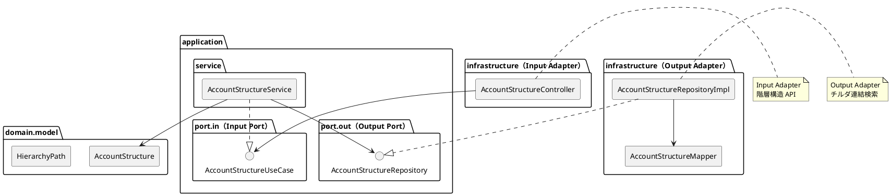

# 第10章: 勘定科目構成マスタ

## 10.1 本章の概要

第5章で設計したチルダ連結方式による勘定科目の階層構造を、ヘキサゴナルアーキテクチャに従って実装します。

### アーキテクチャの全体像



### パッケージ構成

```
com.example.accounting/
├── domain/
│   └── model/
│       └── accountstructure/
│           ├── AccountStructure.java       # ドメインモデル
│           └── HierarchyPath.java          # 値オブジェクト
├── application/
│   ├── port/
│   │   ├── in/
│   │   │   ├── AccountStructureUseCase.java
│   │   │   └── command/
│   │   │       ├── CreateAccountStructureCommand.java
│   │   │       └── MoveAccountStructureCommand.java
│   │   └── out/
│   │       └── AccountStructureRepository.java
│   └── service/
│       └── AccountStructureService.java
└── infrastructure/
    ├── persistence/
    │   ├── mapper/
    │   │   └── AccountStructureMapper.java
    │   └── repository/
    │       └── AccountStructureRepositoryImpl.java
    └── web/
        ├── controller/
        │   └── AccountStructureController.java
        └── dto/
            ├── AccountStructureRequest.java
            └── AccountStructureResponse.java
```

### チルダ連結方式の復習

勘定科目の階層構造をチルダ（`~`）で連結したパス文字列で表現します。

```
貸借対照表
├── 資産の部 (11)
│   └── 流動資産 (11000)
│       └── 現金及び預金 (11190)
│           ├── 現金 (11110)
│           ├── 当座預金 (11120)
│           └── 普通預金 (11130)
```

| 勘定科目コード | 勘定科目パス | 階層レベル | 親科目コード |
|----------------|--------------|------------|--------------|
| 11 | 11 | 1 | NULL |
| 11000 | 11~11000 | 2 | 11 |
| 11190 | 11~11000~11190 | 3 | 11000 |
| 11110 | 11~11000~11190~11110 | 4 | 11190 |

---

## 10.2 Domain Model の実装

### 10.2.1 HierarchyPath 値オブジェクト

```java
package com.example.accounting.domain.model.accountstructure;

import java.util.Arrays;
import java.util.List;
import java.util.Objects;

/**
 * 階層パス値オブジェクト
 * チルダ連結形式でパスを管理
 */
public final class HierarchyPath {

    private static final String DELIMITER = "~";
    private final String path;

    private HierarchyPath(String path) {
        this.path = Objects.requireNonNull(path);
    }

    /**
     * ルートパスを作成
     */
    public static HierarchyPath root(String accountCode) {
        Objects.requireNonNull(accountCode, "勘定科目コードは必須です");
        return new HierarchyPath(accountCode);
    }

    /**
     * パス文字列から作成
     */
    public static HierarchyPath of(String path) {
        if (path == null || path.isBlank()) {
            throw new IllegalArgumentException("パスは空にできません");
        }
        return new HierarchyPath(path);
    }

    /**
     * 子パスを作成
     */
    public HierarchyPath append(String accountCode) {
        Objects.requireNonNull(accountCode, "勘定科目コードは必須です");
        return new HierarchyPath(path + DELIMITER + accountCode);
    }

    /**
     * パス文字列を取得
     */
    public String getValue() {
        return path;
    }

    /**
     * 階層レベルを計算
     */
    public int getLevel() {
        return (int) path.chars().filter(c -> c == '~').count() + 1;
    }

    /**
     * パスをコードのリストに分解
     */
    public List<String> toCodeList() {
        return Arrays.asList(path.split(DELIMITER));
    }

    /**
     * 親のパスを取得
     */
    public HierarchyPath getParentPath() {
        int lastDelimiter = path.lastIndexOf(DELIMITER);
        if (lastDelimiter == -1) {
            return null; // ルートの場合
        }
        return new HierarchyPath(path.substring(0, lastDelimiter));
    }

    /**
     * 親の勘定科目コードを取得
     */
    public String getParentCode() {
        HierarchyPath parentPath = getParentPath();
        if (parentPath == null) {
            return null;
        }
        List<String> codes = parentPath.toCodeList();
        return codes.get(codes.size() - 1);
    }

    /**
     * 自身の勘定科目コードを取得
     */
    public String getAccountCode() {
        List<String> codes = toCodeList();
        return codes.get(codes.size() - 1);
    }

    /**
     * 指定パスが子孫かどうか判定
     */
    public boolean isAncestorOf(HierarchyPath other) {
        return other.path.startsWith(this.path + DELIMITER);
    }

    /**
     * 指定パスが直接の子かどうか判定
     */
    public boolean isParentOf(HierarchyPath other) {
        return isAncestorOf(other) && other.getLevel() == this.getLevel() + 1;
    }

    @Override
    public boolean equals(Object o) {
        if (this == o) return true;
        if (o == null || getClass() != o.getClass()) return false;
        HierarchyPath that = (HierarchyPath) o;
        return path.equals(that.path);
    }

    @Override
    public int hashCode() {
        return Objects.hash(path);
    }

    @Override
    public String toString() {
        return path;
    }
}
```

### 10.2.2 AccountStructure ドメインモデル

```java
package com.example.accounting.domain.model.accountstructure;

import lombok.Value;
import lombok.With;

import java.time.LocalDateTime;

/**
 * 勘定科目構成ドメインモデル
 */
@Value
@With
public class AccountStructure {

    String accountCode;
    HierarchyPath hierarchyPath;
    Integer hierarchyLevel;
    String parentAccountCode;
    Integer displayOrder;
    LocalDateTime createdAt;
    LocalDateTime updatedAt;

    /**
     * ルート科目として作成
     */
    public static AccountStructure createRoot(String accountCode, Integer displayOrder) {
        HierarchyPath path = HierarchyPath.root(accountCode);
        return new AccountStructure(
            accountCode,
            path,
            path.getLevel(),
            null,
            displayOrder,
            null,
            null
        );
    }

    /**
     * 子科目として作成
     */
    public static AccountStructure createChild(
            String accountCode,
            AccountStructure parent,
            Integer displayOrder) {

        HierarchyPath path = parent.getHierarchyPath().append(accountCode);
        return new AccountStructure(
            accountCode,
            path,
            path.getLevel(),
            parent.getAccountCode(),
            displayOrder,
            null,
            null
        );
    }

    /**
     * パス文字列から再構築
     */
    public static AccountStructure reconstruct(
            String accountCode,
            String pathString,
            Integer hierarchyLevel,
            String parentAccountCode,
            Integer displayOrder,
            LocalDateTime createdAt,
            LocalDateTime updatedAt) {

        return new AccountStructure(
            accountCode,
            HierarchyPath.of(pathString),
            hierarchyLevel,
            parentAccountCode,
            displayOrder,
            createdAt,
            updatedAt
        );
    }

    /**
     * ルート科目かどうか
     */
    public boolean isRoot() {
        return parentAccountCode == null;
    }

    /**
     * パス文字列を取得
     */
    public String getPathString() {
        return hierarchyPath.getValue();
    }

    /**
     * 指定した構造が子孫かどうか判定
     */
    public boolean isAncestorOf(AccountStructure other) {
        return this.hierarchyPath.isAncestorOf(other.hierarchyPath);
    }

    /**
     * 指定した構造が直接の子かどうか判定
     */
    public boolean isParentOf(AccountStructure other) {
        return this.hierarchyPath.isParentOf(other.hierarchyPath);
    }
}
```

---

## 10.3 Output Port（リポジトリインターフェース）

```java
package com.example.accounting.application.port.out;

import com.example.accounting.domain.model.accountstructure.AccountStructure;

import java.util.List;
import java.util.Optional;

/**
 * 勘定科目構成リポジトリ（Output Port）
 */
public interface AccountStructureRepository {

    AccountStructure save(AccountStructure accountStructure);

    Optional<AccountStructure> findByCode(String accountCode);

    List<AccountStructure> findAll();

    /**
     * 直接の子科目を取得
     */
    List<AccountStructure> findChildren(String accountCode);

    /**
     * 子孫科目をすべて取得（チルダ連結検索）
     */
    List<AccountStructure> findDescendants(String accountCode);

    /**
     * 階層レベルで検索
     */
    List<AccountStructure> findByLevel(Integer hierarchyLevel);

    /**
     * ルート科目のみ取得
     */
    List<AccountStructure> findRoots();

    void deleteByCode(String accountCode);

    boolean existsByCode(String accountCode);
}
```

---

## 10.4 Output Adapter（リポジトリ実装）

### 10.4.1 MyBatis Mapper

```java
package com.example.accounting.infrastructure.persistence.mapper;

import com.example.accounting.infrastructure.persistence.entity.AccountStructureEntity;
import org.apache.ibatis.annotations.Mapper;
import org.apache.ibatis.annotations.Param;

import java.util.List;

@Mapper
public interface AccountStructureMapper {

    void insert(AccountStructureEntity entity);

    AccountStructureEntity selectByCode(@Param("accountCode") String accountCode);

    List<AccountStructureEntity> selectAll();

    List<AccountStructureEntity> selectChildren(@Param("accountCode") String accountCode);

    List<AccountStructureEntity> selectDescendants(@Param("accountCode") String accountCode);

    List<AccountStructureEntity> selectByLevel(@Param("hierarchyLevel") Integer hierarchyLevel);

    List<AccountStructureEntity> selectRoots();

    void update(AccountStructureEntity entity);

    void deleteByCode(@Param("accountCode") String accountCode);

    void deleteAll();
}
```

**AccountStructureMapper.xml**:

```xml
<?xml version="1.0" encoding="UTF-8" ?>
<!DOCTYPE mapper PUBLIC "-//mybatis.org//DTD Mapper 3.0//EN"
        "http://mybatis.org/dtd/mybatis-3-mapper.dtd">
<mapper namespace="com.example.accounting.infrastructure.persistence.mapper.AccountStructureMapper">

    <resultMap id="AccountStructureEntityResultMap"
               type="com.example.accounting.infrastructure.persistence.entity.AccountStructureEntity">
        <id property="accountCode" column="勘定科目コード"/>
        <result property="hierarchyPath" column="勘定科目パス"/>
        <result property="hierarchyLevel" column="階層レベル"/>
        <result property="parentAccountCode" column="親科目コード"/>
        <result property="displayOrder" column="表示順序"/>
        <result property="createdAt" column="作成日時"/>
        <result property="updatedAt" column="更新日時"/>
    </resultMap>

    <insert id="insert">
        INSERT INTO "勘定科目構成マスタ" (
            "勘定科目コード", "勘定科目パス", "階層レベル",
            "親科目コード", "表示順序"
        ) VALUES (
            #{accountCode}, #{hierarchyPath}, #{hierarchyLevel},
            #{parentAccountCode}, #{displayOrder}
        )
    </insert>

    <select id="selectByCode" resultMap="AccountStructureEntityResultMap">
        SELECT * FROM "勘定科目構成マスタ"
        WHERE "勘定科目コード" = #{accountCode}
    </select>

    <select id="selectAll" resultMap="AccountStructureEntityResultMap">
        SELECT * FROM "勘定科目構成マスタ"
        ORDER BY "表示順序", "勘定科目パス"
    </select>

    <!-- 直接の子科目のみを取得 -->
    <select id="selectChildren" resultMap="AccountStructureEntityResultMap">
        SELECT * FROM "勘定科目構成マスタ"
        WHERE "親科目コード" = #{accountCode}
        ORDER BY "表示順序"
    </select>

    <!-- 子孫科目をすべて取得（チルダ連結検索） -->
    <select id="selectDescendants" resultMap="AccountStructureEntityResultMap">
        SELECT * FROM "勘定科目構成マスタ"
        WHERE "勘定科目パス" LIKE CONCAT(
            (SELECT "勘定科目パス" FROM "勘定科目構成マスタ"
             WHERE "勘定科目コード" = #{accountCode}),
            '~%'
        )
        ORDER BY "表示順序", "勘定科目パス"
    </select>

    <!-- 階層レベルで検索 -->
    <select id="selectByLevel" resultMap="AccountStructureEntityResultMap">
        SELECT * FROM "勘定科目構成マスタ"
        WHERE "階層レベル" = #{hierarchyLevel}
        ORDER BY "表示順序"
    </select>

    <!-- ルート科目のみ取得 -->
    <select id="selectRoots" resultMap="AccountStructureEntityResultMap">
        SELECT * FROM "勘定科目構成マスタ"
        WHERE "親科目コード" IS NULL
        ORDER BY "表示順序"
    </select>

    <update id="update">
        UPDATE "勘定科目構成マスタ"
        SET "勘定科目パス" = #{hierarchyPath},
            "階層レベル" = #{hierarchyLevel},
            "親科目コード" = #{parentAccountCode},
            "表示順序" = #{displayOrder},
            "更新日時" = CURRENT_TIMESTAMP
        WHERE "勘定科目コード" = #{accountCode}
    </update>

    <delete id="deleteByCode">
        DELETE FROM "勘定科目構成マスタ"
        WHERE "勘定科目コード" = #{accountCode}
    </delete>

    <delete id="deleteAll">
        DELETE FROM "勘定科目構成マスタ"
    </delete>
</mapper>
```

### 10.4.2 Entity クラス

```java
package com.example.accounting.infrastructure.persistence.entity;

import com.example.accounting.domain.model.accountstructure.AccountStructure;
import lombok.Data;

import java.time.LocalDateTime;

/**
 * 勘定科目構成エンティティ（MyBatis 用）
 */
@Data
public class AccountStructureEntity {

    private String accountCode;
    private String hierarchyPath;
    private Integer hierarchyLevel;
    private String parentAccountCode;
    private Integer displayOrder;
    private LocalDateTime createdAt;
    private LocalDateTime updatedAt;

    public static AccountStructureEntity from(AccountStructure structure) {
        AccountStructureEntity entity = new AccountStructureEntity();
        entity.setAccountCode(structure.getAccountCode());
        entity.setHierarchyPath(structure.getPathString());
        entity.setHierarchyLevel(structure.getHierarchyLevel());
        entity.setParentAccountCode(structure.getParentAccountCode());
        entity.setDisplayOrder(structure.getDisplayOrder());
        entity.setCreatedAt(structure.getCreatedAt());
        entity.setUpdatedAt(structure.getUpdatedAt());
        return entity;
    }

    public AccountStructure toDomain() {
        return AccountStructure.reconstruct(
            accountCode,
            hierarchyPath,
            hierarchyLevel,
            parentAccountCode,
            displayOrder,
            createdAt,
            updatedAt
        );
    }
}
```

### 10.4.3 Repository 実装（Output Adapter）

```java
package com.example.accounting.infrastructure.persistence.repository;

import com.example.accounting.application.port.out.AccountStructureRepository;
import com.example.accounting.domain.model.accountstructure.AccountStructure;
import com.example.accounting.infrastructure.persistence.entity.AccountStructureEntity;
import com.example.accounting.infrastructure.persistence.mapper.AccountStructureMapper;
import lombok.RequiredArgsConstructor;
import org.springframework.stereotype.Repository;

import java.util.List;
import java.util.Optional;

/**
 * 勘定科目構成リポジトリ実装（Output Adapter）
 */
@Repository
@RequiredArgsConstructor
public class AccountStructureRepositoryImpl implements AccountStructureRepository {

    private final AccountStructureMapper accountStructureMapper;

    @Override
    public AccountStructure save(AccountStructure structure) {
        AccountStructureEntity entity = AccountStructureEntity.from(structure);

        if (existsByCode(structure.getAccountCode())) {
            accountStructureMapper.update(entity);
        } else {
            accountStructureMapper.insert(entity);
        }

        return accountStructureMapper.selectByCode(structure.getAccountCode()).toDomain();
    }

    @Override
    public Optional<AccountStructure> findByCode(String accountCode) {
        AccountStructureEntity entity = accountStructureMapper.selectByCode(accountCode);
        return Optional.ofNullable(entity).map(AccountStructureEntity::toDomain);
    }

    @Override
    public List<AccountStructure> findAll() {
        return accountStructureMapper.selectAll().stream()
            .map(AccountStructureEntity::toDomain)
            .toList();
    }

    @Override
    public List<AccountStructure> findChildren(String accountCode) {
        return accountStructureMapper.selectChildren(accountCode).stream()
            .map(AccountStructureEntity::toDomain)
            .toList();
    }

    @Override
    public List<AccountStructure> findDescendants(String accountCode) {
        return accountStructureMapper.selectDescendants(accountCode).stream()
            .map(AccountStructureEntity::toDomain)
            .toList();
    }

    @Override
    public List<AccountStructure> findByLevel(Integer hierarchyLevel) {
        return accountStructureMapper.selectByLevel(hierarchyLevel).stream()
            .map(AccountStructureEntity::toDomain)
            .toList();
    }

    @Override
    public List<AccountStructure> findRoots() {
        return accountStructureMapper.selectRoots().stream()
            .map(AccountStructureEntity::toDomain)
            .toList();
    }

    @Override
    public void deleteByCode(String accountCode) {
        accountStructureMapper.deleteByCode(accountCode);
    }

    @Override
    public boolean existsByCode(String accountCode) {
        return accountStructureMapper.selectByCode(accountCode) != null;
    }
}
```

### 10.4.4 Repository 実装のテスト（Testcontainers）

```java
package com.example.accounting.infrastructure.persistence.repository;

import com.example.accounting.application.port.out.AccountStructureRepository;
import com.example.accounting.domain.model.accountstructure.AccountStructure;
import org.junit.jupiter.api.*;
import org.springframework.beans.factory.annotation.Autowired;
import org.springframework.boot.test.context.SpringBootTest;
import org.springframework.test.context.DynamicPropertyRegistry;
import org.springframework.test.context.DynamicPropertySource;
import org.testcontainers.containers.PostgreSQLContainer;
import org.testcontainers.junit.jupiter.Container;
import org.testcontainers.junit.jupiter.Testcontainers;

import java.util.List;
import java.util.Optional;

import static org.assertj.core.api.Assertions.assertThat;

@SpringBootTest
@Testcontainers
@TestMethodOrder(MethodOrderer.OrderAnnotation.class)
@DisplayName("勘定科目構成リポジトリ実装のテスト")
class AccountStructureRepositoryImplTest {

    @Container
    static PostgreSQLContainer<?> postgres = new PostgreSQLContainer<>("postgres:16-alpine")
            .withDatabaseName("testdb")
            .withUsername("testuser")
            .withPassword("testpass");

    @DynamicPropertySource
    static void configureProperties(DynamicPropertyRegistry registry) {
        registry.add("spring.datasource.url", postgres::getJdbcUrl);
        registry.add("spring.datasource.username", postgres::getUsername);
        registry.add("spring.datasource.password", postgres::getPassword);
        registry.add("spring.flyway.enabled", () -> "true");
    }

    @Autowired
    private AccountStructureRepository accountStructureRepository;

    // 注意: 勘定科目マスタにも対応するデータが必要
    // （外部キー制約があるため、事前に勘定科目を登録する必要がある）

    @Test
    @Order(1)
    @DisplayName("ルート科目を保存できる")
    void shouldSaveRootStructure() {
        // Given
        AccountStructure root = AccountStructure.createRoot("11", 1);

        // When
        AccountStructure saved = accountStructureRepository.save(root);

        // Then
        assertThat(saved.getAccountCode()).isEqualTo("11");
        assertThat(saved.getPathString()).isEqualTo("11");
        assertThat(saved.getHierarchyLevel()).isEqualTo(1);
        assertThat(saved.isRoot()).isTrue();
    }

    @Test
    @Order(2)
    @DisplayName("子科目を保存できる")
    void shouldSaveChildStructure() {
        // Given
        AccountStructure parent = accountStructureRepository.findByCode("11").orElseThrow();
        AccountStructure child = AccountStructure.createChild("11000", parent, 1);

        // When
        AccountStructure saved = accountStructureRepository.save(child);

        // Then
        assertThat(saved.getAccountCode()).isEqualTo("11000");
        assertThat(saved.getPathString()).isEqualTo("11~11000");
        assertThat(saved.getHierarchyLevel()).isEqualTo(2);
        assertThat(saved.getParentAccountCode()).isEqualTo("11");
    }

    @Test
    @Order(3)
    @DisplayName("階層構造を構築できる")
    void shouldBuildHierarchy() {
        // Given - さらに深い階層を追加
        AccountStructure parent = accountStructureRepository.findByCode("11000").orElseThrow();
        AccountStructure level3 = AccountStructure.createChild("11190", parent, 1);
        accountStructureRepository.save(level3);

        AccountStructure level3Parent = accountStructureRepository.findByCode("11190").orElseThrow();
        accountStructureRepository.save(AccountStructure.createChild("11110", level3Parent, 1));
        accountStructureRepository.save(AccountStructure.createChild("11120", level3Parent, 2));
        accountStructureRepository.save(AccountStructure.createChild("11130", level3Parent, 3));

        // When
        AccountStructure cash = accountStructureRepository.findByCode("11110").orElseThrow();

        // Then
        assertThat(cash.getPathString()).isEqualTo("11~11000~11190~11110");
        assertThat(cash.getHierarchyLevel()).isEqualTo(4);
        assertThat(cash.getParentAccountCode()).isEqualTo("11190");
    }

    @Test
    @Order(4)
    @DisplayName("直接の子科目を取得できる")
    void shouldFindChildren() {
        // When
        List<AccountStructure> children = accountStructureRepository.findChildren("11190");

        // Then
        assertThat(children).hasSize(3);
        assertThat(children)
            .extracting(AccountStructure::getAccountCode)
            .containsExactlyInAnyOrder("11110", "11120", "11130");
    }

    @Test
    @Order(5)
    @DisplayName("子孫科目をすべて取得できる（チルダ連結検索）")
    void shouldFindDescendants() {
        // When - "11" の子孫をすべて取得
        List<AccountStructure> descendants = accountStructureRepository.findDescendants("11");

        // Then
        assertThat(descendants).hasSize(5); // 11000, 11190, 11110, 11120, 11130
        assertThat(descendants)
            .extracting(AccountStructure::getAccountCode)
            .containsExactlyInAnyOrder("11000", "11190", "11110", "11120", "11130");
    }

    @Test
    @Order(6)
    @DisplayName("階層レベルで検索できる")
    void shouldFindByLevel() {
        // When
        List<AccountStructure> level4 = accountStructureRepository.findByLevel(4);

        // Then
        assertThat(level4).hasSize(3);
        assertThat(level4)
            .extracting(AccountStructure::getAccountCode)
            .containsExactlyInAnyOrder("11110", "11120", "11130");
    }

    @Test
    @Order(7)
    @DisplayName("ルート科目のみ取得できる")
    void shouldFindRoots() {
        // When
        List<AccountStructure> roots = accountStructureRepository.findRoots();

        // Then
        assertThat(roots).hasSizeGreaterThanOrEqualTo(1);
        assertThat(roots).allMatch(AccountStructure::isRoot);
    }

    @Test
    @Order(8)
    @DisplayName("存在確認ができる")
    void shouldCheckExistence() {
        assertThat(accountStructureRepository.existsByCode("11")).isTrue();
        assertThat(accountStructureRepository.existsByCode("99999")).isFalse();
    }
}
```

---

## 10.5 Input Port（ユースケースインターフェース）

### 10.5.1 ユースケースインターフェース

```java
package com.example.accounting.application.port.in;

import com.example.accounting.application.port.in.command.CreateAccountStructureCommand;
import com.example.accounting.application.port.in.command.MoveAccountStructureCommand;
import com.example.accounting.domain.model.accountstructure.AccountStructure;

import java.util.List;

/**
 * 勘定科目構成ユースケース（Input Port）
 */
public interface AccountStructureUseCase {

    /**
     * ルート科目として登録
     */
    AccountStructure createRoot(CreateAccountStructureCommand command);

    /**
     * 子科目として登録
     */
    AccountStructure createChild(CreateAccountStructureCommand command);

    /**
     * 勘定科目コードで検索
     */
    AccountStructure findByCode(String accountCode);

    /**
     * すべての構成を取得
     */
    List<AccountStructure> findAll();

    /**
     * 直接の子科目を取得
     */
    List<AccountStructure> findChildren(String accountCode);

    /**
     * 子孫科目をすべて取得
     */
    List<AccountStructure> findDescendants(String accountCode);

    /**
     * 階層ツリーを取得（表示用）
     */
    List<AccountStructure> getHierarchyTree();

    /**
     * 科目を移動（親科目の変更）
     */
    AccountStructure move(MoveAccountStructureCommand command);

    /**
     * 構成を削除
     */
    void delete(String accountCode);
}
```

### 10.5.2 Command クラス

```java
// application/port/in/command/CreateAccountStructureCommand.java
package com.example.accounting.application.port.in.command;

import java.util.Objects;

/**
 * 勘定科目構成作成コマンド
 */
public record CreateAccountStructureCommand(
    String accountCode,
    String parentAccountCode,
    Integer displayOrder
) {
    public CreateAccountStructureCommand {
        Objects.requireNonNull(accountCode, "勘定科目コードは必須です");
        if (displayOrder == null) {
            displayOrder = 0;
        }
    }

    public boolean isRoot() {
        return parentAccountCode == null || parentAccountCode.isBlank();
    }
}

// application/port/in/command/MoveAccountStructureCommand.java
package com.example.accounting.application.port.in.command;

import java.util.Objects;

/**
 * 勘定科目構成移動コマンド
 */
public record MoveAccountStructureCommand(
    String accountCode,
    String newParentAccountCode,
    Integer displayOrder
) {
    public MoveAccountStructureCommand {
        Objects.requireNonNull(accountCode, "勘定科目コードは必須です");
        Objects.requireNonNull(newParentAccountCode, "移動先の親科目コードは必須です");
    }
}
```

### 10.5.3 例外クラス

```java
// application/port/in/exception/AccountStructureNotFoundException.java
package com.example.accounting.application.port.in.exception;

public class AccountStructureNotFoundException extends RuntimeException {
    public AccountStructureNotFoundException(String accountCode) {
        super("勘定科目構成が見つかりません: " + accountCode);
    }
}

// application/port/in/exception/AccountStructureAlreadyExistsException.java
package com.example.accounting.application.port.in.exception;

public class AccountStructureAlreadyExistsException extends RuntimeException {
    public AccountStructureAlreadyExistsException(String accountCode) {
        super("勘定科目構成は既に存在します: " + accountCode);
    }
}

// application/port/in/exception/CircularHierarchyException.java
package com.example.accounting.application.port.in.exception;

public class CircularHierarchyException extends RuntimeException {
    public CircularHierarchyException(String accountCode, String parentCode) {
        super("循環参照が発生します: " + accountCode + " → " + parentCode);
    }
}
```

---

## 10.6 Application Service

### 10.6.1 アプリケーションサービス実装

```java
package com.example.accounting.application.service;

import com.example.accounting.application.port.in.AccountStructureUseCase;
import com.example.accounting.application.port.in.command.CreateAccountStructureCommand;
import com.example.accounting.application.port.in.command.MoveAccountStructureCommand;
import com.example.accounting.application.port.in.exception.AccountStructureAlreadyExistsException;
import com.example.accounting.application.port.in.exception.AccountStructureNotFoundException;
import com.example.accounting.application.port.in.exception.CircularHierarchyException;
import com.example.accounting.application.port.out.AccountStructureRepository;
import com.example.accounting.domain.model.accountstructure.AccountStructure;
import lombok.RequiredArgsConstructor;
import org.springframework.stereotype.Service;
import org.springframework.transaction.annotation.Transactional;

import java.util.List;

/**
 * 勘定科目構成アプリケーションサービス
 */
@Service
@RequiredArgsConstructor
@Transactional
public class AccountStructureService implements AccountStructureUseCase {

    private final AccountStructureRepository accountStructureRepository;

    @Override
    public AccountStructure createRoot(CreateAccountStructureCommand command) {
        validateNotExists(command.accountCode());

        AccountStructure root = AccountStructure.createRoot(
            command.accountCode(),
            command.displayOrder()
        );

        return accountStructureRepository.save(root);
    }

    @Override
    public AccountStructure createChild(CreateAccountStructureCommand command) {
        validateNotExists(command.accountCode());

        AccountStructure parent = findByCode(command.parentAccountCode());

        AccountStructure child = AccountStructure.createChild(
            command.accountCode(),
            parent,
            command.displayOrder()
        );

        return accountStructureRepository.save(child);
    }

    @Override
    @Transactional(readOnly = true)
    public AccountStructure findByCode(String accountCode) {
        return accountStructureRepository.findByCode(accountCode)
            .orElseThrow(() -> new AccountStructureNotFoundException(accountCode));
    }

    @Override
    @Transactional(readOnly = true)
    public List<AccountStructure> findAll() {
        return accountStructureRepository.findAll();
    }

    @Override
    @Transactional(readOnly = true)
    public List<AccountStructure> findChildren(String accountCode) {
        // 親が存在するか確認
        findByCode(accountCode);
        return accountStructureRepository.findChildren(accountCode);
    }

    @Override
    @Transactional(readOnly = true)
    public List<AccountStructure> findDescendants(String accountCode) {
        // 親が存在するか確認
        findByCode(accountCode);
        return accountStructureRepository.findDescendants(accountCode);
    }

    @Override
    @Transactional(readOnly = true)
    public List<AccountStructure> getHierarchyTree() {
        return accountStructureRepository.findAll();
    }

    @Override
    public AccountStructure move(MoveAccountStructureCommand command) {
        AccountStructure target = findByCode(command.accountCode());
        AccountStructure newParent = findByCode(command.newParentAccountCode());

        // 循環参照チェック
        if (target.isAncestorOf(newParent)) {
            throw new CircularHierarchyException(
                command.accountCode(),
                command.newParentAccountCode()
            );
        }

        // 新しいパスで再構築
        AccountStructure moved = AccountStructure.createChild(
            command.accountCode(),
            newParent,
            command.displayOrder() != null ? command.displayOrder() : target.getDisplayOrder()
        );

        // 子孫も更新が必要
        updateDescendantPaths(target, moved);

        return accountStructureRepository.save(moved);
    }

    @Override
    public void delete(String accountCode) {
        AccountStructure structure = findByCode(accountCode);

        // 子孫がある場合は削除不可
        List<AccountStructure> descendants = accountStructureRepository.findDescendants(accountCode);
        if (!descendants.isEmpty()) {
            throw new IllegalStateException(
                "子孫科目が存在するため削除できません: " + accountCode
            );
        }

        accountStructureRepository.deleteByCode(accountCode);
    }

    private void validateNotExists(String accountCode) {
        if (accountStructureRepository.existsByCode(accountCode)) {
            throw new AccountStructureAlreadyExistsException(accountCode);
        }
    }

    private void updateDescendantPaths(AccountStructure oldStructure, AccountStructure newStructure) {
        List<AccountStructure> descendants =
            accountStructureRepository.findDescendants(oldStructure.getAccountCode());

        String oldPathPrefix = oldStructure.getPathString();
        String newPathPrefix = newStructure.getPathString();

        for (AccountStructure descendant : descendants) {
            String newPath = descendant.getPathString()
                .replaceFirst(oldPathPrefix, newPathPrefix);

            AccountStructure updated = AccountStructure.reconstruct(
                descendant.getAccountCode(),
                newPath,
                newPath.split("~").length,
                descendant.getParentAccountCode(),
                descendant.getDisplayOrder(),
                descendant.getCreatedAt(),
                descendant.getUpdatedAt()
            );

            accountStructureRepository.save(updated);
        }
    }
}
```

### 10.6.2 アプリケーションサービスのテスト（Mockito）

```java
package com.example.accounting.application.service;

import com.example.accounting.application.port.in.command.CreateAccountStructureCommand;
import com.example.accounting.application.port.in.command.MoveAccountStructureCommand;
import com.example.accounting.application.port.in.exception.AccountStructureAlreadyExistsException;
import com.example.accounting.application.port.in.exception.AccountStructureNotFoundException;
import com.example.accounting.application.port.in.exception.CircularHierarchyException;
import com.example.accounting.application.port.out.AccountStructureRepository;
import com.example.accounting.domain.model.accountstructure.AccountStructure;
import org.junit.jupiter.api.*;
import org.junit.jupiter.api.extension.ExtendWith;
import org.mockito.InjectMocks;
import org.mockito.Mock;
import org.mockito.junit.jupiter.MockitoExtension;

import java.util.List;
import java.util.Optional;

import static org.assertj.core.api.Assertions.*;
import static org.mockito.ArgumentMatchers.any;
import static org.mockito.Mockito.*;

@ExtendWith(MockitoExtension.class)
@DisplayName("勘定科目構成アプリケーションサービスのテスト")
class AccountStructureServiceTest {

    @Mock
    private AccountStructureRepository accountStructureRepository;

    @InjectMocks
    private AccountStructureService accountStructureService;

    @Test
    @DisplayName("ルート科目を作成できる")
    void shouldCreateRootStructure() {
        // Given
        CreateAccountStructureCommand command = new CreateAccountStructureCommand(
            "11", null, 1
        );
        when(accountStructureRepository.existsByCode("11")).thenReturn(false);
        when(accountStructureRepository.save(any(AccountStructure.class)))
            .thenAnswer(invocation -> invocation.getArgument(0));

        // When
        AccountStructure created = accountStructureService.createRoot(command);

        // Then
        assertThat(created.getAccountCode()).isEqualTo("11");
        assertThat(created.isRoot()).isTrue();
        assertThat(created.getPathString()).isEqualTo("11");
        assertThat(created.getHierarchyLevel()).isEqualTo(1);
    }

    @Test
    @DisplayName("子科目を作成できる")
    void shouldCreateChildStructure() {
        // Given
        AccountStructure parent = AccountStructure.createRoot("11", 1);
        CreateAccountStructureCommand command = new CreateAccountStructureCommand(
            "11000", "11", 1
        );

        when(accountStructureRepository.existsByCode("11000")).thenReturn(false);
        when(accountStructureRepository.findByCode("11")).thenReturn(Optional.of(parent));
        when(accountStructureRepository.save(any(AccountStructure.class)))
            .thenAnswer(invocation -> invocation.getArgument(0));

        // When
        AccountStructure created = accountStructureService.createChild(command);

        // Then
        assertThat(created.getAccountCode()).isEqualTo("11000");
        assertThat(created.getParentAccountCode()).isEqualTo("11");
        assertThat(created.getPathString()).isEqualTo("11~11000");
        assertThat(created.getHierarchyLevel()).isEqualTo(2);
    }

    @Test
    @DisplayName("重複する科目コードは登録できない")
    void shouldNotCreateDuplicateStructure() {
        // Given
        CreateAccountStructureCommand command = new CreateAccountStructureCommand(
            "11", null, 1
        );
        when(accountStructureRepository.existsByCode("11")).thenReturn(true);

        // When & Then
        assertThatThrownBy(() -> accountStructureService.createRoot(command))
            .isInstanceOf(AccountStructureAlreadyExistsException.class)
            .hasMessageContaining("11");
    }

    @Test
    @DisplayName("存在しない親科目には子を作成できない")
    void shouldNotCreateChildWithNonExistentParent() {
        // Given
        CreateAccountStructureCommand command = new CreateAccountStructureCommand(
            "11000", "99", 1
        );
        when(accountStructureRepository.existsByCode("11000")).thenReturn(false);
        when(accountStructureRepository.findByCode("99")).thenReturn(Optional.empty());

        // When & Then
        assertThatThrownBy(() -> accountStructureService.createChild(command))
            .isInstanceOf(AccountStructureNotFoundException.class)
            .hasMessageContaining("99");
    }

    @Test
    @DisplayName("直接の子科目を取得できる")
    void shouldFindChildren() {
        // Given
        AccountStructure parent = AccountStructure.createRoot("11", 1);
        List<AccountStructure> children = List.of(
            AccountStructure.createChild("11000", parent, 1),
            AccountStructure.createChild("11001", parent, 2)
        );
        when(accountStructureRepository.findByCode("11")).thenReturn(Optional.of(parent));
        when(accountStructureRepository.findChildren("11")).thenReturn(children);

        // When
        List<AccountStructure> result = accountStructureService.findChildren("11");

        // Then
        assertThat(result).hasSize(2);
        assertThat(result).allMatch(s -> s.getParentAccountCode().equals("11"));
    }

    @Test
    @DisplayName("子孫科目をすべて取得できる")
    void shouldFindDescendants() {
        // Given
        AccountStructure root = AccountStructure.createRoot("11", 1);
        AccountStructure level2 = AccountStructure.createChild("11000", root, 1);
        AccountStructure level3 = AccountStructure.createChild("11190", level2, 1);

        List<AccountStructure> descendants = List.of(level2, level3);
        when(accountStructureRepository.findByCode("11")).thenReturn(Optional.of(root));
        when(accountStructureRepository.findDescendants("11")).thenReturn(descendants);

        // When
        List<AccountStructure> result = accountStructureService.findDescendants("11");

        // Then
        assertThat(result).hasSize(2);
    }

    @Test
    @DisplayName("循環参照になる移動は拒否される")
    void shouldRejectCircularMove() {
        // Given - 親を子の下に移動しようとする
        AccountStructure parent = AccountStructure.createRoot("11", 1);
        AccountStructure child = AccountStructure.createChild("11000", parent, 1);

        MoveAccountStructureCommand command = new MoveAccountStructureCommand(
            "11", "11000", 1
        );

        when(accountStructureRepository.findByCode("11")).thenReturn(Optional.of(parent));
        when(accountStructureRepository.findByCode("11000")).thenReturn(Optional.of(child));

        // When & Then
        assertThatThrownBy(() -> accountStructureService.move(command))
            .isInstanceOf(CircularHierarchyException.class);
    }

    @Test
    @DisplayName("子孫がある科目は削除できない")
    void shouldNotDeleteWithDescendants() {
        // Given
        AccountStructure parent = AccountStructure.createRoot("11", 1);
        AccountStructure child = AccountStructure.createChild("11000", parent, 1);

        when(accountStructureRepository.findByCode("11")).thenReturn(Optional.of(parent));
        when(accountStructureRepository.findDescendants("11")).thenReturn(List.of(child));

        // When & Then
        assertThatThrownBy(() -> accountStructureService.delete("11"))
            .isInstanceOf(IllegalStateException.class)
            .hasMessageContaining("子孫科目が存在するため削除できません");
    }
}
```

---

## 10.7 Input Adapter（REST Controller）

### 10.7.1 DTO クラス

```java
// infrastructure/web/dto/AccountStructureRequest.java
package com.example.accounting.infrastructure.web.dto;

import com.example.accounting.application.port.in.command.CreateAccountStructureCommand;
import jakarta.validation.constraints.NotBlank;

public record AccountStructureRequest(
    @NotBlank(message = "勘定科目コードは必須です")
    String accountCode,

    String parentAccountCode,

    Integer displayOrder
) {
    public CreateAccountStructureCommand toCommand() {
        return new CreateAccountStructureCommand(
            accountCode,
            parentAccountCode,
            displayOrder
        );
    }
}

// infrastructure/web/dto/AccountStructureMoveRequest.java
package com.example.accounting.infrastructure.web.dto;

import com.example.accounting.application.port.in.command.MoveAccountStructureCommand;
import jakarta.validation.constraints.NotBlank;

public record AccountStructureMoveRequest(
    @NotBlank(message = "移動先の親科目コードは必須です")
    String newParentAccountCode,

    Integer displayOrder
) {
    public MoveAccountStructureCommand toCommand(String accountCode) {
        return new MoveAccountStructureCommand(
            accountCode,
            newParentAccountCode,
            displayOrder
        );
    }
}

// infrastructure/web/dto/AccountStructureResponse.java
package com.example.accounting.infrastructure.web.dto;

import com.example.accounting.domain.model.accountstructure.AccountStructure;

import java.util.List;

public record AccountStructureResponse(
    String accountCode,
    String hierarchyPath,
    Integer hierarchyLevel,
    String parentAccountCode,
    Integer displayOrder,
    boolean isRoot
) {
    public static AccountStructureResponse from(AccountStructure structure) {
        return new AccountStructureResponse(
            structure.getAccountCode(),
            structure.getPathString(),
            structure.getHierarchyLevel(),
            structure.getParentAccountCode(),
            structure.getDisplayOrder(),
            structure.isRoot()
        );
    }
}

// infrastructure/web/dto/HierarchyTreeResponse.java
package com.example.accounting.infrastructure.web.dto;

import com.example.accounting.domain.model.accountstructure.AccountStructure;

import java.util.ArrayList;
import java.util.List;
import java.util.Map;
import java.util.stream.Collectors;

public record HierarchyTreeResponse(
    String accountCode,
    String hierarchyPath,
    Integer hierarchyLevel,
    Integer displayOrder,
    List<HierarchyTreeResponse> children
) {
    public static List<HierarchyTreeResponse> buildTree(List<AccountStructure> structures) {
        Map<String, List<AccountStructure>> childrenMap = structures.stream()
            .filter(s -> s.getParentAccountCode() != null)
            .collect(Collectors.groupingBy(AccountStructure::getParentAccountCode));

        return structures.stream()
            .filter(AccountStructure::isRoot)
            .map(root -> buildNode(root, childrenMap))
            .toList();
    }

    private static HierarchyTreeResponse buildNode(
            AccountStructure structure,
            Map<String, List<AccountStructure>> childrenMap) {

        List<HierarchyTreeResponse> children = childrenMap
            .getOrDefault(structure.getAccountCode(), List.of())
            .stream()
            .map(child -> buildNode(child, childrenMap))
            .toList();

        return new HierarchyTreeResponse(
            structure.getAccountCode(),
            structure.getPathString(),
            structure.getHierarchyLevel(),
            structure.getDisplayOrder(),
            children
        );
    }
}
```

### 10.7.2 Controller 実装

```java
package com.example.accounting.infrastructure.web.controller;

import com.example.accounting.application.port.in.AccountStructureUseCase;
import com.example.accounting.domain.model.accountstructure.AccountStructure;
import com.example.accounting.infrastructure.web.dto.*;
import jakarta.validation.Valid;
import lombok.RequiredArgsConstructor;
import org.springframework.http.HttpStatus;
import org.springframework.http.ResponseEntity;
import org.springframework.web.bind.annotation.*;

import java.util.List;

/**
 * 勘定科目構成 REST Controller（Input Adapter）
 */
@RestController
@RequestMapping("/api/account-structures")
@RequiredArgsConstructor
public class AccountStructureController {

    private final AccountStructureUseCase accountStructureUseCase;

    @PostMapping
    public ResponseEntity<AccountStructureResponse> create(
            @Valid @RequestBody AccountStructureRequest request) {

        AccountStructure structure;
        if (request.toCommand().isRoot()) {
            structure = accountStructureUseCase.createRoot(request.toCommand());
        } else {
            structure = accountStructureUseCase.createChild(request.toCommand());
        }

        return ResponseEntity.status(HttpStatus.CREATED)
            .body(AccountStructureResponse.from(structure));
    }

    @GetMapping("/{accountCode}")
    public ResponseEntity<AccountStructureResponse> findByCode(
            @PathVariable String accountCode) {

        AccountStructure structure = accountStructureUseCase.findByCode(accountCode);
        return ResponseEntity.ok(AccountStructureResponse.from(structure));
    }

    @GetMapping
    public ResponseEntity<List<AccountStructureResponse>> findAll() {
        List<AccountStructure> structures = accountStructureUseCase.findAll();
        List<AccountStructureResponse> response = structures.stream()
            .map(AccountStructureResponse::from)
            .toList();
        return ResponseEntity.ok(response);
    }

    @GetMapping("/{accountCode}/children")
    public ResponseEntity<List<AccountStructureResponse>> findChildren(
            @PathVariable String accountCode) {

        List<AccountStructure> children = accountStructureUseCase.findChildren(accountCode);
        List<AccountStructureResponse> response = children.stream()
            .map(AccountStructureResponse::from)
            .toList();
        return ResponseEntity.ok(response);
    }

    @GetMapping("/{accountCode}/descendants")
    public ResponseEntity<List<AccountStructureResponse>> findDescendants(
            @PathVariable String accountCode) {

        List<AccountStructure> descendants = accountStructureUseCase.findDescendants(accountCode);
        List<AccountStructureResponse> response = descendants.stream()
            .map(AccountStructureResponse::from)
            .toList();
        return ResponseEntity.ok(response);
    }

    @GetMapping("/tree")
    public ResponseEntity<List<HierarchyTreeResponse>> getHierarchyTree() {
        List<AccountStructure> structures = accountStructureUseCase.getHierarchyTree();
        List<HierarchyTreeResponse> tree = HierarchyTreeResponse.buildTree(structures);
        return ResponseEntity.ok(tree);
    }

    @PutMapping("/{accountCode}/move")
    public ResponseEntity<AccountStructureResponse> move(
            @PathVariable String accountCode,
            @Valid @RequestBody AccountStructureMoveRequest request) {

        AccountStructure moved = accountStructureUseCase.move(request.toCommand(accountCode));
        return ResponseEntity.ok(AccountStructureResponse.from(moved));
    }

    @DeleteMapping("/{accountCode}")
    public ResponseEntity<Void> delete(@PathVariable String accountCode) {
        accountStructureUseCase.delete(accountCode);
        return ResponseEntity.noContent().build();
    }
}
```

### 10.7.3 例外ハンドラへの追加

```java
// GlobalExceptionHandler.java に追加
@ExceptionHandler(AccountStructureNotFoundException.class)
public ResponseEntity<ErrorResponse> handleStructureNotFound(
        AccountStructureNotFoundException e) {
    return ResponseEntity.status(HttpStatus.NOT_FOUND)
        .body(new ErrorResponse("NOT_FOUND", e.getMessage()));
}

@ExceptionHandler(AccountStructureAlreadyExistsException.class)
public ResponseEntity<ErrorResponse> handleStructureAlreadyExists(
        AccountStructureAlreadyExistsException e) {
    return ResponseEntity.status(HttpStatus.CONFLICT)
        .body(new ErrorResponse("CONFLICT", e.getMessage()));
}

@ExceptionHandler(CircularHierarchyException.class)
public ResponseEntity<ErrorResponse> handleCircularHierarchy(
        CircularHierarchyException e) {
    return ResponseEntity.status(HttpStatus.BAD_REQUEST)
        .body(new ErrorResponse("CIRCULAR_HIERARCHY", e.getMessage()));
}
```

### 10.7.4 統合テスト（Testcontainers）

```java
package com.example.accounting.infrastructure.web.controller;

import com.fasterxml.jackson.databind.ObjectMapper;
import org.junit.jupiter.api.*;
import org.springframework.beans.factory.annotation.Autowired;
import org.springframework.boot.test.autoconfigure.web.servlet.AutoConfigureMockMvc;
import org.springframework.boot.test.context.SpringBootTest;
import org.springframework.http.MediaType;
import org.springframework.test.context.DynamicPropertyRegistry;
import org.springframework.test.context.DynamicPropertySource;
import org.springframework.test.web.servlet.MockMvc;
import org.testcontainers.containers.PostgreSQLContainer;
import org.testcontainers.junit.jupiter.Container;
import org.testcontainers.junit.jupiter.Testcontainers;

import static org.hamcrest.Matchers.*;
import static org.springframework.test.web.servlet.request.MockMvcRequestBuilders.*;
import static org.springframework.test.web.servlet.result.MockMvcResultMatchers.*;

@SpringBootTest
@AutoConfigureMockMvc
@Testcontainers
@TestMethodOrder(MethodOrderer.OrderAnnotation.class)
@DisplayName("勘定科目構成 API 統合テスト")
class AccountStructureControllerIntegrationTest {

    @Container
    static PostgreSQLContainer<?> postgres = new PostgreSQLContainer<>("postgres:16-alpine")
            .withDatabaseName("testdb")
            .withUsername("testuser")
            .withPassword("testpass");

    @DynamicPropertySource
    static void configureProperties(DynamicPropertyRegistry registry) {
        registry.add("spring.datasource.url", postgres::getJdbcUrl);
        registry.add("spring.datasource.username", postgres::getUsername);
        registry.add("spring.datasource.password", postgres::getPassword);
        registry.add("spring.flyway.enabled", () -> "true");
    }

    @Autowired
    private MockMvc mockMvc;

    @Autowired
    private ObjectMapper objectMapper;

    @Test
    @Order(1)
    @DisplayName("POST /api/account-structures - ルート科目を登録できる")
    void shouldCreateRootStructure() throws Exception {
        var request = """
            {
                "accountCode": "11",
                "displayOrder": 1
            }
            """;

        mockMvc.perform(post("/api/account-structures")
                .contentType(MediaType.APPLICATION_JSON)
                .content(request))
            .andExpect(status().isCreated())
            .andExpect(jsonPath("$.accountCode").value("11"))
            .andExpect(jsonPath("$.hierarchyPath").value("11"))
            .andExpect(jsonPath("$.hierarchyLevel").value(1))
            .andExpect(jsonPath("$.isRoot").value(true));
    }

    @Test
    @Order(2)
    @DisplayName("POST /api/account-structures - 子科目を登録できる")
    void shouldCreateChildStructure() throws Exception {
        var request = """
            {
                "accountCode": "11000",
                "parentAccountCode": "11",
                "displayOrder": 1
            }
            """;

        mockMvc.perform(post("/api/account-structures")
                .contentType(MediaType.APPLICATION_JSON)
                .content(request))
            .andExpect(status().isCreated())
            .andExpect(jsonPath("$.accountCode").value("11000"))
            .andExpect(jsonPath("$.hierarchyPath").value("11~11000"))
            .andExpect(jsonPath("$.hierarchyLevel").value(2))
            .andExpect(jsonPath("$.parentAccountCode").value("11"))
            .andExpect(jsonPath("$.isRoot").value(false));
    }

    @Test
    @Order(3)
    @DisplayName("階層構造を構築できる")
    void shouldBuildHierarchy() throws Exception {
        // レベル3
        var level3Request = """
            {
                "accountCode": "11190",
                "parentAccountCode": "11000",
                "displayOrder": 1
            }
            """;
        mockMvc.perform(post("/api/account-structures")
                .contentType(MediaType.APPLICATION_JSON)
                .content(level3Request))
            .andExpect(status().isCreated());

        // レベル4 - 現金
        var cashRequest = """
            {
                "accountCode": "11110",
                "parentAccountCode": "11190",
                "displayOrder": 1
            }
            """;
        mockMvc.perform(post("/api/account-structures")
                .contentType(MediaType.APPLICATION_JSON)
                .content(cashRequest))
            .andExpect(status().isCreated())
            .andExpect(jsonPath("$.hierarchyPath").value("11~11000~11190~11110"))
            .andExpect(jsonPath("$.hierarchyLevel").value(4));
    }

    @Test
    @Order(4)
    @DisplayName("GET /api/account-structures/{code}/children - 直接の子科目を取得できる")
    void shouldGetChildren() throws Exception {
        mockMvc.perform(get("/api/account-structures/11/children"))
            .andExpect(status().isOk())
            .andExpect(jsonPath("$", hasSize(1)))
            .andExpect(jsonPath("$[0].accountCode").value("11000"));
    }

    @Test
    @Order(5)
    @DisplayName("GET /api/account-structures/{code}/descendants - 子孫科目を取得できる")
    void shouldGetDescendants() throws Exception {
        mockMvc.perform(get("/api/account-structures/11/descendants"))
            .andExpect(status().isOk())
            .andExpect(jsonPath("$", hasSize(greaterThanOrEqualTo(3))))
            .andExpect(jsonPath("$[*].accountCode",
                hasItems("11000", "11190", "11110")));
    }

    @Test
    @Order(6)
    @DisplayName("GET /api/account-structures/tree - 階層ツリーを取得できる")
    void shouldGetHierarchyTree() throws Exception {
        mockMvc.perform(get("/api/account-structures/tree"))
            .andExpect(status().isOk())
            .andExpect(jsonPath("$[0].accountCode").value("11"))
            .andExpect(jsonPath("$[0].children").isArray())
            .andExpect(jsonPath("$[0].children[0].accountCode").value("11000"));
    }

    @Test
    @Order(7)
    @DisplayName("GET /api/account-structures/{code} - 存在しない科目は 404")
    void shouldReturn404WhenNotFound() throws Exception {
        mockMvc.perform(get("/api/account-structures/NOT_EXIST"))
            .andExpect(status().isNotFound())
            .andExpect(jsonPath("$.code").value("NOT_FOUND"));
    }

    @Test
    @Order(8)
    @DisplayName("POST /api/account-structures - 重複する科目は 409")
    void shouldReturn409WhenDuplicate() throws Exception {
        var request = """
            {
                "accountCode": "11",
                "displayOrder": 1
            }
            """;

        mockMvc.perform(post("/api/account-structures")
                .contentType(MediaType.APPLICATION_JSON)
                .content(request))
            .andExpect(status().isConflict())
            .andExpect(jsonPath("$.code").value("CONFLICT"));
    }
}
```

---

## 10.8 テスト実行

### テストコマンド

```bash
# Repository 実装テスト（Testcontainers）
./gradlew test --tests "*AccountStructureRepositoryImplTest"

# Application Service テスト（Mockito）
./gradlew test --tests "*AccountStructureServiceTest"

# API 統合テスト（Testcontainers）
./gradlew test --tests "*AccountStructureControllerIntegrationTest"

# すべてのテスト
./gradlew test
```

### テスト実行結果

```
> Task :test

AccountStructureRepositoryImplTest > shouldSaveRootStructure() PASSED
AccountStructureRepositoryImplTest > shouldSaveChildStructure() PASSED
AccountStructureRepositoryImplTest > shouldBuildHierarchy() PASSED
AccountStructureRepositoryImplTest > shouldFindChildren() PASSED
AccountStructureRepositoryImplTest > shouldFindDescendants() PASSED
AccountStructureRepositoryImplTest > shouldFindByLevel() PASSED
AccountStructureRepositoryImplTest > shouldFindRoots() PASSED
AccountStructureRepositoryImplTest > shouldCheckExistence() PASSED

AccountStructureServiceTest > shouldCreateRootStructure() PASSED
AccountStructureServiceTest > shouldCreateChildStructure() PASSED
AccountStructureServiceTest > shouldNotCreateDuplicateStructure() PASSED
AccountStructureServiceTest > shouldNotCreateChildWithNonExistentParent() PASSED
AccountStructureServiceTest > shouldFindChildren() PASSED
AccountStructureServiceTest > shouldFindDescendants() PASSED
AccountStructureServiceTest > shouldRejectCircularMove() PASSED
AccountStructureServiceTest > shouldNotDeleteWithDescendants() PASSED

AccountStructureControllerIntegrationTest > shouldCreateRootStructure() PASSED
AccountStructureControllerIntegrationTest > shouldCreateChildStructure() PASSED
AccountStructureControllerIntegrationTest > shouldBuildHierarchy() PASSED
AccountStructureControllerIntegrationTest > shouldGetChildren() PASSED
AccountStructureControllerIntegrationTest > shouldGetDescendants() PASSED
AccountStructureControllerIntegrationTest > shouldGetHierarchyTree() PASSED
AccountStructureControllerIntegrationTest > shouldReturn404WhenNotFound() PASSED
AccountStructureControllerIntegrationTest > shouldReturn409WhenDuplicate() PASSED

BUILD SUCCESSFUL
24 tests passed
```

---

## 10.9 バリデーションルール

### 勘定科目構成のバリデーション

| ルール | 説明 | 検証タイミング |
|--------|------|----------------|
| 一意性制約 | 勘定科目コードは一意 | 作成時 |
| 親存在チェック | 親科目が存在すること | 子作成時 |
| 循環参照禁止 | 自身の子孫を親にできない | 移動時 |
| 子孫存在チェック | 子孫がある科目は削除不可 | 削除時 |
| 外部キー制約 | 勘定科目マスタに存在 | 作成時 |

### 循環参照の検出

```java
/**
 * 循環参照チェック
 * target を newParent の配下に移動しようとしたとき、
 * target が newParent の先祖である場合は循環参照
 */
public boolean isAncestorOf(AccountStructure other) {
    return this.hierarchyPath.isAncestorOf(other.hierarchyPath);
}

// 使用例
if (target.isAncestorOf(newParent)) {
    throw new CircularHierarchyException(target.getAccountCode(), newParent.getAccountCode());
}
```

---

## まとめ

本章では、ヘキサゴナルアーキテクチャに従い、勘定科目構成マスタの機能実装を TDD で進めました。

### アーキテクチャの対応表

| 層 | パッケージ | クラス | テスト方法 |
|----|-----------|--------|-----------|
| Domain | `domain.model.accountstructure` | AccountStructure, HierarchyPath | - |
| Input Port | `application.port.in` | AccountStructureUseCase | - |
| Output Port | `application.port.out` | AccountStructureRepository | - |
| Application Service | `application.service` | AccountStructureService | Mockito |
| Output Adapter | `infrastructure.persistence` | AccountStructureRepositoryImpl | Testcontainers |
| Input Adapter | `infrastructure.web` | AccountStructureController | Testcontainers + MockMvc |

### チルダ連結方式のポイント

1. **HierarchyPath 値オブジェクト**: パス操作をカプセル化
2. **LIKE 検索による子孫取得**: `WHERE path LIKE 'parent_path~%'`
3. **階層レベルの自動計算**: チルダの数 + 1
4. **循環参照の検出**: `isAncestorOf()` メソッドで判定

### 主要な API エンドポイント

| エンドポイント | 説明 |
|---------------|------|
| `POST /api/account-structures` | 構成を登録 |
| `GET /api/account-structures/{code}` | 構成を取得 |
| `GET /api/account-structures/{code}/children` | 直接の子を取得 |
| `GET /api/account-structures/{code}/descendants` | 子孫をすべて取得 |
| `GET /api/account-structures/tree` | 階層ツリーを取得 |
| `PUT /api/account-structures/{code}/move` | 構成を移動 |
| `DELETE /api/account-structures/{code}` | 構成を削除 |

次章では、自動仕訳設定の機能実装について解説します。
