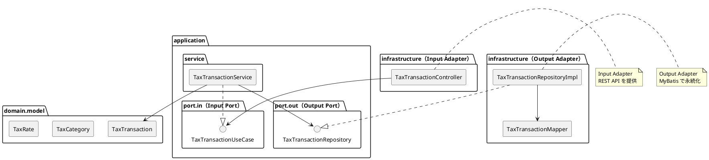

# 第11章: 課税取引マスタ

## 11.1 本章の概要

本章では、第3章で解説したヘキサゴナルアーキテクチャに従い、課税取引マスタの機能実装を TDD で進めます。消費税の課税区分、税率管理、消費税計算のロジックを実装します。

### アーキテクチャの全体像



### パッケージ構成

```
com.example.accounting/
├── domain/
│   └── model/
│       └── tax/
│           ├── TaxTransaction.java      # ドメインモデル
│           ├── TaxCategory.java         # 課税区分（列挙型）
│           └── TaxRate.java             # 税率（値オブジェクト）
├── application/
│   ├── port/
│   │   ├── in/
│   │   │   ├── TaxTransactionUseCase.java  # Input Port
│   │   │   └── command/
│   │   │       ├── CreateTaxTransactionCommand.java
│   │   │       └── UpdateTaxTransactionCommand.java
│   │   └── out/
│   │       └── TaxTransactionRepository.java  # Output Port
│   └── service/
│       └── TaxTransactionService.java   # Application Service
└── infrastructure/
    ├── persistence/
    │   ├── mapper/
    │   │   └── TaxTransactionMapper.java  # MyBatis Mapper
    │   └── repository/
    │       └── TaxTransactionRepositoryImpl.java  # Output Adapter
    └── web/
        ├── controller/
        │   └── TaxTransactionController.java  # Input Adapter
        └── dto/
            ├── TaxTransactionRequest.java
            └── TaxTransactionResponse.java
```

### TDD の流れ

1. **Domain Model**: ドメインモデルの作成（TaxTransaction, TaxCategory, TaxRate）
2. **Output Port**: リポジトリインターフェースの定義
3. **Output Adapter**: Testcontainers でリポジトリ実装をテスト
4. **Input Port**: ユースケースインターフェースの定義
5. **Application Service**: Mockito でアプリケーションサービスをテスト
6. **Input Adapter**: Testcontainers で REST API 統合テスト

---

## 11.2 消費税の基礎知識

### 課税区分

消費税は取引の種類によって課税区分が異なります。

| 課税区分 | 説明 | 例 |
|---------|------|-----|
| 課税取引 | 消費税が課される取引 | 商品販売、サービス提供 |
| 非課税取引 | 政策的理由で課税されない取引 | 土地譲渡、医療、教育 |
| 免税取引 | 輸出等、0% が適用される取引 | 輸出売上 |
| 不課税取引 | 消費税の対象外の取引 | 給与、寄付金 |

### 税率体系

日本の消費税は2019年10月より以下の税率が適用されています。

| 税率区分 | 税率 | 適用対象 |
|---------|------|---------|
| 標準税率 | 10% | 一般的な商品・サービス |
| 軽減税率 | 8% | 飲食料品、定期購読新聞 |

---

## 11.3 Domain Model の実装

### 11.3.1 TaxCategory 列挙型

```java
package com.example.accounting.domain.model.tax;

/**
 * 課税区分
 */
public enum TaxCategory {
    TAXABLE("課税", true),
    TAX_EXEMPT("非課税", false),
    ZERO_RATED("免税", true),
    NON_TAXABLE("不課税", false);

    private final String displayName;
    private final boolean requiresTaxRate;

    TaxCategory(String displayName, boolean requiresTaxRate) {
        this.displayName = displayName;
        this.requiresTaxRate = requiresTaxRate;
    }

    public String getDisplayName() {
        return displayName;
    }

    /**
     * 税率の設定が必要かどうか
     */
    public boolean requiresTaxRate() {
        return requiresTaxRate;
    }

    /**
     * 消費税計算の対象かどうか
     */
    public boolean isTaxCalculationRequired() {
        return this == TAXABLE;
    }

    public static TaxCategory fromDisplayName(String displayName) {
        for (TaxCategory category : values()) {
            if (category.displayName.equals(displayName)) {
                return category;
            }
        }
        throw new IllegalArgumentException("Unknown tax category: " + displayName);
    }
}
```

### 11.3.2 TaxRate 値オブジェクト

```java
package com.example.accounting.domain.model.tax;

import java.math.BigDecimal;
import java.math.RoundingMode;
import java.time.LocalDate;
import java.util.Objects;

/**
 * 税率（値オブジェクト）
 */
public final class TaxRate {

    public static final TaxRate STANDARD_RATE = new TaxRate(
        new BigDecimal("0.10"), "標準税率", LocalDate.of(2019, 10, 1), null
    );
    public static final TaxRate REDUCED_RATE = new TaxRate(
        new BigDecimal("0.08"), "軽減税率", LocalDate.of(2019, 10, 1), null
    );
    public static final TaxRate ZERO_RATE = new TaxRate(
        BigDecimal.ZERO, "免税", null, null
    );

    private final BigDecimal rate;
    private final String rateName;
    private final LocalDate effectiveFrom;
    private final LocalDate effectiveTo;

    public TaxRate(BigDecimal rate, String rateName,
                   LocalDate effectiveFrom, LocalDate effectiveTo) {
        Objects.requireNonNull(rate, "税率は必須です");
        if (rate.compareTo(BigDecimal.ZERO) < 0) {
            throw new IllegalArgumentException("税率は0以上である必要があります");
        }
        if (rate.compareTo(BigDecimal.ONE) > 0) {
            throw new IllegalArgumentException("税率は100%以下である必要があります");
        }

        this.rate = rate;
        this.rateName = rateName != null ? rateName : "";
        this.effectiveFrom = effectiveFrom;
        this.effectiveTo = effectiveTo;
    }

    /**
     * 税率を取得（小数表記）
     */
    public BigDecimal getRate() {
        return rate;
    }

    /**
     * 税率を取得（%表記）
     */
    public BigDecimal getRateAsPercentage() {
        return rate.multiply(new BigDecimal("100"));
    }

    public String getRateName() {
        return rateName;
    }

    public LocalDate getEffectiveFrom() {
        return effectiveFrom;
    }

    public LocalDate getEffectiveTo() {
        return effectiveTo;
    }

    /**
     * 指定日に有効かどうか
     */
    public boolean isEffectiveOn(LocalDate date) {
        if (effectiveFrom != null && date.isBefore(effectiveFrom)) {
            return false;
        }
        if (effectiveTo != null && date.isAfter(effectiveTo)) {
            return false;
        }
        return true;
    }

    /**
     * 税込金額から税抜金額を計算
     */
    public BigDecimal calculateTaxExcludedAmount(BigDecimal taxIncludedAmount) {
        if (rate.compareTo(BigDecimal.ZERO) == 0) {
            return taxIncludedAmount;
        }
        BigDecimal divisor = BigDecimal.ONE.add(rate);
        return taxIncludedAmount.divide(divisor, 0, RoundingMode.DOWN);
    }

    /**
     * 税抜金額から税込金額を計算
     */
    public BigDecimal calculateTaxIncludedAmount(BigDecimal taxExcludedAmount) {
        BigDecimal taxAmount = calculateTaxAmount(taxExcludedAmount);
        return taxExcludedAmount.add(taxAmount);
    }

    /**
     * 税抜金額から消費税額を計算
     */
    public BigDecimal calculateTaxAmount(BigDecimal taxExcludedAmount) {
        return taxExcludedAmount.multiply(rate).setScale(0, RoundingMode.DOWN);
    }

    @Override
    public boolean equals(Object o) {
        if (this == o) return true;
        if (o == null || getClass() != o.getClass()) return false;
        TaxRate taxRate = (TaxRate) o;
        return rate.compareTo(taxRate.rate) == 0 &&
               Objects.equals(effectiveFrom, taxRate.effectiveFrom) &&
               Objects.equals(effectiveTo, taxRate.effectiveTo);
    }

    @Override
    public int hashCode() {
        return Objects.hash(rate, effectiveFrom, effectiveTo);
    }

    @Override
    public String toString() {
        return String.format("TaxRate{%s%% (%s)}", getRateAsPercentage(), rateName);
    }
}
```

### 11.3.3 TaxRate のテスト

```java
package com.example.accounting.domain.model.tax;

import org.junit.jupiter.api.DisplayName;
import org.junit.jupiter.api.Nested;
import org.junit.jupiter.api.Test;

import java.math.BigDecimal;
import java.time.LocalDate;

import static org.assertj.core.api.Assertions.*;

@DisplayName("TaxRate 値オブジェクトのテスト")
class TaxRateTest {

    @Nested
    @DisplayName("税額計算")
    class TaxCalculation {

        @Test
        @DisplayName("標準税率10%で税額を計算できる")
        void shouldCalculateTaxAmountWithStandardRate() {
            // Given
            TaxRate rate = TaxRate.STANDARD_RATE;
            BigDecimal amount = new BigDecimal("10000");

            // When
            BigDecimal taxAmount = rate.calculateTaxAmount(amount);

            // Then
            assertThat(taxAmount).isEqualByComparingTo(new BigDecimal("1000"));
        }

        @Test
        @DisplayName("軽減税率8%で税額を計算できる")
        void shouldCalculateTaxAmountWithReducedRate() {
            // Given
            TaxRate rate = TaxRate.REDUCED_RATE;
            BigDecimal amount = new BigDecimal("10000");

            // When
            BigDecimal taxAmount = rate.calculateTaxAmount(amount);

            // Then
            assertThat(taxAmount).isEqualByComparingTo(new BigDecimal("800"));
        }

        @Test
        @DisplayName("税額は切り捨てで計算される")
        void shouldRoundDownTaxAmount() {
            // Given
            TaxRate rate = TaxRate.STANDARD_RATE;
            BigDecimal amount = new BigDecimal("9999");

            // When
            BigDecimal taxAmount = rate.calculateTaxAmount(amount);

            // Then
            // 9999 * 0.10 = 999.9 → 切り捨てで 999
            assertThat(taxAmount).isEqualByComparingTo(new BigDecimal("999"));
        }

        @Test
        @DisplayName("税込金額を計算できる")
        void shouldCalculateTaxIncludedAmount() {
            // Given
            TaxRate rate = TaxRate.STANDARD_RATE;
            BigDecimal taxExcluded = new BigDecimal("10000");

            // When
            BigDecimal taxIncluded = rate.calculateTaxIncludedAmount(taxExcluded);

            // Then
            assertThat(taxIncluded).isEqualByComparingTo(new BigDecimal("11000"));
        }

        @Test
        @DisplayName("税込金額から税抜金額を計算できる")
        void shouldCalculateTaxExcludedAmount() {
            // Given
            TaxRate rate = TaxRate.STANDARD_RATE;
            BigDecimal taxIncluded = new BigDecimal("11000");

            // When
            BigDecimal taxExcluded = rate.calculateTaxExcludedAmount(taxIncluded);

            // Then
            assertThat(taxExcluded).isEqualByComparingTo(new BigDecimal("10000"));
        }
    }

    @Nested
    @DisplayName("有効期間")
    class EffectivePeriod {

        @Test
        @DisplayName("有効期間内の日付で true を返す")
        void shouldReturnTrueWhenDateIsWithinEffectivePeriod() {
            // Given
            TaxRate rate = new TaxRate(
                new BigDecimal("0.10"), "標準税率",
                LocalDate.of(2019, 10, 1), LocalDate.of(2099, 12, 31)
            );

            // When & Then
            assertThat(rate.isEffectiveOn(LocalDate.of(2024, 1, 1))).isTrue();
        }

        @Test
        @DisplayName("有効期間前の日付で false を返す")
        void shouldReturnFalseWhenDateIsBeforeEffectivePeriod() {
            // Given
            TaxRate rate = new TaxRate(
                new BigDecimal("0.10"), "標準税率",
                LocalDate.of(2019, 10, 1), null
            );

            // When & Then
            assertThat(rate.isEffectiveOn(LocalDate.of(2019, 9, 30))).isFalse();
        }

        @Test
        @DisplayName("有効期間後の日付で false を返す")
        void shouldReturnFalseWhenDateIsAfterEffectivePeriod() {
            // Given
            TaxRate rate = new TaxRate(
                new BigDecimal("0.08"), "旧税率",
                LocalDate.of(2014, 4, 1), LocalDate.of(2019, 9, 30)
            );

            // When & Then
            assertThat(rate.isEffectiveOn(LocalDate.of(2019, 10, 1))).isFalse();
        }
    }

    @Nested
    @DisplayName("バリデーション")
    class Validation {

        @Test
        @DisplayName("税率が null の場合は例外")
        void shouldThrowWhenRateIsNull() {
            assertThatThrownBy(() -> new TaxRate(null, "test", null, null))
                .isInstanceOf(NullPointerException.class)
                .hasMessageContaining("税率は必須です");
        }

        @Test
        @DisplayName("税率が負の場合は例外")
        void shouldThrowWhenRateIsNegative() {
            assertThatThrownBy(() ->
                new TaxRate(new BigDecimal("-0.01"), "test", null, null))
                .isInstanceOf(IllegalArgumentException.class)
                .hasMessageContaining("0以上");
        }

        @Test
        @DisplayName("税率が100%を超える場合は例外")
        void shouldThrowWhenRateExceedsOneHundredPercent() {
            assertThatThrownBy(() ->
                new TaxRate(new BigDecimal("1.01"), "test", null, null))
                .isInstanceOf(IllegalArgumentException.class)
                .hasMessageContaining("100%以下");
        }
    }
}
```

### 11.3.4 TaxTransaction ドメインモデル

```java
package com.example.accounting.domain.model.tax;

import lombok.Value;
import lombok.With;

import java.math.BigDecimal;
import java.time.LocalDate;
import java.time.LocalDateTime;
import java.util.Objects;

/**
 * 課税取引ドメインモデル
 */
@Value
@With
public class TaxTransaction {

    Integer taxTransactionId;
    String taxTransactionCode;
    String taxTransactionName;
    TaxCategory taxCategory;
    BigDecimal taxRateValue;
    String taxRateName;
    LocalDate effectiveFrom;
    LocalDate effectiveTo;
    Boolean isReducedRate;
    Integer displayOrder;
    LocalDateTime createdAt;
    LocalDateTime updatedAt;

    /**
     * 新規課税取引を作成
     */
    public static TaxTransaction create(
            String taxTransactionCode,
            String taxTransactionName,
            TaxCategory taxCategory,
            TaxRate taxRate,
            boolean isReducedRate) {

        Objects.requireNonNull(taxTransactionCode, "課税取引コードは必須です");
        Objects.requireNonNull(taxTransactionName, "課税取引名は必須です");
        Objects.requireNonNull(taxCategory, "課税区分は必須です");

        if (taxCategory.requiresTaxRate() && taxRate == null) {
            throw new IllegalArgumentException(
                "課税区分が「" + taxCategory.getDisplayName() + "」の場合、税率は必須です");
        }

        BigDecimal rateValue = taxRate != null ? taxRate.getRate() : BigDecimal.ZERO;
        String rateName = taxRate != null ? taxRate.getRateName() : null;
        LocalDate from = taxRate != null ? taxRate.getEffectiveFrom() : null;
        LocalDate to = taxRate != null ? taxRate.getEffectiveTo() : null;

        return new TaxTransaction(
            null,
            taxTransactionCode,
            taxTransactionName,
            taxCategory,
            rateValue,
            rateName,
            from,
            to,
            isReducedRate,
            null,
            null,
            null
        );
    }

    /**
     * 課税取引を作成（非課税・不課税用）
     */
    public static TaxTransaction createNonTaxable(
            String taxTransactionCode,
            String taxTransactionName,
            TaxCategory taxCategory) {

        if (taxCategory.requiresTaxRate()) {
            throw new IllegalArgumentException(
                "課税区分が「" + taxCategory.getDisplayName() + "」の場合、このメソッドは使用できません");
        }

        return new TaxTransaction(
            null,
            taxTransactionCode,
            taxTransactionName,
            taxCategory,
            BigDecimal.ZERO,
            null,
            null,
            null,
            false,
            null,
            null,
            null
        );
    }

    /**
     * TaxRate を取得
     */
    public TaxRate getTaxRate() {
        if (!taxCategory.requiresTaxRate()) {
            return TaxRate.ZERO_RATE;
        }
        return new TaxRate(taxRateValue, taxRateName, effectiveFrom, effectiveTo);
    }

    /**
     * 税額を計算
     */
    public BigDecimal calculateTaxAmount(BigDecimal taxExcludedAmount) {
        if (!taxCategory.isTaxCalculationRequired()) {
            return BigDecimal.ZERO;
        }
        return getTaxRate().calculateTaxAmount(taxExcludedAmount);
    }

    /**
     * 税込金額を計算
     */
    public BigDecimal calculateTaxIncludedAmount(BigDecimal taxExcludedAmount) {
        if (!taxCategory.isTaxCalculationRequired()) {
            return taxExcludedAmount;
        }
        return getTaxRate().calculateTaxIncludedAmount(taxExcludedAmount);
    }

    /**
     * 指定日に有効かどうか
     */
    public boolean isEffectiveOn(LocalDate date) {
        return getTaxRate().isEffectiveOn(date);
    }

    /**
     * 軽減税率かどうか
     */
    public boolean isReducedTaxRate() {
        return Boolean.TRUE.equals(isReducedRate);
    }

    /**
     * 課税対象かどうか
     */
    public boolean isTaxable() {
        return taxCategory == TaxCategory.TAXABLE;
    }
}
```

---

## 11.4 Output Port（リポジトリインターフェース）

```java
package com.example.accounting.application.port.out;

import com.example.accounting.domain.model.tax.TaxCategory;
import com.example.accounting.domain.model.tax.TaxTransaction;

import java.time.LocalDate;
import java.util.List;
import java.util.Optional;

/**
 * 課税取引リポジトリ（Output Port）
 */
public interface TaxTransactionRepository {

    TaxTransaction save(TaxTransaction taxTransaction);

    Optional<TaxTransaction> findByCode(String taxTransactionCode);

    Optional<TaxTransaction> findById(Integer taxTransactionId);

    List<TaxTransaction> findAll();

    List<TaxTransaction> findByCategory(TaxCategory taxCategory);

    List<TaxTransaction> findEffectiveOn(LocalDate date);

    List<TaxTransaction> findReducedRateTransactions();

    void deleteByCode(String taxTransactionCode);

    boolean existsByCode(String taxTransactionCode);

    long count();
}
```

---

## 11.5 Output Adapter（リポジトリ実装）

### 11.5.1 MyBatis Mapper

```java
package com.example.accounting.infrastructure.persistence.mapper;

import com.example.accounting.infrastructure.persistence.entity.TaxTransactionEntity;
import org.apache.ibatis.annotations.Mapper;
import org.apache.ibatis.annotations.Param;

import java.time.LocalDate;
import java.util.List;

@Mapper
public interface TaxTransactionMapper {

    void insert(TaxTransactionEntity entity);

    TaxTransactionEntity selectByCode(@Param("taxTransactionCode") String taxTransactionCode);

    TaxTransactionEntity selectById(@Param("taxTransactionId") Integer taxTransactionId);

    List<TaxTransactionEntity> selectAll();

    List<TaxTransactionEntity> selectByCategory(@Param("taxCategory") String taxCategory);

    List<TaxTransactionEntity> selectEffectiveOn(@Param("date") LocalDate date);

    List<TaxTransactionEntity> selectReducedRateTransactions();

    void update(TaxTransactionEntity entity);

    void deleteByCode(@Param("taxTransactionCode") String taxTransactionCode);

    void deleteAll();

    long count();
}
```

**TaxTransactionMapper.xml**:

```xml
<?xml version="1.0" encoding="UTF-8" ?>
<!DOCTYPE mapper PUBLIC "-//mybatis.org//DTD Mapper 3.0//EN"
        "http://mybatis.org/dtd/mybatis-3-mapper.dtd">
<mapper namespace="com.example.accounting.infrastructure.persistence.mapper.TaxTransactionMapper">

    <resultMap id="TaxTransactionEntityResultMap"
               type="com.example.accounting.infrastructure.persistence.entity.TaxTransactionEntity">
        <id property="taxTransactionId" column="課税取引ID"/>
        <result property="taxTransactionCode" column="課税取引コード"/>
        <result property="taxTransactionName" column="課税取引名"/>
        <result property="taxCategory" column="課税区分"/>
        <result property="taxRateValue" column="税率"/>
        <result property="taxRateName" column="税率名"/>
        <result property="effectiveFrom" column="適用開始日"/>
        <result property="effectiveTo" column="適用終了日"/>
        <result property="isReducedRate" column="軽減税率"/>
        <result property="displayOrder" column="表示順序"/>
        <result property="createdAt" column="作成日時"/>
        <result property="updatedAt" column="更新日時"/>
    </resultMap>

    <insert id="insert" useGeneratedKeys="true" keyProperty="taxTransactionId" keyColumn="課税取引ID">
        INSERT INTO "課税取引マスタ" (
            "課税取引コード", "課税取引名", "課税区分",
            "税率", "税率名", "適用開始日", "適用終了日",
            "軽減税率", "表示順序"
        ) VALUES (
            #{taxTransactionCode}, #{taxTransactionName}, #{taxCategory},
            #{taxRateValue}, #{taxRateName}, #{effectiveFrom}, #{effectiveTo},
            #{isReducedRate}, #{displayOrder}
        )
    </insert>

    <select id="selectByCode" resultMap="TaxTransactionEntityResultMap">
        SELECT * FROM "課税取引マスタ"
        WHERE "課税取引コード" = #{taxTransactionCode}
    </select>

    <select id="selectById" resultMap="TaxTransactionEntityResultMap">
        SELECT * FROM "課税取引マスタ"
        WHERE "課税取引ID" = #{taxTransactionId}
    </select>

    <select id="selectAll" resultMap="TaxTransactionEntityResultMap">
        SELECT * FROM "課税取引マスタ"
        ORDER BY "表示順序", "課税取引コード"
    </select>

    <select id="selectByCategory" resultMap="TaxTransactionEntityResultMap">
        SELECT * FROM "課税取引マスタ"
        WHERE "課税区分" = #{taxCategory}
        ORDER BY "表示順序", "課税取引コード"
    </select>

    <select id="selectEffectiveOn" resultMap="TaxTransactionEntityResultMap">
        SELECT * FROM "課税取引マスタ"
        WHERE ("適用開始日" IS NULL OR "適用開始日" &lt;= #{date})
          AND ("適用終了日" IS NULL OR "適用終了日" &gt;= #{date})
        ORDER BY "表示順序", "課税取引コード"
    </select>

    <select id="selectReducedRateTransactions" resultMap="TaxTransactionEntityResultMap">
        SELECT * FROM "課税取引マスタ"
        WHERE "軽減税率" = true
        ORDER BY "表示順序", "課税取引コード"
    </select>

    <update id="update">
        UPDATE "課税取引マスタ"
        SET "課税取引名" = #{taxTransactionName},
            "課税区分" = #{taxCategory},
            "税率" = #{taxRateValue},
            "税率名" = #{taxRateName},
            "適用開始日" = #{effectiveFrom},
            "適用終了日" = #{effectiveTo},
            "軽減税率" = #{isReducedRate},
            "表示順序" = #{displayOrder},
            "更新日時" = CURRENT_TIMESTAMP
        WHERE "課税取引コード" = #{taxTransactionCode}
    </update>

    <delete id="deleteByCode">
        DELETE FROM "課税取引マスタ"
        WHERE "課税取引コード" = #{taxTransactionCode}
    </delete>

    <delete id="deleteAll">
        DELETE FROM "課税取引マスタ"
    </delete>

    <select id="count" resultType="long">
        SELECT COUNT(*) FROM "課税取引マスタ"
    </select>
</mapper>
```

### 11.5.2 Entity クラス

```java
package com.example.accounting.infrastructure.persistence.entity;

import com.example.accounting.domain.model.tax.TaxCategory;
import com.example.accounting.domain.model.tax.TaxTransaction;
import lombok.Data;

import java.math.BigDecimal;
import java.time.LocalDate;
import java.time.LocalDateTime;

/**
 * 課税取引エンティティ（MyBatis 用）
 */
@Data
public class TaxTransactionEntity {

    private Integer taxTransactionId;
    private String taxTransactionCode;
    private String taxTransactionName;
    private String taxCategory;
    private BigDecimal taxRateValue;
    private String taxRateName;
    private LocalDate effectiveFrom;
    private LocalDate effectiveTo;
    private Boolean isReducedRate;
    private Integer displayOrder;
    private LocalDateTime createdAt;
    private LocalDateTime updatedAt;

    /**
     * ドメインモデルからエンティティを作成
     */
    public static TaxTransactionEntity from(TaxTransaction taxTransaction) {
        TaxTransactionEntity entity = new TaxTransactionEntity();
        entity.setTaxTransactionId(taxTransaction.getTaxTransactionId());
        entity.setTaxTransactionCode(taxTransaction.getTaxTransactionCode());
        entity.setTaxTransactionName(taxTransaction.getTaxTransactionName());
        entity.setTaxCategory(taxTransaction.getTaxCategory().name());
        entity.setTaxRateValue(taxTransaction.getTaxRateValue());
        entity.setTaxRateName(taxTransaction.getTaxRateName());
        entity.setEffectiveFrom(taxTransaction.getEffectiveFrom());
        entity.setEffectiveTo(taxTransaction.getEffectiveTo());
        entity.setIsReducedRate(taxTransaction.getIsReducedRate());
        entity.setDisplayOrder(taxTransaction.getDisplayOrder());
        entity.setCreatedAt(taxTransaction.getCreatedAt());
        entity.setUpdatedAt(taxTransaction.getUpdatedAt());
        return entity;
    }

    /**
     * ドメインモデルに変換
     */
    public TaxTransaction toDomain() {
        return new TaxTransaction(
            taxTransactionId,
            taxTransactionCode,
            taxTransactionName,
            TaxCategory.valueOf(taxCategory),
            taxRateValue,
            taxRateName,
            effectiveFrom,
            effectiveTo,
            isReducedRate,
            displayOrder,
            createdAt,
            updatedAt
        );
    }
}
```

### 11.5.3 Repository 実装（Output Adapter）

```java
package com.example.accounting.infrastructure.persistence.repository;

import com.example.accounting.application.port.out.TaxTransactionRepository;
import com.example.accounting.domain.model.tax.TaxCategory;
import com.example.accounting.domain.model.tax.TaxTransaction;
import com.example.accounting.infrastructure.persistence.entity.TaxTransactionEntity;
import com.example.accounting.infrastructure.persistence.mapper.TaxTransactionMapper;
import lombok.RequiredArgsConstructor;
import org.springframework.stereotype.Repository;

import java.time.LocalDate;
import java.util.List;
import java.util.Optional;

/**
 * 課税取引リポジトリ実装（Output Adapter）
 */
@Repository
@RequiredArgsConstructor
public class TaxTransactionRepositoryImpl implements TaxTransactionRepository {

    private final TaxTransactionMapper taxTransactionMapper;

    @Override
    public TaxTransaction save(TaxTransaction taxTransaction) {
        TaxTransactionEntity entity = TaxTransactionEntity.from(taxTransaction);

        if (taxTransaction.getTaxTransactionId() == null) {
            taxTransactionMapper.insert(entity);
            return entity.toDomain();
        } else {
            taxTransactionMapper.update(entity);
            return taxTransaction;
        }
    }

    @Override
    public Optional<TaxTransaction> findByCode(String taxTransactionCode) {
        TaxTransactionEntity entity = taxTransactionMapper.selectByCode(taxTransactionCode);
        return Optional.ofNullable(entity).map(TaxTransactionEntity::toDomain);
    }

    @Override
    public Optional<TaxTransaction> findById(Integer taxTransactionId) {
        TaxTransactionEntity entity = taxTransactionMapper.selectById(taxTransactionId);
        return Optional.ofNullable(entity).map(TaxTransactionEntity::toDomain);
    }

    @Override
    public List<TaxTransaction> findAll() {
        return taxTransactionMapper.selectAll().stream()
            .map(TaxTransactionEntity::toDomain)
            .toList();
    }

    @Override
    public List<TaxTransaction> findByCategory(TaxCategory taxCategory) {
        return taxTransactionMapper.selectByCategory(taxCategory.name()).stream()
            .map(TaxTransactionEntity::toDomain)
            .toList();
    }

    @Override
    public List<TaxTransaction> findEffectiveOn(LocalDate date) {
        return taxTransactionMapper.selectEffectiveOn(date).stream()
            .map(TaxTransactionEntity::toDomain)
            .toList();
    }

    @Override
    public List<TaxTransaction> findReducedRateTransactions() {
        return taxTransactionMapper.selectReducedRateTransactions().stream()
            .map(TaxTransactionEntity::toDomain)
            .toList();
    }

    @Override
    public void deleteByCode(String taxTransactionCode) {
        taxTransactionMapper.deleteByCode(taxTransactionCode);
    }

    @Override
    public boolean existsByCode(String taxTransactionCode) {
        return taxTransactionMapper.selectByCode(taxTransactionCode) != null;
    }

    @Override
    public long count() {
        return taxTransactionMapper.count();
    }
}
```

### 11.5.4 Repository 実装のテスト（Testcontainers）

```java
package com.example.accounting.infrastructure.persistence.repository;

import com.example.accounting.application.port.out.TaxTransactionRepository;
import com.example.accounting.domain.model.tax.TaxCategory;
import com.example.accounting.domain.model.tax.TaxRate;
import com.example.accounting.domain.model.tax.TaxTransaction;
import org.junit.jupiter.api.*;
import org.springframework.beans.factory.annotation.Autowired;
import org.springframework.boot.test.context.SpringBootTest;
import org.springframework.test.context.DynamicPropertyRegistry;
import org.springframework.test.context.DynamicPropertySource;
import org.testcontainers.containers.PostgreSQLContainer;
import org.testcontainers.junit.jupiter.Container;
import org.testcontainers.junit.jupiter.Testcontainers;

import java.time.LocalDate;
import java.util.List;
import java.util.Optional;

import static org.assertj.core.api.Assertions.assertThat;

@SpringBootTest
@Testcontainers
@TestMethodOrder(MethodOrderer.OrderAnnotation.class)
@DisplayName("課税取引リポジトリ実装のテスト")
class TaxTransactionRepositoryImplTest {

    @Container
    static PostgreSQLContainer<?> postgres = new PostgreSQLContainer<>("postgres:16-alpine")
            .withDatabaseName("testdb")
            .withUsername("testuser")
            .withPassword("testpass");

    @DynamicPropertySource
    static void configureProperties(DynamicPropertyRegistry registry) {
        registry.add("spring.datasource.url", postgres::getJdbcUrl);
        registry.add("spring.datasource.username", postgres::getUsername);
        registry.add("spring.datasource.password", postgres::getPassword);
        registry.add("spring.flyway.enabled", () -> "true");
    }

    @Autowired
    private TaxTransactionRepository taxTransactionRepository;

    @Test
    @Order(1)
    @DisplayName("課税取引を保存できる")
    void shouldSaveTaxTransaction() {
        // Given
        TaxTransaction taxTransaction = TaxTransaction.create(
            "TAX10",
            "課税売上10%",
            TaxCategory.TAXABLE,
            TaxRate.STANDARD_RATE,
            false
        );

        // When
        TaxTransaction saved = taxTransactionRepository.save(taxTransaction);

        // Then
        assertThat(saved.getTaxTransactionId()).isNotNull();
        assertThat(saved.getTaxTransactionCode()).isEqualTo("TAX10");
        assertThat(saved.getTaxTransactionName()).isEqualTo("課税売上10%");
        assertThat(saved.getTaxCategory()).isEqualTo(TaxCategory.TAXABLE);
    }

    @Test
    @Order(2)
    @DisplayName("課税取引コードで検索できる")
    void shouldFindByCode() {
        // When
        Optional<TaxTransaction> found = taxTransactionRepository.findByCode("TAX10");

        // Then
        assertThat(found).isPresent();
        assertThat(found.get().getTaxTransactionName()).isEqualTo("課税売上10%");
    }

    @Test
    @Order(3)
    @DisplayName("軽減税率の課税取引を保存できる")
    void shouldSaveReducedRateTaxTransaction() {
        // Given
        TaxTransaction taxTransaction = TaxTransaction.create(
            "TAX08",
            "課税売上8%（軽減）",
            TaxCategory.TAXABLE,
            TaxRate.REDUCED_RATE,
            true
        );

        // When
        TaxTransaction saved = taxTransactionRepository.save(taxTransaction);

        // Then
        assertThat(saved.getIsReducedRate()).isTrue();
    }

    @Test
    @Order(4)
    @DisplayName("非課税取引を保存できる")
    void shouldSaveNonTaxableTransaction() {
        // Given
        TaxTransaction taxTransaction = TaxTransaction.createNonTaxable(
            "EXEMPT01",
            "非課税売上",
            TaxCategory.TAX_EXEMPT
        );

        // When
        TaxTransaction saved = taxTransactionRepository.save(taxTransaction);

        // Then
        assertThat(saved.getTaxCategory()).isEqualTo(TaxCategory.TAX_EXEMPT);
    }

    @Test
    @Order(5)
    @DisplayName("すべての課税取引を取得できる")
    void shouldFindAllTaxTransactions() {
        // When
        List<TaxTransaction> transactions = taxTransactionRepository.findAll();

        // Then
        assertThat(transactions).hasSizeGreaterThanOrEqualTo(3);
    }

    @Test
    @Order(6)
    @DisplayName("課税区分で検索できる")
    void shouldFindByCategory() {
        // When
        List<TaxTransaction> taxable = taxTransactionRepository
            .findByCategory(TaxCategory.TAXABLE);

        // Then
        assertThat(taxable).hasSizeGreaterThanOrEqualTo(2);
        assertThat(taxable).allMatch(t -> t.getTaxCategory() == TaxCategory.TAXABLE);
    }

    @Test
    @Order(7)
    @DisplayName("軽減税率の課税取引を検索できる")
    void shouldFindReducedRateTransactions() {
        // When
        List<TaxTransaction> reduced = taxTransactionRepository.findReducedRateTransactions();

        // Then
        assertThat(reduced).hasSizeGreaterThanOrEqualTo(1);
        assertThat(reduced).allMatch(TaxTransaction::isReducedTaxRate);
    }

    @Test
    @Order(8)
    @DisplayName("有効日で検索できる")
    void shouldFindEffectiveOn() {
        // When
        List<TaxTransaction> effective = taxTransactionRepository
            .findEffectiveOn(LocalDate.now());

        // Then
        assertThat(effective).isNotEmpty();
    }

    @Test
    @Order(9)
    @DisplayName("課税取引を削除できる")
    void shouldDeleteTaxTransaction() {
        // Given
        TaxTransaction temp = TaxTransaction.createNonTaxable(
            "TEMP01", "一時取引", TaxCategory.NON_TAXABLE
        );
        taxTransactionRepository.save(temp);

        // When
        taxTransactionRepository.deleteByCode("TEMP01");

        // Then
        Optional<TaxTransaction> found = taxTransactionRepository.findByCode("TEMP01");
        assertThat(found).isEmpty();
    }

    @Test
    @Order(10)
    @DisplayName("存在しない課税取引コードで検索すると空を返す")
    void shouldReturnEmptyWhenNotFound() {
        // When
        Optional<TaxTransaction> found = taxTransactionRepository.findByCode("NOT_EXIST");

        // Then
        assertThat(found).isEmpty();
    }
}
```

---

## 11.6 Input Port（ユースケースインターフェース）

### 11.6.1 ユースケースインターフェース

```java
package com.example.accounting.application.port.in;

import com.example.accounting.application.port.in.command.CreateTaxTransactionCommand;
import com.example.accounting.application.port.in.command.UpdateTaxTransactionCommand;
import com.example.accounting.domain.model.tax.TaxCategory;
import com.example.accounting.domain.model.tax.TaxTransaction;

import java.math.BigDecimal;
import java.time.LocalDate;
import java.util.List;

/**
 * 課税取引ユースケース（Input Port）
 */
public interface TaxTransactionUseCase {

    /**
     * 課税取引を作成
     */
    TaxTransaction createTaxTransaction(CreateTaxTransactionCommand command);

    /**
     * 課税取引コードで検索
     */
    TaxTransaction findByCode(String taxTransactionCode);

    /**
     * すべての課税取引を取得
     */
    List<TaxTransaction> findAll();

    /**
     * 課税区分で検索
     */
    List<TaxTransaction> findByCategory(TaxCategory taxCategory);

    /**
     * 有効日で検索
     */
    List<TaxTransaction> findEffectiveOn(LocalDate date);

    /**
     * 軽減税率の課税取引を検索
     */
    List<TaxTransaction> findReducedRateTransactions();

    /**
     * 課税取引を更新
     */
    TaxTransaction updateTaxTransaction(UpdateTaxTransactionCommand command);

    /**
     * 課税取引を削除
     */
    void deleteTaxTransaction(String taxTransactionCode);

    /**
     * 消費税額を計算
     */
    BigDecimal calculateTaxAmount(String taxTransactionCode, BigDecimal taxExcludedAmount);

    /**
     * 税込金額を計算
     */
    BigDecimal calculateTaxIncludedAmount(String taxTransactionCode, BigDecimal taxExcludedAmount);
}
```

### 11.6.2 Command クラス

```java
// application/port/in/command/CreateTaxTransactionCommand.java
package com.example.accounting.application.port.in.command;

import com.example.accounting.domain.model.tax.TaxCategory;

import java.math.BigDecimal;
import java.time.LocalDate;
import java.util.Objects;

/**
 * 課税取引作成コマンド
 */
public record CreateTaxTransactionCommand(
    String taxTransactionCode,
    String taxTransactionName,
    TaxCategory taxCategory,
    BigDecimal taxRateValue,
    String taxRateName,
    LocalDate effectiveFrom,
    LocalDate effectiveTo,
    Boolean isReducedRate
) {
    public CreateTaxTransactionCommand {
        Objects.requireNonNull(taxTransactionCode, "課税取引コードは必須です");
        Objects.requireNonNull(taxTransactionName, "課税取引名は必須です");
        Objects.requireNonNull(taxCategory, "課税区分は必須です");

        if (taxTransactionCode.isBlank()) {
            throw new IllegalArgumentException("課税取引コードは空にできません");
        }
        if (taxTransactionName.isBlank()) {
            throw new IllegalArgumentException("課税取引名は空にできません");
        }
        if (taxCategory.requiresTaxRate() && taxRateValue == null) {
            throw new IllegalArgumentException(
                "課税区分が「" + taxCategory.getDisplayName() + "」の場合、税率は必須です");
        }
    }
}

// application/port/in/command/UpdateTaxTransactionCommand.java
package com.example.accounting.application.port.in.command;

import java.math.BigDecimal;
import java.time.LocalDate;
import java.util.Objects;

/**
 * 課税取引更新コマンド
 */
public record UpdateTaxTransactionCommand(
    String taxTransactionCode,
    String taxTransactionName,
    BigDecimal taxRateValue,
    String taxRateName,
    LocalDate effectiveFrom,
    LocalDate effectiveTo,
    Boolean isReducedRate,
    Integer displayOrder
) {
    public UpdateTaxTransactionCommand {
        Objects.requireNonNull(taxTransactionCode, "課税取引コードは必須です");
    }
}
```

### 11.6.3 例外クラス

```java
// application/port/in/exception/TaxTransactionNotFoundException.java
package com.example.accounting.application.port.in.exception;

public class TaxTransactionNotFoundException extends RuntimeException {
    public TaxTransactionNotFoundException(String taxTransactionCode) {
        super("課税取引が見つかりません: " + taxTransactionCode);
    }
}

// application/port/in/exception/TaxTransactionAlreadyExistsException.java
package com.example.accounting.application.port.in.exception;

public class TaxTransactionAlreadyExistsException extends RuntimeException {
    public TaxTransactionAlreadyExistsException(String taxTransactionCode) {
        super("課税取引コードは既に存在します: " + taxTransactionCode);
    }
}
```

---

## 11.7 Application Service

### 11.7.1 アプリケーションサービス実装

```java
package com.example.accounting.application.service;

import com.example.accounting.application.port.in.TaxTransactionUseCase;
import com.example.accounting.application.port.in.command.CreateTaxTransactionCommand;
import com.example.accounting.application.port.in.command.UpdateTaxTransactionCommand;
import com.example.accounting.application.port.in.exception.TaxTransactionAlreadyExistsException;
import com.example.accounting.application.port.in.exception.TaxTransactionNotFoundException;
import com.example.accounting.application.port.out.TaxTransactionRepository;
import com.example.accounting.domain.model.tax.TaxCategory;
import com.example.accounting.domain.model.tax.TaxRate;
import com.example.accounting.domain.model.tax.TaxTransaction;
import lombok.RequiredArgsConstructor;
import org.springframework.stereotype.Service;
import org.springframework.transaction.annotation.Transactional;

import java.math.BigDecimal;
import java.time.LocalDate;
import java.util.List;

/**
 * 課税取引アプリケーションサービス
 */
@Service
@RequiredArgsConstructor
@Transactional
public class TaxTransactionService implements TaxTransactionUseCase {

    private final TaxTransactionRepository taxTransactionRepository;

    @Override
    public TaxTransaction createTaxTransaction(CreateTaxTransactionCommand command) {
        // 重複チェック
        if (taxTransactionRepository.existsByCode(command.taxTransactionCode())) {
            throw new TaxTransactionAlreadyExistsException(command.taxTransactionCode());
        }

        // ドメインモデルを作成
        TaxTransaction taxTransaction;
        if (command.taxCategory().requiresTaxRate()) {
            TaxRate taxRate = new TaxRate(
                command.taxRateValue(),
                command.taxRateName(),
                command.effectiveFrom(),
                command.effectiveTo()
            );
            taxTransaction = TaxTransaction.create(
                command.taxTransactionCode(),
                command.taxTransactionName(),
                command.taxCategory(),
                taxRate,
                Boolean.TRUE.equals(command.isReducedRate())
            );
        } else {
            taxTransaction = TaxTransaction.createNonTaxable(
                command.taxTransactionCode(),
                command.taxTransactionName(),
                command.taxCategory()
            );
        }

        // 永続化
        return taxTransactionRepository.save(taxTransaction);
    }

    @Override
    @Transactional(readOnly = true)
    public TaxTransaction findByCode(String taxTransactionCode) {
        return taxTransactionRepository.findByCode(taxTransactionCode)
            .orElseThrow(() -> new TaxTransactionNotFoundException(taxTransactionCode));
    }

    @Override
    @Transactional(readOnly = true)
    public List<TaxTransaction> findAll() {
        return taxTransactionRepository.findAll();
    }

    @Override
    @Transactional(readOnly = true)
    public List<TaxTransaction> findByCategory(TaxCategory taxCategory) {
        return taxTransactionRepository.findByCategory(taxCategory);
    }

    @Override
    @Transactional(readOnly = true)
    public List<TaxTransaction> findEffectiveOn(LocalDate date) {
        return taxTransactionRepository.findEffectiveOn(date);
    }

    @Override
    @Transactional(readOnly = true)
    public List<TaxTransaction> findReducedRateTransactions() {
        return taxTransactionRepository.findReducedRateTransactions();
    }

    @Override
    public TaxTransaction updateTaxTransaction(UpdateTaxTransactionCommand command) {
        TaxTransaction existing = findByCode(command.taxTransactionCode());

        TaxTransaction updated = existing
            .withTaxTransactionName(
                command.taxTransactionName() != null
                    ? command.taxTransactionName()
                    : existing.getTaxTransactionName()
            )
            .withTaxRateValue(
                command.taxRateValue() != null
                    ? command.taxRateValue()
                    : existing.getTaxRateValue()
            )
            .withTaxRateName(
                command.taxRateName() != null
                    ? command.taxRateName()
                    : existing.getTaxRateName()
            )
            .withEffectiveFrom(
                command.effectiveFrom() != null
                    ? command.effectiveFrom()
                    : existing.getEffectiveFrom()
            )
            .withEffectiveTo(
                command.effectiveTo() != null
                    ? command.effectiveTo()
                    : existing.getEffectiveTo()
            )
            .withIsReducedRate(
                command.isReducedRate() != null
                    ? command.isReducedRate()
                    : existing.getIsReducedRate()
            )
            .withDisplayOrder(
                command.displayOrder() != null
                    ? command.displayOrder()
                    : existing.getDisplayOrder()
            );

        return taxTransactionRepository.save(updated);
    }

    @Override
    public void deleteTaxTransaction(String taxTransactionCode) {
        // 存在チェック
        findByCode(taxTransactionCode);
        taxTransactionRepository.deleteByCode(taxTransactionCode);
    }

    @Override
    @Transactional(readOnly = true)
    public BigDecimal calculateTaxAmount(String taxTransactionCode, BigDecimal taxExcludedAmount) {
        TaxTransaction taxTransaction = findByCode(taxTransactionCode);
        return taxTransaction.calculateTaxAmount(taxExcludedAmount);
    }

    @Override
    @Transactional(readOnly = true)
    public BigDecimal calculateTaxIncludedAmount(String taxTransactionCode, BigDecimal taxExcludedAmount) {
        TaxTransaction taxTransaction = findByCode(taxTransactionCode);
        return taxTransaction.calculateTaxIncludedAmount(taxExcludedAmount);
    }
}
```

### 11.7.2 アプリケーションサービスのテスト（Mockito）

```java
package com.example.accounting.application.service;

import com.example.accounting.application.port.in.command.CreateTaxTransactionCommand;
import com.example.accounting.application.port.in.command.UpdateTaxTransactionCommand;
import com.example.accounting.application.port.in.exception.TaxTransactionAlreadyExistsException;
import com.example.accounting.application.port.in.exception.TaxTransactionNotFoundException;
import com.example.accounting.application.port.out.TaxTransactionRepository;
import com.example.accounting.domain.model.tax.TaxCategory;
import com.example.accounting.domain.model.tax.TaxRate;
import com.example.accounting.domain.model.tax.TaxTransaction;
import org.junit.jupiter.api.*;
import org.junit.jupiter.api.extension.ExtendWith;
import org.mockito.InjectMocks;
import org.mockito.Mock;
import org.mockito.junit.jupiter.MockitoExtension;

import java.math.BigDecimal;
import java.time.LocalDate;
import java.util.List;
import java.util.Optional;

import static org.assertj.core.api.Assertions.*;
import static org.mockito.ArgumentMatchers.any;
import static org.mockito.ArgumentMatchers.anyString;
import static org.mockito.Mockito.*;

@ExtendWith(MockitoExtension.class)
@DisplayName("課税取引アプリケーションサービスのテスト")
class TaxTransactionServiceTest {

    @Mock
    private TaxTransactionRepository taxTransactionRepository;

    @InjectMocks
    private TaxTransactionService taxTransactionService;

    @Test
    @DisplayName("課税取引を作成できる")
    void shouldCreateTaxTransaction() {
        // Given
        CreateTaxTransactionCommand command = new CreateTaxTransactionCommand(
            "TAX10", "課税売上10%", TaxCategory.TAXABLE,
            new BigDecimal("0.10"), "標準税率",
            LocalDate.of(2019, 10, 1), null, false
        );
        when(taxTransactionRepository.existsByCode("TAX10")).thenReturn(false);
        when(taxTransactionRepository.save(any(TaxTransaction.class)))
            .thenAnswer(invocation -> invocation.getArgument(0));

        // When
        TaxTransaction created = taxTransactionService.createTaxTransaction(command);

        // Then
        assertThat(created.getTaxTransactionCode()).isEqualTo("TAX10");
        assertThat(created.getTaxTransactionName()).isEqualTo("課税売上10%");
        assertThat(created.getTaxCategory()).isEqualTo(TaxCategory.TAXABLE);
        verify(taxTransactionRepository).save(any(TaxTransaction.class));
    }

    @Test
    @DisplayName("非課税取引を作成できる")
    void shouldCreateNonTaxableTransaction() {
        // Given
        CreateTaxTransactionCommand command = new CreateTaxTransactionCommand(
            "EXEMPT01", "非課税売上", TaxCategory.TAX_EXEMPT,
            null, null, null, null, false
        );
        when(taxTransactionRepository.existsByCode("EXEMPT01")).thenReturn(false);
        when(taxTransactionRepository.save(any(TaxTransaction.class)))
            .thenAnswer(invocation -> invocation.getArgument(0));

        // When
        TaxTransaction created = taxTransactionService.createTaxTransaction(command);

        // Then
        assertThat(created.getTaxCategory()).isEqualTo(TaxCategory.TAX_EXEMPT);
        assertThat(created.getTaxRateValue()).isEqualByComparingTo(BigDecimal.ZERO);
    }

    @Test
    @DisplayName("重複する課税取引コードは登録できない")
    void shouldNotCreateDuplicateTaxTransaction() {
        // Given
        CreateTaxTransactionCommand command = new CreateTaxTransactionCommand(
            "TAX10", "課税売上10%", TaxCategory.TAXABLE,
            new BigDecimal("0.10"), "標準税率",
            LocalDate.of(2019, 10, 1), null, false
        );
        when(taxTransactionRepository.existsByCode("TAX10")).thenReturn(true);

        // When & Then
        assertThatThrownBy(() -> taxTransactionService.createTaxTransaction(command))
            .isInstanceOf(TaxTransactionAlreadyExistsException.class)
            .hasMessageContaining("TAX10");

        verify(taxTransactionRepository, never()).save(any());
    }

    @Test
    @DisplayName("課税取引コードで検索できる")
    void shouldFindByCode() {
        // Given
        TaxTransaction taxTransaction = TaxTransaction.create(
            "TAX10", "課税売上10%", TaxCategory.TAXABLE,
            TaxRate.STANDARD_RATE, false
        );
        when(taxTransactionRepository.findByCode("TAX10"))
            .thenReturn(Optional.of(taxTransaction));

        // When
        TaxTransaction found = taxTransactionService.findByCode("TAX10");

        // Then
        assertThat(found.getTaxTransactionCode()).isEqualTo("TAX10");
    }

    @Test
    @DisplayName("存在しない課税取引コードで検索すると例外")
    void shouldThrowWhenNotFound() {
        // Given
        when(taxTransactionRepository.findByCode("NOT_EXIST")).thenReturn(Optional.empty());

        // When & Then
        assertThatThrownBy(() -> taxTransactionService.findByCode("NOT_EXIST"))
            .isInstanceOf(TaxTransactionNotFoundException.class)
            .hasMessageContaining("NOT_EXIST");
    }

    @Test
    @DisplayName("すべての課税取引を取得できる")
    void shouldFindAll() {
        // Given
        List<TaxTransaction> transactions = List.of(
            TaxTransaction.create("TAX10", "課税売上10%", TaxCategory.TAXABLE,
                TaxRate.STANDARD_RATE, false),
            TaxTransaction.createNonTaxable("EXEMPT01", "非課税売上", TaxCategory.TAX_EXEMPT)
        );
        when(taxTransactionRepository.findAll()).thenReturn(transactions);

        // When
        List<TaxTransaction> result = taxTransactionService.findAll();

        // Then
        assertThat(result).hasSize(2);
    }

    @Test
    @DisplayName("課税区分で検索できる")
    void shouldFindByCategory() {
        // Given
        List<TaxTransaction> taxable = List.of(
            TaxTransaction.create("TAX10", "課税売上10%", TaxCategory.TAXABLE,
                TaxRate.STANDARD_RATE, false),
            TaxTransaction.create("TAX08", "課税売上8%", TaxCategory.TAXABLE,
                TaxRate.REDUCED_RATE, true)
        );
        when(taxTransactionRepository.findByCategory(TaxCategory.TAXABLE)).thenReturn(taxable);

        // When
        List<TaxTransaction> result = taxTransactionService.findByCategory(TaxCategory.TAXABLE);

        // Then
        assertThat(result).hasSize(2);
        assertThat(result).allMatch(t -> t.getTaxCategory() == TaxCategory.TAXABLE);
    }

    @Test
    @DisplayName("消費税額を計算できる")
    void shouldCalculateTaxAmount() {
        // Given
        TaxTransaction taxTransaction = TaxTransaction.create(
            "TAX10", "課税売上10%", TaxCategory.TAXABLE,
            TaxRate.STANDARD_RATE, false
        );
        when(taxTransactionRepository.findByCode("TAX10"))
            .thenReturn(Optional.of(taxTransaction));

        // When
        BigDecimal taxAmount = taxTransactionService
            .calculateTaxAmount("TAX10", new BigDecimal("10000"));

        // Then
        assertThat(taxAmount).isEqualByComparingTo(new BigDecimal("1000"));
    }

    @Test
    @DisplayName("非課税取引の消費税額は0")
    void shouldReturnZeroTaxAmountForNonTaxable() {
        // Given
        TaxTransaction taxTransaction = TaxTransaction.createNonTaxable(
            "EXEMPT01", "非課税売上", TaxCategory.TAX_EXEMPT
        );
        when(taxTransactionRepository.findByCode("EXEMPT01"))
            .thenReturn(Optional.of(taxTransaction));

        // When
        BigDecimal taxAmount = taxTransactionService
            .calculateTaxAmount("EXEMPT01", new BigDecimal("10000"));

        // Then
        assertThat(taxAmount).isEqualByComparingTo(BigDecimal.ZERO);
    }

    @Test
    @DisplayName("税込金額を計算できる")
    void shouldCalculateTaxIncludedAmount() {
        // Given
        TaxTransaction taxTransaction = TaxTransaction.create(
            "TAX10", "課税売上10%", TaxCategory.TAXABLE,
            TaxRate.STANDARD_RATE, false
        );
        when(taxTransactionRepository.findByCode("TAX10"))
            .thenReturn(Optional.of(taxTransaction));

        // When
        BigDecimal taxIncluded = taxTransactionService
            .calculateTaxIncludedAmount("TAX10", new BigDecimal("10000"));

        // Then
        assertThat(taxIncluded).isEqualByComparingTo(new BigDecimal("11000"));
    }

    @Test
    @DisplayName("課税取引を更新できる")
    void shouldUpdateTaxTransaction() {
        // Given
        TaxTransaction existing = TaxTransaction.create(
            "TAX10", "課税売上10%", TaxCategory.TAXABLE,
            TaxRate.STANDARD_RATE, false
        );
        when(taxTransactionRepository.findByCode("TAX10"))
            .thenReturn(Optional.of(existing));
        when(taxTransactionRepository.save(any(TaxTransaction.class)))
            .thenAnswer(invocation -> invocation.getArgument(0));

        UpdateTaxTransactionCommand command = new UpdateTaxTransactionCommand(
            "TAX10", "課税売上（標準税率）",
            null, null, null, null, null, 10
        );

        // When
        TaxTransaction updated = taxTransactionService.updateTaxTransaction(command);

        // Then
        assertThat(updated.getTaxTransactionName()).isEqualTo("課税売上（標準税率）");
        assertThat(updated.getDisplayOrder()).isEqualTo(10);
        verify(taxTransactionRepository).save(any(TaxTransaction.class));
    }

    @Test
    @DisplayName("課税取引を削除できる")
    void shouldDeleteTaxTransaction() {
        // Given
        TaxTransaction existing = TaxTransaction.create(
            "TAX10", "課税売上10%", TaxCategory.TAXABLE,
            TaxRate.STANDARD_RATE, false
        );
        when(taxTransactionRepository.findByCode("TAX10"))
            .thenReturn(Optional.of(existing));

        // When
        taxTransactionService.deleteTaxTransaction("TAX10");

        // Then
        verify(taxTransactionRepository).deleteByCode("TAX10");
    }

    @Test
    @DisplayName("存在しない課税取引は削除できない")
    void shouldNotDeleteNonExistentTaxTransaction() {
        // Given
        when(taxTransactionRepository.findByCode("NOT_EXIST")).thenReturn(Optional.empty());

        // When & Then
        assertThatThrownBy(() -> taxTransactionService.deleteTaxTransaction("NOT_EXIST"))
            .isInstanceOf(TaxTransactionNotFoundException.class);

        verify(taxTransactionRepository, never()).deleteByCode(anyString());
    }
}
```

---

## 11.8 Input Adapter（REST Controller）

### 11.8.1 DTO クラス

```java
// infrastructure/web/dto/TaxTransactionRequest.java
package com.example.accounting.infrastructure.web.dto;

import com.example.accounting.application.port.in.command.CreateTaxTransactionCommand;
import com.example.accounting.domain.model.tax.TaxCategory;
import jakarta.validation.constraints.NotBlank;
import jakarta.validation.constraints.NotNull;

import java.math.BigDecimal;
import java.time.LocalDate;

public record TaxTransactionRequest(
    @NotBlank(message = "課税取引コードは必須です")
    String taxTransactionCode,

    @NotBlank(message = "課税取引名は必須です")
    String taxTransactionName,

    @NotNull(message = "課税区分は必須です")
    String taxCategory,

    BigDecimal taxRateValue,

    String taxRateName,

    LocalDate effectiveFrom,

    LocalDate effectiveTo,

    Boolean isReducedRate
) {
    public CreateTaxTransactionCommand toCommand() {
        return new CreateTaxTransactionCommand(
            taxTransactionCode,
            taxTransactionName,
            TaxCategory.valueOf(taxCategory),
            taxRateValue,
            taxRateName,
            effectiveFrom,
            effectiveTo,
            isReducedRate
        );
    }
}

// infrastructure/web/dto/TaxTransactionUpdateRequest.java
package com.example.accounting.infrastructure.web.dto;

import com.example.accounting.application.port.in.command.UpdateTaxTransactionCommand;

import java.math.BigDecimal;
import java.time.LocalDate;

public record TaxTransactionUpdateRequest(
    String taxTransactionName,
    BigDecimal taxRateValue,
    String taxRateName,
    LocalDate effectiveFrom,
    LocalDate effectiveTo,
    Boolean isReducedRate,
    Integer displayOrder
) {
    public UpdateTaxTransactionCommand toCommand(String taxTransactionCode) {
        return new UpdateTaxTransactionCommand(
            taxTransactionCode,
            taxTransactionName,
            taxRateValue,
            taxRateName,
            effectiveFrom,
            effectiveTo,
            isReducedRate,
            displayOrder
        );
    }
}

// infrastructure/web/dto/TaxTransactionResponse.java
package com.example.accounting.infrastructure.web.dto;

import com.example.accounting.domain.model.tax.TaxTransaction;

import java.math.BigDecimal;
import java.time.LocalDate;

public record TaxTransactionResponse(
    Integer taxTransactionId,
    String taxTransactionCode,
    String taxTransactionName,
    String taxCategory,
    String taxCategoryDisplayName,
    BigDecimal taxRateValue,
    BigDecimal taxRatePercentage,
    String taxRateName,
    LocalDate effectiveFrom,
    LocalDate effectiveTo,
    Boolean isReducedRate,
    Integer displayOrder
) {
    public static TaxTransactionResponse from(TaxTransaction taxTransaction) {
        BigDecimal ratePercentage = taxTransaction.getTaxRateValue() != null
            ? taxTransaction.getTaxRateValue().multiply(new BigDecimal("100"))
            : BigDecimal.ZERO;

        return new TaxTransactionResponse(
            taxTransaction.getTaxTransactionId(),
            taxTransaction.getTaxTransactionCode(),
            taxTransaction.getTaxTransactionName(),
            taxTransaction.getTaxCategory().name(),
            taxTransaction.getTaxCategory().getDisplayName(),
            taxTransaction.getTaxRateValue(),
            ratePercentage,
            taxTransaction.getTaxRateName(),
            taxTransaction.getEffectiveFrom(),
            taxTransaction.getEffectiveTo(),
            taxTransaction.getIsReducedRate(),
            taxTransaction.getDisplayOrder()
        );
    }
}

// infrastructure/web/dto/TaxCalculationRequest.java
package com.example.accounting.infrastructure.web.dto;

import jakarta.validation.constraints.NotNull;
import jakarta.validation.constraints.Positive;

import java.math.BigDecimal;

public record TaxCalculationRequest(
    @NotNull(message = "金額は必須です")
    @Positive(message = "金額は正の値である必要があります")
    BigDecimal amount
) {}

// infrastructure/web/dto/TaxCalculationResponse.java
package com.example.accounting.infrastructure.web.dto;

import java.math.BigDecimal;

public record TaxCalculationResponse(
    BigDecimal taxExcludedAmount,
    BigDecimal taxAmount,
    BigDecimal taxIncludedAmount
) {}
```

### 11.8.2 Controller 実装

```java
package com.example.accounting.infrastructure.web.controller;

import com.example.accounting.application.port.in.TaxTransactionUseCase;
import com.example.accounting.domain.model.tax.TaxCategory;
import com.example.accounting.domain.model.tax.TaxTransaction;
import com.example.accounting.infrastructure.web.dto.*;
import jakarta.validation.Valid;
import lombok.RequiredArgsConstructor;
import org.springframework.format.annotation.DateTimeFormat;
import org.springframework.http.HttpStatus;
import org.springframework.http.ResponseEntity;
import org.springframework.web.bind.annotation.*;

import java.math.BigDecimal;
import java.time.LocalDate;
import java.util.List;

/**
 * 課税取引 REST Controller（Input Adapter）
 */
@RestController
@RequestMapping("/api/tax-transactions")
@RequiredArgsConstructor
public class TaxTransactionController {

    private final TaxTransactionUseCase taxTransactionUseCase;

    @PostMapping
    public ResponseEntity<TaxTransactionResponse> create(
            @Valid @RequestBody TaxTransactionRequest request) {

        TaxTransaction taxTransaction = taxTransactionUseCase
            .createTaxTransaction(request.toCommand());
        return ResponseEntity.status(HttpStatus.CREATED)
            .body(TaxTransactionResponse.from(taxTransaction));
    }

    @GetMapping("/{taxTransactionCode}")
    public ResponseEntity<TaxTransactionResponse> findByCode(
            @PathVariable String taxTransactionCode) {

        TaxTransaction taxTransaction = taxTransactionUseCase.findByCode(taxTransactionCode);
        return ResponseEntity.ok(TaxTransactionResponse.from(taxTransaction));
    }

    @GetMapping
    public ResponseEntity<List<TaxTransactionResponse>> findAll(
            @RequestParam(required = false) String category,
            @RequestParam(required = false) @DateTimeFormat(iso = DateTimeFormat.ISO.DATE) LocalDate effectiveDate,
            @RequestParam(required = false) Boolean reducedRateOnly) {

        List<TaxTransaction> transactions;

        if (Boolean.TRUE.equals(reducedRateOnly)) {
            transactions = taxTransactionUseCase.findReducedRateTransactions();
        } else if (effectiveDate != null) {
            transactions = taxTransactionUseCase.findEffectiveOn(effectiveDate);
        } else if (category != null) {
            transactions = taxTransactionUseCase.findByCategory(TaxCategory.valueOf(category));
        } else {
            transactions = taxTransactionUseCase.findAll();
        }

        List<TaxTransactionResponse> response = transactions.stream()
            .map(TaxTransactionResponse::from)
            .toList();

        return ResponseEntity.ok(response);
    }

    @PutMapping("/{taxTransactionCode}")
    public ResponseEntity<TaxTransactionResponse> update(
            @PathVariable String taxTransactionCode,
            @Valid @RequestBody TaxTransactionUpdateRequest request) {

        TaxTransaction taxTransaction = taxTransactionUseCase
            .updateTaxTransaction(request.toCommand(taxTransactionCode));
        return ResponseEntity.ok(TaxTransactionResponse.from(taxTransaction));
    }

    @DeleteMapping("/{taxTransactionCode}")
    public ResponseEntity<Void> delete(@PathVariable String taxTransactionCode) {
        taxTransactionUseCase.deleteTaxTransaction(taxTransactionCode);
        return ResponseEntity.noContent().build();
    }

    @PostMapping("/{taxTransactionCode}/calculate")
    public ResponseEntity<TaxCalculationResponse> calculateTax(
            @PathVariable String taxTransactionCode,
            @Valid @RequestBody TaxCalculationRequest request) {

        BigDecimal taxAmount = taxTransactionUseCase
            .calculateTaxAmount(taxTransactionCode, request.amount());
        BigDecimal taxIncludedAmount = taxTransactionUseCase
            .calculateTaxIncludedAmount(taxTransactionCode, request.amount());

        TaxCalculationResponse response = new TaxCalculationResponse(
            request.amount(),
            taxAmount,
            taxIncludedAmount
        );

        return ResponseEntity.ok(response);
    }
}
```

### 11.8.3 例外ハンドラ（追加）

```java
// GlobalExceptionHandler に追加
@ExceptionHandler(TaxTransactionNotFoundException.class)
public ResponseEntity<ErrorResponse> handleTaxTransactionNotFound(
        TaxTransactionNotFoundException e) {
    return ResponseEntity.status(HttpStatus.NOT_FOUND)
        .body(new ErrorResponse("NOT_FOUND", e.getMessage()));
}

@ExceptionHandler(TaxTransactionAlreadyExistsException.class)
public ResponseEntity<ErrorResponse> handleTaxTransactionAlreadyExists(
        TaxTransactionAlreadyExistsException e) {
    return ResponseEntity.status(HttpStatus.CONFLICT)
        .body(new ErrorResponse("CONFLICT", e.getMessage()));
}
```

### 11.8.4 統合テスト（Testcontainers）

```java
package com.example.accounting.infrastructure.web.controller;

import com.fasterxml.jackson.databind.ObjectMapper;
import org.junit.jupiter.api.*;
import org.springframework.beans.factory.annotation.Autowired;
import org.springframework.boot.test.autoconfigure.web.servlet.AutoConfigureMockMvc;
import org.springframework.boot.test.context.SpringBootTest;
import org.springframework.http.MediaType;
import org.springframework.test.context.DynamicPropertyRegistry;
import org.springframework.test.context.DynamicPropertySource;
import org.springframework.test.web.servlet.MockMvc;
import org.testcontainers.containers.PostgreSQLContainer;
import org.testcontainers.junit.jupiter.Container;
import org.testcontainers.junit.jupiter.Testcontainers;

import static org.hamcrest.Matchers.*;
import static org.springframework.test.web.servlet.request.MockMvcRequestBuilders.*;
import static org.springframework.test.web.servlet.result.MockMvcResultMatchers.*;

@SpringBootTest
@AutoConfigureMockMvc
@Testcontainers
@TestMethodOrder(MethodOrderer.OrderAnnotation.class)
@DisplayName("課税取引 API 統合テスト")
class TaxTransactionControllerIntegrationTest {

    @Container
    static PostgreSQLContainer<?> postgres = new PostgreSQLContainer<>("postgres:16-alpine")
            .withDatabaseName("testdb")
            .withUsername("testuser")
            .withPassword("testpass");

    @DynamicPropertySource
    static void configureProperties(DynamicPropertyRegistry registry) {
        registry.add("spring.datasource.url", postgres::getJdbcUrl);
        registry.add("spring.datasource.username", postgres::getUsername);
        registry.add("spring.datasource.password", postgres::getPassword);
        registry.add("spring.flyway.enabled", () -> "true");
    }

    @Autowired
    private MockMvc mockMvc;

    @Autowired
    private ObjectMapper objectMapper;

    @Test
    @Order(1)
    @DisplayName("POST /api/tax-transactions - 課税取引を登録できる")
    void shouldCreateTaxTransaction() throws Exception {
        var request = """
            {
                "taxTransactionCode": "TAX10",
                "taxTransactionName": "課税売上10%",
                "taxCategory": "TAXABLE",
                "taxRateValue": 0.10,
                "taxRateName": "標準税率",
                "effectiveFrom": "2019-10-01",
                "isReducedRate": false
            }
            """;

        mockMvc.perform(post("/api/tax-transactions")
                .contentType(MediaType.APPLICATION_JSON)
                .content(request))
            .andExpect(status().isCreated())
            .andExpect(jsonPath("$.taxTransactionCode").value("TAX10"))
            .andExpect(jsonPath("$.taxTransactionName").value("課税売上10%"))
            .andExpect(jsonPath("$.taxCategory").value("TAXABLE"))
            .andExpect(jsonPath("$.taxCategoryDisplayName").value("課税"))
            .andExpect(jsonPath("$.taxRatePercentage").value(10));
    }

    @Test
    @Order(2)
    @DisplayName("POST /api/tax-transactions - 軽減税率の課税取引を登録できる")
    void shouldCreateReducedRateTaxTransaction() throws Exception {
        var request = """
            {
                "taxTransactionCode": "TAX08",
                "taxTransactionName": "課税売上8%（軽減）",
                "taxCategory": "TAXABLE",
                "taxRateValue": 0.08,
                "taxRateName": "軽減税率",
                "effectiveFrom": "2019-10-01",
                "isReducedRate": true
            }
            """;

        mockMvc.perform(post("/api/tax-transactions")
                .contentType(MediaType.APPLICATION_JSON)
                .content(request))
            .andExpect(status().isCreated())
            .andExpect(jsonPath("$.isReducedRate").value(true))
            .andExpect(jsonPath("$.taxRatePercentage").value(8));
    }

    @Test
    @Order(3)
    @DisplayName("POST /api/tax-transactions - 非課税取引を登録できる")
    void shouldCreateNonTaxableTransaction() throws Exception {
        var request = """
            {
                "taxTransactionCode": "EXEMPT01",
                "taxTransactionName": "非課税売上",
                "taxCategory": "TAX_EXEMPT"
            }
            """;

        mockMvc.perform(post("/api/tax-transactions")
                .contentType(MediaType.APPLICATION_JSON)
                .content(request))
            .andExpect(status().isCreated())
            .andExpect(jsonPath("$.taxCategory").value("TAX_EXEMPT"))
            .andExpect(jsonPath("$.taxRatePercentage").value(0));
    }

    @Test
    @Order(4)
    @DisplayName("GET /api/tax-transactions/{code} - 課税取引を取得できる")
    void shouldGetTaxTransaction() throws Exception {
        mockMvc.perform(get("/api/tax-transactions/TAX10"))
            .andExpect(status().isOk())
            .andExpect(jsonPath("$.taxTransactionCode").value("TAX10"))
            .andExpect(jsonPath("$.taxTransactionName").value("課税売上10%"));
    }

    @Test
    @Order(5)
    @DisplayName("GET /api/tax-transactions - すべての課税取引を取得できる")
    void shouldGetAllTaxTransactions() throws Exception {
        mockMvc.perform(get("/api/tax-transactions"))
            .andExpect(status().isOk())
            .andExpect(jsonPath("$", hasSize(greaterThanOrEqualTo(3))))
            .andExpect(jsonPath("$[*].taxTransactionCode",
                hasItems("TAX10", "TAX08", "EXEMPT01")));
    }

    @Test
    @Order(6)
    @DisplayName("GET /api/tax-transactions?category=TAXABLE - 課税区分で検索できる")
    void shouldGetTaxTransactionsByCategory() throws Exception {
        mockMvc.perform(get("/api/tax-transactions")
                .param("category", "TAXABLE"))
            .andExpect(status().isOk())
            .andExpect(jsonPath("$[*].taxCategory", everyItem(is("TAXABLE"))));
    }

    @Test
    @Order(7)
    @DisplayName("GET /api/tax-transactions?reducedRateOnly=true - 軽減税率の課税取引を検索できる")
    void shouldGetReducedRateTaxTransactions() throws Exception {
        mockMvc.perform(get("/api/tax-transactions")
                .param("reducedRateOnly", "true"))
            .andExpect(status().isOk())
            .andExpect(jsonPath("$[*].isReducedRate", everyItem(is(true))));
    }

    @Test
    @Order(8)
    @DisplayName("POST /api/tax-transactions/{code}/calculate - 消費税額を計算できる")
    void shouldCalculateTaxAmount() throws Exception {
        var request = """
            {
                "amount": 10000
            }
            """;

        mockMvc.perform(post("/api/tax-transactions/TAX10/calculate")
                .contentType(MediaType.APPLICATION_JSON)
                .content(request))
            .andExpect(status().isOk())
            .andExpect(jsonPath("$.taxExcludedAmount").value(10000))
            .andExpect(jsonPath("$.taxAmount").value(1000))
            .andExpect(jsonPath("$.taxIncludedAmount").value(11000));
    }

    @Test
    @Order(9)
    @DisplayName("POST /api/tax-transactions/{code}/calculate - 軽減税率で消費税額を計算できる")
    void shouldCalculateTaxAmountWithReducedRate() throws Exception {
        var request = """
            {
                "amount": 10000
            }
            """;

        mockMvc.perform(post("/api/tax-transactions/TAX08/calculate")
                .contentType(MediaType.APPLICATION_JSON)
                .content(request))
            .andExpect(status().isOk())
            .andExpect(jsonPath("$.taxAmount").value(800))
            .andExpect(jsonPath("$.taxIncludedAmount").value(10800));
    }

    @Test
    @Order(10)
    @DisplayName("POST /api/tax-transactions/{code}/calculate - 非課税の消費税額は0")
    void shouldCalculateZeroTaxForNonTaxable() throws Exception {
        var request = """
            {
                "amount": 10000
            }
            """;

        mockMvc.perform(post("/api/tax-transactions/EXEMPT01/calculate")
                .contentType(MediaType.APPLICATION_JSON)
                .content(request))
            .andExpect(status().isOk())
            .andExpect(jsonPath("$.taxAmount").value(0))
            .andExpect(jsonPath("$.taxIncludedAmount").value(10000));
    }

    @Test
    @Order(11)
    @DisplayName("PUT /api/tax-transactions/{code} - 課税取引を更新できる")
    void shouldUpdateTaxTransaction() throws Exception {
        var request = """
            {
                "taxTransactionName": "課税売上（標準税率10%）",
                "displayOrder": 10
            }
            """;

        mockMvc.perform(put("/api/tax-transactions/TAX10")
                .contentType(MediaType.APPLICATION_JSON)
                .content(request))
            .andExpect(status().isOk())
            .andExpect(jsonPath("$.taxTransactionName").value("課税売上（標準税率10%）"))
            .andExpect(jsonPath("$.displayOrder").value(10));
    }

    @Test
    @Order(12)
    @DisplayName("DELETE /api/tax-transactions/{code} - 課税取引を削除できる")
    void shouldDeleteTaxTransaction() throws Exception {
        // 削除用の課税取引を作成
        var request = """
            {
                "taxTransactionCode": "TEMP01",
                "taxTransactionName": "一時取引",
                "taxCategory": "NON_TAXABLE"
            }
            """;
        mockMvc.perform(post("/api/tax-transactions")
                .contentType(MediaType.APPLICATION_JSON)
                .content(request))
            .andExpect(status().isCreated());

        // 削除
        mockMvc.perform(delete("/api/tax-transactions/TEMP01"))
            .andExpect(status().isNoContent());

        // 削除されたことを確認
        mockMvc.perform(get("/api/tax-transactions/TEMP01"))
            .andExpect(status().isNotFound());
    }

    @Test
    @Order(13)
    @DisplayName("GET /api/tax-transactions/{code} - 存在しない課税取引は 404")
    void shouldReturn404WhenNotFound() throws Exception {
        mockMvc.perform(get("/api/tax-transactions/NOT_EXIST"))
            .andExpect(status().isNotFound())
            .andExpect(jsonPath("$.code").value("NOT_FOUND"));
    }

    @Test
    @Order(14)
    @DisplayName("POST /api/tax-transactions - 重複する課税取引は 409")
    void shouldReturn409WhenDuplicate() throws Exception {
        var request = """
            {
                "taxTransactionCode": "TAX10",
                "taxTransactionName": "課税売上10%",
                "taxCategory": "TAXABLE",
                "taxRateValue": 0.10
            }
            """;

        mockMvc.perform(post("/api/tax-transactions")
                .contentType(MediaType.APPLICATION_JSON)
                .content(request))
            .andExpect(status().isConflict())
            .andExpect(jsonPath("$.code").value("CONFLICT"));
    }

    @Test
    @Order(15)
    @DisplayName("POST /api/tax-transactions - バリデーションエラーは 400")
    void shouldReturn400WhenValidationFails() throws Exception {
        var request = """
            {
                "taxTransactionCode": "",
                "taxTransactionName": "課税売上",
                "taxCategory": "TAXABLE"
            }
            """;

        mockMvc.perform(post("/api/tax-transactions")
                .contentType(MediaType.APPLICATION_JSON)
                .content(request))
            .andExpect(status().isBadRequest())
            .andExpect(jsonPath("$.code").value("VALIDATION_ERROR"));
    }
}
```

---

## 11.9 テスト実行

### テストコマンド

```bash
# TaxRate 値オブジェクトテスト
./gradlew test --tests "*TaxRateTest"

# Repository 実装テスト（Testcontainers）
./gradlew test --tests "*TaxTransactionRepositoryImplTest"

# Application Service テスト（Mockito）
./gradlew test --tests "*TaxTransactionServiceTest"

# API 統合テスト（Testcontainers）
./gradlew test --tests "*TaxTransactionControllerIntegrationTest"

# すべてのテスト
./gradlew test
```

### テスト実行結果

```
> Task :test

TaxRateTest > TaxCalculation > shouldCalculateTaxAmountWithStandardRate() PASSED
TaxRateTest > TaxCalculation > shouldCalculateTaxAmountWithReducedRate() PASSED
TaxRateTest > TaxCalculation > shouldRoundDownTaxAmount() PASSED
TaxRateTest > TaxCalculation > shouldCalculateTaxIncludedAmount() PASSED
TaxRateTest > TaxCalculation > shouldCalculateTaxExcludedAmount() PASSED
TaxRateTest > EffectivePeriod > shouldReturnTrueWhenDateIsWithinEffectivePeriod() PASSED
TaxRateTest > EffectivePeriod > shouldReturnFalseWhenDateIsBeforeEffectivePeriod() PASSED
TaxRateTest > EffectivePeriod > shouldReturnFalseWhenDateIsAfterEffectivePeriod() PASSED
TaxRateTest > Validation > shouldThrowWhenRateIsNull() PASSED
TaxRateTest > Validation > shouldThrowWhenRateIsNegative() PASSED
TaxRateTest > Validation > shouldThrowWhenRateExceedsOneHundredPercent() PASSED

TaxTransactionRepositoryImplTest > shouldSaveTaxTransaction() PASSED
TaxTransactionRepositoryImplTest > shouldFindByCode() PASSED
TaxTransactionRepositoryImplTest > shouldSaveReducedRateTaxTransaction() PASSED
TaxTransactionRepositoryImplTest > shouldSaveNonTaxableTransaction() PASSED
TaxTransactionRepositoryImplTest > shouldFindAllTaxTransactions() PASSED
TaxTransactionRepositoryImplTest > shouldFindByCategory() PASSED
TaxTransactionRepositoryImplTest > shouldFindReducedRateTransactions() PASSED
TaxTransactionRepositoryImplTest > shouldFindEffectiveOn() PASSED
TaxTransactionRepositoryImplTest > shouldDeleteTaxTransaction() PASSED
TaxTransactionRepositoryImplTest > shouldReturnEmptyWhenNotFound() PASSED

TaxTransactionServiceTest > shouldCreateTaxTransaction() PASSED
TaxTransactionServiceTest > shouldCreateNonTaxableTransaction() PASSED
TaxTransactionServiceTest > shouldNotCreateDuplicateTaxTransaction() PASSED
TaxTransactionServiceTest > shouldFindByCode() PASSED
TaxTransactionServiceTest > shouldThrowWhenNotFound() PASSED
TaxTransactionServiceTest > shouldFindAll() PASSED
TaxTransactionServiceTest > shouldFindByCategory() PASSED
TaxTransactionServiceTest > shouldCalculateTaxAmount() PASSED
TaxTransactionServiceTest > shouldReturnZeroTaxAmountForNonTaxable() PASSED
TaxTransactionServiceTest > shouldCalculateTaxIncludedAmount() PASSED
TaxTransactionServiceTest > shouldUpdateTaxTransaction() PASSED
TaxTransactionServiceTest > shouldDeleteTaxTransaction() PASSED
TaxTransactionServiceTest > shouldNotDeleteNonExistentTaxTransaction() PASSED

TaxTransactionControllerIntegrationTest > shouldCreateTaxTransaction() PASSED
TaxTransactionControllerIntegrationTest > shouldCreateReducedRateTaxTransaction() PASSED
TaxTransactionControllerIntegrationTest > shouldCreateNonTaxableTransaction() PASSED
TaxTransactionControllerIntegrationTest > shouldGetTaxTransaction() PASSED
TaxTransactionControllerIntegrationTest > shouldGetAllTaxTransactions() PASSED
TaxTransactionControllerIntegrationTest > shouldGetTaxTransactionsByCategory() PASSED
TaxTransactionControllerIntegrationTest > shouldGetReducedRateTaxTransactions() PASSED
TaxTransactionControllerIntegrationTest > shouldCalculateTaxAmount() PASSED
TaxTransactionControllerIntegrationTest > shouldCalculateTaxAmountWithReducedRate() PASSED
TaxTransactionControllerIntegrationTest > shouldCalculateZeroTaxForNonTaxable() PASSED
TaxTransactionControllerIntegrationTest > shouldUpdateTaxTransaction() PASSED
TaxTransactionControllerIntegrationTest > shouldDeleteTaxTransaction() PASSED
TaxTransactionControllerIntegrationTest > shouldReturn404WhenNotFound() PASSED
TaxTransactionControllerIntegrationTest > shouldReturn409WhenDuplicate() PASSED
TaxTransactionControllerIntegrationTest > shouldReturn400WhenValidationFails() PASSED

BUILD SUCCESSFUL
49 tests passed
```

---

## 11.10 データベースマイグレーション

課税取引マスタのテーブルを作成する Flyway マイグレーションファイルを追加します。

```sql
-- V5__create_tax_transaction_table.sql

CREATE TABLE "課税取引マスタ" (
    "課税取引ID" SERIAL PRIMARY KEY,
    "課税取引コード" VARCHAR(20) NOT NULL UNIQUE,
    "課税取引名" VARCHAR(100) NOT NULL,
    "課税区分" VARCHAR(20) NOT NULL,
    "税率" DECIMAL(5, 4) DEFAULT 0,
    "税率名" VARCHAR(50),
    "適用開始日" DATE,
    "適用終了日" DATE,
    "軽減税率" BOOLEAN DEFAULT false,
    "表示順序" INTEGER,
    "作成日時" TIMESTAMP DEFAULT CURRENT_TIMESTAMP,
    "更新日時" TIMESTAMP DEFAULT CURRENT_TIMESTAMP
);

CREATE INDEX idx_tax_transaction_category ON "課税取引マスタ"("課税区分");
CREATE INDEX idx_tax_transaction_effective ON "課税取引マスタ"("適用開始日", "適用終了日");

COMMENT ON TABLE "課税取引マスタ" IS '課税取引のマスタテーブル';
COMMENT ON COLUMN "課税取引マスタ"."課税取引ID" IS '課税取引ID（自動採番）';
COMMENT ON COLUMN "課税取引マスタ"."課税取引コード" IS '課税取引を識別するコード';
COMMENT ON COLUMN "課税取引マスタ"."課税取引名" IS '課税取引の名称';
COMMENT ON COLUMN "課税取引マスタ"."課税区分" IS '課税区分（TAXABLE, TAX_EXEMPT, ZERO_RATED, NON_TAXABLE）';
COMMENT ON COLUMN "課税取引マスタ"."税率" IS '消費税率（小数表記、例: 0.10 = 10%）';
COMMENT ON COLUMN "課税取引マスタ"."税率名" IS '税率の名称（標準税率、軽減税率など）';
COMMENT ON COLUMN "課税取引マスタ"."適用開始日" IS '税率の適用開始日';
COMMENT ON COLUMN "課税取引マスタ"."適用終了日" IS '税率の適用終了日';
COMMENT ON COLUMN "課税取引マスタ"."軽減税率" IS '軽減税率フラグ';
COMMENT ON COLUMN "課税取引マスタ"."表示順序" IS '画面表示時の順序';

-- 初期データ投入
INSERT INTO "課税取引マスタ" ("課税取引コード", "課税取引名", "課税区分", "税率", "税率名", "適用開始日", "軽減税率", "表示順序") VALUES
('TAX10_SALE', '課税売上（10%）', 'TAXABLE', 0.10, '標準税率', '2019-10-01', false, 1),
('TAX08_SALE', '課税売上（8%軽減）', 'TAXABLE', 0.08, '軽減税率', '2019-10-01', true, 2),
('TAX10_PUR', '課税仕入（10%）', 'TAXABLE', 0.10, '標準税率', '2019-10-01', false, 3),
('TAX08_PUR', '課税仕入（8%軽減）', 'TAXABLE', 0.08, '軽減税率', '2019-10-01', true, 4),
('EXEMPT_SALE', '非課税売上', 'TAX_EXEMPT', 0, NULL, NULL, false, 10),
('EXEMPT_PUR', '非課税仕入', 'TAX_EXEMPT', 0, NULL, NULL, false, 11),
('ZERO_EXPORT', '輸出免税売上', 'ZERO_RATED', 0, '免税', NULL, false, 20),
('NON_TAX', '不課税取引', 'NON_TAXABLE', 0, NULL, NULL, false, 30);
```

---

## まとめ

本章では、ヘキサゴナルアーキテクチャに従い、課税取引マスタの機能実装を TDD で進めました。

### アーキテクチャの対応表

| 層 | パッケージ | クラス | テスト方法 |
|----|-----------|--------|-----------|
| Domain | `domain.model.tax` | TaxTransaction, TaxCategory, TaxRate | JUnit |
| Input Port | `application.port.in` | TaxTransactionUseCase | - |
| Output Port | `application.port.out` | TaxTransactionRepository | - |
| Application Service | `application.service` | TaxTransactionService | Mockito |
| Output Adapter | `infrastructure.persistence` | TaxTransactionRepositoryImpl | Testcontainers |
| Input Adapter | `infrastructure.web` | TaxTransactionController | Testcontainers + MockMvc |

### 消費税計算のポイント

1. **課税区分の分類**: 課税、非課税、免税、不課税の4分類
2. **税率の有効期間管理**: 税率改定に対応した期間管理
3. **軽減税率対応**: 標準税率(10%)と軽減税率(8%)の区別
4. **端数処理**: 消費税額は切り捨てで計算

### 値オブジェクト TaxRate

TaxRate は不変の値オブジェクトとして実装しました。

- 税額計算ロジックをカプセル化
- 有効期間の判定機能
- バリデーション（0%〜100%）

次章では、自動仕訳設定の機能実装について解説します。
