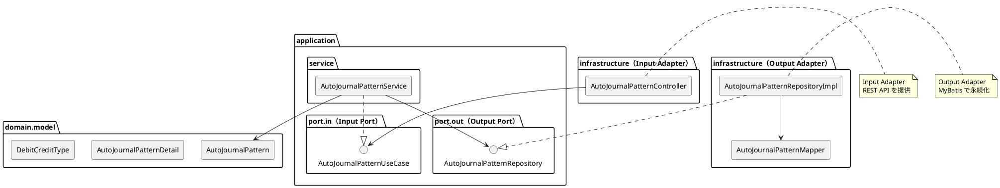
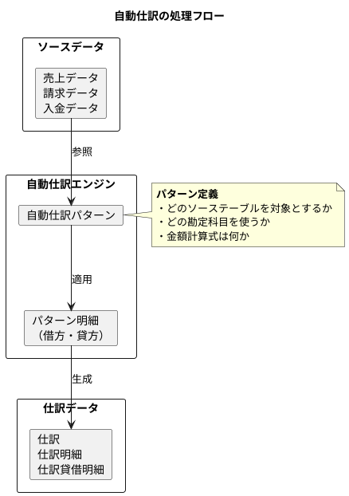

# 第12章: 自動仕訳設定

## 12.1 本章の概要

本章では、第3章で解説したヘキサゴナルアーキテクチャに従い、自動仕訳設定の機能実装を TDD で進めます。第6章で設計した自動仕訳テーブルのスキーマを基に、仕訳テンプレートと自動仕訳ルールの管理機能を実装します。

### アーキテクチャの全体像



### パッケージ構成

```
com.example.accounting/
├── domain/
│   └── model/
│       └── autojournal/
│           ├── AutoJournalPattern.java       # 自動仕訳パターン
│           ├── AutoJournalPatternDetail.java # パターン明細
│           └── DebitCreditType.java          # 貸借区分（列挙型）
├── application/
│   ├── port/
│   │   ├── in/
│   │   │   ├── AutoJournalPatternUseCase.java  # Input Port
│   │   │   └── command/
│   │   │       ├── CreateAutoJournalPatternCommand.java
│   │   │       └── UpdateAutoJournalPatternCommand.java
│   │   └── out/
│   │       └── AutoJournalPatternRepository.java  # Output Port
│   └── service/
│       └── AutoJournalPatternService.java   # Application Service
└── infrastructure/
    ├── persistence/
    │   ├── mapper/
    │   │   └── AutoJournalPatternMapper.java  # MyBatis Mapper
    │   └── repository/
    │       └── AutoJournalPatternRepositoryImpl.java  # Output Adapter
    └── web/
        ├── controller/
        │   └── AutoJournalPatternController.java  # Input Adapter
        └── dto/
            ├── AutoJournalPatternRequest.java
            └── AutoJournalPatternResponse.java
```

### TDD の流れ

1. **Domain Model**: ドメインモデルの作成（AutoJournalPattern, AutoJournalPatternDetail, DebitCreditType）
2. **Output Port**: リポジトリインターフェースの定義
3. **Output Adapter**: Testcontainers でリポジトリ実装をテスト
4. **Input Port**: ユースケースインターフェースの定義
5. **Application Service**: Mockito でアプリケーションサービスをテスト
6. **Input Adapter**: Testcontainers で REST API 統合テスト

---

## 12.2 自動仕訳の基礎知識

### 自動仕訳とは

自動仕訳は、定型的な取引データから仕訳を自動生成する機能です。売上データや請求データなど、他システムからのデータを財務会計システムに取り込む際に使用します。



### 自動仕訳パターンの構成

| 要素 | 説明 | 例 |
|------|------|-----|
| パターンコード | パターンを識別する一意のコード | SALES_001, PURCHASE_001 |
| パターン名 | パターンの名称 | 売上計上、仕入計上 |
| ソーステーブル名 | データの取得元テーブル | 売上データ、仕入データ |
| パターン明細 | 借方・貸方の勘定科目と金額計算式 | 借方:売掛金、貸方:売上高 |

---

## 12.3 Domain Model の実装

### 12.3.1 DebitCreditType 列挙型

```java
package com.example.accounting.domain.model.autojournal;

/**
 * 貸借区分
 */
public enum DebitCreditType {
    DEBIT("D", "借方"),
    CREDIT("C", "貸方");

    private final String code;
    private final String displayName;

    DebitCreditType(String code, String displayName) {
        this.code = code;
        this.displayName = displayName;
    }

    public String getCode() {
        return code;
    }

    public String getDisplayName() {
        return displayName;
    }

    public static DebitCreditType fromCode(String code) {
        for (DebitCreditType type : values()) {
            if (type.code.equals(code)) {
                return type;
            }
        }
        throw new IllegalArgumentException("Unknown debit/credit type code: " + code);
    }

    /**
     * 反対の貸借区分を取得
     */
    public DebitCreditType opposite() {
        return this == DEBIT ? CREDIT : DEBIT;
    }
}
```

### 12.3.2 AutoJournalPatternDetail ドメインモデル

```java
package com.example.accounting.domain.model.autojournal;

import lombok.Value;
import lombok.With;

import java.time.LocalDateTime;
import java.util.Objects;

/**
 * 自動仕訳パターン明細ドメインモデル
 */
@Value
@With
public class AutoJournalPatternDetail {

    Long detailId;
    Long patternId;
    Integer lineNumber;
    DebitCreditType debitCreditType;
    String accountCode;
    String amountFormula;
    String descriptionTemplate;
    LocalDateTime createdAt;
    LocalDateTime updatedAt;

    /**
     * 新規パターン明細を作成
     */
    public static AutoJournalPatternDetail create(
            Integer lineNumber,
            DebitCreditType debitCreditType,
            String accountCode,
            String amountFormula,
            String descriptionTemplate) {

        Objects.requireNonNull(lineNumber, "行番号は必須です");
        Objects.requireNonNull(debitCreditType, "貸借区分は必須です");
        Objects.requireNonNull(accountCode, "勘定科目コードは必須です");
        Objects.requireNonNull(amountFormula, "金額計算式は必須です");

        if (accountCode.isBlank()) {
            throw new IllegalArgumentException("勘定科目コードは空にできません");
        }
        if (amountFormula.isBlank()) {
            throw new IllegalArgumentException("金額計算式は空にできません");
        }

        return new AutoJournalPatternDetail(
            null,
            null,
            lineNumber,
            debitCreditType,
            accountCode,
            amountFormula,
            descriptionTemplate,
            null,
            null
        );
    }

    /**
     * 借方明細かどうか
     */
    public boolean isDebit() {
        return debitCreditType == DebitCreditType.DEBIT;
    }

    /**
     * 貸方明細かどうか
     */
    public boolean isCredit() {
        return debitCreditType == DebitCreditType.CREDIT;
    }
}
```

### 12.3.3 AutoJournalPattern ドメインモデル

```java
package com.example.accounting.domain.model.autojournal;

import lombok.Value;
import lombok.With;

import java.time.LocalDateTime;
import java.util.ArrayList;
import java.util.Collections;
import java.util.List;
import java.util.Objects;

/**
 * 自動仕訳パターンドメインモデル
 */
@Value
@With
public class AutoJournalPattern {

    Long patternId;
    String patternCode;
    String patternName;
    String sourceTableName;
    String description;
    Boolean isActive;
    List<AutoJournalPatternDetail> details;
    LocalDateTime createdAt;
    LocalDateTime updatedAt;

    /**
     * 新規自動仕訳パターンを作成
     */
    public static AutoJournalPattern create(
            String patternCode,
            String patternName,
            String sourceTableName,
            String description) {

        Objects.requireNonNull(patternCode, "パターンコードは必須です");
        Objects.requireNonNull(patternName, "パターン名は必須です");
        Objects.requireNonNull(sourceTableName, "ソーステーブル名は必須です");

        if (patternCode.isBlank()) {
            throw new IllegalArgumentException("パターンコードは空にできません");
        }
        if (patternName.isBlank()) {
            throw new IllegalArgumentException("パターン名は空にできません");
        }

        return new AutoJournalPattern(
            null,
            patternCode,
            patternName,
            sourceTableName,
            description,
            true,
            new ArrayList<>(),
            null,
            null
        );
    }

    /**
     * パターン明細を追加
     */
    public AutoJournalPattern addDetail(AutoJournalPatternDetail detail) {
        List<AutoJournalPatternDetail> newDetails = new ArrayList<>(this.details);
        newDetails.add(detail.withPatternId(this.patternId));
        return this.withDetails(newDetails);
    }

    /**
     * パターン明細を設定
     */
    public AutoJournalPattern withDetailsList(List<AutoJournalPatternDetail> details) {
        List<AutoJournalPatternDetail> newDetails = details.stream()
            .map(d -> d.withPatternId(this.patternId))
            .toList();
        return this.withDetails(new ArrayList<>(newDetails));
    }

    /**
     * 有効化
     */
    public AutoJournalPattern activate() {
        return this.withIsActive(true);
    }

    /**
     * 無効化
     */
    public AutoJournalPattern deactivate() {
        return this.withIsActive(false);
    }

    /**
     * 有効かどうか
     */
    public boolean isActive() {
        return Boolean.TRUE.equals(isActive);
    }

    /**
     * 借方明細を取得
     */
    public List<AutoJournalPatternDetail> getDebitDetails() {
        return details.stream()
            .filter(AutoJournalPatternDetail::isDebit)
            .toList();
    }

    /**
     * 貸方明細を取得
     */
    public List<AutoJournalPatternDetail> getCreditDetails() {
        return details.stream()
            .filter(AutoJournalPatternDetail::isCredit)
            .toList();
    }

    /**
     * パターン明細を取得（不変リスト）
     */
    public List<AutoJournalPatternDetail> getDetails() {
        return Collections.unmodifiableList(details);
    }

    /**
     * パターンが有効な仕訳を生成できるか検証
     */
    public boolean isValid() {
        if (details == null || details.isEmpty()) {
            return false;
        }
        // 借方と貸方の両方が必要
        boolean hasDebit = details.stream().anyMatch(AutoJournalPatternDetail::isDebit);
        boolean hasCredit = details.stream().anyMatch(AutoJournalPatternDetail::isCredit);
        return hasDebit && hasCredit;
    }
}
```

### 12.3.4 AutoJournalPattern のテスト

```java
package com.example.accounting.domain.model.autojournal;

import org.junit.jupiter.api.DisplayName;
import org.junit.jupiter.api.Nested;
import org.junit.jupiter.api.Test;

import static org.assertj.core.api.Assertions.*;

@DisplayName("AutoJournalPattern ドメインモデルのテスト")
class AutoJournalPatternTest {

    @Nested
    @DisplayName("パターン作成")
    class Creation {

        @Test
        @DisplayName("有効なパターンを作成できる")
        void shouldCreateValidPattern() {
            // When
            AutoJournalPattern pattern = AutoJournalPattern.create(
                "SALES_001",
                "売上計上",
                "売上データ",
                "売上データから仕訳を生成"
            );

            // Then
            assertThat(pattern.getPatternCode()).isEqualTo("SALES_001");
            assertThat(pattern.getPatternName()).isEqualTo("売上計上");
            assertThat(pattern.getSourceTableName()).isEqualTo("売上データ");
            assertThat(pattern.isActive()).isTrue();
            assertThat(pattern.getDetails()).isEmpty();
        }

        @Test
        @DisplayName("パターンコードが空の場合は例外")
        void shouldThrowWhenPatternCodeIsBlank() {
            assertThatThrownBy(() ->
                AutoJournalPattern.create("", "売上計上", "売上データ", null))
                .isInstanceOf(IllegalArgumentException.class)
                .hasMessageContaining("パターンコードは空にできません");
        }

        @Test
        @DisplayName("パターンコードがnullの場合は例外")
        void shouldThrowWhenPatternCodeIsNull() {
            assertThatThrownBy(() ->
                AutoJournalPattern.create(null, "売上計上", "売上データ", null))
                .isInstanceOf(NullPointerException.class)
                .hasMessageContaining("パターンコードは必須");
        }
    }

    @Nested
    @DisplayName("パターン明細")
    class Details {

        @Test
        @DisplayName("パターン明細を追加できる")
        void shouldAddDetail() {
            // Given
            AutoJournalPattern pattern = AutoJournalPattern.create(
                "SALES_001", "売上計上", "売上データ", null
            );
            AutoJournalPatternDetail detail = AutoJournalPatternDetail.create(
                1, DebitCreditType.DEBIT, "1130", "売上金額", "売上計上"
            );

            // When
            AutoJournalPattern updated = pattern.addDetail(detail);

            // Then
            assertThat(updated.getDetails()).hasSize(1);
            assertThat(updated.getDetails().get(0).getAccountCode()).isEqualTo("1130");
        }

        @Test
        @DisplayName("借方明細と貸方明細を分類できる")
        void shouldClassifyDebitAndCreditDetails() {
            // Given
            AutoJournalPattern pattern = AutoJournalPattern.create(
                "SALES_001", "売上計上", "売上データ", null
            );

            AutoJournalPatternDetail debitDetail = AutoJournalPatternDetail.create(
                1, DebitCreditType.DEBIT, "1130", "売上金額", "売掛金"
            );
            AutoJournalPatternDetail creditDetail = AutoJournalPatternDetail.create(
                1, DebitCreditType.CREDIT, "4010", "売上金額", "売上高"
            );

            pattern = pattern.addDetail(debitDetail).addDetail(creditDetail);

            // When
            var debitDetails = pattern.getDebitDetails();
            var creditDetails = pattern.getCreditDetails();

            // Then
            assertThat(debitDetails).hasSize(1);
            assertThat(creditDetails).hasSize(1);
            assertThat(debitDetails.get(0).getAccountCode()).isEqualTo("1130");
            assertThat(creditDetails.get(0).getAccountCode()).isEqualTo("4010");
        }
    }

    @Nested
    @DisplayName("有効性検証")
    class Validation {

        @Test
        @DisplayName("借方と貸方の両方がある場合は有効")
        void shouldBeValidWhenHasBothDebitAndCredit() {
            // Given
            AutoJournalPattern pattern = AutoJournalPattern.create(
                "SALES_001", "売上計上", "売上データ", null
            );
            pattern = pattern
                .addDetail(AutoJournalPatternDetail.create(
                    1, DebitCreditType.DEBIT, "1130", "売上金額", null))
                .addDetail(AutoJournalPatternDetail.create(
                    1, DebitCreditType.CREDIT, "4010", "売上金額", null));

            // When & Then
            assertThat(pattern.isValid()).isTrue();
        }

        @Test
        @DisplayName("明細がない場合は無効")
        void shouldBeInvalidWhenNoDetails() {
            // Given
            AutoJournalPattern pattern = AutoJournalPattern.create(
                "SALES_001", "売上計上", "売上データ", null
            );

            // When & Then
            assertThat(pattern.isValid()).isFalse();
        }

        @Test
        @DisplayName("借方のみの場合は無効")
        void shouldBeInvalidWhenOnlyDebit() {
            // Given
            AutoJournalPattern pattern = AutoJournalPattern.create(
                "SALES_001", "売上計上", "売上データ", null
            );
            pattern = pattern.addDetail(AutoJournalPatternDetail.create(
                1, DebitCreditType.DEBIT, "1130", "売上金額", null));

            // When & Then
            assertThat(pattern.isValid()).isFalse();
        }
    }

    @Nested
    @DisplayName("有効/無効切り替え")
    class Activation {

        @Test
        @DisplayName("パターンを無効化できる")
        void shouldDeactivatePattern() {
            // Given
            AutoJournalPattern pattern = AutoJournalPattern.create(
                "SALES_001", "売上計上", "売上データ", null
            );
            assertThat(pattern.isActive()).isTrue();

            // When
            AutoJournalPattern deactivated = pattern.deactivate();

            // Then
            assertThat(deactivated.isActive()).isFalse();
        }

        @Test
        @DisplayName("パターンを有効化できる")
        void shouldActivatePattern() {
            // Given
            AutoJournalPattern pattern = AutoJournalPattern.create(
                "SALES_001", "売上計上", "売上データ", null
            ).deactivate();

            // When
            AutoJournalPattern activated = pattern.activate();

            // Then
            assertThat(activated.isActive()).isTrue();
        }
    }
}
```

---

## 12.4 Output Port（リポジトリインターフェース）

```java
package com.example.accounting.application.port.out;

import com.example.accounting.domain.model.autojournal.AutoJournalPattern;

import java.util.List;
import java.util.Optional;

/**
 * 自動仕訳パターンリポジトリ（Output Port）
 */
public interface AutoJournalPatternRepository {

    AutoJournalPattern save(AutoJournalPattern pattern);

    Optional<AutoJournalPattern> findByCode(String patternCode);

    Optional<AutoJournalPattern> findById(Long patternId);

    List<AutoJournalPattern> findAll();

    List<AutoJournalPattern> findBySourceTableName(String sourceTableName);

    List<AutoJournalPattern> findActivePatterns();

    void deleteByCode(String patternCode);

    boolean existsByCode(String patternCode);

    long count();
}
```

---

## 12.5 Output Adapter（リポジトリ実装）

### 12.5.1 MyBatis Mapper

```java
package com.example.accounting.infrastructure.persistence.mapper;

import com.example.accounting.infrastructure.persistence.entity.AutoJournalPatternDetailEntity;
import com.example.accounting.infrastructure.persistence.entity.AutoJournalPatternEntity;
import org.apache.ibatis.annotations.Mapper;
import org.apache.ibatis.annotations.Param;

import java.util.List;

@Mapper
public interface AutoJournalPatternMapper {

    void insertPattern(AutoJournalPatternEntity entity);

    void insertDetail(AutoJournalPatternDetailEntity entity);

    AutoJournalPatternEntity selectByCode(@Param("patternCode") String patternCode);

    AutoJournalPatternEntity selectById(@Param("patternId") Long patternId);

    List<AutoJournalPatternEntity> selectAll();

    List<AutoJournalPatternEntity> selectBySourceTableName(
        @Param("sourceTableName") String sourceTableName);

    List<AutoJournalPatternEntity> selectActivePatterns();

    List<AutoJournalPatternDetailEntity> selectDetailsByPatternId(
        @Param("patternId") Long patternId);

    void updatePattern(AutoJournalPatternEntity entity);

    void deleteDetailsByPatternId(@Param("patternId") Long patternId);

    void deleteByCode(@Param("patternCode") String patternCode);

    void deleteAll();

    long count();
}
```

**AutoJournalPatternMapper.xml**:

```xml
<?xml version="1.0" encoding="UTF-8" ?>
<!DOCTYPE mapper PUBLIC "-//mybatis.org//DTD Mapper 3.0//EN"
        "http://mybatis.org/dtd/mybatis-3-mapper.dtd">
<mapper namespace="com.example.accounting.infrastructure.persistence.mapper.AutoJournalPatternMapper">

    <resultMap id="AutoJournalPatternEntityResultMap"
               type="com.example.accounting.infrastructure.persistence.entity.AutoJournalPatternEntity">
        <id property="patternId" column="自動仕訳パターンID"/>
        <result property="patternCode" column="パターンコード"/>
        <result property="patternName" column="パターン名"/>
        <result property="sourceTableName" column="ソーステーブル名"/>
        <result property="description" column="説明"/>
        <result property="isActive" column="有効フラグ"/>
        <result property="createdAt" column="作成日時"/>
        <result property="updatedAt" column="更新日時"/>
    </resultMap>

    <resultMap id="AutoJournalPatternDetailEntityResultMap"
               type="com.example.accounting.infrastructure.persistence.entity.AutoJournalPatternDetailEntity">
        <id property="detailId" column="自動仕訳パターン明細ID"/>
        <result property="patternId" column="自動仕訳パターンID"/>
        <result property="lineNumber" column="行番号"/>
        <result property="debitCreditType" column="貸借区分"/>
        <result property="accountCode" column="勘定科目コード"/>
        <result property="amountFormula" column="金額計算式"/>
        <result property="descriptionTemplate" column="摘要テンプレート"/>
        <result property="createdAt" column="作成日時"/>
        <result property="updatedAt" column="更新日時"/>
    </resultMap>

    <insert id="insertPattern" useGeneratedKeys="true"
            keyProperty="patternId" keyColumn="自動仕訳パターンID">
        INSERT INTO "自動仕訳パターン" (
            "パターンコード", "パターン名", "ソーステーブル名",
            "説明", "有効フラグ"
        ) VALUES (
            #{patternCode}, #{patternName}, #{sourceTableName},
            #{description}, #{isActive}
        )
    </insert>

    <insert id="insertDetail" useGeneratedKeys="true"
            keyProperty="detailId" keyColumn="自動仕訳パターン明細ID">
        INSERT INTO "自動仕訳パターン明細" (
            "自動仕訳パターンID", "行番号", "貸借区分",
            "勘定科目コード", "金額計算式", "摘要テンプレート"
        ) VALUES (
            #{patternId}, #{lineNumber}, #{debitCreditType},
            #{accountCode}, #{amountFormula}, #{descriptionTemplate}
        )
    </insert>

    <select id="selectByCode" resultMap="AutoJournalPatternEntityResultMap">
        SELECT * FROM "自動仕訳パターン"
        WHERE "パターンコード" = #{patternCode}
    </select>

    <select id="selectById" resultMap="AutoJournalPatternEntityResultMap">
        SELECT * FROM "自動仕訳パターン"
        WHERE "自動仕訳パターンID" = #{patternId}
    </select>

    <select id="selectAll" resultMap="AutoJournalPatternEntityResultMap">
        SELECT * FROM "自動仕訳パターン"
        ORDER BY "パターンコード"
    </select>

    <select id="selectBySourceTableName" resultMap="AutoJournalPatternEntityResultMap">
        SELECT * FROM "自動仕訳パターン"
        WHERE "ソーステーブル名" = #{sourceTableName}
        ORDER BY "パターンコード"
    </select>

    <select id="selectActivePatterns" resultMap="AutoJournalPatternEntityResultMap">
        SELECT * FROM "自動仕訳パターン"
        WHERE "有効フラグ" = true
        ORDER BY "パターンコード"
    </select>

    <select id="selectDetailsByPatternId" resultMap="AutoJournalPatternDetailEntityResultMap">
        SELECT * FROM "自動仕訳パターン明細"
        WHERE "自動仕訳パターンID" = #{patternId}
        ORDER BY "行番号", "貸借区分"
    </select>

    <update id="updatePattern">
        UPDATE "自動仕訳パターン"
        SET "パターン名" = #{patternName},
            "ソーステーブル名" = #{sourceTableName},
            "説明" = #{description},
            "有効フラグ" = #{isActive},
            "更新日時" = CURRENT_TIMESTAMP
        WHERE "パターンコード" = #{patternCode}
    </update>

    <delete id="deleteDetailsByPatternId">
        DELETE FROM "自動仕訳パターン明細"
        WHERE "自動仕訳パターンID" = #{patternId}
    </delete>

    <delete id="deleteByCode">
        DELETE FROM "自動仕訳パターン"
        WHERE "パターンコード" = #{patternCode}
    </delete>

    <delete id="deleteAll">
        DELETE FROM "自動仕訳パターン明細";
        DELETE FROM "自動仕訳パターン";
    </delete>

    <select id="count" resultType="long">
        SELECT COUNT(*) FROM "自動仕訳パターン"
    </select>
</mapper>
```

### 12.5.2 Entity クラス

```java
// AutoJournalPatternEntity.java
package com.example.accounting.infrastructure.persistence.entity;

import com.example.accounting.domain.model.autojournal.AutoJournalPattern;
import lombok.Data;

import java.time.LocalDateTime;
import java.util.ArrayList;
import java.util.List;

/**
 * 自動仕訳パターンエンティティ（MyBatis 用）
 */
@Data
public class AutoJournalPatternEntity {

    private Long patternId;
    private String patternCode;
    private String patternName;
    private String sourceTableName;
    private String description;
    private Boolean isActive;
    private LocalDateTime createdAt;
    private LocalDateTime updatedAt;

    /**
     * ドメインモデルからエンティティを作成
     */
    public static AutoJournalPatternEntity from(AutoJournalPattern pattern) {
        AutoJournalPatternEntity entity = new AutoJournalPatternEntity();
        entity.setPatternId(pattern.getPatternId());
        entity.setPatternCode(pattern.getPatternCode());
        entity.setPatternName(pattern.getPatternName());
        entity.setSourceTableName(pattern.getSourceTableName());
        entity.setDescription(pattern.getDescription());
        entity.setIsActive(pattern.getIsActive());
        entity.setCreatedAt(pattern.getCreatedAt());
        entity.setUpdatedAt(pattern.getUpdatedAt());
        return entity;
    }

    /**
     * ドメインモデルに変換
     */
    public AutoJournalPattern toDomain() {
        return toDomain(new ArrayList<>());
    }

    /**
     * 明細を含めてドメインモデルに変換
     */
    public AutoJournalPattern toDomain(List<AutoJournalPatternDetailEntity> detailEntities) {
        var details = detailEntities.stream()
            .map(AutoJournalPatternDetailEntity::toDomain)
            .toList();

        return new AutoJournalPattern(
            patternId,
            patternCode,
            patternName,
            sourceTableName,
            description,
            isActive,
            new ArrayList<>(details),
            createdAt,
            updatedAt
        );
    }
}

// AutoJournalPatternDetailEntity.java
package com.example.accounting.infrastructure.persistence.entity;

import com.example.accounting.domain.model.autojournal.AutoJournalPatternDetail;
import com.example.accounting.domain.model.autojournal.DebitCreditType;
import lombok.Data;

import java.time.LocalDateTime;

/**
 * 自動仕訳パターン明細エンティティ（MyBatis 用）
 */
@Data
public class AutoJournalPatternDetailEntity {

    private Long detailId;
    private Long patternId;
    private Integer lineNumber;
    private String debitCreditType;
    private String accountCode;
    private String amountFormula;
    private String descriptionTemplate;
    private LocalDateTime createdAt;
    private LocalDateTime updatedAt;

    /**
     * ドメインモデルからエンティティを作成
     */
    public static AutoJournalPatternDetailEntity from(AutoJournalPatternDetail detail) {
        AutoJournalPatternDetailEntity entity = new AutoJournalPatternDetailEntity();
        entity.setDetailId(detail.getDetailId());
        entity.setPatternId(detail.getPatternId());
        entity.setLineNumber(detail.getLineNumber());
        entity.setDebitCreditType(detail.getDebitCreditType().getCode());
        entity.setAccountCode(detail.getAccountCode());
        entity.setAmountFormula(detail.getAmountFormula());
        entity.setDescriptionTemplate(detail.getDescriptionTemplate());
        entity.setCreatedAt(detail.getCreatedAt());
        entity.setUpdatedAt(detail.getUpdatedAt());
        return entity;
    }

    /**
     * ドメインモデルに変換
     */
    public AutoJournalPatternDetail toDomain() {
        return new AutoJournalPatternDetail(
            detailId,
            patternId,
            lineNumber,
            DebitCreditType.fromCode(debitCreditType),
            accountCode,
            amountFormula,
            descriptionTemplate,
            createdAt,
            updatedAt
        );
    }
}
```

### 12.5.3 Repository 実装（Output Adapter）

```java
package com.example.accounting.infrastructure.persistence.repository;

import com.example.accounting.application.port.out.AutoJournalPatternRepository;
import com.example.accounting.domain.model.autojournal.AutoJournalPattern;
import com.example.accounting.domain.model.autojournal.AutoJournalPatternDetail;
import com.example.accounting.infrastructure.persistence.entity.AutoJournalPatternDetailEntity;
import com.example.accounting.infrastructure.persistence.entity.AutoJournalPatternEntity;
import com.example.accounting.infrastructure.persistence.mapper.AutoJournalPatternMapper;
import lombok.RequiredArgsConstructor;
import org.springframework.stereotype.Repository;

import java.util.List;
import java.util.Optional;

/**
 * 自動仕訳パターンリポジトリ実装（Output Adapter）
 */
@Repository
@RequiredArgsConstructor
public class AutoJournalPatternRepositoryImpl implements AutoJournalPatternRepository {

    private final AutoJournalPatternMapper mapper;

    @Override
    public AutoJournalPattern save(AutoJournalPattern pattern) {
        AutoJournalPatternEntity entity = AutoJournalPatternEntity.from(pattern);

        if (pattern.getPatternId() == null) {
            // 新規登録
            mapper.insertPattern(entity);
            Long patternId = entity.getPatternId();

            // 明細を登録
            for (AutoJournalPatternDetail detail : pattern.getDetails()) {
                AutoJournalPatternDetailEntity detailEntity =
                    AutoJournalPatternDetailEntity.from(detail.withPatternId(patternId));
                mapper.insertDetail(detailEntity);
            }

            return findById(patternId).orElseThrow();
        } else {
            // 更新
            mapper.updatePattern(entity);

            // 明細を削除して再登録
            mapper.deleteDetailsByPatternId(pattern.getPatternId());
            for (AutoJournalPatternDetail detail : pattern.getDetails()) {
                AutoJournalPatternDetailEntity detailEntity =
                    AutoJournalPatternDetailEntity.from(detail.withPatternId(pattern.getPatternId()));
                mapper.insertDetail(detailEntity);
            }

            return findById(pattern.getPatternId()).orElseThrow();
        }
    }

    @Override
    public Optional<AutoJournalPattern> findByCode(String patternCode) {
        AutoJournalPatternEntity entity = mapper.selectByCode(patternCode);
        if (entity == null) {
            return Optional.empty();
        }

        List<AutoJournalPatternDetailEntity> details =
            mapper.selectDetailsByPatternId(entity.getPatternId());
        return Optional.of(entity.toDomain(details));
    }

    @Override
    public Optional<AutoJournalPattern> findById(Long patternId) {
        AutoJournalPatternEntity entity = mapper.selectById(patternId);
        if (entity == null) {
            return Optional.empty();
        }

        List<AutoJournalPatternDetailEntity> details =
            mapper.selectDetailsByPatternId(entity.getPatternId());
        return Optional.of(entity.toDomain(details));
    }

    @Override
    public List<AutoJournalPattern> findAll() {
        return mapper.selectAll().stream()
            .map(entity -> {
                List<AutoJournalPatternDetailEntity> details =
                    mapper.selectDetailsByPatternId(entity.getPatternId());
                return entity.toDomain(details);
            })
            .toList();
    }

    @Override
    public List<AutoJournalPattern> findBySourceTableName(String sourceTableName) {
        return mapper.selectBySourceTableName(sourceTableName).stream()
            .map(entity -> {
                List<AutoJournalPatternDetailEntity> details =
                    mapper.selectDetailsByPatternId(entity.getPatternId());
                return entity.toDomain(details);
            })
            .toList();
    }

    @Override
    public List<AutoJournalPattern> findActivePatterns() {
        return mapper.selectActivePatterns().stream()
            .map(entity -> {
                List<AutoJournalPatternDetailEntity> details =
                    mapper.selectDetailsByPatternId(entity.getPatternId());
                return entity.toDomain(details);
            })
            .toList();
    }

    @Override
    public void deleteByCode(String patternCode) {
        mapper.deleteByCode(patternCode);
    }

    @Override
    public boolean existsByCode(String patternCode) {
        return mapper.selectByCode(patternCode) != null;
    }

    @Override
    public long count() {
        return mapper.count();
    }
}
```

### 12.5.4 Repository 実装のテスト（Testcontainers）

```java
package com.example.accounting.infrastructure.persistence.repository;

import com.example.accounting.application.port.out.AutoJournalPatternRepository;
import com.example.accounting.domain.model.autojournal.AutoJournalPattern;
import com.example.accounting.domain.model.autojournal.AutoJournalPatternDetail;
import com.example.accounting.domain.model.autojournal.DebitCreditType;
import org.junit.jupiter.api.*;
import org.springframework.beans.factory.annotation.Autowired;
import org.springframework.boot.test.context.SpringBootTest;
import org.springframework.test.context.DynamicPropertyRegistry;
import org.springframework.test.context.DynamicPropertySource;
import org.testcontainers.containers.PostgreSQLContainer;
import org.testcontainers.junit.jupiter.Container;
import org.testcontainers.junit.jupiter.Testcontainers;

import java.util.List;
import java.util.Optional;

import static org.assertj.core.api.Assertions.assertThat;

@SpringBootTest
@Testcontainers
@TestMethodOrder(MethodOrderer.OrderAnnotation.class)
@DisplayName("自動仕訳パターンリポジトリ実装のテスト")
class AutoJournalPatternRepositoryImplTest {

    @Container
    static PostgreSQLContainer<?> postgres = new PostgreSQLContainer<>("postgres:16-alpine")
            .withDatabaseName("testdb")
            .withUsername("testuser")
            .withPassword("testpass");

    @DynamicPropertySource
    static void configureProperties(DynamicPropertyRegistry registry) {
        registry.add("spring.datasource.url", postgres::getJdbcUrl);
        registry.add("spring.datasource.username", postgres::getUsername);
        registry.add("spring.datasource.password", postgres::getPassword);
        registry.add("spring.flyway.enabled", () -> "true");
    }

    @Autowired
    private AutoJournalPatternRepository repository;

    @Test
    @Order(1)
    @DisplayName("自動仕訳パターンを保存できる")
    void shouldSavePattern() {
        // Given
        AutoJournalPattern pattern = AutoJournalPattern.create(
            "SALES_001",
            "売上計上",
            "売上データ",
            "売上データから仕訳を生成"
        );

        AutoJournalPatternDetail debitDetail = AutoJournalPatternDetail.create(
            1, DebitCreditType.DEBIT, "1130", "売上金額", "売掛金"
        );
        AutoJournalPatternDetail creditDetail = AutoJournalPatternDetail.create(
            1, DebitCreditType.CREDIT, "4010", "売上金額", "売上高"
        );

        pattern = pattern.addDetail(debitDetail).addDetail(creditDetail);

        // When
        AutoJournalPattern saved = repository.save(pattern);

        // Then
        assertThat(saved.getPatternId()).isNotNull();
        assertThat(saved.getPatternCode()).isEqualTo("SALES_001");
        assertThat(saved.getPatternName()).isEqualTo("売上計上");
        assertThat(saved.getDetails()).hasSize(2);
    }

    @Test
    @Order(2)
    @DisplayName("パターンコードで検索できる")
    void shouldFindByCode() {
        // When
        Optional<AutoJournalPattern> found = repository.findByCode("SALES_001");

        // Then
        assertThat(found).isPresent();
        assertThat(found.get().getPatternName()).isEqualTo("売上計上");
        assertThat(found.get().getDetails()).hasSize(2);
    }

    @Test
    @Order(3)
    @DisplayName("仕入パターンを追加保存できる")
    void shouldSavePurchasePattern() {
        // Given
        AutoJournalPattern pattern = AutoJournalPattern.create(
            "PURCHASE_001",
            "仕入計上",
            "仕入データ",
            "仕入データから仕訳を生成"
        );

        pattern = pattern
            .addDetail(AutoJournalPatternDetail.create(
                1, DebitCreditType.DEBIT, "5110", "仕入金額", "仕入高"))
            .addDetail(AutoJournalPatternDetail.create(
                1, DebitCreditType.CREDIT, "2010", "仕入金額", "買掛金"));

        // When
        AutoJournalPattern saved = repository.save(pattern);

        // Then
        assertThat(saved.getPatternCode()).isEqualTo("PURCHASE_001");
        assertThat(saved.isValid()).isTrue();
    }

    @Test
    @Order(4)
    @DisplayName("すべてのパターンを取得できる")
    void shouldFindAllPatterns() {
        // When
        List<AutoJournalPattern> patterns = repository.findAll();

        // Then
        assertThat(patterns).hasSizeGreaterThanOrEqualTo(2);
    }

    @Test
    @Order(5)
    @DisplayName("ソーステーブル名で検索できる")
    void shouldFindBySourceTableName() {
        // When
        List<AutoJournalPattern> patterns = repository.findBySourceTableName("売上データ");

        // Then
        assertThat(patterns).hasSize(1);
        assertThat(patterns.get(0).getPatternCode()).isEqualTo("SALES_001");
    }

    @Test
    @Order(6)
    @DisplayName("有効なパターンのみ検索できる")
    void shouldFindActivePatterns() {
        // Given: 無効なパターンを追加
        AutoJournalPattern inactivePattern = AutoJournalPattern.create(
            "INACTIVE_001", "無効パターン", "テストデータ", null
        ).deactivate()
        .addDetail(AutoJournalPatternDetail.create(
            1, DebitCreditType.DEBIT, "1010", "金額", null))
        .addDetail(AutoJournalPatternDetail.create(
            1, DebitCreditType.CREDIT, "4010", "金額", null));

        repository.save(inactivePattern);

        // When
        List<AutoJournalPattern> activePatterns = repository.findActivePatterns();

        // Then
        assertThat(activePatterns).allMatch(AutoJournalPattern::isActive);
        assertThat(activePatterns.stream()
            .noneMatch(p -> p.getPatternCode().equals("INACTIVE_001")))
            .isTrue();
    }

    @Test
    @Order(7)
    @DisplayName("パターンを更新できる")
    void shouldUpdatePattern() {
        // Given
        AutoJournalPattern pattern = repository.findByCode("SALES_001").orElseThrow();
        AutoJournalPattern updated = pattern.withPatternName("売上計上（更新済）");

        // When
        AutoJournalPattern saved = repository.save(updated);

        // Then
        assertThat(saved.getPatternName()).isEqualTo("売上計上（更新済）");
    }

    @Test
    @Order(8)
    @DisplayName("パターンを削除できる")
    void shouldDeletePattern() {
        // Given
        AutoJournalPattern temp = AutoJournalPattern.create(
            "TEMP_001", "一時パターン", "テストデータ", null
        ).addDetail(AutoJournalPatternDetail.create(
            1, DebitCreditType.DEBIT, "1010", "金額", null))
        .addDetail(AutoJournalPatternDetail.create(
            1, DebitCreditType.CREDIT, "4010", "金額", null));

        repository.save(temp);

        // When
        repository.deleteByCode("TEMP_001");

        // Then
        Optional<AutoJournalPattern> found = repository.findByCode("TEMP_001");
        assertThat(found).isEmpty();
    }

    @Test
    @Order(9)
    @DisplayName("存在しないパターンコードで検索すると空を返す")
    void shouldReturnEmptyWhenNotFound() {
        // When
        Optional<AutoJournalPattern> found = repository.findByCode("NOT_EXIST");

        // Then
        assertThat(found).isEmpty();
    }
}
```

---

## 12.6 Input Port（ユースケースインターフェース）

### 12.6.1 ユースケースインターフェース

```java
package com.example.accounting.application.port.in;

import com.example.accounting.application.port.in.command.CreateAutoJournalPatternCommand;
import com.example.accounting.application.port.in.command.UpdateAutoJournalPatternCommand;
import com.example.accounting.domain.model.autojournal.AutoJournalPattern;

import java.util.List;

/**
 * 自動仕訳パターンユースケース（Input Port）
 */
public interface AutoJournalPatternUseCase {

    /**
     * 自動仕訳パターンを作成
     */
    AutoJournalPattern createPattern(CreateAutoJournalPatternCommand command);

    /**
     * パターンコードで検索
     */
    AutoJournalPattern findByCode(String patternCode);

    /**
     * すべてのパターンを取得
     */
    List<AutoJournalPattern> findAll();

    /**
     * ソーステーブル名で検索
     */
    List<AutoJournalPattern> findBySourceTableName(String sourceTableName);

    /**
     * 有効なパターンを検索
     */
    List<AutoJournalPattern> findActivePatterns();

    /**
     * パターンを更新
     */
    AutoJournalPattern updatePattern(UpdateAutoJournalPatternCommand command);

    /**
     * パターンを有効化
     */
    AutoJournalPattern activatePattern(String patternCode);

    /**
     * パターンを無効化
     */
    AutoJournalPattern deactivatePattern(String patternCode);

    /**
     * パターンを削除
     */
    void deletePattern(String patternCode);
}
```

### 12.6.2 Command クラス

```java
// application/port/in/command/CreateAutoJournalPatternCommand.java
package com.example.accounting.application.port.in.command;

import com.example.accounting.domain.model.autojournal.DebitCreditType;

import java.util.List;
import java.util.Objects;

/**
 * 自動仕訳パターン作成コマンド
 */
public record CreateAutoJournalPatternCommand(
    String patternCode,
    String patternName,
    String sourceTableName,
    String description,
    List<DetailCommand> details
) {
    public CreateAutoJournalPatternCommand {
        Objects.requireNonNull(patternCode, "パターンコードは必須です");
        Objects.requireNonNull(patternName, "パターン名は必須です");
        Objects.requireNonNull(sourceTableName, "ソーステーブル名は必須です");
        Objects.requireNonNull(details, "明細は必須です");

        if (patternCode.isBlank()) {
            throw new IllegalArgumentException("パターンコードは空にできません");
        }
        if (details.isEmpty()) {
            throw new IllegalArgumentException("明細は1件以上必要です");
        }
    }

    public record DetailCommand(
        Integer lineNumber,
        DebitCreditType debitCreditType,
        String accountCode,
        String amountFormula,
        String descriptionTemplate
    ) {
        public DetailCommand {
            Objects.requireNonNull(lineNumber, "行番号は必須です");
            Objects.requireNonNull(debitCreditType, "貸借区分は必須です");
            Objects.requireNonNull(accountCode, "勘定科目コードは必須です");
            Objects.requireNonNull(amountFormula, "金額計算式は必須です");
        }
    }
}

// application/port/in/command/UpdateAutoJournalPatternCommand.java
package com.example.accounting.application.port.in.command;

import java.util.List;
import java.util.Objects;

/**
 * 自動仕訳パターン更新コマンド
 */
public record UpdateAutoJournalPatternCommand(
    String patternCode,
    String patternName,
    String sourceTableName,
    String description,
    List<CreateAutoJournalPatternCommand.DetailCommand> details
) {
    public UpdateAutoJournalPatternCommand {
        Objects.requireNonNull(patternCode, "パターンコードは必須です");
    }
}
```

### 12.6.3 例外クラス

```java
// application/port/in/exception/AutoJournalPatternNotFoundException.java
package com.example.accounting.application.port.in.exception;

public class AutoJournalPatternNotFoundException extends RuntimeException {
    public AutoJournalPatternNotFoundException(String patternCode) {
        super("自動仕訳パターンが見つかりません: " + patternCode);
    }
}

// application/port/in/exception/AutoJournalPatternAlreadyExistsException.java
package com.example.accounting.application.port.in.exception;

public class AutoJournalPatternAlreadyExistsException extends RuntimeException {
    public AutoJournalPatternAlreadyExistsException(String patternCode) {
        super("自動仕訳パターンコードは既に存在します: " + patternCode);
    }
}

// application/port/in/exception/InvalidAutoJournalPatternException.java
package com.example.accounting.application.port.in.exception;

public class InvalidAutoJournalPatternException extends RuntimeException {
    public InvalidAutoJournalPatternException(String message) {
        super(message);
    }
}
```

---

## 12.7 Application Service

### 12.7.1 アプリケーションサービス実装

```java
package com.example.accounting.application.service;

import com.example.accounting.application.port.in.AutoJournalPatternUseCase;
import com.example.accounting.application.port.in.command.CreateAutoJournalPatternCommand;
import com.example.accounting.application.port.in.command.UpdateAutoJournalPatternCommand;
import com.example.accounting.application.port.in.exception.AutoJournalPatternAlreadyExistsException;
import com.example.accounting.application.port.in.exception.AutoJournalPatternNotFoundException;
import com.example.accounting.application.port.in.exception.InvalidAutoJournalPatternException;
import com.example.accounting.application.port.out.AutoJournalPatternRepository;
import com.example.accounting.domain.model.autojournal.AutoJournalPattern;
import com.example.accounting.domain.model.autojournal.AutoJournalPatternDetail;
import lombok.RequiredArgsConstructor;
import org.springframework.stereotype.Service;
import org.springframework.transaction.annotation.Transactional;

import java.util.List;

/**
 * 自動仕訳パターンアプリケーションサービス
 */
@Service
@RequiredArgsConstructor
@Transactional
public class AutoJournalPatternService implements AutoJournalPatternUseCase {

    private final AutoJournalPatternRepository repository;

    @Override
    public AutoJournalPattern createPattern(CreateAutoJournalPatternCommand command) {
        // 重複チェック
        if (repository.existsByCode(command.patternCode())) {
            throw new AutoJournalPatternAlreadyExistsException(command.patternCode());
        }

        // ドメインモデルを作成
        AutoJournalPattern pattern = AutoJournalPattern.create(
            command.patternCode(),
            command.patternName(),
            command.sourceTableName(),
            command.description()
        );

        // 明細を追加
        for (var detailCmd : command.details()) {
            AutoJournalPatternDetail detail = AutoJournalPatternDetail.create(
                detailCmd.lineNumber(),
                detailCmd.debitCreditType(),
                detailCmd.accountCode(),
                detailCmd.amountFormula(),
                detailCmd.descriptionTemplate()
            );
            pattern = pattern.addDetail(detail);
        }

        // 有効性検証
        if (!pattern.isValid()) {
            throw new InvalidAutoJournalPatternException(
                "パターンには借方と貸方の両方の明細が必要です");
        }

        // 永続化
        return repository.save(pattern);
    }

    @Override
    @Transactional(readOnly = true)
    public AutoJournalPattern findByCode(String patternCode) {
        return repository.findByCode(patternCode)
            .orElseThrow(() -> new AutoJournalPatternNotFoundException(patternCode));
    }

    @Override
    @Transactional(readOnly = true)
    public List<AutoJournalPattern> findAll() {
        return repository.findAll();
    }

    @Override
    @Transactional(readOnly = true)
    public List<AutoJournalPattern> findBySourceTableName(String sourceTableName) {
        return repository.findBySourceTableName(sourceTableName);
    }

    @Override
    @Transactional(readOnly = true)
    public List<AutoJournalPattern> findActivePatterns() {
        return repository.findActivePatterns();
    }

    @Override
    public AutoJournalPattern updatePattern(UpdateAutoJournalPatternCommand command) {
        AutoJournalPattern existing = findByCode(command.patternCode());

        AutoJournalPattern updated = existing
            .withPatternName(
                command.patternName() != null
                    ? command.patternName()
                    : existing.getPatternName()
            )
            .withSourceTableName(
                command.sourceTableName() != null
                    ? command.sourceTableName()
                    : existing.getSourceTableName()
            )
            .withDescription(
                command.description() != null
                    ? command.description()
                    : existing.getDescription()
            );

        // 明細が指定された場合は更新
        if (command.details() != null && !command.details().isEmpty()) {
            List<AutoJournalPatternDetail> newDetails = command.details().stream()
                .map(detailCmd -> AutoJournalPatternDetail.create(
                    detailCmd.lineNumber(),
                    detailCmd.debitCreditType(),
                    detailCmd.accountCode(),
                    detailCmd.amountFormula(),
                    detailCmd.descriptionTemplate()
                ))
                .toList();
            updated = updated.withDetailsList(newDetails);

            if (!updated.isValid()) {
                throw new InvalidAutoJournalPatternException(
                    "パターンには借方と貸方の両方の明細が必要です");
            }
        }

        return repository.save(updated);
    }

    @Override
    public AutoJournalPattern activatePattern(String patternCode) {
        AutoJournalPattern pattern = findByCode(patternCode);
        AutoJournalPattern activated = pattern.activate();
        return repository.save(activated);
    }

    @Override
    public AutoJournalPattern deactivatePattern(String patternCode) {
        AutoJournalPattern pattern = findByCode(patternCode);
        AutoJournalPattern deactivated = pattern.deactivate();
        return repository.save(deactivated);
    }

    @Override
    public void deletePattern(String patternCode) {
        findByCode(patternCode);
        repository.deleteByCode(patternCode);
    }
}
```

### 12.7.2 アプリケーションサービスのテスト（Mockito）

```java
package com.example.accounting.application.service;

import com.example.accounting.application.port.in.command.CreateAutoJournalPatternCommand;
import com.example.accounting.application.port.in.command.CreateAutoJournalPatternCommand.DetailCommand;
import com.example.accounting.application.port.in.exception.AutoJournalPatternAlreadyExistsException;
import com.example.accounting.application.port.in.exception.AutoJournalPatternNotFoundException;
import com.example.accounting.application.port.in.exception.InvalidAutoJournalPatternException;
import com.example.accounting.application.port.out.AutoJournalPatternRepository;
import com.example.accounting.domain.model.autojournal.AutoJournalPattern;
import com.example.accounting.domain.model.autojournal.AutoJournalPatternDetail;
import com.example.accounting.domain.model.autojournal.DebitCreditType;
import org.junit.jupiter.api.*;
import org.junit.jupiter.api.extension.ExtendWith;
import org.mockito.InjectMocks;
import org.mockito.Mock;
import org.mockito.junit.jupiter.MockitoExtension;

import java.util.List;
import java.util.Optional;

import static org.assertj.core.api.Assertions.*;
import static org.mockito.ArgumentMatchers.any;
import static org.mockito.ArgumentMatchers.anyString;
import static org.mockito.Mockito.*;

@ExtendWith(MockitoExtension.class)
@DisplayName("自動仕訳パターンアプリケーションサービスのテスト")
class AutoJournalPatternServiceTest {

    @Mock
    private AutoJournalPatternRepository repository;

    @InjectMocks
    private AutoJournalPatternService service;

    @Test
    @DisplayName("自動仕訳パターンを作成できる")
    void shouldCreatePattern() {
        // Given
        var command = new CreateAutoJournalPatternCommand(
            "SALES_001",
            "売上計上",
            "売上データ",
            "売上データから仕訳を生成",
            List.of(
                new DetailCommand(1, DebitCreditType.DEBIT, "1130", "売上金額", "売掛金"),
                new DetailCommand(1, DebitCreditType.CREDIT, "4010", "売上金額", "売上高")
            )
        );

        when(repository.existsByCode("SALES_001")).thenReturn(false);
        when(repository.save(any(AutoJournalPattern.class)))
            .thenAnswer(invocation -> invocation.getArgument(0));

        // When
        AutoJournalPattern created = service.createPattern(command);

        // Then
        assertThat(created.getPatternCode()).isEqualTo("SALES_001");
        assertThat(created.getPatternName()).isEqualTo("売上計上");
        assertThat(created.getDetails()).hasSize(2);
        verify(repository).save(any(AutoJournalPattern.class));
    }

    @Test
    @DisplayName("重複するパターンコードは登録できない")
    void shouldNotCreateDuplicatePattern() {
        // Given
        var command = new CreateAutoJournalPatternCommand(
            "SALES_001",
            "売上計上",
            "売上データ",
            null,
            List.of(
                new DetailCommand(1, DebitCreditType.DEBIT, "1130", "売上金額", null),
                new DetailCommand(1, DebitCreditType.CREDIT, "4010", "売上金額", null)
            )
        );
        when(repository.existsByCode("SALES_001")).thenReturn(true);

        // When & Then
        assertThatThrownBy(() -> service.createPattern(command))
            .isInstanceOf(AutoJournalPatternAlreadyExistsException.class)
            .hasMessageContaining("SALES_001");

        verify(repository, never()).save(any());
    }

    @Test
    @DisplayName("借方のみのパターンは作成できない")
    void shouldNotCreatePatternWithOnlyDebit() {
        // Given
        var command = new CreateAutoJournalPatternCommand(
            "INVALID_001",
            "無効パターン",
            "テストデータ",
            null,
            List.of(
                new DetailCommand(1, DebitCreditType.DEBIT, "1130", "売上金額", null)
            )
        );
        when(repository.existsByCode("INVALID_001")).thenReturn(false);

        // When & Then
        assertThatThrownBy(() -> service.createPattern(command))
            .isInstanceOf(InvalidAutoJournalPatternException.class)
            .hasMessageContaining("借方と貸方の両方");
    }

    @Test
    @DisplayName("パターンコードで検索できる")
    void shouldFindByCode() {
        // Given
        AutoJournalPattern pattern = createTestPattern("SALES_001");
        when(repository.findByCode("SALES_001")).thenReturn(Optional.of(pattern));

        // When
        AutoJournalPattern found = service.findByCode("SALES_001");

        // Then
        assertThat(found.getPatternCode()).isEqualTo("SALES_001");
    }

    @Test
    @DisplayName("存在しないパターンコードで検索すると例外")
    void shouldThrowWhenNotFound() {
        // Given
        when(repository.findByCode("NOT_EXIST")).thenReturn(Optional.empty());

        // When & Then
        assertThatThrownBy(() -> service.findByCode("NOT_EXIST"))
            .isInstanceOf(AutoJournalPatternNotFoundException.class)
            .hasMessageContaining("NOT_EXIST");
    }

    @Test
    @DisplayName("パターンを有効化できる")
    void shouldActivatePattern() {
        // Given
        AutoJournalPattern pattern = createTestPattern("SALES_001").deactivate();
        when(repository.findByCode("SALES_001")).thenReturn(Optional.of(pattern));
        when(repository.save(any(AutoJournalPattern.class)))
            .thenAnswer(invocation -> invocation.getArgument(0));

        // When
        AutoJournalPattern activated = service.activatePattern("SALES_001");

        // Then
        assertThat(activated.isActive()).isTrue();
        verify(repository).save(any(AutoJournalPattern.class));
    }

    @Test
    @DisplayName("パターンを無効化できる")
    void shouldDeactivatePattern() {
        // Given
        AutoJournalPattern pattern = createTestPattern("SALES_001");
        when(repository.findByCode("SALES_001")).thenReturn(Optional.of(pattern));
        when(repository.save(any(AutoJournalPattern.class)))
            .thenAnswer(invocation -> invocation.getArgument(0));

        // When
        AutoJournalPattern deactivated = service.deactivatePattern("SALES_001");

        // Then
        assertThat(deactivated.isActive()).isFalse();
    }

    @Test
    @DisplayName("パターンを削除できる")
    void shouldDeletePattern() {
        // Given
        AutoJournalPattern pattern = createTestPattern("SALES_001");
        when(repository.findByCode("SALES_001")).thenReturn(Optional.of(pattern));

        // When
        service.deletePattern("SALES_001");

        // Then
        verify(repository).deleteByCode("SALES_001");
    }

    @Test
    @DisplayName("存在しないパターンは削除できない")
    void shouldNotDeleteNonExistentPattern() {
        // Given
        when(repository.findByCode("NOT_EXIST")).thenReturn(Optional.empty());

        // When & Then
        assertThatThrownBy(() -> service.deletePattern("NOT_EXIST"))
            .isInstanceOf(AutoJournalPatternNotFoundException.class);

        verify(repository, never()).deleteByCode(anyString());
    }

    private AutoJournalPattern createTestPattern(String patternCode) {
        AutoJournalPattern pattern = AutoJournalPattern.create(
            patternCode, "テストパターン", "テストデータ", null
        );
        return pattern
            .addDetail(AutoJournalPatternDetail.create(
                1, DebitCreditType.DEBIT, "1130", "金額", null))
            .addDetail(AutoJournalPatternDetail.create(
                1, DebitCreditType.CREDIT, "4010", "金額", null));
    }
}
```

---

## 12.8 Input Adapter（REST Controller）

### 12.8.1 DTO クラス

```java
// infrastructure/web/dto/AutoJournalPatternRequest.java
package com.example.accounting.infrastructure.web.dto;

import com.example.accounting.application.port.in.command.CreateAutoJournalPatternCommand;
import com.example.accounting.domain.model.autojournal.DebitCreditType;
import jakarta.validation.Valid;
import jakarta.validation.constraints.NotBlank;
import jakarta.validation.constraints.NotEmpty;
import jakarta.validation.constraints.NotNull;

import java.util.List;

public record AutoJournalPatternRequest(
    @NotBlank(message = "パターンコードは必須です")
    String patternCode,

    @NotBlank(message = "パターン名は必須です")
    String patternName,

    @NotBlank(message = "ソーステーブル名は必須です")
    String sourceTableName,

    String description,

    @NotEmpty(message = "明細は1件以上必要です")
    @Valid
    List<DetailRequest> details
) {
    public record DetailRequest(
        @NotNull(message = "行番号は必須です")
        Integer lineNumber,

        @NotNull(message = "貸借区分は必須です")
        String debitCreditType,

        @NotBlank(message = "勘定科目コードは必須です")
        String accountCode,

        @NotBlank(message = "金額計算式は必須です")
        String amountFormula,

        String descriptionTemplate
    ) {}

    public CreateAutoJournalPatternCommand toCommand() {
        List<CreateAutoJournalPatternCommand.DetailCommand> detailCommands = details.stream()
            .map(d -> new CreateAutoJournalPatternCommand.DetailCommand(
                d.lineNumber(),
                DebitCreditType.fromCode(d.debitCreditType()),
                d.accountCode(),
                d.amountFormula(),
                d.descriptionTemplate()
            ))
            .toList();

        return new CreateAutoJournalPatternCommand(
            patternCode,
            patternName,
            sourceTableName,
            description,
            detailCommands
        );
    }
}

// infrastructure/web/dto/AutoJournalPatternUpdateRequest.java
package com.example.accounting.infrastructure.web.dto;

import com.example.accounting.application.port.in.command.CreateAutoJournalPatternCommand;
import com.example.accounting.application.port.in.command.UpdateAutoJournalPatternCommand;
import com.example.accounting.domain.model.autojournal.DebitCreditType;
import jakarta.validation.Valid;

import java.util.List;

public record AutoJournalPatternUpdateRequest(
    String patternName,
    String sourceTableName,
    String description,
    @Valid
    List<AutoJournalPatternRequest.DetailRequest> details
) {
    public UpdateAutoJournalPatternCommand toCommand(String patternCode) {
        List<CreateAutoJournalPatternCommand.DetailCommand> detailCommands = null;
        if (details != null) {
            detailCommands = details.stream()
                .map(d -> new CreateAutoJournalPatternCommand.DetailCommand(
                    d.lineNumber(),
                    DebitCreditType.fromCode(d.debitCreditType()),
                    d.accountCode(),
                    d.amountFormula(),
                    d.descriptionTemplate()
                ))
                .toList();
        }

        return new UpdateAutoJournalPatternCommand(
            patternCode,
            patternName,
            sourceTableName,
            description,
            detailCommands
        );
    }
}

// infrastructure/web/dto/AutoJournalPatternResponse.java
package com.example.accounting.infrastructure.web.dto;

import com.example.accounting.domain.model.autojournal.AutoJournalPattern;
import com.example.accounting.domain.model.autojournal.AutoJournalPatternDetail;

import java.util.List;

public record AutoJournalPatternResponse(
    Long patternId,
    String patternCode,
    String patternName,
    String sourceTableName,
    String description,
    Boolean isActive,
    Boolean isValid,
    List<DetailResponse> details
) {
    public record DetailResponse(
        Long detailId,
        Integer lineNumber,
        String debitCreditType,
        String debitCreditTypeName,
        String accountCode,
        String amountFormula,
        String descriptionTemplate
    ) {
        public static DetailResponse from(AutoJournalPatternDetail detail) {
            return new DetailResponse(
                detail.getDetailId(),
                detail.getLineNumber(),
                detail.getDebitCreditType().getCode(),
                detail.getDebitCreditType().getDisplayName(),
                detail.getAccountCode(),
                detail.getAmountFormula(),
                detail.getDescriptionTemplate()
            );
        }
    }

    public static AutoJournalPatternResponse from(AutoJournalPattern pattern) {
        List<DetailResponse> detailResponses = pattern.getDetails().stream()
            .map(DetailResponse::from)
            .toList();

        return new AutoJournalPatternResponse(
            pattern.getPatternId(),
            pattern.getPatternCode(),
            pattern.getPatternName(),
            pattern.getSourceTableName(),
            pattern.getDescription(),
            pattern.getIsActive(),
            pattern.isValid(),
            detailResponses
        );
    }
}
```

### 12.8.2 Controller 実装

```java
package com.example.accounting.infrastructure.web.controller;

import com.example.accounting.application.port.in.AutoJournalPatternUseCase;
import com.example.accounting.domain.model.autojournal.AutoJournalPattern;
import com.example.accounting.infrastructure.web.dto.AutoJournalPatternRequest;
import com.example.accounting.infrastructure.web.dto.AutoJournalPatternResponse;
import com.example.accounting.infrastructure.web.dto.AutoJournalPatternUpdateRequest;
import jakarta.validation.Valid;
import lombok.RequiredArgsConstructor;
import org.springframework.http.HttpStatus;
import org.springframework.http.ResponseEntity;
import org.springframework.web.bind.annotation.*;

import java.util.List;

/**
 * 自動仕訳パターン REST Controller（Input Adapter）
 */
@RestController
@RequestMapping("/api/auto-journal-patterns")
@RequiredArgsConstructor
public class AutoJournalPatternController {

    private final AutoJournalPatternUseCase useCase;

    @PostMapping
    public ResponseEntity<AutoJournalPatternResponse> create(
            @Valid @RequestBody AutoJournalPatternRequest request) {

        AutoJournalPattern pattern = useCase.createPattern(request.toCommand());
        return ResponseEntity.status(HttpStatus.CREATED)
            .body(AutoJournalPatternResponse.from(pattern));
    }

    @GetMapping("/{patternCode}")
    public ResponseEntity<AutoJournalPatternResponse> findByCode(
            @PathVariable String patternCode) {

        AutoJournalPattern pattern = useCase.findByCode(patternCode);
        return ResponseEntity.ok(AutoJournalPatternResponse.from(pattern));
    }

    @GetMapping
    public ResponseEntity<List<AutoJournalPatternResponse>> findAll(
            @RequestParam(required = false) String sourceTableName,
            @RequestParam(required = false) Boolean activeOnly) {

        List<AutoJournalPattern> patterns;

        if (Boolean.TRUE.equals(activeOnly)) {
            patterns = useCase.findActivePatterns();
        } else if (sourceTableName != null) {
            patterns = useCase.findBySourceTableName(sourceTableName);
        } else {
            patterns = useCase.findAll();
        }

        List<AutoJournalPatternResponse> response = patterns.stream()
            .map(AutoJournalPatternResponse::from)
            .toList();

        return ResponseEntity.ok(response);
    }

    @PutMapping("/{patternCode}")
    public ResponseEntity<AutoJournalPatternResponse> update(
            @PathVariable String patternCode,
            @Valid @RequestBody AutoJournalPatternUpdateRequest request) {

        AutoJournalPattern pattern = useCase.updatePattern(request.toCommand(patternCode));
        return ResponseEntity.ok(AutoJournalPatternResponse.from(pattern));
    }

    @PostMapping("/{patternCode}/activate")
    public ResponseEntity<AutoJournalPatternResponse> activate(
            @PathVariable String patternCode) {

        AutoJournalPattern pattern = useCase.activatePattern(patternCode);
        return ResponseEntity.ok(AutoJournalPatternResponse.from(pattern));
    }

    @PostMapping("/{patternCode}/deactivate")
    public ResponseEntity<AutoJournalPatternResponse> deactivate(
            @PathVariable String patternCode) {

        AutoJournalPattern pattern = useCase.deactivatePattern(patternCode);
        return ResponseEntity.ok(AutoJournalPatternResponse.from(pattern));
    }

    @DeleteMapping("/{patternCode}")
    public ResponseEntity<Void> delete(@PathVariable String patternCode) {
        useCase.deletePattern(patternCode);
        return ResponseEntity.noContent().build();
    }
}
```

### 12.8.3 例外ハンドラ（追加）

```java
// GlobalExceptionHandler に追加
@ExceptionHandler(AutoJournalPatternNotFoundException.class)
public ResponseEntity<ErrorResponse> handleAutoJournalPatternNotFound(
        AutoJournalPatternNotFoundException e) {
    return ResponseEntity.status(HttpStatus.NOT_FOUND)
        .body(new ErrorResponse("NOT_FOUND", e.getMessage()));
}

@ExceptionHandler(AutoJournalPatternAlreadyExistsException.class)
public ResponseEntity<ErrorResponse> handleAutoJournalPatternAlreadyExists(
        AutoJournalPatternAlreadyExistsException e) {
    return ResponseEntity.status(HttpStatus.CONFLICT)
        .body(new ErrorResponse("CONFLICT", e.getMessage()));
}

@ExceptionHandler(InvalidAutoJournalPatternException.class)
public ResponseEntity<ErrorResponse> handleInvalidAutoJournalPattern(
        InvalidAutoJournalPatternException e) {
    return ResponseEntity.status(HttpStatus.BAD_REQUEST)
        .body(new ErrorResponse("INVALID_PATTERN", e.getMessage()));
}
```

### 12.8.4 統合テスト（Testcontainers）

```java
package com.example.accounting.infrastructure.web.controller;

import com.fasterxml.jackson.databind.ObjectMapper;
import org.junit.jupiter.api.*;
import org.springframework.beans.factory.annotation.Autowired;
import org.springframework.boot.test.autoconfigure.web.servlet.AutoConfigureMockMvc;
import org.springframework.boot.test.context.SpringBootTest;
import org.springframework.http.MediaType;
import org.springframework.test.context.DynamicPropertyRegistry;
import org.springframework.test.context.DynamicPropertySource;
import org.springframework.test.web.servlet.MockMvc;
import org.testcontainers.containers.PostgreSQLContainer;
import org.testcontainers.junit.jupiter.Container;
import org.testcontainers.junit.jupiter.Testcontainers;

import static org.hamcrest.Matchers.*;
import static org.springframework.test.web.servlet.request.MockMvcRequestBuilders.*;
import static org.springframework.test.web.servlet.result.MockMvcResultMatchers.*;

@SpringBootTest
@AutoConfigureMockMvc
@Testcontainers
@TestMethodOrder(MethodOrderer.OrderAnnotation.class)
@DisplayName("自動仕訳パターン API 統合テスト")
class AutoJournalPatternControllerIntegrationTest {

    @Container
    static PostgreSQLContainer<?> postgres = new PostgreSQLContainer<>("postgres:16-alpine")
            .withDatabaseName("testdb")
            .withUsername("testuser")
            .withPassword("testpass");

    @DynamicPropertySource
    static void configureProperties(DynamicPropertyRegistry registry) {
        registry.add("spring.datasource.url", postgres::getJdbcUrl);
        registry.add("spring.datasource.username", postgres::getUsername);
        registry.add("spring.datasource.password", postgres::getPassword);
        registry.add("spring.flyway.enabled", () -> "true");
    }

    @Autowired
    private MockMvc mockMvc;

    @Autowired
    private ObjectMapper objectMapper;

    @Test
    @Order(1)
    @DisplayName("POST /api/auto-journal-patterns - パターンを登録できる")
    void shouldCreatePattern() throws Exception {
        var request = """
            {
                "patternCode": "SALES_001",
                "patternName": "売上計上",
                "sourceTableName": "売上データ",
                "description": "売上データから仕訳を生成",
                "details": [
                    {
                        "lineNumber": 1,
                        "debitCreditType": "D",
                        "accountCode": "1130",
                        "amountFormula": "売上金額",
                        "descriptionTemplate": "売掛金"
                    },
                    {
                        "lineNumber": 1,
                        "debitCreditType": "C",
                        "accountCode": "4010",
                        "amountFormula": "売上金額",
                        "descriptionTemplate": "売上高"
                    }
                ]
            }
            """;

        mockMvc.perform(post("/api/auto-journal-patterns")
                .contentType(MediaType.APPLICATION_JSON)
                .content(request))
            .andExpect(status().isCreated())
            .andExpect(jsonPath("$.patternCode").value("SALES_001"))
            .andExpect(jsonPath("$.patternName").value("売上計上"))
            .andExpect(jsonPath("$.isActive").value(true))
            .andExpect(jsonPath("$.isValid").value(true))
            .andExpect(jsonPath("$.details", hasSize(2)));
    }

    @Test
    @Order(2)
    @DisplayName("POST /api/auto-journal-patterns - 仕入パターンを登録できる")
    void shouldCreatePurchasePattern() throws Exception {
        var request = """
            {
                "patternCode": "PURCHASE_001",
                "patternName": "仕入計上",
                "sourceTableName": "仕入データ",
                "description": "仕入データから仕訳を生成",
                "details": [
                    {
                        "lineNumber": 1,
                        "debitCreditType": "D",
                        "accountCode": "5110",
                        "amountFormula": "仕入金額",
                        "descriptionTemplate": "仕入高"
                    },
                    {
                        "lineNumber": 1,
                        "debitCreditType": "C",
                        "accountCode": "2010",
                        "amountFormula": "仕入金額",
                        "descriptionTemplate": "買掛金"
                    }
                ]
            }
            """;

        mockMvc.perform(post("/api/auto-journal-patterns")
                .contentType(MediaType.APPLICATION_JSON)
                .content(request))
            .andExpect(status().isCreated())
            .andExpect(jsonPath("$.patternCode").value("PURCHASE_001"));
    }

    @Test
    @Order(3)
    @DisplayName("GET /api/auto-journal-patterns/{code} - パターンを取得できる")
    void shouldGetPattern() throws Exception {
        mockMvc.perform(get("/api/auto-journal-patterns/SALES_001"))
            .andExpect(status().isOk())
            .andExpect(jsonPath("$.patternCode").value("SALES_001"))
            .andExpect(jsonPath("$.patternName").value("売上計上"))
            .andExpect(jsonPath("$.details[0].debitCreditTypeName").value("借方"))
            .andExpect(jsonPath("$.details[1].debitCreditTypeName").value("貸方"));
    }

    @Test
    @Order(4)
    @DisplayName("GET /api/auto-journal-patterns - すべてのパターンを取得できる")
    void shouldGetAllPatterns() throws Exception {
        mockMvc.perform(get("/api/auto-journal-patterns"))
            .andExpect(status().isOk())
            .andExpect(jsonPath("$", hasSize(greaterThanOrEqualTo(2))))
            .andExpect(jsonPath("$[*].patternCode",
                hasItems("SALES_001", "PURCHASE_001")));
    }

    @Test
    @Order(5)
    @DisplayName("GET /api/auto-journal-patterns?sourceTableName=売上データ - ソーステーブル名で検索できる")
    void shouldGetPatternsBySourceTableName() throws Exception {
        mockMvc.perform(get("/api/auto-journal-patterns")
                .param("sourceTableName", "売上データ"))
            .andExpect(status().isOk())
            .andExpect(jsonPath("$", hasSize(1)))
            .andExpect(jsonPath("$[0].patternCode").value("SALES_001"));
    }

    @Test
    @Order(6)
    @DisplayName("POST /api/auto-journal-patterns/{code}/deactivate - パターンを無効化できる")
    void shouldDeactivatePattern() throws Exception {
        mockMvc.perform(post("/api/auto-journal-patterns/SALES_001/deactivate"))
            .andExpect(status().isOk())
            .andExpect(jsonPath("$.isActive").value(false));
    }

    @Test
    @Order(7)
    @DisplayName("GET /api/auto-journal-patterns?activeOnly=true - 有効なパターンのみ取得できる")
    void shouldGetActivePatterns() throws Exception {
        mockMvc.perform(get("/api/auto-journal-patterns")
                .param("activeOnly", "true"))
            .andExpect(status().isOk())
            .andExpect(jsonPath("$[*].isActive", everyItem(is(true))));
    }

    @Test
    @Order(8)
    @DisplayName("POST /api/auto-journal-patterns/{code}/activate - パターンを有効化できる")
    void shouldActivatePattern() throws Exception {
        mockMvc.perform(post("/api/auto-journal-patterns/SALES_001/activate"))
            .andExpect(status().isOk())
            .andExpect(jsonPath("$.isActive").value(true));
    }

    @Test
    @Order(9)
    @DisplayName("PUT /api/auto-journal-patterns/{code} - パターンを更新できる")
    void shouldUpdatePattern() throws Exception {
        var request = """
            {
                "patternName": "売上計上（更新済）",
                "description": "更新されたパターン"
            }
            """;

        mockMvc.perform(put("/api/auto-journal-patterns/SALES_001")
                .contentType(MediaType.APPLICATION_JSON)
                .content(request))
            .andExpect(status().isOk())
            .andExpect(jsonPath("$.patternName").value("売上計上（更新済）"))
            .andExpect(jsonPath("$.description").value("更新されたパターン"));
    }

    @Test
    @Order(10)
    @DisplayName("DELETE /api/auto-journal-patterns/{code} - パターンを削除できる")
    void shouldDeletePattern() throws Exception {
        // 削除用のパターンを作成
        var request = """
            {
                "patternCode": "TEMP_001",
                "patternName": "一時パターン",
                "sourceTableName": "テストデータ",
                "details": [
                    {"lineNumber": 1, "debitCreditType": "D", "accountCode": "1010", "amountFormula": "金額"},
                    {"lineNumber": 1, "debitCreditType": "C", "accountCode": "4010", "amountFormula": "金額"}
                ]
            }
            """;
        mockMvc.perform(post("/api/auto-journal-patterns")
                .contentType(MediaType.APPLICATION_JSON)
                .content(request))
            .andExpect(status().isCreated());

        // 削除
        mockMvc.perform(delete("/api/auto-journal-patterns/TEMP_001"))
            .andExpect(status().isNoContent());

        // 削除されたことを確認
        mockMvc.perform(get("/api/auto-journal-patterns/TEMP_001"))
            .andExpect(status().isNotFound());
    }

    @Test
    @Order(11)
    @DisplayName("GET /api/auto-journal-patterns/{code} - 存在しないパターンは 404")
    void shouldReturn404WhenNotFound() throws Exception {
        mockMvc.perform(get("/api/auto-journal-patterns/NOT_EXIST"))
            .andExpect(status().isNotFound())
            .andExpect(jsonPath("$.code").value("NOT_FOUND"));
    }

    @Test
    @Order(12)
    @DisplayName("POST /api/auto-journal-patterns - 重複するパターンは 409")
    void shouldReturn409WhenDuplicate() throws Exception {
        var request = """
            {
                "patternCode": "SALES_001",
                "patternName": "売上計上",
                "sourceTableName": "売上データ",
                "details": [
                    {"lineNumber": 1, "debitCreditType": "D", "accountCode": "1130", "amountFormula": "金額"},
                    {"lineNumber": 1, "debitCreditType": "C", "accountCode": "4010", "amountFormula": "金額"}
                ]
            }
            """;

        mockMvc.perform(post("/api/auto-journal-patterns")
                .contentType(MediaType.APPLICATION_JSON)
                .content(request))
            .andExpect(status().isConflict())
            .andExpect(jsonPath("$.code").value("CONFLICT"));
    }

    @Test
    @Order(13)
    @DisplayName("POST /api/auto-journal-patterns - 借方のみのパターンは 400")
    void shouldReturn400WhenOnlyDebit() throws Exception {
        var request = """
            {
                "patternCode": "INVALID_001",
                "patternName": "無効パターン",
                "sourceTableName": "テストデータ",
                "details": [
                    {"lineNumber": 1, "debitCreditType": "D", "accountCode": "1130", "amountFormula": "金額"}
                ]
            }
            """;

        mockMvc.perform(post("/api/auto-journal-patterns")
                .contentType(MediaType.APPLICATION_JSON)
                .content(request))
            .andExpect(status().isBadRequest())
            .andExpect(jsonPath("$.code").value("INVALID_PATTERN"));
    }

    @Test
    @Order(14)
    @DisplayName("POST /api/auto-journal-patterns - バリデーションエラーは 400")
    void shouldReturn400WhenValidationFails() throws Exception {
        var request = """
            {
                "patternCode": "",
                "patternName": "テストパターン",
                "sourceTableName": "テストデータ",
                "details": []
            }
            """;

        mockMvc.perform(post("/api/auto-journal-patterns")
                .contentType(MediaType.APPLICATION_JSON)
                .content(request))
            .andExpect(status().isBadRequest())
            .andExpect(jsonPath("$.code").value("VALIDATION_ERROR"));
    }
}
```

---

## 12.9 テスト実行

### テストコマンド

```bash
# Domain Model テスト
./gradlew test --tests "*AutoJournalPatternTest"

# Repository 実装テスト（Testcontainers）
./gradlew test --tests "*AutoJournalPatternRepositoryImplTest"

# Application Service テスト（Mockito）
./gradlew test --tests "*AutoJournalPatternServiceTest"

# API 統合テスト（Testcontainers）
./gradlew test --tests "*AutoJournalPatternControllerIntegrationTest"

# すべてのテスト
./gradlew test
```

### テスト実行結果

```
> Task :test

AutoJournalPatternTest > Creation > shouldCreateValidPattern() PASSED
AutoJournalPatternTest > Creation > shouldThrowWhenPatternCodeIsBlank() PASSED
AutoJournalPatternTest > Creation > shouldThrowWhenPatternCodeIsNull() PASSED
AutoJournalPatternTest > Details > shouldAddDetail() PASSED
AutoJournalPatternTest > Details > shouldClassifyDebitAndCreditDetails() PASSED
AutoJournalPatternTest > Validation > shouldBeValidWhenHasBothDebitAndCredit() PASSED
AutoJournalPatternTest > Validation > shouldBeInvalidWhenNoDetails() PASSED
AutoJournalPatternTest > Validation > shouldBeInvalidWhenOnlyDebit() PASSED
AutoJournalPatternTest > Activation > shouldDeactivatePattern() PASSED
AutoJournalPatternTest > Activation > shouldActivatePattern() PASSED

AutoJournalPatternRepositoryImplTest > shouldSavePattern() PASSED
AutoJournalPatternRepositoryImplTest > shouldFindByCode() PASSED
AutoJournalPatternRepositoryImplTest > shouldSavePurchasePattern() PASSED
AutoJournalPatternRepositoryImplTest > shouldFindAllPatterns() PASSED
AutoJournalPatternRepositoryImplTest > shouldFindBySourceTableName() PASSED
AutoJournalPatternRepositoryImplTest > shouldFindActivePatterns() PASSED
AutoJournalPatternRepositoryImplTest > shouldUpdatePattern() PASSED
AutoJournalPatternRepositoryImplTest > shouldDeletePattern() PASSED
AutoJournalPatternRepositoryImplTest > shouldReturnEmptyWhenNotFound() PASSED

AutoJournalPatternServiceTest > shouldCreatePattern() PASSED
AutoJournalPatternServiceTest > shouldNotCreateDuplicatePattern() PASSED
AutoJournalPatternServiceTest > shouldNotCreatePatternWithOnlyDebit() PASSED
AutoJournalPatternServiceTest > shouldFindByCode() PASSED
AutoJournalPatternServiceTest > shouldThrowWhenNotFound() PASSED
AutoJournalPatternServiceTest > shouldActivatePattern() PASSED
AutoJournalPatternServiceTest > shouldDeactivatePattern() PASSED
AutoJournalPatternServiceTest > shouldDeletePattern() PASSED
AutoJournalPatternServiceTest > shouldNotDeleteNonExistentPattern() PASSED

AutoJournalPatternControllerIntegrationTest > shouldCreatePattern() PASSED
AutoJournalPatternControllerIntegrationTest > shouldCreatePurchasePattern() PASSED
AutoJournalPatternControllerIntegrationTest > shouldGetPattern() PASSED
AutoJournalPatternControllerIntegrationTest > shouldGetAllPatterns() PASSED
AutoJournalPatternControllerIntegrationTest > shouldGetPatternsBySourceTableName() PASSED
AutoJournalPatternControllerIntegrationTest > shouldDeactivatePattern() PASSED
AutoJournalPatternControllerIntegrationTest > shouldGetActivePatterns() PASSED
AutoJournalPatternControllerIntegrationTest > shouldActivatePattern() PASSED
AutoJournalPatternControllerIntegrationTest > shouldUpdatePattern() PASSED
AutoJournalPatternControllerIntegrationTest > shouldDeletePattern() PASSED
AutoJournalPatternControllerIntegrationTest > shouldReturn404WhenNotFound() PASSED
AutoJournalPatternControllerIntegrationTest > shouldReturn409WhenDuplicate() PASSED
AutoJournalPatternControllerIntegrationTest > shouldReturn400WhenOnlyDebit() PASSED
AutoJournalPatternControllerIntegrationTest > shouldReturn400WhenValidationFails() PASSED

BUILD SUCCESSFUL
43 tests passed
```

---

## 12.10 自動仕訳パターンの活用例

### 売上計上パターン

```json
{
    "patternCode": "SALES_001",
    "patternName": "売上計上",
    "sourceTableName": "売上データ",
    "description": "売上データから売掛金/売上高の仕訳を生成",
    "details": [
        {
            "lineNumber": 1,
            "debitCreditType": "D",
            "accountCode": "1130",
            "amountFormula": "売上金額 * 1.10",
            "descriptionTemplate": "売掛金 ${得意先名}"
        },
        {
            "lineNumber": 1,
            "debitCreditType": "C",
            "accountCode": "4010",
            "amountFormula": "売上金額",
            "descriptionTemplate": "売上高 ${得意先名}"
        },
        {
            "lineNumber": 2,
            "debitCreditType": "C",
            "accountCode": "2150",
            "amountFormula": "売上金額 * 0.10",
            "descriptionTemplate": "仮受消費税"
        }
    ]
}
```

### 入金消込パターン

```json
{
    "patternCode": "RECEIPT_001",
    "patternName": "入金消込",
    "sourceTableName": "入金データ",
    "description": "入金データから普通預金/売掛金の仕訳を生成",
    "details": [
        {
            "lineNumber": 1,
            "debitCreditType": "D",
            "accountCode": "1020",
            "amountFormula": "入金金額",
            "descriptionTemplate": "普通預金 ${得意先名}"
        },
        {
            "lineNumber": 1,
            "debitCreditType": "C",
            "accountCode": "1130",
            "amountFormula": "入金金額",
            "descriptionTemplate": "売掛金 ${得意先名}"
        }
    ]
}
```

---

## まとめ

本章では、ヘキサゴナルアーキテクチャに従い、自動仕訳設定の機能実装を TDD で進めました。

### アーキテクチャの対応表

| 層 | パッケージ | クラス | テスト方法 |
|----|-----------|--------|-----------|
| Domain | `domain.model.autojournal` | AutoJournalPattern, AutoJournalPatternDetail, DebitCreditType | JUnit |
| Input Port | `application.port.in` | AutoJournalPatternUseCase | - |
| Output Port | `application.port.out` | AutoJournalPatternRepository | - |
| Application Service | `application.service` | AutoJournalPatternService | Mockito |
| Output Adapter | `infrastructure.persistence` | AutoJournalPatternRepositoryImpl | Testcontainers |
| Input Adapter | `infrastructure.web` | AutoJournalPatternController | Testcontainers + MockMvc |

### 自動仕訳パターンのポイント

1. **パターン定義**: パターンコード、パターン名、ソーステーブル名で識別
2. **明細管理**: 借方・貸方の勘定科目と金額計算式を定義
3. **有効性検証**: 借方と貸方の両方が必要（複式簿記の原則）
4. **有効/無効管理**: パターンの有効・無効を切り替え可能

### 第6章スキーマとの対応

| 第6章テーブル | 本章ドメインモデル |
|--------------|------------------|
| 自動仕訳パターン | AutoJournalPattern |
| 自動仕訳パターン明細 | AutoJournalPatternDetail |

次章では、仕訳入力の機能実装について解説します。
