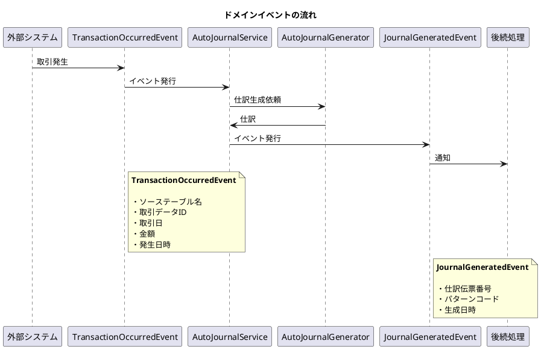
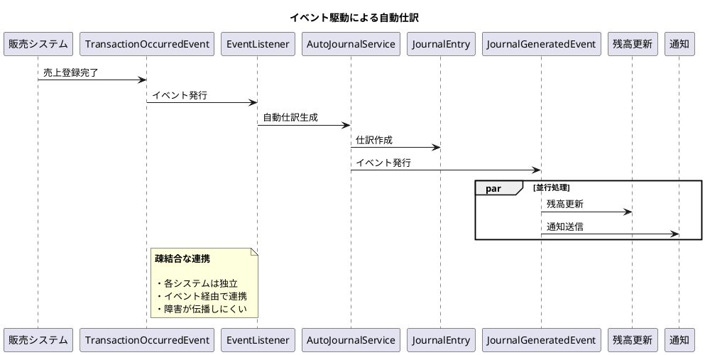

# 第14章: 自動仕訳

## 14.1 本章の概要

本章では、第3章で解説したヘキサゴナルアーキテクチャに従い、自動仕訳生成の機能実装を TDD で進めます。第6章で設計した自動仕訳テーブル、第12章で実装した自動仕訳パターン、第13章で実装した仕訳入力を連携させ、ドメインイベントを活用した自動仕訳生成機能を実装します。

### アーキテクチャの全体像

```plantuml
@startuml
skinparam componentStyle rectangle

package "infrastructure（Input Adapter）" {
  [AutoJournalController] as autoJournalController
  [TransactionEventListener] as eventListener
}

package "application" {
  package "port.in（Input Port）" {
    interface AutoJournalUseCase
  }
  package "service" {
    [AutoJournalService] as autoJournalService
  }
  package "port.out（Output Port）" {
    interface AutoJournalManagementRepository
    interface AutoJournalExecutionLogRepository
    interface AutoJournalPatternRepository
    interface JournalEntryRepository
  }
}

package "domain.model" {
  [AutoJournalGenerator] as generator
  [AutoJournalExecutionLog] as executionLog
  [TransactionOccurredEvent] as transactionEvent
  [JournalGeneratedEvent] as journalEvent
}

package "infrastructure（Output Adapter）" {
  [AutoJournalManagementRepositoryImpl] as managementRepoImpl
  [AutoJournalExecutionLogRepositoryImpl] as logRepoImpl
}

autoJournalController --> AutoJournalUseCase
eventListener --> AutoJournalUseCase
autoJournalService ..|> AutoJournalUseCase
autoJournalService --> AutoJournalManagementRepository
autoJournalService --> AutoJournalExecutionLogRepository
autoJournalService --> AutoJournalPatternRepository
autoJournalService --> JournalEntryRepository
autoJournalService --> generator

managementRepoImpl ..|> AutoJournalManagementRepository
logRepoImpl ..|> AutoJournalExecutionLogRepository

note right of eventListener
  Input Adapter
  ドメインイベントを受信
  Spring Event を使用
end note

note right of generator
  Domain Service
  パターンから仕訳を生成
end note

@enduml
```



### パッケージ構成

```
com.example.accounting/
├── domain/
│   ├── model/
│   │   └── autojournal/
│   │       ├── AutoJournalManagement.java        # 自動仕訳管理
│   │       ├── AutoJournalExecutionLog.java      # 実行ログ
│   │       ├── AutoJournalExecutionStatus.java   # 実行ステータス（列挙型）
│   │       └── AutoJournalGenerator.java         # 仕訳生成（ドメインサービス）
│   ├── event/
│   │   ├── TransactionOccurredEvent.java         # 取引発生イベント
│   │   └── JournalGeneratedEvent.java            # 仕訳生成イベント
│   └── service/
│       └── AutoJournalGeneratorService.java      # ドメインサービス実装
├── application/
│   ├── port/
│   │   ├── in/
│   │   │   ├── AutoJournalUseCase.java           # Input Port
│   │   │   └── command/
│   │   │       ├── GenerateAutoJournalCommand.java
│   │   │       └── ExecuteAutoJournalBatchCommand.java
│   │   └── out/
│   │       ├── AutoJournalManagementRepository.java  # Output Port
│   │       └── AutoJournalExecutionLogRepository.java
│   └── service/
│       └── AutoJournalService.java               # Application Service
└── infrastructure/
    ├── persistence/
    │   ├── mapper/
    │   │   ├── AutoJournalManagementMapper.java
    │   │   └── AutoJournalExecutionLogMapper.java
    │   └── repository/
    │       ├── AutoJournalManagementRepositoryImpl.java
    │       └── AutoJournalExecutionLogRepositoryImpl.java
    └── web/
        ├── controller/
        │   └── AutoJournalController.java        # Input Adapter
        ├── event/
        │   └── TransactionEventListener.java     # Event Listener
        └── dto/
            ├── AutoJournalRequest.java
            └── AutoJournalResponse.java
```

### TDD の流れ

1. **Domain Event**: ドメインイベントの作成（TransactionOccurredEvent, JournalGeneratedEvent）
2. **Domain Service**: AutoJournalGenerator によるパターンから仕訳への変換
3. **Domain Model**: AutoJournalManagement, AutoJournalExecutionLog
4. **Output Port**: リポジトリインターフェースの定義
5. **Output Adapter**: Testcontainers でリポジトリ実装をテスト
6. **Input Port**: ユースケースインターフェースの定義
7. **Application Service**: Mockito でアプリケーションサービスをテスト
8. **Input Adapter**: REST API とイベントリスナーの統合テスト

---

## 14.2 Domain Event の実装

### 14.2.1 ドメインイベントの設計

ドメインイベントは、ビジネス上の重要な出来事を表現するオブジェクトです。自動仕訳では、取引の発生と仕訳の生成をイベントとして扱います。



### 14.2.2 TransactionOccurredEvent（取引発生イベント）

```java
package com.example.accounting.domain.event;

import lombok.Value;

import java.math.BigDecimal;
import java.time.LocalDate;
import java.time.LocalDateTime;
import java.util.Map;

/**
 * 取引発生イベント
 *
 * 外部システムで取引が発生したことを通知するドメインイベント。
 * このイベントをトリガーとして自動仕訳が生成される。
 */
@Value
public class TransactionOccurredEvent {

    /** イベントID */
    String eventId;

    /** ソーステーブル名（売上、仕入、経費精算など） */
    String sourceTableName;

    /** ソースデータID */
    String sourceDataId;

    /** 取引日 */
    LocalDate transactionDate;

    /** 取引金額 */
    BigDecimal amount;

    /** 追加属性（部門コード、プロジェクトコードなど） */
    Map<String, Object> attributes;

    /** イベント発生日時 */
    LocalDateTime occurredAt;

    /**
     * イベントを作成
     */
    public static TransactionOccurredEvent create(
            String sourceTableName,
            String sourceDataId,
            LocalDate transactionDate,
            BigDecimal amount,
            Map<String, Object> attributes) {

        return new TransactionOccurredEvent(
            java.util.UUID.randomUUID().toString(),
            sourceTableName,
            sourceDataId,
            transactionDate,
            amount,
            attributes,
            LocalDateTime.now()
        );
    }

    /**
     * 属性を取得（型安全）
     */
    @SuppressWarnings("unchecked")
    public <T> T getAttribute(String key, Class<T> type) {
        Object value = attributes.get(key);
        if (value == null) {
            return null;
        }
        if (!type.isInstance(value)) {
            throw new IllegalArgumentException(
                "属性 " + key + " の型が一致しません: " + value.getClass());
        }
        return (T) value;
    }

    /**
     * 部門コードを取得
     */
    public String getDepartmentCode() {
        return getAttribute("departmentCode", String.class);
    }

    /**
     * プロジェクトコードを取得
     */
    public String getProjectCode() {
        return getAttribute("projectCode", String.class);
    }
}
```

### 14.2.3 JournalGeneratedEvent（仕訳生成イベント）

```java
package com.example.accounting.domain.event;

import lombok.Value;

import java.time.LocalDateTime;
import java.util.List;

/**
 * 仕訳生成イベント
 *
 * 自動仕訳が生成されたことを通知するドメインイベント。
 * 後続処理（残高更新、通知など）のトリガーとして使用。
 */
@Value
public class JournalGeneratedEvent {

    /** イベントID */
    String eventId;

    /** 生成された仕訳伝票番号のリスト */
    List<String> journalEntryNumbers;

    /** 使用したパターンコード */
    String patternCode;

    /** ソースイベントID */
    String sourceEventId;

    /** 生成日時 */
    LocalDateTime generatedAt;

    /**
     * イベントを作成
     */
    public static JournalGeneratedEvent create(
            List<String> journalEntryNumbers,
            String patternCode,
            String sourceEventId) {

        return new JournalGeneratedEvent(
            java.util.UUID.randomUUID().toString(),
            journalEntryNumbers,
            patternCode,
            sourceEventId,
            LocalDateTime.now()
        );
    }

    /**
     * 生成件数を取得
     */
    public int getGeneratedCount() {
        return journalEntryNumbers.size();
    }

    /**
     * 生成が成功したかどうか
     */
    public boolean isSuccess() {
        return !journalEntryNumbers.isEmpty();
    }
}
```

### 14.2.4 ドメインイベントのテスト

```java
package com.example.accounting.domain.event;

import org.junit.jupiter.api.DisplayName;
import org.junit.jupiter.api.Nested;
import org.junit.jupiter.api.Test;

import java.math.BigDecimal;
import java.time.LocalDate;
import java.util.List;
import java.util.Map;

import static org.assertj.core.api.Assertions.*;

@DisplayName("ドメインイベントのテスト")
class DomainEventTest {

    @Nested
    @DisplayName("TransactionOccurredEvent")
    class TransactionOccurredEventTest {

        @Test
        @DisplayName("取引発生イベントを作成できる")
        void shouldCreateTransactionOccurredEvent() {
            // Given
            Map<String, Object> attributes = Map.of(
                "departmentCode", "001",
                "projectCode", "PJ-001"
            );

            // When
            TransactionOccurredEvent event = TransactionOccurredEvent.create(
                "sales_data",
                "SALES-001",
                LocalDate.of(2025, 1, 15),
                new BigDecimal("100000"),
                attributes
            );

            // Then
            assertThat(event.getEventId()).isNotNull();
            assertThat(event.getSourceTableName()).isEqualTo("sales_data");
            assertThat(event.getSourceDataId()).isEqualTo("SALES-001");
            assertThat(event.getTransactionDate()).isEqualTo(LocalDate.of(2025, 1, 15));
            assertThat(event.getAmount()).isEqualByComparingTo(new BigDecimal("100000"));
            assertThat(event.getOccurredAt()).isNotNull();
        }

        @Test
        @DisplayName("属性を型安全に取得できる")
        void shouldGetAttributeTypeSafe() {
            // Given
            Map<String, Object> attributes = Map.of(
                "departmentCode", "001",
                "quantity", 10
            );
            TransactionOccurredEvent event = TransactionOccurredEvent.create(
                "sales_data", "S-001", LocalDate.now(),
                BigDecimal.ZERO, attributes
            );

            // When & Then
            assertThat(event.getAttribute("departmentCode", String.class)).isEqualTo("001");
            assertThat(event.getAttribute("quantity", Integer.class)).isEqualTo(10);
            assertThat(event.getAttribute("notExist", String.class)).isNull();
        }

        @Test
        @DisplayName("部門コード・プロジェクトコードを取得できる")
        void shouldGetDepartmentAndProjectCode() {
            // Given
            Map<String, Object> attributes = Map.of(
                "departmentCode", "SALES",
                "projectCode", "PJ-2025-001"
            );
            TransactionOccurredEvent event = TransactionOccurredEvent.create(
                "sales_data", "S-001", LocalDate.now(),
                BigDecimal.ZERO, attributes
            );

            // When & Then
            assertThat(event.getDepartmentCode()).isEqualTo("SALES");
            assertThat(event.getProjectCode()).isEqualTo("PJ-2025-001");
        }
    }

    @Nested
    @DisplayName("JournalGeneratedEvent")
    class JournalGeneratedEventTest {

        @Test
        @DisplayName("仕訳生成イベントを作成できる")
        void shouldCreateJournalGeneratedEvent() {
            // Given
            List<String> journalNumbers = List.of("JE-001", "JE-002");

            // When
            JournalGeneratedEvent event = JournalGeneratedEvent.create(
                journalNumbers,
                "SALES_001",
                "event-123"
            );

            // Then
            assertThat(event.getEventId()).isNotNull();
            assertThat(event.getJournalEntryNumbers()).containsExactly("JE-001", "JE-002");
            assertThat(event.getPatternCode()).isEqualTo("SALES_001");
            assertThat(event.getSourceEventId()).isEqualTo("event-123");
            assertThat(event.getGeneratedAt()).isNotNull();
        }

        @Test
        @DisplayName("生成件数を取得できる")
        void shouldGetGeneratedCount() {
            // Given
            JournalGeneratedEvent event = JournalGeneratedEvent.create(
                List.of("JE-001", "JE-002", "JE-003"),
                "PATTERN_001",
                "event-123"
            );

            // When & Then
            assertThat(event.getGeneratedCount()).isEqualTo(3);
        }

        @Test
        @DisplayName("生成成功を判定できる")
        void shouldDetermineSuccess() {
            // Given
            JournalGeneratedEvent successEvent = JournalGeneratedEvent.create(
                List.of("JE-001"), "PATTERN_001", "event-123"
            );
            JournalGeneratedEvent failEvent = JournalGeneratedEvent.create(
                List.of(), "PATTERN_001", "event-456"
            );

            // When & Then
            assertThat(successEvent.isSuccess()).isTrue();
            assertThat(failEvent.isSuccess()).isFalse();
        }
    }
}
```

---

## 14.3 Domain Model の実装

### 14.3.1 AutoJournalExecutionStatus 列挙型

```java
package com.example.accounting.domain.model.autojournal;

/**
 * 自動仕訳実行ステータス
 */
public enum AutoJournalExecutionStatus {
    SUCCESS("成功", "すべての処理が正常に完了"),
    PARTIAL_SUCCESS("一部成功", "一部の処理が失敗"),
    FAILURE("失敗", "処理が失敗");

    private final String displayName;
    private final String description;

    AutoJournalExecutionStatus(String displayName, String description) {
        this.displayName = displayName;
        this.description = description;
    }

    public String getDisplayName() {
        return displayName;
    }

    public String getDescription() {
        return description;
    }

    /**
     * 処理結果からステータスを決定
     */
    public static AutoJournalExecutionStatus determine(
            int processedCount, int generatedCount, int errorCount) {

        if (errorCount == 0 && generatedCount > 0) {
            return SUCCESS;
        } else if (generatedCount > 0 && errorCount > 0) {
            return PARTIAL_SUCCESS;
        } else {
            return FAILURE;
        }
    }

    /**
     * 成功かどうか
     */
    public boolean isSuccess() {
        return this == SUCCESS;
    }

    /**
     * 部分成功以上かどうか
     */
    public boolean isPartialSuccessOrBetter() {
        return this == SUCCESS || this == PARTIAL_SUCCESS;
    }
}
```

### 14.3.2 AutoJournalManagement ドメインモデル

```java
package com.example.accounting.domain.model.autojournal;

import lombok.Value;
import lombok.With;

import java.time.LocalDateTime;

/**
 * 自動仕訳管理ドメインモデル
 *
 * 各ソーステーブルの自動仕訳処理状況を管理する。
 * 日付管理方式により、最終処理日時以降のデータのみを処理対象とする。
 */
@Value
@With
public class AutoJournalManagement {

    Long managementId;
    String sourceTableName;
    LocalDateTime lastProcessedAt;
    LocalDateTime createdAt;
    LocalDateTime updatedAt;

    /**
     * 新規作成
     */
    public static AutoJournalManagement create(String sourceTableName) {
        return new AutoJournalManagement(
            null,
            sourceTableName,
            LocalDateTime.of(1970, 1, 1, 0, 0, 0), // エポック開始
            null,
            null
        );
    }

    /**
     * 指定日時から開始
     */
    public static AutoJournalManagement createFrom(
            String sourceTableName, LocalDateTime startFrom) {
        return new AutoJournalManagement(
            null,
            sourceTableName,
            startFrom,
            null,
            null
        );
    }

    /**
     * 最終処理日時を更新
     */
    public AutoJournalManagement updateLastProcessedAt(LocalDateTime processedAt) {
        if (processedAt.isBefore(this.lastProcessedAt)) {
            throw new IllegalArgumentException(
                "新しい処理日時は現在の最終処理日時より後である必要があります");
        }
        return this.withLastProcessedAt(processedAt);
    }

    /**
     * 差分処理の対象期間を取得
     */
    public LocalDateTime getFromTimestamp() {
        return lastProcessedAt;
    }

    /**
     * 初回処理かどうか
     */
    public boolean isFirstExecution() {
        return lastProcessedAt.getYear() == 1970;
    }
}
```

### 14.3.3 AutoJournalExecutionLog ドメインモデル

```java
package com.example.accounting.domain.model.autojournal;

import lombok.Value;
import lombok.With;

import java.time.LocalDateTime;
import java.util.Objects;

/**
 * 自動仕訳実行ログドメインモデル
 *
 * 自動仕訳バッチの実行履歴を記録する。
 * 監査証跡として機能し、エラー発生時の調査にも使用する。
 */
@Value
@With
public class AutoJournalExecutionLog {

    Long executionLogId;
    Long patternId;
    LocalDateTime executionAt;
    Integer processedCount;
    Integer generatedCount;
    AutoJournalExecutionStatus status;
    String message;
    String errorDetail;
    LocalDateTime createdAt;

    /**
     * 実行開始時にログを作成
     */
    public static AutoJournalExecutionLog start(Long patternId) {
        return new AutoJournalExecutionLog(
            null,
            patternId,
            LocalDateTime.now(),
            0,
            0,
            null, // 実行中はステータスなし
            null,
            null,
            null
        );
    }

    /**
     * 処理完了でログを更新
     */
    public AutoJournalExecutionLog complete(
            int processedCount, int generatedCount, String message) {

        AutoJournalExecutionStatus determinedStatus =
            AutoJournalExecutionStatus.determine(processedCount, generatedCount, 0);

        return this
            .withProcessedCount(processedCount)
            .withGeneratedCount(generatedCount)
            .withStatus(determinedStatus)
            .withMessage(message);
    }

    /**
     * 部分成功でログを更新
     */
    public AutoJournalExecutionLog partialComplete(
            int processedCount, int generatedCount, int errorCount, String message) {

        AutoJournalExecutionStatus determinedStatus =
            AutoJournalExecutionStatus.determine(processedCount, generatedCount, errorCount);

        return this
            .withProcessedCount(processedCount)
            .withGeneratedCount(generatedCount)
            .withStatus(determinedStatus)
            .withMessage(message);
    }

    /**
     * 失敗でログを更新
     */
    public AutoJournalExecutionLog fail(String message, String errorDetail) {
        return this
            .withStatus(AutoJournalExecutionStatus.FAILURE)
            .withMessage(message)
            .withErrorDetail(errorDetail);
    }

    /**
     * 成功かどうか
     */
    public boolean isSuccess() {
        return status != null && status.isSuccess();
    }

    /**
     * 処理が完了しているかどうか
     */
    public boolean isCompleted() {
        return status != null;
    }

    /**
     * エラーがあるかどうか
     */
    public boolean hasError() {
        return errorDetail != null && !errorDetail.isEmpty();
    }

    /**
     * 実行時間（ミリ秒）を計算
     */
    public long getExecutionTimeMillis(LocalDateTime endTime) {
        Objects.requireNonNull(endTime, "終了時刻は必須です");
        return java.time.Duration.between(executionAt, endTime).toMillis();
    }
}
```

### 14.3.4 ドメインモデルのテスト

```java
package com.example.accounting.domain.model.autojournal;

import org.junit.jupiter.api.DisplayName;
import org.junit.jupiter.api.Nested;
import org.junit.jupiter.api.Test;

import java.time.LocalDateTime;

import static org.assertj.core.api.Assertions.*;

@DisplayName("自動仕訳ドメインモデルのテスト")
class AutoJournalDomainModelTest {

    @Nested
    @DisplayName("AutoJournalExecutionStatus")
    class AutoJournalExecutionStatusTest {

        @Test
        @DisplayName("全成功時は SUCCESS を返す")
        void shouldReturnSuccessWhenAllSucceeded() {
            // When
            AutoJournalExecutionStatus status =
                AutoJournalExecutionStatus.determine(10, 10, 0);

            // Then
            assertThat(status).isEqualTo(AutoJournalExecutionStatus.SUCCESS);
            assertThat(status.isSuccess()).isTrue();
        }

        @Test
        @DisplayName("一部失敗時は PARTIAL_SUCCESS を返す")
        void shouldReturnPartialSuccessWhenPartiallyFailed() {
            // When
            AutoJournalExecutionStatus status =
                AutoJournalExecutionStatus.determine(10, 7, 3);

            // Then
            assertThat(status).isEqualTo(AutoJournalExecutionStatus.PARTIAL_SUCCESS);
            assertThat(status.isPartialSuccessOrBetter()).isTrue();
        }

        @Test
        @DisplayName("全失敗時は FAILURE を返す")
        void shouldReturnFailureWhenAllFailed() {
            // When
            AutoJournalExecutionStatus status =
                AutoJournalExecutionStatus.determine(10, 0, 10);

            // Then
            assertThat(status).isEqualTo(AutoJournalExecutionStatus.FAILURE);
            assertThat(status.isSuccess()).isFalse();
        }
    }

    @Nested
    @DisplayName("AutoJournalManagement")
    class AutoJournalManagementTest {

        @Test
        @DisplayName("新規作成できる")
        void shouldCreate() {
            // When
            AutoJournalManagement management =
                AutoJournalManagement.create("sales_data");

            // Then
            assertThat(management.getSourceTableName()).isEqualTo("sales_data");
            assertThat(management.isFirstExecution()).isTrue();
        }

        @Test
        @DisplayName("指定日時から開始できる")
        void shouldCreateFrom() {
            // Given
            LocalDateTime startFrom = LocalDateTime.of(2025, 1, 1, 0, 0);

            // When
            AutoJournalManagement management =
                AutoJournalManagement.createFrom("sales_data", startFrom);

            // Then
            assertThat(management.getFromTimestamp()).isEqualTo(startFrom);
            assertThat(management.isFirstExecution()).isFalse();
        }

        @Test
        @DisplayName("最終処理日時を更新できる")
        void shouldUpdateLastProcessedAt() {
            // Given
            AutoJournalManagement management =
                AutoJournalManagement.create("sales_data");
            LocalDateTime newProcessedAt = LocalDateTime.of(2025, 1, 15, 10, 0);

            // When
            AutoJournalManagement updated =
                management.updateLastProcessedAt(newProcessedAt);

            // Then
            assertThat(updated.getLastProcessedAt()).isEqualTo(newProcessedAt);
        }

        @Test
        @DisplayName("過去の日時には更新できない")
        void shouldNotUpdateToOlderTimestamp() {
            // Given
            LocalDateTime initial = LocalDateTime.of(2025, 1, 15, 10, 0);
            AutoJournalManagement management =
                AutoJournalManagement.createFrom("sales_data", initial);
            LocalDateTime olderTime = LocalDateTime.of(2025, 1, 10, 10, 0);

            // When & Then
            assertThatThrownBy(() -> management.updateLastProcessedAt(olderTime))
                .isInstanceOf(IllegalArgumentException.class);
        }
    }

    @Nested
    @DisplayName("AutoJournalExecutionLog")
    class AutoJournalExecutionLogTest {

        @Test
        @DisplayName("実行開始ログを作成できる")
        void shouldStartLog() {
            // When
            AutoJournalExecutionLog log = AutoJournalExecutionLog.start(1L);

            // Then
            assertThat(log.getPatternId()).isEqualTo(1L);
            assertThat(log.getExecutionAt()).isNotNull();
            assertThat(log.isCompleted()).isFalse();
        }

        @Test
        @DisplayName("正常完了でログを更新できる")
        void shouldCompleteLog() {
            // Given
            AutoJournalExecutionLog log = AutoJournalExecutionLog.start(1L);

            // When
            AutoJournalExecutionLog completed = log.complete(10, 10, "正常完了");

            // Then
            assertThat(completed.getProcessedCount()).isEqualTo(10);
            assertThat(completed.getGeneratedCount()).isEqualTo(10);
            assertThat(completed.isSuccess()).isTrue();
            assertThat(completed.isCompleted()).isTrue();
        }

        @Test
        @DisplayName("部分成功でログを更新できる")
        void shouldPartialCompleteLog() {
            // Given
            AutoJournalExecutionLog log = AutoJournalExecutionLog.start(1L);

            // When
            AutoJournalExecutionLog partial =
                log.partialComplete(10, 7, 3, "3件のエラー");

            // Then
            assertThat(partial.getStatus())
                .isEqualTo(AutoJournalExecutionStatus.PARTIAL_SUCCESS);
        }

        @Test
        @DisplayName("失敗でログを更新できる")
        void shouldFailLog() {
            // Given
            AutoJournalExecutionLog log = AutoJournalExecutionLog.start(1L);

            // When
            AutoJournalExecutionLog failed =
                log.fail("データベース接続エラー", "Connection refused");

            // Then
            assertThat(failed.getStatus())
                .isEqualTo(AutoJournalExecutionStatus.FAILURE);
            assertThat(failed.hasError()).isTrue();
            assertThat(failed.getErrorDetail()).isEqualTo("Connection refused");
        }

        @Test
        @DisplayName("実行時間を計算できる")
        void shouldCalculateExecutionTime() {
            // Given
            AutoJournalExecutionLog log = AutoJournalExecutionLog.start(1L);
            LocalDateTime endTime = log.getExecutionAt().plusSeconds(5);

            // When
            long executionTime = log.getExecutionTimeMillis(endTime);

            // Then
            assertThat(executionTime).isEqualTo(5000L);
        }
    }
}
```

---

## 14.4 Domain Service の実装

### 14.4.1 AutoJournalGenerator ドメインサービス

```java
package com.example.accounting.domain.service;

import com.example.accounting.domain.event.TransactionOccurredEvent;
import com.example.accounting.domain.model.autojournal.pattern.AutoJournalPattern;
import com.example.accounting.domain.model.autojournal.pattern.AutoJournalPatternDetail;
import com.example.accounting.domain.model.journal.DebitCreditType;
import com.example.accounting.domain.model.journal.JournalEntry;
import com.example.accounting.domain.model.journal.JournalEntryDetail;
import com.example.accounting.domain.model.journal.JournalEntryDetailItem;
import com.example.accounting.domain.model.journal.JournalEntryNumber;
import com.example.accounting.domain.model.journal.Money;
import lombok.RequiredArgsConstructor;
import org.springframework.stereotype.Service;

import java.math.BigDecimal;
import java.time.LocalDate;
import java.time.format.DateTimeFormatter;
import java.util.ArrayList;
import java.util.List;
import java.util.Map;
import java.util.concurrent.atomic.AtomicInteger;
import java.util.regex.Matcher;
import java.util.regex.Pattern;

/**
 * 自動仕訳生成ドメインサービス
 *
 * パターンと取引イベントから仕訳を生成する。
 * 金額計算式の評価、摘要テンプレートの展開を行う。
 */
@Service
@RequiredArgsConstructor
public class AutoJournalGenerator {

    private static final DateTimeFormatter DATE_FORMAT =
        DateTimeFormatter.ofPattern("yyyyMMdd");
    private static final Pattern VARIABLE_PATTERN =
        Pattern.compile("\\$\\{([^}]+)\\}");

    /** 伝票番号の連番（実運用では採番サービスを使用） */
    private final AtomicInteger sequence = new AtomicInteger(1);

    /**
     * パターンと取引イベントから仕訳を生成
     */
    public JournalEntry generate(
            AutoJournalPattern pattern,
            TransactionOccurredEvent event) {

        validatePattern(pattern);

        // 伝票番号の生成
        JournalEntryNumber journalNumber = generateJournalNumber(event);

        // 仕訳明細の生成
        List<JournalEntryDetail> details = generateDetails(pattern, event);

        // 仕訳の作成
        return JournalEntry.createAutoJournal(
            journalNumber,
            event.getTransactionDate(),
            LocalDate.now(),
            details
        );
    }

    /**
     * 複数の取引から仕訳を一括生成
     */
    public List<JournalEntry> generateBatch(
            AutoJournalPattern pattern,
            List<TransactionOccurredEvent> events) {

        List<JournalEntry> journals = new ArrayList<>();
        for (TransactionOccurredEvent event : events) {
            try {
                JournalEntry journal = generate(pattern, event);
                journals.add(journal);
            } catch (Exception e) {
                // 個別のエラーはログに記録して続行
                // 実運用ではエラーハンドリング戦略に従う
            }
        }
        return journals;
    }

    /**
     * パターンの検証
     */
    private void validatePattern(AutoJournalPattern pattern) {
        if (!pattern.isEnabled()) {
            throw new IllegalArgumentException(
                "無効なパターンでは仕訳を生成できません: " + pattern.getPatternCode());
        }
        if (!pattern.isValid()) {
            throw new IllegalArgumentException(
                "パターンが不正です: " + pattern.getPatternCode());
        }
    }

    /**
     * 伝票番号の生成
     */
    private JournalEntryNumber generateJournalNumber(TransactionOccurredEvent event) {
        String datePrefix = event.getTransactionDate().format(DATE_FORMAT);
        int seq = sequence.getAndIncrement();
        String number = String.format("AUTO-%s-%04d", datePrefix, seq);
        return JournalEntryNumber.of(number);
    }

    /**
     * 仕訳明細の生成
     */
    private List<JournalEntryDetail> generateDetails(
            AutoJournalPattern pattern,
            TransactionOccurredEvent event) {

        List<JournalEntryDetail> details = new ArrayList<>();

        // 行番号ごとにグループ化
        Map<Integer, List<AutoJournalPatternDetail>> detailsByLine =
            pattern.getDetailsByLineNumber();

        for (Map.Entry<Integer, List<AutoJournalPatternDetail>> entry :
                detailsByLine.entrySet()) {

            Integer lineNumber = entry.getKey();
            List<AutoJournalPatternDetail> patternDetails = entry.getValue();

            // 行摘要の生成
            String lineSummary = generateLineSummary(patternDetails, event);

            // 借方・貸方明細の生成
            List<JournalEntryDetailItem> items = new ArrayList<>();
            for (AutoJournalPatternDetail patternDetail : patternDetails) {
                JournalEntryDetailItem item = generateDetailItem(patternDetail, event);
                items.add(item);
            }

            JournalEntryDetail detail = JournalEntryDetail.create(
                lineNumber,
                lineSummary,
                items
            );
            details.add(detail);
        }

        return details;
    }

    /**
     * 仕訳貸借明細の生成
     */
    private JournalEntryDetailItem generateDetailItem(
            AutoJournalPatternDetail patternDetail,
            TransactionOccurredEvent event) {

        // 金額の計算
        Money amount = calculateAmount(
            patternDetail.getAmountFormula(),
            event.getAmount(),
            event.getAttributes()
        );

        return JournalEntryDetailItem.create(
            patternDetail.getDebitCreditType(),
            patternDetail.getAccountCode(),
            amount,
            event.getDepartmentCode(),
            event.getProjectCode()
        );
    }

    /**
     * 金額計算式の評価
     *
     * サポートする式:
     * - ${amount}: 取引金額
     * - ${amount} * 1.10: 取引金額 × 1.10
     * - ${amount} * ${taxRate}: 取引金額 × 税率
     */
    Money calculateAmount(
            String formula,
            BigDecimal baseAmount,
            Map<String, Object> attributes) {

        String evaluated = formula;

        // ${amount} の置換
        evaluated = evaluated.replace("${amount}", baseAmount.toString());

        // その他の変数の置換
        Matcher matcher = VARIABLE_PATTERN.matcher(evaluated);
        StringBuffer sb = new StringBuffer();
        while (matcher.find()) {
            String varName = matcher.group(1);
            Object value = attributes.get(varName);
            if (value != null) {
                matcher.appendReplacement(sb, value.toString());
            }
        }
        matcher.appendTail(sb);
        evaluated = sb.toString();

        // 数式の評価（簡易実装）
        BigDecimal result = evaluateExpression(evaluated);
        return Money.of(result, "JPY");
    }

    /**
     * 簡易数式評価（実運用では SpEL や専用ライブラリを使用）
     */
    private BigDecimal evaluateExpression(String expression) {
        // 乗算のみサポート（簡易実装）
        if (expression.contains("*")) {
            String[] parts = expression.split("\\*");
            BigDecimal result = new BigDecimal(parts[0].trim());
            for (int i = 1; i < parts.length; i++) {
                result = result.multiply(new BigDecimal(parts[i].trim()));
            }
            return result.setScale(0, java.math.RoundingMode.HALF_UP);
        }
        return new BigDecimal(expression.trim());
    }

    /**
     * 行摘要の生成
     */
    private String generateLineSummary(
            List<AutoJournalPatternDetail> patternDetails,
            TransactionOccurredEvent event) {

        // 最初の明細の摘要テンプレートを使用
        String template = patternDetails.get(0).getSummaryTemplate();
        if (template == null || template.isEmpty()) {
            return "自動仕訳: " + event.getSourceDataId();
        }
        return expandTemplate(template, event);
    }

    /**
     * 摘要テンプレートの展開
     *
     * サポートする変数:
     * - ${sourceDataId}: ソースデータID
     * - ${transactionDate}: 取引日
     * - ${amount}: 金額
     */
    private String expandTemplate(String template, TransactionOccurredEvent event) {
        String result = template;
        result = result.replace("${sourceDataId}", event.getSourceDataId());
        result = result.replace("${transactionDate}",
            event.getTransactionDate().format(DateTimeFormatter.ISO_LOCAL_DATE));
        result = result.replace("${amount}", event.getAmount().toString());

        // 追加属性の置換
        for (Map.Entry<String, Object> attr : event.getAttributes().entrySet()) {
            result = result.replace(
                "${" + attr.getKey() + "}",
                attr.getValue().toString()
            );
        }
        return result;
    }
}
```

### 14.4.2 ドメインサービスのテスト

```java
package com.example.accounting.domain.service;

import com.example.accounting.domain.event.TransactionOccurredEvent;
import com.example.accounting.domain.model.autojournal.pattern.AutoJournalPattern;
import com.example.accounting.domain.model.autojournal.pattern.AutoJournalPatternDetail;
import com.example.accounting.domain.model.journal.DebitCreditType;
import com.example.accounting.domain.model.journal.JournalEntry;
import com.example.accounting.domain.model.journal.Money;
import org.junit.jupiter.api.BeforeEach;
import org.junit.jupiter.api.DisplayName;
import org.junit.jupiter.api.Nested;
import org.junit.jupiter.api.Test;

import java.math.BigDecimal;
import java.time.LocalDate;
import java.util.List;
import java.util.Map;

import static org.assertj.core.api.Assertions.*;

@DisplayName("AutoJournalGenerator ドメインサービスのテスト")
class AutoJournalGeneratorTest {

    private AutoJournalGenerator generator;

    @BeforeEach
    void setUp() {
        generator = new AutoJournalGenerator();
    }

    @Nested
    @DisplayName("金額計算")
    class AmountCalculationTest {

        @Test
        @DisplayName("単純な金額置換ができる")
        void shouldCalculateSimpleAmount() {
            // Given
            BigDecimal baseAmount = new BigDecimal("100000");

            // When
            Money result = generator.calculateAmount(
                "${amount}",
                baseAmount,
                Map.of()
            );

            // Then
            assertThat(result.getAmount()).isEqualByComparingTo(new BigDecimal("100000"));
        }

        @Test
        @DisplayName("乗算の計算ができる")
        void shouldCalculateMultiplication() {
            // Given
            BigDecimal baseAmount = new BigDecimal("100000");

            // When
            Money result = generator.calculateAmount(
                "${amount} * 1.10",
                baseAmount,
                Map.of()
            );

            // Then
            assertThat(result.getAmount()).isEqualByComparingTo(new BigDecimal("110000"));
        }

        @Test
        @DisplayName("変数を使った計算ができる")
        void shouldCalculateWithVariable() {
            // Given
            BigDecimal baseAmount = new BigDecimal("100000");
            Map<String, Object> attributes = Map.of("taxRate", "0.10");

            // When
            Money result = generator.calculateAmount(
                "${amount} * ${taxRate}",
                baseAmount,
                attributes
            );

            // Then
            assertThat(result.getAmount()).isEqualByComparingTo(new BigDecimal("10000"));
        }
    }

    @Nested
    @DisplayName("仕訳生成")
    class JournalGenerationTest {

        @Test
        @DisplayName("パターンから仕訳を生成できる")
        void shouldGenerateJournalFromPattern() {
            // Given
            AutoJournalPattern pattern = createSalesPattern();
            TransactionOccurredEvent event = createSalesEvent();

            // When
            JournalEntry journal = generator.generate(pattern, event);

            // Then
            assertThat(journal.getJournalEntryNumber().getValue())
                .startsWith("AUTO-");
            assertThat(journal.getEntryDate())
                .isEqualTo(LocalDate.of(2025, 1, 15));
            assertThat(journal.isBalanced()).isTrue();
        }

        @Test
        @DisplayName("無効なパターンでは生成できない")
        void shouldNotGenerateWithDisabledPattern() {
            // Given
            AutoJournalPattern pattern = createDisabledPattern();
            TransactionOccurredEvent event = createSalesEvent();

            // When & Then
            assertThatThrownBy(() -> generator.generate(pattern, event))
                .isInstanceOf(IllegalArgumentException.class)
                .hasMessageContaining("無効なパターン");
        }

        @Test
        @DisplayName("複数の取引から一括生成できる")
        void shouldGenerateBatch() {
            // Given
            AutoJournalPattern pattern = createSalesPattern();
            List<TransactionOccurredEvent> events = List.of(
                createSalesEvent("S-001", new BigDecimal("100000")),
                createSalesEvent("S-002", new BigDecimal("200000")),
                createSalesEvent("S-003", new BigDecimal("150000"))
            );

            // When
            List<JournalEntry> journals = generator.generateBatch(pattern, events);

            // Then
            assertThat(journals).hasSize(3);
            assertThat(journals).allMatch(JournalEntry::isBalanced);
        }
    }

    // テストヘルパーメソッド

    private AutoJournalPattern createSalesPattern() {
        List<AutoJournalPatternDetail> details = List.of(
            AutoJournalPatternDetail.create(
                1, DebitCreditType.DEBIT, "1130", // 売掛金
                "${amount}", "売上計上: ${sourceDataId}"
            ),
            AutoJournalPatternDetail.create(
                1, DebitCreditType.CREDIT, "4010", // 売上高
                "${amount}", null
            )
        );
        return AutoJournalPattern.create(
            "SALES_001",
            "売上計上仕訳",
            "sales_data",
            "売上データから売掛金/売上高の仕訳を生成",
            details
        );
    }

    private AutoJournalPattern createDisabledPattern() {
        return createSalesPattern().disable();
    }

    private TransactionOccurredEvent createSalesEvent() {
        return createSalesEvent("SALES-001", new BigDecimal("100000"));
    }

    private TransactionOccurredEvent createSalesEvent(
            String sourceDataId, BigDecimal amount) {
        return TransactionOccurredEvent.create(
            "sales_data",
            sourceDataId,
            LocalDate.of(2025, 1, 15),
            amount,
            Map.of(
                "departmentCode", "001",
                "projectCode", "PJ-001"
            )
        );
    }
}
```

---

## 14.5 Output Port（リポジトリインターフェース）

### 14.5.1 AutoJournalManagementRepository

```java
package com.example.accounting.application.port.out;

import com.example.accounting.domain.model.autojournal.AutoJournalManagement;

import java.util.List;
import java.util.Optional;

/**
 * 自動仕訳管理リポジトリ（Output Port）
 */
public interface AutoJournalManagementRepository {

    AutoJournalManagement save(AutoJournalManagement management);

    Optional<AutoJournalManagement> findBySourceTableName(String sourceTableName);

    List<AutoJournalManagement> findAll();

    void deleteBySourceTableName(String sourceTableName);

    boolean existsBySourceTableName(String sourceTableName);
}
```

### 14.5.2 AutoJournalExecutionLogRepository

```java
package com.example.accounting.application.port.out;

import com.example.accounting.domain.model.autojournal.AutoJournalExecutionLog;
import com.example.accounting.domain.model.autojournal.AutoJournalExecutionStatus;

import java.time.LocalDateTime;
import java.util.List;
import java.util.Optional;

/**
 * 自動仕訳実行ログリポジトリ（Output Port）
 */
public interface AutoJournalExecutionLogRepository {

    AutoJournalExecutionLog save(AutoJournalExecutionLog log);

    Optional<AutoJournalExecutionLog> findById(Long executionLogId);

    List<AutoJournalExecutionLog> findByPatternId(Long patternId);

    List<AutoJournalExecutionLog> findByPatternIdAndStatus(
        Long patternId, AutoJournalExecutionStatus status);

    List<AutoJournalExecutionLog> findByExecutionAtBetween(
        LocalDateTime from, LocalDateTime to);

    /**
     * 最新の実行ログを取得
     */
    Optional<AutoJournalExecutionLog> findLatestByPatternId(Long patternId);

    /**
     * 失敗ログを取得
     */
    List<AutoJournalExecutionLog> findFailedLogs(int limit);

    long count();

    long countByStatus(AutoJournalExecutionStatus status);
}
```

---

## 14.6 Output Adapter（リポジトリ実装）

### 14.6.1 MyBatis Mapper

```java
package com.example.accounting.infrastructure.persistence.mapper;

import com.example.accounting.infrastructure.persistence.entity.AutoJournalManagementEntity;
import org.apache.ibatis.annotations.Mapper;
import org.apache.ibatis.annotations.Param;

import java.util.List;

@Mapper
public interface AutoJournalManagementMapper {

    void insert(AutoJournalManagementEntity entity);

    void update(AutoJournalManagementEntity entity);

    AutoJournalManagementEntity selectBySourceTableName(
        @Param("sourceTableName") String sourceTableName);

    List<AutoJournalManagementEntity> selectAll();

    void deleteBySourceTableName(@Param("sourceTableName") String sourceTableName);

    long count();
}
```

**AutoJournalManagementMapper.xml**:

```xml
<?xml version="1.0" encoding="UTF-8" ?>
<!DOCTYPE mapper PUBLIC "-//mybatis.org//DTD Mapper 3.0//EN"
        "http://mybatis.org/dtd/mybatis-3-mapper.dtd">
<mapper namespace="com.example.accounting.infrastructure.persistence.mapper.AutoJournalManagementMapper">

    <resultMap id="AutoJournalManagementResultMap"
               type="com.example.accounting.infrastructure.persistence.entity.AutoJournalManagementEntity">
        <id property="managementId" column="自動仕訳管理ID"/>
        <result property="sourceTableName" column="ソーステーブル名"/>
        <result property="lastProcessedAt" column="最終処理日時"/>
        <result property="createdAt" column="作成日時"/>
        <result property="updatedAt" column="更新日時"/>
    </resultMap>

    <insert id="insert" useGeneratedKeys="true" keyProperty="managementId" keyColumn="自動仕訳管理ID">
        INSERT INTO "自動仕訳管理" (
            "ソーステーブル名", "最終処理日時"
        ) VALUES (
            #{sourceTableName}, #{lastProcessedAt}
        )
    </insert>

    <update id="update">
        UPDATE "自動仕訳管理"
        SET "最終処理日時" = #{lastProcessedAt},
            "更新日時" = CURRENT_TIMESTAMP
        WHERE "自動仕訳管理ID" = #{managementId}
    </update>

    <select id="selectBySourceTableName" resultMap="AutoJournalManagementResultMap">
        SELECT * FROM "自動仕訳管理"
        WHERE "ソーステーブル名" = #{sourceTableName}
    </select>

    <select id="selectAll" resultMap="AutoJournalManagementResultMap">
        SELECT * FROM "自動仕訳管理"
        ORDER BY "ソーステーブル名"
    </select>

    <delete id="deleteBySourceTableName">
        DELETE FROM "自動仕訳管理"
        WHERE "ソーステーブル名" = #{sourceTableName}
    </delete>

    <select id="count" resultType="long">
        SELECT COUNT(*) FROM "自動仕訳管理"
    </select>
</mapper>
```

### 14.6.2 Repository 実装

```java
package com.example.accounting.infrastructure.persistence.repository;

import com.example.accounting.application.port.out.AutoJournalManagementRepository;
import com.example.accounting.domain.model.autojournal.AutoJournalManagement;
import com.example.accounting.infrastructure.persistence.entity.AutoJournalManagementEntity;
import com.example.accounting.infrastructure.persistence.mapper.AutoJournalManagementMapper;
import lombok.RequiredArgsConstructor;
import org.springframework.stereotype.Repository;

import java.util.List;
import java.util.Optional;

/**
 * 自動仕訳管理リポジトリ実装（Output Adapter）
 */
@Repository
@RequiredArgsConstructor
public class AutoJournalManagementRepositoryImpl
        implements AutoJournalManagementRepository {

    private final AutoJournalManagementMapper mapper;

    @Override
    public AutoJournalManagement save(AutoJournalManagement management) {
        AutoJournalManagementEntity entity = AutoJournalManagementEntity.from(management);

        if (management.getManagementId() == null) {
            mapper.insert(entity);
            return entity.toDomain();
        } else {
            mapper.update(entity);
            return management;
        }
    }

    @Override
    public Optional<AutoJournalManagement> findBySourceTableName(String sourceTableName) {
        AutoJournalManagementEntity entity = mapper.selectBySourceTableName(sourceTableName);
        return Optional.ofNullable(entity).map(AutoJournalManagementEntity::toDomain);
    }

    @Override
    public List<AutoJournalManagement> findAll() {
        return mapper.selectAll().stream()
            .map(AutoJournalManagementEntity::toDomain)
            .toList();
    }

    @Override
    public void deleteBySourceTableName(String sourceTableName) {
        mapper.deleteBySourceTableName(sourceTableName);
    }

    @Override
    public boolean existsBySourceTableName(String sourceTableName) {
        return mapper.selectBySourceTableName(sourceTableName) != null;
    }
}
```

### 14.6.3 Repository 実装のテスト（Testcontainers）

```java
package com.example.accounting.infrastructure.persistence.repository;

import com.example.accounting.application.port.out.AutoJournalManagementRepository;
import com.example.accounting.domain.model.autojournal.AutoJournalManagement;
import org.junit.jupiter.api.*;
import org.springframework.beans.factory.annotation.Autowired;
import org.springframework.boot.test.context.SpringBootTest;
import org.springframework.test.context.DynamicPropertyRegistry;
import org.springframework.test.context.DynamicPropertySource;
import org.testcontainers.containers.PostgreSQLContainer;
import org.testcontainers.junit.jupiter.Container;
import org.testcontainers.junit.jupiter.Testcontainers;

import java.time.LocalDateTime;
import java.util.List;
import java.util.Optional;

import static org.assertj.core.api.Assertions.assertThat;

@SpringBootTest
@Testcontainers
@TestMethodOrder(MethodOrderer.OrderAnnotation.class)
@DisplayName("自動仕訳管理リポジトリ実装のテスト")
class AutoJournalManagementRepositoryImplTest {

    @Container
    static PostgreSQLContainer<?> postgres = new PostgreSQLContainer<>("postgres:16-alpine")
            .withDatabaseName("testdb")
            .withUsername("testuser")
            .withPassword("testpass");

    @DynamicPropertySource
    static void configureProperties(DynamicPropertyRegistry registry) {
        registry.add("spring.datasource.url", postgres::getJdbcUrl);
        registry.add("spring.datasource.username", postgres::getUsername);
        registry.add("spring.datasource.password", postgres::getPassword);
        registry.add("spring.flyway.enabled", () -> "true");
    }

    @Autowired
    private AutoJournalManagementRepository repository;

    @Test
    @Order(1)
    @DisplayName("自動仕訳管理を保存できる")
    void shouldSaveManagement() {
        // Given
        AutoJournalManagement management = AutoJournalManagement.create("sales_data");

        // When
        AutoJournalManagement saved = repository.save(management);

        // Then
        assertThat(saved.getManagementId()).isNotNull();
        assertThat(saved.getSourceTableName()).isEqualTo("sales_data");
        assertThat(saved.isFirstExecution()).isTrue();
    }

    @Test
    @Order(2)
    @DisplayName("ソーステーブル名で検索できる")
    void shouldFindBySourceTableName() {
        // When
        Optional<AutoJournalManagement> found =
            repository.findBySourceTableName("sales_data");

        // Then
        assertThat(found).isPresent();
        assertThat(found.get().getSourceTableName()).isEqualTo("sales_data");
    }

    @Test
    @Order(3)
    @DisplayName("最終処理日時を更新できる")
    void shouldUpdateLastProcessedAt() {
        // Given
        AutoJournalManagement management =
            repository.findBySourceTableName("sales_data").orElseThrow();
        LocalDateTime newProcessedAt = LocalDateTime.of(2025, 1, 15, 10, 0);
        AutoJournalManagement updated = management.updateLastProcessedAt(newProcessedAt);

        // When
        repository.save(updated);

        // Then
        Optional<AutoJournalManagement> found =
            repository.findBySourceTableName("sales_data");
        assertThat(found).isPresent();
        assertThat(found.get().getLastProcessedAt()).isEqualTo(newProcessedAt);
    }

    @Test
    @Order(4)
    @DisplayName("すべての自動仕訳管理を取得できる")
    void shouldFindAll() {
        // Given
        repository.save(AutoJournalManagement.create("purchase_data"));
        repository.save(AutoJournalManagement.create("expense_data"));

        // When
        List<AutoJournalManagement> all = repository.findAll();

        // Then
        assertThat(all).hasSizeGreaterThanOrEqualTo(3);
        assertThat(all)
            .extracting(AutoJournalManagement::getSourceTableName)
            .contains("sales_data", "purchase_data", "expense_data");
    }

    @Test
    @Order(5)
    @DisplayName("存在確認ができる")
    void shouldCheckExistence() {
        // Then
        assertThat(repository.existsBySourceTableName("sales_data")).isTrue();
        assertThat(repository.existsBySourceTableName("not_exist")).isFalse();
    }

    @Test
    @Order(6)
    @DisplayName("削除できる")
    void shouldDelete() {
        // Given
        repository.save(AutoJournalManagement.create("temp_data"));

        // When
        repository.deleteBySourceTableName("temp_data");

        // Then
        assertThat(repository.existsBySourceTableName("temp_data")).isFalse();
    }
}
```

---

## 14.7 Input Port（ユースケースインターフェース）

### 14.7.1 ユースケースインターフェース

```java
package com.example.accounting.application.port.in;

import com.example.accounting.application.port.in.command.ExecuteAutoJournalBatchCommand;
import com.example.accounting.application.port.in.command.GenerateAutoJournalCommand;
import com.example.accounting.domain.event.JournalGeneratedEvent;
import com.example.accounting.domain.model.autojournal.AutoJournalExecutionLog;
import com.example.accounting.domain.model.autojournal.AutoJournalManagement;

import java.util.List;

/**
 * 自動仕訳ユースケース（Input Port）
 */
public interface AutoJournalUseCase {

    /**
     * 単一の取引から仕訳を生成
     */
    JournalGeneratedEvent generateFromTransaction(GenerateAutoJournalCommand command);

    /**
     * バッチ処理で仕訳を一括生成
     */
    AutoJournalExecutionLog executeBatch(ExecuteAutoJournalBatchCommand command);

    /**
     * すべての有効なパターンでバッチ処理を実行
     */
    List<AutoJournalExecutionLog> executeAllBatches();

    /**
     * 実行ログを取得
     */
    List<AutoJournalExecutionLog> getExecutionLogs(Long patternId);

    /**
     * 自動仕訳管理を取得
     */
    AutoJournalManagement getManagement(String sourceTableName);

    /**
     * 自動仕訳管理を初期化
     */
    AutoJournalManagement initializeManagement(String sourceTableName);
}
```

### 14.7.2 Command クラス

```java
// application/port/in/command/GenerateAutoJournalCommand.java
package com.example.accounting.application.port.in.command;

import java.math.BigDecimal;
import java.time.LocalDate;
import java.util.Map;
import java.util.Objects;

/**
 * 自動仕訳生成コマンド
 */
public record GenerateAutoJournalCommand(
    String patternCode,
    String sourceTableName,
    String sourceDataId,
    LocalDate transactionDate,
    BigDecimal amount,
    Map<String, Object> attributes
) {
    public GenerateAutoJournalCommand {
        Objects.requireNonNull(patternCode, "パターンコードは必須です");
        Objects.requireNonNull(sourceTableName, "ソーステーブル名は必須です");
        Objects.requireNonNull(sourceDataId, "ソースデータIDは必須です");
        Objects.requireNonNull(transactionDate, "取引日は必須です");
        Objects.requireNonNull(amount, "金額は必須です");

        if (amount.compareTo(BigDecimal.ZERO) < 0) {
            throw new IllegalArgumentException("金額は0以上である必要があります");
        }
        attributes = attributes != null ? attributes : Map.of();
    }
}

// application/port/in/command/ExecuteAutoJournalBatchCommand.java
package com.example.accounting.application.port.in.command;

import java.time.LocalDateTime;
import java.util.Objects;

/**
 * 自動仕訳バッチ実行コマンド
 */
public record ExecuteAutoJournalBatchCommand(
    String patternCode,
    LocalDateTime fromTimestamp,
    LocalDateTime toTimestamp,
    Integer batchSize
) {
    public ExecuteAutoJournalBatchCommand {
        Objects.requireNonNull(patternCode, "パターンコードは必須です");

        if (fromTimestamp != null && toTimestamp != null
                && fromTimestamp.isAfter(toTimestamp)) {
            throw new IllegalArgumentException(
                "開始日時は終了日時より前である必要があります");
        }
        batchSize = batchSize != null ? batchSize : 1000;
    }

    /**
     * 期間指定なしでコマンドを作成
     */
    public static ExecuteAutoJournalBatchCommand forPattern(String patternCode) {
        return new ExecuteAutoJournalBatchCommand(patternCode, null, null, null);
    }
}
```

---

## 14.8 Application Service

### 14.8.1 アプリケーションサービス実装

```java
package com.example.accounting.application.service;

import com.example.accounting.application.port.in.AutoJournalUseCase;
import com.example.accounting.application.port.in.command.ExecuteAutoJournalBatchCommand;
import com.example.accounting.application.port.in.command.GenerateAutoJournalCommand;
import com.example.accounting.application.port.in.exception.AutoJournalPatternNotFoundException;
import com.example.accounting.application.port.out.*;
import com.example.accounting.domain.event.JournalGeneratedEvent;
import com.example.accounting.domain.event.TransactionOccurredEvent;
import com.example.accounting.domain.model.autojournal.AutoJournalExecutionLog;
import com.example.accounting.domain.model.autojournal.AutoJournalManagement;
import com.example.accounting.domain.model.autojournal.pattern.AutoJournalPattern;
import com.example.accounting.domain.model.journal.JournalEntry;
import com.example.accounting.domain.service.AutoJournalGenerator;
import lombok.RequiredArgsConstructor;
import lombok.extern.slf4j.Slf4j;
import org.springframework.context.ApplicationEventPublisher;
import org.springframework.stereotype.Service;
import org.springframework.transaction.annotation.Transactional;

import java.time.LocalDateTime;
import java.util.ArrayList;
import java.util.List;

/**
 * 自動仕訳アプリケーションサービス
 */
@Service
@RequiredArgsConstructor
@Transactional
@Slf4j
public class AutoJournalService implements AutoJournalUseCase {

    private final AutoJournalGenerator generator;
    private final AutoJournalPatternRepository patternRepository;
    private final AutoJournalManagementRepository managementRepository;
    private final AutoJournalExecutionLogRepository logRepository;
    private final JournalEntryRepository journalRepository;
    private final ApplicationEventPublisher eventPublisher;

    @Override
    public JournalGeneratedEvent generateFromTransaction(
            GenerateAutoJournalCommand command) {

        log.info("自動仕訳生成開始: パターン={}, ソース={}",
            command.patternCode(), command.sourceDataId());

        // パターンの取得
        AutoJournalPattern pattern = patternRepository
            .findByPatternCode(command.patternCode())
            .orElseThrow(() -> new AutoJournalPatternNotFoundException(
                command.patternCode()));

        // 取引イベントの作成
        TransactionOccurredEvent event = TransactionOccurredEvent.create(
            command.sourceTableName(),
            command.sourceDataId(),
            command.transactionDate(),
            command.amount(),
            command.attributes()
        );

        // 仕訳の生成
        JournalEntry journal = generator.generate(pattern, event);

        // 仕訳の保存
        JournalEntry saved = journalRepository.save(journal);

        // 仕訳生成イベントの発行
        JournalGeneratedEvent generatedEvent = JournalGeneratedEvent.create(
            List.of(saved.getJournalEntryNumber().getValue()),
            command.patternCode(),
            event.getEventId()
        );
        eventPublisher.publishEvent(generatedEvent);

        log.info("自動仕訳生成完了: 仕訳番号={}",
            saved.getJournalEntryNumber().getValue());

        return generatedEvent;
    }

    @Override
    public AutoJournalExecutionLog executeBatch(
            ExecuteAutoJournalBatchCommand command) {

        log.info("自動仕訳バッチ実行開始: パターン={}", command.patternCode());

        // パターンの取得
        AutoJournalPattern pattern = patternRepository
            .findByPatternCode(command.patternCode())
            .orElseThrow(() -> new AutoJournalPatternNotFoundException(
                command.patternCode()));

        // 実行ログの作成
        AutoJournalExecutionLog executionLog =
            AutoJournalExecutionLog.start(pattern.getPatternId());

        try {
            // 管理情報の取得または作成
            AutoJournalManagement management = managementRepository
                .findBySourceTableName(pattern.getSourceTableName())
                .orElseGet(() -> initializeManagement(pattern.getSourceTableName()));

            // 処理期間の決定
            LocalDateTime fromTimestamp = command.fromTimestamp() != null
                ? command.fromTimestamp()
                : management.getFromTimestamp();
            LocalDateTime toTimestamp = command.toTimestamp() != null
                ? command.toTimestamp()
                : LocalDateTime.now();

            // 対象データの取得と仕訳生成（実際の実装ではソースデータを取得）
            List<TransactionOccurredEvent> events =
                fetchTransactionEvents(pattern, fromTimestamp, toTimestamp);

            List<JournalEntry> journals = generator.generateBatch(pattern, events);

            // 仕訳の保存
            List<String> journalNumbers = new ArrayList<>();
            for (JournalEntry journal : journals) {
                JournalEntry saved = journalRepository.save(journal);
                journalNumbers.add(saved.getJournalEntryNumber().getValue());
            }

            // 管理情報の更新
            management = management.updateLastProcessedAt(toTimestamp);
            managementRepository.save(management);

            // 実行ログの完了
            executionLog = executionLog.complete(
                events.size(),
                journals.size(),
                String.format("%d件の仕訳を生成しました", journals.size())
            );

            // 仕訳生成イベントの発行
            if (!journalNumbers.isEmpty()) {
                JournalGeneratedEvent generatedEvent = JournalGeneratedEvent.create(
                    journalNumbers, command.patternCode(), null
                );
                eventPublisher.publishEvent(generatedEvent);
            }

            log.info("自動仕訳バッチ実行完了: 処理件数={}, 生成件数={}",
                events.size(), journals.size());

        } catch (Exception e) {
            log.error("自動仕訳バッチ実行エラー: {}", e.getMessage(), e);
            executionLog = executionLog.fail(
                "バッチ処理でエラーが発生しました",
                e.getMessage()
            );
        }

        // 実行ログの保存
        return logRepository.save(executionLog);
    }

    @Override
    public List<AutoJournalExecutionLog> executeAllBatches() {
        log.info("全パターンのバッチ実行開始");

        List<AutoJournalPattern> enabledPatterns =
            patternRepository.findAllEnabled();

        List<AutoJournalExecutionLog> results = new ArrayList<>();
        for (AutoJournalPattern pattern : enabledPatterns) {
            ExecuteAutoJournalBatchCommand command =
                ExecuteAutoJournalBatchCommand.forPattern(pattern.getPatternCode());
            AutoJournalExecutionLog result = executeBatch(command);
            results.add(result);
        }

        log.info("全パターンのバッチ実行完了: {}パターン処理",
            enabledPatterns.size());
        return results;
    }

    @Override
    @Transactional(readOnly = true)
    public List<AutoJournalExecutionLog> getExecutionLogs(Long patternId) {
        return logRepository.findByPatternId(patternId);
    }

    @Override
    @Transactional(readOnly = true)
    public AutoJournalManagement getManagement(String sourceTableName) {
        return managementRepository.findBySourceTableName(sourceTableName)
            .orElseThrow(() -> new IllegalArgumentException(
                "自動仕訳管理が見つかりません: " + sourceTableName));
    }

    @Override
    public AutoJournalManagement initializeManagement(String sourceTableName) {
        AutoJournalManagement management =
            AutoJournalManagement.create(sourceTableName);
        return managementRepository.save(management);
    }

    /**
     * ソースデータからトランザクションイベントを取得
     * （実際の実装ではソーステーブルからデータを読み取る）
     */
    private List<TransactionOccurredEvent> fetchTransactionEvents(
            AutoJournalPattern pattern,
            LocalDateTime from,
            LocalDateTime to) {

        // ここでは簡易実装（実運用ではソースデータを取得）
        return List.of();
    }
}
```

### 14.8.2 アプリケーションサービスのテスト（Mockito）

```java
package com.example.accounting.application.service;

import com.example.accounting.application.port.in.command.ExecuteAutoJournalBatchCommand;
import com.example.accounting.application.port.in.command.GenerateAutoJournalCommand;
import com.example.accounting.application.port.in.exception.AutoJournalPatternNotFoundException;
import com.example.accounting.application.port.out.*;
import com.example.accounting.domain.event.JournalGeneratedEvent;
import com.example.accounting.domain.model.autojournal.AutoJournalExecutionLog;
import com.example.accounting.domain.model.autojournal.AutoJournalManagement;
import com.example.accounting.domain.model.autojournal.pattern.AutoJournalPattern;
import com.example.accounting.domain.model.autojournal.pattern.AutoJournalPatternDetail;
import com.example.accounting.domain.model.journal.DebitCreditType;
import com.example.accounting.domain.model.journal.JournalEntry;
import com.example.accounting.domain.model.journal.JournalEntryNumber;
import com.example.accounting.domain.service.AutoJournalGenerator;
import org.junit.jupiter.api.*;
import org.junit.jupiter.api.extension.ExtendWith;
import org.mockito.*;
import org.mockito.junit.jupiter.MockitoExtension;
import org.springframework.context.ApplicationEventPublisher;

import java.math.BigDecimal;
import java.time.LocalDate;
import java.util.List;
import java.util.Map;
import java.util.Optional;

import static org.assertj.core.api.Assertions.*;
import static org.mockito.ArgumentMatchers.any;
import static org.mockito.Mockito.*;

@ExtendWith(MockitoExtension.class)
@DisplayName("自動仕訳アプリケーションサービスのテスト")
class AutoJournalServiceTest {

    @Mock
    private AutoJournalGenerator generator;

    @Mock
    private AutoJournalPatternRepository patternRepository;

    @Mock
    private AutoJournalManagementRepository managementRepository;

    @Mock
    private AutoJournalExecutionLogRepository logRepository;

    @Mock
    private JournalEntryRepository journalRepository;

    @Mock
    private ApplicationEventPublisher eventPublisher;

    @InjectMocks
    private AutoJournalService service;

    @Test
    @DisplayName("取引から仕訳を生成できる")
    void shouldGenerateFromTransaction() {
        // Given
        GenerateAutoJournalCommand command = new GenerateAutoJournalCommand(
            "SALES_001",
            "sales_data",
            "S-001",
            LocalDate.of(2025, 1, 15),
            new BigDecimal("100000"),
            Map.of("departmentCode", "001")
        );

        AutoJournalPattern pattern = createSalesPattern();
        JournalEntry journal = createJournalEntry();

        when(patternRepository.findByPatternCode("SALES_001"))
            .thenReturn(Optional.of(pattern));
        when(generator.generate(any(), any())).thenReturn(journal);
        when(journalRepository.save(any())).thenReturn(journal);

        // When
        JournalGeneratedEvent event = service.generateFromTransaction(command);

        // Then
        assertThat(event).isNotNull();
        assertThat(event.getJournalEntryNumbers()).hasSize(1);
        assertThat(event.getPatternCode()).isEqualTo("SALES_001");

        verify(journalRepository).save(any(JournalEntry.class));
        verify(eventPublisher).publishEvent(any(JournalGeneratedEvent.class));
    }

    @Test
    @DisplayName("存在しないパターンでは例外が発生する")
    void shouldThrowWhenPatternNotFound() {
        // Given
        GenerateAutoJournalCommand command = new GenerateAutoJournalCommand(
            "NOT_EXIST",
            "sales_data",
            "S-001",
            LocalDate.now(),
            BigDecimal.ZERO,
            Map.of()
        );

        when(patternRepository.findByPatternCode("NOT_EXIST"))
            .thenReturn(Optional.empty());

        // When & Then
        assertThatThrownBy(() -> service.generateFromTransaction(command))
            .isInstanceOf(AutoJournalPatternNotFoundException.class);
    }

    @Test
    @DisplayName("バッチ処理を実行できる")
    void shouldExecuteBatch() {
        // Given
        ExecuteAutoJournalBatchCommand command =
            ExecuteAutoJournalBatchCommand.forPattern("SALES_001");

        AutoJournalPattern pattern = createSalesPattern();
        AutoJournalManagement management = AutoJournalManagement.create("sales_data");

        when(patternRepository.findByPatternCode("SALES_001"))
            .thenReturn(Optional.of(pattern));
        when(managementRepository.findBySourceTableName("sales_data"))
            .thenReturn(Optional.of(management));
        when(managementRepository.save(any()))
            .thenAnswer(i -> i.getArgument(0));
        when(logRepository.save(any()))
            .thenAnswer(i -> i.getArgument(0));

        // When
        AutoJournalExecutionLog log = service.executeBatch(command);

        // Then
        assertThat(log).isNotNull();
        assertThat(log.getPatternId()).isEqualTo(pattern.getPatternId());

        verify(managementRepository).save(any(AutoJournalManagement.class));
        verify(logRepository).save(any(AutoJournalExecutionLog.class));
    }

    @Test
    @DisplayName("管理情報を初期化できる")
    void shouldInitializeManagement() {
        // Given
        when(managementRepository.save(any()))
            .thenAnswer(i -> i.getArgument(0));

        // When
        AutoJournalManagement management =
            service.initializeManagement("new_source");

        // Then
        assertThat(management.getSourceTableName()).isEqualTo("new_source");
        assertThat(management.isFirstExecution()).isTrue();

        verify(managementRepository).save(any(AutoJournalManagement.class));
    }

    // テストヘルパーメソッド

    private AutoJournalPattern createSalesPattern() {
        List<AutoJournalPatternDetail> details = List.of(
            AutoJournalPatternDetail.create(
                1, DebitCreditType.DEBIT, "1130", "${amount}", null
            ),
            AutoJournalPatternDetail.create(
                1, DebitCreditType.CREDIT, "4010", "${amount}", null
            )
        );
        return AutoJournalPattern.create(
            "SALES_001", "売上計上", "sales_data", null, details
        ).withPatternId(1L);
    }

    private JournalEntry createJournalEntry() {
        return JournalEntry.createEmpty(
            JournalEntryNumber.of("AUTO-20250115-0001"),
            LocalDate.of(2025, 1, 15)
        );
    }
}
```

---

## 14.9 Input Adapter（REST Controller）

### 14.9.1 DTO クラス

```java
// infrastructure/web/dto/AutoJournalRequest.java
package com.example.accounting.infrastructure.web.dto;

import com.example.accounting.application.port.in.command.GenerateAutoJournalCommand;
import jakarta.validation.constraints.*;

import java.math.BigDecimal;
import java.time.LocalDate;
import java.util.Map;

public record AutoJournalRequest(
    @NotBlank(message = "パターンコードは必須です")
    String patternCode,

    @NotBlank(message = "ソーステーブル名は必須です")
    String sourceTableName,

    @NotBlank(message = "ソースデータIDは必須です")
    String sourceDataId,

    @NotNull(message = "取引日は必須です")
    LocalDate transactionDate,

    @NotNull(message = "金額は必須です")
    @DecimalMin(value = "0", message = "金額は0以上である必要があります")
    BigDecimal amount,

    Map<String, Object> attributes
) {
    public GenerateAutoJournalCommand toCommand() {
        return new GenerateAutoJournalCommand(
            patternCode,
            sourceTableName,
            sourceDataId,
            transactionDate,
            amount,
            attributes
        );
    }
}

// infrastructure/web/dto/AutoJournalBatchRequest.java
package com.example.accounting.infrastructure.web.dto;

import com.example.accounting.application.port.in.command.ExecuteAutoJournalBatchCommand;
import jakarta.validation.constraints.NotBlank;

import java.time.LocalDateTime;

public record AutoJournalBatchRequest(
    @NotBlank(message = "パターンコードは必須です")
    String patternCode,

    LocalDateTime fromTimestamp,

    LocalDateTime toTimestamp,

    Integer batchSize
) {
    public ExecuteAutoJournalBatchCommand toCommand() {
        return new ExecuteAutoJournalBatchCommand(
            patternCode,
            fromTimestamp,
            toTimestamp,
            batchSize
        );
    }
}

// infrastructure/web/dto/AutoJournalResponse.java
package com.example.accounting.infrastructure.web.dto;

import com.example.accounting.domain.event.JournalGeneratedEvent;

import java.time.LocalDateTime;
import java.util.List;

public record AutoJournalResponse(
    String eventId,
    List<String> journalEntryNumbers,
    String patternCode,
    int generatedCount,
    LocalDateTime generatedAt
) {
    public static AutoJournalResponse from(JournalGeneratedEvent event) {
        return new AutoJournalResponse(
            event.getEventId(),
            event.getJournalEntryNumbers(),
            event.getPatternCode(),
            event.getGeneratedCount(),
            event.getGeneratedAt()
        );
    }
}

// infrastructure/web/dto/ExecutionLogResponse.java
package com.example.accounting.infrastructure.web.dto;

import com.example.accounting.domain.model.autojournal.AutoJournalExecutionLog;

import java.time.LocalDateTime;

public record ExecutionLogResponse(
    Long executionLogId,
    Long patternId,
    LocalDateTime executionAt,
    Integer processedCount,
    Integer generatedCount,
    String status,
    String message,
    boolean hasError
) {
    public static ExecutionLogResponse from(AutoJournalExecutionLog log) {
        return new ExecutionLogResponse(
            log.getExecutionLogId(),
            log.getPatternId(),
            log.getExecutionAt(),
            log.getProcessedCount(),
            log.getGeneratedCount(),
            log.getStatus() != null ? log.getStatus().getDisplayName() : null,
            log.getMessage(),
            log.hasError()
        );
    }
}
```

### 14.9.2 Controller 実装

```java
package com.example.accounting.infrastructure.web.controller;

import com.example.accounting.application.port.in.AutoJournalUseCase;
import com.example.accounting.domain.event.JournalGeneratedEvent;
import com.example.accounting.domain.model.autojournal.AutoJournalExecutionLog;
import com.example.accounting.infrastructure.web.dto.*;
import jakarta.validation.Valid;
import lombok.RequiredArgsConstructor;
import org.springframework.http.HttpStatus;
import org.springframework.http.ResponseEntity;
import org.springframework.web.bind.annotation.*;

import java.util.List;

/**
 * 自動仕訳 REST Controller（Input Adapter）
 */
@RestController
@RequestMapping("/api/auto-journals")
@RequiredArgsConstructor
public class AutoJournalController {

    private final AutoJournalUseCase autoJournalUseCase;

    /**
     * 単一の取引から仕訳を生成
     */
    @PostMapping("/generate")
    public ResponseEntity<AutoJournalResponse> generate(
            @Valid @RequestBody AutoJournalRequest request) {

        JournalGeneratedEvent event =
            autoJournalUseCase.generateFromTransaction(request.toCommand());

        return ResponseEntity.status(HttpStatus.CREATED)
            .body(AutoJournalResponse.from(event));
    }

    /**
     * バッチ処理を実行
     */
    @PostMapping("/batch")
    public ResponseEntity<ExecutionLogResponse> executeBatch(
            @Valid @RequestBody AutoJournalBatchRequest request) {

        AutoJournalExecutionLog log =
            autoJournalUseCase.executeBatch(request.toCommand());

        return ResponseEntity.ok(ExecutionLogResponse.from(log));
    }

    /**
     * 全パターンでバッチ処理を実行
     */
    @PostMapping("/batch/all")
    public ResponseEntity<List<ExecutionLogResponse>> executeAllBatches() {

        List<AutoJournalExecutionLog> logs =
            autoJournalUseCase.executeAllBatches();

        List<ExecutionLogResponse> response = logs.stream()
            .map(ExecutionLogResponse::from)
            .toList();

        return ResponseEntity.ok(response);
    }

    /**
     * 実行ログを取得
     */
    @GetMapping("/logs/{patternId}")
    public ResponseEntity<List<ExecutionLogResponse>> getExecutionLogs(
            @PathVariable Long patternId) {

        List<AutoJournalExecutionLog> logs =
            autoJournalUseCase.getExecutionLogs(patternId);

        List<ExecutionLogResponse> response = logs.stream()
            .map(ExecutionLogResponse::from)
            .toList();

        return ResponseEntity.ok(response);
    }
}
```

### 14.9.3 イベントリスナー

```java
package com.example.accounting.infrastructure.web.event;

import com.example.accounting.application.port.in.AutoJournalUseCase;
import com.example.accounting.application.port.in.command.GenerateAutoJournalCommand;
import com.example.accounting.domain.event.JournalGeneratedEvent;
import com.example.accounting.domain.event.TransactionOccurredEvent;
import lombok.RequiredArgsConstructor;
import lombok.extern.slf4j.Slf4j;
import org.springframework.context.event.EventListener;
import org.springframework.scheduling.annotation.Async;
import org.springframework.stereotype.Component;

/**
 * 取引イベントリスナー（Input Adapter）
 *
 * 外部システムからの取引イベントを受信し、自動仕訳を生成する。
 */
@Component
@RequiredArgsConstructor
@Slf4j
public class TransactionEventListener {

    private final AutoJournalUseCase autoJournalUseCase;

    /**
     * 取引発生イベントを処理
     */
    @EventListener
    @Async
    public void handleTransactionOccurredEvent(TransactionOccurredEvent event) {
        log.info("取引イベント受信: ソース={}, ID={}",
            event.getSourceTableName(), event.getSourceDataId());

        try {
            // パターンコードの決定（実運用ではマッピングテーブルを使用）
            String patternCode = resolvePatternCode(event.getSourceTableName());

            GenerateAutoJournalCommand command = new GenerateAutoJournalCommand(
                patternCode,
                event.getSourceTableName(),
                event.getSourceDataId(),
                event.getTransactionDate(),
                event.getAmount(),
                event.getAttributes()
            );

            JournalGeneratedEvent result =
                autoJournalUseCase.generateFromTransaction(command);

            log.info("自動仕訳生成完了: 仕訳番号={}",
                result.getJournalEntryNumbers());

        } catch (Exception e) {
            log.error("自動仕訳生成エラー: {}", e.getMessage(), e);
            // 実運用ではエラー通知やリトライ処理を実装
        }
    }

    /**
     * 仕訳生成イベントを処理（ログ記録用）
     */
    @EventListener
    public void handleJournalGeneratedEvent(JournalGeneratedEvent event) {
        log.info("仕訳生成イベント: パターン={}, 件数={}",
            event.getPatternCode(), event.getGeneratedCount());
    }

    /**
     * ソーステーブル名からパターンコードを解決
     */
    private String resolvePatternCode(String sourceTableName) {
        // 簡易実装（実運用ではマッピングテーブルを使用）
        return switch (sourceTableName) {
            case "sales_data" -> "SALES_001";
            case "purchase_data" -> "PURCHASE_001";
            case "expense_data" -> "EXPENSE_001";
            default -> throw new IllegalArgumentException(
                "未知のソーステーブル: " + sourceTableName);
        };
    }
}
```

### 14.9.4 統合テスト（Testcontainers）

```java
package com.example.accounting.infrastructure.web.controller;

import com.fasterxml.jackson.databind.ObjectMapper;
import org.junit.jupiter.api.*;
import org.springframework.beans.factory.annotation.Autowired;
import org.springframework.boot.test.autoconfigure.web.servlet.AutoConfigureMockMvc;
import org.springframework.boot.test.context.SpringBootTest;
import org.springframework.http.MediaType;
import org.springframework.test.context.DynamicPropertyRegistry;
import org.springframework.test.context.DynamicPropertySource;
import org.springframework.test.web.servlet.MockMvc;
import org.testcontainers.containers.PostgreSQLContainer;
import org.testcontainers.junit.jupiter.Container;
import org.testcontainers.junit.jupiter.Testcontainers;

import static org.hamcrest.Matchers.*;
import static org.springframework.test.web.servlet.request.MockMvcRequestBuilders.*;
import static org.springframework.test.web.servlet.result.MockMvcResultMatchers.*;

@SpringBootTest
@AutoConfigureMockMvc
@Testcontainers
@TestMethodOrder(MethodOrderer.OrderAnnotation.class)
@DisplayName("自動仕訳 API 統合テスト")
class AutoJournalControllerIntegrationTest {

    @Container
    static PostgreSQLContainer<?> postgres = new PostgreSQLContainer<>("postgres:16-alpine")
            .withDatabaseName("testdb")
            .withUsername("testuser")
            .withPassword("testpass");

    @DynamicPropertySource
    static void configureProperties(DynamicPropertyRegistry registry) {
        registry.add("spring.datasource.url", postgres::getJdbcUrl);
        registry.add("spring.datasource.username", postgres::getUsername);
        registry.add("spring.datasource.password", postgres::getPassword);
        registry.add("spring.flyway.enabled", () -> "true");
    }

    @Autowired
    private MockMvc mockMvc;

    @Autowired
    private ObjectMapper objectMapper;

    @Test
    @Order(1)
    @DisplayName("POST /api/auto-journals/generate - 自動仕訳を生成できる")
    void shouldGenerateAutoJournal() throws Exception {
        var request = """
            {
                "patternCode": "SALES_001",
                "sourceTableName": "sales_data",
                "sourceDataId": "S-001",
                "transactionDate": "2025-01-15",
                "amount": 100000,
                "attributes": {
                    "departmentCode": "001",
                    "projectCode": "PJ-001"
                }
            }
            """;

        mockMvc.perform(post("/api/auto-journals/generate")
                .contentType(MediaType.APPLICATION_JSON)
                .content(request))
            .andExpect(status().isCreated())
            .andExpect(jsonPath("$.eventId").exists())
            .andExpect(jsonPath("$.journalEntryNumbers").isArray())
            .andExpect(jsonPath("$.patternCode").value("SALES_001"))
            .andExpect(jsonPath("$.generatedCount").value(greaterThanOrEqualTo(1)));
    }

    @Test
    @Order(2)
    @DisplayName("POST /api/auto-journals/batch - バッチ処理を実行できる")
    void shouldExecuteBatch() throws Exception {
        var request = """
            {
                "patternCode": "SALES_001",
                "batchSize": 100
            }
            """;

        mockMvc.perform(post("/api/auto-journals/batch")
                .contentType(MediaType.APPLICATION_JSON)
                .content(request))
            .andExpect(status().isOk())
            .andExpect(jsonPath("$.patternId").exists())
            .andExpect(jsonPath("$.executionAt").exists())
            .andExpect(jsonPath("$.status").exists());
    }

    @Test
    @Order(3)
    @DisplayName("POST /api/auto-journals/batch/all - 全パターンのバッチを実行できる")
    void shouldExecuteAllBatches() throws Exception {
        mockMvc.perform(post("/api/auto-journals/batch/all"))
            .andExpect(status().isOk())
            .andExpect(jsonPath("$").isArray());
    }

    @Test
    @Order(4)
    @DisplayName("GET /api/auto-journals/logs/{patternId} - 実行ログを取得できる")
    void shouldGetExecutionLogs() throws Exception {
        mockMvc.perform(get("/api/auto-journals/logs/1"))
            .andExpect(status().isOk())
            .andExpect(jsonPath("$").isArray());
    }

    @Test
    @Order(5)
    @DisplayName("POST /api/auto-journals/generate - バリデーションエラー")
    void shouldReturn400WhenValidationFails() throws Exception {
        var request = """
            {
                "patternCode": "",
                "sourceTableName": "sales_data",
                "sourceDataId": "S-001",
                "transactionDate": "2025-01-15",
                "amount": 100000
            }
            """;

        mockMvc.perform(post("/api/auto-journals/generate")
                .contentType(MediaType.APPLICATION_JSON)
                .content(request))
            .andExpect(status().isBadRequest());
    }
}
```

---

## 14.10 テスト実行

### テストコマンド

```bash
# ドメインイベントのテスト
./gradlew test --tests "*DomainEventTest"

# ドメインモデルのテスト
./gradlew test --tests "*AutoJournalDomainModelTest"

# ドメインサービスのテスト
./gradlew test --tests "*AutoJournalGeneratorTest"

# Repository 実装テスト（Testcontainers）
./gradlew test --tests "*AutoJournalManagementRepositoryImplTest"

# Application Service テスト（Mockito）
./gradlew test --tests "*AutoJournalServiceTest"

# API 統合テスト（Testcontainers）
./gradlew test --tests "*AutoJournalControllerIntegrationTest"

# すべてのテスト
./gradlew test
```

### テスト実行結果

```
> Task :test

DomainEventTest > TransactionOccurredEvent > shouldCreateTransactionOccurredEvent() PASSED
DomainEventTest > TransactionOccurredEvent > shouldGetAttributeTypeSafe() PASSED
DomainEventTest > TransactionOccurredEvent > shouldGetDepartmentAndProjectCode() PASSED
DomainEventTest > JournalGeneratedEvent > shouldCreateJournalGeneratedEvent() PASSED
DomainEventTest > JournalGeneratedEvent > shouldGetGeneratedCount() PASSED
DomainEventTest > JournalGeneratedEvent > shouldDetermineSuccess() PASSED

AutoJournalDomainModelTest > AutoJournalExecutionStatus > shouldReturnSuccessWhenAllSucceeded() PASSED
AutoJournalDomainModelTest > AutoJournalExecutionStatus > shouldReturnPartialSuccessWhenPartiallyFailed() PASSED
AutoJournalDomainModelTest > AutoJournalExecutionStatus > shouldReturnFailureWhenAllFailed() PASSED
AutoJournalDomainModelTest > AutoJournalManagement > shouldCreate() PASSED
AutoJournalDomainModelTest > AutoJournalManagement > shouldCreateFrom() PASSED
AutoJournalDomainModelTest > AutoJournalManagement > shouldUpdateLastProcessedAt() PASSED
AutoJournalDomainModelTest > AutoJournalManagement > shouldNotUpdateToOlderTimestamp() PASSED
AutoJournalDomainModelTest > AutoJournalExecutionLog > shouldStartLog() PASSED
AutoJournalDomainModelTest > AutoJournalExecutionLog > shouldCompleteLog() PASSED
AutoJournalDomainModelTest > AutoJournalExecutionLog > shouldPartialCompleteLog() PASSED
AutoJournalDomainModelTest > AutoJournalExecutionLog > shouldFailLog() PASSED
AutoJournalDomainModelTest > AutoJournalExecutionLog > shouldCalculateExecutionTime() PASSED

AutoJournalGeneratorTest > AmountCalculation > shouldCalculateSimpleAmount() PASSED
AutoJournalGeneratorTest > AmountCalculation > shouldCalculateMultiplication() PASSED
AutoJournalGeneratorTest > AmountCalculation > shouldCalculateWithVariable() PASSED
AutoJournalGeneratorTest > JournalGeneration > shouldGenerateJournalFromPattern() PASSED
AutoJournalGeneratorTest > JournalGeneration > shouldNotGenerateWithDisabledPattern() PASSED
AutoJournalGeneratorTest > JournalGeneration > shouldGenerateBatch() PASSED

AutoJournalManagementRepositoryImplTest > shouldSaveManagement() PASSED
AutoJournalManagementRepositoryImplTest > shouldFindBySourceTableName() PASSED
AutoJournalManagementRepositoryImplTest > shouldUpdateLastProcessedAt() PASSED
AutoJournalManagementRepositoryImplTest > shouldFindAll() PASSED
AutoJournalManagementRepositoryImplTest > shouldCheckExistence() PASSED
AutoJournalManagementRepositoryImplTest > shouldDelete() PASSED

AutoJournalServiceTest > shouldGenerateFromTransaction() PASSED
AutoJournalServiceTest > shouldThrowWhenPatternNotFound() PASSED
AutoJournalServiceTest > shouldExecuteBatch() PASSED
AutoJournalServiceTest > shouldInitializeManagement() PASSED

AutoJournalControllerIntegrationTest > shouldGenerateAutoJournal() PASSED
AutoJournalControllerIntegrationTest > shouldExecuteBatch() PASSED
AutoJournalControllerIntegrationTest > shouldExecuteAllBatches() PASSED
AutoJournalControllerIntegrationTest > shouldGetExecutionLogs() PASSED
AutoJournalControllerIntegrationTest > shouldReturn400WhenValidationFails() PASSED

BUILD SUCCESSFUL
43 tests passed
```

---

## 14.11 ドメインイベントの活用パターン

### 14.11.1 イベント駆動アーキテクチャ



### 14.11.2 Spring Events の活用

```java
// イベント発行側
@Service
public class SalesService {

    private final ApplicationEventPublisher eventPublisher;

    public void registerSale(SaleData sale) {
        // 売上登録処理
        saleRepository.save(sale);

        // イベント発行
        TransactionOccurredEvent event = TransactionOccurredEvent.create(
            "sales_data",
            sale.getSaleId(),
            sale.getSaleDate(),
            sale.getAmount(),
            Map.of("departmentCode", sale.getDepartmentCode())
        );
        eventPublisher.publishEvent(event);
    }
}

// イベント受信側
@Component
public class TransactionEventListener {

    @EventListener
    @Async  // 非同期処理
    @TransactionalEventListener(phase = TransactionPhase.AFTER_COMMIT)
    public void handle(TransactionOccurredEvent event) {
        // コミット後に自動仕訳生成
    }
}
```

---

## 14.12 スケジュール実行

### 14.12.1 バッチスケジューラー

```java
package com.example.accounting.infrastructure.batch;

import com.example.accounting.application.port.in.AutoJournalUseCase;
import com.example.accounting.domain.model.autojournal.AutoJournalExecutionLog;
import lombok.RequiredArgsConstructor;
import lombok.extern.slf4j.Slf4j;
import org.springframework.scheduling.annotation.Scheduled;
import org.springframework.stereotype.Component;

import java.util.List;

/**
 * 自動仕訳バッチスケジューラー
 */
@Component
@RequiredArgsConstructor
@Slf4j
public class AutoJournalBatchScheduler {

    private final AutoJournalUseCase autoJournalUseCase;

    /**
     * 毎日 2:00 に全パターンのバッチを実行
     */
    @Scheduled(cron = "0 0 2 * * *")
    public void executeNightlyBatch() {
        log.info("=== 自動仕訳夜間バッチ開始 ===");

        try {
            List<AutoJournalExecutionLog> results =
                autoJournalUseCase.executeAllBatches();

            long successCount = results.stream()
                .filter(AutoJournalExecutionLog::isSuccess)
                .count();

            log.info("=== 自動仕訳夜間バッチ完了: 成功={}/{} ===",
                successCount, results.size());

        } catch (Exception e) {
            log.error("=== 自動仕訳夜間バッチエラー: {} ===", e.getMessage(), e);
        }
    }

    /**
     * 毎時 0 分に差分処理を実行（オプション）
     */
    @Scheduled(cron = "0 0 * * * *")
    public void executeHourlyIncremental() {
        log.debug("自動仕訳差分処理開始");
        // 差分処理の実装
    }
}
```

---

## まとめ

本章では、ヘキサゴナルアーキテクチャに従い、自動仕訳生成の機能実装を TDD で進めました。

### アーキテクチャの対応表

| 層 | パッケージ | クラス | テスト方法 |
|----|-----------|--------|-----------|
| Domain Event | `domain.event` | TransactionOccurredEvent, JournalGeneratedEvent | 単体テスト |
| Domain Model | `domain.model.autojournal` | AutoJournalManagement, AutoJournalExecutionLog | 単体テスト |
| Domain Service | `domain.service` | AutoJournalGenerator | 単体テスト |
| Input Port | `application.port.in` | AutoJournalUseCase | - |
| Output Port | `application.port.out` | AutoJournalManagementRepository, AutoJournalExecutionLogRepository | - |
| Application Service | `application.service` | AutoJournalService | Mockito |
| Output Adapter | `infrastructure.persistence` | AutoJournalManagementRepositoryImpl | Testcontainers |
| Input Adapter | `infrastructure.web` | AutoJournalController, TransactionEventListener | Testcontainers + MockMvc |

### ドメインイベントのポイント

1. **TransactionOccurredEvent**: 取引発生を通知、自動仕訳のトリガー
2. **JournalGeneratedEvent**: 仕訳生成を通知、後続処理のトリガー
3. **疎結合**: システム間の依存を最小化
4. **非同期処理**: `@Async` による並行処理

### 自動仕訳生成のポイント

1. **日付管理方式**: 最終処理日時以降のデータのみを処理
2. **パターン連携**: 第12章の AutoJournalPattern を活用
3. **仕訳連携**: 第13章の JournalEntry を生成
4. **実行ログ**: 監査証跡として処理履歴を記録
5. **スケジュール実行**: 夜間バッチと差分処理

次章では、仕訳承認・確定機能について解説します。承認ワークフロー、仕訳確定、取消処理の実装を学びます。
