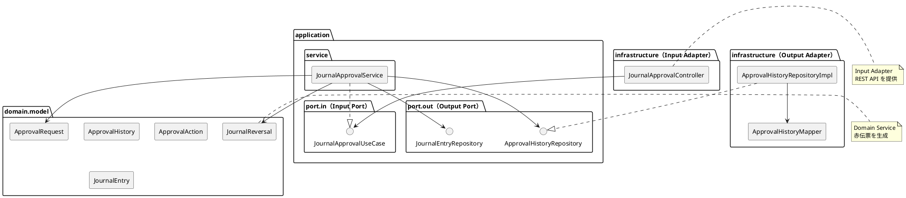
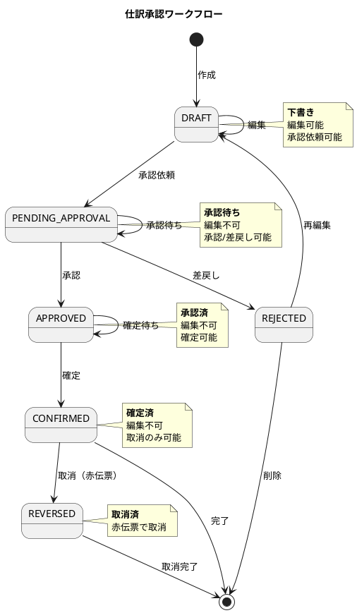
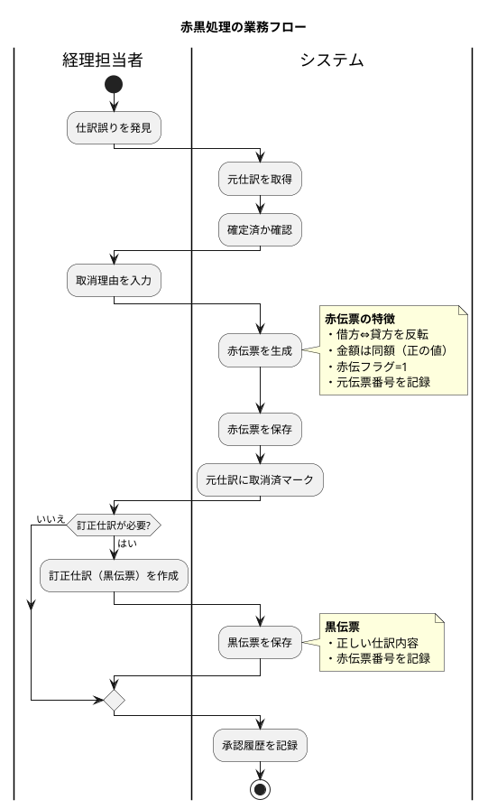

# 第15章: 仕訳承認・確定

## 15.1 本章の概要

本章では、第3章で解説したヘキサゴナルアーキテクチャに従い、仕訳承認・確定の機能実装を TDD で進めます。第13章で実装した仕訳入力のワークフロー（DRAFT → PENDING_APPROVAL → APPROVED → CONFIRMED）を拡張し、承認履歴の管理、取消処理（赤黒処理）を実装します。

### アーキテクチャの全体像



### パッケージ構成

```
com.example.accounting/
├── domain/
│   ├── model/
│   │   └── approval/
│   │       ├── ApprovalRequest.java          # 承認依頼
│   │       ├── ApprovalHistory.java          # 承認履歴
│   │       ├── ApprovalAction.java           # 承認アクション（列挙型）
│   │       ├── ApprovalStatus.java           # 承認ステータス（列挙型）
│   │       └── Approver.java                 # 承認者（値オブジェクト）
│   └── service/
│       └── JournalReversalService.java       # 赤伝票生成サービス
├── application/
│   ├── port/
│   │   ├── in/
│   │   │   ├── JournalApprovalUseCase.java   # Input Port
│   │   │   └── command/
│   │   │       ├── SubmitForApprovalCommand.java
│   │   │       ├── ApproveJournalCommand.java
│   │   │       ├── RejectJournalCommand.java
│   │   │       ├── ConfirmJournalCommand.java
│   │   │       └── ReverseJournalCommand.java
│   │   └── out/
│   │       └── ApprovalHistoryRepository.java  # Output Port
│   └── service/
│       └── JournalApprovalService.java       # Application Service
└── infrastructure/
    ├── persistence/
    │   ├── mapper/
    │   │   └── ApprovalHistoryMapper.java
    │   └── repository/
    │       └── ApprovalHistoryRepositoryImpl.java
    └── web/
        ├── controller/
        │   └── JournalApprovalController.java  # Input Adapter
        └── dto/
            ├── ApprovalRequest.java
            └── ApprovalResponse.java
```

### TDD の流れ

1. **Domain Model**: 承認関連のドメインモデル（ApprovalRequest, ApprovalHistory, ApprovalAction）
2. **Domain Service**: JournalReversalService による赤伝票生成
3. **Output Port**: リポジトリインターフェースの定義
4. **Output Adapter**: Testcontainers でリポジトリ実装をテスト
5. **Input Port**: ユースケースインターフェースの定義
6. **Application Service**: Mockito でアプリケーションサービスをテスト
7. **Input Adapter**: Testcontainers で REST API 統合テスト

---

## 15.2 承認ワークフローの設計

### 15.2.1 ワークフロー状態遷移図



### 15.2.2 承認ルール

| ルール | 説明 |
|--------|------|
| 自己承認禁止 | 作成者は自分の仕訳を承認できない |
| 金額閾値 | 一定金額以上は上位承認者が必要 |
| 承認権限 | 承認者は承認権限を持つユーザーのみ |
| 承認期限 | 承認依頼から一定期間経過で自動差戻し（オプション） |

---

## 15.3 Domain Model の実装

### 15.3.1 ApprovalAction 列挙型

```java
package com.example.accounting.domain.model.approval;

/**
 * 承認アクション
 */
public enum ApprovalAction {
    SUBMIT("承認依頼", "仕訳を承認依頼しました"),
    APPROVE("承認", "仕訳を承認しました"),
    REJECT("差戻し", "仕訳を差戻しました"),
    CONFIRM("確定", "仕訳を確定しました"),
    REVERSE("取消", "仕訳を取消しました");

    private final String displayName;
    private final String message;

    ApprovalAction(String displayName, String message) {
        this.displayName = displayName;
        this.message = message;
    }

    public String getDisplayName() {
        return displayName;
    }

    public String getMessage() {
        return message;
    }

    /**
     * 承認系のアクションかどうか
     */
    public boolean isApprovalAction() {
        return this == APPROVE || this == REJECT;
    }

    /**
     * 確定系のアクションかどうか
     */
    public boolean isConfirmationAction() {
        return this == CONFIRM || this == REVERSE;
    }
}
```

### 15.3.2 ApprovalStatus 列挙型

```java
package com.example.accounting.domain.model.approval;

/**
 * 承認ステータス
 */
public enum ApprovalStatus {
    PENDING("承認待ち"),
    APPROVED("承認済"),
    REJECTED("差戻し");

    private final String displayName;

    ApprovalStatus(String displayName) {
        this.displayName = displayName;
    }

    public String getDisplayName() {
        return displayName;
    }

    public boolean isPending() {
        return this == PENDING;
    }

    public boolean isApproved() {
        return this == APPROVED;
    }

    public boolean isRejected() {
        return this == REJECTED;
    }
}
```

### 15.3.3 Approver 値オブジェクト

```java
package com.example.accounting.domain.model.approval;

import lombok.Value;

import java.util.Objects;

/**
 * 承認者（値オブジェクト）
 */
@Value
public class Approver {

    String userId;
    String userName;
    String departmentCode;
    ApproverRole role;

    /**
     * 承認者を作成
     */
    public static Approver of(String userId, String userName,
                              String departmentCode, ApproverRole role) {
        Objects.requireNonNull(userId, "ユーザーIDは必須です");
        Objects.requireNonNull(userName, "ユーザー名は必須です");
        Objects.requireNonNull(role, "承認者ロールは必須です");

        return new Approver(userId, userName, departmentCode, role);
    }

    /**
     * 承認権限があるかどうか
     */
    public boolean canApprove() {
        return role.canApprove();
    }

    /**
     * 確定権限があるかどうか
     */
    public boolean canConfirm() {
        return role.canConfirm();
    }

    /**
     * 指定金額を承認できるかどうか
     */
    public boolean canApproveAmount(java.math.BigDecimal amount) {
        return role.canApproveAmount(amount);
    }

    /**
     * 承認者ロール
     */
    public enum ApproverRole {
        STAFF("担当者", false, false, java.math.BigDecimal.ZERO),
        SUPERVISOR("主任", true, false, new java.math.BigDecimal("1000000")),
        MANAGER("課長", true, true, new java.math.BigDecimal("10000000")),
        DIRECTOR("部長", true, true, new java.math.BigDecimal("100000000")),
        EXECUTIVE("役員", true, true, null); // 金額上限なし

        private final String displayName;
        private final boolean canApprove;
        private final boolean canConfirm;
        private final java.math.BigDecimal approvalLimit;

        ApproverRole(String displayName, boolean canApprove,
                     boolean canConfirm, java.math.BigDecimal approvalLimit) {
            this.displayName = displayName;
            this.canApprove = canApprove;
            this.canConfirm = canConfirm;
            this.approvalLimit = approvalLimit;
        }

        public String getDisplayName() {
            return displayName;
        }

        public boolean canApprove() {
            return canApprove;
        }

        public boolean canConfirm() {
            return canConfirm;
        }

        public boolean canApproveAmount(java.math.BigDecimal amount) {
            if (!canApprove) {
                return false;
            }
            if (approvalLimit == null) {
                return true; // 上限なし
            }
            return amount.compareTo(approvalLimit) <= 0;
        }
    }
}
```

### 15.3.4 ApprovalHistory ドメインモデル

```java
package com.example.accounting.domain.model.approval;

import lombok.Value;
import lombok.With;

import java.time.LocalDateTime;
import java.util.Objects;

/**
 * 承認履歴ドメインモデル
 *
 * 仕訳に対する承認アクションの履歴を記録する。
 * 監査証跡として機能し、誰がいつどのようなアクションを行ったかを追跡できる。
 */
@Value
@With
public class ApprovalHistory {

    Long historyId;
    String journalEntryNumber;
    ApprovalAction action;
    Approver approver;
    String comment;
    LocalDateTime actionAt;
    LocalDateTime createdAt;

    /**
     * 承認履歴を作成
     */
    public static ApprovalHistory create(
            String journalEntryNumber,
            ApprovalAction action,
            Approver approver,
            String comment) {

        Objects.requireNonNull(journalEntryNumber, "仕訳伝票番号は必須です");
        Objects.requireNonNull(action, "承認アクションは必須です");
        Objects.requireNonNull(approver, "承認者は必須です");

        return new ApprovalHistory(
            null,
            journalEntryNumber,
            action,
            approver,
            comment,
            LocalDateTime.now(),
            null
        );
    }

    /**
     * 承認依頼の履歴を作成
     */
    public static ApprovalHistory submitForApproval(
            String journalEntryNumber, Approver requester) {
        return create(journalEntryNumber, ApprovalAction.SUBMIT, requester, null);
    }

    /**
     * 承認の履歴を作成
     */
    public static ApprovalHistory approve(
            String journalEntryNumber, Approver approver, String comment) {
        return create(journalEntryNumber, ApprovalAction.APPROVE, approver, comment);
    }

    /**
     * 差戻しの履歴を作成
     */
    public static ApprovalHistory reject(
            String journalEntryNumber, Approver approver, String comment) {

        if (comment == null || comment.isBlank()) {
            throw new IllegalArgumentException("差戻し理由は必須です");
        }
        return create(journalEntryNumber, ApprovalAction.REJECT, approver, comment);
    }

    /**
     * 確定の履歴を作成
     */
    public static ApprovalHistory confirm(
            String journalEntryNumber, Approver approver) {
        return create(journalEntryNumber, ApprovalAction.CONFIRM, approver, null);
    }

    /**
     * 取消の履歴を作成
     */
    public static ApprovalHistory reverse(
            String journalEntryNumber, Approver approver, String reason) {

        if (reason == null || reason.isBlank()) {
            throw new IllegalArgumentException("取消理由は必須です");
        }
        return create(journalEntryNumber, ApprovalAction.REVERSE, approver, reason);
    }

    /**
     * 承認アクションかどうか
     */
    public boolean isApprovalAction() {
        return action.isApprovalAction();
    }

    /**
     * 確定アクションかどうか
     */
    public boolean isConfirmationAction() {
        return action.isConfirmationAction();
    }
}
```

### 15.3.5 ApprovalRequest ドメインモデル

```java
package com.example.accounting.domain.model.approval;

import com.example.accounting.domain.model.journal.JournalEntry;
import com.example.accounting.domain.model.journal.Money;
import lombok.Value;
import lombok.With;

import java.time.LocalDateTime;
import java.util.ArrayList;
import java.util.List;
import java.util.Objects;

/**
 * 承認依頼ドメインモデル
 *
 * 仕訳の承認依頼を管理する集約ルート。
 * 承認履歴のコレクションを保持し、承認ワークフローの状態を管理する。
 */
@Value
@With
public class ApprovalRequest {

    Long requestId;
    String journalEntryNumber;
    Money totalAmount;
    Approver requester;
    ApprovalStatus status;
    List<ApprovalHistory> histories;
    LocalDateTime requestedAt;
    LocalDateTime completedAt;
    LocalDateTime createdAt;
    LocalDateTime updatedAt;

    /**
     * 承認依頼を作成
     */
    public static ApprovalRequest create(
            JournalEntry journal,
            Approver requester) {

        Objects.requireNonNull(journal, "仕訳は必須です");
        Objects.requireNonNull(requester, "依頼者は必須です");

        if (!journal.canSubmitForApproval()) {
            throw new IllegalStateException(
                "この仕訳は承認依頼できません: " + journal.getStatus());
        }

        ApprovalHistory submitHistory = ApprovalHistory.submitForApproval(
            journal.getJournalEntryNumber().getValue(),
            requester
        );

        return new ApprovalRequest(
            null,
            journal.getJournalEntryNumber().getValue(),
            journal.getDebitTotal(),
            requester,
            ApprovalStatus.PENDING,
            List.of(submitHistory),
            LocalDateTime.now(),
            null,
            null,
            null
        );
    }

    /**
     * 承認
     */
    public ApprovalRequest approve(Approver approver, String comment) {
        validateApprovalAction(approver);
        validateNotSelfApproval(approver);
        validateApprovalAmount(approver);

        ApprovalHistory history = ApprovalHistory.approve(
            journalEntryNumber, approver, comment
        );

        List<ApprovalHistory> newHistories = new ArrayList<>(histories);
        newHistories.add(history);

        return this
            .withStatus(ApprovalStatus.APPROVED)
            .withHistories(newHistories)
            .withCompletedAt(LocalDateTime.now());
    }

    /**
     * 差戻し
     */
    public ApprovalRequest reject(Approver approver, String reason) {
        validateApprovalAction(approver);

        ApprovalHistory history = ApprovalHistory.reject(
            journalEntryNumber, approver, reason
        );

        List<ApprovalHistory> newHistories = new ArrayList<>(histories);
        newHistories.add(history);

        return this
            .withStatus(ApprovalStatus.REJECTED)
            .withHistories(newHistories)
            .withCompletedAt(LocalDateTime.now());
    }

    /**
     * 承認アクションの検証
     */
    private void validateApprovalAction(Approver approver) {
        if (!status.isPending()) {
            throw new IllegalStateException(
                "承認待ち状態でないため、承認/差戻しできません: " + status);
        }
        if (!approver.canApprove()) {
            throw new IllegalArgumentException(
                "承認権限がありません: " + approver.getRole());
        }
    }

    /**
     * 自己承認の検証
     */
    private void validateNotSelfApproval(Approver approver) {
        if (requester.getUserId().equals(approver.getUserId())) {
            throw new IllegalArgumentException(
                "自分が作成した仕訳は承認できません");
        }
    }

    /**
     * 承認金額の検証
     */
    private void validateApprovalAmount(Approver approver) {
        if (!approver.canApproveAmount(totalAmount.getAmount())) {
            throw new IllegalArgumentException(
                "承認権限の金額上限を超えています: " +
                totalAmount.getAmount() + " > " + approver.getRole());
        }
    }

    /**
     * 承認待ちかどうか
     */
    public boolean isPending() {
        return status.isPending();
    }

    /**
     * 承認済かどうか
     */
    public boolean isApproved() {
        return status.isApproved();
    }

    /**
     * 差戻しかどうか
     */
    public boolean isRejected() {
        return status.isRejected();
    }

    /**
     * 最新の履歴を取得
     */
    public ApprovalHistory getLatestHistory() {
        if (histories.isEmpty()) {
            return null;
        }
        return histories.get(histories.size() - 1);
    }

    /**
     * 承認者を取得（承認済の場合）
     */
    public Approver getApprover() {
        return histories.stream()
            .filter(h -> h.getAction() == ApprovalAction.APPROVE)
            .findFirst()
            .map(ApprovalHistory::getApprover)
            .orElse(null);
    }
}
```

### 15.3.6 ドメインモデルのテスト

```java
package com.example.accounting.domain.model.approval;

import com.example.accounting.domain.model.journal.JournalEntry;
import com.example.accounting.domain.model.journal.JournalEntryNumber;
import com.example.accounting.domain.model.journal.Money;
import org.junit.jupiter.api.DisplayName;
import org.junit.jupiter.api.Nested;
import org.junit.jupiter.api.Test;

import java.math.BigDecimal;
import java.time.LocalDate;

import static org.assertj.core.api.Assertions.*;

@DisplayName("承認ドメインモデルのテスト")
class ApprovalDomainModelTest {

    @Nested
    @DisplayName("Approver")
    class ApproverTest {

        @Test
        @DisplayName("承認者を作成できる")
        void shouldCreateApprover() {
            // When
            Approver approver = Approver.of(
                "U001", "山田太郎", "001", Approver.ApproverRole.MANAGER
            );

            // Then
            assertThat(approver.getUserId()).isEqualTo("U001");
            assertThat(approver.getUserName()).isEqualTo("山田太郎");
            assertThat(approver.canApprove()).isTrue();
            assertThat(approver.canConfirm()).isTrue();
        }

        @Test
        @DisplayName("担当者は承認できない")
        void staffCannotApprove() {
            // Given
            Approver staff = Approver.of(
                "U001", "田中", "001", Approver.ApproverRole.STAFF
            );

            // Then
            assertThat(staff.canApprove()).isFalse();
            assertThat(staff.canConfirm()).isFalse();
        }

        @Test
        @DisplayName("金額上限内なら承認できる")
        void shouldApproveWithinLimit() {
            // Given
            Approver supervisor = Approver.of(
                "U001", "鈴木", "001", Approver.ApproverRole.SUPERVISOR
            );

            // Then
            assertThat(supervisor.canApproveAmount(new BigDecimal("500000"))).isTrue();
            assertThat(supervisor.canApproveAmount(new BigDecimal("1000000"))).isTrue();
            assertThat(supervisor.canApproveAmount(new BigDecimal("1000001"))).isFalse();
        }

        @Test
        @DisplayName("役員は金額上限なし")
        void executiveHasNoLimit() {
            // Given
            Approver executive = Approver.of(
                "U001", "佐藤", "001", Approver.ApproverRole.EXECUTIVE
            );

            // Then
            assertThat(executive.canApproveAmount(
                new BigDecimal("999999999999"))).isTrue();
        }
    }

    @Nested
    @DisplayName("ApprovalHistory")
    class ApprovalHistoryTest {

        @Test
        @DisplayName("承認履歴を作成できる")
        void shouldCreateApprovalHistory() {
            // Given
            Approver approver = createManager();

            // When
            ApprovalHistory history = ApprovalHistory.approve(
                "JE-001", approver, "問題なし"
            );

            // Then
            assertThat(history.getJournalEntryNumber()).isEqualTo("JE-001");
            assertThat(history.getAction()).isEqualTo(ApprovalAction.APPROVE);
            assertThat(history.getComment()).isEqualTo("問題なし");
            assertThat(history.getActionAt()).isNotNull();
        }

        @Test
        @DisplayName("差戻しには理由が必須")
        void rejectRequiresReason() {
            // Given
            Approver approver = createManager();

            // When & Then
            assertThatThrownBy(() ->
                ApprovalHistory.reject("JE-001", approver, null)
            ).isInstanceOf(IllegalArgumentException.class)
             .hasMessageContaining("差戻し理由は必須");

            assertThatThrownBy(() ->
                ApprovalHistory.reject("JE-001", approver, "  ")
            ).isInstanceOf(IllegalArgumentException.class);
        }

        @Test
        @DisplayName("取消には理由が必須")
        void reverseRequiresReason() {
            // Given
            Approver approver = createManager();

            // When & Then
            assertThatThrownBy(() ->
                ApprovalHistory.reverse("JE-001", approver, null)
            ).isInstanceOf(IllegalArgumentException.class)
             .hasMessageContaining("取消理由は必須");
        }
    }

    @Nested
    @DisplayName("ApprovalRequest")
    class ApprovalRequestTest {

        @Test
        @DisplayName("承認依頼を作成できる")
        void shouldCreateApprovalRequest() {
            // Given
            JournalEntry journal = createDraftJournal();
            Approver requester = createStaff();

            // When
            ApprovalRequest request = ApprovalRequest.create(journal, requester);

            // Then
            assertThat(request.getJournalEntryNumber()).isEqualTo("JE-001");
            assertThat(request.getStatus()).isEqualTo(ApprovalStatus.PENDING);
            assertThat(request.getHistories()).hasSize(1);
            assertThat(request.getHistories().get(0).getAction())
                .isEqualTo(ApprovalAction.SUBMIT);
        }

        @Test
        @DisplayName("承認できる")
        void shouldApprove() {
            // Given
            ApprovalRequest request = createPendingRequest();
            Approver approver = createManager();

            // When
            ApprovalRequest approved = request.approve(approver, "承認します");

            // Then
            assertThat(approved.getStatus()).isEqualTo(ApprovalStatus.APPROVED);
            assertThat(approved.isApproved()).isTrue();
            assertThat(approved.getHistories()).hasSize(2);
            assertThat(approved.getCompletedAt()).isNotNull();
        }

        @Test
        @DisplayName("差戻しできる")
        void shouldReject() {
            // Given
            ApprovalRequest request = createPendingRequest();
            Approver approver = createManager();

            // When
            ApprovalRequest rejected = request.reject(approver, "科目が誤っています");

            // Then
            assertThat(rejected.getStatus()).isEqualTo(ApprovalStatus.REJECTED);
            assertThat(rejected.isRejected()).isTrue();
            assertThat(rejected.getHistories()).hasSize(2);
        }

        @Test
        @DisplayName("自己承認はできない")
        void shouldNotAllowSelfApproval() {
            // Given
            JournalEntry journal = createDraftJournal();
            Approver requester = createManager(); // 課長が作成
            ApprovalRequest request = ApprovalRequest.create(journal, requester);

            // When & Then
            assertThatThrownBy(() ->
                request.approve(requester, "承認") // 同一人物が承認
            ).isInstanceOf(IllegalArgumentException.class)
             .hasMessageContaining("自分が作成した仕訳は承認できません");
        }

        @Test
        @DisplayName("承認権限がないと承認できない")
        void shouldNotApproveWithoutPermission() {
            // Given
            ApprovalRequest request = createPendingRequest();
            Approver staff = createStaff(); // 担当者（承認権限なし）

            // When & Then
            assertThatThrownBy(() ->
                request.approve(staff, "承認")
            ).isInstanceOf(IllegalArgumentException.class)
             .hasMessageContaining("承認権限がありません");
        }

        @Test
        @DisplayName("金額上限を超えると承認できない")
        void shouldNotApproveOverLimit() {
            // Given
            JournalEntry largeJournal = createLargeAmountJournal();
            Approver requester = createStaff();
            ApprovalRequest request = ApprovalRequest.create(largeJournal, requester);

            Approver supervisor = Approver.of(
                "U002", "主任", "001", Approver.ApproverRole.SUPERVISOR
            ); // 上限100万円

            // When & Then
            assertThatThrownBy(() ->
                request.approve(supervisor, "承認")
            ).isInstanceOf(IllegalArgumentException.class)
             .hasMessageContaining("金額上限を超えています");
        }

        @Test
        @DisplayName("承認済の依頼は再承認できない")
        void shouldNotApproveAlreadyApproved() {
            // Given
            ApprovalRequest request = createPendingRequest();
            Approver approver = createManager();
            ApprovalRequest approved = request.approve(approver, "承認");

            Approver anotherApprover = Approver.of(
                "U003", "別の課長", "002", Approver.ApproverRole.MANAGER
            );

            // When & Then
            assertThatThrownBy(() ->
                approved.approve(anotherApprover, "再承認")
            ).isInstanceOf(IllegalStateException.class)
             .hasMessageContaining("承認待ち状態でない");
        }
    }

    // テストヘルパーメソッド

    private Approver createStaff() {
        return Approver.of("U001", "担当者", "001", Approver.ApproverRole.STAFF);
    }

    private Approver createManager() {
        return Approver.of("U002", "課長", "001", Approver.ApproverRole.MANAGER);
    }

    private JournalEntry createDraftJournal() {
        return JournalEntry.createEmpty(
            JournalEntryNumber.of("JE-001"),
            LocalDate.of(2025, 1, 15)
        ).withDebitTotal(Money.of(new BigDecimal("100000"), "JPY"));
    }

    private JournalEntry createLargeAmountJournal() {
        return JournalEntry.createEmpty(
            JournalEntryNumber.of("JE-002"),
            LocalDate.of(2025, 1, 15)
        ).withDebitTotal(Money.of(new BigDecimal("5000000"), "JPY")); // 500万円
    }

    private ApprovalRequest createPendingRequest() {
        JournalEntry journal = createDraftJournal();
        Approver requester = createStaff();
        return ApprovalRequest.create(journal, requester);
    }
}
```

---

## 15.4 Domain Service の実装（赤伝票生成）

### 15.4.1 JournalReversalService ドメインサービス

```java
package com.example.accounting.domain.service;

import com.example.accounting.domain.model.journal.*;
import lombok.RequiredArgsConstructor;
import org.springframework.stereotype.Service;

import java.time.LocalDate;
import java.time.format.DateTimeFormatter;
import java.util.ArrayList;
import java.util.List;
import java.util.concurrent.atomic.AtomicInteger;

/**
 * 仕訳取消（赤伝票生成）ドメインサービス
 *
 * 確定済の仕訳を取消すために、赤伝票（マイナス仕訳）を生成する。
 * 元の仕訳は変更せず、監査証跡を保持する。
 */
@Service
@RequiredArgsConstructor
public class JournalReversalService {

    private static final DateTimeFormatter DATE_FORMAT =
        DateTimeFormatter.ofPattern("yyyyMMdd");

    private final AtomicInteger sequence = new AtomicInteger(1);

    /**
     * 赤伝票を生成
     *
     * @param originalJournal 取消対象の元仕訳
     * @param reason 取消理由
     * @return 赤伝票（取消仕訳）
     */
    public JournalEntry createReversalJournal(
            JournalEntry originalJournal,
            String reason) {

        validateCanReverse(originalJournal);

        // 赤伝票の伝票番号を生成
        JournalEntryNumber reversalNumber = generateReversalNumber(originalJournal);

        // 赤伝票の明細を生成（借方・貸方を反転）
        List<JournalEntryDetail> reversalDetails =
            createReversalDetails(originalJournal.getDetails());

        // 赤伝票を作成
        return JournalEntry.createReversalJournal(
            reversalNumber,
            LocalDate.now(), // 起票日は取消日
            originalJournal.getJournalEntryNumber().getValue(), // 元伝票番号
            reason,
            reversalDetails
        );
    }

    /**
     * 取消可能か検証
     */
    private void validateCanReverse(JournalEntry journal) {
        if (!journal.isConfirmed()) {
            throw new IllegalStateException(
                "確定済の仕訳のみ取消できます: " + journal.getStatus());
        }
        if (journal.isReversed()) {
            throw new IllegalStateException(
                "既に取消済の仕訳です: " + journal.getJournalEntryNumber());
        }
        if (journal.isReversalJournal()) {
            throw new IllegalStateException(
                "赤伝票は取消できません: " + journal.getJournalEntryNumber());
        }
    }

    /**
     * 赤伝票の伝票番号を生成
     */
    private JournalEntryNumber generateReversalNumber(JournalEntry original) {
        String datePrefix = LocalDate.now().format(DATE_FORMAT);
        int seq = sequence.getAndIncrement();
        String number = String.format("REV-%s-%04d", datePrefix, seq);
        return JournalEntryNumber.of(number);
    }

    /**
     * 赤伝票の明細を生成（借方・貸方を反転）
     */
    private List<JournalEntryDetail> createReversalDetails(
            List<JournalEntryDetail> originalDetails) {

        List<JournalEntryDetail> reversalDetails = new ArrayList<>();

        for (JournalEntryDetail originalDetail : originalDetails) {
            List<JournalEntryDetailItem> reversalItems =
                createReversalItems(originalDetail.getItems());

            JournalEntryDetail reversalDetail = JournalEntryDetail.create(
                originalDetail.getLineNumber(),
                "【取消】" + originalDetail.getLineSummary(),
                reversalItems
            );
            reversalDetails.add(reversalDetail);
        }

        return reversalDetails;
    }

    /**
     * 赤伝票の貸借明細を生成（借方⇔貸方を反転）
     */
    private List<JournalEntryDetailItem> createReversalItems(
            List<JournalEntryDetailItem> originalItems) {

        List<JournalEntryDetailItem> reversalItems = new ArrayList<>();

        for (JournalEntryDetailItem original : originalItems) {
            // 借方・貸方を反転
            DebitCreditType reversedType = original.getDebitCreditType().reverse();

            JournalEntryDetailItem reversalItem = JournalEntryDetailItem.create(
                reversedType,
                original.getAccountCode(),
                original.getAmount(), // 金額はそのまま（正の値）
                original.getDepartmentCode(),
                original.getProjectCode()
            );
            reversalItems.add(reversalItem);
        }

        return reversalItems;
    }

    /**
     * 黒伝票（訂正仕訳）を生成（オプション）
     *
     * 赤伝票で取消した後、正しい仕訳を黒伝票として入力する場合に使用。
     */
    public JournalEntry createCorrectionJournal(
            JournalEntry reversalJournal,
            List<JournalEntryDetail> correctedDetails) {

        if (!reversalJournal.isReversalJournal()) {
            throw new IllegalArgumentException(
                "赤伝票を指定してください");
        }

        String datePrefix = LocalDate.now().format(DATE_FORMAT);
        int seq = sequence.getAndIncrement();
        String number = String.format("COR-%s-%04d", datePrefix, seq);

        return JournalEntry.createCorrectionJournal(
            JournalEntryNumber.of(number),
            LocalDate.now(),
            reversalJournal.getJournalEntryNumber().getValue(),
            correctedDetails
        );
    }
}
```

### 15.4.2 DebitCreditType の拡張

```java
package com.example.accounting.domain.model.journal;

/**
 * 貸借区分
 */
public enum DebitCreditType {
    DEBIT("D", "借方"),
    CREDIT("C", "貸方");

    private final String code;
    private final String displayName;

    DebitCreditType(String code, String displayName) {
        this.code = code;
        this.displayName = displayName;
    }

    public String getCode() {
        return code;
    }

    public String getDisplayName() {
        return displayName;
    }

    /**
     * 貸借を反転
     */
    public DebitCreditType reverse() {
        return this == DEBIT ? CREDIT : DEBIT;
    }

    public static DebitCreditType fromCode(String code) {
        for (DebitCreditType type : values()) {
            if (type.code.equals(code)) {
                return type;
            }
        }
        throw new IllegalArgumentException("Unknown debit/credit code: " + code);
    }

    public boolean isDebit() {
        return this == DEBIT;
    }

    public boolean isCredit() {
        return this == CREDIT;
    }
}
```

### 15.4.3 JournalEntry の拡張（赤伝票対応）

```java
// JournalEntry クラスに追加するメソッド

/**
 * 赤伝票（取消仕訳）を作成
 */
public static JournalEntry createReversalJournal(
        JournalEntryNumber journalEntryNumber,
        LocalDate entryDate,
        String originalJournalNumber,
        String reason,
        List<JournalEntryDetail> details) {

    return new JournalEntry(
        journalEntryNumber,
        entryDate,
        LocalDate.now(),
        false, // 決算仕訳ではない
        false, // 単振ではない
        JournalStatus.DRAFT,
        true,  // 赤伝フラグ
        originalJournalNumber, // 赤黒伝票番号
        details
    );
}

/**
 * 訂正仕訳（黒伝票）を作成
 */
public static JournalEntry createCorrectionJournal(
        JournalEntryNumber journalEntryNumber,
        LocalDate entryDate,
        String reversalJournalNumber,
        List<JournalEntryDetail> details) {

    return new JournalEntry(
        journalEntryNumber,
        entryDate,
        LocalDate.now(),
        false,
        false,
        JournalStatus.DRAFT,
        false, // 赤伝ではない
        reversalJournalNumber, // 関連する赤伝票番号
        details
    );
}

/**
 * 赤伝票かどうか
 */
public boolean isReversalJournal() {
    return isReversalFlag != null && isReversalFlag;
}

/**
 * 取消済かどうか（この仕訳を取消す赤伝票が存在する）
 */
public boolean isReversed() {
    // 実際の実装ではリポジトリで確認
    return false;
}

/**
 * 確定済かどうか
 */
public boolean isConfirmed() {
    return status == JournalStatus.CONFIRMED;
}
```

### 15.4.4 ドメインサービスのテスト

```java
package com.example.accounting.domain.service;

import com.example.accounting.domain.model.journal.*;
import org.junit.jupiter.api.BeforeEach;
import org.junit.jupiter.api.DisplayName;
import org.junit.jupiter.api.Nested;
import org.junit.jupiter.api.Test;

import java.math.BigDecimal;
import java.time.LocalDate;
import java.util.List;

import static org.assertj.core.api.Assertions.*;

@DisplayName("JournalReversalService ドメインサービスのテスト")
class JournalReversalServiceTest {

    private JournalReversalService reversalService;

    @BeforeEach
    void setUp() {
        reversalService = new JournalReversalService();
    }

    @Nested
    @DisplayName("赤伝票生成")
    class ReversalJournalTest {

        @Test
        @DisplayName("確定済仕訳から赤伝票を生成できる")
        void shouldCreateReversalJournal() {
            // Given
            JournalEntry confirmedJournal = createConfirmedJournal();

            // When
            JournalEntry reversal = reversalService.createReversalJournal(
                confirmedJournal, "科目誤り"
            );

            // Then
            assertThat(reversal.getJournalEntryNumber().getValue())
                .startsWith("REV-");
            assertThat(reversal.isReversalJournal()).isTrue();
            assertThat(reversal.getOriginalJournalNumber())
                .isEqualTo(confirmedJournal.getJournalEntryNumber().getValue());
            assertThat(reversal.isBalanced()).isTrue();
        }

        @Test
        @DisplayName("赤伝票の借方・貸方は元仕訳と反転している")
        void reversalShouldHaveReversedDebitCredit() {
            // Given
            JournalEntry confirmedJournal = createConfirmedJournal();

            // When
            JournalEntry reversal = reversalService.createReversalJournal(
                confirmedJournal, "取消"
            );

            // Then
            JournalEntryDetailItem originalItem =
                confirmedJournal.getDetails().get(0).getItems().get(0);
            JournalEntryDetailItem reversalItem =
                reversal.getDetails().get(0).getItems().get(0);

            // 元が借方なら赤伝票は貸方
            assertThat(reversalItem.getDebitCreditType())
                .isEqualTo(originalItem.getDebitCreditType().reverse());
            // 金額は同じ
            assertThat(reversalItem.getAmount())
                .isEqualTo(originalItem.getAmount());
        }

        @Test
        @DisplayName("未確定の仕訳は取消できない")
        void shouldNotReverseUnconfirmedJournal() {
            // Given
            JournalEntry draftJournal = createDraftJournal();

            // When & Then
            assertThatThrownBy(() ->
                reversalService.createReversalJournal(draftJournal, "取消")
            ).isInstanceOf(IllegalStateException.class)
             .hasMessageContaining("確定済の仕訳のみ取消できます");
        }

        @Test
        @DisplayName("赤伝票は取消できない")
        void shouldNotReverseReversalJournal() {
            // Given
            JournalEntry confirmedJournal = createConfirmedJournal();
            JournalEntry reversal = reversalService.createReversalJournal(
                confirmedJournal, "取消"
            );

            // When & Then
            assertThatThrownBy(() ->
                reversalService.createReversalJournal(reversal, "再取消")
            ).isInstanceOf(IllegalStateException.class)
             .hasMessageContaining("赤伝票は取消できません");
        }
    }

    @Nested
    @DisplayName("訂正仕訳（黒伝票）")
    class CorrectionJournalTest {

        @Test
        @DisplayName("赤伝票に対応する訂正仕訳を作成できる")
        void shouldCreateCorrectionJournal() {
            // Given
            JournalEntry confirmedJournal = createConfirmedJournal();
            JournalEntry reversal = reversalService.createReversalJournal(
                confirmedJournal, "科目誤り"
            );

            List<JournalEntryDetail> correctedDetails = createCorrectedDetails();

            // When
            JournalEntry correction = reversalService.createCorrectionJournal(
                reversal, correctedDetails
            );

            // Then
            assertThat(correction.getJournalEntryNumber().getValue())
                .startsWith("COR-");
            assertThat(correction.isReversalJournal()).isFalse();
            assertThat(correction.getOriginalJournalNumber())
                .isEqualTo(reversal.getJournalEntryNumber().getValue());
        }
    }

    // テストヘルパーメソッド

    private JournalEntry createDraftJournal() {
        List<JournalEntryDetailItem> items = List.of(
            JournalEntryDetailItem.create(
                DebitCreditType.DEBIT, "5110",
                Money.of(new BigDecimal("100000"), "JPY"), "001", null
            ),
            JournalEntryDetailItem.create(
                DebitCreditType.CREDIT, "1010",
                Money.of(new BigDecimal("100000"), "JPY"), "001", null
            )
        );
        List<JournalEntryDetail> details = List.of(
            JournalEntryDetail.create(1, "商品仕入", items)
        );

        return JournalEntry.create(
            JournalEntryNumber.of("JE-001"),
            LocalDate.of(2025, 1, 15),
            details
        );
    }

    private JournalEntry createConfirmedJournal() {
        return createDraftJournal()
            .submitForApproval()
            .approve()
            .confirm();
    }

    private List<JournalEntryDetail> createCorrectedDetails() {
        List<JournalEntryDetailItem> items = List.of(
            JournalEntryDetailItem.create(
                DebitCreditType.DEBIT, "5120", // 正しい科目
                Money.of(new BigDecimal("100000"), "JPY"), "001", null
            ),
            JournalEntryDetailItem.create(
                DebitCreditType.CREDIT, "1010",
                Money.of(new BigDecimal("100000"), "JPY"), "001", null
            )
        );
        return List.of(JournalEntryDetail.create(1, "商品仕入（訂正）", items));
    }
}
```

---

## 15.5 Output Port（リポジトリインターフェース）

```java
package com.example.accounting.application.port.out;

import com.example.accounting.domain.model.approval.ApprovalHistory;
import com.example.accounting.domain.model.approval.ApprovalRequest;
import com.example.accounting.domain.model.approval.ApprovalStatus;

import java.time.LocalDateTime;
import java.util.List;
import java.util.Optional;

/**
 * 承認履歴リポジトリ（Output Port）
 */
public interface ApprovalHistoryRepository {

    ApprovalHistory save(ApprovalHistory history);

    List<ApprovalHistory> findByJournalEntryNumber(String journalEntryNumber);

    Optional<ApprovalHistory> findLatestByJournalEntryNumber(String journalEntryNumber);

    List<ApprovalHistory> findByApproverUserId(String userId);

    List<ApprovalHistory> findByActionAtBetween(LocalDateTime from, LocalDateTime to);

    long count();
}

/**
 * 承認依頼リポジトリ（Output Port）
 */
public interface ApprovalRequestRepository {

    ApprovalRequest save(ApprovalRequest request);

    Optional<ApprovalRequest> findById(Long requestId);

    Optional<ApprovalRequest> findByJournalEntryNumber(String journalEntryNumber);

    List<ApprovalRequest> findByStatus(ApprovalStatus status);

    List<ApprovalRequest> findByRequesterUserId(String userId);

    List<ApprovalRequest> findPendingRequests();

    long countPendingRequests();
}
```

---

## 15.6 Output Adapter（リポジトリ実装）

### 15.6.1 MyBatis Mapper

```java
package com.example.accounting.infrastructure.persistence.mapper;

import com.example.accounting.infrastructure.persistence.entity.ApprovalHistoryEntity;
import org.apache.ibatis.annotations.Mapper;
import org.apache.ibatis.annotations.Param;

import java.time.LocalDateTime;
import java.util.List;

@Mapper
public interface ApprovalHistoryMapper {

    void insert(ApprovalHistoryEntity entity);

    List<ApprovalHistoryEntity> selectByJournalEntryNumber(
        @Param("journalEntryNumber") String journalEntryNumber);

    ApprovalHistoryEntity selectLatestByJournalEntryNumber(
        @Param("journalEntryNumber") String journalEntryNumber);

    List<ApprovalHistoryEntity> selectByApproverUserId(
        @Param("userId") String userId);

    List<ApprovalHistoryEntity> selectByActionAtBetween(
        @Param("from") LocalDateTime from,
        @Param("to") LocalDateTime to);

    long count();
}
```

**ApprovalHistoryMapper.xml**:

```xml
<?xml version="1.0" encoding="UTF-8" ?>
<!DOCTYPE mapper PUBLIC "-//mybatis.org//DTD Mapper 3.0//EN"
        "http://mybatis.org/dtd/mybatis-3-mapper.dtd">
<mapper namespace="com.example.accounting.infrastructure.persistence.mapper.ApprovalHistoryMapper">

    <resultMap id="ApprovalHistoryResultMap"
               type="com.example.accounting.infrastructure.persistence.entity.ApprovalHistoryEntity">
        <id property="historyId" column="承認履歴ID"/>
        <result property="journalEntryNumber" column="仕訳伝票番号"/>
        <result property="action" column="承認アクション"/>
        <result property="approverUserId" column="承認者ID"/>
        <result property="approverUserName" column="承認者名"/>
        <result property="approverDepartmentCode" column="承認者部門コード"/>
        <result property="approverRole" column="承認者ロール"/>
        <result property="comment" column="コメント"/>
        <result property="actionAt" column="アクション日時"/>
        <result property="createdAt" column="作成日時"/>
    </resultMap>

    <insert id="insert" useGeneratedKeys="true" keyProperty="historyId" keyColumn="承認履歴ID">
        INSERT INTO "承認履歴" (
            "仕訳伝票番号", "承認アクション", "承認者ID", "承認者名",
            "承認者部門コード", "承認者ロール", "コメント", "アクション日時"
        ) VALUES (
            #{journalEntryNumber}, #{action}, #{approverUserId}, #{approverUserName},
            #{approverDepartmentCode}, #{approverRole}, #{comment}, #{actionAt}
        )
    </insert>

    <select id="selectByJournalEntryNumber" resultMap="ApprovalHistoryResultMap">
        SELECT * FROM "承認履歴"
        WHERE "仕訳伝票番号" = #{journalEntryNumber}
        ORDER BY "アクション日時" ASC
    </select>

    <select id="selectLatestByJournalEntryNumber" resultMap="ApprovalHistoryResultMap">
        SELECT * FROM "承認履歴"
        WHERE "仕訳伝票番号" = #{journalEntryNumber}
        ORDER BY "アクション日時" DESC
        LIMIT 1
    </select>

    <select id="selectByApproverUserId" resultMap="ApprovalHistoryResultMap">
        SELECT * FROM "承認履歴"
        WHERE "承認者ID" = #{userId}
        ORDER BY "アクション日時" DESC
    </select>

    <select id="selectByActionAtBetween" resultMap="ApprovalHistoryResultMap">
        SELECT * FROM "承認履歴"
        WHERE "アクション日時" BETWEEN #{from} AND #{to}
        ORDER BY "アクション日時" ASC
    </select>

    <select id="count" resultType="long">
        SELECT COUNT(*) FROM "承認履歴"
    </select>
</mapper>
```

### 15.6.2 Repository 実装

```java
package com.example.accounting.infrastructure.persistence.repository;

import com.example.accounting.application.port.out.ApprovalHistoryRepository;
import com.example.accounting.domain.model.approval.ApprovalHistory;
import com.example.accounting.infrastructure.persistence.entity.ApprovalHistoryEntity;
import com.example.accounting.infrastructure.persistence.mapper.ApprovalHistoryMapper;
import lombok.RequiredArgsConstructor;
import org.springframework.stereotype.Repository;

import java.time.LocalDateTime;
import java.util.List;
import java.util.Optional;

/**
 * 承認履歴リポジトリ実装（Output Adapter）
 */
@Repository
@RequiredArgsConstructor
public class ApprovalHistoryRepositoryImpl implements ApprovalHistoryRepository {

    private final ApprovalHistoryMapper mapper;

    @Override
    public ApprovalHistory save(ApprovalHistory history) {
        ApprovalHistoryEntity entity = ApprovalHistoryEntity.from(history);
        mapper.insert(entity);
        return entity.toDomain();
    }

    @Override
    public List<ApprovalHistory> findByJournalEntryNumber(String journalEntryNumber) {
        return mapper.selectByJournalEntryNumber(journalEntryNumber).stream()
            .map(ApprovalHistoryEntity::toDomain)
            .toList();
    }

    @Override
    public Optional<ApprovalHistory> findLatestByJournalEntryNumber(
            String journalEntryNumber) {
        ApprovalHistoryEntity entity =
            mapper.selectLatestByJournalEntryNumber(journalEntryNumber);
        return Optional.ofNullable(entity).map(ApprovalHistoryEntity::toDomain);
    }

    @Override
    public List<ApprovalHistory> findByApproverUserId(String userId) {
        return mapper.selectByApproverUserId(userId).stream()
            .map(ApprovalHistoryEntity::toDomain)
            .toList();
    }

    @Override
    public List<ApprovalHistory> findByActionAtBetween(
            LocalDateTime from, LocalDateTime to) {
        return mapper.selectByActionAtBetween(from, to).stream()
            .map(ApprovalHistoryEntity::toDomain)
            .toList();
    }

    @Override
    public long count() {
        return mapper.count();
    }
}
```

### 15.6.3 Repository 実装のテスト（Testcontainers）

```java
package com.example.accounting.infrastructure.persistence.repository;

import com.example.accounting.application.port.out.ApprovalHistoryRepository;
import com.example.accounting.domain.model.approval.*;
import org.junit.jupiter.api.*;
import org.springframework.beans.factory.annotation.Autowired;
import org.springframework.boot.test.context.SpringBootTest;
import org.springframework.test.context.DynamicPropertyRegistry;
import org.springframework.test.context.DynamicPropertySource;
import org.testcontainers.containers.PostgreSQLContainer;
import org.testcontainers.junit.jupiter.Container;
import org.testcontainers.junit.jupiter.Testcontainers;

import java.util.List;
import java.util.Optional;

import static org.assertj.core.api.Assertions.assertThat;

@SpringBootTest
@Testcontainers
@TestMethodOrder(MethodOrderer.OrderAnnotation.class)
@DisplayName("承認履歴リポジトリ実装のテスト")
class ApprovalHistoryRepositoryImplTest {

    @Container
    static PostgreSQLContainer<?> postgres = new PostgreSQLContainer<>("postgres:16-alpine")
            .withDatabaseName("testdb")
            .withUsername("testuser")
            .withPassword("testpass");

    @DynamicPropertySource
    static void configureProperties(DynamicPropertyRegistry registry) {
        registry.add("spring.datasource.url", postgres::getJdbcUrl);
        registry.add("spring.datasource.username", postgres::getUsername);
        registry.add("spring.datasource.password", postgres::getPassword);
        registry.add("spring.flyway.enabled", () -> "true");
    }

    @Autowired
    private ApprovalHistoryRepository repository;

    @Test
    @Order(1)
    @DisplayName("承認履歴を保存できる")
    void shouldSaveApprovalHistory() {
        // Given
        Approver approver = Approver.of(
            "U001", "山田太郎", "001", Approver.ApproverRole.MANAGER
        );
        ApprovalHistory history = ApprovalHistory.approve(
            "JE-001", approver, "問題なし"
        );

        // When
        ApprovalHistory saved = repository.save(history);

        // Then
        assertThat(saved.getHistoryId()).isNotNull();
        assertThat(saved.getJournalEntryNumber()).isEqualTo("JE-001");
        assertThat(saved.getAction()).isEqualTo(ApprovalAction.APPROVE);
    }

    @Test
    @Order(2)
    @DisplayName("仕訳伝票番号で検索できる")
    void shouldFindByJournalEntryNumber() {
        // Given
        Approver approver = Approver.of(
            "U002", "鈴木", "001", Approver.ApproverRole.SUPERVISOR
        );
        repository.save(ApprovalHistory.submitForApproval("JE-002", approver));

        // When
        List<ApprovalHistory> histories =
            repository.findByJournalEntryNumber("JE-002");

        // Then
        assertThat(histories).hasSize(1);
        assertThat(histories.get(0).getAction()).isEqualTo(ApprovalAction.SUBMIT);
    }

    @Test
    @Order(3)
    @DisplayName("最新の履歴を取得できる")
    void shouldFindLatestHistory() {
        // Given
        Approver staff = Approver.of(
            "U003", "田中", "001", Approver.ApproverRole.STAFF
        );
        Approver manager = Approver.of(
            "U004", "佐藤", "001", Approver.ApproverRole.MANAGER
        );

        repository.save(ApprovalHistory.submitForApproval("JE-003", staff));
        repository.save(ApprovalHistory.approve("JE-003", manager, "承認"));

        // When
        Optional<ApprovalHistory> latest =
            repository.findLatestByJournalEntryNumber("JE-003");

        // Then
        assertThat(latest).isPresent();
        assertThat(latest.get().getAction()).isEqualTo(ApprovalAction.APPROVE);
    }

    @Test
    @Order(4)
    @DisplayName("承認者IDで検索できる")
    void shouldFindByApproverUserId() {
        // When
        List<ApprovalHistory> histories =
            repository.findByApproverUserId("U001");

        // Then
        assertThat(histories).isNotEmpty();
        assertThat(histories)
            .allMatch(h -> h.getApprover().getUserId().equals("U001"));
    }

    @Test
    @Order(5)
    @DisplayName("件数を取得できる")
    void shouldCount() {
        // When
        long count = repository.count();

        // Then
        assertThat(count).isGreaterThanOrEqualTo(4);
    }
}
```

---

## 15.7 Input Port（ユースケースインターフェース）

### 15.7.1 ユースケースインターフェース

```java
package com.example.accounting.application.port.in;

import com.example.accounting.application.port.in.command.*;
import com.example.accounting.domain.model.approval.ApprovalHistory;
import com.example.accounting.domain.model.approval.ApprovalRequest;
import com.example.accounting.domain.model.journal.JournalEntry;

import java.util.List;

/**
 * 仕訳承認ユースケース（Input Port）
 */
public interface JournalApprovalUseCase {

    /**
     * 承認依頼
     */
    ApprovalRequest submitForApproval(SubmitForApprovalCommand command);

    /**
     * 承認
     */
    ApprovalRequest approve(ApproveJournalCommand command);

    /**
     * 差戻し
     */
    ApprovalRequest reject(RejectJournalCommand command);

    /**
     * 確定
     */
    JournalEntry confirm(ConfirmJournalCommand command);

    /**
     * 取消（赤伝票生成）
     */
    JournalEntry reverse(ReverseJournalCommand command);

    /**
     * 承認待ち一覧を取得
     */
    List<ApprovalRequest> getPendingApprovals();

    /**
     * 承認履歴を取得
     */
    List<ApprovalHistory> getApprovalHistory(String journalEntryNumber);
}
```

### 15.7.2 Command クラス

```java
// application/port/in/command/SubmitForApprovalCommand.java
package com.example.accounting.application.port.in.command;

import java.util.Objects;

public record SubmitForApprovalCommand(
    String journalEntryNumber,
    String requesterUserId
) {
    public SubmitForApprovalCommand {
        Objects.requireNonNull(journalEntryNumber, "仕訳伝票番号は必須です");
        Objects.requireNonNull(requesterUserId, "依頼者IDは必須です");
    }
}

// application/port/in/command/ApproveJournalCommand.java
package com.example.accounting.application.port.in.command;

import java.util.Objects;

public record ApproveJournalCommand(
    String journalEntryNumber,
    String approverUserId,
    String comment
) {
    public ApproveJournalCommand {
        Objects.requireNonNull(journalEntryNumber, "仕訳伝票番号は必須です");
        Objects.requireNonNull(approverUserId, "承認者IDは必須です");
    }
}

// application/port/in/command/RejectJournalCommand.java
package com.example.accounting.application.port.in.command;

import java.util.Objects;

public record RejectJournalCommand(
    String journalEntryNumber,
    String approverUserId,
    String reason
) {
    public RejectJournalCommand {
        Objects.requireNonNull(journalEntryNumber, "仕訳伝票番号は必須です");
        Objects.requireNonNull(approverUserId, "承認者IDは必須です");
        Objects.requireNonNull(reason, "差戻し理由は必須です");

        if (reason.isBlank()) {
            throw new IllegalArgumentException("差戻し理由は空にできません");
        }
    }
}

// application/port/in/command/ConfirmJournalCommand.java
package com.example.accounting.application.port.in.command;

import java.util.Objects;

public record ConfirmJournalCommand(
    String journalEntryNumber,
    String confirmerUserId
) {
    public ConfirmJournalCommand {
        Objects.requireNonNull(journalEntryNumber, "仕訳伝票番号は必須です");
        Objects.requireNonNull(confirmerUserId, "確定者IDは必須です");
    }
}

// application/port/in/command/ReverseJournalCommand.java
package com.example.accounting.application.port.in.command;

import java.util.Objects;

public record ReverseJournalCommand(
    String journalEntryNumber,
    String operatorUserId,
    String reason
) {
    public ReverseJournalCommand {
        Objects.requireNonNull(journalEntryNumber, "仕訳伝票番号は必須です");
        Objects.requireNonNull(operatorUserId, "操作者IDは必須です");
        Objects.requireNonNull(reason, "取消理由は必須です");

        if (reason.isBlank()) {
            throw new IllegalArgumentException("取消理由は空にできません");
        }
    }
}
```

---

## 15.8 Application Service

### 15.8.1 アプリケーションサービス実装

```java
package com.example.accounting.application.service;

import com.example.accounting.application.port.in.JournalApprovalUseCase;
import com.example.accounting.application.port.in.command.*;
import com.example.accounting.application.port.in.exception.*;
import com.example.accounting.application.port.out.*;
import com.example.accounting.domain.model.approval.*;
import com.example.accounting.domain.model.journal.JournalEntry;
import com.example.accounting.domain.service.JournalReversalService;
import lombok.RequiredArgsConstructor;
import lombok.extern.slf4j.Slf4j;
import org.springframework.stereotype.Service;
import org.springframework.transaction.annotation.Transactional;

import java.util.List;

/**
 * 仕訳承認アプリケーションサービス
 */
@Service
@RequiredArgsConstructor
@Transactional
@Slf4j
public class JournalApprovalService implements JournalApprovalUseCase {

    private final JournalEntryRepository journalRepository;
    private final ApprovalRequestRepository requestRepository;
    private final ApprovalHistoryRepository historyRepository;
    private final UserRepository userRepository;
    private final JournalReversalService reversalService;

    @Override
    public ApprovalRequest submitForApproval(SubmitForApprovalCommand command) {
        log.info("承認依頼開始: 仕訳={}", command.journalEntryNumber());

        // 仕訳の取得
        JournalEntry journal = getJournal(command.journalEntryNumber());

        // 依頼者の取得
        Approver requester = getApprover(command.requesterUserId());

        // 承認依頼の作成
        ApprovalRequest request = ApprovalRequest.create(journal, requester);

        // 仕訳のステータス更新
        JournalEntry updated = journal.submitForApproval();
        journalRepository.save(updated);

        // 承認依頼の保存
        ApprovalRequest saved = requestRepository.save(request);

        // 履歴の保存
        historyRepository.save(request.getHistories().get(0));

        log.info("承認依頼完了: 仕訳={}", command.journalEntryNumber());
        return saved;
    }

    @Override
    public ApprovalRequest approve(ApproveJournalCommand command) {
        log.info("承認開始: 仕訳={}", command.journalEntryNumber());

        // 承認依頼の取得
        ApprovalRequest request = getApprovalRequest(command.journalEntryNumber());

        // 承認者の取得
        Approver approver = getApprover(command.approverUserId());

        // 承認
        ApprovalRequest approved = request.approve(approver, command.comment());

        // 仕訳のステータス更新
        JournalEntry journal = getJournal(command.journalEntryNumber());
        JournalEntry updated = journal.approve();
        journalRepository.save(updated);

        // 承認依頼の更新
        ApprovalRequest saved = requestRepository.save(approved);

        // 履歴の保存
        historyRepository.save(approved.getLatestHistory());

        log.info("承認完了: 仕訳={}", command.journalEntryNumber());
        return saved;
    }

    @Override
    public ApprovalRequest reject(RejectJournalCommand command) {
        log.info("差戻し開始: 仕訳={}", command.journalEntryNumber());

        // 承認依頼の取得
        ApprovalRequest request = getApprovalRequest(command.journalEntryNumber());

        // 承認者の取得
        Approver approver = getApprover(command.approverUserId());

        // 差戻し
        ApprovalRequest rejected = request.reject(approver, command.reason());

        // 仕訳のステータス更新
        JournalEntry journal = getJournal(command.journalEntryNumber());
        JournalEntry updated = journal.reject();
        journalRepository.save(updated);

        // 承認依頼の更新
        ApprovalRequest saved = requestRepository.save(rejected);

        // 履歴の保存
        historyRepository.save(rejected.getLatestHistory());

        log.info("差戻し完了: 仕訳={}", command.journalEntryNumber());
        return saved;
    }

    @Override
    public JournalEntry confirm(ConfirmJournalCommand command) {
        log.info("確定開始: 仕訳={}", command.journalEntryNumber());

        // 仕訳の取得
        JournalEntry journal = getJournal(command.journalEntryNumber());

        // 確定者の取得と権限チェック
        Approver confirmer = getApprover(command.confirmerUserId());
        if (!confirmer.canConfirm()) {
            throw new IllegalArgumentException(
                "確定権限がありません: " + confirmer.getRole());
        }

        // 確定
        JournalEntry confirmed = journal.confirm();
        JournalEntry saved = journalRepository.save(confirmed);

        // 履歴の保存
        ApprovalHistory history = ApprovalHistory.confirm(
            command.journalEntryNumber(), confirmer
        );
        historyRepository.save(history);

        log.info("確定完了: 仕訳={}", command.journalEntryNumber());
        return saved;
    }

    @Override
    public JournalEntry reverse(ReverseJournalCommand command) {
        log.info("取消開始: 仕訳={}", command.journalEntryNumber());

        // 仕訳の取得
        JournalEntry journal = getJournal(command.journalEntryNumber());

        // 操作者の取得
        Approver operator = getApprover(command.operatorUserId());

        // 赤伝票の生成
        JournalEntry reversal = reversalService.createReversalJournal(
            journal, command.reason()
        );

        // 赤伝票の保存
        JournalEntry savedReversal = journalRepository.save(reversal);

        // 元仕訳の取消済みフラグを更新
        JournalEntry reversedOriginal = journal.markAsReversed(
            savedReversal.getJournalEntryNumber().getValue()
        );
        journalRepository.save(reversedOriginal);

        // 履歴の保存
        ApprovalHistory history = ApprovalHistory.reverse(
            command.journalEntryNumber(), operator, command.reason()
        );
        historyRepository.save(history);

        log.info("取消完了: 元仕訳={}, 赤伝票={}",
            command.journalEntryNumber(),
            savedReversal.getJournalEntryNumber().getValue());

        return savedReversal;
    }

    @Override
    @Transactional(readOnly = true)
    public List<ApprovalRequest> getPendingApprovals() {
        return requestRepository.findPendingRequests();
    }

    @Override
    @Transactional(readOnly = true)
    public List<ApprovalHistory> getApprovalHistory(String journalEntryNumber) {
        return historyRepository.findByJournalEntryNumber(journalEntryNumber);
    }

    // ヘルパーメソッド

    private JournalEntry getJournal(String journalEntryNumber) {
        return journalRepository.findByJournalEntryNumber(journalEntryNumber)
            .orElseThrow(() -> new JournalNotFoundException(journalEntryNumber));
    }

    private ApprovalRequest getApprovalRequest(String journalEntryNumber) {
        return requestRepository.findByJournalEntryNumber(journalEntryNumber)
            .orElseThrow(() -> new ApprovalRequestNotFoundException(journalEntryNumber));
    }

    private Approver getApprover(String userId) {
        return userRepository.findApproverByUserId(userId)
            .orElseThrow(() -> new UserNotFoundException(userId));
    }
}
```

### 15.8.2 アプリケーションサービスのテスト（Mockito）

```java
package com.example.accounting.application.service;

import com.example.accounting.application.port.in.command.*;
import com.example.accounting.application.port.out.*;
import com.example.accounting.domain.model.approval.*;
import com.example.accounting.domain.model.journal.*;
import com.example.accounting.domain.service.JournalReversalService;
import org.junit.jupiter.api.*;
import org.junit.jupiter.api.extension.ExtendWith;
import org.mockito.*;
import org.mockito.junit.jupiter.MockitoExtension;

import java.math.BigDecimal;
import java.time.LocalDate;
import java.util.List;
import java.util.Optional;

import static org.assertj.core.api.Assertions.*;
import static org.mockito.ArgumentMatchers.any;
import static org.mockito.Mockito.*;

@ExtendWith(MockitoExtension.class)
@DisplayName("仕訳承認アプリケーションサービスのテスト")
class JournalApprovalServiceTest {

    @Mock
    private JournalEntryRepository journalRepository;

    @Mock
    private ApprovalRequestRepository requestRepository;

    @Mock
    private ApprovalHistoryRepository historyRepository;

    @Mock
    private UserRepository userRepository;

    @Mock
    private JournalReversalService reversalService;

    @InjectMocks
    private JournalApprovalService service;

    @Test
    @DisplayName("承認依頼できる")
    void shouldSubmitForApproval() {
        // Given
        SubmitForApprovalCommand command = new SubmitForApprovalCommand(
            "JE-001", "U001"
        );
        JournalEntry journal = createDraftJournal();
        Approver requester = createStaff();

        when(journalRepository.findByJournalEntryNumber("JE-001"))
            .thenReturn(Optional.of(journal));
        when(userRepository.findApproverByUserId("U001"))
            .thenReturn(Optional.of(requester));
        when(journalRepository.save(any())).thenAnswer(i -> i.getArgument(0));
        when(requestRepository.save(any())).thenAnswer(i -> i.getArgument(0));

        // When
        ApprovalRequest result = service.submitForApproval(command);

        // Then
        assertThat(result.getStatus()).isEqualTo(ApprovalStatus.PENDING);
        verify(journalRepository).save(any(JournalEntry.class));
        verify(requestRepository).save(any(ApprovalRequest.class));
        verify(historyRepository).save(any(ApprovalHistory.class));
    }

    @Test
    @DisplayName("承認できる")
    void shouldApprove() {
        // Given
        ApproveJournalCommand command = new ApproveJournalCommand(
            "JE-001", "U002", "承認します"
        );
        ApprovalRequest request = createPendingRequest();
        JournalEntry journal = createPendingJournal();
        Approver approver = createManager();

        when(requestRepository.findByJournalEntryNumber("JE-001"))
            .thenReturn(Optional.of(request));
        when(journalRepository.findByJournalEntryNumber("JE-001"))
            .thenReturn(Optional.of(journal));
        when(userRepository.findApproverByUserId("U002"))
            .thenReturn(Optional.of(approver));
        when(journalRepository.save(any())).thenAnswer(i -> i.getArgument(0));
        when(requestRepository.save(any())).thenAnswer(i -> i.getArgument(0));

        // When
        ApprovalRequest result = service.approve(command);

        // Then
        assertThat(result.getStatus()).isEqualTo(ApprovalStatus.APPROVED);
        verify(historyRepository).save(any(ApprovalHistory.class));
    }

    @Test
    @DisplayName("差戻しできる")
    void shouldReject() {
        // Given
        RejectJournalCommand command = new RejectJournalCommand(
            "JE-001", "U002", "科目が誤っています"
        );
        ApprovalRequest request = createPendingRequest();
        JournalEntry journal = createPendingJournal();
        Approver approver = createManager();

        when(requestRepository.findByJournalEntryNumber("JE-001"))
            .thenReturn(Optional.of(request));
        when(journalRepository.findByJournalEntryNumber("JE-001"))
            .thenReturn(Optional.of(journal));
        when(userRepository.findApproverByUserId("U002"))
            .thenReturn(Optional.of(approver));
        when(journalRepository.save(any())).thenAnswer(i -> i.getArgument(0));
        when(requestRepository.save(any())).thenAnswer(i -> i.getArgument(0));

        // When
        ApprovalRequest result = service.reject(command);

        // Then
        assertThat(result.getStatus()).isEqualTo(ApprovalStatus.REJECTED);
    }

    @Test
    @DisplayName("確定できる")
    void shouldConfirm() {
        // Given
        ConfirmJournalCommand command = new ConfirmJournalCommand(
            "JE-001", "U002"
        );
        JournalEntry journal = createApprovedJournal();
        Approver confirmer = createManager();

        when(journalRepository.findByJournalEntryNumber("JE-001"))
            .thenReturn(Optional.of(journal));
        when(userRepository.findApproverByUserId("U002"))
            .thenReturn(Optional.of(confirmer));
        when(journalRepository.save(any())).thenAnswer(i -> i.getArgument(0));

        // When
        JournalEntry result = service.confirm(command);

        // Then
        assertThat(result.isConfirmed()).isTrue();
        verify(historyRepository).save(any(ApprovalHistory.class));
    }

    @Test
    @DisplayName("取消できる（赤伝票生成）")
    void shouldReverse() {
        // Given
        ReverseJournalCommand command = new ReverseJournalCommand(
            "JE-001", "U002", "科目誤り"
        );
        JournalEntry confirmedJournal = createConfirmedJournal();
        JournalEntry reversalJournal = createReversalJournal();
        Approver operator = createManager();

        when(journalRepository.findByJournalEntryNumber("JE-001"))
            .thenReturn(Optional.of(confirmedJournal));
        when(userRepository.findApproverByUserId("U002"))
            .thenReturn(Optional.of(operator));
        when(reversalService.createReversalJournal(any(), any()))
            .thenReturn(reversalJournal);
        when(journalRepository.save(any())).thenAnswer(i -> i.getArgument(0));

        // When
        JournalEntry result = service.reverse(command);

        // Then
        assertThat(result.isReversalJournal()).isTrue();
        verify(reversalService).createReversalJournal(confirmedJournal, "科目誤り");
        verify(journalRepository, times(2)).save(any(JournalEntry.class));
    }

    // テストヘルパーメソッド

    private Approver createStaff() {
        return Approver.of("U001", "担当者", "001", Approver.ApproverRole.STAFF);
    }

    private Approver createManager() {
        return Approver.of("U002", "課長", "001", Approver.ApproverRole.MANAGER);
    }

    private JournalEntry createDraftJournal() {
        return JournalEntry.createEmpty(
            JournalEntryNumber.of("JE-001"),
            LocalDate.of(2025, 1, 15)
        ).withDebitTotal(Money.of(new BigDecimal("100000"), "JPY"));
    }

    private JournalEntry createPendingJournal() {
        return createDraftJournal().submitForApproval();
    }

    private JournalEntry createApprovedJournal() {
        return createPendingJournal().approve();
    }

    private JournalEntry createConfirmedJournal() {
        return createApprovedJournal().confirm();
    }

    private JournalEntry createReversalJournal() {
        return JournalEntry.createReversalJournal(
            JournalEntryNumber.of("REV-001"),
            LocalDate.now(),
            "JE-001",
            "科目誤り",
            List.of()
        );
    }

    private ApprovalRequest createPendingRequest() {
        JournalEntry journal = createDraftJournal();
        Approver requester = createStaff();
        return ApprovalRequest.create(journal, requester);
    }
}
```

---

## 15.9 Input Adapter（REST Controller）

### 15.9.1 DTO クラス

```java
// infrastructure/web/dto/ApprovalActionRequest.java
package com.example.accounting.infrastructure.web.dto;

import jakarta.validation.constraints.NotBlank;

public record ApprovalActionRequest(
    @NotBlank(message = "操作者IDは必須です")
    String userId,

    String comment
) {}

// infrastructure/web/dto/RejectRequest.java
package com.example.accounting.infrastructure.web.dto;

import com.example.accounting.application.port.in.command.RejectJournalCommand;
import jakarta.validation.constraints.NotBlank;

public record RejectRequest(
    @NotBlank(message = "操作者IDは必須です")
    String userId,

    @NotBlank(message = "差戻し理由は必須です")
    String reason
) {
    public RejectJournalCommand toCommand(String journalEntryNumber) {
        return new RejectJournalCommand(journalEntryNumber, userId, reason);
    }
}

// infrastructure/web/dto/ReverseRequest.java
package com.example.accounting.infrastructure.web.dto;

import com.example.accounting.application.port.in.command.ReverseJournalCommand;
import jakarta.validation.constraints.NotBlank;

public record ReverseRequest(
    @NotBlank(message = "操作者IDは必須です")
    String userId,

    @NotBlank(message = "取消理由は必須です")
    String reason
) {
    public ReverseJournalCommand toCommand(String journalEntryNumber) {
        return new ReverseJournalCommand(journalEntryNumber, userId, reason);
    }
}

// infrastructure/web/dto/ApprovalResponse.java
package com.example.accounting.infrastructure.web.dto;

import com.example.accounting.domain.model.approval.ApprovalRequest;

import java.math.BigDecimal;
import java.time.LocalDateTime;

public record ApprovalResponse(
    Long requestId,
    String journalEntryNumber,
    BigDecimal totalAmount,
    String requesterName,
    String status,
    LocalDateTime requestedAt,
    LocalDateTime completedAt
) {
    public static ApprovalResponse from(ApprovalRequest request) {
        return new ApprovalResponse(
            request.getRequestId(),
            request.getJournalEntryNumber(),
            request.getTotalAmount().getAmount(),
            request.getRequester().getUserName(),
            request.getStatus().getDisplayName(),
            request.getRequestedAt(),
            request.getCompletedAt()
        );
    }
}

// infrastructure/web/dto/ApprovalHistoryResponse.java
package com.example.accounting.infrastructure.web.dto;

import com.example.accounting.domain.model.approval.ApprovalHistory;

import java.time.LocalDateTime;

public record ApprovalHistoryResponse(
    Long historyId,
    String journalEntryNumber,
    String action,
    String approverName,
    String approverRole,
    String comment,
    LocalDateTime actionAt
) {
    public static ApprovalHistoryResponse from(ApprovalHistory history) {
        return new ApprovalHistoryResponse(
            history.getHistoryId(),
            history.getJournalEntryNumber(),
            history.getAction().getDisplayName(),
            history.getApprover().getUserName(),
            history.getApprover().getRole().getDisplayName(),
            history.getComment(),
            history.getActionAt()
        );
    }
}
```

### 15.9.2 Controller 実装

```java
package com.example.accounting.infrastructure.web.controller;

import com.example.accounting.application.port.in.JournalApprovalUseCase;
import com.example.accounting.application.port.in.command.*;
import com.example.accounting.domain.model.approval.*;
import com.example.accounting.domain.model.journal.JournalEntry;
import com.example.accounting.infrastructure.web.dto.*;
import jakarta.validation.Valid;
import lombok.RequiredArgsConstructor;
import org.springframework.http.HttpStatus;
import org.springframework.http.ResponseEntity;
import org.springframework.web.bind.annotation.*;

import java.util.List;

/**
 * 仕訳承認 REST Controller（Input Adapter）
 */
@RestController
@RequestMapping("/api/journal-approvals")
@RequiredArgsConstructor
public class JournalApprovalController {

    private final JournalApprovalUseCase approvalUseCase;

    /**
     * 承認依頼
     */
    @PostMapping("/{journalEntryNumber}/submit")
    public ResponseEntity<ApprovalResponse> submitForApproval(
            @PathVariable String journalEntryNumber,
            @Valid @RequestBody ApprovalActionRequest request) {

        SubmitForApprovalCommand command = new SubmitForApprovalCommand(
            journalEntryNumber, request.userId()
        );
        ApprovalRequest result = approvalUseCase.submitForApproval(command);

        return ResponseEntity.status(HttpStatus.CREATED)
            .body(ApprovalResponse.from(result));
    }

    /**
     * 承認
     */
    @PostMapping("/{journalEntryNumber}/approve")
    public ResponseEntity<ApprovalResponse> approve(
            @PathVariable String journalEntryNumber,
            @Valid @RequestBody ApprovalActionRequest request) {

        ApproveJournalCommand command = new ApproveJournalCommand(
            journalEntryNumber, request.userId(), request.comment()
        );
        ApprovalRequest result = approvalUseCase.approve(command);

        return ResponseEntity.ok(ApprovalResponse.from(result));
    }

    /**
     * 差戻し
     */
    @PostMapping("/{journalEntryNumber}/reject")
    public ResponseEntity<ApprovalResponse> reject(
            @PathVariable String journalEntryNumber,
            @Valid @RequestBody RejectRequest request) {

        ApprovalRequest result = approvalUseCase.reject(
            request.toCommand(journalEntryNumber)
        );
        return ResponseEntity.ok(ApprovalResponse.from(result));
    }

    /**
     * 確定
     */
    @PostMapping("/{journalEntryNumber}/confirm")
    public ResponseEntity<Void> confirm(
            @PathVariable String journalEntryNumber,
            @Valid @RequestBody ApprovalActionRequest request) {

        ConfirmJournalCommand command = new ConfirmJournalCommand(
            journalEntryNumber, request.userId()
        );
        approvalUseCase.confirm(command);

        return ResponseEntity.ok().build();
    }

    /**
     * 取消（赤伝票生成）
     */
    @PostMapping("/{journalEntryNumber}/reverse")
    public ResponseEntity<JournalEntryResponse> reverse(
            @PathVariable String journalEntryNumber,
            @Valid @RequestBody ReverseRequest request) {

        JournalEntry reversal = approvalUseCase.reverse(
            request.toCommand(journalEntryNumber)
        );
        return ResponseEntity.status(HttpStatus.CREATED)
            .body(JournalEntryResponse.from(reversal));
    }

    /**
     * 承認待ち一覧
     */
    @GetMapping("/pending")
    public ResponseEntity<List<ApprovalResponse>> getPendingApprovals() {
        List<ApprovalRequest> pending = approvalUseCase.getPendingApprovals();

        List<ApprovalResponse> response = pending.stream()
            .map(ApprovalResponse::from)
            .toList();

        return ResponseEntity.ok(response);
    }

    /**
     * 承認履歴
     */
    @GetMapping("/{journalEntryNumber}/history")
    public ResponseEntity<List<ApprovalHistoryResponse>> getApprovalHistory(
            @PathVariable String journalEntryNumber) {

        List<ApprovalHistory> histories =
            approvalUseCase.getApprovalHistory(journalEntryNumber);

        List<ApprovalHistoryResponse> response = histories.stream()
            .map(ApprovalHistoryResponse::from)
            .toList();

        return ResponseEntity.ok(response);
    }
}
```

### 15.9.3 統合テスト（Testcontainers）

```java
package com.example.accounting.infrastructure.web.controller;

import com.fasterxml.jackson.databind.ObjectMapper;
import org.junit.jupiter.api.*;
import org.springframework.beans.factory.annotation.Autowired;
import org.springframework.boot.test.autoconfigure.web.servlet.AutoConfigureMockMvc;
import org.springframework.boot.test.context.SpringBootTest;
import org.springframework.http.MediaType;
import org.springframework.test.context.DynamicPropertyRegistry;
import org.springframework.test.context.DynamicPropertySource;
import org.springframework.test.web.servlet.MockMvc;
import org.testcontainers.containers.PostgreSQLContainer;
import org.testcontainers.junit.jupiter.Container;
import org.testcontainers.junit.jupiter.Testcontainers;

import static org.hamcrest.Matchers.*;
import static org.springframework.test.web.servlet.request.MockMvcRequestBuilders.*;
import static org.springframework.test.web.servlet.result.MockMvcResultMatchers.*;

@SpringBootTest
@AutoConfigureMockMvc
@Testcontainers
@TestMethodOrder(MethodOrderer.OrderAnnotation.class)
@DisplayName("仕訳承認 API 統合テスト")
class JournalApprovalControllerIntegrationTest {

    @Container
    static PostgreSQLContainer<?> postgres = new PostgreSQLContainer<>("postgres:16-alpine")
            .withDatabaseName("testdb")
            .withUsername("testuser")
            .withPassword("testpass");

    @DynamicPropertySource
    static void configureProperties(DynamicPropertyRegistry registry) {
        registry.add("spring.datasource.url", postgres::getJdbcUrl);
        registry.add("spring.datasource.username", postgres::getUsername);
        registry.add("spring.datasource.password", postgres::getPassword);
        registry.add("spring.flyway.enabled", () -> "true");
    }

    @Autowired
    private MockMvc mockMvc;

    @Autowired
    private ObjectMapper objectMapper;

    @Test
    @Order(1)
    @DisplayName("POST /api/journal-approvals/{number}/submit - 承認依頼できる")
    void shouldSubmitForApproval() throws Exception {
        var request = """
            {
                "userId": "U001"
            }
            """;

        mockMvc.perform(post("/api/journal-approvals/JE-001/submit")
                .contentType(MediaType.APPLICATION_JSON)
                .content(request))
            .andExpect(status().isCreated())
            .andExpect(jsonPath("$.journalEntryNumber").value("JE-001"))
            .andExpect(jsonPath("$.status").value("承認待ち"));
    }

    @Test
    @Order(2)
    @DisplayName("POST /api/journal-approvals/{number}/approve - 承認できる")
    void shouldApprove() throws Exception {
        var request = """
            {
                "userId": "U002",
                "comment": "問題なし"
            }
            """;

        mockMvc.perform(post("/api/journal-approvals/JE-001/approve")
                .contentType(MediaType.APPLICATION_JSON)
                .content(request))
            .andExpect(status().isOk())
            .andExpect(jsonPath("$.status").value("承認済"));
    }

    @Test
    @Order(3)
    @DisplayName("POST /api/journal-approvals/{number}/confirm - 確定できる")
    void shouldConfirm() throws Exception {
        var request = """
            {
                "userId": "U002"
            }
            """;

        mockMvc.perform(post("/api/journal-approvals/JE-001/confirm")
                .contentType(MediaType.APPLICATION_JSON)
                .content(request))
            .andExpect(status().isOk());
    }

    @Test
    @Order(4)
    @DisplayName("POST /api/journal-approvals/{number}/reverse - 取消できる")
    void shouldReverse() throws Exception {
        var request = """
            {
                "userId": "U002",
                "reason": "科目誤り"
            }
            """;

        mockMvc.perform(post("/api/journal-approvals/JE-001/reverse")
                .contentType(MediaType.APPLICATION_JSON)
                .content(request))
            .andExpect(status().isCreated())
            .andExpect(jsonPath("$.journalEntryNumber").value(startsWith("REV-")));
    }

    @Test
    @Order(5)
    @DisplayName("GET /api/journal-approvals/pending - 承認待ち一覧を取得できる")
    void shouldGetPendingApprovals() throws Exception {
        mockMvc.perform(get("/api/journal-approvals/pending"))
            .andExpect(status().isOk())
            .andExpect(jsonPath("$").isArray());
    }

    @Test
    @Order(6)
    @DisplayName("GET /api/journal-approvals/{number}/history - 承認履歴を取得できる")
    void shouldGetApprovalHistory() throws Exception {
        mockMvc.perform(get("/api/journal-approvals/JE-001/history"))
            .andExpect(status().isOk())
            .andExpect(jsonPath("$").isArray())
            .andExpect(jsonPath("$[0].journalEntryNumber").value("JE-001"));
    }

    @Test
    @Order(7)
    @DisplayName("POST /api/journal-approvals/{number}/reject - 差戻しには理由が必須")
    void rejectRequiresReason() throws Exception {
        var request = """
            {
                "userId": "U002",
                "reason": ""
            }
            """;

        mockMvc.perform(post("/api/journal-approvals/JE-002/reject")
                .contentType(MediaType.APPLICATION_JSON)
                .content(request))
            .andExpect(status().isBadRequest());
    }
}
```

---

## 15.10 テスト実行

### テストコマンド

```bash
# ドメインモデルのテスト
./gradlew test --tests "*ApprovalDomainModelTest"

# ドメインサービスのテスト
./gradlew test --tests "*JournalReversalServiceTest"

# Repository 実装テスト（Testcontainers）
./gradlew test --tests "*ApprovalHistoryRepositoryImplTest"

# Application Service テスト（Mockito）
./gradlew test --tests "*JournalApprovalServiceTest"

# API 統合テスト（Testcontainers）
./gradlew test --tests "*JournalApprovalControllerIntegrationTest"

# すべてのテスト
./gradlew test
```

### テスト実行結果

```
> Task :test

ApprovalDomainModelTest > Approver > shouldCreateApprover() PASSED
ApprovalDomainModelTest > Approver > staffCannotApprove() PASSED
ApprovalDomainModelTest > Approver > shouldApproveWithinLimit() PASSED
ApprovalDomainModelTest > Approver > executiveHasNoLimit() PASSED
ApprovalDomainModelTest > ApprovalHistory > shouldCreateApprovalHistory() PASSED
ApprovalDomainModelTest > ApprovalHistory > rejectRequiresReason() PASSED
ApprovalDomainModelTest > ApprovalHistory > reverseRequiresReason() PASSED
ApprovalDomainModelTest > ApprovalRequest > shouldCreateApprovalRequest() PASSED
ApprovalDomainModelTest > ApprovalRequest > shouldApprove() PASSED
ApprovalDomainModelTest > ApprovalRequest > shouldReject() PASSED
ApprovalDomainModelTest > ApprovalRequest > shouldNotAllowSelfApproval() PASSED
ApprovalDomainModelTest > ApprovalRequest > shouldNotApproveWithoutPermission() PASSED
ApprovalDomainModelTest > ApprovalRequest > shouldNotApproveOverLimit() PASSED
ApprovalDomainModelTest > ApprovalRequest > shouldNotApproveAlreadyApproved() PASSED

JournalReversalServiceTest > ReversalJournal > shouldCreateReversalJournal() PASSED
JournalReversalServiceTest > ReversalJournal > reversalShouldHaveReversedDebitCredit() PASSED
JournalReversalServiceTest > ReversalJournal > shouldNotReverseUnconfirmedJournal() PASSED
JournalReversalServiceTest > ReversalJournal > shouldNotReverseReversalJournal() PASSED
JournalReversalServiceTest > CorrectionJournal > shouldCreateCorrectionJournal() PASSED

ApprovalHistoryRepositoryImplTest > shouldSaveApprovalHistory() PASSED
ApprovalHistoryRepositoryImplTest > shouldFindByJournalEntryNumber() PASSED
ApprovalHistoryRepositoryImplTest > shouldFindLatestHistory() PASSED
ApprovalHistoryRepositoryImplTest > shouldFindByApproverUserId() PASSED
ApprovalHistoryRepositoryImplTest > shouldCount() PASSED

JournalApprovalServiceTest > shouldSubmitForApproval() PASSED
JournalApprovalServiceTest > shouldApprove() PASSED
JournalApprovalServiceTest > shouldReject() PASSED
JournalApprovalServiceTest > shouldConfirm() PASSED
JournalApprovalServiceTest > shouldReverse() PASSED

JournalApprovalControllerIntegrationTest > shouldSubmitForApproval() PASSED
JournalApprovalControllerIntegrationTest > shouldApprove() PASSED
JournalApprovalControllerIntegrationTest > shouldConfirm() PASSED
JournalApprovalControllerIntegrationTest > shouldReverse() PASSED
JournalApprovalControllerIntegrationTest > shouldGetPendingApprovals() PASSED
JournalApprovalControllerIntegrationTest > shouldGetApprovalHistory() PASSED
JournalApprovalControllerIntegrationTest > rejectRequiresReason() PASSED

BUILD SUCCESSFUL
38 tests passed
```

---

## 15.11 赤黒処理の業務フロー

### 15.11.1 赤黒処理の全体像



### 15.11.2 赤黒処理のデータ例

```sql
-- 元仕訳（誤り）
INSERT INTO "仕訳" ("仕訳伝票番号", "起票日", "入力日", "赤伝フラグ")
VALUES ('JE-20250115-001', '2025-01-15', '2025-01-15', 0);

-- 元仕訳明細
INSERT INTO "仕訳貸借明細" VALUES
('JE-20250115-001', 1, 'D', 'JPY', 1.00, '5110', 100000.00, 100000.00, 0), -- 借方:仕入（誤り）
('JE-20250115-001', 1, 'C', 'JPY', 1.00, '1010', 100000.00, 100000.00, 0); -- 貸方:現金

-- 赤伝票（取消）
INSERT INTO "仕訳" ("仕訳伝票番号", "起票日", "入力日", "赤伝フラグ", "赤黒伝票番号")
VALUES ('REV-20250120-001', '2025-01-20', '2025-01-20', 1, 'JE-20250115-001');

-- 赤伝票明細（借方⇔貸方を反転）
INSERT INTO "仕訳貸借明細" VALUES
('REV-20250120-001', 1, 'C', 'JPY', 1.00, '5110', 100000.00, 100000.00, 0), -- 貸方:仕入（反転）
('REV-20250120-001', 1, 'D', 'JPY', 1.00, '1010', 100000.00, 100000.00, 0); -- 借方:現金（反転）

-- 黒伝票（訂正）
INSERT INTO "仕訳" ("仕訳伝票番号", "起票日", "入力日", "赤伝フラグ", "赤黒伝票番号")
VALUES ('COR-20250120-001', '2025-01-20', '2025-01-20', 0, 'REV-20250120-001');

-- 黒伝票明細（正しい仕訳）
INSERT INTO "仕訳貸借明細" VALUES
('COR-20250120-001', 1, 'D', 'JPY', 1.00, '5120', 100000.00, 100000.00, 0), -- 借方:消耗品費（正しい科目）
('COR-20250120-001', 1, 'C', 'JPY', 1.00, '1010', 100000.00, 100000.00, 0); -- 貸方:現金
```

---

## まとめ

本章では、ヘキサゴナルアーキテクチャに従い、仕訳承認・確定の機能実装を TDD で進めました。

### アーキテクチャの対応表

| 層 | パッケージ | クラス | テスト方法 |
|----|-----------|--------|-----------|
| Domain Model | `domain.model.approval` | Approver, ApprovalHistory, ApprovalRequest | 単体テスト |
| Domain Service | `domain.service` | JournalReversalService | 単体テスト |
| Input Port | `application.port.in` | JournalApprovalUseCase | - |
| Output Port | `application.port.out` | ApprovalHistoryRepository, ApprovalRequestRepository | - |
| Application Service | `application.service` | JournalApprovalService | Mockito |
| Output Adapter | `infrastructure.persistence` | ApprovalHistoryRepositoryImpl | Testcontainers |
| Input Adapter | `infrastructure.web` | JournalApprovalController | Testcontainers + MockMvc |

### 承認ワークフローのポイント

1. **状態遷移**: DRAFT → PENDING_APPROVAL → APPROVED → CONFIRMED
2. **自己承認禁止**: 作成者と承認者は別人
3. **金額閾値**: 承認者ロールごとに承認可能金額を制限
4. **承認履歴**: すべてのアクションを監査証跡として記録

### 赤黒処理のポイント

1. **赤伝票**: 借方・貸方を反転して取消
2. **金額は正の値**: マイナス金額は使用しない
3. **元仕訳は変更しない**: 監査証跡を保持
4. **黒伝票**: 訂正仕訳として正しい内容を入力

次章では、総勘定元帳機能について解説します。元帳管理、転記処理、勘定別集計の実装を学びます。
