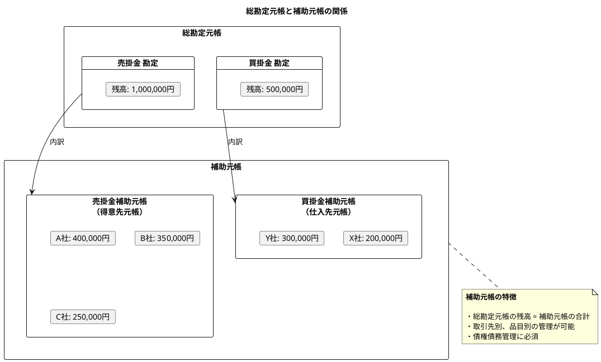
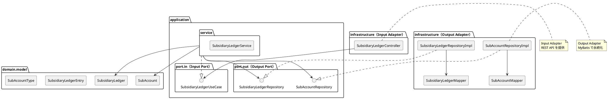

# 第17章: 補助元帳

## 17.1 本章の概要

第6章で設計した日次勘定科目残高テーブルには補助科目コードが含まれており、補助科目別の残高管理が可能です。本章では、補助科目マスタの管理と補助元帳照会機能をヘキサゴナルアーキテクチャに従い、TDD で実装します。

### 補助元帳とは

補助元帳は、総勘定元帳を補完する詳細な記録簿です。特定の勘定科目について、取引先や品目など補助科目ごとの内訳を管理します。



### 主な補助元帳の種類

| 補助元帳 | 対象勘定科目 | 補助科目の例 |
|---------|-------------|-------------|
| 得意先元帳 | 売掛金 | 得意先コード（顧客） |
| 仕入先元帳 | 買掛金 | 仕入先コード（取引先） |
| 商品元帳 | 棚卸資産 | 商品コード |
| 固定資産台帳 | 固定資産 | 資産番号 |
| 預金元帳 | 普通預金 | 口座番号 |

### アーキテクチャの全体像



### パッケージ構成

```
com.example.accounting/
├── domain/
│   └── model/
│       └── subsidiary/
│           ├── SubAccount.java            # 補助科目
│           ├── SubAccountType.java        # 補助科目種別
│           ├── SubsidiaryLedger.java      # 補助元帳
│           └── SubsidiaryLedgerEntry.java # 補助元帳明細
├── application/
│   ├── port/
│   │   ├── in/
│   │   │   ├── SubsidiaryLedgerUseCase.java  # Input Port
│   │   │   └── query/
│   │   │       └── SubsidiaryLedgerQuery.java
│   │   └── out/
│   │       ├── SubAccountRepository.java      # Output Port
│   │       └── SubsidiaryLedgerRepository.java
│   └── service/
│       └── SubsidiaryLedgerService.java       # Application Service
└── infrastructure/
    ├── persistence/
    │   ├── mapper/
    │   │   ├── SubAccountMapper.java
    │   │   └── SubsidiaryLedgerMapper.java
    │   └── repository/
    │       ├── SubAccountRepositoryImpl.java
    │       └── SubsidiaryLedgerRepositoryImpl.java
    └── web/
        ├── controller/
        │   └── SubsidiaryLedgerController.java
        └── dto/
            ├── SubAccountResponse.java
            └── SubsidiaryLedgerResponse.java
```

### TDD の流れ

1. **Domain Model**: ドメインモデルの作成（SubAccount, SubsidiaryLedger, SubsidiaryLedgerEntry）
2. **Output Port**: リポジトリインターフェースの定義
3. **Output Adapter**: Testcontainers でリポジトリ実装をテスト
4. **Input Port**: ユースケースインターフェースの定義
5. **Application Service**: Mockito でアプリケーションサービスをテスト
6. **Input Adapter**: Testcontainers で REST API 統合テスト

---

## 17.2 Domain Model の実装

### 17.2.1 SubAccountType 列挙型

補助科目の種別を表す列挙型です。

```java
package com.example.accounting.domain.model.subsidiary;

/**
 * 補助科目種別
 */
public enum SubAccountType {
    CUSTOMER("得意先", "1130"),      // 売掛金の補助科目
    SUPPLIER("仕入先", "2110"),      // 買掛金の補助科目
    BANK_ACCOUNT("銀行口座", "1110"), // 普通預金の補助科目
    PRODUCT("商品", "1210"),          // 棚卸資産の補助科目
    FIXED_ASSET("固定資産", "1400"),  // 固定資産の補助科目
    EMPLOYEE("社員", "2130"),         // 未払金（給与）の補助科目
    OTHER("その他", null);

    private final String displayName;
    private final String defaultAccountCode;

    SubAccountType(String displayName, String defaultAccountCode) {
        this.displayName = displayName;
        this.defaultAccountCode = defaultAccountCode;
    }

    public String getDisplayName() {
        return displayName;
    }

    public String getDefaultAccountCode() {
        return defaultAccountCode;
    }

    /**
     * 勘定科目コードから補助科目種別を推定
     */
    public static SubAccountType fromAccountCode(String accountCode) {
        if (accountCode == null) {
            return OTHER;
        }
        if (accountCode.startsWith("1130") || accountCode.startsWith("113")) {
            return CUSTOMER;
        }
        if (accountCode.startsWith("2110") || accountCode.startsWith("211")) {
            return SUPPLIER;
        }
        if (accountCode.startsWith("1110") || accountCode.startsWith("111")) {
            return BANK_ACCOUNT;
        }
        if (accountCode.startsWith("121") || accountCode.startsWith("122")) {
            return PRODUCT;
        }
        if (accountCode.startsWith("14") || accountCode.startsWith("15")) {
            return FIXED_ASSET;
        }
        return OTHER;
    }
}
```

### 17.2.2 SubAccount ドメインモデル

補助科目を表すドメインモデルです。

```java
package com.example.accounting.domain.model.subsidiary;

import lombok.Value;
import lombok.With;

import java.time.LocalDateTime;

/**
 * 補助科目ドメインモデル
 */
@Value
@With
public class SubAccount {

    String subAccountCode;
    String subAccountName;
    SubAccountType subAccountType;
    String accountCode;          // 紐付く勘定科目
    String contactName;          // 担当者名
    String phoneNumber;          // 電話番号
    String address;              // 住所
    Boolean isActive;            // 有効フラグ
    LocalDateTime createdAt;
    LocalDateTime updatedAt;

    /**
     * 得意先として作成
     */
    public static SubAccount createCustomer(
            String code, String name, String contactName) {
        return new SubAccount(
            code,
            name,
            SubAccountType.CUSTOMER,
            "1130",  // 売掛金
            contactName,
            null,
            null,
            true,
            null,
            null
        );
    }

    /**
     * 仕入先として作成
     */
    public static SubAccount createSupplier(
            String code, String name, String contactName) {
        return new SubAccount(
            code,
            name,
            SubAccountType.SUPPLIER,
            "2110",  // 買掛金
            contactName,
            null,
            null,
            true,
            null,
            null
        );
    }

    /**
     * 銀行口座として作成
     */
    public static SubAccount createBankAccount(
            String code, String name) {
        return new SubAccount(
            code,
            name,
            SubAccountType.BANK_ACCOUNT,
            "1110",  // 普通預金
            null,
            null,
            null,
            true,
            null,
            null
        );
    }

    /**
     * 得意先かどうか
     */
    public boolean isCustomer() {
        return subAccountType == SubAccountType.CUSTOMER;
    }

    /**
     * 仕入先かどうか
     */
    public boolean isSupplier() {
        return subAccountType == SubAccountType.SUPPLIER;
    }

    /**
     * 無効化
     */
    public SubAccount deactivate() {
        return this.withIsActive(false);
    }

    /**
     * 有効化
     */
    public SubAccount activate() {
        return this.withIsActive(true);
    }
}
```

### 17.2.3 SubsidiaryLedgerEntry ドメインモデル

補助元帳の明細（1行）を表すドメインモデルです。

```java
package com.example.accounting.domain.model.subsidiary;

import lombok.Value;
import lombok.With;

import java.math.BigDecimal;
import java.time.LocalDate;

/**
 * 補助元帳明細
 */
@Value
@With
public class SubsidiaryLedgerEntry {

    LocalDate entryDate;         // 起票日
    String journalNumber;        // 仕訳伝票番号
    String description;          // 摘要
    BigDecimal debitAmount;      // 借方金額
    BigDecimal creditAmount;     // 貸方金額
    BigDecimal balance;          // 残高

    /**
     * 明細を作成
     */
    public static SubsidiaryLedgerEntry of(
            LocalDate entryDate,
            String journalNumber,
            String description,
            BigDecimal debitAmount,
            BigDecimal creditAmount,
            BigDecimal previousBalance,
            boolean isDebitBalance) {

        BigDecimal balance;
        if (isDebitBalance) {
            // 借方残高科目（売掛金など）: 残高 = 前回残高 + 借方 - 貸方
            balance = previousBalance.add(debitAmount).subtract(creditAmount);
        } else {
            // 貸方残高科目（買掛金など）: 残高 = 前回残高 + 貸方 - 借方
            balance = previousBalance.add(creditAmount).subtract(debitAmount);
        }

        return new SubsidiaryLedgerEntry(
            entryDate,
            journalNumber,
            description,
            debitAmount,
            creditAmount,
            balance
        );
    }

    /**
     * 借方取引かどうか
     */
    public boolean isDebitTransaction() {
        return debitAmount.compareTo(BigDecimal.ZERO) > 0;
    }

    /**
     * 貸方取引かどうか
     */
    public boolean isCreditTransaction() {
        return creditAmount.compareTo(BigDecimal.ZERO) > 0;
    }

    /**
     * 取引金額（借方または貸方のうち大きい方）
     */
    public BigDecimal getTransactionAmount() {
        return debitAmount.max(creditAmount);
    }
}
```

### 17.2.4 SubsidiaryLedger ドメインモデル

補助元帳全体を表すドメインモデルです。

```java
package com.example.accounting.domain.model.subsidiary;

import lombok.Value;
import lombok.With;

import java.math.BigDecimal;
import java.time.LocalDate;
import java.util.ArrayList;
import java.util.List;

/**
 * 補助元帳
 */
@Value
@With
public class SubsidiaryLedger {

    String accountCode;
    String accountName;
    String subAccountCode;
    String subAccountName;
    SubAccountType subAccountType;
    LocalDate fromDate;
    LocalDate toDate;
    BigDecimal openingBalance;   // 期首残高
    BigDecimal closingBalance;   // 期末残高
    BigDecimal totalDebit;       // 借方合計
    BigDecimal totalCredit;      // 貸方合計
    List<SubsidiaryLedgerEntry> entries;
    boolean isDebitBalance;      // 借方残高科目フラグ

    /**
     * 補助元帳を生成
     */
    public static SubsidiaryLedger create(
            String accountCode,
            String accountName,
            String subAccountCode,
            String subAccountName,
            SubAccountType subAccountType,
            LocalDate fromDate,
            LocalDate toDate,
            BigDecimal openingBalance,
            List<SubsidiaryLedgerEntry> entries,
            boolean isDebitBalance) {

        BigDecimal totalDebit = BigDecimal.ZERO;
        BigDecimal totalCredit = BigDecimal.ZERO;

        for (SubsidiaryLedgerEntry entry : entries) {
            totalDebit = totalDebit.add(entry.getDebitAmount());
            totalCredit = totalCredit.add(entry.getCreditAmount());
        }

        BigDecimal closingBalance;
        if (isDebitBalance) {
            closingBalance = openingBalance.add(totalDebit).subtract(totalCredit);
        } else {
            closingBalance = openingBalance.add(totalCredit).subtract(totalDebit);
        }

        return new SubsidiaryLedger(
            accountCode,
            accountName,
            subAccountCode,
            subAccountName,
            subAccountType,
            fromDate,
            toDate,
            openingBalance,
            closingBalance,
            totalDebit,
            totalCredit,
            entries,
            isDebitBalance
        );
    }

    /**
     * 期間中の純増減額
     */
    public BigDecimal getNetChange() {
        return closingBalance.subtract(openingBalance);
    }

    /**
     * 取引件数
     */
    public int getTransactionCount() {
        return entries.size();
    }

    /**
     * 得意先元帳かどうか
     */
    public boolean isCustomerLedger() {
        return subAccountType == SubAccountType.CUSTOMER;
    }

    /**
     * 仕入先元帳かどうか
     */
    public boolean isSupplierLedger() {
        return subAccountType == SubAccountType.SUPPLIER;
    }

    /**
     * 残高推移を取得
     */
    public List<BalanceTransition> getBalanceTransitions() {
        List<BalanceTransition> transitions = new ArrayList<>();
        BigDecimal currentBalance = openingBalance;

        transitions.add(new BalanceTransition(fromDate, "期首残高", currentBalance));

        for (SubsidiaryLedgerEntry entry : entries) {
            transitions.add(new BalanceTransition(
                entry.getEntryDate(),
                entry.getDescription(),
                entry.getBalance()
            ));
        }

        return transitions;
    }

    /**
     * 残高推移を表すレコード
     */
    public record BalanceTransition(
        LocalDate date,
        String description,
        BigDecimal balance
    ) {}
}
```

---

## 17.3 Output Port（リポジトリインターフェース）

### 17.3.1 SubAccountRepository

```java
package com.example.accounting.application.port.out;

import com.example.accounting.domain.model.subsidiary.SubAccount;
import com.example.accounting.domain.model.subsidiary.SubAccountType;

import java.util.List;
import java.util.Optional;

/**
 * 補助科目リポジトリ（Output Port）
 */
public interface SubAccountRepository {

    SubAccount save(SubAccount subAccount);

    Optional<SubAccount> findByCode(String subAccountCode);

    List<SubAccount> findAll();

    List<SubAccount> findByType(SubAccountType type);

    List<SubAccount> findByAccountCode(String accountCode);

    List<SubAccount> findActiveByType(SubAccountType type);

    void deleteByCode(String subAccountCode);

    boolean existsByCode(String subAccountCode);

    long count();
}
```

### 17.3.2 SubsidiaryLedgerRepository

```java
package com.example.accounting.application.port.out;

import java.math.BigDecimal;
import java.time.LocalDate;
import java.util.List;

/**
 * 補助元帳リポジトリ（Output Port）
 */
public interface SubsidiaryLedgerRepository {

    /**
     * 補助元帳明細を取得
     */
    List<SubsidiaryLedgerEntryDto> findEntries(
        String accountCode,
        String subAccountCode,
        LocalDate fromDate,
        LocalDate toDate
    );

    /**
     * 期首残高を取得
     */
    BigDecimal findOpeningBalance(
        String accountCode,
        String subAccountCode,
        LocalDate asOfDate
    );

    /**
     * 補助科目別残高一覧を取得
     */
    List<SubAccountBalanceDto> findBalancesByAccountCode(
        String accountCode,
        LocalDate asOfDate
    );

    /**
     * 補助元帳明細DTO
     */
    record SubsidiaryLedgerEntryDto(
        LocalDate entryDate,
        String journalNumber,
        String description,
        BigDecimal debitAmount,
        BigDecimal creditAmount
    ) {}

    /**
     * 補助科目別残高DTO
     */
    record SubAccountBalanceDto(
        String subAccountCode,
        String subAccountName,
        BigDecimal debitAmount,
        BigDecimal creditAmount,
        BigDecimal balance
    ) {}
}
```

---

## 17.4 Output Adapter（リポジトリ実装）

### 17.4.1 補助科目マスタの DDL

```sql
-- ==========================================
-- 補助科目マスタの作成
-- ==========================================

CREATE TABLE IF NOT EXISTS "補助科目マスタ" (
    "補助科目コード" VARCHAR(10) PRIMARY KEY,
    "補助科目名" VARCHAR(100) NOT NULL,
    "補助科目種別" VARCHAR(20) NOT NULL,
    "勘定科目コード" VARCHAR(10) NOT NULL,
    "担当者名" VARCHAR(50),
    "電話番号" VARCHAR(20),
    "住所" VARCHAR(200),
    "有効フラグ" BOOLEAN DEFAULT true NOT NULL,
    "作成日時" TIMESTAMP DEFAULT CURRENT_TIMESTAMP NOT NULL,
    "更新日時" TIMESTAMP DEFAULT CURRENT_TIMESTAMP NOT NULL,
    FOREIGN KEY ("勘定科目コード")
        REFERENCES "勘定科目マスタ" ("勘定科目コード")
);

-- インデックス作成
CREATE INDEX "idx_補助科目マスタ_種別" ON "補助科目マスタ"("補助科目種別");
CREATE INDEX "idx_補助科目マスタ_勘定科目" ON "補助科目マスタ"("勘定科目コード");
CREATE INDEX "idx_補助科目マスタ_有効" ON "補助科目マスタ"("有効フラグ");

-- CHECK制約
ALTER TABLE "補助科目マスタ"
  ADD CONSTRAINT "check_補助科目種別"
  CHECK ("補助科目種別" IN ('CUSTOMER', 'SUPPLIER', 'BANK_ACCOUNT', 'PRODUCT', 'FIXED_ASSET', 'EMPLOYEE', 'OTHER'));

-- コメント追加
COMMENT ON TABLE "補助科目マスタ" IS '補助科目マスタ（得意先、仕入先、銀行口座など）';
COMMENT ON COLUMN "補助科目マスタ"."補助科目種別" IS 'CUSTOMER=得意先, SUPPLIER=仕入先, BANK_ACCOUNT=銀行口座, PRODUCT=商品, FIXED_ASSET=固定資産, EMPLOYEE=社員, OTHER=その他';
```

### 17.4.2 MyBatis Mapper

**SubAccountMapper.java**:

```java
package com.example.accounting.infrastructure.persistence.mapper;

import com.example.accounting.infrastructure.persistence.entity.SubAccountEntity;
import org.apache.ibatis.annotations.Mapper;
import org.apache.ibatis.annotations.Param;

import java.util.List;

@Mapper
public interface SubAccountMapper {

    void insert(SubAccountEntity entity);

    SubAccountEntity selectByCode(@Param("subAccountCode") String subAccountCode);

    List<SubAccountEntity> selectAll();

    List<SubAccountEntity> selectByType(@Param("subAccountType") String subAccountType);

    List<SubAccountEntity> selectByAccountCode(@Param("accountCode") String accountCode);

    List<SubAccountEntity> selectActiveByType(@Param("subAccountType") String subAccountType);

    void update(SubAccountEntity entity);

    void deleteByCode(@Param("subAccountCode") String subAccountCode);

    long count();
}
```

**SubAccountMapper.xml**:

```xml
<?xml version="1.0" encoding="UTF-8" ?>
<!DOCTYPE mapper PUBLIC "-//mybatis.org//DTD Mapper 3.0//EN"
        "http://mybatis.org/dtd/mybatis-3-mapper.dtd">
<mapper namespace="com.example.accounting.infrastructure.persistence.mapper.SubAccountMapper">

    <resultMap id="SubAccountEntityResultMap"
               type="com.example.accounting.infrastructure.persistence.entity.SubAccountEntity">
        <id property="subAccountCode" column="補助科目コード"/>
        <result property="subAccountName" column="補助科目名"/>
        <result property="subAccountType" column="補助科目種別"/>
        <result property="accountCode" column="勘定科目コード"/>
        <result property="contactName" column="担当者名"/>
        <result property="phoneNumber" column="電話番号"/>
        <result property="address" column="住所"/>
        <result property="isActive" column="有効フラグ"/>
        <result property="createdAt" column="作成日時"/>
        <result property="updatedAt" column="更新日時"/>
    </resultMap>

    <insert id="insert">
        INSERT INTO "補助科目マスタ" (
            "補助科目コード", "補助科目名", "補助科目種別", "勘定科目コード",
            "担当者名", "電話番号", "住所", "有効フラグ"
        ) VALUES (
            #{subAccountCode}, #{subAccountName}, #{subAccountType}, #{accountCode},
            #{contactName}, #{phoneNumber}, #{address}, #{isActive}
        )
    </insert>

    <select id="selectByCode" resultMap="SubAccountEntityResultMap">
        SELECT * FROM "補助科目マスタ"
        WHERE "補助科目コード" = #{subAccountCode}
    </select>

    <select id="selectAll" resultMap="SubAccountEntityResultMap">
        SELECT * FROM "補助科目マスタ"
        ORDER BY "補助科目種別", "補助科目コード"
    </select>

    <select id="selectByType" resultMap="SubAccountEntityResultMap">
        SELECT * FROM "補助科目マスタ"
        WHERE "補助科目種別" = #{subAccountType}
        ORDER BY "補助科目コード"
    </select>

    <select id="selectByAccountCode" resultMap="SubAccountEntityResultMap">
        SELECT * FROM "補助科目マスタ"
        WHERE "勘定科目コード" = #{accountCode}
        ORDER BY "補助科目コード"
    </select>

    <select id="selectActiveByType" resultMap="SubAccountEntityResultMap">
        SELECT * FROM "補助科目マスタ"
        WHERE "補助科目種別" = #{subAccountType}
          AND "有効フラグ" = true
        ORDER BY "補助科目コード"
    </select>

    <update id="update">
        UPDATE "補助科目マスタ"
        SET "補助科目名" = #{subAccountName},
            "補助科目種別" = #{subAccountType},
            "勘定科目コード" = #{accountCode},
            "担当者名" = #{contactName},
            "電話番号" = #{phoneNumber},
            "住所" = #{address},
            "有効フラグ" = #{isActive},
            "更新日時" = CURRENT_TIMESTAMP
        WHERE "補助科目コード" = #{subAccountCode}
    </update>

    <delete id="deleteByCode">
        DELETE FROM "補助科目マスタ"
        WHERE "補助科目コード" = #{subAccountCode}
    </delete>

    <select id="count" resultType="long">
        SELECT COUNT(*) FROM "補助科目マスタ"
    </select>
</mapper>
```

**SubsidiaryLedgerMapper.java**:

```java
package com.example.accounting.infrastructure.persistence.mapper;

import com.example.accounting.application.port.out.SubsidiaryLedgerRepository.SubsidiaryLedgerEntryDto;
import com.example.accounting.application.port.out.SubsidiaryLedgerRepository.SubAccountBalanceDto;
import org.apache.ibatis.annotations.Mapper;
import org.apache.ibatis.annotations.Param;

import java.math.BigDecimal;
import java.time.LocalDate;
import java.util.List;

@Mapper
public interface SubsidiaryLedgerMapper {

    List<SubsidiaryLedgerEntryDto> selectEntries(
        @Param("accountCode") String accountCode,
        @Param("subAccountCode") String subAccountCode,
        @Param("fromDate") LocalDate fromDate,
        @Param("toDate") LocalDate toDate
    );

    BigDecimal selectOpeningBalance(
        @Param("accountCode") String accountCode,
        @Param("subAccountCode") String subAccountCode,
        @Param("asOfDate") LocalDate asOfDate
    );

    List<SubAccountBalanceDto> selectBalancesByAccountCode(
        @Param("accountCode") String accountCode,
        @Param("asOfDate") LocalDate asOfDate
    );
}
```

**SubsidiaryLedgerMapper.xml**:

```xml
<?xml version="1.0" encoding="UTF-8" ?>
<!DOCTYPE mapper PUBLIC "-//mybatis.org//DTD Mapper 3.0//EN"
        "http://mybatis.org/dtd/mybatis-3-mapper.dtd">
<mapper namespace="com.example.accounting.infrastructure.persistence.mapper.SubsidiaryLedgerMapper">

    <select id="selectEntries"
            resultType="com.example.accounting.application.port.out.SubsidiaryLedgerRepository$SubsidiaryLedgerEntryDto">
        SELECT
            d."起票日" as entryDate,
            j."仕訳伝票番号" as journalNumber,
            jd."行摘要" as description,
            jdi."仕訳金額" as debitAmount,
            0 as creditAmount
        FROM "日次勘定科目残高" d
        LEFT JOIN "仕訳貸借明細" jdi
            ON d."勘定科目コード" = jdi."勘定科目コード"
            AND d."補助科目コード" = COALESCE(jdi."補助科目コード", '')
        LEFT JOIN "仕訳明細" jd
            ON jdi."仕訳伝票番号" = jd."仕訳伝票番号"
            AND jdi."仕訳行番号" = jd."仕訳行番号"
        LEFT JOIN "仕訳" j
            ON jd."仕訳伝票番号" = j."仕訳伝票番号"
        WHERE d."勘定科目コード" = #{accountCode}
          AND d."補助科目コード" = #{subAccountCode}
          AND d."起票日" BETWEEN #{fromDate} AND #{toDate}
        ORDER BY d."起票日", j."仕訳伝票番号"
    </select>

    <select id="selectOpeningBalance" resultType="java.math.BigDecimal">
        SELECT COALESCE(
            SUM("借方金額") - SUM("貸方金額"),
            0
        )
        FROM "日次勘定科目残高"
        WHERE "勘定科目コード" = #{accountCode}
          AND "補助科目コード" = #{subAccountCode}
          AND "起票日" &lt; #{asOfDate}
    </select>

    <select id="selectBalancesByAccountCode"
            resultType="com.example.accounting.application.port.out.SubsidiaryLedgerRepository$SubAccountBalanceDto">
        SELECT
            d."補助科目コード" as subAccountCode,
            COALESCE(s."補助科目名", d."補助科目コード") as subAccountName,
            COALESCE(SUM(d."借方金額"), 0) as debitAmount,
            COALESCE(SUM(d."貸方金額"), 0) as creditAmount,
            COALESCE(SUM(d."借方金額"), 0) - COALESCE(SUM(d."貸方金額"), 0) as balance
        FROM "日次勘定科目残高" d
        LEFT JOIN "補助科目マスタ" s
            ON d."補助科目コード" = s."補助科目コード"
        WHERE d."勘定科目コード" = #{accountCode}
          AND d."起票日" &lt;= #{asOfDate}
          AND d."補助科目コード" != ''
        GROUP BY d."補助科目コード", s."補助科目名"
        HAVING COALESCE(SUM(d."借方金額"), 0) - COALESCE(SUM(d."貸方金額"), 0) != 0
        ORDER BY d."補助科目コード"
    </select>

</mapper>
```

### 17.4.3 Repository 実装（Output Adapter）

```java
package com.example.accounting.infrastructure.persistence.repository;

import com.example.accounting.application.port.out.SubAccountRepository;
import com.example.accounting.domain.model.subsidiary.SubAccount;
import com.example.accounting.domain.model.subsidiary.SubAccountType;
import com.example.accounting.infrastructure.persistence.entity.SubAccountEntity;
import com.example.accounting.infrastructure.persistence.mapper.SubAccountMapper;
import lombok.RequiredArgsConstructor;
import org.springframework.stereotype.Repository;

import java.util.List;
import java.util.Optional;

/**
 * 補助科目リポジトリ実装（Output Adapter）
 */
@Repository
@RequiredArgsConstructor
public class SubAccountRepositoryImpl implements SubAccountRepository {

    private final SubAccountMapper subAccountMapper;

    @Override
    public SubAccount save(SubAccount subAccount) {
        SubAccountEntity entity = SubAccountEntity.from(subAccount);

        if (existsByCode(subAccount.getSubAccountCode())) {
            subAccountMapper.update(entity);
        } else {
            subAccountMapper.insert(entity);
        }

        return subAccount;
    }

    @Override
    public Optional<SubAccount> findByCode(String subAccountCode) {
        SubAccountEntity entity = subAccountMapper.selectByCode(subAccountCode);
        return Optional.ofNullable(entity).map(SubAccountEntity::toDomain);
    }

    @Override
    public List<SubAccount> findAll() {
        return subAccountMapper.selectAll().stream()
            .map(SubAccountEntity::toDomain)
            .toList();
    }

    @Override
    public List<SubAccount> findByType(SubAccountType type) {
        return subAccountMapper.selectByType(type.name()).stream()
            .map(SubAccountEntity::toDomain)
            .toList();
    }

    @Override
    public List<SubAccount> findByAccountCode(String accountCode) {
        return subAccountMapper.selectByAccountCode(accountCode).stream()
            .map(SubAccountEntity::toDomain)
            .toList();
    }

    @Override
    public List<SubAccount> findActiveByType(SubAccountType type) {
        return subAccountMapper.selectActiveByType(type.name()).stream()
            .map(SubAccountEntity::toDomain)
            .toList();
    }

    @Override
    public void deleteByCode(String subAccountCode) {
        subAccountMapper.deleteByCode(subAccountCode);
    }

    @Override
    public boolean existsByCode(String subAccountCode) {
        return subAccountMapper.selectByCode(subAccountCode) != null;
    }

    @Override
    public long count() {
        return subAccountMapper.count();
    }
}
```

```java
package com.example.accounting.infrastructure.persistence.repository;

import com.example.accounting.application.port.out.SubsidiaryLedgerRepository;
import com.example.accounting.infrastructure.persistence.mapper.SubsidiaryLedgerMapper;
import lombok.RequiredArgsConstructor;
import org.springframework.stereotype.Repository;

import java.math.BigDecimal;
import java.time.LocalDate;
import java.util.List;

/**
 * 補助元帳リポジトリ実装（Output Adapter）
 */
@Repository
@RequiredArgsConstructor
public class SubsidiaryLedgerRepositoryImpl implements SubsidiaryLedgerRepository {

    private final SubsidiaryLedgerMapper subsidiaryLedgerMapper;

    @Override
    public List<SubsidiaryLedgerEntryDto> findEntries(
            String accountCode,
            String subAccountCode,
            LocalDate fromDate,
            LocalDate toDate) {
        return subsidiaryLedgerMapper.selectEntries(accountCode, subAccountCode, fromDate, toDate);
    }

    @Override
    public BigDecimal findOpeningBalance(
            String accountCode,
            String subAccountCode,
            LocalDate asOfDate) {
        BigDecimal balance = subsidiaryLedgerMapper.selectOpeningBalance(
            accountCode, subAccountCode, asOfDate);
        return balance != null ? balance : BigDecimal.ZERO;
    }

    @Override
    public List<SubAccountBalanceDto> findBalancesByAccountCode(
            String accountCode,
            LocalDate asOfDate) {
        return subsidiaryLedgerMapper.selectBalancesByAccountCode(accountCode, asOfDate);
    }
}
```

### 17.4.4 Entity クラス

```java
package com.example.accounting.infrastructure.persistence.entity;

import com.example.accounting.domain.model.subsidiary.SubAccount;
import com.example.accounting.domain.model.subsidiary.SubAccountType;
import lombok.Data;

import java.time.LocalDateTime;

/**
 * 補助科目エンティティ（MyBatis 用）
 */
@Data
public class SubAccountEntity {

    private String subAccountCode;
    private String subAccountName;
    private String subAccountType;
    private String accountCode;
    private String contactName;
    private String phoneNumber;
    private String address;
    private Boolean isActive;
    private LocalDateTime createdAt;
    private LocalDateTime updatedAt;

    /**
     * ドメインモデルからエンティティを作成
     */
    public static SubAccountEntity from(SubAccount subAccount) {
        SubAccountEntity entity = new SubAccountEntity();
        entity.setSubAccountCode(subAccount.getSubAccountCode());
        entity.setSubAccountName(subAccount.getSubAccountName());
        entity.setSubAccountType(subAccount.getSubAccountType().name());
        entity.setAccountCode(subAccount.getAccountCode());
        entity.setContactName(subAccount.getContactName());
        entity.setPhoneNumber(subAccount.getPhoneNumber());
        entity.setAddress(subAccount.getAddress());
        entity.setIsActive(subAccount.getIsActive());
        entity.setCreatedAt(subAccount.getCreatedAt());
        entity.setUpdatedAt(subAccount.getUpdatedAt());
        return entity;
    }

    /**
     * ドメインモデルに変換
     */
    public SubAccount toDomain() {
        return new SubAccount(
            subAccountCode,
            subAccountName,
            SubAccountType.valueOf(subAccountType),
            accountCode,
            contactName,
            phoneNumber,
            address,
            isActive,
            createdAt,
            updatedAt
        );
    }
}
```

### 17.4.5 Repository 実装のテスト（Testcontainers）

```java
package com.example.accounting.infrastructure.persistence.repository;

import com.example.accounting.application.port.out.SubAccountRepository;
import com.example.accounting.domain.model.subsidiary.SubAccount;
import com.example.accounting.domain.model.subsidiary.SubAccountType;
import org.junit.jupiter.api.*;
import org.springframework.beans.factory.annotation.Autowired;
import org.springframework.boot.test.context.SpringBootTest;
import org.springframework.test.context.DynamicPropertyRegistry;
import org.springframework.test.context.DynamicPropertySource;
import org.testcontainers.containers.PostgreSQLContainer;
import org.testcontainers.junit.jupiter.Container;
import org.testcontainers.junit.jupiter.Testcontainers;

import java.util.List;
import java.util.Optional;

import static org.assertj.core.api.Assertions.assertThat;

@SpringBootTest
@Testcontainers
@TestMethodOrder(MethodOrderer.OrderAnnotation.class)
@DisplayName("補助科目リポジトリ実装のテスト")
class SubAccountRepositoryImplTest {

    @Container
    static PostgreSQLContainer<?> postgres = new PostgreSQLContainer<>("postgres:16-alpine")
            .withDatabaseName("testdb")
            .withUsername("testuser")
            .withPassword("testpass");

    @DynamicPropertySource
    static void configureProperties(DynamicPropertyRegistry registry) {
        registry.add("spring.datasource.url", postgres::getJdbcUrl);
        registry.add("spring.datasource.username", postgres::getUsername);
        registry.add("spring.datasource.password", postgres::getPassword);
        registry.add("spring.flyway.enabled", () -> "true");
    }

    @Autowired
    private SubAccountRepository subAccountRepository;

    @Test
    @Order(1)
    @DisplayName("得意先を登録できる")
    void shouldSaveCustomer() {
        // Given
        SubAccount customer = SubAccount.createCustomer("C001", "A社", "山田太郎");

        // When
        SubAccount saved = subAccountRepository.save(customer);

        // Then
        assertThat(saved.getSubAccountCode()).isEqualTo("C001");
        assertThat(saved.getSubAccountName()).isEqualTo("A社");
        assertThat(saved.getSubAccountType()).isEqualTo(SubAccountType.CUSTOMER);
        assertThat(saved.isCustomer()).isTrue();
    }

    @Test
    @Order(2)
    @DisplayName("仕入先を登録できる")
    void shouldSaveSupplier() {
        // Given
        SubAccount supplier = SubAccount.createSupplier("S001", "X社", "佐藤花子");

        // When
        SubAccount saved = subAccountRepository.save(supplier);

        // Then
        assertThat(saved.getSubAccountCode()).isEqualTo("S001");
        assertThat(saved.getSubAccountName()).isEqualTo("X社");
        assertThat(saved.getSubAccountType()).isEqualTo(SubAccountType.SUPPLIER);
        assertThat(saved.isSupplier()).isTrue();
    }

    @Test
    @Order(3)
    @DisplayName("補助科目コードで検索できる")
    void shouldFindByCode() {
        // When
        Optional<SubAccount> found = subAccountRepository.findByCode("C001");

        // Then
        assertThat(found).isPresent();
        assertThat(found.get().getSubAccountName()).isEqualTo("A社");
        assertThat(found.get().getContactName()).isEqualTo("山田太郎");
    }

    @Test
    @Order(4)
    @DisplayName("種別で検索できる")
    void shouldFindByType() {
        // Given
        subAccountRepository.save(SubAccount.createCustomer("C002", "B社", "鈴木一郎"));

        // When
        List<SubAccount> customers = subAccountRepository.findByType(SubAccountType.CUSTOMER);

        // Then
        assertThat(customers).hasSize(2);
        assertThat(customers).allMatch(SubAccount::isCustomer);
    }

    @Test
    @Order(5)
    @DisplayName("有効な補助科目のみ取得できる")
    void shouldFindActiveByType() {
        // Given
        SubAccount inactive = SubAccount.createCustomer("C003", "C社", "高橋二郎")
            .deactivate();
        subAccountRepository.save(inactive);

        // When
        List<SubAccount> activeCustomers = subAccountRepository
            .findActiveByType(SubAccountType.CUSTOMER);

        // Then
        assertThat(activeCustomers).hasSize(2);
        assertThat(activeCustomers)
            .extracting(SubAccount::getSubAccountCode)
            .containsExactlyInAnyOrder("C001", "C002");
    }

    @Test
    @Order(6)
    @DisplayName("補助科目を更新できる")
    void shouldUpdateSubAccount() {
        // Given
        SubAccount existing = subAccountRepository.findByCode("C001").orElseThrow();
        SubAccount updated = existing
            .withSubAccountName("A社（更新）")
            .withPhoneNumber("03-1234-5678");

        // When
        subAccountRepository.save(updated);

        // Then
        SubAccount found = subAccountRepository.findByCode("C001").orElseThrow();
        assertThat(found.getSubAccountName()).isEqualTo("A社（更新）");
        assertThat(found.getPhoneNumber()).isEqualTo("03-1234-5678");
    }

    @Test
    @Order(7)
    @DisplayName("存在しない補助科目コードで検索すると空を返す")
    void shouldReturnEmptyWhenNotFound() {
        // When
        Optional<SubAccount> found = subAccountRepository.findByCode("NOT_EXIST");

        // Then
        assertThat(found).isEmpty();
    }

    @Test
    @Order(8)
    @DisplayName("補助科目を削除できる")
    void shouldDeleteSubAccount() {
        // Given
        SubAccount temp = SubAccount.createCustomer("TEMP", "一時的", "削除用");
        subAccountRepository.save(temp);
        assertThat(subAccountRepository.existsByCode("TEMP")).isTrue();

        // When
        subAccountRepository.deleteByCode("TEMP");

        // Then
        assertThat(subAccountRepository.existsByCode("TEMP")).isFalse();
    }
}
```

---

## 17.5 Input Port（ユースケースインターフェース）

### 17.5.1 ユースケースインターフェース

```java
package com.example.accounting.application.port.in;

import com.example.accounting.application.port.in.command.CreateSubAccountCommand;
import com.example.accounting.application.port.in.command.UpdateSubAccountCommand;
import com.example.accounting.application.port.in.query.SubsidiaryLedgerQuery;
import com.example.accounting.domain.model.subsidiary.SubAccount;
import com.example.accounting.domain.model.subsidiary.SubAccountType;
import com.example.accounting.domain.model.subsidiary.SubsidiaryLedger;

import java.math.BigDecimal;
import java.time.LocalDate;
import java.util.List;
import java.util.Map;

/**
 * 補助元帳ユースケース（Input Port）
 */
public interface SubsidiaryLedgerUseCase {

    // 補助科目管理
    SubAccount createSubAccount(CreateSubAccountCommand command);

    SubAccount findSubAccountByCode(String subAccountCode);

    List<SubAccount> findSubAccountsByType(SubAccountType type);

    List<SubAccount> findActiveCustomers();

    List<SubAccount> findActiveSuppliers();

    SubAccount updateSubAccount(UpdateSubAccountCommand command);

    void deactivateSubAccount(String subAccountCode);

    // 補助元帳照会
    SubsidiaryLedger getSubsidiaryLedger(SubsidiaryLedgerQuery query);

    Map<String, BigDecimal> getSubAccountBalances(String accountCode, LocalDate asOfDate);

    List<SubsidiaryLedger> getCustomerLedgers(LocalDate fromDate, LocalDate toDate);

    List<SubsidiaryLedger> getSupplierLedgers(LocalDate fromDate, LocalDate toDate);
}
```

### 17.5.2 Command / Query クラス

```java
// application/port/in/command/CreateSubAccountCommand.java
package com.example.accounting.application.port.in.command;

import com.example.accounting.domain.model.subsidiary.SubAccountType;

import java.util.Objects;

/**
 * 補助科目作成コマンド
 */
public record CreateSubAccountCommand(
    String subAccountCode,
    String subAccountName,
    SubAccountType subAccountType,
    String accountCode,
    String contactName,
    String phoneNumber,
    String address
) {
    public CreateSubAccountCommand {
        Objects.requireNonNull(subAccountCode, "補助科目コードは必須です");
        Objects.requireNonNull(subAccountName, "補助科目名は必須です");
        Objects.requireNonNull(subAccountType, "補助科目種別は必須です");

        if (subAccountCode.isBlank()) {
            throw new IllegalArgumentException("補助科目コードは空にできません");
        }
        if (subAccountName.isBlank()) {
            throw new IllegalArgumentException("補助科目名は空にできません");
        }
    }
}

// application/port/in/command/UpdateSubAccountCommand.java
package com.example.accounting.application.port.in.command;

import java.util.Objects;

/**
 * 補助科目更新コマンド
 */
public record UpdateSubAccountCommand(
    String subAccountCode,
    String subAccountName,
    String contactName,
    String phoneNumber,
    String address
) {
    public UpdateSubAccountCommand {
        Objects.requireNonNull(subAccountCode, "補助科目コードは必須です");
    }
}

// application/port/in/query/SubsidiaryLedgerQuery.java
package com.example.accounting.application.port.in.query;

import java.time.LocalDate;
import java.util.Objects;

/**
 * 補助元帳照会クエリ
 */
public record SubsidiaryLedgerQuery(
    String accountCode,
    String subAccountCode,
    LocalDate fromDate,
    LocalDate toDate
) {
    public SubsidiaryLedgerQuery {
        Objects.requireNonNull(accountCode, "勘定科目コードは必須です");
        Objects.requireNonNull(subAccountCode, "補助科目コードは必須です");
        Objects.requireNonNull(fromDate, "開始日は必須です");
        Objects.requireNonNull(toDate, "終了日は必須です");

        if (fromDate.isAfter(toDate)) {
            throw new IllegalArgumentException("開始日は終了日以前である必要があります");
        }
    }

    public static SubsidiaryLedgerQuery of(
            String accountCode,
            String subAccountCode,
            LocalDate fromDate,
            LocalDate toDate) {
        return new SubsidiaryLedgerQuery(accountCode, subAccountCode, fromDate, toDate);
    }

    /**
     * 得意先元帳用クエリを作成（売掛金）
     */
    public static SubsidiaryLedgerQuery forCustomer(
            String customerCode,
            LocalDate fromDate,
            LocalDate toDate) {
        return new SubsidiaryLedgerQuery("1130", customerCode, fromDate, toDate);
    }

    /**
     * 仕入先元帳用クエリを作成（買掛金）
     */
    public static SubsidiaryLedgerQuery forSupplier(
            String supplierCode,
            LocalDate fromDate,
            LocalDate toDate) {
        return new SubsidiaryLedgerQuery("2110", supplierCode, fromDate, toDate);
    }
}
```

---

## 17.6 Application Service

### 17.6.1 アプリケーションサービス実装

```java
package com.example.accounting.application.service;

import com.example.accounting.application.port.in.SubsidiaryLedgerUseCase;
import com.example.accounting.application.port.in.command.CreateSubAccountCommand;
import com.example.accounting.application.port.in.command.UpdateSubAccountCommand;
import com.example.accounting.application.port.in.query.SubsidiaryLedgerQuery;
import com.example.accounting.application.port.out.SubAccountRepository;
import com.example.accounting.application.port.out.SubsidiaryLedgerRepository;
import com.example.accounting.application.port.out.SubsidiaryLedgerRepository.SubsidiaryLedgerEntryDto;
import com.example.accounting.application.port.out.SubsidiaryLedgerRepository.SubAccountBalanceDto;
import com.example.accounting.domain.model.subsidiary.*;
import lombok.RequiredArgsConstructor;
import org.springframework.stereotype.Service;
import org.springframework.transaction.annotation.Transactional;

import java.math.BigDecimal;
import java.time.LocalDate;
import java.util.*;
import java.util.stream.Collectors;

/**
 * 補助元帳アプリケーションサービス
 */
@Service
@RequiredArgsConstructor
@Transactional
public class SubsidiaryLedgerService implements SubsidiaryLedgerUseCase {

    private final SubAccountRepository subAccountRepository;
    private final SubsidiaryLedgerRepository subsidiaryLedgerRepository;

    @Override
    public SubAccount createSubAccount(CreateSubAccountCommand command) {
        if (subAccountRepository.existsByCode(command.subAccountCode())) {
            throw new SubAccountAlreadyExistsException(command.subAccountCode());
        }

        SubAccount subAccount = new SubAccount(
            command.subAccountCode(),
            command.subAccountName(),
            command.subAccountType(),
            command.accountCode() != null
                ? command.accountCode()
                : command.subAccountType().getDefaultAccountCode(),
            command.contactName(),
            command.phoneNumber(),
            command.address(),
            true,
            null,
            null
        );

        return subAccountRepository.save(subAccount);
    }

    @Override
    @Transactional(readOnly = true)
    public SubAccount findSubAccountByCode(String subAccountCode) {
        return subAccountRepository.findByCode(subAccountCode)
            .orElseThrow(() -> new SubAccountNotFoundException(subAccountCode));
    }

    @Override
    @Transactional(readOnly = true)
    public List<SubAccount> findSubAccountsByType(SubAccountType type) {
        return subAccountRepository.findByType(type);
    }

    @Override
    @Transactional(readOnly = true)
    public List<SubAccount> findActiveCustomers() {
        return subAccountRepository.findActiveByType(SubAccountType.CUSTOMER);
    }

    @Override
    @Transactional(readOnly = true)
    public List<SubAccount> findActiveSuppliers() {
        return subAccountRepository.findActiveByType(SubAccountType.SUPPLIER);
    }

    @Override
    public SubAccount updateSubAccount(UpdateSubAccountCommand command) {
        SubAccount existing = findSubAccountByCode(command.subAccountCode());

        SubAccount updated = existing
            .withSubAccountName(
                command.subAccountName() != null
                    ? command.subAccountName()
                    : existing.getSubAccountName()
            )
            .withContactName(
                command.contactName() != null
                    ? command.contactName()
                    : existing.getContactName()
            )
            .withPhoneNumber(
                command.phoneNumber() != null
                    ? command.phoneNumber()
                    : existing.getPhoneNumber()
            )
            .withAddress(
                command.address() != null
                    ? command.address()
                    : existing.getAddress()
            );

        return subAccountRepository.save(updated);
    }

    @Override
    public void deactivateSubAccount(String subAccountCode) {
        SubAccount existing = findSubAccountByCode(subAccountCode);
        subAccountRepository.save(existing.deactivate());
    }

    @Override
    @Transactional(readOnly = true)
    public SubsidiaryLedger getSubsidiaryLedger(SubsidiaryLedgerQuery query) {
        // 補助科目情報を取得
        Optional<SubAccount> subAccountOpt = subAccountRepository.findByCode(query.subAccountCode());
        String subAccountName = subAccountOpt
            .map(SubAccount::getSubAccountName)
            .orElse(query.subAccountCode());
        SubAccountType subAccountType = subAccountOpt
            .map(SubAccount::getSubAccountType)
            .orElse(SubAccountType.fromAccountCode(query.accountCode()));

        // 期首残高を取得
        BigDecimal openingBalance = subsidiaryLedgerRepository.findOpeningBalance(
            query.accountCode(),
            query.subAccountCode(),
            query.fromDate()
        );

        // 明細を取得
        List<SubsidiaryLedgerEntryDto> entryDtos = subsidiaryLedgerRepository.findEntries(
            query.accountCode(),
            query.subAccountCode(),
            query.fromDate(),
            query.toDate()
        );

        // 借方残高科目かどうか判定
        boolean isDebitBalance = isDebitBalanceAccount(query.accountCode());

        // 明細をドメインモデルに変換（残高を計算しながら）
        List<SubsidiaryLedgerEntry> entries = new ArrayList<>();
        BigDecimal runningBalance = openingBalance;

        for (SubsidiaryLedgerEntryDto dto : entryDtos) {
            SubsidiaryLedgerEntry entry = SubsidiaryLedgerEntry.of(
                dto.entryDate(),
                dto.journalNumber(),
                dto.description(),
                dto.debitAmount(),
                dto.creditAmount(),
                runningBalance,
                isDebitBalance
            );
            entries.add(entry);
            runningBalance = entry.getBalance();
        }

        // 勘定科目名を取得（簡易実装）
        String accountName = getAccountName(query.accountCode());

        return SubsidiaryLedger.create(
            query.accountCode(),
            accountName,
            query.subAccountCode(),
            subAccountName,
            subAccountType,
            query.fromDate(),
            query.toDate(),
            openingBalance,
            entries,
            isDebitBalance
        );
    }

    @Override
    @Transactional(readOnly = true)
    public Map<String, BigDecimal> getSubAccountBalances(String accountCode, LocalDate asOfDate) {
        List<SubAccountBalanceDto> balances = subsidiaryLedgerRepository
            .findBalancesByAccountCode(accountCode, asOfDate);

        return balances.stream()
            .collect(Collectors.toMap(
                SubAccountBalanceDto::subAccountCode,
                SubAccountBalanceDto::balance,
                (a, b) -> a,
                LinkedHashMap::new
            ));
    }

    @Override
    @Transactional(readOnly = true)
    public List<SubsidiaryLedger> getCustomerLedgers(LocalDate fromDate, LocalDate toDate) {
        List<SubAccount> customers = findActiveCustomers();
        return customers.stream()
            .map(customer -> getSubsidiaryLedger(
                SubsidiaryLedgerQuery.forCustomer(
                    customer.getSubAccountCode(),
                    fromDate,
                    toDate
                )
            ))
            .filter(ledger -> ledger.getClosingBalance().compareTo(BigDecimal.ZERO) != 0
                           || !ledger.getEntries().isEmpty())
            .toList();
    }

    @Override
    @Transactional(readOnly = true)
    public List<SubsidiaryLedger> getSupplierLedgers(LocalDate fromDate, LocalDate toDate) {
        List<SubAccount> suppliers = findActiveSuppliers();
        return suppliers.stream()
            .map(supplier -> getSubsidiaryLedger(
                SubsidiaryLedgerQuery.forSupplier(
                    supplier.getSubAccountCode(),
                    fromDate,
                    toDate
                )
            ))
            .filter(ledger -> ledger.getClosingBalance().compareTo(BigDecimal.ZERO) != 0
                           || !ledger.getEntries().isEmpty())
            .toList();
    }

    private boolean isDebitBalanceAccount(String accountCode) {
        // 資産・費用は借方残高、負債・純資産・収益は貸方残高
        return accountCode.startsWith("1") || accountCode.startsWith("5");
    }

    private String getAccountName(String accountCode) {
        // 簡易実装（実際はAccountRepositoryから取得）
        return switch (accountCode) {
            case "1130" -> "売掛金";
            case "2110" -> "買掛金";
            case "1110" -> "普通預金";
            default -> accountCode;
        };
    }

    // 例外クラス
    public static class SubAccountNotFoundException extends RuntimeException {
        public SubAccountNotFoundException(String code) {
            super("補助科目が見つかりません: " + code);
        }
    }

    public static class SubAccountAlreadyExistsException extends RuntimeException {
        public SubAccountAlreadyExistsException(String code) {
            super("補助科目は既に存在します: " + code);
        }
    }
}
```

### 17.6.2 アプリケーションサービスのテスト（Mockito）

```java
package com.example.accounting.application.service;

import com.example.accounting.application.port.in.command.CreateSubAccountCommand;
import com.example.accounting.application.port.in.query.SubsidiaryLedgerQuery;
import com.example.accounting.application.port.out.SubAccountRepository;
import com.example.accounting.application.port.out.SubsidiaryLedgerRepository;
import com.example.accounting.application.port.out.SubsidiaryLedgerRepository.SubsidiaryLedgerEntryDto;
import com.example.accounting.domain.model.subsidiary.SubAccount;
import com.example.accounting.domain.model.subsidiary.SubAccountType;
import com.example.accounting.domain.model.subsidiary.SubsidiaryLedger;
import org.junit.jupiter.api.*;
import org.junit.jupiter.api.extension.ExtendWith;
import org.mockito.InjectMocks;
import org.mockito.Mock;
import org.mockito.junit.jupiter.MockitoExtension;

import java.math.BigDecimal;
import java.time.LocalDate;
import java.util.List;
import java.util.Optional;

import static org.assertj.core.api.Assertions.*;
import static org.mockito.ArgumentMatchers.any;
import static org.mockito.Mockito.*;

@ExtendWith(MockitoExtension.class)
@DisplayName("補助元帳アプリケーションサービスのテスト")
class SubsidiaryLedgerServiceTest {

    @Mock
    private SubAccountRepository subAccountRepository;

    @Mock
    private SubsidiaryLedgerRepository subsidiaryLedgerRepository;

    @InjectMocks
    private SubsidiaryLedgerService subsidiaryLedgerService;

    @Test
    @DisplayName("得意先を登録できる")
    void shouldCreateCustomer() {
        // Given
        CreateSubAccountCommand command = new CreateSubAccountCommand(
            "C001", "A社", SubAccountType.CUSTOMER, null, "山田太郎", null, null
        );
        when(subAccountRepository.existsByCode("C001")).thenReturn(false);
        when(subAccountRepository.save(any(SubAccount.class)))
            .thenAnswer(invocation -> invocation.getArgument(0));

        // When
        SubAccount created = subsidiaryLedgerService.createSubAccount(command);

        // Then
        assertThat(created.getSubAccountCode()).isEqualTo("C001");
        assertThat(created.getSubAccountName()).isEqualTo("A社");
        assertThat(created.getSubAccountType()).isEqualTo(SubAccountType.CUSTOMER);
        assertThat(created.getAccountCode()).isEqualTo("1130");
        verify(subAccountRepository).save(any(SubAccount.class));
    }

    @Test
    @DisplayName("仕入先を登録できる")
    void shouldCreateSupplier() {
        // Given
        CreateSubAccountCommand command = new CreateSubAccountCommand(
            "S001", "X社", SubAccountType.SUPPLIER, null, "佐藤花子", null, null
        );
        when(subAccountRepository.existsByCode("S001")).thenReturn(false);
        when(subAccountRepository.save(any(SubAccount.class)))
            .thenAnswer(invocation -> invocation.getArgument(0));

        // When
        SubAccount created = subsidiaryLedgerService.createSubAccount(command);

        // Then
        assertThat(created.getSubAccountCode()).isEqualTo("S001");
        assertThat(created.getSubAccountType()).isEqualTo(SubAccountType.SUPPLIER);
        assertThat(created.getAccountCode()).isEqualTo("2110");
    }

    @Test
    @DisplayName("重複する補助科目コードは登録できない")
    void shouldNotCreateDuplicateSubAccount() {
        // Given
        CreateSubAccountCommand command = new CreateSubAccountCommand(
            "C001", "A社", SubAccountType.CUSTOMER, null, null, null, null
        );
        when(subAccountRepository.existsByCode("C001")).thenReturn(true);

        // When & Then
        assertThatThrownBy(() -> subsidiaryLedgerService.createSubAccount(command))
            .isInstanceOf(SubsidiaryLedgerService.SubAccountAlreadyExistsException.class)
            .hasMessageContaining("C001");

        verify(subAccountRepository, never()).save(any());
    }

    @Test
    @DisplayName("補助元帳を取得できる")
    void shouldGetSubsidiaryLedger() {
        // Given
        SubsidiaryLedgerQuery query = SubsidiaryLedgerQuery.forCustomer(
            "C001",
            LocalDate.of(2025, 4, 1),
            LocalDate.of(2025, 4, 30)
        );

        SubAccount customer = SubAccount.createCustomer("C001", "A社", "山田太郎");
        when(subAccountRepository.findByCode("C001")).thenReturn(Optional.of(customer));

        when(subsidiaryLedgerRepository.findOpeningBalance(
            "1130", "C001", LocalDate.of(2025, 4, 1)
        )).thenReturn(new BigDecimal("100000"));

        List<SubsidiaryLedgerEntryDto> entries = List.of(
            new SubsidiaryLedgerEntryDto(
                LocalDate.of(2025, 4, 5),
                "JE-001",
                "売上計上",
                new BigDecimal("50000"),
                BigDecimal.ZERO
            ),
            new SubsidiaryLedgerEntryDto(
                LocalDate.of(2025, 4, 20),
                "JE-002",
                "入金",
                BigDecimal.ZERO,
                new BigDecimal("30000")
            )
        );
        when(subsidiaryLedgerRepository.findEntries(
            "1130", "C001", LocalDate.of(2025, 4, 1), LocalDate.of(2025, 4, 30)
        )).thenReturn(entries);

        // When
        SubsidiaryLedger ledger = subsidiaryLedgerService.getSubsidiaryLedger(query);

        // Then
        assertThat(ledger.getAccountCode()).isEqualTo("1130");
        assertThat(ledger.getSubAccountCode()).isEqualTo("C001");
        assertThat(ledger.getSubAccountName()).isEqualTo("A社");
        assertThat(ledger.getOpeningBalance())
            .isEqualByComparingTo(new BigDecimal("100000"));
        assertThat(ledger.getEntries()).hasSize(2);
        // 期末残高 = 100,000 + 50,000 - 30,000 = 120,000
        assertThat(ledger.getClosingBalance())
            .isEqualByComparingTo(new BigDecimal("120000"));
    }

    @Test
    @DisplayName("残高推移を正しく計算できる")
    void shouldCalculateBalanceTransitions() {
        // Given
        SubsidiaryLedgerQuery query = SubsidiaryLedgerQuery.forCustomer(
            "C001",
            LocalDate.of(2025, 4, 1),
            LocalDate.of(2025, 4, 30)
        );

        SubAccount customer = SubAccount.createCustomer("C001", "A社", null);
        when(subAccountRepository.findByCode("C001")).thenReturn(Optional.of(customer));
        when(subsidiaryLedgerRepository.findOpeningBalance(any(), any(), any()))
            .thenReturn(new BigDecimal("100000"));

        List<SubsidiaryLedgerEntryDto> entries = List.of(
            new SubsidiaryLedgerEntryDto(
                LocalDate.of(2025, 4, 10),
                "JE-001",
                "売上",
                new BigDecimal("200000"),
                BigDecimal.ZERO
            )
        );
        when(subsidiaryLedgerRepository.findEntries(any(), any(), any(), any()))
            .thenReturn(entries);

        // When
        SubsidiaryLedger ledger = subsidiaryLedgerService.getSubsidiaryLedger(query);

        // Then
        // 最初の明細の残高 = 期首残高 + 借方 - 貸方 = 100,000 + 200,000 - 0 = 300,000
        assertThat(ledger.getEntries().get(0).getBalance())
            .isEqualByComparingTo(new BigDecimal("300000"));
    }

    @Test
    @DisplayName("有効な得意先一覧を取得できる")
    void shouldFindActiveCustomers() {
        // Given
        List<SubAccount> customers = List.of(
            SubAccount.createCustomer("C001", "A社", null),
            SubAccount.createCustomer("C002", "B社", null)
        );
        when(subAccountRepository.findActiveByType(SubAccountType.CUSTOMER))
            .thenReturn(customers);

        // When
        List<SubAccount> result = subsidiaryLedgerService.findActiveCustomers();

        // Then
        assertThat(result).hasSize(2);
        assertThat(result).allMatch(SubAccount::isCustomer);
    }

    @Test
    @DisplayName("補助科目を無効化できる")
    void shouldDeactivateSubAccount() {
        // Given
        SubAccount existing = SubAccount.createCustomer("C001", "A社", null);
        when(subAccountRepository.findByCode("C001")).thenReturn(Optional.of(existing));
        when(subAccountRepository.save(any(SubAccount.class)))
            .thenAnswer(invocation -> invocation.getArgument(0));

        // When
        subsidiaryLedgerService.deactivateSubAccount("C001");

        // Then
        verify(subAccountRepository).save(argThat(sa -> !sa.getIsActive()));
    }
}
```

---

## 17.7 Input Adapter（REST Controller）

### 17.7.1 DTO クラス

```java
// infrastructure/web/dto/SubAccountResponse.java
package com.example.accounting.infrastructure.web.dto;

import com.example.accounting.domain.model.subsidiary.SubAccount;

public record SubAccountResponse(
    String subAccountCode,
    String subAccountName,
    String subAccountType,
    String subAccountTypeDisplayName,
    String accountCode,
    String contactName,
    String phoneNumber,
    String address,
    boolean isActive
) {
    public static SubAccountResponse from(SubAccount subAccount) {
        return new SubAccountResponse(
            subAccount.getSubAccountCode(),
            subAccount.getSubAccountName(),
            subAccount.getSubAccountType().name(),
            subAccount.getSubAccountType().getDisplayName(),
            subAccount.getAccountCode(),
            subAccount.getContactName(),
            subAccount.getPhoneNumber(),
            subAccount.getAddress(),
            subAccount.getIsActive()
        );
    }
}

// infrastructure/web/dto/SubsidiaryLedgerResponse.java
package com.example.accounting.infrastructure.web.dto;

import com.example.accounting.domain.model.subsidiary.SubsidiaryLedger;
import com.example.accounting.domain.model.subsidiary.SubsidiaryLedgerEntry;

import java.math.BigDecimal;
import java.time.LocalDate;
import java.util.List;

public record SubsidiaryLedgerResponse(
    String accountCode,
    String accountName,
    String subAccountCode,
    String subAccountName,
    String subAccountType,
    LocalDate fromDate,
    LocalDate toDate,
    BigDecimal openingBalance,
    BigDecimal closingBalance,
    BigDecimal totalDebit,
    BigDecimal totalCredit,
    BigDecimal netChange,
    int transactionCount,
    List<SubsidiaryLedgerEntryResponse> entries
) {
    public static SubsidiaryLedgerResponse from(SubsidiaryLedger ledger) {
        return new SubsidiaryLedgerResponse(
            ledger.getAccountCode(),
            ledger.getAccountName(),
            ledger.getSubAccountCode(),
            ledger.getSubAccountName(),
            ledger.getSubAccountType().getDisplayName(),
            ledger.getFromDate(),
            ledger.getToDate(),
            ledger.getOpeningBalance(),
            ledger.getClosingBalance(),
            ledger.getTotalDebit(),
            ledger.getTotalCredit(),
            ledger.getNetChange(),
            ledger.getTransactionCount(),
            ledger.getEntries().stream()
                .map(SubsidiaryLedgerEntryResponse::from)
                .toList()
        );
    }

    public record SubsidiaryLedgerEntryResponse(
        LocalDate entryDate,
        String journalNumber,
        String description,
        BigDecimal debitAmount,
        BigDecimal creditAmount,
        BigDecimal balance
    ) {
        public static SubsidiaryLedgerEntryResponse from(SubsidiaryLedgerEntry entry) {
            return new SubsidiaryLedgerEntryResponse(
                entry.getEntryDate(),
                entry.getJournalNumber(),
                entry.getDescription(),
                entry.getDebitAmount(),
                entry.getCreditAmount(),
                entry.getBalance()
            );
        }
    }
}

// infrastructure/web/dto/SubAccountRequest.java
package com.example.accounting.infrastructure.web.dto;

import com.example.accounting.application.port.in.command.CreateSubAccountCommand;
import com.example.accounting.domain.model.subsidiary.SubAccountType;
import jakarta.validation.constraints.NotBlank;
import jakarta.validation.constraints.NotNull;

public record SubAccountRequest(
    @NotBlank(message = "補助科目コードは必須です")
    String subAccountCode,

    @NotBlank(message = "補助科目名は必須です")
    String subAccountName,

    @NotNull(message = "補助科目種別は必須です")
    String subAccountType,

    String accountCode,
    String contactName,
    String phoneNumber,
    String address
) {
    public CreateSubAccountCommand toCommand() {
        return new CreateSubAccountCommand(
            subAccountCode,
            subAccountName,
            SubAccountType.valueOf(subAccountType),
            accountCode,
            contactName,
            phoneNumber,
            address
        );
    }
}
```

### 17.7.2 Controller 実装

```java
package com.example.accounting.infrastructure.web.controller;

import com.example.accounting.application.port.in.SubsidiaryLedgerUseCase;
import com.example.accounting.application.port.in.query.SubsidiaryLedgerQuery;
import com.example.accounting.domain.model.subsidiary.SubAccount;
import com.example.accounting.domain.model.subsidiary.SubAccountType;
import com.example.accounting.domain.model.subsidiary.SubsidiaryLedger;
import com.example.accounting.infrastructure.web.dto.SubAccountRequest;
import com.example.accounting.infrastructure.web.dto.SubAccountResponse;
import com.example.accounting.infrastructure.web.dto.SubsidiaryLedgerResponse;
import jakarta.validation.Valid;
import lombok.RequiredArgsConstructor;
import org.springframework.format.annotation.DateTimeFormat;
import org.springframework.http.HttpStatus;
import org.springframework.http.ResponseEntity;
import org.springframework.web.bind.annotation.*;

import java.math.BigDecimal;
import java.time.LocalDate;
import java.util.List;
import java.util.Map;

/**
 * 補助元帳 REST Controller（Input Adapter）
 */
@RestController
@RequestMapping("/api")
@RequiredArgsConstructor
public class SubsidiaryLedgerController {

    private final SubsidiaryLedgerUseCase subsidiaryLedgerUseCase;

    // 補助科目管理エンドポイント

    @PostMapping("/sub-accounts")
    public ResponseEntity<SubAccountResponse> createSubAccount(
            @Valid @RequestBody SubAccountRequest request) {

        SubAccount created = subsidiaryLedgerUseCase.createSubAccount(request.toCommand());
        return ResponseEntity.status(HttpStatus.CREATED)
            .body(SubAccountResponse.from(created));
    }

    @GetMapping("/sub-accounts/{subAccountCode}")
    public ResponseEntity<SubAccountResponse> getSubAccount(
            @PathVariable String subAccountCode) {

        SubAccount subAccount = subsidiaryLedgerUseCase.findSubAccountByCode(subAccountCode);
        return ResponseEntity.ok(SubAccountResponse.from(subAccount));
    }

    @GetMapping("/sub-accounts")
    public ResponseEntity<List<SubAccountResponse>> getSubAccounts(
            @RequestParam(required = false) String type) {

        List<SubAccount> subAccounts;
        if (type != null) {
            subAccounts = subsidiaryLedgerUseCase.findSubAccountsByType(SubAccountType.valueOf(type));
        } else {
            subAccounts = subsidiaryLedgerUseCase.findActiveCustomers();
        }

        List<SubAccountResponse> response = subAccounts.stream()
            .map(SubAccountResponse::from)
            .toList();

        return ResponseEntity.ok(response);
    }

    @GetMapping("/customers")
    public ResponseEntity<List<SubAccountResponse>> getCustomers() {
        List<SubAccountResponse> response = subsidiaryLedgerUseCase.findActiveCustomers()
            .stream()
            .map(SubAccountResponse::from)
            .toList();
        return ResponseEntity.ok(response);
    }

    @GetMapping("/suppliers")
    public ResponseEntity<List<SubAccountResponse>> getSuppliers() {
        List<SubAccountResponse> response = subsidiaryLedgerUseCase.findActiveSuppliers()
            .stream()
            .map(SubAccountResponse::from)
            .toList();
        return ResponseEntity.ok(response);
    }

    @DeleteMapping("/sub-accounts/{subAccountCode}")
    public ResponseEntity<Void> deactivateSubAccount(
            @PathVariable String subAccountCode) {

        subsidiaryLedgerUseCase.deactivateSubAccount(subAccountCode);
        return ResponseEntity.noContent().build();
    }

    // 補助元帳照会エンドポイント

    @GetMapping("/subsidiary-ledgers")
    public ResponseEntity<SubsidiaryLedgerResponse> getSubsidiaryLedger(
            @RequestParam String accountCode,
            @RequestParam String subAccountCode,
            @RequestParam @DateTimeFormat(iso = DateTimeFormat.ISO.DATE) LocalDate fromDate,
            @RequestParam @DateTimeFormat(iso = DateTimeFormat.ISO.DATE) LocalDate toDate) {

        SubsidiaryLedgerQuery query = SubsidiaryLedgerQuery.of(
            accountCode, subAccountCode, fromDate, toDate);
        SubsidiaryLedger ledger = subsidiaryLedgerUseCase.getSubsidiaryLedger(query);

        return ResponseEntity.ok(SubsidiaryLedgerResponse.from(ledger));
    }

    @GetMapping("/customer-ledgers/{customerCode}")
    public ResponseEntity<SubsidiaryLedgerResponse> getCustomerLedger(
            @PathVariable String customerCode,
            @RequestParam @DateTimeFormat(iso = DateTimeFormat.ISO.DATE) LocalDate fromDate,
            @RequestParam @DateTimeFormat(iso = DateTimeFormat.ISO.DATE) LocalDate toDate) {

        SubsidiaryLedgerQuery query = SubsidiaryLedgerQuery.forCustomer(
            customerCode, fromDate, toDate);
        SubsidiaryLedger ledger = subsidiaryLedgerUseCase.getSubsidiaryLedger(query);

        return ResponseEntity.ok(SubsidiaryLedgerResponse.from(ledger));
    }

    @GetMapping("/supplier-ledgers/{supplierCode}")
    public ResponseEntity<SubsidiaryLedgerResponse> getSupplierLedger(
            @PathVariable String supplierCode,
            @RequestParam @DateTimeFormat(iso = DateTimeFormat.ISO.DATE) LocalDate fromDate,
            @RequestParam @DateTimeFormat(iso = DateTimeFormat.ISO.DATE) LocalDate toDate) {

        SubsidiaryLedgerQuery query = SubsidiaryLedgerQuery.forSupplier(
            supplierCode, fromDate, toDate);
        SubsidiaryLedger ledger = subsidiaryLedgerUseCase.getSubsidiaryLedger(query);

        return ResponseEntity.ok(SubsidiaryLedgerResponse.from(ledger));
    }

    @GetMapping("/customer-ledgers")
    public ResponseEntity<List<SubsidiaryLedgerResponse>> getAllCustomerLedgers(
            @RequestParam @DateTimeFormat(iso = DateTimeFormat.ISO.DATE) LocalDate fromDate,
            @RequestParam @DateTimeFormat(iso = DateTimeFormat.ISO.DATE) LocalDate toDate) {

        List<SubsidiaryLedgerResponse> response = subsidiaryLedgerUseCase
            .getCustomerLedgers(fromDate, toDate)
            .stream()
            .map(SubsidiaryLedgerResponse::from)
            .toList();

        return ResponseEntity.ok(response);
    }

    @GetMapping("/supplier-ledgers")
    public ResponseEntity<List<SubsidiaryLedgerResponse>> getAllSupplierLedgers(
            @RequestParam @DateTimeFormat(iso = DateTimeFormat.ISO.DATE) LocalDate fromDate,
            @RequestParam @DateTimeFormat(iso = DateTimeFormat.ISO.DATE) LocalDate toDate) {

        List<SubsidiaryLedgerResponse> response = subsidiaryLedgerUseCase
            .getSupplierLedgers(fromDate, toDate)
            .stream()
            .map(SubsidiaryLedgerResponse::from)
            .toList();

        return ResponseEntity.ok(response);
    }

    @GetMapping("/sub-account-balances")
    public ResponseEntity<Map<String, BigDecimal>> getSubAccountBalances(
            @RequestParam String accountCode,
            @RequestParam @DateTimeFormat(iso = DateTimeFormat.ISO.DATE) LocalDate asOfDate) {

        Map<String, BigDecimal> balances = subsidiaryLedgerUseCase
            .getSubAccountBalances(accountCode, asOfDate);

        return ResponseEntity.ok(balances);
    }
}
```

### 17.7.3 統合テスト（Testcontainers）

```java
package com.example.accounting.infrastructure.web.controller;

import org.junit.jupiter.api.*;
import org.springframework.beans.factory.annotation.Autowired;
import org.springframework.boot.test.autoconfigure.web.servlet.AutoConfigureMockMvc;
import org.springframework.boot.test.context.SpringBootTest;
import org.springframework.http.MediaType;
import org.springframework.jdbc.core.JdbcTemplate;
import org.springframework.test.context.DynamicPropertyRegistry;
import org.springframework.test.context.DynamicPropertySource;
import org.springframework.test.web.servlet.MockMvc;
import org.testcontainers.containers.PostgreSQLContainer;
import org.testcontainers.junit.jupiter.Container;
import org.testcontainers.junit.jupiter.Testcontainers;

import static org.hamcrest.Matchers.*;
import static org.springframework.test.web.servlet.request.MockMvcRequestBuilders.*;
import static org.springframework.test.web.servlet.result.MockMvcResultMatchers.*;

@SpringBootTest
@AutoConfigureMockMvc
@Testcontainers
@TestMethodOrder(MethodOrderer.OrderAnnotation.class)
@DisplayName("補助元帳 API 統合テスト")
class SubsidiaryLedgerControllerIntegrationTest {

    @Container
    static PostgreSQLContainer<?> postgres = new PostgreSQLContainer<>("postgres:16-alpine")
            .withDatabaseName("testdb")
            .withUsername("testuser")
            .withPassword("testpass");

    @DynamicPropertySource
    static void configureProperties(DynamicPropertyRegistry registry) {
        registry.add("spring.datasource.url", postgres::getJdbcUrl);
        registry.add("spring.datasource.username", postgres::getUsername);
        registry.add("spring.datasource.password", postgres::getPassword);
        registry.add("spring.flyway.enabled", () -> "true");
    }

    @Autowired
    private MockMvc mockMvc;

    @Autowired
    private JdbcTemplate jdbcTemplate;

    @Test
    @Order(1)
    @DisplayName("POST /api/sub-accounts - 得意先を登録できる")
    void shouldCreateCustomer() throws Exception {
        var request = """
            {
                "subAccountCode": "C001",
                "subAccountName": "A社",
                "subAccountType": "CUSTOMER",
                "contactName": "山田太郎"
            }
            """;

        mockMvc.perform(post("/api/sub-accounts")
                .contentType(MediaType.APPLICATION_JSON)
                .content(request))
            .andExpect(status().isCreated())
            .andExpect(jsonPath("$.subAccountCode").value("C001"))
            .andExpect(jsonPath("$.subAccountName").value("A社"))
            .andExpect(jsonPath("$.subAccountType").value("CUSTOMER"))
            .andExpect(jsonPath("$.subAccountTypeDisplayName").value("得意先"))
            .andExpect(jsonPath("$.accountCode").value("1130"))
            .andExpect(jsonPath("$.isActive").value(true));
    }

    @Test
    @Order(2)
    @DisplayName("POST /api/sub-accounts - 仕入先を登録できる")
    void shouldCreateSupplier() throws Exception {
        var request = """
            {
                "subAccountCode": "S001",
                "subAccountName": "X社",
                "subAccountType": "SUPPLIER",
                "contactName": "佐藤花子"
            }
            """;

        mockMvc.perform(post("/api/sub-accounts")
                .contentType(MediaType.APPLICATION_JSON)
                .content(request))
            .andExpect(status().isCreated())
            .andExpect(jsonPath("$.subAccountCode").value("S001"))
            .andExpect(jsonPath("$.subAccountType").value("SUPPLIER"))
            .andExpect(jsonPath("$.accountCode").value("2110"));
    }

    @Test
    @Order(3)
    @DisplayName("GET /api/sub-accounts/{code} - 補助科目を取得できる")
    void shouldGetSubAccount() throws Exception {
        mockMvc.perform(get("/api/sub-accounts/C001"))
            .andExpect(status().isOk())
            .andExpect(jsonPath("$.subAccountCode").value("C001"))
            .andExpect(jsonPath("$.subAccountName").value("A社"));
    }

    @Test
    @Order(4)
    @DisplayName("GET /api/customers - 得意先一覧を取得できる")
    void shouldGetCustomers() throws Exception {
        mockMvc.perform(get("/api/customers"))
            .andExpect(status().isOk())
            .andExpect(jsonPath("$", hasSize(greaterThanOrEqualTo(1))))
            .andExpect(jsonPath("$[0].subAccountType").value("CUSTOMER"));
    }

    @Test
    @Order(5)
    @DisplayName("GET /api/suppliers - 仕入先一覧を取得できる")
    void shouldGetSuppliers() throws Exception {
        mockMvc.perform(get("/api/suppliers"))
            .andExpect(status().isOk())
            .andExpect(jsonPath("$", hasSize(greaterThanOrEqualTo(1))))
            .andExpect(jsonPath("$[0].subAccountType").value("SUPPLIER"));
    }

    @Test
    @Order(6)
    @DisplayName("GET /api/customer-ledgers/{code} - 得意先元帳を取得できる")
    void shouldGetCustomerLedger() throws Exception {
        mockMvc.perform(get("/api/customer-ledgers/C001")
                .param("fromDate", "2025-04-01")
                .param("toDate", "2025-04-30"))
            .andExpect(status().isOk())
            .andExpect(jsonPath("$.accountCode").value("1130"))
            .andExpect(jsonPath("$.accountName").value("売掛金"))
            .andExpect(jsonPath("$.subAccountCode").value("C001"))
            .andExpect(jsonPath("$.subAccountName").value("A社"))
            .andExpect(jsonPath("$.openingBalance").isNumber())
            .andExpect(jsonPath("$.closingBalance").isNumber());
    }

    @Test
    @Order(7)
    @DisplayName("GET /api/supplier-ledgers/{code} - 仕入先元帳を取得できる")
    void shouldGetSupplierLedger() throws Exception {
        mockMvc.perform(get("/api/supplier-ledgers/S001")
                .param("fromDate", "2025-04-01")
                .param("toDate", "2025-04-30"))
            .andExpect(status().isOk())
            .andExpect(jsonPath("$.accountCode").value("2110"))
            .andExpect(jsonPath("$.accountName").value("買掛金"))
            .andExpect(jsonPath("$.subAccountCode").value("S001"));
    }

    @Test
    @Order(8)
    @DisplayName("DELETE /api/sub-accounts/{code} - 補助科目を無効化できる")
    void shouldDeactivateSubAccount() throws Exception {
        // 削除用の補助科目を作成
        var request = """
            {
                "subAccountCode": "TEMP",
                "subAccountName": "一時的",
                "subAccountType": "CUSTOMER"
            }
            """;
        mockMvc.perform(post("/api/sub-accounts")
                .contentType(MediaType.APPLICATION_JSON)
                .content(request))
            .andExpect(status().isCreated());

        // 無効化
        mockMvc.perform(delete("/api/sub-accounts/TEMP"))
            .andExpect(status().isNoContent());
    }

    @Test
    @Order(9)
    @DisplayName("POST /api/sub-accounts - 重複する補助科目は 409")
    void shouldReturn409WhenDuplicate() throws Exception {
        var request = """
            {
                "subAccountCode": "C001",
                "subAccountName": "重複",
                "subAccountType": "CUSTOMER"
            }
            """;

        mockMvc.perform(post("/api/sub-accounts")
                .contentType(MediaType.APPLICATION_JSON)
                .content(request))
            .andExpect(status().isConflict());
    }

    @Test
    @Order(10)
    @DisplayName("GET /api/sub-accounts/{code} - 存在しない補助科目は 404")
    void shouldReturn404WhenNotFound() throws Exception {
        mockMvc.perform(get("/api/sub-accounts/NOT_EXIST"))
            .andExpect(status().isNotFound());
    }
}
```

---

## 17.8 テスト実行

### テストコマンド

```bash
# Repository 実装テスト（Testcontainers）
./gradlew test --tests "*SubAccountRepositoryImplTest"

# Application Service テスト（Mockito）
./gradlew test --tests "*SubsidiaryLedgerServiceTest"

# API 統合テスト（Testcontainers）
./gradlew test --tests "*SubsidiaryLedgerControllerIntegrationTest"

# すべてのテスト
./gradlew test
```

### テスト実行結果

```
> Task :test

SubAccountRepositoryImplTest > shouldSaveCustomer() PASSED
SubAccountRepositoryImplTest > shouldSaveSupplier() PASSED
SubAccountRepositoryImplTest > shouldFindByCode() PASSED
SubAccountRepositoryImplTest > shouldFindByType() PASSED
SubAccountRepositoryImplTest > shouldFindActiveByType() PASSED
SubAccountRepositoryImplTest > shouldUpdateSubAccount() PASSED
SubAccountRepositoryImplTest > shouldReturnEmptyWhenNotFound() PASSED
SubAccountRepositoryImplTest > shouldDeleteSubAccount() PASSED

SubsidiaryLedgerServiceTest > shouldCreateCustomer() PASSED
SubsidiaryLedgerServiceTest > shouldCreateSupplier() PASSED
SubsidiaryLedgerServiceTest > shouldNotCreateDuplicateSubAccount() PASSED
SubsidiaryLedgerServiceTest > shouldGetSubsidiaryLedger() PASSED
SubsidiaryLedgerServiceTest > shouldCalculateBalanceTransitions() PASSED
SubsidiaryLedgerServiceTest > shouldFindActiveCustomers() PASSED
SubsidiaryLedgerServiceTest > shouldDeactivateSubAccount() PASSED

SubsidiaryLedgerControllerIntegrationTest > shouldCreateCustomer() PASSED
SubsidiaryLedgerControllerIntegrationTest > shouldCreateSupplier() PASSED
SubsidiaryLedgerControllerIntegrationTest > shouldGetSubAccount() PASSED
SubsidiaryLedgerControllerIntegrationTest > shouldGetCustomers() PASSED
SubsidiaryLedgerControllerIntegrationTest > shouldGetSuppliers() PASSED
SubsidiaryLedgerControllerIntegrationTest > shouldGetCustomerLedger() PASSED
SubsidiaryLedgerControllerIntegrationTest > shouldGetSupplierLedger() PASSED
SubsidiaryLedgerControllerIntegrationTest > shouldDeactivateSubAccount() PASSED
SubsidiaryLedgerControllerIntegrationTest > shouldReturn409WhenDuplicate() PASSED
SubsidiaryLedgerControllerIntegrationTest > shouldReturn404WhenNotFound() PASSED

BUILD SUCCESSFUL
25 tests passed
```

---

## 17.9 ArchUnit によるアーキテクチャ検証

```java
package com.example.accounting.architecture;

import com.tngtech.archunit.core.domain.JavaClasses;
import com.tngtech.archunit.core.importer.ClassFileImporter;
import com.tngtech.archunit.lang.ArchRule;
import org.junit.jupiter.api.DisplayName;
import org.junit.jupiter.api.Test;

import static com.tngtech.archunit.lang.syntax.ArchRuleDefinition.*;

@DisplayName("補助元帳モジュールのアーキテクチャルール")
class SubsidiaryLedgerArchitectureTest {

    private final JavaClasses classes = new ClassFileImporter()
        .importPackages("com.example.accounting");

    @Test
    @DisplayName("ドメインモデルは他の層に依存しない")
    void domainModelShouldNotDependOnOtherLayers() {
        ArchRule rule = noClasses()
            .that().resideInAPackage("..domain.model.subsidiary..")
            .should().dependOnClassesThat()
            .resideInAnyPackage(
                "..application..",
                "..infrastructure.."
            );

        rule.check(classes);
    }

    @Test
    @DisplayName("Application Service は Input Port を実装する")
    void applicationServiceShouldImplementInputPort() {
        ArchRule rule = classes()
            .that().resideInAPackage("..application.service..")
            .and().haveSimpleNameContaining("SubsidiaryLedger")
            .should().implement(
                classes().that().resideInAPackage("..application.port.in..")
            );

        rule.check(classes);
    }

    @Test
    @DisplayName("Repository 実装は Output Port を実装する")
    void repositoryImplShouldImplementOutputPort() {
        ArchRule rule = classes()
            .that().resideInAPackage("..infrastructure.persistence.repository..")
            .and().haveSimpleNameContaining("SubAccount")
            .should().implement(
                classes().that().resideInAPackage("..application.port.out..")
            );

        rule.check(classes);
    }

    @Test
    @DisplayName("Controller は UseCase のみに依存する")
    void controllerShouldOnlyDependOnUseCases() {
        ArchRule rule = noClasses()
            .that().resideInAPackage("..infrastructure.web.controller..")
            .and().haveSimpleNameContaining("SubsidiaryLedger")
            .should().dependOnClassesThat()
            .resideInAPackage("..application.service..");

        rule.check(classes);
    }
}
```

---

## まとめ

本章では、ヘキサゴナルアーキテクチャに従い、補助元帳機能を TDD で実装しました。

### アーキテクチャの対応表

| 層 | パッケージ | クラス | テスト方法 |
|----|-----------|--------|-----------|
| Domain | `domain.model.subsidiary` | SubAccount, SubsidiaryLedger, SubsidiaryLedgerEntry | - |
| Input Port | `application.port.in` | SubsidiaryLedgerUseCase | - |
| Output Port | `application.port.out` | SubAccountRepository, SubsidiaryLedgerRepository | - |
| Application Service | `application.service` | SubsidiaryLedgerService | Mockito |
| Output Adapter | `infrastructure.persistence` | SubAccountRepositoryImpl, SubsidiaryLedgerRepositoryImpl | Testcontainers |
| Input Adapter | `infrastructure.web` | SubsidiaryLedgerController | Testcontainers + MockMvc |

### 補助元帳のポイント

1. **補助科目マスタ**
   - 得意先、仕入先などの種別を管理
   - 勘定科目との紐付け
   - 有効/無効フラグによる管理

2. **補助元帳照会**
   - 期間指定での取引明細取得
   - 期首残高からの残高推移計算
   - 借方残高/貸方残高科目の区別

3. **総勘定元帳との整合性**
   - 総勘定元帳の残高 = 補助元帳の残高合計
   - 日次勘定科目残高テーブルの補助科目コードを活用

4. **テスト戦略**
   - Application Service: Mockito で Repository をモック化
   - Output Adapter: Testcontainers で実際の DB を使用
   - Input Adapter: Testcontainers + MockMvc で統合テスト

### 本章で実装したテスト一覧

| テストクラス | テスト数 | 内容 |
|------------|---------|------|
| SubAccountRepositoryImplTest | 8 | リポジトリ実装のテスト |
| SubsidiaryLedgerServiceTest | 7 | アプリケーションサービスのテスト |
| SubsidiaryLedgerControllerIntegrationTest | 10 | REST API 統合テスト |
| **合計** | **25** | |

次章では、残高試算表機能について解説します。
