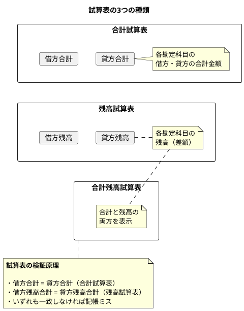
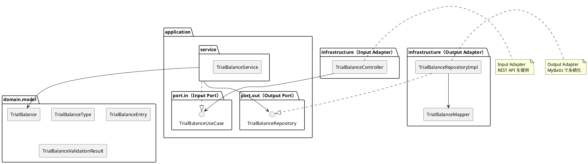
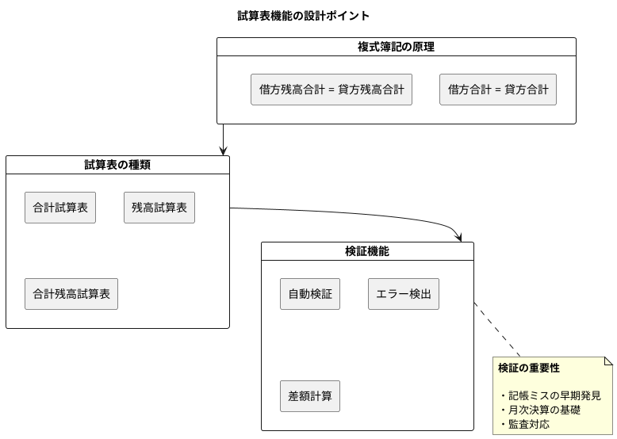

# 第18章: 残高試算表

## 18.1 本章の概要

第6章で設計した日次勘定科目残高テーブルと試算表ビューを基に、残高試算表の生成と検証機能をヘキサゴナルアーキテクチャに従い、TDD で実装します。

### 試算表とは

試算表（Trial Balance）は、一定期間のすべての勘定科目の残高を一覧にした検証表です。複式簿記の原理「借方合計 = 貸方合計」を確認するために使用されます。



### 試算表の種類と用途

| 種類 | 特徴 | 用途 |
|------|------|------|
| 合計試算表 | 借方・貸方の合計金額を表示 | 取引量の把握 |
| 残高試算表 | 各科目の残高（差額）を表示 | 財務諸表作成の基礎 |
| 合計残高試算表 | 合計と残高の両方を表示 | 最も一般的、詳細な検証 |

### アーキテクチャの全体像



### パッケージ構成

```
com.example.accounting/
├── domain/
│   └── model/
│       └── trialbalance/
│           ├── TrialBalanceType.java      # 試算表種別
│           ├── TrialBalanceEntry.java     # 試算表明細
│           ├── TrialBalance.java          # 試算表
│           └── TrialBalanceValidationResult.java  # 検証結果
├── application/
│   ├── port/
│   │   ├── in/
│   │   │   └── TrialBalanceUseCase.java   # Input Port
│   │   └── out/
│   │       └── TrialBalanceRepository.java # Output Port
│   └── service/
│       └── TrialBalanceService.java       # Application Service
└── infrastructure/
    ├── persistence/
    │   ├── mapper/
    │   │   └── TrialBalanceMapper.java    # MyBatis Mapper
    │   └── repository/
    │       └── TrialBalanceRepositoryImpl.java  # Output Adapter
    └── web/
        ├── controller/
        │   └── TrialBalanceController.java # Input Adapter
        └── dto/
            ├── TrialBalanceRequest.java
            └── TrialBalanceResponse.java
```

### TDD の流れ

1. **Domain Model**: ドメインモデルの作成（TrialBalanceType, TrialBalanceEntry, TrialBalance）
2. **Output Port**: リポジトリインターフェースの定義
3. **Output Adapter**: Testcontainers でリポジトリ実装をテスト
4. **Input Port**: ユースケースインターフェースの定義
5. **Application Service**: Mockito でアプリケーションサービスをテスト
6. **Input Adapter**: Testcontainers で REST API 統合テスト

---

## 18.2 Domain Model の実装

### 18.2.1 TrialBalanceType 列挙型

```java
package com.example.accounting.domain.model.trialbalance;

/**
 * 試算表種別
 */
public enum TrialBalanceType {
    TOTAL("合計試算表", "借方・貸方の合計金額を表示"),
    BALANCE("残高試算表", "各科目の残高（差額）を表示"),
    COMBINED("合計残高試算表", "合計と残高の両方を表示");

    private final String displayName;
    private final String description;

    TrialBalanceType(String displayName, String description) {
        this.displayName = displayName;
        this.description = description;
    }

    public String getDisplayName() {
        return displayName;
    }

    public String getDescription() {
        return description;
    }

    /**
     * 合計を表示するか
     */
    public boolean showsTotal() {
        return this == TOTAL || this == COMBINED;
    }

    /**
     * 残高を表示するか
     */
    public boolean showsBalance() {
        return this == BALANCE || this == COMBINED;
    }
}
```

### 18.2.2 TrialBalanceEntry ドメインモデル

```java
package com.example.accounting.domain.model.trialbalance;

import lombok.Value;
import lombok.With;

import java.math.BigDecimal;

/**
 * 試算表明細（1行分）
 */
@Value
@With
public class TrialBalanceEntry {

    String accountCode;           // 勘定科目コード
    String accountName;           // 勘定科目名
    String bsplType;              // BSPL区分（B=貸借対照表, P=損益計算書）
    String debitCreditType;       // 貸借区分（借/貸）
    BigDecimal debitTotal;        // 借方合計
    BigDecimal creditTotal;       // 貸方合計
    BigDecimal debitBalance;      // 借方残高
    BigDecimal creditBalance;     // 貸方残高

    /**
     * 日次残高データから試算表明細を作成
     */
    public static TrialBalanceEntry create(
            String accountCode,
            String accountName,
            String bsplType,
            String debitCreditType,
            BigDecimal debitTotal,
            BigDecimal creditTotal) {

        // 貸借区分に基づいて残高を計算
        BigDecimal debitBalance;
        BigDecimal creditBalance;

        if ("借".equals(debitCreditType)) {
            // 借方科目: 借方 - 貸方 が残高
            BigDecimal balance = debitTotal.subtract(creditTotal);
            if (balance.compareTo(BigDecimal.ZERO) >= 0) {
                debitBalance = balance;
                creditBalance = BigDecimal.ZERO;
            } else {
                debitBalance = BigDecimal.ZERO;
                creditBalance = balance.negate();
            }
        } else {
            // 貸方科目: 貸方 - 借方 が残高
            BigDecimal balance = creditTotal.subtract(debitTotal);
            if (balance.compareTo(BigDecimal.ZERO) >= 0) {
                debitBalance = BigDecimal.ZERO;
                creditBalance = balance;
            } else {
                debitBalance = balance.negate();
                creditBalance = BigDecimal.ZERO;
            }
        }

        return new TrialBalanceEntry(
                accountCode,
                accountName,
                bsplType,
                debitCreditType,
                debitTotal,
                creditTotal,
                debitBalance,
                creditBalance);
    }

    /**
     * B/S 科目か
     */
    public boolean isBalanceSheetAccount() {
        return "B".equals(bsplType);
    }

    /**
     * P/L 科目か
     */
    public boolean isProfitAndLossAccount() {
        return "P".equals(bsplType);
    }

    /**
     * 借方科目か
     */
    public boolean isDebitAccount() {
        return "借".equals(debitCreditType);
    }

    /**
     * 貸方科目か
     */
    public boolean isCreditAccount() {
        return "貸".equals(debitCreditType);
    }

    /**
     * 取引があるか（合計がゼロでないか）
     */
    public boolean hasTransaction() {
        return debitTotal.compareTo(BigDecimal.ZERO) != 0
                || creditTotal.compareTo(BigDecimal.ZERO) != 0;
    }

    /**
     * 残高がゼロか
     */
    public boolean hasZeroBalance() {
        return debitBalance.compareTo(BigDecimal.ZERO) == 0
                && creditBalance.compareTo(BigDecimal.ZERO) == 0;
    }
}
```

### 18.2.3 TrialBalanceValidationResult ドメインモデル

```java
package com.example.accounting.domain.model.trialbalance;

import lombok.Value;

import java.math.BigDecimal;
import java.util.ArrayList;
import java.util.List;

/**
 * 試算表検証結果
 */
@Value
public class TrialBalanceValidationResult {

    boolean valid;                    // 検証結果
    BigDecimal totalDebit;            // 借方合計
    BigDecimal totalCredit;           // 貸方合計
    BigDecimal debitBalanceSum;       // 借方残高合計
    BigDecimal creditBalanceSum;      // 貸方残高合計
    BigDecimal totalDifference;       // 合計差額
    BigDecimal balanceDifference;     // 残高差額
    List<String> errors;              // エラーメッセージ

    /**
     * 検証成功の結果を作成
     */
    public static TrialBalanceValidationResult success(
            BigDecimal totalDebit,
            BigDecimal totalCredit,
            BigDecimal debitBalanceSum,
            BigDecimal creditBalanceSum) {

        return new TrialBalanceValidationResult(
                true,
                totalDebit,
                totalCredit,
                debitBalanceSum,
                creditBalanceSum,
                BigDecimal.ZERO,
                BigDecimal.ZERO,
                List.of());
    }

    /**
     * 検証失敗の結果を作成
     */
    public static TrialBalanceValidationResult failure(
            BigDecimal totalDebit,
            BigDecimal totalCredit,
            BigDecimal debitBalanceSum,
            BigDecimal creditBalanceSum,
            List<String> errors) {

        return new TrialBalanceValidationResult(
                false,
                totalDebit,
                totalCredit,
                debitBalanceSum,
                creditBalanceSum,
                totalDebit.subtract(totalCredit).abs(),
                debitBalanceSum.subtract(creditBalanceSum).abs(),
                errors);
    }

    /**
     * 検証を実行
     */
    public static TrialBalanceValidationResult validate(
            BigDecimal totalDebit,
            BigDecimal totalCredit,
            BigDecimal debitBalanceSum,
            BigDecimal creditBalanceSum) {

        List<String> errors = new ArrayList<>();

        // 借方合計 = 貸方合計の検証
        if (totalDebit.compareTo(totalCredit) != 0) {
            errors.add(String.format(
                    "合計試算表の検証エラー: 借方合計(%s) ≠ 貸方合計(%s)",
                    totalDebit, totalCredit));
        }

        // 借方残高合計 = 貸方残高合計の検証
        if (debitBalanceSum.compareTo(creditBalanceSum) != 0) {
            errors.add(String.format(
                    "残高試算表の検証エラー: 借方残高合計(%s) ≠ 貸方残高合計(%s)",
                    debitBalanceSum, creditBalanceSum));
        }

        if (errors.isEmpty()) {
            return success(totalDebit, totalCredit, debitBalanceSum, creditBalanceSum);
        } else {
            return failure(totalDebit, totalCredit, debitBalanceSum, creditBalanceSum, errors);
        }
    }
}
```

### 18.2.4 TrialBalance ドメインモデル

```java
package com.example.accounting.domain.model.trialbalance;

import lombok.Value;
import lombok.With;

import java.math.BigDecimal;
import java.time.LocalDate;
import java.util.List;
import java.util.stream.Collectors;

/**
 * 試算表ドメインモデル
 */
@Value
@With
public class TrialBalance {

    LocalDate asOfDate;                    // 基準日
    Integer fiscalYear;                    // 会計年度
    TrialBalanceType type;                 // 試算表種別
    List<TrialBalanceEntry> entries;       // 明細
    TrialBalanceValidationResult validationResult;  // 検証結果

    /**
     * 試算表を作成し検証
     */
    public static TrialBalance create(
            LocalDate asOfDate,
            Integer fiscalYear,
            TrialBalanceType type,
            List<TrialBalanceEntry> entries) {

        // 集計
        BigDecimal totalDebit = entries.stream()
                .map(TrialBalanceEntry::getDebitTotal)
                .reduce(BigDecimal.ZERO, BigDecimal::add);

        BigDecimal totalCredit = entries.stream()
                .map(TrialBalanceEntry::getCreditTotal)
                .reduce(BigDecimal.ZERO, BigDecimal::add);

        BigDecimal debitBalanceSum = entries.stream()
                .map(TrialBalanceEntry::getDebitBalance)
                .reduce(BigDecimal.ZERO, BigDecimal::add);

        BigDecimal creditBalanceSum = entries.stream()
                .map(TrialBalanceEntry::getCreditBalance)
                .reduce(BigDecimal.ZERO, BigDecimal::add);

        // 検証
        TrialBalanceValidationResult validationResult =
                TrialBalanceValidationResult.validate(
                        totalDebit, totalCredit,
                        debitBalanceSum, creditBalanceSum);

        return new TrialBalance(asOfDate, fiscalYear, type, entries, validationResult);
    }

    /**
     * B/S 科目のみ取得
     */
    public List<TrialBalanceEntry> getBalanceSheetEntries() {
        return entries.stream()
                .filter(TrialBalanceEntry::isBalanceSheetAccount)
                .collect(Collectors.toList());
    }

    /**
     * P/L 科目のみ取得
     */
    public List<TrialBalanceEntry> getProfitAndLossEntries() {
        return entries.stream()
                .filter(TrialBalanceEntry::isProfitAndLossAccount)
                .collect(Collectors.toList());
    }

    /**
     * 取引のある科目のみ取得
     */
    public List<TrialBalanceEntry> getEntriesWithTransactions() {
        return entries.stream()
                .filter(TrialBalanceEntry::hasTransaction)
                .collect(Collectors.toList());
    }

    /**
     * 借方合計を取得
     */
    public BigDecimal getTotalDebit() {
        return validationResult.getTotalDebit();
    }

    /**
     * 貸方合計を取得
     */
    public BigDecimal getTotalCredit() {
        return validationResult.getTotalCredit();
    }

    /**
     * 借方残高合計を取得
     */
    public BigDecimal getDebitBalanceSum() {
        return validationResult.getDebitBalanceSum();
    }

    /**
     * 貸方残高合計を取得
     */
    public BigDecimal getCreditBalanceSum() {
        return validationResult.getCreditBalanceSum();
    }

    /**
     * 検証が成功したか
     */
    public boolean isValid() {
        return validationResult.isValid();
    }

    /**
     * 検証エラーを取得
     */
    public List<String> getValidationErrors() {
        return validationResult.getErrors();
    }

    /**
     * 科目数を取得
     */
    public int getAccountCount() {
        return entries.size();
    }

    /**
     * 取引のある科目数を取得
     */
    public int getActiveAccountCount() {
        return (int) entries.stream()
                .filter(TrialBalanceEntry::hasTransaction)
                .count();
    }
}
```

---

## 18.3 Domain Model のテスト

### 18.3.1 TrialBalanceType のテスト

```java
package com.example.accounting.domain.model.trialbalance;

import org.junit.jupiter.api.DisplayName;
import org.junit.jupiter.api.Nested;
import org.junit.jupiter.api.Test;

import static org.assertj.core.api.Assertions.assertThat;

@DisplayName("TrialBalanceType（試算表種別）")
class TrialBalanceTypeTest {

    @Nested
    @DisplayName("合計試算表")
    class TotalTrialBalance {

        @Test
        @DisplayName("合計を表示し残高は表示しない")
        void test_合計試算表の表示設定() {
            // Given
            TrialBalanceType type = TrialBalanceType.TOTAL;

            // Then
            assertThat(type.showsTotal()).isTrue();
            assertThat(type.showsBalance()).isFalse();
            assertThat(type.getDisplayName()).isEqualTo("合計試算表");
        }
    }

    @Nested
    @DisplayName("残高試算表")
    class BalanceTrialBalance {

        @Test
        @DisplayName("残高を表示し合計は表示しない")
        void test_残高試算表の表示設定() {
            // Given
            TrialBalanceType type = TrialBalanceType.BALANCE;

            // Then
            assertThat(type.showsTotal()).isFalse();
            assertThat(type.showsBalance()).isTrue();
            assertThat(type.getDisplayName()).isEqualTo("残高試算表");
        }
    }

    @Nested
    @DisplayName("合計残高試算表")
    class CombinedTrialBalance {

        @Test
        @DisplayName("合計と残高の両方を表示")
        void test_合計残高試算表の表示設定() {
            // Given
            TrialBalanceType type = TrialBalanceType.COMBINED;

            // Then
            assertThat(type.showsTotal()).isTrue();
            assertThat(type.showsBalance()).isTrue();
            assertThat(type.getDisplayName()).isEqualTo("合計残高試算表");
        }
    }
}
```

### 18.3.2 TrialBalanceEntry のテスト

```java
package com.example.accounting.domain.model.trialbalance;

import org.junit.jupiter.api.DisplayName;
import org.junit.jupiter.api.Nested;
import org.junit.jupiter.api.Test;

import java.math.BigDecimal;

import static org.assertj.core.api.Assertions.assertThat;

@DisplayName("TrialBalanceEntry（試算表明細）")
class TrialBalanceEntryTest {

    @Nested
    @DisplayName("借方科目の残高計算")
    class DebitAccountBalance {

        @Test
        @DisplayName("借方科目で借方 > 貸方の場合、借方残高が計算される")
        void test_借方科目で借方超過の場合() {
            // Given: 現金（借方科目）借方100,000 貸方30,000
            BigDecimal debitTotal = new BigDecimal("100000");
            BigDecimal creditTotal = new BigDecimal("30000");

            // When
            TrialBalanceEntry entry = TrialBalanceEntry.create(
                    "1110", "現金", "B", "借",
                    debitTotal, creditTotal);

            // Then: 借方残高 70,000、貸方残高 0
            assertThat(entry.getDebitBalance()).isEqualByComparingTo("70000");
            assertThat(entry.getCreditBalance()).isEqualByComparingTo("0");
        }

        @Test
        @DisplayName("借方科目で借方 < 貸方の場合、貸方残高が計算される")
        void test_借方科目で貸方超過の場合() {
            // Given: 現金（借方科目）借方30,000 貸方50,000
            BigDecimal debitTotal = new BigDecimal("30000");
            BigDecimal creditTotal = new BigDecimal("50000");

            // When
            TrialBalanceEntry entry = TrialBalanceEntry.create(
                    "1110", "現金", "B", "借",
                    debitTotal, creditTotal);

            // Then: 借方残高 0、貸方残高 20,000
            assertThat(entry.getDebitBalance()).isEqualByComparingTo("0");
            assertThat(entry.getCreditBalance()).isEqualByComparingTo("20000");
        }
    }

    @Nested
    @DisplayName("貸方科目の残高計算")
    class CreditAccountBalance {

        @Test
        @DisplayName("貸方科目で貸方 > 借方の場合、貸方残高が計算される")
        void test_貸方科目で貸方超過の場合() {
            // Given: 買掛金（貸方科目）借方20,000 貸方80,000
            BigDecimal debitTotal = new BigDecimal("20000");
            BigDecimal creditTotal = new BigDecimal("80000");

            // When
            TrialBalanceEntry entry = TrialBalanceEntry.create(
                    "2110", "買掛金", "B", "貸",
                    debitTotal, creditTotal);

            // Then: 借方残高 0、貸方残高 60,000
            assertThat(entry.getDebitBalance()).isEqualByComparingTo("0");
            assertThat(entry.getCreditBalance()).isEqualByComparingTo("60000");
        }

        @Test
        @DisplayName("貸方科目で借方 > 貸方の場合、借方残高が計算される")
        void test_貸方科目で借方超過の場合() {
            // Given: 買掛金（貸方科目）借方100,000 貸方60,000
            BigDecimal debitTotal = new BigDecimal("100000");
            BigDecimal creditTotal = new BigDecimal("60000");

            // When
            TrialBalanceEntry entry = TrialBalanceEntry.create(
                    "2110", "買掛金", "B", "貸",
                    debitTotal, creditTotal);

            // Then: 借方残高 40,000、貸方残高 0
            assertThat(entry.getDebitBalance()).isEqualByComparingTo("40000");
            assertThat(entry.getCreditBalance()).isEqualByComparingTo("0");
        }
    }

    @Nested
    @DisplayName("科目区分の判定")
    class AccountTypeJudgment {

        @Test
        @DisplayName("B/S科目かどうかを判定できる")
        void test_BS科目の判定() {
            // Given
            TrialBalanceEntry bsEntry = TrialBalanceEntry.create(
                    "1110", "現金", "B", "借",
                    BigDecimal.ZERO, BigDecimal.ZERO);
            TrialBalanceEntry plEntry = TrialBalanceEntry.create(
                    "4110", "売上高", "P", "貸",
                    BigDecimal.ZERO, BigDecimal.ZERO);

            // Then
            assertThat(bsEntry.isBalanceSheetAccount()).isTrue();
            assertThat(bsEntry.isProfitAndLossAccount()).isFalse();
            assertThat(plEntry.isBalanceSheetAccount()).isFalse();
            assertThat(plEntry.isProfitAndLossAccount()).isTrue();
        }

        @Test
        @DisplayName("取引の有無を判定できる")
        void test_取引の有無判定() {
            // Given
            TrialBalanceEntry withTransaction = TrialBalanceEntry.create(
                    "1110", "現金", "B", "借",
                    new BigDecimal("100000"), BigDecimal.ZERO);
            TrialBalanceEntry noTransaction = TrialBalanceEntry.create(
                    "1120", "小口現金", "B", "借",
                    BigDecimal.ZERO, BigDecimal.ZERO);

            // Then
            assertThat(withTransaction.hasTransaction()).isTrue();
            assertThat(noTransaction.hasTransaction()).isFalse();
        }
    }
}
```

### 18.3.3 TrialBalance のテスト

```java
package com.example.accounting.domain.model.trialbalance;

import org.junit.jupiter.api.DisplayName;
import org.junit.jupiter.api.Nested;
import org.junit.jupiter.api.Test;

import java.math.BigDecimal;
import java.time.LocalDate;
import java.util.List;

import static org.assertj.core.api.Assertions.assertThat;

@DisplayName("TrialBalance（試算表）")
class TrialBalanceTest {

    @Nested
    @DisplayName("試算表の作成と検証")
    class CreateAndValidate {

        @Test
        @DisplayName("貸借が一致する試算表は検証成功")
        void test_貸借一致の試算表() {
            // Given: 借方合計 = 貸方合計 = 200,000
            List<TrialBalanceEntry> entries = List.of(
                    // 現金: 借方 200,000
                    TrialBalanceEntry.create(
                            "1110", "現金", "B", "借",
                            new BigDecimal("200000"), BigDecimal.ZERO),
                    // 売上高: 貸方 200,000
                    TrialBalanceEntry.create(
                            "4110", "売上高", "P", "貸",
                            BigDecimal.ZERO, new BigDecimal("200000"))
            );

            // When
            TrialBalance trialBalance = TrialBalance.create(
                    LocalDate.of(2025, 3, 31),
                    2024,
                    TrialBalanceType.COMBINED,
                    entries);

            // Then
            assertThat(trialBalance.isValid()).isTrue();
            assertThat(trialBalance.getTotalDebit()).isEqualByComparingTo("200000");
            assertThat(trialBalance.getTotalCredit()).isEqualByComparingTo("200000");
            assertThat(trialBalance.getDebitBalanceSum()).isEqualByComparingTo("200000");
            assertThat(trialBalance.getCreditBalanceSum()).isEqualByComparingTo("200000");
        }

        @Test
        @DisplayName("貸借が不一致の試算表は検証失敗")
        void test_貸借不一致の試算表() {
            // Given: 借方合計 200,000 ≠ 貸方合計 150,000
            List<TrialBalanceEntry> entries = List.of(
                    TrialBalanceEntry.create(
                            "1110", "現金", "B", "借",
                            new BigDecimal("200000"), BigDecimal.ZERO),
                    TrialBalanceEntry.create(
                            "4110", "売上高", "P", "貸",
                            BigDecimal.ZERO, new BigDecimal("150000"))
            );

            // When
            TrialBalance trialBalance = TrialBalance.create(
                    LocalDate.of(2025, 3, 31),
                    2024,
                    TrialBalanceType.COMBINED,
                    entries);

            // Then
            assertThat(trialBalance.isValid()).isFalse();
            assertThat(trialBalance.getValidationErrors()).hasSize(2);
            assertThat(trialBalance.getValidationErrors().get(0))
                    .contains("合計試算表の検証エラー");
            assertThat(trialBalance.getValidationErrors().get(1))
                    .contains("残高試算表の検証エラー");
        }
    }

    @Nested
    @DisplayName("試算表のフィルタリング")
    class Filtering {

        @Test
        @DisplayName("B/S科目のみ取得できる")
        void test_BS科目のフィルタリング() {
            // Given
            List<TrialBalanceEntry> entries = List.of(
                    TrialBalanceEntry.create("1110", "現金", "B", "借",
                            new BigDecimal("100000"), BigDecimal.ZERO),
                    TrialBalanceEntry.create("2110", "買掛金", "B", "貸",
                            BigDecimal.ZERO, new BigDecimal("50000")),
                    TrialBalanceEntry.create("4110", "売上高", "P", "貸",
                            BigDecimal.ZERO, new BigDecimal("50000"))
            );

            TrialBalance trialBalance = TrialBalance.create(
                    LocalDate.of(2025, 3, 31), 2024,
                    TrialBalanceType.COMBINED, entries);

            // When
            List<TrialBalanceEntry> bsEntries = trialBalance.getBalanceSheetEntries();

            // Then
            assertThat(bsEntries).hasSize(2);
            assertThat(bsEntries).allMatch(TrialBalanceEntry::isBalanceSheetAccount);
        }

        @Test
        @DisplayName("P/L科目のみ取得できる")
        void test_PL科目のフィルタリング() {
            // Given
            List<TrialBalanceEntry> entries = List.of(
                    TrialBalanceEntry.create("1110", "現金", "B", "借",
                            new BigDecimal("100000"), BigDecimal.ZERO),
                    TrialBalanceEntry.create("4110", "売上高", "P", "貸",
                            BigDecimal.ZERO, new BigDecimal("80000")),
                    TrialBalanceEntry.create("5110", "仕入高", "P", "借",
                            new BigDecimal("20000"), BigDecimal.ZERO)
            );

            TrialBalance trialBalance = TrialBalance.create(
                    LocalDate.of(2025, 3, 31), 2024,
                    TrialBalanceType.COMBINED, entries);

            // When
            List<TrialBalanceEntry> plEntries = trialBalance.getProfitAndLossEntries();

            // Then
            assertThat(plEntries).hasSize(2);
            assertThat(plEntries).allMatch(TrialBalanceEntry::isProfitAndLossAccount);
        }

        @Test
        @DisplayName("取引のある科目のみ取得できる")
        void test_取引のある科目のフィルタリング() {
            // Given
            List<TrialBalanceEntry> entries = List.of(
                    TrialBalanceEntry.create("1110", "現金", "B", "借",
                            new BigDecimal("100000"), BigDecimal.ZERO),
                    TrialBalanceEntry.create("1120", "小口現金", "B", "借",
                            BigDecimal.ZERO, BigDecimal.ZERO),
                    TrialBalanceEntry.create("4110", "売上高", "P", "貸",
                            BigDecimal.ZERO, new BigDecimal("100000"))
            );

            TrialBalance trialBalance = TrialBalance.create(
                    LocalDate.of(2025, 3, 31), 2024,
                    TrialBalanceType.COMBINED, entries);

            // When
            List<TrialBalanceEntry> activeEntries = trialBalance.getEntriesWithTransactions();

            // Then
            assertThat(activeEntries).hasSize(2);
            assertThat(trialBalance.getAccountCount()).isEqualTo(3);
            assertThat(trialBalance.getActiveAccountCount()).isEqualTo(2);
        }
    }

    @Nested
    @DisplayName("複式簿記の検証")
    class DoubleEntryValidation {

        @Test
        @DisplayName("複数科目の取引で貸借が一致する")
        void test_複数科目の貸借一致() {
            // Given: 商品仕入取引
            // 借方: 仕入 50,000、仮払消費税 5,000
            // 貸方: 買掛金 55,000
            List<TrialBalanceEntry> entries = List.of(
                    TrialBalanceEntry.create("5110", "仕入高", "P", "借",
                            new BigDecimal("50000"), BigDecimal.ZERO),
                    TrialBalanceEntry.create("1190", "仮払消費税", "B", "借",
                            new BigDecimal("5000"), BigDecimal.ZERO),
                    TrialBalanceEntry.create("2110", "買掛金", "B", "貸",
                            BigDecimal.ZERO, new BigDecimal("55000"))
            );

            // When
            TrialBalance trialBalance = TrialBalance.create(
                    LocalDate.of(2025, 3, 31), 2024,
                    TrialBalanceType.COMBINED, entries);

            // Then
            assertThat(trialBalance.isValid()).isTrue();
            assertThat(trialBalance.getTotalDebit()).isEqualByComparingTo("55000");
            assertThat(trialBalance.getTotalCredit()).isEqualByComparingTo("55000");
        }
    }
}
```

---

## 18.4 Output Port の定義

### 18.4.1 TrialBalanceRepository インターフェース

```java
package com.example.accounting.application.port.out;

import com.example.accounting.domain.model.trialbalance.TrialBalanceEntry;

import java.time.LocalDate;
import java.util.List;

/**
 * 試算表リポジトリ（Output Port）
 */
public interface TrialBalanceRepository {

    /**
     * 指定日までの試算表データを取得
     *
     * @param asOfDate 基準日
     * @return 試算表明細リスト
     */
    List<TrialBalanceEntry> findAsOf(LocalDate asOfDate);

    /**
     * 指定期間の試算表データを取得
     *
     * @param startDate 開始日
     * @param endDate   終了日
     * @return 試算表明細リスト
     */
    List<TrialBalanceEntry> findByPeriod(LocalDate startDate, LocalDate endDate);

    /**
     * 指定会計年度の試算表データを取得
     *
     * @param fiscalYear 会計年度
     * @return 試算表明細リスト
     */
    List<TrialBalanceEntry> findByFiscalYear(Integer fiscalYear);

    /**
     * B/S科目のみの試算表データを取得
     *
     * @param asOfDate 基準日
     * @return 試算表明細リスト
     */
    List<TrialBalanceEntry> findBalanceSheetAccountsAsOf(LocalDate asOfDate);

    /**
     * P/L科目のみの試算表データを取得
     *
     * @param startDate 開始日
     * @param endDate   終了日
     * @return 試算表明細リスト
     */
    List<TrialBalanceEntry> findProfitAndLossAccountsByPeriod(LocalDate startDate, LocalDate endDate);
}
```

---

## 18.5 Output Adapter の実装

### 18.5.1 TrialBalanceMapper インターフェース

```java
package com.example.accounting.infrastructure.persistence.mapper;

import com.example.accounting.domain.model.trialbalance.TrialBalanceEntry;
import org.apache.ibatis.annotations.Mapper;
import org.apache.ibatis.annotations.Param;

import java.time.LocalDate;
import java.util.List;

/**
 * 試算表 MyBatis Mapper
 */
@Mapper
public interface TrialBalanceMapper {

    /**
     * 指定日までの試算表データを取得
     */
    List<TrialBalanceEntry> selectAsOf(@Param("asOfDate") LocalDate asOfDate);

    /**
     * 指定期間の試算表データを取得
     */
    List<TrialBalanceEntry> selectByPeriod(
            @Param("startDate") LocalDate startDate,
            @Param("endDate") LocalDate endDate);

    /**
     * 指定会計年度の試算表データを取得
     */
    List<TrialBalanceEntry> selectByFiscalYear(@Param("fiscalYear") Integer fiscalYear);

    /**
     * B/S科目のみの試算表データを取得
     */
    List<TrialBalanceEntry> selectBalanceSheetAccountsAsOf(@Param("asOfDate") LocalDate asOfDate);

    /**
     * P/L科目のみの試算表データを取得
     */
    List<TrialBalanceEntry> selectProfitAndLossAccountsByPeriod(
            @Param("startDate") LocalDate startDate,
            @Param("endDate") LocalDate endDate);
}
```

### 18.5.2 MyBatis Mapper XML

`src/main/resources/mapper/TrialBalanceMapper.xml`:

```xml
<?xml version="1.0" encoding="UTF-8" ?>
<!DOCTYPE mapper PUBLIC "-//mybatis.org//DTD Mapper 3.0//EN"
        "http://mybatis.org/dtd/mybatis-3-mapper.dtd">

<mapper namespace="com.example.accounting.infrastructure.persistence.mapper.TrialBalanceMapper">

    <!-- 結果マッピング -->
    <resultMap id="trialBalanceEntryResult" type="com.example.accounting.domain.model.trialbalance.TrialBalanceEntry">
        <constructor>
            <arg column="account_code" javaType="String"/>
            <arg column="account_name" javaType="String"/>
            <arg column="bspl_type" javaType="String"/>
            <arg column="debit_credit_type" javaType="String"/>
            <arg column="debit_total" javaType="java.math.BigDecimal"/>
            <arg column="credit_total" javaType="java.math.BigDecimal"/>
            <arg column="debit_balance" javaType="java.math.BigDecimal"/>
            <arg column="credit_balance" javaType="java.math.BigDecimal"/>
        </constructor>
    </resultMap>

    <!-- 試算表ベースクエリ -->
    <sql id="trialBalanceBase">
        SELECT
            a."勘定科目コード" as account_code,
            a."勘定科目名" as account_name,
            a."BSPL区分" as bspl_type,
            a."貸借区分" as debit_credit_type,
            COALESCE(SUM(d."借方金額"), 0) as debit_total,
            COALESCE(SUM(d."貸方金額"), 0) as credit_total,
            CASE
                WHEN a."貸借区分" = '借' THEN
                    CASE
                        WHEN COALESCE(SUM(d."借方金額"), 0) >= COALESCE(SUM(d."貸方金額"), 0)
                        THEN COALESCE(SUM(d."借方金額"), 0) - COALESCE(SUM(d."貸方金額"), 0)
                        ELSE 0
                    END
                ELSE
                    CASE
                        WHEN COALESCE(SUM(d."借方金額"), 0) > COALESCE(SUM(d."貸方金額"), 0)
                        THEN COALESCE(SUM(d."借方金額"), 0) - COALESCE(SUM(d."貸方金額"), 0)
                        ELSE 0
                    END
            END as debit_balance,
            CASE
                WHEN a."貸借区分" = '貸' THEN
                    CASE
                        WHEN COALESCE(SUM(d."貸方金額"), 0) >= COALESCE(SUM(d."借方金額"), 0)
                        THEN COALESCE(SUM(d."貸方金額"), 0) - COALESCE(SUM(d."借方金額"), 0)
                        ELSE 0
                    END
                ELSE
                    CASE
                        WHEN COALESCE(SUM(d."貸方金額"), 0) > COALESCE(SUM(d."借方金額"), 0)
                        THEN COALESCE(SUM(d."貸方金額"), 0) - COALESCE(SUM(d."借方金額"), 0)
                        ELSE 0
                    END
            END as credit_balance
        FROM "勘定科目マスタ" a
        LEFT JOIN "日次勘定科目残高" d
            ON a."勘定科目コード" = d."勘定科目コード"
            AND d."決算仕訳フラグ" = 0
    </sql>

    <!-- 指定日までの試算表 -->
    <select id="selectAsOf" resultMap="trialBalanceEntryResult">
        <include refid="trialBalanceBase"/>
            AND d."起票日" &lt;= #{asOfDate}
        GROUP BY a."勘定科目コード", a."勘定科目名", a."BSPL区分", a."貸借区分"
        ORDER BY a."勘定科目コード"
    </select>

    <!-- 指定期間の試算表 -->
    <select id="selectByPeriod" resultMap="trialBalanceEntryResult">
        <include refid="trialBalanceBase"/>
            AND d."起票日" BETWEEN #{startDate} AND #{endDate}
        GROUP BY a."勘定科目コード", a."勘定科目名", a."BSPL区分", a."貸借区分"
        ORDER BY a."勘定科目コード"
    </select>

    <!-- 指定会計年度の試算表 -->
    <select id="selectByFiscalYear" resultMap="trialBalanceEntryResult">
        <include refid="trialBalanceBase"/>
            AND d."起票日" BETWEEN
                MAKE_DATE(#{fiscalYear}, 4, 1) AND MAKE_DATE(#{fiscalYear} + 1, 3, 31)
        GROUP BY a."勘定科目コード", a."勘定科目名", a."BSPL区分", a."貸借区分"
        ORDER BY a."勘定科目コード"
    </select>

    <!-- B/S科目のみ -->
    <select id="selectBalanceSheetAccountsAsOf" resultMap="trialBalanceEntryResult">
        <include refid="trialBalanceBase"/>
            AND d."起票日" &lt;= #{asOfDate}
        WHERE a."BSPL区分" = 'B'
        GROUP BY a."勘定科目コード", a."勘定科目名", a."BSPL区分", a."貸借区分"
        ORDER BY a."勘定科目コード"
    </select>

    <!-- P/L科目のみ -->
    <select id="selectProfitAndLossAccountsByPeriod" resultMap="trialBalanceEntryResult">
        <include refid="trialBalanceBase"/>
            AND d."起票日" BETWEEN #{startDate} AND #{endDate}
        WHERE a."BSPL区分" = 'P'
        GROUP BY a."勘定科目コード", a."勘定科目名", a."BSPL区分", a."貸借区分"
        ORDER BY a."勘定科目コード"
    </select>

</mapper>
```

### 18.5.3 TrialBalanceRepositoryImpl

```java
package com.example.accounting.infrastructure.persistence.repository;

import com.example.accounting.application.port.out.TrialBalanceRepository;
import com.example.accounting.domain.model.trialbalance.TrialBalanceEntry;
import com.example.accounting.infrastructure.persistence.mapper.TrialBalanceMapper;
import lombok.RequiredArgsConstructor;
import org.springframework.stereotype.Repository;

import java.time.LocalDate;
import java.util.List;

/**
 * 試算表リポジトリ実装（Output Adapter）
 */
@Repository
@RequiredArgsConstructor
public class TrialBalanceRepositoryImpl implements TrialBalanceRepository {

    private final TrialBalanceMapper mapper;

    @Override
    public List<TrialBalanceEntry> findAsOf(LocalDate asOfDate) {
        return mapper.selectAsOf(asOfDate);
    }

    @Override
    public List<TrialBalanceEntry> findByPeriod(LocalDate startDate, LocalDate endDate) {
        return mapper.selectByPeriod(startDate, endDate);
    }

    @Override
    public List<TrialBalanceEntry> findByFiscalYear(Integer fiscalYear) {
        return mapper.selectByFiscalYear(fiscalYear);
    }

    @Override
    public List<TrialBalanceEntry> findBalanceSheetAccountsAsOf(LocalDate asOfDate) {
        return mapper.selectBalanceSheetAccountsAsOf(asOfDate);
    }

    @Override
    public List<TrialBalanceEntry> findProfitAndLossAccountsByPeriod(LocalDate startDate, LocalDate endDate) {
        return mapper.selectProfitAndLossAccountsByPeriod(startDate, endDate);
    }
}
```

---

## 18.6 Output Adapter のテスト

### 18.6.1 Testcontainers を使った統合テスト

```java
package com.example.accounting.infrastructure.persistence.repository;

import com.example.accounting.domain.model.trialbalance.TrialBalanceEntry;
import org.junit.jupiter.api.BeforeEach;
import org.junit.jupiter.api.DisplayName;
import org.junit.jupiter.api.Nested;
import org.junit.jupiter.api.Test;
import org.mybatis.spring.boot.test.autoconfigure.MybatisTest;
import org.springframework.beans.factory.annotation.Autowired;
import org.springframework.boot.test.autoconfigure.jdbc.AutoConfigureTestDatabase;
import org.springframework.context.annotation.Import;
import org.springframework.jdbc.core.JdbcTemplate;
import org.springframework.test.context.DynamicPropertyRegistry;
import org.springframework.test.context.DynamicPropertySource;
import org.testcontainers.containers.PostgreSQLContainer;
import org.testcontainers.junit.jupiter.Container;
import org.testcontainers.junit.jupiter.Testcontainers;

import java.math.BigDecimal;
import java.time.LocalDate;
import java.util.List;

import static org.assertj.core.api.Assertions.assertThat;

@MybatisTest
@Testcontainers
@AutoConfigureTestDatabase(replace = AutoConfigureTestDatabase.Replace.NONE)
@Import(TrialBalanceRepositoryImpl.class)
@DisplayName("TrialBalanceRepositoryImpl（試算表リポジトリ）")
class TrialBalanceRepositoryImplTest {

    @Container
    static PostgreSQLContainer<?> postgres = new PostgreSQLContainer<>("postgres:15")
            .withDatabaseName("testdb")
            .withUsername("test")
            .withPassword("test");

    @DynamicPropertySource
    static void configureProperties(DynamicPropertyRegistry registry) {
        registry.add("spring.datasource.url", postgres::getJdbcUrl);
        registry.add("spring.datasource.username", postgres::getUsername);
        registry.add("spring.datasource.password", postgres::getPassword);
    }

    @Autowired
    private TrialBalanceRepositoryImpl repository;

    @Autowired
    private JdbcTemplate jdbcTemplate;

    @BeforeEach
    void setUp() {
        // テストデータのセットアップ
        setupTestData();
    }

    private void setupTestData() {
        // 勘定科目マスタ
        jdbcTemplate.execute("""
            INSERT INTO "勘定科目マスタ" ("勘定科目コード", "勘定科目名", "BSPL区分", "貸借区分", "表示順")
            VALUES
                ('1110', '現金', 'B', '借', 1),
                ('1130', '売掛金', 'B', '借', 2),
                ('2110', '買掛金', 'B', '貸', 3),
                ('4110', '売上高', 'P', '貸', 4),
                ('5110', '仕入高', 'P', '借', 5)
            ON CONFLICT DO NOTHING
        """);

        // 日次勘定科目残高
        jdbcTemplate.execute("""
            INSERT INTO "日次勘定科目残高"
                ("起票日", "勘定科目コード", "補助科目コード", "部門コード",
                 "プロジェクトコード", "決算仕訳フラグ", "借方金額", "貸方金額")
            VALUES
                ('2025-01-15', '1110', '', '', '', 0, 100000, 0),
                ('2025-01-20', '1130', '', '', '', 0, 50000, 0),
                ('2025-01-20', '4110', '', '', '', 0, 0, 150000),
                ('2025-02-10', '5110', '', '', '', 0, 80000, 0),
                ('2025-02-10', '2110', '', '', '', 0, 0, 80000)
            ON CONFLICT DO NOTHING
        """);
    }

    @Nested
    @DisplayName("基準日指定での試算表取得")
    class FindAsOf {

        @Test
        @DisplayName("指定日までの残高を集計できる")
        void test_指定日までの残高集計() {
            // Given
            LocalDate asOfDate = LocalDate.of(2025, 1, 31);

            // When
            List<TrialBalanceEntry> entries = repository.findAsOf(asOfDate);

            // Then: 1月末時点の残高
            assertThat(entries).isNotEmpty();

            TrialBalanceEntry cashEntry = entries.stream()
                    .filter(e -> "1110".equals(e.getAccountCode()))
                    .findFirst()
                    .orElseThrow();

            assertThat(cashEntry.getDebitTotal()).isEqualByComparingTo("100000");
            assertThat(cashEntry.getCreditTotal()).isEqualByComparingTo("0");
        }
    }

    @Nested
    @DisplayName("期間指定での試算表取得")
    class FindByPeriod {

        @Test
        @DisplayName("指定期間の取引を集計できる")
        void test_期間指定の残高集計() {
            // Given
            LocalDate startDate = LocalDate.of(2025, 2, 1);
            LocalDate endDate = LocalDate.of(2025, 2, 28);

            // When
            List<TrialBalanceEntry> entries = repository.findByPeriod(startDate, endDate);

            // Then: 2月の取引のみ
            TrialBalanceEntry purchaseEntry = entries.stream()
                    .filter(e -> "5110".equals(e.getAccountCode()))
                    .findFirst()
                    .orElseThrow();

            assertThat(purchaseEntry.getDebitTotal()).isEqualByComparingTo("80000");
        }
    }

    @Nested
    @DisplayName("B/S・P/L科目のフィルタリング")
    class FilterByBspl {

        @Test
        @DisplayName("B/S科目のみ取得できる")
        void test_BS科目のみ取得() {
            // Given
            LocalDate asOfDate = LocalDate.of(2025, 2, 28);

            // When
            List<TrialBalanceEntry> entries = repository.findBalanceSheetAccountsAsOf(asOfDate);

            // Then
            assertThat(entries)
                    .isNotEmpty()
                    .allMatch(TrialBalanceEntry::isBalanceSheetAccount);
        }

        @Test
        @DisplayName("P/L科目のみ取得できる")
        void test_PL科目のみ取得() {
            // Given
            LocalDate startDate = LocalDate.of(2025, 1, 1);
            LocalDate endDate = LocalDate.of(2025, 2, 28);

            // When
            List<TrialBalanceEntry> entries =
                    repository.findProfitAndLossAccountsByPeriod(startDate, endDate);

            // Then
            assertThat(entries)
                    .isNotEmpty()
                    .allMatch(TrialBalanceEntry::isProfitAndLossAccount);
        }
    }
}
```

---

## 18.7 Input Port の定義

### 18.7.1 TrialBalanceUseCase インターフェース

```java
package com.example.accounting.application.port.in;

import com.example.accounting.domain.model.trialbalance.TrialBalance;
import com.example.accounting.domain.model.trialbalance.TrialBalanceType;
import com.example.accounting.domain.model.trialbalance.TrialBalanceValidationResult;

import java.time.LocalDate;

/**
 * 試算表ユースケース（Input Port）
 */
public interface TrialBalanceUseCase {

    /**
     * 指定日時点の試算表を生成
     *
     * @param asOfDate 基準日
     * @param type     試算表種別
     * @return 試算表
     */
    TrialBalance generateAsOf(LocalDate asOfDate, TrialBalanceType type);

    /**
     * 指定期間の試算表を生成
     *
     * @param startDate  開始日
     * @param endDate    終了日
     * @param type       試算表種別
     * @return 試算表
     */
    TrialBalance generateByPeriod(LocalDate startDate, LocalDate endDate, TrialBalanceType type);

    /**
     * 指定会計年度の試算表を生成
     *
     * @param fiscalYear 会計年度
     * @param type       試算表種別
     * @return 試算表
     */
    TrialBalance generateByFiscalYear(Integer fiscalYear, TrialBalanceType type);

    /**
     * 試算表の検証を実行
     *
     * @param asOfDate 基準日
     * @return 検証結果
     */
    TrialBalanceValidationResult validate(LocalDate asOfDate);

    /**
     * 指定期間の試算表検証を実行
     *
     * @param startDate 開始日
     * @param endDate   終了日
     * @return 検証結果
     */
    TrialBalanceValidationResult validateByPeriod(LocalDate startDate, LocalDate endDate);
}
```

---

## 18.8 Application Service の実装

### 18.8.1 TrialBalanceService

```java
package com.example.accounting.application.service;

import com.example.accounting.application.port.in.TrialBalanceUseCase;
import com.example.accounting.application.port.out.TrialBalanceRepository;
import com.example.accounting.domain.model.trialbalance.*;
import lombok.RequiredArgsConstructor;
import org.springframework.stereotype.Service;
import org.springframework.transaction.annotation.Transactional;

import java.time.LocalDate;
import java.util.List;

/**
 * 試算表アプリケーションサービス
 */
@Service
@RequiredArgsConstructor
@Transactional(readOnly = true)
public class TrialBalanceService implements TrialBalanceUseCase {

    private final TrialBalanceRepository trialBalanceRepository;

    @Override
    public TrialBalance generateAsOf(LocalDate asOfDate, TrialBalanceType type) {
        List<TrialBalanceEntry> entries = trialBalanceRepository.findAsOf(asOfDate);
        return TrialBalance.create(asOfDate, getFiscalYear(asOfDate), type, entries);
    }

    @Override
    public TrialBalance generateByPeriod(LocalDate startDate, LocalDate endDate, TrialBalanceType type) {
        List<TrialBalanceEntry> entries = trialBalanceRepository.findByPeriod(startDate, endDate);
        return TrialBalance.create(endDate, getFiscalYear(endDate), type, entries);
    }

    @Override
    public TrialBalance generateByFiscalYear(Integer fiscalYear, TrialBalanceType type) {
        List<TrialBalanceEntry> entries = trialBalanceRepository.findByFiscalYear(fiscalYear);
        LocalDate fiscalYearEnd = LocalDate.of(fiscalYear + 1, 3, 31);
        return TrialBalance.create(fiscalYearEnd, fiscalYear, type, entries);
    }

    @Override
    public TrialBalanceValidationResult validate(LocalDate asOfDate) {
        TrialBalance trialBalance = generateAsOf(asOfDate, TrialBalanceType.COMBINED);
        return trialBalance.getValidationResult();
    }

    @Override
    public TrialBalanceValidationResult validateByPeriod(LocalDate startDate, LocalDate endDate) {
        TrialBalance trialBalance = generateByPeriod(startDate, endDate, TrialBalanceType.COMBINED);
        return trialBalance.getValidationResult();
    }

    /**
     * 日付から会計年度を取得（4月始まり）
     */
    private Integer getFiscalYear(LocalDate date) {
        int year = date.getYear();
        int month = date.getMonthValue();
        // 1-3月は前年度
        return month >= 4 ? year : year - 1;
    }
}
```

---

## 18.9 Application Service のテスト

### 18.9.1 Mockito を使った単体テスト

```java
package com.example.accounting.application.service;

import com.example.accounting.application.port.out.TrialBalanceRepository;
import com.example.accounting.domain.model.trialbalance.*;
import org.junit.jupiter.api.BeforeEach;
import org.junit.jupiter.api.DisplayName;
import org.junit.jupiter.api.Nested;
import org.junit.jupiter.api.Test;
import org.junit.jupiter.api.extension.ExtendWith;
import org.mockito.InjectMocks;
import org.mockito.Mock;
import org.mockito.junit.jupiter.MockitoExtension;

import java.math.BigDecimal;
import java.time.LocalDate;
import java.util.List;

import static org.assertj.core.api.Assertions.assertThat;
import static org.mockito.ArgumentMatchers.any;
import static org.mockito.Mockito.when;

@ExtendWith(MockitoExtension.class)
@DisplayName("TrialBalanceService（試算表サービス）")
class TrialBalanceServiceTest {

    @Mock
    private TrialBalanceRepository trialBalanceRepository;

    @InjectMocks
    private TrialBalanceService trialBalanceService;

    private List<TrialBalanceEntry> sampleEntries;

    @BeforeEach
    void setUp() {
        // テストデータ: 貸借一致する試算表
        sampleEntries = List.of(
                TrialBalanceEntry.create("1110", "現金", "B", "借",
                        new BigDecimal("200000"), BigDecimal.ZERO),
                TrialBalanceEntry.create("1130", "売掛金", "B", "借",
                        new BigDecimal("100000"), BigDecimal.ZERO),
                TrialBalanceEntry.create("2110", "買掛金", "B", "貸",
                        BigDecimal.ZERO, new BigDecimal("50000")),
                TrialBalanceEntry.create("4110", "売上高", "P", "貸",
                        BigDecimal.ZERO, new BigDecimal("300000")),
                TrialBalanceEntry.create("5110", "仕入高", "P", "借",
                        new BigDecimal("50000"), BigDecimal.ZERO)
        );
    }

    @Nested
    @DisplayName("試算表生成")
    class GenerateTrialBalance {

        @Test
        @DisplayName("基準日指定で試算表を生成できる")
        void test_基準日指定での試算表生成() {
            // Given
            LocalDate asOfDate = LocalDate.of(2025, 3, 31);
            when(trialBalanceRepository.findAsOf(asOfDate)).thenReturn(sampleEntries);

            // When
            TrialBalance result = trialBalanceService.generateAsOf(
                    asOfDate, TrialBalanceType.COMBINED);

            // Then
            assertThat(result.getAsOfDate()).isEqualTo(asOfDate);
            assertThat(result.getFiscalYear()).isEqualTo(2024); // 3月なので前年度
            assertThat(result.getType()).isEqualTo(TrialBalanceType.COMBINED);
            assertThat(result.getEntries()).hasSize(5);
        }

        @Test
        @DisplayName("期間指定で試算表を生成できる")
        void test_期間指定での試算表生成() {
            // Given
            LocalDate startDate = LocalDate.of(2025, 4, 1);
            LocalDate endDate = LocalDate.of(2025, 6, 30);
            when(trialBalanceRepository.findByPeriod(startDate, endDate))
                    .thenReturn(sampleEntries);

            // When
            TrialBalance result = trialBalanceService.generateByPeriod(
                    startDate, endDate, TrialBalanceType.BALANCE);

            // Then
            assertThat(result.getAsOfDate()).isEqualTo(endDate);
            assertThat(result.getFiscalYear()).isEqualTo(2025); // 6月なので当年度
            assertThat(result.getType()).isEqualTo(TrialBalanceType.BALANCE);
        }

        @Test
        @DisplayName("会計年度指定で試算表を生成できる")
        void test_会計年度指定での試算表生成() {
            // Given
            Integer fiscalYear = 2024;
            when(trialBalanceRepository.findByFiscalYear(fiscalYear))
                    .thenReturn(sampleEntries);

            // When
            TrialBalance result = trialBalanceService.generateByFiscalYear(
                    fiscalYear, TrialBalanceType.TOTAL);

            // Then
            assertThat(result.getAsOfDate()).isEqualTo(LocalDate.of(2025, 3, 31));
            assertThat(result.getFiscalYear()).isEqualTo(2024);
            assertThat(result.getType()).isEqualTo(TrialBalanceType.TOTAL);
        }
    }

    @Nested
    @DisplayName("試算表検証")
    class ValidateTrialBalance {

        @Test
        @DisplayName("貸借一致の試算表は検証成功")
        void test_貸借一致の検証() {
            // Given: 借方合計 = 貸方合計 = 350,000
            when(trialBalanceRepository.findAsOf(any())).thenReturn(sampleEntries);

            // When
            TrialBalanceValidationResult result = trialBalanceService.validate(
                    LocalDate.of(2025, 3, 31));

            // Then
            assertThat(result.isValid()).isTrue();
            assertThat(result.getTotalDebit()).isEqualByComparingTo("350000");
            assertThat(result.getTotalCredit()).isEqualByComparingTo("350000");
        }

        @Test
        @DisplayName("貸借不一致の試算表は検証失敗")
        void test_貸借不一致の検証() {
            // Given: 不整合なデータ
            List<TrialBalanceEntry> invalidEntries = List.of(
                    TrialBalanceEntry.create("1110", "現金", "B", "借",
                            new BigDecimal("100000"), BigDecimal.ZERO),
                    TrialBalanceEntry.create("4110", "売上高", "P", "貸",
                            BigDecimal.ZERO, new BigDecimal("80000"))
            );
            when(trialBalanceRepository.findAsOf(any())).thenReturn(invalidEntries);

            // When
            TrialBalanceValidationResult result = trialBalanceService.validate(
                    LocalDate.of(2025, 3, 31));

            // Then
            assertThat(result.isValid()).isFalse();
            assertThat(result.getErrors()).isNotEmpty();
            assertThat(result.getTotalDifference()).isEqualByComparingTo("20000");
        }
    }

    @Nested
    @DisplayName("会計年度の判定")
    class FiscalYearDetermination {

        @Test
        @DisplayName("4月は当年が会計年度")
        void test_4月の会計年度() {
            // Given
            when(trialBalanceRepository.findAsOf(any())).thenReturn(sampleEntries);

            // When
            TrialBalance result = trialBalanceService.generateAsOf(
                    LocalDate.of(2025, 4, 15), TrialBalanceType.COMBINED);

            // Then
            assertThat(result.getFiscalYear()).isEqualTo(2025);
        }

        @Test
        @DisplayName("3月は前年が会計年度")
        void test_3月の会計年度() {
            // Given
            when(trialBalanceRepository.findAsOf(any())).thenReturn(sampleEntries);

            // When
            TrialBalance result = trialBalanceService.generateAsOf(
                    LocalDate.of(2025, 3, 15), TrialBalanceType.COMBINED);

            // Then
            assertThat(result.getFiscalYear()).isEqualTo(2024);
        }
    }
}
```

---

## 18.10 Input Adapter の実装

### 18.10.1 TrialBalanceController

```java
package com.example.accounting.infrastructure.web.controller;

import com.example.accounting.application.port.in.TrialBalanceUseCase;
import com.example.accounting.domain.model.trialbalance.TrialBalance;
import com.example.accounting.domain.model.trialbalance.TrialBalanceType;
import com.example.accounting.domain.model.trialbalance.TrialBalanceValidationResult;
import com.example.accounting.infrastructure.web.dto.TrialBalanceResponse;
import com.example.accounting.infrastructure.web.dto.TrialBalanceValidationResponse;
import lombok.RequiredArgsConstructor;
import org.springframework.format.annotation.DateTimeFormat;
import org.springframework.http.ResponseEntity;
import org.springframework.web.bind.annotation.*;

import java.time.LocalDate;

/**
 * 試算表コントローラー（Input Adapter）
 */
@RestController
@RequestMapping("/api/trial-balances")
@RequiredArgsConstructor
public class TrialBalanceController {

    private final TrialBalanceUseCase trialBalanceUseCase;

    /**
     * 基準日指定で試算表を取得
     */
    @GetMapping
    public ResponseEntity<TrialBalanceResponse> getTrialBalance(
            @RequestParam @DateTimeFormat(iso = DateTimeFormat.ISO.DATE) LocalDate asOfDate,
            @RequestParam(defaultValue = "COMBINED") TrialBalanceType type) {

        TrialBalance trialBalance = trialBalanceUseCase.generateAsOf(asOfDate, type);
        return ResponseEntity.ok(TrialBalanceResponse.from(trialBalance));
    }

    /**
     * 期間指定で試算表を取得
     */
    @GetMapping("/period")
    public ResponseEntity<TrialBalanceResponse> getTrialBalanceByPeriod(
            @RequestParam @DateTimeFormat(iso = DateTimeFormat.ISO.DATE) LocalDate startDate,
            @RequestParam @DateTimeFormat(iso = DateTimeFormat.ISO.DATE) LocalDate endDate,
            @RequestParam(defaultValue = "COMBINED") TrialBalanceType type) {

        TrialBalance trialBalance = trialBalanceUseCase.generateByPeriod(startDate, endDate, type);
        return ResponseEntity.ok(TrialBalanceResponse.from(trialBalance));
    }

    /**
     * 会計年度指定で試算表を取得
     */
    @GetMapping("/fiscal-year/{fiscalYear}")
    public ResponseEntity<TrialBalanceResponse> getTrialBalanceByFiscalYear(
            @PathVariable Integer fiscalYear,
            @RequestParam(defaultValue = "COMBINED") TrialBalanceType type) {

        TrialBalance trialBalance = trialBalanceUseCase.generateByFiscalYear(fiscalYear, type);
        return ResponseEntity.ok(TrialBalanceResponse.from(trialBalance));
    }

    /**
     * 試算表の検証を実行
     */
    @GetMapping("/validate")
    public ResponseEntity<TrialBalanceValidationResponse> validate(
            @RequestParam @DateTimeFormat(iso = DateTimeFormat.ISO.DATE) LocalDate asOfDate) {

        TrialBalanceValidationResult result = trialBalanceUseCase.validate(asOfDate);
        return ResponseEntity.ok(TrialBalanceValidationResponse.from(result));
    }

    /**
     * 期間指定で試算表の検証を実行
     */
    @GetMapping("/validate/period")
    public ResponseEntity<TrialBalanceValidationResponse> validateByPeriod(
            @RequestParam @DateTimeFormat(iso = DateTimeFormat.ISO.DATE) LocalDate startDate,
            @RequestParam @DateTimeFormat(iso = DateTimeFormat.ISO.DATE) LocalDate endDate) {

        TrialBalanceValidationResult result = trialBalanceUseCase.validateByPeriod(startDate, endDate);
        return ResponseEntity.ok(TrialBalanceValidationResponse.from(result));
    }
}
```

### 18.10.2 DTO クラス

```java
package com.example.accounting.infrastructure.web.dto;

import com.example.accounting.domain.model.trialbalance.TrialBalance;
import com.example.accounting.domain.model.trialbalance.TrialBalanceEntry;
import com.example.accounting.domain.model.trialbalance.TrialBalanceType;
import lombok.Value;

import java.math.BigDecimal;
import java.time.LocalDate;
import java.util.List;
import java.util.stream.Collectors;

/**
 * 試算表レスポンス DTO
 */
@Value
public class TrialBalanceResponse {

    LocalDate asOfDate;
    Integer fiscalYear;
    String type;
    String typeDisplayName;
    List<TrialBalanceEntryDto> entries;
    BigDecimal totalDebit;
    BigDecimal totalCredit;
    BigDecimal debitBalanceSum;
    BigDecimal creditBalanceSum;
    boolean valid;
    List<String> validationErrors;
    int accountCount;
    int activeAccountCount;

    public static TrialBalanceResponse from(TrialBalance trialBalance) {
        return new TrialBalanceResponse(
                trialBalance.getAsOfDate(),
                trialBalance.getFiscalYear(),
                trialBalance.getType().name(),
                trialBalance.getType().getDisplayName(),
                trialBalance.getEntries().stream()
                        .map(TrialBalanceEntryDto::from)
                        .collect(Collectors.toList()),
                trialBalance.getTotalDebit(),
                trialBalance.getTotalCredit(),
                trialBalance.getDebitBalanceSum(),
                trialBalance.getCreditBalanceSum(),
                trialBalance.isValid(),
                trialBalance.getValidationErrors(),
                trialBalance.getAccountCount(),
                trialBalance.getActiveAccountCount());
    }

    @Value
    public static class TrialBalanceEntryDto {
        String accountCode;
        String accountName;
        String bsplType;
        String debitCreditType;
        BigDecimal debitTotal;
        BigDecimal creditTotal;
        BigDecimal debitBalance;
        BigDecimal creditBalance;

        public static TrialBalanceEntryDto from(TrialBalanceEntry entry) {
            return new TrialBalanceEntryDto(
                    entry.getAccountCode(),
                    entry.getAccountName(),
                    entry.getBsplType(),
                    entry.getDebitCreditType(),
                    entry.getDebitTotal(),
                    entry.getCreditTotal(),
                    entry.getDebitBalance(),
                    entry.getCreditBalance());
        }
    }
}
```

```java
package com.example.accounting.infrastructure.web.dto;

import com.example.accounting.domain.model.trialbalance.TrialBalanceValidationResult;
import lombok.Value;

import java.math.BigDecimal;
import java.util.List;

/**
 * 試算表検証結果レスポンス DTO
 */
@Value
public class TrialBalanceValidationResponse {

    boolean valid;
    BigDecimal totalDebit;
    BigDecimal totalCredit;
    BigDecimal debitBalanceSum;
    BigDecimal creditBalanceSum;
    BigDecimal totalDifference;
    BigDecimal balanceDifference;
    List<String> errors;

    public static TrialBalanceValidationResponse from(TrialBalanceValidationResult result) {
        return new TrialBalanceValidationResponse(
                result.isValid(),
                result.getTotalDebit(),
                result.getTotalCredit(),
                result.getDebitBalanceSum(),
                result.getCreditBalanceSum(),
                result.getTotalDifference(),
                result.getBalanceDifference(),
                result.getErrors());
    }
}
```

---

## 18.11 Input Adapter のテスト

### 18.11.1 REST API 統合テスト

```java
package com.example.accounting.infrastructure.web.controller;

import com.example.accounting.domain.model.trialbalance.*;
import org.junit.jupiter.api.BeforeEach;
import org.junit.jupiter.api.DisplayName;
import org.junit.jupiter.api.Nested;
import org.junit.jupiter.api.Test;
import org.springframework.beans.factory.annotation.Autowired;
import org.springframework.boot.test.autoconfigure.web.servlet.AutoConfigureMockMvc;
import org.springframework.boot.test.context.SpringBootTest;
import org.springframework.jdbc.core.JdbcTemplate;
import org.springframework.test.context.DynamicPropertyRegistry;
import org.springframework.test.context.DynamicPropertySource;
import org.springframework.test.web.servlet.MockMvc;
import org.testcontainers.containers.PostgreSQLContainer;
import org.testcontainers.junit.jupiter.Container;
import org.testcontainers.junit.jupiter.Testcontainers;

import static org.hamcrest.Matchers.*;
import static org.springframework.test.web.servlet.request.MockMvcRequestBuilders.get;
import static org.springframework.test.web.servlet.result.MockMvcResultMatchers.*;

@SpringBootTest
@AutoConfigureMockMvc
@Testcontainers
@DisplayName("TrialBalanceController（試算表API）")
class TrialBalanceControllerTest {

    @Container
    static PostgreSQLContainer<?> postgres = new PostgreSQLContainer<>("postgres:15")
            .withDatabaseName("testdb")
            .withUsername("test")
            .withPassword("test");

    @DynamicPropertySource
    static void configureProperties(DynamicPropertyRegistry registry) {
        registry.add("spring.datasource.url", postgres::getJdbcUrl);
        registry.add("spring.datasource.username", postgres::getUsername);
        registry.add("spring.datasource.password", postgres::getPassword);
    }

    @Autowired
    private MockMvc mockMvc;

    @Autowired
    private JdbcTemplate jdbcTemplate;

    @BeforeEach
    void setUp() {
        setupTestData();
    }

    private void setupTestData() {
        // 勘定科目マスタと残高データを設定
        jdbcTemplate.execute("""
            INSERT INTO "勘定科目マスタ" ("勘定科目コード", "勘定科目名", "BSPL区分", "貸借区分", "表示順")
            VALUES
                ('1110', '現金', 'B', '借', 1),
                ('4110', '売上高', 'P', '貸', 2)
            ON CONFLICT DO NOTHING
        """);

        jdbcTemplate.execute("""
            INSERT INTO "日次勘定科目残高"
                ("起票日", "勘定科目コード", "補助科目コード", "部門コード",
                 "プロジェクトコード", "決算仕訳フラグ", "借方金額", "貸方金額")
            VALUES
                ('2025-01-15', '1110', '', '', '', 0, 100000, 0),
                ('2025-01-15', '4110', '', '', '', 0, 0, 100000)
            ON CONFLICT DO NOTHING
        """);
    }

    @Nested
    @DisplayName("GET /api/trial-balances")
    class GetTrialBalance {

        @Test
        @DisplayName("基準日指定で試算表を取得できる")
        void test_基準日指定での試算表取得() throws Exception {
            mockMvc.perform(get("/api/trial-balances")
                            .param("asOfDate", "2025-01-31"))
                    .andExpect(status().isOk())
                    .andExpect(jsonPath("$.asOfDate").value("2025-01-31"))
                    .andExpect(jsonPath("$.valid").value(true))
                    .andExpect(jsonPath("$.totalDebit").value(100000))
                    .andExpect(jsonPath("$.totalCredit").value(100000));
        }

        @Test
        @DisplayName("試算表種別を指定できる")
        void test_試算表種別の指定() throws Exception {
            mockMvc.perform(get("/api/trial-balances")
                            .param("asOfDate", "2025-01-31")
                            .param("type", "BALANCE"))
                    .andExpect(status().isOk())
                    .andExpect(jsonPath("$.type").value("BALANCE"))
                    .andExpect(jsonPath("$.typeDisplayName").value("残高試算表"));
        }
    }

    @Nested
    @DisplayName("GET /api/trial-balances/period")
    class GetTrialBalanceByPeriod {

        @Test
        @DisplayName("期間指定で試算表を取得できる")
        void test_期間指定での試算表取得() throws Exception {
            mockMvc.perform(get("/api/trial-balances/period")
                            .param("startDate", "2025-01-01")
                            .param("endDate", "2025-01-31"))
                    .andExpect(status().isOk())
                    .andExpect(jsonPath("$.entries").isArray());
        }
    }

    @Nested
    @DisplayName("GET /api/trial-balances/fiscal-year/{fiscalYear}")
    class GetTrialBalanceByFiscalYear {

        @Test
        @DisplayName("会計年度指定で試算表を取得できる")
        void test_会計年度指定での試算表取得() throws Exception {
            mockMvc.perform(get("/api/trial-balances/fiscal-year/2024"))
                    .andExpect(status().isOk())
                    .andExpect(jsonPath("$.fiscalYear").value(2024))
                    .andExpect(jsonPath("$.asOfDate").value("2025-03-31"));
        }
    }

    @Nested
    @DisplayName("GET /api/trial-balances/validate")
    class ValidateTrialBalance {

        @Test
        @DisplayName("試算表の検証を実行できる")
        void test_試算表の検証() throws Exception {
            mockMvc.perform(get("/api/trial-balances/validate")
                            .param("asOfDate", "2025-01-31"))
                    .andExpect(status().isOk())
                    .andExpect(jsonPath("$.valid").value(true))
                    .andExpect(jsonPath("$.totalDifference").value(0))
                    .andExpect(jsonPath("$.errors").isEmpty());
        }
    }
}
```

---

## 18.12 試算表ビューの定義

第6章で定義した試算表ビューを再掲します。

### 18.12.1 PostgreSQL ビュー

`src/main/resources/db/migration/V020__create_trial_balance_view.sql`:

```sql
-- ==========================================
-- 試算表ビュー
-- ==========================================

CREATE OR REPLACE VIEW "試算表" AS
SELECT
    a."勘定科目コード",
    a."勘定科目名",
    a."BSPL区分",
    a."貸借区分",
    COALESCE(SUM(d."借方金額"), 0) as "借方合計",
    COALESCE(SUM(d."貸方金額"), 0) as "貸方合計",
    -- 貸借区分に応じて残高を計算
    CASE
        WHEN a."貸借区分" = '借' THEN
            GREATEST(COALESCE(SUM(d."借方金額"), 0) - COALESCE(SUM(d."貸方金額"), 0), 0)
        ELSE
            0
    END as "借方残高",
    CASE
        WHEN a."貸借区分" = '貸' THEN
            GREATEST(COALESCE(SUM(d."貸方金額"), 0) - COALESCE(SUM(d."借方金額"), 0), 0)
        ELSE
            0
    END as "貸方残高"
FROM "勘定科目マスタ" a
LEFT JOIN "日次勘定科目残高" d
    ON a."勘定科目コード" = d."勘定科目コード"
    AND d."決算仕訳フラグ" = 0  -- 通常仕訳のみ
GROUP BY a."勘定科目コード", a."勘定科目名", a."BSPL区分", a."貸借区分"
ORDER BY a."勘定科目コード";

COMMENT ON VIEW "試算表" IS '試算表（全勘定科目の残高一覧）';

-- 試算表合計を確認する関数
CREATE OR REPLACE FUNCTION check_trial_balance()
RETURNS TABLE (
    "借方合計" NUMERIC(15,2),
    "貸方合計" NUMERIC(15,2),
    "差額" NUMERIC(15,2),
    "検証結果" VARCHAR(10)
) AS $$
BEGIN
    RETURN QUERY
    SELECT
        SUM("借方合計") as "借方合計",
        SUM("貸方合計") as "貸方合計",
        SUM("借方合計") - SUM("貸方合計") as "差額",
        CASE
            WHEN SUM("借方合計") = SUM("貸方合計") THEN 'OK'
            ELSE 'NG'
        END as "検証結果"
    FROM "試算表";
END;
$$ LANGUAGE plpgsql;

COMMENT ON FUNCTION check_trial_balance() IS '試算表の貸借一致を検証';
```

---

## 18.13 本章のまとめ

本章では、残高試算表機能をヘキサゴナルアーキテクチャに従い TDD で実装しました。

### 実装したコンポーネント

| レイヤー | コンポーネント | 責務 |
|---------|---------------|------|
| Domain Model | TrialBalanceType | 試算表種別（合計/残高/合計残高） |
| Domain Model | TrialBalanceEntry | 試算表明細（残高計算ロジック） |
| Domain Model | TrialBalance | 試算表（集計・検証） |
| Domain Model | TrialBalanceValidationResult | 検証結果 |
| Input Port | TrialBalanceUseCase | ユースケース定義 |
| Output Port | TrialBalanceRepository | リポジトリインターフェース |
| Application | TrialBalanceService | アプリケーションサービス |
| Output Adapter | TrialBalanceRepositoryImpl | MyBatis 実装 |
| Input Adapter | TrialBalanceController | REST API |

### 設計のポイント



### テストケース一覧

| # | テストケース | 検証内容 |
|---|-------------|----------|
| 1 | test_合計試算表の表示設定 | 合計を表示し残高は表示しない |
| 2 | test_残高試算表の表示設定 | 残高を表示し合計は表示しない |
| 3 | test_合計残高試算表の表示設定 | 合計と残高の両方を表示 |
| 4 | test_借方科目で借方超過の場合 | 借方残高が計算される |
| 5 | test_借方科目で貸方超過の場合 | 貸方残高が計算される |
| 6 | test_貸方科目で貸方超過の場合 | 貸方残高が計算される |
| 7 | test_貸方科目で借方超過の場合 | 借方残高が計算される |
| 8 | test_BS科目の判定 | B/S科目かどうかを判定できる |
| 9 | test_取引の有無判定 | 取引の有無を判定できる |
| 10 | test_貸借一致の試算表 | 検証成功 |
| 11 | test_貸借不一致の試算表 | 検証失敗とエラーメッセージ |
| 12 | test_BS科目のフィルタリング | B/S科目のみ取得できる |
| 13 | test_PL科目のフィルタリング | P/L科目のみ取得できる |
| 14 | test_取引のある科目のフィルタリング | 取引のある科目のみ取得できる |
| 15 | test_複数科目の貸借一致 | 複式簿記の検証 |
| 16 | test_指定日までの残高集計 | リポジトリ統合テスト |
| 17 | test_期間指定の残高集計 | リポジトリ統合テスト |
| 18 | test_BS科目のみ取得 | リポジトリ統合テスト |
| 19 | test_PL科目のみ取得 | リポジトリ統合テスト |
| 20 | test_基準日指定での試算表生成 | サービステスト |
| 21 | test_期間指定での試算表生成 | サービステスト |
| 22 | test_会計年度指定での試算表生成 | サービステスト |
| 23 | test_貸借一致の検証 | サービステスト |
| 24 | test_貸借不一致の検証 | サービステスト |
| 25 | test_4月の会計年度 | 会計年度判定 |
| 26 | test_3月の会計年度 | 会計年度判定 |
| 27 | test_基準日指定での試算表取得 | API統合テスト |
| 28 | test_試算表種別の指定 | API統合テスト |
| 29 | test_期間指定での試算表取得 | API統合テスト |
| 30 | test_会計年度指定での試算表取得 | API統合テスト |
| 31 | test_試算表の検証 | API統合テスト |

---

次章では、貸借対照表の生成機能を実装します。
