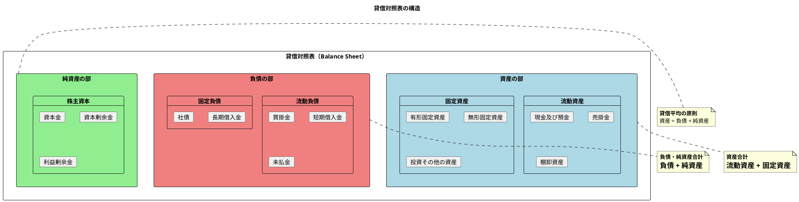
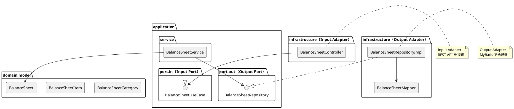
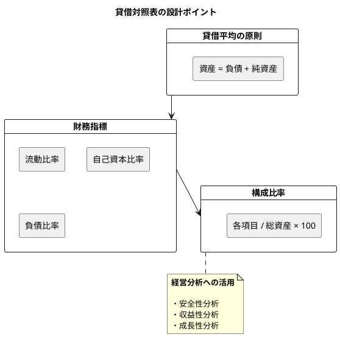

# 第19章: 貸借対照表

## 19.1 本章の概要

第6章で設計した日次勘定科目残高テーブルと勘定科目マスタを基に、貸借対照表（Balance Sheet / B/S）の生成機能をヘキサゴナルアーキテクチャに従い、TDD で実装します。

### 貸借対照表とは

貸借対照表は、企業の特定時点における財政状態を示す財務諸表です。資産・負債・純資産の3つの要素で構成され、「資産 = 負債 + 純資産」という貸借平均の原則が成り立ちます。



### 貸借対照表の構成要素

| 区分 | 科目区分 | 勘定科目コード範囲 | 説明 |
|------|---------|------------------|------|
| 資産 | 流動資産 | 11xx | 1年以内に現金化される資産 |
| 資産 | 固定資産 | 12xx〜14xx | 長期間保有する資産 |
| 負債 | 流動負債 | 21xx〜22xx | 1年以内に返済する負債 |
| 負債 | 固定負債 | 23xx〜25xx | 長期の返済義務 |
| 純資産 | 株主資本 | 31xx〜33xx | 株主の持分 |

### アーキテクチャの全体像



### パッケージ構成

```
com.example.accounting/
├── domain/
│   └── model/
│       └── financial/
│           ├── BalanceSheetCategory.java  # 貸借対照表区分
│           ├── BalanceSheetItem.java      # 貸借対照表項目
│           └── BalanceSheet.java          # 貸借対照表
├── application/
│   ├── port/
│   │   ├── in/
│   │   │   └── BalanceSheetUseCase.java   # Input Port
│   │   └── out/
│   │       └── BalanceSheetRepository.java # Output Port
│   └── service/
│       └── BalanceSheetService.java       # Application Service
└── infrastructure/
    ├── persistence/
    │   ├── mapper/
    │   │   └── BalanceSheetMapper.java    # MyBatis Mapper
    │   └── repository/
    │       └── BalanceSheetRepositoryImpl.java  # Output Adapter
    └── web/
        ├── controller/
        │   └── BalanceSheetController.java # Input Adapter
        └── dto/
            └── BalanceSheetResponse.java
```

### TDD の流れ

1. **Domain Model**: ドメインモデルの作成（BalanceSheetCategory, BalanceSheetItem, BalanceSheet）
2. **Output Port**: リポジトリインターフェースの定義
3. **Output Adapter**: Testcontainers でリポジトリ実装をテスト
4. **Input Port**: ユースケースインターフェースの定義
5. **Application Service**: Mockito でアプリケーションサービスをテスト
6. **Input Adapter**: Testcontainers で REST API 統合テスト

---

## 19.2 Domain Model の実装

### 19.2.1 BalanceSheetCategory 列挙型

```java
package com.example.accounting.domain.model.financial;

/**
 * 貸借対照表区分
 */
public enum BalanceSheetCategory {
    // 資産
    CURRENT_ASSETS("流動資産", "11", "資産"),
    TANGIBLE_FIXED_ASSETS("有形固定資産", "14", "資産"),
    INTANGIBLE_FIXED_ASSETS("無形固定資産", "15", "資産"),
    INVESTMENTS("投資その他の資産", "16", "資産"),

    // 負債
    CURRENT_LIABILITIES("流動負債", "21", "負債"),
    LONG_TERM_LIABILITIES("固定負債", "25", "負債"),

    // 純資産
    SHAREHOLDERS_EQUITY("株主資本", "31", "純資産"),
    VALUATION_ADJUSTMENTS("評価・換算差額等", "32", "純資産"),
    SUBSCRIPTION_RIGHTS("新株予約権", "33", "純資産");

    private final String displayName;
    private final String codePrefix;
    private final String sectionName;

    BalanceSheetCategory(String displayName, String codePrefix, String sectionName) {
        this.displayName = displayName;
        this.codePrefix = codePrefix;
        this.sectionName = sectionName;
    }

    public String getDisplayName() {
        return displayName;
    }

    public String getCodePrefix() {
        return codePrefix;
    }

    public String getSectionName() {
        return sectionName;
    }

    /**
     * 資産区分か
     */
    public boolean isAsset() {
        return "資産".equals(sectionName);
    }

    /**
     * 負債区分か
     */
    public boolean isLiability() {
        return "負債".equals(sectionName);
    }

    /**
     * 純資産区分か
     */
    public boolean isEquity() {
        return "純資産".equals(sectionName);
    }

    /**
     * 勘定科目コードから区分を判定
     */
    public static BalanceSheetCategory fromAccountCode(String accountCode) {
        if (accountCode == null || accountCode.length() < 2) {
            throw new IllegalArgumentException("Invalid account code: " + accountCode);
        }

        String prefix = accountCode.substring(0, 2);

        for (BalanceSheetCategory category : values()) {
            if (prefix.equals(category.codePrefix)) {
                return category;
            }
        }

        // 範囲による判定
        int prefixNum = Integer.parseInt(prefix);
        if (prefixNum >= 11 && prefixNum <= 13) {
            return CURRENT_ASSETS;
        } else if (prefixNum >= 14 && prefixNum <= 14) {
            return TANGIBLE_FIXED_ASSETS;
        } else if (prefixNum >= 15 && prefixNum <= 15) {
            return INTANGIBLE_FIXED_ASSETS;
        } else if (prefixNum >= 16 && prefixNum <= 19) {
            return INVESTMENTS;
        } else if (prefixNum >= 21 && prefixNum <= 24) {
            return CURRENT_LIABILITIES;
        } else if (prefixNum >= 25 && prefixNum <= 29) {
            return LONG_TERM_LIABILITIES;
        } else if (prefixNum >= 31 && prefixNum <= 31) {
            return SHAREHOLDERS_EQUITY;
        } else if (prefixNum >= 32 && prefixNum <= 32) {
            return VALUATION_ADJUSTMENTS;
        } else if (prefixNum >= 33 && prefixNum <= 33) {
            return SUBSCRIPTION_RIGHTS;
        }

        throw new IllegalArgumentException("Unknown B/S category for account code: " + accountCode);
    }
}
```

### 19.2.2 BalanceSheetItem ドメインモデル

```java
package com.example.accounting.domain.model.financial;

import lombok.Value;
import lombok.With;

import java.math.BigDecimal;
import java.math.RoundingMode;

/**
 * 貸借対照表項目
 */
@Value
@With
public class BalanceSheetItem {

    String accountCode;               // 勘定科目コード
    String accountName;               // 勘定科目名
    BalanceSheetCategory category;    // 区分
    BigDecimal balance;               // 残高
    BigDecimal percentage;            // 構成比率（%）

    /**
     * 残高データから貸借対照表項目を作成
     */
    public static BalanceSheetItem create(
            String accountCode,
            String accountName,
            BigDecimal debitTotal,
            BigDecimal creditTotal,
            String debitCreditType) {

        BalanceSheetCategory category = BalanceSheetCategory.fromAccountCode(accountCode);

        // 貸借区分に基づいて残高を計算
        BigDecimal balance;
        if ("借".equals(debitCreditType)) {
            // 借方科目（資産）: 借方 - 貸方
            balance = debitTotal.subtract(creditTotal);
        } else {
            // 貸方科目（負債・純資産）: 貸方 - 借方
            balance = creditTotal.subtract(debitTotal);
        }

        return new BalanceSheetItem(
                accountCode,
                accountName,
                category,
                balance.abs(),
                BigDecimal.ZERO); // 構成比率は後で計算
    }

    /**
     * 構成比率を計算して新しいインスタンスを返す
     */
    public BalanceSheetItem withPercentage(BigDecimal totalAssets) {
        if (totalAssets.compareTo(BigDecimal.ZERO) == 0) {
            return this.withPercentage(BigDecimal.ZERO);
        }

        BigDecimal pct = balance
                .multiply(new BigDecimal("100"))
                .divide(totalAssets, 2, RoundingMode.HALF_UP);

        return this.withPercentage(pct);
    }

    /**
     * 資産項目か
     */
    public boolean isAsset() {
        return category.isAsset();
    }

    /**
     * 負債項目か
     */
    public boolean isLiability() {
        return category.isLiability();
    }

    /**
     * 純資産項目か
     */
    public boolean isEquity() {
        return category.isEquity();
    }

    /**
     * 流動資産か
     */
    public boolean isCurrentAsset() {
        return category == BalanceSheetCategory.CURRENT_ASSETS;
    }

    /**
     * 固定資産か
     */
    public boolean isFixedAsset() {
        return category == BalanceSheetCategory.TANGIBLE_FIXED_ASSETS
                || category == BalanceSheetCategory.INTANGIBLE_FIXED_ASSETS
                || category == BalanceSheetCategory.INVESTMENTS;
    }

    /**
     * 流動負債か
     */
    public boolean isCurrentLiability() {
        return category == BalanceSheetCategory.CURRENT_LIABILITIES;
    }

    /**
     * 固定負債か
     */
    public boolean isFixedLiability() {
        return category == BalanceSheetCategory.LONG_TERM_LIABILITIES;
    }
}
```

### 19.2.3 BalanceSheet ドメインモデル

```java
package com.example.accounting.domain.model.financial;

import lombok.Value;
import lombok.With;

import java.math.BigDecimal;
import java.time.LocalDate;
import java.util.ArrayList;
import java.util.List;
import java.util.stream.Collectors;

/**
 * 貸借対照表ドメインモデル
 */
@Value
@With
public class BalanceSheet {

    LocalDate asOfDate;                    // 基準日
    Integer fiscalYear;                    // 会計年度
    List<BalanceSheetItem> assets;         // 資産項目
    List<BalanceSheetItem> liabilities;    // 負債項目
    List<BalanceSheetItem> equity;         // 純資産項目
    BigDecimal totalAssets;                // 資産合計
    BigDecimal totalLiabilities;           // 負債合計
    BigDecimal totalEquity;                // 純資産合計
    BigDecimal totalLiabilitiesAndEquity;  // 負債・純資産合計

    /**
     * 残高データから貸借対照表を作成
     */
    public static BalanceSheet create(
            LocalDate asOfDate,
            Integer fiscalYear,
            List<BalanceSheetItem> items) {

        // 資産・負債・純資産に分類
        List<BalanceSheetItem> assetItems = items.stream()
                .filter(BalanceSheetItem::isAsset)
                .collect(Collectors.toList());

        List<BalanceSheetItem> liabilityItems = items.stream()
                .filter(BalanceSheetItem::isLiability)
                .collect(Collectors.toList());

        List<BalanceSheetItem> equityItems = items.stream()
                .filter(BalanceSheetItem::isEquity)
                .collect(Collectors.toList());

        // 合計を計算
        BigDecimal totalAssets = assetItems.stream()
                .map(BalanceSheetItem::getBalance)
                .reduce(BigDecimal.ZERO, BigDecimal::add);

        BigDecimal totalLiabilities = liabilityItems.stream()
                .map(BalanceSheetItem::getBalance)
                .reduce(BigDecimal.ZERO, BigDecimal::add);

        BigDecimal totalEquity = equityItems.stream()
                .map(BalanceSheetItem::getBalance)
                .reduce(BigDecimal.ZERO, BigDecimal::add);

        BigDecimal totalLiabilitiesAndEquity = totalLiabilities.add(totalEquity);

        // 構成比率を計算
        List<BalanceSheetItem> assetsWithPercentage = assetItems.stream()
                .map(item -> item.withPercentage(totalAssets))
                .collect(Collectors.toList());

        List<BalanceSheetItem> liabilitiesWithPercentage = liabilityItems.stream()
                .map(item -> item.withPercentage(totalLiabilitiesAndEquity))
                .collect(Collectors.toList());

        List<BalanceSheetItem> equityWithPercentage = equityItems.stream()
                .map(item -> item.withPercentage(totalLiabilitiesAndEquity))
                .collect(Collectors.toList());

        return new BalanceSheet(
                asOfDate,
                fiscalYear,
                assetsWithPercentage,
                liabilitiesWithPercentage,
                equityWithPercentage,
                totalAssets,
                totalLiabilities,
                totalEquity,
                totalLiabilitiesAndEquity);
    }

    /**
     * 貸借平均の検証（資産 = 負債 + 純資産）
     */
    public boolean isBalanced() {
        return totalAssets.compareTo(totalLiabilitiesAndEquity) == 0;
    }

    /**
     * 貸借差額を取得
     */
    public BigDecimal getBalanceDifference() {
        return totalAssets.subtract(totalLiabilitiesAndEquity).abs();
    }

    /**
     * 流動資産合計を取得
     */
    public BigDecimal getCurrentAssets() {
        return assets.stream()
                .filter(BalanceSheetItem::isCurrentAsset)
                .map(BalanceSheetItem::getBalance)
                .reduce(BigDecimal.ZERO, BigDecimal::add);
    }

    /**
     * 固定資産合計を取得
     */
    public BigDecimal getFixedAssets() {
        return assets.stream()
                .filter(BalanceSheetItem::isFixedAsset)
                .map(BalanceSheetItem::getBalance)
                .reduce(BigDecimal.ZERO, BigDecimal::add);
    }

    /**
     * 流動負債合計を取得
     */
    public BigDecimal getCurrentLiabilities() {
        return liabilities.stream()
                .filter(BalanceSheetItem::isCurrentLiability)
                .map(BalanceSheetItem::getBalance)
                .reduce(BigDecimal.ZERO, BigDecimal::add);
    }

    /**
     * 固定負債合計を取得
     */
    public BigDecimal getFixedLiabilities() {
        return liabilities.stream()
                .filter(BalanceSheetItem::isFixedLiability)
                .map(BalanceSheetItem::getBalance)
                .reduce(BigDecimal.ZERO, BigDecimal::add);
    }

    /**
     * 流動比率を計算（流動資産 ÷ 流動負債 × 100）
     */
    public BigDecimal getCurrentRatio() {
        BigDecimal currentLiabilities = getCurrentLiabilities();
        if (currentLiabilities.compareTo(BigDecimal.ZERO) == 0) {
            return BigDecimal.ZERO;
        }
        return getCurrentAssets()
                .multiply(new BigDecimal("100"))
                .divide(currentLiabilities, 2, java.math.RoundingMode.HALF_UP);
    }

    /**
     * 自己資本比率を計算（純資産 ÷ 総資産 × 100）
     */
    public BigDecimal getEquityRatio() {
        if (totalAssets.compareTo(BigDecimal.ZERO) == 0) {
            return BigDecimal.ZERO;
        }
        return totalEquity
                .multiply(new BigDecimal("100"))
                .divide(totalAssets, 2, java.math.RoundingMode.HALF_UP);
    }

    /**
     * 負債比率を計算（総負債 ÷ 純資産 × 100）
     */
    public BigDecimal getDebtToEquityRatio() {
        if (totalEquity.compareTo(BigDecimal.ZERO) == 0) {
            return BigDecimal.ZERO;
        }
        return totalLiabilities
                .multiply(new BigDecimal("100"))
                .divide(totalEquity, 2, java.math.RoundingMode.HALF_UP);
    }
}
```

---

## 19.3 Domain Model のテスト

### 19.3.1 BalanceSheetCategory のテスト

```java
package com.example.accounting.domain.model.financial;

import org.junit.jupiter.api.DisplayName;
import org.junit.jupiter.api.Nested;
import org.junit.jupiter.api.Test;
import org.junit.jupiter.params.ParameterizedTest;
import org.junit.jupiter.params.provider.CsvSource;

import static org.assertj.core.api.Assertions.assertThat;
import static org.assertj.core.api.Assertions.assertThatThrownBy;

@DisplayName("BalanceSheetCategory（貸借対照表区分）")
class BalanceSheetCategoryTest {

    @Nested
    @DisplayName("勘定科目コードからの区分判定")
    class FromAccountCode {

        @ParameterizedTest
        @CsvSource({
            "1110, CURRENT_ASSETS, 流動資産",
            "1130, CURRENT_ASSETS, 流動資産",
            "1410, TANGIBLE_FIXED_ASSETS, 有形固定資産",
            "1510, INTANGIBLE_FIXED_ASSETS, 無形固定資産",
            "1610, INVESTMENTS, 投資その他の資産"
        })
        @DisplayName("資産科目を正しく判定できる")
        void test_資産科目の判定(String accountCode, BalanceSheetCategory expected, String displayName) {
            // When
            BalanceSheetCategory category = BalanceSheetCategory.fromAccountCode(accountCode);

            // Then
            assertThat(category).isEqualTo(expected);
            assertThat(category.getDisplayName()).isEqualTo(displayName);
            assertThat(category.isAsset()).isTrue();
        }

        @ParameterizedTest
        @CsvSource({
            "2110, CURRENT_LIABILITIES, 流動負債",
            "2210, CURRENT_LIABILITIES, 流動負債",
            "2510, LONG_TERM_LIABILITIES, 固定負債"
        })
        @DisplayName("負債科目を正しく判定できる")
        void test_負債科目の判定(String accountCode, BalanceSheetCategory expected, String displayName) {
            // When
            BalanceSheetCategory category = BalanceSheetCategory.fromAccountCode(accountCode);

            // Then
            assertThat(category).isEqualTo(expected);
            assertThat(category.getDisplayName()).isEqualTo(displayName);
            assertThat(category.isLiability()).isTrue();
        }

        @ParameterizedTest
        @CsvSource({
            "3110, SHAREHOLDERS_EQUITY, 株主資本",
            "3210, VALUATION_ADJUSTMENTS, 評価・換算差額等",
            "3310, SUBSCRIPTION_RIGHTS, 新株予約権"
        })
        @DisplayName("純資産科目を正しく判定できる")
        void test_純資産科目の判定(String accountCode, BalanceSheetCategory expected, String displayName) {
            // When
            BalanceSheetCategory category = BalanceSheetCategory.fromAccountCode(accountCode);

            // Then
            assertThat(category).isEqualTo(expected);
            assertThat(category.getDisplayName()).isEqualTo(displayName);
            assertThat(category.isEquity()).isTrue();
        }

        @Test
        @DisplayName("不正な勘定科目コードは例外をスロー")
        void test_不正な勘定科目コード() {
            assertThatThrownBy(() -> BalanceSheetCategory.fromAccountCode("9999"))
                    .isInstanceOf(IllegalArgumentException.class);

            assertThatThrownBy(() -> BalanceSheetCategory.fromAccountCode(null))
                    .isInstanceOf(IllegalArgumentException.class);
        }
    }
}
```

### 19.3.2 BalanceSheetItem のテスト

```java
package com.example.accounting.domain.model.financial;

import org.junit.jupiter.api.DisplayName;
import org.junit.jupiter.api.Nested;
import org.junit.jupiter.api.Test;

import java.math.BigDecimal;

import static org.assertj.core.api.Assertions.assertThat;

@DisplayName("BalanceSheetItem（貸借対照表項目）")
class BalanceSheetItemTest {

    @Nested
    @DisplayName("残高計算")
    class BalanceCalculation {

        @Test
        @DisplayName("借方科目（資産）の残高を計算できる")
        void test_借方科目の残高計算() {
            // Given: 普通預金 借方1,000,000 貸方200,000
            BigDecimal debitTotal = new BigDecimal("1000000");
            BigDecimal creditTotal = new BigDecimal("200000");

            // When
            BalanceSheetItem item = BalanceSheetItem.create(
                    "1110", "普通預金", debitTotal, creditTotal, "借");

            // Then: 残高 = 800,000
            assertThat(item.getBalance()).isEqualByComparingTo("800000");
            assertThat(item.isAsset()).isTrue();
            assertThat(item.getCategory()).isEqualTo(BalanceSheetCategory.CURRENT_ASSETS);
        }

        @Test
        @DisplayName("貸方科目（負債）の残高を計算できる")
        void test_貸方科目の残高計算() {
            // Given: 買掛金 借方100,000 貸方500,000
            BigDecimal debitTotal = new BigDecimal("100000");
            BigDecimal creditTotal = new BigDecimal("500000");

            // When
            BalanceSheetItem item = BalanceSheetItem.create(
                    "2110", "買掛金", debitTotal, creditTotal, "貸");

            // Then: 残高 = 400,000
            assertThat(item.getBalance()).isEqualByComparingTo("400000");
            assertThat(item.isLiability()).isTrue();
            assertThat(item.getCategory()).isEqualTo(BalanceSheetCategory.CURRENT_LIABILITIES);
        }

        @Test
        @DisplayName("貸方科目（純資産）の残高を計算できる")
        void test_純資産科目の残高計算() {
            // Given: 資本金 借方0 貸方10,000,000
            BigDecimal debitTotal = BigDecimal.ZERO;
            BigDecimal creditTotal = new BigDecimal("10000000");

            // When
            BalanceSheetItem item = BalanceSheetItem.create(
                    "3110", "資本金", debitTotal, creditTotal, "貸");

            // Then: 残高 = 10,000,000
            assertThat(item.getBalance()).isEqualByComparingTo("10000000");
            assertThat(item.isEquity()).isTrue();
            assertThat(item.getCategory()).isEqualTo(BalanceSheetCategory.SHAREHOLDERS_EQUITY);
        }
    }

    @Nested
    @DisplayName("構成比率計算")
    class PercentageCalculation {

        @Test
        @DisplayName("構成比率を計算できる")
        void test_構成比率の計算() {
            // Given: 残高 800,000 / 総資産 10,000,000
            BalanceSheetItem item = BalanceSheetItem.create(
                    "1110", "普通預金",
                    new BigDecimal("800000"), BigDecimal.ZERO, "借");

            // When
            BalanceSheetItem itemWithPercentage = item.withPercentage(new BigDecimal("10000000"));

            // Then: 構成比率 = 8.00%
            assertThat(itemWithPercentage.getPercentage()).isEqualByComparingTo("8.00");
        }

        @Test
        @DisplayName("総資産ゼロの場合は構成比率ゼロ")
        void test_総資産ゼロの場合() {
            // Given
            BalanceSheetItem item = BalanceSheetItem.create(
                    "1110", "普通預金",
                    new BigDecimal("100000"), BigDecimal.ZERO, "借");

            // When
            BalanceSheetItem itemWithPercentage = item.withPercentage(BigDecimal.ZERO);

            // Then
            assertThat(itemWithPercentage.getPercentage()).isEqualByComparingTo("0");
        }
    }

    @Nested
    @DisplayName("区分判定")
    class CategoryJudgment {

        @Test
        @DisplayName("流動資産・固定資産を判定できる")
        void test_資産区分の判定() {
            // Given
            BalanceSheetItem currentAsset = BalanceSheetItem.create(
                    "1110", "普通預金", BigDecimal.ZERO, BigDecimal.ZERO, "借");
            BalanceSheetItem fixedAsset = BalanceSheetItem.create(
                    "1410", "建物", BigDecimal.ZERO, BigDecimal.ZERO, "借");

            // Then
            assertThat(currentAsset.isCurrentAsset()).isTrue();
            assertThat(currentAsset.isFixedAsset()).isFalse();
            assertThat(fixedAsset.isCurrentAsset()).isFalse();
            assertThat(fixedAsset.isFixedAsset()).isTrue();
        }

        @Test
        @DisplayName("流動負債・固定負債を判定できる")
        void test_負債区分の判定() {
            // Given
            BalanceSheetItem currentLiability = BalanceSheetItem.create(
                    "2110", "買掛金", BigDecimal.ZERO, BigDecimal.ZERO, "貸");
            BalanceSheetItem fixedLiability = BalanceSheetItem.create(
                    "2510", "長期借入金", BigDecimal.ZERO, BigDecimal.ZERO, "貸");

            // Then
            assertThat(currentLiability.isCurrentLiability()).isTrue();
            assertThat(currentLiability.isFixedLiability()).isFalse();
            assertThat(fixedLiability.isCurrentLiability()).isFalse();
            assertThat(fixedLiability.isFixedLiability()).isTrue();
        }
    }
}
```

### 19.3.3 BalanceSheet のテスト

```java
package com.example.accounting.domain.model.financial;

import org.junit.jupiter.api.DisplayName;
import org.junit.jupiter.api.Nested;
import org.junit.jupiter.api.Test;

import java.math.BigDecimal;
import java.time.LocalDate;
import java.util.List;

import static org.assertj.core.api.Assertions.assertThat;

@DisplayName("BalanceSheet（貸借対照表）")
class BalanceSheetTest {

    @Nested
    @DisplayName("貸借対照表の作成")
    class CreateBalanceSheet {

        @Test
        @DisplayName("残高データから貸借対照表を作成できる")
        void test_貸借対照表の作成() {
            // Given: 資産10,000,000 = 負債5,000,000 + 純資産5,000,000
            List<BalanceSheetItem> items = List.of(
                    BalanceSheetItem.create("1110", "普通預金",
                            new BigDecimal("8000000"), BigDecimal.ZERO, "借"),
                    BalanceSheetItem.create("1410", "建物",
                            new BigDecimal("2000000"), BigDecimal.ZERO, "借"),
                    BalanceSheetItem.create("2110", "買掛金",
                            BigDecimal.ZERO, new BigDecimal("500000"), "貸"),
                    BalanceSheetItem.create("2510", "長期借入金",
                            BigDecimal.ZERO, new BigDecimal("4500000"), "貸"),
                    BalanceSheetItem.create("3110", "資本金",
                            BigDecimal.ZERO, new BigDecimal("5000000"), "貸")
            );

            // When
            BalanceSheet balanceSheet = BalanceSheet.create(
                    LocalDate.of(2025, 3, 31), 2024, items);

            // Then
            assertThat(balanceSheet.getAsOfDate()).isEqualTo(LocalDate.of(2025, 3, 31));
            assertThat(balanceSheet.getFiscalYear()).isEqualTo(2024);
            assertThat(balanceSheet.getAssets()).hasSize(2);
            assertThat(balanceSheet.getLiabilities()).hasSize(2);
            assertThat(balanceSheet.getEquity()).hasSize(1);
        }

        @Test
        @DisplayName("貸借平均の原則が成立している")
        void test_貸借平均の原則() {
            // Given
            List<BalanceSheetItem> items = List.of(
                    BalanceSheetItem.create("1110", "普通預金",
                            new BigDecimal("10000000"), BigDecimal.ZERO, "借"),
                    BalanceSheetItem.create("2110", "買掛金",
                            BigDecimal.ZERO, new BigDecimal("3000000"), "貸"),
                    BalanceSheetItem.create("3110", "資本金",
                            BigDecimal.ZERO, new BigDecimal("7000000"), "貸")
            );

            // When
            BalanceSheet balanceSheet = BalanceSheet.create(
                    LocalDate.of(2025, 3, 31), 2024, items);

            // Then: 資産 = 負債 + 純資産
            assertThat(balanceSheet.isBalanced()).isTrue();
            assertThat(balanceSheet.getTotalAssets()).isEqualByComparingTo("10000000");
            assertThat(balanceSheet.getTotalLiabilities()).isEqualByComparingTo("3000000");
            assertThat(balanceSheet.getTotalEquity()).isEqualByComparingTo("7000000");
            assertThat(balanceSheet.getTotalLiabilitiesAndEquity()).isEqualByComparingTo("10000000");
        }
    }

    @Nested
    @DisplayName("財務指標の計算")
    class FinancialRatios {

        private BalanceSheet createSampleBalanceSheet() {
            List<BalanceSheetItem> items = List.of(
                    // 流動資産: 6,000,000
                    BalanceSheetItem.create("1110", "普通預金",
                            new BigDecimal("5000000"), BigDecimal.ZERO, "借"),
                    BalanceSheetItem.create("1130", "売掛金",
                            new BigDecimal("1000000"), BigDecimal.ZERO, "借"),
                    // 固定資産: 4,000,000
                    BalanceSheetItem.create("1410", "建物",
                            new BigDecimal("4000000"), BigDecimal.ZERO, "借"),
                    // 流動負債: 2,000,000
                    BalanceSheetItem.create("2110", "買掛金",
                            BigDecimal.ZERO, new BigDecimal("2000000"), "貸"),
                    // 固定負債: 3,000,000
                    BalanceSheetItem.create("2510", "長期借入金",
                            BigDecimal.ZERO, new BigDecimal("3000000"), "貸"),
                    // 純資産: 5,000,000
                    BalanceSheetItem.create("3110", "資本金",
                            BigDecimal.ZERO, new BigDecimal("5000000"), "貸")
            );

            return BalanceSheet.create(LocalDate.of(2025, 3, 31), 2024, items);
        }

        @Test
        @DisplayName("流動比率を計算できる")
        void test_流動比率の計算() {
            // Given
            BalanceSheet balanceSheet = createSampleBalanceSheet();

            // When: 流動比率 = 流動資産 / 流動負債 × 100
            BigDecimal currentRatio = balanceSheet.getCurrentRatio();

            // Then: 6,000,000 / 2,000,000 × 100 = 300%
            assertThat(currentRatio).isEqualByComparingTo("300.00");
        }

        @Test
        @DisplayName("自己資本比率を計算できる")
        void test_自己資本比率の計算() {
            // Given
            BalanceSheet balanceSheet = createSampleBalanceSheet();

            // When: 自己資本比率 = 純資産 / 総資産 × 100
            BigDecimal equityRatio = balanceSheet.getEquityRatio();

            // Then: 5,000,000 / 10,000,000 × 100 = 50%
            assertThat(equityRatio).isEqualByComparingTo("50.00");
        }

        @Test
        @DisplayName("負債比率を計算できる")
        void test_負債比率の計算() {
            // Given
            BalanceSheet balanceSheet = createSampleBalanceSheet();

            // When: 負債比率 = 総負債 / 純資産 × 100
            BigDecimal debtToEquityRatio = balanceSheet.getDebtToEquityRatio();

            // Then: 5,000,000 / 5,000,000 × 100 = 100%
            assertThat(debtToEquityRatio).isEqualByComparingTo("100.00");
        }

        @Test
        @DisplayName("流動資産・固定資産の内訳を取得できる")
        void test_資産内訳の取得() {
            // Given
            BalanceSheet balanceSheet = createSampleBalanceSheet();

            // When
            BigDecimal currentAssets = balanceSheet.getCurrentAssets();
            BigDecimal fixedAssets = balanceSheet.getFixedAssets();

            // Then
            assertThat(currentAssets).isEqualByComparingTo("6000000");
            assertThat(fixedAssets).isEqualByComparingTo("4000000");
        }

        @Test
        @DisplayName("流動負債・固定負債の内訳を取得できる")
        void test_負債内訳の取得() {
            // Given
            BalanceSheet balanceSheet = createSampleBalanceSheet();

            // When
            BigDecimal currentLiabilities = balanceSheet.getCurrentLiabilities();
            BigDecimal fixedLiabilities = balanceSheet.getFixedLiabilities();

            // Then
            assertThat(currentLiabilities).isEqualByComparingTo("2000000");
            assertThat(fixedLiabilities).isEqualByComparingTo("3000000");
        }
    }

    @Nested
    @DisplayName("構成比率の計算")
    class PercentageCalculation {

        @Test
        @DisplayName("各項目の構成比率が計算される")
        void test_構成比率の計算() {
            // Given
            List<BalanceSheetItem> items = List.of(
                    BalanceSheetItem.create("1110", "普通預金",
                            new BigDecimal("8000000"), BigDecimal.ZERO, "借"),
                    BalanceSheetItem.create("1410", "建物",
                            new BigDecimal("2000000"), BigDecimal.ZERO, "借"),
                    BalanceSheetItem.create("2110", "買掛金",
                            BigDecimal.ZERO, new BigDecimal("5000000"), "貸"),
                    BalanceSheetItem.create("3110", "資本金",
                            BigDecimal.ZERO, new BigDecimal("5000000"), "貸")
            );

            // When
            BalanceSheet balanceSheet = BalanceSheet.create(
                    LocalDate.of(2025, 3, 31), 2024, items);

            // Then: 普通預金 8,000,000 / 10,000,000 = 80%
            BalanceSheetItem ordinaryDeposit = balanceSheet.getAssets().stream()
                    .filter(item -> "1110".equals(item.getAccountCode()))
                    .findFirst()
                    .orElseThrow();
            assertThat(ordinaryDeposit.getPercentage()).isEqualByComparingTo("80.00");

            // 買掛金 5,000,000 / 10,000,000 = 50%
            BalanceSheetItem accountsPayable = balanceSheet.getLiabilities().stream()
                    .filter(item -> "2110".equals(item.getAccountCode()))
                    .findFirst()
                    .orElseThrow();
            assertThat(accountsPayable.getPercentage()).isEqualByComparingTo("50.00");
        }
    }
}
```

---

## 19.4 Output Port の定義

### 19.4.1 BalanceSheetRepository インターフェース

```java
package com.example.accounting.application.port.out;

import com.example.accounting.domain.model.financial.BalanceSheetItem;

import java.time.LocalDate;
import java.util.List;

/**
 * 貸借対照表リポジトリ（Output Port）
 */
public interface BalanceSheetRepository {

    /**
     * 指定日時点の B/S 科目残高を取得
     *
     * @param asOfDate 基準日
     * @return 貸借対照表項目リスト
     */
    List<BalanceSheetItem> findBalancesAsOf(LocalDate asOfDate);

    /**
     * 指定会計年度末の B/S 科目残高を取得
     *
     * @param fiscalYear 会計年度
     * @return 貸借対照表項目リスト
     */
    List<BalanceSheetItem> findBalancesByFiscalYear(Integer fiscalYear);

    /**
     * 比較貸借対照表用に複数期間の残高を取得
     *
     * @param asOfDate1 基準日1
     * @param asOfDate2 基準日2
     * @return 貸借対照表項目リスト（両日付分）
     */
    List<BalanceSheetItem> findBalancesForComparison(LocalDate asOfDate1, LocalDate asOfDate2);
}
```

---

## 19.5 Output Adapter の実装

### 19.5.1 BalanceSheetMapper インターフェース

```java
package com.example.accounting.infrastructure.persistence.mapper;

import org.apache.ibatis.annotations.Mapper;
import org.apache.ibatis.annotations.Param;

import java.math.BigDecimal;
import java.time.LocalDate;
import java.util.List;
import java.util.Map;

/**
 * 貸借対照表 MyBatis Mapper
 */
@Mapper
public interface BalanceSheetMapper {

    /**
     * 指定日時点の B/S 科目残高を取得
     */
    List<Map<String, Object>> selectBalancesAsOf(@Param("asOfDate") LocalDate asOfDate);

    /**
     * 指定会計年度末の B/S 科目残高を取得
     */
    List<Map<String, Object>> selectBalancesByFiscalYear(@Param("fiscalYear") Integer fiscalYear);
}
```

### 19.5.2 MyBatis Mapper XML

`src/main/resources/mapper/BalanceSheetMapper.xml`:

```xml
<?xml version="1.0" encoding="UTF-8" ?>
<!DOCTYPE mapper PUBLIC "-//mybatis.org//DTD Mapper 3.0//EN"
        "http://mybatis.org/dtd/mybatis-3-mapper.dtd">

<mapper namespace="com.example.accounting.infrastructure.persistence.mapper.BalanceSheetMapper">

    <!-- B/S科目残高クエリ -->
    <sql id="balanceSheetBase">
        SELECT
            a."勘定科目コード" as account_code,
            a."勘定科目名" as account_name,
            a."貸借区分" as debit_credit_type,
            COALESCE(SUM(d."借方金額"), 0) as debit_total,
            COALESCE(SUM(d."貸方金額"), 0) as credit_total
        FROM "勘定科目マスタ" a
        LEFT JOIN "日次勘定科目残高" d
            ON a."勘定科目コード" = d."勘定科目コード"
        WHERE a."BSPL区分" = 'B'
    </sql>

    <!-- 指定日時点の残高 -->
    <select id="selectBalancesAsOf" resultType="map">
        <include refid="balanceSheetBase"/>
            AND (d."起票日" &lt;= #{asOfDate} OR d."起票日" IS NULL)
        GROUP BY a."勘定科目コード", a."勘定科目名", a."貸借区分"
        HAVING COALESCE(SUM(d."借方金額"), 0) != 0
            OR COALESCE(SUM(d."貸方金額"), 0) != 0
        ORDER BY a."勘定科目コード"
    </select>

    <!-- 指定会計年度末の残高 -->
    <select id="selectBalancesByFiscalYear" resultType="map">
        <include refid="balanceSheetBase"/>
            AND (d."起票日" &lt;= MAKE_DATE(#{fiscalYear} + 1, 3, 31) OR d."起票日" IS NULL)
        GROUP BY a."勘定科目コード", a."勘定科目名", a."貸借区分"
        HAVING COALESCE(SUM(d."借方金額"), 0) != 0
            OR COALESCE(SUM(d."貸方金額"), 0) != 0
        ORDER BY a."勘定科目コード"
    </select>

</mapper>
```

### 19.5.3 BalanceSheetRepositoryImpl

```java
package com.example.accounting.infrastructure.persistence.repository;

import com.example.accounting.application.port.out.BalanceSheetRepository;
import com.example.accounting.domain.model.financial.BalanceSheetItem;
import com.example.accounting.infrastructure.persistence.mapper.BalanceSheetMapper;
import lombok.RequiredArgsConstructor;
import org.springframework.stereotype.Repository;

import java.math.BigDecimal;
import java.time.LocalDate;
import java.util.List;
import java.util.Map;
import java.util.stream.Collectors;

/**
 * 貸借対照表リポジトリ実装（Output Adapter）
 */
@Repository
@RequiredArgsConstructor
public class BalanceSheetRepositoryImpl implements BalanceSheetRepository {

    private final BalanceSheetMapper mapper;

    @Override
    public List<BalanceSheetItem> findBalancesAsOf(LocalDate asOfDate) {
        return mapper.selectBalancesAsOf(asOfDate).stream()
                .map(this::mapToBalanceSheetItem)
                .collect(Collectors.toList());
    }

    @Override
    public List<BalanceSheetItem> findBalancesByFiscalYear(Integer fiscalYear) {
        return mapper.selectBalancesByFiscalYear(fiscalYear).stream()
                .map(this::mapToBalanceSheetItem)
                .collect(Collectors.toList());
    }

    @Override
    public List<BalanceSheetItem> findBalancesForComparison(LocalDate asOfDate1, LocalDate asOfDate2) {
        // 両日付の残高を取得して結合
        List<BalanceSheetItem> items1 = findBalancesAsOf(asOfDate1);
        List<BalanceSheetItem> items2 = findBalancesAsOf(asOfDate2);

        items1.addAll(items2);
        return items1;
    }

    private BalanceSheetItem mapToBalanceSheetItem(Map<String, Object> row) {
        String accountCode = (String) row.get("account_code");
        String accountName = (String) row.get("account_name");
        String debitCreditType = (String) row.get("debit_credit_type");
        BigDecimal debitTotal = (BigDecimal) row.get("debit_total");
        BigDecimal creditTotal = (BigDecimal) row.get("credit_total");

        return BalanceSheetItem.create(
                accountCode,
                accountName,
                debitTotal,
                creditTotal,
                debitCreditType);
    }
}
```

---

## 19.6 Output Adapter のテスト

### 19.6.1 Testcontainers を使った統合テスト

```java
package com.example.accounting.infrastructure.persistence.repository;

import com.example.accounting.domain.model.financial.BalanceSheetItem;
import org.junit.jupiter.api.BeforeEach;
import org.junit.jupiter.api.DisplayName;
import org.junit.jupiter.api.Nested;
import org.junit.jupiter.api.Test;
import org.mybatis.spring.boot.test.autoconfigure.MybatisTest;
import org.springframework.beans.factory.annotation.Autowired;
import org.springframework.boot.test.autoconfigure.jdbc.AutoConfigureTestDatabase;
import org.springframework.context.annotation.Import;
import org.springframework.jdbc.core.JdbcTemplate;
import org.springframework.test.context.DynamicPropertyRegistry;
import org.springframework.test.context.DynamicPropertySource;
import org.testcontainers.containers.PostgreSQLContainer;
import org.testcontainers.junit.jupiter.Container;
import org.testcontainers.junit.jupiter.Testcontainers;

import java.math.BigDecimal;
import java.time.LocalDate;
import java.util.List;

import static org.assertj.core.api.Assertions.assertThat;

@MybatisTest
@Testcontainers
@AutoConfigureTestDatabase(replace = AutoConfigureTestDatabase.Replace.NONE)
@Import(BalanceSheetRepositoryImpl.class)
@DisplayName("BalanceSheetRepositoryImpl（貸借対照表リポジトリ）")
class BalanceSheetRepositoryImplTest {

    @Container
    static PostgreSQLContainer<?> postgres = new PostgreSQLContainer<>("postgres:15")
            .withDatabaseName("testdb")
            .withUsername("test")
            .withPassword("test");

    @DynamicPropertySource
    static void configureProperties(DynamicPropertyRegistry registry) {
        registry.add("spring.datasource.url", postgres::getJdbcUrl);
        registry.add("spring.datasource.username", postgres::getUsername);
        registry.add("spring.datasource.password", postgres::getPassword);
    }

    @Autowired
    private BalanceSheetRepositoryImpl repository;

    @Autowired
    private JdbcTemplate jdbcTemplate;

    @BeforeEach
    void setUp() {
        setupTestData();
    }

    private void setupTestData() {
        // 勘定科目マスタ（B/S科目）
        jdbcTemplate.execute("""
            INSERT INTO "勘定科目マスタ" ("勘定科目コード", "勘定科目名", "BSPL区分", "貸借区分", "表示順")
            VALUES
                ('1110', '普通預金', 'B', '借', 1),
                ('1130', '売掛金', 'B', '借', 2),
                ('1410', '建物', 'B', '借', 3),
                ('2110', '買掛金', 'B', '貸', 4),
                ('2510', '長期借入金', 'B', '貸', 5),
                ('3110', '資本金', 'B', '貸', 6)
            ON CONFLICT DO NOTHING
        """);

        // 日次勘定科目残高
        jdbcTemplate.execute("""
            INSERT INTO "日次勘定科目残高"
                ("起票日", "勘定科目コード", "補助科目コード", "部門コード",
                 "プロジェクトコード", "決算仕訳フラグ", "借方金額", "貸方金額")
            VALUES
                ('2025-01-31', '1110', '', '', '', 0, 8000000, 0),
                ('2025-01-31', '1130', '', '', '', 0, 1000000, 0),
                ('2025-01-31', '1410', '', '', '', 0, 2000000, 0),
                ('2025-01-31', '2110', '', '', '', 0, 0, 500000),
                ('2025-01-31', '2510', '', '', '', 0, 0, 4500000),
                ('2025-01-31', '3110', '', '', '', 0, 0, 6000000)
            ON CONFLICT DO NOTHING
        """);
    }

    @Nested
    @DisplayName("基準日指定での残高取得")
    class FindBalancesAsOf {

        @Test
        @DisplayName("指定日時点の B/S 科目残高を取得できる")
        void test_基準日時点の残高取得() {
            // Given
            LocalDate asOfDate = LocalDate.of(2025, 1, 31);

            // When
            List<BalanceSheetItem> items = repository.findBalancesAsOf(asOfDate);

            // Then
            assertThat(items).hasSize(6);

            // 資産項目の確認
            BalanceSheetItem ordinaryDeposit = items.stream()
                    .filter(item -> "1110".equals(item.getAccountCode()))
                    .findFirst()
                    .orElseThrow();
            assertThat(ordinaryDeposit.getBalance()).isEqualByComparingTo("8000000");
            assertThat(ordinaryDeposit.isAsset()).isTrue();

            // 負債項目の確認
            BalanceSheetItem accountsPayable = items.stream()
                    .filter(item -> "2110".equals(item.getAccountCode()))
                    .findFirst()
                    .orElseThrow();
            assertThat(accountsPayable.getBalance()).isEqualByComparingTo("500000");
            assertThat(accountsPayable.isLiability()).isTrue();

            // 純資産項目の確認
            BalanceSheetItem capital = items.stream()
                    .filter(item -> "3110".equals(item.getAccountCode()))
                    .findFirst()
                    .orElseThrow();
            assertThat(capital.getBalance()).isEqualByComparingTo("6000000");
            assertThat(capital.isEquity()).isTrue();
        }

        @Test
        @DisplayName("貸借平均の原則が成立する残高を取得できる")
        void test_貸借平均の検証() {
            // Given
            LocalDate asOfDate = LocalDate.of(2025, 1, 31);

            // When
            List<BalanceSheetItem> items = repository.findBalancesAsOf(asOfDate);

            // Then: 資産合計 = 負債合計 + 純資産合計
            BigDecimal totalAssets = items.stream()
                    .filter(BalanceSheetItem::isAsset)
                    .map(BalanceSheetItem::getBalance)
                    .reduce(BigDecimal.ZERO, BigDecimal::add);

            BigDecimal totalLiabilities = items.stream()
                    .filter(BalanceSheetItem::isLiability)
                    .map(BalanceSheetItem::getBalance)
                    .reduce(BigDecimal.ZERO, BigDecimal::add);

            BigDecimal totalEquity = items.stream()
                    .filter(BalanceSheetItem::isEquity)
                    .map(BalanceSheetItem::getBalance)
                    .reduce(BigDecimal.ZERO, BigDecimal::add);

            // 資産: 8,000,000 + 1,000,000 + 2,000,000 = 11,000,000
            assertThat(totalAssets).isEqualByComparingTo("11000000");
            // 負債: 500,000 + 4,500,000 = 5,000,000
            assertThat(totalLiabilities).isEqualByComparingTo("5000000");
            // 純資産: 6,000,000
            assertThat(totalEquity).isEqualByComparingTo("6000000");
            // 資産 = 負債 + 純資産
            assertThat(totalAssets).isEqualByComparingTo(totalLiabilities.add(totalEquity));
        }
    }

    @Nested
    @DisplayName("会計年度指定での残高取得")
    class FindBalancesByFiscalYear {

        @Test
        @DisplayName("会計年度末の残高を取得できる")
        void test_会計年度末の残高取得() {
            // Given: 2024年度（2025年3月31日まで）
            Integer fiscalYear = 2024;

            // When
            List<BalanceSheetItem> items = repository.findBalancesByFiscalYear(fiscalYear);

            // Then
            assertThat(items).isNotEmpty();
        }
    }
}
```

---

## 19.7 Input Port の定義

### 19.7.1 BalanceSheetUseCase インターフェース

```java
package com.example.accounting.application.port.in;

import com.example.accounting.domain.model.financial.BalanceSheet;

import java.time.LocalDate;

/**
 * 貸借対照表ユースケース（Input Port）
 */
public interface BalanceSheetUseCase {

    /**
     * 指定日時点の貸借対照表を生成
     *
     * @param asOfDate 基準日
     * @return 貸借対照表
     */
    BalanceSheet generateAsOf(LocalDate asOfDate);

    /**
     * 指定会計年度末の貸借対照表を生成
     *
     * @param fiscalYear 会計年度
     * @return 貸借対照表
     */
    BalanceSheet generateByFiscalYear(Integer fiscalYear);

    /**
     * 比較貸借対照表を生成
     *
     * @param currentDate  当期基準日
     * @param previousDate 前期基準日
     * @return 比較貸借対照表（当期）
     */
    BalanceSheet generateComparative(LocalDate currentDate, LocalDate previousDate);
}
```

---

## 19.8 Application Service の実装

### 19.8.1 BalanceSheetService

```java
package com.example.accounting.application.service;

import com.example.accounting.application.port.in.BalanceSheetUseCase;
import com.example.accounting.application.port.out.BalanceSheetRepository;
import com.example.accounting.domain.model.financial.BalanceSheet;
import com.example.accounting.domain.model.financial.BalanceSheetItem;
import lombok.RequiredArgsConstructor;
import org.springframework.stereotype.Service;
import org.springframework.transaction.annotation.Transactional;

import java.time.LocalDate;
import java.util.List;

/**
 * 貸借対照表アプリケーションサービス
 */
@Service
@RequiredArgsConstructor
@Transactional(readOnly = true)
public class BalanceSheetService implements BalanceSheetUseCase {

    private final BalanceSheetRepository balanceSheetRepository;

    @Override
    public BalanceSheet generateAsOf(LocalDate asOfDate) {
        List<BalanceSheetItem> items = balanceSheetRepository.findBalancesAsOf(asOfDate);
        Integer fiscalYear = getFiscalYear(asOfDate);
        return BalanceSheet.create(asOfDate, fiscalYear, items);
    }

    @Override
    public BalanceSheet generateByFiscalYear(Integer fiscalYear) {
        List<BalanceSheetItem> items = balanceSheetRepository.findBalancesByFiscalYear(fiscalYear);
        LocalDate fiscalYearEnd = LocalDate.of(fiscalYear + 1, 3, 31);
        return BalanceSheet.create(fiscalYearEnd, fiscalYear, items);
    }

    @Override
    public BalanceSheet generateComparative(LocalDate currentDate, LocalDate previousDate) {
        // 当期の貸借対照表を生成
        return generateAsOf(currentDate);
    }

    /**
     * 日付から会計年度を取得（4月始まり）
     */
    private Integer getFiscalYear(LocalDate date) {
        int year = date.getYear();
        int month = date.getMonthValue();
        return month >= 4 ? year : year - 1;
    }
}
```

---

## 19.9 Application Service のテスト

### 19.9.1 Mockito を使った単体テスト

```java
package com.example.accounting.application.service;

import com.example.accounting.application.port.out.BalanceSheetRepository;
import com.example.accounting.domain.model.financial.BalanceSheet;
import com.example.accounting.domain.model.financial.BalanceSheetItem;
import org.junit.jupiter.api.BeforeEach;
import org.junit.jupiter.api.DisplayName;
import org.junit.jupiter.api.Nested;
import org.junit.jupiter.api.Test;
import org.junit.jupiter.api.extension.ExtendWith;
import org.mockito.InjectMocks;
import org.mockito.Mock;
import org.mockito.junit.jupiter.MockitoExtension;

import java.math.BigDecimal;
import java.time.LocalDate;
import java.util.List;

import static org.assertj.core.api.Assertions.assertThat;
import static org.mockito.ArgumentMatchers.any;
import static org.mockito.Mockito.when;

@ExtendWith(MockitoExtension.class)
@DisplayName("BalanceSheetService（貸借対照表サービス）")
class BalanceSheetServiceTest {

    @Mock
    private BalanceSheetRepository balanceSheetRepository;

    @InjectMocks
    private BalanceSheetService balanceSheetService;

    private List<BalanceSheetItem> sampleItems;

    @BeforeEach
    void setUp() {
        // テストデータ: 貸借一致する残高
        sampleItems = List.of(
                BalanceSheetItem.create("1110", "普通預金",
                        new BigDecimal("8000000"), BigDecimal.ZERO, "借"),
                BalanceSheetItem.create("1410", "建物",
                        new BigDecimal("2000000"), BigDecimal.ZERO, "借"),
                BalanceSheetItem.create("2110", "買掛金",
                        BigDecimal.ZERO, new BigDecimal("500000"), "貸"),
                BalanceSheetItem.create("2510", "長期借入金",
                        BigDecimal.ZERO, new BigDecimal("4500000"), "貸"),
                BalanceSheetItem.create("3110", "資本金",
                        BigDecimal.ZERO, new BigDecimal("5000000"), "貸")
        );
    }

    @Nested
    @DisplayName("貸借対照表生成")
    class GenerateBalanceSheet {

        @Test
        @DisplayName("基準日指定で貸借対照表を生成できる")
        void test_基準日指定での生成() {
            // Given
            LocalDate asOfDate = LocalDate.of(2025, 3, 31);
            when(balanceSheetRepository.findBalancesAsOf(asOfDate)).thenReturn(sampleItems);

            // When
            BalanceSheet result = balanceSheetService.generateAsOf(asOfDate);

            // Then
            assertThat(result.getAsOfDate()).isEqualTo(asOfDate);
            assertThat(result.getFiscalYear()).isEqualTo(2024);
            assertThat(result.getAssets()).hasSize(2);
            assertThat(result.getLiabilities()).hasSize(2);
            assertThat(result.getEquity()).hasSize(1);
        }

        @Test
        @DisplayName("会計年度指定で貸借対照表を生成できる")
        void test_会計年度指定での生成() {
            // Given
            Integer fiscalYear = 2024;
            when(balanceSheetRepository.findBalancesByFiscalYear(fiscalYear)).thenReturn(sampleItems);

            // When
            BalanceSheet result = balanceSheetService.generateByFiscalYear(fiscalYear);

            // Then
            assertThat(result.getAsOfDate()).isEqualTo(LocalDate.of(2025, 3, 31));
            assertThat(result.getFiscalYear()).isEqualTo(2024);
        }
    }

    @Nested
    @DisplayName("貸借平均の検証")
    class BalanceValidation {

        @Test
        @DisplayName("資産 = 負債 + 純資産 が成立する")
        void test_貸借平均の原則() {
            // Given
            when(balanceSheetRepository.findBalancesAsOf(any())).thenReturn(sampleItems);

            // When
            BalanceSheet result = balanceSheetService.generateAsOf(LocalDate.of(2025, 3, 31));

            // Then
            assertThat(result.isBalanced()).isTrue();
            assertThat(result.getTotalAssets()).isEqualByComparingTo("10000000");
            assertThat(result.getTotalLiabilities()).isEqualByComparingTo("5000000");
            assertThat(result.getTotalEquity()).isEqualByComparingTo("5000000");
            assertThat(result.getTotalLiabilitiesAndEquity()).isEqualByComparingTo("10000000");
        }
    }

    @Nested
    @DisplayName("財務指標の計算")
    class FinancialRatios {

        @Test
        @DisplayName("自己資本比率を計算できる")
        void test_自己資本比率() {
            // Given
            when(balanceSheetRepository.findBalancesAsOf(any())).thenReturn(sampleItems);

            // When
            BalanceSheet result = balanceSheetService.generateAsOf(LocalDate.of(2025, 3, 31));

            // Then: 自己資本比率 = 5,000,000 / 10,000,000 × 100 = 50%
            assertThat(result.getEquityRatio()).isEqualByComparingTo("50.00");
        }
    }

    @Nested
    @DisplayName("会計年度の判定")
    class FiscalYearDetermination {

        @Test
        @DisplayName("4月は当年が会計年度")
        void test_4月の会計年度() {
            // Given
            when(balanceSheetRepository.findBalancesAsOf(any())).thenReturn(sampleItems);

            // When
            BalanceSheet result = balanceSheetService.generateAsOf(LocalDate.of(2025, 4, 15));

            // Then
            assertThat(result.getFiscalYear()).isEqualTo(2025);
        }

        @Test
        @DisplayName("3月は前年が会計年度")
        void test_3月の会計年度() {
            // Given
            when(balanceSheetRepository.findBalancesAsOf(any())).thenReturn(sampleItems);

            // When
            BalanceSheet result = balanceSheetService.generateAsOf(LocalDate.of(2025, 3, 15));

            // Then
            assertThat(result.getFiscalYear()).isEqualTo(2024);
        }
    }
}
```

---

## 19.10 Input Adapter の実装

### 19.10.1 BalanceSheetController

```java
package com.example.accounting.infrastructure.web.controller;

import com.example.accounting.application.port.in.BalanceSheetUseCase;
import com.example.accounting.domain.model.financial.BalanceSheet;
import com.example.accounting.infrastructure.web.dto.BalanceSheetResponse;
import lombok.RequiredArgsConstructor;
import org.springframework.format.annotation.DateTimeFormat;
import org.springframework.http.ResponseEntity;
import org.springframework.web.bind.annotation.*;

import java.time.LocalDate;

/**
 * 貸借対照表コントローラー（Input Adapter）
 */
@RestController
@RequestMapping("/api/balance-sheets")
@RequiredArgsConstructor
public class BalanceSheetController {

    private final BalanceSheetUseCase balanceSheetUseCase;

    /**
     * 基準日指定で貸借対照表を取得
     */
    @GetMapping
    public ResponseEntity<BalanceSheetResponse> getBalanceSheet(
            @RequestParam @DateTimeFormat(iso = DateTimeFormat.ISO.DATE) LocalDate asOfDate) {

        BalanceSheet balanceSheet = balanceSheetUseCase.generateAsOf(asOfDate);
        return ResponseEntity.ok(BalanceSheetResponse.from(balanceSheet));
    }

    /**
     * 会計年度指定で貸借対照表を取得
     */
    @GetMapping("/fiscal-year/{fiscalYear}")
    public ResponseEntity<BalanceSheetResponse> getBalanceSheetByFiscalYear(
            @PathVariable Integer fiscalYear) {

        BalanceSheet balanceSheet = balanceSheetUseCase.generateByFiscalYear(fiscalYear);
        return ResponseEntity.ok(BalanceSheetResponse.from(balanceSheet));
    }

    /**
     * 比較貸借対照表を取得
     */
    @GetMapping("/comparative")
    public ResponseEntity<BalanceSheetResponse> getComparativeBalanceSheet(
            @RequestParam @DateTimeFormat(iso = DateTimeFormat.ISO.DATE) LocalDate currentDate,
            @RequestParam @DateTimeFormat(iso = DateTimeFormat.ISO.DATE) LocalDate previousDate) {

        BalanceSheet balanceSheet = balanceSheetUseCase.generateComparative(currentDate, previousDate);
        return ResponseEntity.ok(BalanceSheetResponse.from(balanceSheet));
    }
}
```

### 19.10.2 DTO クラス

```java
package com.example.accounting.infrastructure.web.dto;

import com.example.accounting.domain.model.financial.BalanceSheet;
import com.example.accounting.domain.model.financial.BalanceSheetItem;
import lombok.Value;

import java.math.BigDecimal;
import java.time.LocalDate;
import java.util.List;
import java.util.stream.Collectors;

/**
 * 貸借対照表レスポンス DTO
 */
@Value
public class BalanceSheetResponse {

    LocalDate asOfDate;
    Integer fiscalYear;
    List<BalanceSheetItemDto> assets;
    List<BalanceSheetItemDto> liabilities;
    List<BalanceSheetItemDto> equity;
    BigDecimal totalAssets;
    BigDecimal totalLiabilities;
    BigDecimal totalEquity;
    BigDecimal totalLiabilitiesAndEquity;
    boolean balanced;
    BigDecimal currentRatio;
    BigDecimal equityRatio;
    BigDecimal debtToEquityRatio;

    public static BalanceSheetResponse from(BalanceSheet balanceSheet) {
        return new BalanceSheetResponse(
                balanceSheet.getAsOfDate(),
                balanceSheet.getFiscalYear(),
                balanceSheet.getAssets().stream()
                        .map(BalanceSheetItemDto::from)
                        .collect(Collectors.toList()),
                balanceSheet.getLiabilities().stream()
                        .map(BalanceSheetItemDto::from)
                        .collect(Collectors.toList()),
                balanceSheet.getEquity().stream()
                        .map(BalanceSheetItemDto::from)
                        .collect(Collectors.toList()),
                balanceSheet.getTotalAssets(),
                balanceSheet.getTotalLiabilities(),
                balanceSheet.getTotalEquity(),
                balanceSheet.getTotalLiabilitiesAndEquity(),
                balanceSheet.isBalanced(),
                balanceSheet.getCurrentRatio(),
                balanceSheet.getEquityRatio(),
                balanceSheet.getDebtToEquityRatio());
    }

    @Value
    public static class BalanceSheetItemDto {
        String accountCode;
        String accountName;
        String category;
        BigDecimal balance;
        BigDecimal percentage;

        public static BalanceSheetItemDto from(BalanceSheetItem item) {
            return new BalanceSheetItemDto(
                    item.getAccountCode(),
                    item.getAccountName(),
                    item.getCategory().getDisplayName(),
                    item.getBalance(),
                    item.getPercentage());
        }
    }
}
```

---

## 19.11 Input Adapter のテスト

### 19.11.1 REST API 統合テスト

```java
package com.example.accounting.infrastructure.web.controller;

import org.junit.jupiter.api.BeforeEach;
import org.junit.jupiter.api.DisplayName;
import org.junit.jupiter.api.Nested;
import org.junit.jupiter.api.Test;
import org.springframework.beans.factory.annotation.Autowired;
import org.springframework.boot.test.autoconfigure.web.servlet.AutoConfigureMockMvc;
import org.springframework.boot.test.context.SpringBootTest;
import org.springframework.jdbc.core.JdbcTemplate;
import org.springframework.test.context.DynamicPropertyRegistry;
import org.springframework.test.context.DynamicPropertySource;
import org.springframework.test.web.servlet.MockMvc;
import org.testcontainers.containers.PostgreSQLContainer;
import org.testcontainers.junit.jupiter.Container;
import org.testcontainers.junit.jupiter.Testcontainers;

import static org.hamcrest.Matchers.*;
import static org.springframework.test.web.servlet.request.MockMvcRequestBuilders.get;
import static org.springframework.test.web.servlet.result.MockMvcResultMatchers.*;

@SpringBootTest
@AutoConfigureMockMvc
@Testcontainers
@DisplayName("BalanceSheetController（貸借対照表API）")
class BalanceSheetControllerTest {

    @Container
    static PostgreSQLContainer<?> postgres = new PostgreSQLContainer<>("postgres:15")
            .withDatabaseName("testdb")
            .withUsername("test")
            .withPassword("test");

    @DynamicPropertySource
    static void configureProperties(DynamicPropertyRegistry registry) {
        registry.add("spring.datasource.url", postgres::getJdbcUrl);
        registry.add("spring.datasource.username", postgres::getUsername);
        registry.add("spring.datasource.password", postgres::getPassword);
    }

    @Autowired
    private MockMvc mockMvc;

    @Autowired
    private JdbcTemplate jdbcTemplate;

    @BeforeEach
    void setUp() {
        setupTestData();
    }

    private void setupTestData() {
        jdbcTemplate.execute("""
            INSERT INTO "勘定科目マスタ" ("勘定科目コード", "勘定科目名", "BSPL区分", "貸借区分", "表示順")
            VALUES
                ('1110', '普通預金', 'B', '借', 1),
                ('2110', '買掛金', 'B', '貸', 2),
                ('3110', '資本金', 'B', '貸', 3)
            ON CONFLICT DO NOTHING
        """);

        jdbcTemplate.execute("""
            INSERT INTO "日次勘定科目残高"
                ("起票日", "勘定科目コード", "補助科目コード", "部門コード",
                 "プロジェクトコード", "決算仕訳フラグ", "借方金額", "貸方金額")
            VALUES
                ('2025-01-31', '1110', '', '', '', 0, 10000000, 0),
                ('2025-01-31', '2110', '', '', '', 0, 0, 3000000),
                ('2025-01-31', '3110', '', '', '', 0, 0, 7000000)
            ON CONFLICT DO NOTHING
        """);
    }

    @Nested
    @DisplayName("GET /api/balance-sheets")
    class GetBalanceSheet {

        @Test
        @DisplayName("基準日指定で貸借対照表を取得できる")
        void test_基準日指定での取得() throws Exception {
            mockMvc.perform(get("/api/balance-sheets")
                            .param("asOfDate", "2025-01-31"))
                    .andExpect(status().isOk())
                    .andExpect(jsonPath("$.asOfDate").value("2025-01-31"))
                    .andExpect(jsonPath("$.balanced").value(true))
                    .andExpect(jsonPath("$.totalAssets").value(10000000))
                    .andExpect(jsonPath("$.totalLiabilities").value(3000000))
                    .andExpect(jsonPath("$.totalEquity").value(7000000))
                    .andExpect(jsonPath("$.assets").isArray())
                    .andExpect(jsonPath("$.liabilities").isArray())
                    .andExpect(jsonPath("$.equity").isArray());
        }

        @Test
        @DisplayName("財務指標が計算されている")
        void test_財務指標の計算() throws Exception {
            mockMvc.perform(get("/api/balance-sheets")
                            .param("asOfDate", "2025-01-31"))
                    .andExpect(status().isOk())
                    .andExpect(jsonPath("$.equityRatio").value(70.00))
                    .andExpect(jsonPath("$.debtToEquityRatio").value(closeTo(42.86, 0.01)));
        }
    }

    @Nested
    @DisplayName("GET /api/balance-sheets/fiscal-year/{fiscalYear}")
    class GetBalanceSheetByFiscalYear {

        @Test
        @DisplayName("会計年度指定で貸借対照表を取得できる")
        void test_会計年度指定での取得() throws Exception {
            mockMvc.perform(get("/api/balance-sheets/fiscal-year/2024"))
                    .andExpect(status().isOk())
                    .andExpect(jsonPath("$.fiscalYear").value(2024))
                    .andExpect(jsonPath("$.asOfDate").value("2025-03-31"));
        }
    }
}
```

---

## 19.12 本章のまとめ

本章では、貸借対照表機能をヘキサゴナルアーキテクチャに従い TDD で実装しました。

### 実装したコンポーネント

| レイヤー | コンポーネント | 責務 |
|---------|---------------|------|
| Domain Model | BalanceSheetCategory | 貸借対照表区分（流動資産、固定資産など） |
| Domain Model | BalanceSheetItem | 貸借対照表項目（残高計算、構成比率） |
| Domain Model | BalanceSheet | 貸借対照表（集計、財務指標計算） |
| Input Port | BalanceSheetUseCase | ユースケース定義 |
| Output Port | BalanceSheetRepository | リポジトリインターフェース |
| Application | BalanceSheetService | アプリケーションサービス |
| Output Adapter | BalanceSheetRepositoryImpl | MyBatis 実装 |
| Input Adapter | BalanceSheetController | REST API |

### 設計のポイント



### テストケース一覧

| # | テストケース | 検証内容 |
|---|-------------|----------|
| 1 | test_資産科目の判定 | 勘定科目コードから資産区分を判定 |
| 2 | test_負債科目の判定 | 勘定科目コードから負債区分を判定 |
| 3 | test_純資産科目の判定 | 勘定科目コードから純資産区分を判定 |
| 4 | test_不正な勘定科目コード | 例外処理の検証 |
| 5 | test_借方科目の残高計算 | 資産科目の残高計算 |
| 6 | test_貸方科目の残高計算 | 負債科目の残高計算 |
| 7 | test_純資産科目の残高計算 | 純資産科目の残高計算 |
| 8 | test_構成比率の計算 | 総資産に対する比率 |
| 9 | test_総資産ゼロの場合 | ゼロ除算の回避 |
| 10 | test_資産区分の判定 | 流動・固定資産の判定 |
| 11 | test_負債区分の判定 | 流動・固定負債の判定 |
| 12 | test_貸借対照表の作成 | B/S の基本構造 |
| 13 | test_貸借平均の原則 | 資産=負債+純資産 |
| 14 | test_流動比率の計算 | 流動資産÷流動負債×100 |
| 15 | test_自己資本比率の計算 | 純資産÷総資産×100 |
| 16 | test_負債比率の計算 | 総負債÷純資産×100 |
| 17 | test_資産内訳の取得 | 流動・固定資産の内訳 |
| 18 | test_負債内訳の取得 | 流動・固定負債の内訳 |
| 19 | test_構成比率の計算 | 各項目の構成比率 |
| 20 | test_基準日時点の残高取得 | リポジトリ統合テスト |
| 21 | test_貸借平均の検証 | リポジトリ統合テスト |
| 22 | test_会計年度末の残高取得 | リポジトリ統合テスト |
| 23 | test_基準日指定での生成 | サービステスト |
| 24 | test_会計年度指定での生成 | サービステスト |
| 25 | test_貸借平均の原則 | サービステスト |
| 26 | test_自己資本比率 | サービステスト |
| 27 | test_4月の会計年度 | 会計年度判定 |
| 28 | test_3月の会計年度 | 会計年度判定 |
| 29 | test_基準日指定での取得 | API 統合テスト |
| 30 | test_財務指標の計算 | API 統合テスト |
| 31 | test_会計年度指定での取得 | API 統合テスト |

---

次章では、損益計算書の生成機能を実装します。
