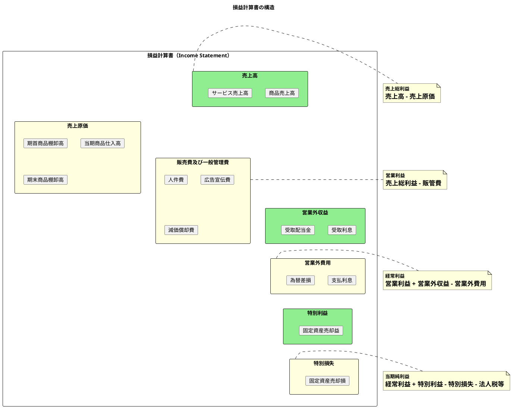
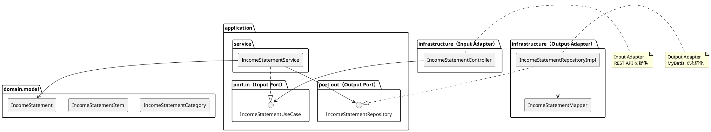
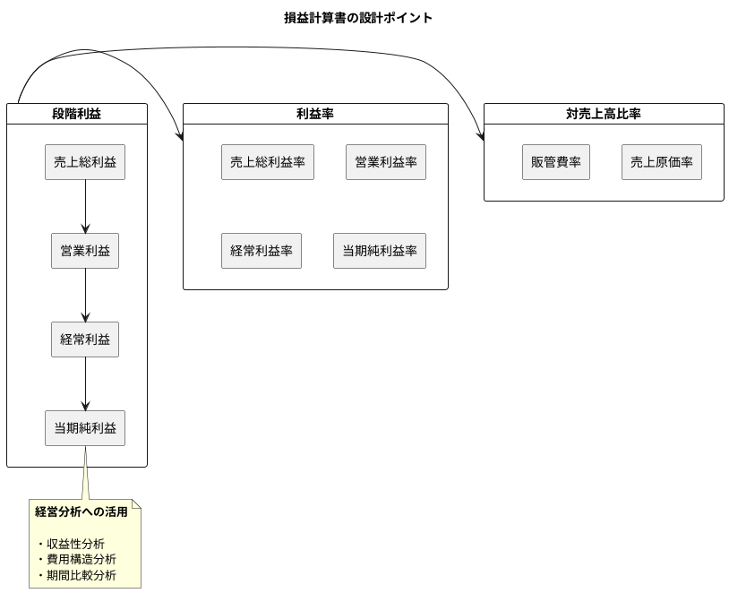

# 第20章: 損益計算書

## 20.1 本章の概要

第6章で設計した日次勘定科目残高テーブルと勘定科目マスタを基に、損益計算書（Income Statement / P/L）の生成機能をヘキサゴナルアーキテクチャに従い、TDD で実装します。

### 損益計算書とは

損益計算書は、一定期間の経営成績を示す財務諸表です。収益と費用を対比させ、企業の利益（または損失）を段階的に計算します。



### 損益計算書の構成要素

| 区分 | 科目区分 | 勘定科目コード範囲 | 説明 |
|------|---------|------------------|------|
| 収益 | 売上高 | 41xx | 本業からの収益 |
| 収益 | 営業外収益 | 42xx | 本業以外の収益 |
| 収益 | 特別利益 | 43xx | 臨時的な利益 |
| 費用 | 売上原価 | 51xx | 商品・製品の原価 |
| 費用 | 販売費及び一般管理費 | 52xx〜59xx | 営業活動の費用 |
| 費用 | 営業外費用 | 61xx | 本業以外の費用 |
| 費用 | 特別損失 | 62xx | 臨時的な損失 |
| 費用 | 法人税等 | 71xx | 法人税、住民税、事業税 |

### アーキテクチャの全体像



### パッケージ構成

```
com.example.accounting/
├── domain/
│   └── model/
│       └── financial/
│           ├── IncomeStatementCategory.java  # 損益計算書区分
│           ├── IncomeStatementItem.java      # 損益計算書項目
│           └── IncomeStatement.java          # 損益計算書
├── application/
│   ├── port/
│   │   ├── in/
│   │   │   └── IncomeStatementUseCase.java   # Input Port
│   │   └── out/
│   │       └── IncomeStatementRepository.java # Output Port
│   └── service/
│       └── IncomeStatementService.java       # Application Service
└── infrastructure/
    ├── persistence/
    │   ├── mapper/
    │   │   └── IncomeStatementMapper.java    # MyBatis Mapper
    │   └── repository/
    │       └── IncomeStatementRepositoryImpl.java  # Output Adapter
    └── web/
        ├── controller/
        │   └── IncomeStatementController.java # Input Adapter
        └── dto/
            └── IncomeStatementResponse.java
```

### TDD の流れ

1. **Domain Model**: ドメインモデルの作成（IncomeStatementCategory, IncomeStatementItem, IncomeStatement）
2. **Output Port**: リポジトリインターフェースの定義
3. **Output Adapter**: Testcontainers でリポジトリ実装をテスト
4. **Input Port**: ユースケースインターフェースの定義
5. **Application Service**: Mockito でアプリケーションサービスをテスト
6. **Input Adapter**: Testcontainers で REST API 統合テスト

---

## 20.2 Domain Model の実装

### 20.2.1 IncomeStatementCategory 列挙型

```java
package com.example.accounting.domain.model.financial;

/**
 * 損益計算書区分
 */
public enum IncomeStatementCategory {
    // 収益
    SALES("売上高", "41", "収益", true),
    NON_OPERATING_REVENUE("営業外収益", "42", "収益", true),
    EXTRAORDINARY_INCOME("特別利益", "43", "収益", true),

    // 費用
    COST_OF_SALES("売上原価", "51", "費用", false),
    SELLING_GENERAL_ADMIN("販売費及び一般管理費", "52", "費用", false),
    NON_OPERATING_EXPENSE("営業外費用", "61", "費用", false),
    EXTRAORDINARY_LOSS("特別損失", "62", "費用", false),
    INCOME_TAXES("法人税等", "71", "費用", false);

    private final String displayName;
    private final String codePrefix;
    private final String sectionName;
    private final boolean isRevenue;

    IncomeStatementCategory(String displayName, String codePrefix, String sectionName, boolean isRevenue) {
        this.displayName = displayName;
        this.codePrefix = codePrefix;
        this.sectionName = sectionName;
        this.isRevenue = isRevenue;
    }

    public String getDisplayName() {
        return displayName;
    }

    public String getCodePrefix() {
        return codePrefix;
    }

    public String getSectionName() {
        return sectionName;
    }

    /**
     * 収益区分か
     */
    public boolean isRevenue() {
        return isRevenue;
    }

    /**
     * 費用区分か
     */
    public boolean isExpense() {
        return !isRevenue;
    }

    /**
     * 売上原価か
     */
    public boolean isCostOfSales() {
        return this == COST_OF_SALES;
    }

    /**
     * 販管費か
     */
    public boolean isSellingGeneralAdmin() {
        return this == SELLING_GENERAL_ADMIN;
    }

    /**
     * 営業外項目か
     */
    public boolean isNonOperating() {
        return this == NON_OPERATING_REVENUE || this == NON_OPERATING_EXPENSE;
    }

    /**
     * 特別項目か
     */
    public boolean isExtraordinary() {
        return this == EXTRAORDINARY_INCOME || this == EXTRAORDINARY_LOSS;
    }

    /**
     * 勘定科目コードから区分を判定
     */
    public static IncomeStatementCategory fromAccountCode(String accountCode) {
        if (accountCode == null || accountCode.length() < 2) {
            throw new IllegalArgumentException("Invalid account code: " + accountCode);
        }

        String prefix = accountCode.substring(0, 2);

        for (IncomeStatementCategory category : values()) {
            if (prefix.equals(category.codePrefix)) {
                return category;
            }
        }

        // 範囲による判定
        int prefixNum = Integer.parseInt(prefix);
        if (prefixNum >= 41 && prefixNum <= 41) {
            return SALES;
        } else if (prefixNum >= 42 && prefixNum <= 42) {
            return NON_OPERATING_REVENUE;
        } else if (prefixNum >= 43 && prefixNum <= 49) {
            return EXTRAORDINARY_INCOME;
        } else if (prefixNum >= 51 && prefixNum <= 51) {
            return COST_OF_SALES;
        } else if (prefixNum >= 52 && prefixNum <= 59) {
            return SELLING_GENERAL_ADMIN;
        } else if (prefixNum >= 61 && prefixNum <= 61) {
            return NON_OPERATING_EXPENSE;
        } else if (prefixNum >= 62 && prefixNum <= 69) {
            return EXTRAORDINARY_LOSS;
        } else if (prefixNum >= 71 && prefixNum <= 79) {
            return INCOME_TAXES;
        }

        throw new IllegalArgumentException("Unknown P/L category for account code: " + accountCode);
    }
}
```

### 20.2.2 IncomeStatementItem ドメインモデル

```java
package com.example.accounting.domain.model.financial;

import lombok.Value;
import lombok.With;

import java.math.BigDecimal;
import java.math.RoundingMode;

/**
 * 損益計算書項目
 */
@Value
@With
public class IncomeStatementItem {

    String accountCode;                   // 勘定科目コード
    String accountName;                   // 勘定科目名
    IncomeStatementCategory category;     // 区分
    BigDecimal amount;                    // 金額
    BigDecimal percentage;                // 対売上高比率（%）

    /**
     * 残高データから損益計算書項目を作成
     */
    public static IncomeStatementItem create(
            String accountCode,
            String accountName,
            BigDecimal debitTotal,
            BigDecimal creditTotal,
            String debitCreditType) {

        IncomeStatementCategory category = IncomeStatementCategory.fromAccountCode(accountCode);

        // 収益は貸方 - 借方、費用は借方 - 貸方
        BigDecimal amount;
        if ("貸".equals(debitCreditType)) {
            // 収益科目: 貸方 - 借方
            amount = creditTotal.subtract(debitTotal);
        } else {
            // 費用科目: 借方 - 貸方
            amount = debitTotal.subtract(creditTotal);
        }

        return new IncomeStatementItem(
                accountCode,
                accountName,
                category,
                amount.abs(),
                BigDecimal.ZERO); // 比率は後で計算
    }

    /**
     * 対売上高比率を計算して新しいインスタンスを返す
     */
    public IncomeStatementItem withPercentage(BigDecimal totalSales) {
        if (totalSales.compareTo(BigDecimal.ZERO) == 0) {
            return this.withPercentage(BigDecimal.ZERO);
        }

        BigDecimal pct = amount
                .multiply(new BigDecimal("100"))
                .divide(totalSales, 2, RoundingMode.HALF_UP);

        return this.withPercentage(pct);
    }

    /**
     * 収益項目か
     */
    public boolean isRevenue() {
        return category.isRevenue();
    }

    /**
     * 費用項目か
     */
    public boolean isExpense() {
        return category.isExpense();
    }

    /**
     * 売上高か
     */
    public boolean isSales() {
        return category == IncomeStatementCategory.SALES;
    }

    /**
     * 売上原価か
     */
    public boolean isCostOfSales() {
        return category.isCostOfSales();
    }

    /**
     * 販管費か
     */
    public boolean isSellingGeneralAdmin() {
        return category.isSellingGeneralAdmin();
    }

    /**
     * 営業外収益か
     */
    public boolean isNonOperatingRevenue() {
        return category == IncomeStatementCategory.NON_OPERATING_REVENUE;
    }

    /**
     * 営業外費用か
     */
    public boolean isNonOperatingExpense() {
        return category == IncomeStatementCategory.NON_OPERATING_EXPENSE;
    }

    /**
     * 特別利益か
     */
    public boolean isExtraordinaryIncome() {
        return category == IncomeStatementCategory.EXTRAORDINARY_INCOME;
    }

    /**
     * 特別損失か
     */
    public boolean isExtraordinaryLoss() {
        return category == IncomeStatementCategory.EXTRAORDINARY_LOSS;
    }

    /**
     * 法人税等か
     */
    public boolean isIncomeTaxes() {
        return category == IncomeStatementCategory.INCOME_TAXES;
    }
}
```

### 20.2.3 IncomeStatement ドメインモデル

```java
package com.example.accounting.domain.model.financial;

import lombok.Value;
import lombok.With;

import java.math.BigDecimal;
import java.math.RoundingMode;
import java.time.LocalDate;
import java.util.List;
import java.util.stream.Collectors;

/**
 * 損益計算書ドメインモデル
 */
@Value
@With
public class IncomeStatement {

    LocalDate fromDate;                        // 開始日
    LocalDate toDate;                          // 終了日
    Integer fiscalYear;                        // 会計年度
    List<IncomeStatementItem> revenues;        // 収益項目
    List<IncomeStatementItem> expenses;        // 費用項目
    BigDecimal totalSales;                     // 売上高合計
    BigDecimal totalRevenues;                  // 収益合計
    BigDecimal totalExpenses;                  // 費用合計
    BigDecimal grossProfit;                    // 売上総利益
    BigDecimal operatingIncome;                // 営業利益
    BigDecimal ordinaryIncome;                 // 経常利益
    BigDecimal incomeBeforeTaxes;              // 税引前当期純利益
    BigDecimal netIncome;                      // 当期純利益

    /**
     * 残高データから損益計算書を作成
     */
    public static IncomeStatement create(
            LocalDate fromDate,
            LocalDate toDate,
            Integer fiscalYear,
            List<IncomeStatementItem> items) {

        // 収益・費用に分類
        List<IncomeStatementItem> revenueItems = items.stream()
                .filter(IncomeStatementItem::isRevenue)
                .collect(Collectors.toList());

        List<IncomeStatementItem> expenseItems = items.stream()
                .filter(IncomeStatementItem::isExpense)
                .collect(Collectors.toList());

        // 売上高
        BigDecimal totalSales = items.stream()
                .filter(IncomeStatementItem::isSales)
                .map(IncomeStatementItem::getAmount)
                .reduce(BigDecimal.ZERO, BigDecimal::add);

        // 売上原価
        BigDecimal costOfSales = items.stream()
                .filter(IncomeStatementItem::isCostOfSales)
                .map(IncomeStatementItem::getAmount)
                .reduce(BigDecimal.ZERO, BigDecimal::add);

        // 販管費
        BigDecimal sellingGeneralAdmin = items.stream()
                .filter(IncomeStatementItem::isSellingGeneralAdmin)
                .map(IncomeStatementItem::getAmount)
                .reduce(BigDecimal.ZERO, BigDecimal::add);

        // 営業外収益
        BigDecimal nonOperatingRevenue = items.stream()
                .filter(IncomeStatementItem::isNonOperatingRevenue)
                .map(IncomeStatementItem::getAmount)
                .reduce(BigDecimal.ZERO, BigDecimal::add);

        // 営業外費用
        BigDecimal nonOperatingExpense = items.stream()
                .filter(IncomeStatementItem::isNonOperatingExpense)
                .map(IncomeStatementItem::getAmount)
                .reduce(BigDecimal.ZERO, BigDecimal::add);

        // 特別利益
        BigDecimal extraordinaryIncome = items.stream()
                .filter(IncomeStatementItem::isExtraordinaryIncome)
                .map(IncomeStatementItem::getAmount)
                .reduce(BigDecimal.ZERO, BigDecimal::add);

        // 特別損失
        BigDecimal extraordinaryLoss = items.stream()
                .filter(IncomeStatementItem::isExtraordinaryLoss)
                .map(IncomeStatementItem::getAmount)
                .reduce(BigDecimal.ZERO, BigDecimal::add);

        // 法人税等
        BigDecimal incomeTaxes = items.stream()
                .filter(IncomeStatementItem::isIncomeTaxes)
                .map(IncomeStatementItem::getAmount)
                .reduce(BigDecimal.ZERO, BigDecimal::add);

        // 収益合計・費用合計
        BigDecimal totalRevenues = revenueItems.stream()
                .map(IncomeStatementItem::getAmount)
                .reduce(BigDecimal.ZERO, BigDecimal::add);

        BigDecimal totalExpenses = expenseItems.stream()
                .map(IncomeStatementItem::getAmount)
                .reduce(BigDecimal.ZERO, BigDecimal::add);

        // 利益計算
        BigDecimal grossProfit = totalSales.subtract(costOfSales);
        BigDecimal operatingIncome = grossProfit.subtract(sellingGeneralAdmin);
        BigDecimal ordinaryIncome = operatingIncome
                .add(nonOperatingRevenue)
                .subtract(nonOperatingExpense);
        BigDecimal incomeBeforeTaxes = ordinaryIncome
                .add(extraordinaryIncome)
                .subtract(extraordinaryLoss);
        BigDecimal netIncome = incomeBeforeTaxes.subtract(incomeTaxes);

        // 対売上高比率を計算
        List<IncomeStatementItem> revenuesWithPercentage = revenueItems.stream()
                .map(item -> item.withPercentage(totalSales))
                .collect(Collectors.toList());

        List<IncomeStatementItem> expensesWithPercentage = expenseItems.stream()
                .map(item -> item.withPercentage(totalSales))
                .collect(Collectors.toList());

        return new IncomeStatement(
                fromDate,
                toDate,
                fiscalYear,
                revenuesWithPercentage,
                expensesWithPercentage,
                totalSales,
                totalRevenues,
                totalExpenses,
                grossProfit,
                operatingIncome,
                ordinaryIncome,
                incomeBeforeTaxes,
                netIncome);
    }

    /**
     * 売上総利益率を計算（売上総利益 ÷ 売上高 × 100）
     */
    public BigDecimal getGrossProfitMargin() {
        if (totalSales.compareTo(BigDecimal.ZERO) == 0) {
            return BigDecimal.ZERO;
        }
        return grossProfit
                .multiply(new BigDecimal("100"))
                .divide(totalSales, 2, RoundingMode.HALF_UP);
    }

    /**
     * 営業利益率を計算（営業利益 ÷ 売上高 × 100）
     */
    public BigDecimal getOperatingProfitMargin() {
        if (totalSales.compareTo(BigDecimal.ZERO) == 0) {
            return BigDecimal.ZERO;
        }
        return operatingIncome
                .multiply(new BigDecimal("100"))
                .divide(totalSales, 2, RoundingMode.HALF_UP);
    }

    /**
     * 経常利益率を計算（経常利益 ÷ 売上高 × 100）
     */
    public BigDecimal getOrdinaryProfitMargin() {
        if (totalSales.compareTo(BigDecimal.ZERO) == 0) {
            return BigDecimal.ZERO;
        }
        return ordinaryIncome
                .multiply(new BigDecimal("100"))
                .divide(totalSales, 2, RoundingMode.HALF_UP);
    }

    /**
     * 当期純利益率を計算（当期純利益 ÷ 売上高 × 100）
     */
    public BigDecimal getNetProfitMargin() {
        if (totalSales.compareTo(BigDecimal.ZERO) == 0) {
            return BigDecimal.ZERO;
        }
        return netIncome
                .multiply(new BigDecimal("100"))
                .divide(totalSales, 2, RoundingMode.HALF_UP);
    }

    /**
     * 売上原価率を計算（売上原価 ÷ 売上高 × 100）
     */
    public BigDecimal getCostOfSalesRatio() {
        if (totalSales.compareTo(BigDecimal.ZERO) == 0) {
            return BigDecimal.ZERO;
        }
        BigDecimal costOfSales = expenses.stream()
                .filter(IncomeStatementItem::isCostOfSales)
                .map(IncomeStatementItem::getAmount)
                .reduce(BigDecimal.ZERO, BigDecimal::add);

        return costOfSales
                .multiply(new BigDecimal("100"))
                .divide(totalSales, 2, RoundingMode.HALF_UP);
    }

    /**
     * 販管費比率を計算（販管費 ÷ 売上高 × 100）
     */
    public BigDecimal getSgaRatio() {
        if (totalSales.compareTo(BigDecimal.ZERO) == 0) {
            return BigDecimal.ZERO;
        }
        BigDecimal sga = expenses.stream()
                .filter(IncomeStatementItem::isSellingGeneralAdmin)
                .map(IncomeStatementItem::getAmount)
                .reduce(BigDecimal.ZERO, BigDecimal::add);

        return sga
                .multiply(new BigDecimal("100"))
                .divide(totalSales, 2, RoundingMode.HALF_UP);
    }

    /**
     * 黒字か
     */
    public boolean isProfitable() {
        return netIncome.compareTo(BigDecimal.ZERO) > 0;
    }

    /**
     * 赤字か
     */
    public boolean isDeficit() {
        return netIncome.compareTo(BigDecimal.ZERO) < 0;
    }
}
```

---

## 20.3 Domain Model のテスト

### 20.3.1 IncomeStatementCategory のテスト

```java
package com.example.accounting.domain.model.financial;

import org.junit.jupiter.api.DisplayName;
import org.junit.jupiter.api.Nested;
import org.junit.jupiter.api.Test;
import org.junit.jupiter.params.ParameterizedTest;
import org.junit.jupiter.params.provider.CsvSource;

import static org.assertj.core.api.Assertions.assertThat;
import static org.assertj.core.api.Assertions.assertThatThrownBy;

@DisplayName("IncomeStatementCategory（損益計算書区分）")
class IncomeStatementCategoryTest {

    @Nested
    @DisplayName("勘定科目コードからの区分判定")
    class FromAccountCode {

        @ParameterizedTest
        @CsvSource({
            "4110, SALES, 売上高",
            "4210, NON_OPERATING_REVENUE, 営業外収益",
            "4310, EXTRAORDINARY_INCOME, 特別利益"
        })
        @DisplayName("収益科目を正しく判定できる")
        void test_収益科目の判定(String accountCode, IncomeStatementCategory expected, String displayName) {
            // When
            IncomeStatementCategory category = IncomeStatementCategory.fromAccountCode(accountCode);

            // Then
            assertThat(category).isEqualTo(expected);
            assertThat(category.getDisplayName()).isEqualTo(displayName);
            assertThat(category.isRevenue()).isTrue();
            assertThat(category.isExpense()).isFalse();
        }

        @ParameterizedTest
        @CsvSource({
            "5110, COST_OF_SALES, 売上原価",
            "5210, SELLING_GENERAL_ADMIN, 販売費及び一般管理費",
            "6110, NON_OPERATING_EXPENSE, 営業外費用",
            "6210, EXTRAORDINARY_LOSS, 特別損失",
            "7110, INCOME_TAXES, 法人税等"
        })
        @DisplayName("費用科目を正しく判定できる")
        void test_費用科目の判定(String accountCode, IncomeStatementCategory expected, String displayName) {
            // When
            IncomeStatementCategory category = IncomeStatementCategory.fromAccountCode(accountCode);

            // Then
            assertThat(category).isEqualTo(expected);
            assertThat(category.getDisplayName()).isEqualTo(displayName);
            assertThat(category.isRevenue()).isFalse();
            assertThat(category.isExpense()).isTrue();
        }

        @Test
        @DisplayName("不正な勘定科目コードは例外をスロー")
        void test_不正な勘定科目コード() {
            assertThatThrownBy(() -> IncomeStatementCategory.fromAccountCode("1110"))
                    .isInstanceOf(IllegalArgumentException.class);

            assertThatThrownBy(() -> IncomeStatementCategory.fromAccountCode(null))
                    .isInstanceOf(IllegalArgumentException.class);
        }
    }

    @Nested
    @DisplayName("区分判定メソッド")
    class CategoryJudgment {

        @Test
        @DisplayName("売上原価・販管費を判定できる")
        void test_費用区分の判定() {
            assertThat(IncomeStatementCategory.COST_OF_SALES.isCostOfSales()).isTrue();
            assertThat(IncomeStatementCategory.SELLING_GENERAL_ADMIN.isSellingGeneralAdmin()).isTrue();
        }

        @Test
        @DisplayName("営業外項目を判定できる")
        void test_営業外項目の判定() {
            assertThat(IncomeStatementCategory.NON_OPERATING_REVENUE.isNonOperating()).isTrue();
            assertThat(IncomeStatementCategory.NON_OPERATING_EXPENSE.isNonOperating()).isTrue();
            assertThat(IncomeStatementCategory.SALES.isNonOperating()).isFalse();
        }

        @Test
        @DisplayName("特別項目を判定できる")
        void test_特別項目の判定() {
            assertThat(IncomeStatementCategory.EXTRAORDINARY_INCOME.isExtraordinary()).isTrue();
            assertThat(IncomeStatementCategory.EXTRAORDINARY_LOSS.isExtraordinary()).isTrue();
            assertThat(IncomeStatementCategory.SALES.isExtraordinary()).isFalse();
        }
    }
}
```

### 20.3.2 IncomeStatementItem のテスト

```java
package com.example.accounting.domain.model.financial;

import org.junit.jupiter.api.DisplayName;
import org.junit.jupiter.api.Nested;
import org.junit.jupiter.api.Test;

import java.math.BigDecimal;

import static org.assertj.core.api.Assertions.assertThat;

@DisplayName("IncomeStatementItem（損益計算書項目）")
class IncomeStatementItemTest {

    @Nested
    @DisplayName("金額計算")
    class AmountCalculation {

        @Test
        @DisplayName("収益科目（貸方）の金額を計算できる")
        void test_収益科目の金額計算() {
            // Given: 売上高 借方0 貸方1,000,000
            BigDecimal debitTotal = BigDecimal.ZERO;
            BigDecimal creditTotal = new BigDecimal("1000000");

            // When
            IncomeStatementItem item = IncomeStatementItem.create(
                    "4110", "売上高", debitTotal, creditTotal, "貸");

            // Then: 金額 = 1,000,000
            assertThat(item.getAmount()).isEqualByComparingTo("1000000");
            assertThat(item.isRevenue()).isTrue();
            assertThat(item.isSales()).isTrue();
        }

        @Test
        @DisplayName("費用科目（借方）の金額を計算できる")
        void test_費用科目の金額計算() {
            // Given: 仕入高 借方600,000 貸方0
            BigDecimal debitTotal = new BigDecimal("600000");
            BigDecimal creditTotal = BigDecimal.ZERO;

            // When
            IncomeStatementItem item = IncomeStatementItem.create(
                    "5110", "仕入高", debitTotal, creditTotal, "借");

            // Then: 金額 = 600,000
            assertThat(item.getAmount()).isEqualByComparingTo("600000");
            assertThat(item.isExpense()).isTrue();
            assertThat(item.isCostOfSales()).isTrue();
        }

        @Test
        @DisplayName("販管費の金額を計算できる")
        void test_販管費の金額計算() {
            // Given: 給与手当 借方200,000 貸方0
            BigDecimal debitTotal = new BigDecimal("200000");
            BigDecimal creditTotal = BigDecimal.ZERO;

            // When
            IncomeStatementItem item = IncomeStatementItem.create(
                    "5210", "給与手当", debitTotal, creditTotal, "借");

            // Then
            assertThat(item.getAmount()).isEqualByComparingTo("200000");
            assertThat(item.isSellingGeneralAdmin()).isTrue();
        }
    }

    @Nested
    @DisplayName("対売上高比率計算")
    class PercentageCalculation {

        @Test
        @DisplayName("対売上高比率を計算できる")
        void test_対売上高比率の計算() {
            // Given: 金額 300,000 / 売上高 1,000,000
            IncomeStatementItem item = IncomeStatementItem.create(
                    "5110", "仕入高",
                    new BigDecimal("300000"), BigDecimal.ZERO, "借");

            // When
            IncomeStatementItem itemWithPercentage = item.withPercentage(new BigDecimal("1000000"));

            // Then: 対売上高比率 = 30.00%
            assertThat(itemWithPercentage.getPercentage()).isEqualByComparingTo("30.00");
        }

        @Test
        @DisplayName("売上高ゼロの場合は比率ゼロ")
        void test_売上高ゼロの場合() {
            // Given
            IncomeStatementItem item = IncomeStatementItem.create(
                    "5110", "仕入高",
                    new BigDecimal("100000"), BigDecimal.ZERO, "借");

            // When
            IncomeStatementItem itemWithPercentage = item.withPercentage(BigDecimal.ZERO);

            // Then
            assertThat(itemWithPercentage.getPercentage()).isEqualByComparingTo("0");
        }
    }

    @Nested
    @DisplayName("区分判定")
    class CategoryJudgment {

        @Test
        @DisplayName("営業外収益・費用を判定できる")
        void test_営業外項目の判定() {
            // Given
            IncomeStatementItem nonOpRevenue = IncomeStatementItem.create(
                    "4210", "受取利息", BigDecimal.ZERO, new BigDecimal("10000"), "貸");
            IncomeStatementItem nonOpExpense = IncomeStatementItem.create(
                    "6110", "支払利息", new BigDecimal("5000"), BigDecimal.ZERO, "借");

            // Then
            assertThat(nonOpRevenue.isNonOperatingRevenue()).isTrue();
            assertThat(nonOpExpense.isNonOperatingExpense()).isTrue();
        }

        @Test
        @DisplayName("特別利益・損失を判定できる")
        void test_特別項目の判定() {
            // Given
            IncomeStatementItem extraIncome = IncomeStatementItem.create(
                    "4310", "固定資産売却益", BigDecimal.ZERO, new BigDecimal("50000"), "貸");
            IncomeStatementItem extraLoss = IncomeStatementItem.create(
                    "6210", "固定資産売却損", new BigDecimal("30000"), BigDecimal.ZERO, "借");

            // Then
            assertThat(extraIncome.isExtraordinaryIncome()).isTrue();
            assertThat(extraLoss.isExtraordinaryLoss()).isTrue();
        }
    }
}
```

### 20.3.3 IncomeStatement のテスト

```java
package com.example.accounting.domain.model.financial;

import org.junit.jupiter.api.DisplayName;
import org.junit.jupiter.api.Nested;
import org.junit.jupiter.api.Test;

import java.math.BigDecimal;
import java.time.LocalDate;
import java.util.List;

import static org.assertj.core.api.Assertions.assertThat;

@DisplayName("IncomeStatement（損益計算書）")
class IncomeStatementTest {

    @Nested
    @DisplayName("損益計算書の作成")
    class CreateIncomeStatement {

        @Test
        @DisplayName("残高データから損益計算書を作成できる")
        void test_損益計算書の作成() {
            // Given
            List<IncomeStatementItem> items = List.of(
                    // 売上高: 1,000,000
                    IncomeStatementItem.create("4110", "売上高",
                            BigDecimal.ZERO, new BigDecimal("1000000"), "貸"),
                    // 売上原価: 600,000
                    IncomeStatementItem.create("5110", "仕入高",
                            new BigDecimal("600000"), BigDecimal.ZERO, "借"),
                    // 販管費: 200,000
                    IncomeStatementItem.create("5210", "給与手当",
                            new BigDecimal("200000"), BigDecimal.ZERO, "借")
            );

            // When
            IncomeStatement incomeStatement = IncomeStatement.create(
                    LocalDate.of(2024, 4, 1),
                    LocalDate.of(2025, 3, 31),
                    2024,
                    items);

            // Then
            assertThat(incomeStatement.getFromDate()).isEqualTo(LocalDate.of(2024, 4, 1));
            assertThat(incomeStatement.getToDate()).isEqualTo(LocalDate.of(2025, 3, 31));
            assertThat(incomeStatement.getFiscalYear()).isEqualTo(2024);
            assertThat(incomeStatement.getRevenues()).hasSize(1);
            assertThat(incomeStatement.getExpenses()).hasSize(2);
        }
    }

    @Nested
    @DisplayName("利益計算")
    class ProfitCalculation {

        private IncomeStatement createSampleIncomeStatement() {
            List<IncomeStatementItem> items = List.of(
                    // 売上高: 10,000,000
                    IncomeStatementItem.create("4110", "売上高",
                            BigDecimal.ZERO, new BigDecimal("10000000"), "貸"),
                    // 売上原価: 6,000,000
                    IncomeStatementItem.create("5110", "仕入高",
                            new BigDecimal("6000000"), BigDecimal.ZERO, "借"),
                    // 販管費: 2,000,000
                    IncomeStatementItem.create("5210", "給与手当",
                            new BigDecimal("2000000"), BigDecimal.ZERO, "借"),
                    // 営業外収益: 100,000
                    IncomeStatementItem.create("4210", "受取利息",
                            BigDecimal.ZERO, new BigDecimal("100000"), "貸"),
                    // 営業外費用: 50,000
                    IncomeStatementItem.create("6110", "支払利息",
                            new BigDecimal("50000"), BigDecimal.ZERO, "借"),
                    // 特別利益: 200,000
                    IncomeStatementItem.create("4310", "固定資産売却益",
                            BigDecimal.ZERO, new BigDecimal("200000"), "貸"),
                    // 特別損失: 100,000
                    IncomeStatementItem.create("6210", "固定資産売却損",
                            new BigDecimal("100000"), BigDecimal.ZERO, "借"),
                    // 法人税等: 600,000
                    IncomeStatementItem.create("7110", "法人税等",
                            new BigDecimal("600000"), BigDecimal.ZERO, "借")
            );

            return IncomeStatement.create(
                    LocalDate.of(2024, 4, 1),
                    LocalDate.of(2025, 3, 31),
                    2024,
                    items);
        }

        @Test
        @DisplayName("売上総利益を計算できる")
        void test_売上総利益の計算() {
            // Given
            IncomeStatement incomeStatement = createSampleIncomeStatement();

            // When: 売上総利益 = 売上高 - 売上原価
            BigDecimal grossProfit = incomeStatement.getGrossProfit();

            // Then: 10,000,000 - 6,000,000 = 4,000,000
            assertThat(grossProfit).isEqualByComparingTo("4000000");
        }

        @Test
        @DisplayName("営業利益を計算できる")
        void test_営業利益の計算() {
            // Given
            IncomeStatement incomeStatement = createSampleIncomeStatement();

            // When: 営業利益 = 売上総利益 - 販管費
            BigDecimal operatingIncome = incomeStatement.getOperatingIncome();

            // Then: 4,000,000 - 2,000,000 = 2,000,000
            assertThat(operatingIncome).isEqualByComparingTo("2000000");
        }

        @Test
        @DisplayName("経常利益を計算できる")
        void test_経常利益の計算() {
            // Given
            IncomeStatement incomeStatement = createSampleIncomeStatement();

            // When: 経常利益 = 営業利益 + 営業外収益 - 営業外費用
            BigDecimal ordinaryIncome = incomeStatement.getOrdinaryIncome();

            // Then: 2,000,000 + 100,000 - 50,000 = 2,050,000
            assertThat(ordinaryIncome).isEqualByComparingTo("2050000");
        }

        @Test
        @DisplayName("税引前当期純利益を計算できる")
        void test_税引前当期純利益の計算() {
            // Given
            IncomeStatement incomeStatement = createSampleIncomeStatement();

            // When: 税引前当期純利益 = 経常利益 + 特別利益 - 特別損失
            BigDecimal incomeBeforeTaxes = incomeStatement.getIncomeBeforeTaxes();

            // Then: 2,050,000 + 200,000 - 100,000 = 2,150,000
            assertThat(incomeBeforeTaxes).isEqualByComparingTo("2150000");
        }

        @Test
        @DisplayName("当期純利益を計算できる")
        void test_当期純利益の計算() {
            // Given
            IncomeStatement incomeStatement = createSampleIncomeStatement();

            // When: 当期純利益 = 税引前当期純利益 - 法人税等
            BigDecimal netIncome = incomeStatement.getNetIncome();

            // Then: 2,150,000 - 600,000 = 1,550,000
            assertThat(netIncome).isEqualByComparingTo("1550000");
        }
    }

    @Nested
    @DisplayName("利益率計算")
    class ProfitMarginCalculation {

        private IncomeStatement createSampleIncomeStatement() {
            List<IncomeStatementItem> items = List.of(
                    IncomeStatementItem.create("4110", "売上高",
                            BigDecimal.ZERO, new BigDecimal("10000000"), "貸"),
                    IncomeStatementItem.create("5110", "仕入高",
                            new BigDecimal("6000000"), BigDecimal.ZERO, "借"),
                    IncomeStatementItem.create("5210", "給与手当",
                            new BigDecimal("2000000"), BigDecimal.ZERO, "借")
            );

            return IncomeStatement.create(
                    LocalDate.of(2024, 4, 1),
                    LocalDate.of(2025, 3, 31),
                    2024,
                    items);
        }

        @Test
        @DisplayName("売上総利益率を計算できる")
        void test_売上総利益率の計算() {
            // Given
            IncomeStatement incomeStatement = createSampleIncomeStatement();

            // When: 売上総利益率 = 売上総利益 / 売上高 × 100
            BigDecimal grossProfitMargin = incomeStatement.getGrossProfitMargin();

            // Then: 4,000,000 / 10,000,000 × 100 = 40%
            assertThat(grossProfitMargin).isEqualByComparingTo("40.00");
        }

        @Test
        @DisplayName("営業利益率を計算できる")
        void test_営業利益率の計算() {
            // Given
            IncomeStatement incomeStatement = createSampleIncomeStatement();

            // When: 営業利益率 = 営業利益 / 売上高 × 100
            BigDecimal operatingProfitMargin = incomeStatement.getOperatingProfitMargin();

            // Then: 2,000,000 / 10,000,000 × 100 = 20%
            assertThat(operatingProfitMargin).isEqualByComparingTo("20.00");
        }

        @Test
        @DisplayName("売上原価率を計算できる")
        void test_売上原価率の計算() {
            // Given
            IncomeStatement incomeStatement = createSampleIncomeStatement();

            // When: 売上原価率 = 売上原価 / 売上高 × 100
            BigDecimal costOfSalesRatio = incomeStatement.getCostOfSalesRatio();

            // Then: 6,000,000 / 10,000,000 × 100 = 60%
            assertThat(costOfSalesRatio).isEqualByComparingTo("60.00");
        }

        @Test
        @DisplayName("販管費比率を計算できる")
        void test_販管費比率の計算() {
            // Given
            IncomeStatement incomeStatement = createSampleIncomeStatement();

            // When: 販管費比率 = 販管費 / 売上高 × 100
            BigDecimal sgaRatio = incomeStatement.getSgaRatio();

            // Then: 2,000,000 / 10,000,000 × 100 = 20%
            assertThat(sgaRatio).isEqualByComparingTo("20.00");
        }
    }

    @Nested
    @DisplayName("黒字・赤字判定")
    class ProfitabilityJudgment {

        @Test
        @DisplayName("黒字を判定できる")
        void test_黒字判定() {
            // Given
            List<IncomeStatementItem> items = List.of(
                    IncomeStatementItem.create("4110", "売上高",
                            BigDecimal.ZERO, new BigDecimal("1000000"), "貸"),
                    IncomeStatementItem.create("5110", "仕入高",
                            new BigDecimal("600000"), BigDecimal.ZERO, "借")
            );

            IncomeStatement incomeStatement = IncomeStatement.create(
                    LocalDate.of(2024, 4, 1), LocalDate.of(2025, 3, 31), 2024, items);

            // Then
            assertThat(incomeStatement.isProfitable()).isTrue();
            assertThat(incomeStatement.isDeficit()).isFalse();
        }

        @Test
        @DisplayName("赤字を判定できる")
        void test_赤字判定() {
            // Given
            List<IncomeStatementItem> items = List.of(
                    IncomeStatementItem.create("4110", "売上高",
                            BigDecimal.ZERO, new BigDecimal("500000"), "貸"),
                    IncomeStatementItem.create("5110", "仕入高",
                            new BigDecimal("800000"), BigDecimal.ZERO, "借")
            );

            IncomeStatement incomeStatement = IncomeStatement.create(
                    LocalDate.of(2024, 4, 1), LocalDate.of(2025, 3, 31), 2024, items);

            // Then
            assertThat(incomeStatement.isProfitable()).isFalse();
            assertThat(incomeStatement.isDeficit()).isTrue();
        }
    }
}
```

---

## 20.4 Output Port の定義

### 20.4.1 IncomeStatementRepository インターフェース

```java
package com.example.accounting.application.port.out;

import com.example.accounting.domain.model.financial.IncomeStatementItem;

import java.time.LocalDate;
import java.util.List;

/**
 * 損益計算書リポジトリ（Output Port）
 */
public interface IncomeStatementRepository {

    /**
     * 指定期間の P/L 科目残高を取得
     *
     * @param fromDate 開始日
     * @param toDate   終了日
     * @return 損益計算書項目リスト
     */
    List<IncomeStatementItem> findByPeriod(LocalDate fromDate, LocalDate toDate);

    /**
     * 指定会計年度の P/L 科目残高を取得
     *
     * @param fiscalYear 会計年度
     * @return 損益計算書項目リスト
     */
    List<IncomeStatementItem> findByFiscalYear(Integer fiscalYear);

    /**
     * 月次損益を取得
     *
     * @param fiscalYear 会計年度
     * @param month      月（1-12）
     * @return 損益計算書項目リスト
     */
    List<IncomeStatementItem> findByMonth(Integer fiscalYear, Integer month);
}
```

---

## 20.5 Output Adapter の実装

### 20.5.1 IncomeStatementMapper インターフェース

```java
package com.example.accounting.infrastructure.persistence.mapper;

import org.apache.ibatis.annotations.Mapper;
import org.apache.ibatis.annotations.Param;

import java.time.LocalDate;
import java.util.List;
import java.util.Map;

/**
 * 損益計算書 MyBatis Mapper
 */
@Mapper
public interface IncomeStatementMapper {

    /**
     * 指定期間の P/L 科目残高を取得
     */
    List<Map<String, Object>> selectByPeriod(
            @Param("fromDate") LocalDate fromDate,
            @Param("toDate") LocalDate toDate);

    /**
     * 指定会計年度の P/L 科目残高を取得
     */
    List<Map<String, Object>> selectByFiscalYear(@Param("fiscalYear") Integer fiscalYear);

    /**
     * 月次損益を取得
     */
    List<Map<String, Object>> selectByMonth(
            @Param("fiscalYear") Integer fiscalYear,
            @Param("month") Integer month);
}
```

### 20.5.2 MyBatis Mapper XML

`src/main/resources/mapper/IncomeStatementMapper.xml`:

```xml
<?xml version="1.0" encoding="UTF-8" ?>
<!DOCTYPE mapper PUBLIC "-//mybatis.org//DTD Mapper 3.0//EN"
        "http://mybatis.org/dtd/mybatis-3-mapper.dtd">

<mapper namespace="com.example.accounting.infrastructure.persistence.mapper.IncomeStatementMapper">

    <!-- P/L科目残高クエリ -->
    <sql id="incomeStatementBase">
        SELECT
            a."勘定科目コード" as account_code,
            a."勘定科目名" as account_name,
            a."貸借区分" as debit_credit_type,
            COALESCE(SUM(d."借方金額"), 0) as debit_total,
            COALESCE(SUM(d."貸方金額"), 0) as credit_total
        FROM "勘定科目マスタ" a
        LEFT JOIN "日次勘定科目残高" d
            ON a."勘定科目コード" = d."勘定科目コード"
        WHERE a."BSPL区分" = 'P'
    </sql>

    <!-- 指定期間の残高 -->
    <select id="selectByPeriod" resultType="map">
        <include refid="incomeStatementBase"/>
            AND d."起票日" BETWEEN #{fromDate} AND #{toDate}
        GROUP BY a."勘定科目コード", a."勘定科目名", a."貸借区分"
        HAVING COALESCE(SUM(d."借方金額"), 0) != 0
            OR COALESCE(SUM(d."貸方金額"), 0) != 0
        ORDER BY a."勘定科目コード"
    </select>

    <!-- 指定会計年度の残高 -->
    <select id="selectByFiscalYear" resultType="map">
        <include refid="incomeStatementBase"/>
            AND d."起票日" BETWEEN MAKE_DATE(#{fiscalYear}, 4, 1) AND MAKE_DATE(#{fiscalYear} + 1, 3, 31)
        GROUP BY a."勘定科目コード", a."勘定科目名", a."貸借区分"
        HAVING COALESCE(SUM(d."借方金額"), 0) != 0
            OR COALESCE(SUM(d."貸方金額"), 0) != 0
        ORDER BY a."勘定科目コード"
    </select>

    <!-- 月次損益 -->
    <select id="selectByMonth" resultType="map">
        <include refid="incomeStatementBase"/>
            AND EXTRACT(YEAR FROM d."起票日") = CASE
                WHEN #{month} >= 4 THEN #{fiscalYear}
                ELSE #{fiscalYear} + 1
            END
            AND EXTRACT(MONTH FROM d."起票日") = #{month}
        GROUP BY a."勘定科目コード", a."勘定科目名", a."貸借区分"
        HAVING COALESCE(SUM(d."借方金額"), 0) != 0
            OR COALESCE(SUM(d."貸方金額"), 0) != 0
        ORDER BY a."勘定科目コード"
    </select>

</mapper>
```

### 20.5.3 IncomeStatementRepositoryImpl

```java
package com.example.accounting.infrastructure.persistence.repository;

import com.example.accounting.application.port.out.IncomeStatementRepository;
import com.example.accounting.domain.model.financial.IncomeStatementItem;
import com.example.accounting.infrastructure.persistence.mapper.IncomeStatementMapper;
import lombok.RequiredArgsConstructor;
import org.springframework.stereotype.Repository;

import java.math.BigDecimal;
import java.time.LocalDate;
import java.util.List;
import java.util.Map;
import java.util.stream.Collectors;

/**
 * 損益計算書リポジトリ実装（Output Adapter）
 */
@Repository
@RequiredArgsConstructor
public class IncomeStatementRepositoryImpl implements IncomeStatementRepository {

    private final IncomeStatementMapper mapper;

    @Override
    public List<IncomeStatementItem> findByPeriod(LocalDate fromDate, LocalDate toDate) {
        return mapper.selectByPeriod(fromDate, toDate).stream()
                .map(this::mapToIncomeStatementItem)
                .collect(Collectors.toList());
    }

    @Override
    public List<IncomeStatementItem> findByFiscalYear(Integer fiscalYear) {
        return mapper.selectByFiscalYear(fiscalYear).stream()
                .map(this::mapToIncomeStatementItem)
                .collect(Collectors.toList());
    }

    @Override
    public List<IncomeStatementItem> findByMonth(Integer fiscalYear, Integer month) {
        return mapper.selectByMonth(fiscalYear, month).stream()
                .map(this::mapToIncomeStatementItem)
                .collect(Collectors.toList());
    }

    private IncomeStatementItem mapToIncomeStatementItem(Map<String, Object> row) {
        String accountCode = (String) row.get("account_code");
        String accountName = (String) row.get("account_name");
        String debitCreditType = (String) row.get("debit_credit_type");
        BigDecimal debitTotal = (BigDecimal) row.get("debit_total");
        BigDecimal creditTotal = (BigDecimal) row.get("credit_total");

        return IncomeStatementItem.create(
                accountCode,
                accountName,
                debitTotal,
                creditTotal,
                debitCreditType);
    }
}
```

---

## 20.6 Output Adapter のテスト

### 20.6.1 Testcontainers を使った統合テスト

```java
package com.example.accounting.infrastructure.persistence.repository;

import com.example.accounting.domain.model.financial.IncomeStatementItem;
import org.junit.jupiter.api.BeforeEach;
import org.junit.jupiter.api.DisplayName;
import org.junit.jupiter.api.Nested;
import org.junit.jupiter.api.Test;
import org.mybatis.spring.boot.test.autoconfigure.MybatisTest;
import org.springframework.beans.factory.annotation.Autowired;
import org.springframework.boot.test.autoconfigure.jdbc.AutoConfigureTestDatabase;
import org.springframework.context.annotation.Import;
import org.springframework.jdbc.core.JdbcTemplate;
import org.springframework.test.context.DynamicPropertyRegistry;
import org.springframework.test.context.DynamicPropertySource;
import org.testcontainers.containers.PostgreSQLContainer;
import org.testcontainers.junit.jupiter.Container;
import org.testcontainers.junit.jupiter.Testcontainers;

import java.math.BigDecimal;
import java.time.LocalDate;
import java.util.List;

import static org.assertj.core.api.Assertions.assertThat;

@MybatisTest
@Testcontainers
@AutoConfigureTestDatabase(replace = AutoConfigureTestDatabase.Replace.NONE)
@Import(IncomeStatementRepositoryImpl.class)
@DisplayName("IncomeStatementRepositoryImpl（損益計算書リポジトリ）")
class IncomeStatementRepositoryImplTest {

    @Container
    static PostgreSQLContainer<?> postgres = new PostgreSQLContainer<>("postgres:15")
            .withDatabaseName("testdb")
            .withUsername("test")
            .withPassword("test");

    @DynamicPropertySource
    static void configureProperties(DynamicPropertyRegistry registry) {
        registry.add("spring.datasource.url", postgres::getJdbcUrl);
        registry.add("spring.datasource.username", postgres::getUsername);
        registry.add("spring.datasource.password", postgres::getPassword);
    }

    @Autowired
    private IncomeStatementRepositoryImpl repository;

    @Autowired
    private JdbcTemplate jdbcTemplate;

    @BeforeEach
    void setUp() {
        setupTestData();
    }

    private void setupTestData() {
        // 勘定科目マスタ（P/L科目）
        jdbcTemplate.execute("""
            INSERT INTO "勘定科目マスタ" ("勘定科目コード", "勘定科目名", "BSPL区分", "貸借区分", "表示順")
            VALUES
                ('4110', '売上高', 'P', '貸', 1),
                ('4210', '受取利息', 'P', '貸', 2),
                ('5110', '仕入高', 'P', '借', 3),
                ('5210', '給与手当', 'P', '借', 4),
                ('6110', '支払利息', 'P', '借', 5)
            ON CONFLICT DO NOTHING
        """);

        // 日次勘定科目残高
        jdbcTemplate.execute("""
            INSERT INTO "日次勘定科目残高"
                ("起票日", "勘定科目コード", "補助科目コード", "部門コード",
                 "プロジェクトコード", "決算仕訳フラグ", "借方金額", "貸方金額")
            VALUES
                ('2024-06-15', '4110', '', '', '', 0, 0, 10000000),
                ('2024-06-15', '5110', '', '', '', 0, 6000000, 0),
                ('2024-06-15', '5210', '', '', '', 0, 2000000, 0),
                ('2024-06-15', '4210', '', '', '', 0, 0, 100000),
                ('2024-06-15', '6110', '', '', '', 0, 50000, 0)
            ON CONFLICT DO NOTHING
        """);
    }

    @Nested
    @DisplayName("期間指定での残高取得")
    class FindByPeriod {

        @Test
        @DisplayName("指定期間の P/L 科目残高を取得できる")
        void test_期間指定の残高取得() {
            // Given
            LocalDate fromDate = LocalDate.of(2024, 4, 1);
            LocalDate toDate = LocalDate.of(2025, 3, 31);

            // When
            List<IncomeStatementItem> items = repository.findByPeriod(fromDate, toDate);

            // Then
            assertThat(items).hasSize(5);

            // 売上高の確認
            IncomeStatementItem sales = items.stream()
                    .filter(item -> "4110".equals(item.getAccountCode()))
                    .findFirst()
                    .orElseThrow();
            assertThat(sales.getAmount()).isEqualByComparingTo("10000000");
            assertThat(sales.isRevenue()).isTrue();
            assertThat(sales.isSales()).isTrue();

            // 仕入高の確認
            IncomeStatementItem cogs = items.stream()
                    .filter(item -> "5110".equals(item.getAccountCode()))
                    .findFirst()
                    .orElseThrow();
            assertThat(cogs.getAmount()).isEqualByComparingTo("6000000");
            assertThat(cogs.isExpense()).isTrue();
            assertThat(cogs.isCostOfSales()).isTrue();
        }
    }

    @Nested
    @DisplayName("会計年度指定での残高取得")
    class FindByFiscalYear {

        @Test
        @DisplayName("会計年度の残高を取得できる")
        void test_会計年度の残高取得() {
            // Given: 2024年度（2024年4月〜2025年3月）
            Integer fiscalYear = 2024;

            // When
            List<IncomeStatementItem> items = repository.findByFiscalYear(fiscalYear);

            // Then
            assertThat(items).isNotEmpty();
        }
    }

    @Nested
    @DisplayName("収益・費用の検証")
    class RevenueExpenseValidation {

        @Test
        @DisplayName("収益・費用を正しく分類できる")
        void test_収益費用の分類() {
            // Given
            LocalDate fromDate = LocalDate.of(2024, 4, 1);
            LocalDate toDate = LocalDate.of(2025, 3, 31);

            // When
            List<IncomeStatementItem> items = repository.findByPeriod(fromDate, toDate);

            // Then
            BigDecimal totalRevenues = items.stream()
                    .filter(IncomeStatementItem::isRevenue)
                    .map(IncomeStatementItem::getAmount)
                    .reduce(BigDecimal.ZERO, BigDecimal::add);

            BigDecimal totalExpenses = items.stream()
                    .filter(IncomeStatementItem::isExpense)
                    .map(IncomeStatementItem::getAmount)
                    .reduce(BigDecimal.ZERO, BigDecimal::add);

            // 収益: 10,000,000 + 100,000 = 10,100,000
            assertThat(totalRevenues).isEqualByComparingTo("10100000");
            // 費用: 6,000,000 + 2,000,000 + 50,000 = 8,050,000
            assertThat(totalExpenses).isEqualByComparingTo("8050000");
        }
    }
}
```

---

## 20.7 Input Port の定義

### 20.7.1 IncomeStatementUseCase インターフェース

```java
package com.example.accounting.application.port.in;

import com.example.accounting.domain.model.financial.IncomeStatement;

import java.time.LocalDate;

/**
 * 損益計算書ユースケース（Input Port）
 */
public interface IncomeStatementUseCase {

    /**
     * 指定期間の損益計算書を生成
     *
     * @param fromDate 開始日
     * @param toDate   終了日
     * @return 損益計算書
     */
    IncomeStatement generateByPeriod(LocalDate fromDate, LocalDate toDate);

    /**
     * 指定会計年度の損益計算書を生成
     *
     * @param fiscalYear 会計年度
     * @return 損益計算書
     */
    IncomeStatement generateByFiscalYear(Integer fiscalYear);

    /**
     * 月次損益計算書を生成
     *
     * @param fiscalYear 会計年度
     * @param month      月（1-12）
     * @return 損益計算書
     */
    IncomeStatement generateByMonth(Integer fiscalYear, Integer month);
}
```

---

## 20.8 Application Service の実装

### 20.8.1 IncomeStatementService

```java
package com.example.accounting.application.service;

import com.example.accounting.application.port.in.IncomeStatementUseCase;
import com.example.accounting.application.port.out.IncomeStatementRepository;
import com.example.accounting.domain.model.financial.IncomeStatement;
import com.example.accounting.domain.model.financial.IncomeStatementItem;
import lombok.RequiredArgsConstructor;
import org.springframework.stereotype.Service;
import org.springframework.transaction.annotation.Transactional;

import java.time.LocalDate;
import java.util.List;

/**
 * 損益計算書アプリケーションサービス
 */
@Service
@RequiredArgsConstructor
@Transactional(readOnly = true)
public class IncomeStatementService implements IncomeStatementUseCase {

    private final IncomeStatementRepository incomeStatementRepository;

    @Override
    public IncomeStatement generateByPeriod(LocalDate fromDate, LocalDate toDate) {
        List<IncomeStatementItem> items = incomeStatementRepository.findByPeriod(fromDate, toDate);
        Integer fiscalYear = getFiscalYear(toDate);
        return IncomeStatement.create(fromDate, toDate, fiscalYear, items);
    }

    @Override
    public IncomeStatement generateByFiscalYear(Integer fiscalYear) {
        List<IncomeStatementItem> items = incomeStatementRepository.findByFiscalYear(fiscalYear);
        LocalDate fromDate = LocalDate.of(fiscalYear, 4, 1);
        LocalDate toDate = LocalDate.of(fiscalYear + 1, 3, 31);
        return IncomeStatement.create(fromDate, toDate, fiscalYear, items);
    }

    @Override
    public IncomeStatement generateByMonth(Integer fiscalYear, Integer month) {
        List<IncomeStatementItem> items = incomeStatementRepository.findByMonth(fiscalYear, month);

        // 月の開始日・終了日を計算
        int year = month >= 4 ? fiscalYear : fiscalYear + 1;
        LocalDate fromDate = LocalDate.of(year, month, 1);
        LocalDate toDate = fromDate.withDayOfMonth(fromDate.lengthOfMonth());

        return IncomeStatement.create(fromDate, toDate, fiscalYear, items);
    }

    /**
     * 日付から会計年度を取得（4月始まり）
     */
    private Integer getFiscalYear(LocalDate date) {
        int year = date.getYear();
        int month = date.getMonthValue();
        return month >= 4 ? year : year - 1;
    }
}
```

---

## 20.9 Application Service のテスト

### 20.9.1 Mockito を使った単体テスト

```java
package com.example.accounting.application.service;

import com.example.accounting.application.port.out.IncomeStatementRepository;
import com.example.accounting.domain.model.financial.IncomeStatement;
import com.example.accounting.domain.model.financial.IncomeStatementItem;
import org.junit.jupiter.api.BeforeEach;
import org.junit.jupiter.api.DisplayName;
import org.junit.jupiter.api.Nested;
import org.junit.jupiter.api.Test;
import org.junit.jupiter.api.extension.ExtendWith;
import org.mockito.InjectMocks;
import org.mockito.Mock;
import org.mockito.junit.jupiter.MockitoExtension;

import java.math.BigDecimal;
import java.time.LocalDate;
import java.util.List;

import static org.assertj.core.api.Assertions.assertThat;
import static org.mockito.ArgumentMatchers.any;
import static org.mockito.ArgumentMatchers.eq;
import static org.mockito.Mockito.when;

@ExtendWith(MockitoExtension.class)
@DisplayName("IncomeStatementService（損益計算書サービス）")
class IncomeStatementServiceTest {

    @Mock
    private IncomeStatementRepository incomeStatementRepository;

    @InjectMocks
    private IncomeStatementService incomeStatementService;

    private List<IncomeStatementItem> sampleItems;

    @BeforeEach
    void setUp() {
        // テストデータ
        sampleItems = List.of(
                IncomeStatementItem.create("4110", "売上高",
                        BigDecimal.ZERO, new BigDecimal("10000000"), "貸"),
                IncomeStatementItem.create("5110", "仕入高",
                        new BigDecimal("6000000"), BigDecimal.ZERO, "借"),
                IncomeStatementItem.create("5210", "給与手当",
                        new BigDecimal("2000000"), BigDecimal.ZERO, "借"),
                IncomeStatementItem.create("4210", "受取利息",
                        BigDecimal.ZERO, new BigDecimal("100000"), "貸"),
                IncomeStatementItem.create("6110", "支払利息",
                        new BigDecimal("50000"), BigDecimal.ZERO, "借")
        );
    }

    @Nested
    @DisplayName("損益計算書生成")
    class GenerateIncomeStatement {

        @Test
        @DisplayName("期間指定で損益計算書を生成できる")
        void test_期間指定での生成() {
            // Given
            LocalDate fromDate = LocalDate.of(2024, 4, 1);
            LocalDate toDate = LocalDate.of(2025, 3, 31);
            when(incomeStatementRepository.findByPeriod(fromDate, toDate)).thenReturn(sampleItems);

            // When
            IncomeStatement result = incomeStatementService.generateByPeriod(fromDate, toDate);

            // Then
            assertThat(result.getFromDate()).isEqualTo(fromDate);
            assertThat(result.getToDate()).isEqualTo(toDate);
            assertThat(result.getFiscalYear()).isEqualTo(2024);
            assertThat(result.getRevenues()).hasSize(2);
            assertThat(result.getExpenses()).hasSize(3);
        }

        @Test
        @DisplayName("会計年度指定で損益計算書を生成できる")
        void test_会計年度指定での生成() {
            // Given
            Integer fiscalYear = 2024;
            when(incomeStatementRepository.findByFiscalYear(fiscalYear)).thenReturn(sampleItems);

            // When
            IncomeStatement result = incomeStatementService.generateByFiscalYear(fiscalYear);

            // Then
            assertThat(result.getFromDate()).isEqualTo(LocalDate.of(2024, 4, 1));
            assertThat(result.getToDate()).isEqualTo(LocalDate.of(2025, 3, 31));
            assertThat(result.getFiscalYear()).isEqualTo(2024);
        }

        @Test
        @DisplayName("月次損益計算書を生成できる")
        void test_月次損益計算書の生成() {
            // Given
            Integer fiscalYear = 2024;
            Integer month = 6;
            when(incomeStatementRepository.findByMonth(fiscalYear, month)).thenReturn(sampleItems);

            // When
            IncomeStatement result = incomeStatementService.generateByMonth(fiscalYear, month);

            // Then
            assertThat(result.getFromDate()).isEqualTo(LocalDate.of(2024, 6, 1));
            assertThat(result.getToDate()).isEqualTo(LocalDate.of(2024, 6, 30));
            assertThat(result.getFiscalYear()).isEqualTo(2024);
        }
    }

    @Nested
    @DisplayName("利益計算")
    class ProfitCalculation {

        @Test
        @DisplayName("各段階利益が計算される")
        void test_段階利益の計算() {
            // Given
            when(incomeStatementRepository.findByPeriod(any(), any())).thenReturn(sampleItems);

            // When
            IncomeStatement result = incomeStatementService.generateByPeriod(
                    LocalDate.of(2024, 4, 1), LocalDate.of(2025, 3, 31));

            // Then
            // 売上総利益 = 10,000,000 - 6,000,000 = 4,000,000
            assertThat(result.getGrossProfit()).isEqualByComparingTo("4000000");
            // 営業利益 = 4,000,000 - 2,000,000 = 2,000,000
            assertThat(result.getOperatingIncome()).isEqualByComparingTo("2000000");
            // 経常利益 = 2,000,000 + 100,000 - 50,000 = 2,050,000
            assertThat(result.getOrdinaryIncome()).isEqualByComparingTo("2050000");
            // 当期純利益 = 2,050,000 (法人税等なし)
            assertThat(result.getNetIncome()).isEqualByComparingTo("2050000");
        }
    }

    @Nested
    @DisplayName("利益率計算")
    class ProfitMarginCalculation {

        @Test
        @DisplayName("各利益率が計算される")
        void test_利益率の計算() {
            // Given
            when(incomeStatementRepository.findByPeriod(any(), any())).thenReturn(sampleItems);

            // When
            IncomeStatement result = incomeStatementService.generateByPeriod(
                    LocalDate.of(2024, 4, 1), LocalDate.of(2025, 3, 31));

            // Then
            // 売上総利益率 = 4,000,000 / 10,000,000 × 100 = 40%
            assertThat(result.getGrossProfitMargin()).isEqualByComparingTo("40.00");
            // 営業利益率 = 2,000,000 / 10,000,000 × 100 = 20%
            assertThat(result.getOperatingProfitMargin()).isEqualByComparingTo("20.00");
        }
    }
}
```

---

## 20.10 Input Adapter の実装

### 20.10.1 IncomeStatementController

```java
package com.example.accounting.infrastructure.web.controller;

import com.example.accounting.application.port.in.IncomeStatementUseCase;
import com.example.accounting.domain.model.financial.IncomeStatement;
import com.example.accounting.infrastructure.web.dto.IncomeStatementResponse;
import lombok.RequiredArgsConstructor;
import org.springframework.format.annotation.DateTimeFormat;
import org.springframework.http.ResponseEntity;
import org.springframework.web.bind.annotation.*;

import java.time.LocalDate;

/**
 * 損益計算書コントローラー（Input Adapter）
 */
@RestController
@RequestMapping("/api/income-statements")
@RequiredArgsConstructor
public class IncomeStatementController {

    private final IncomeStatementUseCase incomeStatementUseCase;

    /**
     * 期間指定で損益計算書を取得
     */
    @GetMapping
    public ResponseEntity<IncomeStatementResponse> getIncomeStatement(
            @RequestParam @DateTimeFormat(iso = DateTimeFormat.ISO.DATE) LocalDate fromDate,
            @RequestParam @DateTimeFormat(iso = DateTimeFormat.ISO.DATE) LocalDate toDate) {

        IncomeStatement incomeStatement = incomeStatementUseCase.generateByPeriod(fromDate, toDate);
        return ResponseEntity.ok(IncomeStatementResponse.from(incomeStatement));
    }

    /**
     * 会計年度指定で損益計算書を取得
     */
    @GetMapping("/fiscal-year/{fiscalYear}")
    public ResponseEntity<IncomeStatementResponse> getIncomeStatementByFiscalYear(
            @PathVariable Integer fiscalYear) {

        IncomeStatement incomeStatement = incomeStatementUseCase.generateByFiscalYear(fiscalYear);
        return ResponseEntity.ok(IncomeStatementResponse.from(incomeStatement));
    }

    /**
     * 月次損益計算書を取得
     */
    @GetMapping("/fiscal-year/{fiscalYear}/month/{month}")
    public ResponseEntity<IncomeStatementResponse> getMonthlyIncomeStatement(
            @PathVariable Integer fiscalYear,
            @PathVariable Integer month) {

        IncomeStatement incomeStatement = incomeStatementUseCase.generateByMonth(fiscalYear, month);
        return ResponseEntity.ok(IncomeStatementResponse.from(incomeStatement));
    }
}
```

### 20.10.2 DTO クラス

```java
package com.example.accounting.infrastructure.web.dto;

import com.example.accounting.domain.model.financial.IncomeStatement;
import com.example.accounting.domain.model.financial.IncomeStatementItem;
import lombok.Value;

import java.math.BigDecimal;
import java.time.LocalDate;
import java.util.List;
import java.util.stream.Collectors;

/**
 * 損益計算書レスポンス DTO
 */
@Value
public class IncomeStatementResponse {

    LocalDate fromDate;
    LocalDate toDate;
    Integer fiscalYear;
    List<IncomeStatementItemDto> revenues;
    List<IncomeStatementItemDto> expenses;
    BigDecimal totalSales;
    BigDecimal totalRevenues;
    BigDecimal totalExpenses;
    BigDecimal grossProfit;
    BigDecimal operatingIncome;
    BigDecimal ordinaryIncome;
    BigDecimal incomeBeforeTaxes;
    BigDecimal netIncome;
    BigDecimal grossProfitMargin;
    BigDecimal operatingProfitMargin;
    BigDecimal ordinaryProfitMargin;
    BigDecimal netProfitMargin;
    boolean profitable;

    public static IncomeStatementResponse from(IncomeStatement incomeStatement) {
        return new IncomeStatementResponse(
                incomeStatement.getFromDate(),
                incomeStatement.getToDate(),
                incomeStatement.getFiscalYear(),
                incomeStatement.getRevenues().stream()
                        .map(IncomeStatementItemDto::from)
                        .collect(Collectors.toList()),
                incomeStatement.getExpenses().stream()
                        .map(IncomeStatementItemDto::from)
                        .collect(Collectors.toList()),
                incomeStatement.getTotalSales(),
                incomeStatement.getTotalRevenues(),
                incomeStatement.getTotalExpenses(),
                incomeStatement.getGrossProfit(),
                incomeStatement.getOperatingIncome(),
                incomeStatement.getOrdinaryIncome(),
                incomeStatement.getIncomeBeforeTaxes(),
                incomeStatement.getNetIncome(),
                incomeStatement.getGrossProfitMargin(),
                incomeStatement.getOperatingProfitMargin(),
                incomeStatement.getOrdinaryProfitMargin(),
                incomeStatement.getNetProfitMargin(),
                incomeStatement.isProfitable());
    }

    @Value
    public static class IncomeStatementItemDto {
        String accountCode;
        String accountName;
        String category;
        BigDecimal amount;
        BigDecimal percentage;

        public static IncomeStatementItemDto from(IncomeStatementItem item) {
            return new IncomeStatementItemDto(
                    item.getAccountCode(),
                    item.getAccountName(),
                    item.getCategory().getDisplayName(),
                    item.getAmount(),
                    item.getPercentage());
        }
    }
}
```

---

## 20.11 Input Adapter のテスト

### 20.11.1 REST API 統合テスト

```java
package com.example.accounting.infrastructure.web.controller;

import org.junit.jupiter.api.BeforeEach;
import org.junit.jupiter.api.DisplayName;
import org.junit.jupiter.api.Nested;
import org.junit.jupiter.api.Test;
import org.springframework.beans.factory.annotation.Autowired;
import org.springframework.boot.test.autoconfigure.web.servlet.AutoConfigureMockMvc;
import org.springframework.boot.test.context.SpringBootTest;
import org.springframework.jdbc.core.JdbcTemplate;
import org.springframework.test.context.DynamicPropertyRegistry;
import org.springframework.test.context.DynamicPropertySource;
import org.springframework.test.web.servlet.MockMvc;
import org.testcontainers.containers.PostgreSQLContainer;
import org.testcontainers.junit.jupiter.Container;
import org.testcontainers.junit.jupiter.Testcontainers;

import static org.hamcrest.Matchers.*;
import static org.springframework.test.web.servlet.request.MockMvcRequestBuilders.get;
import static org.springframework.test.web.servlet.result.MockMvcResultMatchers.*;

@SpringBootTest
@AutoConfigureMockMvc
@Testcontainers
@DisplayName("IncomeStatementController（損益計算書API）")
class IncomeStatementControllerTest {

    @Container
    static PostgreSQLContainer<?> postgres = new PostgreSQLContainer<>("postgres:15")
            .withDatabaseName("testdb")
            .withUsername("test")
            .withPassword("test");

    @DynamicPropertySource
    static void configureProperties(DynamicPropertyRegistry registry) {
        registry.add("spring.datasource.url", postgres::getJdbcUrl);
        registry.add("spring.datasource.username", postgres::getUsername);
        registry.add("spring.datasource.password", postgres::getPassword);
    }

    @Autowired
    private MockMvc mockMvc;

    @Autowired
    private JdbcTemplate jdbcTemplate;

    @BeforeEach
    void setUp() {
        setupTestData();
    }

    private void setupTestData() {
        jdbcTemplate.execute("""
            INSERT INTO "勘定科目マスタ" ("勘定科目コード", "勘定科目名", "BSPL区分", "貸借区分", "表示順")
            VALUES
                ('4110', '売上高', 'P', '貸', 1),
                ('5110', '仕入高', 'P', '借', 2),
                ('5210', '給与手当', 'P', '借', 3)
            ON CONFLICT DO NOTHING
        """);

        jdbcTemplate.execute("""
            INSERT INTO "日次勘定科目残高"
                ("起票日", "勘定科目コード", "補助科目コード", "部門コード",
                 "プロジェクトコード", "決算仕訳フラグ", "借方金額", "貸方金額")
            VALUES
                ('2024-06-15', '4110', '', '', '', 0, 0, 10000000),
                ('2024-06-15', '5110', '', '', '', 0, 6000000, 0),
                ('2024-06-15', '5210', '', '', '', 0, 2000000, 0)
            ON CONFLICT DO NOTHING
        """);
    }

    @Nested
    @DisplayName("GET /api/income-statements")
    class GetIncomeStatement {

        @Test
        @DisplayName("期間指定で損益計算書を取得できる")
        void test_期間指定での取得() throws Exception {
            mockMvc.perform(get("/api/income-statements")
                            .param("fromDate", "2024-04-01")
                            .param("toDate", "2025-03-31"))
                    .andExpect(status().isOk())
                    .andExpect(jsonPath("$.fromDate").value("2024-04-01"))
                    .andExpect(jsonPath("$.toDate").value("2025-03-31"))
                    .andExpect(jsonPath("$.totalSales").value(10000000))
                    .andExpect(jsonPath("$.grossProfit").value(4000000))
                    .andExpect(jsonPath("$.operatingIncome").value(2000000))
                    .andExpect(jsonPath("$.profitable").value(true));
        }

        @Test
        @DisplayName("利益率が計算されている")
        void test_利益率の計算() throws Exception {
            mockMvc.perform(get("/api/income-statements")
                            .param("fromDate", "2024-04-01")
                            .param("toDate", "2025-03-31"))
                    .andExpect(status().isOk())
                    .andExpect(jsonPath("$.grossProfitMargin").value(40.00))
                    .andExpect(jsonPath("$.operatingProfitMargin").value(20.00));
        }
    }

    @Nested
    @DisplayName("GET /api/income-statements/fiscal-year/{fiscalYear}")
    class GetIncomeStatementByFiscalYear {

        @Test
        @DisplayName("会計年度指定で損益計算書を取得できる")
        void test_会計年度指定での取得() throws Exception {
            mockMvc.perform(get("/api/income-statements/fiscal-year/2024"))
                    .andExpect(status().isOk())
                    .andExpect(jsonPath("$.fiscalYear").value(2024))
                    .andExpect(jsonPath("$.fromDate").value("2024-04-01"))
                    .andExpect(jsonPath("$.toDate").value("2025-03-31"));
        }
    }

    @Nested
    @DisplayName("GET /api/income-statements/fiscal-year/{fiscalYear}/month/{month}")
    class GetMonthlyIncomeStatement {

        @Test
        @DisplayName("月次損益計算書を取得できる")
        void test_月次損益計算書の取得() throws Exception {
            mockMvc.perform(get("/api/income-statements/fiscal-year/2024/month/6"))
                    .andExpect(status().isOk())
                    .andExpect(jsonPath("$.fiscalYear").value(2024))
                    .andExpect(jsonPath("$.fromDate").value("2024-06-01"))
                    .andExpect(jsonPath("$.toDate").value("2024-06-30"));
        }
    }
}
```

---

## 20.12 本章のまとめ

本章では、損益計算書機能をヘキサゴナルアーキテクチャに従い TDD で実装しました。

### 実装したコンポーネント

| レイヤー | コンポーネント | 責務 |
|---------|---------------|------|
| Domain Model | IncomeStatementCategory | 損益計算書区分（売上高、売上原価、販管費など） |
| Domain Model | IncomeStatementItem | 損益計算書項目（金額計算、対売上高比率） |
| Domain Model | IncomeStatement | 損益計算書（段階利益計算、利益率計算） |
| Input Port | IncomeStatementUseCase | ユースケース定義 |
| Output Port | IncomeStatementRepository | リポジトリインターフェース |
| Application | IncomeStatementService | アプリケーションサービス |
| Output Adapter | IncomeStatementRepositoryImpl | MyBatis 実装 |
| Input Adapter | IncomeStatementController | REST API |

### 設計のポイント



### テストケース一覧

| # | テストケース | 検証内容 |
|---|-------------|----------|
| 1 | test_収益科目の判定 | 勘定科目コードから収益区分を判定 |
| 2 | test_費用科目の判定 | 勘定科目コードから費用区分を判定 |
| 3 | test_不正な勘定科目コード | 例外処理の検証 |
| 4 | test_費用区分の判定 | 売上原価・販管費の判定 |
| 5 | test_営業外項目の判定 | 営業外収益・費用の判定 |
| 6 | test_特別項目の判定 | 特別利益・損失の判定 |
| 7 | test_収益科目の金額計算 | 収益科目の金額計算 |
| 8 | test_費用科目の金額計算 | 費用科目の金額計算 |
| 9 | test_販管費の金額計算 | 販管費の金額計算 |
| 10 | test_対売上高比率の計算 | 対売上高比率計算 |
| 11 | test_売上高ゼロの場合 | ゼロ除算の回避 |
| 12 | test_営業外項目の判定 | 営業外収益・費用判定 |
| 13 | test_特別項目の判定 | 特別利益・損失判定 |
| 14 | test_損益計算書の作成 | P/L の基本構造 |
| 15 | test_売上総利益の計算 | 売上高 - 売上原価 |
| 16 | test_営業利益の計算 | 売上総利益 - 販管費 |
| 17 | test_経常利益の計算 | 営業利益 ± 営業外損益 |
| 18 | test_税引前当期純利益の計算 | 経常利益 ± 特別損益 |
| 19 | test_当期純利益の計算 | 税引前 - 法人税等 |
| 20 | test_売上総利益率の計算 | 売上総利益 / 売上高 × 100 |
| 21 | test_営業利益率の計算 | 営業利益 / 売上高 × 100 |
| 22 | test_売上原価率の計算 | 売上原価 / 売上高 × 100 |
| 23 | test_販管費比率の計算 | 販管費 / 売上高 × 100 |
| 24 | test_黒字判定 | 当期純利益 > 0 |
| 25 | test_赤字判定 | 当期純利益 < 0 |
| 26 | test_期間指定の残高取得 | リポジトリ統合テスト |
| 27 | test_会計年度の残高取得 | リポジトリ統合テスト |
| 28 | test_収益費用の分類 | 収益・費用の正しい分類 |
| 29 | test_期間指定での生成 | サービステスト |
| 30 | test_会計年度指定での生成 | サービステスト |
| 31 | test_月次損益計算書の生成 | サービステスト |
| 32 | test_段階利益の計算 | サービステスト |
| 33 | test_利益率の計算 | サービステスト |
| 34 | test_期間指定での取得 | API 統合テスト |
| 35 | test_利益率の計算 | API 統合テスト |
| 36 | test_会計年度指定での取得 | API 統合テスト |
| 37 | test_月次損益計算書の取得 | API 統合テスト |

---

次章では、財務分析機能を実装します。
