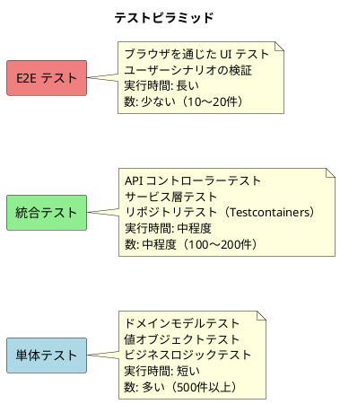
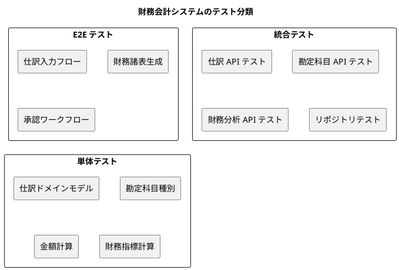
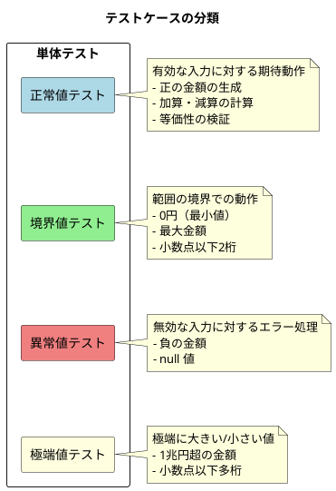
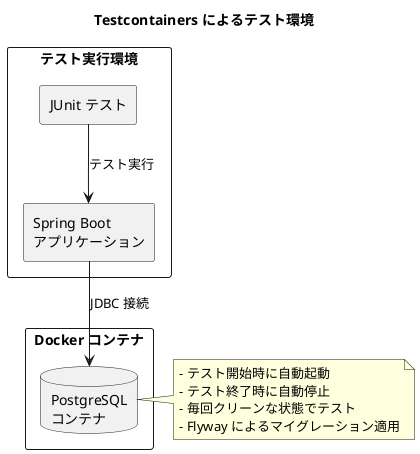
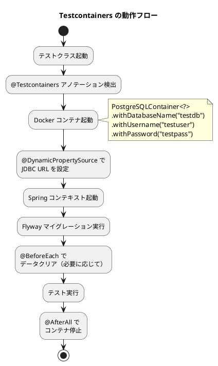
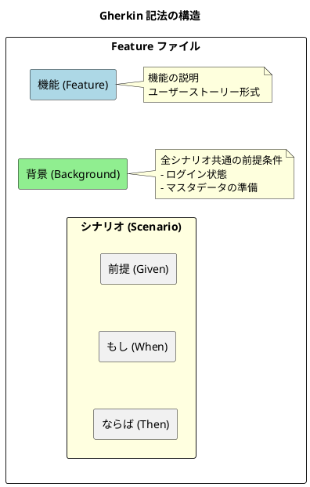
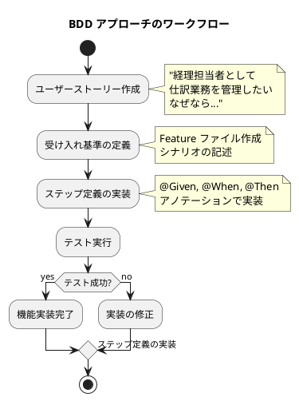

# 第22章: テスト戦略

## 22.1 テストピラミッド

### テストピラミッドの概要

テストピラミッドは、Mike Cohn が提唱したテスト戦略の概念です。下から上に向かって、単体テスト、統合テスト、E2E テストの3層で構成されます。本章では、財務会計システムにおけるテスト戦略を解説します。



### 財務会計システムにおけるテスト分類



---

## 22.2 単体テスト

### 単体テストの基本構造

単体テストは、個々のクラスやメソッドの動作を検証します。財務会計システムでは、ドメインモデルや値オブジェクトのテストが中心です。

```java
package com.example.accounting.domain.model.account;

import org.junit.jupiter.api.*;
import java.math.BigDecimal;
import static org.assertj.core.api.Assertions.*;

@DisplayName("勘定科目種別テスト")
class AccountTypeTest {

    @Nested
    @DisplayName("正常値テスト")
    class Normal {

        @Test
        @DisplayName("資産は借方残高科目である")
        void assetShouldBeDebitBalance() {
            assertThat(AccountType.ASSET.isDebitBalance()).isTrue();
            assertThat(AccountType.ASSET.getBsplType()).isEqualTo("B");
        }

        @Test
        @DisplayName("負債は貸方残高科目である")
        void liabilityShouldBeCreditBalance() {
            assertThat(AccountType.LIABILITY.isDebitBalance()).isFalse();
            assertThat(AccountType.LIABILITY.getBsplType()).isEqualTo("B");
        }

        @Test
        @DisplayName("収益は損益計算書科目である")
        void revenueShouldBeProfitAndLoss() {
            assertThat(AccountType.REVENUE.isProfitAndLoss()).isTrue();
            assertThat(AccountType.REVENUE.getBsplType()).isEqualTo("P");
        }

        @Test
        @DisplayName("費用は借方残高の損益計算書科目である")
        void expenseShouldBeDebitBalanceAndProfitAndLoss() {
            assertThat(AccountType.EXPENSE.isDebitBalance()).isTrue();
            assertThat(AccountType.EXPENSE.isProfitAndLoss()).isTrue();
        }

        @Test
        @DisplayName("表示名から勘定科目種別を取得できる")
        void shouldGetAccountTypeFromDisplayName() {
            assertThat(AccountType.fromDisplayName("資産"))
                .isEqualTo(AccountType.ASSET);
            assertThat(AccountType.fromDisplayName("負債"))
                .isEqualTo(AccountType.LIABILITY);
        }
    }

    @Nested
    @DisplayName("異常値テスト")
    class Abnormal {

        @Test
        @DisplayName("不正な表示名で例外が発生する")
        void shouldThrowExceptionForInvalidDisplayName() {
            assertThatThrownBy(() -> AccountType.fromDisplayName("不正な種別"))
                .isInstanceOf(IllegalArgumentException.class)
                .hasMessageContaining("Unknown account type");
        }
    }
}
```

### テストの分類構造

テストは、正常値・境界値・異常値・極端値に分類して網羅的に検証します。

```java
package com.example.accounting.domain.model.journal;

import org.junit.jupiter.api.*;
import org.junit.jupiter.api.DynamicTest;
import org.junit.jupiter.api.TestFactory;
import java.math.BigDecimal;
import java.util.List;
import java.util.stream.Stream;
import static org.junit.jupiter.api.Assertions.*;
import static org.junit.jupiter.api.DynamicTest.dynamicTest;

@DisplayName("金額（Money）テスト")
class MoneyTest {

    @Nested
    @DisplayName("正常値テスト")
    class Normal {

        @Test
        @DisplayName("正の金額を生成できる")
        void shouldCreatePositiveAmount() {
            Money money = Money.of(new BigDecimal("10000"));
            assertEquals(new BigDecimal("10000"), money.getValue());
        }

        @Test
        @DisplayName("金額を加算できる")
        void shouldAddAmount() {
            Money money1 = Money.of(new BigDecimal("10000"));
            Money money2 = Money.of(new BigDecimal("5000"));
            Money result = money1.add(money2);
            assertEquals(new BigDecimal("15000"), result.getValue());
        }

        @Test
        @DisplayName("金額を減算できる")
        void shouldSubtractAmount() {
            Money money1 = Money.of(new BigDecimal("10000"));
            Money money2 = Money.of(new BigDecimal("3000"));
            Money result = money1.subtract(money2);
            assertEquals(new BigDecimal("7000"), result.getValue());
        }

        @Test
        @DisplayName("金額の等価性を検証できる")
        void shouldCheckEquality() {
            Money money1 = Money.of(new BigDecimal("10000"));
            Money money2 = Money.of(new BigDecimal("10000"));
            Money money3 = Money.of(new BigDecimal("5000"));

            assertEquals(money1, money2);
            assertNotEquals(money1, money3);
        }
    }

    @Nested
    @DisplayName("境界値テスト")
    class Boundary {

        @DisplayName("境界値が受け入れられること")
        @TestFactory
        Stream<DynamicTest> shouldAcceptBoundaryValues() {
            List<BigDecimal> validInputs = List.of(
                BigDecimal.ZERO,                    // 最小値（0円）
                new BigDecimal("0.01"),             // 最小正の値
                new BigDecimal("999999999999.99")   // 最大値（約1兆円）
            );
            return validInputs.stream()
                .map(input -> dynamicTest(
                    "Accepted: " + input,
                    () -> assertDoesNotThrow(() -> Money.of(input))
                ));
        }

        @DisplayName("境界値外が拒否されること")
        @TestFactory
        Stream<DynamicTest> shouldRejectOutOfBoundaryValues() {
            List<BigDecimal> invalidInputs = List.of(
                new BigDecimal("-0.01"),            // 負の値
                new BigDecimal("-1000")             // 負の金額
            );
            return invalidInputs.stream()
                .map(input -> dynamicTest(
                    "Rejected: " + input,
                    () -> assertThrows(
                        IllegalArgumentException.class,
                        () -> Money.of(input)
                    )
                ));
        }
    }

    @Nested
    @DisplayName("異常値テスト")
    class Abnormal {

        @Test
        @DisplayName("null は拒否される")
        void shouldRejectNull() {
            assertThrows(NullPointerException.class, () -> Money.of(null));
        }
    }
}
```



### 仕訳ドメインモデルのテスト

```java
package com.example.accounting.domain.model.journal;

import org.junit.jupiter.api.*;
import java.math.BigDecimal;
import java.time.LocalDate;
import java.util.List;
import static org.assertj.core.api.Assertions.*;

@DisplayName("仕訳ドメインモデルテスト")
class JournalEntryTest {

    @Nested
    @DisplayName("仕訳作成テスト")
    class Creation {

        @Test
        @DisplayName("有効な仕訳を作成できる")
        void shouldCreateValidJournalEntry() {
            // Given
            LocalDate journalDate = LocalDate.of(2024, 4, 1);
            List<JournalLine> lines = List.of(
                JournalLine.debit("1101", new BigDecimal("10000")),
                JournalLine.credit("4101", new BigDecimal("10000"))
            );

            // When
            JournalEntry entry = JournalEntry.create(journalDate, "現金売上", lines);

            // Then
            assertThat(entry.getJournalDate()).isEqualTo(journalDate);
            assertThat(entry.getDescription()).isEqualTo("現金売上");
            assertThat(entry.getLines()).hasSize(2);
        }

        @Test
        @DisplayName("借方と貸方が一致する仕訳は有効")
        void shouldBeValidWhenDebitEqualsCreditInCreation() {
            // Given
            List<JournalLine> lines = List.of(
                JournalLine.debit("1101", new BigDecimal("10000")),
                JournalLine.credit("4101", new BigDecimal("10000"))
            );

            // When
            JournalEntry entry = JournalEntry.create(
                LocalDate.now(), "テスト仕訳", lines
            );

            // Then
            assertThat(entry.isBalanced()).isTrue();
        }
    }

    @Nested
    @DisplayName("貸借バランステスト")
    class Balance {

        @Test
        @DisplayName("借方合計と貸方合計が一致する")
        void shouldHaveMatchingDebitAndCredit() {
            // Given
            List<JournalLine> lines = List.of(
                JournalLine.debit("1101", new BigDecimal("5000")),
                JournalLine.debit("1102", new BigDecimal("5000")),
                JournalLine.credit("4101", new BigDecimal("10000"))
            );

            // When
            JournalEntry entry = JournalEntry.create(
                LocalDate.now(), "複合仕訳", lines
            );

            // Then
            assertThat(entry.getTotalDebit())
                .isEqualByComparingTo(new BigDecimal("10000"));
            assertThat(entry.getTotalCredit())
                .isEqualByComparingTo(new BigDecimal("10000"));
            assertThat(entry.isBalanced()).isTrue();
        }

        @Test
        @DisplayName("不均衡な仕訳は作成できない")
        void shouldRejectUnbalancedEntry() {
            // Given
            List<JournalLine> lines = List.of(
                JournalLine.debit("1101", new BigDecimal("10000")),
                JournalLine.credit("4101", new BigDecimal("8000"))  // 不一致
            );

            // When & Then
            assertThatThrownBy(() ->
                JournalEntry.create(LocalDate.now(), "不均衡仕訳", lines)
            )
                .isInstanceOf(IllegalArgumentException.class)
                .hasMessageContaining("借方と貸方が一致しません");
        }
    }

    @Nested
    @DisplayName("仕訳明細テスト")
    class Lines {

        @Test
        @DisplayName("空の明細は許可されない")
        void shouldRejectEmptyLines() {
            assertThatThrownBy(() ->
                JournalEntry.create(LocalDate.now(), "空仕訳", List.of())
            )
                .isInstanceOf(IllegalArgumentException.class)
                .hasMessageContaining("仕訳明細が必要です");
        }

        @Test
        @DisplayName("借方のみの仕訳は許可されない")
        void shouldRejectDebitOnlyEntry() {
            List<JournalLine> lines = List.of(
                JournalLine.debit("1101", new BigDecimal("10000"))
            );

            assertThatThrownBy(() ->
                JournalEntry.create(LocalDate.now(), "借方のみ", lines)
            )
                .isInstanceOf(IllegalArgumentException.class);
        }
    }
}
```

### 財務指標計算のテスト

```java
package com.example.accounting.domain.model.financial;

import org.junit.jupiter.api.*;
import java.math.BigDecimal;
import static org.assertj.core.api.Assertions.*;
import static org.assertj.core.api.Assertions.within;

@DisplayName("財務指標計算テスト")
class FinancialRatioAnalyzerTest {

    private FinancialRatioAnalyzer analyzer;
    private FinancialData testData;

    @BeforeEach
    void setUp() {
        analyzer = new FinancialRatioAnalyzer();

        // テスト用の財務データ
        testData = new FinancialData(
            2024,
            new BigDecimal("100000000"),   // 売上高: 1億円
            new BigDecimal("60000000"),    // 売上原価: 6000万円
            new BigDecimal("40000000"),    // 売上総利益: 4000万円
            new BigDecimal("15000000"),    // 営業利益: 1500万円
            new BigDecimal("15000000"),    // 経常利益: 1500万円
            new BigDecimal("10000000"),    // 当期純利益: 1000万円
            new BigDecimal("80000000"),    // 総資産: 8000万円
            new BigDecimal("20000000"),    // 有形固定資産: 2000万円
            new BigDecimal("60000000"),    // 流動資産: 6000万円
            new BigDecimal("20000000"),    // 流動負債: 2000万円
            new BigDecimal("50000000"),    // 当座資産: 5000万円
            new BigDecimal("60000000"),    // 純資産: 6000万円
            new BigDecimal("10000000"),    // 棚卸資産: 1000万円
            new BigDecimal("15000000")     // 売上債権: 1500万円
        );
    }

    @Nested
    @DisplayName("収益性指標")
    class Profitability {

        @Test
        @DisplayName("売上総利益率を正しく計算できる")
        void shouldCalculateGrossProfitMargin() {
            // When
            AnalysisResult result = analyzer.analyze(testData);

            // Then: 40% (4000万 / 1億 * 100)
            assertThat(result.profitability().grossProfitMargin())
                .isCloseTo(new BigDecimal("40.00"), within(new BigDecimal("0.01")));
        }

        @Test
        @DisplayName("売上高営業利益率を正しく計算できる")
        void shouldCalculateOperatingProfitMargin() {
            // When
            AnalysisResult result = analyzer.analyze(testData);

            // Then: 15% (1500万 / 1億 * 100)
            assertThat(result.profitability().operatingProfitMargin())
                .isCloseTo(new BigDecimal("15.00"), within(new BigDecimal("0.01")));
        }

        @Test
        @DisplayName("ROA（総資本利益率）を正しく計算できる")
        void shouldCalculateROA() {
            // When
            AnalysisResult result = analyzer.analyze(testData);

            // Then: 18.75% (1500万 / 8000万 * 100)
            assertThat(result.profitability().returnOnAssets())
                .isCloseTo(new BigDecimal("18.75"), within(new BigDecimal("0.01")));
        }

        @Test
        @DisplayName("ROE（自己資本利益率）を正しく計算できる")
        void shouldCalculateROE() {
            // When
            AnalysisResult result = analyzer.analyze(testData);

            // Then: 16.67% (1000万 / 6000万 * 100)
            assertThat(result.profitability().returnOnEquity())
                .isCloseTo(new BigDecimal("16.67"), within(new BigDecimal("0.01")));
        }
    }

    @Nested
    @DisplayName("効率性指標")
    class Efficiency {

        @Test
        @DisplayName("総資本回転率を正しく計算できる")
        void shouldCalculateTotalAssetTurnover() {
            // When
            AnalysisResult result = analyzer.analyze(testData);

            // Then: 1.25回 (1億 / 8000万)
            assertThat(result.efficiency().totalAssetTurnover())
                .isCloseTo(new BigDecimal("1.25"), within(new BigDecimal("0.01")));
        }

        @Test
        @DisplayName("有形固定資産回転率を正しく計算できる")
        void shouldCalculateTangibleFixedAssetTurnover() {
            // When
            AnalysisResult result = analyzer.analyze(testData);

            // Then: 5.00回 (1億 / 2000万)
            assertThat(result.efficiency().tangibleFixedAssetTurnover())
                .isCloseTo(new BigDecimal("5.00"), within(new BigDecimal("0.01")));
        }
    }

    @Nested
    @DisplayName("安全性指標")
    class Safety {

        @Test
        @DisplayName("流動比率を正しく計算できる")
        void shouldCalculateCurrentRatio() {
            // When
            AnalysisResult result = analyzer.analyze(testData);

            // Then: 300% (6000万 / 2000万 * 100)
            assertThat(result.safety().currentRatio())
                .isCloseTo(new BigDecimal("300.00"), within(new BigDecimal("0.01")));
        }

        @Test
        @DisplayName("当座比率を正しく計算できる")
        void shouldCalculateQuickRatio() {
            // When
            AnalysisResult result = analyzer.analyze(testData);

            // Then: 250% (5000万 / 2000万 * 100)
            assertThat(result.safety().quickRatio())
                .isCloseTo(new BigDecimal("250.00"), within(new BigDecimal("0.01")));
        }

        @Test
        @DisplayName("自己資本比率を正しく計算できる")
        void shouldCalculateEquityRatio() {
            // When
            AnalysisResult result = analyzer.analyze(testData);

            // Then: 75% (6000万 / 8000万 * 100)
            assertThat(result.safety().equityRatio())
                .isCloseTo(new BigDecimal("75.00"), within(new BigDecimal("0.01")));
        }
    }

    @Nested
    @DisplayName("例外処理")
    class ExceptionHandling {

        @Test
        @DisplayName("売上高がゼロの場合は例外をスローする")
        void shouldThrowExceptionWhenSalesIsZero() {
            // Given
            FinancialData invalidData = testData.withSales(BigDecimal.ZERO);

            // When & Then
            assertThatThrownBy(() -> analyzer.analyze(invalidData))
                .isInstanceOf(IllegalArgumentException.class)
                .hasMessageContaining("売上高がゼロ");
        }

        @Test
        @DisplayName("総資産がゼロの場合は例外をスローする")
        void shouldThrowExceptionWhenTotalAssetsIsZero() {
            // Given
            FinancialData invalidData = testData.withTotalAssets(BigDecimal.ZERO);

            // When & Then
            assertThatThrownBy(() -> analyzer.analyze(invalidData))
                .isInstanceOf(IllegalArgumentException.class)
                .hasMessageContaining("総資産がゼロ");
        }
    }
}
```

---

## 22.3 Testcontainers の活用

### Testcontainers とは

Testcontainers は、Docker コンテナを使ってテスト用のデータベースなどを起動するライブラリです。実際の PostgreSQL データベースを使ったテストが可能になり、本番環境に近い条件でテストできます。



### 統合テスト用アノテーション

```java
package com.example.accounting;

import org.springframework.boot.test.context.SpringBootTest;
import org.springframework.test.context.ActiveProfiles;

import java.lang.annotation.ElementType;
import java.lang.annotation.Retention;
import java.lang.annotation.RetentionPolicy;
import java.lang.annotation.Target;

/**
 * 統合テスト用アノテーション
 */
@Target(ElementType.TYPE)
@Retention(RetentionPolicy.RUNTIME)
@SpringBootTest
@ActiveProfiles("test")
public @interface IntegrationTest {
}
```

### リポジトリテストの実装

```java
package com.example.accounting.infrastructure.persistence.repository;

import com.example.accounting.application.port.out.JournalRepository;
import com.example.accounting.domain.model.journal.*;
import org.junit.jupiter.api.*;
import org.springframework.beans.factory.annotation.Autowired;
import org.springframework.boot.test.context.SpringBootTest;
import org.springframework.test.context.DynamicPropertyRegistry;
import org.springframework.test.context.DynamicPropertySource;
import org.testcontainers.containers.PostgreSQLContainer;
import org.testcontainers.junit.jupiter.Container;
import org.testcontainers.junit.jupiter.Testcontainers;

import java.math.BigDecimal;
import java.time.LocalDate;
import java.util.List;

import static org.assertj.core.api.Assertions.*;

@SpringBootTest
@Testcontainers
@TestMethodOrder(MethodOrderer.OrderAnnotation.class)
@DisplayName("仕訳リポジトリテスト")
class JournalRepositoryImplTest {

    @Container
    static PostgreSQLContainer<?> postgres =
        new PostgreSQLContainer<>("postgres:16-alpine")
            .withDatabaseName("testdb")
            .withUsername("testuser")
            .withPassword("testpass");

    @DynamicPropertySource
    static void configureProperties(DynamicPropertyRegistry registry) {
        registry.add("spring.datasource.url", postgres::getJdbcUrl);
        registry.add("spring.datasource.username", postgres::getUsername);
        registry.add("spring.datasource.password", postgres::getPassword);
        registry.add("spring.flyway.enabled", () -> "true");
    }

    @Autowired
    private JournalRepository journalRepository;

    @Test
    @Order(1)
    @DisplayName("仕訳を保存できる")
    void shouldSaveJournalEntry() {
        // Given
        JournalEntry entry = createTestJournalEntry("JE00000001");

        // When
        JournalEntry saved = journalRepository.save(entry);

        // Then
        assertThat(saved.getJournalId()).isNotNull();
        assertThat(saved.getJournalNumber()).isEqualTo("JE00000001");
    }

    @Test
    @Order(2)
    @DisplayName("仕訳番号で検索できる")
    void shouldFindByJournalNumber() {
        // When
        var found = journalRepository.findByJournalNumber("JE00000001");

        // Then
        assertThat(found).isPresent();
        assertThat(found.get().getJournalNumber()).isEqualTo("JE00000001");
    }

    @Test
    @Order(3)
    @DisplayName("仕訳一覧を取得できる")
    void shouldFindAllJournalEntries() {
        // Given
        journalRepository.save(createTestJournalEntry("JE00000002"));
        journalRepository.save(createTestJournalEntry("JE00000003"));

        // When
        List<JournalEntry> entries = journalRepository.findAll();

        // Then
        assertThat(entries).hasSizeGreaterThanOrEqualTo(3);
    }

    @Test
    @Order(4)
    @DisplayName("期間で仕訳を検索できる")
    void shouldFindByDateRange() {
        // Given
        LocalDate startDate = LocalDate.of(2024, 4, 1);
        LocalDate endDate = LocalDate.of(2024, 4, 30);

        // When
        List<JournalEntry> entries = journalRepository
            .findByDateRange(startDate, endDate);

        // Then
        assertThat(entries).allMatch(e ->
            !e.getJournalDate().isBefore(startDate) &&
            !e.getJournalDate().isAfter(endDate)
        );
    }

    @Test
    @Order(5)
    @DisplayName("勘定科目コードで仕訳を検索できる")
    void shouldFindByAccountCode() {
        // When
        List<JournalEntry> entries = journalRepository.findByAccountCode("1101");

        // Then
        assertThat(entries).allMatch(e ->
            e.getLines().stream()
                .anyMatch(line -> "1101".equals(line.getAccountCode()))
        );
    }

    @Test
    @Order(6)
    @DisplayName("仕訳ステータスで検索できる")
    void shouldFindByStatus() {
        // When
        List<JournalEntry> entries = journalRepository
            .findByStatus(JournalStatus.DRAFT);

        // Then
        assertThat(entries).allMatch(e ->
            e.getStatus() == JournalStatus.DRAFT
        );
    }

    @Test
    @Order(7)
    @DisplayName("仕訳を更新できる")
    void shouldUpdateJournalEntry() {
        // Given
        var found = journalRepository.findByJournalNumber("JE00000001");
        assertThat(found).isPresent();

        JournalEntry entry = found.get();
        JournalEntry updated = entry.withDescription("更新後の摘要");

        // When
        journalRepository.save(updated);

        // Then
        var result = journalRepository.findByJournalNumber("JE00000001");
        assertThat(result).isPresent();
        assertThat(result.get().getDescription()).isEqualTo("更新後の摘要");
    }

    @Test
    @Order(8)
    @DisplayName("仕訳を削除できる")
    void shouldDeleteJournalEntry() {
        // Given
        JournalEntry entry = createTestJournalEntry("JE99999999");
        journalRepository.save(entry);

        // When
        journalRepository.deleteByJournalNumber("JE99999999");

        // Then
        var found = journalRepository.findByJournalNumber("JE99999999");
        assertThat(found).isEmpty();
    }

    // テストヘルパーメソッド
    private JournalEntry createTestJournalEntry(String journalNumber) {
        List<JournalLine> lines = List.of(
            JournalLine.debit("1101", new BigDecimal("10000")),
            JournalLine.credit("4101", new BigDecimal("10000"))
        );

        return JournalEntry.builder()
            .journalNumber(journalNumber)
            .journalDate(LocalDate.of(2024, 4, 1))
            .description("テスト仕訳")
            .status(JournalStatus.DRAFT)
            .lines(lines)
            .build();
    }
}
```

### Testcontainers の動作フロー



### API 統合テスト

```java
package com.example.accounting.infrastructure.web.controller;

import com.fasterxml.jackson.databind.ObjectMapper;
import org.junit.jupiter.api.*;
import org.springframework.beans.factory.annotation.Autowired;
import org.springframework.boot.test.autoconfigure.web.servlet.AutoConfigureMockMvc;
import org.springframework.boot.test.context.SpringBootTest;
import org.springframework.http.MediaType;
import org.springframework.test.context.DynamicPropertyRegistry;
import org.springframework.test.context.DynamicPropertySource;
import org.springframework.test.web.servlet.MockMvc;
import org.testcontainers.containers.PostgreSQLContainer;
import org.testcontainers.junit.jupiter.Container;
import org.testcontainers.junit.jupiter.Testcontainers;

import static org.hamcrest.Matchers.*;
import static org.springframework.test.web.servlet.request.MockMvcRequestBuilders.*;
import static org.springframework.test.web.servlet.result.MockMvcResultMatchers.*;

@SpringBootTest
@AutoConfigureMockMvc
@Testcontainers
@TestMethodOrder(MethodOrderer.OrderAnnotation.class)
@DisplayName("仕訳 API 統合テスト")
class JournalControllerIntegrationTest {

    @Container
    static PostgreSQLContainer<?> postgres =
        new PostgreSQLContainer<>("postgres:16-alpine")
            .withDatabaseName("testdb")
            .withUsername("testuser")
            .withPassword("testpass");

    @DynamicPropertySource
    static void configureProperties(DynamicPropertyRegistry registry) {
        registry.add("spring.datasource.url", postgres::getJdbcUrl);
        registry.add("spring.datasource.username", postgres::getUsername);
        registry.add("spring.datasource.password", postgres::getPassword);
        registry.add("spring.flyway.enabled", () -> "true");
    }

    @Autowired
    private MockMvc mockMvc;

    @Autowired
    private ObjectMapper objectMapper;

    @Test
    @Order(1)
    @DisplayName("POST /api/journals - 仕訳を登録できる")
    void shouldCreateJournalEntry() throws Exception {
        var request = """
            {
                "journalDate": "2024-04-01",
                "description": "現金売上",
                "lines": [
                    {"accountCode": "1101", "debitAmount": 10000, "creditAmount": 0},
                    {"accountCode": "4101", "debitAmount": 0, "creditAmount": 10000}
                ]
            }
            """;

        mockMvc.perform(post("/api/journals")
                .contentType(MediaType.APPLICATION_JSON)
                .content(request))
            .andExpect(status().isCreated())
            .andExpect(jsonPath("$.journalNumber").exists())
            .andExpect(jsonPath("$.journalDate").value("2024-04-01"))
            .andExpect(jsonPath("$.description").value("現金売上"))
            .andExpect(jsonPath("$.lines", hasSize(2)));
    }

    @Test
    @Order(2)
    @DisplayName("GET /api/journals - 仕訳一覧を取得できる")
    void shouldGetAllJournals() throws Exception {
        mockMvc.perform(get("/api/journals"))
            .andExpect(status().isOk())
            .andExpect(jsonPath("$", hasSize(greaterThanOrEqualTo(1))));
    }

    @Test
    @Order(3)
    @DisplayName("GET /api/journals?startDate&endDate - 期間で検索できる")
    void shouldSearchByDateRange() throws Exception {
        mockMvc.perform(get("/api/journals")
                .param("startDate", "2024-04-01")
                .param("endDate", "2024-04-30"))
            .andExpect(status().isOk())
            .andExpect(jsonPath("$").isArray());
    }

    @Test
    @Order(4)
    @DisplayName("POST /api/journals - 不均衡な仕訳は400エラー")
    void shouldReturn400ForUnbalancedEntry() throws Exception {
        var request = """
            {
                "journalDate": "2024-04-01",
                "description": "不均衡仕訳",
                "lines": [
                    {"accountCode": "1101", "debitAmount": 10000, "creditAmount": 0},
                    {"accountCode": "4101", "debitAmount": 0, "creditAmount": 8000}
                ]
            }
            """;

        mockMvc.perform(post("/api/journals")
                .contentType(MediaType.APPLICATION_JSON)
                .content(request))
            .andExpect(status().isBadRequest())
            .andExpect(jsonPath("$.code").value("VALIDATION_ERROR"));
    }
}
```

### テストデータファクトリ

```java
package com.example.accounting.test;

import com.example.accounting.domain.model.account.*;
import com.example.accounting.domain.model.journal.*;

import java.math.BigDecimal;
import java.time.LocalDate;
import java.util.List;

/**
 * テストデータファクトリ
 */
public class TestDataFactory {

    /**
     * テスト用の勘定科目を作成
     */
    public static Account createAccount(
            String code, String name, AccountType type) {
        return Account.create(code, name, type);
    }

    /**
     * テスト用の仕訳を作成
     */
    public static JournalEntry createJournalEntry(String journalNumber) {
        List<JournalLine> lines = List.of(
            JournalLine.debit("1101", new BigDecimal("10000")),
            JournalLine.credit("4101", new BigDecimal("10000"))
        );

        return JournalEntry.builder()
            .journalNumber(journalNumber)
            .journalDate(LocalDate.of(2024, 4, 1))
            .description("テスト仕訳")
            .status(JournalStatus.DRAFT)
            .lines(lines)
            .build();
    }

    /**
     * テスト用の複合仕訳を作成（複数の借方・貸方）
     */
    public static JournalEntry createCompoundJournalEntry(String journalNumber) {
        List<JournalLine> lines = List.of(
            JournalLine.debit("1101", new BigDecimal("5000")),   // 現金
            JournalLine.debit("1121", new BigDecimal("5000")),   // 売掛金
            JournalLine.credit("4101", new BigDecimal("9000")),  // 売上高
            JournalLine.credit("4102", new BigDecimal("1000"))   // 受取利息
        );

        return JournalEntry.builder()
            .journalNumber(journalNumber)
            .journalDate(LocalDate.of(2024, 4, 1))
            .description("複合仕訳テスト")
            .status(JournalStatus.DRAFT)
            .lines(lines)
            .build();
    }

    /**
     * テスト用の財務データを作成
     */
    public static FinancialData createFinancialData(int fiscalYear) {
        return new FinancialData(
            fiscalYear,
            new BigDecimal("100000000"),   // 売上高
            new BigDecimal("60000000"),    // 売上原価
            new BigDecimal("40000000"),    // 売上総利益
            new BigDecimal("15000000"),    // 営業利益
            new BigDecimal("15000000"),    // 経常利益
            new BigDecimal("10000000"),    // 当期純利益
            new BigDecimal("80000000"),    // 総資産
            new BigDecimal("20000000"),    // 有形固定資産
            new BigDecimal("60000000"),    // 流動資産
            new BigDecimal("20000000"),    // 流動負債
            new BigDecimal("50000000"),    // 当座資産
            new BigDecimal("60000000"),    // 純資産
            new BigDecimal("10000000"),    // 棚卸資産
            new BigDecimal("15000000")     // 売上債権
        );
    }
}
```

---

## 22.4 受け入れテスト

### Gherkin による仕様記述

受け入れテストは、Gherkin 記法を使ってビジネス要件を記述します。日本語で記述することで、非エンジニアも理解しやすくなります。

```gherkin
# language: ja
機能: 仕訳管理
  経理担当者として
  仕訳業務を管理したい
  なぜなら財務データの正確な記録が必要だから

  背景:
    前提: 経理担当者としてログインしている
    前提: 以下の勘定科目が登録されている
      | コード | 名称     | 種別 |
      | 1101   | 現金     | 資産 |
      | 1121   | 売掛金   | 資産 |
      | 4101   | 売上高   | 収益 |
      | 5101   | 仕入高   | 費用 |

  シナリオ: 現金売上の仕訳を登録する
    もし: 以下の仕訳を登録する
      | 日付       | 摘要     |
      | 2024-04-01 | 現金売上 |
    かつ: 以下の仕訳明細を入力する
      | 勘定科目 | 借方金額 | 貸方金額 |
      | 現金     | 10000    | 0        |
      | 売上高   | 0        | 10000    |
    ならば: "仕訳を登録しました" が表示される
    かつ: 借方合計と貸方合計が一致している

  シナリオ: 不均衡な仕訳は登録できない
    もし: 以下の仕訳を登録する
      | 日付       | 摘要     |
      | 2024-04-01 | 不均衡   |
    かつ: 以下の仕訳明細を入力する
      | 勘定科目 | 借方金額 | 貸方金額 |
      | 現金     | 10000    | 0        |
      | 売上高   | 0        | 8000     |
    ならば: "借方と貸方が一致しません" というエラーが表示される

  シナリオ: 仕訳を承認する
    前提: 仕訳番号 "JE00000001" の下書き仕訳が存在する
    もし: 仕訳番号 "JE00000001" を承認する
    ならば: "仕訳を承認しました" が表示される
    かつ: 仕訳のステータスが "承認済" になっている
```



### 財務諸表生成のシナリオ

```gherkin
# language: ja
機能: 財務諸表生成
  経営者として
  財務諸表を確認したい
  なぜなら経営判断に必要だから

  背景:
    前提: 2024年度の仕訳データが登録されている
    前提: 全ての仕訳が確定済みである

  シナリオ: 貸借対照表を生成する
    もし: 2024年度の貸借対照表を生成する
    ならば: 以下の項目が表示される
      | 分類     | 項目           |
      | 資産     | 流動資産合計   |
      | 資産     | 固定資産合計   |
      | 負債     | 流動負債合計   |
      | 負債     | 固定負債合計   |
      | 純資産   | 純資産合計     |
    かつ: 資産合計 = 負債合計 + 純資産合計 が成り立つ

  シナリオ: 損益計算書を生成する
    もし: 2024年度の損益計算書を生成する
    ならば: 以下の項目が表示される
      | 項目           |
      | 売上高         |
      | 売上原価       |
      | 売上総利益     |
      | 営業利益       |
      | 経常利益       |
      | 当期純利益     |
    かつ: 売上総利益 = 売上高 - 売上原価 が成り立つ

  シナリオ: 財務分析レポートを生成する
    もし: 2024年度の財務分析を実行する
    ならば: 以下の指標が表示される
      | 分類     | 指標             |
      | 収益性   | 売上高営業利益率 |
      | 収益性   | ROA              |
      | 収益性   | ROE              |
      | 効率性   | 総資本回転率     |
      | 安全性   | 流動比率         |
      | 安全性   | 自己資本比率     |
    かつ: 総合評価が A〜D で表示される
```

### BDD アプローチのワークフロー



### ステップ定義の実装例

```java
package com.example.accounting.acceptance;

import io.cucumber.java.ja.*;
import io.cucumber.datatable.DataTable;
import org.springframework.beans.factory.annotation.Autowired;
import static org.assertj.core.api.Assertions.*;

public class JournalStepDefinitions {

    @Autowired
    private JournalUseCase journalUseCase;

    private JournalEntry currentEntry;
    private String resultMessage;
    private Exception lastException;

    @前提("経理担当者としてログインしている")
    public void 経理担当者としてログインしている() {
        // ログイン処理（テスト用のセキュリティコンテキスト設定）
    }

    @前提("以下の勘定科目が登録されている")
    public void 以下の勘定科目が登録されている(DataTable dataTable) {
        // 勘定科目マスタの準備
    }

    @もし("以下の仕訳を登録する")
    public void 以下の仕訳を登録する(DataTable dataTable) {
        var row = dataTable.asMaps().get(0);
        currentEntry = JournalEntry.builder()
            .journalDate(LocalDate.parse(row.get("日付")))
            .description(row.get("摘要"))
            .build();
    }

    @かつ("以下の仕訳明細を入力する")
    public void 以下の仕訳明細を入力する(DataTable dataTable) {
        List<JournalLine> lines = dataTable.asMaps().stream()
            .map(row -> {
                BigDecimal debit = new BigDecimal(row.get("借方金額"));
                BigDecimal credit = new BigDecimal(row.get("貸方金額"));
                String accountCode = getAccountCode(row.get("勘定科目"));

                if (debit.compareTo(BigDecimal.ZERO) > 0) {
                    return JournalLine.debit(accountCode, debit);
                } else {
                    return JournalLine.credit(accountCode, credit);
                }
            })
            .toList();

        currentEntry = currentEntry.withLines(lines);

        try {
            journalUseCase.createJournal(currentEntry);
            resultMessage = "仕訳を登録しました";
        } catch (Exception e) {
            lastException = e;
        }
    }

    @ならば("{string} が表示される")
    public void が表示される(String expectedMessage) {
        assertThat(resultMessage).isEqualTo(expectedMessage);
    }

    @ならば("{string} というエラーが表示される")
    public void というエラーが表示される(String expectedError) {
        assertThat(lastException).isNotNull();
        assertThat(lastException.getMessage()).contains(expectedError);
    }

    @かつ("借方合計と貸方合計が一致している")
    public void 借方合計と貸方合計が一致している() {
        assertThat(currentEntry.isBalanced()).isTrue();
    }
}
```

---

## 22.5 テストの組織化

### ディレクトリ構造

```
src/test/
├── java/
│   └── com/example/accounting/
│       ├── domain/
│       │   └── model/
│       │       ├── account/           # 勘定科目ドメインのテスト
│       │       │   ├── AccountTest.java
│       │       │   └── AccountTypeTest.java
│       │       ├── journal/           # 仕訳ドメインのテスト
│       │       │   ├── JournalEntryTest.java
│       │       │   ├── JournalLineTest.java
│       │       │   └── MoneyTest.java
│       │       └── financial/         # 財務分析ドメインのテスト
│       │           ├── FinancialDataTest.java
│       │           └── FinancialRatioAnalyzerTest.java
│       ├── application/
│       │   └── service/               # アプリケーションサービスのテスト
│       │       ├── AccountServiceTest.java
│       │       ├── JournalServiceTest.java
│       │       └── FinancialAnalysisServiceTest.java
│       ├── infrastructure/
│       │   ├── persistence/           # リポジトリのテスト
│       │   │   └── repository/
│       │   │       ├── AccountRepositoryImplTest.java
│       │   │       └── JournalRepositoryImplTest.java
│       │   └── web/                   # コントローラーのテスト
│       │       └── controller/
│       │           ├── AccountControllerIntegrationTest.java
│       │           ├── JournalControllerIntegrationTest.java
│       │           └── FinancialAnalysisControllerIntegrationTest.java
│       ├── acceptance/                # 受け入れテスト
│       │   ├── JournalStepDefinitions.java
│       │   └── FinancialStatementStepDefinitions.java
│       ├── test/                      # テストユーティリティ
│       │   └── TestDataFactory.java
│       ├── ArchitectureTest.java      # アーキテクチャテスト
│       └── IntegrationTest.java       # 統合テストアノテーション
└── resources/
    ├── features/                      # Gherkin Feature ファイル
    │   ├── journal/
    │   │   ├── journal_entry.feature
    │   │   └── journal_approval.feature
    │   ├── ledger/
    │   │   └── general_ledger.feature
    │   └── statement/
    │       ├── balance_sheet.feature
    │       ├── income_statement.feature
    │       └── financial_analysis.feature
    ├── sql/                           # テスト用 SQL
    │   ├── test-accounts.sql
    │   ├── test-journals.sql
    │   └── test-financial-data.sql
    └── application-test.yml           # テスト用設定
```

### テスト実行コマンド

```bash
# 全テスト実行
./gradlew test

# 単体テストのみ
./gradlew test --tests "*Test" --exclude-tasks integrationTest

# 統合テストのみ
./gradlew test --tests "*IntegrationTest"

# 特定パッケージのテスト
./gradlew test --tests "com.example.accounting.domain.*"

# 特定クラスのテスト
./gradlew test --tests "*JournalEntryTest"

# 受け入れテスト
./gradlew cucumberTest

# カバレッジレポート生成
./gradlew jacocoTestReport
```

### テスト設定ファイル

```yaml
# src/test/resources/application-test.yml
spring:
  datasource:
    # Testcontainers が動的に設定
    driver-class-name: org.postgresql.Driver

  flyway:
    enabled: true
    locations: classpath:db/migration

  jpa:
    show-sql: true
    properties:
      hibernate:
        format_sql: true

logging:
  level:
    com.example.accounting: DEBUG
    org.springframework.jdbc: DEBUG
```

---

## まとめ

本章では、財務会計システムにおけるテスト戦略について解説しました。

### 重要なポイント

1. **テストピラミッド**: 単体テスト（多）、統合テスト（中）、E2E テスト（少）の3層構造で、効率的にテストを実行します。

2. **単体テスト**: 正常値・境界値・異常値・極端値に分類して、網羅的にテストケースを作成します。`@TestFactory` と `DynamicTest` を使って、データ駆動テストを実現します。

3. **Testcontainers**: Docker コンテナを使って、実際の PostgreSQL データベースでリポジトリテストを実行します。毎回クリーンな状態でテストできるため、テストの信頼性が向上します。

4. **受け入れテスト**: Gherkin 記法で日本語のシナリオを記述し、BDD アプローチでビジネス要件を検証します。非エンジニアも理解しやすいドキュメントとして機能します。

### テスト数の目安

| テスト種別 | 対象 | 目安数 |
|-----------|------|--------|
| 単体テスト | ドメインモデル、値オブジェクト | 500件以上 |
| 統合テスト | リポジトリ、API コントローラー | 100〜200件 |
| E2E テスト | ユーザーシナリオ | 10〜20件 |

### アーキテクチャ層とテスト手法の対応

| 層 | テスト手法 | ツール |
|----|-----------|--------|
| Domain | 単体テスト | JUnit 5, AssertJ |
| Application | 単体テスト + モック | Mockito |
| Infrastructure (Repository) | 統合テスト | Testcontainers |
| Infrastructure (Controller) | 統合テスト | MockMvc + Testcontainers |
| 受け入れ | シナリオテスト | Cucumber, Gherkin |

次章では、継続的リファクタリングについて解説します。値オブジェクトの導入、メソッド抽出、ドメインサービスへの移行などを学びます。
