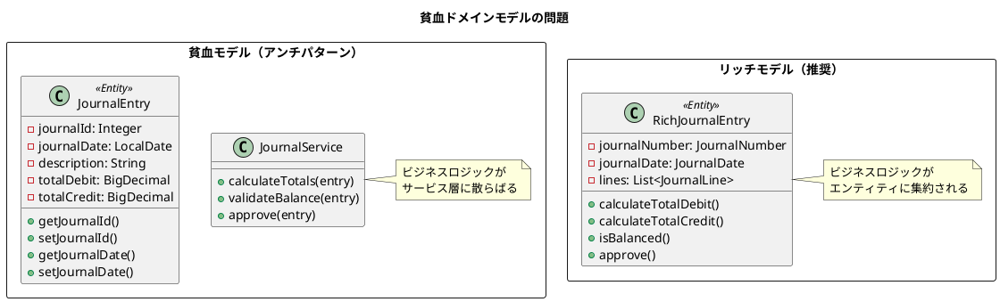
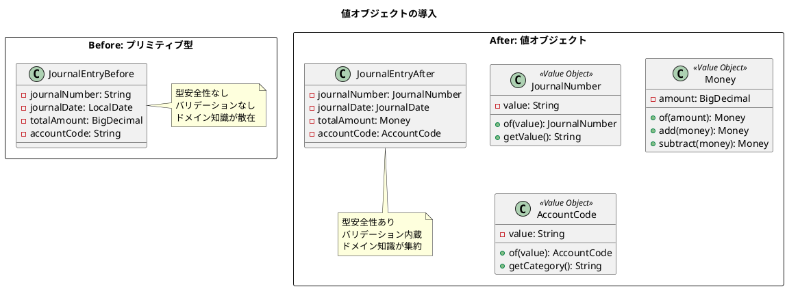
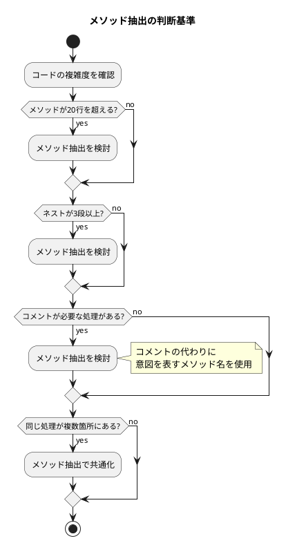
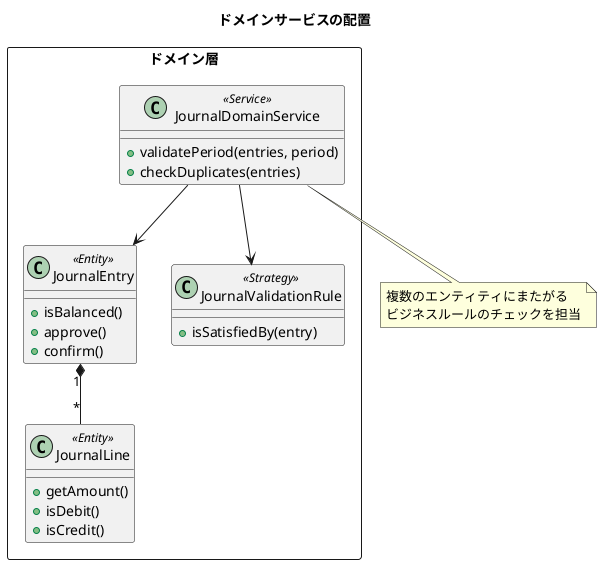
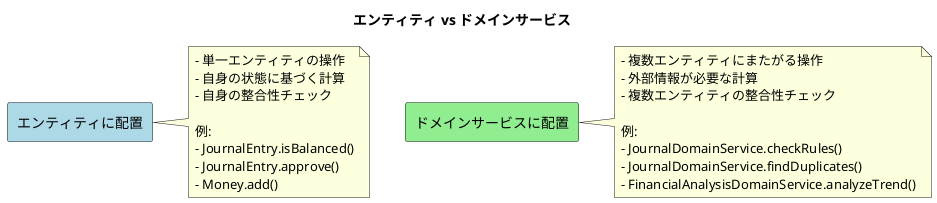
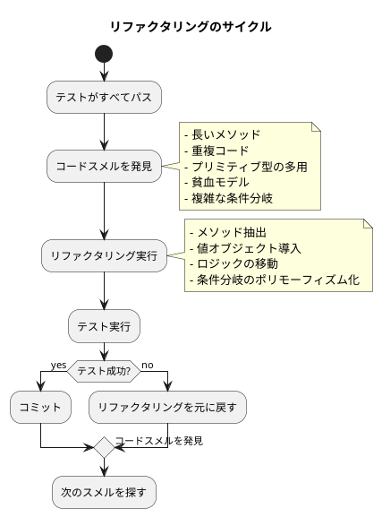

# 第23章: 継続的リファクタリング

## 23.1 貧血モデルからリッチモデルへ

### 問題の認識

貧血ドメインモデル（Anemic Domain Model）は、データの入れ物としてのみ機能し、ビジネスロジックがサービス層に散らばっている状態です。この状態では、ドメインの知識がコード全体に分散し、保守性が低下します。



### 段階的な移行

本プロジェクトでは、以下の段階でリッチモデルへ移行しています。

**Phase 1: 貧血モデルで CRUD 実装**

```java
// 初期実装：データの入れ物として機能
public class JournalEntry {
    Integer journalId;
    LocalDate journalDate;
    String description;
    BigDecimal totalDebit;
    BigDecimal totalCredit;
    String status;
    // getter/setter のみ
}
```

**Phase 2: 値オブジェクトの導入**

```java
// 値オブジェクトによる型安全性の向上
public class JournalEntry {
    JournalNumber journalNumber;
    JournalDate journalDate;
    Description description;
    Money totalDebit;
    Money totalCredit;
    JournalStatus status;
}
```

**Phase 3: ビジネスロジックの移動**

```java
// ビジネスロジックをエンティティに移動
@Value
@With
public class JournalEntry {
    JournalNumber journalNumber;
    JournalDate journalDate;
    Description description;
    JournalStatus status;
    List<JournalLine> lines;

    public static JournalEntry create(
            LocalDate journalDate,
            String description,
            List<JournalLine> lines
    ) {
        // バリデーション: 借方と貸方が一致すること
        Money totalDebit = calculateTotalDebit(lines);
        Money totalCredit = calculateTotalCredit(lines);

        if (!totalDebit.equals(totalCredit)) {
            throw new IllegalArgumentException(
                "借方と貸方が一致しません: 借方=" + totalDebit +
                ", 貸方=" + totalCredit
            );
        }

        // バリデーション: 仕訳明細が空でないこと
        if (lines.isEmpty()) {
            throw new IllegalArgumentException("仕訳明細が必要です");
        }

        return new JournalEntry(
            null,  // 採番は保存時
            JournalDate.of(journalDate),
            Description.of(description),
            JournalStatus.DRAFT,
            lines
        );
    }

    private static Money calculateTotalDebit(List<JournalLine> lines) {
        return lines.stream()
            .map(JournalLine::getDebitAmount)
            .reduce(Money.ZERO, Money::add);
    }

    private static Money calculateTotalCredit(List<JournalLine> lines) {
        return lines.stream()
            .map(JournalLine::getCreditAmount)
            .reduce(Money.ZERO, Money::add);
    }
}
```

### ビジネスロジックの移動

ファクトリメソッドにビジネスロジックを集約することで、エンティティの整合性を保証します。

```java
@Value
@With
public class JournalEntry {

    Integer journalId;
    JournalNumber journalNumber;
    JournalDate journalDate;
    Description description;
    JournalStatus status;
    List<JournalLine> lines;
    LocalDateTime createdAt;
    LocalDateTime updatedAt;

    /**
     * 新規仕訳を作成
     */
    public static JournalEntry create(
            LocalDate journalDate,
            String description,
            List<JournalLine> lines
    ) {
        // ビジネスルール: 仕訳明細は必須
        if (lines == null || lines.isEmpty()) {
            throw new IllegalArgumentException("仕訳明細が必要です");
        }

        // ビジネスルール: 借方のみ、または貸方のみは不可
        boolean hasDebit = lines.stream().anyMatch(l -> l.isDebit());
        boolean hasCredit = lines.stream().anyMatch(l -> l.isCredit());
        if (!hasDebit || !hasCredit) {
            throw new IllegalArgumentException(
                "借方と貸方の両方が必要です"
            );
        }

        // ビジネスルール: 借方合計と貸方合計が一致すること
        Money totalDebit = lines.stream()
            .filter(JournalLine::isDebit)
            .map(JournalLine::getAmount)
            .reduce(Money.ZERO, Money::add);

        Money totalCredit = lines.stream()
            .filter(JournalLine::isCredit)
            .map(JournalLine::getAmount)
            .reduce(Money.ZERO, Money::add);

        if (!totalDebit.equals(totalCredit)) {
            throw new IllegalArgumentException(
                String.format(
                    "借方と貸方が一致しません: 借方=%s, 貸方=%s",
                    totalDebit, totalCredit
                )
            );
        }

        return new JournalEntry(
            null,
            null,  // 採番は保存時
            JournalDate.of(journalDate),
            Description.of(description),
            JournalStatus.DRAFT,
            lines,
            null,
            null
        );
    }

    /**
     * 仕訳を承認
     */
    public JournalEntry approve() {
        if (this.status != JournalStatus.DRAFT) {
            throw new IllegalStateException(
                "下書き状態の仕訳のみ承認できます"
            );
        }
        return this.withStatus(JournalStatus.APPROVED);
    }

    /**
     * 仕訳を確定
     */
    public JournalEntry confirm() {
        if (this.status != JournalStatus.APPROVED) {
            throw new IllegalStateException(
                "承認済みの仕訳のみ確定できます"
            );
        }
        return this.withStatus(JournalStatus.CONFIRMED);
    }

    /**
     * 仕訳を取り消し
     */
    public JournalEntry cancel() {
        if (this.status == JournalStatus.CANCELLED) {
            throw new IllegalStateException("既に取り消し済みです");
        }
        return this.withStatus(JournalStatus.CANCELLED);
    }

    /**
     * 借方合計を取得
     */
    public Money getTotalDebit() {
        return lines.stream()
            .filter(JournalLine::isDebit)
            .map(JournalLine::getAmount)
            .reduce(Money.ZERO, Money::add);
    }

    /**
     * 貸方合計を取得
     */
    public Money getTotalCredit() {
        return lines.stream()
            .filter(JournalLine::isCredit)
            .map(JournalLine::getAmount)
            .reduce(Money.ZERO, Money::add);
    }

    /**
     * 貸借が一致しているか確認
     */
    public boolean isBalanced() {
        return getTotalDebit().equals(getTotalCredit());
    }
}
```

---

## 23.2 値オブジェクトの導入

### 参照から値への変更

プリミティブ型を値オブジェクトに置き換えることで、型安全性とドメイン知識の表現が向上します。



### 金額（Money）値オブジェクト

```java
package com.example.accounting.domain.model.journal;

import lombok.Value;
import java.math.BigDecimal;
import java.math.RoundingMode;

/**
 * 金額を表現する値オブジェクト
 */
@Value
public class Money {

    public static final Money ZERO = new Money(BigDecimal.ZERO);
    private static final int SCALE = 2;
    private static final RoundingMode ROUNDING = RoundingMode.HALF_UP;

    BigDecimal amount;

    private Money(BigDecimal amount) {
        if (amount == null) {
            throw new NullPointerException("金額は null にできません");
        }
        this.amount = amount.setScale(SCALE, ROUNDING);
    }

    /**
     * 金額を生成
     */
    public static Money of(BigDecimal amount) {
        return new Money(amount);
    }

    /**
     * 金額を生成（long 値から）
     */
    public static Money of(long amount) {
        return new Money(BigDecimal.valueOf(amount));
    }

    /**
     * 金額を生成（文字列から）
     */
    public static Money of(String amount) {
        return new Money(new BigDecimal(amount));
    }

    /**
     * 金額を加算（新しいインスタンスを返す）
     */
    public Money add(Money other) {
        if (other == null) {
            throw new NullPointerException("加算対象は null にできません");
        }
        return new Money(this.amount.add(other.amount));
    }

    /**
     * 金額を減算（新しいインスタンスを返す）
     */
    public Money subtract(Money other) {
        if (other == null) {
            throw new NullPointerException("減算対象は null にできません");
        }
        return new Money(this.amount.subtract(other.amount));
    }

    /**
     * 金額を乗算（新しいインスタンスを返す）
     */
    public Money multiply(int multiplier) {
        return new Money(this.amount.multiply(BigDecimal.valueOf(multiplier)));
    }

    /**
     * 金額を乗算（新しいインスタンスを返す）
     */
    public Money multiply(BigDecimal multiplier) {
        return new Money(this.amount.multiply(multiplier));
    }

    /**
     * 正の金額かどうか
     */
    public boolean isPositive() {
        return amount.compareTo(BigDecimal.ZERO) > 0;
    }

    /**
     * ゼロかどうか
     */
    public boolean isZero() {
        return amount.compareTo(BigDecimal.ZERO) == 0;
    }

    /**
     * 負の金額かどうか
     */
    public boolean isNegative() {
        return amount.compareTo(BigDecimal.ZERO) < 0;
    }

    /**
     * 絶対値を取得
     */
    public Money abs() {
        return new Money(this.amount.abs());
    }

    @Override
    public String toString() {
        return amount.toString();
    }
}
```

### 勘定科目コード値オブジェクト

```java
package com.example.accounting.domain.model.account;

import lombok.Value;

/**
 * 勘定科目コードを表現する値オブジェクト
 */
@Value
public class AccountCode {

    String value;

    private AccountCode(String value) {
        if (value == null || value.isBlank()) {
            throw new IllegalArgumentException(
                "勘定科目コードは必須です"
            );
        }
        if (!value.matches("^\\d{4}$")) {
            throw new IllegalArgumentException(
                "勘定科目コードは4桁の数字である必要があります: " + value
            );
        }
        this.value = value;
    }

    public static AccountCode of(String value) {
        return new AccountCode(value);
    }

    /**
     * 科目カテゴリを取得（先頭2桁）
     */
    public String getCategory() {
        return value.substring(0, 2);
    }

    /**
     * 貸借対照表科目かどうか
     */
    public boolean isBalanceSheetAccount() {
        String category = getCategory();
        return category.startsWith("1") ||  // 資産
               category.startsWith("2") ||  // 負債
               category.startsWith("3");    // 純資産
    }

    /**
     * 損益計算書科目かどうか
     */
    public boolean isProfitLossAccount() {
        String category = getCategory();
        return category.startsWith("4") ||  // 収益
               category.startsWith("5") ||  // 売上原価
               category.startsWith("6") ||  // 営業外費用
               category.startsWith("7");    // 特別損益・法人税
    }

    /**
     * 資産科目かどうか
     */
    public boolean isAssetAccount() {
        return getCategory().startsWith("1");
    }

    /**
     * 負債科目かどうか
     */
    public boolean isLiabilityAccount() {
        return getCategory().startsWith("2");
    }

    /**
     * 純資産科目かどうか
     */
    public boolean isEquityAccount() {
        return getCategory().startsWith("3");
    }

    /**
     * 収益科目かどうか
     */
    public boolean isRevenueAccount() {
        return getCategory().startsWith("4");
    }

    /**
     * 費用科目かどうか
     */
    public boolean isExpenseAccount() {
        String category = getCategory();
        return category.startsWith("5") ||
               category.startsWith("6") ||
               category.startsWith("7");
    }
}
```

### 仕訳番号値オブジェクト

```java
package com.example.accounting.domain.model.journal;

import lombok.Value;
import java.time.LocalDate;
import java.time.format.DateTimeFormatter;

/**
 * 仕訳番号を表現する値オブジェクト
 */
@Value
public class JournalNumber {

    private static final String PREFIX = "JE";
    private static final DateTimeFormatter DATE_FORMAT =
        DateTimeFormatter.ofPattern("yyyyMMdd");

    String value;

    private JournalNumber(String value) {
        if (value == null || value.isBlank()) {
            throw new IllegalArgumentException("仕訳番号は必須です");
        }
        if (!value.matches("^JE\\d{8}-\\d{4}$")) {
            throw new IllegalArgumentException(
                "仕訳番号の形式が不正です: " + value
            );
        }
        this.value = value;
    }

    public static JournalNumber of(String value) {
        return new JournalNumber(value);
    }

    /**
     * 新しい仕訳番号を生成
     */
    public static JournalNumber generate(LocalDate date, int sequence) {
        String dateStr = date.format(DATE_FORMAT);
        String seqStr = String.format("%04d", sequence);
        return new JournalNumber(PREFIX + dateStr + "-" + seqStr);
    }

    /**
     * 仕訳日を取得
     */
    public LocalDate getJournalDate() {
        String dateStr = value.substring(2, 10);
        return LocalDate.parse(dateStr, DATE_FORMAT);
    }

    /**
     * 連番を取得
     */
    public int getSequence() {
        return Integer.parseInt(value.substring(11));
    }
}
```

### 値オブジェクトの等価性

```java
@Test
@DisplayName("金額の等価性をテストする")
void testMoneyEquality() {
    // 同じ金額は等しい
    assertEquals(Money.of(10000), Money.of(10000));
    assertEquals(Money.of("10000.00"), Money.of(10000));

    // 異なる金額は等しくない
    assertNotEquals(Money.of(10000), Money.of(5000));

    // ZERO 定数との比較
    assertEquals(Money.ZERO, Money.of(0));
}

@Test
@DisplayName("勘定科目コードの等価性をテストする")
void testAccountCodeEquality() {
    // 同じコードは等しい
    assertEquals(AccountCode.of("1101"), AccountCode.of("1101"));

    // 異なるコードは等しくない
    assertNotEquals(AccountCode.of("1101"), AccountCode.of("1102"));
}
```

---

## 23.3 メソッド抽出

### 複雑度の測定

メソッドが長くなったり、複雑度が高くなったりした場合は、メソッド抽出を検討します。



### 抽出例: 財務諸表生成

**抽出前:**

```java
public BalanceSheet generateBalanceSheet(int fiscalYear) {
    LocalDate fiscalYearEnd = LocalDate.of(fiscalYear + 1, 3, 31);

    // 全勘定科目の残高を取得
    List<DailyBalance> balances = dailyBalanceRepository
        .findByDate(fiscalYearEnd);

    // 資産の集計
    BigDecimal currentAssets = BigDecimal.ZERO;
    BigDecimal fixedAssets = BigDecimal.ZERO;
    for (DailyBalance balance : balances) {
        String code = balance.getAccountCode();
        if (code.startsWith("11")) {
            currentAssets = currentAssets.add(balance.getBalance());
        } else if (code.startsWith("12") || code.startsWith("14") ||
                   code.startsWith("15")) {
            fixedAssets = fixedAssets.add(balance.getBalance());
        }
    }
    BigDecimal totalAssets = currentAssets.add(fixedAssets);

    // 負債の集計
    BigDecimal currentLiabilities = BigDecimal.ZERO;
    BigDecimal fixedLiabilities = BigDecimal.ZERO;
    for (DailyBalance balance : balances) {
        String code = balance.getAccountCode();
        if (code.startsWith("21")) {
            currentLiabilities = currentLiabilities.add(balance.getBalance());
        } else if (code.startsWith("25")) {
            fixedLiabilities = fixedLiabilities.add(balance.getBalance());
        }
    }
    BigDecimal totalLiabilities = currentLiabilities.add(fixedLiabilities);

    // 純資産の集計
    BigDecimal equity = BigDecimal.ZERO;
    for (DailyBalance balance : balances) {
        String code = balance.getAccountCode();
        if (code.startsWith("31") || code.startsWith("33")) {
            equity = equity.add(balance.getBalance());
        }
    }

    // 長い処理が続く...
    return new BalanceSheet(...);
}
```

**抽出後:**

```java
public BalanceSheet generateBalanceSheet(int fiscalYear) {
    LocalDate fiscalYearEnd = calculateFiscalYearEnd(fiscalYear);
    List<DailyBalance> balances = dailyBalanceRepository.findByDate(fiscalYearEnd);

    Assets assets = aggregateAssets(balances);
    Liabilities liabilities = aggregateLiabilities(balances);
    Equity equity = aggregateEquity(balances);

    validateBalanceEquation(assets, liabilities, equity);

    return BalanceSheet.of(fiscalYear, assets, liabilities, equity);
}

private LocalDate calculateFiscalYearEnd(int fiscalYear) {
    return LocalDate.of(fiscalYear + 1, 3, 31);
}

private Assets aggregateAssets(List<DailyBalance> balances) {
    BigDecimal currentAssets = sumByCodePrefix(balances, "11");
    BigDecimal fixedAssets = sumByCodePrefixes(balances, "12", "14", "15");
    return new Assets(currentAssets, fixedAssets);
}

private Liabilities aggregateLiabilities(List<DailyBalance> balances) {
    BigDecimal currentLiabilities = sumByCodePrefix(balances, "21");
    BigDecimal fixedLiabilities = sumByCodePrefix(balances, "25");
    return new Liabilities(currentLiabilities, fixedLiabilities);
}

private Equity aggregateEquity(List<DailyBalance> balances) {
    BigDecimal equity = sumByCodePrefixes(balances, "31", "33");
    return new Equity(equity);
}

private BigDecimal sumByCodePrefix(List<DailyBalance> balances, String prefix) {
    return balances.stream()
        .filter(b -> b.getAccountCode().startsWith(prefix))
        .map(DailyBalance::getBalance)
        .reduce(BigDecimal.ZERO, BigDecimal::add);
}

private BigDecimal sumByCodePrefixes(
        List<DailyBalance> balances, String... prefixes) {
    return balances.stream()
        .filter(b -> startsWithAny(b.getAccountCode(), prefixes))
        .map(DailyBalance::getBalance)
        .reduce(BigDecimal.ZERO, BigDecimal::add);
}

private boolean startsWithAny(String value, String... prefixes) {
    return Arrays.stream(prefixes).anyMatch(value::startsWith);
}

private void validateBalanceEquation(
        Assets assets, Liabilities liabilities, Equity equity) {
    BigDecimal totalAssets = assets.getTotal();
    BigDecimal totalLiabilitiesAndEquity =
        liabilities.getTotal().add(equity.getTotal());

    if (!totalAssets.equals(totalLiabilitiesAndEquity)) {
        throw new IllegalStateException(
            "貸借対照表が均衡していません: " +
            "資産=" + totalAssets +
            ", 負債+純資産=" + totalLiabilitiesAndEquity
        );
    }
}
```

### 抽出例: 仕訳検証

**抽出前:**

```java
public void validateJournalEntry(JournalEntry entry) {
    // 仕訳日のチェック
    if (entry.getJournalDate() == null) {
        throw new ValidationException("仕訳日は必須です");
    }
    if (entry.getJournalDate().isAfter(LocalDate.now())) {
        throw new ValidationException("未来日の仕訳は登録できません");
    }

    // 明細のチェック
    if (entry.getLines() == null || entry.getLines().isEmpty()) {
        throw new ValidationException("仕訳明細は必須です");
    }

    // 貸借バランスのチェック
    BigDecimal totalDebit = BigDecimal.ZERO;
    BigDecimal totalCredit = BigDecimal.ZERO;
    for (JournalLine line : entry.getLines()) {
        if (line.getDebitAmount() != null) {
            totalDebit = totalDebit.add(line.getDebitAmount());
        }
        if (line.getCreditAmount() != null) {
            totalCredit = totalCredit.add(line.getCreditAmount());
        }
    }
    if (totalDebit.compareTo(totalCredit) != 0) {
        throw new ValidationException("借方と貸方が一致しません");
    }

    // 勘定科目の存在チェック
    for (JournalLine line : entry.getLines()) {
        if (!accountRepository.existsByCode(line.getAccountCode())) {
            throw new ValidationException(
                "勘定科目が存在しません: " + line.getAccountCode()
            );
        }
    }
}
```

**抽出後:**

```java
public void validateJournalEntry(JournalEntry entry) {
    validateJournalDate(entry.getJournalDate());
    validateJournalLines(entry.getLines());
    validateBalance(entry.getLines());
    validateAccountCodes(entry.getLines());
}

private void validateJournalDate(LocalDate journalDate) {
    if (journalDate == null) {
        throw new ValidationException("仕訳日は必須です");
    }
    if (journalDate.isAfter(LocalDate.now())) {
        throw new ValidationException("未来日の仕訳は登録できません");
    }
}

private void validateJournalLines(List<JournalLine> lines) {
    if (lines == null || lines.isEmpty()) {
        throw new ValidationException("仕訳明細は必須です");
    }
}

private void validateBalance(List<JournalLine> lines) {
    Money totalDebit = calculateTotalDebit(lines);
    Money totalCredit = calculateTotalCredit(lines);

    if (!totalDebit.equals(totalCredit)) {
        throw new ValidationException(
            String.format("借方と貸方が一致しません: 借方=%s, 貸方=%s",
                totalDebit, totalCredit)
        );
    }
}

private Money calculateTotalDebit(List<JournalLine> lines) {
    return lines.stream()
        .filter(JournalLine::isDebit)
        .map(JournalLine::getAmount)
        .reduce(Money.ZERO, Money::add);
}

private Money calculateTotalCredit(List<JournalLine> lines) {
    return lines.stream()
        .filter(JournalLine::isCredit)
        .map(JournalLine::getAmount)
        .reduce(Money.ZERO, Money::add);
}

private void validateAccountCodes(List<JournalLine> lines) {
    for (JournalLine line : lines) {
        if (!accountRepository.existsByCode(line.getAccountCode())) {
            throw new ValidationException(
                "勘定科目が存在しません: " + line.getAccountCode()
            );
        }
    }
}
```

### メソッド抽出のガイドライン

1. **単一責任**: 各メソッドは1つのことだけを行う
2. **意図を表す名前**: コメントの代わりにメソッド名で説明
3. **適切な粒度**: 5〜15行程度が理想的
4. **テストの維持**: 抽出後もテストがパスすることを確認

---

## 23.4 ドメインサービス

### 適切な配置

ドメインサービスは、複数のエンティティにまたがるビジネスロジックを配置する場所です。



### 仕訳ドメインサービス

```java
package com.example.accounting.domain.service;

import com.example.accounting.domain.model.journal.*;
import lombok.RequiredArgsConstructor;
import org.springframework.stereotype.Service;

import java.time.LocalDate;
import java.util.*;
import java.util.stream.Collectors;

/**
 * 仕訳ドメインサービス
 */
@Service
@RequiredArgsConstructor
public class JournalDomainService {

    /**
     * 仕訳ルールチェック
     * 複数の仕訳に対して、複数のルールを適用
     */
    public JournalValidationResult checkRules(List<JournalEntry> entries) {
        List<ValidationError> errors = new ArrayList<>();

        // ルールのインスタンス化
        List<JournalValidationRule> rules = List.of(
            new BalanceRule(),
            new FutureDateRule(),
            new DuplicateEntryRule()
        );

        // 各仕訳に対してルールをチェック
        for (JournalEntry entry : entries) {
            for (JournalValidationRule rule : rules) {
                if (!rule.isSatisfiedBy(entry)) {
                    errors.add(new ValidationError(
                        entry.getJournalNumber().getValue(),
                        rule.getErrorMessage()
                    ));
                }
            }
        }

        return new JournalValidationResult(errors);
    }

    /**
     * 期間内の仕訳を検証
     */
    public JournalValidationResult validatePeriod(
            List<JournalEntry> entries,
            LocalDate startDate,
            LocalDate endDate
    ) {
        List<ValidationError> errors = new ArrayList<>();

        // 期間外の仕訳をチェック
        for (JournalEntry entry : entries) {
            LocalDate journalDate = entry.getJournalDate().getValue();
            if (journalDate.isBefore(startDate) ||
                journalDate.isAfter(endDate)) {
                errors.add(new ValidationError(
                    entry.getJournalNumber().getValue(),
                    "仕訳日が指定期間外です"
                ));
            }
        }

        return new JournalValidationResult(errors);
    }

    /**
     * 重複仕訳のチェック
     */
    public List<DuplicateGroup> findDuplicates(List<JournalEntry> entries) {
        // 同一日・同一金額・同一勘定科目の仕訳をグループ化
        Map<String, List<JournalEntry>> groups = entries.stream()
            .collect(Collectors.groupingBy(this::createDuplicateKey));

        // 重複グループのみを抽出
        return groups.entrySet().stream()
            .filter(e -> e.getValue().size() > 1)
            .map(e -> new DuplicateGroup(e.getValue()))
            .collect(Collectors.toList());
    }

    private String createDuplicateKey(JournalEntry entry) {
        return entry.getJournalDate().getValue().toString() + "-" +
               entry.getTotalDebit().toString() + "-" +
               entry.getLines().stream()
                   .map(l -> l.getAccountCode())
                   .sorted()
                   .collect(Collectors.joining(","));
    }

    /**
     * 月次締め処理の検証
     */
    public MonthlyCloseValidationResult validateMonthlyClose(
            int year, int month) {
        List<String> errors = new ArrayList<>();
        List<String> warnings = new ArrayList<>();

        // 未承認仕訳のチェック
        // 貸借不一致のチェック
        // 勘定科目残高の検証
        // etc.

        return new MonthlyCloseValidationResult(errors, warnings);
    }
}

/**
 * 仕訳検証ルールのインターフェース
 */
interface JournalValidationRule {
    boolean isSatisfiedBy(JournalEntry entry);
    String getErrorMessage();
}

/**
 * 貸借バランスルール
 */
class BalanceRule implements JournalValidationRule {
    @Override
    public boolean isSatisfiedBy(JournalEntry entry) {
        return entry.isBalanced();
    }

    @Override
    public String getErrorMessage() {
        return "借方と貸方が一致しません";
    }
}

/**
 * 未来日ルール
 */
class FutureDateRule implements JournalValidationRule {
    @Override
    public boolean isSatisfiedBy(JournalEntry entry) {
        return !entry.getJournalDate().getValue().isAfter(LocalDate.now());
    }

    @Override
    public String getErrorMessage() {
        return "未来日の仕訳は登録できません";
    }
}

/**
 * 重複エントリルール
 */
class DuplicateEntryRule implements JournalValidationRule {
    @Override
    public boolean isSatisfiedBy(JournalEntry entry) {
        // 重複チェックロジック
        return true;
    }

    @Override
    public String getErrorMessage() {
        return "重複する仕訳が存在します";
    }
}
```

### 財務分析ドメインサービス

```java
package com.example.accounting.domain.service;

import com.example.accounting.domain.model.financial.*;
import lombok.RequiredArgsConstructor;
import org.springframework.stereotype.Service;

import java.math.BigDecimal;
import java.util.List;

/**
 * 財務分析ドメインサービス
 */
@Service
@RequiredArgsConstructor
public class FinancialAnalysisDomainService {

    private final FinancialRatioAnalyzer analyzer;

    /**
     * 複数期間の財務トレンドを分析
     */
    public TrendAnalysis analyzeTrend(List<FinancialData> periodData) {
        if (periodData.size() < 2) {
            throw new IllegalArgumentException(
                "トレンド分析には2期間以上のデータが必要です"
            );
        }

        // 各期間の分析結果を取得
        List<AnalysisResult> results = periodData.stream()
            .map(analyzer::analyze)
            .toList();

        // トレンドを計算
        return calculateTrend(results);
    }

    private TrendAnalysis calculateTrend(List<AnalysisResult> results) {
        AnalysisResult first = results.get(0);
        AnalysisResult last = results.get(results.size() - 1);

        // 各指標の変化率を計算
        BigDecimal profitabilityChange = calculateChange(
            first.profitability().operatingProfitMargin(),
            last.profitability().operatingProfitMargin()
        );

        BigDecimal efficiencyChange = calculateChange(
            first.efficiency().totalAssetTurnover(),
            last.efficiency().totalAssetTurnover()
        );

        BigDecimal safetyChange = calculateChange(
            first.safety().equityRatio(),
            last.safety().equityRatio()
        );

        // トレンド判定
        TrendDirection profitabilityTrend =
            determineTrend(profitabilityChange);
        TrendDirection efficiencyTrend =
            determineTrend(efficiencyChange);
        TrendDirection safetyTrend =
            determineTrend(safetyChange);

        return new TrendAnalysis(
            results,
            profitabilityTrend,
            efficiencyTrend,
            safetyTrend,
            profitabilityChange,
            efficiencyChange,
            safetyChange
        );
    }

    private BigDecimal calculateChange(BigDecimal start, BigDecimal end) {
        return end.subtract(start);
    }

    private TrendDirection determineTrend(BigDecimal change) {
        int comparison = change.compareTo(BigDecimal.ZERO);
        if (comparison > 0) {
            return TrendDirection.IMPROVING;
        } else if (comparison < 0) {
            return TrendDirection.DECLINING;
        } else {
            return TrendDirection.STABLE;
        }
    }

    /**
     * 業界平均との比較分析
     */
    public BenchmarkComparison compareWithIndustry(
            FinancialData companyData,
            FinancialData industryAverage
    ) {
        AnalysisResult companyResult = analyzer.analyze(companyData);
        AnalysisResult industryResult = analyzer.analyze(industryAverage);

        return new BenchmarkComparison(
            companyResult,
            industryResult,
            calculateDifferences(companyResult, industryResult)
        );
    }

    private Differences calculateDifferences(
            AnalysisResult company,
            AnalysisResult industry
    ) {
        return new Differences(
            company.profitability().operatingProfitMargin()
                .subtract(industry.profitability().operatingProfitMargin()),
            company.efficiency().totalAssetTurnover()
                .subtract(industry.efficiency().totalAssetTurnover()),
            company.safety().equityRatio()
                .subtract(industry.safety().equityRatio())
        );
    }
}

enum TrendDirection {
    IMPROVING("改善"),
    STABLE("横ばい"),
    DECLINING("悪化");

    private final String displayName;

    TrendDirection(String displayName) {
        this.displayName = displayName;
    }

    public String getDisplayName() {
        return displayName;
    }
}
```

### エンティティとドメインサービスの使い分け



---

## 23.5 リファクタリングのサイクル

### 継続的改善のプロセス



### コードスメルの例と対処法

| コードスメル | 症状 | 対処法 |
|------------|------|--------|
| 長いメソッド | 20行以上 | メソッド抽出 |
| 重複コード | 同じ処理が複数箇所 | メソッド抽出、テンプレートメソッド |
| プリミティブ型の多用 | String, int の乱用 | 値オブジェクト導入 |
| 貧血モデル | getter/setter のみ | ロジックをエンティティに移動 |
| 複雑な条件分岐 | if-else の連鎖 | ポリモーフィズム、Strategy パターン |
| 長いパラメータリスト | 4つ以上のパラメータ | パラメータオブジェクト導入 |
| 特性の横恋慕 | 他クラスのデータを頻繁に使用 | メソッドの移動 |

---

## まとめ

本章では、継続的リファクタリングについて解説しました。

### 重要なポイント

1. **貧血モデルからリッチモデルへ**: ビジネスロジックをサービス層からエンティティに移動し、ドメインの知識を集約します。段階的に移行することで、リスクを最小化できます。

2. **値オブジェクトの導入**: プリミティブ型を値オブジェクトに置き換えることで、型安全性とドメイン知識の表現が向上します。不変性により、副作用のないコードが実現できます。

3. **メソッド抽出**: 複雑なメソッドを小さなメソッドに分割し、可読性と保守性を向上させます。コメントの代わりに意図を表すメソッド名を使用します。

4. **ドメインサービス**: 複数のエンティティにまたがるビジネスロジックは、ドメインサービスに配置します。エンティティとドメインサービスの責務を明確に分けることが重要です。

### 財務会計システムでの値オブジェクト例

| 値オブジェクト | 責務 |
|--------------|------|
| Money | 金額の表現、加減算、等価性 |
| AccountCode | 勘定科目コード、カテゴリ判定 |
| JournalNumber | 仕訳番号、採番ルール |
| JournalDate | 仕訳日、期間判定 |
| FiscalYear | 会計年度、期首・期末計算 |

### リファクタリングの原則

1. **テストファースト**: リファクタリング前にテストがあることを確認
2. **小さなステップ**: 一度に大きな変更をしない
3. **頻繁なコミット**: 動作する状態でこまめにコミット
4. **継続的改善**: 完璧を目指さず、少しずつ改善

次章では、アーキテクチャの検証について解説します。ArchUnit によるルール強制、JIG によるドキュメント生成を学びます。
