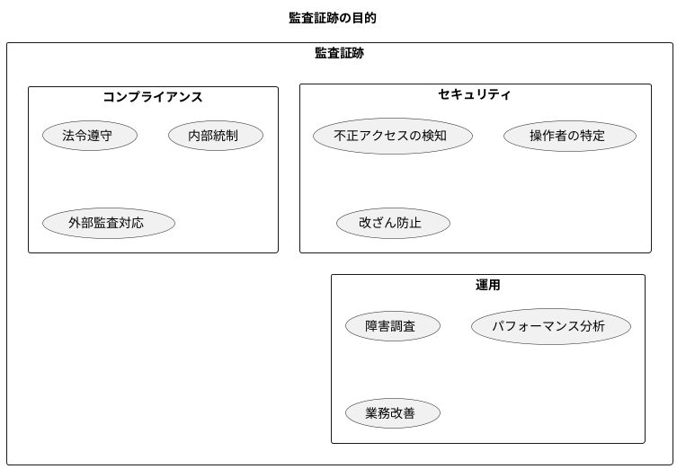
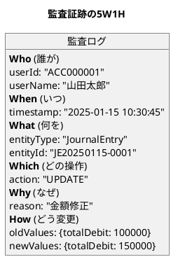
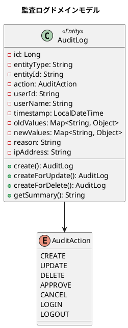
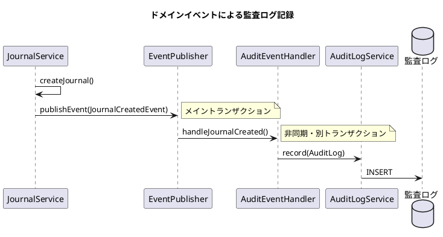

# 第27章: 非機能要件 3 - 監査ログとトレーサビリティ

## 27.1 監査ログの重要性

### 財務会計における監査証跡

財務会計システムにおいて、監査証跡（Audit Trail）は法的要件であり、ビジネスの信頼性確保の基盤です。「誰が」「いつ」「何を」実行したかを記録することは、セキュリティ、コンプライアンス、トラブルシューティングの観点から必須の機能です。



### 法的要件

財務会計システムでは、以下の法令に基づいて監査証跡が要求されます。

| 法律 | 要件 | 保存期間 |
|------|------|----------|
| **会社法** | 会計帳簿の作成・保存義務 | 10年間 |
| **金融商品取引法** | 有価証券報告書の信頼性確保 | 5年間 |
| **電子帳簿保存法** | 電子データの真実性・可視性・検索性 | 7年間 |
| **J-SOX（内部統制）** | 財務報告プロセスの文書化 | 継続的 |

### ビジネス要件

1. **不正検出**: 不正な取引や改ざんの検出
2. **問題調査**: エラーや不整合の原因追跡
3. **コンプライアンス**: 監査法人による外部監査対応
4. **説明責任**: ステークホルダーへの説明義務

---

## 27.2 監査ログの設計原則

### 5W1H の記録

監査証跡では、すべての操作について 5W1H を記録します。



### 設計原則

監査ログは以下の5つの原則に従って設計します。

**1. 完全性（Completeness）**

すべての重要な操作を漏れなく記録します。

```java
// 記録対象の操作
- CREATE: 新規登録時（仕訳作成、勘定科目追加など）
- UPDATE: 更新時（仕訳修正、承認ステータス変更など）
- DELETE: 削除時（論理削除・物理削除の両方）
- APPROVE: 承認時（仕訳承認、確定など）
- CANCEL: 取消時（仕訳取消など）
```

**2. 正確性（Accuracy）**

変更前後の値を正確に記録します。

```json
{
  "oldValues": {
    "totalDebit": 100000,
    "status": "DRAFT"
  },
  "newValues": {
    "totalDebit": 150000,
    "status": "APPROVED"
  }
}
```

**3. 不変性（Immutability）**

一度記録されたログは変更・削除不可とします。

```java
// 不変性を保証する設計
- id: シーケンス（連番）で自動採番
- 更新・削除の API は提供しない
- データベース権限で INSERT のみ許可
- @Value アノテーションで不変オブジェクト
```

**4. トレーサビリティ（Traceability）**

操作の連鎖を追跡可能にします。

```json
{
  "entityType": "JournalEntry",
  "entityId": "JE20250115-0001",
  "relatedEntities": [
    {"type": "JournalLine", "id": "1"},
    {"type": "JournalLine", "id": "2"}
  ]
}
```

**5. 検索可能性（Searchability）**

効率的な検索を実現するインデックス設計を行います。

```sql
CREATE INDEX idx_audit_log_entity ON audit_log(entity_type, entity_id);
CREATE INDEX idx_audit_log_user ON audit_log(user_id);
CREATE INDEX idx_audit_log_timestamp ON audit_log(timestamp);
CREATE INDEX idx_audit_log_action ON audit_log(action);
```

---

## 27.3 監査ログのドメインモデル

### 監査ログエンティティ



### AuditAction 列挙型

```java
package com.example.accounting.domain.model.audit;

/**
 * 監査アクション種別
 */
public enum AuditAction {

    CREATE("作成"),
    UPDATE("更新"),
    DELETE("削除"),
    APPROVE("承認"),
    CONFIRM("確定"),
    CANCEL("取消"),
    LOGIN("ログイン"),
    LOGOUT("ログアウト");

    private final String displayName;

    AuditAction(String displayName) {
        this.displayName = displayName;
    }

    public String getDisplayName() {
        return displayName;
    }
}
```

### AuditLog ドメインモデル

```java
package com.example.accounting.domain.model.audit;

import lombok.Builder;
import lombok.Value;
import java.time.LocalDateTime;
import java.util.Map;

/**
 * 監査ログエンティティ
 *
 * 財務会計システムにおける全ての重要な操作を記録する。
 * 一度作成されたら変更不可（不変オブジェクト）。
 */
@Value
@Builder(toBuilder = true)
public class AuditLog {

    Long id;
    String entityType;
    String entityId;
    AuditAction action;
    String userId;
    String userName;
    LocalDateTime timestamp;
    Map<String, Object> oldValues;
    Map<String, Object> newValues;
    String reason;
    String ipAddress;
    String userAgent;

    /**
     * CREATE操作の監査ログを作成
     */
    public static AuditLog create(
            String entityType,
            String entityId,
            String userId,
            String userName,
            Map<String, Object> newValues,
            String ipAddress) {

        return AuditLog.builder()
            .entityType(entityType)
            .entityId(entityId)
            .action(AuditAction.CREATE)
            .userId(userId)
            .userName(userName)
            .timestamp(LocalDateTime.now())
            .newValues(newValues)
            .ipAddress(ipAddress)
            .build();
    }

    /**
     * UPDATE操作の監査ログを作成
     */
    public static AuditLog createForUpdate(
            String entityType,
            String entityId,
            String userId,
            String userName,
            Map<String, Object> oldValues,
            Map<String, Object> newValues,
            String ipAddress) {

        return AuditLog.builder()
            .entityType(entityType)
            .entityId(entityId)
            .action(AuditAction.UPDATE)
            .userId(userId)
            .userName(userName)
            .timestamp(LocalDateTime.now())
            .oldValues(oldValues)
            .newValues(newValues)
            .ipAddress(ipAddress)
            .build();
    }

    /**
     * DELETE操作の監査ログを作成
     */
    public static AuditLog createForDelete(
            String entityType,
            String entityId,
            String userId,
            String userName,
            Map<String, Object> deletedValues,
            String reason,
            String ipAddress) {

        return AuditLog.builder()
            .entityType(entityType)
            .entityId(entityId)
            .action(AuditAction.DELETE)
            .userId(userId)
            .userName(userName)
            .timestamp(LocalDateTime.now())
            .oldValues(deletedValues)
            .reason(reason)
            .ipAddress(ipAddress)
            .build();
    }

    /**
     * APPROVE操作の監査ログを作成
     */
    public static AuditLog createForApprove(
            String entityType,
            String entityId,
            String userId,
            String userName,
            Map<String, Object> approvedData,
            String ipAddress) {

        return AuditLog.builder()
            .entityType(entityType)
            .entityId(entityId)
            .action(AuditAction.APPROVE)
            .userId(userId)
            .userName(userName)
            .timestamp(LocalDateTime.now())
            .newValues(approvedData)
            .ipAddress(ipAddress)
            .build();
    }

    /**
     * サマリー文字列を生成
     */
    public String getSummary() {
        return String.format("%s %s を%s",
            entityType,
            entityId,
            action.getDisplayName());
    }
}
```

---

## 27.4 監査ログテーブルの設計

### データベーススキーマ

```sql
-- V27__create_audit_log_table.sql

-- 監査ログテーブル（Append-Only）
CREATE TABLE IF NOT EXISTS 監査ログ (
    id BIGSERIAL PRIMARY KEY,
    エンティティ種別 VARCHAR(50) NOT NULL,
    エンティティID VARCHAR(100) NOT NULL,
    アクション VARCHAR(20) NOT NULL,
    ユーザーID VARCHAR(100) NOT NULL,
    ユーザー名 VARCHAR(200) NOT NULL,
    タイムスタンプ TIMESTAMP NOT NULL DEFAULT CURRENT_TIMESTAMP,
    変更前 JSONB,
    変更後 JSONB,
    理由 TEXT,
    IPアドレス VARCHAR(45),
    ユーザーエージェント TEXT,
    作成日時 TIMESTAMP NOT NULL DEFAULT CURRENT_TIMESTAMP
);

-- インデックス作成
CREATE INDEX idx_audit_log_entity
    ON 監査ログ(エンティティ種別, エンティティID);
CREATE INDEX idx_audit_log_user
    ON 監査ログ(ユーザーID);
CREATE INDEX idx_audit_log_timestamp
    ON 監査ログ(タイムスタンプ);
CREATE INDEX idx_audit_log_action
    ON 監査ログ(アクション);

-- JSONB 列へのGINインデックス（特定キーの検索用）
CREATE INDEX idx_audit_log_old_values
    ON 監査ログ USING GIN (変更前);
CREATE INDEX idx_audit_log_new_values
    ON 監査ログ USING GIN (変更後);

-- コメント
COMMENT ON TABLE 監査ログ IS '監査ログテーブル（Append-Onlyで不変）';
COMMENT ON COLUMN 監査ログ.エンティティ種別 IS 'エンティティ種別（JournalEntry, Account等）';
COMMENT ON COLUMN 監査ログ.エンティティID IS 'エンティティID';
COMMENT ON COLUMN 監査ログ.アクション IS '操作種別（CREATE, UPDATE, DELETE, APPROVE等）';
COMMENT ON COLUMN 監査ログ.変更前 IS '変更前の値（UPDATE, DELETE時）';
COMMENT ON COLUMN 監査ログ.変更後 IS '変更後の値（CREATE, UPDATE時）';
COMMENT ON COLUMN 監査ログ.理由 IS '操作理由（任意）';
```

### JSONB 型の活用

PostgreSQL の JSONB 型を使用することで、柔軟かつ効率的な変更履歴を保存できます。

```java
// JSONBの利点
1. スキーマ変更に強い（カラム追加不要）
2. 複雑なオブジェクトをそのまま保存可能
3. JSONB はバイナリ形式で高速
4. インデックスとクエリをサポート
```

**仕訳の変更履歴の例**:

```json
{
  "journalNumber": "JE20250115-0001",
  "journalDate": "2025-01-15",
  "description": "売上計上",
  "status": "APPROVED",
  "totalDebit": 150000,
  "totalCredit": 150000,
  "lines": [
    {
      "lineNumber": 1,
      "accountCode": "1101",
      "accountName": "現金",
      "debitAmount": 150000
    },
    {
      "lineNumber": 2,
      "accountCode": "4001",
      "accountName": "売上高",
      "creditAmount": 150000
    }
  ]
}
```

---

## 27.5 ドメインイベントによる自動記録

### Spring Events の活用

Spring Events を使用して、エンティティの変更を自動的に監査ログに記録します。



### ドメインイベントの定義

```java
package com.example.accounting.domain.event;

import lombok.Getter;
import java.time.LocalDateTime;
import java.util.UUID;

/**
 * ドメインイベント基底クラス
 */
@Getter
public abstract class DomainEvent {

    private final String eventId;
    private final LocalDateTime occurredAt;

    protected DomainEvent() {
        this.eventId = UUID.randomUUID().toString();
        this.occurredAt = LocalDateTime.now();
    }

    public abstract String getEventType();
}
```

### 仕訳イベント

```java
package com.example.accounting.domain.event;

import lombok.Getter;
import java.util.Map;

/**
 * 仕訳作成イベント
 */
@Getter
public class JournalCreatedEvent extends DomainEvent {

    private final String journalNumber;
    private final Map<String, Object> journalData;
    private final String userId;
    private final String userName;
    private final String ipAddress;

    public JournalCreatedEvent(
            String journalNumber,
            Map<String, Object> journalData,
            String userId,
            String userName,
            String ipAddress) {
        super();
        this.journalNumber = journalNumber;
        this.journalData = journalData;
        this.userId = userId;
        this.userName = userName;
        this.ipAddress = ipAddress;
    }

    @Override
    public String getEventType() {
        return "JournalCreated";
    }
}

/**
 * 仕訳承認イベント
 */
@Getter
public class JournalApprovedEvent extends DomainEvent {

    private final String journalNumber;
    private final Map<String, Object> journalData;
    private final String approverId;
    private final String approverName;
    private final String ipAddress;

    public JournalApprovedEvent(
            String journalNumber,
            Map<String, Object> journalData,
            String approverId,
            String approverName,
            String ipAddress) {
        super();
        this.journalNumber = journalNumber;
        this.journalData = journalData;
        this.approverId = approverId;
        this.approverName = approverName;
        this.ipAddress = ipAddress;
    }

    @Override
    public String getEventType() {
        return "JournalApproved";
    }
}

/**
 * 仕訳更新イベント
 */
@Getter
public class JournalUpdatedEvent extends DomainEvent {

    private final String journalNumber;
    private final Map<String, Object> oldValues;
    private final Map<String, Object> newValues;
    private final String userId;
    private final String userName;
    private final String ipAddress;

    public JournalUpdatedEvent(
            String journalNumber,
            Map<String, Object> oldValues,
            Map<String, Object> newValues,
            String userId,
            String userName,
            String ipAddress) {
        super();
        this.journalNumber = journalNumber;
        this.oldValues = oldValues;
        this.newValues = newValues;
        this.userId = userId;
        this.userName = userName;
        this.ipAddress = ipAddress;
    }

    @Override
    public String getEventType() {
        return "JournalUpdated";
    }
}
```

### イベントハンドラー

```java
package com.example.accounting.application.event;

import com.example.accounting.application.AuditLogService;
import com.example.accounting.domain.event.*;
import com.example.accounting.domain.model.audit.AuditLog;
import lombok.RequiredArgsConstructor;
import lombok.extern.slf4j.Slf4j;
import org.springframework.scheduling.annotation.Async;
import org.springframework.stereotype.Component;
import org.springframework.transaction.event.TransactionPhase;
import org.springframework.transaction.event.TransactionalEventListener;

/**
 * 監査イベントハンドラー
 *
 * ドメインイベントを受信し、監査ログを自動記録する。
 */
@Component
@RequiredArgsConstructor
@Slf4j
public class AuditEventHandler {

    private final AuditLogService auditLogService;

    /**
     * 仕訳作成イベントのハンドリング
     */
    @TransactionalEventListener(phase = TransactionPhase.AFTER_COMMIT)
    @Async("auditExecutor")
    public void handleJournalCreated(JournalCreatedEvent event) {
        log.info("Handling JournalCreatedEvent: {}", event.getJournalNumber());

        AuditLog auditLog = AuditLog.create(
            "JournalEntry",
            event.getJournalNumber(),
            event.getUserId(),
            event.getUserName(),
            event.getJournalData(),
            event.getIpAddress()
        );

        auditLogService.record(auditLog);
    }

    /**
     * 仕訳承認イベントのハンドリング
     */
    @TransactionalEventListener(phase = TransactionPhase.AFTER_COMMIT)
    @Async("auditExecutor")
    public void handleJournalApproved(JournalApprovedEvent event) {
        log.info("Handling JournalApprovedEvent: {}", event.getJournalNumber());

        AuditLog auditLog = AuditLog.createForApprove(
            "JournalEntry",
            event.getJournalNumber(),
            event.getApproverId(),
            event.getApproverName(),
            event.getJournalData(),
            event.getIpAddress()
        );

        auditLogService.record(auditLog);
    }

    /**
     * 仕訳更新イベントのハンドリング
     */
    @TransactionalEventListener(phase = TransactionPhase.AFTER_COMMIT)
    @Async("auditExecutor")
    public void handleJournalUpdated(JournalUpdatedEvent event) {
        log.info("Handling JournalUpdatedEvent: {}", event.getJournalNumber());

        AuditLog auditLog = AuditLog.createForUpdate(
            "JournalEntry",
            event.getJournalNumber(),
            event.getUserId(),
            event.getUserName(),
            event.getOldValues(),
            event.getNewValues(),
            event.getIpAddress()
        );

        auditLogService.record(auditLog);
    }

    /**
     * 勘定科目更新イベントのハンドリング
     */
    @TransactionalEventListener(phase = TransactionPhase.AFTER_COMMIT)
    @Async("auditExecutor")
    public void handleAccountUpdated(AccountUpdatedEvent event) {
        log.info("Handling AccountUpdatedEvent: {}", event.getAccountCode());

        AuditLog auditLog = AuditLog.createForUpdate(
            "Account",
            event.getAccountCode(),
            event.getUserId(),
            event.getUserName(),
            event.getOldValues(),
            event.getNewValues(),
            event.getIpAddress()
        );

        auditLogService.record(auditLog);
    }
}
```

### 非同期設定

```java
package com.example.accounting.infrastructure.config;

import org.springframework.context.annotation.Bean;
import org.springframework.context.annotation.Configuration;
import org.springframework.scheduling.annotation.EnableAsync;
import org.springframework.scheduling.concurrent.ThreadPoolTaskExecutor;

import java.util.concurrent.Executor;

@Configuration
@EnableAsync
public class AsyncConfig {

    /**
     * 監査ログ記録用のスレッドプール
     */
    @Bean("auditExecutor")
    public Executor auditExecutor() {
        ThreadPoolTaskExecutor executor = new ThreadPoolTaskExecutor();
        executor.setCorePoolSize(2);
        executor.setMaxPoolSize(10);
        executor.setQueueCapacity(100);
        executor.setThreadNamePrefix("audit-");
        executor.setRejectedExecutionHandler(
            (r, e) -> {
                // キューが満杯の場合は同期実行
                if (!e.isShutdown()) {
                    r.run();
                }
            }
        );
        executor.initialize();
        return executor;
    }
}
```

---

## 27.6 監査ログサービスの実装

### Repository インターフェース

```java
package com.example.accounting.domain.model.audit;

import java.time.LocalDateTime;
import java.util.List;

/**
 * 監査ログリポジトリ
 */
public interface AuditLogRepository {

    /**
     * 監査ログを保存
     */
    AuditLog save(AuditLog auditLog);

    /**
     * エンティティの変更履歴を取得
     */
    List<AuditLog> findByEntity(String entityType, String entityId);

    /**
     * ユーザーの操作履歴を取得
     */
    List<AuditLog> findByUser(
        String userId,
        LocalDateTime startDate,
        LocalDateTime endDate
    );

    /**
     * 期間別の監査ログを取得
     */
    List<AuditLog> findByPeriod(
        LocalDateTime startDate,
        LocalDateTime endDate,
        int limit
    );

    /**
     * アクション別の監査ログを取得
     */
    List<AuditLog> findByAction(
        AuditAction action,
        LocalDateTime startDate,
        LocalDateTime endDate
    );

    /**
     * 監査ログの件数を取得
     */
    long count(LocalDateTime startDate, LocalDateTime endDate);
}
```

### Application Service

```java
package com.example.accounting.application;

import com.example.accounting.domain.model.audit.*;
import lombok.RequiredArgsConstructor;
import lombok.extern.slf4j.Slf4j;
import org.springframework.stereotype.Service;
import org.springframework.transaction.annotation.Propagation;
import org.springframework.transaction.annotation.Transactional;

import java.time.LocalDateTime;
import java.util.List;

/**
 * 監査ログサービス
 */
@Service
@RequiredArgsConstructor
@Slf4j
public class AuditLogService {

    private final AuditLogRepository auditLogRepository;

    /**
     * 監査ログを記録
     *
     * 新しいトランザクションで実行し、メイン処理に影響を与えない
     */
    @Transactional(propagation = Propagation.REQUIRES_NEW)
    public void record(AuditLog auditLog) {
        try {
            auditLogRepository.save(auditLog);
            log.debug("Audit log recorded: {}", auditLog.getSummary());
        } catch (Exception e) {
            // 監査ログの記録失敗はメイン処理に影響させない
            log.error("Failed to record audit log: {}", auditLog.getSummary(), e);
        }
    }

    /**
     * エンティティの変更履歴を取得
     */
    @Transactional(readOnly = true)
    public List<AuditLog> getEntityHistory(String entityType, String entityId) {
        return auditLogRepository.findByEntity(entityType, entityId);
    }

    /**
     * ユーザーの操作履歴を取得
     */
    @Transactional(readOnly = true)
    public List<AuditLog> getUserActivity(
            String userId,
            LocalDateTime startDate,
            LocalDateTime endDate) {
        return auditLogRepository.findByUser(userId, startDate, endDate);
    }

    /**
     * 期間別の監査ログを取得
     */
    @Transactional(readOnly = true)
    public List<AuditLog> getAuditLogsForPeriod(
            LocalDateTime startDate,
            LocalDateTime endDate,
            int limit) {
        return auditLogRepository.findByPeriod(startDate, endDate, limit);
    }

    /**
     * アクション別の監査ログを取得
     */
    @Transactional(readOnly = true)
    public List<AuditLog> getAuditLogsByAction(
            AuditAction action,
            LocalDateTime startDate,
            LocalDateTime endDate) {
        return auditLogRepository.findByAction(action, startDate, endDate);
    }

    /**
     * 仕訳の全履歴を取得
     */
    @Transactional(readOnly = true)
    public List<AuditLog> getJournalHistory(String journalNumber) {
        return auditLogRepository.findByEntity("JournalEntry", journalNumber);
    }

    /**
     * 監査統計を取得
     */
    @Transactional(readOnly = true)
    public AuditStatistics getStatistics(
            LocalDateTime startDate,
            LocalDateTime endDate) {
        long totalCount = auditLogRepository.count(startDate, endDate);

        List<AuditLog> creates = auditLogRepository.findByAction(
            AuditAction.CREATE, startDate, endDate
        );
        List<AuditLog> updates = auditLogRepository.findByAction(
            AuditAction.UPDATE, startDate, endDate
        );
        List<AuditLog> deletes = auditLogRepository.findByAction(
            AuditAction.DELETE, startDate, endDate
        );
        List<AuditLog> approves = auditLogRepository.findByAction(
            AuditAction.APPROVE, startDate, endDate
        );

        return new AuditStatistics(
            totalCount,
            creates.size(),
            updates.size(),
            deletes.size(),
            approves.size()
        );
    }
}
```

### 統計情報

```java
package com.example.accounting.domain.model.audit;

/**
 * 監査統計情報
 */
public record AuditStatistics(
    long totalCount,
    int createCount,
    int updateCount,
    int deleteCount,
    int approveCount
) {
    public double getCreateRatio() {
        return totalCount > 0 ? (double) createCount / totalCount * 100 : 0;
    }

    public double getUpdateRatio() {
        return totalCount > 0 ? (double) updateCount / totalCount * 100 : 0;
    }

    public double getDeleteRatio() {
        return totalCount > 0 ? (double) deleteCount / totalCount * 100 : 0;
    }

    public double getApproveRatio() {
        return totalCount > 0 ? (double) approveCount / totalCount * 100 : 0;
    }
}
```

---

## 27.7 監査ログ API の実装

### REST コントローラ

```java
package com.example.accounting.presentation.api;

import com.example.accounting.application.AuditLogService;
import com.example.accounting.domain.model.audit.*;
import io.swagger.v3.oas.annotations.Operation;
import io.swagger.v3.oas.annotations.tags.Tag;
import lombok.RequiredArgsConstructor;
import org.springframework.format.annotation.DateTimeFormat;
import org.springframework.http.ResponseEntity;
import org.springframework.security.access.prepost.PreAuthorize;
import org.springframework.web.bind.annotation.*;

import java.time.LocalDateTime;
import java.util.List;

/**
 * 監査ログAPIコントローラ
 */
@RestController
@RequestMapping("/api/audit-logs")
@RequiredArgsConstructor
@Tag(name = "監査ログ", description = "監査ログの検索・レポート")
public class AuditLogController {

    private final AuditLogService auditLogService;

    @GetMapping("/entity/{entityType}/{entityId}")
    @Operation(summary = "エンティティの変更履歴を取得")
    @PreAuthorize("hasAuthority('AUDIT_READ')")
    public ResponseEntity<List<AuditLogResponse>> getEntityHistory(
            @PathVariable String entityType,
            @PathVariable String entityId) {

        List<AuditLog> logs = auditLogService.getEntityHistory(entityType, entityId);

        return ResponseEntity.ok(
            logs.stream().map(AuditLogResponse::from).toList()
        );
    }

    @GetMapping("/user/{userId}")
    @Operation(summary = "ユーザーの操作履歴を取得")
    @PreAuthorize("hasAuthority('AUDIT_READ')")
    public ResponseEntity<List<AuditLogResponse>> getUserActivity(
            @PathVariable String userId,
            @RequestParam @DateTimeFormat(iso = DateTimeFormat.ISO.DATE_TIME)
                LocalDateTime startDate,
            @RequestParam @DateTimeFormat(iso = DateTimeFormat.ISO.DATE_TIME)
                LocalDateTime endDate) {

        List<AuditLog> logs = auditLogService.getUserActivity(
            userId, startDate, endDate
        );

        return ResponseEntity.ok(
            logs.stream().map(AuditLogResponse::from).toList()
        );
    }

    @GetMapping("/period")
    @Operation(summary = "期間別の監査ログを取得")
    @PreAuthorize("hasAuthority('AUDIT_READ')")
    public ResponseEntity<List<AuditLogResponse>> getAuditLogsByPeriod(
            @RequestParam @DateTimeFormat(iso = DateTimeFormat.ISO.DATE_TIME)
                LocalDateTime startDate,
            @RequestParam @DateTimeFormat(iso = DateTimeFormat.ISO.DATE_TIME)
                LocalDateTime endDate,
            @RequestParam(defaultValue = "100") int limit) {

        List<AuditLog> logs = auditLogService.getAuditLogsForPeriod(
            startDate, endDate, limit
        );

        return ResponseEntity.ok(
            logs.stream().map(AuditLogResponse::from).toList()
        );
    }

    @GetMapping("/action/{action}")
    @Operation(summary = "アクション別の監査ログを取得")
    @PreAuthorize("hasAuthority('AUDIT_READ')")
    public ResponseEntity<List<AuditLogResponse>> getAuditLogsByAction(
            @PathVariable AuditAction action,
            @RequestParam @DateTimeFormat(iso = DateTimeFormat.ISO.DATE_TIME)
                LocalDateTime startDate,
            @RequestParam @DateTimeFormat(iso = DateTimeFormat.ISO.DATE_TIME)
                LocalDateTime endDate) {

        List<AuditLog> logs = auditLogService.getAuditLogsByAction(
            action, startDate, endDate
        );

        return ResponseEntity.ok(
            logs.stream().map(AuditLogResponse::from).toList()
        );
    }

    @GetMapping("/journal/{journalNumber}")
    @Operation(summary = "仕訳の全履歴を取得")
    @PreAuthorize("hasAuthority('JOURNAL_READ')")
    public ResponseEntity<List<AuditLogResponse>> getJournalHistory(
            @PathVariable String journalNumber) {

        List<AuditLog> logs = auditLogService.getJournalHistory(journalNumber);

        return ResponseEntity.ok(
            logs.stream().map(AuditLogResponse::from).toList()
        );
    }

    @GetMapping("/statistics")
    @Operation(summary = "監査統計を取得")
    @PreAuthorize("hasAuthority('AUDIT_READ')")
    public ResponseEntity<AuditStatisticsResponse> getStatistics(
            @RequestParam @DateTimeFormat(iso = DateTimeFormat.ISO.DATE_TIME)
                LocalDateTime startDate,
            @RequestParam @DateTimeFormat(iso = DateTimeFormat.ISO.DATE_TIME)
                LocalDateTime endDate) {

        AuditStatistics statistics = auditLogService.getStatistics(
            startDate, endDate
        );

        return ResponseEntity.ok(AuditStatisticsResponse.from(statistics));
    }
}
```

### レスポンスDTO

```java
package com.example.accounting.presentation.api.dto;

import com.example.accounting.domain.model.audit.AuditLog;
import com.example.accounting.domain.model.audit.AuditStatistics;
import com.fasterxml.jackson.annotation.JsonFormat;
import lombok.Builder;
import lombok.Data;

import java.time.LocalDateTime;
import java.util.Map;

/**
 * 監査ログレスポンス
 */
@Data
@Builder
public class AuditLogResponse {

    private Long id;
    private String entityType;
    private String entityId;
    private String action;
    private String actionDisplayName;
    private String userId;
    private String userName;

    @JsonFormat(pattern = "yyyy-MM-dd'T'HH:mm:ss")
    private LocalDateTime timestamp;

    private Map<String, Object> oldValues;
    private Map<String, Object> newValues;
    private String reason;
    private String summary;

    public static AuditLogResponse from(AuditLog log) {
        return AuditLogResponse.builder()
            .id(log.getId())
            .entityType(log.getEntityType())
            .entityId(log.getEntityId())
            .action(log.getAction().name())
            .actionDisplayName(log.getAction().getDisplayName())
            .userId(log.getUserId())
            .userName(log.getUserName())
            .timestamp(log.getTimestamp())
            .oldValues(log.getOldValues())
            .newValues(log.getNewValues())
            .reason(log.getReason())
            .summary(log.getSummary())
            .build();
    }
}

/**
 * 監査統計レスポンス
 */
@Data
@Builder
public class AuditStatisticsResponse {

    private long totalCount;
    private int createCount;
    private int updateCount;
    private int deleteCount;
    private int approveCount;
    private double createRatio;
    private double updateRatio;
    private double deleteRatio;
    private double approveRatio;

    public static AuditStatisticsResponse from(AuditStatistics stats) {
        return AuditStatisticsResponse.builder()
            .totalCount(stats.totalCount())
            .createCount(stats.createCount())
            .updateCount(stats.updateCount())
            .deleteCount(stats.deleteCount())
            .approveCount(stats.approveCount())
            .createRatio(stats.getCreateRatio())
            .updateRatio(stats.getUpdateRatio())
            .deleteRatio(stats.getDeleteRatio())
            .approveRatio(stats.getApproveRatio())
            .build();
    }
}
```

---

## 27.8 AOPによる自動監査記録

### 監査アノテーション

```java
package com.example.accounting.infrastructure.audit;

import com.example.accounting.domain.model.audit.AuditAction;

import java.lang.annotation.ElementType;
import java.lang.annotation.Retention;
import java.lang.annotation.RetentionPolicy;
import java.lang.annotation.Target;

/**
 * 監査対象メソッドを示すアノテーション
 */
@Target(ElementType.METHOD)
@Retention(RetentionPolicy.RUNTIME)
public @interface Audited {

    /**
     * エンティティ種別
     */
    String entityType();

    /**
     * アクション種別
     */
    AuditAction action();

    /**
     * エンティティIDを取得するSpEL式
     */
    String entityIdExpression() default "";
}
```

### 監査アスペクト

```java
package com.example.accounting.infrastructure.audit;

import com.example.accounting.application.AuditLogService;
import com.example.accounting.domain.model.audit.AuditLog;
import jakarta.servlet.http.HttpServletRequest;
import lombok.RequiredArgsConstructor;
import lombok.extern.slf4j.Slf4j;
import org.aspectj.lang.ProceedingJoinPoint;
import org.aspectj.lang.annotation.Around;
import org.aspectj.lang.annotation.Aspect;
import org.springframework.expression.EvaluationContext;
import org.springframework.expression.ExpressionParser;
import org.springframework.expression.spel.standard.SpelExpressionParser;
import org.springframework.expression.spel.support.StandardEvaluationContext;
import org.springframework.security.core.context.SecurityContextHolder;
import org.springframework.stereotype.Component;
import org.springframework.web.context.request.RequestContextHolder;
import org.springframework.web.context.request.ServletRequestAttributes;

import java.util.Map;

/**
 * 監査アスペクト
 *
 * @Audited アノテーションが付与されたメソッドの実行を監査ログに記録する。
 */
@Aspect
@Component
@RequiredArgsConstructor
@Slf4j
public class AuditAspect {

    private final AuditLogService auditLogService;
    private final ExpressionParser parser = new SpelExpressionParser();

    @Around("@annotation(audited)")
    public Object audit(ProceedingJoinPoint joinPoint, Audited audited)
            throws Throwable {

        // ユーザー情報取得
        String userId = getCurrentUserId();
        String userName = getCurrentUserName();
        String ipAddress = getClientIpAddress();

        // エンティティID取得
        String entityId = evaluateEntityId(
            audited.entityIdExpression(),
            joinPoint
        );

        log.info("Audit start: {} {} {} by {}",
            audited.action(),
            audited.entityType(),
            entityId,
            userId
        );

        try {
            // メソッド実行
            Object result = joinPoint.proceed();

            // 成功時の監査ログ記録
            AuditLog auditLog = AuditLog.builder()
                .entityType(audited.entityType())
                .entityId(entityId)
                .action(audited.action())
                .userId(userId)
                .userName(userName)
                .timestamp(java.time.LocalDateTime.now())
                .newValues(extractResultData(result))
                .ipAddress(ipAddress)
                .build();

            auditLogService.record(auditLog);

            log.info("Audit complete: {} {} {}",
                audited.action(),
                audited.entityType(),
                entityId
            );

            return result;

        } catch (Exception e) {
            log.error("Audit failed: {} {} {} - {}",
                audited.action(),
                audited.entityType(),
                entityId,
                e.getMessage()
            );
            throw e;
        }
    }

    private String getCurrentUserId() {
        var auth = SecurityContextHolder.getContext().getAuthentication();
        return auth != null ? auth.getName() : "SYSTEM";
    }

    private String getCurrentUserName() {
        // 実際にはUserDetailsから取得
        return "システムユーザー";
    }

    private String getClientIpAddress() {
        ServletRequestAttributes attrs =
            (ServletRequestAttributes) RequestContextHolder.getRequestAttributes();
        if (attrs != null) {
            HttpServletRequest request = attrs.getRequest();
            String xff = request.getHeader("X-Forwarded-For");
            return xff != null ? xff.split(",")[0] : request.getRemoteAddr();
        }
        return null;
    }

    private String evaluateEntityId(String expression, ProceedingJoinPoint jp) {
        if (expression == null || expression.isEmpty()) {
            return "unknown";
        }

        EvaluationContext context = new StandardEvaluationContext();
        Object[] args = jp.getArgs();
        for (int i = 0; i < args.length; i++) {
            context.setVariable("arg" + i, args[i]);
        }

        try {
            return parser.parseExpression(expression)
                .getValue(context, String.class);
        } catch (Exception e) {
            log.warn("Failed to evaluate entity ID expression: {}", expression);
            return "unknown";
        }
    }

    @SuppressWarnings("unchecked")
    private Map<String, Object> extractResultData(Object result) {
        if (result == null) {
            return Map.of();
        }
        // 実際にはObjectMapperでMapに変換
        return Map.of("result", result.toString());
    }
}
```

### 使用例

```java
@Service
public class JournalService {

    @Audited(
        entityType = "JournalEntry",
        action = AuditAction.CREATE,
        entityIdExpression = "#result.journalNumber.value"
    )
    public JournalEntry createJournal(CreateJournalCommand command) {
        // 仕訳作成ロジック
        return journalRepository.save(journal);
    }

    @Audited(
        entityType = "JournalEntry",
        action = AuditAction.APPROVE,
        entityIdExpression = "#arg0"
    )
    public JournalEntry approveJournal(String journalNumber) {
        // 仕訳承認ロジック
        return journalRepository.save(journal.approve());
    }
}
```

---

## 27.9 監査レポート機能

### 監査レポートサービス

```java
package com.example.accounting.application;

import com.example.accounting.domain.model.audit.*;
import lombok.RequiredArgsConstructor;
import org.springframework.stereotype.Service;
import org.springframework.transaction.annotation.Transactional;

import java.time.LocalDate;
import java.time.LocalDateTime;
import java.util.*;
import java.util.stream.Collectors;

/**
 * 監査レポートサービス
 */
@Service
@RequiredArgsConstructor
@Transactional(readOnly = true)
public class AuditReportService {

    private final AuditLogRepository auditLogRepository;

    /**
     * 日次監査レポートを生成
     */
    public DailyAuditReport generateDailyReport(LocalDate date) {
        LocalDateTime startOfDay = date.atStartOfDay();
        LocalDateTime endOfDay = date.plusDays(1).atStartOfDay();

        List<AuditLog> logs = auditLogRepository.findByPeriod(
            startOfDay, endOfDay, Integer.MAX_VALUE
        );

        // アクション別集計
        Map<AuditAction, Long> actionCounts = logs.stream()
            .collect(Collectors.groupingBy(
                AuditLog::getAction,
                Collectors.counting()
            ));

        // エンティティ種別別集計
        Map<String, Long> entityCounts = logs.stream()
            .collect(Collectors.groupingBy(
                AuditLog::getEntityType,
                Collectors.counting()
            ));

        // ユーザー別集計
        Map<String, Long> userCounts = logs.stream()
            .collect(Collectors.groupingBy(
                AuditLog::getUserId,
                Collectors.counting()
            ));

        return new DailyAuditReport(
            date,
            logs.size(),
            actionCounts,
            entityCounts,
            userCounts,
            logs
        );
    }

    /**
     * ユーザー操作履歴レポートを生成
     */
    public UserActivityReport generateUserActivityReport(
            String userId,
            LocalDate startDate,
            LocalDate endDate) {

        List<AuditLog> logs = auditLogRepository.findByUser(
            userId,
            startDate.atStartOfDay(),
            endDate.plusDays(1).atStartOfDay()
        );

        // 日別集計
        Map<LocalDate, Long> dailyCounts = logs.stream()
            .collect(Collectors.groupingBy(
                log -> log.getTimestamp().toLocalDate(),
                Collectors.counting()
            ));

        // アクション別集計
        Map<AuditAction, Long> actionCounts = logs.stream()
            .collect(Collectors.groupingBy(
                AuditLog::getAction,
                Collectors.counting()
            ));

        return new UserActivityReport(
            userId,
            startDate,
            endDate,
            logs.size(),
            dailyCounts,
            actionCounts,
            logs
        );
    }

    /**
     * 変更履歴レポートを生成
     */
    public EntityChangeReport generateEntityChangeReport(
            String entityType,
            String entityId) {

        List<AuditLog> logs = auditLogRepository.findByEntity(entityType, entityId);

        return new EntityChangeReport(
            entityType,
            entityId,
            logs.size(),
            logs.isEmpty() ? null : logs.get(0).getTimestamp(),
            logs.isEmpty() ? null : logs.get(logs.size() - 1).getTimestamp(),
            logs
        );
    }
}
```

### レポートDTO

```java
package com.example.accounting.domain.model.audit;

import java.time.LocalDate;
import java.time.LocalDateTime;
import java.util.List;
import java.util.Map;

/**
 * 日次監査レポート
 */
public record DailyAuditReport(
    LocalDate date,
    int totalCount,
    Map<AuditAction, Long> actionCounts,
    Map<String, Long> entityCounts,
    Map<String, Long> userCounts,
    List<AuditLog> logs
) {}

/**
 * ユーザー操作履歴レポート
 */
public record UserActivityReport(
    String userId,
    LocalDate startDate,
    LocalDate endDate,
    int totalCount,
    Map<LocalDate, Long> dailyCounts,
    Map<AuditAction, Long> actionCounts,
    List<AuditLog> logs
) {}

/**
 * エンティティ変更履歴レポート
 */
public record EntityChangeReport(
    String entityType,
    String entityId,
    int changeCount,
    LocalDateTime firstChange,
    LocalDateTime lastChange,
    List<AuditLog> history
) {}
```

---

## まとめ

本章では、財務会計システムにおける監査ログとトレーサビリティ機能について解説しました。

### 重要なポイント

1. **法的要件への対応**: 会社法、金融商品取引法、電子帳簿保存法、J-SOX に準拠した監査証跡を実装しました。

2. **5つの設計原則**: 完全性、正確性、不変性、トレーサビリティ、検索可能性を満たす設計を行いました。

3. **ドメインイベント駆動**: Spring Events を活用し、エンティティの変更を自動的に監査ログに記録する仕組みを実装しました。

4. **AOP による自動記録**: `@Audited` アノテーションにより、ビジネスロジックと監査ロジックを分離しました。

5. **JSONB による柔軟な保存**: PostgreSQL の JSONB 型を活用し、スキーマ変更に強い変更履歴の保存を実現しました。

### 法的要件への対応状況

| 要件 | 実装 |
|------|------|
| **完全性** | すべての重要操作をイベント駆動で自動記録 |
| **正確性** | 変更前後の値を JSONB で正確に保存 |
| **不変性** | `@Value`（Lombok）と Append-Only テーブル |
| **長期保存** | パーティショニングで10年保存に対応可能 |
| **検索可能性** | 適切なインデックス設計で効率的な検索 |
| **トレーサビリティ** | 5W1H（誰が、いつ、何を、なぜ、どう）を記録 |

### 財務会計固有の監査対象

| エンティティ | 主な監査対象操作 |
|-------------|----------------|
| 仕訳（JournalEntry） | 作成、更新、承認、確定、取消 |
| 勘定科目（Account） | 作成、更新、削除 |
| 財務諸表 | 生成、ダウンロード |
| ユーザー | ログイン、ログアウト、権限変更 |

次章では、楽観ロックの実装について解説します。
