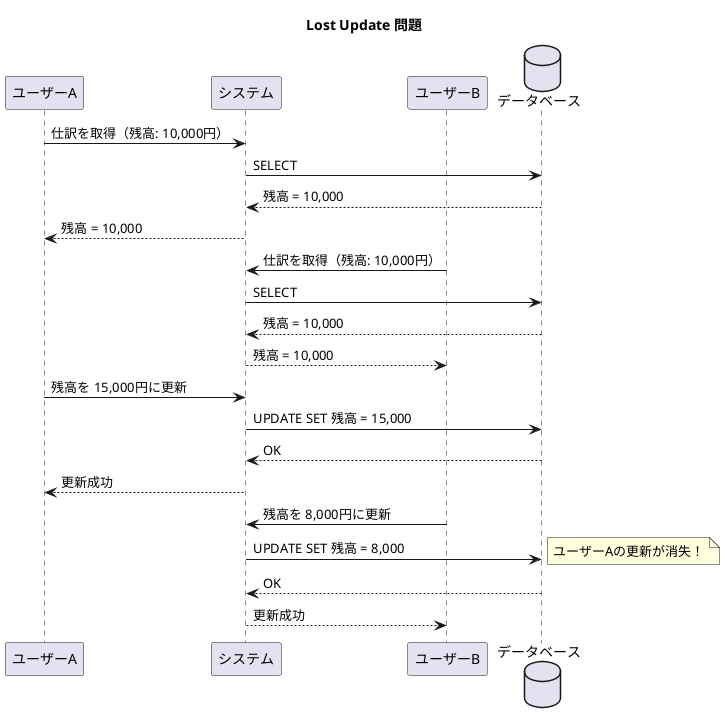
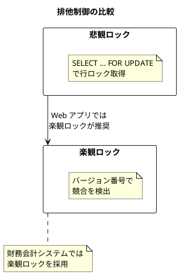
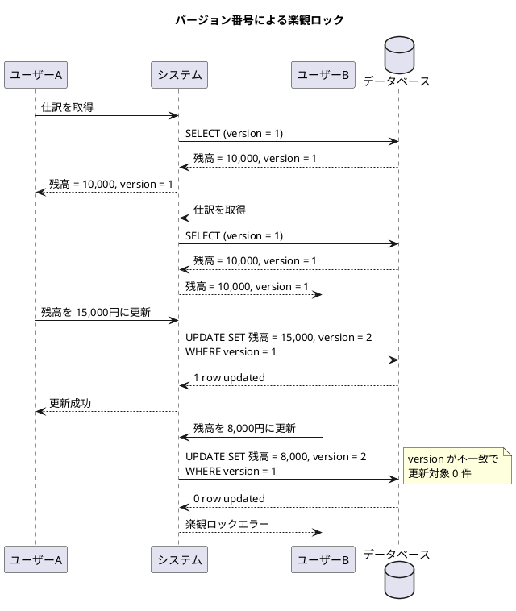
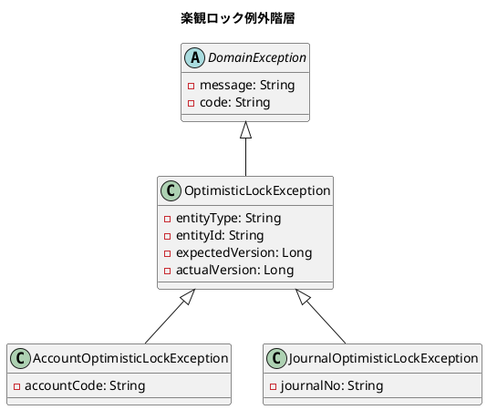

# 第28章: 非機能要件 4 - 楽観ロックの実装

## 28.1 排他制御の概要

### 同時実行制御の必要性

財務会計システムでは、複数のユーザーが同時に同じデータを更新しようとする状況が発生します。適切な排他制御がないと、データの不整合や更新の消失（Lost Update）が発生する可能性があります。



### 悲観ロック vs 楽観ロック

排他制御には主に2つのアプローチがあります。

| 方式 | 仕組み | メリット | デメリット |
|------|--------|----------|------------|
| **悲観ロック** | 読み取り時にロックを取得 | 競合を確実に防止 | パフォーマンス低下、デッドロックのリスク |
| **楽観ロック** | 更新時にバージョンをチェック | パフォーマンス良好、デッドロックなし | 競合時のリトライが必要 |



### 財務会計システムにおける楽観ロックの適用

財務会計システムでは、以下の理由から楽観ロックを採用します。

1. **Web アプリケーションの特性**: 画面表示から更新までの時間が長い
2. **競合頻度**: 同じデータを同時に更新する頻度は比較的低い
3. **スケーラビリティ**: データベースコネクションの保持時間を最小化
4. **ユーザー体験**: 競合時に明確なエラーメッセージを表示可能

---

## 28.2 楽観ロックの設計

### バージョン番号方式

楽観ロックの最も一般的な実装は、バージョン番号（または更新日時）を使用する方式です。



### テーブル設計

楽観ロックを実装するために、各テーブルにバージョン列を追加します。

```sql
-- 勘定科目マスタ
CREATE TABLE "勘定科目マスタ" (
    "勘定科目コード" VARCHAR(10) PRIMARY KEY,
    "勘定科目名" VARCHAR(50) NOT NULL,
    "勘定科目略称" VARCHAR(20),
    "勘定科目カナ" VARCHAR(50),
    "勘定科目BS区分" CHAR(1) NOT NULL,
    "勘定科目貸借区分" CHAR(1) NOT NULL,
    "勘定科目要素区分" VARCHAR(10) NOT NULL,
    "表示順" INTEGER,
    "version" BIGINT NOT NULL DEFAULT 1,    -- 楽観ロック用
    "作成日時" TIMESTAMP DEFAULT CURRENT_TIMESTAMP,
    "更新日時" TIMESTAMP DEFAULT CURRENT_TIMESTAMP
);

-- 仕訳
CREATE TABLE "仕訳" (
    "仕訳伝票番号" VARCHAR(20) PRIMARY KEY,
    "起票日" DATE NOT NULL,
    "摘要" VARCHAR(200),
    "承認状態" VARCHAR(20) DEFAULT 'DRAFT',
    "version" BIGINT NOT NULL DEFAULT 1,    -- 楽観ロック用
    "作成日時" TIMESTAMP DEFAULT CURRENT_TIMESTAMP,
    "更新日時" TIMESTAMP DEFAULT CURRENT_TIMESTAMP
);

-- 仕訳明細
CREATE TABLE "仕訳明細" (
    "仕訳伝票番号" VARCHAR(20) NOT NULL,
    "仕訳行番号" INTEGER NOT NULL,
    "勘定科目コード" VARCHAR(10) NOT NULL,
    "消費税コード" VARCHAR(10),
    "摘要" VARCHAR(200),
    "version" BIGINT NOT NULL DEFAULT 1,    -- 楽観ロック用
    PRIMARY KEY ("仕訳伝票番号", "仕訳行番号"),
    FOREIGN KEY ("仕訳伝票番号") REFERENCES "仕訳"("仕訳伝票番号")
);
```

### 既存テーブルへの version 列追加

```sql
-- Flyway マイグレーション: V202412160001__add_version_columns.sql

-- 勘定科目マスタ
ALTER TABLE "勘定科目マスタ" ADD COLUMN "version" BIGINT NOT NULL DEFAULT 1;

-- 仕訳
ALTER TABLE "仕訳" ADD COLUMN "version" BIGINT NOT NULL DEFAULT 1;

-- 仕訳明細
ALTER TABLE "仕訳明細" ADD COLUMN "version" BIGINT NOT NULL DEFAULT 1;

-- 日次残高
ALTER TABLE "日次残高" ADD COLUMN "version" BIGINT NOT NULL DEFAULT 1;

-- コメント
COMMENT ON COLUMN "勘定科目マスタ"."version" IS '楽観ロック用バージョン番号';
COMMENT ON COLUMN "仕訳"."version" IS '楽観ロック用バージョン番号';
COMMENT ON COLUMN "仕訳明細"."version" IS '楽観ロック用バージョン番号';
COMMENT ON COLUMN "日次残高"."version" IS '楽観ロック用バージョン番号';
```

---

## 28.3 ドメインモデルへの version 追加

### Versionable インターフェース

楽観ロック対象のドメインモデルが実装するインターフェースを定義します。

```java
// domain/model/shared/Versionable.java
package com.example.accounting.domain.model.shared;

/**
 * 楽観ロック対応ドメインモデルが実装するインターフェース
 */
public interface Versionable {
    /**
     * バージョン番号を取得
     */
    Long getVersion();

    /**
     * バージョン番号をインクリメントした新しいインスタンスを生成
     */
    <T extends Versionable> T incrementVersion();
}
```

### Account ドメインモデルへの適用

```java
// domain/model/account/Account.java
package com.example.accounting.domain.model.account;

import com.example.accounting.domain.model.shared.Versionable;
import lombok.Value;
import lombok.With;

@Value
@With
public class Account implements Versionable {
    String accountCode;
    String accountName;
    String accountAbbr;
    String accountKana;
    String bsplType;
    String debitCreditType;
    String elementType;
    Integer displayOrder;
    Long version;  // 楽観ロック用

    /**
     * 新規作成用ファクトリメソッド（version = 1）
     */
    public static Account create(
            String accountCode,
            String accountName,
            String bsplType,
            String debitCreditType,
            String elementType) {
        return new Account(
                accountCode,
                accountName,
                null,  // accountAbbr
                null,  // accountKana
                bsplType,
                debitCreditType,
                elementType,
                null,  // displayOrder
                1L     // 新規は version = 1
        );
    }

    /**
     * 貸借対照表科目かどうか
     */
    public boolean isBalanceSheetAccount() {
        return "B".equals(bsplType);
    }

    /**
     * 損益計算書科目かどうか
     */
    public boolean isProfitLossAccount() {
        return "P".equals(bsplType);
    }

    /**
     * 借方残高科目かどうか
     */
    public boolean isDebitBalance() {
        return "借".equals(debitCreditType);
    }

    /**
     * 貸方残高科目かどうか
     */
    public boolean isCreditBalance() {
        return "貸".equals(debitCreditType);
    }

    @Override
    @SuppressWarnings("unchecked")
    public Account incrementVersion() {
        return this.withVersion(this.version + 1);
    }
}
```

### JournalEntry ドメインモデルへの適用

```java
// domain/model/journal/JournalEntry.java
package com.example.accounting.domain.model.journal;

import com.example.accounting.domain.model.shared.Versionable;
import lombok.Value;
import lombok.With;

import java.math.BigDecimal;
import java.time.LocalDate;
import java.util.List;

@Value
@With
public class JournalEntry implements Versionable {
    String journalNo;
    LocalDate journalDate;
    String description;
    ApprovalStatus approvalStatus;
    List<JournalDetail> details;
    Long version;  // 楽観ロック用

    // コンストラクタで不変条件を保証
    public JournalEntry(String journalNo, LocalDate journalDate,
                        String description, ApprovalStatus approvalStatus,
                        List<JournalDetail> details, Long version) {
        if (details == null || details.size() < 2) {
            throw new IllegalArgumentException("仕訳明細は2件以上必要です");
        }

        this.journalNo = journalNo;
        this.journalDate = journalDate;
        this.description = description;
        this.approvalStatus = approvalStatus != null ? approvalStatus : ApprovalStatus.DRAFT;
        this.details = List.copyOf(details);
        this.version = version != null ? version : 1L;
    }

    /**
     * 新規作成用ファクトリメソッド
     */
    public static JournalEntry create(
            String journalNo,
            LocalDate journalDate,
            String description,
            List<JournalDetail> details) {
        return new JournalEntry(
                journalNo,
                journalDate,
                description,
                ApprovalStatus.DRAFT,
                details,
                1L  // 新規は version = 1
        );
    }

    /**
     * 複式簿記の原則: 借方合計 = 貸方合計
     */
    public boolean isBalanced() {
        return getTotalDebit().compareTo(getTotalCredit()) == 0;
    }

    /**
     * 借方合計を計算
     */
    public BigDecimal getTotalDebit() {
        return details.stream()
                .flatMap(d -> d.getItems().stream())
                .filter(JournalItem::isDebit)
                .map(JournalItem::getAmount)
                .reduce(BigDecimal.ZERO, BigDecimal::add);
    }

    /**
     * 貸方合計を計算
     */
    public BigDecimal getTotalCredit() {
        return details.stream()
                .flatMap(d -> d.getItems().stream())
                .filter(JournalItem::isCredit)
                .map(JournalItem::getAmount)
                .reduce(BigDecimal.ZERO, BigDecimal::add);
    }

    /**
     * 承認可能かどうか
     */
    public boolean canApprove() {
        return approvalStatus == ApprovalStatus.DRAFT && isBalanced();
    }

    /**
     * 承認する
     */
    public JournalEntry approve() {
        if (!canApprove()) {
            throw new IllegalStateException("この仕訳は承認できません");
        }
        return this.withApprovalStatus(ApprovalStatus.APPROVED)
                   .incrementVersion();
    }

    @Override
    @SuppressWarnings("unchecked")
    public JournalEntry incrementVersion() {
        return this.withVersion(this.version + 1);
    }
}
```

---

## 28.4 楽観ロック例外の定義

### 例外クラス階層



### 例外クラスの実装

```java
// domain/exception/OptimisticLockException.java
package com.example.accounting.domain.exception;

import lombok.Getter;

/**
 * 楽観ロック例外
 * 同時更新による競合が発生した場合にスローされる
 */
@Getter
public class OptimisticLockException extends DomainException {
    private final String entityType;
    private final String entityId;
    private final Long expectedVersion;
    private final Long actualVersion;

    public OptimisticLockException(String entityType, String entityId,
                                   Long expectedVersion, Long actualVersion) {
        super(String.format(
                "%s (ID: %s) は他のユーザーによって更新されました。" +
                "期待バージョン: %d, 実際のバージョン: %d。" +
                "画面を更新して再度お試しください。",
                entityType, entityId, expectedVersion, actualVersion),
              "OPTIMISTIC_LOCK_ERROR");
        this.entityType = entityType;
        this.entityId = entityId;
        this.expectedVersion = expectedVersion;
        this.actualVersion = actualVersion;
    }

    public OptimisticLockException(String entityType, String entityId, Long expectedVersion) {
        super(String.format(
                "%s (ID: %s) は他のユーザーによって更新または削除されました。" +
                "画面を更新して再度お試しください。",
                entityType, entityId),
              "OPTIMISTIC_LOCK_ERROR");
        this.entityType = entityType;
        this.entityId = entityId;
        this.expectedVersion = expectedVersion;
        this.actualVersion = null;
    }
}

// domain/exception/AccountOptimisticLockException.java
package com.example.accounting.domain.exception;

/**
 * 勘定科目の楽観ロック例外
 */
public class AccountOptimisticLockException extends OptimisticLockException {

    public AccountOptimisticLockException(String accountCode,
                                          Long expectedVersion,
                                          Long actualVersion) {
        super("勘定科目", accountCode, expectedVersion, actualVersion);
    }

    public AccountOptimisticLockException(String accountCode, Long expectedVersion) {
        super("勘定科目", accountCode, expectedVersion);
    }
}

// domain/exception/JournalOptimisticLockException.java
package com.example.accounting.domain.exception;

/**
 * 仕訳の楽観ロック例外
 */
public class JournalOptimisticLockException extends OptimisticLockException {

    public JournalOptimisticLockException(String journalNo,
                                          Long expectedVersion,
                                          Long actualVersion) {
        super("仕訳", journalNo, expectedVersion, actualVersion);
    }

    public JournalOptimisticLockException(String journalNo, Long expectedVersion) {
        super("仕訳", journalNo, expectedVersion);
    }
}
```

---

## 28.5 Entity への version 追加

### AccountEntity

```java
// infrastructure/persistence/entity/AccountEntity.java
package com.example.accounting.infrastructure.persistence.entity;

import com.example.accounting.domain.model.account.Account;
import lombok.Data;

import java.time.LocalDateTime;

@Data
public class AccountEntity {
    private String accountCode;
    private String accountName;
    private String accountAbbr;
    private String accountKana;
    private String bsplType;
    private String debitCreditType;
    private String elementType;
    private Integer displayOrder;
    private Long version;  // 楽観ロック用
    private LocalDateTime createdAt;
    private LocalDateTime updatedAt;

    /**
     * Entity から Domain Model への変換
     */
    public Account toDomain() {
        return new Account(
                accountCode,
                accountName,
                accountAbbr,
                accountKana,
                bsplType,
                debitCreditType,
                elementType,
                displayOrder,
                version
        );
    }

    /**
     * Domain Model から Entity への変換
     */
    public static AccountEntity from(Account account) {
        AccountEntity entity = new AccountEntity();
        entity.setAccountCode(account.getAccountCode());
        entity.setAccountName(account.getAccountName());
        entity.setAccountAbbr(account.getAccountAbbr());
        entity.setAccountKana(account.getAccountKana());
        entity.setBsplType(account.getBsplType());
        entity.setDebitCreditType(account.getDebitCreditType());
        entity.setElementType(account.getElementType());
        entity.setDisplayOrder(account.getDisplayOrder());
        entity.setVersion(account.getVersion());
        return entity;
    }
}
```

### JournalEntity

```java
// infrastructure/persistence/entity/JournalEntity.java
package com.example.accounting.infrastructure.persistence.entity;

import com.example.accounting.domain.model.journal.ApprovalStatus;
import com.example.accounting.domain.model.journal.JournalEntry;
import lombok.Data;

import java.time.LocalDate;
import java.time.LocalDateTime;
import java.util.List;
import java.util.stream.Collectors;

@Data
public class JournalEntity {
    private String journalNo;
    private LocalDate entryDate;
    private String description;
    private String approvalStatus;
    private Long version;  // 楽観ロック用
    private LocalDateTime createdAt;
    private LocalDateTime updatedAt;
    private List<JournalDetailEntity> details;

    /**
     * Entity から Domain Model への変換
     */
    public JournalEntry toDomain() {
        return new JournalEntry(
                journalNo,
                entryDate,
                description,
                ApprovalStatus.valueOf(approvalStatus),
                details.stream()
                        .map(JournalDetailEntity::toDomain)
                        .collect(Collectors.toList()),
                version
        );
    }

    /**
     * Domain Model から Entity への変換
     */
    public static JournalEntity from(JournalEntry journal) {
        JournalEntity entity = new JournalEntity();
        entity.setJournalNo(journal.getJournalNo());
        entity.setEntryDate(journal.getJournalDate());
        entity.setDescription(journal.getDescription());
        entity.setApprovalStatus(journal.getApprovalStatus().name());
        entity.setVersion(journal.getVersion());
        entity.setDetails(
                journal.getDetails().stream()
                        .map(JournalDetailEntity::from)
                        .collect(Collectors.toList())
        );
        return entity;
    }
}
```

---

## 28.6 MyBatis Mapper の実装

### 楽観ロック対応の UPDATE 文

```java
// infrastructure/persistence/mapper/AccountMapper.java
package com.example.accounting.infrastructure.persistence.mapper;

import com.example.accounting.infrastructure.persistence.entity.AccountEntity;
import org.apache.ibatis.annotations.Mapper;
import org.apache.ibatis.annotations.Param;

import java.util.List;

@Mapper
public interface AccountMapper {

    List<AccountEntity> selectAll();

    AccountEntity selectByCode(String accountCode);

    List<AccountEntity> selectByBsplType(String bsplType);

    void insert(AccountEntity entity);

    /**
     * 楽観ロック付き更新
     * @return 更新された行数（0 の場合は楽観ロックエラー）
     */
    int updateWithVersion(AccountEntity entity);

    /**
     * 楽観ロック付き削除
     * @return 削除された行数（0 の場合は楽観ロックエラー）
     */
    int deleteWithVersion(@Param("accountCode") String accountCode,
                          @Param("version") Long version);
}
```

### Mapper XML

```xml
<!-- resources/mapper/AccountMapper.xml -->
<?xml version="1.0" encoding="UTF-8" ?>
<!DOCTYPE mapper PUBLIC "-//mybatis.org//DTD Mapper 3.0//EN"
    "http://mybatis.org/dtd/mybatis-3-mapper.dtd">

<mapper namespace="com.example.accounting.infrastructure.persistence.mapper.AccountMapper">

    <resultMap id="accountResultMap"
               type="com.example.accounting.infrastructure.persistence.entity.AccountEntity">
        <id property="accountCode" column="勘定科目コード"/>
        <result property="accountName" column="勘定科目名"/>
        <result property="accountAbbr" column="勘定科目略称"/>
        <result property="accountKana" column="勘定科目カナ"/>
        <result property="bsplType" column="勘定科目BS区分"/>
        <result property="debitCreditType" column="勘定科目貸借区分"/>
        <result property="elementType" column="勘定科目要素区分"/>
        <result property="displayOrder" column="表示順"/>
        <result property="version" column="version"/>
        <result property="createdAt" column="作成日時"/>
        <result property="updatedAt" column="更新日時"/>
    </resultMap>

    <select id="selectAll" resultMap="accountResultMap">
        SELECT * FROM "勘定科目マスタ"
        ORDER BY "表示順"
    </select>

    <select id="selectByCode" resultMap="accountResultMap">
        SELECT * FROM "勘定科目マスタ"
        WHERE "勘定科目コード" = #{accountCode}
    </select>

    <select id="selectByBsplType" resultMap="accountResultMap">
        SELECT * FROM "勘定科目マスタ"
        WHERE "勘定科目BS区分" = #{bsplType}
        ORDER BY "表示順"
    </select>

    <insert id="insert">
        INSERT INTO "勘定科目マスタ" (
            "勘定科目コード", "勘定科目名", "勘定科目略称", "勘定科目カナ",
            "勘定科目BS区分", "勘定科目貸借区分", "勘定科目要素区分", "表示順",
            "version", "作成日時", "更新日時"
        ) VALUES (
            #{accountCode}, #{accountName}, #{accountAbbr}, #{accountKana},
            #{bsplType}, #{debitCreditType}, #{elementType}, #{displayOrder},
            1, CURRENT_TIMESTAMP, CURRENT_TIMESTAMP
        )
    </insert>

    <!-- 楽観ロック付き更新 -->
    <update id="updateWithVersion">
        UPDATE "勘定科目マスタ"
        SET "勘定科目名" = #{accountName},
            "勘定科目略称" = #{accountAbbr},
            "勘定科目カナ" = #{accountKana},
            "勘定科目BS区分" = #{bsplType},
            "勘定科目貸借区分" = #{debitCreditType},
            "勘定科目要素区分" = #{elementType},
            "表示順" = #{displayOrder},
            "version" = #{version} + 1,
            "更新日時" = CURRENT_TIMESTAMP
        WHERE "勘定科目コード" = #{accountCode}
          AND "version" = #{version}
    </update>

    <!-- 楽観ロック付き削除 -->
    <delete id="deleteWithVersion">
        DELETE FROM "勘定科目マスタ"
        WHERE "勘定科目コード" = #{accountCode}
          AND "version" = #{version}
    </delete>

</mapper>
```

### JournalMapper

```xml
<!-- resources/mapper/JournalMapper.xml -->
<?xml version="1.0" encoding="UTF-8" ?>
<!DOCTYPE mapper PUBLIC "-//mybatis.org//DTD Mapper 3.0//EN"
    "http://mybatis.org/dtd/mybatis-3-mapper.dtd">

<mapper namespace="com.example.accounting.infrastructure.persistence.mapper.JournalMapper">

    <resultMap id="journalResultMap"
               type="com.example.accounting.infrastructure.persistence.entity.JournalEntity">
        <id property="journalNo" column="仕訳伝票番号"/>
        <result property="entryDate" column="起票日"/>
        <result property="description" column="摘要"/>
        <result property="approvalStatus" column="承認状態"/>
        <result property="version" column="version"/>
        <result property="createdAt" column="作成日時"/>
        <result property="updatedAt" column="更新日時"/>
        <collection property="details"
                    ofType="com.example.accounting.infrastructure.persistence.entity.JournalDetailEntity"
                    select="selectDetailsByJournalNo"
                    column="仕訳伝票番号"/>
    </resultMap>

    <select id="selectByJournalNo" resultMap="journalResultMap">
        SELECT * FROM "仕訳"
        WHERE "仕訳伝票番号" = #{journalNo}
    </select>

    <insert id="insert">
        INSERT INTO "仕訳" (
            "仕訳伝票番号", "起票日", "摘要", "承認状態",
            "version", "作成日時", "更新日時"
        ) VALUES (
            #{journalNo}, #{entryDate}, #{description}, #{approvalStatus},
            1, CURRENT_TIMESTAMP, CURRENT_TIMESTAMP
        )
    </insert>

    <!-- 楽観ロック付き更新 -->
    <update id="updateWithVersion">
        UPDATE "仕訳"
        SET "起票日" = #{entryDate},
            "摘要" = #{description},
            "承認状態" = #{approvalStatus},
            "version" = #{version} + 1,
            "更新日時" = CURRENT_TIMESTAMP
        WHERE "仕訳伝票番号" = #{journalNo}
          AND "version" = #{version}
    </update>

    <!-- 楽観ロック付き削除 -->
    <delete id="deleteWithVersion">
        DELETE FROM "仕訳"
        WHERE "仕訳伝票番号" = #{journalNo}
          AND "version" = #{version}
    </delete>

</mapper>
```

---

## 28.7 Repository 実装

### AccountRepositoryImpl

```java
// infrastructure/persistence/repository/AccountRepositoryImpl.java
package com.example.accounting.infrastructure.persistence.repository;

import com.example.accounting.application.port.out.AccountRepository;
import com.example.accounting.domain.exception.AccountOptimisticLockException;
import com.example.accounting.domain.model.account.Account;
import com.example.accounting.infrastructure.persistence.entity.AccountEntity;
import com.example.accounting.infrastructure.persistence.mapper.AccountMapper;
import lombok.RequiredArgsConstructor;
import org.springframework.stereotype.Repository;

import java.util.List;
import java.util.Optional;
import java.util.stream.Collectors;

@Repository
@RequiredArgsConstructor
public class AccountRepositoryImpl implements AccountRepository {

    private final AccountMapper accountMapper;

    @Override
    public List<Account> findAll() {
        return accountMapper.selectAll()
                .stream()
                .map(AccountEntity::toDomain)
                .collect(Collectors.toList());
    }

    @Override
    public Optional<Account> findByCode(String accountCode) {
        AccountEntity entity = accountMapper.selectByCode(accountCode);
        return Optional.ofNullable(entity)
                .map(AccountEntity::toDomain);
    }

    @Override
    public List<Account> findByBsplType(String bsplType) {
        return accountMapper.selectByBsplType(bsplType)
                .stream()
                .map(AccountEntity::toDomain)
                .collect(Collectors.toList());
    }

    @Override
    public Account save(Account account) {
        AccountEntity entity = AccountEntity.from(account);

        AccountEntity existing = accountMapper.selectByCode(account.getAccountCode());

        if (existing == null) {
            // 新規登録
            accountMapper.insert(entity);
            return account;
        } else {
            // 更新（楽観ロック付き）
            int updatedRows = accountMapper.updateWithVersion(entity);

            if (updatedRows == 0) {
                // 楽観ロックエラー：他のユーザーが先に更新した
                AccountEntity current = accountMapper.selectByCode(account.getAccountCode());
                if (current == null) {
                    // 既に削除されている
                    throw new AccountOptimisticLockException(
                            account.getAccountCode(),
                            account.getVersion()
                    );
                } else {
                    // バージョン不一致
                    throw new AccountOptimisticLockException(
                            account.getAccountCode(),
                            account.getVersion(),
                            current.getVersion()
                    );
                }
            }

            // 更新後のバージョンを反映して返す
            return account.incrementVersion();
        }
    }

    @Override
    public void delete(Account account) {
        int deletedRows = accountMapper.deleteWithVersion(
                account.getAccountCode(),
                account.getVersion()
        );

        if (deletedRows == 0) {
            // 楽観ロックエラー
            AccountEntity current = accountMapper.selectByCode(account.getAccountCode());
            if (current == null) {
                throw new AccountOptimisticLockException(
                        account.getAccountCode(),
                        account.getVersion()
                );
            } else {
                throw new AccountOptimisticLockException(
                        account.getAccountCode(),
                        account.getVersion(),
                        current.getVersion()
                );
            }
        }
    }
}
```

### JournalEntryRepositoryImpl

```java
// infrastructure/persistence/repository/JournalEntryRepositoryImpl.java
package com.example.accounting.infrastructure.persistence.repository;

import com.example.accounting.application.port.out.JournalEntryRepository;
import com.example.accounting.domain.exception.JournalOptimisticLockException;
import com.example.accounting.domain.model.journal.JournalEntry;
import com.example.accounting.infrastructure.persistence.entity.JournalEntity;
import com.example.accounting.infrastructure.persistence.mapper.JournalMapper;
import lombok.RequiredArgsConstructor;
import org.springframework.stereotype.Repository;
import org.springframework.transaction.annotation.Transactional;

import java.util.Optional;

@Repository
@RequiredArgsConstructor
public class JournalEntryRepositoryImpl implements JournalEntryRepository {

    private final JournalMapper journalMapper;

    @Override
    public Optional<JournalEntry> findByJournalNo(String journalNo) {
        JournalEntity entity = journalMapper.selectByJournalNo(journalNo);
        return Optional.ofNullable(entity)
                .map(JournalEntity::toDomain);
    }

    @Override
    @Transactional
    public JournalEntry save(JournalEntry journal) {
        JournalEntity entity = JournalEntity.from(journal);

        JournalEntity existing = journalMapper.selectByJournalNo(journal.getJournalNo());

        if (existing == null) {
            // 新規登録
            journalMapper.insert(entity);
            insertDetails(journal);
            return journal;
        } else {
            // 更新（楽観ロック付き）
            int updatedRows = journalMapper.updateWithVersion(entity);

            if (updatedRows == 0) {
                JournalEntity current = journalMapper.selectByJournalNo(journal.getJournalNo());
                if (current == null) {
                    throw new JournalOptimisticLockException(
                            journal.getJournalNo(),
                            journal.getVersion()
                    );
                } else {
                    throw new JournalOptimisticLockException(
                            journal.getJournalNo(),
                            journal.getVersion(),
                            current.getVersion()
                    );
                }
            }

            // 明細の更新（必要に応じて）
            updateDetails(journal);

            return journal.incrementVersion();
        }
    }

    private void insertDetails(JournalEntry journal) {
        // 明細の登録処理
    }

    private void updateDetails(JournalEntry journal) {
        // 明細の更新処理
    }

    @Override
    @Transactional
    public void delete(JournalEntry journal) {
        // 明細を先に削除
        journalMapper.deleteDetailsByJournalNo(journal.getJournalNo());

        int deletedRows = journalMapper.deleteWithVersion(
                journal.getJournalNo(),
                journal.getVersion()
        );

        if (deletedRows == 0) {
            throw new JournalOptimisticLockException(
                    journal.getJournalNo(),
                    journal.getVersion()
            );
        }
    }
}
```

---

## 28.8 Application Service での楽観ロック処理

### AccountService

```java
// application/service/AccountService.java
package com.example.accounting.application.service;

import com.example.accounting.application.port.in.AccountUseCase;
import com.example.accounting.application.port.out.AccountRepository;
import com.example.accounting.domain.exception.AccountNotFoundException;
import com.example.accounting.domain.exception.AccountOptimisticLockException;
import com.example.accounting.domain.model.account.Account;
import lombok.RequiredArgsConstructor;
import lombok.extern.slf4j.Slf4j;
import org.springframework.stereotype.Service;
import org.springframework.transaction.annotation.Transactional;

import java.util.List;

@Service
@RequiredArgsConstructor
@Slf4j
@Transactional
public class AccountService implements AccountUseCase {

    private final AccountRepository accountRepository;

    @Override
    @Transactional(readOnly = true)
    public List<Account> getAllAccounts() {
        return accountRepository.findAll();
    }

    @Override
    @Transactional(readOnly = true)
    public Account getAccount(String accountCode) {
        return accountRepository.findByCode(accountCode)
                .orElseThrow(() -> new AccountNotFoundException(accountCode));
    }

    @Override
    public Account createAccount(Account account) {
        log.info("勘定科目を登録します: {}", account.getAccountCode());
        return accountRepository.save(account);
    }

    @Override
    public Account updateAccount(Account account) {
        log.info("勘定科目を更新します: {}, version: {}",
                account.getAccountCode(), account.getVersion());

        try {
            Account updated = accountRepository.save(account);
            log.info("勘定科目を更新しました: {}, newVersion: {}",
                    updated.getAccountCode(), updated.getVersion());
            return updated;
        } catch (AccountOptimisticLockException e) {
            log.warn("楽観ロックエラー: {}", e.getMessage());
            throw e;
        }
    }

    @Override
    public void deleteAccount(Account account) {
        log.info("勘定科目を削除します: {}, version: {}",
                account.getAccountCode(), account.getVersion());

        try {
            accountRepository.delete(account);
            log.info("勘定科目を削除しました: {}", account.getAccountCode());
        } catch (AccountOptimisticLockException e) {
            log.warn("楽観ロックエラー: {}", e.getMessage());
            throw e;
        }
    }
}
```

### JournalEntryService

```java
// application/service/JournalEntryService.java
package com.example.accounting.application.service;

import com.example.accounting.application.port.in.JournalEntryUseCase;
import com.example.accounting.application.port.out.JournalEntryRepository;
import com.example.accounting.domain.exception.JournalNotFoundException;
import com.example.accounting.domain.exception.JournalOptimisticLockException;
import com.example.accounting.domain.model.journal.JournalEntry;
import lombok.RequiredArgsConstructor;
import lombok.extern.slf4j.Slf4j;
import org.springframework.stereotype.Service;
import org.springframework.transaction.annotation.Transactional;

@Service
@RequiredArgsConstructor
@Slf4j
@Transactional
public class JournalEntryService implements JournalEntryUseCase {

    private final JournalEntryRepository journalEntryRepository;

    @Override
    @Transactional(readOnly = true)
    public JournalEntry getJournalEntry(String journalNo) {
        return journalEntryRepository.findByJournalNo(journalNo)
                .orElseThrow(() -> new JournalNotFoundException(journalNo));
    }

    @Override
    public JournalEntry createJournalEntry(JournalEntry journal) {
        log.info("仕訳を登録します: {}", journal.getJournalNo());

        // 複式簿記の検証
        if (!journal.isBalanced()) {
            throw new IllegalArgumentException(
                    "貸借が一致していません。借方: " + journal.getTotalDebit() +
                    ", 貸方: " + journal.getTotalCredit());
        }

        return journalEntryRepository.save(journal);
    }

    @Override
    public JournalEntry updateJournalEntry(JournalEntry journal) {
        log.info("仕訳を更新します: {}, version: {}",
                journal.getJournalNo(), journal.getVersion());

        try {
            JournalEntry updated = journalEntryRepository.save(journal);
            log.info("仕訳を更新しました: {}, newVersion: {}",
                    updated.getJournalNo(), updated.getVersion());
            return updated;
        } catch (JournalOptimisticLockException e) {
            log.warn("楽観ロックエラー: {}", e.getMessage());
            throw e;
        }
    }

    @Override
    public JournalEntry approveJournalEntry(String journalNo) {
        log.info("仕訳を承認します: {}", journalNo);

        JournalEntry journal = getJournalEntry(journalNo);
        JournalEntry approved = journal.approve();  // version もインクリメント

        try {
            JournalEntry saved = journalEntryRepository.save(approved);
            log.info("仕訳を承認しました: {}, newVersion: {}",
                    saved.getJournalNo(), saved.getVersion());
            return saved;
        } catch (JournalOptimisticLockException e) {
            log.warn("承認時に楽観ロックエラー: {}", e.getMessage());
            throw e;
        }
    }
}
```

---

## 28.9 REST API でのエラーハンドリング

### 例外ハンドラ

```java
// infrastructure/web/exception/GlobalExceptionHandler.java
package com.example.accounting.infrastructure.web.exception;

import com.example.accounting.domain.exception.OptimisticLockException;
import lombok.extern.slf4j.Slf4j;
import org.springframework.http.HttpStatus;
import org.springframework.http.ResponseEntity;
import org.springframework.web.bind.annotation.ExceptionHandler;
import org.springframework.web.bind.annotation.RestControllerAdvice;

import java.time.LocalDateTime;
import java.util.Map;

@RestControllerAdvice
@Slf4j
public class GlobalExceptionHandler {

    /**
     * 楽観ロックエラーのハンドリング
     * HTTP 409 Conflict を返す
     */
    @ExceptionHandler(OptimisticLockException.class)
    public ResponseEntity<Map<String, Object>> handleOptimisticLockException(
            OptimisticLockException e) {

        log.warn("楽観ロックエラー: entityType={}, entityId={}, expectedVersion={}, actualVersion={}",
                e.getEntityType(), e.getEntityId(),
                e.getExpectedVersion(), e.getActualVersion());

        Map<String, Object> body = Map.of(
                "timestamp", LocalDateTime.now().toString(),
                "status", HttpStatus.CONFLICT.value(),
                "error", "Conflict",
                "code", e.getCode(),
                "message", e.getMessage(),
                "entityType", e.getEntityType(),
                "entityId", e.getEntityId(),
                "expectedVersion", e.getExpectedVersion() != null ? e.getExpectedVersion() : "N/A",
                "actualVersion", e.getActualVersion() != null ? e.getActualVersion() : "N/A"
        );

        return ResponseEntity.status(HttpStatus.CONFLICT).body(body);
    }
}
```

### Controller での version の扱い

```java
// infrastructure/web/controller/AccountController.java
package com.example.accounting.infrastructure.web.controller;

import com.example.accounting.application.port.in.AccountUseCase;
import com.example.accounting.domain.model.account.Account;
import com.example.accounting.infrastructure.web.dto.AccountRequest;
import com.example.accounting.infrastructure.web.dto.AccountResponse;
import lombok.RequiredArgsConstructor;
import org.springframework.http.ResponseEntity;
import org.springframework.web.bind.annotation.*;

import javax.validation.Valid;
import java.util.List;
import java.util.stream.Collectors;

@RestController
@RequestMapping("/api/accounts")
@RequiredArgsConstructor
public class AccountController {

    private final AccountUseCase accountUseCase;

    @GetMapping
    public List<AccountResponse> getAllAccounts() {
        return accountUseCase.getAllAccounts().stream()
                .map(AccountResponse::from)
                .collect(Collectors.toList());
    }

    @GetMapping("/{accountCode}")
    public AccountResponse getAccount(@PathVariable String accountCode) {
        Account account = accountUseCase.getAccount(accountCode);
        return AccountResponse.from(account);
    }

    @PostMapping
    public ResponseEntity<AccountResponse> createAccount(
            @Valid @RequestBody AccountRequest request) {
        Account account = request.toDomain();
        Account created = accountUseCase.createAccount(account);
        return ResponseEntity.ok(AccountResponse.from(created));
    }

    @PutMapping("/{accountCode}")
    public ResponseEntity<AccountResponse> updateAccount(
            @PathVariable String accountCode,
            @Valid @RequestBody AccountRequest request) {

        // リクエストに version が含まれていることを確認
        if (request.getVersion() == null) {
            throw new IllegalArgumentException("version は必須です");
        }

        Account account = request.toDomain(accountCode);
        Account updated = accountUseCase.updateAccount(account);
        return ResponseEntity.ok(AccountResponse.from(updated));
    }

    @DeleteMapping("/{accountCode}")
    public ResponseEntity<Void> deleteAccount(
            @PathVariable String accountCode,
            @RequestParam Long version) {

        Account account = accountUseCase.getAccount(accountCode);

        // version の検証
        if (!account.getVersion().equals(version)) {
            throw new IllegalArgumentException(
                    "version が一致しません。期待: " + account.getVersion() +
                    ", 指定: " + version);
        }

        accountUseCase.deleteAccount(account);
        return ResponseEntity.noContent().build();
    }
}
```

### DTO への version 追加

```java
// infrastructure/web/dto/AccountRequest.java
package com.example.accounting.infrastructure.web.dto;

import com.example.accounting.domain.model.account.Account;
import lombok.Data;

import javax.validation.constraints.NotBlank;
import javax.validation.constraints.Pattern;
import javax.validation.constraints.Size;

@Data
public class AccountRequest {

    @NotBlank(message = "勘定科目コードは必須です")
    @Size(max = 10)
    private String accountCode;

    @NotBlank(message = "勘定科目名は必須です")
    @Size(max = 50)
    private String accountName;

    @NotBlank
    @Pattern(regexp = "B|P", message = "B/S または P/L を指定してください")
    private String bsplType;

    @NotBlank
    @Pattern(regexp = "借|貸", message = "借方 または 貸方 を指定してください")
    private String debitCreditType;

    @NotBlank
    private String elementType;

    private Long version;  // 更新時に必須

    public Account toDomain() {
        return new Account(
                accountCode,
                accountName,
                null,
                null,
                bsplType,
                debitCreditType,
                elementType,
                null,
                version != null ? version : 1L
        );
    }

    public Account toDomain(String accountCode) {
        return new Account(
                accountCode,
                accountName,
                null,
                null,
                bsplType,
                debitCreditType,
                elementType,
                null,
                version
        );
    }
}

// infrastructure/web/dto/AccountResponse.java
package com.example.accounting.infrastructure.web.dto;

import com.example.accounting.domain.model.account.Account;
import lombok.Builder;
import lombok.Value;

@Value
@Builder
public class AccountResponse {
    String accountCode;
    String accountName;
    String accountAbbr;
    String accountKana;
    String bsplType;
    String debitCreditType;
    String elementType;
    Integer displayOrder;
    Long version;  // クライアントに返す

    public static AccountResponse from(Account account) {
        return AccountResponse.builder()
                .accountCode(account.getAccountCode())
                .accountName(account.getAccountName())
                .accountAbbr(account.getAccountAbbr())
                .accountKana(account.getAccountKana())
                .bsplType(account.getBsplType())
                .debitCreditType(account.getDebitCreditType())
                .elementType(account.getElementType())
                .displayOrder(account.getDisplayOrder())
                .version(account.getVersion())
                .build();
    }
}
```

---

## 28.10 TDD による実装例

### 楽観ロックのテスト

```java
// AccountOptimisticLockTest.java
package com.example.accounting.infrastructure.persistence.repository;

import com.example.accounting.domain.exception.AccountOptimisticLockException;
import com.example.accounting.domain.model.account.Account;
import com.example.accounting.infrastructure.persistence.mapper.AccountMapper;
import org.junit.jupiter.api.BeforeEach;
import org.junit.jupiter.api.DisplayName;
import org.junit.jupiter.api.Nested;
import org.junit.jupiter.api.Test;
import org.springframework.beans.factory.annotation.Autowired;
import org.springframework.boot.test.context.SpringBootTest;
import org.springframework.test.context.ActiveProfiles;
import org.springframework.transaction.annotation.Transactional;

import static org.assertj.core.api.Assertions.*;

@SpringBootTest
@ActiveProfiles("test")
@Transactional
class AccountOptimisticLockTest {

    @Autowired
    private AccountRepositoryImpl accountRepository;

    @Autowired
    private AccountMapper accountMapper;

    private Account testAccount;

    @BeforeEach
    void setUp() {
        // テストデータの準備
        testAccount = Account.create(
                "1001",
                "現金",
                "B",
                "借",
                "資産"
        );
        accountRepository.save(testAccount);
    }

    @Nested
    @DisplayName("更新時の楽観ロック")
    class UpdateWithOptimisticLock {

        @Test
        @DisplayName("正しいバージョンで更新できること")
        void shouldUpdateWithCorrectVersion() {
            // Given
            Account account = accountRepository.findByCode("1001").orElseThrow();
            assertThat(account.getVersion()).isEqualTo(1L);

            Account updated = account.withAccountName("現金・預金");

            // When
            Account result = accountRepository.save(updated);

            // Then
            assertThat(result.getVersion()).isEqualTo(2L);
            assertThat(result.getAccountName()).isEqualTo("現金・預金");

            // データベースの値も確認
            Account fromDb = accountRepository.findByCode("1001").orElseThrow();
            assertThat(fromDb.getVersion()).isEqualTo(2L);
            assertThat(fromDb.getAccountName()).isEqualTo("現金・預金");
        }

        @Test
        @DisplayName("古いバージョンで更新すると楽観ロックエラーが発生すること")
        void shouldThrowOptimisticLockExceptionWithOldVersion() {
            // Given: 2つのセッションで同じデータを取得
            Account session1 = accountRepository.findByCode("1001").orElseThrow();
            Account session2 = accountRepository.findByCode("1001").orElseThrow();

            // When: セッション1で更新
            Account updated1 = session1.withAccountName("現金・預金");
            accountRepository.save(updated1);

            // Then: セッション2で古いバージョンで更新しようとするとエラー
            Account updated2 = session2.withAccountName("小口現金");

            assertThatThrownBy(() -> accountRepository.save(updated2))
                    .isInstanceOf(AccountOptimisticLockException.class)
                    .hasMessageContaining("他のユーザーによって更新されました")
                    .satisfies(e -> {
                        AccountOptimisticLockException ex =
                                (AccountOptimisticLockException) e;
                        assertThat(ex.getExpectedVersion()).isEqualTo(1L);
                        assertThat(ex.getActualVersion()).isEqualTo(2L);
                    });
        }

        @Test
        @DisplayName("連続した更新で version が正しくインクリメントされること")
        void shouldIncrementVersionOnConsecutiveUpdates() {
            // Given
            Account account = accountRepository.findByCode("1001").orElseThrow();
            assertThat(account.getVersion()).isEqualTo(1L);

            // When: 3回連続で更新
            Account v2 = accountRepository.save(account.withAccountName("名前v2"));
            assertThat(v2.getVersion()).isEqualTo(2L);

            Account v3 = accountRepository.save(v2.withAccountName("名前v3"));
            assertThat(v3.getVersion()).isEqualTo(3L);

            Account v4 = accountRepository.save(v3.withAccountName("名前v4"));
            assertThat(v4.getVersion()).isEqualTo(4L);

            // Then
            Account fromDb = accountRepository.findByCode("1001").orElseThrow();
            assertThat(fromDb.getVersion()).isEqualTo(4L);
            assertThat(fromDb.getAccountName()).isEqualTo("名前v4");
        }
    }

    @Nested
    @DisplayName("削除時の楽観ロック")
    class DeleteWithOptimisticLock {

        @Test
        @DisplayName("正しいバージョンで削除できること")
        void shouldDeleteWithCorrectVersion() {
            // Given
            Account account = accountRepository.findByCode("1001").orElseThrow();

            // When
            accountRepository.delete(account);

            // Then
            assertThat(accountRepository.findByCode("1001")).isEmpty();
        }

        @Test
        @DisplayName("古いバージョンで削除すると楽観ロックエラーが発生すること")
        void shouldThrowOptimisticLockExceptionOnDeleteWithOldVersion() {
            // Given
            Account session1 = accountRepository.findByCode("1001").orElseThrow();
            Account session2 = accountRepository.findByCode("1001").orElseThrow();

            // When: セッション1で更新
            accountRepository.save(session1.withAccountName("更新済み"));

            // Then: セッション2で古いバージョンで削除しようとするとエラー
            assertThatThrownBy(() -> accountRepository.delete(session2))
                    .isInstanceOf(AccountOptimisticLockException.class)
                    .hasMessageContaining("他のユーザーによって更新されました");
        }

        @Test
        @DisplayName("既に削除済みのデータを削除しようとするとエラー")
        void shouldThrowExceptionWhenAlreadyDeleted() {
            // Given
            Account account = accountRepository.findByCode("1001").orElseThrow();
            accountRepository.delete(account);

            // Then
            assertThatThrownBy(() -> accountRepository.delete(account))
                    .isInstanceOf(AccountOptimisticLockException.class)
                    .hasMessageContaining("更新または削除されました");
        }
    }
}
```

### 仕訳承認ワークフローのテスト

```java
// JournalApprovalOptimisticLockTest.java
package com.example.accounting.application.service;

import com.example.accounting.domain.exception.JournalOptimisticLockException;
import com.example.accounting.domain.model.journal.*;
import org.junit.jupiter.api.BeforeEach;
import org.junit.jupiter.api.DisplayName;
import org.junit.jupiter.api.Test;
import org.springframework.beans.factory.annotation.Autowired;
import org.springframework.boot.test.context.SpringBootTest;
import org.springframework.test.context.ActiveProfiles;
import org.springframework.transaction.annotation.Transactional;

import java.math.BigDecimal;
import java.time.LocalDate;
import java.util.List;

import static org.assertj.core.api.Assertions.*;

@SpringBootTest
@ActiveProfiles("test")
@Transactional
class JournalApprovalOptimisticLockTest {

    @Autowired
    private JournalEntryService journalEntryService;

    private String journalNo;

    @BeforeEach
    void setUp() {
        // テスト用の仕訳を作成
        List<JournalDetail> details = List.of(
                JournalDetail.builder()
                        .lineNo(1)
                        .accountCode("1001")
                        .items(List.of(
                                new JournalItem("D", new BigDecimal("10000"), BigDecimal.ZERO)
                        ))
                        .build(),
                JournalDetail.builder()
                        .lineNo(2)
                        .accountCode("4001")
                        .items(List.of(
                                new JournalItem("C", new BigDecimal("10000"), BigDecimal.ZERO)
                        ))
                        .build()
        );

        JournalEntry journal = JournalEntry.create(
                "J-2024-0001",
                LocalDate.now(),
                "テスト仕訳",
                details
        );

        JournalEntry created = journalEntryService.createJournalEntry(journal);
        journalNo = created.getJournalNo();
    }

    @Test
    @DisplayName("同時に承認しようとした場合、1人だけが成功する")
    void shouldAllowOnlyOneApprovalOnConcurrentAccess() {
        // Given: 2人のユーザーが同じ仕訳を取得
        JournalEntry user1View = journalEntryService.getJournalEntry(journalNo);
        JournalEntry user2View = journalEntryService.getJournalEntry(journalNo);

        assertThat(user1View.getVersion()).isEqualTo(1L);
        assertThat(user2View.getVersion()).isEqualTo(1L);
        assertThat(user1View.getApprovalStatus()).isEqualTo(ApprovalStatus.DRAFT);

        // When: ユーザー1が承認
        JournalEntry approved = journalEntryService.approveJournalEntry(journalNo);
        assertThat(approved.getVersion()).isEqualTo(2L);
        assertThat(approved.getApprovalStatus()).isEqualTo(ApprovalStatus.APPROVED);

        // Then: ユーザー2が古いバージョンで更新しようとするとエラー
        // （承認済みの仕訳を再度承認しようとしても、ドメインルールでエラーになるが、
        //   別の更新を試みた場合は楽観ロックエラー）
        JournalEntry modified = user2View.withDescription("変更された摘要");

        assertThatThrownBy(() ->
                journalEntryService.updateJournalEntry(modified))
                .isInstanceOf(JournalOptimisticLockException.class)
                .hasMessageContaining("他のユーザーによって更新されました");
    }

    @Test
    @DisplayName("承認後にバージョンがインクリメントされること")
    void shouldIncrementVersionAfterApproval() {
        // Given
        JournalEntry before = journalEntryService.getJournalEntry(journalNo);
        assertThat(before.getVersion()).isEqualTo(1L);

        // When
        JournalEntry after = journalEntryService.approveJournalEntry(journalNo);

        // Then
        assertThat(after.getVersion()).isEqualTo(2L);

        // データベースからも確認
        JournalEntry fromDb = journalEntryService.getJournalEntry(journalNo);
        assertThat(fromDb.getVersion()).isEqualTo(2L);
    }
}
```

### E2E テスト

```java
// AccountControllerOptimisticLockE2ETest.java
package com.example.accounting.infrastructure.web.controller;

import com.example.accounting.infrastructure.web.dto.AccountRequest;
import com.example.accounting.infrastructure.web.dto.AccountResponse;
import org.junit.jupiter.api.BeforeEach;
import org.junit.jupiter.api.DisplayName;
import org.junit.jupiter.api.Test;
import org.springframework.beans.factory.annotation.Autowired;
import org.springframework.boot.test.context.SpringBootTest;
import org.springframework.boot.test.web.client.TestRestTemplate;
import org.springframework.http.HttpEntity;
import org.springframework.http.HttpMethod;
import org.springframework.http.HttpStatus;
import org.springframework.http.ResponseEntity;
import org.springframework.test.context.ActiveProfiles;

import java.util.Map;

import static org.assertj.core.api.Assertions.*;

@SpringBootTest(webEnvironment = SpringBootTest.WebEnvironment.RANDOM_PORT)
@ActiveProfiles("test")
class AccountControllerOptimisticLockE2ETest {

    @Autowired
    private TestRestTemplate restTemplate;

    private AccountResponse createdAccount;

    @BeforeEach
    void setUp() {
        // テスト用の勘定科目を作成
        AccountRequest request = new AccountRequest();
        request.setAccountCode("9999");
        request.setAccountName("テスト科目");
        request.setBsplType("B");
        request.setDebitCreditType("借");
        request.setElementType("資産");

        ResponseEntity<AccountResponse> response = restTemplate.postForEntity(
                "/api/accounts",
                request,
                AccountResponse.class
        );

        createdAccount = response.getBody();
    }

    @Test
    @DisplayName("正しいバージョンで更新リクエストが成功すること")
    void shouldUpdateWithCorrectVersion() {
        // Given
        AccountRequest updateRequest = new AccountRequest();
        updateRequest.setAccountName("更新後の科目名");
        updateRequest.setBsplType("B");
        updateRequest.setDebitCreditType("借");
        updateRequest.setElementType("資産");
        updateRequest.setVersion(createdAccount.getVersion());

        // When
        ResponseEntity<AccountResponse> response = restTemplate.exchange(
                "/api/accounts/" + createdAccount.getAccountCode(),
                HttpMethod.PUT,
                new HttpEntity<>(updateRequest),
                AccountResponse.class
        );

        // Then
        assertThat(response.getStatusCode()).isEqualTo(HttpStatus.OK);
        assertThat(response.getBody().getVersion()).isEqualTo(2L);
        assertThat(response.getBody().getAccountName()).isEqualTo("更新後の科目名");
    }

    @Test
    @DisplayName("古いバージョンで更新リクエストすると409 Conflictが返ること")
    @SuppressWarnings("unchecked")
    void shouldReturn409ConflictWithOldVersion() {
        // Given: まず1回更新してバージョンを2に
        AccountRequest firstUpdate = new AccountRequest();
        firstUpdate.setAccountName("1回目の更新");
        firstUpdate.setBsplType("B");
        firstUpdate.setDebitCreditType("借");
        firstUpdate.setElementType("資産");
        firstUpdate.setVersion(1L);

        restTemplate.exchange(
                "/api/accounts/" + createdAccount.getAccountCode(),
                HttpMethod.PUT,
                new HttpEntity<>(firstUpdate),
                AccountResponse.class
        );

        // When: 古いバージョン（1）で更新
        AccountRequest secondUpdate = new AccountRequest();
        secondUpdate.setAccountName("2回目の更新（競合）");
        secondUpdate.setBsplType("B");
        secondUpdate.setDebitCreditType("借");
        secondUpdate.setElementType("資産");
        secondUpdate.setVersion(1L);  // 古いバージョン

        ResponseEntity<Map> response = restTemplate.exchange(
                "/api/accounts/" + createdAccount.getAccountCode(),
                HttpMethod.PUT,
                new HttpEntity<>(secondUpdate),
                Map.class
        );

        // Then
        assertThat(response.getStatusCode()).isEqualTo(HttpStatus.CONFLICT);
        Map<String, Object> body = response.getBody();
        assertThat(body.get("code")).isEqualTo("OPTIMISTIC_LOCK_ERROR");
        assertThat(body.get("expectedVersion")).isEqualTo(1);
        assertThat(body.get("actualVersion")).isEqualTo(2);
    }

    @Test
    @DisplayName("削除時にバージョンが一致しないと409が返ること")
    @SuppressWarnings("unchecked")
    void shouldReturn409OnDeleteWithWrongVersion() {
        // Given: 更新してバージョンを2に
        AccountRequest update = new AccountRequest();
        update.setAccountName("更新");
        update.setBsplType("B");
        update.setDebitCreditType("借");
        update.setElementType("資産");
        update.setVersion(1L);

        restTemplate.exchange(
                "/api/accounts/" + createdAccount.getAccountCode(),
                HttpMethod.PUT,
                new HttpEntity<>(update),
                AccountResponse.class
        );

        // When: 古いバージョンで削除
        ResponseEntity<Map> response = restTemplate.exchange(
                "/api/accounts/" + createdAccount.getAccountCode() + "?version=1",
                HttpMethod.DELETE,
                null,
                Map.class
        );

        // Then
        assertThat(response.getStatusCode()).isEqualTo(HttpStatus.CONFLICT);
    }
}
```

---

## 28.11 まとめ

本章では、MyBatis を使用した楽観ロックの実装について解説しました。

### 学んだこと

1. **楽観ロックの概念**: バージョン番号を使用した同時実行制御
2. **テーブル設計**: version 列の追加とマイグレーション
3. **ドメインモデル**: Versionable インターフェースと incrementVersion()
4. **MyBatis 実装**: UPDATE/DELETE 文での WHERE version = ? 条件
5. **Repository 層**: 更新件数チェックと例外スロー
6. **例外設計**: OptimisticLockException の階層構造
7. **REST API**: HTTP 409 Conflict レスポンスとエラーハンドリング
8. **TDD**: 競合シナリオのテスト実装

### 設計のポイント

| 観点 | ポイント |
|------|----------|
| バージョン管理 | 更新時に version + 1、ドメインモデルに version フィールド |
| SQL 条件 | WHERE id = ? AND version = ? で楽観ロックを実現 |
| エラー検出 | 更新件数が 0 の場合に楽観ロックエラー |
| HTTP ステータス | 競合時は 409 Conflict |
| クライアント対応 | version をレスポンスに含め、更新時に送信させる |

### 実装チェックリスト

- [ ] 各テーブルに version 列を追加
- [ ] ドメインモデルに version フィールドを追加
- [ ] Versionable インターフェースを実装
- [ ] MyBatis Mapper に楽観ロック付き UPDATE/DELETE を追加
- [ ] Repository で更新件数をチェック
- [ ] OptimisticLockException を定義
- [ ] GlobalExceptionHandler で 409 を返す
- [ ] DTO に version を追加
- [ ] フロントエンドで version を保持・送信
- [ ] 競合時のユーザーフレンドリーなエラーメッセージ

次章では、リリース管理とバージョニングについて解説します。
