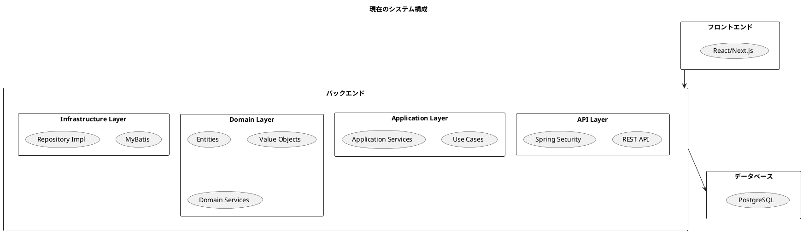
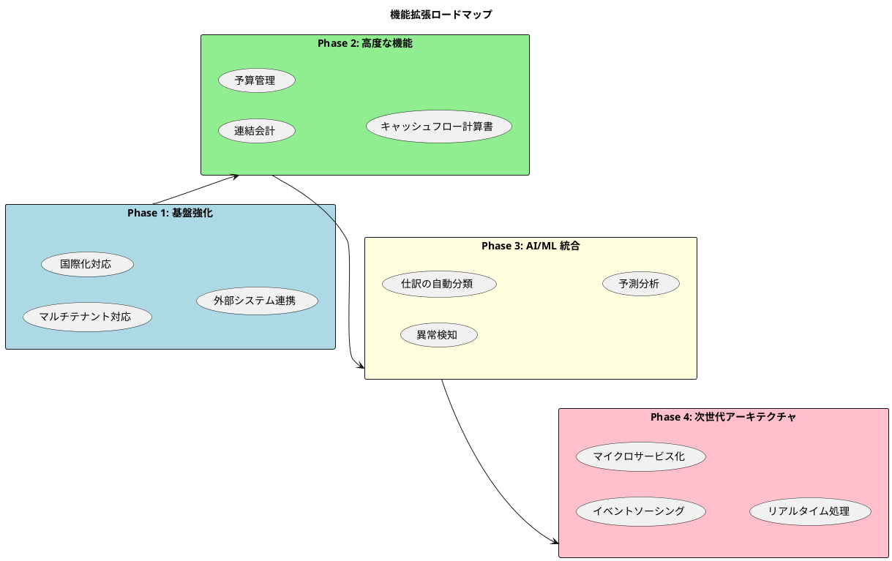
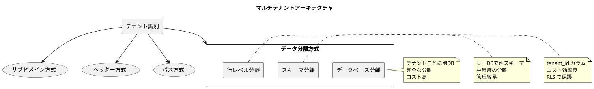
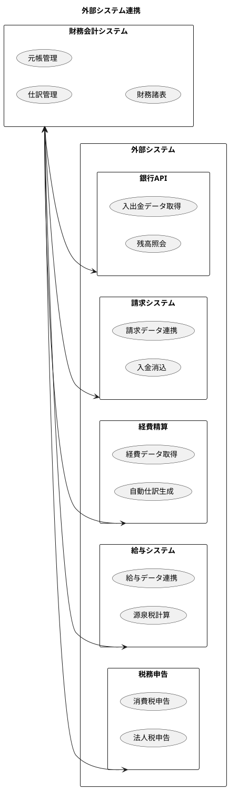
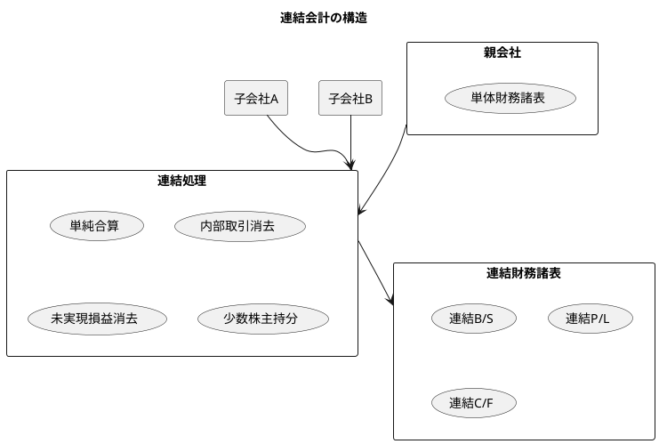
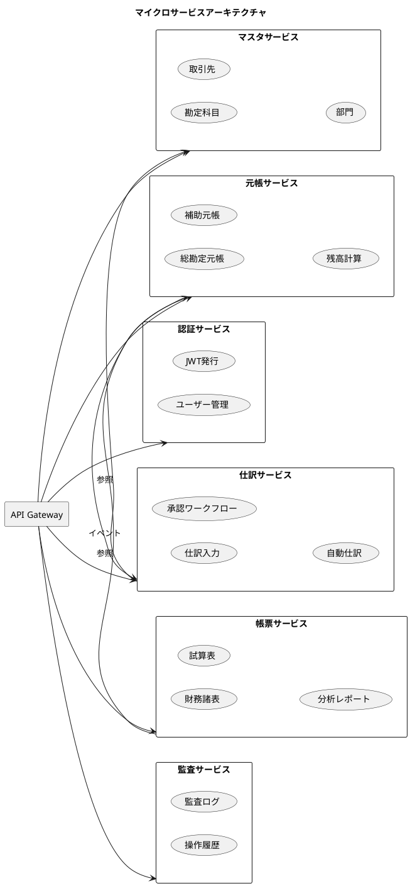
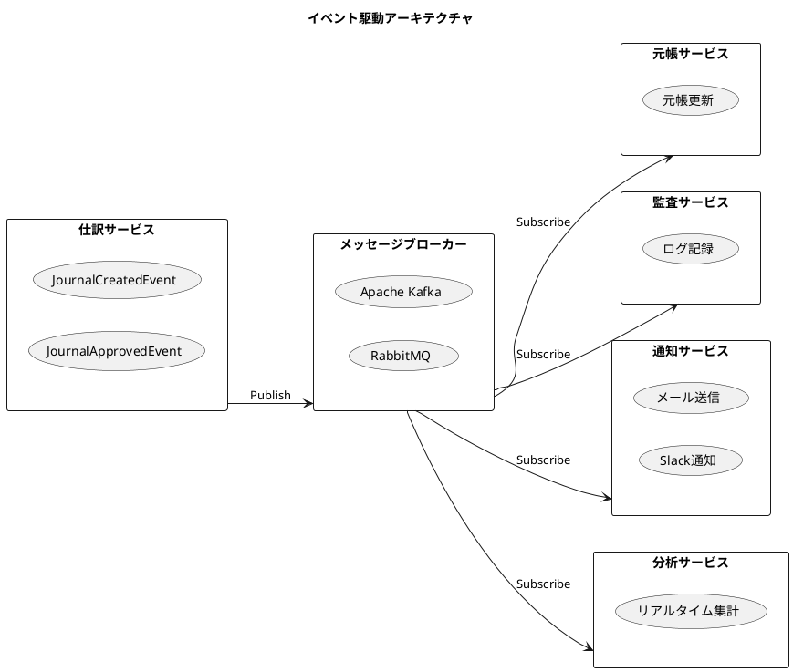
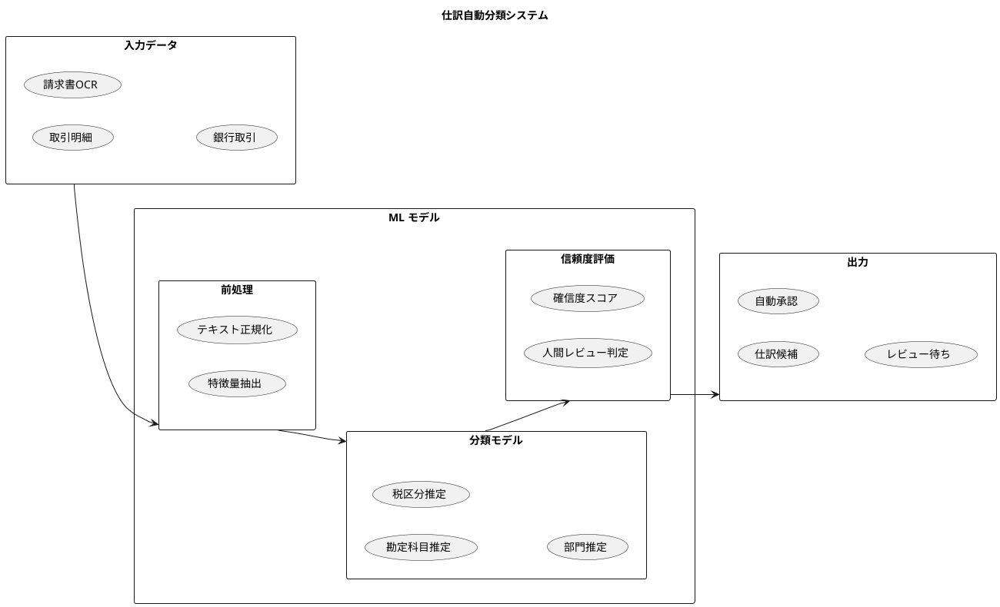
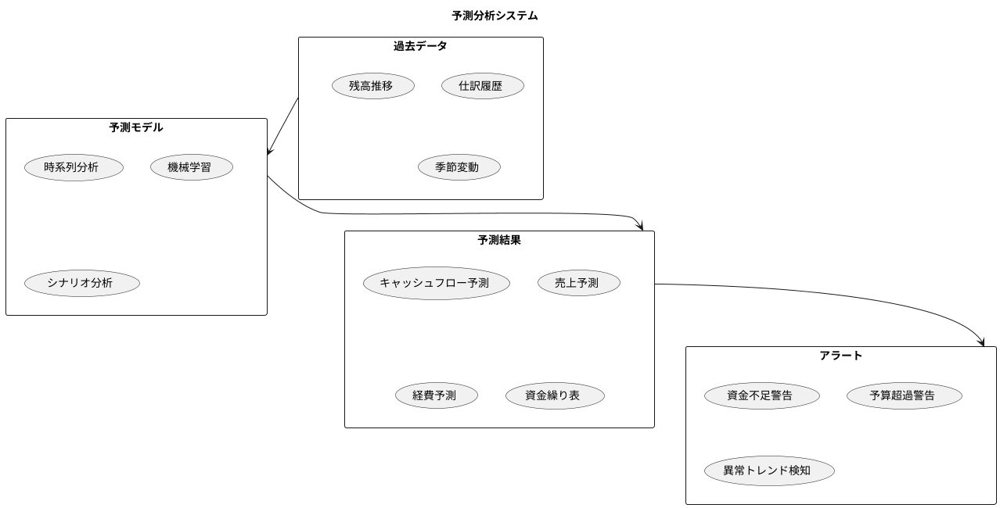
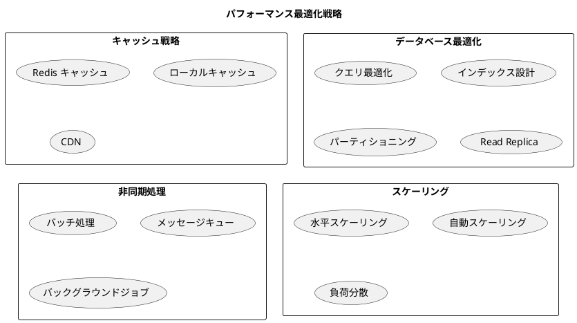

# 第30章: 今後の展望

## 30.1 システムの現状と次のステップ

### 現在のシステム構成

本書を通じて構築した財務会計システムの現状を振り返ります。



### 実装済み機能

| カテゴリ | 機能 | 状態 |
|---------|------|------|
| マスタ管理 | 勘定科目マスタ | 完了 |
| マスタ管理 | 勘定科目構成マスタ | 完了 |
| マスタ管理 | 課税取引マスタ | 完了 |
| 仕訳管理 | 仕訳入力 | 完了 |
| 仕訳管理 | 自動仕訳 | 完了 |
| 仕訳管理 | 承認ワークフロー | 完了 |
| 元帳管理 | 総勘定元帳 | 完了 |
| 元帳管理 | 補助元帳 | 完了 |
| 帳票 | 残高試算表 | 完了 |
| 帳票 | 貸借対照表 | 完了 |
| 帳票 | 損益計算書 | 完了 |
| 分析 | 財務分析 | 完了 |
| セキュリティ | 認証・認可 | 完了 |
| 監査 | 監査ログ | 完了 |

### 次のステップへのロードマップ



---

## 30.2 機能拡張

### マルチテナント対応

複数の企業・組織が同一システムを利用できるマルチテナント機能の実装です。



**行レベル分離の実装例**:

```java
// domain/model/shared/TenantAware.java
public interface TenantAware {
    TenantId getTenantId();
}

// domain/model/account/Account.java
@Value
@With
public class Account implements TenantAware, Versionable {
    TenantId tenantId;  // テナント識別子
    String accountCode;
    String accountName;
    // ... 他のフィールド
}

// infrastructure/persistence/TenantInterceptor.java
@Component
public class TenantInterceptor implements Interceptor {

    @Override
    public Object intercept(Invocation invocation) throws Throwable {
        // 現在のテナントIDをSQLに自動付与
        TenantId currentTenant = TenantContext.getCurrentTenant();
        // ...
        return invocation.proceed();
    }
}
```

### 国際化（i18n）対応

複数言語・複数通貨への対応です。

```java
// domain/type/Money.java
@Value
public class Money {
    BigDecimal amount;
    Currency currency;

    public Money add(Money other) {
        if (!this.currency.equals(other.currency)) {
            throw new CurrencyMismatchException(this.currency, other.currency);
        }
        return new Money(this.amount.add(other.amount), this.currency);
    }

    public Money convertTo(Currency targetCurrency, ExchangeRate rate) {
        BigDecimal converted = this.amount.multiply(rate.getRate());
        return new Money(converted, targetCurrency);
    }
}

// domain/service/ExchangeRateService.java
public interface ExchangeRateService {
    ExchangeRate getRate(Currency from, Currency to, LocalDate date);
    Money convert(Money money, Currency targetCurrency, LocalDate date);
}
```

### 外部システム連携



**銀行 API 連携の実装例**:

```java
// application/port/out/BankingApiPort.java
public interface BankingApiPort {
    List<BankTransaction> fetchTransactions(BankAccount account,
                                            LocalDate from, LocalDate to);
    Balance getBalance(BankAccount account);
}

// application/service/BankReconciliationService.java
@Service
@RequiredArgsConstructor
public class BankReconciliationService {

    private final BankingApiPort bankingApi;
    private final JournalEntryRepository journalRepository;
    private final AccountRepository accountRepository;

    /**
     * 銀行取引データから仕訳を自動生成
     */
    public List<JournalEntry> reconcile(BankAccount bankAccount,
                                        LocalDate from, LocalDate to) {
        // 銀行取引を取得
        List<BankTransaction> transactions =
            bankingApi.fetchTransactions(bankAccount, from, to);

        // 仕訳に変換
        return transactions.stream()
            .filter(this::isNotAlreadyRecorded)
            .map(this::toJournalEntry)
            .collect(Collectors.toList());
    }

    private JournalEntry toJournalEntry(BankTransaction transaction) {
        // 取引種別に応じた仕訳テンプレートを適用
        return switch (transaction.getType()) {
            case DEPOSIT -> createDepositJournal(transaction);
            case WITHDRAWAL -> createWithdrawalJournal(transaction);
            case TRANSFER -> createTransferJournal(transaction);
            default -> throw new UnsupportedTransactionTypeException(transaction.getType());
        };
    }
}
```

### 連結会計

グループ企業の財務諸表を統合する連結会計機能です。



```java
// domain/model/consolidation/ConsolidationGroup.java
@Value
public class ConsolidationGroup {
    CompanyId parentCompanyId;
    List<Subsidiary> subsidiaries;
    FiscalYear fiscalYear;

    public ConsolidatedFinancialStatements consolidate() {
        // 1. 単純合算
        FinancialStatements combined = combineStatements();

        // 2. 内部取引消去
        combined = eliminateIntercompanyTransactions(combined);

        // 3. 未実現損益消去
        combined = eliminateUnrealizedProfits(combined);

        // 4. 少数株主持分の計算
        MinorityInterest minority = calculateMinorityInterest();

        return new ConsolidatedFinancialStatements(combined, minority);
    }
}
```

### キャッシュフロー計算書

```java
// domain/model/statement/CashFlowStatement.java
@Value
@Builder
public class CashFlowStatement {
    FiscalPeriod period;
    CashFlowSection operatingActivities;   // 営業活動
    CashFlowSection investingActivities;   // 投資活動
    CashFlowSection financingActivities;   // 財務活動
    Money beginningCash;
    Money endingCash;

    public Money getNetCashFlow() {
        return operatingActivities.getNetCashFlow()
            .add(investingActivities.getNetCashFlow())
            .add(financingActivities.getNetCashFlow());
    }

    /**
     * 間接法によるキャッシュフロー計算
     */
    public static CashFlowStatement calculateIndirectMethod(
            IncomeStatement incomeStatement,
            BalanceSheet beginningBS,
            BalanceSheet endingBS) {

        // 営業活動によるキャッシュフロー
        CashFlowSection operating = CashFlowSection.builder()
            .addItem("税引前当期純利益", incomeStatement.getNetIncomeBeforeTax())
            .addItem("減価償却費", calculateDepreciation(beginningBS, endingBS))
            .addItem("売上債権の増減", calculateReceivablesChange(beginningBS, endingBS))
            .addItem("棚卸資産の増減", calculateInventoryChange(beginningBS, endingBS))
            .addItem("仕入債務の増減", calculatePayablesChange(beginningBS, endingBS))
            .build();

        // ...

        return CashFlowStatement.builder()
            .operatingActivities(operating)
            // ...
            .build();
    }
}
```

---

## 30.3 アーキテクチャの進化

### マイクロサービス化

モノリシックアーキテクチャからマイクロサービスへの段階的な移行です。



### イベント駆動アーキテクチャ



**イベント発行の実装**:

```java
// domain/event/JournalApprovedEvent.java
@Value
public class JournalApprovedEvent implements DomainEvent {
    String journalNo;
    String approvedBy;
    LocalDateTime approvedAt;
    List<JournalDetailSnapshot> details;

    @Override
    public String getEventType() {
        return "journal.approved";
    }
}

// infrastructure/messaging/KafkaEventPublisher.java
@Component
@RequiredArgsConstructor
public class KafkaEventPublisher implements DomainEventPublisher {

    private final KafkaTemplate<String, DomainEvent> kafkaTemplate;

    @Override
    public void publish(DomainEvent event) {
        kafkaTemplate.send(
            event.getEventType(),
            event.getAggregateId(),
            event
        );
    }
}
```

### GraphQL API

REST API に加えて、柔軟なクエリを可能にする GraphQL API の導入です。

```graphql
# schema.graphql
type Query {
  # 勘定科目
  account(code: String!): Account
  accounts(filter: AccountFilter): [Account!]!

  # 仕訳
  journal(journalNo: String!): JournalEntry
  journals(filter: JournalFilter!, pagination: Pagination): JournalConnection!

  # 財務諸表
  balanceSheet(fiscalYear: Int!, month: Int): BalanceSheet
  incomeStatement(fiscalYear: Int!, fromMonth: Int, toMonth: Int): IncomeStatement

  # 財務分析
  financialAnalysis(fiscalYear: Int!): FinancialAnalysis
}

type Mutation {
  # 仕訳操作
  createJournal(input: CreateJournalInput!): JournalEntry!
  approveJournal(journalNo: String!): JournalEntry!
  cancelJournal(journalNo: String!, reason: String!): JournalEntry!
}

type Subscription {
  # リアルタイム更新
  journalCreated: JournalEntry!
  journalApproved: JournalEntry!
  balanceUpdated(accountCode: String!): Balance!
}

type JournalEntry {
  journalNo: String!
  journalDate: Date!
  description: String
  approvalStatus: ApprovalStatus!
  details: [JournalDetail!]!
  totalDebit: Money!
  totalCredit: Money!
  createdAt: DateTime!
  createdBy: User!
}

type BalanceSheet {
  fiscalYear: Int!
  asOfDate: Date!
  assets: AssetSection!
  liabilities: LiabilitySection!
  equity: EquitySection!
  totalAssets: Money!
  totalLiabilitiesAndEquity: Money!
}
```

---

## 30.4 AI/ML 統合

### 仕訳の自動分類

機械学習を活用した仕訳の自動分類機能です。



**実装例**:

```java
// application/service/JournalClassificationService.java
@Service
@RequiredArgsConstructor
public class JournalClassificationService {

    private final MLModelClient mlModelClient;
    private final AccountRepository accountRepository;
    private final double CONFIDENCE_THRESHOLD = 0.85;

    /**
     * 取引データから仕訳を自動分類
     */
    public ClassificationResult classify(TransactionData transaction) {
        // 特徴量抽出
        Map<String, Object> features = extractFeatures(transaction);

        // ML モデルで予測
        PredictionResponse prediction = mlModelClient.predict(features);

        // 結果を構築
        ClassificationResult result = ClassificationResult.builder()
            .predictedAccountCode(prediction.getAccountCode())
            .predictedTaxCode(prediction.getTaxCode())
            .confidence(prediction.getConfidence())
            .requiresReview(prediction.getConfidence() < CONFIDENCE_THRESHOLD)
            .build();

        // 高信頼度の場合は仕訳候補を生成
        if (!result.isRequiresReview()) {
            JournalEntry suggested = createSuggestedJournal(transaction, prediction);
            result = result.withSuggestedJournal(suggested);
        }

        return result;
    }

    private Map<String, Object> extractFeatures(TransactionData transaction) {
        return Map.of(
            "description", normalizeText(transaction.getDescription()),
            "amount", transaction.getAmount().doubleValue(),
            "counterparty", transaction.getCounterparty(),
            "transactionType", transaction.getType().name(),
            "dayOfWeek", transaction.getDate().getDayOfWeek().getValue(),
            "month", transaction.getDate().getMonthValue()
        );
    }
}

// infrastructure/ml/MLModelClient.java
@Component
@RequiredArgsConstructor
public class MLModelClient {

    private final RestTemplate restTemplate;

    @Value("${ml.model.endpoint}")
    private String modelEndpoint;

    public PredictionResponse predict(Map<String, Object> features) {
        HttpEntity<Map<String, Object>> request = new HttpEntity<>(features);
        return restTemplate.postForObject(
            modelEndpoint + "/predict",
            request,
            PredictionResponse.class
        );
    }
}
```

### 異常検知

不正な仕訳や異常なパターンを検出する機能です。

```java
// domain/service/AnomalyDetectionService.java
@Service
@RequiredArgsConstructor
public class AnomalyDetectionService {

    private final MLModelClient mlModelClient;
    private final JournalEntryRepository journalRepository;

    /**
     * 仕訳の異常スコアを計算
     */
    public AnomalyResult detectAnomaly(JournalEntry journal) {
        // 過去の類似仕訳を取得
        List<JournalEntry> historicalData = journalRepository
            .findByAccountCode(journal.getPrimaryAccountCode())
            .stream()
            .filter(j -> j.getJournalDate().isAfter(
                LocalDate.now().minusYears(1)))
            .collect(Collectors.toList());

        // 統計的異常検知
        StatisticalAnalysis stats = analyzeHistoricalData(historicalData);

        double anomalyScore = calculateAnomalyScore(journal, stats);

        return AnomalyResult.builder()
            .journalNo(journal.getJournalNo())
            .anomalyScore(anomalyScore)
            .isAnomaly(anomalyScore > 0.9)
            .reasons(identifyAnomalyReasons(journal, stats))
            .build();
    }

    private List<String> identifyAnomalyReasons(JournalEntry journal,
                                                 StatisticalAnalysis stats) {
        List<String> reasons = new ArrayList<>();

        // 金額の異常
        if (journal.getTotalDebit().compareTo(stats.getUpperBound()) > 0) {
            reasons.add("金額が通常の範囲を超えています（上限: " +
                stats.getUpperBound() + "）");
        }

        // 時間帯の異常
        if (isUnusualTime(journal.getCreatedAt())) {
            reasons.add("通常と異なる時間帯での入力です");
        }

        // 頻度の異常
        if (isUnusualFrequency(journal)) {
            reasons.add("同一科目への入力頻度が異常です");
        }

        return reasons;
    }
}
```

### 予測分析

将来のキャッシュフローや売上を予測する機能です。



```java
// application/service/ForecastingService.java
@Service
@RequiredArgsConstructor
public class ForecastingService {

    private final TimeSeriesModelClient timeSeriesClient;
    private final DailyBalanceRepository balanceRepository;

    /**
     * キャッシュフロー予測
     */
    public CashFlowForecast forecastCashFlow(
            String accountCode,
            int forecastDays) {

        // 過去データ取得
        List<DailyBalance> historicalData = balanceRepository
            .findByAccountCode(accountCode)
            .stream()
            .filter(b -> b.getDate().isAfter(LocalDate.now().minusYears(2)))
            .sorted(Comparator.comparing(DailyBalance::getDate))
            .collect(Collectors.toList());

        // 時系列データに変換
        TimeSeriesData timeSeries = toTimeSeries(historicalData);

        // 予測実行
        ForecastResponse forecast = timeSeriesClient.forecast(
            timeSeries,
            forecastDays
        );

        return CashFlowForecast.builder()
            .accountCode(accountCode)
            .forecastPeriod(LocalDate.now(), LocalDate.now().plusDays(forecastDays))
            .predictions(forecast.getPredictions())
            .confidenceIntervals(forecast.getConfidenceIntervals())
            .trend(forecast.getTrend())
            .seasonality(forecast.getSeasonality())
            .build();
    }

    /**
     * 資金不足アラートの生成
     */
    public List<FundingAlert> generateFundingAlerts(
            CashFlowForecast forecast,
            Money minimumBalance) {

        return forecast.getPredictions().stream()
            .filter(p -> p.getPredictedBalance().compareTo(minimumBalance) < 0)
            .map(p -> FundingAlert.builder()
                .alertDate(p.getDate())
                .predictedBalance(p.getPredictedBalance())
                .shortfall(minimumBalance.subtract(p.getPredictedBalance()))
                .confidence(p.getConfidence())
                .build())
            .collect(Collectors.toList());
    }
}
```

### 自然言語による仕訳入力

自然言語で仕訳を入力できる機能です。

```java
// application/service/NaturalLanguageJournalService.java
@Service
@RequiredArgsConstructor
public class NaturalLanguageJournalService {

    private final LLMClient llmClient;
    private final AccountRepository accountRepository;
    private final JournalEntryService journalService;

    /**
     * 自然言語から仕訳を生成
     */
    public JournalParseResult parseNaturalLanguage(String input) {
        // LLM にプロンプトを送信
        String prompt = buildPrompt(input);
        LLMResponse response = llmClient.complete(prompt);

        // レスポンスをパース
        JournalCandidate candidate = parseResponse(response);

        // 勘定科目の検証
        validateAccountCodes(candidate);

        return JournalParseResult.builder()
            .originalInput(input)
            .parsedJournal(candidate.toJournalEntry())
            .confidence(response.getConfidence())
            .suggestions(generateSuggestions(candidate))
            .build();
    }

    private String buildPrompt(String input) {
        List<Account> accounts = accountRepository.findAll();
        String accountList = accounts.stream()
            .map(a -> a.getAccountCode() + ": " + a.getAccountName())
            .collect(Collectors.joining("\n"));

        return """
            以下の自然言語の取引記述から仕訳を生成してください。

            利用可能な勘定科目:
            %s

            取引記述:
            %s

            JSON形式で以下を出力してください:
            {
              "date": "YYYY-MM-DD",
              "description": "摘要",
              "entries": [
                {"accountCode": "コード", "debit": 金額, "credit": 0},
                {"accountCode": "コード", "debit": 0, "credit": 金額}
              ]
            }
            """.formatted(accountList, input);
    }
}
```

**使用例**:

```
入力: "12月15日に株式会社ABCから売掛金100万円を普通預金に入金"

出力:
{
  "date": "2025-12-15",
  "description": "株式会社ABC 売掛金回収",
  "entries": [
    {"accountCode": "1111", "debit": 1000000, "credit": 0},   // 普通預金
    {"accountCode": "1310", "debit": 0, "credit": 1000000}    // 売掛金
  ]
}
```

---

## 30.5 技術的な改善

### パフォーマンス最適化



### セキュリティ強化

```java
// infrastructure/security/SecurityEnhancements.java

// 1. レート制限
@Component
public class RateLimitFilter extends OncePerRequestFilter {
    private final RateLimiter rateLimiter;

    @Override
    protected void doFilterInternal(HttpServletRequest request,
                                    HttpServletResponse response,
                                    FilterChain filterChain) {
        String clientId = extractClientId(request);

        if (!rateLimiter.tryAcquire(clientId)) {
            response.setStatus(HttpStatus.TOO_MANY_REQUESTS.value());
            return;
        }

        filterChain.doFilter(request, response);
    }
}

// 2. 機密データの暗号化
@Component
public class FieldEncryptor {
    private final AeadCipher cipher;

    public String encrypt(String plainText) {
        return cipher.encrypt(plainText.getBytes(StandardCharsets.UTF_8));
    }

    public String decrypt(String cipherText) {
        return new String(cipher.decrypt(cipherText), StandardCharsets.UTF_8);
    }
}

// 3. セキュリティ監査ログ
@Aspect
@Component
public class SecurityAuditAspect {

    @Around("@annotation(securityAudit)")
    public Object auditSecurityOperation(ProceedingJoinPoint joinPoint,
                                          SecurityAudit securityAudit) {
        String operation = securityAudit.operation();
        String user = SecurityContextHolder.getContext()
            .getAuthentication().getName();

        try {
            Object result = joinPoint.proceed();
            logSecurityEvent(operation, user, "SUCCESS", null);
            return result;
        } catch (Exception e) {
            logSecurityEvent(operation, user, "FAILURE", e.getMessage());
            throw e;
        }
    }
}
```

---

## 30.6 まとめ

本章では、財務会計システムの今後の展望について解説しました。

### 機能拡張のロードマップ

| Phase | 内容 | 優先度 |
|-------|------|--------|
| Phase 1 | マルチテナント、国際化、外部連携 | 高 |
| Phase 2 | 連結会計、予算管理、CF計算書 | 中 |
| Phase 3 | AI/ML 統合（自動分類、異常検知） | 中 |
| Phase 4 | イベントソーシング、マイクロサービス | 低 |

### アーキテクチャ進化の方向性

1. **マイクロサービス化**: 機能ごとの独立したサービスへの分割
2. **イベント駆動**: 疎結合でスケーラブルなアーキテクチャ
3. **GraphQL**: 柔軟なクエリとリアルタイム更新
4. **クラウドネイティブ**: Kubernetes、サーバーレス

### AI/ML 統合の可能性

1. **仕訳自動分類**: 取引データから勘定科目を推定
2. **異常検知**: 不正や誤りの早期発見
3. **予測分析**: キャッシュフロー、売上予測
4. **自然言語入力**: 日本語での直感的な仕訳入力

### 本書を通じて学んだこと

本書を通じて、以下のことを学びました：

1. **TDD によるシステム開発**: テストファーストで品質を担保
2. **ドメイン駆動設計**: ビジネスロジックを中心としたモデリング
3. **ヘキサゴナルアーキテクチャ**: 依存性を適切に管理
4. **段階的な進化**: 小さく始めて継続的に改善
5. **XP の価値観**: シンプルさ、フィードバック、勇気

財務会計システムは、ビジネスの根幹を支える重要なシステムです。本書で学んだ原則とパターンを活用し、信頼性が高く、変化に強いシステムを構築してください。

次章では、より高度なトピックとしてイベントソーシングについて解説します。
