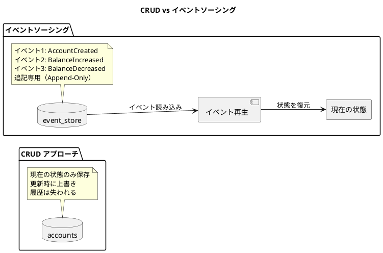
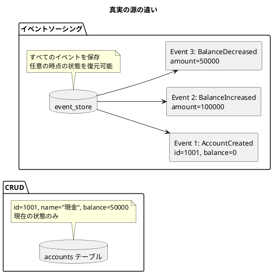
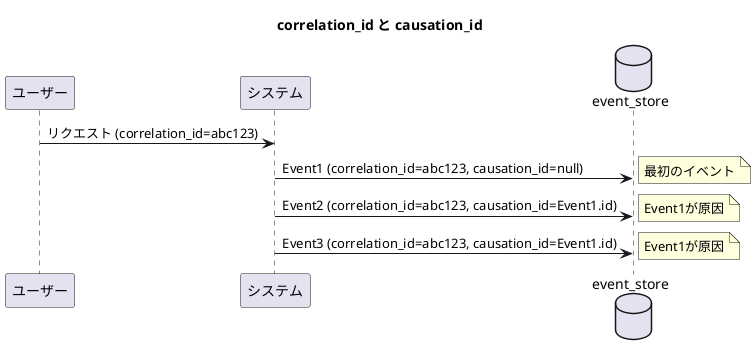
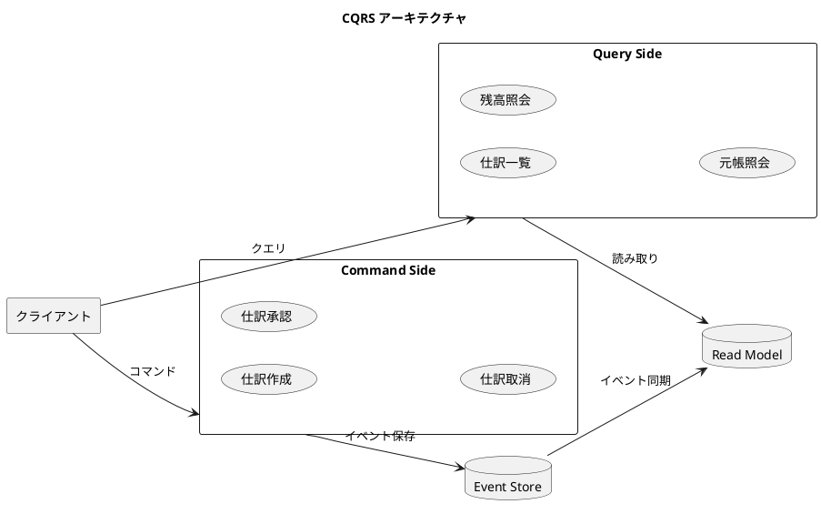
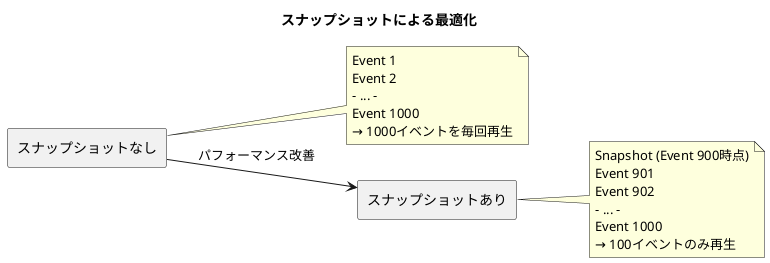

# 第31章: イベントソーシング

## 31.1 イベントソーシングの基礎

### イベントソーシングとは

イベントソーシングは、アプリケーションの状態をイベントの連続として記録する設計パターンです。従来の CRUD アプローチでは「現在の状態」のみを保存しますが、イベントソーシングでは「状態に至った経緯（イベント）」を保存します。



### イベントソーシングの3つの原則

**1. イベントが真実の源（Source of Truth）**

従来の CRUD では「現在の状態」がデータベースに保存されますが、イベントソーシングでは「過去に発生したイベント」が真実の源となります。



**2. Append-Only（追記専用）**

イベントは一度記録されたら変更・削除されません。新しいイベントを追加することで状態を変更します。

```java
// ❌ 悪い例: 既存レコードを更新
UPDATE accounts SET balance = 50000 WHERE id = 1001;

// ✅ 良い例: イベントを追加
INSERT INTO event_store (
    aggregate_id, event_type, event_data
) VALUES (
    '1001',
    'BalanceDecreased',
    '{"amount": 50000, "reason": "支払い"}'
);
```

**3. イベント再生（Event Replay）**

保存されたイベントを順番に再生することで、任意の時点の状態を復元できます。

```java
public class AccountAggregate {
    private String id;
    private String name;
    private BigDecimal balance = BigDecimal.ZERO;
    private List<DomainEvent> uncommittedEvents = new ArrayList<>();

    // イベント再生
    public static AccountAggregate replay(List<DomainEvent> events) {
        AccountAggregate account = new AccountAggregate();
        for (DomainEvent event : events) {
            account.apply(event);
        }
        return account;
    }

    // イベント適用
    private void apply(DomainEvent event) {
        if (event instanceof AccountCreatedEvent e) {
            this.id = e.getAccountId();
            this.name = e.getName();
            this.balance = e.getInitialBalance();
        } else if (event instanceof BalanceIncreasedEvent e) {
            this.balance = this.balance.add(e.getAmount());
        } else if (event instanceof BalanceDecreasedEvent e) {
            this.balance = this.balance.subtract(e.getAmount());
        }
    }
}
```

### CRUD との違い

| 観点 | CRUD アプローチ | イベントソーシング |
|------|----------------|-------------------|
| **保存対象** | 現在の状態 | 変更イベントの履歴 |
| **データベース操作** | UPDATE/DELETE で上書き | INSERT のみ（Append-Only） |
| **履歴の扱い** | 別テーブルで管理（監査ログ） | イベントストア自体が履歴 |
| **状態の復元** | データベースから直接読み取り | イベント再生で復元 |
| **時間軸** | 現在の状態のみ | 任意の時点の状態を復元可能 |
| **変更の理由** | 記録されない（または別テーブル） | イベントに含まれる |
| **整合性** | トランザクションで保証 | イベントの順序で保証 |
| **複雑さ** | シンプル | 高い（イベント設計、再生ロジック） |

### イベントソーシングの利点

**1. 完全な監査証跡**

すべての変更がイベントとして記録されるため、完全な監査証跡が自動的に得られます。財務会計システムでは法的要件を満たすために不可欠です。

```java
// イベントストアから特定期間のすべての操作を取得
List<DomainEvent> auditTrail = eventStore.getEvents(
    "journal-1001",
    LocalDateTime.of(2024, 1, 1, 0, 0),
    LocalDateTime.of(2024, 12, 31, 23, 59)
);

// 誰が、いつ、何をしたかが完全に記録されている
auditTrail.forEach(event -> {
    System.out.printf("%s: %s by %s%n",
        event.getTimestamp(),
        event.getEventType(),
        event.getUserId()
    );
});
```

**2. タイムトラベル（時間軸の復元）**

任意の時点の状態を復元できるため、「2024年1月1日時点の残高」などを正確に再現できます。

```java
// 2024年1月1日時点の残高を復元
LocalDateTime pointInTime = LocalDateTime.of(2024, 1, 1, 0, 0);
List<DomainEvent> eventsUntil = eventStore.getEventsUntil("account-1001", pointInTime);
AccountAggregate accountAtPast = AccountAggregate.replay(eventsUntil);

System.out.println("2024/01/01時点の残高: " + accountAtPast.getBalance());
```

**3. デバッグとトラブルシューティング**

バグや不正な操作が発生した場合、イベントを再生することで問題の原因を特定できます。

**4. 柔軟なビジネスロジック**

新しいビジネス要件が発生した場合、過去のイベントを再生して新しいモデルを構築できます。

### イベントソーシングの課題

| 課題 | 説明 | 解決策 |
|------|------|--------|
| 複雑性の増加 | CRUD より実装が複雑 | 段階的な導入、チーム教育 |
| 学習曲線 | チーム全体が理解必要 | ドキュメント、ペアプログラミング |
| パフォーマンス | 大量イベントの再生が遅い | スナップショット（7.5節） |
| イベント定義変更 | 過去との互換性維持が必要 | イベントバージョニング |
| 削除の扱い | GDPR 対応が難しい | 暗号化キー削除、論理削除 |

### 適用ケース

**適している場合**:
- ✅ 監査証跡が重要（財務会計、医療、金融）
- ✅ 履歴の分析が必要（行動分析、レポート）
- ✅ ドメインが複雑（DDD と組み合わせ）
- ✅ イベント駆動アーキテクチャを採用

**適していない場合**:
- ❌ シンプルな CRUD で十分
- ❌ チームの経験が不足
- ❌ パフォーマンスが最優先
- ❌ イベント再生の必要性が低い

---

## 31.2 イベントストアの設計

### イベントストアの要件

イベントストアは、イベントソーシングの中核となるデータベーステーブルです。以下の要件を満たす必要があります：

1. **Append-Only（追記専用）**: 一度保存されたイベントは変更・削除されない
2. **順序保証**: イベントの発生順序が正確に記録される
3. **高速な読み取り**: 特定の Aggregate のイベントを高速に取得できる
4. **トランザクション保証**: 複数のイベントをアトミックに保存できる
5. **スケーラビリティ**: 大量のイベントを効率的に保存・検索できる

### テーブル設計（PostgreSQL）

```sql
-- イベントストアテーブル
CREATE TABLE IF NOT EXISTS event_store (
    -- 主キー（シーケンス番号）
    event_id BIGSERIAL PRIMARY KEY,

    -- Aggregate 識別子
    aggregate_id VARCHAR(100) NOT NULL,
    aggregate_type VARCHAR(50) NOT NULL,

    -- イベントメタデータ
    event_type VARCHAR(100) NOT NULL,
    event_version INTEGER NOT NULL DEFAULT 1,

    -- イベントデータ（JSONB形式）
    event_data JSONB NOT NULL,

    -- メタデータ
    occurred_at TIMESTAMP NOT NULL DEFAULT CURRENT_TIMESTAMP,
    user_id VARCHAR(100),
    correlation_id VARCHAR(100),
    causation_id VARCHAR(100),

    -- 楽観的ロック（同時実行制御）
    sequence_number INTEGER NOT NULL,

    -- 一意性制約（同一 Aggregate の sequence_number は一意）
    CONSTRAINT uk_aggregate_sequence
        UNIQUE (aggregate_id, sequence_number)
);

-- インデックス設計
CREATE INDEX idx_event_store_aggregate_id
    ON event_store(aggregate_id, sequence_number);

CREATE INDEX idx_event_store_event_type
    ON event_store(event_type);

CREATE INDEX idx_event_store_occurred_at
    ON event_store(occurred_at);

CREATE INDEX idx_event_store_correlation_id
    ON event_store(correlation_id);

-- JSONB用のGINインデックス
CREATE INDEX idx_event_store_event_data
    ON event_store USING GIN (event_data);
```

### スキーマの詳細説明

| カラム | 説明 |
|--------|------|
| `event_id` | グローバルな順序を保証するシーケンス番号 |
| `aggregate_id` | Aggregate のユニーク識別子（例: "journal-1001"） |
| `aggregate_type` | Aggregate の型（例: "JournalEntry"） |
| `event_type` | イベントの型（例: "JournalCreatedEvent"） |
| `event_version` | イベント定義のバージョン（スキーマ進化に対応） |
| `event_data` | イベントのペイロード（JSONB形式） |
| `occurred_at` | イベントが発生した日時 |
| `user_id` | イベントを発生させたユーザー ID |
| `correlation_id` | 関連する一連のイベントをグループ化 |
| `causation_id` | 因果関係のあるイベント ID |
| `sequence_number` | Aggregate 内でのイベントの順序番号 |

### correlation_id と causation_id



### イベントのバージョニング

イベント定義は時間とともに変化します。互換性を保つために `event_version` フィールドを使用します。

```java
// Version 1
public record JournalCreatedEventV1(
    String journalId,
    LocalDate entryDate,
    String description,
    List<LineItem> lineItems
) implements DomainEvent {
    @Override
    public int getEventVersion() {
        return 1;
    }
}

// Version 2（新フィールド追加）
public record JournalCreatedEventV2(
    String journalId,
    LocalDate entryDate,
    String description,
    List<LineItem> lineItems,
    String fiscalYear  // 新フィールド
) implements DomainEvent {
    @Override
    public int getEventVersion() {
        return 2;
    }

    // V1からV2へのマイグレーション
    public static JournalCreatedEventV2 fromV1(JournalCreatedEventV1 v1) {
        return new JournalCreatedEventV2(
            v1.journalId(),
            v1.entryDate(),
            v1.description(),
            v1.lineItems(),
            deriveFiscalYear(v1.entryDate())  // 日付から推定
        );
    }
}
```

---

## 31.3 仕訳のイベントソーシング実装

### ドメインイベントの定義

```java
// domain/event/DomainEvent.java
package com.example.accounting.domain.event;

import java.time.LocalDateTime;

public interface DomainEvent {
    String getAggregateId();
    String getEventType();
    int getEventVersion();
    LocalDateTime getOccurredAt();
    String getUserId();
}
```

**仕訳作成イベント**:

```java
// domain/event/JournalEntryCreatedEvent.java
package com.example.accounting.domain.event;

import lombok.Builder;
import lombok.Value;
import java.math.BigDecimal;
import java.time.LocalDate;
import java.time.LocalDateTime;
import java.util.List;

@Value
@Builder
public class JournalEntryCreatedEvent implements DomainEvent {
    String journalEntryId;
    LocalDate entryDate;
    String description;
    List<LineItem> lineItems;
    String userId;
    LocalDateTime occurredAt;

    @Override
    public String getAggregateId() {
        return journalEntryId;
    }

    @Override
    public String getEventType() {
        return "JournalEntryCreatedEvent";
    }

    @Override
    public int getEventVersion() {
        return 1;
    }

    @Value
    @Builder
    public static class LineItem {
        String accountCode;
        DebitCredit debitCredit;
        BigDecimal amount;
    }

    public enum DebitCredit {
        DEBIT, CREDIT
    }
}
```

**仕訳承認イベント**:

```java
// domain/event/JournalEntryApprovedEvent.java
@Value
@Builder
public class JournalEntryApprovedEvent implements DomainEvent {
    String journalEntryId;
    String approvedBy;
    String approvalComment;
    LocalDateTime occurredAt;
    String userId;

    @Override
    public String getAggregateId() {
        return journalEntryId;
    }

    @Override
    public String getEventType() {
        return "JournalEntryApprovedEvent";
    }

    @Override
    public int getEventVersion() {
        return 1;
    }
}
```

**仕訳取消イベント**:

```java
// domain/event/JournalEntryCancelledEvent.java
@Value
@Builder
public class JournalEntryCancelledEvent implements DomainEvent {
    String journalEntryId;
    String reason;
    LocalDateTime occurredAt;
    String userId;

    @Override
    public String getAggregateId() {
        return journalEntryId;
    }

    @Override
    public String getEventType() {
        return "JournalEntryCancelledEvent";
    }

    @Override
    public int getEventVersion() {
        return 1;
    }
}
```

### Aggregate パターンの実装

```java
// domain/aggregate/JournalEntryAggregate.java
package com.example.accounting.domain.aggregate;

import com.example.accounting.domain.event.*;
import lombok.Getter;
import java.math.BigDecimal;
import java.time.LocalDate;
import java.time.LocalDateTime;
import java.util.ArrayList;
import java.util.List;

@Getter
public class JournalEntryAggregate {
    private String id;
    private LocalDate entryDate;
    private String description;
    private List<LineItem> lineItems = new ArrayList<>();
    private JournalEntryStatus status = JournalEntryStatus.DRAFT;
    private boolean cancelled = false;

    // 未コミットイベント（まだイベントストアに保存されていない）
    private final List<DomainEvent> uncommittedEvents = new ArrayList<>();

    // バージョン（楽観的ロック用）
    private int version = 0;

    // イベント再生（Event Replay）
    public static JournalEntryAggregate replay(List<DomainEvent> events) {
        JournalEntryAggregate aggregate = new JournalEntryAggregate();
        for (DomainEvent event : events) {
            aggregate.apply(event);
            aggregate.version++;
        }
        return aggregate;
    }

    // コマンド: 仕訳を作成
    public static JournalEntryAggregate create(
            String id,
            LocalDate entryDate,
            String description,
            List<LineItem> lineItems,
            String userId) {

        // ビジネスルール検証: 貸借一致
        validateBalance(lineItems);

        // イベント発行
        JournalEntryCreatedEvent event = JournalEntryCreatedEvent.builder()
                .journalEntryId(id)
                .entryDate(entryDate)
                .description(description)
                .lineItems(toEventLineItems(lineItems))
                .userId(userId)
                .occurredAt(LocalDateTime.now())
                .build();

        JournalEntryAggregate aggregate = new JournalEntryAggregate();
        aggregate.apply(event);
        aggregate.uncommittedEvents.add(event);

        return aggregate;
    }

    // コマンド: 仕訳を承認
    public void approve(String approvedBy, String approvalComment) {
        if (cancelled) {
            throw new IllegalStateException("取消済みの仕訳は承認できません");
        }

        if (status == JournalEntryStatus.APPROVED) {
            throw new IllegalStateException("すでに承認済みです");
        }

        JournalEntryApprovedEvent event = JournalEntryApprovedEvent.builder()
                .journalEntryId(id)
                .approvedBy(approvedBy)
                .approvalComment(approvalComment)
                .occurredAt(LocalDateTime.now())
                .userId(approvedBy)
                .build();

        apply(event);
        uncommittedEvents.add(event);
    }

    // コマンド: 仕訳を取消
    public void cancel(String reason, String userId) {
        if (cancelled) {
            throw new IllegalStateException("すでに取消済みです");
        }

        JournalEntryCancelledEvent event = JournalEntryCancelledEvent.builder()
                .journalEntryId(id)
                .reason(reason)
                .occurredAt(LocalDateTime.now())
                .userId(userId)
                .build();

        apply(event);
        uncommittedEvents.add(event);
    }

    // イベント適用（Apply）
    private void apply(DomainEvent event) {
        if (event instanceof JournalEntryCreatedEvent e) {
            this.id = e.getJournalEntryId();
            this.entryDate = e.getEntryDate();
            this.description = e.getDescription();
            this.lineItems = fromEventLineItems(e.getLineItems());
            this.status = JournalEntryStatus.DRAFT;
        } else if (event instanceof JournalEntryApprovedEvent e) {
            this.status = JournalEntryStatus.APPROVED;
        } else if (event instanceof JournalEntryCancelledEvent e) {
            this.cancelled = true;
        }
    }

    // 未コミットイベントをクリア
    public void markEventsAsCommitted() {
        uncommittedEvents.clear();
    }

    // ビジネスルール: 貸借一致の検証
    private static void validateBalance(List<LineItem> lineItems) {
        if (lineItems == null || lineItems.isEmpty()) {
            throw new IllegalArgumentException("仕訳明細が必要です");
        }

        BigDecimal debitTotal = lineItems.stream()
                .filter(item -> item.getDebitCredit() == DebitCredit.DEBIT)
                .map(LineItem::getAmount)
                .reduce(BigDecimal.ZERO, BigDecimal::add);

        BigDecimal creditTotal = lineItems.stream()
                .filter(item -> item.getDebitCredit() == DebitCredit.CREDIT)
                .map(LineItem::getAmount)
                .reduce(BigDecimal.ZERO, BigDecimal::add);

        if (debitTotal.compareTo(creditTotal) != 0) {
            throw new IllegalArgumentException(
                "借方合計と貸方合計が一致しません: 借方=" + debitTotal +
                ", 貸方=" + creditTotal
            );
        }
    }

    // ドメインモデル
    @Getter
    public static class LineItem {
        private final String accountCode;
        private final DebitCredit debitCredit;
        private final BigDecimal amount;

        public LineItem(String accountCode, DebitCredit debitCredit, BigDecimal amount) {
            this.accountCode = accountCode;
            this.debitCredit = debitCredit;
            this.amount = amount;
        }
    }

    public enum DebitCredit {
        DEBIT, CREDIT
    }

    public enum JournalEntryStatus {
        DRAFT, APPROVED
    }
}
```

### イベントストアリポジトリ

```java
// domain/repository/EventStoreRepository.java
public interface EventStoreRepository {
    // イベントを保存
    void save(String aggregateId, List<DomainEvent> events, int expectedVersion);

    // Aggregate のすべてのイベントを取得
    List<DomainEvent> getEvents(String aggregateId);

    // 特定時点までのイベントを取得
    List<DomainEvent> getEventsUntil(String aggregateId, LocalDateTime pointInTime);

    // Aggregate の現在のバージョンを取得
    int getCurrentVersion(String aggregateId);
}
```

```java
// infrastructure/persistence/EventStoreRepositoryImpl.java
@Repository
@RequiredArgsConstructor
public class EventStoreRepositoryImpl implements EventStoreRepository {
    private final EventStoreMapper eventStoreMapper;
    private final ObjectMapper objectMapper;

    @Override
    @Transactional
    public void save(String aggregateId, List<DomainEvent> events, int expectedVersion) {
        int currentVersion = getCurrentVersion(aggregateId);

        if (currentVersion != expectedVersion) {
            throw new ConcurrentModificationException(
                String.format("Expected version %d but was %d",
                    expectedVersion, currentVersion)
            );
        }

        int sequenceNumber = currentVersion + 1;
        for (DomainEvent event : events) {
            String eventData = toJson(event);

            try {
                eventStoreMapper.insertEvent(
                    aggregateId,
                    "JournalEntry",
                    event.getEventType(),
                    event.getEventVersion(),
                    eventData,
                    event.getOccurredAt(),
                    event.getUserId(),
                    null, // correlation_id
                    null, // causation_id
                    sequenceNumber
                );
                sequenceNumber++;
            } catch (DuplicateKeyException e) {
                throw new ConcurrentModificationException(
                    "Concurrent modification detected for aggregate: " + aggregateId, e
                );
            }
        }
    }

    @Override
    public List<DomainEvent> getEvents(String aggregateId) {
        List<EventStoreEntity> entities =
            eventStoreMapper.selectEventsByAggregateId(aggregateId);
        return entities.stream()
                .map(this::toDomainEvent)
                .toList();
    }

    @Override
    public List<DomainEvent> getEventsUntil(String aggregateId, LocalDateTime pointInTime) {
        List<EventStoreEntity> entities =
            eventStoreMapper.selectEventsByAggregateIdUntil(aggregateId, pointInTime);
        return entities.stream()
                .map(this::toDomainEvent)
                .toList();
    }

    @Override
    public int getCurrentVersion(String aggregateId) {
        Integer maxSequence = eventStoreMapper.selectMaxSequenceNumber(aggregateId);
        return maxSequence != null ? maxSequence : 0;
    }

    private DomainEvent toDomainEvent(EventStoreEntity entity) {
        try {
            return switch (entity.getEventType()) {
                case "JournalEntryCreatedEvent" ->
                    objectMapper.readValue(entity.getEventData(),
                        JournalEntryCreatedEvent.class);
                case "JournalEntryApprovedEvent" ->
                    objectMapper.readValue(entity.getEventData(),
                        JournalEntryApprovedEvent.class);
                case "JournalEntryCancelledEvent" ->
                    objectMapper.readValue(entity.getEventData(),
                        JournalEntryCancelledEvent.class);
                default ->
                    throw new IllegalArgumentException(
                        "Unknown event type: " + entity.getEventType());
            };
        } catch (JsonProcessingException e) {
            throw new RuntimeException("Failed to deserialize event", e);
        }
    }
}
```

---

## 31.4 CQRS パターン

### CQRS とは

CQRS（Command Query Responsibility Segregation）は、データの「書き込み（Command）」と「読み取り（Query）」を分離するアーキテクチャパターンです。イベントソーシングと組み合わせることで、高いスケーラビリティと柔軟性を実現できます。



### Command Side の実装

```java
// application/service/JournalEntryCommandService.java
@Service
@RequiredArgsConstructor
public class JournalEntryCommandService {
    private final EventStoreRepository eventStoreRepository;
    private final ApplicationEventPublisher eventPublisher;

    @Transactional
    public String createJournalEntry(CreateJournalEntryCommand command) {
        String id = UUID.randomUUID().toString();

        JournalEntryAggregate aggregate = JournalEntryAggregate.create(
            id,
            command.getEntryDate(),
            command.getDescription(),
            command.getLineItems(),
            command.getUserId()
        );

        // イベントをイベントストアに保存
        eventStoreRepository.save(
            id,
            aggregate.getUncommittedEvents(),
            0  // 新規作成なので expectedVersion = 0
        );

        // 読み取りモデル更新のためにイベントを発行
        aggregate.getUncommittedEvents().forEach(eventPublisher::publishEvent);
        aggregate.markEventsAsCommitted();

        return id;
    }

    @Transactional
    public void approveJournalEntry(ApproveJournalEntryCommand command) {
        List<DomainEvent> events = eventStoreRepository.getEvents(command.getJournalEntryId());
        if (events.isEmpty()) {
            throw new JournalNotFoundException(command.getJournalEntryId());
        }

        JournalEntryAggregate aggregate = JournalEntryAggregate.replay(events);
        int currentVersion = aggregate.getVersion();

        aggregate.approve(command.getApprovedBy(), command.getComment());

        eventStoreRepository.save(
            command.getJournalEntryId(),
            aggregate.getUncommittedEvents(),
            currentVersion
        );

        aggregate.getUncommittedEvents().forEach(eventPublisher::publishEvent);
        aggregate.markEventsAsCommitted();
    }
}
```

### Query Side（読み取りモデル）の実装

```java
// infrastructure/projection/JournalEntryProjection.java
@Component
@RequiredArgsConstructor
public class JournalEntryProjection {

    private final JournalEntryReadModelRepository readModelRepository;

    @EventListener
    @Transactional
    public void on(JournalEntryCreatedEvent event) {
        JournalEntryReadModel readModel = JournalEntryReadModel.builder()
            .journalEntryId(event.getJournalEntryId())
            .entryDate(event.getEntryDate())
            .description(event.getDescription())
            .status("DRAFT")
            .totalDebit(calculateTotalDebit(event.getLineItems()))
            .totalCredit(calculateTotalCredit(event.getLineItems()))
            .createdAt(event.getOccurredAt())
            .createdBy(event.getUserId())
            .build();

        readModelRepository.save(readModel);
    }

    @EventListener
    @Transactional
    public void on(JournalEntryApprovedEvent event) {
        readModelRepository.updateStatus(
            event.getJournalEntryId(),
            "APPROVED",
            event.getApprovedBy(),
            event.getOccurredAt()
        );
    }

    @EventListener
    @Transactional
    public void on(JournalEntryCancelledEvent event) {
        readModelRepository.updateStatus(
            event.getJournalEntryId(),
            "CANCELLED",
            event.getUserId(),
            event.getOccurredAt()
        );
    }
}
```

### 読み取りモデルのテーブル

```sql
-- 読み取り専用モデル（非正規化）
CREATE TABLE journal_entry_read_model (
    journal_entry_id VARCHAR(100) PRIMARY KEY,
    entry_date DATE NOT NULL,
    description VARCHAR(500),
    status VARCHAR(20) NOT NULL,
    total_debit DECIMAL(15, 2) NOT NULL,
    total_credit DECIMAL(15, 2) NOT NULL,
    created_at TIMESTAMP NOT NULL,
    created_by VARCHAR(100) NOT NULL,
    approved_at TIMESTAMP,
    approved_by VARCHAR(100),
    cancelled_at TIMESTAMP,
    cancelled_by VARCHAR(100)
);

-- 検索用インデックス
CREATE INDEX idx_journal_read_entry_date ON journal_entry_read_model(entry_date);
CREATE INDEX idx_journal_read_status ON journal_entry_read_model(status);
```

### Query Service

```java
// application/service/JournalEntryQueryService.java
@Service
@RequiredArgsConstructor
public class JournalEntryQueryService {
    private final JournalEntryReadModelRepository readModelRepository;

    public JournalEntryReadModel getJournalEntry(String journalEntryId) {
        return readModelRepository.findById(journalEntryId)
            .orElseThrow(() -> new JournalNotFoundException(journalEntryId));
    }

    public List<JournalEntryReadModel> searchJournalEntries(
            LocalDate fromDate,
            LocalDate toDate,
            String status) {
        return readModelRepository.search(fromDate, toDate, status);
    }

    public List<JournalEntryReadModel> getPendingApprovals() {
        return readModelRepository.findByStatus("DRAFT");
    }
}
```

---

## 31.5 スナップショットと最適化

### スナップショットの必要性

イベント数が増加すると、毎回すべてのイベントを再生するのはパフォーマンス上の問題になります。スナップショットを使用することで、この問題を解決できます。



### スナップショットテーブル

```sql
CREATE TABLE aggregate_snapshot (
    aggregate_id VARCHAR(100) PRIMARY KEY,
    aggregate_type VARCHAR(50) NOT NULL,
    snapshot_version INTEGER NOT NULL,
    snapshot_data JSONB NOT NULL,
    created_at TIMESTAMP NOT NULL DEFAULT CURRENT_TIMESTAMP
);
```

### スナップショットの実装

```java
// domain/repository/SnapshotRepository.java
public interface SnapshotRepository {
    Optional<AggregateSnapshot> getSnapshot(String aggregateId);
    void saveSnapshot(String aggregateId, int version, Object aggregateState);
}

// infrastructure/persistence/SnapshotRepositoryImpl.java
@Repository
@RequiredArgsConstructor
public class SnapshotRepositoryImpl implements SnapshotRepository {
    private final SnapshotMapper snapshotMapper;
    private final ObjectMapper objectMapper;

    private static final int SNAPSHOT_THRESHOLD = 100;

    @Override
    public Optional<AggregateSnapshot> getSnapshot(String aggregateId) {
        SnapshotEntity entity = snapshotMapper.selectByAggregateId(aggregateId);
        if (entity == null) {
            return Optional.empty();
        }
        return Optional.of(new AggregateSnapshot(
            entity.getAggregateId(),
            entity.getSnapshotVersion(),
            entity.getSnapshotData()
        ));
    }

    @Override
    public void saveSnapshot(String aggregateId, int version, Object aggregateState) {
        String snapshotData = toJson(aggregateState);
        snapshotMapper.upsertSnapshot(
            aggregateId,
            "JournalEntry",
            version,
            snapshotData
        );
    }

    public boolean shouldTakeSnapshot(int version) {
        return version > 0 && version % SNAPSHOT_THRESHOLD == 0;
    }
}
```

### スナップショット対応の Aggregate 再生

```java
// application/service/JournalEntryEventSourcingService.java
@Service
@RequiredArgsConstructor
public class JournalEntryEventSourcingService {
    private final EventStoreRepository eventStoreRepository;
    private final SnapshotRepository snapshotRepository;

    public JournalEntryAggregate loadAggregate(String aggregateId) {
        // 1. スナップショットを取得
        Optional<AggregateSnapshot> snapshotOpt =
            snapshotRepository.getSnapshot(aggregateId);

        JournalEntryAggregate aggregate;
        int fromVersion;

        if (snapshotOpt.isPresent()) {
            // スナップショットから復元
            AggregateSnapshot snapshot = snapshotOpt.get();
            aggregate = deserializeAggregate(snapshot.getSnapshotData());
            fromVersion = snapshot.getVersion();
        } else {
            // スナップショットなし、最初から再生
            aggregate = new JournalEntryAggregate();
            fromVersion = 0;
        }

        // 2. スナップショット以降のイベントを取得して再生
        List<DomainEvent> events = eventStoreRepository
            .getEventsFromVersion(aggregateId, fromVersion + 1);

        for (DomainEvent event : events) {
            aggregate.apply(event);
        }

        // 3. 必要に応じてスナップショットを保存
        int currentVersion = aggregate.getVersion();
        if (snapshotRepository.shouldTakeSnapshot(currentVersion)) {
            snapshotRepository.saveSnapshot(
                aggregateId,
                currentVersion,
                aggregate
            );
        }

        return aggregate;
    }
}
```

---

## 31.6 TDD による実装例

### イベントソーシングのテスト

```java
@SpringBootTest
@ActiveProfiles("test")
class JournalEntryEventSourcingTest {

    @Autowired
    private JournalEntryCommandService commandService;

    @Autowired
    private EventStoreRepository eventStoreRepository;

    @Test
    @DisplayName("仕訳を作成するとJournalEntryCreatedEventが保存される")
    void shouldCreateJournalEntry() {
        // Given
        CreateJournalEntryCommand command = CreateJournalEntryCommand.builder()
            .entryDate(LocalDate.of(2024, 12, 15))
            .description("売上計上")
            .lineItems(List.of(
                new LineItem("1111", DebitCredit.DEBIT, new BigDecimal("100000")),
                new LineItem("4111", DebitCredit.CREDIT, new BigDecimal("100000"))
            ))
            .userId("user-001")
            .build();

        // When
        String journalId = commandService.createJournalEntry(command);

        // Then
        List<DomainEvent> events = eventStoreRepository.getEvents(journalId);
        assertThat(events).hasSize(1);
        assertThat(events.get(0)).isInstanceOf(JournalEntryCreatedEvent.class);

        JournalEntryCreatedEvent createdEvent = (JournalEntryCreatedEvent) events.get(0);
        assertThat(createdEvent.getDescription()).isEqualTo("売上計上");
        assertThat(createdEvent.getLineItems()).hasSize(2);
    }

    @Test
    @DisplayName("仕訳を承認するとJournalEntryApprovedEventが追加される")
    void shouldApproveJournalEntry() {
        // Given
        String journalId = createTestJournalEntry();

        ApproveJournalEntryCommand command = ApproveJournalEntryCommand.builder()
            .journalEntryId(journalId)
            .approvedBy("manager-001")
            .comment("承認します")
            .build();

        // When
        commandService.approveJournalEntry(command);

        // Then
        List<DomainEvent> events = eventStoreRepository.getEvents(journalId);
        assertThat(events).hasSize(2);
        assertThat(events.get(1)).isInstanceOf(JournalEntryApprovedEvent.class);
    }

    @Test
    @DisplayName("イベント再生で過去の状態を復元できる")
    void shouldReplayEvents() {
        // Given
        String journalId = createTestJournalEntry();
        approveJournalEntry(journalId);

        // When
        List<DomainEvent> events = eventStoreRepository.getEvents(journalId);
        JournalEntryAggregate aggregate = JournalEntryAggregate.replay(events);

        // Then
        assertThat(aggregate.getStatus()).isEqualTo(JournalEntryStatus.APPROVED);
        assertThat(aggregate.getVersion()).isEqualTo(2);
    }

    @Test
    @DisplayName("特定時点の状態を復元できる")
    void shouldReplayEventsUntilPointInTime() {
        // Given
        String journalId = createTestJournalEntry();
        LocalDateTime beforeApproval = LocalDateTime.now();

        Thread.sleep(100);  // 時間経過
        approveJournalEntry(journalId);

        // When: 承認前の時点の状態を復元
        List<DomainEvent> eventsUntil =
            eventStoreRepository.getEventsUntil(journalId, beforeApproval);
        JournalEntryAggregate aggregate = JournalEntryAggregate.replay(eventsUntil);

        // Then
        assertThat(aggregate.getStatus()).isEqualTo(JournalEntryStatus.DRAFT);
    }

    @Test
    @DisplayName("楽観ロックにより同時更新が検出される")
    void shouldDetectConcurrentModification() {
        // Given
        String journalId = createTestJournalEntry();

        // ユーザー1とユーザー2が同時にイベントを取得
        List<DomainEvent> events1 = eventStoreRepository.getEvents(journalId);
        List<DomainEvent> events2 = eventStoreRepository.getEvents(journalId);

        JournalEntryAggregate aggregate1 = JournalEntryAggregate.replay(events1);
        JournalEntryAggregate aggregate2 = JournalEntryAggregate.replay(events2);

        // ユーザー1が先に承認
        aggregate1.approve("user1", "承認1");
        eventStoreRepository.save(
            journalId,
            aggregate1.getUncommittedEvents(),
            aggregate1.getVersion() - 1
        );

        // When/Then: ユーザー2が同じバージョンで更新しようとするとエラー
        aggregate2.approve("user2", "承認2");
        assertThatThrownBy(() ->
            eventStoreRepository.save(
                journalId,
                aggregate2.getUncommittedEvents(),
                aggregate2.getVersion() - 1
            ))
            .isInstanceOf(ConcurrentModificationException.class);
    }
}
```

---

## 31.7 まとめ

本章では、イベントソーシングパターンについて解説しました。

### 学んだこと

1. **イベントソーシングの基礎**: 状態ではなくイベントを保存する設計パターン
2. **CRUD との違い**: Append-Only、イベント再生、タイムトラベル
3. **イベントストアの設計**: PostgreSQL JSONB、インデックス戦略、バージョニング
4. **Aggregate パターン**: コマンドからイベントを発行、イベントを適用して状態を更新
5. **CQRS パターン**: Command と Query の分離、読み取りモデルの構築
6. **スナップショット**: パフォーマンス最適化のための状態保存

### 財務会計システムへの適用

| 観点 | イベントソーシングの利点 |
|------|-------------------------|
| 監査証跡 | すべての変更が自動的に記録される |
| 法令対応 | 電子帳簿保存法、J-SOX 要件を満たす |
| タイムトラベル | 期末残高、過去時点の状態を正確に復元 |
| デバッグ | 問題の原因をイベントから特定 |
| 柔軟性 | 新しいレポート要件に過去イベントで対応 |

### 導入の判断基準

```plaintext
イベントソーシングを導入すべきか？

✅ 監査証跡が法的に必要 → 導入を検討
✅ 過去時点の状態復元が必要 → 導入を検討
✅ 複雑なドメインロジック → DDD + ES で効果的
✅ イベント駆動アーキテクチャを採用 → 自然な選択

❌ シンプルな CRUD で十分 → 不要
❌ チームの経験不足 → 段階的導入または見送り
❌ パフォーマンス最優先 → 慎重に検討
```

次章では、境界付けられたコンテキスト（Bounded Context）と DDD 戦略的設計について解説します。
