# 第32章: 境界付けられたコンテキスト（Bounded Context）

## 32.1 境界付けられたコンテキストとは

### DDD における戦略的設計

境界付けられたコンテキスト（Bounded Context）は、ドメイン駆動設計（DDD）の戦略的設計パターンの中核をなす概念です。大規模なシステムを意味のある境界で分割し、各コンテキスト内でユビキタス言語の一貫性を保ちます。

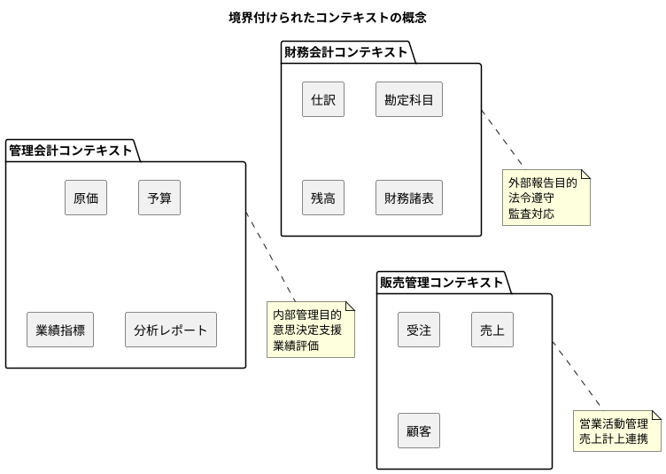

### なぜコンテキストを分けるのか

| 理由 | 説明 | 例 |
|------|------|-----|
| 用語の多義性解消 | 同じ言葉が異なる意味を持つ問題を解消 | 「売上」= 財務会計では収益計上、販売では受注完了 |
| チームの自律性 | 各チームが独立して開発・デプロイ可能 | 財務チームと営業チームの独立開発 |
| 技術選択の自由 | コンテキストごとに最適な技術を選択 | 財務: RDBMS、分析: OLAP |
| 変更の影響範囲限定 | 変更が他のコンテキストに波及しない | 税制改正の影響を財務会計に限定 |

### ユビキタス言語の境界

各コンテキスト内では、ドメインエキスパートと開発者が共通の言語（ユビキタス言語）を使用します。

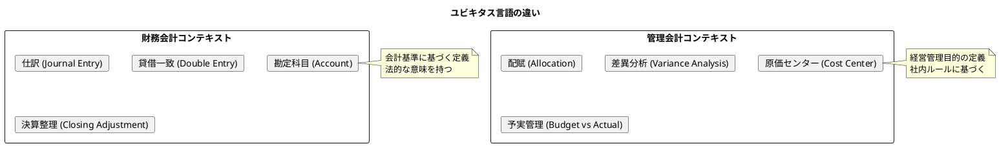

---

## 32.2 本システムにおけるコンテキストの識別

### 財務会計コンテキスト

本書でこれまで設計・実装してきた範囲は、財務会計コンテキストに該当します。第4章から第8章で定義したスキーマがこのコンテキストの基盤です。

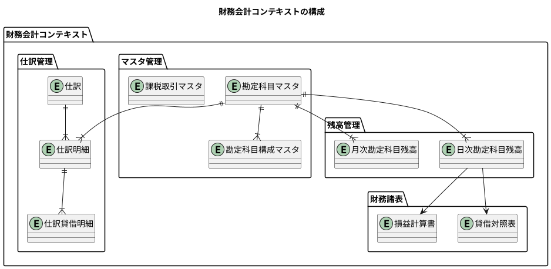

**財務会計コンテキストの責務**:

| 責務 | 説明 | 関連エンティティ |
|------|------|------------------|
| 勘定科目管理 | B/S・P/L 科目の階層管理 | 勘定科目マスタ、勘定科目構成マスタ |
| 複式簿記 | 貸借一致の仕訳記録 | 仕訳、仕訳明細、仕訳貸借明細 |
| 残高計算 | 日次・月次での残高推移 | 日次勘定科目残高、月次勘定科目残高 |
| 財務報告 | 法定財務諸表の作成 | 貸借対照表、損益計算書 |
| 税務対応 | 消費税計算と申告 | 課税取引マスタ |

### 管理会計コンテキスト（将来拡張）

第30章で述べた将来の拡張として、管理会計コンテキストを定義できます。

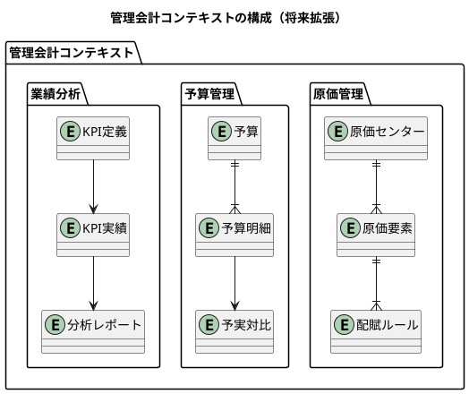

**管理会計コンテキストの責務**:

| 責務 | 説明 | 関連エンティティ |
|------|------|------------------|
| 原価計算 | 製品・サービス別原価の算出 | 原価センター、原価要素 |
| 配賦処理 | 間接費の各部門への配分 | 配賦ルール |
| 予算管理 | 年度予算の策定と管理 | 予算、予算明細 |
| 予実分析 | 予算と実績の差異分析 | 予実対比 |
| 業績評価 | KPI に基づく評価 | KPI 定義、KPI 実績 |

---

## 32.3 Context Map の設計

### コンテキスト間の関係

複数のコンテキストが連携する際の関係を Context Map で定義します。

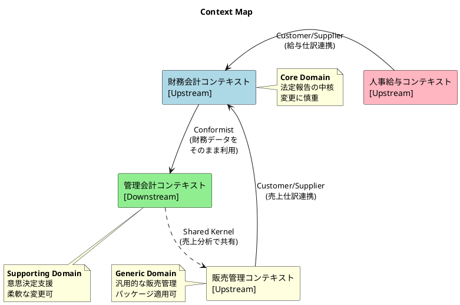

### 関係パターンの定義

| パターン | 説明 | 本システムでの適用 |
|----------|------|-------------------|
| Customer/Supplier | 上流が下流のニーズに対応 | 販売→財務会計（売上仕訳生成） |
| Conformist | 下流が上流に従う | 財務会計→管理会計（データ形式準拠） |
| Anti-Corruption Layer | 変換層で保護 | 外部システム→財務会計 |
| Shared Kernel | 一部を共有 | 管理会計↔販売（売上データ） |
| Open Host Service | API で公開 | 財務会計（REST API） |
| Published Language | 共通言語で交換 | 仕訳データの JSON 形式 |

### コンテキスト間のデータフロー

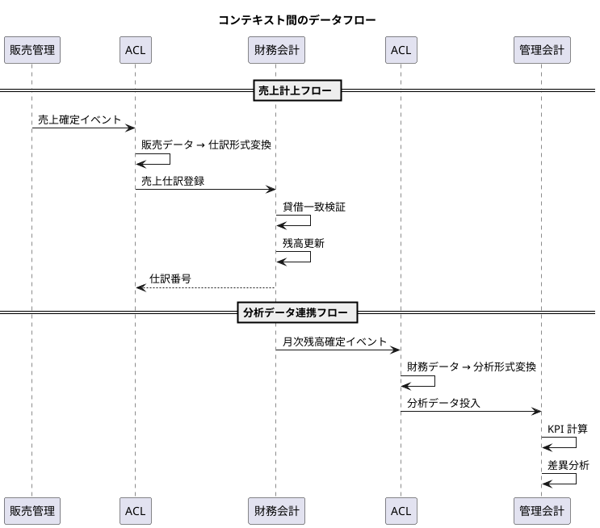

---

## 32.4 Anti-Corruption Layer（ACL）の実装

### ACL の役割

Anti-Corruption Layer は、外部コンテキストの概念が内部コンテキストを「汚染」しないよう保護する変換層です。

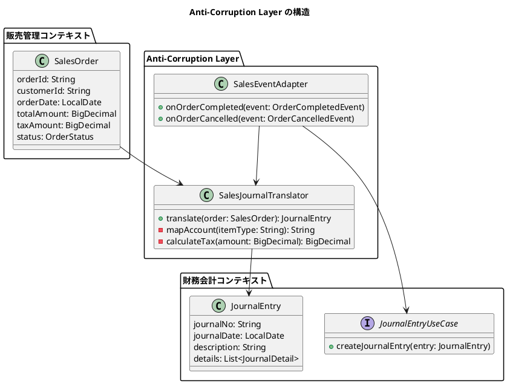

### ACL の実装例

**Translator（変換器）**:

```java
// acl/translator/SalesJournalTranslator.java
@Component
@RequiredArgsConstructor
public class SalesJournalTranslator {

    private final AccountRepository accountRepository;

    /**
     * 販売注文を仕訳に変換する
     */
    public JournalEntry translate(SalesOrder order) {
        List<JournalDetail> details = new ArrayList<>();

        // 借方: 売掛金
        details.add(createDetail(
            "112",  // 売掛金
            order.getTotalAmount(),
            BigDecimal.ZERO,
            "売上計上: " + order.getOrderId()
        ));

        // 貸方: 売上高
        BigDecimal salesAmount = order.getTotalAmount()
            .subtract(order.getTaxAmount());
        details.add(createDetail(
            "41",   // 売上高
            BigDecimal.ZERO,
            salesAmount,
            "売上計上: " + order.getOrderId()
        ));

        // 貸方: 仮受消費税
        if (order.getTaxAmount().compareTo(BigDecimal.ZERO) > 0) {
            details.add(createDetail(
                "2151", // 仮受消費税
                BigDecimal.ZERO,
                order.getTaxAmount(),
                "消費税: " + order.getOrderId()
            ));
        }

        return new JournalEntry(
            generateJournalNo(),
            order.getOrderDate(),
            "売上計上 - 注文番号: " + order.getOrderId(),
            details
        );
    }

    private JournalDetail createDetail(
            String accountCode,
            BigDecimal debitAmount,
            BigDecimal creditAmount,
            String description) {

        // 勘定科目の存在確認（ACL内で検証）
        accountRepository.findByCode(accountCode)
            .orElseThrow(() -> new IllegalStateException(
                "勘定科目が存在しません: " + accountCode));

        return new JournalDetail(
            accountCode,
            debitAmount,
            creditAmount,
            description
        );
    }

    private String generateJournalNo() {
        return "SL-" + LocalDateTime.now()
            .format(DateTimeFormatter.ofPattern("yyyyMMddHHmmssSSS"));
    }
}
```

**Event Adapter（イベントアダプター）**:

```java
// acl/adapter/SalesEventAdapter.java
@Component
@RequiredArgsConstructor
@Slf4j
public class SalesEventAdapter {

    private final SalesJournalTranslator translator;
    private final JournalEntryUseCase journalEntryUseCase;

    /**
     * 注文完了イベントを処理する
     */
    @EventListener
    @Transactional
    public void onOrderCompleted(OrderCompletedEvent event) {
        log.info("注文完了イベント受信: {}", event.getOrderId());

        try {
            // 販売データを取得（外部コンテキストの概念）
            SalesOrder order = event.getOrder();

            // ACL で財務会計コンテキストの概念に変換
            JournalEntry journalEntry = translator.translate(order);

            // 財務会計コンテキストのユースケースを呼び出し
            journalEntryUseCase.createJournalEntry(journalEntry);

            log.info("売上仕訳を作成しました: {}", journalEntry.getJournalNo());

        } catch (Exception e) {
            log.error("売上仕訳の作成に失敗しました: {}", event.getOrderId(), e);
            throw new JournalCreationException(
                "売上仕訳の作成に失敗しました", e);
        }
    }

    /**
     * 注文キャンセルイベントを処理する（逆仕訳）
     */
    @EventListener
    @Transactional
    public void onOrderCancelled(OrderCancelledEvent event) {
        log.info("注文キャンセルイベント受信: {}", event.getOrderId());

        // 逆仕訳を作成
        SalesOrder order = event.getOriginalOrder();
        JournalEntry reverseEntry = translator.translateReverse(order);

        journalEntryUseCase.createJournalEntry(reverseEntry);

        log.info("売上取消仕訳を作成しました: {}", reverseEntry.getJournalNo());
    }
}
```

---

## 32.5 コンテキストの独立性を保つ設計

### パッケージ構造

各コンテキストを独立したパッケージとして構成します。

```
com.example.accounting
├── financialaccounting/              # 財務会計コンテキスト
│   ├── domain/
│   │   ├── model/
│   │   │   ├── account/              # 勘定科目
│   │   │   ├── journal/              # 仕訳
│   │   │   └── balance/              # 残高
│   │   └── service/
│   ├── application/
│   │   ├── port/
│   │   │   ├── in/                   # Input Ports
│   │   │   └── out/                  # Output Ports
│   │   └── service/
│   └── infrastructure/
│       ├── persistence/
│       └── web/
│
├── managementaccounting/             # 管理会計コンテキスト（将来）
│   ├── domain/
│   ├── application/
│   └── infrastructure/
│
└── acl/                              # Anti-Corruption Layer
    ├── sales/                        # 販売管理との連携
    │   ├── translator/
    │   └── adapter/
    └── hr/                           # 人事給与との連携
        ├── translator/
        └── adapter/
```

### 依存関係のルール

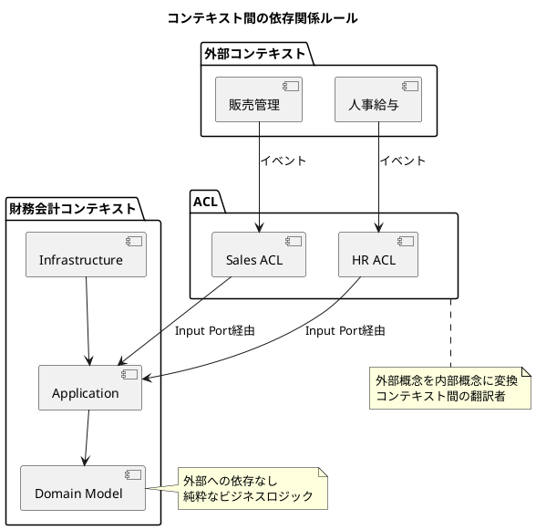

**依存ルール**:

| ルール | 説明 |
|--------|------|
| 内向き依存 | 外側の層は内側に依存、逆は禁止 |
| ACL 経由 | 外部コンテキストとは必ず ACL 経由で連携 |
| Port 経由 | コンテキスト内部へのアクセスは Input Port 経由 |
| イベント駆動 | コンテキスト間はイベントで疎結合 |

---

## 32.6 TDD による ACL の検証

### Translator のテスト

```java
// acl/translator/SalesJournalTranslatorTest.java
@ExtendWith(MockitoExtension.class)
class SalesJournalTranslatorTest {

    @Mock
    private AccountRepository accountRepository;

    @InjectMocks
    private SalesJournalTranslator translator;

    @BeforeEach
    void setUp() {
        // 勘定科目の存在をモック
        when(accountRepository.findByCode("112"))
            .thenReturn(Optional.of(createAccount("112", "売掛金")));
        when(accountRepository.findByCode("41"))
            .thenReturn(Optional.of(createAccount("41", "売上高")));
        when(accountRepository.findByCode("2151"))
            .thenReturn(Optional.of(createAccount("2151", "仮受消費税")));
    }

    @Test
    @DisplayName("販売注文を仕訳に変換できること")
    void shouldTranslateSalesOrderToJournalEntry() {
        // Given: 販売注文
        SalesOrder order = SalesOrder.builder()
            .orderId("ORD-001")
            .customerId("CUST-001")
            .orderDate(LocalDate.of(2024, 1, 15))
            .totalAmount(new BigDecimal("11000"))
            .taxAmount(new BigDecimal("1000"))
            .build();

        // When: 変換実行
        JournalEntry entry = translator.translate(order);

        // Then: 仕訳が正しく生成されていること
        assertThat(entry.getJournalDate()).isEqualTo(LocalDate.of(2024, 1, 15));
        assertThat(entry.getDescription()).contains("ORD-001");
        assertThat(entry.getDetails()).hasSize(3);

        // 借方: 売掛金 11,000円
        JournalDetail debit = entry.getDetails().stream()
            .filter(d -> d.getDebitAmount().compareTo(BigDecimal.ZERO) > 0)
            .findFirst()
            .orElseThrow();
        assertThat(debit.getAccountCode()).isEqualTo("112");
        assertThat(debit.getDebitAmount()).isEqualByComparingTo("11000");

        // 貸方: 売上高 10,000円
        JournalDetail salesCredit = entry.getDetails().stream()
            .filter(d -> d.getAccountCode().equals("41"))
            .findFirst()
            .orElseThrow();
        assertThat(salesCredit.getCreditAmount()).isEqualByComparingTo("10000");

        // 貸方: 仮受消費税 1,000円
        JournalDetail taxCredit = entry.getDetails().stream()
            .filter(d -> d.getAccountCode().equals("2151"))
            .findFirst()
            .orElseThrow();
        assertThat(taxCredit.getCreditAmount()).isEqualByComparingTo("1000");
    }

    @Test
    @DisplayName("貸借が一致する仕訳が生成されること")
    void shouldCreateBalancedJournalEntry() {
        // Given
        SalesOrder order = SalesOrder.builder()
            .orderId("ORD-002")
            .orderDate(LocalDate.now())
            .totalAmount(new BigDecimal("55000"))
            .taxAmount(new BigDecimal("5000"))
            .build();

        // When
        JournalEntry entry = translator.translate(order);

        // Then: 貸借一致
        BigDecimal totalDebit = entry.getDetails().stream()
            .map(JournalDetail::getDebitAmount)
            .reduce(BigDecimal.ZERO, BigDecimal::add);

        BigDecimal totalCredit = entry.getDetails().stream()
            .map(JournalDetail::getCreditAmount)
            .reduce(BigDecimal.ZERO, BigDecimal::add);

        assertThat(totalDebit).isEqualByComparingTo(totalCredit);
    }

    @Test
    @DisplayName("存在しない勘定科目でエラーになること")
    void shouldThrowExceptionForInvalidAccount() {
        // Given: 存在しない勘定科目
        when(accountRepository.findByCode("112"))
            .thenReturn(Optional.empty());

        SalesOrder order = SalesOrder.builder()
            .orderId("ORD-003")
            .orderDate(LocalDate.now())
            .totalAmount(new BigDecimal("11000"))
            .taxAmount(new BigDecimal("1000"))
            .build();

        // When & Then
        assertThatThrownBy(() -> translator.translate(order))
            .isInstanceOf(IllegalStateException.class)
            .hasMessageContaining("勘定科目が存在しません");
    }

    private Account createAccount(String code, String name) {
        return new Account(code, name, null, null, "B", "借", "資産", 1);
    }
}
```

### Event Adapter の統合テスト

```java
// acl/adapter/SalesEventAdapterIntegrationTest.java
@SpringBootTest
@Transactional
class SalesEventAdapterIntegrationTest {

    @Autowired
    private ApplicationEventPublisher eventPublisher;

    @Autowired
    private JournalEntryRepository journalEntryRepository;

    @Test
    @DisplayName("注文完了イベントで売上仕訳が作成されること")
    void shouldCreateJournalEntryOnOrderCompleted() {
        // Given: 注文完了イベント
        SalesOrder order = SalesOrder.builder()
            .orderId("ORD-INT-001")
            .customerId("CUST-001")
            .orderDate(LocalDate.of(2024, 1, 20))
            .totalAmount(new BigDecimal("33000"))
            .taxAmount(new BigDecimal("3000"))
            .build();

        OrderCompletedEvent event = new OrderCompletedEvent(this, order);

        // When: イベント発行
        eventPublisher.publishEvent(event);

        // Then: 仕訳が作成されている
        List<JournalEntry> entries = journalEntryRepository
            .findByDateRange(
                LocalDate.of(2024, 1, 20),
                LocalDate.of(2024, 1, 20)
            );

        assertThat(entries).isNotEmpty();

        JournalEntry entry = entries.stream()
            .filter(e -> e.getDescription().contains("ORD-INT-001"))
            .findFirst()
            .orElseThrow();

        assertThat(entry.isBalanced()).isTrue();
        assertThat(entry.getTotalDebit()).isEqualByComparingTo("33000");
    }
}
```

---

## 32.7 マイクロサービスへの進化

### モノリスからの段階的分離

現在のモノリシックな構造から、将来的にマイクロサービスへ進化させることができます。

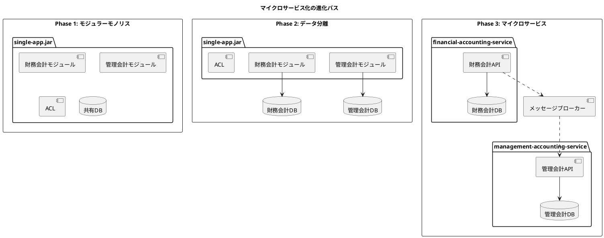

### Database per Service パターン

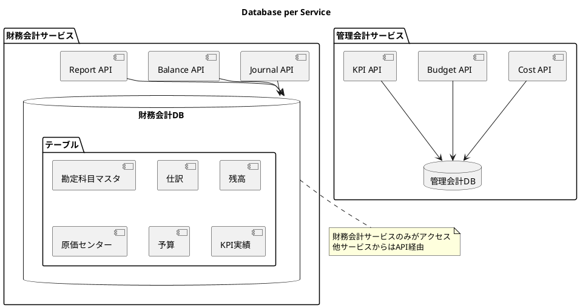

### イベント駆動アーキテクチャ

```java
// コンテキスト間イベントの定義
// event/JournalCreatedEvent.java
public record JournalCreatedEvent(
    String journalNo,
    LocalDate journalDate,
    String description,
    BigDecimal totalAmount,
    List<JournalLineEvent> lines,
    Instant occurredAt
) implements DomainEvent {

    public static JournalCreatedEvent from(JournalEntry entry) {
        return new JournalCreatedEvent(
            entry.getJournalNo(),
            entry.getJournalDate(),
            entry.getDescription(),
            entry.getTotalDebit(),
            entry.getDetails().stream()
                .map(JournalLineEvent::from)
                .toList(),
            Instant.now()
        );
    }
}

public record JournalLineEvent(
    String accountCode,
    BigDecimal debitAmount,
    BigDecimal creditAmount
) {
    public static JournalLineEvent from(JournalDetail detail) {
        return new JournalLineEvent(
            detail.getAccountCode(),
            detail.getDebitAmount(),
            detail.getCreditAmount()
        );
    }
}
```

**イベント発行**:

```java
// application/service/JournalEntryService.java
@Service
@RequiredArgsConstructor
@Transactional
public class JournalEntryService implements JournalEntryUseCase {

    private final JournalEntryRepository repository;
    private final ApplicationEventPublisher eventPublisher;

    @Override
    public JournalEntry createJournalEntry(JournalEntry entry) {
        // 仕訳を保存
        JournalEntry saved = repository.save(entry);

        // ドメインイベントを発行（他コンテキストに通知）
        eventPublisher.publishEvent(
            JournalCreatedEvent.from(saved)
        );

        return saved;
    }
}
```

---

## 32.8 D社事例への適用

### D社のコンテキスト分析

第8章で紹介した D 社（化粧品製造販売）の事例に境界付けられたコンテキストを適用します。

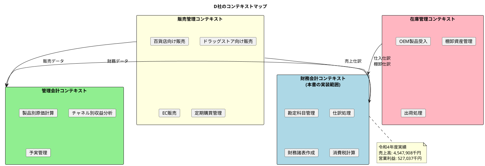

### チャネル別の仕訳パターン

D 社の3つの販売チャネルに対応した ACL を設計します。

```java
// acl/sales/translator/ChannelJournalTranslator.java
@Component
@RequiredArgsConstructor
public class ChannelJournalTranslator {

    private final AccountRepository accountRepository;

    /**
     * チャネル別に適切な勘定科目で仕訳を生成
     */
    public JournalEntry translate(SalesOrder order, SalesChannel channel) {
        String revenueAccount = getRevenueAccount(channel);
        String receivableAccount = getReceivableAccount(channel);

        List<JournalDetail> details = new ArrayList<>();

        // 借方: チャネル別売掛金
        details.add(createDetail(
            receivableAccount,
            order.getTotalAmount(),
            BigDecimal.ZERO,
            channel.getDisplayName() + " 売上: " + order.getOrderId()
        ));

        // 貸方: 売上高
        details.add(createDetail(
            revenueAccount,
            BigDecimal.ZERO,
            order.getTotalAmount().subtract(order.getTaxAmount()),
            channel.getDisplayName() + " 売上: " + order.getOrderId()
        ));

        // 貸方: 仮受消費税
        if (order.getTaxAmount().compareTo(BigDecimal.ZERO) > 0) {
            details.add(createDetail(
                "2151",
                BigDecimal.ZERO,
                order.getTaxAmount(),
                "消費税"
            ));
        }

        return new JournalEntry(
            generateJournalNo(channel),
            order.getOrderDate(),
            channel.getDisplayName() + " 売上計上",
            details
        );
    }

    /**
     * チャネル別の売上勘定科目を取得
     */
    private String getRevenueAccount(SalesChannel channel) {
        return switch (channel) {
            case DEPARTMENT_STORE -> "4101";  // 百貨店売上
            case DRUGSTORE -> "4102";         // ドラッグストア売上
            case EC -> "4103";                // EC売上
        };
    }

    /**
     * チャネル別の売掛金勘定科目を取得
     */
    private String getReceivableAccount(SalesChannel channel) {
        return switch (channel) {
            case DEPARTMENT_STORE -> "1121";  // 百貨店売掛金
            case DRUGSTORE -> "1122";         // ドラッグストア売掛金
            case EC -> "1123";                // EC売掛金
        };
    }

    // ... 省略
}

public enum SalesChannel {
    DEPARTMENT_STORE("百貨店"),
    DRUGSTORE("ドラッグストア"),
    EC("EC");

    private final String displayName;

    SalesChannel(String displayName) {
        this.displayName = displayName;
    }

    public String getDisplayName() {
        return displayName;
    }
}
```

---

## 32.9 まとめ

本章では、境界付けられたコンテキスト（Bounded Context）について解説しました。

### 学んだこと

1. **コンテキストの概念**: ユビキタス言語の一貫性を保つ境界
2. **コンテキストの識別**: 財務会計と管理会計の分離
3. **Context Map**: コンテキスト間の関係パターン
4. **Anti-Corruption Layer**: 外部概念から内部を保護する変換層
5. **独立性の確保**: パッケージ構造と依存ルール
6. **マイクロサービス化**: 段階的な進化パス

### 設計のポイント

| 観点 | ポイント |
|------|----------|
| 境界の決定 | ユビキタス言語の違いで判断 |
| 連携方式 | イベント駆動で疎結合 |
| 変換層 | ACL で概念の翻訳 |
| 依存方向 | 外側から内側への一方向 |
| 進化可能性 | モノリス→マイクロサービス |

### 本シリーズで構築した財務会計コンテキスト

| 章 | 内容 | 役割 |
|----|------|------|
| 第4章 | ER モデリング | データ構造の設計 |
| 第5章 | 勘定科目マスタ | マスタ管理の実装 |
| 第6章 | 仕訳の3層構造 | トランザクション管理 |
| 第7章 | ドメインモデル対応 | アーキテクチャ設計 |
| 第8章 | テストデータ | D社事例の適用 |
| 第32章 | コンテキスト設計 | 戦略的設計の適用 |

次章では、本シリーズのまとめとして、財務会計システム全体のアーキテクチャと学びの振り返りを行います。
