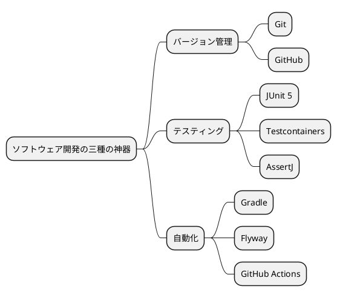
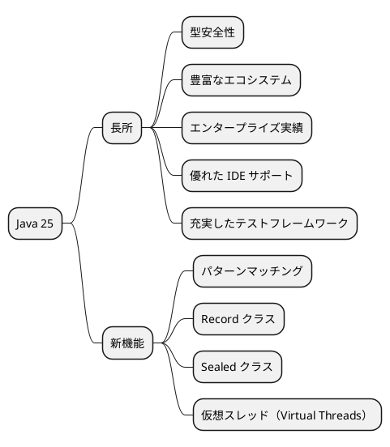
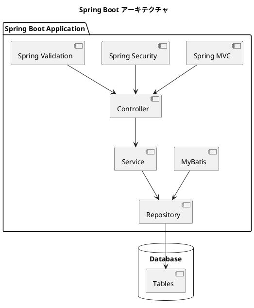
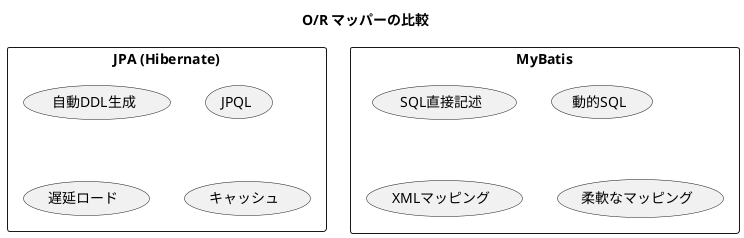
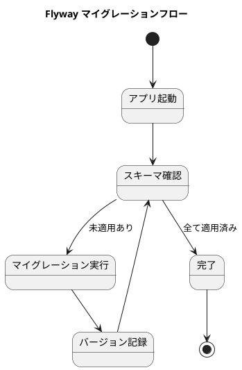
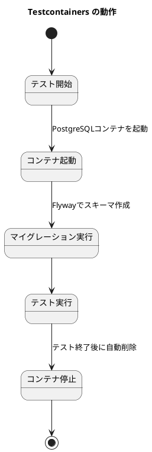
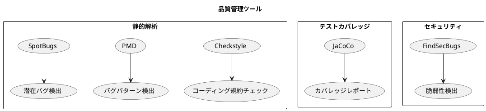
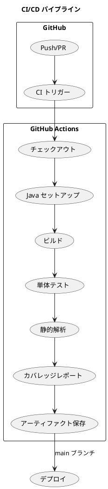
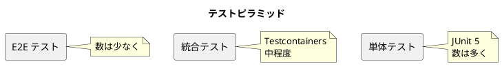

# 第2章: 開発環境の構築

## 2.1 技術スタックの選定

### ソフトウェア開発の三種の神器

TDD でデータベース設計を進めるための開発環境を構築します。テスト駆動開発のゴールは**動作するきれいなコード**ですが、それを実現するためにはソフトウェア開発の三種の神器が必要です。



> 今日のソフトウェア開発の世界において絶対になければならない3つの技術的な柱があります。
> 三本柱と言ったり、三種の神器と言ったりしていますが、それらは
>
> - バージョン管理
> - テスティング
> - 自動化
>
> の3つです。
>
> — https://t-wada.hatenablog.jp/entry/clean-code-that-works

### Java 25 を選んだ理由

本プロジェクトでは、バックエンド言語として Java 25 を採用しています。



| 観点 | Java の利点 |
|------|-------------|
| 型安全性 | コンパイル時のエラー検出で堅牢なコードを実現 |
| エコシステム | Spring Boot、MyBatis など成熟したフレームワーク群 |
| 保守性 | 静的型付けにより、大規模コードベースでもリファクタリングが安全 |
| テスト | JUnit 5、AssertJ、Testcontainers など充実したテストツール |
| 最新機能 | 最新の言語機能とパフォーマンス改善を活用 |

### Spring Boot の利点

Spring Boot は Java の Web アプリケーション開発において最も広く使われているフレームワークです。



#### Spring Boot の主な特徴

| 特徴 | 説明 |
|------|------|
| 自動設定 | 設定より規約（Convention over Configuration）で開発効率向上 |
| 組み込みサーバー | Tomcat が組み込まれ、単独で実行可能な JAR を生成 |
| スターター | 依存関係をスターターで一括管理 |
| Actuator | ヘルスチェック、メトリクスなど運用機能を標準提供 |
| DevTools | ホットリロードによる開発効率向上 |

### MyBatis vs JPA の選択

O/R マッパーとして MyBatis を採用しました。



#### MyBatis を選んだ理由

| 観点 | MyBatis の利点 |
|------|----------------|
| SQL 制御 | 複雑な SQL を直接記述でき、パフォーマンスチューニングが容易 |
| 学習コスト | SQL の知識がそのまま活用でき、学習曲線が緩やか |
| デバッグ | 実行される SQL が明確で、問題の特定が容易 |
| 柔軟性 | 動的 SQL により、条件に応じた柔軟なクエリが記述可能 |
| 既存 DB 対応 | 既存データベースへの適用が容易 |

```java
// MyBatis Mapper の例
public interface AccountMapper {
    @Select("SELECT * FROM \"勘定科目マスタ\" WHERE \"勘定科目コード\" = #{code}")
    Account findByCode(String code);

    @Insert("INSERT INTO \"勘定科目マスタ\" (\"勘定科目コード\", \"勘定科目名\", \"勘定科目種別\", \"残高\") " +
            "VALUES (#{code}, #{name}, #{accountType}::account_type, #{balance})")
    void insert(Account account);
}
```

---

## 2.2 バックエンド環境

### 前提条件

以下のツールがインストールされていることを確認してください。

| ツール | バージョン | 備考 |
|--------|-----------|------|
| Java | 25 以上 | 推奨：Java 25 |
| Gradle | 8.x 以上 | 推奨：Gradle Wrapper 使用 |
| Docker | 最新版 | Docker Compose 含む |
| Git | 最新版 | バージョン管理 |

### Gradle プロジェクトのセットアップ

#### プロジェクトの初期化

```bash
$ mkdir accounting-system
$ cd accounting-system
$ gradle init --type java-application --dsl groovy --test-framework junit-jupiter --package com.example.accounting
```

対話形式で以下を選択します：

- Generate build using new APIs and behavior: **yes**
- Project name: **accounting-system**
- Source package: **com.example.accounting**

#### build.gradle の構成

```groovy
plugins {
    id 'java'
    id 'application'
    id 'jacoco'
    id 'checkstyle'
    id 'pmd'
    id 'com.github.spotbugs' version '6.0.7'
    id 'org.springframework.boot' version '3.2.0'
    id 'io.spring.dependency-management' version '1.1.4'
}

group = 'com.example.accounting'
version = '0.0.1-SNAPSHOT'

java {
    sourceCompatibility = '25'
}

repositories {
    mavenCentral()
}

dependencies {
    // Spring Boot
    implementation 'org.springframework.boot:spring-boot-starter-web'
    implementation 'org.springframework.boot:spring-boot-starter-jdbc'
    implementation 'org.springframework.boot:spring-boot-starter-validation'
    testImplementation 'org.springframework.boot:spring-boot-starter-test'

    // MyBatis
    implementation 'org.mybatis.spring.boot:mybatis-spring-boot-starter:3.0.3'

    // Flyway
    implementation 'org.flywaydb:flyway-core'
    implementation 'org.flywaydb:flyway-database-postgresql'

    // Database
    runtimeOnly 'org.postgresql:postgresql'
    runtimeOnly 'com.mysql:mysql-connector-j'

    // Lombok (オプション)
    compileOnly 'org.projectlombok:lombok'
    annotationProcessor 'org.projectlombok:lombok'

    // Test
    testImplementation 'org.junit.jupiter:junit-jupiter-api'
    testImplementation 'org.junit.jupiter:junit-jupiter-params'
    testRuntimeOnly 'org.junit.jupiter:junit-jupiter-engine'
    testImplementation 'org.assertj:assertj-core:3.24.2'
    testImplementation 'org.testcontainers:testcontainers:1.19.3'
    testImplementation 'org.testcontainers:postgresql:1.19.3'
    testImplementation 'org.testcontainers:mysql:1.19.3'
    testImplementation 'org.testcontainers:junit-jupiter:1.19.3'

    // SpotBugs
    spotbugsPlugins 'com.h3xstream.findsecbugs:findsecbugs-plugin:1.12.0'
}

application {
    mainClass = 'com.example.accounting.App'
}

test {
    useJUnitPlatform()
    finalizedBy jacocoTestReport
}

jacoco {
    toolVersion = "0.8.11"
}

jacocoTestReport {
    dependsOn test
    reports {
        xml.required = true
        html.required = true
    }
}
```

### Spring Boot アプリケーションの初期化

#### アプリケーションクラス

```java
@SpringBootApplication
public class AccountingApplication {
    public static void main(String[] args) {
        SpringApplication.run(AccountingApplication.class, args);
    }
}
```

#### 設定ファイル（application.properties）

```properties
# アプリケーション設定
spring.application.name=accounting-system

# データソース設定（PostgreSQL）
spring.datasource.url=jdbc:postgresql://localhost:5432/accounting_system
spring.datasource.username=postgres
spring.datasource.password=postgres
spring.datasource.driver-class-name=org.postgresql.Driver

# MyBatis設定
mybatis.configuration.map-underscore-to-camel-case=true
mybatis.type-aliases-package=com.example.accounting.domain.model
mybatis.mapper-locations=classpath:mybatis/mapper/**/*.xml

# Flyway設定
spring.flyway.enabled=true
spring.flyway.locations=classpath:db/migration
spring.flyway.baseline-on-migrate=true

# ログレベル
logging.level.com.example.accounting=DEBUG
logging.level.org.springframework.jdbc.core=DEBUG
logging.level.org.mybatis=DEBUG
```

---

## 2.3 データベース環境

### Docker Compose によるデータベース構築

Docker を使用すると、データベース環境を簡単にセットアップできます。

#### docker-compose.yml

```yaml
services:
  # PostgreSQL データベース
  postgres:
    image: postgres:16-alpine
    container_name: accounting-system-postgres
    restart: unless-stopped
    environment:
      POSTGRES_USER: ${POSTGRES_USER:-postgres}
      POSTGRES_PASSWORD: ${POSTGRES_PASSWORD:-postgres}
      POSTGRES_DB: ${POSTGRES_DB:-accounting_system}
      TZ: 'Asia/Tokyo'
    ports:
      - "${POSTGRES_PORT:-5432}:5432"
    volumes:
      - postgres_data:/var/lib/postgresql/data
      - ./docker/postgres/init:/docker-entrypoint-initdb.d
    healthcheck:
      test: ["CMD-SHELL", "pg_isready -U ${POSTGRES_USER:-postgres}"]
      interval: 10s
      timeout: 5s
      retries: 5
    networks:
      - db_network

  # MySQL データベース
  mysql:
    image: mysql:8.0
    container_name: accounting-system-mysql
    restart: unless-stopped
    environment:
      MYSQL_ROOT_PASSWORD: ${MYSQL_ROOT_PASSWORD:-root}
      MYSQL_DATABASE: ${MYSQL_DATABASE:-accounting_system}
      MYSQL_USER: ${MYSQL_USER:-user}
      MYSQL_PASSWORD: ${MYSQL_PASSWORD:-password}
      TZ: 'Asia/Tokyo'
    command: >
      --default-authentication-plugin=mysql_native_password
      --character-set-server=utf8mb4
      --collation-server=utf8mb4_unicode_ci
    ports:
      - "${MYSQL_PORT:-3306}:3306"
    volumes:
      - mysql_data:/var/lib/mysql
      - ./docker/mysql/init:/docker-entrypoint-initdb.d
    healthcheck:
      test: ["CMD", "mysqladmin", "ping", "-h", "localhost"]
      interval: 10s
      timeout: 5s
      retries: 5
    networks:
      - db_network

  # Adminer - データベース管理ツール
  adminer:
    image: adminer:latest
    container_name: accounting-system-adminer
    restart: unless-stopped
    ports:
      - "${ADMINER_PORT:-8080}:8080"
    environment:
      ADMINER_DEFAULT_SERVER: ${DB_TYPE:-postgres}
    networks:
      - db_network
    depends_on:
      - postgres
      - mysql

volumes:
  postgres_data:
  mysql_data:

networks:
  db_network:
    driver: bridge
```

#### データベースコンテナの起動

```bash
# PostgreSQL を起動
$ docker-compose up -d postgres

# または MySQL を起動
$ docker-compose up -d mysql

# すべてのサービスを起動
$ docker-compose up -d

# コンテナの状態確認
$ docker-compose ps

# ログの確認
$ docker-compose logs -f postgres
```

### Flyway によるマイグレーション管理

データベーススキーマのバージョン管理に Flyway を使用しています。

#### Flyway とは

Flyway は、データベースのマイグレーション（スキーマ変更の管理）を行うツールです。SQL ファイルでマイグレーションを定義し、バージョン管理されたスキーマ変更を自動的に適用できます。



#### マイグレーションファイルの命名規則

```
V{バージョン番号}__{説明}.sql

例：
V001__create_account_master.sql
V002__create_journal_tables.sql
V003__create_balance_tables.sql
```

**重要**：
- バージョン番号は連番で、欠番があってはいけません
- 一度適用されたマイグレーションファイルは変更してはいけません
- 変更が必要な場合は、新しいマイグレーションファイルを追加します

#### マイグレーションファイルの例

```sql
-- V001__create_account_master.sql

-- 勘定科目種別のenum型を作成
DO $$ BEGIN
    CREATE TYPE account_type AS ENUM ('資産', '負債', '純資産', '収益', '費用');
EXCEPTION
    WHEN duplicate_object THEN null;
END $$;

-- 勘定科目マスタテーブルを作成
CREATE TABLE IF NOT EXISTS "勘定科目マスタ" (
    "勘定科目ID" SERIAL PRIMARY KEY,
    "勘定科目コード" VARCHAR(20) UNIQUE NOT NULL,
    "勘定科目名" VARCHAR(100) NOT NULL,
    "勘定科目種別" account_type NOT NULL,
    "残高" DECIMAL(15,2) DEFAULT 0 NOT NULL,
    "作成日時" TIMESTAMP DEFAULT CURRENT_TIMESTAMP NOT NULL,
    "更新日時" TIMESTAMP DEFAULT CURRENT_TIMESTAMP NOT NULL
);

-- テーブルコメント
COMMENT ON TABLE "勘定科目マスタ" IS '勘定科目マスタ（財務会計システムの基本となる勘定科目情報）';
COMMENT ON COLUMN "勘定科目マスタ"."勘定科目ID" IS '勘定科目ID（主キー）';
COMMENT ON COLUMN "勘定科目マスタ"."勘定科目コード" IS '勘定科目コード（例：1000, 2000）';
COMMENT ON COLUMN "勘定科目マスタ"."勘定科目名" IS '勘定科目名（例：現金、売掛金）';
COMMENT ON COLUMN "勘定科目マスタ"."勘定科目種別" IS '勘定科目種別（資産、負債、純資産、収益、費用）';
COMMENT ON COLUMN "勘定科目マスタ"."残高" IS '残高';
```

---

## 2.4 テスト環境

### Testcontainers によるテスト環境

テスト環境では、Testcontainers を使用してテスト専用のデータベースコンテナを起動し、各テストの独立性を保ちます。

#### Testcontainers とは

**Testcontainers** は、Docker コンテナをテストコードから制御できる Java ライブラリです。



**主な特徴**：
- テスト実行時に必要なコンテナを自動起動
- テスト終了後に自動的にコンテナを削除
- CI/CD 環境でも動作（Docker が利用可能な環境であれば OK）
- 実際の本番環境に近い状態でテスト可能

#### テストベースクラスの作成

```java
package com.example.accounting;

import org.flywaydb.core.Flyway;
import org.junit.jupiter.api.AfterAll;
import org.junit.jupiter.api.BeforeAll;
import org.testcontainers.containers.PostgreSQLContainer;
import org.testcontainers.junit.jupiter.Container;
import org.testcontainers.junit.jupiter.Testcontainers;

import java.sql.Connection;
import java.sql.DriverManager;
import java.sql.SQLException;

/**
 * Testcontainersを使用したデータベーステストの基底クラス
 */
@Testcontainers
public abstract class TestDatabaseConfig {

    @Container
    protected static PostgreSQLContainer<?> postgres =
        new PostgreSQLContainer<>("postgres:16-alpine")
            .withDatabaseName("testdb")
            .withUsername("testuser")
            .withPassword("testpass");

    protected static Connection connection;

    @BeforeAll
    static void setUp() throws SQLException {
        connection = DriverManager.getConnection(
                postgres.getJdbcUrl(),
                postgres.getUsername(),
                postgres.getPassword()
        );

        // Flyway マイグレーションを実行
        Flyway flyway = Flyway.configure()
                .dataSource(postgres.getJdbcUrl(), postgres.getUsername(), postgres.getPassword())
                .locations("classpath:db/migration")
                .load();
        flyway.migrate();
    }

    @AfterAll
    static void tearDown() throws SQLException {
        if (connection != null && !connection.isClosed()) {
            connection.close();
        }
    }
}
```

#### データベース接続テストの作成

```java
package com.example.accounting;

import org.junit.jupiter.api.DisplayName;
import org.junit.jupiter.api.Test;

import java.sql.ResultSet;
import java.sql.Statement;

import static org.assertj.core.api.Assertions.assertThat;

/**
 * Testcontainers データベース接続テスト
 */
@DisplayName("データベース接続テスト")
class DatabaseConnectionTest extends TestDatabaseConfig {

    @Test
    @DisplayName("データベースに接続できる")
    void testDatabaseConnection() throws Exception {
        try (Statement stmt = connection.createStatement();
             ResultSet rs = stmt.executeQuery("SELECT 1")) {
            assertThat(rs.next()).isTrue();
            assertThat(rs.getInt(1)).isEqualTo(1);
        }
    }

    @Test
    @DisplayName("勘定科目マスタテーブルが作成されている")
    void testTableExists() throws Exception {
        String sql = """
            SELECT EXISTS (
              SELECT FROM information_schema.tables
              WHERE table_schema = 'public'
              AND table_name = '勘定科目マスタ'
            )
            """;

        try (Statement stmt = connection.createStatement();
             ResultSet rs = stmt.executeQuery(sql)) {
            assertThat(rs.next()).isTrue();
            assertThat(rs.getBoolean(1)).isTrue();
        }
    }
}
```

#### Testcontainers のメリット

| メリット | 説明 |
|---------|------|
| 完全な分離 | 各テスト実行時に新しいコンテナを起動、他のテストとの干渉を防止 |
| 自動クリーンアップ | テスト終了時にコンテナが自動的に削除 |
| 本番同等環境 | 実際の PostgreSQL コンテナを使用、インメモリ DB では検出できない問題も発見 |
| CI/CD 対応 | Docker があればどこでもテストが実行可能 |

---

## 2.5 品質管理ツール

### 静的解析ツール

コード品質を維持するため、複数の静的解析ツールを使用しています。



| ツール | 目的 |
|--------|------|
| Checkstyle | コーディング規約のチェック |
| PMD | バグパターンの検出 |
| SpotBugs | 潜在的なバグの検出 |
| FindSecBugs | セキュリティ脆弱性の検出 |
| JaCoCo | テストカバレッジの計測 |

#### Checkstyle 設定

```xml
<!-- config/checkstyle/checkstyle.xml -->
<?xml version="1.0"?>
<!DOCTYPE module PUBLIC
  "-//Checkstyle//DTD Checkstyle Configuration 1.3//EN"
  "https://checkstyle.org/dtds/configuration_1_3.dtd">
<module name="Checker">
    <module name="TreeWalker">
        <module name="JavadocMethod"/>
        <module name="JavadocType"/>
        <module name="ConstantName"/>
        <module name="LocalVariableName"/>
        <module name="MethodName"/>
        <module name="PackageName"/>
        <module name="TypeName"/>
    </module>
</module>
```

---

## 2.6 CI/CD パイプライン

### GitHub Actions の構成

GitHub Actions を使用して CI/CD を実現しています。

```yaml
# .github/workflows/ci.yml
name: CI

on:
  push:
    branches: [ main, develop ]
  pull_request:
    branches: [ main ]

jobs:
  build:
    runs-on: ubuntu-latest

    steps:
    - uses: actions/checkout@v4

    - name: Set up JDK 25
      uses: actions/setup-java@v4
      with:
        java-version: '25'
        distribution: 'temurin'

    - name: Setup Gradle
      uses: gradle/gradle-build-action@v3

    - name: Build with Gradle
      run: ./gradlew build

    - name: Run tests
      run: ./gradlew test

    - name: Run static analysis
      run: ./gradlew check

    - name: Generate coverage report
      run: ./gradlew jacocoTestReport

    - name: Upload coverage report
      uses: actions/upload-artifact@v4
      with:
        name: coverage-report
        path: build/reports/jacoco/test/html
```



### テストピラミッド



| テスト種別 | ツール | 対象 |
|-----------|--------|------|
| 単体テスト | JUnit 5, AssertJ | ドメインモデル、サービス |
| 統合テスト | Testcontainers | リポジトリ、データベース |
| 受け入れテスト | Cucumber | ユースケースシナリオ |

---

## まとめ

本章では、開発環境の構築について解説しました。

- **三種の神器**: バージョン管理（Git）、テスティング（JUnit 5）、自動化（Gradle）
- **バックエンド**: Java 25 + Spring Boot + MyBatis + Gradle
- **データベース**: PostgreSQL / MySQL + Docker Compose + Flyway
- **テスト**: Testcontainers による本番同等環境でのテスト
- **品質管理**: Checkstyle、PMD、SpotBugs、JaCoCo
- **CI/CD**: GitHub Actions による自動化

次章では、本システムのアーキテクチャ設計について詳しく解説します。
