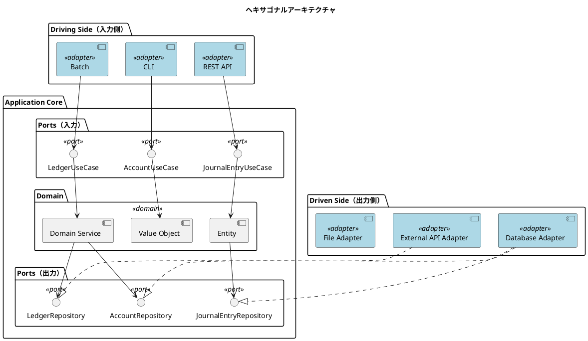
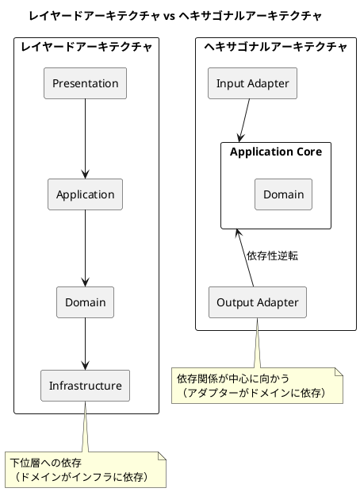
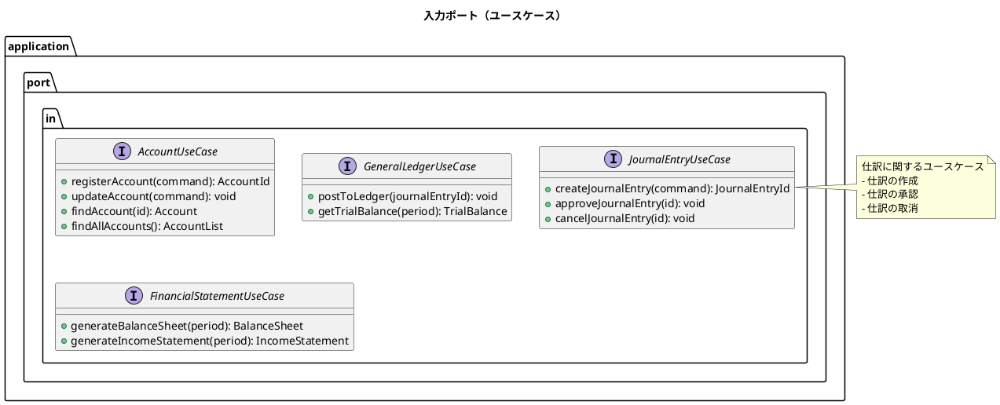
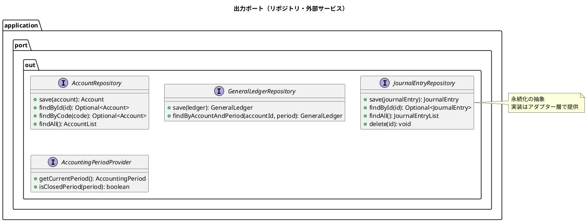
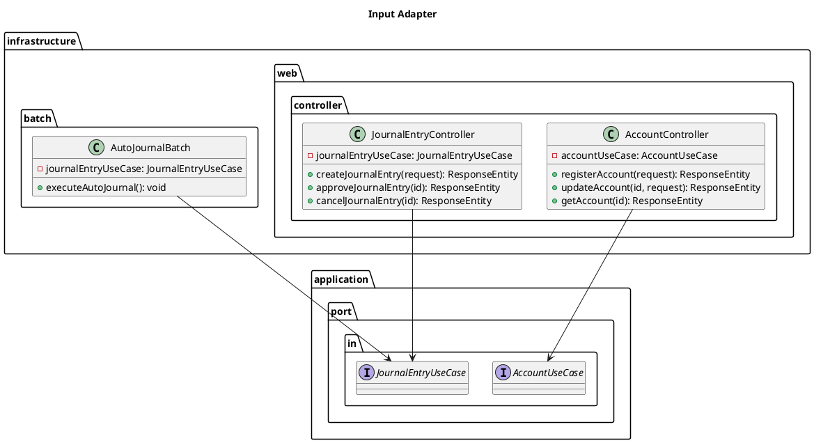
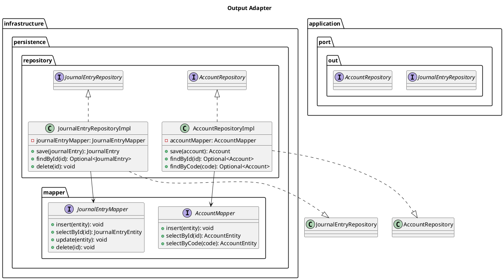
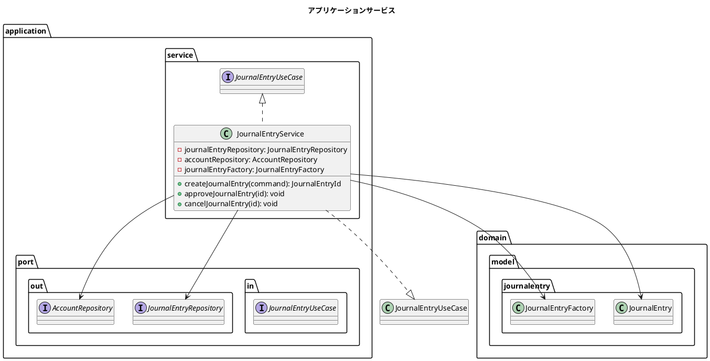
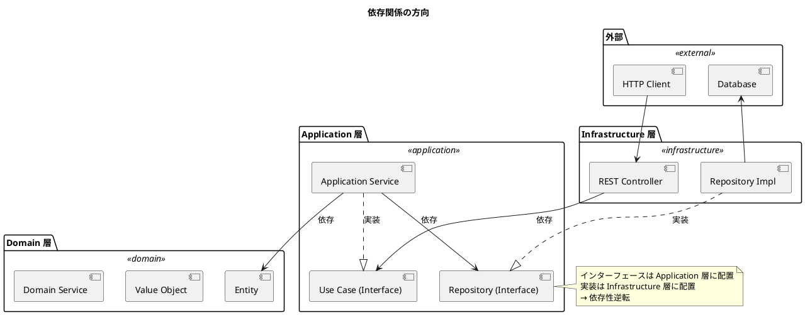
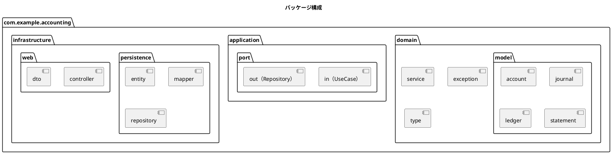
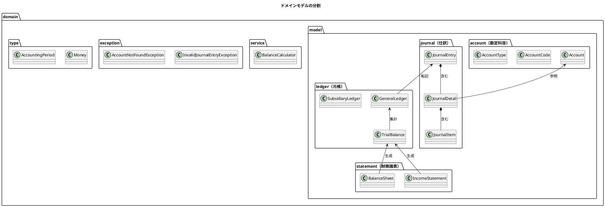

# 第3章: アーキテクチャ設計

## 3.1 ヘキサゴナルアーキテクチャ

### ポート&アダプターパターンの採用

本システムでは、ヘキサゴナルアーキテクチャ（Hexagonal Architecture）を採用しています。このアーキテクチャは「ポート&アダプター」とも呼ばれ、ビジネスロジックを中心に据え、外部システムとの接続を抽象化することで、高い保守性とテスタビリティを実現します。



### なぜヘキサゴナルアーキテクチャか

財務会計システムでは、以下の理由からヘキサゴナルアーキテクチャが適しています。

| 観点 | 効果 |
|------|------|
| ビジネスロジックの独立性 | 仕訳ルール、残高計算などの会計ロジックがフレームワークから独立 |
| テスタビリティ | ドメインロジックを単体でテスト可能 |
| 柔軟なデータソース | RDB、外部会計システム、CSV など多様なデータソースに対応 |
| 段階的な移行 | レガシーシステムからの段階的な移行が容易 |

### 従来のレイヤードアーキテクチャとの違い



#### 主な違い

| 観点 | レイヤード | ヘキサゴナル |
|------|------------|--------------|
| 依存の方向 | 上から下へ一方向 | 外から内へ（中心に向かう） |
| ドメインの位置 | 中間層 | 最も内側（中心） |
| 外部システムの扱い | インフラ層として下位に配置 | アダプターとして外側に配置 |
| 交換可能性 | 層全体の交換が必要 | アダプター単位で交換可能 |

---

## 3.2 ポートとアダプター

### 入力ポート（Primary/Driving Port）

入力ポートは、アプリケーションが外部に提供するインターフェースです。ユースケースを表現します。



#### 入力ポートの実装例

```java
// application/port/in/JournalEntryUseCase.java
public interface JournalEntryUseCase {

    JournalEntryId createJournalEntry(CreateJournalEntryCommand command);

    void approveJournalEntry(JournalEntryId id);

    void cancelJournalEntry(JournalEntryId id);

    JournalEntry findJournalEntry(JournalEntryId id);

    JournalEntryList searchJournalEntries(JournalEntrySearchCriteria criteria);
}

// application/port/in/command/CreateJournalEntryCommand.java
public record CreateJournalEntryCommand(
    LocalDate transactionDate,
    String description,
    List<JournalEntryLineCommand> lines
) {
    public CreateJournalEntryCommand {
        Objects.requireNonNull(transactionDate, "取引日は必須です");
        Objects.requireNonNull(description, "摘要は必須です");
        if (lines == null || lines.isEmpty()) {
            throw new IllegalArgumentException("仕訳明細は1件以上必要です");
        }
    }
}

public record JournalEntryLineCommand(
    AccountId accountId,
    DebitCreditType debitCreditType,
    Money amount
) {}
```

### 出力ポート（Secondary/Driven Port）

出力ポートは、アプリケーションが外部システムを利用するためのインターフェースです。



#### 出力ポートの実装例

```java
// application/port/out/JournalEntryRepository.java
public interface JournalEntryRepository {

    JournalEntry save(JournalEntry journalEntry);

    Optional<JournalEntry> findById(JournalEntryId id);

    JournalEntryList findByPeriod(AccountingPeriod period);

    JournalEntryList findByAccountAndPeriod(AccountId accountId, AccountingPeriod period);

    void delete(JournalEntryId id);
}

// application/port/out/AccountRepository.java
public interface AccountRepository {

    Account save(Account account);

    Optional<Account> findById(AccountId id);

    Optional<Account> findByCode(AccountCode code);

    AccountList findAll();

    AccountList findByType(AccountType type);

    boolean existsByCode(AccountCode code);
}
```

### Input Adapter（Primary/Driving Adapter）

Input Adapter は、外部からのリクエストを受け付け、Input Port を呼び出します。Infrastructure 層に配置されます。



#### Input Adapter の実装例

```java
// infrastructure/web/controller/JournalEntryController.java
@RestController
@RequestMapping("/api/journal-entries")
public class JournalEntryController {

    private final JournalEntryUseCase journalEntryUseCase;

    public JournalEntryController(JournalEntryUseCase journalEntryUseCase) {
        this.journalEntryUseCase = journalEntryUseCase;
    }

    @PostMapping
    @ResponseStatus(HttpStatus.CREATED)
    public JournalEntryResponse createJournalEntry(
            @Valid @RequestBody CreateJournalEntryRequest request) {

        CreateJournalEntryCommand command = request.toCommand();
        JournalEntryId id = journalEntryUseCase.createJournalEntry(command);
        JournalEntry journalEntry = journalEntryUseCase.findJournalEntry(id);

        return JournalEntryResponse.from(journalEntry);
    }

    @PostMapping("/{id}/approve")
    public ResponseEntity<Void> approveJournalEntry(@PathVariable String id) {
        journalEntryUseCase.approveJournalEntry(JournalEntryId.of(id));
        return ResponseEntity.ok().build();
    }

    @PostMapping("/{id}/cancel")
    public ResponseEntity<Void> cancelJournalEntry(@PathVariable String id) {
        journalEntryUseCase.cancelJournalEntry(JournalEntryId.of(id));
        return ResponseEntity.ok().build();
    }
}

// infrastructure/web/dto/CreateJournalEntryRequest.java
public record CreateJournalEntryRequest(
    @NotNull LocalDate transactionDate,
    @NotBlank String description,
    @NotEmpty List<JournalEntryLineRequest> lines
) {
    public CreateJournalEntryCommand toCommand() {
        return new CreateJournalEntryCommand(
            transactionDate,
            description,
            lines.stream()
                .map(JournalEntryLineRequest::toCommand)
                .toList()
        );
    }
}
```

### Output Adapter（Secondary/Driven Adapter）

Output Adapter は、Output Port を実装し、実際の外部システムとの通信を担当します。Infrastructure 層に配置されます。



#### Output Adapter の実装例

```java
// infrastructure/persistence/repository/JournalEntryRepositoryImpl.java
@Repository
public class JournalEntryRepositoryImpl implements JournalEntryRepository {

    private final JournalEntryMapper journalEntryMapper;
    private final JournalDetailMapper detailMapper;

    public JournalEntryRepositoryImpl(
            JournalEntryMapper journalEntryMapper,
            JournalDetailMapper detailMapper) {
        this.journalEntryMapper = journalEntryMapper;
        this.detailMapper = detailMapper;
    }

    @Override
    public JournalEntry save(JournalEntry journalEntry) {
        JournalEntryEntity entity = JournalEntryEntity.from(journalEntry);

        if (journalEntryMapper.selectById(entity.getJournalNo()) == null) {
            journalEntryMapper.insert(entity);
        } else {
            journalEntryMapper.update(entity);
        }

        // 明細の保存
        detailMapper.deleteByJournalNo(entity.getJournalNo());
        journalEntry.getDetails().forEach(detail -> {
            JournalDetailEntity detailEntity = JournalDetailEntity.from(detail);
            detailMapper.insert(detailEntity);
        });

        return journalEntry;
    }

    @Override
    public Optional<JournalEntry> findById(JournalEntryId id) {
        JournalEntryEntity entity = journalEntryMapper.selectById(id.value());
        if (entity == null) {
            return Optional.empty();
        }

        List<JournalDetailEntity> detailEntities =
            detailMapper.selectByJournalNo(id.value());
        entity.setDetails(detailEntities);

        return Optional.of(entity.toDomain());
    }
}
```

---

## 3.3 アプリケーションサービス

### ユースケースの実装

アプリケーションサービスは、入力ポート（ユースケース）を実装し、ドメインオブジェクトを操作します。



#### アプリケーションサービスの実装例

```java
// application/service/JournalEntryService.java
@Service
@Transactional
public class JournalEntryService implements JournalEntryUseCase {

    private final JournalEntryRepository journalEntryRepository;
    private final AccountRepository accountRepository;
    private final JournalEntryFactory journalEntryFactory;

    public JournalEntryService(
            JournalEntryRepository journalEntryRepository,
            AccountRepository accountRepository,
            JournalEntryFactory journalEntryFactory) {
        this.journalEntryRepository = journalEntryRepository;
        this.accountRepository = accountRepository;
        this.journalEntryFactory = journalEntryFactory;
    }

    @Override
    public JournalEntryId createJournalEntry(CreateJournalEntryCommand command) {
        // 勘定科目の存在確認
        command.lines().forEach(line -> {
            accountRepository.findById(line.accountId())
                .orElseThrow(() -> new AccountNotFoundException(line.accountId()));
        });

        // 仕訳の作成（ドメインロジック）
        JournalEntry journalEntry = journalEntryFactory.create(
            command.transactionDate(),
            command.description(),
            command.lines().stream()
                .map(line -> new JournalEntryLine(
                    line.accountId(),
                    line.debitCreditType(),
                    line.amount()
                ))
                .toList()
        );

        // 貸借バランスの検証（ドメインロジック）
        journalEntry.validateBalance();

        // 永続化
        journalEntryRepository.save(journalEntry);

        return journalEntry.id();
    }

    @Override
    public void approveJournalEntry(JournalEntryId id) {
        JournalEntry journalEntry = journalEntryRepository.findById(id)
            .orElseThrow(() -> new JournalEntryNotFoundException(id));

        // 承認（ドメインロジック）
        JournalEntry approved = journalEntry.approve();

        journalEntryRepository.save(approved);
    }

    @Override
    public void cancelJournalEntry(JournalEntryId id) {
        JournalEntry journalEntry = journalEntryRepository.findById(id)
            .orElseThrow(() -> new JournalEntryNotFoundException(id));

        // 取消（ドメインロジック）
        JournalEntry cancelled = journalEntry.cancel();

        journalEntryRepository.save(cancelled);
    }

    @Override
    @Transactional(readOnly = true)
    public JournalEntry findJournalEntry(JournalEntryId id) {
        return journalEntryRepository.findById(id)
            .orElseThrow(() -> new JournalEntryNotFoundException(id));
    }
}
```

### クエリサービス

参照系の複雑なクエリは、専用のクエリサービスとして実装します。

```java
// application/service/JournalEntryQueryService.java
@Service
@Transactional(readOnly = true)
public class JournalEntryQueryService {

    private final JournalEntryQueryRepository queryRepository;

    public JournalEntryQueryService(JournalEntryQueryRepository queryRepository) {
        this.queryRepository = queryRepository;
    }

    public JournalEntryList searchJournalEntries(JournalEntrySearchCriteria criteria) {
        return queryRepository.search(criteria);
    }

    public JournalEntrySummary getSummaryByPeriod(AccountingPeriod period) {
        return queryRepository.summarizeByPeriod(period);
    }
}
```

---

## 3.4 依存関係の方向

### 依存性逆転の原則

ヘキサゴナルアーキテクチャの核心は、すべての依存関係が中心（ドメイン）に向かうことです。



### 依存ルールのまとめ

| 層 | 依存先 | 依存元 |
|----|--------|--------|
| Domain | なし | Application, Infrastructure |
| Application | Domain | Infrastructure |
| Infrastructure | Application, Domain | External |

### Spring の DI による依存性注入

```java
// Spring Boot の設定クラス
@Configuration
public class AccountingConfig {

    @Bean
    public JournalEntryUseCase journalEntryUseCase(
            JournalEntryRepository journalEntryRepository,
            AccountRepository accountRepository,
            JournalEntryFactory journalEntryFactory) {
        return new JournalEntryService(
            journalEntryRepository,
            accountRepository,
            journalEntryFactory
        );
    }

    @Bean
    public JournalEntryRepository journalEntryRepository(
            JournalEntryMapper journalEntryMapper,
            JournalEntryLineMapper lineMapper) {
        return new JournalEntryRepositoryImpl(journalEntryMapper, lineMapper);
    }
}
```

---

## 3.5 パッケージ構造

### ヘキサゴナルアーキテクチャのパッケージ構成



### パッケージ構成の詳細

```
com.example.accounting/
├── domain/                          # ドメイン層
│   ├── model/                       # ドメインモデル
│   │   ├── account/                 # 勘定科目
│   │   │   ├── Account.java         # ドメインモデル
│   │   │   ├── AccountCode.java     # 値オブジェクト
│   │   │   ├── AccountType.java     # 値オブジェクト
│   │   │   └── AccountList.java     # コレクション
│   │   ├── journal/                 # 仕訳
│   │   │   ├── JournalEntry.java    # 集約ルート
│   │   │   ├── JournalDetail.java   # エンティティ
│   │   │   ├── JournalItem.java     # エンティティ
│   │   │   └── JournalEntryStatus.java  # 値オブジェクト
│   │   ├── ledger/                  # 元帳
│   │   │   ├── GeneralLedger.java
│   │   │   └── LedgerEntry.java
│   │   └── statement/               # 財務諸表
│   │       ├── BalanceSheet.java
│   │       └── IncomeStatement.java
│   ├── service/                     # ドメインサービス
│   │   └── BalanceCalculator.java
│   ├── exception/                   # ドメイン例外
│   │   ├── InvalidJournalEntryException.java
│   │   └── AccountNotFoundException.java
│   └── type/                        # 共通型（値オブジェクト）
│       ├── Money.java
│       └── AccountingPeriod.java
│
├── application/                     # アプリケーション層
│   ├── port/
│   │   ├── in/                      # Input Port（ユースケース）
│   │   │   ├── JournalEntryUseCase.java
│   │   │   ├── AccountUseCase.java
│   │   │   └── command/             # コマンド DTO
│   │   │       └── CreateJournalEntryCommand.java
│   │   └── out/                     # Output Port（リポジトリ）
│   │       ├── JournalEntryRepository.java
│   │       └── AccountRepository.java
│   └── service/                     # Application Service
│       ├── JournalEntryService.java
│       └── AccountService.java
│
└── infrastructure/                  # インフラストラクチャ層
    ├── persistence/                 # 永続化
    │   ├── entity/                  # MyBatis Entity
    │   │   ├── AccountEntity.java
    │   │   ├── JournalEntity.java
    │   │   ├── JournalDetailEntity.java
    │   │   └── JournalItemEntity.java
    │   ├── mapper/                  # MyBatis Mapper
    │   │   ├── AccountMapper.java
    │   │   └── JournalMapper.java
    │   └── repository/              # Output Adapter（リポジトリ実装）
    │       ├── AccountRepositoryImpl.java
    │       └── JournalEntryRepositoryImpl.java
    └── web/                         # Web
        ├── controller/              # Input Adapter（REST Controller）
        │   ├── AccountController.java
        │   └── JournalEntryController.java
        ├── dto/                     # DTO（Request/Response）
        │   ├── AccountRequest.java
        │   ├── AccountResponse.java
        │   ├── JournalEntryRequest.java
        │   └── JournalEntryResponse.java
        └── exception/               # 例外ハンドラー
            └── GlobalExceptionHandler.java
```

### ドメイン層の分割

財務会計システムのドメインは、以下のように分割しています。



---

## 3.6 ArchUnit によるアーキテクチャ検証

### アーキテクチャルールのテスト

ArchUnit を使用して、ヘキサゴナルアーキテクチャのルールをテストで強制します。

```java
// test/java/com/example/accounting/architecture/HexagonalArchitectureTest.java
@AnalyzeClasses(packages = "com.example.accounting")
@DisplayName("ヘキサゴナルアーキテクチャルール")
public class HexagonalArchitectureTest {

    @Test
    @DisplayName("ドメイン層は他の層に依存しない")
    void domainShouldNotDependOnOtherLayers() {
        JavaClasses importedClasses = new ClassFileImporter()
            .importPackages("com.example.accounting");

        ArchRule rule = noClasses()
            .that()
            .resideInAPackage("..domain..")
            .should()
            .dependOnClassesThat()
            .resideInAnyPackage("..infrastructure..", "..application..");

        rule.check(importedClasses);
    }

    @Test
    @DisplayName("アプリケーション層はインフラストラクチャ層に依存しない")
    void applicationShouldNotDependOnInfrastructure() {
        JavaClasses importedClasses = new ClassFileImporter()
            .importPackages("com.example.accounting");

        ArchRule rule = noClasses()
            .that()
            .resideInAPackage("..application..")
            .should()
            .dependOnClassesThat()
            .resideInAPackage("..infrastructure..");

        rule.check(importedClasses);
    }

    @Test
    @DisplayName("Input Adapter はユースケース（Input Port）のみを使用する")
    void inputAdaptersShouldOnlyUseInputPorts() {
        JavaClasses importedClasses = new ClassFileImporter()
            .importPackages("com.example.accounting");

        ArchRule rule = classes()
            .that()
            .resideInAPackage("..infrastructure.web..")
            .should()
            .onlyDependOnClassesThat()
            .resideInAnyPackage(
                "..infrastructure.web..",
                "..application.port.in..",
                "..application.service..",
                "..domain..",
                "java..",
                "javax..",
                "jakarta..",
                "org.springframework.."
            );

        rule.check(importedClasses);
    }

    @Test
    @DisplayName("Output Adapter は Output Port を実装する")
    void outputAdaptersShouldImplementOutputPorts() {
        JavaClasses importedClasses = new ClassFileImporter()
            .importPackages("com.example.accounting");

        ArchRule rule = classes()
            .that()
            .resideInAPackage("..infrastructure.persistence.repository..")
            .and()
            .haveSimpleNameEndingWith("RepositoryImpl")
            .should()
            .implement(
                JavaClass.Predicates.resideInAPackage("..application.port.out..")
            );

        rule.check(importedClasses);
    }
}
```

### レイヤー定義によるルール

```java
@Test
@DisplayName("ヘキサゴナルアーキテクチャのレイヤールール")
void hexagonalLayersShouldBeRespected() {
    JavaClasses importedClasses = new ClassFileImporter()
        .importPackages("com.example.accounting");

    Architectures.LayeredArchitecture layeredArchitecture = layeredArchitecture()
        .consideringAllDependencies()
        .layer("Domain").definedBy("..domain..")
        .layer("Application").definedBy("..application..")
        .layer("Infrastructure").definedBy("..infrastructure..")

        .whereLayer("Domain").mayNotAccessAnyLayer()
        .whereLayer("Application").mayOnlyAccessLayers("Domain")
        .whereLayer("Infrastructure").mayOnlyAccessLayers("Application", "Domain");

    layeredArchitecture.check(importedClasses);
}
```

### ルール一覧

| ルール | 説明 |
|--------|------|
| Domain → なし | Domain 層はどの層にも依存しない |
| Application → Domain | Application 層は Domain 層のみに依存 |
| Infrastructure → Application, Domain | Infrastructure 層は Application 層と Domain 層に依存 |

---

## まとめ

本章では、財務会計システムのアーキテクチャ設計について解説しました。

- **ヘキサゴナルアーキテクチャ**: ビジネスロジックを中心に据え、外部システムとの接続を抽象化
- **ポート&アダプター**: Input Port（ユースケース）と Output Port（リポジトリ）で境界を定義
- **依存性逆転**: すべての依存関係が中心（ドメイン）に向かう
- **アプリケーションサービス**: ユースケースを実装し、ドメインオブジェクトを操作
- **パッケージ構造**: domain / application / infrastructure の3層構造
- **ArchUnit**: アーキテクチャルールをテストで強制

次章からは、第2部「データモデリング」に入り、システム全体のデータ構造を設計していきます。
