# 第4章: データモデル設計の基礎

## 4.1 ER モデリングの原則

### エンティティの識別

エンティティとは、システムで管理すべき「もの」や「こと」を表す概念です。財務会計システムでは、以下のようなエンティティを識別します。

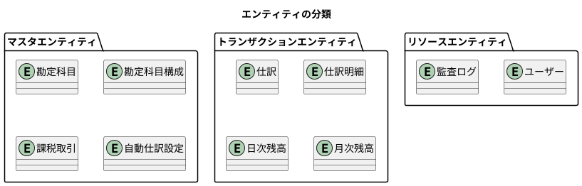

#### エンティティの種類

| 種類 | 説明 | 例 |
|------|------|-----|
| マスタエンティティ | 比較的変更が少ない基本情報 | 勘定科目、勘定科目構成、課税取引 |
| トランザクションエンティティ | 業務活動の記録 | 仕訳、仕訳明細、残高 |
| リソースエンティティ | システム運用に必要な情報 | ユーザー、監査ログ |

#### エンティティ識別のポイント

1. **独立して存在できるか**: 他のエンティティに依存せず、単独で意味を持つか
2. **一意に識別できるか**: 主キーによって各インスタンスを区別できるか
3. **複数のインスタンスを持つか**: 一覧として管理する必要があるか

### リレーションシップの設計

エンティティ間の関係を定義します。

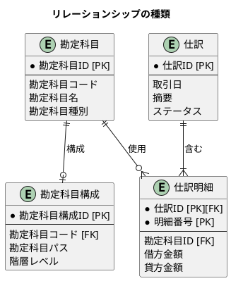

#### カーディナリティ（多重度）

| 記法 | 意味 | 例 |
|------|------|-----|
| `1:1` | 1対1 | 勘定科目 - 勘定科目構成 |
| `1:N` | 1対多 | 仕訳 - 仕訳明細 |
| `N:M` | 多対多 | 勘定科目 - 仕訳（仕訳明細を介して） |

#### 依存関係の種類

| 種類 | 説明 | 例 |
|------|------|-----|
| 識別依存 | 親の主キーが子の主キーの一部 | 仕訳 - 仕訳明細 |
| 非識別依存 | 親の主キーが子の外部キー | 勘定科目 - 仕訳明細 |

### 正規化と非正規化のトレードオフ

データの冗長性を排除しつつ、パフォーマンスを考慮した設計が必要です。

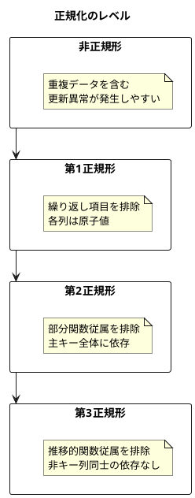

#### 本システムでの判断

| 観点 | 正規化 | 非正規化 |
|------|--------|----------|
| データ整合性 | 高い | 低い |
| 更新性能 | 高い | 低い |
| 参照性能 | 低い（結合が必要） | 高い |
| ストレージ | 少ない | 多い |

本システムでは、基本的に第3正規形を採用しつつ、以下の場合に非正規化を検討します。

- **勘定科目名の複製**: 仕訳明細に勘定科目名を保持（履歴保持のため）
- **残高の事前計算**: 日次・月次残高テーブルで集計済み残高を保持（集計性能のため）

---

## 4.2 財務会計システムの全体データモデル

### 主要エンティティの洗い出し

本システムの主要エンティティを以下に示します。

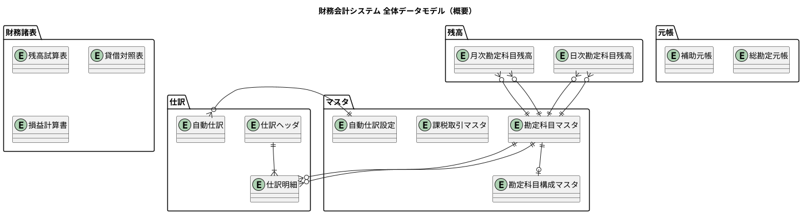

### 勘定科目の5分類

財務会計システムの基盤となる勘定科目は、以下の5つに分類されます。

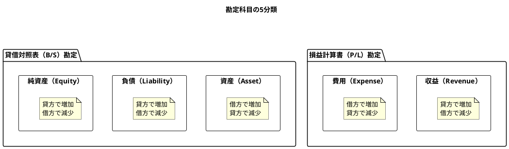

#### 勘定科目種別と残高計算

| 種別 | 正常残高 | 借方計上 | 貸方計上 |
|------|----------|----------|----------|
| 資産（Asset） | 借方 | 増加 | 減少 |
| 負債（Liability） | 貸方 | 減少 | 増加 |
| 純資産（Equity） | 貸方 | 減少 | 増加 |
| 収益（Revenue） | 貸方 | 減少 | 増加 |
| 費用（Expense） | 借方 | 増加 | 減少 |

### ドメイン境界の設定

システムを以下のドメイン境界で分割しています。

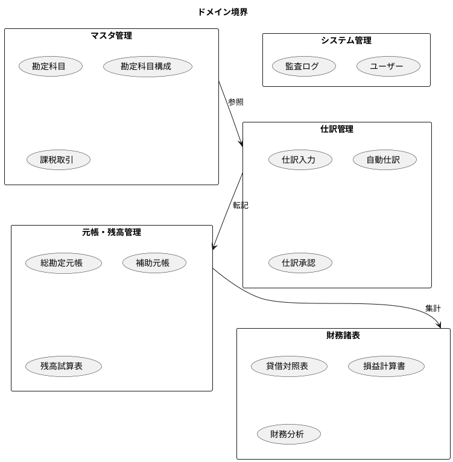

### データフローの可視化

財務会計プロセスにおけるデータの流れを示します。

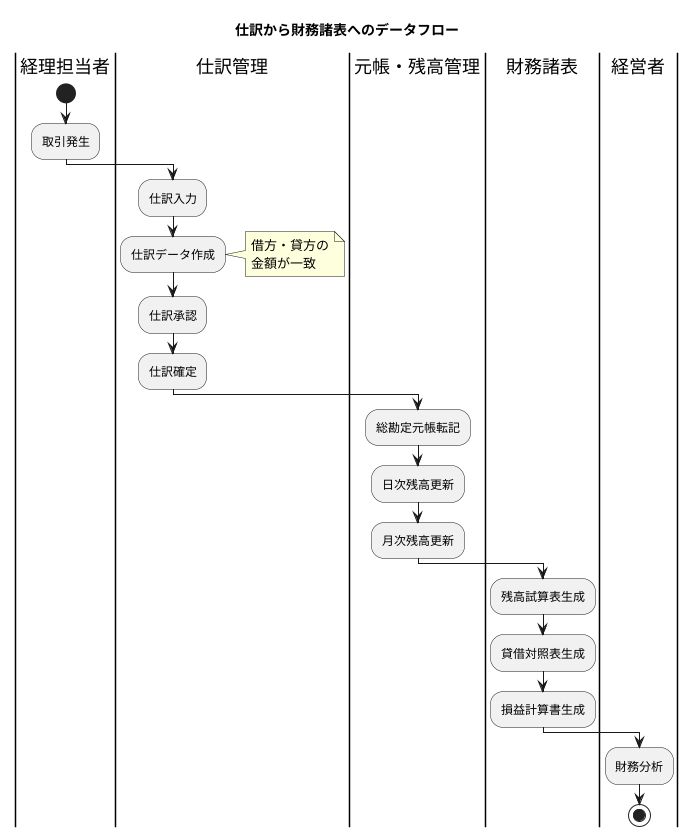

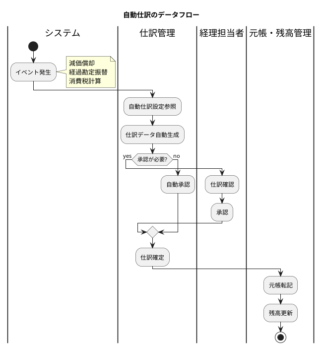

### 複式簿記の原理とデータモデル

複式簿記では、すべての取引を借方（デビット）と貸方（クレジット）に記録します。

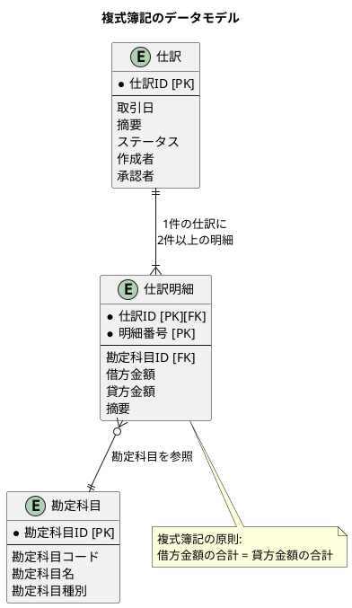

#### 仕訳の例

| 取引 | 借方 | 貸方 |
|------|------|------|
| 現金 100万円で商品を仕入 | 仕入 100万円 | 現金 100万円 |
| 売掛金で商品を販売 200万円 | 売掛金 200万円 | 売上 200万円 |
| 給与 50万円を現金で支払 | 給与 50万円 | 現金 50万円 |

---

## 4.3 JIG-ERD によるモデル可視化

### ER 図の自動生成

JIG-ERD は ER 図を自動生成するツールです。

```java
// テストコードで ER 図を生成
@Test
void generateErDiagram() {
    var output = Path.of("build/jig-erd");
    var packageName = "com.example.accounting.infrastructure.datasource";

    JigErd.run(output, packageName);
}
```

#### 生成コマンド

```bash
./gradlew test --tests "*JigErdTest*"
```

### 概要・サマリー・詳細の使い分け

JIG-ERD は3つのレベルの ER 図を生成します。

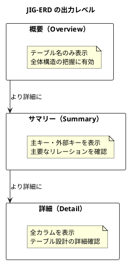

#### 各レベルの用途

| レベル | ファイル名 | 用途 |
|--------|-----------|------|
| 概要 | library-er-overview.svg | 全体構造の把握、新規メンバーへの説明 |
| サマリー | library-er-summary.svg | リレーションの確認、設計レビュー |
| 詳細 | library-er-detail.svg | 実装時の参照、テーブル定義の確認 |

### 設計レビューへの活用

JIG-ERD で生成した ER 図は、以下の場面で活用します。

#### リリースごとのアーカイブ

```
docs/assets/release/
├── v0_1_0/
│   └── jig-erd/
│       ├── library-er-overview.svg
│       ├── library-er-summary.svg
│       └── library-er-detail.svg
├── v0_2_0/
│   └── jig-erd/
│       └── ...
└── v0_11_0/
    └── jig-erd/
        └── ...
```

#### 変更の追跡

バージョン間の ER 図を比較することで、データモデルの変更を視覚的に追跡できます。

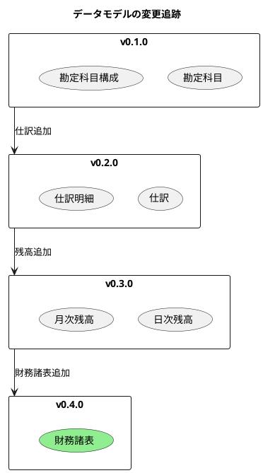

---

## 4.4 主要テーブル一覧

本システムの主要テーブルを以下に示します。

### マスタ系テーブル

| テーブル名 | 説明 | 主キー |
|-----------|------|--------|
| 勘定科目マスタ | 勘定科目の基本情報 | 勘定科目ID |
| 勘定科目構成マスタ | 勘定科目の階層構造 | 勘定科目構成ID |
| 課税取引マスタ | 消費税の課税区分 | 課税取引コード |
| 自動仕訳設定 | 自動仕訳のテンプレート | 自動仕訳設定ID |

### トランザクション系テーブル

| テーブル名 | 説明 | 主キー |
|-----------|------|--------|
| 仕訳 | 仕訳ヘッダ情報 | 仕訳ID |
| 仕訳明細 | 仕訳の借方・貸方明細 | 仕訳ID, 明細番号 |
| 自動仕訳 | 自動生成された仕訳 | 自動仕訳ID |

### 残高系テーブル

| テーブル名 | 説明 | 主キー |
|-----------|------|--------|
| 日次勘定科目残高 | 日単位の勘定科目残高 | 勘定科目ID, 計上日 |
| 月次勘定科目残高 | 月単位の勘定科目残高 | 勘定科目ID, 会計年月 |

### システム系テーブル

| テーブル名 | 説明 | 主キー |
|-----------|------|--------|
| ユーザー | システムユーザー情報 | ユーザーID |
| 監査ログ | 操作履歴・変更追跡 | 監査ログID |

---

## 4.5 TDD によるデータモデル設計

### テスト駆動でテーブルを育てる

本書では、TDD の原則をデータベース設計に応用します。

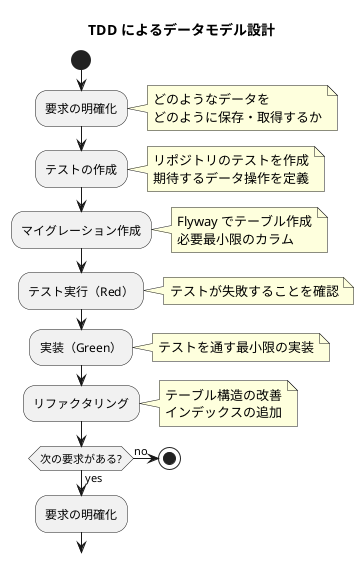

### 段階的なスキーマ進化

各章で以下のようにスキーマを進化させていきます。

| 章 | 追加されるテーブル | 目的 |
|----|-------------------|------|
| 第5章 | 勘定科目マスタ、勘定科目構成マスタ | マスタデータの管理 |
| 第6章 | 仕訳、仕訳明細、自動仕訳 | 取引の記録 |
| 第7章 | 日次残高、月次残高 | 残高の管理 |
| 第8章 | （ビュー）財務諸表 | 財務諸表の生成 |

---

## まとめ

本章では、データモデル設計の基礎について解説しました。

- **エンティティの識別**: マスタ、トランザクション、リソースの3種類に分類
- **リレーションシップ**: カーディナリティと依存関係の設計
- **正規化**: 第3正規形を基本とし、必要に応じて非正規化
- **全体モデル**: マスタ、仕訳、残高、財務諸表のドメイン境界
- **複式簿記**: 借方・貸方のバランスを保証するデータモデル
- **JIG-ERD**: 概要・サマリー・詳細の3レベルで可視化
- **TDD アプローチ**: テスト駆動でデータモデルを段階的に育てる

次章では、マスタデータモデル（勘定科目マスタ、勘定科目構成マスタ）の詳細について解説します。
