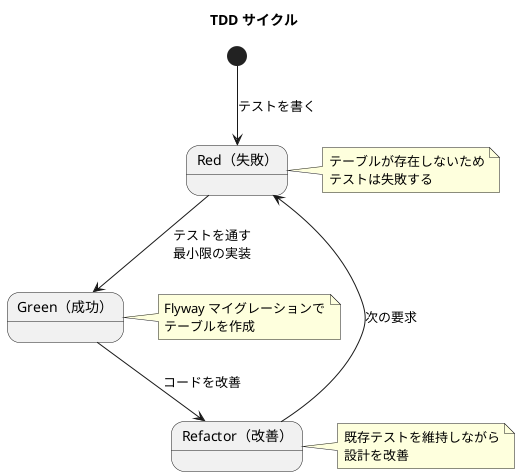
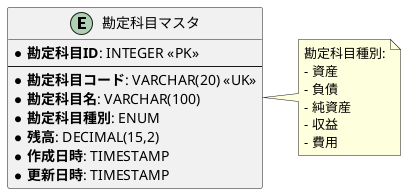
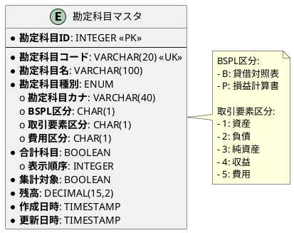
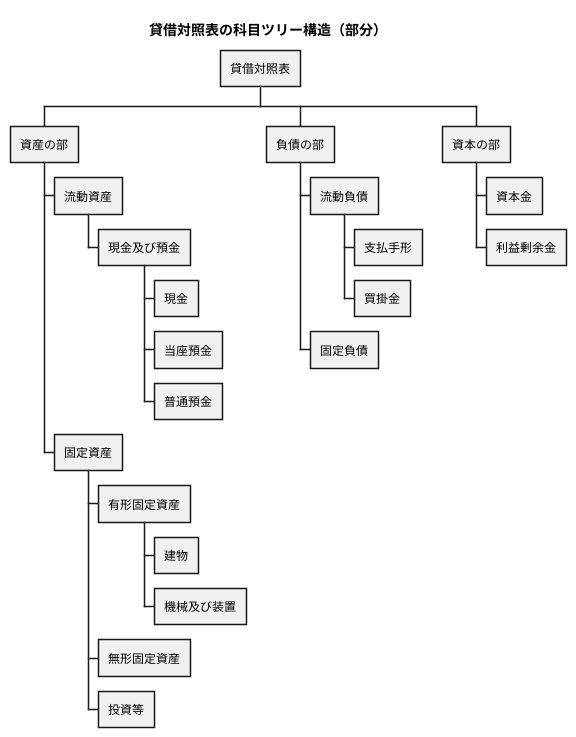
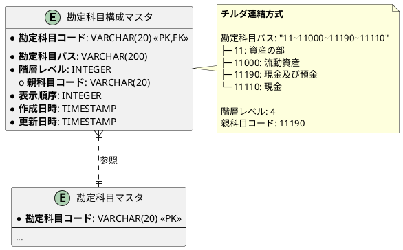
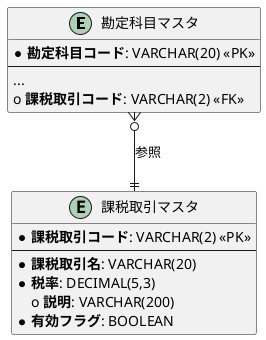
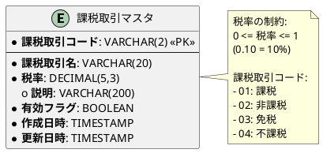
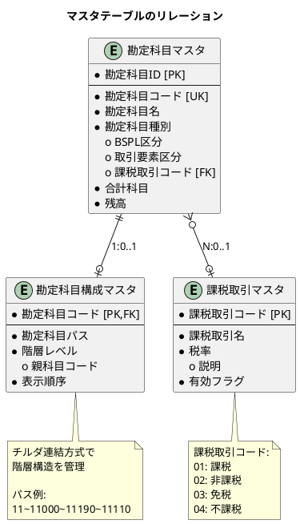

# 第5章: マスタデータモデル

## 5.1 勘定科目マスタのテーブル設計

### 最初の要求「勘定科目を管理したい」

財務会計システムの基礎となる「勘定科目」を管理するためのテーブルを設計します。TDD のアプローチで、最小限の機能から始めて段階的に機能を拡張していきます。

#### TDD サイクル：Red → Green → Refactor



### Red：失敗するテストを書く

TDD の最初のステップは「失敗するテストを書く」ことです。データベース設計において、これは「どのようなデータを、どのように扱いたいか」を具体的なコードで示すことに相当します。

```java
/**
 * 勘定科目マスタのテスト
 */
@Testcontainers
@TestMethodOrder(MethodOrderer.OrderAnnotation.class)
class AccountTest {

    @Container
    static PostgreSQLContainer<?> postgres = new PostgreSQLContainer<>("postgres:16-alpine")
            .withDatabaseName("testdb")
            .withUsername("testuser")
            .withPassword("testpass");

    @Test
    @Order(1)
    @DisplayName("勘定科目を登録できる")
    void testCreateAccount() throws SQLException {
        String sql = """
            INSERT INTO "勘定科目マスタ" ("勘定科目コード", "勘定科目名", "勘定科目種別", "残高")
            VALUES (?, ?, ?::account_type, ?)
            RETURNING "勘定科目ID", "勘定科目コード", "勘定科目名", "勘定科目種別", "残高"
            """;

        try (PreparedStatement pstmt = connection.prepareStatement(sql)) {
            pstmt.setString(1, "1000");
            pstmt.setString(2, "現金");
            pstmt.setString(3, "資産");
            pstmt.setBigDecimal(4, new BigDecimal("50000.00"));

            ResultSet rs = pstmt.executeQuery();

            assertThat(rs.next()).isTrue();
            assertThat(rs.getString("勘定科目コード")).isEqualTo("1000");
            assertThat(rs.getString("勘定科目名")).isEqualTo("現金");
            assertThat(rs.getString("勘定科目種別")).isEqualTo("資産");
        }
    }

    @Test
    @Order(2)
    @DisplayName("勘定科目種別でフィルタリングできる")
    void testFilterAccountsByType() throws SQLException {
        // 複数の勘定科目を登録
        insertAccount("1000", "現金", "資産", "50000.00");
        insertAccount("2000", "買掛金", "負債", "30000.00");
        insertAccount("3000", "資本金", "純資産", "100000.00");

        // 資産勘定のみを取得
        String sql = """
            SELECT "勘定科目名"
            FROM "勘定科目マスタ"
            WHERE "勘定科目種別" = ?::account_type
            """;

        List<String> assetNames = new ArrayList<>();
        try (PreparedStatement pstmt = connection.prepareStatement(sql)) {
            pstmt.setString(1, "資産");
            ResultSet rs = pstmt.executeQuery();
            while (rs.next()) {
                assetNames.add(rs.getString("勘定科目名"));
            }
        }

        assertThat(assetNames).hasSize(1);
        assertThat(assetNames).containsExactly("現金");
    }
}
```

**実行結果（Red - 失敗）**：

```bash
AccountTest > testCreateAccount() FAILED
    java.sql.SQLException: ERROR: relation "勘定科目マスタ" does not exist
```

テーブルが存在しないためテストは失敗します。これが正しい TDD の最初のステップです。

### Green：Flyway マイグレーションでテーブルを作成

テストを通す最小限の実装として、Flyway マイグレーションファイルでテーブルを作成します。

**V001__create_account_master.sql**:

```sql
-- 勘定科目種別のenum型を作成
DO $$ BEGIN
    CREATE TYPE account_type AS ENUM ('資産', '負債', '純資産', '収益', '費用');
EXCEPTION
    WHEN duplicate_object THEN null;
END $$;

-- 勘定科目マスタテーブルを作成
CREATE TABLE IF NOT EXISTS "勘定科目マスタ" (
    "勘定科目ID" SERIAL PRIMARY KEY,
    "勘定科目コード" VARCHAR(20) UNIQUE NOT NULL,
    "勘定科目名" VARCHAR(100) NOT NULL,
    "勘定科目種別" account_type NOT NULL,
    "残高" DECIMAL(15,2) DEFAULT 0 NOT NULL,
    "作成日時" TIMESTAMP DEFAULT CURRENT_TIMESTAMP NOT NULL,
    "更新日時" TIMESTAMP DEFAULT CURRENT_TIMESTAMP NOT NULL
);

-- テーブルコメント
COMMENT ON TABLE "勘定科目マスタ" IS
    '勘定科目マスタ（財務会計システムの基本となる勘定科目情報）';

-- カラムコメント
COMMENT ON COLUMN "勘定科目マスタ"."勘定科目ID" IS '勘定科目ID（主キー）';
COMMENT ON COLUMN "勘定科目マスタ"."勘定科目コード" IS '勘定科目コード（例：1000, 2000）';
COMMENT ON COLUMN "勘定科目マスタ"."勘定科目名" IS '勘定科目名（例：現金、売掛金）';
COMMENT ON COLUMN "勘定科目マスタ"."勘定科目種別" IS '勘定科目種別（資産、負債、純資産、収益、費用）';
COMMENT ON COLUMN "勘定科目マスタ"."残高" IS '残高';
```

**実行結果（Green - 成功）**：

```bash
AccountTest > testCreateAccount() PASSED
AccountTest > testFilterAccountsByType() PASSED

BUILD SUCCESSFUL
6 tests passed
```

### 勘定科目マスタの ER 図



---

## 5.2 勘定科目マスタの項目定義

### 実務で必要な項目

財務会計システムで必要となる勘定科目マスタの項目を以下に示します。

| 項目名 | 説明 | データ型 |
|--------|------|----------|
| 勘定科目コード | 勘定科目を一意に識別するコード | VARCHAR(20) |
| 勘定科目名 | 勘定科目の正式名称 | VARCHAR(100) |
| 勘定科目略名 | 画面表示用の短縮名称 | VARCHAR(40) |
| 勘定科目カナ | 検索用のカナ表記 | VARCHAR(40) |
| BSPL区分 | 貸借対照表か損益計算書かの区分 | CHAR(1) |
| 貸借区分 | 借方か貸方かの区分 | CHAR(1) |
| 取引要素区分 | 資産、負債、純資産、収益、費用の分類 | CHAR(1) |
| 合計科目 | 集計科目かどうかのフラグ | BOOLEAN |
| 表示順序 | 財務諸表での表示順 | INTEGER |
| 集計対象 | 集計対象かどうかのフラグ | BOOLEAN |

### BSPL区分と貸借区分

**BSPL区分**は、勘定科目が財務諸表のどこに表示されるかを示します。

| 区分 | 説明 | 対象勘定科目種別 |
|------|------|------------------|
| B | 貸借対照表（Balance Sheet） | 資産、負債、純資産 |
| P | 損益計算書（Profit and Loss） | 収益、費用 |

**貸借区分**は、勘定科目の増加がどちら側に記帳されるかを示します。

| 区分 | 説明 | 対象勘定科目種別 |
|------|------|------------------|
| 借方（Debit） | 資産の増加、費用の発生 | 資産、費用 |
| 貸方（Credit） | 負債・純資産の増加、収益の発生 | 負債、純資産、収益 |

### 取引要素区分と集計区分

**取引要素区分**は、会計の5要素を明示的に管理します。

| 区分 | 説明 |
|------|------|
| 1 | 資産 |
| 2 | 負債 |
| 3 | 純資産 |
| 4 | 収益 |
| 5 | 費用 |

**集計区分**は、勘定科目の階層構造における役割を示します。

| 区分 | 説明 | 例 |
|------|------|-----|
| 見出科目 | 勘定科目の大分類 | 「資産の部」「流動資産」 |
| 集計科目 | 複数の明細科目を集計する科目 | 「現金及び預金」 |
| 明細科目 | 実際に仕訳入力される科目 | 「現金」「普通預金」 |

### TDD でリファクタリング：項目の追加

**V002__add_account_fields.sql**:

```sql
-- 勘定科目マスタに実務項目を追加

-- BSPL区分を追加
ALTER TABLE "勘定科目マスタ"
    ADD COLUMN "BSPL区分" CHAR(1);

-- 取引要素区分を追加
ALTER TABLE "勘定科目マスタ"
    ADD COLUMN "取引要素区分" CHAR(1);

-- 費用区分を追加
ALTER TABLE "勘定科目マスタ"
    ADD COLUMN "費用区分" CHAR(1);

-- 合計科目フラグを追加
ALTER TABLE "勘定科目マスタ"
    ADD COLUMN "合計科目" BOOLEAN DEFAULT false NOT NULL;

-- 表示順序を追加
ALTER TABLE "勘定科目マスタ"
    ADD COLUMN "表示順序" INTEGER;

-- 集計対象フラグを追加
ALTER TABLE "勘定科目マスタ"
    ADD COLUMN "集計対象" BOOLEAN DEFAULT true NOT NULL;

-- 勘定科目カナを追加
ALTER TABLE "勘定科目マスタ"
    ADD COLUMN "勘定科目カナ" VARCHAR(40);

-- コメント追加
COMMENT ON COLUMN "勘定科目マスタ"."BSPL区分" IS
    'BSPL区分（B:貸借対照表, P:損益計算書）';

COMMENT ON COLUMN "勘定科目マスタ"."取引要素区分" IS
    '取引要素区分（1:資産, 2:負債, 3:純資産, 4:収益, 5:費用）';

COMMENT ON COLUMN "勘定科目マスタ"."費用区分" IS
    '費用区分（1:売上原価, 2:販売費及び一般管理費, 3:営業外費用）';

COMMENT ON COLUMN "勘定科目マスタ"."合計科目" IS
    '合計科目（true: 集計科目, false: 明細科目）';

COMMENT ON COLUMN "勘定科目マスタ"."表示順序" IS
    '表示順序（財務諸表での表示順）';

COMMENT ON COLUMN "勘定科目マスタ"."集計対象" IS
    '集計対象（true: 集計対象, false: 集計対象外）';

COMMENT ON COLUMN "勘定科目マスタ"."勘定科目カナ" IS
    '勘定科目カナ（検索用）';
```

### 拡張後の ER 図



---

## 5.3 勘定科目構成マスタの設計

### チルダ連結方式による階層管理

勘定科目は階層構造を持ちます。この階層構造を効率的に管理するため、**チルダ連結方式**を採用します。



### 科目ツリー構造の表現

チルダ連結方式では、勘定科目のパスを `~`（チルダ）で連結した文字列として保存します。

**勘定科目マスタのデータ例：**

| 勘定科目コード | 勘定科目名 | BSPL区分 | 勘定科目種別 | 合計科目 |
|----------------|------------|----------|--------------|----------|
| 11 | 資産の部 | B | 資産 | true |
| 11000 | 流動資産 | B | 資産 | true |
| 11190 | 現金及び預金 | B | 資産 | true |
| 11110 | 現金 | B | 資産 | false |
| 11120 | 当座預金 | B | 資産 | false |
| 11130 | 普通預金 | B | 資産 | false |

**勘定科目構成マスタのデータ例：**

| 勘定科目コード | 勘定科目パス | 階層レベル | 親科目コード |
|----------------|--------------|------------|--------------|
| 11 | 11 | 1 | NULL |
| 11000 | 11~11000 | 2 | 11 |
| 11190 | 11~11000~11190 | 3 | 11000 |
| 11110 | 11~11000~11190~11110 | 4 | 11190 |
| 11120 | 11~11000~11190~11120 | 4 | 11190 |
| 11130 | 11~11000~11190~11130 | 4 | 11190 |

### チルダ連結方式の利点

| 利点 | 説明 |
|------|------|
| シンプルなデータ構造 | 親子関係を1つのカラムで表現、追加のテーブル結合不要 |
| 効率的な階層検索 | LIKE 演算子で子孫科目を一括取得 |
| 集計処理の高速化 | 特定科目配下の残高集計が容易 |
| 柔軟な階層構造 | 任意の深さの階層に対応、構造変更が容易 |

### 科目残高集計の実装

チルダ連結を使った場合の科目残高集計 SQL：

```sql
-- 「現金及び預金」（コード11190）配下のすべての勘定科目の残高を集計
SELECT SUM(a."残高") as 合計残高
FROM "勘定科目マスタ" a
JOIN "勘定科目構成マスタ" s ON a."勘定科目コード" = s."勘定科目コード"
WHERE s."勘定科目パス" LIKE '%~11190~%'
   OR s."勘定科目コード" = '11190';
```

このクエリにより、「現金及び預金」配下のすべての勘定科目（現金、当座預金、普通預金）の残高を効率的に集計できます。

---

## 5.4 勘定科目構成マスタのテーブル設計

### ER 図



### Flyway マイグレーション

**V006__create_account_structure.sql**:

```sql
-- 勘定科目構成マスタ
CREATE TABLE IF NOT EXISTS "勘定科目構成マスタ" (
    "勘定科目コード" VARCHAR(20) PRIMARY KEY,
    "勘定科目パス" VARCHAR(200) NOT NULL,
    "階層レベル" INTEGER NOT NULL DEFAULT 1,
    "親科目コード" VARCHAR(20),
    "表示順序" INTEGER NOT NULL DEFAULT 0,
    "作成日時" TIMESTAMP NOT NULL DEFAULT CURRENT_TIMESTAMP,
    "更新日時" TIMESTAMP NOT NULL DEFAULT CURRENT_TIMESTAMP,
    CONSTRAINT fk_account_structure_account
        FOREIGN KEY ("勘定科目コード")
        REFERENCES "勘定科目マスタ"("勘定科目コード")
        ON DELETE CASCADE
);

COMMENT ON TABLE "勘定科目構成マスタ" IS '勘定科目の階層構造を管理するマスタテーブル';
COMMENT ON COLUMN "勘定科目構成マスタ"."勘定科目コード" IS '勘定科目コード';
COMMENT ON COLUMN "勘定科目構成マスタ"."勘定科目パス" IS 'チルダ連結形式のパス（例: 11~11000~11190~11110）';
COMMENT ON COLUMN "勘定科目構成マスタ"."階層レベル" IS '階層の深さ（ルート=1）';
COMMENT ON COLUMN "勘定科目構成マスタ"."親科目コード" IS '親科目のコード';
COMMENT ON COLUMN "勘定科目構成マスタ"."表示順序" IS '同じ階層内での表示順序';

-- パスでの検索を高速化するためのインデックス
CREATE INDEX IF NOT EXISTS idx_account_structure_path
    ON "勘定科目構成マスタ" ("勘定科目パス");

-- 親科目での検索を高速化するためのインデックス
CREATE INDEX IF NOT EXISTS idx_account_structure_parent
    ON "勘定科目構成マスタ" ("親科目コード")
    WHERE "親科目コード" IS NOT NULL;

-- 階層レベルでの検索を高速化するためのインデックス
CREATE INDEX IF NOT EXISTS idx_account_structure_level
    ON "勘定科目構成マスタ" ("階層レベル");
```

### MyBatis マッパー

```java
public interface AccountStructureMapper {
    void insert(AccountStructure accountStructure);
    AccountStructure findByCode(@Param("accountCode") String accountCode);
    List<AccountStructure> findAll();
    List<AccountStructure> findChildren(@Param("accountCode") String accountCode);
    List<AccountStructure> findDescendants(@Param("accountCode") String accountCode);
    List<AccountStructure> findByLevel(@Param("hierarchyLevel") Integer hierarchyLevel);
    void update(AccountStructure accountStructure);
    void delete(@Param("accountCode") String accountCode);
}
```

**AccountStructureMapper.xml**（抜粋）:

```xml
<!-- 特定科目配下のすべての子孫を取得（チルダ連結検索） -->
<select id="findDescendants" resultMap="AccountStructureResultMap">
    SELECT * FROM "勘定科目構成マスタ"
    WHERE "勘定科目パス" LIKE CONCAT(
        (SELECT "勘定科目パス" FROM "勘定科目構成マスタ"
         WHERE "勘定科目コード" = #{accountCode}),
        '~%'
    )
    ORDER BY "表示順序"
</select>

<!-- 直接の子科目のみを取得 -->
<select id="findChildren" resultMap="AccountStructureResultMap">
    SELECT * FROM "勘定科目構成マスタ"
    WHERE "親科目コード" = #{accountCode}
    ORDER BY "表示順序"
</select>
```

---

## 5.5 課税取引マスタの設計

### 消費税計算のための課税取引マスタ

消費税計算を正確に行うため、勘定科目マスタは課税取引マスタと関連付けられます。



### 課税取引の種類

| 課税取引コード | 課税取引名 | 税率 | 説明 |
|----------------|------------|------|------|
| 01 | 課税 | 10% | 消費税が課税される取引 |
| 02 | 非課税 | 0% | 消費税が非課税の取引（土地の譲渡、住宅の貸付など） |
| 03 | 免税 | 0% | 消費税が免税の取引（輸出取引など） |
| 04 | 不課税 | 0% | 消費税の対象外の取引（給与、配当など） |

### Flyway マイグレーション

**V007__create_tax_transaction.sql**:

```sql
-- 課税取引マスタ
CREATE TABLE IF NOT EXISTS "課税取引マスタ" (
    "課税取引コード" VARCHAR(2) PRIMARY KEY,
    "課税取引名" VARCHAR(20) NOT NULL,
    "税率" DECIMAL(5, 3) NOT NULL DEFAULT 0.000,
    "説明" VARCHAR(200),
    "有効フラグ" BOOLEAN NOT NULL DEFAULT true,
    "作成日時" TIMESTAMP NOT NULL DEFAULT CURRENT_TIMESTAMP,
    "更新日時" TIMESTAMP NOT NULL DEFAULT CURRENT_TIMESTAMP,
    CONSTRAINT check_tax_rate CHECK ("税率" >= 0 AND "税率" <= 1)
);

COMMENT ON TABLE "課税取引マスタ" IS '消費税の課税取引区分を管理するマスタテーブル';
COMMENT ON COLUMN "課税取引マスタ"."課税取引コード" IS '課税取引コード（01:課税、02:非課税、03:免税、04:不課税）';
COMMENT ON COLUMN "課税取引マスタ"."課税取引名" IS '課税取引名';
COMMENT ON COLUMN "課税取引マスタ"."税率" IS '適用される税率（0.10 = 10%）';
COMMENT ON COLUMN "課税取引マスタ"."説明" IS '課税取引の説明';
COMMENT ON COLUMN "課税取引マスタ"."有効フラグ" IS '有効な課税取引区分かどうか';

-- 初期データ投入
INSERT INTO "課税取引マスタ" ("課税取引コード", "課税取引名", "税率", "説明") VALUES
    ('01', '課税', 0.10, '消費税が課税される取引'),
    ('02', '非課税', 0.000, '消費税が非課税の取引（土地の譲渡、住宅の貸付など）'),
    ('03', '免税', 0.000, '消費税が免税の取引（輸出取引など）'),
    ('04', '不課税', 0.000, '消費税の対象外の取引（給与、配当など）');

-- 勘定科目マスタに外部キー制約を追加
ALTER TABLE "勘定科目マスタ"
    ADD CONSTRAINT fk_account_tax_code
    FOREIGN KEY ("課税取引コード")
    REFERENCES "課税取引マスタ"("課税取引コード")
    ON DELETE SET NULL;
```

### ER 図



### MyBatis マッパー（動的 SQL）

```java
public interface TaxTransactionMapper {
    void insert(TaxTransaction taxTransaction);
    TaxTransaction findByCode(@Param("taxCode") String taxCode);
    List<TaxTransaction> findAll();
    List<TaxTransaction> search(
            @Param("taxName") String taxName,
            @Param("minTaxRate") BigDecimal minTaxRate,
            @Param("isActive") Boolean isActive
    );
    void update(TaxTransaction taxTransaction);
    void delete(@Param("taxCode") String taxCode);
}
```

**TaxTransactionMapper.xml**（動的 SQL による条件検索）:

```xml
<!-- 動的 SQL による条件検索 -->
<select id="search" resultMap="TaxTransactionResultMap">
    SELECT * FROM "課税取引マスタ"
    <where>
        <if test="taxName != null and taxName != ''">
            AND "課税取引名" LIKE CONCAT('%', #{taxName}, '%')
        </if>
        <if test="minTaxRate != null">
            AND "税率" >= #{minTaxRate}
        </if>
        <if test="isActive != null">
            AND "有効フラグ" = #{isActive}
        </if>
    </where>
    ORDER BY "課税取引コード"
</select>
```

### 勘定科目マスタとの関連

勘定科目マスタに課税取引コードを追加することで、各勘定科目の消費税処理を自動化できます。

```sql
-- 勘定科目マスタに課税取引コードを追加
ALTER TABLE "勘定科目マスタ"
    ADD COLUMN "課税取引コード" VARCHAR(2);

COMMENT ON COLUMN "勘定科目マスタ"."課税取引コード" IS
    '課税取引コード（課税取引マスタへの外部キー）';

-- インデックス作成
CREATE INDEX IF NOT EXISTS idx_account_tax_code
    ON "勘定科目マスタ" ("課税取引コード")
    WHERE "課税取引コード" IS NOT NULL;
```

---

## 5.6 階層構造のテスト

### 子孫科目の取得テスト

```java
@Test
@DisplayName("特定科目配下の子孫を取得できる（チルダ連結検索）")
void testFindDescendants() {
    // 1. テストデータの作成
    // 資産の部 → 流動資産 → 現金及び預金 → 現金、当座預金、普通預金
    insertAccountWithStructure("11", "資産の部", "11", 1, null);
    insertAccountWithStructure("11000", "流動資産", "11~11000", 2, "11");
    insertAccountWithStructure("11190", "現金及び預金", "11~11000~11190", 3, "11000");
    insertAccountWithStructure("11110", "現金", "11~11000~11190~11110", 4, "11190");
    insertAccountWithStructure("11120", "当座預金", "11~11000~11190~11120", 4, "11190");
    insertAccountWithStructure("11130", "普通預金", "11~11000~11190~11130", 4, "11190");

    // 2. 「現金及び預金」配下の子孫を取得
    List<AccountStructure> descendants = accountStructureMapper.findDescendants("11190");

    // 3. 検証
    assertThat(descendants).hasSize(3);
    assertThat(descendants)
        .extracting(AccountStructure::getAccountCode)
        .containsExactlyInAnyOrder("11110", "11120", "11130");
}
```

### 残高集計テスト

```java
@Test
@DisplayName("階層配下の残高を集計できる")
void testSumBalanceByHierarchy() {
    // 1. テストデータの作成（残高付き）
    insertAccountWithBalance("11190", "現金及び預金", BigDecimal.ZERO);
    insertAccountWithBalance("11110", "現金", new BigDecimal("100000"));
    insertAccountWithBalance("11120", "当座預金", new BigDecimal("500000"));
    insertAccountWithBalance("11130", "普通預金", new BigDecimal("300000"));

    // 2. 階層構造の設定
    insertStructure("11190", "11~11000~11190", 3, "11000");
    insertStructure("11110", "11~11000~11190~11110", 4, "11190");
    insertStructure("11120", "11~11000~11190~11120", 4, "11190");
    insertStructure("11130", "11~11000~11190~11130", 4, "11190");

    // 3. 「現金及び預金」配下の残高を集計
    BigDecimal totalBalance = accountRepository.sumBalanceByHierarchy("11190");

    // 4. 検証
    assertThat(totalBalance).isEqualByComparingTo(new BigDecimal("900000"));
}
```

---

## 5.7 主要テーブル一覧

### マスタ系テーブル（第5章で作成）

| テーブル名 | 説明 | 主キー |
|-----------|------|--------|
| 勘定科目マスタ | 勘定科目の基本情報 | 勘定科目ID |
| 勘定科目構成マスタ | 勘定科目の階層構造 | 勘定科目コード |
| 課税取引マスタ | 消費税の課税区分 | 課税取引コード |

### テーブル間のリレーション



---

## まとめ

本章では、マスタデータモデルについて解説しました。

- **勘定科目マスタ**: 財務会計システムの基礎となる勘定科目情報を管理
- **TDD サイクル**: Red → Green → Refactor で段階的にテーブルを設計
- **項目定義**: BSPL区分、取引要素区分、合計科目などの実務項目
- **勘定科目構成マスタ**: 勘定科目の階層構造を管理
- **チルダ連結方式**: `~` で連結したパス文字列による効率的な階層管理
- **課税取引マスタ**: 消費税の課税区分（課税、非課税、免税、不課税）を管理
- **階層検索**: LIKE 演算子による子孫科目の一括取得
- **動的 SQL**: MyBatis の動的 SQL による柔軟な条件検索

次章では、トランザクションデータモデル（仕訳テーブル、自動仕訳テーブル）について解説します。
