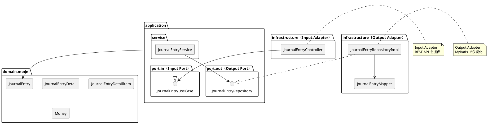
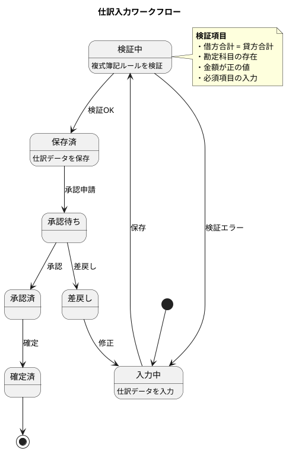

# 第13章: 仕訳入力

## 13.1 本章の概要

本章では、第3章で解説したヘキサゴナルアーキテクチャに従い、仕訳入力の機能実装を TDD で進めます。第6章で設計した3層構造の仕訳テーブルを基に、仕訳ワークフロー、借方・貸方の管理、仕訳ルールの検証機能を実装します。

### アーキテクチャの全体像



### パッケージ構成

```
com.example.accounting/
├── domain/
│   └── model/
│       └── journal/
│           ├── JournalEntry.java           # 仕訳（集約ルート）
│           ├── JournalEntryDetail.java     # 仕訳明細
│           ├── JournalEntryDetailItem.java # 仕訳貸借明細
│           ├── JournalEntryNumber.java     # 仕訳伝票番号（値オブジェクト）
│           ├── Money.java                  # 金額（値オブジェクト）
│           ├── DebitCreditType.java        # 貸借区分（列挙型）
│           └── JournalStatus.java          # 仕訳ステータス（列挙型）
├── application/
│   ├── port/
│   │   ├── in/
│   │   │   ├── JournalEntryUseCase.java    # Input Port
│   │   │   └── command/
│   │   │       └── CreateJournalEntryCommand.java
│   │   └── out/
│   │       └── JournalEntryRepository.java # Output Port
│   └── service/
│       └── JournalEntryService.java        # Application Service
└── infrastructure/
    ├── persistence/
    │   ├── mapper/
    │   │   └── JournalEntryMapper.java     # MyBatis Mapper
    │   └── repository/
    │       └── JournalEntryRepositoryImpl.java  # Output Adapter
    └── web/
        ├── controller/
        │   └── JournalEntryController.java # Input Adapter
        └── dto/
            ├── JournalEntryRequest.java
            └── JournalEntryResponse.java
```

### TDD の流れ

1. **Domain Model**: ドメインモデルの作成（JournalEntry, JournalEntryDetail, JournalEntryDetailItem, Money）
2. **Output Port**: リポジトリインターフェースの定義
3. **Output Adapter**: Testcontainers でリポジトリ実装をテスト
4. **Input Port**: ユースケースインターフェースの定義
5. **Application Service**: Mockito でアプリケーションサービスをテスト
6. **Input Adapter**: Testcontainers で REST API 統合テスト

---

## 13.2 仕訳入力の基礎知識

### 仕訳ワークフロー



### 3層構造と複式簿記

第6章で設計した3層構造は、複式簿記の原理を正確に表現します。

| 層 | テーブル | 役割 | 複式簿記での位置づけ |
|---|----------|------|-------------------|
| 第1層 | 仕訳 | 伝票単位の基本情報 | 仕訳伝票ヘッダー |
| 第2層 | 仕訳明細 | 行単位の情報 | 仕訳行（摘要を保持） |
| 第3層 | 仕訳貸借明細 | 借方・貸方の詳細 | 借方エントリ・貸方エントリ |

### 複式簿記の基本ルール

```
借方合計 = 貸方合計
```

この等式が成り立たない仕訳は無効です。システムでこの制約を強制します。

---

## 13.3 Domain Model の実装

### 13.3.1 Money 値オブジェクト

```java
package com.example.accounting.domain.model.journal;

import java.math.BigDecimal;
import java.math.RoundingMode;
import java.util.Objects;

/**
 * 金額（値オブジェクト）
 */
public final class Money {

    public static final Money ZERO = new Money(BigDecimal.ZERO, "JPY");

    private final BigDecimal amount;
    private final String currencyCode;

    public Money(BigDecimal amount, String currencyCode) {
        Objects.requireNonNull(amount, "金額は必須です");
        Objects.requireNonNull(currencyCode, "通貨コードは必須です");

        if (amount.compareTo(BigDecimal.ZERO) < 0) {
            throw new IllegalArgumentException("金額は0以上である必要があります");
        }

        this.amount = amount.setScale(2, RoundingMode.HALF_UP);
        this.currencyCode = currencyCode;
    }

    public static Money of(BigDecimal amount) {
        return new Money(amount, "JPY");
    }

    public static Money of(long amount) {
        return new Money(BigDecimal.valueOf(amount), "JPY");
    }

    public BigDecimal getAmount() {
        return amount;
    }

    public String getCurrencyCode() {
        return currencyCode;
    }

    public Money add(Money other) {
        validateSameCurrency(other);
        return new Money(this.amount.add(other.amount), this.currencyCode);
    }

    public Money subtract(Money other) {
        validateSameCurrency(other);
        BigDecimal result = this.amount.subtract(other.amount);
        if (result.compareTo(BigDecimal.ZERO) < 0) {
            throw new IllegalArgumentException("減算結果が負になります");
        }
        return new Money(result, this.currencyCode);
    }

    public boolean isZero() {
        return amount.compareTo(BigDecimal.ZERO) == 0;
    }

    public boolean isGreaterThan(Money other) {
        validateSameCurrency(other);
        return this.amount.compareTo(other.amount) > 0;
    }

    private void validateSameCurrency(Money other) {
        if (!this.currencyCode.equals(other.currencyCode)) {
            throw new IllegalArgumentException(
                "通貨コードが異なります: " + this.currencyCode + " vs " + other.currencyCode);
        }
    }

    @Override
    public boolean equals(Object o) {
        if (this == o) return true;
        if (o == null || getClass() != o.getClass()) return false;
        Money money = (Money) o;
        return amount.compareTo(money.amount) == 0 &&
               currencyCode.equals(money.currencyCode);
    }

    @Override
    public int hashCode() {
        return Objects.hash(amount, currencyCode);
    }

    @Override
    public String toString() {
        return amount + " " + currencyCode;
    }
}
```

### 13.3.2 JournalEntryNumber 値オブジェクト

```java
package com.example.accounting.domain.model.journal;

import java.time.LocalDate;
import java.time.format.DateTimeFormatter;
import java.util.Objects;
import java.util.concurrent.atomic.AtomicInteger;

/**
 * 仕訳伝票番号（値オブジェクト）
 */
public final class JournalEntryNumber {

    private static final DateTimeFormatter DATE_FORMAT = DateTimeFormatter.ofPattern("yyyyMMdd");
    private static final AtomicInteger SEQUENCE = new AtomicInteger(0);

    private final String value;

    private JournalEntryNumber(String value) {
        Objects.requireNonNull(value, "仕訳伝票番号は必須です");
        if (value.isBlank()) {
            throw new IllegalArgumentException("仕訳伝票番号は空にできません");
        }
        this.value = value;
    }

    public static JournalEntryNumber of(String value) {
        return new JournalEntryNumber(value);
    }

    /**
     * 新しい仕訳伝票番号を生成
     */
    public static JournalEntryNumber generate(LocalDate date) {
        String dateStr = date.format(DATE_FORMAT);
        int seq = SEQUENCE.incrementAndGet();
        return new JournalEntryNumber(String.format("JE-%s-%03d", dateStr, seq));
    }

    public String getValue() {
        return value;
    }

    @Override
    public boolean equals(Object o) {
        if (this == o) return true;
        if (o == null || getClass() != o.getClass()) return false;
        JournalEntryNumber that = (JournalEntryNumber) o;
        return value.equals(that.value);
    }

    @Override
    public int hashCode() {
        return Objects.hash(value);
    }

    @Override
    public String toString() {
        return value;
    }
}
```

### 13.3.3 JournalStatus 列挙型

```java
package com.example.accounting.domain.model.journal;

/**
 * 仕訳ステータス
 */
public enum JournalStatus {
    DRAFT("下書き"),
    PENDING_APPROVAL("承認待ち"),
    APPROVED("承認済"),
    CONFIRMED("確定済"),
    REJECTED("差戻し");

    private final String displayName;

    JournalStatus(String displayName) {
        this.displayName = displayName;
    }

    public String getDisplayName() {
        return displayName;
    }

    /**
     * 編集可能かどうか
     */
    public boolean isEditable() {
        return this == DRAFT || this == REJECTED;
    }

    /**
     * 承認申請可能かどうか
     */
    public boolean canSubmitForApproval() {
        return this == DRAFT || this == REJECTED;
    }

    /**
     * 承認可能かどうか
     */
    public boolean canApprove() {
        return this == PENDING_APPROVAL;
    }

    /**
     * 確定可能かどうか
     */
    public boolean canConfirm() {
        return this == APPROVED;
    }
}
```

### 13.3.4 DebitCreditType 列挙型

```java
package com.example.accounting.domain.model.journal;

/**
 * 貸借区分
 */
public enum DebitCreditType {
    DEBIT("D", "借方"),
    CREDIT("C", "貸方");

    private final String code;
    private final String displayName;

    DebitCreditType(String code, String displayName) {
        this.code = code;
        this.displayName = displayName;
    }

    public String getCode() {
        return code;
    }

    public String getDisplayName() {
        return displayName;
    }

    public static DebitCreditType fromCode(String code) {
        for (DebitCreditType type : values()) {
            if (type.code.equals(code)) {
                return type;
            }
        }
        throw new IllegalArgumentException("Unknown debit/credit type code: " + code);
    }

    public DebitCreditType opposite() {
        return this == DEBIT ? CREDIT : DEBIT;
    }
}
```

### 13.3.5 JournalEntryDetailItem ドメインモデル

```java
package com.example.accounting.domain.model.journal;

import lombok.Value;
import lombok.With;

import java.math.BigDecimal;
import java.time.LocalDateTime;
import java.util.Objects;

/**
 * 仕訳貸借明細ドメインモデル
 */
@Value
@With
public class JournalEntryDetailItem {

    String journalEntryNumber;
    Integer lineNumber;
    DebitCreditType debitCreditType;
    String currencyCode;
    BigDecimal exchangeRate;
    String departmentCode;
    String projectCode;
    String accountCode;
    String subAccountCode;
    Money amount;
    Money baseAmount;
    String taxCategory;
    Integer taxRate;
    String taxCalculationType;
    String counterAccountCode;
    LocalDateTime createdAt;
    LocalDateTime updatedAt;

    /**
     * 借方明細を作成
     */
    public static JournalEntryDetailItem createDebit(
            Integer lineNumber,
            String accountCode,
            Money amount) {
        return create(lineNumber, DebitCreditType.DEBIT, accountCode, amount);
    }

    /**
     * 貸方明細を作成
     */
    public static JournalEntryDetailItem createCredit(
            Integer lineNumber,
            String accountCode,
            Money amount) {
        return create(lineNumber, DebitCreditType.CREDIT, accountCode, amount);
    }

    private static JournalEntryDetailItem create(
            Integer lineNumber,
            DebitCreditType debitCreditType,
            String accountCode,
            Money amount) {

        Objects.requireNonNull(lineNumber, "行番号は必須です");
        Objects.requireNonNull(debitCreditType, "貸借区分は必須です");
        Objects.requireNonNull(accountCode, "勘定科目コードは必須です");
        Objects.requireNonNull(amount, "金額は必須です");

        if (accountCode.isBlank()) {
            throw new IllegalArgumentException("勘定科目コードは空にできません");
        }
        if (amount.isZero()) {
            throw new IllegalArgumentException("金額は0より大きい必要があります");
        }

        return new JournalEntryDetailItem(
            null,
            lineNumber,
            debitCreditType,
            amount.getCurrencyCode(),
            BigDecimal.ONE,
            null,
            null,
            accountCode,
            null,
            amount,
            amount,
            null,
            null,
            null,
            null,
            null,
            null
        );
    }

    /**
     * 借方かどうか
     */
    public boolean isDebit() {
        return debitCreditType == DebitCreditType.DEBIT;
    }

    /**
     * 貸方かどうか
     */
    public boolean isCredit() {
        return debitCreditType == DebitCreditType.CREDIT;
    }
}
```

### 13.3.6 JournalEntryDetail ドメインモデル

```java
package com.example.accounting.domain.model.journal;

import lombok.Value;
import lombok.With;

import java.time.LocalDateTime;
import java.util.ArrayList;
import java.util.Collections;
import java.util.List;
import java.util.Objects;

/**
 * 仕訳明細ドメインモデル
 */
@Value
@With
public class JournalEntryDetail {

    String journalEntryNumber;
    Integer lineNumber;
    String description;
    List<JournalEntryDetailItem> items;
    LocalDateTime createdAt;
    LocalDateTime updatedAt;

    /**
     * 仕訳明細を作成
     */
    public static JournalEntryDetail create(Integer lineNumber, String description) {
        Objects.requireNonNull(lineNumber, "行番号は必須です");
        Objects.requireNonNull(description, "摘要は必須です");

        return new JournalEntryDetail(
            null,
            lineNumber,
            description,
            new ArrayList<>(),
            null,
            null
        );
    }

    /**
     * 借方明細を追加
     */
    public JournalEntryDetail addDebitItem(String accountCode, Money amount) {
        JournalEntryDetailItem item = JournalEntryDetailItem.createDebit(
            this.lineNumber, accountCode, amount
        );
        List<JournalEntryDetailItem> newItems = new ArrayList<>(this.items);
        newItems.add(item);
        return this.withItems(newItems);
    }

    /**
     * 貸方明細を追加
     */
    public JournalEntryDetail addCreditItem(String accountCode, Money amount) {
        JournalEntryDetailItem item = JournalEntryDetailItem.createCredit(
            this.lineNumber, accountCode, amount
        );
        List<JournalEntryDetailItem> newItems = new ArrayList<>(this.items);
        newItems.add(item);
        return this.withItems(newItems);
    }

    /**
     * 借方合計を取得
     */
    public Money getDebitTotal() {
        return items.stream()
            .filter(JournalEntryDetailItem::isDebit)
            .map(JournalEntryDetailItem::getAmount)
            .reduce(Money.ZERO, Money::add);
    }

    /**
     * 貸方合計を取得
     */
    public Money getCreditTotal() {
        return items.stream()
            .filter(JournalEntryDetailItem::isCredit)
            .map(JournalEntryDetailItem::getAmount)
            .reduce(Money.ZERO, Money::add);
    }

    /**
     * 貸借バランスが取れているかどうか
     */
    public boolean isBalanced() {
        return getDebitTotal().equals(getCreditTotal());
    }

    /**
     * 明細を取得（不変リスト）
     */
    public List<JournalEntryDetailItem> getItems() {
        return Collections.unmodifiableList(items);
    }
}
```

### 13.3.7 JournalEntry ドメインモデル（集約ルート）

```java
package com.example.accounting.domain.model.journal;

import lombok.Value;
import lombok.With;

import java.time.LocalDate;
import java.time.LocalDateTime;
import java.util.ArrayList;
import java.util.Collections;
import java.util.List;
import java.util.Objects;

/**
 * 仕訳ドメインモデル（集約ルート）
 */
@Value
@With
public class JournalEntry {

    JournalEntryNumber journalEntryNumber;
    LocalDate entryDate;
    LocalDate inputDate;
    Boolean isSettlementEntry;
    Boolean isSingleEntry;
    Integer entryType;
    Boolean isPeriodicEntry;
    String employeeCode;
    String departmentCode;
    Boolean isReversalEntry;
    String reversalEntryNumber;
    JournalStatus status;
    List<JournalEntryDetail> details;
    LocalDateTime createdAt;
    LocalDateTime updatedAt;

    /**
     * 新規仕訳を作成
     */
    public static JournalEntry create(LocalDate entryDate, LocalDate inputDate) {
        Objects.requireNonNull(entryDate, "起票日は必須です");
        Objects.requireNonNull(inputDate, "入力日は必須です");

        if (entryDate.isAfter(inputDate)) {
            throw new IllegalArgumentException("起票日は入力日以前である必要があります");
        }

        return new JournalEntry(
            JournalEntryNumber.generate(inputDate),
            entryDate,
            inputDate,
            false,
            true,
            0,
            false,
            null,
            null,
            false,
            null,
            JournalStatus.DRAFT,
            new ArrayList<>(),
            null,
            null
        );
    }

    /**
     * 仕訳明細を追加
     */
    public JournalEntry addDetail(JournalEntryDetail detail) {
        Objects.requireNonNull(detail, "仕訳明細は必須です");

        List<JournalEntryDetail> newDetails = new ArrayList<>(this.details);
        JournalEntryDetail detailWithNumber = detail.withJournalEntryNumber(
            this.journalEntryNumber.getValue()
        );
        newDetails.add(detailWithNumber);

        // 複数明細がある場合は複合仕訳
        boolean isSingle = newDetails.size() == 1 &&
                           newDetails.get(0).getItems().size() == 2;

        return this.withDetails(newDetails).withIsSingleEntry(isSingle);
    }

    /**
     * 借方合計を取得
     */
    public Money getDebitTotal() {
        return details.stream()
            .map(JournalEntryDetail::getDebitTotal)
            .reduce(Money.ZERO, Money::add);
    }

    /**
     * 貸方合計を取得
     */
    public Money getCreditTotal() {
        return details.stream()
            .map(JournalEntryDetail::getCreditTotal)
            .reduce(Money.ZERO, Money::add);
    }

    /**
     * 複式簿記のルールを満たしているかどうか
     * 借方合計 = 貸方合計
     */
    public boolean isBalanced() {
        Money debitTotal = getDebitTotal();
        Money creditTotal = getCreditTotal();
        return debitTotal.equals(creditTotal) && !debitTotal.isZero();
    }

    /**
     * 仕訳が有効かどうか（保存可能な状態）
     */
    public boolean isValid() {
        if (details.isEmpty()) {
            return false;
        }
        if (!isBalanced()) {
            return false;
        }
        // すべての明細に借方と貸方が存在するか
        return details.stream().allMatch(detail ->
            !detail.getDebitTotal().isZero() || !detail.getCreditTotal().isZero()
        );
    }

    /**
     * 承認申請
     */
    public JournalEntry submitForApproval() {
        if (!status.canSubmitForApproval()) {
            throw new IllegalStateException(
                "現在のステータス（" + status.getDisplayName() + "）では承認申請できません");
        }
        if (!isValid()) {
            throw new IllegalStateException("仕訳が有効ではありません。貸借バランスを確認してください");
        }
        return this.withStatus(JournalStatus.PENDING_APPROVAL);
    }

    /**
     * 承認
     */
    public JournalEntry approve() {
        if (!status.canApprove()) {
            throw new IllegalStateException(
                "現在のステータス（" + status.getDisplayName() + "）では承認できません");
        }
        return this.withStatus(JournalStatus.APPROVED);
    }

    /**
     * 差戻し
     */
    public JournalEntry reject() {
        if (!status.canApprove()) {
            throw new IllegalStateException(
                "現在のステータス（" + status.getDisplayName() + "）では差戻しできません");
        }
        return this.withStatus(JournalStatus.REJECTED);
    }

    /**
     * 確定
     */
    public JournalEntry confirm() {
        if (!status.canConfirm()) {
            throw new IllegalStateException(
                "現在のステータス（" + status.getDisplayName() + "）では確定できません");
        }
        return this.withStatus(JournalStatus.CONFIRMED);
    }

    /**
     * 決算仕訳として設定
     */
    public JournalEntry markAsSettlementEntry() {
        return this.withIsSettlementEntry(true);
    }

    /**
     * 赤伝票を作成
     */
    public JournalEntry createReversalEntry() {
        if (status != JournalStatus.CONFIRMED) {
            throw new IllegalStateException("確定済の仕訳のみ赤伝票を作成できます");
        }

        // 赤伝票用の新しい仕訳番号を生成
        JournalEntryNumber reversalNumber = JournalEntryNumber.generate(LocalDate.now());

        return new JournalEntry(
            reversalNumber,
            LocalDate.now(),
            LocalDate.now(),
            this.isSettlementEntry,
            this.isSingleEntry,
            this.entryType,
            this.isPeriodicEntry,
            this.employeeCode,
            this.departmentCode,
            true,  // 赤伝フラグ
            this.journalEntryNumber.getValue(),  // 元の伝票番号
            JournalStatus.DRAFT,
            new ArrayList<>(this.details),  // 明細はコピー
            null,
            null
        );
    }

    /**
     * 編集可能かどうか
     */
    public boolean isEditable() {
        return status.isEditable();
    }

    /**
     * 仕訳明細を取得（不変リスト）
     */
    public List<JournalEntryDetail> getDetails() {
        return Collections.unmodifiableList(details);
    }
}
```

### 13.3.8 JournalEntry のテスト

```java
package com.example.accounting.domain.model.journal;

import org.junit.jupiter.api.DisplayName;
import org.junit.jupiter.api.Nested;
import org.junit.jupiter.api.Test;

import java.time.LocalDate;

import static org.assertj.core.api.Assertions.*;

@DisplayName("JournalEntry ドメインモデルのテスト")
class JournalEntryTest {

    @Nested
    @DisplayName("仕訳作成")
    class Creation {

        @Test
        @DisplayName("有効な仕訳を作成できる")
        void shouldCreateValidJournalEntry() {
            // Given
            LocalDate entryDate = LocalDate.of(2025, 1, 15);
            LocalDate inputDate = LocalDate.of(2025, 1, 15);

            // When
            JournalEntry entry = JournalEntry.create(entryDate, inputDate);

            // Then
            assertThat(entry.getJournalEntryNumber()).isNotNull();
            assertThat(entry.getEntryDate()).isEqualTo(entryDate);
            assertThat(entry.getInputDate()).isEqualTo(inputDate);
            assertThat(entry.getStatus()).isEqualTo(JournalStatus.DRAFT);
            assertThat(entry.getDetails()).isEmpty();
        }

        @Test
        @DisplayName("起票日が入力日より後の場合は例外")
        void shouldThrowWhenEntryDateIsAfterInputDate() {
            // Given
            LocalDate entryDate = LocalDate.of(2025, 1, 20);
            LocalDate inputDate = LocalDate.of(2025, 1, 15);

            // When & Then
            assertThatThrownBy(() -> JournalEntry.create(entryDate, inputDate))
                .isInstanceOf(IllegalArgumentException.class)
                .hasMessageContaining("起票日は入力日以前");
        }
    }

    @Nested
    @DisplayName("仕訳明細")
    class Details {

        @Test
        @DisplayName("仕訳明細を追加できる")
        void shouldAddDetail() {
            // Given
            JournalEntry entry = createEmptyEntry();
            JournalEntryDetail detail = JournalEntryDetail.create(1, "商品仕入")
                .addDebitItem("5110", Money.of(100000))
                .addCreditItem("1010", Money.of(100000));

            // When
            JournalEntry updated = entry.addDetail(detail);

            // Then
            assertThat(updated.getDetails()).hasSize(1);
            assertThat(updated.getIsSingleEntry()).isTrue();
        }

        @Test
        @DisplayName("借方合計を計算できる")
        void shouldCalculateDebitTotal() {
            // Given
            JournalEntry entry = createBalancedEntry();

            // When
            Money debitTotal = entry.getDebitTotal();

            // Then
            assertThat(debitTotal).isEqualTo(Money.of(100000));
        }

        @Test
        @DisplayName("貸方合計を計算できる")
        void shouldCalculateCreditTotal() {
            // Given
            JournalEntry entry = createBalancedEntry();

            // When
            Money creditTotal = entry.getCreditTotal();

            // Then
            assertThat(creditTotal).isEqualTo(Money.of(100000));
        }
    }

    @Nested
    @DisplayName("複式簿記ルール")
    class DoubleEntryBookkeeping {

        @Test
        @DisplayName("借方合計 = 貸方合計の場合はバランスしている")
        void shouldBeBalancedWhenDebitEqualsCreditT() {
            // Given
            JournalEntry entry = createBalancedEntry();

            // When & Then
            assertThat(entry.isBalanced()).isTrue();
        }

        @Test
        @DisplayName("借方合計 != 貸方合計の場合はバランスしていない")
        void shouldNotBeBalancedWhenDebitNotEqualsCredit() {
            // Given
            JournalEntry entry = createEmptyEntry();
            JournalEntryDetail detail = JournalEntryDetail.create(1, "不正な仕訳")
                .addDebitItem("5110", Money.of(100000))
                .addCreditItem("1010", Money.of(90000));

            JournalEntry unbalanced = entry.addDetail(detail);

            // When & Then
            assertThat(unbalanced.isBalanced()).isFalse();
        }

        @Test
        @DisplayName("明細がない場合は有効ではない")
        void shouldNotBeValidWhenNoDetails() {
            // Given
            JournalEntry entry = createEmptyEntry();

            // When & Then
            assertThat(entry.isValid()).isFalse();
        }

        @Test
        @DisplayName("バランスしていない場合は有効ではない")
        void shouldNotBeValidWhenNotBalanced() {
            // Given
            JournalEntry entry = createEmptyEntry();
            JournalEntryDetail detail = JournalEntryDetail.create(1, "不正な仕訳")
                .addDebitItem("5110", Money.of(100000))
                .addCreditItem("1010", Money.of(90000));

            JournalEntry unbalanced = entry.addDetail(detail);

            // When & Then
            assertThat(unbalanced.isValid()).isFalse();
        }
    }

    @Nested
    @DisplayName("ワークフロー")
    class Workflow {

        @Test
        @DisplayName("下書きから承認申請できる")
        void shouldSubmitForApprovalFromDraft() {
            // Given
            JournalEntry entry = createBalancedEntry();
            assertThat(entry.getStatus()).isEqualTo(JournalStatus.DRAFT);

            // When
            JournalEntry submitted = entry.submitForApproval();

            // Then
            assertThat(submitted.getStatus()).isEqualTo(JournalStatus.PENDING_APPROVAL);
        }

        @Test
        @DisplayName("不正な仕訳は承認申請できない")
        void shouldNotSubmitInvalidEntry() {
            // Given
            JournalEntry entry = createEmptyEntry();

            // When & Then
            assertThatThrownBy(entry::submitForApproval)
                .isInstanceOf(IllegalStateException.class)
                .hasMessageContaining("仕訳が有効ではありません");
        }

        @Test
        @DisplayName("承認待ちから承認できる")
        void shouldApproveFromPendingApproval() {
            // Given
            JournalEntry entry = createBalancedEntry().submitForApproval();

            // When
            JournalEntry approved = entry.approve();

            // Then
            assertThat(approved.getStatus()).isEqualTo(JournalStatus.APPROVED);
        }

        @Test
        @DisplayName("承認待ちから差戻しできる")
        void shouldRejectFromPendingApproval() {
            // Given
            JournalEntry entry = createBalancedEntry().submitForApproval();

            // When
            JournalEntry rejected = entry.reject();

            // Then
            assertThat(rejected.getStatus()).isEqualTo(JournalStatus.REJECTED);
        }

        @Test
        @DisplayName("承認済から確定できる")
        void shouldConfirmFromApproved() {
            // Given
            JournalEntry entry = createBalancedEntry()
                .submitForApproval()
                .approve();

            // When
            JournalEntry confirmed = entry.confirm();

            // Then
            assertThat(confirmed.getStatus()).isEqualTo(JournalStatus.CONFIRMED);
        }

        @Test
        @DisplayName("下書きから直接承認はできない")
        void shouldNotApproveFromDraft() {
            // Given
            JournalEntry entry = createBalancedEntry();

            // When & Then
            assertThatThrownBy(entry::approve)
                .isInstanceOf(IllegalStateException.class)
                .hasMessageContaining("承認できません");
        }
    }

    @Nested
    @DisplayName("赤伝票")
    class ReversalEntry {

        @Test
        @DisplayName("確定済の仕訳から赤伝票を作成できる")
        void shouldCreateReversalEntry() {
            // Given
            JournalEntry entry = createBalancedEntry()
                .submitForApproval()
                .approve()
                .confirm();

            // When
            JournalEntry reversal = entry.createReversalEntry();

            // Then
            assertThat(reversal.getIsReversalEntry()).isTrue();
            assertThat(reversal.getReversalEntryNumber())
                .isEqualTo(entry.getJournalEntryNumber().getValue());
            assertThat(reversal.getStatus()).isEqualTo(JournalStatus.DRAFT);
        }

        @Test
        @DisplayName("未確定の仕訳から赤伝票は作成できない")
        void shouldNotCreateReversalFromNonConfirmed() {
            // Given
            JournalEntry entry = createBalancedEntry();

            // When & Then
            assertThatThrownBy(entry::createReversalEntry)
                .isInstanceOf(IllegalStateException.class)
                .hasMessageContaining("確定済の仕訳のみ");
        }
    }

    private JournalEntry createEmptyEntry() {
        return JournalEntry.create(LocalDate.now(), LocalDate.now());
    }

    private JournalEntry createBalancedEntry() {
        JournalEntry entry = createEmptyEntry();
        JournalEntryDetail detail = JournalEntryDetail.create(1, "商品仕入")
            .addDebitItem("5110", Money.of(100000))
            .addCreditItem("1010", Money.of(100000));
        return entry.addDetail(detail);
    }
}
```

---

## 13.4 Output Port（リポジトリインターフェース）

```java
package com.example.accounting.application.port.out;

import com.example.accounting.domain.model.journal.JournalEntry;
import com.example.accounting.domain.model.journal.JournalEntryNumber;
import com.example.accounting.domain.model.journal.JournalStatus;

import java.time.LocalDate;
import java.util.List;
import java.util.Optional;

/**
 * 仕訳リポジトリ（Output Port）
 */
public interface JournalEntryRepository {

    JournalEntry save(JournalEntry journalEntry);

    Optional<JournalEntry> findByNumber(JournalEntryNumber journalEntryNumber);

    Optional<JournalEntry> findByNumberValue(String journalEntryNumber);

    List<JournalEntry> findAll();

    List<JournalEntry> findByEntryDateRange(LocalDate from, LocalDate to);

    List<JournalEntry> findByStatus(JournalStatus status);

    List<JournalEntry> findByAccountCode(String accountCode);

    void deleteByNumber(JournalEntryNumber journalEntryNumber);

    boolean existsByNumber(JournalEntryNumber journalEntryNumber);

    long count();
}
```

---

## 13.5 Output Adapter（リポジトリ実装）

### 13.5.1 MyBatis Mapper

```java
package com.example.accounting.infrastructure.persistence.mapper;

import com.example.accounting.infrastructure.persistence.entity.JournalEntryDetailEntity;
import com.example.accounting.infrastructure.persistence.entity.JournalEntryDetailItemEntity;
import com.example.accounting.infrastructure.persistence.entity.JournalEntryEntity;
import org.apache.ibatis.annotations.Mapper;
import org.apache.ibatis.annotations.Param;

import java.time.LocalDate;
import java.util.List;

@Mapper
public interface JournalEntryMapper {

    void insertEntry(JournalEntryEntity entity);

    void insertDetail(JournalEntryDetailEntity entity);

    void insertDetailItem(JournalEntryDetailItemEntity entity);

    JournalEntryEntity selectByNumber(@Param("journalEntryNumber") String journalEntryNumber);

    List<JournalEntryEntity> selectAll();

    List<JournalEntryEntity> selectByEntryDateRange(
        @Param("from") LocalDate from,
        @Param("to") LocalDate to);

    List<JournalEntryEntity> selectByStatus(@Param("status") String status);

    List<JournalEntryDetailEntity> selectDetailsByNumber(
        @Param("journalEntryNumber") String journalEntryNumber);

    List<JournalEntryDetailItemEntity> selectDetailItemsByNumber(
        @Param("journalEntryNumber") String journalEntryNumber);

    List<JournalEntryDetailItemEntity> selectDetailItemsByAccountCode(
        @Param("accountCode") String accountCode);

    void updateEntry(JournalEntryEntity entity);

    void deleteDetailItemsByNumber(@Param("journalEntryNumber") String journalEntryNumber);

    void deleteDetailsByNumber(@Param("journalEntryNumber") String journalEntryNumber);

    void deleteByNumber(@Param("journalEntryNumber") String journalEntryNumber);

    long count();
}
```

**JournalEntryMapper.xml**:

```xml
<?xml version="1.0" encoding="UTF-8" ?>
<!DOCTYPE mapper PUBLIC "-//mybatis.org//DTD Mapper 3.0//EN"
        "http://mybatis.org/dtd/mybatis-3-mapper.dtd">
<mapper namespace="com.example.accounting.infrastructure.persistence.mapper.JournalEntryMapper">

    <resultMap id="JournalEntryEntityResultMap"
               type="com.example.accounting.infrastructure.persistence.entity.JournalEntryEntity">
        <id property="journalEntryNumber" column="仕訳伝票番号"/>
        <result property="entryDate" column="起票日"/>
        <result property="inputDate" column="入力日"/>
        <result property="isSettlementEntry" column="決算仕訳フラグ"/>
        <result property="isSingleEntry" column="単振フラグ"/>
        <result property="entryType" column="仕訳伝票区分"/>
        <result property="isPeriodicEntry" column="定期計上フラグ"/>
        <result property="employeeCode" column="社員コード"/>
        <result property="departmentCode" column="部門コード"/>
        <result property="isReversalEntry" column="赤伝フラグ"/>
        <result property="reversalEntryNumber" column="赤黒伝票番号"/>
        <result property="status" column="ステータス"/>
        <result property="createdAt" column="作成日時"/>
        <result property="updatedAt" column="更新日時"/>
    </resultMap>

    <resultMap id="JournalEntryDetailEntityResultMap"
               type="com.example.accounting.infrastructure.persistence.entity.JournalEntryDetailEntity">
        <id property="journalEntryNumber" column="仕訳伝票番号"/>
        <id property="lineNumber" column="仕訳行番号"/>
        <result property="description" column="行摘要"/>
        <result property="createdAt" column="作成日時"/>
        <result property="updatedAt" column="更新日時"/>
    </resultMap>

    <resultMap id="JournalEntryDetailItemEntityResultMap"
               type="com.example.accounting.infrastructure.persistence.entity.JournalEntryDetailItemEntity">
        <id property="journalEntryNumber" column="仕訳伝票番号"/>
        <id property="lineNumber" column="仕訳行番号"/>
        <id property="debitCreditType" column="仕訳行貸借区分"/>
        <result property="currencyCode" column="通貨コード"/>
        <result property="exchangeRate" column="為替レート"/>
        <result property="departmentCode" column="部門コード"/>
        <result property="projectCode" column="プロジェクトコード"/>
        <result property="accountCode" column="勘定科目コード"/>
        <result property="subAccountCode" column="補助科目コード"/>
        <result property="amount" column="仕訳金額"/>
        <result property="baseAmount" column="基軸換算仕訳金額"/>
        <result property="taxCategory" column="消費税区分"/>
        <result property="taxRate" column="消費税率"/>
        <result property="taxCalculationType" column="消費税計算区分"/>
        <result property="counterAccountCode" column="相手勘定科目コード"/>
        <result property="createdAt" column="作成日時"/>
        <result property="updatedAt" column="更新日時"/>
    </resultMap>

    <insert id="insertEntry">
        INSERT INTO "仕訳" (
            "仕訳伝票番号", "起票日", "入力日", "決算仕訳フラグ", "単振フラグ",
            "仕訳伝票区分", "定期計上フラグ", "社員コード", "部門コード",
            "赤伝フラグ", "赤黒伝票番号", "ステータス"
        ) VALUES (
            #{journalEntryNumber}, #{entryDate}, #{inputDate}, #{isSettlementEntry},
            #{isSingleEntry}, #{entryType}, #{isPeriodicEntry}, #{employeeCode},
            #{departmentCode}, #{isReversalEntry}, #{reversalEntryNumber}, #{status}
        )
    </insert>

    <insert id="insertDetail">
        INSERT INTO "仕訳明細" (
            "仕訳伝票番号", "仕訳行番号", "行摘要"
        ) VALUES (
            #{journalEntryNumber}, #{lineNumber}, #{description}
        )
    </insert>

    <insert id="insertDetailItem">
        INSERT INTO "仕訳貸借明細" (
            "仕訳伝票番号", "仕訳行番号", "仕訳行貸借区分",
            "通貨コード", "為替レート", "部門コード", "プロジェクトコード",
            "勘定科目コード", "補助科目コード", "仕訳金額", "基軸換算仕訳金額",
            "消費税区分", "消費税率", "消費税計算区分", "相手勘定科目コード", "資金繰フラグ"
        ) VALUES (
            #{journalEntryNumber}, #{lineNumber}, #{debitCreditType},
            #{currencyCode}, #{exchangeRate}, #{departmentCode}, #{projectCode},
            #{accountCode}, #{subAccountCode}, #{amount}, #{baseAmount},
            #{taxCategory}, #{taxRate}, #{taxCalculationType}, #{counterAccountCode}, 0
        )
    </insert>

    <select id="selectByNumber" resultMap="JournalEntryEntityResultMap">
        SELECT * FROM "仕訳"
        WHERE "仕訳伝票番号" = #{journalEntryNumber}
    </select>

    <select id="selectAll" resultMap="JournalEntryEntityResultMap">
        SELECT * FROM "仕訳"
        ORDER BY "入力日" DESC, "仕訳伝票番号" DESC
    </select>

    <select id="selectByEntryDateRange" resultMap="JournalEntryEntityResultMap">
        SELECT * FROM "仕訳"
        WHERE "起票日" BETWEEN #{from} AND #{to}
        ORDER BY "起票日", "仕訳伝票番号"
    </select>

    <select id="selectByStatus" resultMap="JournalEntryEntityResultMap">
        SELECT * FROM "仕訳"
        WHERE "ステータス" = #{status}
        ORDER BY "入力日" DESC, "仕訳伝票番号" DESC
    </select>

    <select id="selectDetailsByNumber" resultMap="JournalEntryDetailEntityResultMap">
        SELECT * FROM "仕訳明細"
        WHERE "仕訳伝票番号" = #{journalEntryNumber}
        ORDER BY "仕訳行番号"
    </select>

    <select id="selectDetailItemsByNumber" resultMap="JournalEntryDetailItemEntityResultMap">
        SELECT * FROM "仕訳貸借明細"
        WHERE "仕訳伝票番号" = #{journalEntryNumber}
        ORDER BY "仕訳行番号", "仕訳行貸借区分"
    </select>

    <select id="selectDetailItemsByAccountCode" resultMap="JournalEntryDetailItemEntityResultMap">
        SELECT * FROM "仕訳貸借明細"
        WHERE "勘定科目コード" = #{accountCode}
        ORDER BY "仕訳伝票番号", "仕訳行番号"
    </select>

    <update id="updateEntry">
        UPDATE "仕訳"
        SET "起票日" = #{entryDate},
            "決算仕訳フラグ" = #{isSettlementEntry},
            "単振フラグ" = #{isSingleEntry},
            "社員コード" = #{employeeCode},
            "部門コード" = #{departmentCode},
            "ステータス" = #{status},
            "更新日時" = CURRENT_TIMESTAMP
        WHERE "仕訳伝票番号" = #{journalEntryNumber}
    </update>

    <delete id="deleteDetailItemsByNumber">
        DELETE FROM "仕訳貸借明細"
        WHERE "仕訳伝票番号" = #{journalEntryNumber}
    </delete>

    <delete id="deleteDetailsByNumber">
        DELETE FROM "仕訳明細"
        WHERE "仕訳伝票番号" = #{journalEntryNumber}
    </delete>

    <delete id="deleteByNumber">
        DELETE FROM "仕訳"
        WHERE "仕訳伝票番号" = #{journalEntryNumber}
    </delete>

    <select id="count" resultType="long">
        SELECT COUNT(*) FROM "仕訳"
    </select>
</mapper>
```

### 13.5.2 Entity クラス

```java
// JournalEntryEntity.java
package com.example.accounting.infrastructure.persistence.entity;

import com.example.accounting.domain.model.journal.*;
import lombok.Data;

import java.time.LocalDate;
import java.time.LocalDateTime;
import java.util.ArrayList;
import java.util.List;
import java.util.Map;
import java.util.stream.Collectors;

@Data
public class JournalEntryEntity {

    private String journalEntryNumber;
    private LocalDate entryDate;
    private LocalDate inputDate;
    private Integer isSettlementEntry;
    private Integer isSingleEntry;
    private Integer entryType;
    private Integer isPeriodicEntry;
    private String employeeCode;
    private String departmentCode;
    private Integer isReversalEntry;
    private String reversalEntryNumber;
    private String status;
    private LocalDateTime createdAt;
    private LocalDateTime updatedAt;

    public static JournalEntryEntity from(JournalEntry entry) {
        JournalEntryEntity entity = new JournalEntryEntity();
        entity.setJournalEntryNumber(entry.getJournalEntryNumber().getValue());
        entity.setEntryDate(entry.getEntryDate());
        entity.setInputDate(entry.getInputDate());
        entity.setIsSettlementEntry(entry.getIsSettlementEntry() ? 1 : 0);
        entity.setIsSingleEntry(entry.getIsSingleEntry() ? 1 : 0);
        entity.setEntryType(entry.getEntryType());
        entity.setIsPeriodicEntry(entry.getIsPeriodicEntry() ? 1 : 0);
        entity.setEmployeeCode(entry.getEmployeeCode());
        entity.setDepartmentCode(entry.getDepartmentCode());
        entity.setIsReversalEntry(entry.getIsReversalEntry() ? 1 : 0);
        entity.setReversalEntryNumber(entry.getReversalEntryNumber());
        entity.setStatus(entry.getStatus().name());
        entity.setCreatedAt(entry.getCreatedAt());
        entity.setUpdatedAt(entry.getUpdatedAt());
        return entity;
    }

    public JournalEntry toDomain(
            List<JournalEntryDetailEntity> detailEntities,
            List<JournalEntryDetailItemEntity> itemEntities) {

        // 明細アイテムを行番号でグループ化
        Map<Integer, List<JournalEntryDetailItemEntity>> itemsByLine = itemEntities.stream()
            .collect(Collectors.groupingBy(JournalEntryDetailItemEntity::getLineNumber));

        // 明細を作成
        List<JournalEntryDetail> details = detailEntities.stream()
            .map(detailEntity -> {
                List<JournalEntryDetailItemEntity> lineItems =
                    itemsByLine.getOrDefault(detailEntity.getLineNumber(), new ArrayList<>());
                return detailEntity.toDomain(lineItems);
            })
            .toList();

        return new JournalEntry(
            JournalEntryNumber.of(journalEntryNumber),
            entryDate,
            inputDate,
            isSettlementEntry == 1,
            isSingleEntry == 1,
            entryType,
            isPeriodicEntry == 1,
            employeeCode,
            departmentCode,
            isReversalEntry == 1,
            reversalEntryNumber,
            JournalStatus.valueOf(status),
            new ArrayList<>(details),
            createdAt,
            updatedAt
        );
    }
}

// JournalEntryDetailEntity.java
package com.example.accounting.infrastructure.persistence.entity;

import com.example.accounting.domain.model.journal.JournalEntryDetail;
import com.example.accounting.domain.model.journal.JournalEntryDetailItem;
import lombok.Data;

import java.time.LocalDateTime;
import java.util.ArrayList;
import java.util.List;

@Data
public class JournalEntryDetailEntity {

    private String journalEntryNumber;
    private Integer lineNumber;
    private String description;
    private LocalDateTime createdAt;
    private LocalDateTime updatedAt;

    public static JournalEntryDetailEntity from(JournalEntryDetail detail) {
        JournalEntryDetailEntity entity = new JournalEntryDetailEntity();
        entity.setJournalEntryNumber(detail.getJournalEntryNumber());
        entity.setLineNumber(detail.getLineNumber());
        entity.setDescription(detail.getDescription());
        entity.setCreatedAt(detail.getCreatedAt());
        entity.setUpdatedAt(detail.getUpdatedAt());
        return entity;
    }

    public JournalEntryDetail toDomain(List<JournalEntryDetailItemEntity> itemEntities) {
        List<JournalEntryDetailItem> items = itemEntities.stream()
            .map(JournalEntryDetailItemEntity::toDomain)
            .toList();

        return new JournalEntryDetail(
            journalEntryNumber,
            lineNumber,
            description,
            new ArrayList<>(items),
            createdAt,
            updatedAt
        );
    }
}

// JournalEntryDetailItemEntity.java
package com.example.accounting.infrastructure.persistence.entity;

import com.example.accounting.domain.model.journal.DebitCreditType;
import com.example.accounting.domain.model.journal.JournalEntryDetailItem;
import com.example.accounting.domain.model.journal.Money;
import lombok.Data;

import java.math.BigDecimal;
import java.time.LocalDateTime;

@Data
public class JournalEntryDetailItemEntity {

    private String journalEntryNumber;
    private Integer lineNumber;
    private String debitCreditType;
    private String currencyCode;
    private BigDecimal exchangeRate;
    private String departmentCode;
    private String projectCode;
    private String accountCode;
    private String subAccountCode;
    private BigDecimal amount;
    private BigDecimal baseAmount;
    private String taxCategory;
    private Integer taxRate;
    private String taxCalculationType;
    private String counterAccountCode;
    private LocalDateTime createdAt;
    private LocalDateTime updatedAt;

    public static JournalEntryDetailItemEntity from(JournalEntryDetailItem item) {
        JournalEntryDetailItemEntity entity = new JournalEntryDetailItemEntity();
        entity.setJournalEntryNumber(item.getJournalEntryNumber());
        entity.setLineNumber(item.getLineNumber());
        entity.setDebitCreditType(item.getDebitCreditType().getCode());
        entity.setCurrencyCode(item.getCurrencyCode());
        entity.setExchangeRate(item.getExchangeRate());
        entity.setDepartmentCode(item.getDepartmentCode());
        entity.setProjectCode(item.getProjectCode());
        entity.setAccountCode(item.getAccountCode());
        entity.setSubAccountCode(item.getSubAccountCode());
        entity.setAmount(item.getAmount().getAmount());
        entity.setBaseAmount(item.getBaseAmount().getAmount());
        entity.setTaxCategory(item.getTaxCategory());
        entity.setTaxRate(item.getTaxRate());
        entity.setTaxCalculationType(item.getTaxCalculationType());
        entity.setCounterAccountCode(item.getCounterAccountCode());
        entity.setCreatedAt(item.getCreatedAt());
        entity.setUpdatedAt(item.getUpdatedAt());
        return entity;
    }

    public JournalEntryDetailItem toDomain() {
        return new JournalEntryDetailItem(
            journalEntryNumber,
            lineNumber,
            DebitCreditType.fromCode(debitCreditType),
            currencyCode,
            exchangeRate,
            departmentCode,
            projectCode,
            accountCode,
            subAccountCode,
            new Money(amount, currencyCode),
            new Money(baseAmount, currencyCode),
            taxCategory,
            taxRate,
            taxCalculationType,
            counterAccountCode,
            createdAt,
            updatedAt
        );
    }
}
```

### 13.5.3 Repository 実装（Output Adapter）

```java
package com.example.accounting.infrastructure.persistence.repository;

import com.example.accounting.application.port.out.JournalEntryRepository;
import com.example.accounting.domain.model.journal.*;
import com.example.accounting.infrastructure.persistence.entity.*;
import com.example.accounting.infrastructure.persistence.mapper.JournalEntryMapper;
import lombok.RequiredArgsConstructor;
import org.springframework.stereotype.Repository;

import java.time.LocalDate;
import java.util.List;
import java.util.Optional;

@Repository
@RequiredArgsConstructor
public class JournalEntryRepositoryImpl implements JournalEntryRepository {

    private final JournalEntryMapper mapper;

    @Override
    public JournalEntry save(JournalEntry journalEntry) {
        String number = journalEntry.getJournalEntryNumber().getValue();

        if (!existsByNumber(journalEntry.getJournalEntryNumber())) {
            // 新規登録
            JournalEntryEntity entryEntity = JournalEntryEntity.from(journalEntry);
            mapper.insertEntry(entryEntity);

            // 明細を登録
            for (JournalEntryDetail detail : journalEntry.getDetails()) {
                JournalEntryDetailEntity detailEntity = JournalEntryDetailEntity.from(detail);
                mapper.insertDetail(detailEntity);

                // 貸借明細を登録
                for (JournalEntryDetailItem item : detail.getItems()) {
                    JournalEntryDetailItemEntity itemEntity =
                        JournalEntryDetailItemEntity.from(item.withJournalEntryNumber(number));
                    mapper.insertDetailItem(itemEntity);
                }
            }
        } else {
            // 更新
            JournalEntryEntity entryEntity = JournalEntryEntity.from(journalEntry);
            mapper.updateEntry(entryEntity);

            // 明細を削除して再登録
            mapper.deleteDetailItemsByNumber(number);
            mapper.deleteDetailsByNumber(number);

            for (JournalEntryDetail detail : journalEntry.getDetails()) {
                JournalEntryDetailEntity detailEntity = JournalEntryDetailEntity.from(detail);
                mapper.insertDetail(detailEntity);

                for (JournalEntryDetailItem item : detail.getItems()) {
                    JournalEntryDetailItemEntity itemEntity =
                        JournalEntryDetailItemEntity.from(item.withJournalEntryNumber(number));
                    mapper.insertDetailItem(itemEntity);
                }
            }
        }

        return findByNumber(journalEntry.getJournalEntryNumber()).orElseThrow();
    }

    @Override
    public Optional<JournalEntry> findByNumber(JournalEntryNumber journalEntryNumber) {
        return findByNumberValue(journalEntryNumber.getValue());
    }

    @Override
    public Optional<JournalEntry> findByNumberValue(String journalEntryNumber) {
        JournalEntryEntity entity = mapper.selectByNumber(journalEntryNumber);
        if (entity == null) {
            return Optional.empty();
        }

        List<JournalEntryDetailEntity> details = mapper.selectDetailsByNumber(journalEntryNumber);
        List<JournalEntryDetailItemEntity> items = mapper.selectDetailItemsByNumber(journalEntryNumber);

        return Optional.of(entity.toDomain(details, items));
    }

    @Override
    public List<JournalEntry> findAll() {
        return mapper.selectAll().stream()
            .map(entity -> {
                String number = entity.getJournalEntryNumber();
                List<JournalEntryDetailEntity> details = mapper.selectDetailsByNumber(number);
                List<JournalEntryDetailItemEntity> items = mapper.selectDetailItemsByNumber(number);
                return entity.toDomain(details, items);
            })
            .toList();
    }

    @Override
    public List<JournalEntry> findByEntryDateRange(LocalDate from, LocalDate to) {
        return mapper.selectByEntryDateRange(from, to).stream()
            .map(entity -> {
                String number = entity.getJournalEntryNumber();
                List<JournalEntryDetailEntity> details = mapper.selectDetailsByNumber(number);
                List<JournalEntryDetailItemEntity> items = mapper.selectDetailItemsByNumber(number);
                return entity.toDomain(details, items);
            })
            .toList();
    }

    @Override
    public List<JournalEntry> findByStatus(JournalStatus status) {
        return mapper.selectByStatus(status.name()).stream()
            .map(entity -> {
                String number = entity.getJournalEntryNumber();
                List<JournalEntryDetailEntity> details = mapper.selectDetailsByNumber(number);
                List<JournalEntryDetailItemEntity> items = mapper.selectDetailItemsByNumber(number);
                return entity.toDomain(details, items);
            })
            .toList();
    }

    @Override
    public List<JournalEntry> findByAccountCode(String accountCode) {
        List<JournalEntryDetailItemEntity> items = mapper.selectDetailItemsByAccountCode(accountCode);

        // 仕訳伝票番号を取得
        List<String> numbers = items.stream()
            .map(JournalEntryDetailItemEntity::getJournalEntryNumber)
            .distinct()
            .toList();

        return numbers.stream()
            .map(this::findByNumberValue)
            .filter(Optional::isPresent)
            .map(Optional::get)
            .toList();
    }

    @Override
    public void deleteByNumber(JournalEntryNumber journalEntryNumber) {
        String number = journalEntryNumber.getValue();
        mapper.deleteDetailItemsByNumber(number);
        mapper.deleteDetailsByNumber(number);
        mapper.deleteByNumber(number);
    }

    @Override
    public boolean existsByNumber(JournalEntryNumber journalEntryNumber) {
        return mapper.selectByNumber(journalEntryNumber.getValue()) != null;
    }

    @Override
    public long count() {
        return mapper.count();
    }
}
```

### 13.5.4 Repository 実装のテスト（Testcontainers）

```java
package com.example.accounting.infrastructure.persistence.repository;

import com.example.accounting.application.port.out.JournalEntryRepository;
import com.example.accounting.domain.model.journal.*;
import org.junit.jupiter.api.*;
import org.springframework.beans.factory.annotation.Autowired;
import org.springframework.boot.test.context.SpringBootTest;
import org.springframework.test.context.DynamicPropertyRegistry;
import org.springframework.test.context.DynamicPropertySource;
import org.testcontainers.containers.PostgreSQLContainer;
import org.testcontainers.junit.jupiter.Container;
import org.testcontainers.junit.jupiter.Testcontainers;

import java.time.LocalDate;
import java.util.List;
import java.util.Optional;

import static org.assertj.core.api.Assertions.assertThat;

@SpringBootTest
@Testcontainers
@TestMethodOrder(MethodOrderer.OrderAnnotation.class)
@DisplayName("仕訳リポジトリ実装のテスト")
class JournalEntryRepositoryImplTest {

    @Container
    static PostgreSQLContainer<?> postgres = new PostgreSQLContainer<>("postgres:16-alpine")
            .withDatabaseName("testdb")
            .withUsername("testuser")
            .withPassword("testpass");

    @DynamicPropertySource
    static void configureProperties(DynamicPropertyRegistry registry) {
        registry.add("spring.datasource.url", postgres::getJdbcUrl);
        registry.add("spring.datasource.username", postgres::getUsername);
        registry.add("spring.datasource.password", postgres::getPassword);
        registry.add("spring.flyway.enabled", () -> "true");
    }

    @Autowired
    private JournalEntryRepository repository;

    private static JournalEntryNumber savedNumber;

    @Test
    @Order(1)
    @DisplayName("仕訳を保存できる")
    void shouldSaveJournalEntry() {
        // Given
        JournalEntry entry = JournalEntry.create(
            LocalDate.of(2025, 1, 15),
            LocalDate.of(2025, 1, 15)
        );

        JournalEntryDetail detail = JournalEntryDetail.create(1, "商品仕入")
            .addDebitItem("5110", Money.of(100000))
            .addCreditItem("1010", Money.of(100000));

        entry = entry.addDetail(detail);

        // When
        JournalEntry saved = repository.save(entry);
        savedNumber = saved.getJournalEntryNumber();

        // Then
        assertThat(saved.getJournalEntryNumber()).isNotNull();
        assertThat(saved.getDetails()).hasSize(1);
        assertThat(saved.isBalanced()).isTrue();
    }

    @Test
    @Order(2)
    @DisplayName("仕訳伝票番号で検索できる")
    void shouldFindByNumber() {
        // When
        Optional<JournalEntry> found = repository.findByNumber(savedNumber);

        // Then
        assertThat(found).isPresent();
        assertThat(found.get().getDetails()).hasSize(1);
        assertThat(found.get().getDebitTotal()).isEqualTo(Money.of(100000));
        assertThat(found.get().getCreditTotal()).isEqualTo(Money.of(100000));
    }

    @Test
    @Order(3)
    @DisplayName("複合仕訳を保存できる")
    void shouldSaveCompoundEntry() {
        // Given: 売掛金回収（振込手数料差引）
        JournalEntry entry = JournalEntry.create(
            LocalDate.of(2025, 1, 20),
            LocalDate.of(2025, 1, 20)
        );

        // 行1: 普通預金 99,560 / 売掛金 99,560
        JournalEntryDetail detail1 = JournalEntryDetail.create(1, "売掛金回収（A社）")
            .addDebitItem("1020", Money.of(99560))
            .addCreditItem("1130", Money.of(99560));

        // 行2: 支払手数料 440 / 売掛金 440
        JournalEntryDetail detail2 = JournalEntryDetail.create(2, "振込手数料")
            .addDebitItem("5410", Money.of(440))
            .addCreditItem("1130", Money.of(440));

        entry = entry.addDetail(detail1).addDetail(detail2);

        // When
        JournalEntry saved = repository.save(entry);

        // Then
        assertThat(saved.getDetails()).hasSize(2);
        assertThat(saved.getIsSingleEntry()).isFalse();
        assertThat(saved.getDebitTotal()).isEqualTo(Money.of(100000));
        assertThat(saved.getCreditTotal()).isEqualTo(Money.of(100000));
        assertThat(saved.isBalanced()).isTrue();
    }

    @Test
    @Order(4)
    @DisplayName("すべての仕訳を取得できる")
    void shouldFindAll() {
        // When
        List<JournalEntry> entries = repository.findAll();

        // Then
        assertThat(entries).hasSizeGreaterThanOrEqualTo(2);
    }

    @Test
    @Order(5)
    @DisplayName("起票日範囲で検索できる")
    void shouldFindByEntryDateRange() {
        // When
        List<JournalEntry> entries = repository.findByEntryDateRange(
            LocalDate.of(2025, 1, 1),
            LocalDate.of(2025, 1, 31)
        );

        // Then
        assertThat(entries).hasSizeGreaterThanOrEqualTo(2);
    }

    @Test
    @Order(6)
    @DisplayName("ステータスで検索できる")
    void shouldFindByStatus() {
        // When
        List<JournalEntry> drafts = repository.findByStatus(JournalStatus.DRAFT);

        // Then
        assertThat(drafts).hasSizeGreaterThanOrEqualTo(2);
        assertThat(drafts).allMatch(e -> e.getStatus() == JournalStatus.DRAFT);
    }

    @Test
    @Order(7)
    @DisplayName("勘定科目コードで検索できる")
    void shouldFindByAccountCode() {
        // When
        List<JournalEntry> entries = repository.findByAccountCode("5110");

        // Then
        assertThat(entries).hasSizeGreaterThanOrEqualTo(1);
    }

    @Test
    @Order(8)
    @DisplayName("仕訳を更新できる")
    void shouldUpdateJournalEntry() {
        // Given
        JournalEntry entry = repository.findByNumber(savedNumber).orElseThrow();
        JournalEntry submitted = entry.submitForApproval();

        // When
        JournalEntry saved = repository.save(submitted);

        // Then
        assertThat(saved.getStatus()).isEqualTo(JournalStatus.PENDING_APPROVAL);
    }

    @Test
    @Order(9)
    @DisplayName("仕訳を削除できる")
    void shouldDeleteJournalEntry() {
        // Given: 削除用の仕訳を作成
        JournalEntry entry = JournalEntry.create(LocalDate.now(), LocalDate.now());
        JournalEntryDetail detail = JournalEntryDetail.create(1, "削除テスト")
            .addDebitItem("1010", Money.of(10000))
            .addCreditItem("4010", Money.of(10000));
        entry = entry.addDetail(detail);
        JournalEntry saved = repository.save(entry);

        // When
        repository.deleteByNumber(saved.getJournalEntryNumber());

        // Then
        Optional<JournalEntry> found = repository.findByNumber(saved.getJournalEntryNumber());
        assertThat(found).isEmpty();
    }

    @Test
    @Order(10)
    @DisplayName("存在しない仕訳伝票番号で検索すると空を返す")
    void shouldReturnEmptyWhenNotFound() {
        // When
        Optional<JournalEntry> found = repository.findByNumberValue("NOT_EXIST");

        // Then
        assertThat(found).isEmpty();
    }
}
```

---

## 13.6 Input Port（ユースケースインターフェース）

### 13.6.1 ユースケースインターフェース

```java
package com.example.accounting.application.port.in;

import com.example.accounting.application.port.in.command.CreateJournalEntryCommand;
import com.example.accounting.domain.model.journal.JournalEntry;
import com.example.accounting.domain.model.journal.JournalStatus;

import java.time.LocalDate;
import java.util.List;

/**
 * 仕訳入力ユースケース（Input Port）
 */
public interface JournalEntryUseCase {

    JournalEntry createJournalEntry(CreateJournalEntryCommand command);

    JournalEntry findByNumber(String journalEntryNumber);

    List<JournalEntry> findAll();

    List<JournalEntry> findByEntryDateRange(LocalDate from, LocalDate to);

    List<JournalEntry> findByStatus(JournalStatus status);

    List<JournalEntry> findByAccountCode(String accountCode);

    JournalEntry submitForApproval(String journalEntryNumber);

    JournalEntry approve(String journalEntryNumber);

    JournalEntry reject(String journalEntryNumber);

    JournalEntry confirm(String journalEntryNumber);

    JournalEntry createReversalEntry(String journalEntryNumber);

    void deleteJournalEntry(String journalEntryNumber);
}
```

### 13.6.2 Command クラス

```java
package com.example.accounting.application.port.in.command;

import java.math.BigDecimal;
import java.time.LocalDate;
import java.util.List;
import java.util.Objects;

/**
 * 仕訳作成コマンド
 */
public record CreateJournalEntryCommand(
    LocalDate entryDate,
    LocalDate inputDate,
    Boolean isSettlementEntry,
    String employeeCode,
    String departmentCode,
    List<DetailCommand> details
) {
    public CreateJournalEntryCommand {
        Objects.requireNonNull(entryDate, "起票日は必須です");
        Objects.requireNonNull(inputDate, "入力日は必須です");
        Objects.requireNonNull(details, "明細は必須です");

        if (details.isEmpty()) {
            throw new IllegalArgumentException("明細は1件以上必要です");
        }
    }

    public record DetailCommand(
        Integer lineNumber,
        String description,
        List<ItemCommand> items
    ) {
        public DetailCommand {
            Objects.requireNonNull(lineNumber, "行番号は必須です");
            Objects.requireNonNull(description, "摘要は必須です");
            Objects.requireNonNull(items, "貸借明細は必須です");

            if (items.isEmpty()) {
                throw new IllegalArgumentException("貸借明細は1件以上必要です");
            }
        }
    }

    public record ItemCommand(
        String debitCreditType,
        String accountCode,
        BigDecimal amount,
        String departmentCode,
        String projectCode
    ) {
        public ItemCommand {
            Objects.requireNonNull(debitCreditType, "貸借区分は必須です");
            Objects.requireNonNull(accountCode, "勘定科目コードは必須です");
            Objects.requireNonNull(amount, "金額は必須です");

            if (amount.compareTo(BigDecimal.ZERO) <= 0) {
                throw new IllegalArgumentException("金額は0より大きい必要があります");
            }
        }
    }
}
```

### 13.6.3 例外クラス

```java
// application/port/in/exception/JournalEntryNotFoundException.java
package com.example.accounting.application.port.in.exception;

public class JournalEntryNotFoundException extends RuntimeException {
    public JournalEntryNotFoundException(String journalEntryNumber) {
        super("仕訳が見つかりません: " + journalEntryNumber);
    }
}

// application/port/in/exception/InvalidJournalEntryException.java
package com.example.accounting.application.port.in.exception;

public class InvalidJournalEntryException extends RuntimeException {
    public InvalidJournalEntryException(String message) {
        super(message);
    }
}

// application/port/in/exception/JournalEntryNotEditableException.java
package com.example.accounting.application.port.in.exception;

public class JournalEntryNotEditableException extends RuntimeException {
    public JournalEntryNotEditableException(String journalEntryNumber) {
        super("仕訳は編集できません: " + journalEntryNumber);
    }
}
```

---

## 13.7 Application Service

### 13.7.1 アプリケーションサービス実装

```java
package com.example.accounting.application.service;

import com.example.accounting.application.port.in.JournalEntryUseCase;
import com.example.accounting.application.port.in.command.CreateJournalEntryCommand;
import com.example.accounting.application.port.in.exception.InvalidJournalEntryException;
import com.example.accounting.application.port.in.exception.JournalEntryNotFoundException;
import com.example.accounting.application.port.in.exception.JournalEntryNotEditableException;
import com.example.accounting.application.port.out.JournalEntryRepository;
import com.example.accounting.domain.model.journal.*;
import lombok.RequiredArgsConstructor;
import org.springframework.stereotype.Service;
import org.springframework.transaction.annotation.Transactional;

import java.time.LocalDate;
import java.util.List;

@Service
@RequiredArgsConstructor
@Transactional
public class JournalEntryService implements JournalEntryUseCase {

    private final JournalEntryRepository repository;

    @Override
    public JournalEntry createJournalEntry(CreateJournalEntryCommand command) {
        // 仕訳を作成
        JournalEntry entry = JournalEntry.create(command.entryDate(), command.inputDate());

        if (Boolean.TRUE.equals(command.isSettlementEntry())) {
            entry = entry.markAsSettlementEntry();
        }
        if (command.employeeCode() != null) {
            entry = entry.withEmployeeCode(command.employeeCode());
        }
        if (command.departmentCode() != null) {
            entry = entry.withDepartmentCode(command.departmentCode());
        }

        // 明細を追加
        for (var detailCmd : command.details()) {
            JournalEntryDetail detail = JournalEntryDetail.create(
                detailCmd.lineNumber(),
                detailCmd.description()
            );

            for (var itemCmd : detailCmd.items()) {
                DebitCreditType dcType = DebitCreditType.fromCode(itemCmd.debitCreditType());
                Money amount = Money.of(itemCmd.amount());

                if (dcType == DebitCreditType.DEBIT) {
                    detail = detail.addDebitItem(itemCmd.accountCode(), amount);
                } else {
                    detail = detail.addCreditItem(itemCmd.accountCode(), amount);
                }
            }

            entry = entry.addDetail(detail);
        }

        // 有効性検証
        if (!entry.isValid()) {
            throw new InvalidJournalEntryException(
                "仕訳が無効です。借方合計と貸方合計が一致していることを確認してください。" +
                " 借方: " + entry.getDebitTotal() + ", 貸方: " + entry.getCreditTotal());
        }

        // 永続化
        return repository.save(entry);
    }

    @Override
    @Transactional(readOnly = true)
    public JournalEntry findByNumber(String journalEntryNumber) {
        return repository.findByNumberValue(journalEntryNumber)
            .orElseThrow(() -> new JournalEntryNotFoundException(journalEntryNumber));
    }

    @Override
    @Transactional(readOnly = true)
    public List<JournalEntry> findAll() {
        return repository.findAll();
    }

    @Override
    @Transactional(readOnly = true)
    public List<JournalEntry> findByEntryDateRange(LocalDate from, LocalDate to) {
        return repository.findByEntryDateRange(from, to);
    }

    @Override
    @Transactional(readOnly = true)
    public List<JournalEntry> findByStatus(JournalStatus status) {
        return repository.findByStatus(status);
    }

    @Override
    @Transactional(readOnly = true)
    public List<JournalEntry> findByAccountCode(String accountCode) {
        return repository.findByAccountCode(accountCode);
    }

    @Override
    public JournalEntry submitForApproval(String journalEntryNumber) {
        JournalEntry entry = findByNumber(journalEntryNumber);
        JournalEntry submitted = entry.submitForApproval();
        return repository.save(submitted);
    }

    @Override
    public JournalEntry approve(String journalEntryNumber) {
        JournalEntry entry = findByNumber(journalEntryNumber);
        JournalEntry approved = entry.approve();
        return repository.save(approved);
    }

    @Override
    public JournalEntry reject(String journalEntryNumber) {
        JournalEntry entry = findByNumber(journalEntryNumber);
        JournalEntry rejected = entry.reject();
        return repository.save(rejected);
    }

    @Override
    public JournalEntry confirm(String journalEntryNumber) {
        JournalEntry entry = findByNumber(journalEntryNumber);
        JournalEntry confirmed = entry.confirm();
        return repository.save(confirmed);
    }

    @Override
    public JournalEntry createReversalEntry(String journalEntryNumber) {
        JournalEntry entry = findByNumber(journalEntryNumber);
        JournalEntry reversal = entry.createReversalEntry();
        return repository.save(reversal);
    }

    @Override
    public void deleteJournalEntry(String journalEntryNumber) {
        JournalEntry entry = findByNumber(journalEntryNumber);

        if (!entry.isEditable()) {
            throw new JournalEntryNotEditableException(journalEntryNumber);
        }

        repository.deleteByNumber(entry.getJournalEntryNumber());
    }
}
```

### 13.7.2 アプリケーションサービスのテスト（Mockito）

```java
package com.example.accounting.application.service;

import com.example.accounting.application.port.in.command.CreateJournalEntryCommand;
import com.example.accounting.application.port.in.command.CreateJournalEntryCommand.*;
import com.example.accounting.application.port.in.exception.InvalidJournalEntryException;
import com.example.accounting.application.port.in.exception.JournalEntryNotFoundException;
import com.example.accounting.application.port.in.exception.JournalEntryNotEditableException;
import com.example.accounting.application.port.out.JournalEntryRepository;
import com.example.accounting.domain.model.journal.*;
import org.junit.jupiter.api.*;
import org.junit.jupiter.api.extension.ExtendWith;
import org.mockito.InjectMocks;
import org.mockito.Mock;
import org.mockito.junit.jupiter.MockitoExtension;

import java.math.BigDecimal;
import java.time.LocalDate;
import java.util.List;
import java.util.Optional;

import static org.assertj.core.api.Assertions.*;
import static org.mockito.ArgumentMatchers.any;
import static org.mockito.Mockito.*;

@ExtendWith(MockitoExtension.class)
@DisplayName("仕訳アプリケーションサービスのテスト")
class JournalEntryServiceTest {

    @Mock
    private JournalEntryRepository repository;

    @InjectMocks
    private JournalEntryService service;

    @Test
    @DisplayName("仕訳を作成できる")
    void shouldCreateJournalEntry() {
        // Given
        var command = createValidCommand();
        when(repository.save(any(JournalEntry.class)))
            .thenAnswer(invocation -> invocation.getArgument(0));

        // When
        JournalEntry created = service.createJournalEntry(command);

        // Then
        assertThat(created.getEntryDate()).isEqualTo(LocalDate.of(2025, 1, 15));
        assertThat(created.isBalanced()).isTrue();
        verify(repository).save(any(JournalEntry.class));
    }

    @Test
    @DisplayName("貸借がバランスしない仕訳は作成できない")
    void shouldNotCreateUnbalancedEntry() {
        // Given
        var command = new CreateJournalEntryCommand(
            LocalDate.of(2025, 1, 15),
            LocalDate.of(2025, 1, 15),
            false,
            null,
            null,
            List.of(
                new DetailCommand(1, "不正な仕訳", List.of(
                    new ItemCommand("D", "5110", new BigDecimal("100000"), null, null),
                    new ItemCommand("C", "1010", new BigDecimal("90000"), null, null)
                ))
            )
        );

        // When & Then
        assertThatThrownBy(() -> service.createJournalEntry(command))
            .isInstanceOf(InvalidJournalEntryException.class)
            .hasMessageContaining("借方合計と貸方合計が一致していること");
    }

    @Test
    @DisplayName("仕訳伝票番号で検索できる")
    void shouldFindByNumber() {
        // Given
        JournalEntry entry = createTestEntry();
        when(repository.findByNumberValue("JE-20250115-001"))
            .thenReturn(Optional.of(entry));

        // When
        JournalEntry found = service.findByNumber("JE-20250115-001");

        // Then
        assertThat(found).isNotNull();
    }

    @Test
    @DisplayName("存在しない仕訳伝票番号で検索すると例外")
    void shouldThrowWhenNotFound() {
        // Given
        when(repository.findByNumberValue("NOT_EXIST")).thenReturn(Optional.empty());

        // When & Then
        assertThatThrownBy(() -> service.findByNumber("NOT_EXIST"))
            .isInstanceOf(JournalEntryNotFoundException.class);
    }

    @Test
    @DisplayName("承認申請できる")
    void shouldSubmitForApproval() {
        // Given
        JournalEntry entry = createTestEntry();
        when(repository.findByNumberValue(any())).thenReturn(Optional.of(entry));
        when(repository.save(any(JournalEntry.class)))
            .thenAnswer(invocation -> invocation.getArgument(0));

        // When
        JournalEntry submitted = service.submitForApproval("JE-20250115-001");

        // Then
        assertThat(submitted.getStatus()).isEqualTo(JournalStatus.PENDING_APPROVAL);
    }

    @Test
    @DisplayName("承認できる")
    void shouldApprove() {
        // Given
        JournalEntry entry = createTestEntry().submitForApproval();
        when(repository.findByNumberValue(any())).thenReturn(Optional.of(entry));
        when(repository.save(any(JournalEntry.class)))
            .thenAnswer(invocation -> invocation.getArgument(0));

        // When
        JournalEntry approved = service.approve("JE-20250115-001");

        // Then
        assertThat(approved.getStatus()).isEqualTo(JournalStatus.APPROVED);
    }

    @Test
    @DisplayName("確定できる")
    void shouldConfirm() {
        // Given
        JournalEntry entry = createTestEntry().submitForApproval().approve();
        when(repository.findByNumberValue(any())).thenReturn(Optional.of(entry));
        when(repository.save(any(JournalEntry.class)))
            .thenAnswer(invocation -> invocation.getArgument(0));

        // When
        JournalEntry confirmed = service.confirm("JE-20250115-001");

        // Then
        assertThat(confirmed.getStatus()).isEqualTo(JournalStatus.CONFIRMED);
    }

    @Test
    @DisplayName("赤伝票を作成できる")
    void shouldCreateReversalEntry() {
        // Given
        JournalEntry entry = createTestEntry()
            .submitForApproval()
            .approve()
            .confirm();
        when(repository.findByNumberValue(any())).thenReturn(Optional.of(entry));
        when(repository.save(any(JournalEntry.class)))
            .thenAnswer(invocation -> invocation.getArgument(0));

        // When
        JournalEntry reversal = service.createReversalEntry("JE-20250115-001");

        // Then
        assertThat(reversal.getIsReversalEntry()).isTrue();
        assertThat(reversal.getReversalEntryNumber())
            .isEqualTo(entry.getJournalEntryNumber().getValue());
    }

    @Test
    @DisplayName("下書きの仕訳は削除できる")
    void shouldDeleteDraftEntry() {
        // Given
        JournalEntry entry = createTestEntry();
        when(repository.findByNumberValue(any())).thenReturn(Optional.of(entry));

        // When
        service.deleteJournalEntry("JE-20250115-001");

        // Then
        verify(repository).deleteByNumber(entry.getJournalEntryNumber());
    }

    @Test
    @DisplayName("確定済の仕訳は削除できない")
    void shouldNotDeleteConfirmedEntry() {
        // Given
        JournalEntry entry = createTestEntry()
            .submitForApproval()
            .approve()
            .confirm();
        when(repository.findByNumberValue(any())).thenReturn(Optional.of(entry));

        // When & Then
        assertThatThrownBy(() -> service.deleteJournalEntry("JE-20250115-001"))
            .isInstanceOf(JournalEntryNotEditableException.class);

        verify(repository, never()).deleteByNumber(any());
    }

    private CreateJournalEntryCommand createValidCommand() {
        return new CreateJournalEntryCommand(
            LocalDate.of(2025, 1, 15),
            LocalDate.of(2025, 1, 15),
            false,
            null,
            null,
            List.of(
                new DetailCommand(1, "商品仕入", List.of(
                    new ItemCommand("D", "5110", new BigDecimal("100000"), null, null),
                    new ItemCommand("C", "1010", new BigDecimal("100000"), null, null)
                ))
            )
        );
    }

    private JournalEntry createTestEntry() {
        JournalEntry entry = JournalEntry.create(
            LocalDate.of(2025, 1, 15),
            LocalDate.of(2025, 1, 15)
        );
        JournalEntryDetail detail = JournalEntryDetail.create(1, "商品仕入")
            .addDebitItem("5110", Money.of(100000))
            .addCreditItem("1010", Money.of(100000));
        return entry.addDetail(detail);
    }
}
```

---

## 13.8 Input Adapter（REST Controller）

### 13.8.1 DTO クラス

```java
// infrastructure/web/dto/JournalEntryRequest.java
package com.example.accounting.infrastructure.web.dto;

import com.example.accounting.application.port.in.command.CreateJournalEntryCommand;
import jakarta.validation.Valid;
import jakarta.validation.constraints.NotEmpty;
import jakarta.validation.constraints.NotNull;

import java.math.BigDecimal;
import java.time.LocalDate;
import java.util.List;

public record JournalEntryRequest(
    @NotNull(message = "起票日は必須です")
    LocalDate entryDate,

    @NotNull(message = "入力日は必須です")
    LocalDate inputDate,

    Boolean isSettlementEntry,

    String employeeCode,

    String departmentCode,

    @NotEmpty(message = "明細は1件以上必要です")
    @Valid
    List<DetailRequest> details
) {
    public record DetailRequest(
        @NotNull(message = "行番号は必須です")
        Integer lineNumber,

        @NotNull(message = "摘要は必須です")
        String description,

        @NotEmpty(message = "貸借明細は1件以上必要です")
        @Valid
        List<ItemRequest> items
    ) {}

    public record ItemRequest(
        @NotNull(message = "貸借区分は必須です")
        String debitCreditType,

        @NotNull(message = "勘定科目コードは必須です")
        String accountCode,

        @NotNull(message = "金額は必須です")
        BigDecimal amount,

        String departmentCode,

        String projectCode
    ) {}

    public CreateJournalEntryCommand toCommand() {
        var detailCommands = details.stream()
            .map(d -> new CreateJournalEntryCommand.DetailCommand(
                d.lineNumber(),
                d.description(),
                d.items().stream()
                    .map(i -> new CreateJournalEntryCommand.ItemCommand(
                        i.debitCreditType(),
                        i.accountCode(),
                        i.amount(),
                        i.departmentCode(),
                        i.projectCode()
                    ))
                    .toList()
            ))
            .toList();

        return new CreateJournalEntryCommand(
            entryDate,
            inputDate,
            isSettlementEntry,
            employeeCode,
            departmentCode,
            detailCommands
        );
    }
}

// infrastructure/web/dto/JournalEntryResponse.java
package com.example.accounting.infrastructure.web.dto;

import com.example.accounting.domain.model.journal.*;

import java.math.BigDecimal;
import java.time.LocalDate;
import java.util.List;

public record JournalEntryResponse(
    String journalEntryNumber,
    LocalDate entryDate,
    LocalDate inputDate,
    Boolean isSettlementEntry,
    Boolean isSingleEntry,
    Boolean isReversalEntry,
    String reversalEntryNumber,
    String status,
    String statusDisplayName,
    Boolean isEditable,
    Boolean isBalanced,
    BigDecimal debitTotal,
    BigDecimal creditTotal,
    List<DetailResponse> details
) {
    public record DetailResponse(
        Integer lineNumber,
        String description,
        BigDecimal debitTotal,
        BigDecimal creditTotal,
        List<ItemResponse> items
    ) {}

    public record ItemResponse(
        String debitCreditType,
        String debitCreditTypeName,
        String accountCode,
        BigDecimal amount,
        String currencyCode
    ) {}

    public static JournalEntryResponse from(JournalEntry entry) {
        var detailResponses = entry.getDetails().stream()
            .map(detail -> new DetailResponse(
                detail.getLineNumber(),
                detail.getDescription(),
                detail.getDebitTotal().getAmount(),
                detail.getCreditTotal().getAmount(),
                detail.getItems().stream()
                    .map(item -> new ItemResponse(
                        item.getDebitCreditType().getCode(),
                        item.getDebitCreditType().getDisplayName(),
                        item.getAccountCode(),
                        item.getAmount().getAmount(),
                        item.getCurrencyCode()
                    ))
                    .toList()
            ))
            .toList();

        return new JournalEntryResponse(
            entry.getJournalEntryNumber().getValue(),
            entry.getEntryDate(),
            entry.getInputDate(),
            entry.getIsSettlementEntry(),
            entry.getIsSingleEntry(),
            entry.getIsReversalEntry(),
            entry.getReversalEntryNumber(),
            entry.getStatus().name(),
            entry.getStatus().getDisplayName(),
            entry.isEditable(),
            entry.isBalanced(),
            entry.getDebitTotal().getAmount(),
            entry.getCreditTotal().getAmount(),
            detailResponses
        );
    }
}
```

### 13.8.2 Controller 実装

```java
package com.example.accounting.infrastructure.web.controller;

import com.example.accounting.application.port.in.JournalEntryUseCase;
import com.example.accounting.domain.model.journal.JournalEntry;
import com.example.accounting.domain.model.journal.JournalStatus;
import com.example.accounting.infrastructure.web.dto.JournalEntryRequest;
import com.example.accounting.infrastructure.web.dto.JournalEntryResponse;
import jakarta.validation.Valid;
import lombok.RequiredArgsConstructor;
import org.springframework.format.annotation.DateTimeFormat;
import org.springframework.http.HttpStatus;
import org.springframework.http.ResponseEntity;
import org.springframework.web.bind.annotation.*;

import java.time.LocalDate;
import java.util.List;

@RestController
@RequestMapping("/api/journal-entries")
@RequiredArgsConstructor
public class JournalEntryController {

    private final JournalEntryUseCase useCase;

    @PostMapping
    public ResponseEntity<JournalEntryResponse> create(
            @Valid @RequestBody JournalEntryRequest request) {

        JournalEntry entry = useCase.createJournalEntry(request.toCommand());
        return ResponseEntity.status(HttpStatus.CREATED)
            .body(JournalEntryResponse.from(entry));
    }

    @GetMapping("/{journalEntryNumber}")
    public ResponseEntity<JournalEntryResponse> findByNumber(
            @PathVariable String journalEntryNumber) {

        JournalEntry entry = useCase.findByNumber(journalEntryNumber);
        return ResponseEntity.ok(JournalEntryResponse.from(entry));
    }

    @GetMapping
    public ResponseEntity<List<JournalEntryResponse>> findAll(
            @RequestParam(required = false) @DateTimeFormat(iso = DateTimeFormat.ISO.DATE) LocalDate from,
            @RequestParam(required = false) @DateTimeFormat(iso = DateTimeFormat.ISO.DATE) LocalDate to,
            @RequestParam(required = false) String status,
            @RequestParam(required = false) String accountCode) {

        List<JournalEntry> entries;

        if (from != null && to != null) {
            entries = useCase.findByEntryDateRange(from, to);
        } else if (status != null) {
            entries = useCase.findByStatus(JournalStatus.valueOf(status));
        } else if (accountCode != null) {
            entries = useCase.findByAccountCode(accountCode);
        } else {
            entries = useCase.findAll();
        }

        return ResponseEntity.ok(entries.stream()
            .map(JournalEntryResponse::from)
            .toList());
    }

    @PostMapping("/{journalEntryNumber}/submit")
    public ResponseEntity<JournalEntryResponse> submitForApproval(
            @PathVariable String journalEntryNumber) {

        JournalEntry entry = useCase.submitForApproval(journalEntryNumber);
        return ResponseEntity.ok(JournalEntryResponse.from(entry));
    }

    @PostMapping("/{journalEntryNumber}/approve")
    public ResponseEntity<JournalEntryResponse> approve(
            @PathVariable String journalEntryNumber) {

        JournalEntry entry = useCase.approve(journalEntryNumber);
        return ResponseEntity.ok(JournalEntryResponse.from(entry));
    }

    @PostMapping("/{journalEntryNumber}/reject")
    public ResponseEntity<JournalEntryResponse> reject(
            @PathVariable String journalEntryNumber) {

        JournalEntry entry = useCase.reject(journalEntryNumber);
        return ResponseEntity.ok(JournalEntryResponse.from(entry));
    }

    @PostMapping("/{journalEntryNumber}/confirm")
    public ResponseEntity<JournalEntryResponse> confirm(
            @PathVariable String journalEntryNumber) {

        JournalEntry entry = useCase.confirm(journalEntryNumber);
        return ResponseEntity.ok(JournalEntryResponse.from(entry));
    }

    @PostMapping("/{journalEntryNumber}/reversal")
    public ResponseEntity<JournalEntryResponse> createReversal(
            @PathVariable String journalEntryNumber) {

        JournalEntry entry = useCase.createReversalEntry(journalEntryNumber);
        return ResponseEntity.status(HttpStatus.CREATED)
            .body(JournalEntryResponse.from(entry));
    }

    @DeleteMapping("/{journalEntryNumber}")
    public ResponseEntity<Void> delete(@PathVariable String journalEntryNumber) {
        useCase.deleteJournalEntry(journalEntryNumber);
        return ResponseEntity.noContent().build();
    }
}
```

### 13.8.3 例外ハンドラ（追加）

```java
// GlobalExceptionHandler に追加
@ExceptionHandler(JournalEntryNotFoundException.class)
public ResponseEntity<ErrorResponse> handleJournalEntryNotFound(
        JournalEntryNotFoundException e) {
    return ResponseEntity.status(HttpStatus.NOT_FOUND)
        .body(new ErrorResponse("NOT_FOUND", e.getMessage()));
}

@ExceptionHandler(InvalidJournalEntryException.class)
public ResponseEntity<ErrorResponse> handleInvalidJournalEntry(
        InvalidJournalEntryException e) {
    return ResponseEntity.status(HttpStatus.BAD_REQUEST)
        .body(new ErrorResponse("INVALID_ENTRY", e.getMessage()));
}

@ExceptionHandler(JournalEntryNotEditableException.class)
public ResponseEntity<ErrorResponse> handleJournalEntryNotEditable(
        JournalEntryNotEditableException e) {
    return ResponseEntity.status(HttpStatus.CONFLICT)
        .body(new ErrorResponse("NOT_EDITABLE", e.getMessage()));
}
```

### 13.8.4 統合テスト（Testcontainers）

```java
package com.example.accounting.infrastructure.web.controller;

import org.junit.jupiter.api.*;
import org.springframework.beans.factory.annotation.Autowired;
import org.springframework.boot.test.autoconfigure.web.servlet.AutoConfigureMockMvc;
import org.springframework.boot.test.context.SpringBootTest;
import org.springframework.http.MediaType;
import org.springframework.test.context.DynamicPropertyRegistry;
import org.springframework.test.context.DynamicPropertySource;
import org.springframework.test.web.servlet.MockMvc;
import org.springframework.test.web.servlet.MvcResult;
import org.testcontainers.containers.PostgreSQLContainer;
import org.testcontainers.junit.jupiter.Container;
import org.testcontainers.junit.jupiter.Testcontainers;

import static org.hamcrest.Matchers.*;
import static org.springframework.test.web.servlet.request.MockMvcRequestBuilders.*;
import static org.springframework.test.web.servlet.result.MockMvcResultMatchers.*;

@SpringBootTest
@AutoConfigureMockMvc
@Testcontainers
@TestMethodOrder(MethodOrderer.OrderAnnotation.class)
@DisplayName("仕訳 API 統合テスト")
class JournalEntryControllerIntegrationTest {

    @Container
    static PostgreSQLContainer<?> postgres = new PostgreSQLContainer<>("postgres:16-alpine")
            .withDatabaseName("testdb")
            .withUsername("testuser")
            .withPassword("testpass");

    @DynamicPropertySource
    static void configureProperties(DynamicPropertyRegistry registry) {
        registry.add("spring.datasource.url", postgres::getJdbcUrl);
        registry.add("spring.datasource.username", postgres::getUsername);
        registry.add("spring.datasource.password", postgres::getPassword);
        registry.add("spring.flyway.enabled", () -> "true");
    }

    @Autowired
    private MockMvc mockMvc;

    private static String createdJournalNumber;

    @Test
    @Order(1)
    @DisplayName("POST /api/journal-entries - 仕訳を登録できる")
    void shouldCreateJournalEntry() throws Exception {
        var request = """
            {
                "entryDate": "2025-01-15",
                "inputDate": "2025-01-15",
                "isSettlementEntry": false,
                "details": [
                    {
                        "lineNumber": 1,
                        "description": "商品仕入",
                        "items": [
                            {"debitCreditType": "D", "accountCode": "5110", "amount": 100000},
                            {"debitCreditType": "C", "accountCode": "1010", "amount": 100000}
                        ]
                    }
                ]
            }
            """;

        MvcResult result = mockMvc.perform(post("/api/journal-entries")
                .contentType(MediaType.APPLICATION_JSON)
                .content(request))
            .andExpect(status().isCreated())
            .andExpect(jsonPath("$.journalEntryNumber").isNotEmpty())
            .andExpect(jsonPath("$.status").value("DRAFT"))
            .andExpect(jsonPath("$.isBalanced").value(true))
            .andExpect(jsonPath("$.debitTotal").value(100000))
            .andExpect(jsonPath("$.creditTotal").value(100000))
            .andReturn();

        // 作成された仕訳番号を保存
        String response = result.getResponse().getContentAsString();
        createdJournalNumber = response.split("\"journalEntryNumber\":\"")[1].split("\"")[0];
    }

    @Test
    @Order(2)
    @DisplayName("GET /api/journal-entries/{number} - 仕訳を取得できる")
    void shouldGetJournalEntry() throws Exception {
        mockMvc.perform(get("/api/journal-entries/" + createdJournalNumber))
            .andExpect(status().isOk())
            .andExpect(jsonPath("$.journalEntryNumber").value(createdJournalNumber))
            .andExpect(jsonPath("$.details", hasSize(1)))
            .andExpect(jsonPath("$.details[0].items", hasSize(2)));
    }

    @Test
    @Order(3)
    @DisplayName("POST /api/journal-entries/{number}/submit - 承認申請できる")
    void shouldSubmitForApproval() throws Exception {
        mockMvc.perform(post("/api/journal-entries/" + createdJournalNumber + "/submit"))
            .andExpect(status().isOk())
            .andExpect(jsonPath("$.status").value("PENDING_APPROVAL"))
            .andExpect(jsonPath("$.statusDisplayName").value("承認待ち"));
    }

    @Test
    @Order(4)
    @DisplayName("POST /api/journal-entries/{number}/approve - 承認できる")
    void shouldApprove() throws Exception {
        mockMvc.perform(post("/api/journal-entries/" + createdJournalNumber + "/approve"))
            .andExpect(status().isOk())
            .andExpect(jsonPath("$.status").value("APPROVED"))
            .andExpect(jsonPath("$.statusDisplayName").value("承認済"));
    }

    @Test
    @Order(5)
    @DisplayName("POST /api/journal-entries/{number}/confirm - 確定できる")
    void shouldConfirm() throws Exception {
        mockMvc.perform(post("/api/journal-entries/" + createdJournalNumber + "/confirm"))
            .andExpect(status().isOk())
            .andExpect(jsonPath("$.status").value("CONFIRMED"))
            .andExpect(jsonPath("$.statusDisplayName").value("確定済"))
            .andExpect(jsonPath("$.isEditable").value(false));
    }

    @Test
    @Order(6)
    @DisplayName("POST /api/journal-entries/{number}/reversal - 赤伝票を作成できる")
    void shouldCreateReversal() throws Exception {
        mockMvc.perform(post("/api/journal-entries/" + createdJournalNumber + "/reversal"))
            .andExpect(status().isCreated())
            .andExpect(jsonPath("$.isReversalEntry").value(true))
            .andExpect(jsonPath("$.reversalEntryNumber").value(createdJournalNumber))
            .andExpect(jsonPath("$.status").value("DRAFT"));
    }

    @Test
    @Order(7)
    @DisplayName("GET /api/journal-entries - すべての仕訳を取得できる")
    void shouldGetAllJournalEntries() throws Exception {
        mockMvc.perform(get("/api/journal-entries"))
            .andExpect(status().isOk())
            .andExpect(jsonPath("$", hasSize(greaterThanOrEqualTo(2))));
    }

    @Test
    @Order(8)
    @DisplayName("GET /api/journal-entries?status=DRAFT - ステータスで検索できる")
    void shouldGetByStatus() throws Exception {
        mockMvc.perform(get("/api/journal-entries")
                .param("status", "DRAFT"))
            .andExpect(status().isOk())
            .andExpect(jsonPath("$[*].status", everyItem(is("DRAFT"))));
    }

    @Test
    @Order(9)
    @DisplayName("POST /api/journal-entries - 貸借がバランスしない仕訳は 400")
    void shouldReturn400WhenUnbalanced() throws Exception {
        var request = """
            {
                "entryDate": "2025-01-15",
                "inputDate": "2025-01-15",
                "details": [
                    {
                        "lineNumber": 1,
                        "description": "不正な仕訳",
                        "items": [
                            {"debitCreditType": "D", "accountCode": "5110", "amount": 100000},
                            {"debitCreditType": "C", "accountCode": "1010", "amount": 90000}
                        ]
                    }
                ]
            }
            """;

        mockMvc.perform(post("/api/journal-entries")
                .contentType(MediaType.APPLICATION_JSON)
                .content(request))
            .andExpect(status().isBadRequest())
            .andExpect(jsonPath("$.code").value("INVALID_ENTRY"));
    }

    @Test
    @Order(10)
    @DisplayName("DELETE /api/journal-entries/{number} - 確定済の仕訳は削除できない")
    void shouldNotDeleteConfirmedEntry() throws Exception {
        mockMvc.perform(delete("/api/journal-entries/" + createdJournalNumber))
            .andExpect(status().isConflict())
            .andExpect(jsonPath("$.code").value("NOT_EDITABLE"));
    }

    @Test
    @Order(11)
    @DisplayName("GET /api/journal-entries/{number} - 存在しない仕訳は 404")
    void shouldReturn404WhenNotFound() throws Exception {
        mockMvc.perform(get("/api/journal-entries/NOT_EXIST"))
            .andExpect(status().isNotFound())
            .andExpect(jsonPath("$.code").value("NOT_FOUND"));
    }
}
```

---

## 13.9 テスト実行

### テストコマンド

```bash
# Domain Model テスト
./gradlew test --tests "*JournalEntryTest"

# Repository 実装テスト（Testcontainers）
./gradlew test --tests "*JournalEntryRepositoryImplTest"

# Application Service テスト（Mockito）
./gradlew test --tests "*JournalEntryServiceTest"

# API 統合テスト（Testcontainers）
./gradlew test --tests "*JournalEntryControllerIntegrationTest"

# すべてのテスト
./gradlew test
```

### テスト実行結果

```
> Task :test

JournalEntryTest > Creation > shouldCreateValidJournalEntry() PASSED
JournalEntryTest > Creation > shouldThrowWhenEntryDateIsAfterInputDate() PASSED
JournalEntryTest > Details > shouldAddDetail() PASSED
JournalEntryTest > Details > shouldCalculateDebitTotal() PASSED
JournalEntryTest > Details > shouldCalculateCreditTotal() PASSED
JournalEntryTest > DoubleEntryBookkeeping > shouldBeBalancedWhenDebitEqualsCredit() PASSED
JournalEntryTest > DoubleEntryBookkeeping > shouldNotBeBalancedWhenDebitNotEqualsCredit() PASSED
JournalEntryTest > DoubleEntryBookkeeping > shouldNotBeValidWhenNoDetails() PASSED
JournalEntryTest > DoubleEntryBookkeeping > shouldNotBeValidWhenNotBalanced() PASSED
JournalEntryTest > Workflow > shouldSubmitForApprovalFromDraft() PASSED
JournalEntryTest > Workflow > shouldNotSubmitInvalidEntry() PASSED
JournalEntryTest > Workflow > shouldApproveFromPendingApproval() PASSED
JournalEntryTest > Workflow > shouldRejectFromPendingApproval() PASSED
JournalEntryTest > Workflow > shouldConfirmFromApproved() PASSED
JournalEntryTest > Workflow > shouldNotApproveFromDraft() PASSED
JournalEntryTest > ReversalEntry > shouldCreateReversalEntry() PASSED
JournalEntryTest > ReversalEntry > shouldNotCreateReversalFromNonConfirmed() PASSED

JournalEntryRepositoryImplTest > shouldSaveJournalEntry() PASSED
JournalEntryRepositoryImplTest > shouldFindByNumber() PASSED
JournalEntryRepositoryImplTest > shouldSaveCompoundEntry() PASSED
JournalEntryRepositoryImplTest > shouldFindAll() PASSED
JournalEntryRepositoryImplTest > shouldFindByEntryDateRange() PASSED
JournalEntryRepositoryImplTest > shouldFindByStatus() PASSED
JournalEntryRepositoryImplTest > shouldFindByAccountCode() PASSED
JournalEntryRepositoryImplTest > shouldUpdateJournalEntry() PASSED
JournalEntryRepositoryImplTest > shouldDeleteJournalEntry() PASSED
JournalEntryRepositoryImplTest > shouldReturnEmptyWhenNotFound() PASSED

JournalEntryServiceTest > shouldCreateJournalEntry() PASSED
JournalEntryServiceTest > shouldNotCreateUnbalancedEntry() PASSED
JournalEntryServiceTest > shouldFindByNumber() PASSED
JournalEntryServiceTest > shouldThrowWhenNotFound() PASSED
JournalEntryServiceTest > shouldSubmitForApproval() PASSED
JournalEntryServiceTest > shouldApprove() PASSED
JournalEntryServiceTest > shouldConfirm() PASSED
JournalEntryServiceTest > shouldCreateReversalEntry() PASSED
JournalEntryServiceTest > shouldDeleteDraftEntry() PASSED
JournalEntryServiceTest > shouldNotDeleteConfirmedEntry() PASSED

JournalEntryControllerIntegrationTest > shouldCreateJournalEntry() PASSED
JournalEntryControllerIntegrationTest > shouldGetJournalEntry() PASSED
JournalEntryControllerIntegrationTest > shouldSubmitForApproval() PASSED
JournalEntryControllerIntegrationTest > shouldApprove() PASSED
JournalEntryControllerIntegrationTest > shouldConfirm() PASSED
JournalEntryControllerIntegrationTest > shouldCreateReversal() PASSED
JournalEntryControllerIntegrationTest > shouldGetAllJournalEntries() PASSED
JournalEntryControllerIntegrationTest > shouldGetByStatus() PASSED
JournalEntryControllerIntegrationTest > shouldReturn400WhenUnbalanced() PASSED
JournalEntryControllerIntegrationTest > shouldNotDeleteConfirmedEntry() PASSED
JournalEntryControllerIntegrationTest > shouldReturn404WhenNotFound() PASSED

BUILD SUCCESSFUL
48 tests passed
```

---

## まとめ

本章では、ヘキサゴナルアーキテクチャに従い、仕訳入力の機能実装を TDD で進めました。

### アーキテクチャの対応表

| 層 | パッケージ | クラス | テスト方法 |
|----|-----------|--------|-----------|
| Domain | `domain.model.journal` | JournalEntry, JournalEntryDetail, JournalEntryDetailItem, Money | JUnit |
| Input Port | `application.port.in` | JournalEntryUseCase | - |
| Output Port | `application.port.out` | JournalEntryRepository | - |
| Application Service | `application.service` | JournalEntryService | Mockito |
| Output Adapter | `infrastructure.persistence` | JournalEntryRepositoryImpl | Testcontainers |
| Input Adapter | `infrastructure.web` | JournalEntryController | Testcontainers + MockMvc |

### 仕訳入力のポイント

1. **3層構造**: 仕訳 → 仕訳明細 → 仕訳貸借明細の階層構造
2. **複式簿記ルール**: 借方合計 = 貸方合計を強制
3. **ワークフロー**: DRAFT → PENDING_APPROVAL → APPROVED → CONFIRMED
4. **赤黒処理**: 確定済の仕訳から赤伝票を作成可能
5. **値オブジェクト**: Money, JournalEntryNumber による型安全性

### 第6章スキーマとの対応

| 第6章テーブル | 本章ドメインモデル |
|--------------|------------------|
| 仕訳 | JournalEntry |
| 仕訳明細 | JournalEntryDetail |
| 仕訳貸借明細 | JournalEntryDetailItem |

次章では、自動仕訳の機能実装について解説します。
