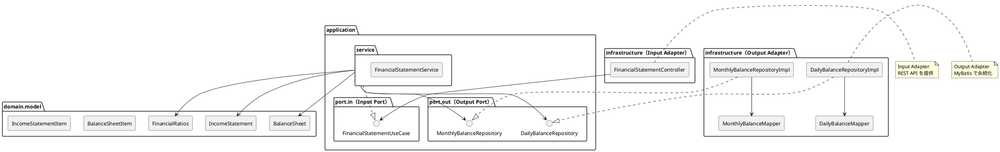

# 第16章: 財務諸表の生成と財務分析

## 16.1 本章の概要

第6章で設計した日次勘定科目残高・月次勘定科目残高テーブルを基に、財務諸表（貸借対照表・損益計算書）を生成し、財務分析機能を実装します。ヘキサゴナルアーキテクチャに従い、TDD で段階的に開発を進めます。

### 財務諸表とは

財務諸表は企業の財政状態と経営成績を示す重要な帳票です：

1. **貸借対照表（Balance Sheet / B/S）**
    - 特定時点での財政状態を表す
    - 資産・負債・純資産の構成を示す
    - 貸借平均の原則：**資産 = 負債 + 純資産**

2. **損益計算書（Income Statement / P/L）**
    - 一定期間の経営成績を表す
    - 収益・費用の構成を示す
    - 利益の計算：**当期純利益 = 収益 - 費用**

### アーキテクチャの全体像



### パッケージ構成

```
com.example.accounting/
├── domain/
│   └── model/
│       └── financial/
│           ├── BalanceSheet.java           # 貸借対照表
│           ├── BalanceSheetItem.java       # B/S 明細項目
│           ├── IncomeStatement.java        # 損益計算書
│           ├── IncomeStatementItem.java    # P/L 明細項目
│           ├── FinancialRatios.java        # 財務指標
│           ├── AccountCategory.java        # 勘定科目区分
│           └── ProfitType.java             # 利益区分
├── application/
│   ├── port/
│   │   ├── in/
│   │   │   ├── FinancialStatementUseCase.java  # Input Port
│   │   │   └── query/
│   │   │       ├── BalanceSheetQuery.java
│   │   │       └── IncomeStatementQuery.java
│   │   └── out/
│   │       ├── DailyBalanceRepository.java     # Output Port
│   │       └── MonthlyBalanceRepository.java   # Output Port
│   └── service/
│       └── FinancialStatementService.java      # Application Service
└── infrastructure/
    ├── persistence/
    │   ├── mapper/
    │   │   ├── DailyBalanceMapper.java
    │   │   └── MonthlyBalanceMapper.java
    │   └── repository/
    │       ├── DailyBalanceRepositoryImpl.java
    │       └── MonthlyBalanceRepositoryImpl.java
    └── web/
        ├── controller/
        │   └── FinancialStatementController.java
        └── dto/
            ├── BalanceSheetResponse.java
            ├── IncomeStatementResponse.java
            └── FinancialRatiosResponse.java
```

### TDD の流れ

1. **Domain Model**: ドメインモデルの作成（BalanceSheet, IncomeStatement, FinancialRatios）
2. **Output Port**: リポジトリインターフェースの定義
3. **Output Adapter**: Testcontainers でリポジトリ実装をテスト
4. **Input Port**: ユースケースインターフェースの定義
5. **Application Service**: Mockito でアプリケーションサービスをテスト
6. **Input Adapter**: Testcontainers で REST API 統合テスト

---

## 16.2 Domain Model の実装

### 16.2.1 AccountCategory 列挙型

勘定科目の区分を表す列挙型です。

```java
package com.example.accounting.domain.model.financial;

/**
 * 勘定科目区分（取引要素区分）
 */
public enum AccountCategory {
    ASSET("資産", "B", true),
    LIABILITY("負債", "B", false),
    EQUITY("純資産", "B", false),
    REVENUE("収益", "P", false),
    EXPENSE("費用", "P", true);

    private final String displayName;
    private final String bsplType;
    private final boolean isDebitBalance;

    AccountCategory(String displayName, String bsplType, boolean isDebitBalance) {
        this.displayName = displayName;
        this.bsplType = bsplType;
        this.isDebitBalance = isDebitBalance;
    }

    public String getDisplayName() {
        return displayName;
    }

    public String getBsplType() {
        return bsplType;
    }

    public boolean isDebitBalance() {
        return isDebitBalance;
    }

    public boolean isBalanceSheetCategory() {
        return "B".equals(bsplType);
    }

    public boolean isIncomeStatementCategory() {
        return "P".equals(bsplType);
    }

    public static AccountCategory fromElementType(String elementType) {
        return switch (elementType) {
            case "資産" -> ASSET;
            case "負債" -> LIABILITY;
            case "純資産", "資本" -> EQUITY;
            case "収益" -> REVENUE;
            case "費用" -> EXPENSE;
            default -> throw new IllegalArgumentException("Unknown element type: " + elementType);
        };
    }
}
```

### 16.2.2 BalanceSheetItem ドメインモデル

貸借対照表の各項目を表すドメインモデルです。

```java
package com.example.accounting.domain.model.financial;

import lombok.Value;
import lombok.With;

import java.math.BigDecimal;
import java.math.RoundingMode;

/**
 * 貸借対照表項目
 */
@Value
@With
public class BalanceSheetItem {

    String accountCode;
    String accountName;
    AccountCategory category;
    BigDecimal balance;
    BigDecimal percentage;

    /**
     * 項目を作成（構成比率なし）
     */
    public static BalanceSheetItem of(
            String accountCode,
            String accountName,
            AccountCategory category,
            BigDecimal balance) {
        return new BalanceSheetItem(
            accountCode,
            accountName,
            category,
            balance,
            null
        );
    }

    /**
     * 構成比率を計算して設定
     */
    public BalanceSheetItem withCalculatedPercentage(BigDecimal total) {
        if (total.compareTo(BigDecimal.ZERO) == 0) {
            return this.withPercentage(BigDecimal.ZERO);
        }
        BigDecimal pct = balance
            .divide(total, 10, RoundingMode.HALF_UP)
            .multiply(new BigDecimal("100"))
            .setScale(2, RoundingMode.HALF_UP);
        return this.withPercentage(pct);
    }

    /**
     * 流動資産かどうか（勘定科目コードが 11 または 12 で始まる）
     */
    public boolean isCurrentAsset() {
        return category == AccountCategory.ASSET
            && (accountCode.startsWith("11") || accountCode.startsWith("12"));
    }

    /**
     * 固定資産かどうか（勘定科目コードが 14, 15, 16 で始まる）
     */
    public boolean isFixedAsset() {
        return category == AccountCategory.ASSET
            && (accountCode.startsWith("14") || accountCode.startsWith("15") || accountCode.startsWith("16"));
    }

    /**
     * 流動負債かどうか（勘定科目コードが 21 で始まる）
     */
    public boolean isCurrentLiability() {
        return category == AccountCategory.LIABILITY
            && accountCode.startsWith("21");
    }

    /**
     * 固定負債かどうか（勘定科目コードが 25 で始まる）
     */
    public boolean isLongTermLiability() {
        return category == AccountCategory.LIABILITY
            && accountCode.startsWith("25");
    }
}
```

### 16.2.3 BalanceSheet ドメインモデル

貸借対照表全体を表すドメインモデルです。

```java
package com.example.accounting.domain.model.financial;

import lombok.Value;
import lombok.With;

import java.math.BigDecimal;
import java.time.LocalDate;
import java.util.List;

/**
 * 貸借対照表（Balance Sheet / B/S）
 */
@Value
@With
public class BalanceSheet {

    LocalDate asOfDate;
    List<BalanceSheetItem> assets;
    List<BalanceSheetItem> liabilities;
    List<BalanceSheetItem> equity;
    BigDecimal totalAssets;
    BigDecimal totalLiabilities;
    BigDecimal totalEquity;
    BigDecimal totalLiabilitiesAndEquity;

    /**
     * 貸借対照表を生成
     */
    public static BalanceSheet create(
            LocalDate asOfDate,
            List<BalanceSheetItem> assets,
            List<BalanceSheetItem> liabilities,
            List<BalanceSheetItem> equity) {

        BigDecimal totalAssets = sumBalances(assets);
        BigDecimal totalLiabilities = sumBalances(liabilities);
        BigDecimal totalEquity = sumBalances(equity);
        BigDecimal totalLiabilitiesAndEquity = totalLiabilities.add(totalEquity);

        // 構成比率を計算
        List<BalanceSheetItem> assetsWithPct = calculatePercentages(assets, totalAssets);
        List<BalanceSheetItem> liabilitiesWithPct = calculatePercentages(liabilities, totalLiabilitiesAndEquity);
        List<BalanceSheetItem> equityWithPct = calculatePercentages(equity, totalLiabilitiesAndEquity);

        return new BalanceSheet(
            asOfDate,
            assetsWithPct,
            liabilitiesWithPct,
            equityWithPct,
            totalAssets,
            totalLiabilities,
            totalEquity,
            totalLiabilitiesAndEquity
        );
    }

    /**
     * 貸借平均の原則が成立しているか確認
     */
    public boolean isBalanced() {
        return totalAssets.compareTo(totalLiabilitiesAndEquity) == 0;
    }

    /**
     * 流動資産合計
     */
    public BigDecimal getCurrentAssets() {
        return assets.stream()
            .filter(BalanceSheetItem::isCurrentAsset)
            .map(BalanceSheetItem::getBalance)
            .reduce(BigDecimal.ZERO, BigDecimal::add);
    }

    /**
     * 固定資産合計
     */
    public BigDecimal getFixedAssets() {
        return assets.stream()
            .filter(BalanceSheetItem::isFixedAsset)
            .map(BalanceSheetItem::getBalance)
            .reduce(BigDecimal.ZERO, BigDecimal::add);
    }

    /**
     * 流動負債合計
     */
    public BigDecimal getCurrentLiabilities() {
        return liabilities.stream()
            .filter(BalanceSheetItem::isCurrentLiability)
            .map(BalanceSheetItem::getBalance)
            .reduce(BigDecimal.ZERO, BigDecimal::add);
    }

    /**
     * 固定負債合計
     */
    public BigDecimal getLongTermLiabilities() {
        return liabilities.stream()
            .filter(BalanceSheetItem::isLongTermLiability)
            .map(BalanceSheetItem::getBalance)
            .reduce(BigDecimal.ZERO, BigDecimal::add);
    }

    private static BigDecimal sumBalances(List<BalanceSheetItem> items) {
        return items.stream()
            .map(BalanceSheetItem::getBalance)
            .reduce(BigDecimal.ZERO, BigDecimal::add);
    }

    private static List<BalanceSheetItem> calculatePercentages(
            List<BalanceSheetItem> items, BigDecimal total) {
        return items.stream()
            .map(item -> item.withCalculatedPercentage(total))
            .toList();
    }
}
```

### 16.2.4 IncomeStatementItem ドメインモデル

損益計算書の各項目を表すドメインモデルです。

```java
package com.example.accounting.domain.model.financial;

import lombok.Value;
import lombok.With;

import java.math.BigDecimal;
import java.math.RoundingMode;

/**
 * 損益計算書項目
 */
@Value
@With
public class IncomeStatementItem {

    String accountCode;
    String accountName;
    AccountCategory category;
    BigDecimal amount;
    BigDecimal percentage;  // 対売上比

    /**
     * 項目を作成（構成比率なし）
     */
    public static IncomeStatementItem of(
            String accountCode,
            String accountName,
            AccountCategory category,
            BigDecimal amount) {
        return new IncomeStatementItem(
            accountCode,
            accountName,
            category,
            amount,
            null
        );
    }

    /**
     * 対売上比率を計算して設定
     */
    public IncomeStatementItem withCalculatedPercentage(BigDecimal totalRevenue) {
        if (totalRevenue.compareTo(BigDecimal.ZERO) == 0) {
            return this.withPercentage(BigDecimal.ZERO);
        }
        BigDecimal pct = amount
            .divide(totalRevenue, 10, RoundingMode.HALF_UP)
            .multiply(new BigDecimal("100"))
            .setScale(2, RoundingMode.HALF_UP);
        return this.withPercentage(pct);
    }

    /**
     * 売上原価かどうか（勘定科目コードが 51 で始まる）
     */
    public boolean isCostOfSales() {
        return category == AccountCategory.EXPENSE
            && accountCode.startsWith("51");
    }

    /**
     * 販管費かどうか（勘定科目コードが 52, 6 で始まる）
     */
    public boolean isOperatingExpense() {
        return category == AccountCategory.EXPENSE
            && (accountCode.startsWith("52") || accountCode.startsWith("6"));
    }

    /**
     * 営業外費用かどうか（勘定科目コードが 7 で始まる）
     */
    public boolean isNonOperatingExpense() {
        return category == AccountCategory.EXPENSE
            && accountCode.startsWith("7");
    }

    /**
     * 売上高かどうか（勘定科目コードが 41 で始まる）
     */
    public boolean isSales() {
        return category == AccountCategory.REVENUE
            && accountCode.startsWith("41");
    }

    /**
     * 営業外収益かどうか（勘定科目コードが 42, 43 で始まる）
     */
    public boolean isNonOperatingRevenue() {
        return category == AccountCategory.REVENUE
            && (accountCode.startsWith("42") || accountCode.startsWith("43"));
    }
}
```

### 16.2.5 IncomeStatement ドメインモデル

損益計算書全体を表すドメインモデルです。

```java
package com.example.accounting.domain.model.financial;

import lombok.Value;
import lombok.With;

import java.math.BigDecimal;
import java.time.LocalDate;
import java.util.List;

/**
 * 損益計算書（Income Statement / P/L）
 */
@Value
@With
public class IncomeStatement {

    LocalDate fromDate;
    LocalDate toDate;
    List<IncomeStatementItem> revenues;
    List<IncomeStatementItem> expenses;
    BigDecimal totalRevenues;
    BigDecimal totalExpenses;
    BigDecimal sales;              // 売上高
    BigDecimal costOfSales;        // 売上原価
    BigDecimal grossProfit;        // 売上総利益
    BigDecimal operatingExpenses;  // 販管費
    BigDecimal operatingIncome;    // 営業利益
    BigDecimal ordinaryIncome;     // 経常利益
    BigDecimal netIncome;          // 当期純利益

    /**
     * 損益計算書を生成
     */
    public static IncomeStatement create(
            LocalDate fromDate,
            LocalDate toDate,
            List<IncomeStatementItem> revenues,
            List<IncomeStatementItem> expenses) {

        BigDecimal totalRevenues = sumAmounts(revenues);
        BigDecimal totalExpenses = sumAmounts(expenses);

        // 売上高
        BigDecimal sales = revenues.stream()
            .filter(IncomeStatementItem::isSales)
            .map(IncomeStatementItem::getAmount)
            .reduce(BigDecimal.ZERO, BigDecimal::add);

        // 売上原価
        BigDecimal costOfSales = expenses.stream()
            .filter(IncomeStatementItem::isCostOfSales)
            .map(IncomeStatementItem::getAmount)
            .reduce(BigDecimal.ZERO, BigDecimal::add);

        // 売上総利益
        BigDecimal grossProfit = sales.subtract(costOfSales);

        // 販管費
        BigDecimal operatingExpenses = expenses.stream()
            .filter(IncomeStatementItem::isOperatingExpense)
            .map(IncomeStatementItem::getAmount)
            .reduce(BigDecimal.ZERO, BigDecimal::add);

        // 営業利益
        BigDecimal operatingIncome = grossProfit.subtract(operatingExpenses);

        // 営業外収益
        BigDecimal nonOperatingRevenue = revenues.stream()
            .filter(IncomeStatementItem::isNonOperatingRevenue)
            .map(IncomeStatementItem::getAmount)
            .reduce(BigDecimal.ZERO, BigDecimal::add);

        // 営業外費用
        BigDecimal nonOperatingExpense = expenses.stream()
            .filter(IncomeStatementItem::isNonOperatingExpense)
            .map(IncomeStatementItem::getAmount)
            .reduce(BigDecimal.ZERO, BigDecimal::add);

        // 経常利益
        BigDecimal ordinaryIncome = operatingIncome
            .add(nonOperatingRevenue)
            .subtract(nonOperatingExpense);

        // 当期純利益（簡易版：特別損益は考慮しない）
        BigDecimal netIncome = totalRevenues.subtract(totalExpenses);

        // 対売上比率を計算
        List<IncomeStatementItem> revenuesWithPct = calculatePercentages(revenues, sales);
        List<IncomeStatementItem> expensesWithPct = calculatePercentages(expenses, sales);

        return new IncomeStatement(
            fromDate,
            toDate,
            revenuesWithPct,
            expensesWithPct,
            totalRevenues,
            totalExpenses,
            sales,
            costOfSales,
            grossProfit,
            operatingExpenses,
            operatingIncome,
            ordinaryIncome,
            netIncome
        );
    }

    /**
     * 売上総利益率
     */
    public BigDecimal getGrossProfitMargin() {
        return calculateRatio(grossProfit, sales);
    }

    /**
     * 営業利益率
     */
    public BigDecimal getOperatingIncomeMargin() {
        return calculateRatio(operatingIncome, sales);
    }

    /**
     * 経常利益率
     */
    public BigDecimal getOrdinaryIncomeMargin() {
        return calculateRatio(ordinaryIncome, sales);
    }

    /**
     * 当期純利益率
     */
    public BigDecimal getNetIncomeMargin() {
        return calculateRatio(netIncome, sales);
    }

    private static BigDecimal sumAmounts(List<IncomeStatementItem> items) {
        return items.stream()
            .map(IncomeStatementItem::getAmount)
            .reduce(BigDecimal.ZERO, BigDecimal::add);
    }

    private static List<IncomeStatementItem> calculatePercentages(
            List<IncomeStatementItem> items, BigDecimal totalRevenue) {
        return items.stream()
            .map(item -> item.withCalculatedPercentage(totalRevenue))
            .toList();
    }

    private BigDecimal calculateRatio(BigDecimal numerator, BigDecimal denominator) {
        if (denominator.compareTo(BigDecimal.ZERO) == 0) {
            return BigDecimal.ZERO;
        }
        return numerator
            .divide(denominator, 10, java.math.RoundingMode.HALF_UP)
            .multiply(new BigDecimal("100"))
            .setScale(2, java.math.RoundingMode.HALF_UP);
    }
}
```

### 16.2.6 FinancialRatios ドメインモデル

財務指標を表すドメインモデルです。

```java
package com.example.accounting.domain.model.financial;

import lombok.Value;
import lombok.With;

import java.math.BigDecimal;
import java.math.RoundingMode;

/**
 * 財務指標
 */
@Value
@With
public class FinancialRatios {

    // 安全性指標
    BigDecimal currentRatio;           // 流動比率（％）
    BigDecimal quickRatio;             // 当座比率（％）
    BigDecimal equityRatio;            // 自己資本比率（％）
    BigDecimal debtToEquityRatio;      // 負債比率（％）

    // 収益性指標
    BigDecimal grossProfitMargin;      // 売上総利益率（％）
    BigDecimal operatingProfitMargin;  // 営業利益率（％）
    BigDecimal ordinaryProfitMargin;   // 経常利益率（％）
    BigDecimal netProfitMargin;        // 当期純利益率（％）
    BigDecimal roa;                    // 総資産利益率（ROA, ％）
    BigDecimal roe;                    // 自己資本利益率（ROE, ％）

    // 効率性指標
    BigDecimal totalAssetTurnover;     // 総資産回転率（回）

    /**
     * 貸借対照表と損益計算書から財務指標を計算
     */
    public static FinancialRatios calculate(
            BalanceSheet balanceSheet,
            IncomeStatement incomeStatement) {

        // 流動比率 = 流動資産 / 流動負債 × 100
        BigDecimal currentRatio = calculateRatio(
            balanceSheet.getCurrentAssets(),
            balanceSheet.getCurrentLiabilities()
        );

        // 当座比率（簡易版：流動資産から棚卸資産を除く代わりに、現金預金+売掛金を使用）
        // ここでは流動資産の80%として近似
        BigDecimal quickRatio = calculateRatio(
            balanceSheet.getCurrentAssets().multiply(new BigDecimal("0.8")),
            balanceSheet.getCurrentLiabilities()
        );

        // 自己資本比率 = 自己資本 / 総資産 × 100
        BigDecimal equityRatio = calculateRatio(
            balanceSheet.getTotalEquity(),
            balanceSheet.getTotalAssets()
        );

        // 負債比率 = 負債 / 自己資本 × 100
        BigDecimal debtToEquityRatio = calculateRatio(
            balanceSheet.getTotalLiabilities(),
            balanceSheet.getTotalEquity()
        );

        // 収益性指標
        BigDecimal grossProfitMargin = incomeStatement.getGrossProfitMargin();
        BigDecimal operatingProfitMargin = incomeStatement.getOperatingIncomeMargin();
        BigDecimal ordinaryProfitMargin = incomeStatement.getOrdinaryIncomeMargin();
        BigDecimal netProfitMargin = incomeStatement.getNetIncomeMargin();

        // ROA = 当期純利益 / 総資産 × 100
        BigDecimal roa = calculateRatio(
            incomeStatement.getNetIncome(),
            balanceSheet.getTotalAssets()
        );

        // ROE = 当期純利益 / 自己資本 × 100
        BigDecimal roe = calculateRatio(
            incomeStatement.getNetIncome(),
            balanceSheet.getTotalEquity()
        );

        // 総資産回転率 = 売上高 / 総資産
        BigDecimal totalAssetTurnover = BigDecimal.ZERO;
        if (balanceSheet.getTotalAssets().compareTo(BigDecimal.ZERO) > 0) {
            totalAssetTurnover = incomeStatement.getSales()
                .divide(balanceSheet.getTotalAssets(), 2, RoundingMode.HALF_UP);
        }

        return new FinancialRatios(
            currentRatio,
            quickRatio,
            equityRatio,
            debtToEquityRatio,
            grossProfitMargin,
            operatingProfitMargin,
            ordinaryProfitMargin,
            netProfitMargin,
            roa,
            roe,
            totalAssetTurnover
        );
    }

    /**
     * 財務健全性を評価
     */
    public String evaluateSafety() {
        if (currentRatio.compareTo(new BigDecimal("200")) >= 0
            && equityRatio.compareTo(new BigDecimal("40")) >= 0) {
            return "優良";
        } else if (currentRatio.compareTo(new BigDecimal("100")) >= 0
            && equityRatio.compareTo(new BigDecimal("20")) >= 0) {
            return "良好";
        } else {
            return "要注意";
        }
    }

    /**
     * 収益性を評価
     */
    public String evaluateProfitability() {
        if (operatingProfitMargin.compareTo(new BigDecimal("10")) >= 0
            && roe.compareTo(new BigDecimal("10")) >= 0) {
            return "優良";
        } else if (operatingProfitMargin.compareTo(new BigDecimal("5")) >= 0
            && roe.compareTo(new BigDecimal("5")) >= 0) {
            return "良好";
        } else {
            return "要改善";
        }
    }

    private static BigDecimal calculateRatio(BigDecimal numerator, BigDecimal denominator) {
        if (denominator.compareTo(BigDecimal.ZERO) == 0) {
            return BigDecimal.ZERO;
        }
        return numerator
            .divide(denominator, 10, RoundingMode.HALF_UP)
            .multiply(new BigDecimal("100"))
            .setScale(2, RoundingMode.HALF_UP);
    }
}
```

---

## 16.3 Output Port（リポジトリインターフェース）

Output Port は、アプリケーション層からインフラストラクチャ層への依存を逆転させるためのインターフェースです。

### 16.3.1 DailyBalanceRepository

```java
package com.example.accounting.application.port.out;

import java.math.BigDecimal;
import java.time.LocalDate;
import java.util.List;

/**
 * 日次勘定科目残高リポジトリ（Output Port）
 */
public interface DailyBalanceRepository {

    /**
     * 貸借対照表用の残高を取得（BSPL区分='B'）
     */
    List<AccountBalanceDto> findBalanceSheetBalances(LocalDate asOfDate);

    /**
     * 損益計算書用の残高を取得（BSPL区分='P'）
     */
    List<AccountBalanceDto> findIncomeStatementBalances(LocalDate fromDate, LocalDate toDate);

    /**
     * 勘定科目別残高DTO
     */
    record AccountBalanceDto(
        String accountCode,
        String accountName,
        String elementType,
        BigDecimal debitAmount,
        BigDecimal creditAmount
    ) {
        public BigDecimal getBalance() {
            return debitAmount.subtract(creditAmount);
        }
    }
}
```

### 16.3.2 MonthlyBalanceRepository

```java
package com.example.accounting.application.port.out;

import java.math.BigDecimal;
import java.util.List;
import java.util.Optional;

/**
 * 月次勘定科目残高リポジトリ（Output Port）
 */
public interface MonthlyBalanceRepository {

    /**
     * 指定年度の貸借対照表用残高を取得
     */
    List<MonthlyBalanceDto> findBalanceSheetBalancesByFiscalYear(int fiscalYear);

    /**
     * 指定年度の損益計算書用残高を取得
     */
    List<MonthlyBalanceDto> findIncomeStatementBalancesByFiscalYear(int fiscalYear);

    /**
     * 指定年月の月末残高を取得
     */
    Optional<MonthlyBalanceDto> findByYearAndMonth(
        int fiscalYear, int month, String accountCode);

    /**
     * 月次勘定科目残高DTO
     */
    record MonthlyBalanceDto(
        int fiscalYear,
        int month,
        String accountCode,
        String accountName,
        String elementType,
        BigDecimal openingBalance,
        BigDecimal debitAmount,
        BigDecimal creditAmount,
        BigDecimal closingBalance
    ) {}
}
```

---

## 16.4 Output Adapter（リポジトリ実装）

### 16.4.1 MyBatis Mapper

```java
package com.example.accounting.infrastructure.persistence.mapper;

import com.example.accounting.application.port.out.DailyBalanceRepository.AccountBalanceDto;
import org.apache.ibatis.annotations.Mapper;
import org.apache.ibatis.annotations.Param;

import java.time.LocalDate;
import java.util.List;

@Mapper
public interface DailyBalanceMapper {

    List<AccountBalanceDto> selectBalanceSheetBalances(@Param("asOfDate") LocalDate asOfDate);

    List<AccountBalanceDto> selectIncomeStatementBalances(
        @Param("fromDate") LocalDate fromDate,
        @Param("toDate") LocalDate toDate
    );
}
```

**DailyBalanceMapper.xml**:

```xml
<?xml version="1.0" encoding="UTF-8" ?>
<!DOCTYPE mapper PUBLIC "-//mybatis.org//DTD Mapper 3.0//EN"
        "http://mybatis.org/dtd/mybatis-3-mapper.dtd">
<mapper namespace="com.example.accounting.infrastructure.persistence.mapper.DailyBalanceMapper">

    <select id="selectBalanceSheetBalances"
            resultType="com.example.accounting.application.port.out.DailyBalanceRepository$AccountBalanceDto">
        SELECT
            a."勘定科目コード" as accountCode,
            a."勘定科目名" as accountName,
            a."取引要素区分" as elementType,
            COALESCE(SUM(d."借方金額"), 0) as debitAmount,
            COALESCE(SUM(d."貸方金額"), 0) as creditAmount
        FROM "勘定科目マスタ" a
        LEFT JOIN "日次勘定科目残高" d
            ON a."勘定科目コード" = d."勘定科目コード"
            AND d."起票日" &lt;= #{asOfDate}
        WHERE a."BSPL区分" = 'B'
        GROUP BY a."勘定科目コード", a."勘定科目名", a."取引要素区分"
        HAVING COALESCE(SUM(d."借方金額"), 0) != 0
            OR COALESCE(SUM(d."貸方金額"), 0) != 0
        ORDER BY a."勘定科目コード"
    </select>

    <select id="selectIncomeStatementBalances"
            resultType="com.example.accounting.application.port.out.DailyBalanceRepository$AccountBalanceDto">
        SELECT
            a."勘定科目コード" as accountCode,
            a."勘定科目名" as accountName,
            a."取引要素区分" as elementType,
            COALESCE(SUM(d."借方金額"), 0) as debitAmount,
            COALESCE(SUM(d."貸方金額"), 0) as creditAmount
        FROM "勘定科目マスタ" a
        LEFT JOIN "日次勘定科目残高" d
            ON a."勘定科目コード" = d."勘定科目コード"
            AND d."起票日" BETWEEN #{fromDate} AND #{toDate}
        WHERE a."BSPL区分" = 'P'
        GROUP BY a."勘定科目コード", a."勘定科目名", a."取引要素区分"
        HAVING COALESCE(SUM(d."借方金額"), 0) != 0
            OR COALESCE(SUM(d."貸方金額"), 0) != 0
        ORDER BY a."勘定科目コード"
    </select>

</mapper>
```

### 16.4.2 Repository 実装（Output Adapter）

```java
package com.example.accounting.infrastructure.persistence.repository;

import com.example.accounting.application.port.out.DailyBalanceRepository;
import com.example.accounting.infrastructure.persistence.mapper.DailyBalanceMapper;
import lombok.RequiredArgsConstructor;
import org.springframework.stereotype.Repository;

import java.time.LocalDate;
import java.util.List;

/**
 * 日次勘定科目残高リポジトリ実装（Output Adapter）
 */
@Repository
@RequiredArgsConstructor
public class DailyBalanceRepositoryImpl implements DailyBalanceRepository {

    private final DailyBalanceMapper dailyBalanceMapper;

    @Override
    public List<AccountBalanceDto> findBalanceSheetBalances(LocalDate asOfDate) {
        return dailyBalanceMapper.selectBalanceSheetBalances(asOfDate);
    }

    @Override
    public List<AccountBalanceDto> findIncomeStatementBalances(
            LocalDate fromDate, LocalDate toDate) {
        return dailyBalanceMapper.selectIncomeStatementBalances(fromDate, toDate);
    }
}
```

### 16.4.3 Repository 実装のテスト（Testcontainers）

```java
package com.example.accounting.infrastructure.persistence.repository;

import com.example.accounting.application.port.out.DailyBalanceRepository;
import com.example.accounting.application.port.out.DailyBalanceRepository.AccountBalanceDto;
import org.junit.jupiter.api.*;
import org.springframework.beans.factory.annotation.Autowired;
import org.springframework.boot.test.context.SpringBootTest;
import org.springframework.jdbc.core.JdbcTemplate;
import org.springframework.test.context.DynamicPropertyRegistry;
import org.springframework.test.context.DynamicPropertySource;
import org.testcontainers.containers.PostgreSQLContainer;
import org.testcontainers.junit.jupiter.Container;
import org.testcontainers.junit.jupiter.Testcontainers;

import java.math.BigDecimal;
import java.time.LocalDate;
import java.util.List;

import static org.assertj.core.api.Assertions.assertThat;

@SpringBootTest
@Testcontainers
@TestMethodOrder(MethodOrderer.OrderAnnotation.class)
@DisplayName("日次勘定科目残高リポジトリ実装のテスト")
class DailyBalanceRepositoryImplTest {

    @Container
    static PostgreSQLContainer<?> postgres = new PostgreSQLContainer<>("postgres:16-alpine")
            .withDatabaseName("testdb")
            .withUsername("testuser")
            .withPassword("testpass");

    @DynamicPropertySource
    static void configureProperties(DynamicPropertyRegistry registry) {
        registry.add("spring.datasource.url", postgres::getJdbcUrl);
        registry.add("spring.datasource.username", postgres::getUsername);
        registry.add("spring.datasource.password", postgres::getPassword);
        registry.add("spring.flyway.enabled", () -> "true");
    }

    @Autowired
    private DailyBalanceRepository dailyBalanceRepository;

    @Autowired
    private JdbcTemplate jdbcTemplate;

    @BeforeEach
    void setUp() {
        // テストデータのクリーンアップと準備
        jdbcTemplate.execute("DELETE FROM \"日次勘定科目残高\"");

        // 勘定科目マスタにテストデータが存在することを前提
        // 日次残高テストデータを挿入
        LocalDate asOfDate = LocalDate.of(2025, 3, 31);

        // 貸借対照表科目の残高
        jdbcTemplate.update("""
            INSERT INTO "日次勘定科目残高" (
                "起票日", "勘定科目コード", "補助科目コード", "部門コード",
                "プロジェクトコード", "決算仕訳フラグ", "借方金額", "貸方金額"
            ) VALUES (?, '1110', '', '', '', 0, 5000000, 0)
            """, asOfDate);

        jdbcTemplate.update("""
            INSERT INTO "日次勘定科目残高" (
                "起票日", "勘定科目コード", "補助科目コード", "部門コード",
                "プロジェクトコード", "決算仕訳フラグ", "借方金額", "貸方金額"
            ) VALUES (?, '2110', '', '', '', 0, 0, 1000000)
            """, asOfDate);

        // 損益計算書科目の残高
        jdbcTemplate.update("""
            INSERT INTO "日次勘定科目残高" (
                "起票日", "勘定科目コード", "補助科目コード", "部門コード",
                "プロジェクトコード", "決算仕訳フラグ", "借方金額", "貸方金額"
            ) VALUES (?, '4110', '', '', '', 0, 0, 10000000)
            """, asOfDate);

        jdbcTemplate.update("""
            INSERT INTO "日次勘定科目残高" (
                "起票日", "勘定科目コード", "補助科目コード", "部門コード",
                "プロジェクトコード", "決算仕訳フラグ", "借方金額", "貸方金額"
            ) VALUES (?, '5110', '', '', '', 0, 6000000, 0)
            """, asOfDate);
    }

    @Test
    @Order(1)
    @DisplayName("貸借対照表用残高を取得できる")
    void shouldFindBalanceSheetBalances() {
        // Given
        LocalDate asOfDate = LocalDate.of(2025, 3, 31);

        // When
        List<AccountBalanceDto> balances = dailyBalanceRepository.findBalanceSheetBalances(asOfDate);

        // Then
        assertThat(balances).isNotEmpty();
        assertThat(balances)
            .extracting(AccountBalanceDto::accountCode)
            .contains("1110", "2110");
    }

    @Test
    @Order(2)
    @DisplayName("損益計算書用残高を取得できる")
    void shouldFindIncomeStatementBalances() {
        // Given
        LocalDate fromDate = LocalDate.of(2025, 4, 1);
        LocalDate toDate = LocalDate.of(2026, 3, 31);

        // When（期間内にデータがあれば取得）
        List<AccountBalanceDto> balances = dailyBalanceRepository
            .findIncomeStatementBalances(
                LocalDate.of(2025, 1, 1),
                LocalDate.of(2025, 12, 31)
            );

        // Then
        assertThat(balances).isNotEmpty();
    }

    @Test
    @Order(3)
    @DisplayName("残高が正しく計算される")
    void shouldCalculateBalanceCorrectly() {
        // Given
        LocalDate asOfDate = LocalDate.of(2025, 3, 31);

        // When
        List<AccountBalanceDto> balances = dailyBalanceRepository.findBalanceSheetBalances(asOfDate);

        // Then
        AccountBalanceDto cashBalance = balances.stream()
            .filter(b -> b.accountCode().equals("1110"))
            .findFirst()
            .orElseThrow();

        assertThat(cashBalance.getBalance())
            .isEqualByComparingTo(new BigDecimal("5000000"));
    }
}
```

---

## 16.5 Input Port（ユースケースインターフェース）

### 16.5.1 ユースケースインターフェース

```java
package com.example.accounting.application.port.in;

import com.example.accounting.application.port.in.query.BalanceSheetQuery;
import com.example.accounting.application.port.in.query.IncomeStatementQuery;
import com.example.accounting.domain.model.financial.BalanceSheet;
import com.example.accounting.domain.model.financial.FinancialRatios;
import com.example.accounting.domain.model.financial.IncomeStatement;

/**
 * 財務諸表ユースケース（Input Port）
 */
public interface FinancialStatementUseCase {

    /**
     * 貸借対照表を生成
     */
    BalanceSheet generateBalanceSheet(BalanceSheetQuery query);

    /**
     * 損益計算書を生成
     */
    IncomeStatement generateIncomeStatement(IncomeStatementQuery query);

    /**
     * 財務指標を計算
     */
    FinancialRatios calculateFinancialRatios(
        BalanceSheetQuery bsQuery,
        IncomeStatementQuery plQuery
    );
}
```

### 16.5.2 Query クラス

```java
// application/port/in/query/BalanceSheetQuery.java
package com.example.accounting.application.port.in.query;

import java.time.LocalDate;
import java.util.Objects;

/**
 * 貸借対照表生成クエリ
 */
public record BalanceSheetQuery(
    LocalDate asOfDate
) {
    public BalanceSheetQuery {
        Objects.requireNonNull(asOfDate, "基準日は必須です");
    }

    public static BalanceSheetQuery of(LocalDate asOfDate) {
        return new BalanceSheetQuery(asOfDate);
    }
}

// application/port/in/query/IncomeStatementQuery.java
package com.example.accounting.application.port.in.query;

import java.time.LocalDate;
import java.util.Objects;

/**
 * 損益計算書生成クエリ
 */
public record IncomeStatementQuery(
    LocalDate fromDate,
    LocalDate toDate
) {
    public IncomeStatementQuery {
        Objects.requireNonNull(fromDate, "開始日は必須です");
        Objects.requireNonNull(toDate, "終了日は必須です");

        if (fromDate.isAfter(toDate)) {
            throw new IllegalArgumentException("開始日は終了日以前である必要があります");
        }
    }

    public static IncomeStatementQuery of(LocalDate fromDate, LocalDate toDate) {
        return new IncomeStatementQuery(fromDate, toDate);
    }

    /**
     * 会計年度から生成（4月〜翌3月）
     */
    public static IncomeStatementQuery ofFiscalYear(int fiscalYear) {
        LocalDate fromDate = LocalDate.of(fiscalYear, 4, 1);
        LocalDate toDate = LocalDate.of(fiscalYear + 1, 3, 31);
        return new IncomeStatementQuery(fromDate, toDate);
    }
}
```

---

## 16.6 Application Service

### 16.6.1 アプリケーションサービス実装

```java
package com.example.accounting.application.service;

import com.example.accounting.application.port.in.FinancialStatementUseCase;
import com.example.accounting.application.port.in.query.BalanceSheetQuery;
import com.example.accounting.application.port.in.query.IncomeStatementQuery;
import com.example.accounting.application.port.out.DailyBalanceRepository;
import com.example.accounting.application.port.out.DailyBalanceRepository.AccountBalanceDto;
import com.example.accounting.domain.model.financial.*;
import lombok.RequiredArgsConstructor;
import org.springframework.stereotype.Service;
import org.springframework.transaction.annotation.Transactional;

import java.math.BigDecimal;
import java.util.ArrayList;
import java.util.List;

/**
 * 財務諸表アプリケーションサービス
 */
@Service
@RequiredArgsConstructor
@Transactional(readOnly = true)
public class FinancialStatementService implements FinancialStatementUseCase {

    private final DailyBalanceRepository dailyBalanceRepository;

    @Override
    public BalanceSheet generateBalanceSheet(BalanceSheetQuery query) {
        List<AccountBalanceDto> balances = dailyBalanceRepository
            .findBalanceSheetBalances(query.asOfDate());

        List<BalanceSheetItem> assets = new ArrayList<>();
        List<BalanceSheetItem> liabilities = new ArrayList<>();
        List<BalanceSheetItem> equity = new ArrayList<>();

        for (AccountBalanceDto dto : balances) {
            AccountCategory category = AccountCategory.fromElementType(dto.elementType());
            BigDecimal balance = calculateBalance(dto, category);

            if (balance.compareTo(BigDecimal.ZERO) == 0) {
                continue;
            }

            BalanceSheetItem item = BalanceSheetItem.of(
                dto.accountCode(),
                dto.accountName(),
                category,
                balance.abs()
            );

            switch (category) {
                case ASSET -> assets.add(item);
                case LIABILITY -> liabilities.add(item);
                case EQUITY -> equity.add(item);
                default -> { /* 無視 */ }
            }
        }

        return BalanceSheet.create(query.asOfDate(), assets, liabilities, equity);
    }

    @Override
    public IncomeStatement generateIncomeStatement(IncomeStatementQuery query) {
        List<AccountBalanceDto> balances = dailyBalanceRepository
            .findIncomeStatementBalances(query.fromDate(), query.toDate());

        List<IncomeStatementItem> revenues = new ArrayList<>();
        List<IncomeStatementItem> expenses = new ArrayList<>();

        for (AccountBalanceDto dto : balances) {
            AccountCategory category = AccountCategory.fromElementType(dto.elementType());
            BigDecimal amount = calculateAmount(dto, category);

            if (amount.compareTo(BigDecimal.ZERO) == 0) {
                continue;
            }

            IncomeStatementItem item = IncomeStatementItem.of(
                dto.accountCode(),
                dto.accountName(),
                category,
                amount.abs()
            );

            switch (category) {
                case REVENUE -> revenues.add(item);
                case EXPENSE -> expenses.add(item);
                default -> { /* 無視 */ }
            }
        }

        return IncomeStatement.create(query.fromDate(), query.toDate(), revenues, expenses);
    }

    @Override
    public FinancialRatios calculateFinancialRatios(
            BalanceSheetQuery bsQuery,
            IncomeStatementQuery plQuery) {

        BalanceSheet balanceSheet = generateBalanceSheet(bsQuery);
        IncomeStatement incomeStatement = generateIncomeStatement(plQuery);

        return FinancialRatios.calculate(balanceSheet, incomeStatement);
    }

    /**
     * 貸借対照表の残高を計算
     * 資産：借方 - 貸方
     * 負債・純資産：貸方 - 借方
     */
    private BigDecimal calculateBalance(AccountBalanceDto dto, AccountCategory category) {
        if (category.isDebitBalance()) {
            return dto.debitAmount().subtract(dto.creditAmount());
        } else {
            return dto.creditAmount().subtract(dto.debitAmount());
        }
    }

    /**
     * 損益計算書の金額を計算
     * 収益：貸方 - 借方
     * 費用：借方 - 貸方
     */
    private BigDecimal calculateAmount(AccountBalanceDto dto, AccountCategory category) {
        if (category == AccountCategory.REVENUE) {
            return dto.creditAmount().subtract(dto.debitAmount());
        } else {
            return dto.debitAmount().subtract(dto.creditAmount());
        }
    }
}
```

### 16.6.2 アプリケーションサービスのテスト（Mockito）

```java
package com.example.accounting.application.service;

import com.example.accounting.application.port.in.query.BalanceSheetQuery;
import com.example.accounting.application.port.in.query.IncomeStatementQuery;
import com.example.accounting.application.port.out.DailyBalanceRepository;
import com.example.accounting.application.port.out.DailyBalanceRepository.AccountBalanceDto;
import com.example.accounting.domain.model.financial.BalanceSheet;
import com.example.accounting.domain.model.financial.FinancialRatios;
import com.example.accounting.domain.model.financial.IncomeStatement;
import org.junit.jupiter.api.*;
import org.junit.jupiter.api.extension.ExtendWith;
import org.mockito.InjectMocks;
import org.mockito.Mock;
import org.mockito.junit.jupiter.MockitoExtension;

import java.math.BigDecimal;
import java.time.LocalDate;
import java.util.List;

import static org.assertj.core.api.Assertions.*;
import static org.mockito.ArgumentMatchers.any;
import static org.mockito.Mockito.*;

@ExtendWith(MockitoExtension.class)
@DisplayName("財務諸表アプリケーションサービスのテスト")
class FinancialStatementServiceTest {

    @Mock
    private DailyBalanceRepository dailyBalanceRepository;

    @InjectMocks
    private FinancialStatementService financialStatementService;

    @Test
    @DisplayName("貸借対照表を生成できる")
    void shouldGenerateBalanceSheet() {
        // Given
        LocalDate asOfDate = LocalDate.of(2025, 3, 31);
        BalanceSheetQuery query = BalanceSheetQuery.of(asOfDate);

        List<AccountBalanceDto> mockBalances = List.of(
            new AccountBalanceDto("1110", "普通預金", "資産",
                new BigDecimal("5000000"), BigDecimal.ZERO),
            new AccountBalanceDto("2110", "買掛金", "負債",
                BigDecimal.ZERO, new BigDecimal("1000000")),
            new AccountBalanceDto("3110", "資本金", "純資産",
                BigDecimal.ZERO, new BigDecimal("4000000"))
        );

        when(dailyBalanceRepository.findBalanceSheetBalances(asOfDate))
            .thenReturn(mockBalances);

        // When
        BalanceSheet balanceSheet = financialStatementService.generateBalanceSheet(query);

        // Then
        assertThat(balanceSheet).isNotNull();
        assertThat(balanceSheet.getAsOfDate()).isEqualTo(asOfDate);
        assertThat(balanceSheet.getAssets()).hasSize(1);
        assertThat(balanceSheet.getLiabilities()).hasSize(1);
        assertThat(balanceSheet.getEquity()).hasSize(1);
        assertThat(balanceSheet.getTotalAssets())
            .isEqualByComparingTo(new BigDecimal("5000000"));
        assertThat(balanceSheet.getTotalLiabilities())
            .isEqualByComparingTo(new BigDecimal("1000000"));
        assertThat(balanceSheet.getTotalEquity())
            .isEqualByComparingTo(new BigDecimal("4000000"));
        assertThat(balanceSheet.isBalanced()).isTrue();
    }

    @Test
    @DisplayName("貸借平均の原則が成立している")
    void shouldSatisfyBalanceSheetEquation() {
        // Given
        LocalDate asOfDate = LocalDate.of(2025, 3, 31);
        BalanceSheetQuery query = BalanceSheetQuery.of(asOfDate);

        List<AccountBalanceDto> mockBalances = List.of(
            new AccountBalanceDto("1110", "普通預金", "資産",
                new BigDecimal("10000000"), BigDecimal.ZERO),
            new AccountBalanceDto("2110", "買掛金", "負債",
                BigDecimal.ZERO, new BigDecimal("3000000")),
            new AccountBalanceDto("3110", "資本金", "純資産",
                BigDecimal.ZERO, new BigDecimal("7000000"))
        );

        when(dailyBalanceRepository.findBalanceSheetBalances(asOfDate))
            .thenReturn(mockBalances);

        // When
        BalanceSheet balanceSheet = financialStatementService.generateBalanceSheet(query);

        // Then
        // 資産 = 負債 + 純資産
        BigDecimal expected = balanceSheet.getTotalLiabilities()
            .add(balanceSheet.getTotalEquity());
        assertThat(balanceSheet.getTotalAssets()).isEqualByComparingTo(expected);
    }

    @Test
    @DisplayName("損益計算書を生成できる")
    void shouldGenerateIncomeStatement() {
        // Given
        LocalDate fromDate = LocalDate.of(2025, 4, 1);
        LocalDate toDate = LocalDate.of(2026, 3, 31);
        IncomeStatementQuery query = IncomeStatementQuery.of(fromDate, toDate);

        List<AccountBalanceDto> mockBalances = List.of(
            new AccountBalanceDto("4110", "売上高", "収益",
                BigDecimal.ZERO, new BigDecimal("100000000")),
            new AccountBalanceDto("5110", "仕入高", "費用",
                new BigDecimal("60000000"), BigDecimal.ZERO),
            new AccountBalanceDto("6110", "給与手当", "費用",
                new BigDecimal("20000000"), BigDecimal.ZERO)
        );

        when(dailyBalanceRepository.findIncomeStatementBalances(fromDate, toDate))
            .thenReturn(mockBalances);

        // When
        IncomeStatement incomeStatement = financialStatementService.generateIncomeStatement(query);

        // Then
        assertThat(incomeStatement).isNotNull();
        assertThat(incomeStatement.getFromDate()).isEqualTo(fromDate);
        assertThat(incomeStatement.getToDate()).isEqualTo(toDate);
        assertThat(incomeStatement.getSales())
            .isEqualByComparingTo(new BigDecimal("100000000"));
        assertThat(incomeStatement.getCostOfSales())
            .isEqualByComparingTo(new BigDecimal("60000000"));
        assertThat(incomeStatement.getGrossProfit())
            .isEqualByComparingTo(new BigDecimal("40000000"));
    }

    @Test
    @DisplayName("各種利益項目が正しく計算される")
    void shouldCalculateProfitCorrectly() {
        // Given
        LocalDate fromDate = LocalDate.of(2025, 4, 1);
        LocalDate toDate = LocalDate.of(2026, 3, 31);
        IncomeStatementQuery query = IncomeStatementQuery.of(fromDate, toDate);

        List<AccountBalanceDto> mockBalances = List.of(
            new AccountBalanceDto("4110", "売上高", "収益",
                BigDecimal.ZERO, new BigDecimal("100000000")),
            new AccountBalanceDto("5110", "仕入高", "費用",
                new BigDecimal("60000000"), BigDecimal.ZERO),
            new AccountBalanceDto("6110", "販管費", "費用",
                new BigDecimal("25000000"), BigDecimal.ZERO)
        );

        when(dailyBalanceRepository.findIncomeStatementBalances(fromDate, toDate))
            .thenReturn(mockBalances);

        // When
        IncomeStatement incomeStatement = financialStatementService.generateIncomeStatement(query);

        // Then
        // 売上総利益 = 100,000,000 - 60,000,000 = 40,000,000
        assertThat(incomeStatement.getGrossProfit())
            .isEqualByComparingTo(new BigDecimal("40000000"));

        // 営業利益 = 40,000,000 - 25,000,000 = 15,000,000
        assertThat(incomeStatement.getOperatingIncome())
            .isEqualByComparingTo(new BigDecimal("15000000"));

        // 当期純利益 = 100,000,000 - 85,000,000 = 15,000,000
        assertThat(incomeStatement.getNetIncome())
            .isEqualByComparingTo(new BigDecimal("15000000"));
    }

    @Test
    @DisplayName("財務指標を計算できる")
    void shouldCalculateFinancialRatios() {
        // Given
        LocalDate bsDate = LocalDate.of(2026, 3, 31);
        LocalDate plFromDate = LocalDate.of(2025, 4, 1);
        LocalDate plToDate = LocalDate.of(2026, 3, 31);

        BalanceSheetQuery bsQuery = BalanceSheetQuery.of(bsDate);
        IncomeStatementQuery plQuery = IncomeStatementQuery.of(plFromDate, plToDate);

        // B/S データ
        List<AccountBalanceDto> bsBalances = List.of(
            new AccountBalanceDto("1110", "普通預金", "資産",
                new BigDecimal("20000000"), BigDecimal.ZERO),
            new AccountBalanceDto("2110", "買掛金", "負債",
                BigDecimal.ZERO, new BigDecimal("10000000")),
            new AccountBalanceDto("3110", "資本金", "純資産",
                BigDecimal.ZERO, new BigDecimal("10000000"))
        );

        // P/L データ
        List<AccountBalanceDto> plBalances = List.of(
            new AccountBalanceDto("4110", "売上高", "収益",
                BigDecimal.ZERO, new BigDecimal("100000000")),
            new AccountBalanceDto("5110", "仕入高", "費用",
                new BigDecimal("60000000"), BigDecimal.ZERO),
            new AccountBalanceDto("6110", "販管費", "費用",
                new BigDecimal("30000000"), BigDecimal.ZERO)
        );

        when(dailyBalanceRepository.findBalanceSheetBalances(bsDate))
            .thenReturn(bsBalances);
        when(dailyBalanceRepository.findIncomeStatementBalances(plFromDate, plToDate))
            .thenReturn(plBalances);

        // When
        FinancialRatios ratios = financialStatementService
            .calculateFinancialRatios(bsQuery, plQuery);

        // Then
        assertThat(ratios).isNotNull();
        // 流動比率 = 20,000,000 / 10,000,000 × 100 = 200%
        assertThat(ratios.getCurrentRatio())
            .isEqualByComparingTo(new BigDecimal("200.00"));
        // 自己資本比率 = 10,000,000 / 20,000,000 × 100 = 50%
        assertThat(ratios.getEquityRatio())
            .isEqualByComparingTo(new BigDecimal("50.00"));
    }

    @Test
    @DisplayName("売上総利益率が正しく計算される")
    void shouldCalculateGrossProfitMargin() {
        // Given
        LocalDate fromDate = LocalDate.of(2025, 4, 1);
        LocalDate toDate = LocalDate.of(2026, 3, 31);
        IncomeStatementQuery query = IncomeStatementQuery.of(fromDate, toDate);

        List<AccountBalanceDto> mockBalances = List.of(
            new AccountBalanceDto("4110", "売上高", "収益",
                BigDecimal.ZERO, new BigDecimal("100000000")),
            new AccountBalanceDto("5110", "仕入高", "費用",
                new BigDecimal("70000000"), BigDecimal.ZERO)
        );

        when(dailyBalanceRepository.findIncomeStatementBalances(fromDate, toDate))
            .thenReturn(mockBalances);

        // When
        IncomeStatement incomeStatement = financialStatementService.generateIncomeStatement(query);

        // Then
        // 売上総利益率 = (100,000,000 - 70,000,000) / 100,000,000 × 100 = 30%
        assertThat(incomeStatement.getGrossProfitMargin())
            .isEqualByComparingTo(new BigDecimal("30.00"));
    }

    @Test
    @DisplayName("ROAとROEが正しく計算される")
    void shouldCalculateRoaAndRoe() {
        // Given
        LocalDate bsDate = LocalDate.of(2026, 3, 31);
        LocalDate plFromDate = LocalDate.of(2025, 4, 1);
        LocalDate plToDate = LocalDate.of(2026, 3, 31);

        BalanceSheetQuery bsQuery = BalanceSheetQuery.of(bsDate);
        IncomeStatementQuery plQuery = IncomeStatementQuery.of(plFromDate, plToDate);

        // B/S データ：総資産 50,000,000、自己資本 20,000,000
        List<AccountBalanceDto> bsBalances = List.of(
            new AccountBalanceDto("1110", "普通預金", "資産",
                new BigDecimal("50000000"), BigDecimal.ZERO),
            new AccountBalanceDto("2110", "借入金", "負債",
                BigDecimal.ZERO, new BigDecimal("30000000")),
            new AccountBalanceDto("3110", "資本金", "純資産",
                BigDecimal.ZERO, new BigDecimal("20000000"))
        );

        // P/L データ：当期純利益 5,000,000
        List<AccountBalanceDto> plBalances = List.of(
            new AccountBalanceDto("4110", "売上高", "収益",
                BigDecimal.ZERO, new BigDecimal("100000000")),
            new AccountBalanceDto("5110", "仕入高", "費用",
                new BigDecimal("95000000"), BigDecimal.ZERO)
        );

        when(dailyBalanceRepository.findBalanceSheetBalances(bsDate))
            .thenReturn(bsBalances);
        when(dailyBalanceRepository.findIncomeStatementBalances(plFromDate, plToDate))
            .thenReturn(plBalances);

        // When
        FinancialRatios ratios = financialStatementService
            .calculateFinancialRatios(bsQuery, plQuery);

        // Then
        // ROA = 5,000,000 / 50,000,000 × 100 = 10%
        assertThat(ratios.getRoa())
            .isEqualByComparingTo(new BigDecimal("10.00"));
        // ROE = 5,000,000 / 20,000,000 × 100 = 25%
        assertThat(ratios.getRoe())
            .isEqualByComparingTo(new BigDecimal("25.00"));
    }
}
```

---

## 16.7 Input Adapter（REST Controller）

### 16.7.1 DTO クラス

```java
// infrastructure/web/dto/BalanceSheetResponse.java
package com.example.accounting.infrastructure.web.dto;

import com.example.accounting.domain.model.financial.BalanceSheet;
import com.example.accounting.domain.model.financial.BalanceSheetItem;

import java.math.BigDecimal;
import java.time.LocalDate;
import java.util.List;

public record BalanceSheetResponse(
    LocalDate asOfDate,
    List<BalanceSheetItemResponse> assets,
    List<BalanceSheetItemResponse> liabilities,
    List<BalanceSheetItemResponse> equity,
    BigDecimal totalAssets,
    BigDecimal totalLiabilities,
    BigDecimal totalEquity,
    BigDecimal totalLiabilitiesAndEquity,
    boolean isBalanced
) {
    public static BalanceSheetResponse from(BalanceSheet balanceSheet) {
        return new BalanceSheetResponse(
            balanceSheet.getAsOfDate(),
            balanceSheet.getAssets().stream()
                .map(BalanceSheetItemResponse::from)
                .toList(),
            balanceSheet.getLiabilities().stream()
                .map(BalanceSheetItemResponse::from)
                .toList(),
            balanceSheet.getEquity().stream()
                .map(BalanceSheetItemResponse::from)
                .toList(),
            balanceSheet.getTotalAssets(),
            balanceSheet.getTotalLiabilities(),
            balanceSheet.getTotalEquity(),
            balanceSheet.getTotalLiabilitiesAndEquity(),
            balanceSheet.isBalanced()
        );
    }

    public record BalanceSheetItemResponse(
        String accountCode,
        String accountName,
        String category,
        BigDecimal balance,
        BigDecimal percentage
    ) {
        public static BalanceSheetItemResponse from(BalanceSheetItem item) {
            return new BalanceSheetItemResponse(
                item.getAccountCode(),
                item.getAccountName(),
                item.getCategory().getDisplayName(),
                item.getBalance(),
                item.getPercentage()
            );
        }
    }
}

// infrastructure/web/dto/IncomeStatementResponse.java
package com.example.accounting.infrastructure.web.dto;

import com.example.accounting.domain.model.financial.IncomeStatement;
import com.example.accounting.domain.model.financial.IncomeStatementItem;

import java.math.BigDecimal;
import java.time.LocalDate;
import java.util.List;

public record IncomeStatementResponse(
    LocalDate fromDate,
    LocalDate toDate,
    List<IncomeStatementItemResponse> revenues,
    List<IncomeStatementItemResponse> expenses,
    BigDecimal totalRevenues,
    BigDecimal totalExpenses,
    BigDecimal sales,
    BigDecimal costOfSales,
    BigDecimal grossProfit,
    BigDecimal operatingExpenses,
    BigDecimal operatingIncome,
    BigDecimal ordinaryIncome,
    BigDecimal netIncome,
    BigDecimal grossProfitMargin,
    BigDecimal operatingIncomeMargin
) {
    public static IncomeStatementResponse from(IncomeStatement statement) {
        return new IncomeStatementResponse(
            statement.getFromDate(),
            statement.getToDate(),
            statement.getRevenues().stream()
                .map(IncomeStatementItemResponse::from)
                .toList(),
            statement.getExpenses().stream()
                .map(IncomeStatementItemResponse::from)
                .toList(),
            statement.getTotalRevenues(),
            statement.getTotalExpenses(),
            statement.getSales(),
            statement.getCostOfSales(),
            statement.getGrossProfit(),
            statement.getOperatingExpenses(),
            statement.getOperatingIncome(),
            statement.getOrdinaryIncome(),
            statement.getNetIncome(),
            statement.getGrossProfitMargin(),
            statement.getOperatingIncomeMargin()
        );
    }

    public record IncomeStatementItemResponse(
        String accountCode,
        String accountName,
        String category,
        BigDecimal amount,
        BigDecimal percentage
    ) {
        public static IncomeStatementItemResponse from(IncomeStatementItem item) {
            return new IncomeStatementItemResponse(
                item.getAccountCode(),
                item.getAccountName(),
                item.getCategory().getDisplayName(),
                item.getAmount(),
                item.getPercentage()
            );
        }
    }
}

// infrastructure/web/dto/FinancialRatiosResponse.java
package com.example.accounting.infrastructure.web.dto;

import com.example.accounting.domain.model.financial.FinancialRatios;

import java.math.BigDecimal;

public record FinancialRatiosResponse(
    // 安全性指標
    BigDecimal currentRatio,
    BigDecimal quickRatio,
    BigDecimal equityRatio,
    BigDecimal debtToEquityRatio,
    // 収益性指標
    BigDecimal grossProfitMargin,
    BigDecimal operatingProfitMargin,
    BigDecimal ordinaryProfitMargin,
    BigDecimal netProfitMargin,
    BigDecimal roa,
    BigDecimal roe,
    // 効率性指標
    BigDecimal totalAssetTurnover,
    // 評価
    String safetyEvaluation,
    String profitabilityEvaluation
) {
    public static FinancialRatiosResponse from(FinancialRatios ratios) {
        return new FinancialRatiosResponse(
            ratios.getCurrentRatio(),
            ratios.getQuickRatio(),
            ratios.getEquityRatio(),
            ratios.getDebtToEquityRatio(),
            ratios.getGrossProfitMargin(),
            ratios.getOperatingProfitMargin(),
            ratios.getOrdinaryProfitMargin(),
            ratios.getNetProfitMargin(),
            ratios.getRoa(),
            ratios.getRoe(),
            ratios.getTotalAssetTurnover(),
            ratios.evaluateSafety(),
            ratios.evaluateProfitability()
        );
    }
}
```

### 16.7.2 Controller 実装

```java
package com.example.accounting.infrastructure.web.controller;

import com.example.accounting.application.port.in.FinancialStatementUseCase;
import com.example.accounting.application.port.in.query.BalanceSheetQuery;
import com.example.accounting.application.port.in.query.IncomeStatementQuery;
import com.example.accounting.domain.model.financial.BalanceSheet;
import com.example.accounting.domain.model.financial.FinancialRatios;
import com.example.accounting.domain.model.financial.IncomeStatement;
import com.example.accounting.infrastructure.web.dto.BalanceSheetResponse;
import com.example.accounting.infrastructure.web.dto.FinancialRatiosResponse;
import com.example.accounting.infrastructure.web.dto.IncomeStatementResponse;
import lombok.RequiredArgsConstructor;
import org.springframework.format.annotation.DateTimeFormat;
import org.springframework.http.ResponseEntity;
import org.springframework.web.bind.annotation.*;

import java.time.LocalDate;

/**
 * 財務諸表 REST Controller（Input Adapter）
 */
@RestController
@RequestMapping("/api/financial-statements")
@RequiredArgsConstructor
public class FinancialStatementController {

    private final FinancialStatementUseCase financialStatementUseCase;

    /**
     * 貸借対照表を取得
     */
    @GetMapping("/balance-sheet")
    public ResponseEntity<BalanceSheetResponse> getBalanceSheet(
            @RequestParam @DateTimeFormat(iso = DateTimeFormat.ISO.DATE)
            LocalDate asOfDate) {

        BalanceSheetQuery query = BalanceSheetQuery.of(asOfDate);
        BalanceSheet balanceSheet = financialStatementUseCase.generateBalanceSheet(query);

        return ResponseEntity.ok(BalanceSheetResponse.from(balanceSheet));
    }

    /**
     * 損益計算書を取得
     */
    @GetMapping("/income-statement")
    public ResponseEntity<IncomeStatementResponse> getIncomeStatement(
            @RequestParam @DateTimeFormat(iso = DateTimeFormat.ISO.DATE)
            LocalDate fromDate,
            @RequestParam @DateTimeFormat(iso = DateTimeFormat.ISO.DATE)
            LocalDate toDate) {

        IncomeStatementQuery query = IncomeStatementQuery.of(fromDate, toDate);
        IncomeStatement incomeStatement = financialStatementUseCase.generateIncomeStatement(query);

        return ResponseEntity.ok(IncomeStatementResponse.from(incomeStatement));
    }

    /**
     * 会計年度指定で損益計算書を取得（4月〜翌3月）
     */
    @GetMapping("/income-statement/{fiscalYear}")
    public ResponseEntity<IncomeStatementResponse> getIncomeStatementByFiscalYear(
            @PathVariable int fiscalYear) {

        IncomeStatementQuery query = IncomeStatementQuery.ofFiscalYear(fiscalYear);
        IncomeStatement incomeStatement = financialStatementUseCase.generateIncomeStatement(query);

        return ResponseEntity.ok(IncomeStatementResponse.from(incomeStatement));
    }

    /**
     * 財務指標を取得
     */
    @GetMapping("/ratios")
    public ResponseEntity<FinancialRatiosResponse> getFinancialRatios(
            @RequestParam @DateTimeFormat(iso = DateTimeFormat.ISO.DATE)
            LocalDate bsDate,
            @RequestParam @DateTimeFormat(iso = DateTimeFormat.ISO.DATE)
            LocalDate plFromDate,
            @RequestParam @DateTimeFormat(iso = DateTimeFormat.ISO.DATE)
            LocalDate plToDate) {

        BalanceSheetQuery bsQuery = BalanceSheetQuery.of(bsDate);
        IncomeStatementQuery plQuery = IncomeStatementQuery.of(plFromDate, plToDate);

        FinancialRatios ratios = financialStatementUseCase
            .calculateFinancialRatios(bsQuery, plQuery);

        return ResponseEntity.ok(FinancialRatiosResponse.from(ratios));
    }

    /**
     * 会計年度指定で財務指標を取得
     */
    @GetMapping("/ratios/{fiscalYear}")
    public ResponseEntity<FinancialRatiosResponse> getFinancialRatiosByFiscalYear(
            @PathVariable int fiscalYear) {

        // 期末日
        LocalDate bsDate = LocalDate.of(fiscalYear + 1, 3, 31);
        BalanceSheetQuery bsQuery = BalanceSheetQuery.of(bsDate);
        IncomeStatementQuery plQuery = IncomeStatementQuery.ofFiscalYear(fiscalYear);

        FinancialRatios ratios = financialStatementUseCase
            .calculateFinancialRatios(bsQuery, plQuery);

        return ResponseEntity.ok(FinancialRatiosResponse.from(ratios));
    }
}
```

### 16.7.3 統合テスト（Testcontainers）

```java
package com.example.accounting.infrastructure.web.controller;

import com.fasterxml.jackson.databind.ObjectMapper;
import org.junit.jupiter.api.*;
import org.springframework.beans.factory.annotation.Autowired;
import org.springframework.boot.test.autoconfigure.web.servlet.AutoConfigureMockMvc;
import org.springframework.boot.test.context.SpringBootTest;
import org.springframework.jdbc.core.JdbcTemplate;
import org.springframework.test.context.DynamicPropertyRegistry;
import org.springframework.test.context.DynamicPropertySource;
import org.springframework.test.web.servlet.MockMvc;
import org.testcontainers.containers.PostgreSQLContainer;
import org.testcontainers.junit.jupiter.Container;
import org.testcontainers.junit.jupiter.Testcontainers;

import java.time.LocalDate;

import static org.hamcrest.Matchers.*;
import static org.springframework.test.web.servlet.request.MockMvcRequestBuilders.*;
import static org.springframework.test.web.servlet.result.MockMvcResultMatchers.*;

@SpringBootTest
@AutoConfigureMockMvc
@Testcontainers
@TestMethodOrder(MethodOrderer.OrderAnnotation.class)
@DisplayName("財務諸表 API 統合テスト")
class FinancialStatementControllerIntegrationTest {

    @Container
    static PostgreSQLContainer<?> postgres = new PostgreSQLContainer<>("postgres:16-alpine")
            .withDatabaseName("testdb")
            .withUsername("testuser")
            .withPassword("testpass");

    @DynamicPropertySource
    static void configureProperties(DynamicPropertyRegistry registry) {
        registry.add("spring.datasource.url", postgres::getJdbcUrl);
        registry.add("spring.datasource.username", postgres::getUsername);
        registry.add("spring.datasource.password", postgres::getPassword);
        registry.add("spring.flyway.enabled", () -> "true");
    }

    @Autowired
    private MockMvc mockMvc;

    @Autowired
    private JdbcTemplate jdbcTemplate;

    @BeforeEach
    void setUp() {
        // テストデータを準備
        jdbcTemplate.execute("DELETE FROM \"日次勘定科目残高\"");

        LocalDate asOfDate = LocalDate.of(2025, 3, 31);

        // 貸借対照表科目
        jdbcTemplate.update("""
            INSERT INTO "日次勘定科目残高" (
                "起票日", "勘定科目コード", "補助科目コード", "部門コード",
                "プロジェクトコード", "決算仕訳フラグ", "借方金額", "貸方金額"
            ) VALUES (?, '1110', '', '', '', 0, 10000000, 0)
            """, asOfDate);

        jdbcTemplate.update("""
            INSERT INTO "日次勘定科目残高" (
                "起票日", "勘定科目コード", "補助科目コード", "部門コード",
                "プロジェクトコード", "決算仕訳フラグ", "借方金額", "貸方金額"
            ) VALUES (?, '2110', '', '', '', 0, 0, 4000000)
            """, asOfDate);

        jdbcTemplate.update("""
            INSERT INTO "日次勘定科目残高" (
                "起票日", "勘定科目コード", "補助科目コード", "部門コード",
                "プロジェクトコード", "決算仕訳フラグ", "借方金額", "貸方金額"
            ) VALUES (?, '3110', '', '', '', 0, 0, 6000000)
            """, asOfDate);

        // 損益計算書科目
        jdbcTemplate.update("""
            INSERT INTO "日次勘定科目残高" (
                "起票日", "勘定科目コード", "補助科目コード", "部門コード",
                "プロジェクトコード", "決算仕訳フラグ", "借方金額", "貸方金額"
            ) VALUES (?, '4110', '', '', '', 0, 0, 50000000)
            """, asOfDate);

        jdbcTemplate.update("""
            INSERT INTO "日次勘定科目残高" (
                "起票日", "勘定科目コード", "補助科目コード", "部門コード",
                "プロジェクトコード", "決算仕訳フラグ", "借方金額", "貸方金額"
            ) VALUES (?, '5110', '', '', '', 0, 35000000, 0)
            """, asOfDate);
    }

    @Test
    @Order(1)
    @DisplayName("GET /api/financial-statements/balance-sheet - 貸借対照表を取得できる")
    void shouldGetBalanceSheet() throws Exception {
        mockMvc.perform(get("/api/financial-statements/balance-sheet")
                .param("asOfDate", "2025-03-31"))
            .andExpect(status().isOk())
            .andExpect(jsonPath("$.asOfDate").value("2025-03-31"))
            .andExpect(jsonPath("$.assets").isArray())
            .andExpect(jsonPath("$.liabilities").isArray())
            .andExpect(jsonPath("$.equity").isArray())
            .andExpect(jsonPath("$.totalAssets").value(10000000))
            .andExpect(jsonPath("$.totalLiabilities").value(4000000))
            .andExpect(jsonPath("$.totalEquity").value(6000000))
            .andExpect(jsonPath("$.isBalanced").value(true));
    }

    @Test
    @Order(2)
    @DisplayName("GET /api/financial-statements/income-statement - 損益計算書を取得できる")
    void shouldGetIncomeStatement() throws Exception {
        mockMvc.perform(get("/api/financial-statements/income-statement")
                .param("fromDate", "2025-01-01")
                .param("toDate", "2025-12-31"))
            .andExpect(status().isOk())
            .andExpect(jsonPath("$.fromDate").value("2025-01-01"))
            .andExpect(jsonPath("$.toDate").value("2025-12-31"))
            .andExpect(jsonPath("$.revenues").isArray())
            .andExpect(jsonPath("$.expenses").isArray())
            .andExpect(jsonPath("$.sales").value(50000000))
            .andExpect(jsonPath("$.costOfSales").value(35000000))
            .andExpect(jsonPath("$.grossProfit").value(15000000));
    }

    @Test
    @Order(3)
    @DisplayName("GET /api/financial-statements/income-statement/{fiscalYear} - 会計年度で損益計算書を取得できる")
    void shouldGetIncomeStatementByFiscalYear() throws Exception {
        mockMvc.perform(get("/api/financial-statements/income-statement/2024"))
            .andExpect(status().isOk())
            .andExpect(jsonPath("$.fromDate").value("2024-04-01"))
            .andExpect(jsonPath("$.toDate").value("2025-03-31"));
    }

    @Test
    @Order(4)
    @DisplayName("GET /api/financial-statements/ratios - 財務指標を取得できる")
    void shouldGetFinancialRatios() throws Exception {
        mockMvc.perform(get("/api/financial-statements/ratios")
                .param("bsDate", "2025-03-31")
                .param("plFromDate", "2025-01-01")
                .param("plToDate", "2025-12-31"))
            .andExpect(status().isOk())
            .andExpect(jsonPath("$.currentRatio").isNumber())
            .andExpect(jsonPath("$.equityRatio").isNumber())
            .andExpect(jsonPath("$.grossProfitMargin").isNumber())
            .andExpect(jsonPath("$.roa").isNumber())
            .andExpect(jsonPath("$.roe").isNumber())
            .andExpect(jsonPath("$.safetyEvaluation").isString())
            .andExpect(jsonPath("$.profitabilityEvaluation").isString());
    }

    @Test
    @Order(5)
    @DisplayName("GET /api/financial-statements/ratios/{fiscalYear} - 会計年度で財務指標を取得できる")
    void shouldGetFinancialRatiosByFiscalYear() throws Exception {
        mockMvc.perform(get("/api/financial-statements/ratios/2024"))
            .andExpect(status().isOk())
            .andExpect(jsonPath("$.currentRatio").isNumber())
            .andExpect(jsonPath("$.equityRatio").isNumber());
    }

    @Test
    @Order(6)
    @DisplayName("貸借平均の原則が成立している")
    void shouldSatisfyBalanceSheetEquation() throws Exception {
        mockMvc.perform(get("/api/financial-statements/balance-sheet")
                .param("asOfDate", "2025-03-31"))
            .andExpect(status().isOk())
            .andExpect(jsonPath("$.isBalanced").value(true))
            .andExpect(jsonPath("$.totalAssets")
                .value(jsonPath("$.totalLiabilitiesAndEquity")));
    }

    @Test
    @Order(7)
    @DisplayName("構成比率が計算されている")
    void shouldCalculatePercentages() throws Exception {
        mockMvc.perform(get("/api/financial-statements/balance-sheet")
                .param("asOfDate", "2025-03-31"))
            .andExpect(status().isOk())
            .andExpect(jsonPath("$.assets[0].percentage").isNumber())
            .andExpect(jsonPath("$.liabilities[0].percentage").isNumber())
            .andExpect(jsonPath("$.equity[0].percentage").isNumber());
    }
}
```

---

## 16.8 テスト実行

### テストコマンド

```bash
# Repository 実装テスト（Testcontainers）
./gradlew test --tests "*DailyBalanceRepositoryImplTest"

# Application Service テスト（Mockito）
./gradlew test --tests "*FinancialStatementServiceTest"

# API 統合テスト（Testcontainers）
./gradlew test --tests "*FinancialStatementControllerIntegrationTest"

# すべてのテスト
./gradlew test
```

### テスト実行結果

```
> Task :test

DailyBalanceRepositoryImplTest > shouldFindBalanceSheetBalances() PASSED
DailyBalanceRepositoryImplTest > shouldFindIncomeStatementBalances() PASSED
DailyBalanceRepositoryImplTest > shouldCalculateBalanceCorrectly() PASSED

FinancialStatementServiceTest > shouldGenerateBalanceSheet() PASSED
FinancialStatementServiceTest > shouldSatisfyBalanceSheetEquation() PASSED
FinancialStatementServiceTest > shouldGenerateIncomeStatement() PASSED
FinancialStatementServiceTest > shouldCalculateProfitCorrectly() PASSED
FinancialStatementServiceTest > shouldCalculateFinancialRatios() PASSED
FinancialStatementServiceTest > shouldCalculateGrossProfitMargin() PASSED
FinancialStatementServiceTest > shouldCalculateRoaAndRoe() PASSED

FinancialStatementControllerIntegrationTest > shouldGetBalanceSheet() PASSED
FinancialStatementControllerIntegrationTest > shouldGetIncomeStatement() PASSED
FinancialStatementControllerIntegrationTest > shouldGetIncomeStatementByFiscalYear() PASSED
FinancialStatementControllerIntegrationTest > shouldGetFinancialRatios() PASSED
FinancialStatementControllerIntegrationTest > shouldGetFinancialRatiosByFiscalYear() PASSED
FinancialStatementControllerIntegrationTest > shouldSatisfyBalanceSheetEquation() PASSED
FinancialStatementControllerIntegrationTest > shouldCalculatePercentages() PASSED

BUILD SUCCESSFUL
17 tests passed
```

---

## 16.9 ArchUnit によるアーキテクチャ検証

本章の実装がヘキサゴナルアーキテクチャに従っているか、ArchUnit で検証します。

```java
package com.example.accounting.architecture;

import com.tngtech.archunit.core.domain.JavaClasses;
import com.tngtech.archunit.core.importer.ClassFileImporter;
import com.tngtech.archunit.lang.ArchRule;
import org.junit.jupiter.api.DisplayName;
import org.junit.jupiter.api.Test;

import static com.tngtech.archunit.lang.syntax.ArchRuleDefinition.*;

@DisplayName("財務諸表モジュールのアーキテクチャルール")
class FinancialStatementArchitectureTest {

    private final JavaClasses classes = new ClassFileImporter()
        .importPackages("com.example.accounting");

    @Test
    @DisplayName("ドメインモデルは他の層に依存しない")
    void domainModelShouldNotDependOnOtherLayers() {
        ArchRule rule = noClasses()
            .that().resideInAPackage("..domain.model.financial..")
            .should().dependOnClassesThat()
            .resideInAnyPackage(
                "..application..",
                "..infrastructure.."
            );

        rule.check(classes);
    }

    @Test
    @DisplayName("Application Service は Input Port を実装する")
    void applicationServiceShouldImplementInputPort() {
        ArchRule rule = classes()
            .that().resideInAPackage("..application.service..")
            .and().haveSimpleNameContaining("FinancialStatement")
            .should().implement(
                classes().that().resideInAPackage("..application.port.in..")
            );

        rule.check(classes);
    }

    @Test
    @DisplayName("Repository 実装は Output Port を実装する")
    void repositoryImplShouldImplementOutputPort() {
        ArchRule rule = classes()
            .that().resideInAPackage("..infrastructure.persistence.repository..")
            .and().haveSimpleNameContaining("Balance")
            .should().implement(
                classes().that().resideInAPackage("..application.port.out..")
            );

        rule.check(classes);
    }

    @Test
    @DisplayName("Controller は UseCase のみに依存する")
    void controllerShouldOnlyDependOnUseCases() {
        ArchRule rule = noClasses()
            .that().resideInAPackage("..infrastructure.web.controller..")
            .and().haveSimpleNameContaining("FinancialStatement")
            .should().dependOnClassesThat()
            .resideInAPackage("..application.service..");

        rule.check(classes);
    }

    @Test
    @DisplayName("Query クラスは不変である")
    void queryShouldBeImmutable() {
        ArchRule rule = classes()
            .that().resideInAPackage("..application.port.in.query..")
            .should().beRecords();

        rule.check(classes);
    }
}
```

---

## まとめ

本章では、ヘキサゴナルアーキテクチャに従い、財務諸表の生成と財務分析機能を TDD で実装しました。

### アーキテクチャの対応表

| 層 | パッケージ | クラス | テスト方法 |
|----|-----------|--------|-----------|
| Domain | `domain.model.financial` | BalanceSheet, IncomeStatement, FinancialRatios | - |
| Input Port | `application.port.in` | FinancialStatementUseCase | - |
| Output Port | `application.port.out` | DailyBalanceRepository, MonthlyBalanceRepository | - |
| Application Service | `application.service` | FinancialStatementService | Mockito |
| Output Adapter | `infrastructure.persistence` | DailyBalanceRepositoryImpl | Testcontainers |
| Input Adapter | `infrastructure.web` | FinancialStatementController | Testcontainers + MockMvc |

### 財務諸表生成のポイント

1. **貸借対照表（B/S）**
   - BSPL 区分='B'の科目を集計
   - 取引要素区分により資産・負債・純資産に分類
   - 貸借平均の原則：資産 = 負債 + 純資産

2. **損益計算書（P/L）**
   - BSPL 区分='P'の科目を集計
   - 取引要素区分により収益・費用に分類
   - 各種利益項目（売上総利益、営業利益、経常利益、当期純利益）を計算

3. **財務指標**
   - 安全性指標：流動比率、自己資本比率
   - 収益性指標：各種利益率、ROA、ROE
   - 効率性指標：総資産回転率

4. **テスト戦略**
   - Application Service: Mockito で Repository をモック化
   - Output Adapter: Testcontainers で実際の DB を使用
   - Input Adapter: Testcontainers + MockMvc で統合テスト

### 本章で実装したテスト一覧

| テストクラス | テスト数 | 内容 |
|------------|---------|------|
| DailyBalanceRepositoryImplTest | 3 | リポジトリ実装のテスト |
| FinancialStatementServiceTest | 7 | アプリケーションサービスのテスト |
| FinancialStatementControllerIntegrationTest | 7 | REST API 統合テスト |
| **合計** | **17** | |

次章では、決算処理と期末処理機能について解説します。
