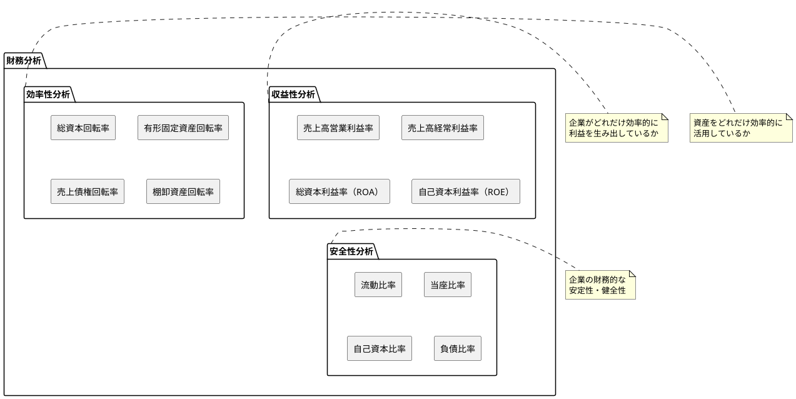
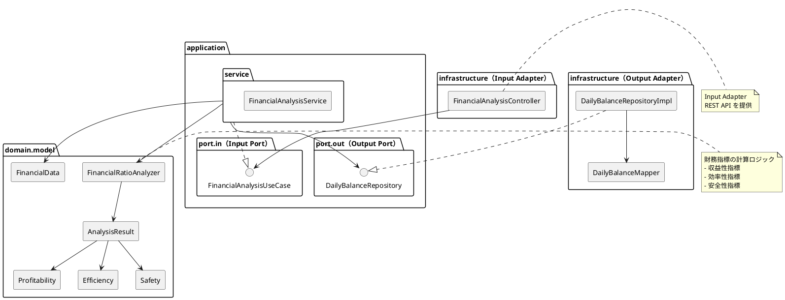

# 第21章: 財務分析

## 21.1 本章の概要

第19章で貸借対照表（B/S）、第20章で損益計算書（P/L）の生成機能を実装しました。本章では、これらの財務諸表データを活用して財務分析を行う機能を実装します。財務分析は、企業の収益性・効率性・安全性を定量的に評価し、経営判断に役立てるための重要な機能です。

### 財務分析の分類

財務分析では、以下の3つの観点から企業を評価します。



### アーキテクチャの全体像



### パッケージ構成

```
com.example.accounting/
├── domain/
│   └── model/
│       └── financial/
│           ├── FinancialData.java            # 財務データ値オブジェクト
│           ├── FinancialRatioAnalyzer.java   # 財務指標計算クラス
│           ├── AnalysisResult.java           # 分析結果
│           ├── Profitability.java            # 収益性指標
│           ├── Efficiency.java               # 効率性指標
│           └── Safety.java                   # 安全性指標
├── application/
│   ├── port/
│   │   ├── in/
│   │   │   ├── FinancialAnalysisUseCase.java  # Input Port
│   │   │   └── dto/
│   │   │       ├── FinancialAnalysisResult.java
│   │   │       └── ComparativeAnalysisResult.java
│   │   └── out/
│   │       └── DailyBalanceRepository.java    # Output Port（既存）
│   └── service/
│       └── FinancialAnalysisService.java      # Application Service
└── infrastructure/
    └── web/
        ├── controller/
        │   └── FinancialAnalysisController.java  # Input Adapter
        └── dto/
            └── FinancialAnalysisResponse.java
```

### TDD の流れ

1. **Domain Model**: FinancialData、FinancialRatioAnalyzer の作成
2. **Output Port**: DailyBalanceRepository（既存）の拡張
3. **Input Port**: FinancialAnalysisUseCase インターフェースの定義
4. **Application Service**: Mockito でアプリケーションサービスをテスト
5. **Input Adapter**: Testcontainers で REST API 統合テスト

---

## 21.2 Domain Model の実装

### 21.2.1 FinancialData（財務データ値オブジェクト）

財務データを表現する不変の値オブジェクトです。日次残高データから財務分析に必要な数値を集約します。

```java
package com.example.accounting.domain.model.financial;

import lombok.Value;
import lombok.With;

import java.math.BigDecimal;
import java.util.List;
import java.util.Map;
import java.util.stream.Collectors;

/**
 * 財務データを表現する値オブジェクト
 *
 * このクラスは不変であり、スレッドセーフです。
 */
@Value
@With
public class FinancialData {

    int fiscalYear;
    BigDecimal sales;                    // 売上高
    BigDecimal costOfSales;              // 売上原価
    BigDecimal grossProfit;              // 売上総利益
    BigDecimal operatingProfit;          // 営業利益
    BigDecimal ordinaryProfit;           // 経常利益
    BigDecimal netProfit;                // 当期純利益
    BigDecimal totalAssets;              // 総資産
    BigDecimal tangibleFixedAssets;      // 有形固定資産
    BigDecimal currentAssets;            // 流動資産
    BigDecimal currentLiabilities;       // 流動負債
    BigDecimal quickAssets;              // 当座資産
    BigDecimal equity;                   // 純資産（自己資本）
    BigDecimal inventory;                // 棚卸資産
    BigDecimal receivables;              // 売上債権

    /**
     * 日次残高データから財務データを生成
     */
    public static FinancialData fromDailyBalances(
            int fiscalYear,
            List<AccountBalance> balances
    ) {
        // 勘定科目コードの先頭2桁でグループ化
        Map<String, BigDecimal> balancesByPrefix = balances.stream()
            .collect(Collectors.groupingBy(
                b -> b.accountCode().substring(0, 2),
                Collectors.reducing(
                    BigDecimal.ZERO,
                    AccountBalance::balance,
                    BigDecimal::add
                )
            ));

        // 損益計算書項目
        BigDecimal sales = balancesByPrefix.getOrDefault("41", BigDecimal.ZERO);
        BigDecimal costOfSales = balancesByPrefix.getOrDefault("51", BigDecimal.ZERO);
        BigDecimal sellingExpenses = balancesByPrefix.getOrDefault("52", BigDecimal.ZERO);
        BigDecimal nonOperatingRevenue = balancesByPrefix.getOrDefault("42", BigDecimal.ZERO);
        BigDecimal nonOperatingExpense = balancesByPrefix.getOrDefault("61", BigDecimal.ZERO);
        BigDecimal incomeTaxes = balancesByPrefix.getOrDefault("71", BigDecimal.ZERO);

        BigDecimal grossProfit = sales.subtract(costOfSales);
        BigDecimal operatingProfit = grossProfit.subtract(sellingExpenses);
        BigDecimal ordinaryProfit = operatingProfit
            .add(nonOperatingRevenue)
            .subtract(nonOperatingExpense);
        BigDecimal netProfit = ordinaryProfit.subtract(incomeTaxes);

        // 貸借対照表項目
        BigDecimal currentAssets = balancesByPrefix.getOrDefault("11", BigDecimal.ZERO);
        BigDecimal fixedAssets = balancesByPrefix.getOrDefault("12", BigDecimal.ZERO)
            .add(balancesByPrefix.getOrDefault("14", BigDecimal.ZERO))
            .add(balancesByPrefix.getOrDefault("15", BigDecimal.ZERO));
        BigDecimal totalAssets = currentAssets.add(fixedAssets);

        BigDecimal tangibleFixedAssets = balancesByPrefix.getOrDefault("14", BigDecimal.ZERO);
        BigDecimal currentLiabilities = balancesByPrefix.getOrDefault("21", BigDecimal.ZERO);
        BigDecimal fixedLiabilities = balancesByPrefix.getOrDefault("25", BigDecimal.ZERO);
        BigDecimal equity = balancesByPrefix.getOrDefault("31", BigDecimal.ZERO)
            .add(balancesByPrefix.getOrDefault("33", BigDecimal.ZERO));

        // 詳細項目（3桁コードで取得）
        Map<String, BigDecimal> balancesByCode = balances.stream()
            .collect(Collectors.toMap(
                AccountBalance::accountCode,
                AccountBalance::balance,
                BigDecimal::add
            ));

        BigDecimal inventory = balancesByCode.getOrDefault("114", BigDecimal.ZERO);
        BigDecimal receivables = balancesByCode.getOrDefault("112", BigDecimal.ZERO);
        BigDecimal quickAssets = currentAssets.subtract(inventory);

        return new FinancialData(
            fiscalYear,
            sales,
            costOfSales,
            grossProfit,
            operatingProfit,
            ordinaryProfit,
            netProfit,
            totalAssets,
            tangibleFixedAssets,
            currentAssets,
            currentLiabilities,
            quickAssets,
            equity,
            inventory,
            receivables
        );
    }

    /**
     * 勘定科目残高データ
     */
    public record AccountBalance(
        String accountCode,
        String accountName,
        BigDecimal balance
    ) {}
}
```

### 21.2.2 財務指標を表現する値オブジェクト

```java
package com.example.accounting.domain.model.financial;

import java.math.BigDecimal;

/**
 * 財務分析結果
 */
public record AnalysisResult(
    int fiscalYear,
    Profitability profitability,
    Efficiency efficiency,
    Safety safety
) {}

/**
 * 収益性指標
 */
public record Profitability(
    BigDecimal grossProfitMargin,          // 売上総利益率
    BigDecimal operatingProfitMargin,      // 売上高営業利益率
    BigDecimal ordinaryProfitMargin,       // 売上高経常利益率
    BigDecimal netProfitMargin,            // 売上高当期純利益率
    BigDecimal returnOnAssets,             // 総資本利益率（ROA）
    BigDecimal returnOnEquity              // 自己資本利益率（ROE）
) {
    /**
     * 収益性の評価
     */
    public String evaluate() {
        if (operatingProfitMargin.compareTo(new BigDecimal("10")) >= 0) {
            return "優良（営業利益率 10% 以上）";
        } else if (operatingProfitMargin.compareTo(new BigDecimal("5")) >= 0) {
            return "良好（営業利益率 5% 以上）";
        } else if (operatingProfitMargin.compareTo(BigDecimal.ZERO) > 0) {
            return "要改善（営業利益率 5% 未満）";
        } else {
            return "要注意（営業赤字）";
        }
    }
}

/**
 * 効率性指標
 */
public record Efficiency(
    BigDecimal totalAssetTurnover,           // 総資本回転率
    BigDecimal tangibleFixedAssetTurnover,   // 有形固定資産回転率
    BigDecimal receivablesTurnover,          // 売上債権回転率
    BigDecimal inventoryTurnover             // 棚卸資産回転率
) {
    /**
     * 効率性の評価
     */
    public String evaluate() {
        if (totalAssetTurnover.compareTo(new BigDecimal("2")) >= 0) {
            return "優良（総資本回転率 2 回以上）";
        } else if (totalAssetTurnover.compareTo(new BigDecimal("1")) >= 0) {
            return "良好（総資本回転率 1 回以上）";
        } else {
            return "要改善（総資本回転率 1 回未満）";
        }
    }
}

/**
 * 安全性指標
 */
public record Safety(
    BigDecimal currentRatio,     // 流動比率
    BigDecimal quickRatio,       // 当座比率
    BigDecimal equityRatio,      // 自己資本比率
    BigDecimal debtToEquityRatio // 負債比率
) {
    /**
     * 安全性の評価
     */
    public String evaluate() {
        if (currentRatio.compareTo(new BigDecimal("200")) >= 0
                && equityRatio.compareTo(new BigDecimal("50")) >= 0) {
            return "優良（流動比率 200% 以上、自己資本比率 50% 以上）";
        } else if (currentRatio.compareTo(new BigDecimal("100")) >= 0
                && equityRatio.compareTo(new BigDecimal("30")) >= 0) {
            return "良好（流動比率 100% 以上、自己資本比率 30% 以上）";
        } else {
            return "要注意（財務安全性に課題あり）";
        }
    }
}
```

### 21.2.3 FinancialRatioAnalyzer（財務指標計算クラス）

```java
package com.example.accounting.domain.model.financial;

import java.math.BigDecimal;
import java.math.RoundingMode;

/**
 * 財務分析指標を計算するクラス
 */
public class FinancialRatioAnalyzer {

    private static final int SCALE = 2;
    private static final RoundingMode ROUNDING_MODE = RoundingMode.HALF_UP;

    /**
     * 財務データを分析して各種指標を計算
     */
    public AnalysisResult analyze(FinancialData data) {
        validateData(data);

        return new AnalysisResult(
            data.getFiscalYear(),
            calculateProfitability(data),
            calculateEfficiency(data),
            calculateSafety(data)
        );
    }

    private void validateData(FinancialData data) {
        if (data.getSales().compareTo(BigDecimal.ZERO) == 0) {
            throw new IllegalArgumentException("売上高がゼロのため分析できません");
        }
        if (data.getTotalAssets().compareTo(BigDecimal.ZERO) == 0) {
            throw new IllegalArgumentException("総資産がゼロのため分析できません");
        }
    }

    // ===== 収益性指標 =====

    private Profitability calculateProfitability(FinancialData data) {
        BigDecimal sales = data.getSales();
        BigDecimal totalAssets = data.getTotalAssets();
        BigDecimal equity = data.getEquity();

        return new Profitability(
            calculateRatio(data.getGrossProfit(), sales),           // 売上総利益率
            calculateRatio(data.getOperatingProfit(), sales),       // 売上高営業利益率
            calculateRatio(data.getOrdinaryProfit(), sales),        // 売上高経常利益率
            calculateRatio(data.getNetProfit(), sales),             // 売上高当期純利益率
            calculateRatio(data.getOperatingProfit(), totalAssets), // ROA
            equity.compareTo(BigDecimal.ZERO) > 0
                ? calculateRatio(data.getNetProfit(), equity)       // ROE
                : BigDecimal.ZERO
        );
    }

    // ===== 効率性指標 =====

    private Efficiency calculateEfficiency(FinancialData data) {
        BigDecimal sales = data.getSales();

        return new Efficiency(
            calculateTurnover(sales, data.getTotalAssets()),           // 総資本回転率
            calculateTurnoverSafe(sales, data.getTangibleFixedAssets()), // 有形固定資産回転率
            calculateTurnoverSafe(sales, data.getReceivables()),       // 売上債権回転率
            calculateTurnoverSafe(data.getCostOfSales(), data.getInventory()) // 棚卸資産回転率
        );
    }

    // ===== 安全性指標 =====

    private Safety calculateSafety(FinancialData data) {
        BigDecimal currentAssets = data.getCurrentAssets();
        BigDecimal currentLiabilities = data.getCurrentLiabilities();
        BigDecimal totalAssets = data.getTotalAssets();
        BigDecimal equity = data.getEquity();
        BigDecimal totalLiabilities = totalAssets.subtract(equity);

        return new Safety(
            calculateRatioSafe(currentAssets, currentLiabilities),     // 流動比率
            calculateRatioSafe(data.getQuickAssets(), currentLiabilities), // 当座比率
            calculateRatio(equity, totalAssets),                       // 自己資本比率
            equity.compareTo(BigDecimal.ZERO) > 0
                ? calculateRatio(totalLiabilities, equity)             // 負債比率
                : BigDecimal.ZERO
        );
    }

    // ===== 計算ヘルパーメソッド =====

    /**
     * 比率を計算（パーセント表示）
     */
    private BigDecimal calculateRatio(BigDecimal numerator, BigDecimal denominator) {
        if (denominator.compareTo(BigDecimal.ZERO) == 0) {
            throw new IllegalArgumentException("分母がゼロのため計算できません");
        }
        return numerator
            .divide(denominator, 4, ROUNDING_MODE)
            .multiply(new BigDecimal("100"))
            .setScale(SCALE, ROUNDING_MODE);
    }

    /**
     * 比率を計算（パーセント表示、ゼロ除算時は0を返す）
     */
    private BigDecimal calculateRatioSafe(BigDecimal numerator, BigDecimal denominator) {
        if (denominator.compareTo(BigDecimal.ZERO) == 0) {
            return BigDecimal.ZERO;
        }
        return calculateRatio(numerator, denominator);
    }

    /**
     * 回転率を計算（回）
     */
    private BigDecimal calculateTurnover(BigDecimal numerator, BigDecimal denominator) {
        if (denominator.compareTo(BigDecimal.ZERO) == 0) {
            throw new IllegalArgumentException("分母がゼロのため計算できません");
        }
        return numerator
            .divide(denominator, SCALE, ROUNDING_MODE);
    }

    /**
     * 回転率を計算（回、ゼロ除算時は0を返す）
     */
    private BigDecimal calculateTurnoverSafe(BigDecimal numerator, BigDecimal denominator) {
        if (denominator.compareTo(BigDecimal.ZERO) == 0) {
            return BigDecimal.ZERO;
        }
        return calculateTurnover(numerator, denominator);
    }
}
```

---

## 21.3 Output Port（リポジトリインターフェース）

財務分析では、既存の日次残高リポジトリを拡張して使用します。

```java
package com.example.accounting.application.port.out;

import com.example.accounting.domain.model.financial.FinancialData.AccountBalance;

import java.time.LocalDate;
import java.util.List;

/**
 * 日次残高リポジトリ（Output Port）- 財務分析用メソッド追加
 */
public interface DailyBalanceRepository {

    // ... 既存メソッド ...

    /**
     * 指定年度末の勘定科目別残高を取得
     */
    List<AccountBalance> findBalancesByFiscalYearEnd(int fiscalYear);

    /**
     * 指定期間の勘定科目別累計を取得（損益計算書用）
     */
    List<AccountBalance> findCumulativeBalancesByFiscalYear(int fiscalYear);

    /**
     * 複数年度の残高を取得（比較分析用）
     */
    List<AccountBalance> findBalancesByFiscalYears(List<Integer> fiscalYears);
}
```

---

## 21.4 Output Adapter（リポジトリ実装）

### 21.4.1 MyBatis Mapper

```java
package com.example.accounting.infrastructure.persistence.mapper;

import com.example.accounting.domain.model.financial.FinancialData.AccountBalance;
import org.apache.ibatis.annotations.Mapper;
import org.apache.ibatis.annotations.Param;

import java.time.LocalDate;
import java.util.List;

@Mapper
public interface DailyBalanceMapper {

    // ... 既存メソッド ...

    /**
     * 年度末残高を取得（B/S 科目）
     */
    List<AccountBalance> selectBalanceSheetBalances(
        @Param("fiscalYearEnd") LocalDate fiscalYearEnd
    );

    /**
     * 年度累計を取得（P/L 科目）
     */
    List<AccountBalance> selectProfitLossBalances(
        @Param("fiscalYearStart") LocalDate fiscalYearStart,
        @Param("fiscalYearEnd") LocalDate fiscalYearEnd
    );
}
```

**DailyBalanceMapper.xml（追加分）**:

```xml
<!-- 年度末残高を取得（B/S 科目） -->
<select id="selectBalanceSheetBalances"
        resultType="com.example.accounting.domain.model.financial.FinancialData$AccountBalance">
    SELECT
        km."勘定科目コード" AS accountCode,
        km."勘定科目名" AS accountName,
        COALESCE(SUM(nz."残高"), 0) AS balance
    FROM "勘定科目マスタ" km
    LEFT JOIN "日次残高" nz ON km."勘定科目コード" = nz."勘定科目コード"
        AND nz."日付" = #{fiscalYearEnd}
    WHERE km."BSPL区分" = 'B'
    GROUP BY km."勘定科目コード", km."勘定科目名"
    ORDER BY km."勘定科目コード"
</select>

<!-- 年度累計を取得（P/L 科目） -->
<select id="selectProfitLossBalances"
        resultType="com.example.accounting.domain.model.financial.FinancialData$AccountBalance">
    SELECT
        km."勘定科目コード" AS accountCode,
        km."勘定科目名" AS accountName,
        COALESCE(SUM(
            CASE
                WHEN km."勘定科目種別" IN ('収益') THEN nz."貸方金額" - nz."借方金額"
                ELSE nz."借方金額" - nz."貸方金額"
            END
        ), 0) AS balance
    FROM "勘定科目マスタ" km
    LEFT JOIN "仕訳明細" jd ON km."勘定科目コード" = jd."勘定科目コード"
    LEFT JOIN "仕訳" j ON jd."仕訳ID" = j."仕訳ID"
    WHERE km."BSPL区分" = 'P'
        AND j."仕訳日" BETWEEN #{fiscalYearStart} AND #{fiscalYearEnd}
        AND j."仕訳ステータス" = '確定'
    GROUP BY km."勘定科目コード", km."勘定科目名"
    ORDER BY km."勘定科目コード"
</select>
```

### 21.4.2 Repository 実装

```java
package com.example.accounting.infrastructure.persistence.repository;

import com.example.accounting.application.port.out.DailyBalanceRepository;
import com.example.accounting.domain.model.financial.FinancialData.AccountBalance;
import com.example.accounting.infrastructure.persistence.mapper.DailyBalanceMapper;
import lombok.RequiredArgsConstructor;
import org.springframework.stereotype.Repository;

import java.time.LocalDate;
import java.util.ArrayList;
import java.util.List;

@Repository
@RequiredArgsConstructor
public class DailyBalanceRepositoryImpl implements DailyBalanceRepository {

    private final DailyBalanceMapper dailyBalanceMapper;

    // ... 既存メソッド ...

    @Override
    public List<AccountBalance> findBalancesByFiscalYearEnd(int fiscalYear) {
        LocalDate fiscalYearEnd = LocalDate.of(fiscalYear + 1, 3, 31);
        return dailyBalanceMapper.selectBalanceSheetBalances(fiscalYearEnd);
    }

    @Override
    public List<AccountBalance> findCumulativeBalancesByFiscalYear(int fiscalYear) {
        LocalDate fiscalYearStart = LocalDate.of(fiscalYear, 4, 1);
        LocalDate fiscalYearEnd = LocalDate.of(fiscalYear + 1, 3, 31);
        return dailyBalanceMapper.selectProfitLossBalances(fiscalYearStart, fiscalYearEnd);
    }

    @Override
    public List<AccountBalance> findBalancesByFiscalYears(List<Integer> fiscalYears) {
        List<AccountBalance> allBalances = new ArrayList<>();
        for (Integer year : fiscalYears) {
            allBalances.addAll(findBalancesByFiscalYearEnd(year));
            allBalances.addAll(findCumulativeBalancesByFiscalYear(year));
        }
        return allBalances;
    }
}
```

---

## 21.5 Input Port（ユースケースインターフェース）

```java
package com.example.accounting.application.port.in;

import java.math.BigDecimal;
import java.util.List;

/**
 * 財務分析ユースケース（Input Port）
 */
public interface FinancialAnalysisUseCase {

    /**
     * 指定された会計年度の財務分析を実行
     */
    FinancialAnalysisResult analyzeByFiscalYear(int fiscalYear);

    /**
     * 複数期間の財務分析を比較
     */
    ComparativeAnalysisResult compareMultiplePeriods(List<Integer> fiscalYears);
}

/**
 * 財務分析結果
 */
record FinancialAnalysisResult(
    int fiscalYear,
    FinancialDataDto financialData,
    RatiosDto ratios,
    EvaluationDto evaluation
) {}

/**
 * 財務データ DTO
 */
record FinancialDataDto(
    BigDecimal sales,
    BigDecimal costOfSales,
    BigDecimal grossProfit,
    BigDecimal operatingProfit,
    BigDecimal ordinaryProfit,
    BigDecimal netProfit,
    BigDecimal totalAssets,
    BigDecimal currentAssets,
    BigDecimal currentLiabilities,
    BigDecimal equity
) {}

/**
 * 財務指標 DTO
 */
record RatiosDto(
    ProfitabilityDto profitability,
    EfficiencyDto efficiency,
    SafetyDto safety
) {}

record ProfitabilityDto(
    BigDecimal grossProfitMargin,
    BigDecimal operatingProfitMargin,
    BigDecimal ordinaryProfitMargin,
    BigDecimal netProfitMargin,
    BigDecimal returnOnAssets,
    BigDecimal returnOnEquity
) {}

record EfficiencyDto(
    BigDecimal totalAssetTurnover,
    BigDecimal tangibleFixedAssetTurnover,
    BigDecimal receivablesTurnover,
    BigDecimal inventoryTurnover
) {}

record SafetyDto(
    BigDecimal currentRatio,
    BigDecimal quickRatio,
    BigDecimal equityRatio,
    BigDecimal debtToEquityRatio
) {}

/**
 * 評価 DTO
 */
record EvaluationDto(
    String profitability,
    String efficiency,
    String safety,
    String overall
) {}

/**
 * 比較分析結果
 */
record ComparativeAnalysisResult(
    List<FinancialAnalysisResult> periods,
    TrendsDto trends
) {}

/**
 * トレンド DTO
 */
record TrendsDto(
    BigDecimal salesGrowthRate,
    BigDecimal operatingProfitMarginChange,
    BigDecimal totalAssetTurnoverChange,
    BigDecimal equityRatioChange
) {}
```

---

## 21.6 Application Service

```java
package com.example.accounting.application.service;

import com.example.accounting.application.port.in.*;
import com.example.accounting.application.port.out.DailyBalanceRepository;
import com.example.accounting.domain.model.financial.*;
import com.example.accounting.domain.model.financial.FinancialData.AccountBalance;
import lombok.RequiredArgsConstructor;
import org.springframework.stereotype.Service;
import org.springframework.transaction.annotation.Transactional;

import java.math.BigDecimal;
import java.math.RoundingMode;
import java.util.ArrayList;
import java.util.List;

/**
 * 財務分析サービス
 */
@Service
@RequiredArgsConstructor
@Transactional(readOnly = true)
public class FinancialAnalysisService implements FinancialAnalysisUseCase {

    private final DailyBalanceRepository dailyBalanceRepository;
    private final FinancialRatioAnalyzer analyzer = new FinancialRatioAnalyzer();

    @Override
    public FinancialAnalysisResult analyzeByFiscalYear(int fiscalYear) {
        // B/S と P/L の残高を取得
        List<AccountBalance> bsBalances = dailyBalanceRepository
            .findBalancesByFiscalYearEnd(fiscalYear);
        List<AccountBalance> plBalances = dailyBalanceRepository
            .findCumulativeBalancesByFiscalYear(fiscalYear);

        if (bsBalances.isEmpty() && plBalances.isEmpty()) {
            throw new IllegalArgumentException(
                String.format("会計年度 %d の財務データが見つかりません", fiscalYear)
            );
        }

        // 残高データを統合
        List<AccountBalance> allBalances = new ArrayList<>();
        allBalances.addAll(bsBalances);
        allBalances.addAll(plBalances);

        // 財務データを生成
        FinancialData financialData = FinancialData.fromDailyBalances(fiscalYear, allBalances);

        // 財務分析を実行
        AnalysisResult analysisResult = analyzer.analyze(financialData);

        // 結果を DTO に変換
        return toFinancialAnalysisResult(financialData, analysisResult);
    }

    @Override
    public ComparativeAnalysisResult compareMultiplePeriods(List<Integer> fiscalYears) {
        if (fiscalYears.size() < 2) {
            throw new IllegalArgumentException("比較分析には2期間以上が必要です");
        }

        // 各期間の分析を実行
        List<FinancialAnalysisResult> periods = fiscalYears.stream()
            .sorted()
            .map(this::analyzeByFiscalYear)
            .toList();

        // トレンドを計算
        TrendsDto trends = calculateTrends(periods);

        return new ComparativeAnalysisResult(periods, trends);
    }

    private TrendsDto calculateTrends(List<FinancialAnalysisResult> periods) {
        FinancialAnalysisResult first = periods.get(0);
        FinancialAnalysisResult last = periods.get(periods.size() - 1);

        // 売上高成長率
        BigDecimal salesGrowthRate = BigDecimal.ZERO;
        if (first.financialData().sales().compareTo(BigDecimal.ZERO) > 0) {
            salesGrowthRate = last.financialData().sales()
                .subtract(first.financialData().sales())
                .divide(first.financialData().sales(), 4, RoundingMode.HALF_UP)
                .multiply(new BigDecimal("100"))
                .setScale(2, RoundingMode.HALF_UP);
        }

        // 各指標の変化
        BigDecimal operatingProfitMarginChange = last.ratios().profitability().operatingProfitMargin()
            .subtract(first.ratios().profitability().operatingProfitMargin());

        BigDecimal totalAssetTurnoverChange = last.ratios().efficiency().totalAssetTurnover()
            .subtract(first.ratios().efficiency().totalAssetTurnover());

        BigDecimal equityRatioChange = last.ratios().safety().equityRatio()
            .subtract(first.ratios().safety().equityRatio());

        return new TrendsDto(
            salesGrowthRate,
            operatingProfitMarginChange,
            totalAssetTurnoverChange,
            equityRatioChange
        );
    }

    private FinancialAnalysisResult toFinancialAnalysisResult(
            FinancialData data,
            AnalysisResult result
    ) {
        return new FinancialAnalysisResult(
            result.fiscalYear(),
            toFinancialDataDto(data),
            toRatiosDto(result),
            toEvaluationDto(result)
        );
    }

    private FinancialDataDto toFinancialDataDto(FinancialData data) {
        return new FinancialDataDto(
            data.getSales(),
            data.getCostOfSales(),
            data.getGrossProfit(),
            data.getOperatingProfit(),
            data.getOrdinaryProfit(),
            data.getNetProfit(),
            data.getTotalAssets(),
            data.getCurrentAssets(),
            data.getCurrentLiabilities(),
            data.getEquity()
        );
    }

    private RatiosDto toRatiosDto(AnalysisResult result) {
        return new RatiosDto(
            new ProfitabilityDto(
                result.profitability().grossProfitMargin(),
                result.profitability().operatingProfitMargin(),
                result.profitability().ordinaryProfitMargin(),
                result.profitability().netProfitMargin(),
                result.profitability().returnOnAssets(),
                result.profitability().returnOnEquity()
            ),
            new EfficiencyDto(
                result.efficiency().totalAssetTurnover(),
                result.efficiency().tangibleFixedAssetTurnover(),
                result.efficiency().receivablesTurnover(),
                result.efficiency().inventoryTurnover()
            ),
            new SafetyDto(
                result.safety().currentRatio(),
                result.safety().quickRatio(),
                result.safety().equityRatio(),
                result.safety().debtToEquityRatio()
            )
        );
    }

    private EvaluationDto toEvaluationDto(AnalysisResult result) {
        String profitabilityEval = result.profitability().evaluate();
        String efficiencyEval = result.efficiency().evaluate();
        String safetyEval = result.safety().evaluate();

        // 総合評価
        String overall = evaluateOverall(result);

        return new EvaluationDto(
            profitabilityEval,
            efficiencyEval,
            safetyEval,
            overall
        );
    }

    private String evaluateOverall(AnalysisResult result) {
        int score = 0;

        // 収益性（営業利益率）
        if (result.profitability().operatingProfitMargin()
                .compareTo(new BigDecimal("10")) >= 0) {
            score += 3;
        } else if (result.profitability().operatingProfitMargin()
                .compareTo(new BigDecimal("5")) >= 0) {
            score += 2;
        } else if (result.profitability().operatingProfitMargin()
                .compareTo(BigDecimal.ZERO) > 0) {
            score += 1;
        }

        // 効率性（総資本回転率）
        if (result.efficiency().totalAssetTurnover()
                .compareTo(new BigDecimal("2")) >= 0) {
            score += 3;
        } else if (result.efficiency().totalAssetTurnover()
                .compareTo(new BigDecimal("1")) >= 0) {
            score += 2;
        } else {
            score += 1;
        }

        // 安全性（自己資本比率）
        if (result.safety().equityRatio()
                .compareTo(new BigDecimal("50")) >= 0) {
            score += 3;
        } else if (result.safety().equityRatio()
                .compareTo(new BigDecimal("30")) >= 0) {
            score += 2;
        } else {
            score += 1;
        }

        // 総合評価
        if (score >= 8) {
            return "A（優良）";
        } else if (score >= 6) {
            return "B（良好）";
        } else if (score >= 4) {
            return "C（普通）";
        } else {
            return "D（要改善）";
        }
    }
}
```

---

## 21.7 Application Service のテスト（Mockito）

```java
package com.example.accounting.application.service;

import com.example.accounting.application.port.in.ComparativeAnalysisResult;
import com.example.accounting.application.port.in.FinancialAnalysisResult;
import com.example.accounting.application.port.out.DailyBalanceRepository;
import com.example.accounting.domain.model.financial.FinancialData.AccountBalance;
import org.junit.jupiter.api.*;
import org.junit.jupiter.api.extension.ExtendWith;
import org.mockito.InjectMocks;
import org.mockito.Mock;
import org.mockito.junit.jupiter.MockitoExtension;

import java.math.BigDecimal;
import java.util.List;

import static org.assertj.core.api.Assertions.*;
import static org.mockito.Mockito.*;

@ExtendWith(MockitoExtension.class)
@DisplayName("財務分析サービスのテスト")
class FinancialAnalysisServiceTest {

    @Mock
    private DailyBalanceRepository dailyBalanceRepository;

    @InjectMocks
    private FinancialAnalysisService service;

    @Test
    @DisplayName("会計年度を指定して財務分析を実行できる")
    void shouldAnalyzeByFiscalYear() {
        // Given
        List<AccountBalance> bsBalances = createBSBalances();
        List<AccountBalance> plBalances = createPLBalances();

        when(dailyBalanceRepository.findBalancesByFiscalYearEnd(2024))
            .thenReturn(bsBalances);
        when(dailyBalanceRepository.findCumulativeBalancesByFiscalYear(2024))
            .thenReturn(plBalances);

        // When
        FinancialAnalysisResult result = service.analyzeByFiscalYear(2024);

        // Then
        assertThat(result.fiscalYear()).isEqualTo(2024);
        assertThat(result.financialData().sales())
            .isEqualByComparingTo(new BigDecimal("100000000"));
        assertThat(result.ratios().profitability().operatingProfitMargin())
            .isGreaterThan(BigDecimal.ZERO);
        assertThat(result.evaluation().overall()).isNotBlank();
    }

    @Test
    @DisplayName("データが見つからない場合は例外をスローする")
    void shouldThrowExceptionWhenDataNotFound() {
        // Given
        when(dailyBalanceRepository.findBalancesByFiscalYearEnd(9999))
            .thenReturn(List.of());
        when(dailyBalanceRepository.findCumulativeBalancesByFiscalYear(9999))
            .thenReturn(List.of());

        // When & Then
        assertThatThrownBy(() -> service.analyzeByFiscalYear(9999))
            .isInstanceOf(IllegalArgumentException.class)
            .hasMessageContaining("9999");
    }

    @Test
    @DisplayName("複数期間の比較分析を実行できる")
    void shouldCompareMultiplePeriods() {
        // Given
        setupMockDataForYear(2023);
        setupMockDataForYear(2024);

        // When
        ComparativeAnalysisResult result = service
            .compareMultiplePeriods(List.of(2023, 2024));

        // Then
        assertThat(result.periods()).hasSize(2);
        assertThat(result.trends()).isNotNull();
        assertThat(result.trends().salesGrowthRate()).isNotNull();
    }

    @Test
    @DisplayName("比較分析には2期間以上が必要")
    void shouldRequireAtLeastTwoPeriods() {
        // When & Then
        assertThatThrownBy(() -> service.compareMultiplePeriods(List.of(2024)))
            .isInstanceOf(IllegalArgumentException.class)
            .hasMessageContaining("2期間以上");
    }

    @Test
    @DisplayName("収益性指標が正しく計算される")
    void shouldCalculateProfitabilityCorrectly() {
        // Given
        List<AccountBalance> bsBalances = createBSBalances();
        List<AccountBalance> plBalances = createPLBalances();

        when(dailyBalanceRepository.findBalancesByFiscalYearEnd(2024))
            .thenReturn(bsBalances);
        when(dailyBalanceRepository.findCumulativeBalancesByFiscalYear(2024))
            .thenReturn(plBalances);

        // When
        FinancialAnalysisResult result = service.analyzeByFiscalYear(2024);

        // Then
        assertThat(result.ratios().profitability().grossProfitMargin())
            .isGreaterThan(BigDecimal.ZERO);
        assertThat(result.ratios().profitability().operatingProfitMargin())
            .isGreaterThan(BigDecimal.ZERO);
        assertThat(result.ratios().profitability().returnOnAssets())
            .isGreaterThan(BigDecimal.ZERO);
    }

    @Test
    @DisplayName("効率性指標が正しく計算される")
    void shouldCalculateEfficiencyCorrectly() {
        // Given
        List<AccountBalance> bsBalances = createBSBalances();
        List<AccountBalance> plBalances = createPLBalances();

        when(dailyBalanceRepository.findBalancesByFiscalYearEnd(2024))
            .thenReturn(bsBalances);
        when(dailyBalanceRepository.findCumulativeBalancesByFiscalYear(2024))
            .thenReturn(plBalances);

        // When
        FinancialAnalysisResult result = service.analyzeByFiscalYear(2024);

        // Then
        assertThat(result.ratios().efficiency().totalAssetTurnover())
            .isGreaterThan(BigDecimal.ZERO);
    }

    @Test
    @DisplayName("安全性指標が正しく計算される")
    void shouldCalculateSafetyCorrectly() {
        // Given
        List<AccountBalance> bsBalances = createBSBalances();
        List<AccountBalance> plBalances = createPLBalances();

        when(dailyBalanceRepository.findBalancesByFiscalYearEnd(2024))
            .thenReturn(bsBalances);
        when(dailyBalanceRepository.findCumulativeBalancesByFiscalYear(2024))
            .thenReturn(plBalances);

        // When
        FinancialAnalysisResult result = service.analyzeByFiscalYear(2024);

        // Then
        assertThat(result.ratios().safety().currentRatio())
            .isGreaterThan(BigDecimal.ZERO);
        assertThat(result.ratios().safety().equityRatio())
            .isGreaterThan(BigDecimal.ZERO);
    }

    @Test
    @DisplayName("総合評価が算出される")
    void shouldCalculateOverallEvaluation() {
        // Given
        List<AccountBalance> bsBalances = createBSBalances();
        List<AccountBalance> plBalances = createPLBalances();

        when(dailyBalanceRepository.findBalancesByFiscalYearEnd(2024))
            .thenReturn(bsBalances);
        when(dailyBalanceRepository.findCumulativeBalancesByFiscalYear(2024))
            .thenReturn(plBalances);

        // When
        FinancialAnalysisResult result = service.analyzeByFiscalYear(2024);

        // Then
        assertThat(result.evaluation().overall())
            .matches("^[A-D]（.*）$");
    }

    // テストヘルパーメソッド

    private List<AccountBalance> createBSBalances() {
        return List.of(
            new AccountBalance("1101", "現金", new BigDecimal("10000000")),
            new AccountBalance("1102", "普通預金", new BigDecimal("40000000")),
            new AccountBalance("1121", "売掛金", new BigDecimal("15000000")),
            new AccountBalance("1141", "商品", new BigDecimal("5000000")),
            new AccountBalance("1401", "建物", new BigDecimal("20000000")),
            new AccountBalance("2101", "買掛金", new BigDecimal("10000000")),
            new AccountBalance("2102", "未払金", new BigDecimal("5000000")),
            new AccountBalance("3101", "資本金", new BigDecimal("50000000")),
            new AccountBalance("3301", "繰越利益剰余金", new BigDecimal("25000000"))
        );
    }

    private List<AccountBalance> createPLBalances() {
        return List.of(
            new AccountBalance("4101", "売上高", new BigDecimal("100000000")),
            new AccountBalance("5101", "売上原価", new BigDecimal("60000000")),
            new AccountBalance("5201", "販売費", new BigDecimal("15000000")),
            new AccountBalance("5202", "一般管理費", new BigDecimal("10000000")),
            new AccountBalance("4201", "受取利息", new BigDecimal("100000")),
            new AccountBalance("6101", "支払利息", new BigDecimal("50000"))
        );
    }

    private void setupMockDataForYear(int fiscalYear) {
        when(dailyBalanceRepository.findBalancesByFiscalYearEnd(fiscalYear))
            .thenReturn(createBSBalances());
        when(dailyBalanceRepository.findCumulativeBalancesByFiscalYear(fiscalYear))
            .thenReturn(createPLBalances());
    }
}
```

---

## 21.8 Input Adapter（REST Controller）

### 21.8.1 Controller 実装

```java
package com.example.accounting.infrastructure.web.controller;

import com.example.accounting.application.port.in.ComparativeAnalysisResult;
import com.example.accounting.application.port.in.FinancialAnalysisResult;
import com.example.accounting.application.port.in.FinancialAnalysisUseCase;
import lombok.RequiredArgsConstructor;
import org.springframework.http.ResponseEntity;
import org.springframework.web.bind.annotation.*;

import java.util.Arrays;
import java.util.List;

/**
 * 財務分析 REST Controller（Input Adapter）
 */
@RestController
@RequestMapping("/api/financial-analysis")
@RequiredArgsConstructor
public class FinancialAnalysisController {

    private final FinancialAnalysisUseCase financialAnalysisUseCase;

    /**
     * 指定された会計年度の財務分析を取得
     */
    @GetMapping("/{fiscalYear}")
    public ResponseEntity<FinancialAnalysisResult> getFinancialAnalysis(
            @PathVariable int fiscalYear
    ) {
        FinancialAnalysisResult result = financialAnalysisUseCase
            .analyzeByFiscalYear(fiscalYear);
        return ResponseEntity.ok(result);
    }

    /**
     * 複数期間の財務分析を比較
     */
    @GetMapping("/compare")
    public ResponseEntity<ComparativeAnalysisResult> compareMultiplePeriods(
            @RequestParam String years
    ) {
        List<Integer> fiscalYears = parseYears(years);
        ComparativeAnalysisResult result = financialAnalysisUseCase
            .compareMultiplePeriods(fiscalYears);
        return ResponseEntity.ok(result);
    }

    /**
     * 収益性指標のみを取得
     */
    @GetMapping("/{fiscalYear}/profitability")
    public ResponseEntity<?> getProfitability(@PathVariable int fiscalYear) {
        FinancialAnalysisResult result = financialAnalysisUseCase
            .analyzeByFiscalYear(fiscalYear);
        return ResponseEntity.ok(result.ratios().profitability());
    }

    /**
     * 効率性指標のみを取得
     */
    @GetMapping("/{fiscalYear}/efficiency")
    public ResponseEntity<?> getEfficiency(@PathVariable int fiscalYear) {
        FinancialAnalysisResult result = financialAnalysisUseCase
            .analyzeByFiscalYear(fiscalYear);
        return ResponseEntity.ok(result.ratios().efficiency());
    }

    /**
     * 安全性指標のみを取得
     */
    @GetMapping("/{fiscalYear}/safety")
    public ResponseEntity<?> getSafety(@PathVariable int fiscalYear) {
        FinancialAnalysisResult result = financialAnalysisUseCase
            .analyzeByFiscalYear(fiscalYear);
        return ResponseEntity.ok(result.ratios().safety());
    }

    /**
     * 総合評価のみを取得
     */
    @GetMapping("/{fiscalYear}/evaluation")
    public ResponseEntity<?> getEvaluation(@PathVariable int fiscalYear) {
        FinancialAnalysisResult result = financialAnalysisUseCase
            .analyzeByFiscalYear(fiscalYear);
        return ResponseEntity.ok(result.evaluation());
    }

    private List<Integer> parseYears(String years) {
        try {
            return Arrays.stream(years.split(","))
                .map(String::trim)
                .map(Integer::parseInt)
                .toList();
        } catch (NumberFormatException e) {
            throw new IllegalArgumentException("無効な年度形式です: " + years);
        }
    }
}
```

### 21.8.2 統合テスト（Testcontainers）

```java
package com.example.accounting.infrastructure.web.controller;

import org.junit.jupiter.api.*;
import org.springframework.beans.factory.annotation.Autowired;
import org.springframework.boot.test.autoconfigure.web.servlet.AutoConfigureMockMvc;
import org.springframework.boot.test.context.SpringBootTest;
import org.springframework.test.context.DynamicPropertyRegistry;
import org.springframework.test.context.DynamicPropertySource;
import org.springframework.test.context.jdbc.Sql;
import org.springframework.test.web.servlet.MockMvc;
import org.testcontainers.containers.PostgreSQLContainer;
import org.testcontainers.junit.jupiter.Container;
import org.testcontainers.junit.jupiter.Testcontainers;

import static org.hamcrest.Matchers.*;
import static org.springframework.test.web.servlet.request.MockMvcRequestBuilders.*;
import static org.springframework.test.web.servlet.result.MockMvcResultMatchers.*;

@SpringBootTest
@AutoConfigureMockMvc
@Testcontainers
@TestMethodOrder(MethodOrderer.OrderAnnotation.class)
@DisplayName("財務分析 API 統合テスト")
class FinancialAnalysisControllerIntegrationTest {

    @Container
    static PostgreSQLContainer<?> postgres = new PostgreSQLContainer<>("postgres:16-alpine")
            .withDatabaseName("testdb")
            .withUsername("testuser")
            .withPassword("testpass");

    @DynamicPropertySource
    static void configureProperties(DynamicPropertyRegistry registry) {
        registry.add("spring.datasource.url", postgres::getJdbcUrl);
        registry.add("spring.datasource.username", postgres::getUsername);
        registry.add("spring.datasource.password", postgres::getPassword);
        registry.add("spring.flyway.enabled", () -> "true");
    }

    @Autowired
    private MockMvc mockMvc;

    @Test
    @Order(1)
    @Sql("/sql/test-financial-data.sql")
    @DisplayName("GET /api/financial-analysis/{fiscalYear} - 財務分析を取得できる")
    void shouldGetFinancialAnalysis() throws Exception {
        mockMvc.perform(get("/api/financial-analysis/2024"))
            .andExpect(status().isOk())
            .andExpect(jsonPath("$.fiscalYear").value(2024))
            .andExpect(jsonPath("$.financialData.sales").isNumber())
            .andExpect(jsonPath("$.ratios.profitability.operatingProfitMargin").isNumber())
            .andExpect(jsonPath("$.ratios.efficiency.totalAssetTurnover").isNumber())
            .andExpect(jsonPath("$.ratios.safety.currentRatio").isNumber())
            .andExpect(jsonPath("$.evaluation.overall").isString());
    }

    @Test
    @Order(2)
    @DisplayName("GET /api/financial-analysis/compare - 複数期間の比較ができる")
    void shouldCompareMultiplePeriods() throws Exception {
        mockMvc.perform(get("/api/financial-analysis/compare")
                .param("years", "2023,2024"))
            .andExpect(status().isOk())
            .andExpect(jsonPath("$.periods").isArray())
            .andExpect(jsonPath("$.periods", hasSize(2)))
            .andExpect(jsonPath("$.trends.salesGrowthRate").isNumber())
            .andExpect(jsonPath("$.trends.operatingProfitMarginChange").isNumber());
    }

    @Test
    @Order(3)
    @DisplayName("GET /api/financial-analysis/{fiscalYear}/profitability - 収益性指標を取得できる")
    void shouldGetProfitability() throws Exception {
        mockMvc.perform(get("/api/financial-analysis/2024/profitability"))
            .andExpect(status().isOk())
            .andExpect(jsonPath("$.grossProfitMargin").isNumber())
            .andExpect(jsonPath("$.operatingProfitMargin").isNumber())
            .andExpect(jsonPath("$.returnOnAssets").isNumber())
            .andExpect(jsonPath("$.returnOnEquity").isNumber());
    }

    @Test
    @Order(4)
    @DisplayName("GET /api/financial-analysis/{fiscalYear}/efficiency - 効率性指標を取得できる")
    void shouldGetEfficiency() throws Exception {
        mockMvc.perform(get("/api/financial-analysis/2024/efficiency"))
            .andExpect(status().isOk())
            .andExpect(jsonPath("$.totalAssetTurnover").isNumber())
            .andExpect(jsonPath("$.tangibleFixedAssetTurnover").isNumber());
    }

    @Test
    @Order(5)
    @DisplayName("GET /api/financial-analysis/{fiscalYear}/safety - 安全性指標を取得できる")
    void shouldGetSafety() throws Exception {
        mockMvc.perform(get("/api/financial-analysis/2024/safety"))
            .andExpect(status().isOk())
            .andExpect(jsonPath("$.currentRatio").isNumber())
            .andExpect(jsonPath("$.quickRatio").isNumber())
            .andExpect(jsonPath("$.equityRatio").isNumber());
    }

    @Test
    @Order(6)
    @DisplayName("GET /api/financial-analysis/{fiscalYear}/evaluation - 評価を取得できる")
    void shouldGetEvaluation() throws Exception {
        mockMvc.perform(get("/api/financial-analysis/2024/evaluation"))
            .andExpect(status().isOk())
            .andExpect(jsonPath("$.profitability").isString())
            .andExpect(jsonPath("$.efficiency").isString())
            .andExpect(jsonPath("$.safety").isString())
            .andExpect(jsonPath("$.overall").isString());
    }

    @Test
    @Order(7)
    @DisplayName("存在しない年度は404を返す")
    void shouldReturn404WhenYearNotFound() throws Exception {
        mockMvc.perform(get("/api/financial-analysis/9999"))
            .andExpect(status().isNotFound())
            .andExpect(jsonPath("$.code").value("NOT_FOUND"));
    }

    @Test
    @Order(8)
    @DisplayName("無効な年度形式は400を返す")
    void shouldReturn400WhenInvalidYearFormat() throws Exception {
        mockMvc.perform(get("/api/financial-analysis/compare")
                .param("years", "invalid"))
            .andExpect(status().isBadRequest());
    }
}
```

---

## 21.9 API レスポンス例

### 単一年度の財務分析

```bash
GET /api/financial-analysis/2024
```

```json
{
  "fiscalYear": 2024,
  "financialData": {
    "sales": 100000000,
    "costOfSales": 60000000,
    "grossProfit": 40000000,
    "operatingProfit": 15000000,
    "ordinaryProfit": 15050000,
    "netProfit": 10535000,
    "totalAssets": 90000000,
    "currentAssets": 70000000,
    "currentLiabilities": 15000000,
    "equity": 75000000
  },
  "ratios": {
    "profitability": {
      "grossProfitMargin": 40.00,
      "operatingProfitMargin": 15.00,
      "ordinaryProfitMargin": 15.05,
      "netProfitMargin": 10.54,
      "returnOnAssets": 16.67,
      "returnOnEquity": 14.05
    },
    "efficiency": {
      "totalAssetTurnover": 1.11,
      "tangibleFixedAssetTurnover": 5.00,
      "receivablesTurnover": 6.67,
      "inventoryTurnover": 12.00
    },
    "safety": {
      "currentRatio": 466.67,
      "quickRatio": 433.33,
      "equityRatio": 83.33,
      "debtToEquityRatio": 20.00
    }
  },
  "evaluation": {
    "profitability": "優良（営業利益率 10% 以上）",
    "efficiency": "良好（総資本回転率 1 回以上）",
    "safety": "優良（流動比率 200% 以上、自己資本比率 50% 以上）",
    "overall": "A（優良）"
  }
}
```

### 複数期間の比較分析

```bash
GET /api/financial-analysis/compare?years=2023,2024
```

```json
{
  "periods": [
    {
      "fiscalYear": 2023,
      "financialData": { ... },
      "ratios": { ... },
      "evaluation": { ... }
    },
    {
      "fiscalYear": 2024,
      "financialData": { ... },
      "ratios": { ... },
      "evaluation": { ... }
    }
  ],
  "trends": {
    "salesGrowthRate": 10.50,
    "operatingProfitMarginChange": 2.30,
    "totalAssetTurnoverChange": 0.15,
    "equityRatioChange": 5.20
  }
}
```

---

## 21.10 テスト実行

### テストコマンド

```bash
# ドメインモデルのテスト
./gradlew test --tests "*FinancialDataTest"
./gradlew test --tests "*FinancialRatioAnalyzerTest"

# Application Service テスト（Mockito）
./gradlew test --tests "*FinancialAnalysisServiceTest"

# API 統合テスト（Testcontainers）
./gradlew test --tests "*FinancialAnalysisControllerIntegrationTest"

# すべてのテスト
./gradlew test
```

### テスト実行結果

```
> Task :test

FinancialDataTest > shouldCreateFromDailyBalances() PASSED
FinancialDataTest > shouldBeImmutable() PASSED

FinancialRatioAnalyzerTest > shouldCalculateOperatingProfitMargin() PASSED
FinancialRatioAnalyzerTest > shouldCalculateTotalAssetTurnover() PASSED
FinancialRatioAnalyzerTest > shouldCalculateCurrentRatio() PASSED
FinancialRatioAnalyzerTest > shouldCalculateQuickRatio() PASSED
FinancialRatioAnalyzerTest > shouldCalculateEquityRatio() PASSED
FinancialRatioAnalyzerTest > shouldCalculateROA() PASSED
FinancialRatioAnalyzerTest > shouldCalculateROE() PASSED
FinancialRatioAnalyzerTest > shouldThrowExceptionWhenSalesIsZero() PASSED

FinancialAnalysisServiceTest > shouldAnalyzeByFiscalYear() PASSED
FinancialAnalysisServiceTest > shouldThrowExceptionWhenDataNotFound() PASSED
FinancialAnalysisServiceTest > shouldCompareMultiplePeriods() PASSED
FinancialAnalysisServiceTest > shouldRequireAtLeastTwoPeriods() PASSED
FinancialAnalysisServiceTest > shouldCalculateProfitabilityCorrectly() PASSED
FinancialAnalysisServiceTest > shouldCalculateEfficiencyCorrectly() PASSED
FinancialAnalysisServiceTest > shouldCalculateSafetyCorrectly() PASSED
FinancialAnalysisServiceTest > shouldCalculateOverallEvaluation() PASSED

FinancialAnalysisControllerIntegrationTest > shouldGetFinancialAnalysis() PASSED
FinancialAnalysisControllerIntegrationTest > shouldCompareMultiplePeriods() PASSED
FinancialAnalysisControllerIntegrationTest > shouldGetProfitability() PASSED
FinancialAnalysisControllerIntegrationTest > shouldGetEfficiency() PASSED
FinancialAnalysisControllerIntegrationTest > shouldGetSafety() PASSED
FinancialAnalysisControllerIntegrationTest > shouldGetEvaluation() PASSED
FinancialAnalysisControllerIntegrationTest > shouldReturn404WhenYearNotFound() PASSED
FinancialAnalysisControllerIntegrationTest > shouldReturn400WhenInvalidYearFormat() PASSED

BUILD SUCCESSFUL
26 tests passed
```

---

## 21.11 財務指標の解説

### 収益性指標

| 指標 | 計算式 | 目安 | 意味 |
|------|--------|------|------|
| 売上総利益率 | 売上総利益 ÷ 売上高 × 100 | 20%以上 | 商品・サービスの付加価値 |
| 売上高営業利益率 | 営業利益 ÷ 売上高 × 100 | 5%以上 | 本業の収益力 |
| ROA（総資本利益率） | 営業利益 ÷ 総資産 × 100 | 5%以上 | 資産の収益効率 |
| ROE（自己資本利益率） | 当期純利益 ÷ 自己資本 × 100 | 10%以上 | 株主資本の収益効率 |

### 効率性指標

| 指標 | 計算式 | 目安 | 意味 |
|------|--------|------|------|
| 総資本回転率 | 売上高 ÷ 総資産 | 1.0回以上 | 資産の活用効率 |
| 有形固定資産回転率 | 売上高 ÷ 有形固定資産 | 業種による | 設備の活用効率 |
| 売上債権回転率 | 売上高 ÷ 売上債権 | 6回以上 | 債権回収の効率 |
| 棚卸資産回転率 | 売上原価 ÷ 棚卸資産 | 6回以上 | 在庫の回転効率 |

### 安全性指標

| 指標 | 計算式 | 目安 | 意味 |
|------|--------|------|------|
| 流動比率 | 流動資産 ÷ 流動負債 × 100 | 200%以上 | 短期の支払能力 |
| 当座比率 | 当座資産 ÷ 流動負債 × 100 | 100%以上 | 即時の支払能力 |
| 自己資本比率 | 自己資本 ÷ 総資産 × 100 | 40%以上 | 財務の安定性 |
| 負債比率 | 負債 ÷ 自己資本 × 100 | 100%以下 | 財務リスク |

---

## まとめ

本章では、財務分析機能を TDD とヘキサゴナルアーキテクチャに基づいて実装しました。

### アーキテクチャの対応表

| 層 | パッケージ | クラス | テスト方法 |
|----|-----------|--------|-----------|
| Domain | `domain.model.financial` | FinancialData, FinancialRatioAnalyzer | JUnit |
| Input Port | `application.port.in` | FinancialAnalysisUseCase | - |
| Output Port | `application.port.out` | DailyBalanceRepository | - |
| Application Service | `application.service` | FinancialAnalysisService | Mockito |
| Input Adapter | `infrastructure.web` | FinancialAnalysisController | Testcontainers + MockMvc |

### 実装のポイント

1. **ドメインモデルの分離**: 財務指標の計算ロジックを `FinancialRatioAnalyzer` に集約
2. **値オブジェクトの活用**: `FinancialData`、`Profitability`、`Efficiency`、`Safety` を不変オブジェクトとして実装
3. **評価機能**: 財務指標に基づく定性的な評価を自動生成
4. **比較分析**: 複数期間のトレンド分析機能を提供
5. **REST API**: 用途に応じた複数のエンドポイントを提供

### 財務分析の3つの観点

1. **収益性**: 企業がどれだけ効率的に利益を生み出しているか
2. **効率性**: 資産をどれだけ効率的に活用しているか
3. **安全性**: 企業の財務的な安定性・健全性

次章では、テスト戦略について詳しく解説します。
