# 第24章: アーキテクチャの検証

## 24.1 ArchUnit によるルール強制

### アーキテクチャルールの自動検証

アーキテクチャは設計時点で定義されても、開発が進むにつれて逸脱が発生しがちです。ArchUnit は、Java のアーキテクチャルールをテストコードとして記述し、自動的に検証するライブラリです。

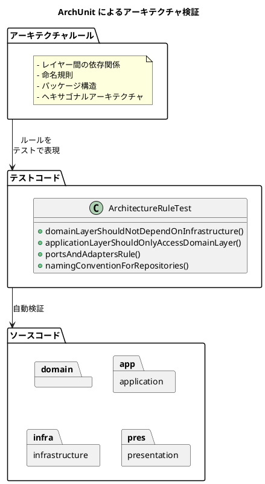

### 依存関係の設定

ArchUnit を使用するには、build.gradle に依存関係を追加します。

```groovy
dependencies {
    testImplementation 'com.tngtech.archunit:archunit:1.4.1'
    testImplementation 'com.tngtech.archunit:archunit-junit5:1.4.1'
}
```

### ヘキサゴナルアーキテクチャのルール

本財務会計システムでは、ヘキサゴナルアーキテクチャ（ポート＆アダプター）を採用しています。以下のレイヤー間依存関係を ArchUnit でテストしています。

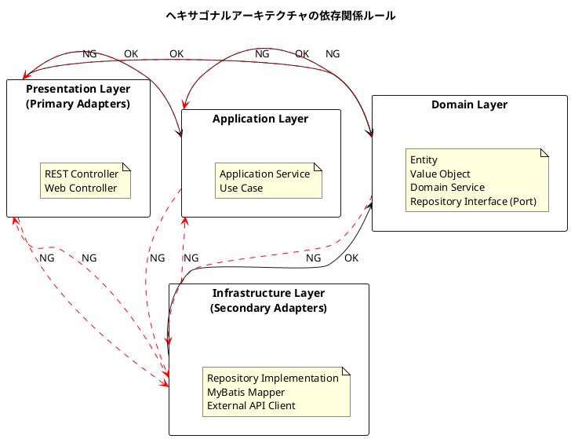

### テストの実装

```java
package com.example.accounting.architecture;

import com.tngtech.archunit.core.domain.JavaClasses;
import com.tngtech.archunit.core.importer.ClassFileImporter;
import com.tngtech.archunit.lang.ArchRule;
import com.tngtech.archunit.library.Architectures;
import org.junit.jupiter.api.BeforeAll;
import org.junit.jupiter.api.DisplayName;
import org.junit.jupiter.api.Nested;
import org.junit.jupiter.api.Test;

import static com.tngtech.archunit.lang.syntax.ArchRuleDefinition.*;
import static com.tngtech.archunit.library.Architectures.layeredArchitecture;

@DisplayName("アーキテクチャルール")
public class ArchitectureRuleTest {

    private static JavaClasses importedClasses;

    @BeforeAll
    static void setUp() {
        importedClasses = new ClassFileImporter()
            .importPackages("com.example.accounting");
    }

    @Nested
    @DisplayName("レイヤー間依存関係")
    class LayerDependencyTest {

        @Test
        @DisplayName("ドメイン層は他の層に依存しない")
        void domainLayerShouldNotDependOnOtherLayers() {
            noClasses()
                .that()
                .resideInAPackage("..domain..")
                .should()
                .dependOnClassesThat()
                .resideInAnyPackage(
                    "..application..",
                    "..infrastructure..",
                    "..presentation.."
                )
                .because("ドメイン層は他の層に依存してはならない")
                .check(importedClasses);
        }

        @Test
        @DisplayName("アプリケーション層はインフラ層に依存しない")
        void applicationLayerShouldNotDependOnInfrastructure() {
            noClasses()
                .that()
                .resideInAPackage("..application..")
                .should()
                .dependOnClassesThat()
                .resideInAPackage("..infrastructure..")
                .because("アプリケーション層はインフラ層に依存してはならない")
                .check(importedClasses);
        }

        @Test
        @DisplayName("インフラ層はアプリケーション層に依存しない")
        void infrastructureLayerShouldNotDependOnApplication() {
            noClasses()
                .that()
                .resideInAPackage("..infrastructure..")
                .should()
                .dependOnClassesThat()
                .resideInAPackage("..application..")
                .because("インフラ層はアプリケーション層に依存してはならない")
                .check(importedClasses);
        }

        @Test
        @DisplayName("プレゼンテーション層はインフラ層に依存しない")
        void presentationLayerShouldNotDependOnInfrastructure() {
            noClasses()
                .that()
                .resideInAPackage("..presentation..")
                .should()
                .dependOnClassesThat()
                .resideInAPackage("..infrastructure..")
                .because("プレゼンテーション層はインフラ層に依存してはならない")
                .check(importedClasses);
        }
    }

    @Nested
    @DisplayName("レイヤードアーキテクチャ")
    class LayeredArchitectureTest {

        @Test
        @DisplayName("レイヤードアーキテクチャのルールを満たす")
        void layeredArchitectureRule() {
            Architectures.LayeredArchitecture architecture = layeredArchitecture()
                .consideringAllDependencies()
                .layer("Presentation").definedBy("..presentation..")
                .layer("Application").definedBy("..application..")
                .layer("Domain").definedBy("..domain..")
                .layer("Infrastructure").definedBy("..infrastructure..")

                .whereLayer("Presentation").mayNotBeAccessedByAnyLayer()
                .whereLayer("Application").mayOnlyBeAccessedByLayers(
                    "Presentation"
                )
                .whereLayer("Domain").mayBeAccessedByAnyLayer()
                .whereLayer("Infrastructure").mayOnlyBeAccessedByLayers(
                    "Presentation", "Application"
                );

            architecture.check(importedClasses);
        }
    }

    @Nested
    @DisplayName("命名規則")
    class NamingConventionTest {

        @Test
        @DisplayName("リポジトリインターフェースはRepositoryで終わる")
        void repositoryInterfacesShouldEndWithRepository() {
            classes()
                .that()
                .resideInAPackage("..domain..")
                .and()
                .areInterfaces()
                .and()
                .haveSimpleNameContaining("Repository")
                .should()
                .haveSimpleNameEndingWith("Repository")
                .check(importedClasses);
        }

        @Test
        @DisplayName("アプリケーションサービスはServiceで終わる")
        void applicationServicesShouldEndWithService() {
            classes()
                .that()
                .resideInAPackage("..application..")
                .and()
                .areAnnotatedWith(
                    org.springframework.stereotype.Service.class
                )
                .should()
                .haveSimpleNameEndingWith("Service")
                .check(importedClasses);
        }

        @Test
        @DisplayName("コントローラはControllerで終わる")
        void controllersShouldEndWithController() {
            classes()
                .that()
                .resideInAPackage("..presentation..")
                .and()
                .areAnnotatedWith(
                    org.springframework.web.bind.annotation.RestController.class
                )
                .should()
                .haveSimpleNameEndingWith("Controller")
                .check(importedClasses);
        }

        @Test
        @DisplayName("値オブジェクトは@Valueアノテーションを持つ")
        void valueObjectsShouldBeAnnotatedWithValue() {
            classes()
                .that()
                .resideInAPackage("..domain.model..")
                .and()
                .haveSimpleNameNotEndingWith("Repository")
                .and()
                .haveSimpleNameNotEndingWith("Service")
                .and()
                .areNotEnums()
                .should()
                .beAnnotatedWith(lombok.Value.class)
                .orShould()
                .beRecords()
                .allowEmptyShould(true)
                .check(importedClasses);
        }
    }

    @Nested
    @DisplayName("財務会計固有のルール")
    class AccountingSpecificRuleTest {

        @Test
        @DisplayName("仕訳エンティティはドメイン層に存在する")
        void journalEntryShouldResideInDomainLayer() {
            classes()
                .that()
                .haveSimpleNameContaining("JournalEntry")
                .and()
                .areNotInterfaces()
                .should()
                .resideInAPackage("..domain.model.journal..")
                .check(importedClasses);
        }

        @Test
        @DisplayName("勘定科目エンティティはドメイン層に存在する")
        void accountShouldResideInDomainLayer() {
            classes()
                .that()
                .haveSimpleName("Account")
                .and()
                .areNotInterfaces()
                .should()
                .resideInAPackage("..domain.model.account..")
                .check(importedClasses);
        }

        @Test
        @DisplayName("Moneyは値オブジェクトである")
        void moneyShouldBeValueObject() {
            classes()
                .that()
                .haveSimpleName("Money")
                .should()
                .beAnnotatedWith(lombok.Value.class)
                .check(importedClasses);
        }

        @Test
        @DisplayName("財務分析サービスはドメインサービスである")
        void financialAnalysisServiceShouldBeDomainService() {
            classes()
                .that()
                .haveSimpleNameContaining("FinancialAnalysis")
                .and()
                .haveSimpleNameEndingWith("Service")
                .should()
                .resideInAPackage("..domain.service..")
                .orShould()
                .resideInAPackage("..application..")
                .check(importedClasses);
        }
    }
}
```

### ArchUnit の利点

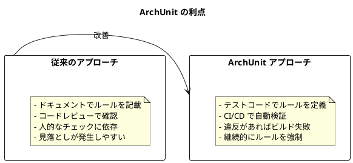

### ヘキサゴナルアーキテクチャ固有のルール

```java
@Nested
@DisplayName("ヘキサゴナルアーキテクチャ")
class HexagonalArchitectureTest {

    @Test
    @DisplayName("ポート（インターフェース）はドメイン層に存在する")
    void portsShouldResideInDomainLayer() {
        classes()
            .that()
            .areInterfaces()
            .and()
            .haveSimpleNameEndingWith("Repository")
            .should()
            .resideInAPackage("..domain..")
            .because("リポジトリインターフェース（ポート）はドメイン層に配置する")
            .check(importedClasses);
    }

    @Test
    @DisplayName("アダプター実装はインフラ層に存在する")
    void adaptersShouldResideInInfrastructureLayer() {
        classes()
            .that()
            .haveSimpleNameEndingWith("RepositoryImpl")
            .or()
            .haveSimpleNameEndingWith("Mapper")
            .should()
            .resideInAPackage("..infrastructure..")
            .because("アダプター実装はインフラ層に配置する")
            .check(importedClasses);
    }

    @Test
    @DisplayName("ドメインサービスはフレームワークに依存しない")
    void domainServicesShouldNotDependOnFramework() {
        noClasses()
            .that()
            .resideInAPackage("..domain.service..")
            .should()
            .dependOnClassesThat()
            .resideInAPackage("org.springframework..")
            .because("ドメインサービスはSpringに依存してはならない")
            .check(importedClasses);
    }

    @Test
    @DisplayName("値オブジェクトはフレームワークに依存しない")
    void valueObjectsShouldNotDependOnFramework() {
        noClasses()
            .that()
            .resideInAPackage("..domain.model..")
            .and()
            .areAnnotatedWith(lombok.Value.class)
            .should()
            .dependOnClassesThat()
            .resideInAnyPackage(
                "org.springframework..",
                "org.mybatis..",
                "jakarta.persistence.."
            )
            .because("値オブジェクトはフレームワークに依存してはならない")
            .check(importedClasses);
    }
}
```

---

## 24.2 JIG によるドキュメント生成

### JIG とは

JIG（Java Instant-documentation Generator）は、Java のソースコードから自動的にドキュメントを生成するツールです。ドメイン駆動設計の観点からコードを分析し、ビジネスルールの可視化を支援します。

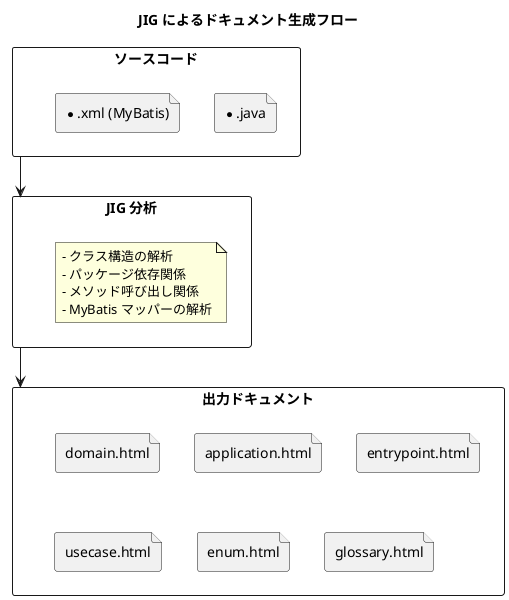

### Gradle への設定

JIG を Gradle プロジェクトに導入するには、以下のようにプラグインを追加します。

```groovy
plugins {
    id 'org.dddjava.jig-gradle-plugin' version '2025.10.1'
}

jig {
    // JIG の設定
    modelPattern = '.+\\.domain\\.(model|type)\\..+'
    enumPattern = '.+Enum$|.+Status$|.+Type$'
}
```

JIG の設定ファイル（jig.properties）で出力形式をカスタマイズできます。

```properties
# ドキュメント出力ディレクトリ
jig.document.output.directory=./build/jig

# ドメインモデルのパターン
jig.pattern.domain=.+\\.domain\\.(model|type)\\..+

# 列挙型のパターン
jig.pattern.enum=.+Type$|.+Status$|.+Category$

# 出力形式
jig.output.format=html
```

### JIG-ERD の設定

JIG-ERD は、データベーススキーマからER図を自動生成するツールです。

```groovy
plugins {
    id 'org.dddjava.jig-erd-gradle-plugin' version '0.0.14'
}

jigErd {
    // ER図の出力設定
    jigErdOutputDirectory = './build/jig-erd'
    jigErdOutputPrefix = 'accounting-er'
    jigErdOutputFormat = 'svg'
}
```

### 生成されるドキュメント

JIG は以下のドキュメントを生成します。

| ドキュメント | 説明 | 財務会計での用途 |
|------------|------|-----------------|
| domain.html | ドメインモデルの一覧と関連図 | 仕訳、勘定科目、元帳のモデル構造 |
| application.html | アプリケーションサービスの一覧 | 仕訳登録、財務分析サービス |
| entrypoint.html | API エントリーポイントの一覧 | REST API エンドポイント |
| usecase.html | ユースケースの一覧 | 仕訳入力、承認、財務諸表生成 |
| enum.html | 列挙型の一覧と値 | 勘定科目種別、仕訳ステータス |
| glossary.html | 用語集（クラス名と Javadoc） | 会計用語の定義 |
| package.html | パッケージ依存関係図 | レイヤー間依存関係 |
| repository.html | リポジトリの一覧 | データアクセス層 |
| sequence.html | シーケンス図 | 仕訳処理フロー |
| insight.html | コード品質のインサイト | 設計上の問題点 |

### ドキュメントの構造

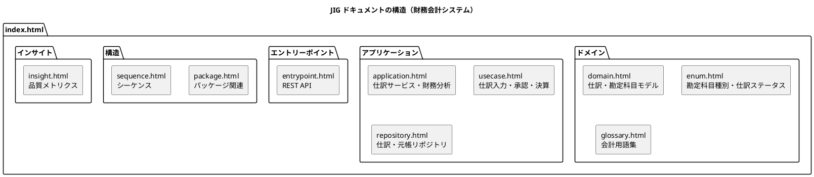

### JIG の Javadoc 活用

JIG は Javadoc からドキュメントを生成するため、クラスに適切な日本語コメントを記述することが重要です。

```java
/**
 * 仕訳エントリ
 *
 * 複式簿記における取引記録を表現するエンティティ。
 * 借方と貸方の合計が一致することを保証する。
 */
@Value
@With
public class JournalEntry {

    /**
     * 仕訳番号
     */
    JournalNumber journalNumber;

    /**
     * 仕訳日
     */
    JournalDate journalDate;

    /**
     * 摘要
     */
    Description description;

    /**
     * 仕訳ステータス
     */
    JournalStatus status;

    /**
     * 仕訳明細
     */
    List<JournalLine> lines;

    // ...
}

/**
 * 勘定科目種別
 *
 * 勘定科目の5分類（資産・負債・純資産・収益・費用）を表現する。
 */
public enum AccountType {

    /** 資産 - 会社が所有する財産 */
    ASSET("資産", "1"),

    /** 負債 - 会社が負っている債務 */
    LIABILITY("負債", "2"),

    /** 純資産 - 資産から負債を引いた正味財産 */
    EQUITY("純資産", "3"),

    /** 収益 - 事業活動による収入 */
    REVENUE("収益", "4"),

    /** 費用 - 事業活動による支出 */
    EXPENSE("費用", "5");

    // ...
}
```

### JIG の活用シーン

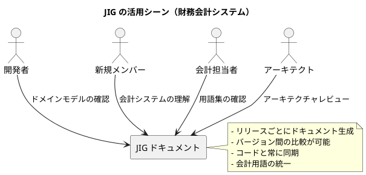

---

## 24.3 SonarQube による品質メトリクス

### 継続的コード品質

SonarQube は、コードの品質を継続的に測定・監視するプラットフォームです。GitHub Actions と連携して、プルリクエストごとにコード品質をチェックします。

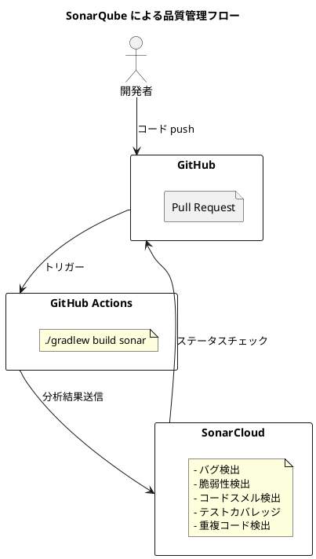

### GitHub Actions の設定

```yaml
name: SonarQube
on:
  push:
    branches:
      - main
      - develop
  pull_request:
    types: [opened, synchronize, reopened]

jobs:
  build:
    name: Build and analyze
    runs-on: ubuntu-latest
    steps:
      - uses: actions/checkout@v4
        with:
          fetch-depth: 0  # 完全な履歴を取得

      - name: Set up JDK
        uses: actions/setup-java@v4
        with:
          java-version: '25'
          distribution: 'oracle'

      - name: Setup Gradle
        uses: gradle/actions/setup-gradle@v4

      - name: Cache SonarQube packages
        uses: actions/cache@v4
        with:
          path: ~/.sonar/cache
          key: ${{ runner.os }}-sonar
          restore-keys: ${{ runner.os }}-sonar

      - name: Cache Gradle packages
        uses: actions/cache@v4
        with:
          path: ~/.gradle/caches
          key: ${{ runner.os }}-gradle-${{ hashFiles('**/*.gradle') }}
          restore-keys: ${{ runner.os }}-gradle

      - name: Build and analyze
        env:
          GITHUB_TOKEN: ${{ secrets.GITHUB_TOKEN }}
          SONAR_TOKEN: ${{ secrets.SONAR_TOKEN }}
        run: ./gradlew build sonar --info
```

### Gradle での SonarQube 設定

```groovy
plugins {
    id 'org.sonarqube' version '7.0.1.6134'
    id 'jacoco'
}

sonar {
    properties {
        property 'sonar.projectKey', 'case-study-accounting'
        property 'sonar.organization', 'your-organization'
        property 'sonar.host.url', 'https://sonarcloud.io'

        // 除外設定
        property 'sonar.exclusions', '''
            **/autogen/**,
            **/config/**,
            **/*Application.java
        '''

        // テストカバレッジ
        property 'sonar.coverage.jacoco.xmlReportPaths',
            'build/reports/jacoco/test/jacocoTestReport.xml'
    }
}

test {
    finalizedBy jacocoTestReport
}

jacocoTestReport {
    dependsOn test
    reports {
        xml.required = true
        html.required = true
    }
}

// カバレッジの閾値チェック
jacocoTestCoverageVerification {
    violationRules {
        rule {
            limit {
                minimum = 0.80  // 80% 以上のカバレッジを要求
            }
        }
        rule {
            element = 'CLASS'
            includes = ['com.example.accounting.domain.**']
            limit {
                counter = 'LINE'
                value = 'COVEREDRATIO'
                minimum = 0.90  // ドメイン層は 90% 以上
            }
        }
    }
}
```

### 品質ゲート

SonarQube の品質ゲートは、コードがリリース可能かどうかを判断する基準です。

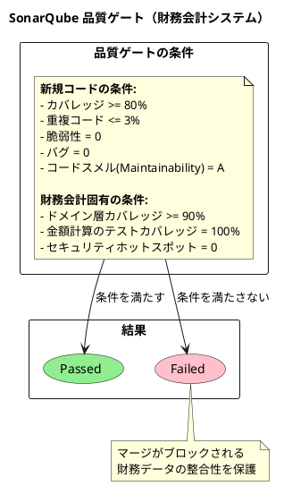

### メトリクスの種類

| メトリクス | 説明 | 財務会計での目標値 |
|-----------|------|------------------|
| Bugs | 潜在的なバグ | 0 |
| Vulnerabilities | セキュリティ脆弱性 | 0（財務データ保護必須） |
| Code Smells | 保守性の問題 | 最小限 |
| Coverage | テストカバレッジ | 80% 以上（ドメイン層 90%） |
| Duplications | コードの重複率 | 3% 以下 |
| Technical Debt | 技術的負債の推定時間 | 1日以内 |
| Security Hotspots | セキュリティ要確認箇所 | 0 |

### 財務会計固有の品質チェック

```java
/**
 * 財務会計システム固有の品質検証
 */
@Nested
@DisplayName("財務会計品質チェック")
class FinancialQualityTest {

    @Test
    @DisplayName("金額計算はBigDecimalを使用する")
    void monetaryCalculationsShouldUseBigDecimal() {
        noClasses()
            .that()
            .resideInAPackage("..domain..")
            .should()
            .dependOnClassesThat()
            .haveFullyQualifiedName("java.lang.Double")
            .orShould()
            .dependOnClassesThat()
            .haveFullyQualifiedName("java.lang.Float")
            .because("金額計算では浮動小数点演算の誤差を避けるため" +
                    "BigDecimalを使用する")
            .check(importedClasses);
    }

    @Test
    @DisplayName("Money値オブジェクトは不変である")
    void moneyValueObjectShouldBeImmutable() {
        classes()
            .that()
            .haveSimpleName("Money")
            .should()
            .beAnnotatedWith(lombok.Value.class)
            .because("金額は不変オブジェクトとして扱う")
            .check(importedClasses);
    }

    @Test
    @DisplayName("仕訳エンティティはファクトリメソッドで生成する")
    void journalEntryShouldHaveFactoryMethod() {
        methods()
            .that()
            .areDeclaredInClassesThat()
            .haveSimpleName("JournalEntry")
            .and()
            .areStatic()
            .and()
            .haveNameStartingWith("create")
            .should()
            .bePublic()
            .because("仕訳はファクトリメソッドで生成し、" +
                    "整合性を保証する")
            .check(importedClasses);
    }
}
```

### 品質改善サイクル

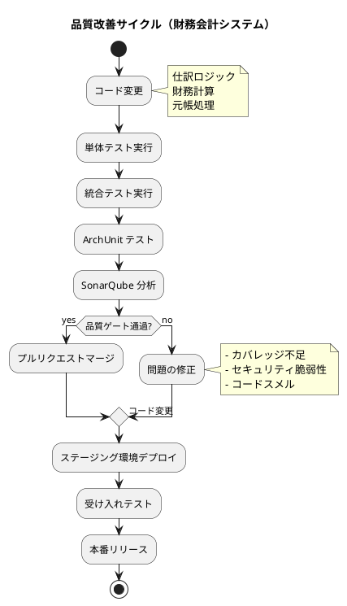

---

## 24.4 静的解析ツールの統合

### Checkstyle

コーディング規約の自動チェックを行います。

```groovy
plugins {
    id 'checkstyle'
}

checkstyle {
    toolVersion = '10.21.4'
    configFile = file("${rootDir}/config/checkstyle/checkstyle.xml")
    maxWarnings = 0
}

tasks.withType(Checkstyle) {
    reports {
        xml.required = true
        html.required = true
    }
}
```

財務会計システム用の Checkstyle 設定例:

```xml
<?xml version="1.0"?>
<!DOCTYPE module PUBLIC
    "-//Checkstyle//DTD Checkstyle Configuration 1.3//EN"
    "https://checkstyle.org/dtds/configuration_1_3.dtd">

<module name="Checker">
    <module name="TreeWalker">
        <!-- 命名規則 -->
        <module name="TypeName">
            <property name="format" value="^[A-Z][a-zA-Z0-9]*$"/>
        </module>
        <module name="MethodName">
            <property name="format" value="^[a-z][a-zA-Z0-9]*$"/>
        </module>

        <!-- Javadoc -->
        <module name="JavadocType">
            <property name="scope" value="public"/>
        </module>
        <module name="JavadocMethod">
            <property name="scope" value="public"/>
        </module>

        <!-- 複雑度 -->
        <module name="CyclomaticComplexity">
            <property name="max" value="10"/>
        </module>

        <!-- メソッド長 -->
        <module name="MethodLength">
            <property name="max" value="50"/>
        </module>

        <!-- パラメータ数 -->
        <module name="ParameterNumber">
            <property name="max" value="5"/>
        </module>
    </module>
</module>
```

### SpotBugs

潜在的なバグを検出します。

```groovy
plugins {
    id 'com.github.spotbugs' version '6.1.3'
}

spotbugs {
    toolVersion = '4.9.3'
    excludeFilter = file("${rootDir}/config/spotbugs/exclude.xml")
    reportLevel = 'medium'
}

spotbugsMain {
    reports {
        xml.required = true
        html.required = true
    }
}
```

財務会計システム用の SpotBugs 除外設定:

```xml
<?xml version="1.0" encoding="UTF-8"?>
<FindBugsFilter>
    <!-- Lombok 生成コードを除外 -->
    <Match>
        <Source name="~.*\.java"/>
        <Bug pattern="EI_EXPOSE_REP"/>
    </Match>
    <Match>
        <Source name="~.*\.java"/>
        <Bug pattern="EI_EXPOSE_REP2"/>
    </Match>

    <!-- 自動生成コードを除外 -->
    <Match>
        <Package name="~com\.example\.accounting\.autogen\..*"/>
    </Match>
</FindBugsFilter>
```

### 統合された品質チェック

```groovy
// 全品質チェックを実行するタスク
tasks.register('qualityCheck') {
    dependsOn 'checkstyleMain'
    dependsOn 'checkstyleTest'
    dependsOn 'spotbugsMain'
    dependsOn 'spotbugsTest'
    dependsOn 'test'
    dependsOn 'jacocoTestReport'
    dependsOn 'jacocoTestCoverageVerification'
}

// ビルド前に品質チェックを実行
build.dependsOn qualityCheck
```

---

## 24.5 アーキテクチャの進化

### バージョン間の比較

JIG ドキュメントをリリースごとに保存することで、アーキテクチャの進化を追跡できます。

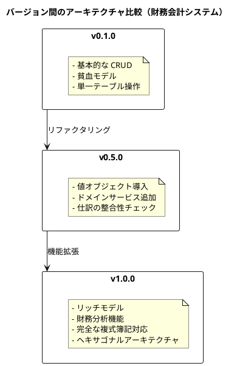

### 継続的検証の仕組み

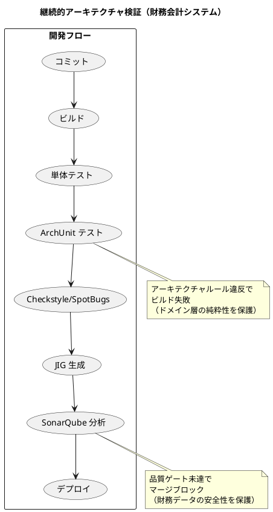

### CI/CD パイプライン全体像

```yaml
name: CI/CD Pipeline

on:
  push:
    branches: [main, develop]
  pull_request:
    branches: [main, develop]

jobs:
  build:
    runs-on: ubuntu-latest
    steps:
      - uses: actions/checkout@v4

      - name: Set up JDK 25
        uses: actions/setup-java@v4
        with:
          java-version: '25'
          distribution: 'oracle'

      - name: Setup Gradle
        uses: gradle/actions/setup-gradle@v4

      - name: Build
        run: ./gradlew build

      - name: Unit Tests
        run: ./gradlew test

      - name: Architecture Tests (ArchUnit)
        run: ./gradlew test --tests '*ArchitectureRuleTest*'

      - name: Static Analysis
        run: ./gradlew checkstyleMain spotbugsMain

      - name: Generate JIG Documentation
        run: ./gradlew jigReports

      - name: Upload JIG Documentation
        uses: actions/upload-artifact@v4
        with:
          name: jig-documentation
          path: build/jig/

      - name: SonarQube Analysis
        env:
          GITHUB_TOKEN: ${{ secrets.GITHUB_TOKEN }}
          SONAR_TOKEN: ${{ secrets.SONAR_TOKEN }}
        run: ./gradlew sonar

      - name: Generate ER Diagram
        run: ./gradlew jigErd

      - name: Upload ER Diagram
        uses: actions/upload-artifact@v4
        with:
          name: er-diagram
          path: build/jig-erd/
```

---

## まとめ

本章では、アーキテクチャの検証について解説しました。

### 重要なポイント

1. **ArchUnit によるルール強制**: アーキテクチャルールをテストコードとして記述し、CI/CD パイプラインで自動的に検証します。ヘキサゴナルアーキテクチャの依存関係ルールを強制することで、ドメイン層の純粋性を保ちます。

2. **JIG によるドキュメント生成**: ソースコードから自動的にドキュメントを生成し、ドメインモデルやアプリケーション構造を可視化します。Javadoc を活用することで、会計用語の定義もドキュメント化できます。

3. **SonarQube による品質メトリクス**: コードの品質を継続的に測定し、バグや脆弱性、コードスメルを検出します。財務会計システムでは、特にセキュリティと金額計算の正確性に注目した品質ゲートを設定します。

4. **静的解析ツールの統合**: Checkstyle、SpotBugs などの静的解析ツールを統合し、コーディング規約の遵守と潜在的なバグの検出を自動化します。

### 財務会計システムでの品質基準

| 項目 | 基準 |
|------|------|
| ドメイン層のカバレッジ | 90% 以上 |
| 金額計算のテストカバレッジ | 100% |
| セキュリティ脆弱性 | 0 |
| アーキテクチャ違反 | 0 |
| コードの重複率 | 3% 以下 |

### ツール一覧

| ツール | 用途 |
|--------|------|
| ArchUnit | アーキテクチャルールの自動検証 |
| JIG | ドキュメント自動生成 |
| JIG-ERD | ER図自動生成 |
| SonarQube | 継続的コード品質 |
| Checkstyle | コーディング規約チェック |
| SpotBugs | 潜在バグ検出 |
| JaCoCo | テストカバレッジ |

これで第7部「品質とリファクタリング」は完了です。次の部では、非機能要件（認証・ユーザー管理）について解説します。
