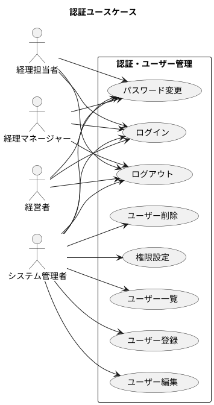
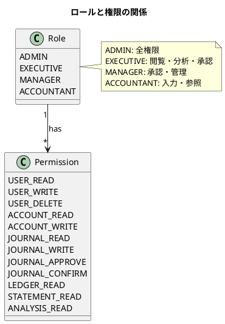
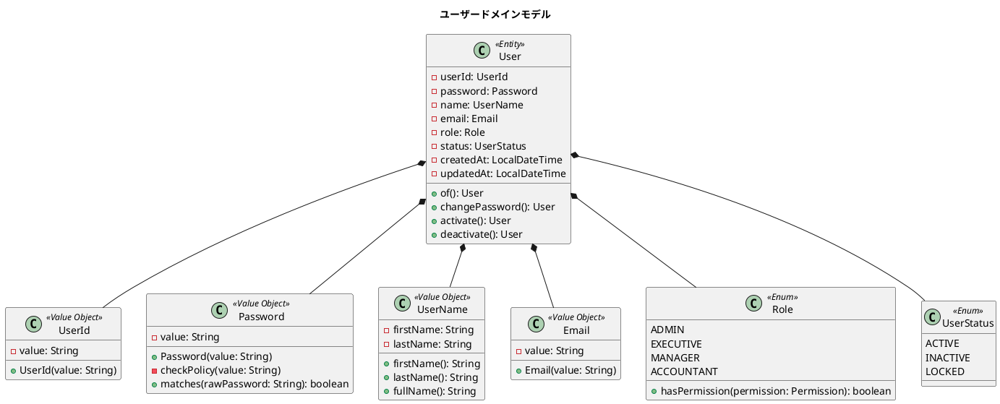
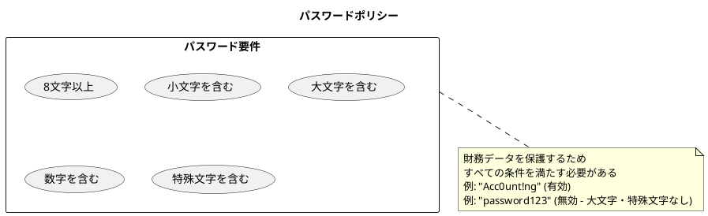
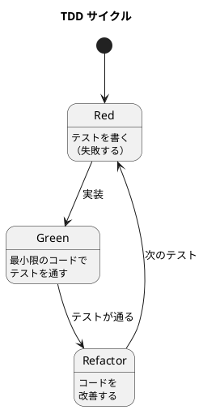
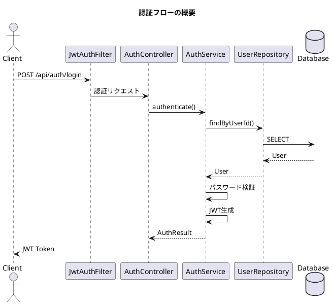
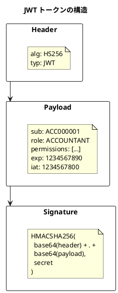
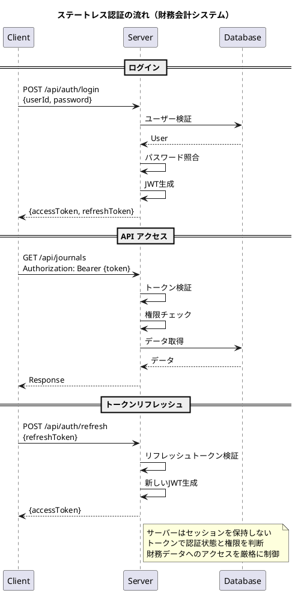
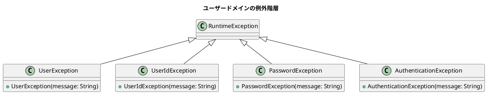

# 第25章: 非機能要件 1 - 認証・ユーザー管理

## 25.1 要件定義

### 認証ユースケース

財務会計システムへのアクセスを制御するため、認証機能を実装します。財務データは機密性が高いため、適切なアクセス制御が必須です。



### ユーザーロールと権限

財務会計システムでは、業務の責任範囲に応じた4種類のロールを定義しています。

| ロール | 説明 | 主な権限 |
|--------|------|----------|
| ADMIN | システム管理者 | 全機能にアクセス可能、ユーザー管理 |
| EXECUTIVE | 経営者 | 財務諸表閲覧、財務分析、承認 |
| MANAGER | 経理マネージャー | 仕訳承認、マスタ管理、帳票閲覧 |
| ACCOUNTANT | 経理担当者 | 仕訳入力、マスタ参照、帳票閲覧 |



### 権限マトリクス

| 機能 | ADMIN | EXECUTIVE | MANAGER | ACCOUNTANT |
|------|:-----:|:---------:|:-------:|:----------:|
| ユーザー管理 | ✓ | - | - | - |
| 勘定科目参照 | ✓ | ✓ | ✓ | ✓ |
| 勘定科目登録・編集 | ✓ | - | ✓ | - |
| 仕訳入力 | ✓ | - | ✓ | ✓ |
| 仕訳承認 | ✓ | ✓ | ✓ | - |
| 仕訳確定 | ✓ | - | ✓ | - |
| 元帳閲覧 | ✓ | ✓ | ✓ | ✓ |
| 財務諸表閲覧 | ✓ | ✓ | ✓ | ✓ |
| 財務分析 | ✓ | ✓ | ✓ | - |
| 監査ログ閲覧 | ✓ | ✓ | - | - |

---

## 25.2 ドメインモデル設計

### ユーザーエンティティ

ユーザーは、認証と権限管理の中心となるエンティティです。



### ユーザーエンティティの実装

```java
package com.example.accounting.domain.model.user;

import lombok.Value;
import lombok.With;
import java.time.LocalDateTime;

/**
 * ユーザーエンティティ
 *
 * 財務会計システムへのアクセスを行うユーザーを表現する。
 * パスワードポリシーとロールベースのアクセス制御を提供する。
 */
@Value
@With
public class User {

    UserId userId;
    Password password;
    UserName name;
    Email email;
    Role role;
    UserStatus status;
    LocalDateTime createdAt;
    LocalDateTime updatedAt;

    /**
     * 新規ユーザーを作成
     */
    public static User create(
            String userId,
            String rawPassword,
            String firstName,
            String lastName,
            String email,
            Role role
    ) {
        if (userId == null || userId.isBlank()) {
            throw new UserException("ユーザーIDは必須です");
        }
        if (firstName == null || firstName.isBlank()) {
            throw new UserException("名前（姓）は必須です");
        }
        if (lastName == null || lastName.isBlank()) {
            throw new UserException("名前（名）は必須です");
        }
        if (email == null || email.isBlank()) {
            throw new UserException("メールアドレスは必須です");
        }
        if (role == null) {
            throw new UserException("ロールは必須です");
        }

        LocalDateTime now = LocalDateTime.now();
        return new User(
            UserId.of(userId),
            Password.of(rawPassword),
            UserName.of(firstName, lastName),
            Email.of(email),
            role,
            UserStatus.ACTIVE,
            now,
            now
        );
    }

    /**
     * パスワードを変更
     */
    public User changePassword(String newPassword) {
        return this
            .withPassword(Password.of(newPassword))
            .withUpdatedAt(LocalDateTime.now());
    }

    /**
     * ユーザーをアクティブ化
     */
    public User activate() {
        if (this.status == UserStatus.ACTIVE) {
            throw new UserException("既にアクティブ状態です");
        }
        return this
            .withStatus(UserStatus.ACTIVE)
            .withUpdatedAt(LocalDateTime.now());
    }

    /**
     * ユーザーを非アクティブ化
     */
    public User deactivate() {
        if (this.status == UserStatus.INACTIVE) {
            throw new UserException("既に非アクティブ状態です");
        }
        return this
            .withStatus(UserStatus.INACTIVE)
            .withUpdatedAt(LocalDateTime.now());
    }

    /**
     * アカウントをロック
     */
    public User lock() {
        return this
            .withStatus(UserStatus.LOCKED)
            .withUpdatedAt(LocalDateTime.now());
    }

    /**
     * 特定の権限を持っているか確認
     */
    public boolean hasPermission(Permission permission) {
        return this.role.hasPermission(permission);
    }

    /**
     * ログイン可能か確認
     */
    public boolean canLogin() {
        return this.status == UserStatus.ACTIVE;
    }
}
```

### パスワードの値オブジェクト

パスワードは、財務システムにふさわしい強力なセキュリティポリシーを満たす必要があります。



#### パスワードの実装

```java
package com.example.accounting.domain.model.user;

import lombok.Value;
import org.springframework.security.crypto.bcrypt.BCryptPasswordEncoder;
import org.springframework.security.crypto.password.PasswordEncoder;

/**
 * パスワード値オブジェクト
 *
 * 財務システム用の強力なパスワードポリシーを実装する。
 * パスワードはBCryptでハッシュ化して保存する。
 */
@Value
public class Password {

    private static final PasswordEncoder ENCODER = new BCryptPasswordEncoder();
    private static final int MIN_LENGTH = 8;

    String value;

    private Password(String hashedValue) {
        this.value = hashedValue;
    }

    /**
     * 生パスワードからPasswordを生成（ポリシーチェック付き）
     */
    public static Password of(String rawPassword) {
        if (rawPassword == null || rawPassword.isEmpty()) {
            return new Password("");
        }
        checkPolicy(rawPassword);
        return new Password(ENCODER.encode(rawPassword));
    }

    /**
     * ハッシュ済みパスワードからPasswordを復元
     */
    public static Password fromHash(String hashedPassword) {
        return new Password(hashedPassword);
    }

    /**
     * パスワードポリシーをチェック
     */
    private static void checkPolicy(String rawPassword) {
        if (rawPassword.length() < MIN_LENGTH) {
            throw new PasswordException(
                "パスワードは" + MIN_LENGTH + "文字以上である必要があります"
            );
        }

        boolean hasDigit = rawPassword.chars().anyMatch(Character::isDigit);
        boolean hasLower = rawPassword.chars().anyMatch(Character::isLowerCase);
        boolean hasUpper = rawPassword.chars().anyMatch(Character::isUpperCase);
        boolean hasSpecial = rawPassword.chars()
            .anyMatch(c -> "!@#$%^&*()_+-=[]{}|;:,.<>?".indexOf(c) >= 0);

        if (!hasDigit) {
            throw new PasswordException("パスワードは数字を含む必要があります");
        }
        if (!hasLower) {
            throw new PasswordException("パスワードは小文字を含む必要があります");
        }
        if (!hasUpper) {
            throw new PasswordException("パスワードは大文字を含む必要があります");
        }
        if (!hasSpecial) {
            throw new PasswordException("パスワードは特殊文字を含む必要があります");
        }
    }

    /**
     * 生パスワードと一致するか確認
     */
    public boolean matches(String rawPassword) {
        if (rawPassword == null || this.value.isEmpty()) {
            return false;
        }
        return ENCODER.matches(rawPassword, this.value);
    }

    /**
     * パスワードが設定されているか確認
     */
    public boolean isSet() {
        return !this.value.isEmpty();
    }
}
```

### ユーザーIDの値オブジェクト

ユーザーIDには、財務会計システム用の形式ルールがあります。

```java
package com.example.accounting.domain.model.user;

import lombok.Value;

/**
 * ユーザーID値オブジェクト
 *
 * 形式: ACCで始まる6桁の数字（例: ACC000001）
 */
@Value
public class UserId {

    private static final String PATTERN = "^ACC[0-9]{6}$";

    String value;

    private UserId(String value) {
        this.value = value;
    }

    public static UserId of(String userId) {
        if (userId == null || userId.isBlank()) {
            throw new UserIdException("ユーザーIDは必須です");
        }
        if (!userId.matches(PATTERN)) {
            throw new UserIdException(
                "ユーザーIDはACCで始まる6桁の数字である必要があります: " + userId
            );
        }
        return new UserId(userId);
    }

    /**
     * 次のユーザーIDを生成
     */
    public static UserId generateNext(String lastUserId) {
        if (lastUserId == null) {
            return new UserId("ACC000001");
        }
        int sequence = Integer.parseInt(lastUserId.substring(3));
        return new UserId(String.format("ACC%06d", sequence + 1));
    }
}
```

| 項目 | ルール | 例 |
|------|--------|-----|
| 先頭文字 | "ACC" で始まる | ACC000001 |
| 桁数 | 9桁（ACC + 6桁の数字） | ACC123456 |
| 形式 | 正規表現: `^ACC[0-9]{6}$` | ACC999999 |

### ロールと権限の実装

```java
package com.example.accounting.domain.model.user;

import java.util.EnumSet;
import java.util.Set;

/**
 * ユーザーロール
 */
public enum Role {

    ADMIN("システム管理者", EnumSet.allOf(Permission.class)),

    EXECUTIVE("経営者", EnumSet.of(
        Permission.ACCOUNT_READ,
        Permission.JOURNAL_READ,
        Permission.JOURNAL_APPROVE,
        Permission.LEDGER_READ,
        Permission.STATEMENT_READ,
        Permission.ANALYSIS_READ,
        Permission.AUDIT_READ
    )),

    MANAGER("経理マネージャー", EnumSet.of(
        Permission.ACCOUNT_READ,
        Permission.ACCOUNT_WRITE,
        Permission.JOURNAL_READ,
        Permission.JOURNAL_WRITE,
        Permission.JOURNAL_APPROVE,
        Permission.JOURNAL_CONFIRM,
        Permission.LEDGER_READ,
        Permission.STATEMENT_READ,
        Permission.ANALYSIS_READ
    )),

    ACCOUNTANT("経理担当者", EnumSet.of(
        Permission.ACCOUNT_READ,
        Permission.JOURNAL_READ,
        Permission.JOURNAL_WRITE,
        Permission.LEDGER_READ,
        Permission.STATEMENT_READ
    ));

    private final String displayName;
    private final Set<Permission> permissions;

    Role(String displayName, Set<Permission> permissions) {
        this.displayName = displayName;
        this.permissions = permissions;
    }

    public String getDisplayName() {
        return displayName;
    }

    public boolean hasPermission(Permission permission) {
        return permissions.contains(permission);
    }

    public Set<Permission> getPermissions() {
        return EnumSet.copyOf(permissions);
    }
}

/**
 * 権限
 */
public enum Permission {
    // ユーザー管理
    USER_READ("ユーザー参照"),
    USER_WRITE("ユーザー登録・編集"),
    USER_DELETE("ユーザー削除"),

    // 勘定科目
    ACCOUNT_READ("勘定科目参照"),
    ACCOUNT_WRITE("勘定科目登録・編集"),

    // 仕訳
    JOURNAL_READ("仕訳参照"),
    JOURNAL_WRITE("仕訳入力"),
    JOURNAL_APPROVE("仕訳承認"),
    JOURNAL_CONFIRM("仕訳確定"),

    // 元帳・帳票
    LEDGER_READ("元帳参照"),
    STATEMENT_READ("財務諸表参照"),

    // 分析・監査
    ANALYSIS_READ("財務分析"),
    AUDIT_READ("監査ログ参照");

    private final String displayName;

    Permission(String displayName) {
        this.displayName = displayName;
    }

    public String getDisplayName() {
        return displayName;
    }
}
```

---

## 25.3 TDD による実装

### テストファーストアプローチ

ユーザードメインモデルの実装は、テストファーストで進めます。



### ユーザー登録のテスト

```java
package com.example.accounting.domain.model.user;

import org.junit.jupiter.api.DisplayName;
import org.junit.jupiter.api.Nested;
import org.junit.jupiter.api.Test;

import static org.junit.jupiter.api.Assertions.*;

@DisplayName("ユーザー")
class UserTest {

    @Nested
    @DisplayName("ユーザー生成")
    class CreateTest {

        @Test
        @DisplayName("有効な情報でユーザーを生成できる")
        void canCreateUserWithValidInfo() {
            User user = User.create(
                "ACC000001",
                "Acc0unt!ng",
                "山田",
                "太郎",
                "yamada@example.com",
                Role.ACCOUNTANT
            );

            assertEquals(UserId.of("ACC000001"), user.getUserId());
            assertEquals("山田", user.getName().getFirstName());
            assertEquals("太郎", user.getName().getLastName());
            assertEquals("山田 太郎", user.getName().getFullName());
            assertEquals(Email.of("yamada@example.com"), user.getEmail());
            assertEquals(Role.ACCOUNTANT, user.getRole());
            assertEquals(UserStatus.ACTIVE, user.getStatus());
        }

        @Test
        @DisplayName("ユーザーIDが未入力の場合は生成できない")
        void cannotCreateUserWhenUserIdIsMissing() {
            assertThrows(UserException.class, () ->
                User.create(null, "Acc0unt!ng", "山田", "太郎",
                    "yamada@example.com", Role.ACCOUNTANT)
            );
        }

        @Test
        @DisplayName("ロールが未入力の場合は生成できない")
        void cannotCreateUserWhenRoleIsMissing() {
            assertThrows(UserException.class, () ->
                User.create("ACC000001", "Acc0unt!ng", "山田", "太郎",
                    "yamada@example.com", null)
            );
        }
    }

    @Nested
    @DisplayName("ユーザーID検証")
    class UserIdValidationTest {

        @Test
        @DisplayName("ユーザーIDはACCで始まる6桁の数字である")
        void userIdMustStartWithACCAndBeSixDigitNumber() {
            assertThrows(UserIdException.class, () ->
                User.create("1", "Acc0unt!ng", "山田", "太郎",
                    "yamada@example.com", Role.ACCOUNTANT)
            );

            assertThrows(UserIdException.class, () ->
                User.create("USR000001", "Acc0unt!ng", "山田", "太郎",
                    "yamada@example.com", Role.ACCOUNTANT)
            );

            assertThrows(UserIdException.class, () ->
                User.create("ACC12345", "Acc0unt!ng", "山田", "太郎",
                    "yamada@example.com", Role.ACCOUNTANT)
            );
        }
    }

    @Nested
    @DisplayName("パスワード変更")
    class ChangePasswordTest {

        @Test
        @DisplayName("パスワードを変更できる")
        void canChangePassword() {
            User user = User.create(
                "ACC000001", "Acc0unt!ng", "山田", "太郎",
                "yamada@example.com", Role.ACCOUNTANT
            );

            User updated = user.changePassword("NewP@ss123");

            assertTrue(updated.getPassword().matches("NewP@ss123"));
            assertFalse(updated.getPassword().matches("Acc0unt!ng"));
        }
    }

    @Nested
    @DisplayName("権限チェック")
    class PermissionTest {

        @Test
        @DisplayName("経理担当者は仕訳入力権限を持つ")
        void accountantHasJournalWritePermission() {
            User user = User.create(
                "ACC000001", "Acc0unt!ng", "山田", "太郎",
                "yamada@example.com", Role.ACCOUNTANT
            );

            assertTrue(user.hasPermission(Permission.JOURNAL_WRITE));
            assertTrue(user.hasPermission(Permission.JOURNAL_READ));
        }

        @Test
        @DisplayName("経理担当者は仕訳承認権限を持たない")
        void accountantDoesNotHaveJournalApprovePermission() {
            User user = User.create(
                "ACC000001", "Acc0unt!ng", "山田", "太郎",
                "yamada@example.com", Role.ACCOUNTANT
            );

            assertFalse(user.hasPermission(Permission.JOURNAL_APPROVE));
        }

        @Test
        @DisplayName("経理マネージャーは仕訳承認権限を持つ")
        void managerHasJournalApprovePermission() {
            User user = User.create(
                "ACC000002", "Manag3r!!", "田中", "花子",
                "tanaka@example.com", Role.MANAGER
            );

            assertTrue(user.hasPermission(Permission.JOURNAL_APPROVE));
            assertTrue(user.hasPermission(Permission.JOURNAL_CONFIRM));
        }
    }
}
```

### パスワード検証のテスト

```java
@DisplayName("パスワード")
class PasswordTest {

    @Test
    @DisplayName("有効なパスワードを生成できる")
    void canCreateValidPassword() {
        Password password = Password.of("Acc0unt!ng");
        assertTrue(password.matches("Acc0unt!ng"));
    }

    @Test
    @DisplayName("パスワードは8文字以上であること")
    void passwordMustBeAtLeastEightCharacters() {
        assertThrows(PasswordException.class,
            () -> Password.of("Abc!23"));
    }

    @Test
    @DisplayName("パスワードは小文字を含むこと")
    void passwordMustContainLowercase() {
        assertThrows(PasswordException.class,
            () -> Password.of("ACCOUNT!123"));
    }

    @Test
    @DisplayName("パスワードは大文字を含むこと")
    void passwordMustContainUppercase() {
        assertThrows(PasswordException.class,
            () -> Password.of("account!123"));
    }

    @Test
    @DisplayName("パスワードは数字を含むこと")
    void passwordMustContainDigit() {
        assertThrows(PasswordException.class,
            () -> Password.of("Account!ng"));
    }

    @Test
    @DisplayName("パスワードは特殊文字を含むこと")
    void passwordMustContainSpecialCharacter() {
        assertThrows(PasswordException.class,
            () -> Password.of("Account123"));
    }

    @Test
    @DisplayName("パスワードが未入力の場合は空の値を設定する")
    void passwordIsEmptyWhenMissing() {
        Password password = Password.of(null);
        assertFalse(password.isSet());
    }

    @Test
    @DisplayName("ハッシュ化されたパスワードと生パスワードを照合できる")
    void canMatchHashedPassword() {
        Password password = Password.of("Acc0unt!ng");
        assertTrue(password.matches("Acc0unt!ng"));
        assertFalse(password.matches("WrongPassword1!"));
    }
}
```

### 認証処理のテスト

```java
@SpringBootTest
@DisplayName("認証サービス")
class AuthServiceTest {

    @Autowired
    private AuthService authService;

    @Autowired
    private UserRepository userRepository;

    @BeforeEach
    void setUp() {
        // テストユーザーを登録
        User testUser = User.create(
            "ACC000001", "Acc0unt!ng", "テスト", "太郎",
            "test@example.com", Role.ACCOUNTANT
        );
        userRepository.save(testUser);
    }

    @Test
    @DisplayName("正しい認証情報でログインできる")
    void canLoginWithValidCredentials() {
        // When
        AuthResult result = authService.authenticate(
            "ACC000001", "Acc0unt!ng"
        );

        // Then
        assertTrue(result.isSuccess());
        assertNotNull(result.getToken());
        assertEquals("ACC000001", result.getUserId());
        assertEquals(Role.ACCOUNTANT, result.getRole());
    }

    @Test
    @DisplayName("不正なパスワードではログインできない")
    void cannotLoginWithInvalidPassword() {
        // When
        AuthResult result = authService.authenticate(
            "ACC000001", "WrongP@ss1"
        );

        // Then
        assertFalse(result.isSuccess());
        assertNull(result.getToken());
    }

    @Test
    @DisplayName("存在しないユーザーではログインできない")
    void cannotLoginWithNonExistentUser() {
        // When
        AuthResult result = authService.authenticate(
            "ACC999999", "Acc0unt!ng"
        );

        // Then
        assertFalse(result.isSuccess());
    }

    @Test
    @DisplayName("ロックされたユーザーはログインできない")
    void cannotLoginWhenUserIsLocked() {
        // Given
        User user = userRepository.findByUserId(UserId.of("ACC000001")).get();
        userRepository.save(user.lock());

        // When
        AuthResult result = authService.authenticate(
            "ACC000001", "Acc0unt!ng"
        );

        // Then
        assertFalse(result.isSuccess());
        assertEquals("アカウントがロックされています", result.getMessage());
    }
}
```

---

## 25.4 Spring Security 統合

### 認証フィルタの設定

Spring Security を使用して認証を実装します。



### SecurityConfig の実装

```java
package com.example.accounting.infrastructure.security;

import lombok.RequiredArgsConstructor;
import org.springframework.context.annotation.Bean;
import org.springframework.context.annotation.Configuration;
import org.springframework.http.HttpMethod;
import org.springframework.security.config.annotation.method.configuration.EnableMethodSecurity;
import org.springframework.security.config.annotation.web.builders.HttpSecurity;
import org.springframework.security.config.annotation.web.configuration.EnableWebSecurity;
import org.springframework.security.config.http.SessionCreationPolicy;
import org.springframework.security.crypto.bcrypt.BCryptPasswordEncoder;
import org.springframework.security.crypto.password.PasswordEncoder;
import org.springframework.security.web.SecurityFilterChain;
import org.springframework.security.web.authentication.UsernamePasswordAuthenticationFilter;

@Configuration
@EnableWebSecurity
@EnableMethodSecurity
@RequiredArgsConstructor
public class SecurityConfig {

    private final JwtAuthenticationFilter jwtAuthFilter;
    private final JwtAuthenticationEntryPoint jwtAuthEntryPoint;

    @Bean
    public SecurityFilterChain filterChain(HttpSecurity http) throws Exception {
        http
            // CSRF無効化（JWT使用のため）
            .csrf(csrf -> csrf.disable())

            // ステートレスセッション
            .sessionManagement(session ->
                session.sessionCreationPolicy(SessionCreationPolicy.STATELESS))

            // 認証エントリーポイント
            .exceptionHandling(exception ->
                exception.authenticationEntryPoint(jwtAuthEntryPoint))

            // 認可設定
            .authorizeHttpRequests(auth -> auth
                // 認証不要
                .requestMatchers("/api/auth/**").permitAll()
                .requestMatchers("/actuator/health").permitAll()

                // ユーザー管理はADMINのみ
                .requestMatchers("/api/users/**").hasRole("ADMIN")

                // 仕訳承認はMANAGER以上
                .requestMatchers(HttpMethod.POST, "/api/journals/*/approve")
                    .hasAnyRole("ADMIN", "EXECUTIVE", "MANAGER")

                // 仕訳確定はMANAGER以上
                .requestMatchers(HttpMethod.POST, "/api/journals/*/confirm")
                    .hasAnyRole("ADMIN", "MANAGER")

                // 財務分析はMANAGER以上
                .requestMatchers("/api/analysis/**")
                    .hasAnyRole("ADMIN", "EXECUTIVE", "MANAGER")

                // 監査ログはEXECUTIVE以上
                .requestMatchers("/api/audit/**")
                    .hasAnyRole("ADMIN", "EXECUTIVE")

                // その他は認証必須
                .anyRequest().authenticated()
            )

            // JWTフィルタを追加
            .addFilterBefore(jwtAuthFilter,
                UsernamePasswordAuthenticationFilter.class);

        return http.build();
    }

    @Bean
    public PasswordEncoder passwordEncoder() {
        return new BCryptPasswordEncoder();
    }
}
```

### JWT トークン管理

認証成功時に JWT トークンを発行します。



#### JwtTokenProvider の実装

```java
package com.example.accounting.infrastructure.security;

import com.example.accounting.domain.model.user.Permission;
import com.example.accounting.domain.model.user.Role;
import io.jsonwebtoken.*;
import io.jsonwebtoken.security.Keys;
import org.springframework.beans.factory.annotation.Value;
import org.springframework.stereotype.Component;

import javax.crypto.SecretKey;
import java.nio.charset.StandardCharsets;
import java.util.Date;
import java.util.List;
import java.util.stream.Collectors;

@Component
public class JwtTokenProvider {

    private final SecretKey secretKey;
    private final long validityInMilliseconds;

    public JwtTokenProvider(
            @Value("${jwt.secret}") String secret,
            @Value("${jwt.expiration:86400000}") long validityInMilliseconds) {
        this.secretKey = Keys.hmacShaKeyFor(
            secret.getBytes(StandardCharsets.UTF_8)
        );
        this.validityInMilliseconds = validityInMilliseconds;
    }

    /**
     * JWTトークンを生成
     */
    public String createToken(String userId, Role role) {
        Date now = new Date();
        Date validity = new Date(now.getTime() + validityInMilliseconds);

        List<String> permissions = role.getPermissions().stream()
            .map(Permission::name)
            .collect(Collectors.toList());

        return Jwts.builder()
            .subject(userId)
            .claim("role", role.name())
            .claim("permissions", permissions)
            .issuedAt(now)
            .expiration(validity)
            .signWith(secretKey)
            .compact();
    }

    /**
     * トークンを検証
     */
    public boolean validateToken(String token) {
        try {
            Jwts.parser()
                .verifyWith(secretKey)
                .build()
                .parseSignedClaims(token);
            return true;
        } catch (JwtException | IllegalArgumentException e) {
            return false;
        }
    }

    /**
     * トークンからユーザーIDを取得
     */
    public String getUserId(String token) {
        return Jwts.parser()
            .verifyWith(secretKey)
            .build()
            .parseSignedClaims(token)
            .getPayload()
            .getSubject();
    }

    /**
     * トークンからロールを取得
     */
    public Role getRole(String token) {
        String roleName = Jwts.parser()
            .verifyWith(secretKey)
            .build()
            .parseSignedClaims(token)
            .getPayload()
            .get("role", String.class);
        return Role.valueOf(roleName);
    }

    /**
     * トークンから権限リストを取得
     */
    @SuppressWarnings("unchecked")
    public List<String> getPermissions(String token) {
        return Jwts.parser()
            .verifyWith(secretKey)
            .build()
            .parseSignedClaims(token)
            .getPayload()
            .get("permissions", List.class);
    }
}
```

### JWT認証フィルタ

```java
package com.example.accounting.infrastructure.security;

import jakarta.servlet.FilterChain;
import jakarta.servlet.ServletException;
import jakarta.servlet.http.HttpServletRequest;
import jakarta.servlet.http.HttpServletResponse;
import lombok.RequiredArgsConstructor;
import org.springframework.security.authentication.UsernamePasswordAuthenticationToken;
import org.springframework.security.core.authority.SimpleGrantedAuthority;
import org.springframework.security.core.context.SecurityContextHolder;
import org.springframework.stereotype.Component;
import org.springframework.web.filter.OncePerRequestFilter;

import java.io.IOException;
import java.util.List;
import java.util.stream.Collectors;

@Component
@RequiredArgsConstructor
public class JwtAuthenticationFilter extends OncePerRequestFilter {

    private final JwtTokenProvider jwtTokenProvider;

    @Override
    protected void doFilterInternal(
            HttpServletRequest request,
            HttpServletResponse response,
            FilterChain filterChain
    ) throws ServletException, IOException {

        String token = extractToken(request);

        if (token != null && jwtTokenProvider.validateToken(token)) {
            String userId = jwtTokenProvider.getUserId(token);
            String role = jwtTokenProvider.getRole(token).name();
            List<String> permissions = jwtTokenProvider.getPermissions(token);

            // 権限をGrantedAuthorityに変換
            List<SimpleGrantedAuthority> authorities = permissions.stream()
                .map(SimpleGrantedAuthority::new)
                .collect(Collectors.toList());

            // ロールも追加
            authorities.add(new SimpleGrantedAuthority("ROLE_" + role));

            UsernamePasswordAuthenticationToken authentication =
                new UsernamePasswordAuthenticationToken(
                    userId, null, authorities
                );

            SecurityContextHolder.getContext()
                .setAuthentication(authentication);
        }

        filterChain.doFilter(request, response);
    }

    private String extractToken(HttpServletRequest request) {
        String bearerToken = request.getHeader("Authorization");
        if (bearerToken != null && bearerToken.startsWith("Bearer ")) {
            return bearerToken.substring(7);
        }
        return null;
    }
}
```

### セッション管理

本システムでは、ステートレスな JWT 認証を採用しています。

| 項目 | 設定 |
|------|------|
| セッション管理 | STATELESS |
| トークン有効期限 | 24時間 |
| リフレッシュトークン | 対応（7日間有効） |
| トークン保存場所 | クライアント側（LocalStorage/Cookie） |



---

## 25.5 認証コントローラの実装

### 認証API

```java
package com.example.accounting.presentation.api;

import com.example.accounting.application.AuthService;
import com.example.accounting.application.dto.AuthRequest;
import com.example.accounting.application.dto.AuthResult;
import com.example.accounting.application.dto.RefreshRequest;
import lombok.RequiredArgsConstructor;
import org.springframework.http.ResponseEntity;
import org.springframework.web.bind.annotation.*;

@RestController
@RequestMapping("/api/auth")
@RequiredArgsConstructor
public class AuthController {

    private final AuthService authService;

    /**
     * ログイン
     */
    @PostMapping("/login")
    public ResponseEntity<AuthResult> login(@RequestBody AuthRequest request) {
        AuthResult result = authService.authenticate(
            request.getUserId(),
            request.getPassword()
        );

        if (result.isSuccess()) {
            return ResponseEntity.ok(result);
        } else {
            return ResponseEntity.status(401).body(result);
        }
    }

    /**
     * トークンリフレッシュ
     */
    @PostMapping("/refresh")
    public ResponseEntity<AuthResult> refresh(
            @RequestBody RefreshRequest request) {
        AuthResult result = authService.refreshToken(request.getRefreshToken());

        if (result.isSuccess()) {
            return ResponseEntity.ok(result);
        } else {
            return ResponseEntity.status(401).body(result);
        }
    }

    /**
     * ログアウト
     */
    @PostMapping("/logout")
    public ResponseEntity<Void> logout(@RequestHeader("Authorization") String token) {
        // JWTはステートレスなので、クライアント側でトークンを削除
        // 必要に応じてブラックリストに追加
        return ResponseEntity.ok().build();
    }

    /**
     * パスワード変更
     */
    @PostMapping("/password")
    public ResponseEntity<Void> changePassword(
            @RequestBody PasswordChangeRequest request,
            @AuthenticationPrincipal String userId) {
        authService.changePassword(
            userId,
            request.getCurrentPassword(),
            request.getNewPassword()
        );
        return ResponseEntity.ok().build();
    }
}
```

### 認証サービス

```java
package com.example.accounting.application;

import com.example.accounting.application.dto.AuthResult;
import com.example.accounting.domain.model.user.*;
import com.example.accounting.infrastructure.security.JwtTokenProvider;
import lombok.RequiredArgsConstructor;
import org.springframework.stereotype.Service;
import org.springframework.transaction.annotation.Transactional;

import java.util.Optional;

@Service
@RequiredArgsConstructor
public class AuthService {

    private final UserRepository userRepository;
    private final JwtTokenProvider jwtTokenProvider;
    private final RefreshTokenRepository refreshTokenRepository;

    /**
     * 認証処理
     */
    @Transactional
    public AuthResult authenticate(String userId, String rawPassword) {
        // ユーザー検索
        Optional<User> userOpt = userRepository.findByUserId(UserId.of(userId));

        if (userOpt.isEmpty()) {
            return AuthResult.failure("ユーザーIDまたはパスワードが正しくありません");
        }

        User user = userOpt.get();

        // ログイン可能かチェック
        if (!user.canLogin()) {
            if (user.getStatus() == UserStatus.LOCKED) {
                return AuthResult.failure("アカウントがロックされています");
            }
            return AuthResult.failure("アカウントが無効です");
        }

        // パスワード検証
        if (!user.getPassword().matches(rawPassword)) {
            // ログイン失敗回数をカウント（将来的にロック機能を実装）
            return AuthResult.failure("ユーザーIDまたはパスワードが正しくありません");
        }

        // JWTトークン生成
        String accessToken = jwtTokenProvider.createToken(
            user.getUserId().getValue(),
            user.getRole()
        );

        // リフレッシュトークン生成
        String refreshToken = jwtTokenProvider.createRefreshToken(
            user.getUserId().getValue()
        );
        refreshTokenRepository.save(
            new RefreshToken(user.getUserId(), refreshToken)
        );

        return AuthResult.success(
            user.getUserId().getValue(),
            user.getRole(),
            accessToken,
            refreshToken
        );
    }

    /**
     * トークンリフレッシュ
     */
    @Transactional
    public AuthResult refreshToken(String refreshToken) {
        if (!jwtTokenProvider.validateRefreshToken(refreshToken)) {
            return AuthResult.failure("リフレッシュトークンが無効です");
        }

        String userId = jwtTokenProvider.getUserIdFromRefreshToken(refreshToken);

        // リフレッシュトークンがDBに存在するか確認
        if (!refreshTokenRepository.exists(UserId.of(userId), refreshToken)) {
            return AuthResult.failure("リフレッシュトークンが無効です");
        }

        // ユーザー取得
        User user = userRepository.findByUserId(UserId.of(userId))
            .orElseThrow(() -> new UserException("ユーザーが見つかりません"));

        // 新しいアクセストークン生成
        String newAccessToken = jwtTokenProvider.createToken(
            user.getUserId().getValue(),
            user.getRole()
        );

        return AuthResult.success(
            userId,
            user.getRole(),
            newAccessToken,
            refreshToken
        );
    }

    /**
     * パスワード変更
     */
    @Transactional
    public void changePassword(
            String userId,
            String currentPassword,
            String newPassword) {
        User user = userRepository.findByUserId(UserId.of(userId))
            .orElseThrow(() -> new UserException("ユーザーが見つかりません"));

        if (!user.getPassword().matches(currentPassword)) {
            throw new UserException("現在のパスワードが正しくありません");
        }

        User updated = user.changePassword(newPassword);
        userRepository.save(updated);
    }
}
```

---

## 25.6 ドメインモデルの例外設計

ドメイン層では、専用の例外クラスを定義します。



### 例外の使い分け

| 例外クラス | 用途 | 例 |
|-----------|------|-----|
| UserException | ユーザー全般のエラー | 必須項目未入力、ユーザー不存在 |
| UserIdException | ユーザーID形式エラー | 形式不正（ACCで始まらない等） |
| PasswordException | パスワードポリシー違反 | 文字数不足、複雑性不足 |
| AuthenticationException | 認証失敗 | パスワード不一致、アカウントロック |

---

## まとめ

本章では、財務会計システムの認証・ユーザー管理機能について解説しました。

### 重要なポイント

1. **ロールベースアクセス制御**: 財務データの機密性を考慮し、4種類のロール（ADMIN、EXECUTIVE、MANAGER、ACCOUNTANT）と詳細な権限を定義しました。

2. **強力なパスワードポリシー**: 財務システムにふさわしい強力なパスワードポリシー（8文字以上、大文字・小文字・数字・特殊文字を含む）を実装しました。

3. **JWT認証**: ステートレスな認証方式を採用し、スケーラビリティと安全性を両立しています。リフレッシュトークンによるトークン更新も実装しています。

4. **Spring Security統合**: エンドポイントごとに適切な権限チェックを設定し、仕訳承認や財務分析など機能ごとにアクセス制御を行っています。

### 財務会計システム固有の考慮点

| 項目 | 対応 |
|------|------|
| 職務分離 | 仕訳入力者と承認者の分離（Role設計） |
| 監査対応 | 認証ログの記録（次章で解説） |
| データ保護 | 強力な認証とロールベースアクセス制御 |
| セッション管理 | ステートレスJWTによる安全な管理 |

次章では、データダウンロード機能について解説します。
