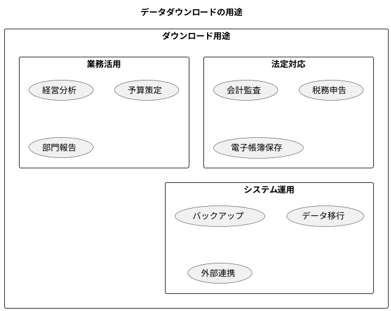
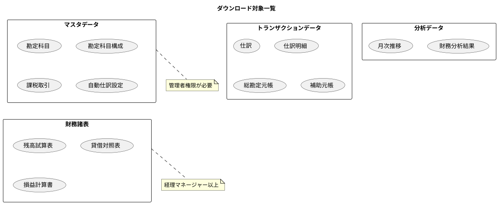
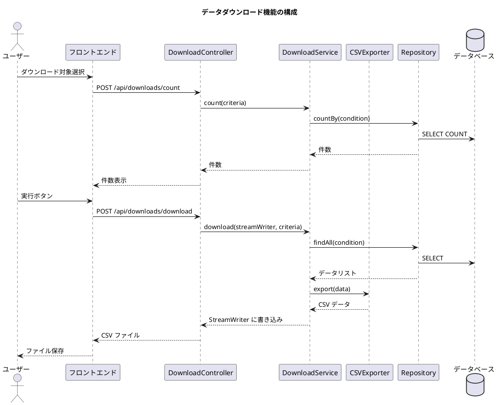
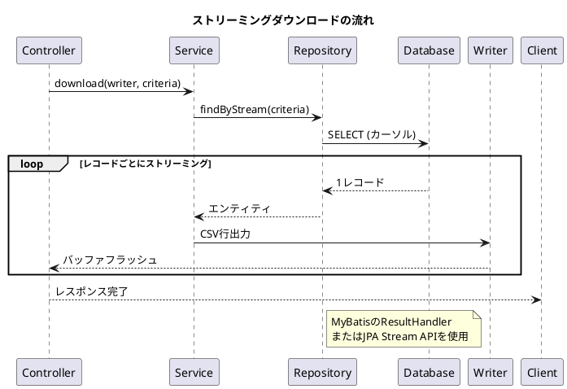

# 第26章: 非機能要件 2 - データダウンロード機能

## 26.1 ダウンロード機能の概要

### ダウンロード機能の必要性

財務会計システムでは、データを外部にエクスポートする機能が必須です。会計監査、税務申告、経営分析、バックアップなど多様な用途に対応します。



### ダウンロード対象

財務会計システムで管理するデータはすべてダウンロード可能です。



---

## 26.2 ダウンロード機能の設計

### アーキテクチャ



### ダウンロード対象の定義

```java
package com.example.accounting.application.download;

import lombok.Getter;
import lombok.RequiredArgsConstructor;

/**
 * ダウンロード対象
 */
@Getter
@RequiredArgsConstructor
public enum DownloadTarget {

    // マスタデータ
    勘定科目("account.csv", Permission.ACCOUNT_READ),
    勘定科目構成("account_structure.csv", Permission.ACCOUNT_READ),
    課税取引("tax_transaction.csv", Permission.ACCOUNT_READ),
    自動仕訳設定("auto_journal_setting.csv", Permission.ACCOUNT_READ),

    // トランザクションデータ
    仕訳("journal_entry.csv", Permission.JOURNAL_READ),
    仕訳明細("journal_line.csv", Permission.JOURNAL_READ),
    総勘定元帳("general_ledger.csv", Permission.LEDGER_READ),
    補助元帳("subsidiary_ledger.csv", Permission.LEDGER_READ),
    日次残高("daily_balance.csv", Permission.LEDGER_READ),

    // 財務諸表
    残高試算表("trial_balance.csv", Permission.STATEMENT_READ),
    貸借対照表("balance_sheet.csv", Permission.STATEMENT_READ),
    損益計算書("profit_loss.csv", Permission.STATEMENT_READ),

    // 分析データ
    財務分析("financial_analysis.csv", Permission.ANALYSIS_READ),
    月次推移("monthly_trend.csv", Permission.ANALYSIS_READ),

    // 監査データ
    監査ログ("audit_log.csv", Permission.AUDIT_READ);

    private final String fileName;
    private final Permission requiredPermission;

    /**
     * ファイル名から対象を取得
     */
    public static DownloadTarget fromFileName(String fileName) {
        for (DownloadTarget target : values()) {
            if (target.fileName.equals(fileName)) {
                return target;
            }
        }
        throw new IllegalArgumentException(
            "不正なダウンロード対象です: " + fileName
        );
    }
}
```

### ダウンロード条件

```java
package com.example.accounting.application.download;

import lombok.Builder;
import lombok.Value;
import java.time.LocalDate;

/**
 * ダウンロード条件
 */
@Value
@Builder
public class DownloadCriteria {

    DownloadTarget target;

    // 期間指定
    LocalDate startDate;
    LocalDate endDate;

    // 会計年度指定
    Integer fiscalYear;

    // 勘定科目フィルタ
    String accountCodeFrom;
    String accountCodeTo;

    // 仕訳ステータスフィルタ
    String journalStatus;

    /**
     * ダウンロード対象のファイル名を取得
     */
    public String getFileName() {
        return target.getFileName();
    }

    /**
     * 期間指定があるか確認
     */
    public boolean hasPeriod() {
        return startDate != null && endDate != null;
    }

    /**
     * 会計年度指定があるか確認
     */
    public boolean hasFiscalYear() {
        return fiscalYear != null;
    }

    /**
     * 勘定科目範囲指定があるか確認
     */
    public boolean hasAccountRange() {
        return accountCodeFrom != null || accountCodeTo != null;
    }
}
```

---

## 26.3 CSVエクスポータの実装

### CSVエクスポータインターフェース

```java
package com.example.accounting.infrastructure.export;

import java.io.Writer;
import java.util.List;

/**
 * CSVエクスポータ
 */
public interface CsvExporter<T> {

    /**
     * ヘッダー行を取得
     */
    String[] getHeaders();

    /**
     * データをCSV行に変換
     */
    String[] toRow(T data);

    /**
     * CSVを出力
     */
    default void export(Writer writer, List<T> dataList) throws Exception {
        // BOM出力（Excel対応）
        writer.write('\uFEFF');

        // ヘッダー出力
        writeLine(writer, getHeaders());

        // データ出力
        for (T data : dataList) {
            writeLine(writer, toRow(data));
        }

        writer.flush();
    }

    /**
     * 1行出力
     */
    private void writeLine(Writer writer, String[] values) throws Exception {
        StringBuilder sb = new StringBuilder();
        for (int i = 0; i < values.length; i++) {
            if (i > 0) sb.append(",");
            sb.append(escapeCsv(values[i]));
        }
        sb.append("\r\n");
        writer.write(sb.toString());
    }

    /**
     * CSVエスケープ
     */
    private String escapeCsv(String value) {
        if (value == null) return "";
        if (value.contains(",") || value.contains("\"") ||
            value.contains("\n") || value.contains("\r")) {
            return "\"" + value.replace("\"", "\"\"") + "\"";
        }
        return value;
    }
}
```

### 仕訳CSVエクスポータ

```java
package com.example.accounting.infrastructure.export;

import com.example.accounting.domain.model.journal.JournalEntry;
import com.example.accounting.domain.model.journal.JournalLine;
import org.springframework.stereotype.Component;

import java.time.format.DateTimeFormatter;

/**
 * 仕訳CSVエクスポータ
 */
@Component
public class JournalEntryCsvExporter implements CsvExporter<JournalEntry> {

    private static final DateTimeFormatter DATE_FORMAT =
        DateTimeFormatter.ofPattern("yyyy/MM/dd");
    private static final DateTimeFormatter DATETIME_FORMAT =
        DateTimeFormatter.ofPattern("yyyy/MM/dd HH:mm:ss");

    @Override
    public String[] getHeaders() {
        return new String[] {
            "仕訳番号",
            "仕訳日",
            "摘要",
            "ステータス",
            "借方合計",
            "貸方合計",
            "作成日時",
            "更新日時"
        };
    }

    @Override
    public String[] toRow(JournalEntry entry) {
        return new String[] {
            entry.getJournalNumber().getValue(),
            entry.getJournalDate().getValue().format(DATE_FORMAT),
            entry.getDescription().getValue(),
            entry.getStatus().getDisplayName(),
            entry.getTotalDebit().getAmount().toPlainString(),
            entry.getTotalCredit().getAmount().toPlainString(),
            entry.getCreatedAt() != null ?
                entry.getCreatedAt().format(DATETIME_FORMAT) : "",
            entry.getUpdatedAt() != null ?
                entry.getUpdatedAt().format(DATETIME_FORMAT) : ""
        };
    }
}

/**
 * 仕訳明細CSVエクスポータ
 */
@Component
public class JournalLineCsvExporter implements CsvExporter<JournalLineWithEntry> {

    @Override
    public String[] getHeaders() {
        return new String[] {
            "仕訳番号",
            "仕訳日",
            "行番号",
            "勘定科目コード",
            "勘定科目名",
            "借方金額",
            "貸方金額",
            "摘要"
        };
    }

    @Override
    public String[] toRow(JournalLineWithEntry data) {
        JournalLine line = data.getLine();
        return new String[] {
            data.getJournalNumber(),
            data.getJournalDate(),
            String.valueOf(line.getLineNumber()),
            line.getAccountCode().getValue(),
            line.getAccountName(),
            line.isDebit() ? line.getAmount().getAmount().toPlainString() : "",
            line.isCredit() ? line.getAmount().getAmount().toPlainString() : "",
            line.getDescription() != null ? line.getDescription() : ""
        };
    }
}
```

### 財務諸表CSVエクスポータ

```java
package com.example.accounting.infrastructure.export;

import com.example.accounting.domain.model.statement.BalanceSheetLine;
import com.example.accounting.domain.model.statement.ProfitLossLine;
import org.springframework.stereotype.Component;

/**
 * 貸借対照表CSVエクスポータ
 */
@Component
public class BalanceSheetCsvExporter implements CsvExporter<BalanceSheetLine> {

    @Override
    public String[] getHeaders() {
        return new String[] {
            "会計年度",
            "区分",
            "科目コード",
            "科目名",
            "金額",
            "構成比"
        };
    }

    @Override
    public String[] toRow(BalanceSheetLine line) {
        return new String[] {
            String.valueOf(line.getFiscalYear()),
            line.getSection().getDisplayName(),
            line.getAccountCode(),
            line.getAccountName(),
            line.getAmount().toPlainString(),
            line.getRatio() != null ?
                line.getRatio().toPlainString() + "%" : ""
        };
    }
}

/**
 * 損益計算書CSVエクスポータ
 */
@Component
public class ProfitLossCsvExporter implements CsvExporter<ProfitLossLine> {

    @Override
    public String[] getHeaders() {
        return new String[] {
            "会計年度",
            "区分",
            "科目コード",
            "科目名",
            "金額",
            "売上高比"
        };
    }

    @Override
    public String[] toRow(ProfitLossLine line) {
        return new String[] {
            String.valueOf(line.getFiscalYear()),
            line.getSection().getDisplayName(),
            line.getAccountCode(),
            line.getAccountName(),
            line.getAmount().toPlainString(),
            line.getSalesRatio() != null ?
                line.getSalesRatio().toPlainString() + "%" : ""
        };
    }
}
```

### 勘定科目CSVエクスポータ

```java
package com.example.accounting.infrastructure.export;

import com.example.accounting.domain.model.account.Account;
import org.springframework.stereotype.Component;

/**
 * 勘定科目CSVエクスポータ
 */
@Component
public class AccountCsvExporter implements CsvExporter<Account> {

    @Override
    public String[] getHeaders() {
        return new String[] {
            "勘定科目コード",
            "勘定科目名",
            "勘定科目種別",
            "税区分",
            "補助科目使用",
            "有効フラグ"
        };
    }

    @Override
    public String[] toRow(Account account) {
        return new String[] {
            account.getAccountCode().getValue(),
            account.getAccountName(),
            account.getAccountType().getDisplayName(),
            account.getTaxType() != null ?
                account.getTaxType().getDisplayName() : "",
            account.isUseSubAccount() ? "使用" : "未使用",
            account.isActive() ? "有効" : "無効"
        };
    }
}
```

---

## 26.4 ダウンロードサービスの実装

### ダウンロードサービス

```java
package com.example.accounting.application.download;

import com.example.accounting.domain.model.account.Account;
import com.example.accounting.domain.model.account.AccountRepository;
import com.example.accounting.domain.model.journal.JournalEntry;
import com.example.accounting.domain.model.journal.JournalRepository;
import com.example.accounting.domain.model.ledger.GeneralLedgerRepository;
import com.example.accounting.domain.model.statement.*;
import com.example.accounting.domain.model.user.Permission;
import com.example.accounting.infrastructure.export.*;
import lombok.RequiredArgsConstructor;
import org.springframework.security.access.AccessDeniedException;
import org.springframework.security.core.context.SecurityContextHolder;
import org.springframework.stereotype.Service;
import org.springframework.transaction.annotation.Transactional;

import java.io.Writer;
import java.util.List;

/**
 * ダウンロードサービス
 */
@Service
@RequiredArgsConstructor
@Transactional(readOnly = true)
public class DownloadService {

    private final AccountRepository accountRepository;
    private final JournalRepository journalRepository;
    private final GeneralLedgerRepository generalLedgerRepository;
    private final BalanceSheetRepository balanceSheetRepository;
    private final ProfitLossRepository profitLossRepository;
    private final FinancialAnalysisRepository analysisRepository;

    private final AccountCsvExporter accountExporter;
    private final JournalEntryCsvExporter journalExporter;
    private final JournalLineCsvExporter journalLineExporter;
    private final BalanceSheetCsvExporter balanceSheetExporter;
    private final ProfitLossCsvExporter profitLossExporter;
    private final GeneralLedgerCsvExporter ledgerExporter;

    /**
     * ダウンロード件数を取得
     */
    public int count(DownloadCriteria criteria) {
        checkPermission(criteria.getTarget().getRequiredPermission());

        return switch (criteria.getTarget()) {
            case 勘定科目 -> accountRepository.count();
            case 勘定科目構成 -> accountRepository.countStructure();
            case 仕訳 -> journalRepository.countBy(
                criteria.getStartDate(),
                criteria.getEndDate(),
                criteria.getJournalStatus()
            );
            case 仕訳明細 -> journalRepository.countLinesBy(
                criteria.getStartDate(),
                criteria.getEndDate()
            );
            case 総勘定元帳 -> generalLedgerRepository.countBy(
                criteria.getFiscalYear(),
                criteria.getAccountCodeFrom(),
                criteria.getAccountCodeTo()
            );
            case 残高試算表 -> 1; // 1レポート
            case 貸借対照表 -> balanceSheetRepository.countLines(
                criteria.getFiscalYear()
            );
            case 損益計算書 -> profitLossRepository.countLines(
                criteria.getFiscalYear()
            );
            case 財務分析 -> analysisRepository.countBy(
                criteria.getFiscalYear()
            );
            default -> 0;
        };
    }

    /**
     * ダウンロード実行
     */
    public void download(Writer writer, DownloadCriteria criteria)
            throws Exception {
        checkPermission(criteria.getTarget().getRequiredPermission());

        switch (criteria.getTarget()) {
            case 勘定科目 -> downloadAccounts(writer);
            case 仕訳 -> downloadJournalEntries(writer, criteria);
            case 仕訳明細 -> downloadJournalLines(writer, criteria);
            case 総勘定元帳 -> downloadGeneralLedger(writer, criteria);
            case 貸借対照表 -> downloadBalanceSheet(writer, criteria);
            case 損益計算書 -> downloadProfitLoss(writer, criteria);
            case 財務分析 -> downloadFinancialAnalysis(writer, criteria);
            default -> throw new IllegalArgumentException(
                "未対応のダウンロード対象です: " + criteria.getTarget()
            );
        }
    }

    private void downloadAccounts(Writer writer) throws Exception {
        List<Account> accounts = accountRepository.findAll();
        accountExporter.export(writer, accounts);
    }

    private void downloadJournalEntries(Writer writer, DownloadCriteria criteria)
            throws Exception {
        List<JournalEntry> entries = journalRepository.findBy(
            criteria.getStartDate(),
            criteria.getEndDate(),
            criteria.getJournalStatus()
        );
        journalExporter.export(writer, entries);
    }

    private void downloadJournalLines(Writer writer, DownloadCriteria criteria)
            throws Exception {
        List<JournalLineWithEntry> lines = journalRepository.findLinesBy(
            criteria.getStartDate(),
            criteria.getEndDate()
        );
        journalLineExporter.export(writer, lines);
    }

    private void downloadGeneralLedger(Writer writer, DownloadCriteria criteria)
            throws Exception {
        List<GeneralLedgerEntry> entries = generalLedgerRepository.findBy(
            criteria.getFiscalYear(),
            criteria.getAccountCodeFrom(),
            criteria.getAccountCodeTo()
        );
        ledgerExporter.export(writer, entries);
    }

    private void downloadBalanceSheet(Writer writer, DownloadCriteria criteria)
            throws Exception {
        List<BalanceSheetLine> lines = balanceSheetRepository.findLines(
            criteria.getFiscalYear()
        );
        balanceSheetExporter.export(writer, lines);
    }

    private void downloadProfitLoss(Writer writer, DownloadCriteria criteria)
            throws Exception {
        List<ProfitLossLine> lines = profitLossRepository.findLines(
            criteria.getFiscalYear()
        );
        profitLossExporter.export(writer, lines);
    }

    private void downloadFinancialAnalysis(Writer writer, DownloadCriteria criteria)
            throws Exception {
        // 財務分析結果のダウンロード
        // 実装省略
    }

    /**
     * 権限チェック
     */
    private void checkPermission(Permission required) {
        var authentication = SecurityContextHolder.getContext()
            .getAuthentication();

        if (authentication == null) {
            throw new AccessDeniedException("認証が必要です");
        }

        boolean hasPermission = authentication.getAuthorities().stream()
            .anyMatch(a -> a.getAuthority().equals(required.name()));

        if (!hasPermission) {
            throw new AccessDeniedException(
                "ダウンロード権限がありません: " + required.getDisplayName()
            );
        }
    }
}
```

---

## 26.5 ダウンロードAPIの実装

### ダウンロードコントローラ

```java
package com.example.accounting.presentation.api;

import com.example.accounting.application.download.*;
import io.swagger.v3.oas.annotations.Operation;
import io.swagger.v3.oas.annotations.tags.Tag;
import jakarta.servlet.http.HttpServletResponse;
import lombok.RequiredArgsConstructor;
import lombok.extern.slf4j.Slf4j;
import org.springframework.http.HttpHeaders;
import org.springframework.http.ResponseEntity;
import org.springframework.web.bind.annotation.*;

import java.io.OutputStreamWriter;
import java.nio.charset.Charset;

/**
 * ダウンロードAPIコントローラ
 */
@Slf4j
@RestController
@RequestMapping("/api/downloads")
@Tag(name = "Download", description = "データダウンロード")
@RequiredArgsConstructor
public class DownloadApiController {

    private final DownloadService downloadService;

    @Operation(summary = "ダウンロード件数取得",
               description = "指定条件でのダウンロード件数を取得する")
    @PostMapping("/count")
    public ResponseEntity<DownloadCountResponse> count(
            @RequestBody DownloadRequest request) {
        try {
            DownloadCriteria criteria = toCriteria(request);
            int count = downloadService.count(criteria);
            return ResponseEntity.ok(new DownloadCountResponse(count));
        } catch (Exception e) {
            log.error("ダウンロード件数取得エラー", e);
            return ResponseEntity.badRequest().build();
        }
    }

    @Operation(summary = "データダウンロード",
               description = "指定条件でデータをCSVダウンロードする")
    @PostMapping("/download")
    @AuditAnnotation(
        process = ApplicationExecutionProcessType.データダウンロード,
        type = ApplicationExecutionHistoryType.同期
    )
    public void download(
            @RequestBody DownloadRequest request,
            HttpServletResponse response) {

        DownloadCriteria criteria = toCriteria(request);

        // レスポンスヘッダー設定
        response.setContentType("text/csv; charset=UTF-8");
        response.setHeader(
            HttpHeaders.CONTENT_DISPOSITION,
            "attachment; filename=\"" + criteria.getFileName() + "\""
        );

        try (OutputStreamWriter writer = new OutputStreamWriter(
                response.getOutputStream(),
                Charset.forName("UTF-8"))) {

            downloadService.download(writer, criteria);

        } catch (Exception e) {
            log.error("ダウンロードエラー: {}", criteria.getTarget(), e);
            response.setStatus(HttpServletResponse.SC_INTERNAL_SERVER_ERROR);
        }
    }

    @Operation(summary = "ダウンロード対象一覧",
               description = "ダウンロード可能な対象一覧を取得する")
    @GetMapping("/targets")
    public ResponseEntity<DownloadTargetListResponse> getTargets() {
        var targets = java.util.Arrays.stream(DownloadTarget.values())
            .map(t -> new DownloadTargetInfo(
                t.name(),
                t.getFileName(),
                t.getRequiredPermission().getDisplayName()
            ))
            .toList();
        return ResponseEntity.ok(new DownloadTargetListResponse(targets));
    }

    private DownloadCriteria toCriteria(DownloadRequest request) {
        return DownloadCriteria.builder()
            .target(DownloadTarget.valueOf(request.getTarget()))
            .startDate(request.getStartDate())
            .endDate(request.getEndDate())
            .fiscalYear(request.getFiscalYear())
            .accountCodeFrom(request.getAccountCodeFrom())
            .accountCodeTo(request.getAccountCodeTo())
            .journalStatus(request.getJournalStatus())
            .build();
    }
}
```

### リクエスト/レスポンスDTO

```java
package com.example.accounting.application.download;

import lombok.Data;
import java.time.LocalDate;

/**
 * ダウンロードリクエスト
 */
@Data
public class DownloadRequest {
    private String target;
    private LocalDate startDate;
    private LocalDate endDate;
    private Integer fiscalYear;
    private String accountCodeFrom;
    private String accountCodeTo;
    private String journalStatus;
}

/**
 * ダウンロード件数レスポンス
 */
public record DownloadCountResponse(int count) {}

/**
 * ダウンロード対象情報
 */
public record DownloadTargetInfo(
    String name,
    String fileName,
    String requiredPermission
) {}

/**
 * ダウンロード対象一覧レスポンス
 */
public record DownloadTargetListResponse(
    java.util.List<DownloadTargetInfo> targets
) {}
```

---

## 26.6 権限によるアクセス制御

### ダウンロード権限マトリクス

| 対象 | ACCOUNTANT | MANAGER | EXECUTIVE | ADMIN |
|------|:----------:|:-------:|:---------:|:-----:|
| 勘定科目 | ✓ | ✓ | ✓ | ✓ |
| 勘定科目構成 | ✓ | ✓ | ✓ | ✓ |
| 課税取引 | ✓ | ✓ | ✓ | ✓ |
| 自動仕訳設定 | ✓ | ✓ | ✓ | ✓ |
| 仕訳 | ✓ | ✓ | ✓ | ✓ |
| 仕訳明細 | ✓ | ✓ | ✓ | ✓ |
| 総勘定元帳 | ✓ | ✓ | ✓ | ✓ |
| 補助元帳 | ✓ | ✓ | ✓ | ✓ |
| 残高試算表 | ✓ | ✓ | ✓ | ✓ |
| 貸借対照表 | ✓ | ✓ | ✓ | ✓ |
| 損益計算書 | ✓ | ✓ | ✓ | ✓ |
| 財務分析 | - | ✓ | ✓ | ✓ |
| 月次推移 | - | ✓ | ✓ | ✓ |
| 監査ログ | - | - | ✓ | ✓ |

### 権限チェックの実装

```java
/**
 * メソッドレベルの権限チェック
 */
@PreAuthorize("hasAuthority('STATEMENT_READ')")
public void downloadBalanceSheet(Writer writer, DownloadCriteria criteria)
        throws Exception {
    // 実装
}

@PreAuthorize("hasAuthority('ANALYSIS_READ')")
public void downloadFinancialAnalysis(Writer writer, DownloadCriteria criteria)
        throws Exception {
    // 実装
}

@PreAuthorize("hasAuthority('AUDIT_READ')")
public void downloadAuditLog(Writer writer, DownloadCriteria criteria)
        throws Exception {
    // 実装
}
```

---

## 26.7 大量データのダウンロード対応

### ストリーミング出力

大量データのダウンロードでは、メモリ効率を考慮したストリーミング出力を行います。



### ストリーミング実装

```java
package com.example.accounting.infrastructure.repository;

import org.apache.ibatis.cursor.Cursor;
import org.apache.ibatis.session.SqlSession;
import org.springframework.stereotype.Repository;

import java.io.Writer;
import java.util.function.Consumer;

/**
 * 仕訳ストリーミングリポジトリ
 */
@Repository
public class JournalStreamRepository {

    private final SqlSession sqlSession;
    private final JournalEntryCsvExporter exporter;

    /**
     * ストリーミングダウンロード
     */
    public void streamDownload(
            Writer writer,
            LocalDate startDate,
            LocalDate endDate,
            Consumer<JournalEntry> processor) throws Exception {

        // ヘッダー出力
        writer.write('\uFEFF');
        writeLine(writer, exporter.getHeaders());

        // カーソルでストリーミング取得
        try (Cursor<JournalEntry> cursor = sqlSession.selectCursor(
                "JournalMapper.selectByDateRangeCursor",
                Map.of("startDate", startDate, "endDate", endDate))) {

            for (JournalEntry entry : cursor) {
                writeLine(writer, exporter.toRow(entry));

                // 定期的にフラッシュ
                if (cursor.getCurrentIndex() % 1000 == 0) {
                    writer.flush();
                }
            }
        }

        writer.flush();
    }

    private void writeLine(Writer writer, String[] values) throws Exception {
        StringBuilder sb = new StringBuilder();
        for (int i = 0; i < values.length; i++) {
            if (i > 0) sb.append(",");
            sb.append(escapeCsv(values[i]));
        }
        sb.append("\r\n");
        writer.write(sb.toString());
    }
}
```

### 非同期ダウンロード

大量データの場合は非同期ダウンロードを提供します。

```java
package com.example.accounting.application.download;

import org.springframework.scheduling.annotation.Async;
import org.springframework.stereotype.Service;

import java.io.FileWriter;
import java.nio.file.Path;
import java.util.UUID;
import java.util.concurrent.CompletableFuture;

/**
 * 非同期ダウンロードサービス
 */
@Service
public class AsyncDownloadService {

    private final DownloadService downloadService;
    private final DownloadJobRepository jobRepository;

    /**
     * 非同期ダウンロードを開始
     */
    public String startAsyncDownload(DownloadCriteria criteria, String userId) {
        String jobId = UUID.randomUUID().toString();

        // ジョブ登録
        DownloadJob job = DownloadJob.create(jobId, criteria, userId);
        jobRepository.save(job);

        // 非同期実行
        executeAsync(jobId, criteria);

        return jobId;
    }

    @Async("downloadTaskExecutor")
    public CompletableFuture<Void> executeAsync(
            String jobId,
            DownloadCriteria criteria) {

        DownloadJob job = jobRepository.findById(jobId).orElseThrow();

        try {
            // ステータス更新: 実行中
            jobRepository.save(job.start());

            // 一時ファイルに出力
            Path tempFile = Path.of("/tmp/downloads", jobId + ".csv");
            try (FileWriter writer = new FileWriter(tempFile.toFile())) {
                downloadService.download(writer, criteria);
            }

            // ステータス更新: 完了
            jobRepository.save(job.complete(tempFile.toString()));

        } catch (Exception e) {
            // ステータス更新: エラー
            jobRepository.save(job.fail(e.getMessage()));
        }

        return CompletableFuture.completedFuture(null);
    }

    /**
     * ダウンロードジョブのステータス確認
     */
    public DownloadJob getJobStatus(String jobId) {
        return jobRepository.findById(jobId)
            .orElseThrow(() -> new IllegalArgumentException(
                "ダウンロードジョブが見つかりません: " + jobId
            ));
    }

    /**
     * ダウンロードファイル取得
     */
    public Path getDownloadFile(String jobId) {
        DownloadJob job = getJobStatus(jobId);
        if (job.getStatus() != DownloadJobStatus.COMPLETED) {
            throw new IllegalStateException("ダウンロードが完了していません");
        }
        return Path.of(job.getFilePath());
    }
}
```

### ダウンロードジョブ

```java
package com.example.accounting.application.download;

import lombok.Value;
import lombok.With;
import java.time.LocalDateTime;

/**
 * ダウンロードジョブ
 */
@Value
@With
public class DownloadJob {

    String jobId;
    DownloadTarget target;
    String userId;
    DownloadJobStatus status;
    LocalDateTime startedAt;
    LocalDateTime completedAt;
    String filePath;
    String errorMessage;

    public static DownloadJob create(
            String jobId,
            DownloadCriteria criteria,
            String userId) {
        return new DownloadJob(
            jobId,
            criteria.getTarget(),
            userId,
            DownloadJobStatus.PENDING,
            null,
            null,
            null,
            null
        );
    }

    public DownloadJob start() {
        return this
            .withStatus(DownloadJobStatus.RUNNING)
            .withStartedAt(LocalDateTime.now());
    }

    public DownloadJob complete(String filePath) {
        return this
            .withStatus(DownloadJobStatus.COMPLETED)
            .withCompletedAt(LocalDateTime.now())
            .withFilePath(filePath);
    }

    public DownloadJob fail(String errorMessage) {
        return this
            .withStatus(DownloadJobStatus.FAILED)
            .withCompletedAt(LocalDateTime.now())
            .withErrorMessage(errorMessage);
    }
}

public enum DownloadJobStatus {
    PENDING("待機中"),
    RUNNING("実行中"),
    COMPLETED("完了"),
    FAILED("失敗");

    private final String displayName;

    DownloadJobStatus(String displayName) {
        this.displayName = displayName;
    }

    public String getDisplayName() {
        return displayName;
    }
}
```

---

## 26.8 Excel形式でのダウンロード

### Excel出力の実装

財務諸表などはExcel形式でのダウンロードも提供します。

```java
package com.example.accounting.infrastructure.export;

import org.apache.poi.ss.usermodel.*;
import org.apache.poi.xssf.usermodel.XSSFWorkbook;
import org.springframework.stereotype.Component;

import java.io.OutputStream;
import java.util.List;

/**
 * 財務諸表Excelエクスポータ
 */
@Component
public class FinancialStatementExcelExporter {

    /**
     * 貸借対照表をExcel出力
     */
    public void exportBalanceSheet(
            OutputStream outputStream,
            BalanceSheet balanceSheet) throws Exception {

        try (Workbook workbook = new XSSFWorkbook()) {
            Sheet sheet = workbook.createSheet("貸借対照表");

            // ヘッダースタイル
            CellStyle headerStyle = createHeaderStyle(workbook);
            CellStyle amountStyle = createAmountStyle(workbook);

            // タイトル
            Row titleRow = sheet.createRow(0);
            Cell titleCell = titleRow.createCell(0);
            titleCell.setCellValue("貸借対照表");
            titleCell.setCellStyle(headerStyle);

            // 期間
            Row periodRow = sheet.createRow(1);
            periodRow.createCell(0).setCellValue(
                String.format("%d年度", balanceSheet.getFiscalYear())
            );

            // ヘッダー行
            int rowNum = 3;
            Row headerRow = sheet.createRow(rowNum++);
            String[] headers = {"区分", "科目", "金額"};
            for (int i = 0; i < headers.length; i++) {
                Cell cell = headerRow.createCell(i);
                cell.setCellValue(headers[i]);
                cell.setCellStyle(headerStyle);
            }

            // 資産の部
            rowNum = writeSection(sheet, rowNum, "資産の部",
                balanceSheet.getAssets(), amountStyle);

            // 負債の部
            rowNum = writeSection(sheet, rowNum, "負債の部",
                balanceSheet.getLiabilities(), amountStyle);

            // 純資産の部
            rowNum = writeSection(sheet, rowNum, "純資産の部",
                balanceSheet.getEquity(), amountStyle);

            // 列幅調整
            sheet.autoSizeColumn(0);
            sheet.autoSizeColumn(1);
            sheet.setColumnWidth(2, 15 * 256);

            workbook.write(outputStream);
        }
    }

    private int writeSection(
            Sheet sheet,
            int startRow,
            String sectionName,
            List<BalanceSheetLine> lines,
            CellStyle amountStyle) {

        int rowNum = startRow;

        // セクションヘッダー
        Row sectionRow = sheet.createRow(rowNum++);
        sectionRow.createCell(0).setCellValue(sectionName);

        // 明細行
        for (BalanceSheetLine line : lines) {
            Row row = sheet.createRow(rowNum++);
            row.createCell(1).setCellValue(line.getAccountName());

            Cell amountCell = row.createCell(2);
            amountCell.setCellValue(line.getAmount().doubleValue());
            amountCell.setCellStyle(amountStyle);
        }

        return rowNum + 1; // 空行を追加
    }

    private CellStyle createHeaderStyle(Workbook workbook) {
        CellStyle style = workbook.createCellStyle();
        Font font = workbook.createFont();
        font.setBold(true);
        style.setFont(font);
        style.setFillForegroundColor(IndexedColors.GREY_25_PERCENT.getIndex());
        style.setFillPattern(FillPatternType.SOLID_FOREGROUND);
        return style;
    }

    private CellStyle createAmountStyle(Workbook workbook) {
        CellStyle style = workbook.createCellStyle();
        DataFormat format = workbook.createDataFormat();
        style.setDataFormat(format.getFormat("#,##0"));
        style.setAlignment(HorizontalAlignment.RIGHT);
        return style;
    }
}
```

---

## まとめ

本章では、財務会計システムのデータダウンロード機能について解説しました。

### 重要なポイント

1. **ダウンロード対象の網羅**: マスタデータ、トランザクションデータ、財務諸表、分析データなど、システムで管理するすべてのデータをダウンロード可能にしています。

2. **権限によるアクセス制御**: ダウンロード対象ごとに必要な権限を定義し、財務分析や監査ログなど機密性の高いデータへのアクセスを制限しています。

3. **大量データ対応**: ストリーミング出力や非同期ダウンロードにより、大量データでもメモリ効率よくダウンロードできます。

4. **複数フォーマット対応**: CSV形式に加えて、財務諸表などはExcel形式でのダウンロードも提供し、利用者の利便性を高めています。

### ダウンロード機能の用途

| 用途 | 対象データ | 形式 |
|------|-----------|------|
| 会計監査 | 仕訳、元帳、財務諸表 | CSV/Excel |
| 税務申告 | 仕訳、勘定科目、財務諸表 | CSV |
| 経営分析 | 財務分析、月次推移 | Excel |
| バックアップ | 全データ | CSV |
| 外部連携 | 仕訳、元帳 | CSV |

次章では、監査ログとトレーサビリティについて解説します。
