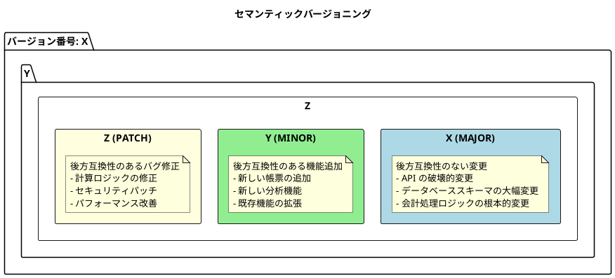
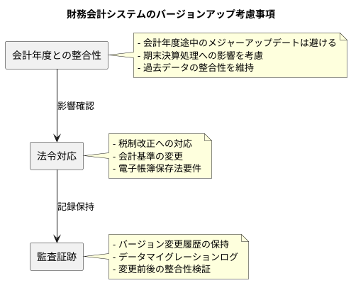
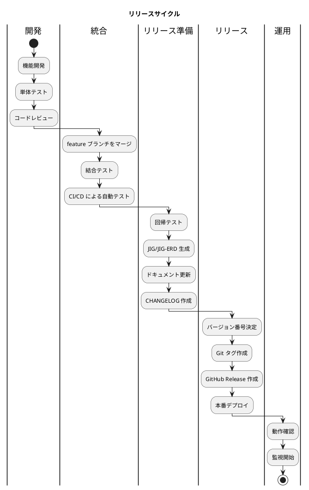
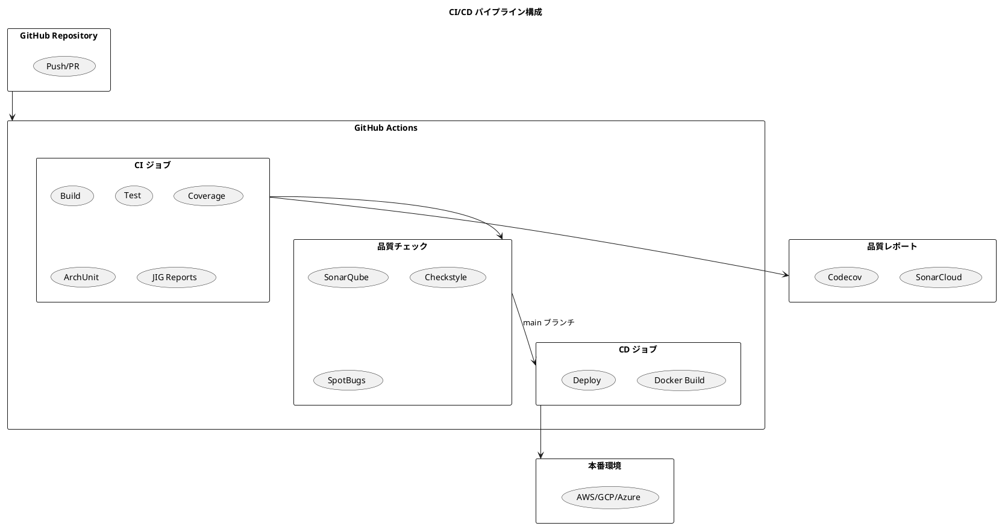
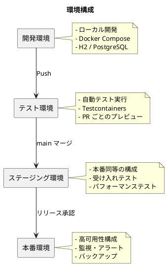
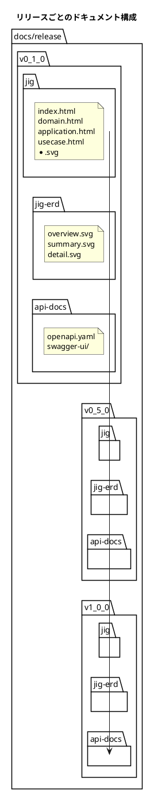
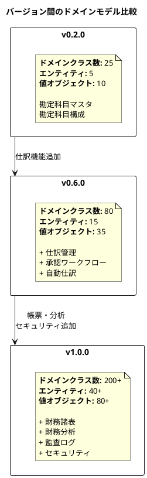
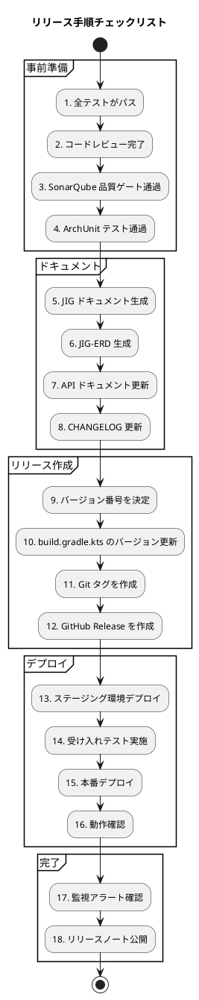
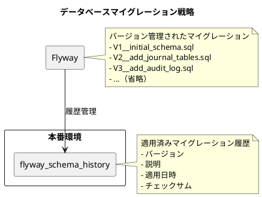

# 第29章: リリース管理

## 29.1 バージョニング戦略

### セマンティックバージョニング

本プロジェクトでは、セマンティックバージョニング（Semantic Versioning）を採用しています。バージョン番号は `MAJOR.MINOR.PATCH` の形式で表現されます。



### 財務会計システムのバージョン履歴

本プロジェクトのリリースバージョンは以下のように進化してきました。

| バージョン | 主な内容 | 対応する章 |
|-----------|---------|-----------|
| 0.1.0 | 環境構築、アーキテクチャ設計 | 第1〜3章 |
| 0.2.0 | データモデル設計 | 第4〜8章 |
| 0.3.0 | 勘定科目マスタ管理 | 第9〜10章 |
| 0.4.0 | 課税取引・自動仕訳設定 | 第11〜12章 |
| 0.5.0 | 仕訳入力・自動仕訳 | 第13〜14章 |
| 0.6.0 | 仕訳承認ワークフロー | 第15章 |
| 0.7.0 | 総勘定元帳・補助元帳 | 第16〜17章 |
| 0.8.0 | 残高試算表 | 第18章 |
| 0.9.0 | 財務諸表（B/S、P/L） | 第19〜20章 |
| 0.10.0 | 財務分析機能 | 第21章 |
| 0.11.0 | テスト戦略・リファクタリング | 第22〜24章 |
| 0.12.0 | 認証・セキュリティ | 第25章 |
| 0.13.0 | データダウンロード・監査ログ | 第26〜27章 |
| 0.14.0 | 楽観ロック実装 | 第28章 |
| 1.0.0 | 本番リリース | - |

### 財務会計システム固有の考慮事項

財務会計システムでは、バージョンアップ時に特別な配慮が必要です。



### リリースサイクル



---

## 29.2 CI/CD パイプライン

### GitHub Actions による自動化

本プロジェクトでは、GitHub Actions を使用して CI/CD パイプラインを構築しています。



### バックエンドの CI 設定

Gradle プロジェクトのビルドとテストを自動化します。

```yaml
# .github/workflows/backend-ci.yml
name: Backend CI

on:
  push:
    branches: [ '*' ]
    paths:
      - 'app/backend/**'
      - '.github/workflows/backend-ci.yml'
  pull_request:
    branches: [ main, develop ]
    paths:
      - 'app/backend/**'

permissions:
  contents: read
  checks: write
  pull-requests: write

env:
  JAVA_VERSION: '25'
  GRADLE_VERSION: '8.11'

jobs:
  build:
    name: Build
    runs-on: ubuntu-latest
    steps:
      - uses: actions/checkout@v4

      - name: Set up JDK
        uses: actions/setup-java@v4
        with:
          java-version: ${{ env.JAVA_VERSION }}
          distribution: 'oracle'
          cache: 'gradle'

      - name: Grant execute permission for Gradle wrapper
        run: chmod +x ./gradlew
        working-directory: app/backend/api

      - name: Build with Gradle
        run: ./gradlew build -x test -x jigReports
        working-directory: app/backend/api

      - name: Upload build artifacts
        uses: actions/upload-artifact@v4
        with:
          name: build-artifacts
          path: app/backend/api/build/libs/*.jar

  test:
    name: Test
    runs-on: ubuntu-latest
    needs: build
    services:
      postgres:
        image: postgres:16
        env:
          POSTGRES_USER: test
          POSTGRES_PASSWORD: test
          POSTGRES_DB: accounting_test
        ports:
          - 5432:5432
        options: >-
          --health-cmd pg_isready
          --health-interval 10s
          --health-timeout 5s
          --health-retries 5

    steps:
      - uses: actions/checkout@v4

      - name: Set up JDK
        uses: actions/setup-java@v4
        with:
          java-version: ${{ env.JAVA_VERSION }}
          distribution: 'oracle'
          cache: 'gradle'

      - name: Grant execute permission for Gradle wrapper
        run: chmod +x ./gradlew
        working-directory: app/backend/api

      - name: Run tests
        run: ./gradlew test
        working-directory: app/backend/api
        env:
          SPRING_DATASOURCE_URL: jdbc:postgresql://localhost:5432/accounting_test
          SPRING_DATASOURCE_USERNAME: test
          SPRING_DATASOURCE_PASSWORD: test

      - name: Publish Test Results
        uses: EnricoMi/publish-unit-test-result-action@v2
        if: always()
        with:
          files: app/backend/api/build/test-results/test/*.xml

  coverage:
    name: Code Coverage
    runs-on: ubuntu-latest
    needs: test
    services:
      postgres:
        image: postgres:16
        env:
          POSTGRES_USER: test
          POSTGRES_PASSWORD: test
          POSTGRES_DB: accounting_test
        ports:
          - 5432:5432

    steps:
      - uses: actions/checkout@v4

      - name: Set up JDK
        uses: actions/setup-java@v4
        with:
          java-version: ${{ env.JAVA_VERSION }}
          distribution: 'oracle'
          cache: 'gradle'

      - name: Grant execute permission for Gradle wrapper
        run: chmod +x ./gradlew
        working-directory: app/backend/api

      - name: Generate coverage report
        run: ./gradlew jacocoTestReport
        working-directory: app/backend/api
        env:
          SPRING_DATASOURCE_URL: jdbc:postgresql://localhost:5432/accounting_test
          SPRING_DATASOURCE_USERNAME: test
          SPRING_DATASOURCE_PASSWORD: test

      - name: Upload coverage to Codecov
        uses: codecov/codecov-action@v4
        with:
          token: ${{ secrets.CODECOV_TOKEN }}
          files: app/backend/api/build/reports/jacoco/test/jacocoTestReport.xml
          flags: backend
          name: backend-coverage

  architecture-test:
    name: Architecture Test
    runs-on: ubuntu-latest
    needs: build
    steps:
      - uses: actions/checkout@v4

      - name: Set up JDK
        uses: actions/setup-java@v4
        with:
          java-version: ${{ env.JAVA_VERSION }}
          distribution: 'oracle'
          cache: 'gradle'

      - name: Grant execute permission for Gradle wrapper
        run: chmod +x ./gradlew
        working-directory: app/backend/api

      - name: Run ArchUnit tests
        run: ./gradlew test --tests "*ArchitectureTest*"
        working-directory: app/backend/api

  jig-reports:
    name: Generate JIG Reports
    runs-on: ubuntu-latest
    needs: build
    steps:
      - uses: actions/checkout@v4

      - name: Set up JDK
        uses: actions/setup-java@v4
        with:
          java-version: ${{ env.JAVA_VERSION }}
          distribution: 'oracle'
          cache: 'gradle'

      - name: Set up Graphviz
        run: sudo apt-get install -y graphviz

      - name: Grant execute permission for Gradle wrapper
        run: chmod +x ./gradlew
        working-directory: app/backend/api

      - name: Generate JIG reports
        run: ./gradlew jigReports
        working-directory: app/backend/api

      - name: Upload JIG reports
        uses: actions/upload-artifact@v4
        with:
          name: jig-reports
          path: app/backend/api/build/jig/
```

### SonarQube による品質分析

```yaml
# .github/workflows/sonarqube.yml
name: SonarQube Analysis

on:
  push:
    branches: [ main, develop ]
  pull_request:
    branches: [ main ]

jobs:
  sonarqube:
    name: SonarQube Scan
    runs-on: ubuntu-latest
    services:
      postgres:
        image: postgres:16
        env:
          POSTGRES_USER: test
          POSTGRES_PASSWORD: test
          POSTGRES_DB: accounting_test
        ports:
          - 5432:5432

    steps:
      - uses: actions/checkout@v4
        with:
          fetch-depth: 0

      - name: Set up JDK
        uses: actions/setup-java@v4
        with:
          java-version: '25'
          distribution: 'oracle'
          cache: 'gradle'

      - name: Grant execute permission for Gradle wrapper
        run: chmod +x ./gradlew
        working-directory: app/backend/api

      - name: Build and analyze
        run: ./gradlew build jacocoTestReport sonar
        working-directory: app/backend/api
        env:
          GITHUB_TOKEN: ${{ secrets.GITHUB_TOKEN }}
          SONAR_TOKEN: ${{ secrets.SONAR_TOKEN }}
          SONAR_HOST_URL: ${{ secrets.SONAR_HOST_URL }}
          SPRING_DATASOURCE_URL: jdbc:postgresql://localhost:5432/accounting_test
          SPRING_DATASOURCE_USERNAME: test
          SPRING_DATASOURCE_PASSWORD: test
```

### Gradle の SonarQube 設定

```kotlin
// build.gradle.kts
plugins {
    id("org.sonarqube") version "5.1.0.4882"
}

sonar {
    properties {
        property("sonar.projectKey", "accounting-system")
        property("sonar.projectName", "Financial Accounting System")
        property("sonar.organization", "your-organization")
        property("sonar.host.url", System.getenv("SONAR_HOST_URL") ?: "https://sonarcloud.io")

        // ソース設定
        property("sonar.sources", "src/main/java")
        property("sonar.tests", "src/test/java")

        // カバレッジレポート
        property("sonar.coverage.jacoco.xmlReportPaths",
            "${buildDir}/reports/jacoco/test/jacocoTestReport.xml")

        // 除外設定
        property("sonar.exclusions", listOf(
            "**/entity/**",
            "**/dto/**",
            "**/config/**",
            "**/*Application.java"
        ).joinToString(","))

        // テスト除外
        property("sonar.test.exclusions", "**/test/**")
    }
}
```

---

## 29.3 デプロイ戦略

### 環境構成



### Docker 化

```dockerfile
# Dockerfile
FROM eclipse-temurin:25-jre-alpine AS runtime

# セキュリティ設定
RUN addgroup -S spring && adduser -S spring -G spring
USER spring:spring

# アプリケーション配置
ARG JAR_FILE=build/libs/*.jar
COPY ${JAR_FILE} app.jar

# ヘルスチェック
HEALTHCHECK --interval=30s --timeout=3s --start-period=60s --retries=3 \
  CMD wget -q --spider http://localhost:8080/actuator/health || exit 1

# 起動設定
EXPOSE 8080
ENTRYPOINT ["java", \
  "-XX:+UseContainerSupport", \
  "-XX:MaxRAMPercentage=75.0", \
  "-Djava.security.egd=file:/dev/./urandom", \
  "-jar", "app.jar"]
```

### Docker Compose（開発環境）

```yaml
# docker-compose.yml
version: '3.8'

services:
  app:
    build:
      context: .
      dockerfile: Dockerfile
    ports:
      - "8080:8080"
    environment:
      - SPRING_PROFILES_ACTIVE=docker
      - SPRING_DATASOURCE_URL=jdbc:postgresql://db:5432/accounting
      - SPRING_DATASOURCE_USERNAME=postgres
      - SPRING_DATASOURCE_PASSWORD=postgres
    depends_on:
      db:
        condition: service_healthy

  db:
    image: postgres:16-alpine
    ports:
      - "5432:5432"
    environment:
      - POSTGRES_DB=accounting
      - POSTGRES_USER=postgres
      - POSTGRES_PASSWORD=postgres
    volumes:
      - postgres_data:/var/lib/postgresql/data
    healthcheck:
      test: ["CMD-SHELL", "pg_isready -U postgres"]
      interval: 10s
      timeout: 5s
      retries: 5

volumes:
  postgres_data:
```

### Kubernetes デプロイ設定

```yaml
# k8s/deployment.yaml
apiVersion: apps/v1
kind: Deployment
metadata:
  name: accounting-api
  labels:
    app: accounting-api
spec:
  replicas: 3
  selector:
    matchLabels:
      app: accounting-api
  template:
    metadata:
      labels:
        app: accounting-api
    spec:
      containers:
        - name: accounting-api
          image: accounting-api:latest
          ports:
            - containerPort: 8080
          env:
            - name: SPRING_PROFILES_ACTIVE
              value: "production"
            - name: SPRING_DATASOURCE_URL
              valueFrom:
                secretKeyRef:
                  name: db-credentials
                  key: url
            - name: SPRING_DATASOURCE_USERNAME
              valueFrom:
                secretKeyRef:
                  name: db-credentials
                  key: username
            - name: SPRING_DATASOURCE_PASSWORD
              valueFrom:
                secretKeyRef:
                  name: db-credentials
                  key: password
          resources:
            requests:
              memory: "512Mi"
              cpu: "500m"
            limits:
              memory: "1Gi"
              cpu: "1000m"
          livenessProbe:
            httpGet:
              path: /actuator/health/liveness
              port: 8080
            initialDelaySeconds: 60
            periodSeconds: 10
          readinessProbe:
            httpGet:
              path: /actuator/health/readiness
              port: 8080
            initialDelaySeconds: 30
            periodSeconds: 5
---
apiVersion: v1
kind: Service
metadata:
  name: accounting-api-service
spec:
  selector:
    app: accounting-api
  ports:
    - protocol: TCP
      port: 80
      targetPort: 8080
  type: LoadBalancer
```

### CD パイプライン

```yaml
# .github/workflows/deploy.yml
name: Deploy to Production

on:
  push:
    tags:
      - 'v*'

env:
  REGISTRY: ghcr.io
  IMAGE_NAME: ${{ github.repository }}

jobs:
  build-and-push:
    name: Build and Push Docker Image
    runs-on: ubuntu-latest
    permissions:
      contents: read
      packages: write

    steps:
      - uses: actions/checkout@v4

      - name: Set up JDK
        uses: actions/setup-java@v4
        with:
          java-version: '25'
          distribution: 'oracle'
          cache: 'gradle'

      - name: Build with Gradle
        run: ./gradlew bootJar
        working-directory: app/backend/api

      - name: Log in to Container Registry
        uses: docker/login-action@v3
        with:
          registry: ${{ env.REGISTRY }}
          username: ${{ github.actor }}
          password: ${{ secrets.GITHUB_TOKEN }}

      - name: Extract metadata for Docker
        id: meta
        uses: docker/metadata-action@v5
        with:
          images: ${{ env.REGISTRY }}/${{ env.IMAGE_NAME }}
          tags: |
            type=semver,pattern={{version}}
            type=semver,pattern={{major}}.{{minor}}
            type=sha

      - name: Build and push Docker image
        uses: docker/build-push-action@v5
        with:
          context: app/backend/api
          push: true
          tags: ${{ steps.meta.outputs.tags }}
          labels: ${{ steps.meta.outputs.labels }}

  deploy:
    name: Deploy to Kubernetes
    runs-on: ubuntu-latest
    needs: build-and-push
    environment: production

    steps:
      - uses: actions/checkout@v4

      - name: Configure kubectl
        uses: azure/k8s-set-context@v4
        with:
          kubeconfig: ${{ secrets.KUBE_CONFIG }}

      - name: Update deployment image
        run: |
          kubectl set image deployment/accounting-api \
            accounting-api=${{ env.REGISTRY }}/${{ env.IMAGE_NAME }}:${{ github.ref_name }}

      - name: Verify deployment
        run: |
          kubectl rollout status deployment/accounting-api --timeout=300s
```

---

## 29.4 JIG/JIG-ERD アーカイブ

### リリース時のドキュメント保存

各リリースバージョンで生成された JIG および JIG-ERD ドキュメントを保存することで、アーキテクチャの変遷を追跡できます。



### JIG ドキュメントの生成手順

リリース時に JIG ドキュメントを生成する手順です。

```bash
#!/bin/bash
# scripts/generate-release-docs.sh

VERSION=$1
if [ -z "$VERSION" ]; then
  echo "Usage: ./generate-release-docs.sh <version>"
  exit 1
fi

# バージョン形式を変換（1.0.0 → v1_0_0）
VERSION_DIR="v${VERSION//./_}"

# ディレクトリ準備
RELEASE_DIR="docs/release/${VERSION_DIR}"
mkdir -p "${RELEASE_DIR}/jig"
mkdir -p "${RELEASE_DIR}/jig-erd"
mkdir -p "${RELEASE_DIR}/api-docs"

cd app/backend/api

# 1. JIG レポートの生成
echo "Generating JIG reports..."
./gradlew jigReports

# 2. JIG-ERD の生成
echo "Generating JIG-ERD..."
./gradlew test --tests "*JigErdTest*"

# 3. OpenAPI ドキュメント生成
echo "Generating OpenAPI docs..."
./gradlew generateOpenApiDocs

# 4. 生成されたドキュメントをリリースディレクトリにコピー
echo "Copying documents to release directory..."
cp -r build/jig/* "../../../${RELEASE_DIR}/jig/"
cp -r build/jig-erd/* "../../../${RELEASE_DIR}/jig-erd/"
cp -r build/openapi/* "../../../${RELEASE_DIR}/api-docs/"

echo "Release documents generated at: ${RELEASE_DIR}"
```

### GitHub Actions での自動生成

```yaml
# .github/workflows/release-docs.yml
name: Generate Release Documents

on:
  push:
    tags:
      - 'v*'

jobs:
  generate-docs:
    name: Generate and Archive Documents
    runs-on: ubuntu-latest

    steps:
      - uses: actions/checkout@v4

      - name: Set up JDK
        uses: actions/setup-java@v4
        with:
          java-version: '25'
          distribution: 'oracle'
          cache: 'gradle'

      - name: Set up Graphviz
        run: sudo apt-get install -y graphviz

      - name: Grant execute permission for Gradle wrapper
        run: chmod +x ./gradlew
        working-directory: app/backend/api

      - name: Extract version
        id: version
        run: echo "VERSION=${GITHUB_REF#refs/tags/v}" >> $GITHUB_OUTPUT

      - name: Generate JIG reports
        run: ./gradlew jigReports
        working-directory: app/backend/api

      - name: Generate JIG-ERD
        run: ./gradlew test --tests "*JigErdTest*"
        working-directory: app/backend/api
        continue-on-error: true

      - name: Prepare release directory
        run: |
          VERSION_DIR="v${{ steps.version.outputs.VERSION }}"
          VERSION_DIR="${VERSION_DIR//./_}"
          mkdir -p "docs/release/${VERSION_DIR}/jig"
          mkdir -p "docs/release/${VERSION_DIR}/jig-erd"
          cp -r app/backend/api/build/jig/* "docs/release/${VERSION_DIR}/jig/" || true
          cp -r app/backend/api/build/jig-erd/* "docs/release/${VERSION_DIR}/jig-erd/" || true

      - name: Upload to GitHub Release
        uses: softprops/action-gh-release@v2
        with:
          files: |
            docs/release/**/*
          token: ${{ secrets.GITHUB_TOKEN }}

      - name: Commit docs to repository
        uses: stefanzweifel/git-auto-commit-action@v5
        with:
          commit_message: "docs: Add release documents for ${{ github.ref_name }}"
          file_pattern: docs/release/**/*
```

### バージョン間の比較

JIG ドキュメントを比較することで、アーキテクチャの進化を可視化できます。



---

## 29.5 リリース手順

### リリースチェックリスト



### バージョン更新

```kotlin
// build.gradle.kts
plugins {
    id("java")
    id("org.springframework.boot") version "4.0.0"
}

group = "com.example"
version = "1.0.0"  // リリースバージョン

// バージョン情報をアプリケーションに埋め込む
tasks.processResources {
    filesMatching("application.yml") {
        expand(
            "version" to project.version,
            "buildTime" to java.time.LocalDateTime.now().toString()
        )
    }
}
```

```yaml
# application.yml
app:
  version: ${version}
  build-time: ${buildTime}
```

### CHANGELOG の管理

```markdown
# CHANGELOG

このプロジェクトのすべての重要な変更はこのファイルに記録されます。

フォーマットは [Keep a Changelog](https://keepachangelog.com/ja/1.0.0/) に基づき、
バージョニングは [セマンティックバージョニング](https://semver.org/lang/ja/) に準拠しています。

## [Unreleased]

### Added
- 新機能の説明

### Changed
- 変更の説明

### Fixed
- バグ修正の説明

## [1.0.0] - 2025-12-16

### Added
- 財務会計システムの本番リリース
- 勘定科目マスタ管理
- 仕訳入力・承認ワークフロー
- 総勘定元帳・補助元帳
- 残高試算表
- 貸借対照表（B/S）
- 損益計算書（P/L）
- 財務分析機能
- 認証・認可（JWT）
- 監査ログ
- 楽観ロック

### Security
- Spring Security による認証
- JWT トークン認証
- 監査証跡の完全な記録

## [0.14.0] - 2025-12-15

### Added
- 楽観ロックの実装
- バージョン管理による同時実行制御

### Changed
- 全エンティティに version カラムを追加

## [0.13.0] - 2025-12-14

### Added
- データダウンロード機能（CSV/Excel）
- 監査ログシステム
- 操作履歴の追跡

### Security
- 監査ログの改ざん防止
```

### タグ付けとリリース作成

```bash
#!/bin/bash
# scripts/release.sh

VERSION=$1
if [ -z "$VERSION" ]; then
  echo "Usage: ./release.sh <version>"
  echo "Example: ./release.sh 1.0.0"
  exit 1
fi

# 作業ブランチの確認
CURRENT_BRANCH=$(git branch --show-current)
if [ "$CURRENT_BRANCH" != "main" ]; then
  echo "Error: リリースは main ブランチから行ってください"
  exit 1
fi

# 未コミットの変更がないか確認
if [ -n "$(git status --porcelain)" ]; then
  echo "Error: 未コミットの変更があります"
  exit 1
fi

# build.gradle.kts のバージョンを更新
echo "Updating version to ${VERSION}..."
sed -i '' "s/version = \".*\"/version = \"${VERSION}\"/" app/backend/api/build.gradle.kts

# 変更をコミット
git add app/backend/api/build.gradle.kts
git commit -m "chore: Bump version to ${VERSION}"

# タグを作成
echo "Creating tag v${VERSION}..."
git tag -a "v${VERSION}" -m "Release v${VERSION}"

# リモートにプッシュ
echo "Pushing to remote..."
git push origin main
git push origin "v${VERSION}"

# GitHub Release を作成
echo "Creating GitHub Release..."
gh release create "v${VERSION}" \
  --title "Release v${VERSION}" \
  --notes-file CHANGELOG.md \
  --latest

echo "Release v${VERSION} completed!"
```

---

## 29.6 データベースマイグレーション

### Flyway による管理



### マイグレーションファイルの命名規則

```
resources/db/migration/
├── V1__initial_schema.sql
├── V1_1__add_indexes.sql
├── V2__add_journal_tables.sql
├── V2_1__add_journal_constraints.sql
├── V3__add_ledger_tables.sql
├── V4__add_audit_log.sql
├── V5__add_version_columns.sql
└── R__seed_master_data.sql  (繰り返し可能)
```

### マイグレーション実行の自動化

```yaml
# application.yml
spring:
  flyway:
    enabled: true
    locations: classpath:db/migration
    baseline-on-migrate: true
    validate-on-migrate: true
    out-of-order: false

---
# 本番環境では慎重に
spring:
  config:
    activate:
      on-profile: production
  flyway:
    # 本番では自動マイグレーション無効化を検討
    enabled: false
```

### 本番マイグレーション手順

```bash
#!/bin/bash
# scripts/migrate-production.sh

# 1. バックアップ
echo "Creating database backup..."
pg_dump -h $DB_HOST -U $DB_USER -d $DB_NAME > backup_$(date +%Y%m%d_%H%M%S).sql

# 2. マイグレーション実行（ドライラン）
echo "Running migration dry-run..."
./gradlew flywayInfo

# 3. 確認プロンプト
read -p "Proceed with migration? (y/n) " -n 1 -r
echo
if [[ ! $REPLY =~ ^[Yy]$ ]]; then
  echo "Migration cancelled"
  exit 1
fi

# 4. マイグレーション実行
echo "Running migration..."
./gradlew flywayMigrate

# 5. 検証
echo "Verifying migration..."
./gradlew flywayValidate

echo "Migration completed successfully!"
```

---

## 29.7 まとめ

本章では、リリース管理について解説しました。

### 学んだこと

1. **セマンティックバージョニング**: MAJOR.MINOR.PATCH の形式でバージョンを管理
2. **CI/CD パイプライン**: GitHub Actions による自動ビルド・テスト・デプロイ
3. **品質チェック**: SonarQube、ArchUnit、カバレッジ測定の統合
4. **デプロイ戦略**: Docker、Kubernetes によるコンテナ化とオーケストレーション
5. **JIG/JIG-ERD アーカイブ**: リリースごとのアーキテクチャドキュメント保存
6. **リリース手順**: チェックリスト、タグ付け、GitHub Release
7. **データベースマイグレーション**: Flyway による安全なスキーマ変更

### 財務会計システム固有のポイント

| 観点 | ポイント |
|------|----------|
| 会計年度 | 期中のメジャーアップデートは避ける |
| 法令対応 | 税制改正・会計基準変更への迅速な対応 |
| 監査証跡 | バージョン変更履歴の完全な保持 |
| データ整合性 | マイグレーション前後の残高検証 |
| ロールバック | 問題発生時の即座の切り戻し手順 |

### CI/CD パイプラインの構成

```plaintext
Push → Build → Test → Coverage → ArchUnit → SonarQube
                                              ↓
                                    main ブランチの場合
                                              ↓
                         JIG生成 → Docker Build → Deploy
```

次章では、今後の展望について解説します。機能拡張、アーキテクチャの進化、AI/ML 統合の可能性を探ります。
