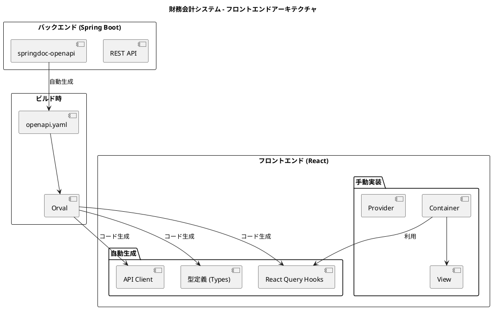
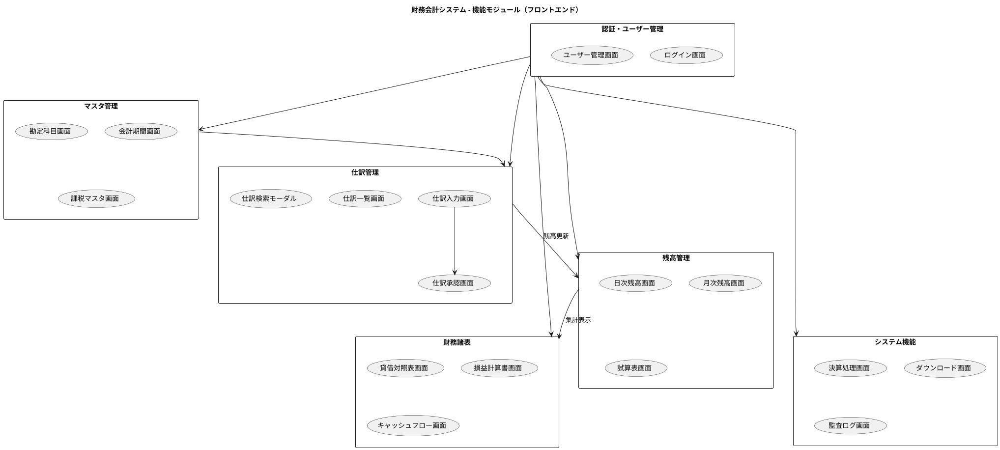
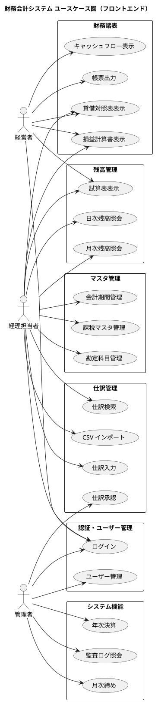
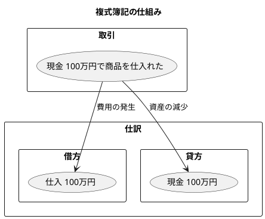
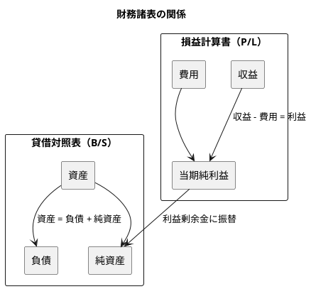

# 財務会計システムのケーススタディ（React版）

React + TypeScript によるモダンフロントエンド開発

---

## 本書について

本書は、財務会計システムのフロントエンド実装を題材に、React と TypeScript を活用したモダンなフロントエンド開発の実践的なプロセスを追体験できる開発ガイドです。OpenAPI + Orval による型安全な API 連携、TanStack Query によるサーバー状態管理、Container / View パターンによる責務分離を学びます。

### 対象読者

- React による Web アプリケーション開発経験者
- TypeScript を活用したフロントエンド開発に興味のあるエンジニア
- Container / View パターンを学びたい開発者
- OpenAPI / Orval による型安全な API 連携を学びたいエンジニア
- 財務会計システムの UI 実装に興味のあるエンジニア

---

## 目次

### 第1部: 導入と基盤

| 章 | タイトル | 概要 |
|----|---------|------|
| [第1章](chapter01.md) | プロジェクト概要 | フロントエンドアーキテクチャ、ディレクトリ構成、技術スタック |
| [第2章](chapter02.md) | 開発環境の構築 | Vite プロジェクト、ESLint / Prettier、テスト環境 |
| [第3章](chapter03.md) | OpenAPI と Orval による API 連携 | OpenAPI 仕様取得、Orval 設定、API クライアント生成 |
| [第4章](chapter04.md) | アーキテクチャ設計 | Container / View パターン、状態管理、型安全性 |

### 第2部: 共通コンポーネント

| 章 | タイトル | 概要 |
|----|---------|------|
| [第5章](chapter05.md) | アプリケーション基盤 | エントリポイント、認証ガード、レイアウト |
| [第6章](chapter06.md) | モーダル・フォームパターン | 編集モーダル、検索モーダル、確認モーダル |
| [第7章](chapter07.md) | 財務会計共通コンポーネント | 金額入力、勘定科目選択、仕訳明細入力 |

### 第3部: マスタ管理機能

| 章 | タイトル | 概要 |
|----|---------|------|
| [第8章](chapter08.md) | 認証・ユーザー管理 | 認証フロー、AuthProvider、ユーザー CRUD |
| [第9章](chapter09.md) | 勘定科目マスタ | 勘定科目一覧・詳細、階層構造表示 |
| [第10章](chapter10.md) | 会計期間・課税マスタ | 会計期間管理、課税取引マスタ |

### 第4部: 仕訳管理機能

| 章 | タイトル | 概要 |
|----|---------|------|
| [第11章](chapter11.md) | 仕訳入力 | 仕訳入力画面、貸借バランス検証、消費税計算 |
| [第12章](chapter12.md) | 仕訳一覧・検索 | 仕訳一覧、検索モーダル、CSV インポート |
| [第13章](chapter13.md) | 仕訳承認・ワークフロー | 承認待ち一覧、承認ワークフロー、一括承認 |

### 第5部: 残高管理機能

| 章 | タイトル | 概要 |
|----|---------|------|
| [第14章](chapter14.md) | 日次残高照会 | 日次残高一覧、残高推移グラフ、科目別明細 |
| [第15章](chapter15.md) | 月次残高照会 | 月次残高一覧、月次推移表 |
| [第16章](chapter16.md) | 試算表 | 合計残高試算表、勘定科目別試算表、部門別試算表 |

### 第6部: 財務諸表機能

| 章 | タイトル | 概要 |
|----|---------|------|
| [第17章](chapter17.md) | 貸借対照表 | 勘定式/報告式レイアウト、期間比較、構成比分析 |
| [第18章](chapter18.md) | 損益計算書 | 段階利益表示、売上比率分析、予実比較 |
| [第19章](chapter19.md) | キャッシュフロー計算書 | 営業/投資/財務活動区分、間接法表示 |

### 第7部: システム機能

| 章 | タイトル | 概要 |
|----|---------|------|
| [第20章](chapter20.md) | 決算処理 | 月次締め、年次決算、決算整理仕訳 |
| [第21章](chapter21.md) | ダウンロード・出力機能 | CSV / Excel / PDF 出力、非同期ダウンロード |
| [第22章](chapter22.md) | 監査・履歴機能 | 操作履歴、仕訳変更履歴、ログイン履歴 |

### 第8部: テストと品質

| 章 | タイトル | 概要 |
|----|---------|------|
| [第23章](chapter23.md) | 単体テスト | Vitest、Testing Library、MSW による API モック |
| [第24章](chapter24.md) | E2E テスト | Cypress 設定、認証・仕訳・決算テスト |

---

## 技術スタック

| カテゴリ | 技術 |
|---------|------|
| 言語 | TypeScript 5.5 |
| フレームワーク | React 18.3 |
| ルーティング | React Router 6.26 |
| ビルドツール | Vite 5.4 |
| API クライアント生成 | Orval 7.0 |
| HTTP クライアント | Axios 1.7 |
| サーバー状態管理 | TanStack Query 5.0 |
| テスト | Vitest 2.0 |
| E2E テスト | Cypress 14.5 |
| API モック | MSW 2.0 |
| 日付操作 | dayjs 1.11 |
| 金額計算 | decimal.js 10.4 |
| UI ライブラリ | react-modal, react-tabs, react-icons |

---

## システム概要図

---

## 機能モジュール図

---

## ユースケース図

---

## 本書のポイント

1. **OpenAPI + Orval による型安全な API 連携** - バックエンドから自動生成された OpenAPI 仕様を基に、型定義と API クライアントを自動生成
2. **TanStack Query によるサーバー状態管理** - キャッシュ、再取得、楽観的更新を宣言的に管理
3. **Container / View パターン** - Container コンポーネントと View コンポーネントの責務分離を徹底
4. **財務会計特有の UI 実装** - 金額入力（3桁カンマ、精度保証）、貸借表示、仕訳入力、財務諸表レイアウト
5. **MSW による API モック** - テスト時に実際の API サーバーなしで動作確認が可能
6. **E2E テスト重視** - Cypress による仕訳入力から財務諸表表示までの業務フローテスト

---

## 財務会計の基礎

### 複式簿記とは

複式簿記は、すべての取引を「借方」と「貸方」の両面から記録する記帳法です。これにより、取引の二面性（原因と結果）を正確に把握できます。

### 勘定科目の5分類

| 分類 | 説明 | 例 |
|------|------|-----|
| 資産 (Asset) | 会社が所有する財産 | 現金、売掛金、棚卸資産 |
| 負債 (Liability) | 会社が負っている債務 | 買掛金、借入金、未払金 |
| 純資産 (Equity) | 資産から負債を引いた正味財産 | 資本金、利益剰余金 |
| 収益 (Revenue) | 事業活動による収入 | 売上高、受取利息 |
| 費用 (Expense) | 事業活動による支出 | 仕入高、給与、家賃 |

### 財務諸表

---

## 関連リソース

- [GitHub リポジトリ](https://github.com/k2works/case-study-accounting) - ソースコード
- [バックエンド編](../backend/chapter00.md) - 財務会計システムのケーススタディ（Java版）

---

## バックエンド（本編）との対応関係

| フロントエンド章 | バックエンド章 | 連携機能 |
|----------------|--------------|----------|
| 第3章 OpenAPI/Orval | - | API 仕様連携 |
| 第8章 認証 | 第25章 認証・認可 | JWT 認証 |
| 第9章 勘定科目 | 第9章 勘定科目マスタ | 勘定科目 CRUD |
| 第10章 会計期間・課税 | 第4章 ER モデリング | マスタ管理 |
| 第11-13章 仕訳 | 第13-15章 仕訳管理 | 仕訳 CRUD、承認 |
| 第14-16章 残高 | 第16-18章 残高更新 | 残高照会 |
| 第17-19章 財務諸表 | 第19-21章 財務諸表 | 帳票表示 |
| 第20章 決算 | 第15章 決算処理 | 締め処理 |
| 第22章 監査 | 第27章 監査ログ | 履歴照会 |
