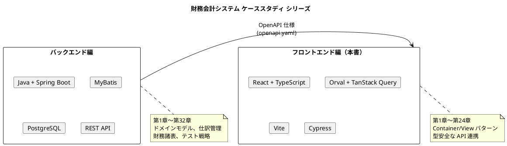
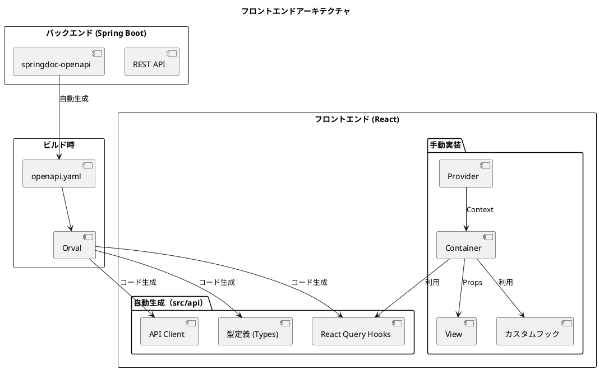
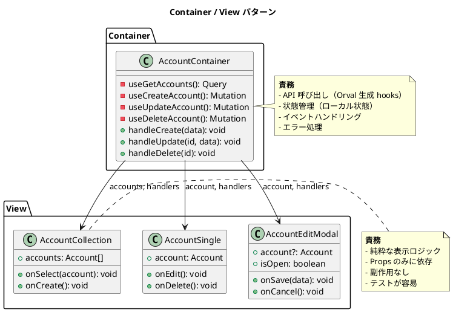
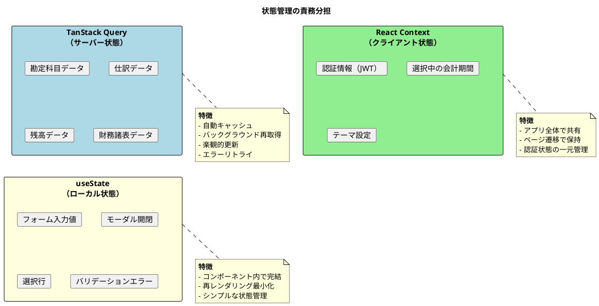
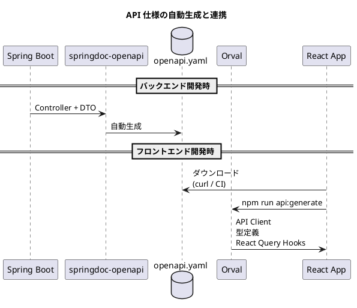
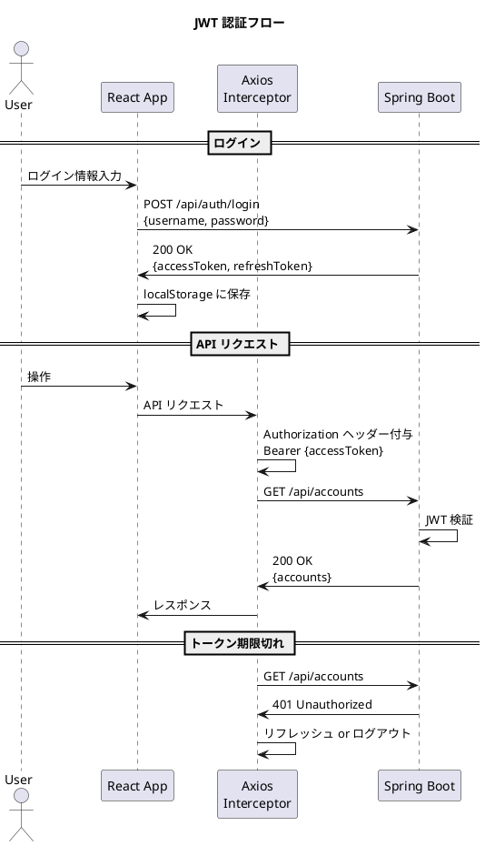

# 第1章: プロジェクト概要

## 1.1 はじめに

本書は、財務会計システムのフロントエンド実装について解説するケーススタディです。バックエンド編（Java + Spring Boot）で構築した REST API と連携し、React + TypeScript によるモダンなフロントエンドアプリケーションを構築します。

### 本書の位置づけ



### 本書で学べること

| カテゴリ | 内容 |
|---------|------|
| アーキテクチャ | Container / View パターンによる責務分離 |
| API 連携 | OpenAPI + Orval による型安全なクライアント生成 |
| 状態管理 | TanStack Query によるサーバー状態管理 |
| UI 実装 | 複式簿記、財務諸表の UI パターン |
| テスト | Vitest、MSW、Cypress による多層テスト |

---

## 1.2 フロントエンドアーキテクチャ概要

### 全体構成

本システムのフロントエンドは、以下の4つの主要な概念で構成されます。



### Container / View パターン

UI コンポーネントを「Container（コンテナ）」と「View（ビュー）」に分離することで、責務を明確に分けます。



**Container の責務**:
- API 呼び出し（Orval が生成した React Query Hooks を使用）
- ローカル状態の管理（モーダル開閉、選択行など）
- イベントハンドリング（作成、更新、削除の処理）
- エラーハンドリング

**View の責務**:
- 純粋な表示ロジック
- Props として受け取ったデータの描画
- ユーザー操作のコールバック呼び出し
- スタイリング

### OpenAPI + Orval による API 連携

バックエンドから自動生成された OpenAPI 仕様（openapi.yaml）を基に、Orval が以下を自動生成します。

| 生成物 | 説明 | 配置先 |
|--------|------|--------|
| API クライアント | Axios ベースの HTTP クライアント | src/api/generated/ |
| 型定義 | TypeScript インターフェース | src/api/model/ |
| React Query Hooks | useQuery / useMutation ラッパー | src/api/generated/ |

```typescript
// 自動生成された Hook の使用例
import { useGetAccounts, useCreateAccount } from '@/api/generated/account/account';
import type { Account, AccountRequest } from '@/api/model';

export const AccountContainer: React.FC = () => {
  // 一覧取得（自動キャッシュ、再取得、ローディング状態管理）
  const { data: accounts, isLoading, error } = useGetAccounts();

  // 登録（楽観的更新、エラー時ロールバック）
  const createMutation = useCreateAccount();

  const handleCreate = (request: AccountRequest) => {
    createMutation.mutate({ data: request });
  };

  // ... View への Props 渡し
};
```

### TanStack Query によるサーバー状態管理

サーバーから取得したデータ（サーバー状態）は、TanStack Query（旧 React Query）で管理します。



| 状態の種類 | 管理方法 | 例 |
|-----------|----------|-----|
| サーバー状態 | TanStack Query | 勘定科目一覧、仕訳データ、残高 |
| クライアント状態 | React Context | 認証情報、会計期間選択 |
| ローカル状態 | useState | フォーム入力、モーダル開閉 |

---

## 1.3 ディレクトリ構成

### 全体構成

```
frontend/
├── public/                       # 静的ファイル
│   └── favicon.ico
├── src/
│   ├── api/                      # API 関連
│   │   ├── generated/            # Orval 自動生成（編集禁止）
│   │   │   ├── account/
│   │   │   ├── journal-entry/
│   │   │   ├── balance/
│   │   │   └── ...
│   │   ├── model/                # 自動生成された型定義
│   │   │   ├── account.ts
│   │   │   ├── journalEntry.ts
│   │   │   └── ...
│   │   └── axios-instance.ts     # Axios 設定（手動）
│   │
│   ├── components/               # Container コンポーネント
│   │   ├── application/          # アプリケーション基盤
│   │   │   ├── ErrorBoundary.tsx
│   │   │   ├── Loading.tsx
│   │   │   └── Message.tsx
│   │   ├── master/               # マスタ管理
│   │   │   ├── account/
│   │   │   ├── accountingPeriod/
│   │   │   └── user/
│   │   ├── journal/              # 仕訳管理
│   │   │   ├── entry/
│   │   │   ├── list/
│   │   │   └── approval/
│   │   ├── balance/              # 残高管理
│   │   │   ├── daily/
│   │   │   ├── monthly/
│   │   │   └── trial/
│   │   ├── statement/            # 財務諸表
│   │   │   ├── balanceSheet/
│   │   │   ├── profitLoss/
│   │   │   └── cashFlow/
│   │   ├── closing/              # 決算処理
│   │   └── system/               # システム機能
│   │
│   ├── views/                    # View コンポーネント
│   │   └── (components と同構成)
│   │
│   ├── providers/                # React Context プロバイダー
│   │   └── AuthProvider.tsx
│   │
│   ├── hooks/                    # カスタムフック
│   │   ├── useAccountTree.ts
│   │   ├── useBalanceValidation.ts
│   │   └── useMoneyFormat.ts
│   │
│   ├── utils/                    # ユーティリティ
│   │   ├── money.ts              # 金額計算（decimal.js）
│   │   ├── date.ts               # 日付操作（dayjs）
│   │   └── format.ts             # フォーマット関数
│   │
│   ├── mocks/                    # MSW モック（テスト用）
│   │   ├── handlers.ts
│   │   └── server.ts
│   │
│   ├── styles/                   # グローバルスタイル
│   │   └── global.css
│   │
│   ├── queryClient.ts            # TanStack Query 設定
│   ├── RouteConfig.tsx           # ルーティング設定
│   ├── App.tsx                   # アプリケーションルート
│   └── main.tsx                  # エントリポイント
│
├── cypress/                      # E2E テスト
│   ├── e2e/
│   ├── fixtures/
│   └── support/
│
├── openapi.yaml                  # OpenAPI 仕様（バックエンドから取得）
├── orval.config.ts               # Orval 設定
├── vite.config.ts                # Vite 設定
├── tsconfig.json                 # TypeScript 設定
├── package.json
└── README.md
```

### 各ディレクトリの役割

| ディレクトリ | 役割 | 編集 |
|-------------|------|------|
| src/api/generated/ | Orval 自動生成コード | 禁止 |
| src/api/model/ | 自動生成された型定義 | 禁止 |
| src/api/axios-instance.ts | Axios 設定 | 手動 |
| src/components/ | Container コンポーネント | 手動 |
| src/views/ | View コンポーネント | 手動 |
| src/providers/ | React Context | 手動 |
| src/hooks/ | カスタムフック | 手動 |
| src/utils/ | ユーティリティ関数 | 手動 |
| src/mocks/ | テスト用モック | 手動 |

---

## 1.4 技術スタック

### コア技術

| カテゴリ | 技術 | バージョン | 用途 |
|---------|------|-----------|------|
| 言語 | TypeScript | 5.5 | 型安全な JavaScript |
| UI ライブラリ | React | 18.3 | コンポーネントベース UI |
| ルーティング | React Router | 6.26 | SPA ルーティング |
| ビルドツール | Vite | 5.4 | 高速ビルド・HMR |

### API 連携

| カテゴリ | 技術 | バージョン | 用途 |
|---------|------|-----------|------|
| コード生成 | Orval | 7.0 | OpenAPI → TypeScript |
| HTTP クライアント | Axios | 1.7 | HTTP リクエスト |
| サーバー状態管理 | TanStack Query | 5.0 | キャッシュ・再取得 |

### UI コンポーネント

| カテゴリ | 技術 | 用途 |
|---------|------|------|
| モーダル | react-modal | ダイアログ表示 |
| タブ | react-tabs | タブ切り替え |
| アイコン | react-icons | アイコン表示 |
| ローディング | react-spinners | ローディング表示 |

### ユーティリティ

| カテゴリ | 技術 | 用途 |
|---------|------|------|
| 日付操作 | dayjs | 日付フォーマット・計算 |
| 金額計算 | decimal.js | 精度保証された数値計算 |

### テスト

| カテゴリ | 技術 | バージョン | 用途 |
|---------|------|-----------|------|
| 単体テスト | Vitest | 2.0 | コンポーネント・フックテスト |
| テストユーティリティ | Testing Library | 16.0 | DOM テスト |
| API モック | MSW | 2.0 | リクエストモック |
| E2E テスト | Cypress | 14.5 | 統合テスト |

---

## 1.5 バックエンド API との連携

### OpenAPI 仕様の取得

バックエンド（Spring Boot）は springdoc-openapi により、REST API の仕様を自動生成します。



### エンドポイント一覧

バックエンドが提供する主要な API エンドポイントは以下の通りです。

| カテゴリ | エンドポイント | メソッド | 説明 |
|---------|---------------|----------|------|
| **認証** | /api/auth/login | POST | ログイン |
| | /api/auth/logout | POST | ログアウト |
| **勘定科目** | /api/accounts | GET | 一覧取得 |
| | /api/accounts/{code} | GET | 詳細取得 |
| | /api/accounts | POST | 登録 |
| | /api/accounts/{code} | PUT | 更新 |
| | /api/accounts/{code} | DELETE | 削除 |
| **仕訳** | /api/journal-entries | GET | 一覧取得 |
| | /api/journal-entries/{no} | GET | 詳細取得 |
| | /api/journal-entries | POST | 登録 |
| | /api/journal-entries/{no} | PUT | 更新 |
| | /api/journal-entries/search | POST | 検索 |
| **残高** | /api/daily-balances | GET | 日次残高取得 |
| | /api/monthly-balances | GET | 月次残高取得 |
| | /api/trial-balance | GET | 試算表取得 |
| **財務諸表** | /api/balance-sheet | GET | 貸借対照表取得 |
| | /api/profit-loss | GET | 損益計算書取得 |

### 認証方式

JWT（JSON Web Token）を使用した Bearer 認証を採用しています。



---

## 1.6 本書の構成

### 第1部: 導入と基盤（第1〜4章）

| 章 | タイトル | 内容 |
|----|---------|------|
| 第1章 | プロジェクト概要 | アーキテクチャ、技術スタック、ディレクトリ構成 |
| 第2章 | 開発環境の構築 | Vite、TypeScript、ESLint、テスト環境 |
| 第3章 | OpenAPI と Orval | API クライアント自動生成、Axios 設定 |
| 第4章 | アーキテクチャ設計 | Container/View、状態管理、型安全性 |

### 第2部: 共通コンポーネント（第5〜7章）

| 章 | タイトル | 内容 |
|----|---------|------|
| 第5章 | アプリケーション基盤 | App.tsx、認証ガード、レイアウト |
| 第6章 | モーダル・フォーム | 編集/検索/選択/確認モーダル |
| 第7章 | 財務会計共通 | 金額入力、勘定科目選択、仕訳明細入力 |

### 第3部: マスタ管理機能（第8〜10章）

| 章 | タイトル | 内容 |
|----|---------|------|
| 第8章 | 認証・ユーザー管理 | ログイン、AuthProvider、ユーザー CRUD |
| 第9章 | 勘定科目マスタ | 階層表示、CRUD、カスタムフック |
| 第10章 | 会計期間・課税マスタ | 会計期間、課税区分、消費税コード |

### 第4部: 仕訳管理機能（第11〜13章）

| 章 | タイトル | 内容 |
|----|---------|------|
| 第11章 | 仕訳入力 | 仕訳入力フォーム、明細入力、貸借検証 |
| 第12章 | 仕訳一覧・検索 | 一覧表示、検索、詳細、一括登録 |
| 第13章 | 仕訳承認 | 承認ワークフロー、一括承認 |

### 第5部: 残高管理機能（第14〜16章）

| 章 | タイトル | 内容 |
|----|---------|------|
| 第14章 | 日次残高照会 | 日次残高一覧、推移グラフ |
| 第15章 | 月次残高照会 | 月次残高一覧、推移表 |
| 第16章 | 試算表 | 合計残高試算表、部門別試算表 |

### 第6部: 財務諸表機能（第17〜19章）

| 章 | タイトル | 内容 |
|----|---------|------|
| 第17章 | 貸借対照表 | 勘定式/報告式、期間比較、帳票出力 |
| 第18章 | 損益計算書 | 段階利益、予実比較、帳票出力 |
| 第19章 | キャッシュフロー計算書 | 直接法/間接法 |

### 第7部: システム機能（第20〜22章）

| 章 | タイトル | 内容 |
|----|---------|------|
| 第20章 | 決算処理 | 月次締め、年次決算、決算整理仕訳 |
| 第21章 | ダウンロード・出力 | CSV/Excel 出力 |
| 第22章 | 監査・履歴 | 操作履歴、変更履歴、ログイン履歴 |

### 第8部: テストと品質（第23〜24章）

| 章 | タイトル | 内容 |
|----|---------|------|
| 第23章 | 単体テスト | Vitest、Testing Library、MSW |
| 第24章 | E2E テスト | Cypress、業務フローテスト |

---

## 1.7 まとめ

本章では、財務会計システムのフロントエンド実装の全体像を解説しました。

### 学んだこと

1. **Container / View パターン**: 責務分離による保守性・テスタビリティの向上
2. **OpenAPI + Orval**: バックエンドとの型安全な連携
3. **TanStack Query**: サーバー状態の宣言的な管理
4. **ディレクトリ構成**: 自動生成コードと手動実装の分離

### 次章の予告

第2章では、開発環境の構築について解説します。Vite によるプロジェクト初期化、TypeScript 設定、ESLint / Prettier の導入、テスト環境の構築を行います。
