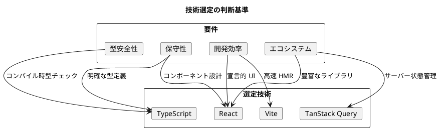
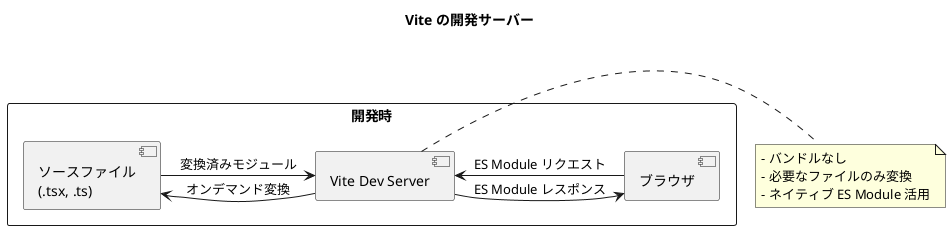

# 第2章: 開発環境の構築

## 2.1 技術スタックの選定

### React + TypeScript を選んだ理由

財務会計システムのフロントエンドには、以下の要件があります。

| 要件 | 説明 |
|------|------|
| 型安全性 | 金額計算、API 連携での型不整合防止 |
| 保守性 | 長期運用を見据えたコードベース |
| 開発効率 | コンポーネントの再利用性 |
| エコシステム | 豊富なライブラリ・ツール |

これらの要件を満たすため、**React + TypeScript** を採用しました。



### Vite を選んだ理由

従来の Create React App（CRA）に代わり、**Vite** を採用しました。

| 比較項目 | CRA (webpack) | Vite |
|---------|---------------|------|
| 開発サーバー起動 | 30秒〜1分 | 1秒以下 |
| HMR（ホットリロード） | 数秒 | 即時 |
| ビルド速度 | 遅い | 高速（esbuild） |
| 設定の複雑さ | 隠蔽（eject 必要） | シンプル |
| TypeScript サポート | 追加設定必要 | ネイティブ対応 |

**Vite の仕組み**:



---

## 2.2 プロジェクト初期化

### Vite プロジェクトの作成

```bash
# プロジェクト作成
npm create vite@latest accounting-frontend -- --template react-ts

# ディレクトリ移動
cd accounting-frontend

# 依存関係インストール
npm install
```

### 生成されるファイル構成

```
accounting-frontend/
├── public/
│   └── vite.svg
├── src/
│   ├── assets/
│   │   └── react.svg
│   ├── App.css
│   ├── App.tsx
│   ├── index.css
│   ├── main.tsx
│   └── vite-env.d.ts
├── .gitignore
├── eslint.config.js
├── index.html
├── package.json
├── tsconfig.app.json
├── tsconfig.json
├── tsconfig.node.json
└── vite.config.ts
```

### TypeScript 設定

**tsconfig.json**:

```json
{
  "compilerOptions": {
    "target": "ES2020",
    "useDefineForClassFields": true,
    "lib": ["ES2020", "DOM", "DOM.Iterable"],
    "module": "ESNext",
    "skipLibCheck": true,

    /* Bundler mode */
    "moduleResolution": "bundler",
    "allowImportingTsExtensions": true,
    "isolatedModules": true,
    "moduleDetection": "force",
    "noEmit": true,
    "jsx": "react-jsx",

    /* Linting */
    "strict": true,
    "noUnusedLocals": true,
    "noUnusedParameters": true,
    "noFallthroughCasesInSwitch": true,

    /* Path aliases */
    "baseUrl": ".",
    "paths": {
      "@/*": ["src/*"],
      "@/api/*": ["src/api/*"],
      "@/components/*": ["src/components/*"],
      "@/views/*": ["src/views/*"],
      "@/hooks/*": ["src/hooks/*"],
      "@/utils/*": ["src/utils/*"]
    }
  },
  "include": ["src"],
  "references": [{ "path": "./tsconfig.node.json" }]
}
```

**vite.config.ts**（パスエイリアス対応）:

```typescript
import { defineConfig } from 'vite';
import react from '@vitejs/plugin-react';
import path from 'path';

export default defineConfig({
  plugins: [react()],
  resolve: {
    alias: {
      '@': path.resolve(__dirname, './src'),
    },
  },
  server: {
    port: 3000,
    proxy: {
      '/api': {
        target: 'http://localhost:8080',
        changeOrigin: true,
      },
    },
  },
});
```

---

## 2.3 依存パッケージのインストール

### コア依存関係

```bash
# ルーティング
npm install react-router-dom

# API 連携
npm install @tanstack/react-query axios

# UI コンポーネント
npm install react-modal react-tabs react-icons react-spinners

# ユーティリティ
npm install dayjs decimal.js
```

### 開発依存関係

```bash
# Orval（API クライアント生成）
npm install -D orval

# ESLint / Prettier
npm install -D eslint prettier eslint-config-prettier eslint-plugin-react-hooks

# 型定義
npm install -D @types/react-modal

# テスト
npm install -D vitest @testing-library/react @testing-library/jest-dom jsdom
npm install -D msw@latest

# E2E テスト
npm install -D cypress
```

### package.json

```json
{
  "name": "accounting-frontend",
  "private": true,
  "version": "0.1.0",
  "type": "module",
  "scripts": {
    "dev": "vite",
    "build": "tsc -b && vite build",
    "preview": "vite preview",
    "lint": "eslint .",
    "lint:fix": "eslint . --fix",
    "format": "prettier --write \"src/**/*.{ts,tsx,css}\"",
    "test": "vitest",
    "test:ui": "vitest --ui",
    "test:coverage": "vitest run --coverage",
    "cypress": "cypress open",
    "cypress:run": "cypress run",
    "api:generate": "orval",
    "api:fetch": "curl http://localhost:8080/api-docs.yaml -o openapi.yaml && npm run api:generate"
  },
  "dependencies": {
    "@tanstack/react-query": "^5.0.0",
    "axios": "^1.7.0",
    "dayjs": "^1.11.0",
    "decimal.js": "^10.4.0",
    "react": "^18.3.0",
    "react-dom": "^18.3.0",
    "react-icons": "^5.0.0",
    "react-modal": "^3.16.0",
    "react-router-dom": "^6.26.0",
    "react-spinners": "^0.14.0",
    "react-tabs": "^6.0.0"
  },
  "devDependencies": {
    "@testing-library/jest-dom": "^6.0.0",
    "@testing-library/react": "^16.0.0",
    "@types/react": "^18.3.0",
    "@types/react-dom": "^18.3.0",
    "@types/react-modal": "^3.16.0",
    "@vitejs/plugin-react": "^4.3.0",
    "cypress": "^14.5.0",
    "eslint": "^9.0.0",
    "eslint-config-prettier": "^9.0.0",
    "eslint-plugin-react-hooks": "^5.0.0",
    "jsdom": "^24.0.0",
    "msw": "^2.0.0",
    "orval": "^7.0.0",
    "prettier": "^3.0.0",
    "typescript": "^5.5.0",
    "vite": "^5.4.0",
    "vitest": "^2.0.0"
  }
}
```

---

## 2.4 ESLint / Prettier 設定

### ESLint 設定

**eslint.config.js**:

```javascript
import js from '@eslint/js';
import globals from 'globals';
import reactHooks from 'eslint-plugin-react-hooks';
import reactRefresh from 'eslint-plugin-react-refresh';
import tseslint from 'typescript-eslint';

export default tseslint.config(
  { ignores: ['dist', 'src/api/generated', 'src/api/model'] },
  {
    extends: [js.configs.recommended, ...tseslint.configs.recommended],
    files: ['**/*.{ts,tsx}'],
    languageOptions: {
      ecmaVersion: 2020,
      globals: globals.browser,
    },
    plugins: {
      'react-hooks': reactHooks,
      'react-refresh': reactRefresh,
    },
    rules: {
      ...reactHooks.configs.recommended.rules,
      'react-refresh/only-export-components': [
        'warn',
        { allowConstantExport: true },
      ],
      '@typescript-eslint/no-unused-vars': [
        'error',
        { argsIgnorePattern: '^_' },
      ],
      '@typescript-eslint/explicit-function-return-type': 'off',
      '@typescript-eslint/no-explicit-any': 'warn',
    },
  }
);
```

**ポイント**:
- `src/api/generated` と `src/api/model` を除外（Orval 自動生成コード）
- React Hooks のルールを適用
- 未使用変数は `_` プレフィックスで除外可能

### Prettier 設定

**.prettierrc**:

```json
{
  "semi": true,
  "singleQuote": true,
  "tabWidth": 2,
  "trailingComma": "es5",
  "printWidth": 100,
  "bracketSpacing": true,
  "arrowParens": "always",
  "endOfLine": "lf"
}
```

**.prettierignore**:

```
dist
node_modules
src/api/generated
src/api/model
openapi.yaml
```

---

## 2.5 開発サーバー設定

### 環境変数

**.env.development**:

```bash
# API ベース URL
VITE_API_BASE_URL=http://localhost:8080/api

# アプリケーション名
VITE_APP_NAME=財務会計システム

# 開発モード
VITE_DEV_MODE=true
```

**.env.production**:

```bash
# API ベース URL（本番）
VITE_API_BASE_URL=/api

# アプリケーション名
VITE_APP_NAME=財務会計システム

# 開発モード
VITE_DEV_MODE=false
```

**環境変数の使用**:

```typescript
// src/config.ts
export const config = {
  apiBaseUrl: import.meta.env.VITE_API_BASE_URL || '/api',
  appName: import.meta.env.VITE_APP_NAME || '財務会計システム',
  isDev: import.meta.env.VITE_DEV_MODE === 'true',
};
```

### プロキシ設定

開発時はバックエンド API へのリクエストをプロキシします。

**vite.config.ts**:

```typescript
import { defineConfig } from 'vite';
import react from '@vitejs/plugin-react';
import path from 'path';

export default defineConfig({
  plugins: [react()],
  resolve: {
    alias: {
      '@': path.resolve(__dirname, './src'),
    },
  },
  server: {
    port: 3000,
    open: true,
    proxy: {
      '/api': {
        target: 'http://localhost:8080',
        changeOrigin: true,
        secure: false,
        // ログ出力（デバッグ用）
        configure: (proxy) => {
          proxy.on('proxyReq', (proxyReq, req) => {
            console.log(`[Proxy] ${req.method} ${req.url} -> ${proxyReq.path}`);
          });
        },
      },
    },
  },
  build: {
    outDir: 'dist',
    sourcemap: true,
  },
});
```

---

## 2.6 テスト環境の構築

### Vitest 設定

**vite.config.ts**（テスト設定追加）:

```typescript
import { defineConfig } from 'vite';
import react from '@vitejs/plugin-react';
import path from 'path';

export default defineConfig({
  plugins: [react()],
  resolve: {
    alias: {
      '@': path.resolve(__dirname, './src'),
    },
  },
  test: {
    globals: true,
    environment: 'jsdom',
    setupFiles: ['./src/test/setup.ts'],
    include: ['src/**/*.{test,spec}.{ts,tsx}'],
    coverage: {
      provider: 'v8',
      reporter: ['text', 'json', 'html'],
      exclude: [
        'node_modules/',
        'src/api/generated/',
        'src/api/model/',
        'src/test/',
      ],
    },
  },
  // ... server, build 設定
});
```

**src/test/setup.ts**:

```typescript
import '@testing-library/jest-dom';
import { afterAll, afterEach, beforeAll } from 'vitest';
import { server } from '../mocks/server';

// MSW サーバーの起動・停止
beforeAll(() => server.listen({ onUnhandledRequest: 'error' }));
afterEach(() => server.resetHandlers());
afterAll(() => server.close());
```

### MSW（Mock Service Worker）設定

**src/mocks/handlers.ts**:

```typescript
import { http, HttpResponse } from 'msw';
import type { Account } from '@/api/model';

export const handlers = [
  // 勘定科目一覧取得
  http.get('/api/accounts', () => {
    return HttpResponse.json<Account[]>([
      {
        accountCode: '111',
        accountName: '現金預金',
        bsplType: 'B',
        debitCreditType: '借',
        elementType: '資産',
        displayOrder: 1,
        version: 1,
      },
      {
        accountCode: '211',
        accountName: '買掛金',
        bsplType: 'B',
        debitCreditType: '貸',
        elementType: '負債',
        displayOrder: 10,
        version: 1,
      },
    ]);
  }),

  // 勘定科目詳細取得
  http.get('/api/accounts/:code', ({ params }) => {
    const { code } = params;
    return HttpResponse.json<Account>({
      accountCode: code as string,
      accountName: '現金預金',
      bsplType: 'B',
      debitCreditType: '借',
      elementType: '資産',
      displayOrder: 1,
      version: 1,
    });
  }),

  // 認証
  http.post('/api/auth/login', async ({ request }) => {
    const body = await request.json();
    if (body.username === 'admin' && body.password === 'password') {
      return HttpResponse.json({
        accessToken: 'mock-access-token',
        refreshToken: 'mock-refresh-token',
        user: {
          id: 1,
          username: 'admin',
          role: 'ADMIN',
        },
      });
    }
    return new HttpResponse(null, { status: 401 });
  }),
];
```

**src/mocks/server.ts**:

```typescript
import { setupServer } from 'msw/node';
import { handlers } from './handlers';

export const server = setupServer(...handlers);
```

**src/mocks/browser.ts**（ブラウザ用）:

```typescript
import { setupWorker } from 'msw/browser';
import { handlers } from './handlers';

export const worker = setupWorker(...handlers);
```

### Cypress 設定

**cypress.config.ts**:

```typescript
import { defineConfig } from 'cypress';

export default defineConfig({
  e2e: {
    baseUrl: 'http://localhost:3000',
    supportFile: 'cypress/support/e2e.ts',
    specPattern: 'cypress/e2e/**/*.cy.{js,jsx,ts,tsx}',
    viewportWidth: 1280,
    viewportHeight: 720,
    video: false,
    screenshotOnRunFailure: true,
  },
  component: {
    devServer: {
      framework: 'react',
      bundler: 'vite',
    },
  },
});
```

**cypress/support/e2e.ts**:

```typescript
// カスタムコマンドの型定義
declare global {
  namespace Cypress {
    interface Chainable {
      login(username: string, password: string): Chainable<void>;
    }
  }
}

// ログインコマンド
Cypress.Commands.add('login', (username: string, password: string) => {
  cy.visit('/login');
  cy.get('input[name="username"]').type(username);
  cy.get('input[name="password"]').type(password);
  cy.get('button[type="submit"]').click();
  cy.url().should('not.include', '/login');
});

export {};
```

---

## 2.7 初期ファイルの作成

### エントリポイント

**src/main.tsx**:

```typescript
import React from 'react';
import ReactDOM from 'react-dom/client';
import { QueryClientProvider } from '@tanstack/react-query';
import { ReactQueryDevtools } from '@tanstack/react-query-devtools';
import { BrowserRouter } from 'react-router-dom';
import { queryClient } from './queryClient';
import { AuthProvider } from './providers/AuthProvider';
import { App } from './App';
import './styles/global.css';

// 開発時のみ MSW を起動
async function enableMocking() {
  if (import.meta.env.DEV && import.meta.env.VITE_ENABLE_MSW === 'true') {
    const { worker } = await import('./mocks/browser');
    return worker.start({
      onUnhandledRequest: 'bypass',
    });
  }
  return Promise.resolve();
}

enableMocking().then(() => {
  ReactDOM.createRoot(document.getElementById('root')!).render(
    <React.StrictMode>
      <QueryClientProvider client={queryClient}>
        <BrowserRouter>
          <AuthProvider>
            <App />
          </AuthProvider>
        </BrowserRouter>
        <ReactQueryDevtools initialIsOpen={false} />
      </QueryClientProvider>
    </React.StrictMode>
  );
});
```

### TanStack Query 設定

**src/queryClient.ts**:

```typescript
import { QueryClient } from '@tanstack/react-query';

export const queryClient = new QueryClient({
  defaultOptions: {
    queries: {
      // キャッシュの有効期間（5分）
      staleTime: 5 * 60 * 1000,
      // ガベージコレクション期間（30分）
      gcTime: 30 * 60 * 1000,
      // リトライ回数
      retry: 1,
      // フォーカス時の再取得を無効化
      refetchOnWindowFocus: false,
      // マウント時の再取得
      refetchOnMount: true,
    },
    mutations: {
      // ミューテーションのリトライ
      retry: 0,
    },
  },
});
```

### グローバルスタイル

**src/styles/global.css**:

```css
/* リセット */
*,
*::before,
*::after {
  box-sizing: border-box;
  margin: 0;
  padding: 0;
}

/* ルート設定 */
:root {
  /* カラー */
  --color-primary: #1976d2;
  --color-primary-dark: #1565c0;
  --color-secondary: #dc004e;
  --color-error: #f44336;
  --color-warning: #ff9800;
  --color-success: #4caf50;
  --color-info: #2196f3;

  /* テキスト */
  --color-text-primary: #212121;
  --color-text-secondary: #757575;

  /* 背景 */
  --color-background: #fafafa;
  --color-surface: #ffffff;

  /* ボーダー */
  --color-border: #e0e0e0;

  /* フォント */
  --font-family: 'Noto Sans JP', 'Hiragino Sans', sans-serif;
  --font-size-base: 14px;
  --font-size-small: 12px;
  --font-size-large: 16px;

  /* スペーシング */
  --spacing-xs: 4px;
  --spacing-sm: 8px;
  --spacing-md: 16px;
  --spacing-lg: 24px;
  --spacing-xl: 32px;

  /* ボーダー半径 */
  --border-radius: 4px;

  /* シャドウ */
  --shadow-sm: 0 1px 2px rgba(0, 0, 0, 0.1);
  --shadow-md: 0 2px 4px rgba(0, 0, 0, 0.1);
  --shadow-lg: 0 4px 8px rgba(0, 0, 0, 0.1);
}

/* ボディ */
body {
  font-family: var(--font-family);
  font-size: var(--font-size-base);
  color: var(--color-text-primary);
  background-color: var(--color-background);
  line-height: 1.6;
  -webkit-font-smoothing: antialiased;
}

/* リンク */
a {
  color: var(--color-primary);
  text-decoration: none;
}

a:hover {
  text-decoration: underline;
}

/* ボタン */
button {
  font-family: inherit;
  font-size: inherit;
  cursor: pointer;
}

/* テーブル */
table {
  border-collapse: collapse;
  width: 100%;
}

th,
td {
  padding: var(--spacing-sm) var(--spacing-md);
  text-align: left;
  border-bottom: 1px solid var(--color-border);
}

th {
  background-color: var(--color-surface);
  font-weight: 600;
}

/* 金額表示（右寄せ） */
.money {
  text-align: right;
  font-variant-numeric: tabular-nums;
}

/* 借方（青） */
.debit {
  color: #1976d2;
}

/* 貸方（赤） */
.credit {
  color: #d32f2f;
}
```

---

## 2.8 動作確認

### 開発サーバーの起動

```bash
# 開発サーバー起動
npm run dev

# ブラウザで http://localhost:3000 にアクセス
```

### ビルド確認

```bash
# プロダクションビルド
npm run build

# ビルド結果のプレビュー
npm run preview
```

### テスト実行

```bash
# 単体テスト実行
npm run test

# カバレッジ付きテスト
npm run test:coverage

# E2E テスト（Cypress）
npm run cypress
```

---

## 2.9 まとめ

本章では、財務会計システムのフロントエンド開発環境を構築しました。

### 構築した環境

| 項目 | 内容 |
|------|------|
| ビルドツール | Vite 5.4 |
| 言語 | TypeScript 5.5 |
| リンター | ESLint 9 + Prettier 3 |
| テスト | Vitest 2 + Cypress 14 |
| API モック | MSW 2 |

### 設定ファイル一覧

| ファイル | 用途 |
|---------|------|
| vite.config.ts | Vite 設定（エイリアス、プロキシ、テスト） |
| tsconfig.json | TypeScript 設定（パスエイリアス） |
| eslint.config.js | ESLint 設定 |
| .prettierrc | Prettier 設定 |
| cypress.config.ts | Cypress 設定 |

### 次章の予告

第3章では、OpenAPI と Orval による API 連携について解説します。バックエンドから OpenAPI 仕様を取得し、Orval で型安全な API クライアントを自動生成します。
