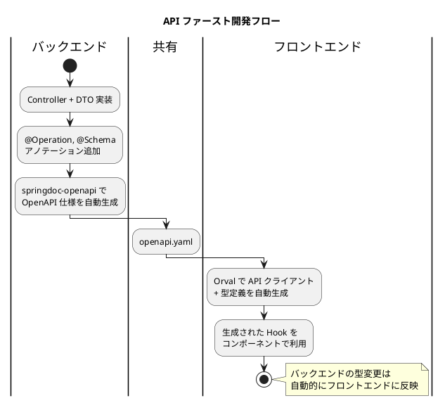
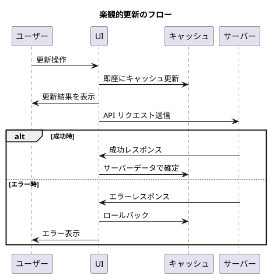
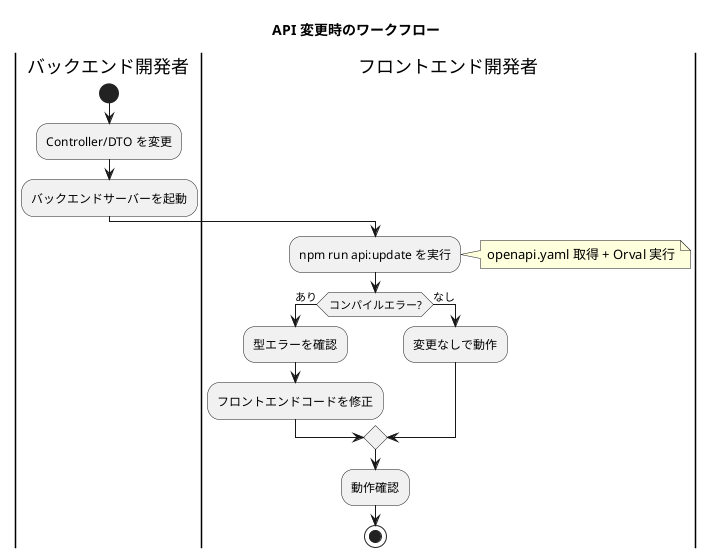

# 第3章: OpenAPI と Orval による API 連携

本章では、バックエンドから自動生成された OpenAPI 仕様を基に、Orval を使用して型安全な API クライアントを生成する方法を解説します。この API ファーストアプローチにより、フロントエンドとバックエンドの型の整合性を保証し、開発効率を大幅に向上させます。

## 3.1 API ファーストアプローチの概要

### 3.1.1 従来のアプローチの課題

従来のフロントエンド開発では、API クライアントや型定義を手動で作成することが一般的でした。この方法には以下の課題があります。

1. **型の不整合**: バックエンドの変更がフロントエンドに反映されず、実行時エラーが発生
2. **二重作業**: DTO の型定義を手動で TypeScript に変換する必要がある
3. **メンテナンスコスト**: API 変更のたびに手動で修正が必要
4. **ドキュメント不足**: API 仕様とコードの乖離

### 3.1.2 API ファーストアプローチ

API ファーストアプローチでは、OpenAPI 仕様を「単一の信頼できる情報源（Single Source of Truth）」として扱います。



### 3.1.3 メリット

| 観点 | 従来のアプローチ | API ファーストアプローチ |
|------|------------------|--------------------------|
| 型安全性 | 手動で担保 | 自動で担保 |
| 開発効率 | 低い（二重作業） | 高い（自動生成） |
| メンテナンス | 手動同期が必要 | 再生成で自動同期 |
| ドキュメント | 別途作成が必要 | OpenAPI 仕様がドキュメント |
| エラー検出 | 実行時 | コンパイル時 |

---

## 3.2 OpenAPI 仕様の取得

### 3.2.1 バックエンドでの OpenAPI 生成

バックエンド（Spring Boot）では、springdoc-openapi ライブラリを使用して OpenAPI 仕様を自動生成します。

**build.gradle**:

```groovy
dependencies {
    implementation 'org.springdoc:springdoc-openapi-starter-webmvc-ui:2.3.0'
}
```

**application.yml**:

```yaml
springdoc:
  api-docs:
    path: /api-docs
    enabled: true
  swagger-ui:
    path: /swagger-ui.html
    enabled: true
  packages-to-scan: com.example.accounting.api
  default-produces-media-type: application/json
  default-consumes-media-type: application/json
```

バックエンドの Controller には、OpenAPI アノテーションを付与して API 仕様を明確にします。

**Controller の例**:

```java
@RestController
@RequestMapping("/api/accounts")
@Tag(name = "勘定科目", description = "勘定科目マスタ管理 API")
public class AccountController {

    @Operation(summary = "勘定科目一覧取得", description = "登録されている勘定科目の一覧を取得します")
    @ApiResponses({
        @ApiResponse(responseCode = "200", description = "成功"),
        @ApiResponse(responseCode = "401", description = "認証エラー")
    })
    @GetMapping
    public ResponseEntity<List<AccountResponse>> getAccounts() {
        // 実装
    }

    @Operation(summary = "勘定科目登録", description = "新しい勘定科目を登録します")
    @PostMapping
    public ResponseEntity<AccountResponse> createAccount(
            @RequestBody @Valid AccountRequest request) {
        // 実装
    }
}
```

### 3.2.2 OpenAPI 仕様のダウンロード

バックエンドサーバーが起動している状態で、OpenAPI 仕様をダウンロードします。

```bash
# YAML 形式でダウンロード
curl http://localhost:8080/api-docs.yaml -o openapi.yaml

# JSON 形式でダウンロード
curl http://localhost:8080/api-docs -o openapi.json
```

### 3.2.3 OpenAPI 仕様の例

自動生成される OpenAPI 仕様の例を示します。

**openapi.yaml（抜粋）**:

```yaml
openapi: 3.0.1
info:
  title: 財務会計システム API
  version: '1.0'
  description: 財務会計システムのバックエンド API 仕様

servers:
  - url: http://localhost:8080
    description: 開発環境

paths:
  /api/accounts:
    get:
      tags:
        - 勘定科目
      summary: 勘定科目一覧取得
      operationId: getAccounts
      responses:
        '200':
          description: 成功
          content:
            application/json:
              schema:
                type: array
                items:
                  $ref: '#/components/schemas/AccountResponse'
    post:
      tags:
        - 勘定科目
      summary: 勘定科目登録
      operationId: createAccount
      requestBody:
        required: true
        content:
          application/json:
            schema:
              $ref: '#/components/schemas/AccountRequest'
      responses:
        '201':
          description: 作成成功
          content:
            application/json:
              schema:
                $ref: '#/components/schemas/AccountResponse'

  /api/accounts/{accountCode}:
    get:
      tags:
        - 勘定科目
      summary: 勘定科目詳細取得
      operationId: getAccount
      parameters:
        - name: accountCode
          in: path
          required: true
          schema:
            type: string
      responses:
        '200':
          description: 成功
          content:
            application/json:
              schema:
                $ref: '#/components/schemas/AccountResponse'
        '404':
          description: 勘定科目が見つからない

components:
  schemas:
    AccountResponse:
      type: object
      required:
        - accountCode
        - accountName
        - bsplType
        - debitCreditType
        - elementType
        - displayOrder
        - version
      properties:
        accountCode:
          type: string
          description: 勘定科目コード
          example: '111'
        accountName:
          type: string
          description: 勘定科目名
          example: 現金預金
        accountAbbr:
          type: string
          description: 勘定科目略称
        accountKana:
          type: string
          description: 勘定科目カナ
        bsplType:
          type: string
          enum: [B, P]
          description: BS/PL 区分（B=貸借対照表、P=損益計算書）
        debitCreditType:
          type: string
          enum: [借, 貸]
          description: 貸借区分
        elementType:
          type: string
          enum: [資産, 負債, 純資産, 収益, 費用]
          description: 要素区分
        displayOrder:
          type: integer
          description: 表示順
        version:
          type: integer
          description: バージョン（楽観的ロック用）

    AccountRequest:
      type: object
      required:
        - accountCode
        - accountName
        - bsplType
        - debitCreditType
        - elementType
      properties:
        accountCode:
          type: string
          description: 勘定科目コード
        accountName:
          type: string
          description: 勘定科目名
        accountAbbr:
          type: string
          description: 勘定科目略称
        accountKana:
          type: string
          description: 勘定科目カナ
        bsplType:
          type: string
          enum: [B, P]
        debitCreditType:
          type: string
          enum: [借, 貸]
        elementType:
          type: string
          enum: [資産, 負債, 純資産, 収益, 費用]
        displayOrder:
          type: integer
```

---

## 3.3 Orval のセットアップ

### 3.3.1 Orval とは

Orval は、OpenAPI 仕様から TypeScript の API クライアントコードを自動生成するツールです。以下の特徴があります。

- **型定義の自動生成**: スキーマから TypeScript の interface を生成
- **React Query 連携**: useQuery / useMutation フックを自動生成
- **Axios 連携**: HTTP クライアントとして Axios を使用
- **カスタマイズ性**: 生成コードの形式を柔軟にカスタマイズ可能

### 3.3.2 インストール

開発用の依存関係として Orval をインストールします。

```bash
npm install --save-dev orval
```

### 3.3.3 Orval 設定ファイル

プロジェクトルートに `orval.config.ts` を作成します。

**orval.config.ts**:

```typescript
import { defineConfig } from 'orval';

export default defineConfig({
  accounting: {
    input: {
      target: './openapi.yaml',
      validation: true,
    },
    output: {
      mode: 'tags-split',
      target: './src/api/generated',
      schemas: './src/api/model',
      client: 'react-query',
      httpClient: 'axios',
      clean: true,
      prettier: true,
      override: {
        mutator: {
          path: './src/api/axios-instance.ts',
          name: 'customInstance',
        },
        query: {
          useQuery: true,
          useMutation: true,
          useSuspenseQuery: false,
          signal: true,
        },
      },
    },
    hooks: {
      afterAllFilesWrite: 'prettier --write',
    },
  },
});
```

### 3.3.4 設定オプションの解説

各設定オプションの意味を解説します。

| オプション | 説明 |
|-----------|------|
| `input.target` | OpenAPI 仕様ファイルのパス |
| `input.validation` | 入力ファイルのバリデーションを有効化 |
| `output.mode` | 生成モード（tags-split: タグごとにファイル分割） |
| `output.target` | 生成コードの出力先 |
| `output.schemas` | 型定義の出力先 |
| `output.client` | クライアントタイプ（react-query） |
| `output.httpClient` | HTTP クライアント（axios） |
| `output.clean` | 生成前に出力先をクリーン |
| `override.mutator` | カスタム Axios インスタンスの指定 |
| `override.query.signal` | AbortSignal のサポート |

### 3.3.5 生成モードの選択

Orval には複数の生成モードがあります。

| モード | 説明 | 用途 |
|-------|------|------|
| `single` | 全てを1ファイルに生成 | 小規模 API |
| `split` | エンドポイントごとにファイル分割 | 中規模 API |
| `tags-split` | タグ（リソース）ごとにディレクトリ分割 | 大規模 API（推奨） |

本システムでは、API のリソースごとに整理された `tags-split` モードを使用します。

---

## 3.4 Axios インスタンスの設定

### 3.4.1 カスタム Axios インスタンス

Orval で生成される API クライアントが使用する Axios インスタンスを設定します。

**src/api/axios-instance.ts**:

```typescript
import axios, { AxiosError, AxiosRequestConfig, AxiosResponse } from 'axios';

// Axios インスタンスの作成
export const axiosInstance = axios.create({
  baseURL: import.meta.env.VITE_API_BASE_URL || '/api',
  timeout: 30000,
  headers: {
    'Content-Type': 'application/json',
  },
});

// リクエストインターセプター（JWT トークンの付与）
axiosInstance.interceptors.request.use(
  (config) => {
    const token = localStorage.getItem('accessToken');
    if (token && config.headers) {
      config.headers.Authorization = `Bearer ${token}`;
    }
    return config;
  },
  (error) => {
    return Promise.reject(error);
  }
);

// レスポンスインターセプター（エラーハンドリング）
axiosInstance.interceptors.response.use(
  (response: AxiosResponse) => {
    return response;
  },
  (error: AxiosError) => {
    if (error.response) {
      switch (error.response.status) {
        case 401:
          // 認証エラー：トークンをクリアしてログイン画面へ
          localStorage.removeItem('accessToken');
          localStorage.removeItem('refreshToken');
          window.location.href = '/login';
          break;
        case 403:
          // 権限エラー
          console.error('権限がありません');
          break;
        case 404:
          // リソースが見つからない
          console.error('リソースが見つかりません');
          break;
        case 409:
          // 楽観的ロックエラー（競合）
          console.error('データが更新されています。再度読み込んでください。');
          break;
        case 500:
          // サーバーエラー
          console.error('サーバーエラーが発生しました');
          break;
      }
    }
    return Promise.reject(error);
  }
);

// Orval 用のカスタムインスタンス
export const customInstance = <T>(
  config: AxiosRequestConfig,
  options?: AxiosRequestConfig
): Promise<T> => {
  const source = axios.CancelToken.source();

  const promise = axiosInstance({
    ...config,
    ...options,
    cancelToken: source.token,
  }).then(({ data }) => data);

  // キャンセル機能の追加
  // @ts-expect-error cancel property
  promise.cancel = () => {
    source.cancel('Query was cancelled');
  };

  return promise;
};

export default customInstance;
```

### 3.4.2 インターセプターの役割

| インターセプター | 役割 |
|-----------------|------|
| リクエストインターセプター | JWT トークンを Authorization ヘッダーに追加 |
| レスポンスインターセプター | エラーステータスに応じた共通処理を実行 |

### 3.4.3 エラーハンドリング戦略

財務会計システムで特に重要なエラー処理を示します。

```typescript
// 409 Conflict（楽観的ロックエラー）の詳細ハンドリング
axiosInstance.interceptors.response.use(
  (response) => response,
  (error: AxiosError<ApiError>) => {
    if (error.response?.status === 409) {
      const apiError = error.response.data;

      // 楽観的ロックエラーの場合、最新データの再取得を促す
      const event = new CustomEvent('optimistic-lock-error', {
        detail: {
          message: apiError.message,
          resourceId: apiError.resourceId,
        },
      });
      window.dispatchEvent(event);
    }
    return Promise.reject(error);
  }
);
```

---

## 3.5 API クライアントの生成

### 3.5.1 npm スクリプトの設定

**package.json**:

```json
{
  "scripts": {
    "dev": "vite",
    "build": "tsc -b && vite build",
    "api:generate": "orval",
    "api:fetch": "curl http://localhost:8080/api-docs.yaml -o openapi.yaml",
    "api:update": "npm run api:fetch && npm run api:generate",
    "api:watch": "orval --watch"
  }
}
```

| スクリプト | 説明 |
|-----------|------|
| `api:generate` | OpenAPI 仕様から API クライアントを生成 |
| `api:fetch` | バックエンドから最新の OpenAPI 仕様を取得 |
| `api:update` | 取得と生成を一度に実行 |
| `api:watch` | OpenAPI 仕様の変更を監視して自動再生成 |

### 3.5.2 コード生成の実行

```bash
# OpenAPI 仕様の取得と API クライアント生成
npm run api:update
```

### 3.5.3 生成されるファイル構成

```
src/api/
├── generated/                    # Orval 自動生成（編集禁止）
│   ├── account/
│   │   └── account.ts           # 勘定科目 API hooks
│   ├── journal-entry/
│   │   └── journal-entry.ts     # 仕訳 API hooks
│   ├── balance/
│   │   └── balance.ts           # 残高 API hooks
│   ├── statement/
│   │   └── statement.ts         # 財務諸表 API hooks
│   ├── auth/
│   │   └── auth.ts              # 認証 API hooks
│   └── user/
│       └── user.ts              # ユーザー API hooks
├── model/                        # 自動生成された型定義
│   ├── accountResponse.ts
│   ├── accountRequest.ts
│   ├── journalEntryResponse.ts
│   ├── journalEntryRequest.ts
│   ├── balanceResponse.ts
│   └── ...
└── axios-instance.ts            # 手動設定（編集可能）
```

### 3.5.4 生成される型定義の例

**src/api/model/accountResponse.ts**:

```typescript
/**
 * 勘定科目レスポンス
 */
export interface AccountResponse {
  /** 勘定科目コード */
  accountCode: string;
  /** 勘定科目名 */
  accountName: string;
  /** 勘定科目略称 */
  accountAbbr?: string;
  /** 勘定科目カナ */
  accountKana?: string;
  /** BS/PL 区分 */
  bsplType: 'B' | 'P';
  /** 貸借区分 */
  debitCreditType: '借' | '貸';
  /** 要素区分 */
  elementType: '資産' | '負債' | '純資産' | '収益' | '費用';
  /** 表示順 */
  displayOrder: number;
  /** バージョン（楽観的ロック用） */
  version: number;
}
```

**src/api/model/accountRequest.ts**:

```typescript
/**
 * 勘定科目登録/更新リクエスト
 */
export interface AccountRequest {
  /** 勘定科目コード */
  accountCode: string;
  /** 勘定科目名 */
  accountName: string;
  /** 勘定科目略称 */
  accountAbbr?: string;
  /** 勘定科目カナ */
  accountKana?: string;
  /** BS/PL 区分 */
  bsplType: 'B' | 'P';
  /** 貸借区分 */
  debitCreditType: '借' | '貸';
  /** 要素区分 */
  elementType: '資産' | '負債' | '純資産' | '収益' | '費用';
  /** 表示順 */
  displayOrder?: number;
}
```

### 3.5.5 生成される React Query Hooks の例

**src/api/generated/account/account.ts**:

```typescript
import {
  useQuery,
  useMutation,
  UseQueryOptions,
  UseMutationOptions,
} from '@tanstack/react-query';
import { customInstance } from '../../axios-instance';
import type { AccountResponse, AccountRequest } from '../../model';

// Query Key の定義
export const getGetAccountsQueryKey = () => ['accounts'] as const;

export const getGetAccountQueryKey = (accountCode: string) =>
  ['accounts', accountCode] as const;

// 勘定科目一覧取得 Hook
export const useGetAccounts = <TData = AccountResponse[]>(
  options?: Omit<
    UseQueryOptions<AccountResponse[], Error, TData>,
    'queryKey' | 'queryFn'
  >
) => {
  return useQuery({
    queryKey: getGetAccountsQueryKey(),
    queryFn: ({ signal }) =>
      customInstance<AccountResponse[]>({
        url: '/api/accounts',
        method: 'GET',
        signal,
      }),
    ...options,
  });
};

// 勘定科目詳細取得 Hook
export const useGetAccount = <TData = AccountResponse>(
  accountCode: string,
  options?: Omit<
    UseQueryOptions<AccountResponse, Error, TData>,
    'queryKey' | 'queryFn'
  >
) => {
  return useQuery({
    queryKey: getGetAccountQueryKey(accountCode),
    queryFn: ({ signal }) =>
      customInstance<AccountResponse>({
        url: `/api/accounts/${accountCode}`,
        method: 'GET',
        signal,
      }),
    enabled: !!accountCode,
    ...options,
  });
};

// 勘定科目登録 Hook
export const useCreateAccount = (
  options?: UseMutationOptions<AccountResponse, Error, { data: AccountRequest }>
) => {
  return useMutation({
    mutationFn: ({ data }) =>
      customInstance<AccountResponse>({
        url: '/api/accounts',
        method: 'POST',
        data,
      }),
    ...options,
  });
};

// 勘定科目更新 Hook
export const useUpdateAccount = (
  options?: UseMutationOptions<
    AccountResponse,
    Error,
    { accountCode: string; data: AccountRequest }
  >
) => {
  return useMutation({
    mutationFn: ({ accountCode, data }) =>
      customInstance<AccountResponse>({
        url: `/api/accounts/${accountCode}`,
        method: 'PUT',
        data,
      }),
    ...options,
  });
};

// 勘定科目削除 Hook
export const useDeleteAccount = (
  options?: UseMutationOptions<void, Error, { accountCode: string }>
) => {
  return useMutation({
    mutationFn: ({ accountCode }) =>
      customInstance<void>({
        url: `/api/accounts/${accountCode}`,
        method: 'DELETE',
      }),
    ...options,
  });
};
```

---

## 3.6 生成されたコードの利用例

### 3.6.1 一覧取得の例

**src/components/master/account/AccountContainer.tsx**:

```typescript
import React from 'react';
import { useGetAccounts } from '@/api/generated/account/account';
import { AccountCollection } from '@/views/master/account/AccountCollection';
import { Loading } from '@/views/common/Loading';
import { ErrorMessage } from '@/views/common/ErrorMessage';

export const AccountContainer: React.FC = () => {
  // 自動生成された React Query hook を使用
  const { data: accounts, isLoading, error, refetch } = useGetAccounts();

  if (isLoading) {
    return <Loading message="勘定科目を読み込み中..." />;
  }

  if (error) {
    return (
      <ErrorMessage
        error={error}
        onRetry={() => refetch()}
      />
    );
  }

  return <AccountCollection accounts={accounts ?? []} />;
};
```

### 3.6.2 登録処理の例

```typescript
import React, { useState } from 'react';
import { useQueryClient } from '@tanstack/react-query';
import {
  useGetAccounts,
  useCreateAccount,
  getGetAccountsQueryKey,
} from '@/api/generated/account/account';
import { AccountRequest } from '@/api/model';

export const AccountContainer: React.FC = () => {
  const queryClient = useQueryClient();
  const { data: accounts } = useGetAccounts();
  const [isModalOpen, setIsModalOpen] = useState(false);

  // 登録 mutation
  const createMutation = useCreateAccount({
    onSuccess: () => {
      // 成功時：キャッシュを無効化して再取得
      queryClient.invalidateQueries({
        queryKey: getGetAccountsQueryKey(),
      });
      setIsModalOpen(false);
    },
    onError: (error) => {
      console.error('登録に失敗しました:', error);
    },
  });

  const handleCreate = (request: AccountRequest) => {
    createMutation.mutate({ data: request });
  };

  return (
    <>
      <AccountCollection
        accounts={accounts ?? []}
        onCreateClick={() => setIsModalOpen(true)}
      />
      {isModalOpen && (
        <AccountEditModal
          onSave={handleCreate}
          onCancel={() => setIsModalOpen(false)}
          isSubmitting={createMutation.isPending}
        />
      )}
    </>
  );
};
```

### 3.6.3 更新処理の例

```typescript
import React, { useState } from 'react';
import { useQueryClient } from '@tanstack/react-query';
import {
  useGetAccount,
  useUpdateAccount,
  getGetAccountsQueryKey,
  getGetAccountQueryKey,
} from '@/api/generated/account/account';
import { AccountRequest, AccountResponse } from '@/api/model';

interface Props {
  accountCode: string;
}

export const AccountDetailContainer: React.FC<Props> = ({ accountCode }) => {
  const queryClient = useQueryClient();
  const { data: account, isLoading } = useGetAccount(accountCode);
  const [isEditing, setIsEditing] = useState(false);

  // 更新 mutation
  const updateMutation = useUpdateAccount({
    onSuccess: (updatedAccount) => {
      // 一覧キャッシュを無効化
      queryClient.invalidateQueries({
        queryKey: getGetAccountsQueryKey(),
      });
      // 詳細キャッシュを更新
      queryClient.setQueryData(
        getGetAccountQueryKey(accountCode),
        updatedAccount
      );
      setIsEditing(false);
    },
  });

  const handleUpdate = (request: AccountRequest) => {
    updateMutation.mutate({
      accountCode,
      data: request,
    });
  };

  if (isLoading || !account) {
    return <Loading />;
  }

  return (
    <AccountSingle
      account={account}
      isEditing={isEditing}
      onEdit={() => setIsEditing(true)}
      onSave={handleUpdate}
      onCancel={() => setIsEditing(false)}
      isSubmitting={updateMutation.isPending}
    />
  );
};
```

### 3.6.4 削除処理の例

```typescript
import { useQueryClient } from '@tanstack/react-query';
import {
  useDeleteAccount,
  getGetAccountsQueryKey,
} from '@/api/generated/account/account';

export const useAccountDelete = () => {
  const queryClient = useQueryClient();

  const deleteMutation = useDeleteAccount({
    onSuccess: () => {
      // 一覧キャッシュを無効化
      queryClient.invalidateQueries({
        queryKey: getGetAccountsQueryKey(),
      });
    },
  });

  const handleDelete = (accountCode: string) => {
    if (window.confirm('この勘定科目を削除しますか？')) {
      deleteMutation.mutate({ accountCode });
    }
  };

  return {
    handleDelete,
    isDeleting: deleteMutation.isPending,
  };
};
```

---

## 3.7 楽観的更新（Optimistic Update）

### 3.7.1 楽観的更新とは

楽観的更新は、サーバーのレスポンスを待たずに UI を即座に更新し、ユーザー体験を向上させる手法です。



### 3.7.2 楽観的更新の実装

**src/hooks/useOptimisticAccountUpdate.ts**:

```typescript
import { useQueryClient } from '@tanstack/react-query';
import {
  useUpdateAccount,
  getGetAccountsQueryKey,
} from '@/api/generated/account/account';
import { AccountRequest, AccountResponse } from '@/api/model';

export const useOptimisticAccountUpdate = () => {
  const queryClient = useQueryClient();
  const updateMutation = useUpdateAccount();

  const update = (accountCode: string, data: AccountRequest) => {
    updateMutation.mutate(
      { accountCode, data },
      {
        // 楽観的更新：リクエスト送信前に実行
        onMutate: async (variables) => {
          // 実行中のクエリをキャンセル（競合防止）
          await queryClient.cancelQueries({
            queryKey: getGetAccountsQueryKey(),
          });

          // 現在のキャッシュを保存（ロールバック用）
          const previousAccounts = queryClient.getQueryData<AccountResponse[]>(
            getGetAccountsQueryKey()
          );

          // キャッシュを楽観的に更新
          if (previousAccounts) {
            queryClient.setQueryData<AccountResponse[]>(
              getGetAccountsQueryKey(),
              (old) =>
                old?.map((account) =>
                  account.accountCode === variables.accountCode
                    ? { ...account, ...variables.data }
                    : account
                )
            );
          }

          // コンテキストを返す（エラー時のロールバック用）
          return { previousAccounts };
        },

        // エラー時：キャッシュをロールバック
        onError: (err, variables, context) => {
          if (context?.previousAccounts) {
            queryClient.setQueryData(
              getGetAccountsQueryKey(),
              context.previousAccounts
            );
          }
        },

        // 完了時（成功・エラー問わず）：キャッシュを再検証
        onSettled: () => {
          queryClient.invalidateQueries({
            queryKey: getGetAccountsQueryKey(),
          });
        },
      }
    );
  };

  return {
    update,
    isPending: updateMutation.isPending,
    error: updateMutation.error,
  };
};
```

### 3.7.3 楽観的更新の使用

```typescript
import React from 'react';
import { useOptimisticAccountUpdate } from '@/hooks/useOptimisticAccountUpdate';
import { AccountRequest } from '@/api/model';

export const AccountEditContainer: React.FC = () => {
  const { update, isPending } = useOptimisticAccountUpdate();

  const handleSave = (accountCode: string, data: AccountRequest) => {
    // 楽観的更新：UI は即座に更新される
    update(accountCode, data);
  };

  return (
    <AccountEditForm
      onSave={handleSave}
      isSaving={isPending}
    />
  );
};
```

### 3.7.4 楽観的更新の適用基準

| シナリオ | 楽観的更新 | 理由 |
|---------|-----------|------|
| 勘定科目の表示順変更 | 適用 | 失敗しても大きな影響なし |
| 勘定科目の名称変更 | 適用 | 失敗しても大きな影響なし |
| 仕訳の承認 | 非適用 | 業務上の重要な操作、確実性が必要 |
| 決算処理 | 非適用 | 不可逆な操作、確実性が必要 |

---

## 3.8 エラーハンドリング

### 3.8.1 グローバルエラーハンドリング

**src/queryClient.ts** での設定:

```typescript
import { QueryClient, QueryCache, MutationCache } from '@tanstack/react-query';

export const queryClient = new QueryClient({
  queryCache: new QueryCache({
    onError: (error) => {
      // クエリエラーのグローバルハンドリング
      console.error('Query Error:', error);
    },
  }),
  mutationCache: new MutationCache({
    onError: (error) => {
      // ミューテーションエラーのグローバルハンドリング
      console.error('Mutation Error:', error);
    },
  }),
  defaultOptions: {
    queries: {
      staleTime: 5 * 60 * 1000,
      gcTime: 30 * 60 * 1000,
      retry: 1,
      refetchOnWindowFocus: false,
    },
    mutations: {
      retry: 0,
    },
  },
});
```

### 3.8.2 コンポーネントレベルのエラーハンドリング

```typescript
import React from 'react';
import { useGetAccounts } from '@/api/generated/account/account';
import { AxiosError } from 'axios';

interface ApiError {
  message: string;
  code: string;
  details?: Record<string, string>;
}

export const AccountContainer: React.FC = () => {
  const { data, error, isLoading, refetch } = useGetAccounts();

  if (error) {
    const axiosError = error as AxiosError<ApiError>;
    const apiError = axiosError.response?.data;

    return (
      <div className="error-container">
        <h3>エラーが発生しました</h3>
        <p>{apiError?.message || '予期しないエラーが発生しました'}</p>
        {apiError?.details && (
          <ul>
            {Object.entries(apiError.details).map(([field, message]) => (
              <li key={field}>{field}: {message}</li>
            ))}
          </ul>
        )}
        <button onClick={() => refetch()}>再試行</button>
      </div>
    );
  }

  // 正常時の表示
  return <AccountCollection accounts={data ?? []} />;
};
```

### 3.8.3 バリデーションエラーの表示

```typescript
import { useMutation } from '@tanstack/react-query';
import { AxiosError } from 'axios';

interface ValidationError {
  field: string;
  message: string;
}

interface ApiError {
  message: string;
  errors?: ValidationError[];
}

export const useAccountCreateWithValidation = () => {
  const [validationErrors, setValidationErrors] = useState<
    Record<string, string>
  >({});

  const mutation = useCreateAccount({
    onError: (error) => {
      const axiosError = error as AxiosError<ApiError>;
      const apiError = axiosError.response?.data;

      if (apiError?.errors) {
        // バリデーションエラーをフィールドごとに整理
        const errors: Record<string, string> = {};
        apiError.errors.forEach((e) => {
          errors[e.field] = e.message;
        });
        setValidationErrors(errors);
      }
    },
  });

  return {
    create: mutation.mutate,
    validationErrors,
    clearErrors: () => setValidationErrors({}),
  };
};
```

---

## 3.9 開発時のワークフロー

### 3.9.1 API 変更時のワークフロー



### 3.9.2 CI/CD での自動生成

```yaml
# .github/workflows/frontend.yml
name: Frontend CI

on:
  push:
    paths:
      - 'frontend/**'
      - 'openapi.yaml'

jobs:
  build:
    runs-on: ubuntu-latest
    steps:
      - uses: actions/checkout@v4

      - name: Setup Node.js
        uses: actions/setup-node@v4
        with:
          node-version: '20'

      - name: Install dependencies
        working-directory: ./frontend
        run: npm ci

      - name: Generate API client
        working-directory: ./frontend
        run: npm run api:generate

      - name: Type check
        working-directory: ./frontend
        run: npm run type-check

      - name: Build
        working-directory: ./frontend
        run: npm run build
```

### 3.9.3 OpenAPI 仕様の共有方法

| 方法 | メリット | デメリット |
|------|---------|-----------|
| Git リポジトリに含める | バージョン管理が容易 | 手動更新が必要 |
| CI でアーティファクト化 | 自動化が容易 | 設定が複雑 |
| API サーバーから取得 | 常に最新 | サーバー起動が必要 |

本プロジェクトでは、`openapi.yaml` を Git リポジトリに含め、バックエンド変更時に更新する方式を採用します。

---

## 3.10 まとめ

本章では、OpenAPI と Orval による型安全な API 連携の実装方法を解説しました。

### 重要ポイント

1. **API ファーストアプローチ**: OpenAPI 仕様を単一の信頼できる情報源として扱う
2. **自動生成の活用**: 型定義と React Query Hooks を Orval で自動生成
3. **カスタム Axios インスタンス**: 認証トークン付与とエラーハンドリングを集約
4. **楽観的更新**: ユーザー体験向上のための即時 UI 更新
5. **エラーハンドリング**: グローバルとコンポーネントレベルの適切な使い分け

### 次章の内容

第4章では、Container / View パターンを中心としたアーキテクチャ設計について詳しく解説します。
