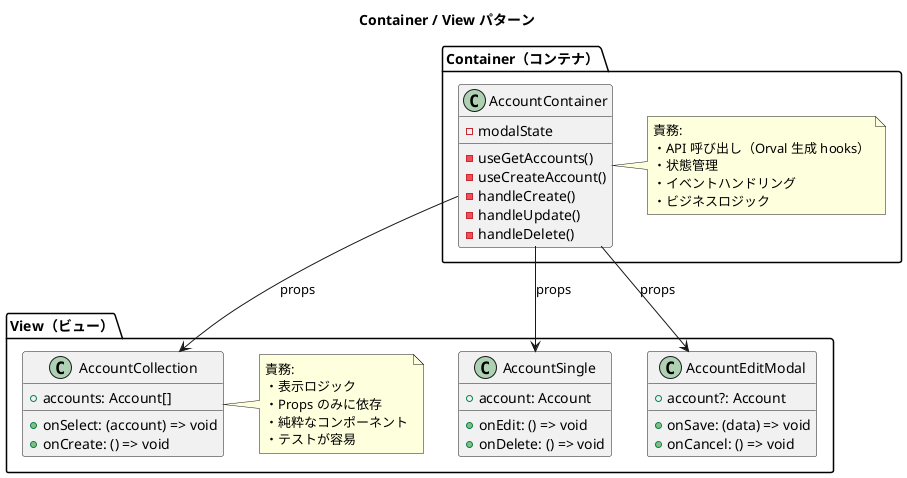
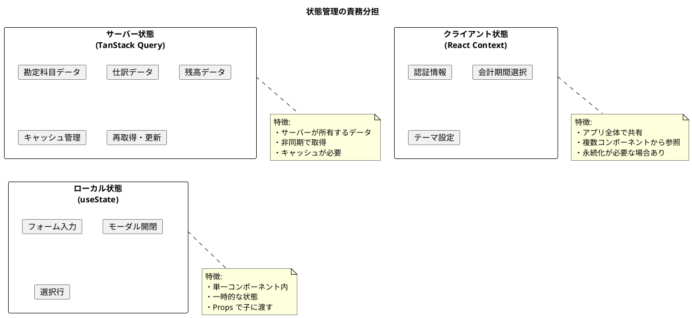
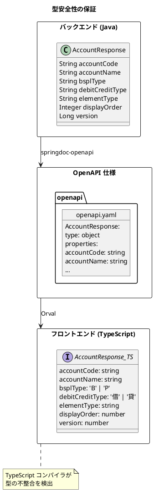

# 第4章: アーキテクチャ設計

本章では、財務会計システムのフロントエンドアーキテクチャについて詳しく解説します。Container / View パターンを中心に、状態管理戦略、型安全性の確保、財務会計特有の UI 設計上の考慮事項を説明します。

## 4.1 Container / View パターン

### 4.1.1 パターンの概要

Container / View パターン（Presentational and Container Components パターンとも呼ばれる）は、コンポーネントを「データ取得・状態管理」と「表示」の2つの責務に分離するアーキテクチャパターンです。



### 4.1.2 Container コンポーネントの責務

Container コンポーネントは以下の責務を担います。

| 責務 | 説明 |
|------|------|
| データ取得 | Orval 生成の React Query hooks を使用した API 呼び出し |
| 状態管理 | モーダル開閉、選択状態などのローカル状態管理 |
| イベントハンドリング | ユーザー操作に対する処理の実装 |
| エラーハンドリング | API エラーの処理と表示の制御 |
| ローディング状態 | 読み込み中の状態管理と表示の制御 |

**Container コンポーネントの例**:

```typescript
// src/components/master/account/AccountContainer.tsx
import React, { useState, useCallback } from 'react';
import { useQueryClient } from '@tanstack/react-query';
import {
  useGetAccounts,
  useCreateAccount,
  useUpdateAccount,
  useDeleteAccount,
  getGetAccountsQueryKey,
} from '@/api/generated/account/account';
import { AccountRequest, AccountResponse } from '@/api/model';
import { AccountCollection } from '@/views/master/account/AccountCollection';
import { AccountSingle } from '@/views/master/account/AccountSingle';
import { AccountEditModal } from '@/views/master/account/AccountEditModal';
import { Loading } from '@/views/common/Loading';
import { ErrorMessage } from '@/views/common/ErrorMessage';

type ModalMode = 'closed' | 'create' | 'edit';

export const AccountContainer: React.FC = () => {
  const queryClient = useQueryClient();

  // API 呼び出し（Orval 生成 hooks）
  const { data: accounts, isLoading, error, refetch } = useGetAccounts();
  const createMutation = useCreateAccount();
  const updateMutation = useUpdateAccount();
  const deleteMutation = useDeleteAccount();

  // ローカル状態
  const [modalMode, setModalMode] = useState<ModalMode>('closed');
  const [selectedAccount, setSelectedAccount] =
    useState<AccountResponse | null>(null);

  // イベントハンドラー
  const handleSelect = useCallback((account: AccountResponse) => {
    setSelectedAccount(account);
  }, []);

  const handleCreateClick = useCallback(() => {
    setSelectedAccount(null);
    setModalMode('create');
  }, []);

  const handleEditClick = useCallback(() => {
    setModalMode('edit');
  }, []);

  const handleModalClose = useCallback(() => {
    setModalMode('closed');
  }, []);

  const handleSave = useCallback(
    (data: AccountRequest) => {
      const onSuccess = () => {
        queryClient.invalidateQueries({
          queryKey: getGetAccountsQueryKey(),
        });
        setModalMode('closed');
      };

      if (modalMode === 'create') {
        createMutation.mutate({ data }, { onSuccess });
      } else if (modalMode === 'edit' && selectedAccount) {
        updateMutation.mutate(
          { accountCode: selectedAccount.accountCode, data },
          { onSuccess }
        );
      }
    },
    [modalMode, selectedAccount, createMutation, updateMutation, queryClient]
  );

  const handleDelete = useCallback(
    (accountCode: string) => {
      if (window.confirm('この勘定科目を削除しますか？')) {
        deleteMutation.mutate(
          { accountCode },
          {
            onSuccess: () => {
              queryClient.invalidateQueries({
                queryKey: getGetAccountsQueryKey(),
              });
              setSelectedAccount(null);
            },
          }
        );
      }
    },
    [deleteMutation, queryClient]
  );

  // ローディング状態
  if (isLoading) {
    return <Loading message="勘定科目を読み込み中..." />;
  }

  // エラー状態
  if (error) {
    return <ErrorMessage error={error} onRetry={() => refetch()} />;
  }

  // 正常時のレンダリング
  return (
    <div className="account-container">
      <div className="account-list">
        <AccountCollection
          accounts={accounts ?? []}
          selectedAccountCode={selectedAccount?.accountCode}
          onSelect={handleSelect}
          onCreate={handleCreateClick}
        />
      </div>

      {selectedAccount && (
        <div className="account-detail">
          <AccountSingle
            account={selectedAccount}
            onEdit={handleEditClick}
            onDelete={() => handleDelete(selectedAccount.accountCode)}
          />
        </div>
      )}

      {modalMode !== 'closed' && (
        <AccountEditModal
          account={modalMode === 'edit' ? selectedAccount : undefined}
          onSave={handleSave}
          onCancel={handleModalClose}
          isSubmitting={
            createMutation.isPending || updateMutation.isPending
          }
        />
      )}
    </div>
  );
};
```

### 4.1.3 View コンポーネントの責務

View コンポーネントは以下の特徴を持ちます。

| 特徴 | 説明 |
|------|------|
| 純粋な関数 | Props のみに依存し、副作用を持たない |
| テスト容易性 | Props を渡すだけでテスト可能 |
| 再利用性 | 異なる Container から利用可能 |
| 表示に専念 | データの加工・整形のみ担当 |

**View コンポーネントの例（一覧表示）**:

```typescript
// src/views/master/account/AccountCollection.tsx
import React from 'react';
import { AccountResponse } from '@/api/model';
import './AccountCollection.css';

interface Props {
  accounts: AccountResponse[];
  selectedAccountCode?: string;
  onSelect: (account: AccountResponse) => void;
  onCreate: () => void;
}

export const AccountCollection: React.FC<Props> = ({
  accounts,
  selectedAccountCode,
  onSelect,
  onCreate,
}) => {
  // BS/PL でグループ化（表示ロジック）
  const bsAccounts = accounts.filter((a) => a.bsplType === 'B');
  const plAccounts = accounts.filter((a) => a.bsplType === 'P');

  return (
    <div className="account-collection">
      <div className="account-collection__header">
        <h2>勘定科目一覧</h2>
        <button
          className="account-collection__create-button"
          onClick={onCreate}
        >
          新規作成
        </button>
      </div>

      <div className="account-collection__tabs">
        <section className="account-collection__section">
          <h3>貸借対照表科目</h3>
          <AccountList
            accounts={bsAccounts}
            selectedAccountCode={selectedAccountCode}
            onSelect={onSelect}
          />
        </section>

        <section className="account-collection__section">
          <h3>損益計算書科目</h3>
          <AccountList
            accounts={plAccounts}
            selectedAccountCode={selectedAccountCode}
            onSelect={onSelect}
          />
        </section>
      </div>
    </div>
  );
};

// 内部コンポーネント
const AccountList: React.FC<{
  accounts: AccountResponse[];
  selectedAccountCode?: string;
  onSelect: (account: AccountResponse) => void;
}> = ({ accounts, selectedAccountCode, onSelect }) => (
  <ul className="account-list">
    {accounts.map((account) => (
      <li
        key={account.accountCode}
        className={`account-list__item ${
          account.accountCode === selectedAccountCode ? 'is-selected' : ''
        }`}
        onClick={() => onSelect(account)}
      >
        <span className="account-list__code">{account.accountCode}</span>
        <span className="account-list__name">{account.accountName}</span>
        <span className="account-list__type">{account.elementType}</span>
      </li>
    ))}
  </ul>
);
```

**View コンポーネントの例（詳細表示）**:

```typescript
// src/views/master/account/AccountSingle.tsx
import React from 'react';
import { AccountResponse } from '@/api/model';
import './AccountSingle.css';

interface Props {
  account: AccountResponse;
  onEdit: () => void;
  onDelete: () => void;
}

export const AccountSingle: React.FC<Props> = ({
  account,
  onEdit,
  onDelete,
}) => {
  return (
    <div className="account-single">
      <div className="account-single__header">
        <h2>{account.accountName}</h2>
        <div className="account-single__actions">
          <button onClick={onEdit}>編集</button>
          <button onClick={onDelete} className="is-danger">
            削除
          </button>
        </div>
      </div>

      <dl className="account-single__details">
        <div className="account-single__row">
          <dt>勘定科目コード</dt>
          <dd>{account.accountCode}</dd>
        </div>
        <div className="account-single__row">
          <dt>勘定科目名</dt>
          <dd>{account.accountName}</dd>
        </div>
        {account.accountAbbr && (
          <div className="account-single__row">
            <dt>略称</dt>
            <dd>{account.accountAbbr}</dd>
          </div>
        )}
        {account.accountKana && (
          <div className="account-single__row">
            <dt>カナ</dt>
            <dd>{account.accountKana}</dd>
          </div>
        )}
        <div className="account-single__row">
          <dt>BS/PL 区分</dt>
          <dd>
            {account.bsplType === 'B' ? '貸借対照表' : '損益計算書'}
          </dd>
        </div>
        <div className="account-single__row">
          <dt>貸借区分</dt>
          <dd>{account.debitCreditType}方</dd>
        </div>
        <div className="account-single__row">
          <dt>要素区分</dt>
          <dd>{account.elementType}</dd>
        </div>
        <div className="account-single__row">
          <dt>表示順</dt>
          <dd>{account.displayOrder}</dd>
        </div>
      </dl>
    </div>
  );
};
```

**View コンポーネントの例（編集モーダル）**:

```typescript
// src/views/master/account/AccountEditModal.tsx
import React, { useState, useEffect } from 'react';
import Modal from 'react-modal';
import { AccountRequest, AccountResponse } from '@/api/model';
import './AccountEditModal.css';

interface Props {
  account?: AccountResponse;
  onSave: (data: AccountRequest) => void;
  onCancel: () => void;
  isSubmitting: boolean;
}

const initialFormData: AccountRequest = {
  accountCode: '',
  accountName: '',
  bsplType: 'B',
  debitCreditType: '借',
  elementType: '資産',
};

export const AccountEditModal: React.FC<Props> = ({
  account,
  onSave,
  onCancel,
  isSubmitting,
}) => {
  const isEditMode = !!account;
  const [formData, setFormData] = useState<AccountRequest>(initialFormData);

  // 編集モードの場合、初期値を設定
  useEffect(() => {
    if (account) {
      setFormData({
        accountCode: account.accountCode,
        accountName: account.accountName,
        accountAbbr: account.accountAbbr,
        accountKana: account.accountKana,
        bsplType: account.bsplType,
        debitCreditType: account.debitCreditType,
        elementType: account.elementType,
        displayOrder: account.displayOrder,
      });
    }
  }, [account]);

  const handleChange = (
    e: React.ChangeEvent<HTMLInputElement | HTMLSelectElement>
  ) => {
    const { name, value } = e.target;
    setFormData((prev) => ({ ...prev, [name]: value }));
  };

  const handleSubmit = (e: React.FormEvent) => {
    e.preventDefault();
    onSave(formData);
  };

  return (
    <Modal
      isOpen
      onRequestClose={onCancel}
      className="account-edit-modal"
      overlayClassName="modal-overlay"
    >
      <form onSubmit={handleSubmit}>
        <h2>{isEditMode ? '勘定科目編集' : '勘定科目登録'}</h2>

        <div className="form-group">
          <label htmlFor="accountCode">勘定科目コード</label>
          <input
            id="accountCode"
            name="accountCode"
            value={formData.accountCode}
            onChange={handleChange}
            disabled={isEditMode}
            required
          />
        </div>

        <div className="form-group">
          <label htmlFor="accountName">勘定科目名</label>
          <input
            id="accountName"
            name="accountName"
            value={formData.accountName}
            onChange={handleChange}
            required
          />
        </div>

        <div className="form-group">
          <label htmlFor="bsplType">BS/PL 区分</label>
          <select
            id="bsplType"
            name="bsplType"
            value={formData.bsplType}
            onChange={handleChange}
          >
            <option value="B">貸借対照表</option>
            <option value="P">損益計算書</option>
          </select>
        </div>

        <div className="form-group">
          <label htmlFor="debitCreditType">貸借区分</label>
          <select
            id="debitCreditType"
            name="debitCreditType"
            value={formData.debitCreditType}
            onChange={handleChange}
          >
            <option value="借">借方</option>
            <option value="貸">貸方</option>
          </select>
        </div>

        <div className="form-group">
          <label htmlFor="elementType">要素区分</label>
          <select
            id="elementType"
            name="elementType"
            value={formData.elementType}
            onChange={handleChange}
          >
            <option value="資産">資産</option>
            <option value="負債">負債</option>
            <option value="純資産">純資産</option>
            <option value="収益">収益</option>
            <option value="費用">費用</option>
          </select>
        </div>

        <div className="form-actions">
          <button type="button" onClick={onCancel} disabled={isSubmitting}>
            キャンセル
          </button>
          <button type="submit" disabled={isSubmitting}>
            {isSubmitting ? '保存中...' : '保存'}
          </button>
        </div>
      </form>
    </Modal>
  );
};
```

### 4.1.4 ディレクトリ構成

Container と View を明確に分離したディレクトリ構成を示します。

```
src/
├── components/          # Container コンポーネント
│   ├── master/
│   │   ├── account/
│   │   │   └── AccountContainer.tsx
│   │   ├── accountingPeriod/
│   │   │   └── AccountingPeriodContainer.tsx
│   │   └── user/
│   │       └── UserContainer.tsx
│   ├── journal/
│   │   ├── entry/
│   │   │   └── JournalEntryContainer.tsx
│   │   └── list/
│   │       └── JournalListContainer.tsx
│   └── statement/
│       ├── balanceSheet/
│       │   └── BalanceSheetContainer.tsx
│       └── profitLoss/
│           └── ProfitLossContainer.tsx
│
└── views/               # View コンポーネント
    ├── master/
    │   ├── account/
    │   │   ├── AccountCollection.tsx
    │   │   ├── AccountSingle.tsx
    │   │   └── AccountEditModal.tsx
    │   └── ...
    ├── journal/
    │   ├── entry/
    │   │   ├── JournalEntryForm.tsx
    │   │   └── JournalDetailForm.tsx
    │   └── ...
    ├── statement/
    │   └── ...
    └── common/
        ├── Loading.tsx
        ├── ErrorMessage.tsx
        ├── MoneyDisplay.tsx
        └── DateDisplay.tsx
```

---

## 4.2 状態管理パターン

### 4.2.1 状態の分類

フロントエンドの状態を以下の3種類に分類し、それぞれ適切な管理方法を選択します。



| 状態の種類 | 管理方法 | 例 |
|-----------|----------|-----|
| サーバー状態 | TanStack Query（Orval 生成） | 勘定科目一覧、仕訳データ、残高データ |
| クライアント状態 | React Context | 認証情報、会計期間選択、UI テーマ |
| ローカル状態 | useState / useReducer | フォーム入力、モーダル開閉、選択行 |

### 4.2.2 サーバー状態管理（TanStack Query）

サーバー状態は TanStack Query（React Query）で管理します。Orval で自動生成された hooks を使用します。

**特徴**:
- 自動キャッシュ
- バックグラウンド再取得
- 楽観的更新
- エラー・ローディング状態管理

**queryClient の設定**:

```typescript
// src/queryClient.ts
import { QueryClient } from '@tanstack/react-query';

export const queryClient = new QueryClient({
  defaultOptions: {
    queries: {
      // キャッシュの鮮度（この時間内は再取得しない）
      staleTime: 5 * 60 * 1000, // 5分

      // キャッシュの保持時間
      gcTime: 30 * 60 * 1000, // 30分

      // エラー時のリトライ回数
      retry: 1,

      // ウィンドウフォーカス時の再取得を無効化
      refetchOnWindowFocus: false,

      // マウント時の再取得を無効化
      refetchOnMount: false,
    },
    mutations: {
      // ミューテーションのリトライは無効
      retry: 0,
    },
  },
});
```

**マスタデータ用の設定オーバーライド**:

```typescript
// マスタデータは長めにキャッシュ
const { data: accounts } = useGetAccounts({
  staleTime: 10 * 60 * 1000, // 10分
});

// 頻繁に更新されるデータは短めに
const { data: journals } = useGetJournalEntries({
  staleTime: 1 * 60 * 1000, // 1分
});
```

### 4.2.3 クライアント状態管理（React Context）

アプリケーション全体で共有が必要な状態は React Context で管理します。

**AuthProvider の実装**:

```typescript
// src/providers/AuthProvider.tsx
import React, { createContext, useContext, useState, useEffect } from 'react';

interface User {
  id: string;
  name: string;
  email: string;
  roles: string[];
}

interface AuthContextType {
  user: User | null;
  isAuthenticated: boolean;
  isLoading: boolean;
  login: (token: string, user: User) => void;
  logout: () => void;
  hasRole: (role: string) => boolean;
}

const AuthContext = createContext<AuthContextType | undefined>(undefined);

export const AuthProvider: React.FC<{ children: React.ReactNode }> = ({
  children,
}) => {
  const [user, setUser] = useState<User | null>(null);
  const [isLoading, setIsLoading] = useState(true);

  // 初回マウント時にトークンを確認
  useEffect(() => {
    const token = localStorage.getItem('accessToken');
    const savedUser = localStorage.getItem('user');

    if (token && savedUser) {
      try {
        setUser(JSON.parse(savedUser));
      } catch {
        localStorage.removeItem('accessToken');
        localStorage.removeItem('user');
      }
    }
    setIsLoading(false);
  }, []);

  const login = (token: string, user: User) => {
    localStorage.setItem('accessToken', token);
    localStorage.setItem('user', JSON.stringify(user));
    setUser(user);
  };

  const logout = () => {
    localStorage.removeItem('accessToken');
    localStorage.removeItem('user');
    setUser(null);
  };

  const hasRole = (role: string) => {
    return user?.roles.includes(role) ?? false;
  };

  return (
    <AuthContext.Provider
      value={{
        user,
        isAuthenticated: !!user,
        isLoading,
        login,
        logout,
        hasRole,
      }}
    >
      {children}
    </AuthContext.Provider>
  );
};

export const useAuth = () => {
  const context = useContext(AuthContext);
  if (context === undefined) {
    throw new Error('useAuth must be used within an AuthProvider');
  }
  return context;
};
```

**会計期間 Provider の実装**:

```typescript
// src/providers/AccountingPeriodProvider.tsx
import React, { createContext, useContext, useState } from 'react';

interface AccountingPeriod {
  startDate: string;
  endDate: string;
  year: number;
  month?: number;
}

interface AccountingPeriodContextType {
  currentPeriod: AccountingPeriod;
  setPeriod: (period: AccountingPeriod) => void;
  isMonthly: boolean;
  setIsMonthly: (monthly: boolean) => void;
}

const AccountingPeriodContext = createContext<
  AccountingPeriodContextType | undefined
>(undefined);

export const AccountingPeriodProvider: React.FC<{
  children: React.ReactNode;
}> = ({ children }) => {
  const [currentPeriod, setCurrentPeriod] = useState<AccountingPeriod>(() => {
    const now = new Date();
    return {
      year: now.getFullYear(),
      startDate: `${now.getFullYear()}-04-01`,
      endDate: `${now.getFullYear() + 1}-03-31`,
    };
  });
  const [isMonthly, setIsMonthly] = useState(false);

  return (
    <AccountingPeriodContext.Provider
      value={{
        currentPeriod,
        setPeriod: setCurrentPeriod,
        isMonthly,
        setIsMonthly,
      }}
    >
      {children}
    </AccountingPeriodContext.Provider>
  );
};

export const useAccountingPeriod = () => {
  const context = useContext(AccountingPeriodContext);
  if (context === undefined) {
    throw new Error(
      'useAccountingPeriod must be used within AccountingPeriodProvider'
    );
  }
  return context;
};
```

### 4.2.4 Provider の構成

**App.tsx での Provider 構成**:

```typescript
// src/App.tsx
import { QueryClientProvider } from '@tanstack/react-query';
import { ReactQueryDevtools } from '@tanstack/react-query-devtools';
import { queryClient } from './queryClient';
import { AuthProvider } from './providers/AuthProvider';
import { AccountingPeriodProvider } from './providers/AccountingPeriodProvider';
import { RouteConfig } from './RouteConfig';

export const App: React.FC = () => (
  <QueryClientProvider client={queryClient}>
    <AuthProvider>
      <AccountingPeriodProvider>
        <RouteConfig />
      </AccountingPeriodProvider>
    </AuthProvider>
    <ReactQueryDevtools initialIsOpen={false} />
  </QueryClientProvider>
);
```

---

## 4.3 型安全性の確保

### 4.3.1 Orval による型定義の自動生成

Orval はバックエンドの DTO と完全に一致した TypeScript の型定義を生成します。これにより、フロントエンド・バックエンド間の型の不整合を防ぎます。



### 4.3.2 Union 型による厳密な型定義

OpenAPI の enum は TypeScript の Union 型として生成されます。

```typescript
// 自動生成された型（src/api/model/accountResponse.ts）
export interface AccountResponse {
  accountCode: string;
  accountName: string;

  // enum は Union 型として生成
  bsplType: 'B' | 'P';
  debitCreditType: '借' | '貸';
  elementType: '資産' | '負債' | '純資産' | '収益' | '費用';

  displayOrder: number;
  version: number;
}
```

これにより、コンパイル時に不正な値を検出できます。

```typescript
// コンパイルエラー：'X' は型 '"B" | "P"' に割り当てられません
const account: AccountResponse = {
  // ...
  bsplType: 'X', // エラー！
};
```

### 4.3.3 Props の型定義

View コンポーネントの Props は API の型を活用して定義します。

```typescript
import { AccountResponse, AccountRequest } from '@/api/model';

// 一覧表示用 Props
interface AccountCollectionProps {
  accounts: AccountResponse[];
  selectedAccountCode?: string;
  onSelect: (account: AccountResponse) => void;
  onCreate: () => void;
}

// 詳細表示用 Props
interface AccountSingleProps {
  account: AccountResponse;
  onEdit: () => void;
  onDelete: () => void;
}

// 編集モーダル用 Props
interface AccountEditModalProps {
  account?: AccountResponse;  // undefined の場合は新規作成
  onSave: (data: AccountRequest) => void;
  onCancel: () => void;
  isSubmitting: boolean;
}
```

### 4.3.4 型ガード関数

実行時の型チェックが必要な場合は、型ガード関数を使用します。

```typescript
// src/utils/typeGuards.ts
import { AccountResponse } from '@/api/model';

export const isAccountResponse = (obj: unknown): obj is AccountResponse => {
  if (typeof obj !== 'object' || obj === null) return false;

  const account = obj as Record<string, unknown>;
  return (
    typeof account.accountCode === 'string' &&
    typeof account.accountName === 'string' &&
    (account.bsplType === 'B' || account.bsplType === 'P') &&
    (account.debitCreditType === '借' || account.debitCreditType === '貸')
  );
};

// 使用例
const handleData = (data: unknown) => {
  if (isAccountResponse(data)) {
    // data は AccountResponse 型として扱われる
    console.log(data.accountName);
  }
};
```

---

## 4.4 財務会計特有の考慮事項

### 4.4.1 金額の取り扱い

金額計算には精度が重要です。JavaScript の浮動小数点演算ではなく、decimal.js を使用します。

**金額ユーティリティ**:

```typescript
// src/utils/money.ts
import Decimal from 'decimal.js';

// 金額の型定義
export type Money = {
  amount: Decimal;
  currency: string;
};

// 金額を生成
export const createMoney = (
  amount: number | string,
  currency: string = 'JPY'
): Money => ({
  amount: new Decimal(amount),
  currency,
});

// 金額の加算
export const addMoney = (a: Money, b: Money): Money => {
  if (a.currency !== b.currency) {
    throw new Error('通貨が異なります');
  }
  return {
    amount: a.amount.plus(b.amount),
    currency: a.currency,
  };
};

// 金額の減算
export const subtractMoney = (a: Money, b: Money): Money => {
  if (a.currency !== b.currency) {
    throw new Error('通貨が異なります');
  }
  return {
    amount: a.amount.minus(b.amount),
    currency: a.currency,
  };
};

// 金額のフォーマット（3桁カンマ）
export const formatMoney = (money: Money): string => {
  const formatted = money.amount
    .toFixed(0)
    .replace(/\B(?=(\d{3})+(?!\d))/g, ',');

  if (money.currency === 'JPY') {
    return `¥${formatted}`;
  }
  return `${money.currency} ${formatted}`;
};

// 金額の比較
export const compareMoney = (a: Money, b: Money): number => {
  return a.amount.comparedTo(b.amount);
};

// ゼロ判定
export const isZero = (money: Money): boolean => {
  return money.amount.isZero();
};
```

**金額表示コンポーネント**:

```typescript
// src/views/common/MoneyDisplay.tsx
import React from 'react';
import Decimal from 'decimal.js';
import './MoneyDisplay.css';

interface Props {
  amount: number | string;
  showSign?: boolean;
  colorBySign?: boolean;
  className?: string;
}

export const MoneyDisplay: React.FC<Props> = ({
  amount,
  showSign = false,
  colorBySign = false,
  className = '',
}) => {
  const decimal = new Decimal(amount);
  const isNegative = decimal.isNegative();
  const absValue = decimal.abs().toFixed(0);

  // 3桁カンマ区切り
  const formatted = absValue.replace(/\B(?=(\d{3})+(?!\d))/g, ',');

  // 符号の決定
  let sign = '';
  if (showSign) {
    sign = isNegative ? '-' : '+';
  } else if (isNegative) {
    sign = '-';
  }

  // CSSクラスの決定
  const colorClass = colorBySign
    ? isNegative
      ? 'is-negative'
      : 'is-positive'
    : '';

  return (
    <span className={`money-display ${colorClass} ${className}`}>
      {sign}¥{formatted}
    </span>
  );
};
```

### 4.4.2 貸借表示

複式簿記では、借方（デビット）と貸方（クレジット）を明確に区別して表示します。

**仕訳明細表示コンポーネント**:

```typescript
// src/views/journal/JournalDetailView.tsx
import React from 'react';
import { JournalDetailResponse } from '@/api/model';
import { MoneyDisplay } from '@/views/common/MoneyDisplay';
import './JournalDetailView.css';

interface Props {
  details: JournalDetailResponse[];
}

export const JournalDetailView: React.FC<Props> = ({ details }) => {
  // 借方・貸方の合計を計算
  const totalDebit = details.reduce(
    (sum, d) => sum + (d.debitAmount ?? 0),
    0
  );
  const totalCredit = details.reduce(
    (sum, d) => sum + (d.creditAmount ?? 0),
    0
  );

  return (
    <table className="journal-detail-table">
      <thead>
        <tr>
          <th>勘定科目</th>
          <th className="amount-column">借方金額</th>
          <th className="amount-column">貸方金額</th>
          <th>摘要</th>
        </tr>
      </thead>
      <tbody>
        {details.map((detail, index) => (
          <tr key={index}>
            <td>{detail.accountName}</td>
            <td className="amount-column">
              {detail.debitAmount ? (
                <MoneyDisplay amount={detail.debitAmount} />
              ) : (
                ''
              )}
            </td>
            <td className="amount-column">
              {detail.creditAmount ? (
                <MoneyDisplay amount={detail.creditAmount} />
              ) : (
                ''
              )}
            </td>
            <td>{detail.description}</td>
          </tr>
        ))}
      </tbody>
      <tfoot>
        <tr className="total-row">
          <td>合計</td>
          <td className="amount-column">
            <MoneyDisplay amount={totalDebit} />
          </td>
          <td className="amount-column">
            <MoneyDisplay amount={totalCredit} />
          </td>
          <td></td>
        </tr>
      </tfoot>
    </table>
  );
};
```

### 4.4.3 貸借バランスの検証

仕訳入力時には、借方合計と貸方合計が一致することを検証します。

**貸借バランス検証フック**:

```typescript
// src/hooks/useBalanceValidation.ts
import { useMemo } from 'react';
import Decimal from 'decimal.js';

interface JournalDetail {
  debitAmount?: number | string;
  creditAmount?: number | string;
}

interface BalanceValidationResult {
  totalDebit: Decimal;
  totalCredit: Decimal;
  difference: Decimal;
  isBalanced: boolean;
}

export const useBalanceValidation = (
  details: JournalDetail[]
): BalanceValidationResult => {
  return useMemo(() => {
    const totalDebit = details.reduce((sum, d) => {
      return sum.plus(new Decimal(d.debitAmount ?? 0));
    }, new Decimal(0));

    const totalCredit = details.reduce((sum, d) => {
      return sum.plus(new Decimal(d.creditAmount ?? 0));
    }, new Decimal(0));

    const difference = totalDebit.minus(totalCredit).abs();
    const isBalanced = difference.isZero();

    return {
      totalDebit,
      totalCredit,
      difference,
      isBalanced,
    };
  }, [details]);
};
```

**使用例**:

```typescript
// src/components/journal/entry/JournalEntryContainer.tsx
import { useBalanceValidation } from '@/hooks/useBalanceValidation';

export const JournalEntryContainer: React.FC = () => {
  const [details, setDetails] = useState<JournalDetail[]>([]);
  const { isBalanced, totalDebit, totalCredit, difference } =
    useBalanceValidation(details);

  const handleSubmit = () => {
    if (!isBalanced) {
      alert(`貸借が一致しません。差額: ¥${difference.toFixed(0)}`);
      return;
    }
    // 保存処理
  };

  return (
    <JournalEntryForm
      details={details}
      onDetailsChange={setDetails}
      totalDebit={totalDebit.toNumber()}
      totalCredit={totalCredit.toNumber()}
      isBalanced={isBalanced}
      onSubmit={handleSubmit}
    />
  );
};
```

### 4.4.4 会計期間の管理

財務会計では、会計期間（決算期）の概念が重要です。

**会計期間の型定義**:

```typescript
// src/types/accountingPeriod.ts
export interface AccountingPeriod {
  id: string;
  year: number;
  startDate: string;
  endDate: string;
  isClosed: boolean;
}

export interface FiscalMonth {
  year: number;
  month: number;
  startDate: string;
  endDate: string;
  isClosed: boolean;
}
```

**会計期間セレクタコンポーネント**:

```typescript
// src/views/common/PeriodSelector.tsx
import React from 'react';
import { useAccountingPeriod } from '@/providers/AccountingPeriodProvider';
import './PeriodSelector.css';

export const PeriodSelector: React.FC = () => {
  const { currentPeriod, setPeriod, isMonthly, setIsMonthly } =
    useAccountingPeriod();

  return (
    <div className="period-selector">
      <div className="period-selector__type">
        <label>
          <input
            type="radio"
            checked={!isMonthly}
            onChange={() => setIsMonthly(false)}
          />
          年次
        </label>
        <label>
          <input
            type="radio"
            checked={isMonthly}
            onChange={() => setIsMonthly(true)}
          />
          月次
        </label>
      </div>

      <div className="period-selector__period">
        <span>
          {currentPeriod.year}年度
          {isMonthly && currentPeriod.month && ` ${currentPeriod.month}月`}
        </span>
        <span className="period-selector__range">
          ({currentPeriod.startDate} 〜 {currentPeriod.endDate})
        </span>
      </div>
    </div>
  );
};
```

### 4.4.5 権限による表示制御

財務会計システムでは、ロールに基づいた表示制御が必要です。

**権限チェックフック**:

```typescript
// src/hooks/usePermission.ts
import { useAuth } from '@/providers/AuthProvider';

type Permission =
  | 'account:read'
  | 'account:write'
  | 'journal:read'
  | 'journal:write'
  | 'journal:approve'
  | 'statement:read'
  | 'closing:execute'
  | 'admin:all';

const rolePermissions: Record<string, Permission[]> = {
  accountant: [
    'account:read',
    'account:write',
    'journal:read',
    'journal:write',
    'statement:read',
  ],
  manager: [
    'account:read',
    'journal:read',
    'journal:approve',
    'statement:read',
    'closing:execute',
  ],
  auditor: ['account:read', 'journal:read', 'statement:read'],
  admin: ['admin:all'],
};

export const usePermission = () => {
  const { user, hasRole } = useAuth();

  const hasPermission = (permission: Permission): boolean => {
    if (!user) return false;

    // 管理者は全権限を持つ
    if (hasRole('admin')) return true;

    // ユーザーの全ロールの権限をチェック
    return user.roles.some((role) => {
      const permissions = rolePermissions[role];
      return permissions?.includes(permission);
    });
  };

  return { hasPermission };
};
```

**権限ガードコンポーネント**:

```typescript
// src/components/common/PermissionGuard.tsx
import React from 'react';
import { usePermission } from '@/hooks/usePermission';

interface Props {
  permission: Permission;
  children: React.ReactNode;
  fallback?: React.ReactNode;
}

export const PermissionGuard: React.FC<Props> = ({
  permission,
  children,
  fallback = null,
}) => {
  const { hasPermission } = usePermission();

  if (!hasPermission(permission)) {
    return <>{fallback}</>;
  }

  return <>{children}</>;
};

// 使用例
const JournalActions: React.FC = () => (
  <>
    <PermissionGuard permission="journal:write">
      <button>編集</button>
    </PermissionGuard>

    <PermissionGuard permission="journal:approve">
      <button>承認</button>
    </PermissionGuard>
  </>
);
```

---

## 4.5 コンポーネント設計指針

### 4.5.1 命名規則

| 種類 | 命名規則 | 例 |
|------|---------|-----|
| Container | `〇〇Container` | `AccountContainer` |
| 一覧 View | `〇〇Collection` | `AccountCollection` |
| 詳細 View | `〇〇Single` | `AccountSingle` |
| 編集モーダル | `〇〇EditModal` | `AccountEditModal` |
| 検索モーダル | `〇〇SearchModal` | `JournalSearchModal` |
| フォーム | `〇〇Form` | `JournalEntryForm` |

### 4.5.2 Props 設計の原則

**1. コールバック Props の命名**:
- `on〇〇`: イベントハンドラー（例: `onSelect`, `onCreate`, `onCancel`）
- `is〇〇`: boolean 状態（例: `isLoading`, `isSubmitting`, `isSelected`）

**2. データ Props と関数 Props の分離**:

```typescript
// 良い例: データと関数を明確に分離
interface AccountCollectionProps {
  // データ Props
  accounts: AccountResponse[];
  selectedAccountCode?: string;

  // 関数 Props
  onSelect: (account: AccountResponse) => void;
  onCreate: () => void;
}
```

**3. 必須/オプショナルの明確化**:

```typescript
interface AccountEditModalProps {
  account?: AccountResponse;        // オプショナル（新規作成時は undefined）
  onSave: (data: AccountRequest) => void;  // 必須
  onCancel: () => void;             // 必須
  isSubmitting: boolean;            // 必須
  errors?: Record<string, string>;  // オプショナル
}
```

### 4.5.3 ファイル構成

各コンポーネントは以下のファイル構成とします。

```
src/views/master/account/
├── AccountCollection.tsx      # コンポーネント
├── AccountCollection.css      # スタイル
├── AccountCollection.test.tsx # テスト
└── index.ts                   # エクスポート
```

**index.ts**:

```typescript
export { AccountCollection } from './AccountCollection';
export type { AccountCollectionProps } from './AccountCollection';
```

---

## 4.6 まとめ

本章では、財務会計システムのフロントエンドアーキテクチャについて解説しました。

### 重要ポイント

1. **Container / View パターン**: データ取得と表示の責務を明確に分離
2. **状態管理の使い分け**: サーバー状態（TanStack Query）、クライアント状態（Context）、ローカル状態（useState）の適切な選択
3. **型安全性**: Orval 生成の型定義を活用し、コンパイル時に型エラーを検出
4. **財務会計特有の考慮**: 金額計算の精度、貸借バランス検証、権限制御

### 次章の内容

第5章では、アプリケーション基盤として、ルーティング設定、認証ガード、共通レイアウトの実装について解説します。
