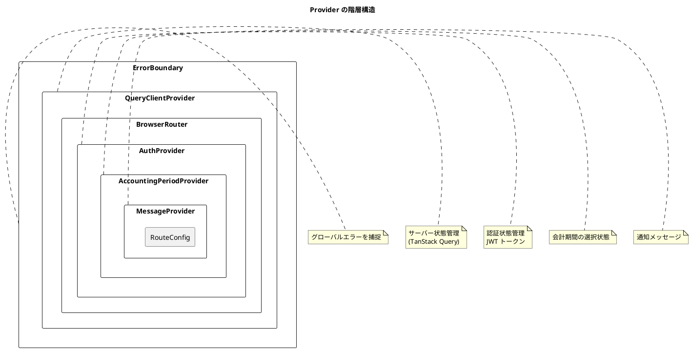
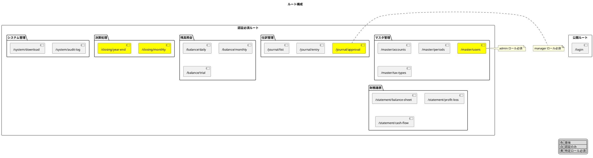

# 第5章: アプリケーション基盤

本章では、財務会計システムのフロントエンドにおけるアプリケーション基盤を構築します。エントリポイント、ルーティング、認証ガード、レイアウト、共通コンポーネントについて解説します。

## 5.1 アプリケーションエントリポイント

### 5.1.1 main.tsx

アプリケーションのエントリポイントとなる `main.tsx` を実装します。

**src/main.tsx**:

```typescript
import React from 'react';
import ReactDOM from 'react-dom/client';
import { App } from './App';
import './index.css';

// React Modal のアクセシビリティ設定
import Modal from 'react-modal';
Modal.setAppElement('#root');

ReactDOM.createRoot(document.getElementById('root')!).render(
  <React.StrictMode>
    <App />
  </React.StrictMode>
);
```

### 5.1.2 App.tsx

アプリケーションのルートコンポーネントで、Provider の構成を行います。

**src/App.tsx**:

```typescript
import React from 'react';
import { QueryClientProvider } from '@tanstack/react-query';
import { ReactQueryDevtools } from '@tanstack/react-query-devtools';
import { BrowserRouter } from 'react-router-dom';
import { queryClient } from './queryClient';
import { AuthProvider } from './providers/AuthProvider';
import { AccountingPeriodProvider } from './providers/AccountingPeriodProvider';
import { MessageProvider } from './providers/MessageProvider';
import { RouteConfig } from './RouteConfig';
import { ErrorBoundary } from './views/common/ErrorBoundary';
import './App.css';

export const App: React.FC = () => (
  <ErrorBoundary>
    <QueryClientProvider client={queryClient}>
      <BrowserRouter>
        <AuthProvider>
          <AccountingPeriodProvider>
            <MessageProvider>
              <RouteConfig />
            </MessageProvider>
          </AccountingPeriodProvider>
        </AuthProvider>
      </BrowserRouter>
      {import.meta.env.DEV && <ReactQueryDevtools initialIsOpen={false} />}
    </QueryClientProvider>
  </ErrorBoundary>
);
```

### 5.1.3 Provider の階層構造

Provider の配置順序には意味があります。外側の Provider から内側の Provider に依存関係が流れます。



### 5.1.4 queryClient の設定

**src/queryClient.ts**:

```typescript
import { QueryClient, QueryCache, MutationCache } from '@tanstack/react-query';

// エラーハンドリング用のカスタムイベント
const emitError = (error: Error, type: 'query' | 'mutation') => {
  const event = new CustomEvent('api-error', {
    detail: { error, type },
  });
  window.dispatchEvent(event);
};

export const queryClient = new QueryClient({
  queryCache: new QueryCache({
    onError: (error) => {
      console.error('Query Error:', error);
      emitError(error as Error, 'query');
    },
  }),
  mutationCache: new MutationCache({
    onError: (error) => {
      console.error('Mutation Error:', error);
      emitError(error as Error, 'mutation');
    },
  }),
  defaultOptions: {
    queries: {
      // 5分間はキャッシュを新鮮とみなす
      staleTime: 5 * 60 * 1000,
      // 30分間キャッシュを保持
      gcTime: 30 * 60 * 1000,
      // エラー時のリトライは1回
      retry: 1,
      // リトライ間隔
      retryDelay: (attemptIndex) => Math.min(1000 * 2 ** attemptIndex, 30000),
      // フォーカス時の再取得を無効化
      refetchOnWindowFocus: false,
      // ネットワーク再接続時の再取得
      refetchOnReconnect: true,
    },
    mutations: {
      // ミューテーションはリトライしない
      retry: 0,
    },
  },
});
```

---

## 5.2 ルーティング設定

### 5.2.1 ルート定義

React Router を使用してルーティングを設定します。

**src/RouteConfig.tsx**:

```typescript
import React, { Suspense, lazy } from 'react';
import { Routes, Route, Navigate } from 'react-router-dom';
import { RouteAuthGuard } from './components/common/RouteAuthGuard';
import { SiteLayout } from './views/layout/SiteLayout';
import { Loading } from './views/common/Loading';

// 遅延読み込み（コード分割）
const LoginPage = lazy(() => import('./pages/LoginPage'));
const DashboardPage = lazy(() => import('./pages/DashboardPage'));

// マスタ管理
const AccountPage = lazy(() => import('./pages/master/AccountPage'));
const AccountingPeriodPage = lazy(
  () => import('./pages/master/AccountingPeriodPage')
);
const TaxTypePage = lazy(() => import('./pages/master/TaxTypePage'));
const UserPage = lazy(() => import('./pages/master/UserPage'));

// 仕訳管理
const JournalEntryPage = lazy(() => import('./pages/journal/JournalEntryPage'));
const JournalListPage = lazy(() => import('./pages/journal/JournalListPage'));
const JournalApprovalPage = lazy(
  () => import('./pages/journal/JournalApprovalPage')
);

// 残高照会
const DailyBalancePage = lazy(() => import('./pages/balance/DailyBalancePage'));
const MonthlyBalancePage = lazy(
  () => import('./pages/balance/MonthlyBalancePage')
);
const TrialBalancePage = lazy(() => import('./pages/balance/TrialBalancePage'));

// 財務諸表
const BalanceSheetPage = lazy(
  () => import('./pages/statement/BalanceSheetPage')
);
const ProfitLossPage = lazy(() => import('./pages/statement/ProfitLossPage'));
const CashFlowPage = lazy(() => import('./pages/statement/CashFlowPage'));

// 決算処理
const MonthlyClosingPage = lazy(
  () => import('./pages/closing/MonthlyClosingPage')
);
const YearEndClosingPage = lazy(
  () => import('./pages/closing/YearEndClosingPage')
);

// システム管理
const AuditLogPage = lazy(() => import('./pages/system/AuditLogPage'));
const DownloadPage = lazy(() => import('./pages/system/DownloadPage'));

export const RouteConfig: React.FC = () => (
  <Suspense fallback={<Loading fullScreen message="読み込み中..." />}>
    <Routes>
      {/* 公開ルート */}
      <Route path="/login" element={<LoginPage />} />

      {/* 認証が必要なルート */}
      <Route
        element={
          <RouteAuthGuard>
            <SiteLayout />
          </RouteAuthGuard>
        }
      >
        {/* ダッシュボード */}
        <Route path="/" element={<Navigate to="/dashboard" replace />} />
        <Route path="/dashboard" element={<DashboardPage />} />

        {/* マスタ管理 */}
        <Route path="/master/accounts" element={<AccountPage />} />
        <Route path="/master/periods" element={<AccountingPeriodPage />} />
        <Route path="/master/tax-types" element={<TaxTypePage />} />
        <Route
          path="/master/users"
          element={
            <RouteAuthGuard requiredRole="admin">
              <UserPage />
            </RouteAuthGuard>
          }
        />

        {/* 仕訳管理 */}
        <Route path="/journal/entry" element={<JournalEntryPage />} />
        <Route path="/journal/entry/:id" element={<JournalEntryPage />} />
        <Route path="/journal/list" element={<JournalListPage />} />
        <Route
          path="/journal/approval"
          element={
            <RouteAuthGuard requiredRole="manager">
              <JournalApprovalPage />
            </RouteAuthGuard>
          }
        />

        {/* 残高照会 */}
        <Route path="/balance/daily" element={<DailyBalancePage />} />
        <Route path="/balance/monthly" element={<MonthlyBalancePage />} />
        <Route path="/balance/trial" element={<TrialBalancePage />} />

        {/* 財務諸表 */}
        <Route path="/statement/balance-sheet" element={<BalanceSheetPage />} />
        <Route path="/statement/profit-loss" element={<ProfitLossPage />} />
        <Route path="/statement/cash-flow" element={<CashFlowPage />} />

        {/* 決算処理 */}
        <Route
          path="/closing/monthly"
          element={
            <RouteAuthGuard requiredRole="manager">
              <MonthlyClosingPage />
            </RouteAuthGuard>
          }
        />
        <Route
          path="/closing/year-end"
          element={
            <RouteAuthGuard requiredRole="manager">
              <YearEndClosingPage />
            </RouteAuthGuard>
          }
        />

        {/* システム管理 */}
        <Route path="/system/audit-log" element={<AuditLogPage />} />
        <Route path="/system/download" element={<DownloadPage />} />
      </Route>

      {/* 404 */}
      <Route path="*" element={<Navigate to="/dashboard" replace />} />
    </Routes>
  </Suspense>
);
```

### 5.2.2 ルート構成の可視化



---

## 5.3 認証ガード

### 5.3.1 RouteAuthGuard コンポーネント

認証状態とロールに基づいてアクセス制御を行うコンポーネントです。

**src/components/common/RouteAuthGuard.tsx**:

```typescript
import React from 'react';
import { Navigate, useLocation } from 'react-router-dom';
import { useAuth } from '@/providers/AuthProvider';
import { Loading } from '@/views/common/Loading';

interface Props {
  children: React.ReactNode;
  requiredRole?: string;
}

export const RouteAuthGuard: React.FC<Props> = ({ children, requiredRole }) => {
  const { isAuthenticated, isLoading, hasRole } = useAuth();
  const location = useLocation();

  // 認証状態の確認中
  if (isLoading) {
    return <Loading fullScreen message="認証情報を確認中..." />;
  }

  // 未認証の場合、ログインページへリダイレクト
  if (!isAuthenticated) {
    return <Navigate to="/login" state={{ from: location }} replace />;
  }

  // ロールが指定されている場合、権限チェック
  if (requiredRole && !hasRole(requiredRole)) {
    return (
      <div className="access-denied">
        <h1>アクセス権限がありません</h1>
        <p>
          このページにアクセスするには「{requiredRole}」
          ロールが必要です。
        </p>
        <Navigate to="/dashboard" replace />
      </div>
    );
  }

  return <>{children}</>;
};
```

### 5.3.2 AuthProvider の実装

**src/providers/AuthProvider.tsx**:

```typescript
import React, {
  createContext,
  useContext,
  useState,
  useEffect,
  useCallback,
} from 'react';
import { useNavigate } from 'react-router-dom';

// ユーザー情報の型定義
interface User {
  id: string;
  name: string;
  email: string;
  roles: string[];
}

// 認証コンテキストの型定義
interface AuthContextType {
  user: User | null;
  isAuthenticated: boolean;
  isLoading: boolean;
  login: (email: string, password: string) => Promise<void>;
  logout: () => void;
  hasRole: (role: string) => boolean;
  hasAnyRole: (roles: string[]) => boolean;
}

const AuthContext = createContext<AuthContextType | undefined>(undefined);

// JWT トークンのデコード（簡易版）
const decodeToken = (token: string): { exp: number; sub: string } | null => {
  try {
    const payload = token.split('.')[1];
    return JSON.parse(atob(payload));
  } catch {
    return null;
  }
};

// トークンの有効期限チェック
const isTokenExpired = (token: string): boolean => {
  const decoded = decodeToken(token);
  if (!decoded) return true;
  return decoded.exp * 1000 < Date.now();
};

export const AuthProvider: React.FC<{ children: React.ReactNode }> = ({
  children,
}) => {
  const [user, setUser] = useState<User | null>(null);
  const [isLoading, setIsLoading] = useState(true);

  // 初回マウント時にトークンを検証
  useEffect(() => {
    const initializeAuth = async () => {
      const token = localStorage.getItem('accessToken');
      const savedUser = localStorage.getItem('user');

      if (token && savedUser && !isTokenExpired(token)) {
        try {
          setUser(JSON.parse(savedUser));
        } catch {
          clearAuthData();
        }
      } else {
        clearAuthData();
      }
      setIsLoading(false);
    };

    initializeAuth();
  }, []);

  // 認証データのクリア
  const clearAuthData = () => {
    localStorage.removeItem('accessToken');
    localStorage.removeItem('refreshToken');
    localStorage.removeItem('user');
    setUser(null);
  };

  // ログイン処理
  const login = useCallback(async (email: string, password: string) => {
    const response = await fetch('/api/auth/login', {
      method: 'POST',
      headers: { 'Content-Type': 'application/json' },
      body: JSON.stringify({ email, password }),
    });

    if (!response.ok) {
      const error = await response.json();
      throw new Error(error.message || 'ログインに失敗しました');
    }

    const data = await response.json();
    localStorage.setItem('accessToken', data.accessToken);
    localStorage.setItem('refreshToken', data.refreshToken);
    localStorage.setItem('user', JSON.stringify(data.user));
    setUser(data.user);
  }, []);

  // ログアウト処理
  const logout = useCallback(() => {
    clearAuthData();
    window.location.href = '/login';
  }, []);

  // 単一ロールのチェック
  const hasRole = useCallback(
    (role: string): boolean => {
      return user?.roles.includes(role) ?? false;
    },
    [user]
  );

  // 複数ロールのいずれかを持つかチェック
  const hasAnyRole = useCallback(
    (roles: string[]): boolean => {
      return roles.some((role) => user?.roles.includes(role));
    },
    [user]
  );

  return (
    <AuthContext.Provider
      value={{
        user,
        isAuthenticated: !!user,
        isLoading,
        login,
        logout,
        hasRole,
        hasAnyRole,
      }}
    >
      {children}
    </AuthContext.Provider>
  );
};

export const useAuth = () => {
  const context = useContext(AuthContext);
  if (context === undefined) {
    throw new Error('useAuth must be used within an AuthProvider');
  }
  return context;
};
```

### 5.3.3 ロール定義

財務会計システムで使用するロールを定義します。

**src/constants/roles.ts**:

```typescript
// ロール定義
export const ROLES = {
  ADMIN: 'admin',           // システム管理者
  MANAGER: 'manager',       // 管理者（承認・決算権限）
  ACCOUNTANT: 'accountant', // 経理担当者（仕訳入力）
  AUDITOR: 'auditor',       // 監査者（閲覧のみ）
} as const;

export type Role = (typeof ROLES)[keyof typeof ROLES];

// ロールの表示名
export const ROLE_LABELS: Record<Role, string> = {
  [ROLES.ADMIN]: 'システム管理者',
  [ROLES.MANAGER]: '管理者',
  [ROLES.ACCOUNTANT]: '経理担当者',
  [ROLES.AUDITOR]: '監査者',
};

// ロール階層（上位ロールは下位の権限を含む）
export const ROLE_HIERARCHY: Record<Role, Role[]> = {
  [ROLES.ADMIN]: [ROLES.MANAGER, ROLES.ACCOUNTANT, ROLES.AUDITOR],
  [ROLES.MANAGER]: [ROLES.ACCOUNTANT, ROLES.AUDITOR],
  [ROLES.ACCOUNTANT]: [ROLES.AUDITOR],
  [ROLES.AUDITOR]: [],
};
```

---

## 5.4 レイアウト

### 5.4.1 SiteLayout コンポーネント

アプリケーション全体のレイアウトを定義します。

**src/views/layout/SiteLayout.tsx**:

```typescript
import React from 'react';
import { Outlet } from 'react-router-dom';
import { Header } from './Header';
import { Sidebar } from './Sidebar';
import { Footer } from './Footer';
import { MessageDisplay } from '@/views/common/MessageDisplay';
import './SiteLayout.css';

export const SiteLayout: React.FC = () => {
  return (
    <div className="site-layout">
      <Header />
      <div className="site-layout__body">
        <Sidebar />
        <main className="site-layout__main">
          <MessageDisplay />
          <Outlet />
        </main>
      </div>
      <Footer />
    </div>
  );
};
```

**src/views/layout/SiteLayout.css**:

```css
.site-layout {
  display: flex;
  flex-direction: column;
  min-height: 100vh;
}

.site-layout__body {
  display: flex;
  flex: 1;
}

.site-layout__main {
  flex: 1;
  padding: 24px;
  background-color: #f5f5f5;
  overflow-y: auto;
}
```

### 5.4.2 Header コンポーネント

ヘッダーには会計期間、ユーザー情報、ログアウトボタンを配置します。

**src/views/layout/Header.tsx**:

```typescript
import React from 'react';
import { useAuth } from '@/providers/AuthProvider';
import { useAccountingPeriod } from '@/providers/AccountingPeriodProvider';
import { PeriodSelector } from '@/views/common/PeriodSelector';
import { FiLogOut, FiUser } from 'react-icons/fi';
import './Header.css';

export const Header: React.FC = () => {
  const { user, logout } = useAuth();
  const { currentPeriod } = useAccountingPeriod();

  const handleLogout = () => {
    if (window.confirm('ログアウトしますか？')) {
      logout();
    }
  };

  return (
    <header className="header">
      <div className="header__left">
        <h1 className="header__title">財務会計システム</h1>
        <PeriodSelector />
      </div>

      <div className="header__right">
        <div className="header__user">
          <FiUser className="header__user-icon" />
          <span className="header__user-name">{user?.name}</span>
          <span className="header__user-role">
            ({user?.roles.join(', ')})
          </span>
        </div>
        <button
          className="header__logout-button"
          onClick={handleLogout}
          title="ログアウト"
        >
          <FiLogOut />
          ログアウト
        </button>
      </div>
    </header>
  );
};
```

**src/views/layout/Header.css**:

```css
.header {
  display: flex;
  justify-content: space-between;
  align-items: center;
  padding: 0 24px;
  height: 64px;
  background-color: #1a237e;
  color: white;
  box-shadow: 0 2px 4px rgba(0, 0, 0, 0.1);
}

.header__left {
  display: flex;
  align-items: center;
  gap: 24px;
}

.header__title {
  font-size: 1.25rem;
  font-weight: 600;
  margin: 0;
}

.header__right {
  display: flex;
  align-items: center;
  gap: 16px;
}

.header__user {
  display: flex;
  align-items: center;
  gap: 8px;
}

.header__user-icon {
  font-size: 1.25rem;
}

.header__user-name {
  font-weight: 500;
}

.header__user-role {
  font-size: 0.875rem;
  opacity: 0.8;
}

.header__logout-button {
  display: flex;
  align-items: center;
  gap: 4px;
  padding: 8px 16px;
  background-color: transparent;
  border: 1px solid rgba(255, 255, 255, 0.5);
  border-radius: 4px;
  color: white;
  cursor: pointer;
  transition: background-color 0.2s;
}

.header__logout-button:hover {
  background-color: rgba(255, 255, 255, 0.1);
}
```

### 5.4.3 Sidebar コンポーネント

サイドバーにはナビゲーションメニューを配置します。

**src/views/layout/Sidebar.tsx**:

```typescript
import React, { useState } from 'react';
import { NavLink } from 'react-router-dom';
import { useAuth } from '@/providers/AuthProvider';
import {
  FiHome,
  FiDatabase,
  FiEdit,
  FiDollarSign,
  FiFileText,
  FiLock,
  FiSettings,
  FiChevronDown,
  FiChevronRight,
} from 'react-icons/fi';
import './Sidebar.css';

interface MenuItem {
  label: string;
  icon: React.ReactNode;
  path?: string;
  requiredRole?: string;
  children?: MenuItem[];
}

const menuItems: MenuItem[] = [
  {
    label: 'ダッシュボード',
    icon: <FiHome />,
    path: '/dashboard',
  },
  {
    label: 'マスタ管理',
    icon: <FiDatabase />,
    children: [
      { label: '勘定科目', path: '/master/accounts' },
      { label: '会計期間', path: '/master/periods' },
      { label: '課税区分', path: '/master/tax-types' },
      { label: 'ユーザー', path: '/master/users', requiredRole: 'admin' },
    ],
  },
  {
    label: '仕訳管理',
    icon: <FiEdit />,
    children: [
      { label: '仕訳入力', path: '/journal/entry' },
      { label: '仕訳一覧', path: '/journal/list' },
      { label: '仕訳承認', path: '/journal/approval', requiredRole: 'manager' },
    ],
  },
  {
    label: '残高照会',
    icon: <FiDollarSign />,
    children: [
      { label: '日次残高', path: '/balance/daily' },
      { label: '月次残高', path: '/balance/monthly' },
      { label: '試算表', path: '/balance/trial' },
    ],
  },
  {
    label: '財務諸表',
    icon: <FiFileText />,
    children: [
      { label: '貸借対照表', path: '/statement/balance-sheet' },
      { label: '損益計算書', path: '/statement/profit-loss' },
      { label: 'キャッシュフロー', path: '/statement/cash-flow' },
    ],
  },
  {
    label: '決算処理',
    icon: <FiLock />,
    requiredRole: 'manager',
    children: [
      { label: '月次締め', path: '/closing/monthly' },
      { label: '年次決算', path: '/closing/year-end' },
    ],
  },
  {
    label: 'システム',
    icon: <FiSettings />,
    children: [
      { label: '監査ログ', path: '/system/audit-log' },
      { label: 'ダウンロード', path: '/system/download' },
    ],
  },
];

export const Sidebar: React.FC = () => {
  const { hasRole } = useAuth();
  const [expandedMenus, setExpandedMenus] = useState<string[]>([]);

  const toggleMenu = (label: string) => {
    setExpandedMenus((prev) =>
      prev.includes(label)
        ? prev.filter((l) => l !== label)
        : [...prev, label]
    );
  };

  const renderMenuItem = (item: MenuItem, depth: number = 0) => {
    // ロール制限がある場合、権限チェック
    if (item.requiredRole && !hasRole(item.requiredRole)) {
      return null;
    }

    const isExpanded = expandedMenus.includes(item.label);
    const hasChildren = item.children && item.children.length > 0;

    // 子メニューを持つ場合
    if (hasChildren) {
      // 表示可能な子メニューをフィルタ
      const visibleChildren = item.children!.filter(
        (child) => !child.requiredRole || hasRole(child.requiredRole)
      );

      if (visibleChildren.length === 0) return null;

      return (
        <div key={item.label} className="sidebar__menu-group">
          <button
            className="sidebar__menu-button"
            onClick={() => toggleMenu(item.label)}
          >
            <span className="sidebar__menu-icon">{item.icon}</span>
            <span className="sidebar__menu-label">{item.label}</span>
            <span className="sidebar__menu-chevron">
              {isExpanded ? <FiChevronDown /> : <FiChevronRight />}
            </span>
          </button>
          {isExpanded && (
            <div className="sidebar__submenu">
              {visibleChildren.map((child) => renderMenuItem(child, depth + 1))}
            </div>
          )}
        </div>
      );
    }

    // リンクの場合
    return (
      <NavLink
        key={item.path}
        to={item.path!}
        className={({ isActive }) =>
          `sidebar__link ${isActive ? 'is-active' : ''} ${
            depth > 0 ? 'is-nested' : ''
          }`
        }
      >
        {depth === 0 && <span className="sidebar__menu-icon">{item.icon}</span>}
        <span className="sidebar__menu-label">{item.label}</span>
      </NavLink>
    );
  };

  return (
    <aside className="sidebar">
      <nav className="sidebar__nav">
        {menuItems.map((item) => renderMenuItem(item))}
      </nav>
    </aside>
  );
};
```

**src/views/layout/Sidebar.css**:

```css
.sidebar {
  width: 240px;
  background-color: #263238;
  color: white;
  overflow-y: auto;
}

.sidebar__nav {
  padding: 16px 0;
}

.sidebar__menu-group {
  margin-bottom: 4px;
}

.sidebar__menu-button {
  display: flex;
  align-items: center;
  width: 100%;
  padding: 12px 16px;
  background: none;
  border: none;
  color: rgba(255, 255, 255, 0.8);
  cursor: pointer;
  text-align: left;
  transition: background-color 0.2s;
}

.sidebar__menu-button:hover {
  background-color: rgba(255, 255, 255, 0.1);
}

.sidebar__link {
  display: flex;
  align-items: center;
  padding: 12px 16px;
  color: rgba(255, 255, 255, 0.8);
  text-decoration: none;
  transition: background-color 0.2s;
}

.sidebar__link:hover {
  background-color: rgba(255, 255, 255, 0.1);
}

.sidebar__link.is-active {
  background-color: rgba(255, 255, 255, 0.2);
  color: white;
  border-left: 3px solid #4caf50;
}

.sidebar__link.is-nested {
  padding-left: 48px;
}

.sidebar__menu-icon {
  margin-right: 12px;
  font-size: 1.25rem;
}

.sidebar__menu-label {
  flex: 1;
}

.sidebar__menu-chevron {
  font-size: 0.875rem;
}

.sidebar__submenu {
  background-color: rgba(0, 0, 0, 0.1);
}
```

### 5.4.4 Footer コンポーネント

**src/views/layout/Footer.tsx**:

```typescript
import React from 'react';
import './Footer.css';

export const Footer: React.FC = () => {
  const currentYear = new Date().getFullYear();

  return (
    <footer className="footer">
      <p className="footer__copyright">
        &copy; {currentYear} 財務会計システム. All rights reserved.
      </p>
      <p className="footer__version">Version 1.0.0</p>
    </footer>
  );
};
```

---

## 5.5 共通コンポーネント

### 5.5.1 ErrorBoundary

React のエラー境界を実装します。

**src/views/common/ErrorBoundary.tsx**:

```typescript
import React, { Component, ErrorInfo, ReactNode } from 'react';
import './ErrorBoundary.css';

interface Props {
  children: ReactNode;
  fallback?: ReactNode;
}

interface State {
  hasError: boolean;
  error: Error | null;
  errorInfo: ErrorInfo | null;
}

export class ErrorBoundary extends Component<Props, State> {
  constructor(props: Props) {
    super(props);
    this.state = {
      hasError: false,
      error: null,
      errorInfo: null,
    };
  }

  static getDerivedStateFromError(error: Error): Partial<State> {
    return { hasError: true, error };
  }

  componentDidCatch(error: Error, errorInfo: ErrorInfo): void {
    this.setState({ errorInfo });

    // エラーログの送信（本番環境ではエラー監視サービスに送信）
    console.error('ErrorBoundary caught an error:', error, errorInfo);
  }

  handleReload = (): void => {
    window.location.reload();
  };

  handleGoHome = (): void => {
    window.location.href = '/';
  };

  render(): ReactNode {
    if (this.state.hasError) {
      if (this.props.fallback) {
        return this.props.fallback;
      }

      return (
        <div className="error-boundary">
          <div className="error-boundary__content">
            <h1 className="error-boundary__title">
              予期しないエラーが発生しました
            </h1>
            <p className="error-boundary__message">
              申し訳ありませんが、問題が発生しました。
              <br />
              ページを再読み込みするか、ホームに戻ってください。
            </p>

            {import.meta.env.DEV && this.state.error && (
              <details className="error-boundary__details">
                <summary>エラー詳細（開発環境のみ）</summary>
                <pre>{this.state.error.toString()}</pre>
                <pre>{this.state.errorInfo?.componentStack}</pre>
              </details>
            )}

            <div className="error-boundary__actions">
              <button
                className="error-boundary__button"
                onClick={this.handleReload}
              >
                ページを再読み込み
              </button>
              <button
                className="error-boundary__button is-secondary"
                onClick={this.handleGoHome}
              >
                ホームに戻る
              </button>
            </div>
          </div>
        </div>
      );
    }

    return this.props.children;
  }
}
```

### 5.5.2 Loading コンポーネント

**src/views/common/Loading.tsx**:

```typescript
import React from 'react';
import { ClipLoader } from 'react-spinners';
import './Loading.css';

interface Props {
  message?: string;
  fullScreen?: boolean;
  size?: number;
}

export const Loading: React.FC<Props> = ({
  message = '読み込み中...',
  fullScreen = false,
  size = 40,
}) => {
  const content = (
    <div className="loading__content">
      <ClipLoader color="#1a237e" size={size} />
      {message && <p className="loading__message">{message}</p>}
    </div>
  );

  if (fullScreen) {
    return <div className="loading is-fullscreen">{content}</div>;
  }

  return <div className="loading">{content}</div>;
};
```

**src/views/common/Loading.css**:

```css
.loading {
  display: flex;
  justify-content: center;
  align-items: center;
  padding: 40px;
}

.loading.is-fullscreen {
  position: fixed;
  top: 0;
  left: 0;
  right: 0;
  bottom: 0;
  background-color: rgba(255, 255, 255, 0.9);
  z-index: 9999;
}

.loading__content {
  display: flex;
  flex-direction: column;
  align-items: center;
  gap: 16px;
}

.loading__message {
  color: #666;
  font-size: 0.875rem;
}
```

### 5.5.3 ErrorMessage コンポーネント

**src/views/common/ErrorMessage.tsx**:

```typescript
import React from 'react';
import { AxiosError } from 'axios';
import { FiAlertCircle, FiRefreshCw } from 'react-icons/fi';
import './ErrorMessage.css';

interface ApiError {
  message: string;
  code?: string;
  details?: Record<string, string>;
}

interface Props {
  error: Error | AxiosError<ApiError>;
  onRetry?: () => void;
  title?: string;
}

export const ErrorMessage: React.FC<Props> = ({
  error,
  onRetry,
  title = 'エラーが発生しました',
}) => {
  // エラーメッセージの取得
  const getMessage = (): string => {
    if (error instanceof AxiosError) {
      const apiError = error.response?.data;
      if (apiError?.message) {
        return apiError.message;
      }

      // HTTPステータスコードによるメッセージ
      switch (error.response?.status) {
        case 400:
          return '入力内容に問題があります';
        case 401:
          return '認証が必要です';
        case 403:
          return 'アクセス権限がありません';
        case 404:
          return 'データが見つかりません';
        case 409:
          return 'データが更新されています。再度読み込んでください';
        case 500:
          return 'サーバーエラーが発生しました';
        default:
          return '通信エラーが発生しました';
      }
    }

    return error.message || '予期しないエラーが発生しました';
  };

  // バリデーションエラーの詳細を取得
  const getDetails = (): Record<string, string> | null => {
    if (error instanceof AxiosError) {
      return error.response?.data?.details ?? null;
    }
    return null;
  };

  const details = getDetails();

  return (
    <div className="error-message">
      <div className="error-message__icon">
        <FiAlertCircle />
      </div>
      <div className="error-message__content">
        <h3 className="error-message__title">{title}</h3>
        <p className="error-message__text">{getMessage()}</p>

        {details && (
          <ul className="error-message__details">
            {Object.entries(details).map(([field, message]) => (
              <li key={field}>
                <strong>{field}:</strong> {message}
              </li>
            ))}
          </ul>
        )}

        {onRetry && (
          <button className="error-message__retry" onClick={onRetry}>
            <FiRefreshCw />
            再試行
          </button>
        )}
      </div>
    </div>
  );
};
```

### 5.5.4 MessageDisplay コンポーネント

通知メッセージを表示するコンポーネントです。

**src/providers/MessageProvider.tsx**:

```typescript
import React, { createContext, useContext, useState, useCallback } from 'react';

type MessageType = 'success' | 'error' | 'warning' | 'info';

interface Message {
  id: string;
  type: MessageType;
  text: string;
}

interface MessageContextType {
  messages: Message[];
  showMessage: (type: MessageType, text: string) => void;
  removeMessage: (id: string) => void;
  clearMessages: () => void;
}

const MessageContext = createContext<MessageContextType | undefined>(undefined);

export const MessageProvider: React.FC<{ children: React.ReactNode }> = ({
  children,
}) => {
  const [messages, setMessages] = useState<Message[]>([]);

  const showMessage = useCallback((type: MessageType, text: string) => {
    const id = crypto.randomUUID();
    setMessages((prev) => [...prev, { id, type, text }]);

    // 5秒後に自動で消去
    setTimeout(() => {
      setMessages((prev) => prev.filter((m) => m.id !== id));
    }, 5000);
  }, []);

  const removeMessage = useCallback((id: string) => {
    setMessages((prev) => prev.filter((m) => m.id !== id));
  }, []);

  const clearMessages = useCallback(() => {
    setMessages([]);
  }, []);

  return (
    <MessageContext.Provider
      value={{ messages, showMessage, removeMessage, clearMessages }}
    >
      {children}
    </MessageContext.Provider>
  );
};

export const useMessage = () => {
  const context = useContext(MessageContext);
  if (context === undefined) {
    throw new Error('useMessage must be used within a MessageProvider');
  }
  return context;
};
```

**src/views/common/MessageDisplay.tsx**:

```typescript
import React from 'react';
import { useMessage } from '@/providers/MessageProvider';
import {
  FiCheckCircle,
  FiAlertCircle,
  FiAlertTriangle,
  FiInfo,
  FiX,
} from 'react-icons/fi';
import './MessageDisplay.css';

const icons = {
  success: <FiCheckCircle />,
  error: <FiAlertCircle />,
  warning: <FiAlertTriangle />,
  info: <FiInfo />,
};

export const MessageDisplay: React.FC = () => {
  const { messages, removeMessage } = useMessage();

  if (messages.length === 0) return null;

  return (
    <div className="message-display">
      {messages.map((message) => (
        <div
          key={message.id}
          className={`message-display__item is-${message.type}`}
        >
          <span className="message-display__icon">{icons[message.type]}</span>
          <span className="message-display__text">{message.text}</span>
          <button
            className="message-display__close"
            onClick={() => removeMessage(message.id)}
          >
            <FiX />
          </button>
        </div>
      ))}
    </div>
  );
};
```

### 5.5.5 MoneyDisplay コンポーネント

金額表示に特化したコンポーネントです。

**src/views/common/MoneyDisplay.tsx**:

```typescript
import React from 'react';
import Decimal from 'decimal.js';
import './MoneyDisplay.css';

interface Props {
  amount: number | string | Decimal;
  showSign?: boolean;
  colorBySign?: boolean;
  currency?: string;
  className?: string;
}

export const MoneyDisplay: React.FC<Props> = ({
  amount,
  showSign = false,
  colorBySign = false,
  currency = '¥',
  className = '',
}) => {
  const decimal = new Decimal(amount);
  const isNegative = decimal.isNegative();
  const isZero = decimal.isZero();

  // 絶対値を3桁カンマ区切りでフォーマット
  const absValue = decimal.abs().toFixed(0);
  const formatted = absValue.replace(/\B(?=(\d{3})+(?!\d))/g, ',');

  // 符号の決定
  let sign = '';
  if (showSign && !isZero) {
    sign = isNegative ? '-' : '+';
  } else if (isNegative) {
    sign = '-';
  }

  // CSSクラスの決定
  const colorClass = colorBySign
    ? isNegative
      ? 'is-negative'
      : isZero
        ? ''
        : 'is-positive'
    : '';

  return (
    <span className={`money-display ${colorClass} ${className}`.trim()}>
      {sign}
      {currency}
      {formatted}
    </span>
  );
};
```

### 5.5.6 DateDisplay コンポーネント

日付表示に特化したコンポーネントです。

**src/views/common/DateDisplay.tsx**:

```typescript
import React from 'react';
import dayjs from 'dayjs';
import 'dayjs/locale/ja';

dayjs.locale('ja');

type DateFormat =
  | 'full'      // 2024年4月1日（月）
  | 'long'      // 2024年4月1日
  | 'short'     // 2024/04/01
  | 'month'     // 2024年4月
  | 'monthDay'; // 4月1日

interface Props {
  date: string | Date;
  format?: DateFormat;
  className?: string;
}

const formatPatterns: Record<DateFormat, string> = {
  full: 'YYYY年M月D日（ddd）',
  long: 'YYYY年M月D日',
  short: 'YYYY/MM/DD',
  month: 'YYYY年M月',
  monthDay: 'M月D日',
};

export const DateDisplay: React.FC<Props> = ({
  date,
  format = 'short',
  className = '',
}) => {
  const formatted = dayjs(date).format(formatPatterns[format]);

  return <span className={`date-display ${className}`.trim()}>{formatted}</span>;
};
```

---

## 5.6 ページコンポーネントの構成

### 5.6.1 ページコンポーネントの例

各ページは Container コンポーネントをラップするシンプルな構成とします。

**src/pages/master/AccountPage.tsx**:

```typescript
import React from 'react';
import { AccountContainer } from '@/components/master/account/AccountContainer';
import { PageHeader } from '@/views/common/PageHeader';

const AccountPage: React.FC = () => {
  return (
    <div className="page">
      <PageHeader
        title="勘定科目マスタ"
        breadcrumbs={[
          { label: 'マスタ管理', path: '/master' },
          { label: '勘定科目' },
        ]}
      />
      <AccountContainer />
    </div>
  );
};

export default AccountPage;
```

### 5.6.2 PageHeader コンポーネント

**src/views/common/PageHeader.tsx**:

```typescript
import React from 'react';
import { Link } from 'react-router-dom';
import { FiChevronRight } from 'react-icons/fi';
import './PageHeader.css';

interface Breadcrumb {
  label: string;
  path?: string;
}

interface Props {
  title: string;
  breadcrumbs?: Breadcrumb[];
  actions?: React.ReactNode;
}

export const PageHeader: React.FC<Props> = ({
  title,
  breadcrumbs = [],
  actions,
}) => {
  return (
    <div className="page-header">
      {breadcrumbs.length > 0 && (
        <nav className="page-header__breadcrumbs">
          <Link to="/">ホーム</Link>
          {breadcrumbs.map((crumb, index) => (
            <React.Fragment key={index}>
              <FiChevronRight className="page-header__separator" />
              {crumb.path ? (
                <Link to={crumb.path}>{crumb.label}</Link>
              ) : (
                <span>{crumb.label}</span>
              )}
            </React.Fragment>
          ))}
        </nav>
      )}

      <div className="page-header__main">
        <h1 className="page-header__title">{title}</h1>
        {actions && <div className="page-header__actions">{actions}</div>}
      </div>
    </div>
  );
};
```

---

## 5.7 まとめ

本章では、財務会計システムのアプリケーション基盤を構築しました。

### 重要ポイント

1. **Provider の階層構造**: 依存関係を考慮した Provider の配置
2. **認証ガード**: RouteAuthGuard によるルートレベルのアクセス制御
3. **レイアウト**: Header / Sidebar / Footer による統一されたレイアウト
4. **共通コンポーネント**: ErrorBoundary、Loading、MessageDisplay など

### 次章の内容

第6章では、モーダル・フォームパターンについて詳しく解説します。編集モーダル、検索モーダル、確認モーダルなど、再利用可能なモーダルコンポーネントの設計と実装を扱います。
