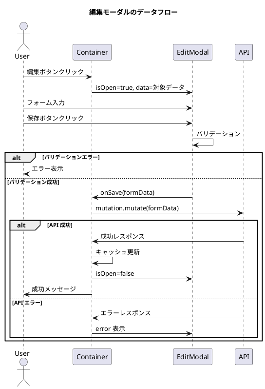

# 第6章: モーダル・フォームパターン

本章では、財務会計システムで使用するモーダルダイアログとフォームのパターンを解説します。編集モーダル、検索モーダル、選択モーダル、確認モーダルの設計と実装について説明します。

## 6.1 モーダルの基本設計

### 6.1.1 react-modal のセットアップ

本システムでは、アクセシビリティに配慮した `react-modal` を使用します。

**インストール**:

```bash
npm install react-modal
npm install --save-dev @types/react-modal
```

**アプリケーションルート要素の設定**（main.tsx で設定済み）:

```typescript
import Modal from 'react-modal';
Modal.setAppElement('#root');
```

### 6.1.2 基本モーダルコンポーネント

モーダルの基本スタイルとロジックを共通化します。

**src/views/common/BaseModal.tsx**:

```typescript
import React from 'react';
import Modal from 'react-modal';
import { FiX } from 'react-icons/fi';
import './BaseModal.css';

export type ModalSize = 'small' | 'medium' | 'large' | 'full';

interface Props {
  isOpen: boolean;
  onClose: () => void;
  title: string;
  size?: ModalSize;
  children: React.ReactNode;
  footer?: React.ReactNode;
  closeOnOverlayClick?: boolean;
  showCloseButton?: boolean;
}

const sizeClasses: Record<ModalSize, string> = {
  small: 'base-modal--small',
  medium: 'base-modal--medium',
  large: 'base-modal--large',
  full: 'base-modal--full',
};

export const BaseModal: React.FC<Props> = ({
  isOpen,
  onClose,
  title,
  size = 'medium',
  children,
  footer,
  closeOnOverlayClick = true,
  showCloseButton = true,
}) => {
  return (
    <Modal
      isOpen={isOpen}
      onRequestClose={onClose}
      shouldCloseOnOverlayClick={closeOnOverlayClick}
      className={`base-modal ${sizeClasses[size]}`}
      overlayClassName="base-modal__overlay"
      closeTimeoutMS={200}
    >
      <div className="base-modal__header">
        <h2 className="base-modal__title">{title}</h2>
        {showCloseButton && (
          <button
            className="base-modal__close"
            onClick={onClose}
            aria-label="閉じる"
          >
            <FiX />
          </button>
        )}
      </div>

      <div className="base-modal__body">{children}</div>

      {footer && <div className="base-modal__footer">{footer}</div>}
    </Modal>
  );
};
```

**src/views/common/BaseModal.css**:

```css
.base-modal__overlay {
  position: fixed;
  top: 0;
  left: 0;
  right: 0;
  bottom: 0;
  background-color: rgba(0, 0, 0, 0.5);
  display: flex;
  justify-content: center;
  align-items: center;
  z-index: 1000;
  opacity: 0;
  transition: opacity 200ms ease-in-out;
}

.base-modal__overlay--after-open {
  opacity: 1;
}

.base-modal__overlay--before-close {
  opacity: 0;
}

.base-modal {
  background: white;
  border-radius: 8px;
  box-shadow: 0 4px 20px rgba(0, 0, 0, 0.15);
  outline: none;
  display: flex;
  flex-direction: column;
  max-height: 90vh;
  transform: scale(0.95);
  transition: transform 200ms ease-in-out;
}

.ReactModal__Content--after-open.base-modal {
  transform: scale(1);
}

.ReactModal__Content--before-close.base-modal {
  transform: scale(0.95);
}

/* サイズバリエーション */
.base-modal--small {
  width: 400px;
}

.base-modal--medium {
  width: 600px;
}

.base-modal--large {
  width: 900px;
}

.base-modal--full {
  width: 95vw;
  height: 90vh;
}

.base-modal__header {
  display: flex;
  justify-content: space-between;
  align-items: center;
  padding: 16px 24px;
  border-bottom: 1px solid #e0e0e0;
}

.base-modal__title {
  margin: 0;
  font-size: 1.25rem;
  font-weight: 600;
}

.base-modal__close {
  background: none;
  border: none;
  padding: 8px;
  cursor: pointer;
  color: #666;
  border-radius: 4px;
  transition: background-color 0.2s;
}

.base-modal__close:hover {
  background-color: #f0f0f0;
}

.base-modal__body {
  flex: 1;
  padding: 24px;
  overflow-y: auto;
}

.base-modal__footer {
  display: flex;
  justify-content: flex-end;
  gap: 12px;
  padding: 16px 24px;
  border-top: 1px solid #e0e0e0;
}
```

---

## 6.2 編集モーダル

### 6.2.1 EditModal パターン

編集モーダルは、データの作成・更新を行うためのフォームを含むモーダルです。



### 6.2.2 汎用 EditModal コンポーネント

**src/views/common/EditModal.tsx**:

```typescript
import React from 'react';
import { BaseModal, ModalSize } from './BaseModal';
import { Button } from './Button';
import './EditModal.css';

interface Props {
  isOpen: boolean;
  onClose: () => void;
  onSave: () => void;
  title: string;
  size?: ModalSize;
  children: React.ReactNode;
  isSubmitting?: boolean;
  submitLabel?: string;
  cancelLabel?: string;
  isValid?: boolean;
}

export const EditModal: React.FC<Props> = ({
  isOpen,
  onClose,
  onSave,
  title,
  size = 'medium',
  children,
  isSubmitting = false,
  submitLabel = '保存',
  cancelLabel = 'キャンセル',
  isValid = true,
}) => {
  const handleSubmit = (e: React.FormEvent) => {
    e.preventDefault();
    if (isValid && !isSubmitting) {
      onSave();
    }
  };

  const footer = (
    <>
      <Button
        variant="secondary"
        onClick={onClose}
        disabled={isSubmitting}
      >
        {cancelLabel}
      </Button>
      <Button
        variant="primary"
        onClick={onSave}
        disabled={!isValid || isSubmitting}
        loading={isSubmitting}
      >
        {submitLabel}
      </Button>
    </>
  );

  return (
    <BaseModal
      isOpen={isOpen}
      onClose={onClose}
      title={title}
      size={size}
      footer={footer}
      closeOnOverlayClick={!isSubmitting}
    >
      <form onSubmit={handleSubmit} className="edit-modal__form">
        {children}
      </form>
    </BaseModal>
  );
};
```

### 6.2.3 フォームフィールドコンポーネント

**src/views/common/FormField.tsx**:

```typescript
import React from 'react';
import './FormField.css';

interface Props {
  label: string;
  htmlFor: string;
  required?: boolean;
  error?: string;
  hint?: string;
  children: React.ReactNode;
}

export const FormField: React.FC<Props> = ({
  label,
  htmlFor,
  required = false,
  error,
  hint,
  children,
}) => {
  return (
    <div className={`form-field ${error ? 'has-error' : ''}`}>
      <label htmlFor={htmlFor} className="form-field__label">
        {label}
        {required && <span className="form-field__required">*</span>}
      </label>
      <div className="form-field__control">{children}</div>
      {hint && !error && <p className="form-field__hint">{hint}</p>}
      {error && <p className="form-field__error">{error}</p>}
    </div>
  );
};
```

**src/views/common/FormField.css**:

```css
.form-field {
  margin-bottom: 20px;
}

.form-field__label {
  display: block;
  margin-bottom: 6px;
  font-weight: 500;
  color: #333;
}

.form-field__required {
  color: #d32f2f;
  margin-left: 4px;
}

.form-field__control input,
.form-field__control select,
.form-field__control textarea {
  width: 100%;
  padding: 10px 12px;
  border: 1px solid #ccc;
  border-radius: 4px;
  font-size: 1rem;
  transition: border-color 0.2s, box-shadow 0.2s;
}

.form-field__control input:focus,
.form-field__control select:focus,
.form-field__control textarea:focus {
  outline: none;
  border-color: #1a237e;
  box-shadow: 0 0 0 3px rgba(26, 35, 126, 0.1);
}

.form-field.has-error .form-field__control input,
.form-field.has-error .form-field__control select,
.form-field.has-error .form-field__control textarea {
  border-color: #d32f2f;
}

.form-field__hint {
  margin-top: 4px;
  font-size: 0.875rem;
  color: #666;
}

.form-field__error {
  margin-top: 4px;
  font-size: 0.875rem;
  color: #d32f2f;
}
```

### 6.2.4 フォーム状態管理フック

**src/hooks/useForm.ts**:

```typescript
import { useState, useCallback, useMemo } from 'react';

type ValidationRule<T> = {
  validate: (value: T[keyof T], formData: T) => boolean;
  message: string;
};

type ValidationRules<T> = {
  [K in keyof T]?: ValidationRule<T>[];
};

interface UseFormOptions<T> {
  initialValues: T;
  validationRules?: ValidationRules<T>;
  onSubmit?: (values: T) => void | Promise<void>;
}

interface UseFormResult<T> {
  values: T;
  errors: Partial<Record<keyof T, string>>;
  touched: Partial<Record<keyof T, boolean>>;
  isValid: boolean;
  isDirty: boolean;
  handleChange: (
    e: React.ChangeEvent<HTMLInputElement | HTMLSelectElement | HTMLTextAreaElement>
  ) => void;
  handleBlur: (
    e: React.FocusEvent<HTMLInputElement | HTMLSelectElement | HTMLTextAreaElement>
  ) => void;
  setValue: <K extends keyof T>(field: K, value: T[K]) => void;
  setValues: (values: Partial<T>) => void;
  setError: (field: keyof T, message: string) => void;
  clearErrors: () => void;
  reset: (newValues?: T) => void;
  validate: () => boolean;
  handleSubmit: (e?: React.FormEvent) => void;
}

export const useForm = <T extends Record<string, unknown>>({
  initialValues,
  validationRules = {},
  onSubmit,
}: UseFormOptions<T>): UseFormResult<T> => {
  const [values, setValuesState] = useState<T>(initialValues);
  const [errors, setErrors] = useState<Partial<Record<keyof T, string>>>({});
  const [touched, setTouched] = useState<Partial<Record<keyof T, boolean>>>({});

  // フィールドの検証
  const validateField = useCallback(
    (field: keyof T, value: T[keyof T]): string | undefined => {
      const rules = validationRules[field];
      if (!rules) return undefined;

      for (const rule of rules) {
        if (!rule.validate(value, values)) {
          return rule.message;
        }
      }
      return undefined;
    },
    [validationRules, values]
  );

  // 全フィールドの検証
  const validate = useCallback((): boolean => {
    const newErrors: Partial<Record<keyof T, string>> = {};
    let isValid = true;

    for (const field of Object.keys(values) as (keyof T)[]) {
      const error = validateField(field, values[field]);
      if (error) {
        newErrors[field] = error;
        isValid = false;
      }
    }

    setErrors(newErrors);
    return isValid;
  }, [values, validateField]);

  // 値の変更ハンドラ
  const handleChange = useCallback(
    (
      e: React.ChangeEvent<
        HTMLInputElement | HTMLSelectElement | HTMLTextAreaElement
      >
    ) => {
      const { name, value, type } = e.target;
      const newValue =
        type === 'checkbox' ? (e.target as HTMLInputElement).checked : value;

      setValuesState((prev) => ({ ...prev, [name]: newValue }));

      // タッチ済みフィールドの場合、即座に検証
      if (touched[name as keyof T]) {
        const error = validateField(name as keyof T, newValue as T[keyof T]);
        setErrors((prev) => ({
          ...prev,
          [name]: error,
        }));
      }
    },
    [touched, validateField]
  );

  // フォーカスアウトハンドラ
  const handleBlur = useCallback(
    (
      e: React.FocusEvent<
        HTMLInputElement | HTMLSelectElement | HTMLTextAreaElement
      >
    ) => {
      const { name } = e.target;
      setTouched((prev) => ({ ...prev, [name]: true }));

      const error = validateField(name as keyof T, values[name as keyof T]);
      setErrors((prev) => ({
        ...prev,
        [name]: error,
      }));
    },
    [values, validateField]
  );

  // 個別の値設定
  const setValue = useCallback(<K extends keyof T>(field: K, value: T[K]) => {
    setValuesState((prev) => ({ ...prev, [field]: value }));
  }, []);

  // 複数の値を一度に設定
  const setValues = useCallback((newValues: Partial<T>) => {
    setValuesState((prev) => ({ ...prev, ...newValues }));
  }, []);

  // エラーの設定
  const setError = useCallback((field: keyof T, message: string) => {
    setErrors((prev) => ({ ...prev, [field]: message }));
  }, []);

  // エラーのクリア
  const clearErrors = useCallback(() => {
    setErrors({});
  }, []);

  // フォームのリセット
  const reset = useCallback(
    (newValues?: T) => {
      setValuesState(newValues ?? initialValues);
      setErrors({});
      setTouched({});
    },
    [initialValues]
  );

  // 送信ハンドラ
  const handleSubmit = useCallback(
    (e?: React.FormEvent) => {
      e?.preventDefault();

      if (validate() && onSubmit) {
        onSubmit(values);
      }
    },
    [validate, onSubmit, values]
  );

  // バリデーション状態
  const isValid = useMemo(() => {
    return Object.keys(errors).every(
      (key) => !errors[key as keyof T]
    );
  }, [errors]);

  // 変更状態
  const isDirty = useMemo(() => {
    return JSON.stringify(values) !== JSON.stringify(initialValues);
  }, [values, initialValues]);

  return {
    values,
    errors,
    touched,
    isValid,
    isDirty,
    handleChange,
    handleBlur,
    setValue,
    setValues,
    setError,
    clearErrors,
    reset,
    validate,
    handleSubmit,
  };
};
```

### 6.2.5 勘定科目編集モーダルの実装例

**src/views/master/account/AccountEditModal.tsx**:

```typescript
import React, { useEffect } from 'react';
import { EditModal } from '@/views/common/EditModal';
import { FormField } from '@/views/common/FormField';
import { useForm } from '@/hooks/useForm';
import { AccountRequest, AccountResponse } from '@/api/model';

interface Props {
  isOpen: boolean;
  onClose: () => void;
  onSave: (data: AccountRequest) => void;
  account?: AccountResponse;
  isSubmitting: boolean;
}

// バリデーションルール
const validationRules = {
  accountCode: [
    {
      validate: (value: string) => !!value,
      message: '勘定科目コードは必須です',
    },
    {
      validate: (value: string) => /^\d{3,6}$/.test(value),
      message: '勘定科目コードは3〜6桁の数字です',
    },
  ],
  accountName: [
    {
      validate: (value: string) => !!value,
      message: '勘定科目名は必須です',
    },
    {
      validate: (value: string) => value.length <= 50,
      message: '勘定科目名は50文字以内です',
    },
  ],
};

const initialValues: AccountRequest = {
  accountCode: '',
  accountName: '',
  accountAbbr: '',
  accountKana: '',
  bsplType: 'B',
  debitCreditType: '借',
  elementType: '資産',
  displayOrder: 0,
};

export const AccountEditModal: React.FC<Props> = ({
  isOpen,
  onClose,
  onSave,
  account,
  isSubmitting,
}) => {
  const isEditMode = !!account;

  const {
    values,
    errors,
    handleChange,
    handleBlur,
    reset,
    validate,
  } = useForm<AccountRequest>({
    initialValues,
    validationRules,
  });

  // account が変更されたらフォームをリセット
  useEffect(() => {
    if (isOpen) {
      if (account) {
        reset({
          accountCode: account.accountCode,
          accountName: account.accountName,
          accountAbbr: account.accountAbbr ?? '',
          accountKana: account.accountKana ?? '',
          bsplType: account.bsplType,
          debitCreditType: account.debitCreditType,
          elementType: account.elementType,
          displayOrder: account.displayOrder,
        });
      } else {
        reset(initialValues);
      }
    }
  }, [isOpen, account, reset]);

  const handleSave = () => {
    if (validate()) {
      onSave(values);
    }
  };

  return (
    <EditModal
      isOpen={isOpen}
      onClose={onClose}
      onSave={handleSave}
      title={isEditMode ? '勘定科目編集' : '勘定科目登録'}
      isSubmitting={isSubmitting}
      submitLabel={isEditMode ? '更新' : '登録'}
    >
      <FormField
        label="勘定科目コード"
        htmlFor="accountCode"
        required
        error={errors.accountCode}
      >
        <input
          id="accountCode"
          name="accountCode"
          value={values.accountCode}
          onChange={handleChange}
          onBlur={handleBlur}
          disabled={isEditMode}
          placeholder="例: 111"
        />
      </FormField>

      <FormField
        label="勘定科目名"
        htmlFor="accountName"
        required
        error={errors.accountName}
      >
        <input
          id="accountName"
          name="accountName"
          value={values.accountName}
          onChange={handleChange}
          onBlur={handleBlur}
          placeholder="例: 現金預金"
        />
      </FormField>

      <div className="form-row">
        <FormField label="略称" htmlFor="accountAbbr">
          <input
            id="accountAbbr"
            name="accountAbbr"
            value={values.accountAbbr ?? ''}
            onChange={handleChange}
          />
        </FormField>

        <FormField label="カナ" htmlFor="accountKana">
          <input
            id="accountKana"
            name="accountKana"
            value={values.accountKana ?? ''}
            onChange={handleChange}
          />
        </FormField>
      </div>

      <div className="form-row">
        <FormField label="BS/PL区分" htmlFor="bsplType" required>
          <select
            id="bsplType"
            name="bsplType"
            value={values.bsplType}
            onChange={handleChange}
          >
            <option value="B">貸借対照表（B/S）</option>
            <option value="P">損益計算書（P/L）</option>
          </select>
        </FormField>

        <FormField label="貸借区分" htmlFor="debitCreditType" required>
          <select
            id="debitCreditType"
            name="debitCreditType"
            value={values.debitCreditType}
            onChange={handleChange}
          >
            <option value="借">借方</option>
            <option value="貸">貸方</option>
          </select>
        </FormField>
      </div>

      <FormField label="要素区分" htmlFor="elementType" required>
        <select
          id="elementType"
          name="elementType"
          value={values.elementType}
          onChange={handleChange}
        >
          <option value="資産">資産</option>
          <option value="負債">負債</option>
          <option value="純資産">純資産</option>
          <option value="収益">収益</option>
          <option value="費用">費用</option>
        </select>
      </FormField>

      <FormField
        label="表示順"
        htmlFor="displayOrder"
        hint="一覧表示時の並び順を指定します"
      >
        <input
          id="displayOrder"
          name="displayOrder"
          type="number"
          value={values.displayOrder ?? 0}
          onChange={handleChange}
          min={0}
        />
      </FormField>
    </EditModal>
  );
};
```

---

## 6.3 検索モーダル

### 6.3.1 SearchModal パターン

検索モーダルは、データの絞り込み条件を入力するためのモーダルです。

**src/views/common/SearchModal.tsx**:

```typescript
import React, { useState } from 'react';
import { BaseModal, ModalSize } from './BaseModal';
import { Button } from './Button';
import { FiSearch, FiX } from 'react-icons/fi';
import './SearchModal.css';

interface Props<T> {
  isOpen: boolean;
  onClose: () => void;
  onSearch: (criteria: T) => void;
  onClear: () => void;
  title?: string;
  size?: ModalSize;
  children: React.ReactNode;
  initialCriteria: T;
}

export function SearchModal<T>({
  isOpen,
  onClose,
  onSearch,
  onClear,
  title = '検索条件',
  size = 'medium',
  children,
  initialCriteria,
}: Props<T>): React.ReactElement {
  const handleSearch = () => {
    onSearch(initialCriteria);
    onClose();
  };

  const handleClear = () => {
    onClear();
  };

  const footer = (
    <>
      <Button variant="text" onClick={handleClear}>
        <FiX />
        条件クリア
      </Button>
      <div style={{ flex: 1 }} />
      <Button variant="secondary" onClick={onClose}>
        キャンセル
      </Button>
      <Button variant="primary" onClick={handleSearch}>
        <FiSearch />
        検索
      </Button>
    </>
  );

  return (
    <BaseModal
      isOpen={isOpen}
      onClose={onClose}
      title={title}
      size={size}
      footer={footer}
    >
      <div className="search-modal__form">{children}</div>
    </BaseModal>
  );
}
```

### 6.3.2 仕訳検索モーダルの実装例

**src/views/journal/JournalSearchModal.tsx**:

```typescript
import React from 'react';
import { SearchModal } from '@/views/common/SearchModal';
import { FormField } from '@/views/common/FormField';
import { AccountSelector } from '@/views/common/AccountSelector';
import { DateRangePicker } from '@/views/common/DateRangePicker';
import { useForm } from '@/hooks/useForm';
import './JournalSearchModal.css';

export interface JournalSearchCriteria {
  startDate?: string;
  endDate?: string;
  accountCode?: string;
  minAmount?: number;
  maxAmount?: number;
  description?: string;
  status?: 'draft' | 'pending' | 'approved' | '';
}

interface Props {
  isOpen: boolean;
  onClose: () => void;
  onSearch: (criteria: JournalSearchCriteria) => void;
  initialCriteria: JournalSearchCriteria;
}

const defaultCriteria: JournalSearchCriteria = {
  startDate: '',
  endDate: '',
  accountCode: '',
  minAmount: undefined,
  maxAmount: undefined,
  description: '',
  status: '',
};

export const JournalSearchModal: React.FC<Props> = ({
  isOpen,
  onClose,
  onSearch,
  initialCriteria,
}) => {
  const { values, handleChange, setValue, reset } =
    useForm<JournalSearchCriteria>({
      initialValues: initialCriteria,
    });

  const handleSearchClick = () => {
    // 空の値を除外
    const criteria = Object.fromEntries(
      Object.entries(values).filter(
        ([, value]) => value !== '' && value !== undefined
      )
    ) as JournalSearchCriteria;

    onSearch(criteria);
    onClose();
  };

  const handleClear = () => {
    reset(defaultCriteria);
  };

  return (
    <SearchModal
      isOpen={isOpen}
      onClose={onClose}
      onSearch={handleSearchClick}
      onClear={handleClear}
      title="仕訳検索"
      size="large"
      initialCriteria={values}
    >
      <div className="journal-search__section">
        <h3>期間</h3>
        <DateRangePicker
          startDate={values.startDate}
          endDate={values.endDate}
          onStartDateChange={(date) => setValue('startDate', date)}
          onEndDateChange={(date) => setValue('endDate', date)}
        />
      </div>

      <div className="journal-search__section">
        <h3>勘定科目</h3>
        <AccountSelector
          value={values.accountCode}
          onChange={(code) => setValue('accountCode', code)}
          placeholder="勘定科目を選択..."
        />
      </div>

      <div className="journal-search__section">
        <h3>金額</h3>
        <div className="journal-search__amount-range">
          <FormField label="最小金額" htmlFor="minAmount">
            <input
              id="minAmount"
              name="minAmount"
              type="number"
              value={values.minAmount ?? ''}
              onChange={handleChange}
              placeholder="0"
            />
          </FormField>
          <span className="journal-search__range-separator">〜</span>
          <FormField label="最大金額" htmlFor="maxAmount">
            <input
              id="maxAmount"
              name="maxAmount"
              type="number"
              value={values.maxAmount ?? ''}
              onChange={handleChange}
              placeholder="999,999,999"
            />
          </FormField>
        </div>
      </div>

      <div className="journal-search__section">
        <h3>摘要</h3>
        <FormField label="キーワード" htmlFor="description">
          <input
            id="description"
            name="description"
            value={values.description}
            onChange={handleChange}
            placeholder="摘要に含まれるキーワード"
          />
        </FormField>
      </div>

      <div className="journal-search__section">
        <h3>ステータス</h3>
        <FormField label="承認状態" htmlFor="status">
          <select
            id="status"
            name="status"
            value={values.status}
            onChange={handleChange}
          >
            <option value="">すべて</option>
            <option value="draft">下書き</option>
            <option value="pending">承認待ち</option>
            <option value="approved">承認済み</option>
          </select>
        </FormField>
      </div>
    </SearchModal>
  );
};
```

### 6.3.3 DateRangePicker コンポーネント

**src/views/common/DateRangePicker.tsx**:

```typescript
import React from 'react';
import './DateRangePicker.css';

interface Props {
  startDate?: string;
  endDate?: string;
  onStartDateChange: (date: string) => void;
  onEndDateChange: (date: string) => void;
  minDate?: string;
  maxDate?: string;
}

export const DateRangePicker: React.FC<Props> = ({
  startDate,
  endDate,
  onStartDateChange,
  onEndDateChange,
  minDate,
  maxDate,
}) => {
  return (
    <div className="date-range-picker">
      <div className="date-range-picker__field">
        <label htmlFor="startDate">開始日</label>
        <input
          id="startDate"
          type="date"
          value={startDate ?? ''}
          onChange={(e) => onStartDateChange(e.target.value)}
          min={minDate}
          max={endDate || maxDate}
        />
      </div>
      <span className="date-range-picker__separator">〜</span>
      <div className="date-range-picker__field">
        <label htmlFor="endDate">終了日</label>
        <input
          id="endDate"
          type="date"
          value={endDate ?? ''}
          onChange={(e) => onEndDateChange(e.target.value)}
          min={startDate || minDate}
          max={maxDate}
        />
      </div>
    </div>
  );
};
```

---

## 6.4 選択モーダル

### 6.4.1 SelectModal パターン

選択モーダルは、一覧から項目を選択するためのモーダルです。

**src/views/common/SelectModal.tsx**:

```typescript
import React, { useState, useMemo } from 'react';
import { BaseModal, ModalSize } from './BaseModal';
import { Button } from './Button';
import { FiSearch, FiCheck } from 'react-icons/fi';
import './SelectModal.css';

interface Props<T> {
  isOpen: boolean;
  onClose: () => void;
  onSelect: (item: T) => void;
  title: string;
  items: T[];
  selectedItem?: T;
  getItemKey: (item: T) => string;
  getItemLabel: (item: T) => string;
  getItemDescription?: (item: T) => string;
  searchable?: boolean;
  searchPlaceholder?: string;
  filterFn?: (item: T, query: string) => boolean;
  size?: ModalSize;
  loading?: boolean;
}

export function SelectModal<T>({
  isOpen,
  onClose,
  onSelect,
  title,
  items,
  selectedItem,
  getItemKey,
  getItemLabel,
  getItemDescription,
  searchable = true,
  searchPlaceholder = '検索...',
  filterFn,
  size = 'medium',
  loading = false,
}: Props<T>): React.ReactElement {
  const [searchQuery, setSearchQuery] = useState('');

  // フィルタリング
  const filteredItems = useMemo(() => {
    if (!searchQuery) return items;

    const defaultFilter = (item: T, query: string) =>
      getItemLabel(item).toLowerCase().includes(query.toLowerCase());

    const filter = filterFn || defaultFilter;
    return items.filter((item) => filter(item, searchQuery));
  }, [items, searchQuery, filterFn, getItemLabel]);

  const handleSelect = (item: T) => {
    onSelect(item);
    onClose();
  };

  return (
    <BaseModal
      isOpen={isOpen}
      onClose={onClose}
      title={title}
      size={size}
    >
      {searchable && (
        <div className="select-modal__search">
          <FiSearch className="select-modal__search-icon" />
          <input
            type="text"
            value={searchQuery}
            onChange={(e) => setSearchQuery(e.target.value)}
            placeholder={searchPlaceholder}
            className="select-modal__search-input"
          />
        </div>
      )}

      <div className="select-modal__list">
        {loading ? (
          <div className="select-modal__loading">読み込み中...</div>
        ) : filteredItems.length === 0 ? (
          <div className="select-modal__empty">
            該当する項目がありません
          </div>
        ) : (
          filteredItems.map((item) => {
            const key = getItemKey(item);
            const isSelected =
              selectedItem && getItemKey(selectedItem) === key;

            return (
              <button
                key={key}
                className={`select-modal__item ${
                  isSelected ? 'is-selected' : ''
                }`}
                onClick={() => handleSelect(item)}
              >
                <div className="select-modal__item-content">
                  <span className="select-modal__item-label">
                    {getItemLabel(item)}
                  </span>
                  {getItemDescription && (
                    <span className="select-modal__item-description">
                      {getItemDescription(item)}
                    </span>
                  )}
                </div>
                {isSelected && (
                  <FiCheck className="select-modal__item-check" />
                )}
              </button>
            );
          })
        )}
      </div>
    </BaseModal>
  );
}
```

### 6.4.2 勘定科目選択モーダルの実装

**src/views/common/AccountSelectModal.tsx**:

```typescript
import React, { useState, useMemo } from 'react';
import { BaseModal } from './BaseModal';
import { useGetAccounts } from '@/api/generated/account/account';
import { AccountResponse } from '@/api/model';
import { FiSearch, FiChevronRight, FiChevronDown } from 'react-icons/fi';
import './AccountSelectModal.css';

interface Props {
  isOpen: boolean;
  onClose: () => void;
  onSelect: (account: AccountResponse) => void;
  selectedAccountCode?: string;
  bsplFilter?: 'B' | 'P';
}

export const AccountSelectModal: React.FC<Props> = ({
  isOpen,
  onClose,
  onSelect,
  selectedAccountCode,
  bsplFilter,
}) => {
  const { data: accounts, isLoading } = useGetAccounts();
  const [searchQuery, setSearchQuery] = useState('');
  const [expandedTypes, setExpandedTypes] = useState<string[]>([
    '資産',
    '負債',
    '純資産',
    '収益',
    '費用',
  ]);

  // BS/PL フィルタと検索フィルタを適用
  const filteredAccounts = useMemo(() => {
    if (!accounts) return [];

    return accounts.filter((account) => {
      // BS/PL フィルタ
      if (bsplFilter && account.bsplType !== bsplFilter) {
        return false;
      }

      // 検索フィルタ
      if (searchQuery) {
        const query = searchQuery.toLowerCase();
        return (
          account.accountCode.includes(query) ||
          account.accountName.toLowerCase().includes(query) ||
          account.accountKana?.toLowerCase().includes(query)
        );
      }

      return true;
    });
  }, [accounts, bsplFilter, searchQuery]);

  // 要素区分でグループ化
  const groupedAccounts = useMemo(() => {
    const groups: Record<string, AccountResponse[]> = {
      資産: [],
      負債: [],
      純資産: [],
      収益: [],
      費用: [],
    };

    filteredAccounts.forEach((account) => {
      if (groups[account.elementType]) {
        groups[account.elementType].push(account);
      }
    });

    return groups;
  }, [filteredAccounts]);

  const toggleExpand = (type: string) => {
    setExpandedTypes((prev) =>
      prev.includes(type)
        ? prev.filter((t) => t !== type)
        : [...prev, type]
    );
  };

  const handleSelect = (account: AccountResponse) => {
    onSelect(account);
    onClose();
  };

  return (
    <BaseModal
      isOpen={isOpen}
      onClose={onClose}
      title="勘定科目選択"
      size="medium"
    >
      <div className="account-select__search">
        <FiSearch className="account-select__search-icon" />
        <input
          type="text"
          value={searchQuery}
          onChange={(e) => setSearchQuery(e.target.value)}
          placeholder="コード、名称、カナで検索..."
          className="account-select__search-input"
        />
      </div>

      {bsplFilter && (
        <div className="account-select__filter-badge">
          {bsplFilter === 'B' ? '貸借対照表科目' : '損益計算書科目'}
        </div>
      )}

      <div className="account-select__tree">
        {isLoading ? (
          <div className="account-select__loading">読み込み中...</div>
        ) : (
          Object.entries(groupedAccounts).map(([type, typeAccounts]) => {
            if (typeAccounts.length === 0) return null;

            const isExpanded = expandedTypes.includes(type);

            return (
              <div key={type} className="account-select__group">
                <button
                  className="account-select__group-header"
                  onClick={() => toggleExpand(type)}
                >
                  {isExpanded ? <FiChevronDown /> : <FiChevronRight />}
                  <span className="account-select__group-name">{type}</span>
                  <span className="account-select__group-count">
                    ({typeAccounts.length})
                  </span>
                </button>

                {isExpanded && (
                  <div className="account-select__group-items">
                    {typeAccounts.map((account) => (
                      <button
                        key={account.accountCode}
                        className={`account-select__item ${
                          account.accountCode === selectedAccountCode
                            ? 'is-selected'
                            : ''
                        }`}
                        onClick={() => handleSelect(account)}
                      >
                        <span className="account-select__item-code">
                          {account.accountCode}
                        </span>
                        <span className="account-select__item-name">
                          {account.accountName}
                        </span>
                        <span className="account-select__item-type">
                          {account.debitCreditType}方
                        </span>
                      </button>
                    ))}
                  </div>
                )}
              </div>
            );
          })
        )}
      </div>
    </BaseModal>
  );
};
```

---

## 6.5 確認モーダル

### 6.5.1 ConfirmModal パターン

確認モーダルは、重要な操作の前にユーザーの確認を求めるモーダルです。

**src/views/common/ConfirmModal.tsx**:

```typescript
import React from 'react';
import { BaseModal } from './BaseModal';
import { Button } from './Button';
import { FiAlertTriangle, FiInfo, FiAlertCircle } from 'react-icons/fi';
import './ConfirmModal.css';

type ConfirmType = 'info' | 'warning' | 'danger';

interface Props {
  isOpen: boolean;
  onClose: () => void;
  onConfirm: () => void;
  title: string;
  message: string | React.ReactNode;
  type?: ConfirmType;
  confirmLabel?: string;
  cancelLabel?: string;
  isLoading?: boolean;
}

const icons: Record<ConfirmType, React.ReactNode> = {
  info: <FiInfo />,
  warning: <FiAlertTriangle />,
  danger: <FiAlertCircle />,
};

const buttonVariants: Record<ConfirmType, 'primary' | 'warning' | 'danger'> = {
  info: 'primary',
  warning: 'warning',
  danger: 'danger',
};

export const ConfirmModal: React.FC<Props> = ({
  isOpen,
  onClose,
  onConfirm,
  title,
  message,
  type = 'info',
  confirmLabel = '確認',
  cancelLabel = 'キャンセル',
  isLoading = false,
}) => {
  const footer = (
    <>
      <Button variant="secondary" onClick={onClose} disabled={isLoading}>
        {cancelLabel}
      </Button>
      <Button
        variant={buttonVariants[type]}
        onClick={onConfirm}
        loading={isLoading}
      >
        {confirmLabel}
      </Button>
    </>
  );

  return (
    <BaseModal
      isOpen={isOpen}
      onClose={onClose}
      title={title}
      size="small"
      footer={footer}
      closeOnOverlayClick={!isLoading}
    >
      <div className={`confirm-modal__content is-${type}`}>
        <div className="confirm-modal__icon">{icons[type]}</div>
        <div className="confirm-modal__message">{message}</div>
      </div>
    </BaseModal>
  );
};
```

**src/views/common/ConfirmModal.css**:

```css
.confirm-modal__content {
  display: flex;
  flex-direction: column;
  align-items: center;
  text-align: center;
  padding: 20px 0;
}

.confirm-modal__icon {
  font-size: 48px;
  margin-bottom: 16px;
}

.confirm-modal__content.is-info .confirm-modal__icon {
  color: #1976d2;
}

.confirm-modal__content.is-warning .confirm-modal__icon {
  color: #f57c00;
}

.confirm-modal__content.is-danger .confirm-modal__icon {
  color: #d32f2f;
}

.confirm-modal__message {
  font-size: 1rem;
  color: #333;
  line-height: 1.6;
}
```

### 6.5.2 useConfirm フック

確認モーダルを簡単に使用するためのフックを実装します。

**src/hooks/useConfirm.ts**:

```typescript
import { useState, useCallback } from 'react';

interface ConfirmOptions {
  title: string;
  message: string | React.ReactNode;
  type?: 'info' | 'warning' | 'danger';
  confirmLabel?: string;
  cancelLabel?: string;
}

interface UseConfirmResult {
  isOpen: boolean;
  options: ConfirmOptions | null;
  confirm: (options: ConfirmOptions) => Promise<boolean>;
  handleConfirm: () => void;
  handleCancel: () => void;
}

export const useConfirm = (): UseConfirmResult => {
  const [isOpen, setIsOpen] = useState(false);
  const [options, setOptions] = useState<ConfirmOptions | null>(null);
  const [resolveRef, setResolveRef] = useState<
    ((value: boolean) => void) | null
  >(null);

  const confirm = useCallback((confirmOptions: ConfirmOptions) => {
    return new Promise<boolean>((resolve) => {
      setOptions(confirmOptions);
      setResolveRef(() => resolve);
      setIsOpen(true);
    });
  }, []);

  const handleConfirm = useCallback(() => {
    setIsOpen(false);
    resolveRef?.(true);
    setResolveRef(null);
    setOptions(null);
  }, [resolveRef]);

  const handleCancel = useCallback(() => {
    setIsOpen(false);
    resolveRef?.(false);
    setResolveRef(null);
    setOptions(null);
  }, [resolveRef]);

  return {
    isOpen,
    options,
    confirm,
    handleConfirm,
    handleCancel,
  };
};
```

### 6.5.3 使用例

```typescript
import React from 'react';
import { useConfirm } from '@/hooks/useConfirm';
import { ConfirmModal } from '@/views/common/ConfirmModal';
import { useDeleteAccount } from '@/api/generated/account/account';

export const AccountContainer: React.FC = () => {
  const deleteMutation = useDeleteAccount();
  const { isOpen, options, confirm, handleConfirm, handleCancel } =
    useConfirm();

  const handleDelete = async (accountCode: string, accountName: string) => {
    const confirmed = await confirm({
      title: '勘定科目の削除',
      message: (
        <>
          <p>以下の勘定科目を削除しますか？</p>
          <p>
            <strong>
              {accountCode}: {accountName}
            </strong>
          </p>
          <p className="text-warning">
            この操作は取り消せません。
          </p>
        </>
      ),
      type: 'danger',
      confirmLabel: '削除する',
    });

    if (confirmed) {
      deleteMutation.mutate({ accountCode });
    }
  };

  return (
    <>
      {/* コンポーネントの内容 */}

      {options && (
        <ConfirmModal
          isOpen={isOpen}
          onClose={handleCancel}
          onConfirm={handleConfirm}
          title={options.title}
          message={options.message}
          type={options.type}
          confirmLabel={options.confirmLabel}
          cancelLabel={options.cancelLabel}
        />
      )}
    </>
  );
};
```

### 6.5.4 仕訳承認確認モーダル

**src/views/journal/JournalApprovalConfirmModal.tsx**:

```typescript
import React from 'react';
import { ConfirmModal } from '@/views/common/ConfirmModal';
import { JournalEntryResponse } from '@/api/model';
import { MoneyDisplay } from '@/views/common/MoneyDisplay';
import { DateDisplay } from '@/views/common/DateDisplay';
import './JournalApprovalConfirmModal.css';

interface Props {
  isOpen: boolean;
  onClose: () => void;
  onConfirm: () => void;
  journal: JournalEntryResponse;
  action: 'approve' | 'reject';
  isLoading: boolean;
}

export const JournalApprovalConfirmModal: React.FC<Props> = ({
  isOpen,
  onClose,
  onConfirm,
  journal,
  action,
  isLoading,
}) => {
  const isApprove = action === 'approve';

  return (
    <ConfirmModal
      isOpen={isOpen}
      onClose={onClose}
      onConfirm={onConfirm}
      title={isApprove ? '仕訳の承認' : '仕訳の差戻し'}
      type={isApprove ? 'info' : 'warning'}
      confirmLabel={isApprove ? '承認する' : '差戻す'}
      isLoading={isLoading}
      message={
        <div className="journal-approval-confirm">
          <p>
            {isApprove
              ? '以下の仕訳を承認しますか？'
              : '以下の仕訳を差戻しますか？'}
          </p>

          <dl className="journal-approval-confirm__details">
            <dt>伝票番号</dt>
            <dd>{journal.slipNumber}</dd>

            <dt>伝票日付</dt>
            <dd>
              <DateDisplay date={journal.journalDate} format="long" />
            </dd>

            <dt>摘要</dt>
            <dd>{journal.description}</dd>

            <dt>金額</dt>
            <dd>
              <MoneyDisplay amount={journal.totalAmount} />
            </dd>
          </dl>

          {!isApprove && (
            <p className="journal-approval-confirm__warning">
              差戻された仕訳は、登録者による修正が必要になります。
            </p>
          )}
        </div>
      }
    />
  );
};
```

---

## 6.6 Button コンポーネント

モーダルで使用するボタンコンポーネントを実装します。

**src/views/common/Button.tsx**:

```typescript
import React from 'react';
import { ClipLoader } from 'react-spinners';
import './Button.css';

type ButtonVariant =
  | 'primary'
  | 'secondary'
  | 'danger'
  | 'warning'
  | 'text';

type ButtonSize = 'small' | 'medium' | 'large';

interface Props extends React.ButtonHTMLAttributes<HTMLButtonElement> {
  variant?: ButtonVariant;
  size?: ButtonSize;
  loading?: boolean;
  fullWidth?: boolean;
  children: React.ReactNode;
}

export const Button: React.FC<Props> = ({
  variant = 'primary',
  size = 'medium',
  loading = false,
  fullWidth = false,
  children,
  disabled,
  className = '',
  ...props
}) => {
  return (
    <button
      className={`button button--${variant} button--${size} ${
        fullWidth ? 'button--full-width' : ''
      } ${className}`}
      disabled={disabled || loading}
      {...props}
    >
      {loading && (
        <span className="button__loader">
          <ClipLoader
            size={size === 'small' ? 12 : size === 'large' ? 20 : 16}
            color="currentColor"
          />
        </span>
      )}
      <span className={`button__content ${loading ? 'is-loading' : ''}`}>
        {children}
      </span>
    </button>
  );
};
```

**src/views/common/Button.css**:

```css
.button {
  display: inline-flex;
  align-items: center;
  justify-content: center;
  gap: 8px;
  border: none;
  border-radius: 4px;
  font-weight: 500;
  cursor: pointer;
  transition: background-color 0.2s, opacity 0.2s;
}

.button:disabled {
  opacity: 0.6;
  cursor: not-allowed;
}

/* サイズ */
.button--small {
  padding: 6px 12px;
  font-size: 0.875rem;
}

.button--medium {
  padding: 10px 20px;
  font-size: 1rem;
}

.button--large {
  padding: 14px 28px;
  font-size: 1.125rem;
}

/* バリエーション */
.button--primary {
  background-color: #1a237e;
  color: white;
}

.button--primary:hover:not(:disabled) {
  background-color: #0d1757;
}

.button--secondary {
  background-color: #e0e0e0;
  color: #333;
}

.button--secondary:hover:not(:disabled) {
  background-color: #d0d0d0;
}

.button--danger {
  background-color: #d32f2f;
  color: white;
}

.button--danger:hover:not(:disabled) {
  background-color: #b71c1c;
}

.button--warning {
  background-color: #f57c00;
  color: white;
}

.button--warning:hover:not(:disabled) {
  background-color: #e65100;
}

.button--text {
  background-color: transparent;
  color: #1a237e;
}

.button--text:hover:not(:disabled) {
  background-color: rgba(26, 35, 126, 0.1);
}

.button--full-width {
  width: 100%;
}

/* ローディング状態 */
.button__loader {
  display: flex;
  align-items: center;
}

.button__content.is-loading {
  opacity: 0.7;
}
```

---

## 6.7 まとめ

本章では、財務会計システムで使用するモーダルとフォームのパターンを解説しました。

### 重要ポイント

1. **BaseModal**: 共通のスタイルとロジックを持つ基本モーダル
2. **EditModal**: データ作成・更新用のフォームモーダル
3. **SearchModal**: 検索条件入力用のモーダル
4. **SelectModal**: 一覧から選択するためのモーダル
5. **ConfirmModal**: 重要な操作の確認用モーダル
6. **useForm フック**: フォーム状態管理とバリデーション
7. **useConfirm フック**: 確認ダイアログの Promise ベース API

### 次章の内容

第7章では、財務会計特有の共通コンポーネントについて詳しく解説します。金額入力、勘定科目選択、仕訳明細入力、期間選択などのコンポーネントを扱います。
