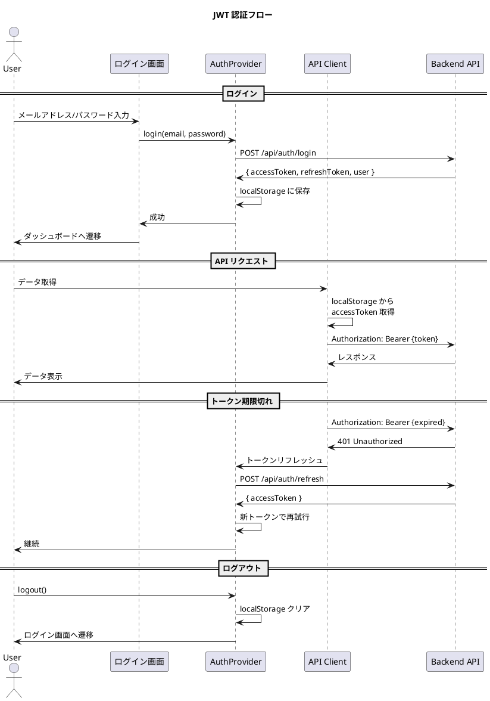

# 第8章: 認証・ユーザー管理

本章では、財務会計システムの認証機能とユーザー管理機能を実装します。JWT ベースの認証フロー、AuthProvider の詳細実装、ユーザー CRUD 機能について解説します。

## 8.1 認証フローの概要

### 8.1.1 認証アーキテクチャ

財務会計システムでは、JWT（JSON Web Token）を使用したトークンベース認証を採用します。



### 8.1.2 認証関連の型定義

**src/types/auth.ts**:

```typescript
// ユーザー情報
export interface User {
  id: string;
  email: string;
  name: string;
  roles: Role[];
  createdAt: string;
  updatedAt: string;
}

// ロール
export type Role = 'admin' | 'manager' | 'accountant' | 'auditor';

// ログインリクエスト
export interface LoginRequest {
  email: string;
  password: string;
}

// ログインレスポンス
export interface LoginResponse {
  accessToken: string;
  refreshToken: string;
  user: User;
  expiresIn: number;
}

// トークンリフレッシュレスポンス
export interface RefreshResponse {
  accessToken: string;
  expiresIn: number;
}

// 認証エラー
export interface AuthError {
  code: string;
  message: string;
}
```

---

## 8.2 ログイン画面の実装

### 8.2.1 LoginPage コンポーネント

**src/pages/LoginPage.tsx**:

```typescript
import React from 'react';
import { Navigate, useLocation } from 'react-router-dom';
import { useAuth } from '@/providers/AuthProvider';
import { LoginForm } from '@/views/auth/LoginForm';
import './LoginPage.css';

const LoginPage: React.FC = () => {
  const { isAuthenticated, isLoading } = useAuth();
  const location = useLocation();

  // ログイン済みの場合、元のページまたはダッシュボードへリダイレクト
  if (isAuthenticated) {
    const from = (location.state as { from?: Location })?.from?.pathname || '/dashboard';
    return <Navigate to={from} replace />;
  }

  if (isLoading) {
    return (
      <div className="login-page">
        <div className="login-page__loading">認証情報を確認中...</div>
      </div>
    );
  }

  return (
    <div className="login-page">
      <div className="login-page__container">
        <div className="login-page__header">
          <h1 className="login-page__title">財務会計システム</h1>
          <p className="login-page__subtitle">ログイン</p>
        </div>
        <LoginForm />
      </div>
    </div>
  );
};

export default LoginPage;
```

**src/pages/LoginPage.css**:

```css
.login-page {
  display: flex;
  justify-content: center;
  align-items: center;
  min-height: 100vh;
  background: linear-gradient(135deg, #1a237e 0%, #3949ab 100%);
}

.login-page__container {
  width: 100%;
  max-width: 400px;
  padding: 40px;
  background: white;
  border-radius: 8px;
  box-shadow: 0 4px 20px rgba(0, 0, 0, 0.15);
}

.login-page__header {
  text-align: center;
  margin-bottom: 32px;
}

.login-page__title {
  font-size: 1.5rem;
  font-weight: 700;
  color: #1a237e;
  margin: 0 0 8px 0;
}

.login-page__subtitle {
  font-size: 1rem;
  color: #666;
  margin: 0;
}

.login-page__loading {
  color: white;
  font-size: 1rem;
}
```

### 8.2.2 LoginForm コンポーネント

**src/views/auth/LoginForm.tsx**:

```typescript
import React, { useState } from 'react';
import { useAuth } from '@/providers/AuthProvider';
import { useForm } from '@/hooks/useForm';
import { FormField } from '@/views/common/FormField';
import { Button } from '@/views/common/Button';
import { FiMail, FiLock, FiAlertCircle } from 'react-icons/fi';
import './LoginForm.css';

interface LoginFormData {
  email: string;
  password: string;
}

const validationRules = {
  email: [
    {
      validate: (value: string) => !!value,
      message: 'メールアドレスを入力してください',
    },
    {
      validate: (value: string) => /^[^\s@]+@[^\s@]+\.[^\s@]+$/.test(value),
      message: '有効なメールアドレスを入力してください',
    },
  ],
  password: [
    {
      validate: (value: string) => !!value,
      message: 'パスワードを入力してください',
    },
    {
      validate: (value: string) => value.length >= 8,
      message: 'パスワードは8文字以上です',
    },
  ],
};

export const LoginForm: React.FC = () => {
  const { login } = useAuth();
  const [isSubmitting, setIsSubmitting] = useState(false);
  const [loginError, setLoginError] = useState<string | null>(null);

  const { values, errors, handleChange, handleBlur, validate } =
    useForm<LoginFormData>({
      initialValues: {
        email: '',
        password: '',
      },
      validationRules,
    });

  const handleSubmit = async (e: React.FormEvent) => {
    e.preventDefault();
    setLoginError(null);

    if (!validate()) {
      return;
    }

    setIsSubmitting(true);

    try {
      await login(values.email, values.password);
      // ログイン成功後、AuthProvider がリダイレクトを処理
    } catch (error) {
      if (error instanceof Error) {
        setLoginError(error.message);
      } else {
        setLoginError('ログインに失敗しました');
      }
    } finally {
      setIsSubmitting(false);
    }
  };

  return (
    <form className="login-form" onSubmit={handleSubmit}>
      {loginError && (
        <div className="login-form__error">
          <FiAlertCircle />
          <span>{loginError}</span>
        </div>
      )}

      <FormField
        label="メールアドレス"
        htmlFor="email"
        required
        error={errors.email}
      >
        <div className="login-form__input-wrapper">
          <FiMail className="login-form__input-icon" />
          <input
            id="email"
            name="email"
            type="email"
            value={values.email}
            onChange={handleChange}
            onBlur={handleBlur}
            placeholder="example@company.com"
            autoComplete="email"
            disabled={isSubmitting}
          />
        </div>
      </FormField>

      <FormField
        label="パスワード"
        htmlFor="password"
        required
        error={errors.password}
      >
        <div className="login-form__input-wrapper">
          <FiLock className="login-form__input-icon" />
          <input
            id="password"
            name="password"
            type="password"
            value={values.password}
            onChange={handleChange}
            onBlur={handleBlur}
            placeholder="パスワードを入力"
            autoComplete="current-password"
            disabled={isSubmitting}
          />
        </div>
      </FormField>

      <Button
        type="submit"
        variant="primary"
        fullWidth
        loading={isSubmitting}
        disabled={isSubmitting}
      >
        ログイン
      </Button>
    </form>
  );
};
```

**src/views/auth/LoginForm.css**:

```css
.login-form__error {
  display: flex;
  align-items: center;
  gap: 8px;
  padding: 12px 16px;
  margin-bottom: 24px;
  background-color: #ffebee;
  border: 1px solid #ffcdd2;
  border-radius: 4px;
  color: #c62828;
  font-size: 0.875rem;
}

.login-form__input-wrapper {
  position: relative;
}

.login-form__input-icon {
  position: absolute;
  left: 12px;
  top: 50%;
  transform: translateY(-50%);
  color: #999;
}

.login-form__input-wrapper input {
  width: 100%;
  padding: 12px 12px 12px 40px;
  border: 1px solid #ccc;
  border-radius: 4px;
  font-size: 1rem;
  transition: border-color 0.2s, box-shadow 0.2s;
}

.login-form__input-wrapper input:focus {
  outline: none;
  border-color: #1a237e;
  box-shadow: 0 0 0 3px rgba(26, 35, 126, 0.1);
}

.login-form__input-wrapper input:disabled {
  background-color: #f5f5f5;
}
```

---

## 8.3 AuthProvider の詳細実装

### 8.3.1 完全版 AuthProvider

**src/providers/AuthProvider.tsx**:

```typescript
import React, {
  createContext,
  useContext,
  useState,
  useEffect,
  useCallback,
  useRef,
} from 'react';
import { useQueryClient } from '@tanstack/react-query';
import { User, Role, LoginResponse, RefreshResponse } from '@/types/auth';
import { axiosInstance } from '@/api/axios-instance';

interface AuthContextType {
  user: User | null;
  isAuthenticated: boolean;
  isLoading: boolean;
  login: (email: string, password: string) => Promise<void>;
  logout: () => void;
  hasRole: (role: Role) => boolean;
  hasAnyRole: (roles: Role[]) => boolean;
  refreshToken: () => Promise<void>;
}

const AuthContext = createContext<AuthContextType | undefined>(undefined);

// トークンストレージキー
const ACCESS_TOKEN_KEY = 'accessToken';
const REFRESH_TOKEN_KEY = 'refreshToken';
const USER_KEY = 'user';

// JWT ペイロードのデコード
const decodeJwtPayload = (token: string): { exp: number; sub: string } | null => {
  try {
    const base64Url = token.split('.')[1];
    const base64 = base64Url.replace(/-/g, '+').replace(/_/g, '/');
    const payload = JSON.parse(window.atob(base64));
    return payload;
  } catch {
    return null;
  }
};

// トークンの有効期限チェック
const isTokenExpired = (token: string, bufferSeconds = 60): boolean => {
  const payload = decodeJwtPayload(token);
  if (!payload) return true;

  const expirationTime = payload.exp * 1000;
  const currentTime = Date.now();
  const bufferTime = bufferSeconds * 1000;

  return currentTime >= expirationTime - bufferTime;
};

export const AuthProvider: React.FC<{ children: React.ReactNode }> = ({
  children,
}) => {
  const [user, setUser] = useState<User | null>(null);
  const [isLoading, setIsLoading] = useState(true);
  const queryClient = useQueryClient();
  const refreshPromiseRef = useRef<Promise<void> | null>(null);

  // ストレージからの認証情報読み込み
  const loadAuthFromStorage = useCallback(() => {
    const accessToken = localStorage.getItem(ACCESS_TOKEN_KEY);
    const savedUser = localStorage.getItem(USER_KEY);

    if (!accessToken || !savedUser) {
      return null;
    }

    // トークンの有効期限チェック
    if (isTokenExpired(accessToken)) {
      return null;
    }

    try {
      return JSON.parse(savedUser) as User;
    } catch {
      return null;
    }
  }, []);

  // 認証情報の保存
  const saveAuthToStorage = useCallback(
    (accessToken: string, refreshToken: string, userData: User) => {
      localStorage.setItem(ACCESS_TOKEN_KEY, accessToken);
      localStorage.setItem(REFRESH_TOKEN_KEY, refreshToken);
      localStorage.setItem(USER_KEY, JSON.stringify(userData));
    },
    []
  );

  // 認証情報のクリア
  const clearAuthStorage = useCallback(() => {
    localStorage.removeItem(ACCESS_TOKEN_KEY);
    localStorage.removeItem(REFRESH_TOKEN_KEY);
    localStorage.removeItem(USER_KEY);
  }, []);

  // 初期化
  useEffect(() => {
    const initialize = async () => {
      const savedUser = loadAuthFromStorage();

      if (savedUser) {
        setUser(savedUser);
      } else {
        // リフレッシュトークンがあれば再認証を試みる
        const refreshTokenValue = localStorage.getItem(REFRESH_TOKEN_KEY);
        if (refreshTokenValue) {
          try {
            await refreshTokenInternal();
          } catch {
            clearAuthStorage();
          }
        }
      }

      setIsLoading(false);
    };

    initialize();
  }, [loadAuthFromStorage, clearAuthStorage]);

  // トークンリフレッシュ（内部用）
  const refreshTokenInternal = useCallback(async () => {
    const refreshTokenValue = localStorage.getItem(REFRESH_TOKEN_KEY);
    if (!refreshTokenValue) {
      throw new Error('No refresh token');
    }

    const response = await axiosInstance.post<RefreshResponse>(
      '/api/auth/refresh',
      { refreshToken: refreshTokenValue }
    );

    const { accessToken } = response.data;
    localStorage.setItem(ACCESS_TOKEN_KEY, accessToken);

    // ユーザー情報を再取得
    const userResponse = await axiosInstance.get<User>('/api/auth/me');
    setUser(userResponse.data);
    localStorage.setItem(USER_KEY, JSON.stringify(userResponse.data));
  }, []);

  // トークンリフレッシュ（重複防止）
  const refreshToken = useCallback(async () => {
    // 既にリフレッシュ中なら、その Promise を返す
    if (refreshPromiseRef.current) {
      return refreshPromiseRef.current;
    }

    refreshPromiseRef.current = refreshTokenInternal().finally(() => {
      refreshPromiseRef.current = null;
    });

    return refreshPromiseRef.current;
  }, [refreshTokenInternal]);

  // ログイン
  const login = useCallback(
    async (email: string, password: string) => {
      const response = await axiosInstance.post<LoginResponse>(
        '/api/auth/login',
        { email, password }
      );

      const { accessToken, refreshToken: newRefreshToken, user: userData } =
        response.data;

      saveAuthToStorage(accessToken, newRefreshToken, userData);
      setUser(userData);

      // キャッシュをクリア（他ユーザーのデータが残らないように）
      queryClient.clear();
    },
    [saveAuthToStorage, queryClient]
  );

  // ログアウト
  const logout = useCallback(() => {
    // サーバーにログアウトを通知（オプション）
    const accessToken = localStorage.getItem(ACCESS_TOKEN_KEY);
    if (accessToken) {
      axiosInstance
        .post('/api/auth/logout')
        .catch(() => {
          // エラーは無視
        });
    }

    clearAuthStorage();
    setUser(null);
    queryClient.clear();

    // ログインページへリダイレクト
    window.location.href = '/login';
  }, [clearAuthStorage, queryClient]);

  // ロールチェック
  const hasRole = useCallback(
    (role: Role): boolean => {
      if (!user) return false;
      // admin は全ロールを持つとみなす
      if (user.roles.includes('admin')) return true;
      return user.roles.includes(role);
    },
    [user]
  );

  // 複数ロールのいずれかを持つかチェック
  const hasAnyRole = useCallback(
    (roles: Role[]): boolean => {
      return roles.some((role) => hasRole(role));
    },
    [hasRole]
  );

  return (
    <AuthContext.Provider
      value={{
        user,
        isAuthenticated: !!user,
        isLoading,
        login,
        logout,
        hasRole,
        hasAnyRole,
        refreshToken,
      }}
    >
      {children}
    </AuthContext.Provider>
  );
};

export const useAuth = () => {
  const context = useContext(AuthContext);
  if (context === undefined) {
    throw new Error('useAuth must be used within an AuthProvider');
  }
  return context;
};
```

### 8.3.2 Axios インターセプターとの連携

**src/api/axios-instance.ts**（トークンリフレッシュ対応版）:

```typescript
import axios, { AxiosError, AxiosRequestConfig, InternalAxiosRequestConfig } from 'axios';

// Axios インスタンスの作成
export const axiosInstance = axios.create({
  baseURL: import.meta.env.VITE_API_BASE_URL || '/api',
  timeout: 30000,
  headers: {
    'Content-Type': 'application/json',
  },
});

// リフレッシュ中のフラグとキュー
let isRefreshing = false;
let refreshSubscribers: ((token: string) => void)[] = [];

// リフレッシュ完了時にキューを処理
const onRefreshed = (token: string) => {
  refreshSubscribers.forEach((callback) => callback(token));
  refreshSubscribers = [];
};

// リフレッシュ待ちキューに追加
const addRefreshSubscriber = (callback: (token: string) => void) => {
  refreshSubscribers.push(callback);
};

// リクエストインターセプター
axiosInstance.interceptors.request.use(
  (config: InternalAxiosRequestConfig) => {
    const token = localStorage.getItem('accessToken');
    if (token && config.headers) {
      config.headers.Authorization = `Bearer ${token}`;
    }
    return config;
  },
  (error) => {
    return Promise.reject(error);
  }
);

// レスポンスインターセプター
axiosInstance.interceptors.response.use(
  (response) => response,
  async (error: AxiosError) => {
    const originalRequest = error.config as InternalAxiosRequestConfig & {
      _retry?: boolean;
    };

    // 401 エラーかつリトライ前の場合
    if (error.response?.status === 401 && !originalRequest._retry) {
      // ログインエンドポイントは除外
      if (originalRequest.url?.includes('/auth/login')) {
        return Promise.reject(error);
      }

      // 既にリフレッシュ中の場合、キューに追加
      if (isRefreshing) {
        return new Promise((resolve) => {
          addRefreshSubscriber((token: string) => {
            originalRequest.headers.Authorization = `Bearer ${token}`;
            resolve(axiosInstance(originalRequest));
          });
        });
      }

      originalRequest._retry = true;
      isRefreshing = true;

      try {
        const refreshToken = localStorage.getItem('refreshToken');
        if (!refreshToken) {
          throw new Error('No refresh token');
        }

        const response = await axios.post(
          `${import.meta.env.VITE_API_BASE_URL || '/api'}/auth/refresh`,
          { refreshToken }
        );

        const { accessToken } = response.data;
        localStorage.setItem('accessToken', accessToken);

        // キューの処理
        onRefreshed(accessToken);

        // 元のリクエストを再試行
        originalRequest.headers.Authorization = `Bearer ${accessToken}`;
        return axiosInstance(originalRequest);
      } catch (refreshError) {
        // リフレッシュ失敗時はログアウト
        localStorage.removeItem('accessToken');
        localStorage.removeItem('refreshToken');
        localStorage.removeItem('user');
        window.location.href = '/login';
        return Promise.reject(refreshError);
      } finally {
        isRefreshing = false;
      }
    }

    return Promise.reject(error);
  }
);

// Orval 用のカスタムインスタンス
export const customInstance = <T>(
  config: AxiosRequestConfig,
  options?: AxiosRequestConfig
): Promise<T> => {
  const source = axios.CancelToken.source();

  const promise = axiosInstance({
    ...config,
    ...options,
    cancelToken: source.token,
  }).then(({ data }) => data);

  // @ts-expect-error cancel property
  promise.cancel = () => {
    source.cancel('Query was cancelled');
  };

  return promise;
};

export default customInstance;
```

---

## 8.4 ユーザー管理機能

### 8.4.1 ユーザー管理の Container

**src/components/master/user/UserContainer.tsx**:

```typescript
import React, { useState, useCallback } from 'react';
import { useQueryClient } from '@tanstack/react-query';
import {
  useGetUsers,
  useCreateUser,
  useUpdateUser,
  useDeleteUser,
  getGetUsersQueryKey,
} from '@/api/generated/user/user';
import { UserRequest, UserResponse } from '@/api/model';
import { UserCollection } from '@/views/master/user/UserCollection';
import { UserSingle } from '@/views/master/user/UserSingle';
import { UserEditModal } from '@/views/master/user/UserEditModal';
import { Loading } from '@/views/common/Loading';
import { ErrorMessage } from '@/views/common/ErrorMessage';
import { useConfirm } from '@/hooks/useConfirm';
import { ConfirmModal } from '@/views/common/ConfirmModal';
import { useMessage } from '@/providers/MessageProvider';
import './UserContainer.css';

type ModalMode = 'closed' | 'create' | 'edit';

export const UserContainer: React.FC = () => {
  const queryClient = useQueryClient();
  const { showMessage } = useMessage();
  const { isOpen, options, confirm, handleConfirm, handleCancel } = useConfirm();

  // API hooks
  const { data: users, isLoading, error, refetch } = useGetUsers();
  const createMutation = useCreateUser();
  const updateMutation = useUpdateUser();
  const deleteMutation = useDeleteUser();

  // ローカル状態
  const [modalMode, setModalMode] = useState<ModalMode>('closed');
  const [selectedUser, setSelectedUser] = useState<UserResponse | null>(null);

  // ユーザー選択
  const handleSelect = useCallback((user: UserResponse) => {
    setSelectedUser(user);
  }, []);

  // 新規作成モーダルを開く
  const handleCreateClick = useCallback(() => {
    setSelectedUser(null);
    setModalMode('create');
  }, []);

  // 編集モーダルを開く
  const handleEditClick = useCallback(() => {
    setModalMode('edit');
  }, []);

  // モーダルを閉じる
  const handleModalClose = useCallback(() => {
    setModalMode('closed');
  }, []);

  // 保存処理
  const handleSave = useCallback(
    (data: UserRequest) => {
      const onSuccess = () => {
        queryClient.invalidateQueries({ queryKey: getGetUsersQueryKey() });
        setModalMode('closed');
        showMessage(
          'success',
          modalMode === 'create'
            ? 'ユーザーを登録しました'
            : 'ユーザーを更新しました'
        );
      };

      if (modalMode === 'create') {
        createMutation.mutate({ data }, { onSuccess });
      } else if (modalMode === 'edit' && selectedUser) {
        updateMutation.mutate(
          { userId: selectedUser.id, data },
          { onSuccess }
        );
      }
    },
    [
      modalMode,
      selectedUser,
      createMutation,
      updateMutation,
      queryClient,
      showMessage,
    ]
  );

  // 削除処理
  const handleDelete = useCallback(
    async (user: UserResponse) => {
      const confirmed = await confirm({
        title: 'ユーザーの削除',
        message: (
          <>
            <p>以下のユーザーを削除しますか？</p>
            <p>
              <strong>{user.name}</strong>（{user.email}）
            </p>
            <p className="text-warning">この操作は取り消せません。</p>
          </>
        ),
        type: 'danger',
        confirmLabel: '削除する',
      });

      if (confirmed) {
        deleteMutation.mutate(
          { userId: user.id },
          {
            onSuccess: () => {
              queryClient.invalidateQueries({ queryKey: getGetUsersQueryKey() });
              if (selectedUser?.id === user.id) {
                setSelectedUser(null);
              }
              showMessage('success', 'ユーザーを削除しました');
            },
          }
        );
      }
    },
    [confirm, deleteMutation, queryClient, selectedUser, showMessage]
  );

  if (isLoading) {
    return <Loading message="ユーザーを読み込み中..." />;
  }

  if (error) {
    return <ErrorMessage error={error} onRetry={() => refetch()} />;
  }

  return (
    <div className="user-container">
      <div className="user-container__list">
        <UserCollection
          users={users ?? []}
          selectedUserId={selectedUser?.id}
          onSelect={handleSelect}
          onCreate={handleCreateClick}
        />
      </div>

      {selectedUser && (
        <div className="user-container__detail">
          <UserSingle
            user={selectedUser}
            onEdit={handleEditClick}
            onDelete={() => handleDelete(selectedUser)}
          />
        </div>
      )}

      {modalMode !== 'closed' && (
        <UserEditModal
          isOpen
          onClose={handleModalClose}
          onSave={handleSave}
          user={modalMode === 'edit' ? selectedUser : undefined}
          isSubmitting={createMutation.isPending || updateMutation.isPending}
        />
      )}

      {options && (
        <ConfirmModal
          isOpen={isOpen}
          onClose={handleCancel}
          onConfirm={handleConfirm}
          title={options.title}
          message={options.message}
          type={options.type}
          confirmLabel={options.confirmLabel}
          isLoading={deleteMutation.isPending}
        />
      )}
    </div>
  );
};
```

### 8.4.2 ユーザー一覧 View

**src/views/master/user/UserCollection.tsx**:

```typescript
import React from 'react';
import { UserResponse } from '@/api/model';
import { ROLE_LABELS, Role } from '@/constants/roles';
import { FiUser, FiPlus } from 'react-icons/fi';
import './UserCollection.css';

interface Props {
  users: UserResponse[];
  selectedUserId?: string;
  onSelect: (user: UserResponse) => void;
  onCreate: () => void;
}

export const UserCollection: React.FC<Props> = ({
  users,
  selectedUserId,
  onSelect,
  onCreate,
}) => {
  return (
    <div className="user-collection">
      <div className="user-collection__header">
        <h2>ユーザー一覧</h2>
        <button className="user-collection__create" onClick={onCreate}>
          <FiPlus />
          新規作成
        </button>
      </div>

      <div className="user-collection__list">
        {users.length === 0 ? (
          <div className="user-collection__empty">
            ユーザーが登録されていません
          </div>
        ) : (
          users.map((user) => (
            <button
              key={user.id}
              className={`user-collection__item ${
                user.id === selectedUserId ? 'is-selected' : ''
              }`}
              onClick={() => onSelect(user)}
            >
              <div className="user-collection__avatar">
                <FiUser />
              </div>
              <div className="user-collection__info">
                <span className="user-collection__name">{user.name}</span>
                <span className="user-collection__email">{user.email}</span>
              </div>
              <div className="user-collection__roles">
                {user.roles.map((role) => (
                  <span key={role} className={`user-collection__role is-${role}`}>
                    {ROLE_LABELS[role as Role] || role}
                  </span>
                ))}
              </div>
            </button>
          ))
        )}
      </div>
    </div>
  );
};
```

### 8.4.3 ユーザー詳細 View

**src/views/master/user/UserSingle.tsx**:

```typescript
import React from 'react';
import { UserResponse } from '@/api/model';
import { ROLE_LABELS, Role } from '@/constants/roles';
import { DateDisplay } from '@/views/common/DateDisplay';
import { FiEdit2, FiTrash2 } from 'react-icons/fi';
import './UserSingle.css';

interface Props {
  user: UserResponse;
  onEdit: () => void;
  onDelete: () => void;
}

export const UserSingle: React.FC<Props> = ({ user, onEdit, onDelete }) => {
  return (
    <div className="user-single">
      <div className="user-single__header">
        <h2>{user.name}</h2>
        <div className="user-single__actions">
          <button className="user-single__edit" onClick={onEdit}>
            <FiEdit2 />
            編集
          </button>
          <button className="user-single__delete" onClick={onDelete}>
            <FiTrash2 />
            削除
          </button>
        </div>
      </div>

      <dl className="user-single__details">
        <div className="user-single__row">
          <dt>ユーザー ID</dt>
          <dd>{user.id}</dd>
        </div>
        <div className="user-single__row">
          <dt>メールアドレス</dt>
          <dd>{user.email}</dd>
        </div>
        <div className="user-single__row">
          <dt>名前</dt>
          <dd>{user.name}</dd>
        </div>
        <div className="user-single__row">
          <dt>ロール</dt>
          <dd>
            <div className="user-single__roles">
              {user.roles.map((role) => (
                <span key={role} className={`user-single__role is-${role}`}>
                  {ROLE_LABELS[role as Role] || role}
                </span>
              ))}
            </div>
          </dd>
        </div>
        <div className="user-single__row">
          <dt>作成日時</dt>
          <dd>
            <DateDisplay date={user.createdAt} format="full" />
          </dd>
        </div>
        <div className="user-single__row">
          <dt>更新日時</dt>
          <dd>
            <DateDisplay date={user.updatedAt} format="full" />
          </dd>
        </div>
      </dl>
    </div>
  );
};
```

### 8.4.4 ユーザー編集モーダル

**src/views/master/user/UserEditModal.tsx**:

```typescript
import React, { useEffect } from 'react';
import { EditModal } from '@/views/common/EditModal';
import { FormField } from '@/views/common/FormField';
import { useForm } from '@/hooks/useForm';
import { UserRequest, UserResponse } from '@/api/model';
import { ROLES, ROLE_LABELS, Role } from '@/constants/roles';
import './UserEditModal.css';

interface Props {
  isOpen: boolean;
  onClose: () => void;
  onSave: (data: UserRequest) => void;
  user?: UserResponse | null;
  isSubmitting: boolean;
}

interface FormData extends UserRequest {
  confirmPassword: string;
}

const validationRules = {
  email: [
    {
      validate: (value: string) => !!value,
      message: 'メールアドレスは必須です',
    },
    {
      validate: (value: string) => /^[^\s@]+@[^\s@]+\.[^\s@]+$/.test(value),
      message: '有効なメールアドレスを入力してください',
    },
  ],
  name: [
    {
      validate: (value: string) => !!value,
      message: '名前は必須です',
    },
  ],
  password: [
    {
      validate: (value: string, formData: FormData) => {
        // 編集時はパスワード未入力でも OK
        if (formData.confirmPassword === undefined) return true;
        return !value || value.length >= 8;
      },
      message: 'パスワードは8文字以上です',
    },
  ],
  confirmPassword: [
    {
      validate: (value: string, formData: FormData) => {
        if (!formData.password) return true;
        return value === formData.password;
      },
      message: 'パスワードが一致しません',
    },
  ],
  roles: [
    {
      validate: (value: string[]) => value && value.length > 0,
      message: '少なくとも1つのロールを選択してください',
    },
  ],
};

const initialValues: FormData = {
  email: '',
  name: '',
  password: '',
  confirmPassword: '',
  roles: ['accountant'],
};

export const UserEditModal: React.FC<Props> = ({
  isOpen,
  onClose,
  onSave,
  user,
  isSubmitting,
}) => {
  const isEditMode = !!user;

  const { values, errors, handleChange, handleBlur, setValue, reset, validate } =
    useForm<FormData>({
      initialValues,
      validationRules,
    });

  // user が変更されたらフォームをリセット
  useEffect(() => {
    if (isOpen) {
      if (user) {
        reset({
          email: user.email,
          name: user.name,
          password: '',
          confirmPassword: '',
          roles: user.roles,
        });
      } else {
        reset(initialValues);
      }
    }
  }, [isOpen, user, reset]);

  const handleRoleChange = (role: Role, checked: boolean) => {
    const newRoles = checked
      ? [...values.roles, role]
      : values.roles.filter((r) => r !== role);
    setValue('roles', newRoles);
  };

  const handleSave = () => {
    if (validate()) {
      const { confirmPassword, ...data } = values;
      // 編集モードでパスワードが空の場合は送信しない
      if (isEditMode && !data.password) {
        delete data.password;
      }
      onSave(data);
    }
  };

  return (
    <EditModal
      isOpen={isOpen}
      onClose={onClose}
      onSave={handleSave}
      title={isEditMode ? 'ユーザー編集' : 'ユーザー登録'}
      isSubmitting={isSubmitting}
      submitLabel={isEditMode ? '更新' : '登録'}
    >
      <FormField
        label="メールアドレス"
        htmlFor="email"
        required
        error={errors.email}
      >
        <input
          id="email"
          name="email"
          type="email"
          value={values.email}
          onChange={handleChange}
          onBlur={handleBlur}
          placeholder="example@company.com"
        />
      </FormField>

      <FormField label="名前" htmlFor="name" required error={errors.name}>
        <input
          id="name"
          name="name"
          value={values.name}
          onChange={handleChange}
          onBlur={handleBlur}
          placeholder="山田 太郎"
        />
      </FormField>

      <FormField
        label={isEditMode ? 'パスワード（変更する場合のみ）' : 'パスワード'}
        htmlFor="password"
        required={!isEditMode}
        error={errors.password}
      >
        <input
          id="password"
          name="password"
          type="password"
          value={values.password}
          onChange={handleChange}
          onBlur={handleBlur}
          placeholder="8文字以上"
        />
      </FormField>

      {values.password && (
        <FormField
          label="パスワード（確認）"
          htmlFor="confirmPassword"
          required
          error={errors.confirmPassword}
        >
          <input
            id="confirmPassword"
            name="confirmPassword"
            type="password"
            value={values.confirmPassword}
            onChange={handleChange}
            onBlur={handleBlur}
          />
        </FormField>
      )}

      <FormField label="ロール" htmlFor="roles" required error={errors.roles}>
        <div className="user-edit-modal__roles">
          {Object.entries(ROLES).map(([key, role]) => (
            <label key={role} className="user-edit-modal__role-option">
              <input
                type="checkbox"
                checked={values.roles.includes(role)}
                onChange={(e) => handleRoleChange(role, e.target.checked)}
              />
              <span>{ROLE_LABELS[role]}</span>
            </label>
          ))}
        </div>
      </FormField>
    </EditModal>
  );
};
```

**src/views/master/user/UserEditModal.css**:

```css
.user-edit-modal__roles {
  display: flex;
  flex-direction: column;
  gap: 12px;
}

.user-edit-modal__role-option {
  display: flex;
  align-items: center;
  gap: 8px;
  cursor: pointer;
}

.user-edit-modal__role-option input[type='checkbox'] {
  width: 18px;
  height: 18px;
  cursor: pointer;
}
```

---

## 8.5 権限制御コンポーネント

### 8.5.1 PermissionGuard

**src/components/common/PermissionGuard.tsx**:

```typescript
import React from 'react';
import { useAuth } from '@/providers/AuthProvider';
import { Role } from '@/constants/roles';

interface Props {
  children: React.ReactNode;
  requiredRole?: Role;
  requiredRoles?: Role[];
  requireAll?: boolean;
  fallback?: React.ReactNode;
}

export const PermissionGuard: React.FC<Props> = ({
  children,
  requiredRole,
  requiredRoles,
  requireAll = false,
  fallback = null,
}) => {
  const { hasRole, hasAnyRole } = useAuth();

  // 単一ロール指定の場合
  if (requiredRole) {
    if (!hasRole(requiredRole)) {
      return <>{fallback}</>;
    }
    return <>{children}</>;
  }

  // 複数ロール指定の場合
  if (requiredRoles && requiredRoles.length > 0) {
    const hasPermission = requireAll
      ? requiredRoles.every((role) => hasRole(role))
      : hasAnyRole(requiredRoles);

    if (!hasPermission) {
      return <>{fallback}</>;
    }
  }

  return <>{children}</>;
};
```

### 8.5.2 使用例

```typescript
import { PermissionGuard } from '@/components/common/PermissionGuard';

export const JournalActions: React.FC<{ journal: Journal }> = ({ journal }) => {
  return (
    <div className="journal-actions">
      {/* 経理担当者以上が編集可能 */}
      <PermissionGuard requiredRoles={['accountant', 'manager', 'admin']}>
        <button onClick={handleEdit}>編集</button>
      </PermissionGuard>

      {/* 管理者のみ承認可能 */}
      <PermissionGuard requiredRole="manager">
        <button onClick={handleApprove}>承認</button>
      </PermissionGuard>

      {/* システム管理者のみ削除可能 */}
      <PermissionGuard
        requiredRole="admin"
        fallback={<span className="disabled">削除（権限なし）</span>}
      >
        <button onClick={handleDelete}>削除</button>
      </PermissionGuard>
    </div>
  );
};
```

---

## 8.6 まとめ

本章では、財務会計システムの認証・ユーザー管理機能を実装しました。

### 重要ポイント

1. **JWT 認証**: アクセストークンとリフレッシュトークンによる認証
2. **AuthProvider**: 認証状態の集中管理とトークンリフレッシュ
3. **Axios インターセプター**: 自動トークン付与とリフレッシュ
4. **ユーザー CRUD**: Orval 生成 hooks を使用した CRUD 操作
5. **権限制御**: PermissionGuard による表示制御

### 次章の内容

第9章では、勘定科目マスタの実装について詳しく解説します。階層構造の表示、BS/PL フィルタ、カスタムフックの設計を扱います。
