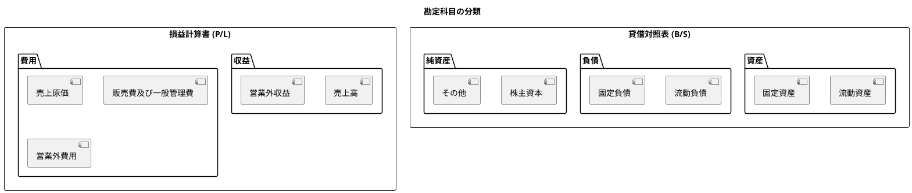

# 第9章: 勘定科目マスタ

本章では、財務会計システムの中核となる勘定科目マスタの実装を解説します。階層構造の表示、BS/PL フィルタ、勘定科目構成の管理、およびカスタムフックの設計について説明します。

## 9.1 勘定科目の概要

### 9.1.1 勘定科目の属性

財務会計システムにおける勘定科目は、以下の属性を持ちます。

| 属性 | 説明 | 例 |
|------|------|-----|
| accountCode | 勘定科目コード（主キー） | "111", "411" |
| accountName | 勘定科目名 | "現金預金", "売上高" |
| accountAbbr | 略称 | "現預金", "売上" |
| accountKana | カナ | "ゲンキンヨキン" |
| bsplType | BS/PL 区分 | "B"（貸借対照表）, "P"（損益計算書） |
| debitCreditType | 貸借区分 | "借"（借方）, "貸"（貸方） |
| elementType | 要素区分 | "資産", "負債", "純資産", "収益", "費用" |
| displayOrder | 表示順 | 1, 2, 3... |
| version | 楽観的ロック用バージョン | 1, 2, 3... |

### 9.1.2 勘定科目の階層構造



---

## 9.2 勘定科目一覧

### 9.2.1 AccountContainer

**src/components/master/account/AccountContainer.tsx**:

```typescript
import React, { useState, useCallback, useMemo } from 'react';
import { useQueryClient } from '@tanstack/react-query';
import {
  useGetAccounts,
  useCreateAccount,
  useUpdateAccount,
  useDeleteAccount,
  getGetAccountsQueryKey,
} from '@/api/generated/account/account';
import { AccountRequest, AccountResponse } from '@/api/model';
import { AccountCollection } from '@/views/master/account/AccountCollection';
import { AccountSingle } from '@/views/master/account/AccountSingle';
import { AccountEditModal } from '@/views/master/account/AccountEditModal';
import { Loading } from '@/views/common/Loading';
import { ErrorMessage } from '@/views/common/ErrorMessage';
import { useConfirm } from '@/hooks/useConfirm';
import { ConfirmModal } from '@/views/common/ConfirmModal';
import { useMessage } from '@/providers/MessageProvider';
import { useAccountFilter } from '@/hooks/useAccountFilter';
import './AccountContainer.css';

type ModalMode = 'closed' | 'create' | 'edit';

export const AccountContainer: React.FC = () => {
  const queryClient = useQueryClient();
  const { showMessage } = useMessage();
  const { isOpen, options, confirm, handleConfirm, handleCancel } = useConfirm();

  // API hooks
  const { data: accounts, isLoading, error, refetch } = useGetAccounts({
    staleTime: 10 * 60 * 1000, // マスタデータは長めにキャッシュ
  });
  const createMutation = useCreateAccount();
  const updateMutation = useUpdateAccount();
  const deleteMutation = useDeleteAccount();

  // フィルタリング
  const {
    filteredAccounts,
    bsplType,
    setBsplType,
    elementType,
    setElementType,
    searchQuery,
    setSearchQuery,
    clearFilters,
  } = useAccountFilter({ accounts });

  // ローカル状態
  const [modalMode, setModalMode] = useState<ModalMode>('closed');
  const [selectedAccount, setSelectedAccount] =
    useState<AccountResponse | null>(null);

  // 統計情報
  const statistics = useMemo(() => {
    if (!accounts) return null;

    return {
      total: accounts.length,
      bs: accounts.filter((a) => a.bsplType === 'B').length,
      pl: accounts.filter((a) => a.bsplType === 'P').length,
      byElement: {
        資産: accounts.filter((a) => a.elementType === '資産').length,
        負債: accounts.filter((a) => a.elementType === '負債').length,
        純資産: accounts.filter((a) => a.elementType === '純資産').length,
        収益: accounts.filter((a) => a.elementType === '収益').length,
        費用: accounts.filter((a) => a.elementType === '費用').length,
      },
    };
  }, [accounts]);

  // イベントハンドラ
  const handleSelect = useCallback((account: AccountResponse) => {
    setSelectedAccount(account);
  }, []);

  const handleCreateClick = useCallback(() => {
    setSelectedAccount(null);
    setModalMode('create');
  }, []);

  const handleEditClick = useCallback(() => {
    setModalMode('edit');
  }, []);

  const handleModalClose = useCallback(() => {
    setModalMode('closed');
  }, []);

  const handleSave = useCallback(
    (data: AccountRequest) => {
      const onSuccess = (savedAccount: AccountResponse) => {
        queryClient.invalidateQueries({ queryKey: getGetAccountsQueryKey() });
        setModalMode('closed');
        setSelectedAccount(savedAccount);
        showMessage(
          'success',
          modalMode === 'create'
            ? '勘定科目を登録しました'
            : '勘定科目を更新しました'
        );
      };

      if (modalMode === 'create') {
        createMutation.mutate({ data }, { onSuccess });
      } else if (modalMode === 'edit' && selectedAccount) {
        updateMutation.mutate(
          { accountCode: selectedAccount.accountCode, data },
          { onSuccess }
        );
      }
    },
    [
      modalMode,
      selectedAccount,
      createMutation,
      updateMutation,
      queryClient,
      showMessage,
    ]
  );

  const handleDelete = useCallback(
    async (account: AccountResponse) => {
      const confirmed = await confirm({
        title: '勘定科目の削除',
        message: (
          <>
            <p>以下の勘定科目を削除しますか？</p>
            <p>
              <strong>
                {account.accountCode}: {account.accountName}
              </strong>
            </p>
            <p className="text-warning">
              この勘定科目を使用している仕訳がある場合、削除できません。
            </p>
          </>
        ),
        type: 'danger',
        confirmLabel: '削除する',
      });

      if (confirmed) {
        deleteMutation.mutate(
          { accountCode: account.accountCode },
          {
            onSuccess: () => {
              queryClient.invalidateQueries({
                queryKey: getGetAccountsQueryKey(),
              });
              if (selectedAccount?.accountCode === account.accountCode) {
                setSelectedAccount(null);
              }
              showMessage('success', '勘定科目を削除しました');
            },
            onError: (error) => {
              showMessage(
                'error',
                'この勘定科目は使用中のため削除できません'
              );
            },
          }
        );
      }
    },
    [confirm, deleteMutation, queryClient, selectedAccount, showMessage]
  );

  if (isLoading) {
    return <Loading message="勘定科目を読み込み中..." />;
  }

  if (error) {
    return <ErrorMessage error={error} onRetry={() => refetch()} />;
  }

  return (
    <div className="account-container">
      <div className="account-container__main">
        <AccountCollection
          accounts={filteredAccounts}
          selectedAccountCode={selectedAccount?.accountCode}
          onSelect={handleSelect}
          onCreate={handleCreateClick}
          bsplType={bsplType}
          onBsplTypeChange={setBsplType}
          elementType={elementType}
          onElementTypeChange={setElementType}
          searchQuery={searchQuery}
          onSearchQueryChange={setSearchQuery}
          onClearFilters={clearFilters}
          statistics={statistics}
        />
      </div>

      {selectedAccount && (
        <div className="account-container__detail">
          <AccountSingle
            account={selectedAccount}
            onEdit={handleEditClick}
            onDelete={() => handleDelete(selectedAccount)}
          />
        </div>
      )}

      {modalMode !== 'closed' && (
        <AccountEditModal
          isOpen
          onClose={handleModalClose}
          onSave={handleSave}
          account={modalMode === 'edit' ? selectedAccount : undefined}
          isSubmitting={createMutation.isPending || updateMutation.isPending}
        />
      )}

      {options && (
        <ConfirmModal
          isOpen={isOpen}
          onClose={handleCancel}
          onConfirm={handleConfirm}
          title={options.title}
          message={options.message}
          type={options.type}
          confirmLabel={options.confirmLabel}
          isLoading={deleteMutation.isPending}
        />
      )}
    </div>
  );
};
```

### 9.2.2 AccountCollection

**src/views/master/account/AccountCollection.tsx**:

```typescript
import React, { useMemo } from 'react';
import { AccountResponse } from '@/api/model';
import { FiPlus, FiSearch, FiFilter, FiX } from 'react-icons/fi';
import './AccountCollection.css';

interface Statistics {
  total: number;
  bs: number;
  pl: number;
  byElement: Record<string, number>;
}

interface Props {
  accounts: AccountResponse[];
  selectedAccountCode?: string;
  onSelect: (account: AccountResponse) => void;
  onCreate: () => void;
  bsplType: 'B' | 'P' | '';
  onBsplTypeChange: (type: 'B' | 'P' | '') => void;
  elementType: string;
  onElementTypeChange: (type: string) => void;
  searchQuery: string;
  onSearchQueryChange: (query: string) => void;
  onClearFilters: () => void;
  statistics: Statistics | null;
}

const ELEMENT_TYPES = ['資産', '負債', '純資産', '収益', '費用'];

export const AccountCollection: React.FC<Props> = ({
  accounts,
  selectedAccountCode,
  onSelect,
  onCreate,
  bsplType,
  onBsplTypeChange,
  elementType,
  onElementTypeChange,
  searchQuery,
  onSearchQueryChange,
  onClearFilters,
  statistics,
}) => {
  // 要素区分ごとにグループ化
  const groupedAccounts = useMemo(() => {
    const groups: Record<string, AccountResponse[]> = {};

    ELEMENT_TYPES.forEach((type) => {
      groups[type] = accounts
        .filter((a) => a.elementType === type)
        .sort((a, b) => a.displayOrder - b.displayOrder);
    });

    return groups;
  }, [accounts]);

  const hasFilters = bsplType || elementType || searchQuery;

  return (
    <div className="account-collection">
      {/* ヘッダー */}
      <div className="account-collection__header">
        <h2>勘定科目一覧</h2>
        <button className="account-collection__create" onClick={onCreate}>
          <FiPlus />
          新規作成
        </button>
      </div>

      {/* 統計情報 */}
      {statistics && (
        <div className="account-collection__stats">
          <span>全{statistics.total}件</span>
          <span className="stat-divider">|</span>
          <span>B/S: {statistics.bs}件</span>
          <span>P/L: {statistics.pl}件</span>
        </div>
      )}

      {/* フィルタ */}
      <div className="account-collection__filters">
        {/* 検索 */}
        <div className="account-collection__search">
          <FiSearch className="search-icon" />
          <input
            type="text"
            value={searchQuery}
            onChange={(e) => onSearchQueryChange(e.target.value)}
            placeholder="コード、名称、カナで検索..."
          />
          {searchQuery && (
            <button
              className="search-clear"
              onClick={() => onSearchQueryChange('')}
            >
              <FiX />
            </button>
          )}
        </div>

        {/* BS/PL フィルタ */}
        <div className="account-collection__filter-group">
          <label>BS/PL:</label>
          <select
            value={bsplType}
            onChange={(e) => onBsplTypeChange(e.target.value as 'B' | 'P' | '')}
          >
            <option value="">すべて</option>
            <option value="B">貸借対照表（B/S）</option>
            <option value="P">損益計算書（P/L）</option>
          </select>
        </div>

        {/* 要素区分フィルタ */}
        <div className="account-collection__filter-group">
          <label>要素:</label>
          <select
            value={elementType}
            onChange={(e) => onElementTypeChange(e.target.value)}
          >
            <option value="">すべて</option>
            {ELEMENT_TYPES.map((type) => (
              <option key={type} value={type}>
                {type}
              </option>
            ))}
          </select>
        </div>

        {/* フィルタクリア */}
        {hasFilters && (
          <button
            className="account-collection__clear-filters"
            onClick={onClearFilters}
          >
            <FiX />
            フィルタをクリア
          </button>
        )}
      </div>

      {/* 勘定科目リスト */}
      <div className="account-collection__list">
        {accounts.length === 0 ? (
          <div className="account-collection__empty">
            {hasFilters
              ? '条件に一致する勘定科目がありません'
              : '勘定科目が登録されていません'}
          </div>
        ) : (
          ELEMENT_TYPES.map((type) => {
            const typeAccounts = groupedAccounts[type];
            if (typeAccounts.length === 0) return null;

            return (
              <div key={type} className="account-collection__group">
                <h3 className="account-collection__group-header">
                  <span className={`element-badge is-${type}`}>{type}</span>
                  <span className="account-collection__group-count">
                    ({typeAccounts.length})
                  </span>
                </h3>
                <div className="account-collection__group-items">
                  {typeAccounts.map((account) => (
                    <button
                      key={account.accountCode}
                      className={`account-collection__item ${
                        account.accountCode === selectedAccountCode
                          ? 'is-selected'
                          : ''
                      }`}
                      onClick={() => onSelect(account)}
                    >
                      <span className="account-collection__item-code">
                        {account.accountCode}
                      </span>
                      <span className="account-collection__item-name">
                        {account.accountName}
                      </span>
                      <span
                        className={`account-collection__item-type is-${account.debitCreditType}`}
                      >
                        {account.debitCreditType}方
                      </span>
                    </button>
                  ))}
                </div>
              </div>
            );
          })
        )}
      </div>
    </div>
  );
};
```

**src/views/master/account/AccountCollection.css**:

```css
.account-collection {
  display: flex;
  flex-direction: column;
  height: 100%;
  background-color: white;
  border-radius: 8px;
  box-shadow: 0 1px 3px rgba(0, 0, 0, 0.1);
}

.account-collection__header {
  display: flex;
  justify-content: space-between;
  align-items: center;
  padding: 16px 20px;
  border-bottom: 1px solid #e0e0e0;
}

.account-collection__header h2 {
  margin: 0;
  font-size: 1.125rem;
}

.account-collection__create {
  display: flex;
  align-items: center;
  gap: 6px;
  padding: 8px 16px;
  background-color: #1a237e;
  color: white;
  border: none;
  border-radius: 4px;
  cursor: pointer;
  font-weight: 500;
  transition: background-color 0.2s;
}

.account-collection__create:hover {
  background-color: #0d1757;
}

.account-collection__stats {
  display: flex;
  gap: 12px;
  padding: 12px 20px;
  background-color: #f5f5f5;
  font-size: 0.875rem;
  color: #666;
}

.stat-divider {
  color: #ccc;
}

.account-collection__filters {
  display: flex;
  align-items: center;
  gap: 16px;
  padding: 12px 20px;
  border-bottom: 1px solid #e0e0e0;
  flex-wrap: wrap;
}

.account-collection__search {
  position: relative;
  flex: 1;
  min-width: 200px;
}

.account-collection__search .search-icon {
  position: absolute;
  left: 12px;
  top: 50%;
  transform: translateY(-50%);
  color: #999;
}

.account-collection__search input {
  width: 100%;
  padding: 8px 36px 8px 36px;
  border: 1px solid #ccc;
  border-radius: 4px;
  font-size: 0.875rem;
}

.account-collection__search .search-clear {
  position: absolute;
  right: 8px;
  top: 50%;
  transform: translateY(-50%);
  background: none;
  border: none;
  color: #999;
  cursor: pointer;
  padding: 4px;
}

.account-collection__filter-group {
  display: flex;
  align-items: center;
  gap: 8px;
}

.account-collection__filter-group label {
  font-size: 0.875rem;
  color: #666;
}

.account-collection__filter-group select {
  padding: 6px 8px;
  border: 1px solid #ccc;
  border-radius: 4px;
  font-size: 0.875rem;
}

.account-collection__clear-filters {
  display: flex;
  align-items: center;
  gap: 4px;
  padding: 6px 12px;
  background: none;
  border: 1px solid #ccc;
  border-radius: 4px;
  color: #666;
  cursor: pointer;
  font-size: 0.875rem;
}

.account-collection__clear-filters:hover {
  background-color: #f5f5f5;
}

.account-collection__list {
  flex: 1;
  overflow-y: auto;
  padding: 16px 20px;
}

.account-collection__empty {
  text-align: center;
  padding: 40px;
  color: #999;
}

.account-collection__group {
  margin-bottom: 24px;
}

.account-collection__group-header {
  display: flex;
  align-items: center;
  gap: 8px;
  margin: 0 0 12px 0;
  font-size: 0.875rem;
}

.element-badge {
  padding: 4px 12px;
  border-radius: 4px;
  font-weight: 500;
}

.element-badge.is-資産 {
  background-color: #e3f2fd;
  color: #1565c0;
}

.element-badge.is-負債 {
  background-color: #fce4ec;
  color: #c2185b;
}

.element-badge.is-純資産 {
  background-color: #e8f5e9;
  color: #2e7d32;
}

.element-badge.is-収益 {
  background-color: #fff3e0;
  color: #e65100;
}

.element-badge.is-費用 {
  background-color: #f3e5f5;
  color: #7b1fa2;
}

.account-collection__group-count {
  color: #999;
}

.account-collection__group-items {
  display: flex;
  flex-direction: column;
  gap: 4px;
}

.account-collection__item {
  display: flex;
  align-items: center;
  gap: 12px;
  padding: 10px 12px;
  background: none;
  border: 1px solid transparent;
  border-radius: 4px;
  cursor: pointer;
  text-align: left;
  transition: background-color 0.2s, border-color 0.2s;
}

.account-collection__item:hover {
  background-color: #f5f5f5;
}

.account-collection__item.is-selected {
  background-color: #e8eaf6;
  border-color: #1a237e;
}

.account-collection__item-code {
  font-family: 'Roboto Mono', monospace;
  font-size: 0.875rem;
  color: #666;
  min-width: 60px;
}

.account-collection__item-name {
  flex: 1;
}

.account-collection__item-type {
  font-size: 0.75rem;
  padding: 2px 8px;
  border-radius: 4px;
}

.account-collection__item-type.is-借 {
  background-color: #e3f2fd;
  color: #1565c0;
}

.account-collection__item-type.is-貸 {
  background-color: #fce4ec;
  color: #c2185b;
}
```

---

## 9.3 勘定科目詳細

### 9.3.1 AccountSingle

**src/views/master/account/AccountSingle.tsx**:

```typescript
import React from 'react';
import { AccountResponse } from '@/api/model';
import { FiEdit2, FiTrash2 } from 'react-icons/fi';
import './AccountSingle.css';

interface Props {
  account: AccountResponse;
  onEdit: () => void;
  onDelete: () => void;
}

const bsplLabels: Record<string, string> = {
  B: '貸借対照表（B/S）',
  P: '損益計算書（P/L）',
};

export const AccountSingle: React.FC<Props> = ({
  account,
  onEdit,
  onDelete,
}) => {
  return (
    <div className="account-single">
      <div className="account-single__header">
        <div className="account-single__title-group">
          <span className="account-single__code">{account.accountCode}</span>
          <h2 className="account-single__name">{account.accountName}</h2>
        </div>
        <div className="account-single__actions">
          <button className="account-single__edit" onClick={onEdit}>
            <FiEdit2 />
            編集
          </button>
          <button className="account-single__delete" onClick={onDelete}>
            <FiTrash2 />
            削除
          </button>
        </div>
      </div>

      <div className="account-single__badges">
        <span className={`badge is-bspl-${account.bsplType}`}>
          {bsplLabels[account.bsplType]}
        </span>
        <span className={`badge is-element-${account.elementType}`}>
          {account.elementType}
        </span>
        <span className={`badge is-dc-${account.debitCreditType}`}>
          {account.debitCreditType}方科目
        </span>
      </div>

      <dl className="account-single__details">
        <div className="account-single__row">
          <dt>勘定科目コード</dt>
          <dd>{account.accountCode}</dd>
        </div>
        <div className="account-single__row">
          <dt>勘定科目名</dt>
          <dd>{account.accountName}</dd>
        </div>
        {account.accountAbbr && (
          <div className="account-single__row">
            <dt>略称</dt>
            <dd>{account.accountAbbr}</dd>
          </div>
        )}
        {account.accountKana && (
          <div className="account-single__row">
            <dt>カナ</dt>
            <dd>{account.accountKana}</dd>
          </div>
        )}
        <div className="account-single__row">
          <dt>BS/PL 区分</dt>
          <dd>{bsplLabels[account.bsplType]}</dd>
        </div>
        <div className="account-single__row">
          <dt>貸借区分</dt>
          <dd>
            {account.debitCreditType}方
            <span className="account-single__hint">
              （残高が{account.debitCreditType}方に増加）
            </span>
          </dd>
        </div>
        <div className="account-single__row">
          <dt>要素区分</dt>
          <dd>{account.elementType}</dd>
        </div>
        <div className="account-single__row">
          <dt>表示順</dt>
          <dd>{account.displayOrder}</dd>
        </div>
        <div className="account-single__row">
          <dt>バージョン</dt>
          <dd>{account.version}</dd>
        </div>
      </dl>

      <div className="account-single__explanation">
        <h3>勘定科目の性質</h3>
        <p>
          この勘定科目は<strong>{account.elementType}</strong>に分類され、
          {account.bsplType === 'B' ? '貸借対照表' : '損益計算書'}
          に表示されます。
        </p>
        <p>
          {account.debitCreditType === '借' ? (
            <>
              借方科目のため、<strong>借方に記入すると残高が増加</strong>
              し、貸方に記入すると残高が減少します。
            </>
          ) : (
            <>
              貸方科目のため、<strong>貸方に記入すると残高が増加</strong>
              し、借方に記入すると残高が減少します。
            </>
          )}
        </p>
      </div>
    </div>
  );
};
```

**src/views/master/account/AccountSingle.css**:

```css
.account-single {
  background-color: white;
  border-radius: 8px;
  box-shadow: 0 1px 3px rgba(0, 0, 0, 0.1);
  padding: 24px;
}

.account-single__header {
  display: flex;
  justify-content: space-between;
  align-items: flex-start;
  margin-bottom: 20px;
}

.account-single__title-group {
  display: flex;
  align-items: baseline;
  gap: 12px;
}

.account-single__code {
  font-family: 'Roboto Mono', monospace;
  font-size: 1rem;
  color: #666;
  background-color: #f5f5f5;
  padding: 4px 8px;
  border-radius: 4px;
}

.account-single__name {
  margin: 0;
  font-size: 1.5rem;
}

.account-single__actions {
  display: flex;
  gap: 8px;
}

.account-single__edit,
.account-single__delete {
  display: flex;
  align-items: center;
  gap: 4px;
  padding: 8px 16px;
  border: 1px solid #ccc;
  border-radius: 4px;
  background: white;
  cursor: pointer;
  transition: background-color 0.2s;
}

.account-single__edit:hover {
  background-color: #f5f5f5;
}

.account-single__delete {
  color: #d32f2f;
  border-color: #ffcdd2;
}

.account-single__delete:hover {
  background-color: #ffebee;
}

.account-single__badges {
  display: flex;
  gap: 8px;
  margin-bottom: 24px;
}

.account-single__badges .badge {
  padding: 6px 12px;
  border-radius: 4px;
  font-size: 0.875rem;
  font-weight: 500;
}

.badge.is-bspl-B {
  background-color: #e3f2fd;
  color: #1565c0;
}

.badge.is-bspl-P {
  background-color: #fff3e0;
  color: #e65100;
}

.badge.is-element-資産 {
  background-color: #e3f2fd;
  color: #1565c0;
}

.badge.is-element-負債 {
  background-color: #fce4ec;
  color: #c2185b;
}

.badge.is-element-純資産 {
  background-color: #e8f5e9;
  color: #2e7d32;
}

.badge.is-element-収益 {
  background-color: #fff3e0;
  color: #e65100;
}

.badge.is-element-費用 {
  background-color: #f3e5f5;
  color: #7b1fa2;
}

.badge.is-dc-借 {
  background-color: #e8eaf6;
  color: #3949ab;
}

.badge.is-dc-貸 {
  background-color: #fce4ec;
  color: #c2185b;
}

.account-single__details {
  margin: 0 0 24px 0;
}

.account-single__row {
  display: flex;
  padding: 12px 0;
  border-bottom: 1px solid #f0f0f0;
}

.account-single__row:last-child {
  border-bottom: none;
}

.account-single__row dt {
  width: 160px;
  color: #666;
  font-weight: 500;
}

.account-single__row dd {
  flex: 1;
  margin: 0;
}

.account-single__hint {
  color: #999;
  font-size: 0.875rem;
  margin-left: 8px;
}

.account-single__explanation {
  padding: 16px;
  background-color: #f5f5f5;
  border-radius: 4px;
}

.account-single__explanation h3 {
  margin: 0 0 12px 0;
  font-size: 1rem;
}

.account-single__explanation p {
  margin: 0 0 8px 0;
  font-size: 0.875rem;
  color: #666;
  line-height: 1.6;
}

.account-single__explanation p:last-child {
  margin-bottom: 0;
}
```

---

## 9.4 カスタムフック

### 9.4.1 useAccountFilter

**src/hooks/useAccountFilter.ts**:

```typescript
import { useMemo, useState, useCallback } from 'react';
import { AccountResponse } from '@/api/model';

interface UseAccountFilterOptions {
  accounts: AccountResponse[] | undefined;
  initialBsplType?: 'B' | 'P' | '';
  initialElementType?: string;
}

interface UseAccountFilterResult {
  filteredAccounts: AccountResponse[];
  bsplType: 'B' | 'P' | '';
  setBsplType: (type: 'B' | 'P' | '') => void;
  elementType: string;
  setElementType: (type: string) => void;
  searchQuery: string;
  setSearchQuery: (query: string) => void;
  clearFilters: () => void;
  hasFilters: boolean;
}

export const useAccountFilter = ({
  accounts,
  initialBsplType = '',
  initialElementType = '',
}: UseAccountFilterOptions): UseAccountFilterResult => {
  const [bsplType, setBsplType] = useState<'B' | 'P' | ''>(initialBsplType);
  const [elementType, setElementType] = useState(initialElementType);
  const [searchQuery, setSearchQuery] = useState('');

  const filteredAccounts = useMemo(() => {
    if (!accounts) return [];

    return accounts.filter((account) => {
      // BS/PL フィルタ
      if (bsplType && account.bsplType !== bsplType) {
        return false;
      }

      // 要素区分フィルタ
      if (elementType && account.elementType !== elementType) {
        return false;
      }

      // 検索クエリフィルタ
      if (searchQuery) {
        const query = searchQuery.toLowerCase();
        const matchesCode = account.accountCode
          .toLowerCase()
          .includes(query);
        const matchesName = account.accountName
          .toLowerCase()
          .includes(query);
        const matchesKana = account.accountKana
          ?.toLowerCase()
          .includes(query);
        const matchesAbbr = account.accountAbbr
          ?.toLowerCase()
          .includes(query);

        if (!matchesCode && !matchesName && !matchesKana && !matchesAbbr) {
          return false;
        }
      }

      return true;
    });
  }, [accounts, bsplType, elementType, searchQuery]);

  const clearFilters = useCallback(() => {
    setBsplType('');
    setElementType('');
    setSearchQuery('');
  }, []);

  const hasFilters = !!(bsplType || elementType || searchQuery);

  return {
    filteredAccounts,
    bsplType,
    setBsplType,
    elementType,
    setElementType,
    searchQuery,
    setSearchQuery,
    clearFilters,
    hasFilters,
  };
};
```

### 9.4.2 useAccountTree

階層構造の構築用フック。

**src/hooks/useAccountTree.ts**:

```typescript
import { useMemo } from 'react';
import { AccountResponse } from '@/api/model';

export interface AccountTreeNode {
  account: AccountResponse;
  level: number;
  isExpanded?: boolean;
}

export interface AccountTreeGroup {
  elementType: string;
  bsplType: 'B' | 'P';
  accounts: AccountTreeNode[];
}

// 要素区分の表示順
const ELEMENT_ORDER: Record<string, number> = {
  資産: 1,
  負債: 2,
  純資産: 3,
  収益: 4,
  費用: 5,
};

// 要素区分と BS/PL の対応
const ELEMENT_BSPL: Record<string, 'B' | 'P'> = {
  資産: 'B',
  負債: 'B',
  純資産: 'B',
  収益: 'P',
  費用: 'P',
};

export const useAccountTree = (
  accounts: AccountResponse[] | undefined,
  options?: {
    bsplFilter?: 'B' | 'P';
    expandAll?: boolean;
  }
): AccountTreeGroup[] => {
  const { bsplFilter, expandAll = true } = options ?? {};

  return useMemo(() => {
    if (!accounts) return [];

    // フィルタリング
    let filtered = accounts;
    if (bsplFilter) {
      filtered = accounts.filter((a) => a.bsplType === bsplFilter);
    }

    // 要素区分でグループ化
    const groups: AccountTreeGroup[] = Object.keys(ELEMENT_ORDER)
      .filter((elementType) => {
        // BS/PL フィルタがある場合、対応する要素のみ
        if (bsplFilter && ELEMENT_BSPL[elementType] !== bsplFilter) {
          return false;
        }
        return true;
      })
      .map((elementType) => {
        const elementAccounts = filtered
          .filter((a) => a.elementType === elementType)
          .sort((a, b) => a.displayOrder - b.displayOrder)
          .map((account) => ({
            account,
            level: 0,
            isExpanded: expandAll,
          }));

        return {
          elementType,
          bsplType: ELEMENT_BSPL[elementType],
          accounts: elementAccounts,
        };
      })
      .filter((group) => group.accounts.length > 0);

    return groups;
  }, [accounts, bsplFilter, expandAll]);
};
```

### 9.4.3 useAccountValidation

勘定科目のバリデーション用フック。

**src/hooks/useAccountValidation.ts**:

```typescript
import { useMemo } from 'react';

interface AccountFormData {
  accountCode: string;
  accountName: string;
  bsplType: 'B' | 'P';
  debitCreditType: '借' | '貸';
  elementType: string;
}

interface ValidationErrors {
  accountCode?: string;
  accountName?: string;
  elementType?: string;
}

// 要素区分と貸借区分の整合性
const ELEMENT_DEBIT_CREDIT: Record<string, '借' | '貸'> = {
  資産: '借',
  費用: '借',
  負債: '貸',
  純資産: '貸',
  収益: '貸',
};

// 要素区分と BS/PL の整合性
const ELEMENT_BSPL: Record<string, 'B' | 'P'> = {
  資産: 'B',
  負債: 'B',
  純資産: 'B',
  収益: 'P',
  費用: 'P',
};

export const useAccountValidation = (data: AccountFormData) => {
  return useMemo(() => {
    const errors: ValidationErrors = {};
    const warnings: string[] = [];

    // 勘定科目コードのバリデーション
    if (!data.accountCode) {
      errors.accountCode = '勘定科目コードは必須です';
    } else if (!/^\d{3,6}$/.test(data.accountCode)) {
      errors.accountCode = '勘定科目コードは3〜6桁の数字です';
    }

    // 勘定科目名のバリデーション
    if (!data.accountName) {
      errors.accountName = '勘定科目名は必須です';
    } else if (data.accountName.length > 50) {
      errors.accountName = '勘定科目名は50文字以内です';
    }

    // 要素区分のバリデーション
    if (!data.elementType) {
      errors.elementType = '要素区分は必須です';
    }

    // 整合性チェック（警告）
    if (data.elementType && data.bsplType) {
      const expectedBspl = ELEMENT_BSPL[data.elementType];
      if (expectedBspl && expectedBspl !== data.bsplType) {
        warnings.push(
          `${data.elementType}は通常${expectedBspl === 'B' ? '貸借対照表' : '損益計算書'}科目です`
        );
      }
    }

    if (data.elementType && data.debitCreditType) {
      const expectedDC = ELEMENT_DEBIT_CREDIT[data.elementType];
      if (expectedDC && expectedDC !== data.debitCreditType) {
        warnings.push(
          `${data.elementType}は通常${expectedDC}方科目です`
        );
      }
    }

    return {
      errors,
      warnings,
      isValid: Object.keys(errors).length === 0,
    };
  }, [data]);
};
```

---

## 9.5 勘定科目編集モーダル

### 9.5.1 AccountEditModal

**src/views/master/account/AccountEditModal.tsx**:

```typescript
import React, { useEffect, useMemo } from 'react';
import { EditModal } from '@/views/common/EditModal';
import { FormField } from '@/views/common/FormField';
import { useForm } from '@/hooks/useForm';
import { useAccountValidation } from '@/hooks/useAccountValidation';
import { AccountRequest, AccountResponse } from '@/api/model';
import { FiAlertTriangle } from 'react-icons/fi';
import './AccountEditModal.css';

interface Props {
  isOpen: boolean;
  onClose: () => void;
  onSave: (data: AccountRequest) => void;
  account?: AccountResponse | null;
  isSubmitting: boolean;
}

const ELEMENT_TYPES = ['資産', '負債', '純資産', '収益', '費用'];

const initialValues: AccountRequest = {
  accountCode: '',
  accountName: '',
  accountAbbr: '',
  accountKana: '',
  bsplType: 'B',
  debitCreditType: '借',
  elementType: '資産',
  displayOrder: 0,
};

export const AccountEditModal: React.FC<Props> = ({
  isOpen,
  onClose,
  onSave,
  account,
  isSubmitting,
}) => {
  const isEditMode = !!account;

  const { values, errors, handleChange, handleBlur, setValue, reset, validate } =
    useForm<AccountRequest>({
      initialValues,
    });

  // 整合性チェック
  const { warnings } = useAccountValidation(values);

  // account が変更されたらフォームをリセット
  useEffect(() => {
    if (isOpen) {
      if (account) {
        reset({
          accountCode: account.accountCode,
          accountName: account.accountName,
          accountAbbr: account.accountAbbr ?? '',
          accountKana: account.accountKana ?? '',
          bsplType: account.bsplType,
          debitCreditType: account.debitCreditType,
          elementType: account.elementType,
          displayOrder: account.displayOrder,
        });
      } else {
        reset(initialValues);
      }
    }
  }, [isOpen, account, reset]);

  // 要素区分変更時に自動設定
  const handleElementTypeChange = (
    e: React.ChangeEvent<HTMLSelectElement>
  ) => {
    const newElementType = e.target.value;
    handleChange(e);

    // BS/PL と貸借区分を自動設定
    const elementDefaults: Record<
      string,
      { bsplType: 'B' | 'P'; debitCreditType: '借' | '貸' }
    > = {
      資産: { bsplType: 'B', debitCreditType: '借' },
      負債: { bsplType: 'B', debitCreditType: '貸' },
      純資産: { bsplType: 'B', debitCreditType: '貸' },
      収益: { bsplType: 'P', debitCreditType: '貸' },
      費用: { bsplType: 'P', debitCreditType: '借' },
    };

    const defaults = elementDefaults[newElementType];
    if (defaults) {
      setValue('bsplType', defaults.bsplType);
      setValue('debitCreditType', defaults.debitCreditType);
    }
  };

  const handleSave = () => {
    if (validate()) {
      onSave(values);
    }
  };

  // バリデーション状態
  const isValid = useMemo(() => {
    return (
      !!values.accountCode &&
      !!values.accountName &&
      !!values.elementType
    );
  }, [values]);

  return (
    <EditModal
      isOpen={isOpen}
      onClose={onClose}
      onSave={handleSave}
      title={isEditMode ? '勘定科目編集' : '勘定科目登録'}
      isSubmitting={isSubmitting}
      submitLabel={isEditMode ? '更新' : '登録'}
      isValid={isValid}
    >
      {/* 警告メッセージ */}
      {warnings.length > 0 && (
        <div className="account-edit-modal__warnings">
          <FiAlertTriangle />
          <ul>
            {warnings.map((warning, index) => (
              <li key={index}>{warning}</li>
            ))}
          </ul>
        </div>
      )}

      <div className="form-row">
        <FormField
          label="勘定科目コード"
          htmlFor="accountCode"
          required
          error={errors.accountCode}
          hint="3〜6桁の数字"
        >
          <input
            id="accountCode"
            name="accountCode"
            value={values.accountCode}
            onChange={handleChange}
            onBlur={handleBlur}
            disabled={isEditMode}
            placeholder="例: 111"
            maxLength={6}
          />
        </FormField>

        <FormField
          label="表示順"
          htmlFor="displayOrder"
          hint="一覧表示時の並び順"
        >
          <input
            id="displayOrder"
            name="displayOrder"
            type="number"
            value={values.displayOrder ?? 0}
            onChange={handleChange}
            min={0}
          />
        </FormField>
      </div>

      <FormField
        label="勘定科目名"
        htmlFor="accountName"
        required
        error={errors.accountName}
      >
        <input
          id="accountName"
          name="accountName"
          value={values.accountName}
          onChange={handleChange}
          onBlur={handleBlur}
          placeholder="例: 現金預金"
          maxLength={50}
        />
      </FormField>

      <div className="form-row">
        <FormField label="略称" htmlFor="accountAbbr">
          <input
            id="accountAbbr"
            name="accountAbbr"
            value={values.accountAbbr ?? ''}
            onChange={handleChange}
            placeholder="例: 現預金"
            maxLength={20}
          />
        </FormField>

        <FormField label="カナ" htmlFor="accountKana">
          <input
            id="accountKana"
            name="accountKana"
            value={values.accountKana ?? ''}
            onChange={handleChange}
            placeholder="例: ゲンキンヨキン"
            maxLength={50}
          />
        </FormField>
      </div>

      <FormField
        label="要素区分"
        htmlFor="elementType"
        required
        hint="選択すると BS/PL 区分と貸借区分が自動設定されます"
      >
        <select
          id="elementType"
          name="elementType"
          value={values.elementType}
          onChange={handleElementTypeChange}
        >
          {ELEMENT_TYPES.map((type) => (
            <option key={type} value={type}>
              {type}
            </option>
          ))}
        </select>
      </FormField>

      <div className="form-row">
        <FormField label="BS/PL 区分" htmlFor="bsplType" required>
          <select
            id="bsplType"
            name="bsplType"
            value={values.bsplType}
            onChange={handleChange}
          >
            <option value="B">貸借対照表（B/S）</option>
            <option value="P">損益計算書（P/L）</option>
          </select>
        </FormField>

        <FormField label="貸借区分" htmlFor="debitCreditType" required>
          <select
            id="debitCreditType"
            name="debitCreditType"
            value={values.debitCreditType}
            onChange={handleChange}
          >
            <option value="借">借方</option>
            <option value="貸">貸方</option>
          </select>
        </FormField>
      </div>
    </EditModal>
  );
};
```

**src/views/master/account/AccountEditModal.css**:

```css
.account-edit-modal__warnings {
  display: flex;
  align-items: flex-start;
  gap: 12px;
  padding: 12px 16px;
  margin-bottom: 20px;
  background-color: #fff3e0;
  border: 1px solid #ffcc80;
  border-radius: 4px;
  color: #e65100;
}

.account-edit-modal__warnings svg {
  flex-shrink: 0;
  margin-top: 2px;
}

.account-edit-modal__warnings ul {
  margin: 0;
  padding-left: 20px;
}

.account-edit-modal__warnings li {
  font-size: 0.875rem;
}
```

---

## 9.6 まとめ

本章では、勘定科目マスタの実装を詳しく解説しました。

### 重要ポイント

1. **勘定科目の属性**: BS/PL 区分、要素区分、貸借区分の理解
2. **フィルタリング機能**: useAccountFilter による多条件フィルタ
3. **グループ化表示**: 要素区分ごとのグループ化
4. **整合性チェック**: 要素区分と BS/PL・貸借区分の整合性検証
5. **自動設定**: 要素区分変更時の関連項目自動設定

### 次章の内容

第10章では、会計期間マスタと課税マスタの実装について解説します。年度・月次の管理、締め状態の制御、課税区分・消費税コードの管理を扱います。
