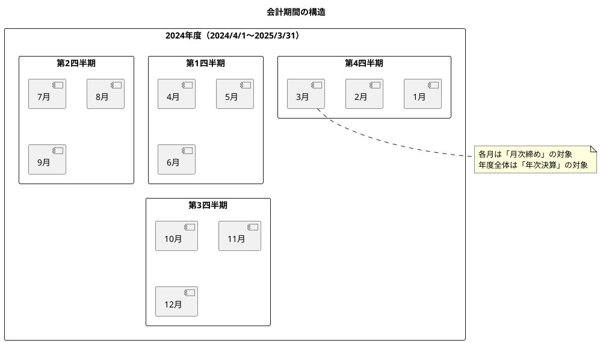
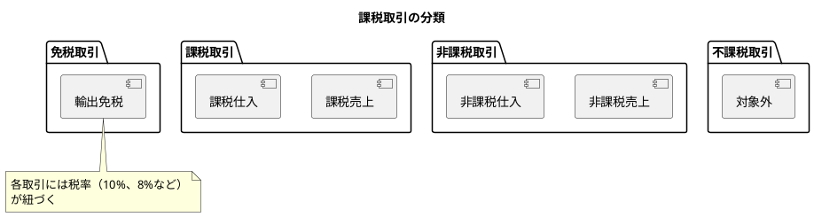

# 第10章: 会計期間・課税マスタ

本章では、財務会計システムの会計期間管理と課税マスタの実装を解説します。年度・月次の管理、締め状態の制御、課税取引区分、消費税コードの管理について説明します。

## 10.1 会計期間管理

### 10.1.1 会計期間の概念

会計期間は、財務諸表を作成する単位となる期間です。日本の多くの企業では4月1日〜翌年3月31日を1会計年度としています。



### 10.1.2 型定義

**src/types/accountingPeriod.ts**:

```typescript
// 会計年度
export interface AccountingPeriod {
  id: string;
  year: number;           // 年度（例: 2024）
  startDate: string;      // 開始日（例: "2024-04-01"）
  endDate: string;        // 終了日（例: "2025-03-31"）
  isClosed: boolean;      // 年度締め済みフラグ
  closedAt?: string;      // 締め日時
  createdAt: string;
  updatedAt: string;
}

// 月次期間
export interface MonthlyPeriod {
  id: string;
  year: number;           // 年度
  month: number;          // 月（1〜12）
  startDate: string;      // 開始日
  endDate: string;        // 終了日
  isClosed: boolean;      // 月次締め済みフラグ
  closedAt?: string;      // 締め日時
}

// 期間ステータス
export type PeriodStatus = 'open' | 'closed' | 'future';
```

### 10.1.3 AccountingPeriodContainer

**src/components/master/accountingPeriod/AccountingPeriodContainer.tsx**:

```typescript
import React, { useState, useCallback } from 'react';
import { useQueryClient } from '@tanstack/react-query';
import {
  useGetAccountingPeriods,
  useCreateAccountingPeriod,
  useCloseMonth,
  useReopenMonth,
  getGetAccountingPeriodsQueryKey,
} from '@/api/generated/accounting-period/accounting-period';
import { AccountingPeriodResponse, MonthlyPeriodResponse } from '@/api/model';
import { AccountingPeriodCollection } from '@/views/master/accountingPeriod/AccountingPeriodCollection';
import { AccountingPeriodSingle } from '@/views/master/accountingPeriod/AccountingPeriodSingle';
import { MonthlyPeriodList } from '@/views/master/accountingPeriod/MonthlyPeriodList';
import { AccountingPeriodCreateModal } from '@/views/master/accountingPeriod/AccountingPeriodCreateModal';
import { Loading } from '@/views/common/Loading';
import { ErrorMessage } from '@/views/common/ErrorMessage';
import { useConfirm } from '@/hooks/useConfirm';
import { ConfirmModal } from '@/views/common/ConfirmModal';
import { useMessage } from '@/providers/MessageProvider';
import './AccountingPeriodContainer.css';

export const AccountingPeriodContainer: React.FC = () => {
  const queryClient = useQueryClient();
  const { showMessage } = useMessage();
  const { isOpen, options, confirm, handleConfirm, handleCancel } = useConfirm();

  // API hooks
  const { data: periods, isLoading, error, refetch } = useGetAccountingPeriods();
  const createMutation = useCreateAccountingPeriod();
  const closeMonthMutation = useCloseMonth();
  const reopenMonthMutation = useReopenMonth();

  // ローカル状態
  const [selectedPeriod, setSelectedPeriod] =
    useState<AccountingPeriodResponse | null>(null);
  const [isCreateModalOpen, setIsCreateModalOpen] = useState(false);

  // 年度選択
  const handleSelectPeriod = useCallback(
    (period: AccountingPeriodResponse) => {
      setSelectedPeriod(period);
    },
    []
  );

  // 新規年度作成
  const handleCreatePeriod = useCallback(
    (year: number) => {
      createMutation.mutate(
        { data: { year } },
        {
          onSuccess: (newPeriod) => {
            queryClient.invalidateQueries({
              queryKey: getGetAccountingPeriodsQueryKey(),
            });
            setIsCreateModalOpen(false);
            setSelectedPeriod(newPeriod);
            showMessage('success', `${year}年度を作成しました`);
          },
        }
      );
    },
    [createMutation, queryClient, showMessage]
  );

  // 月次締め処理
  const handleCloseMonth = useCallback(
    async (month: MonthlyPeriodResponse) => {
      const confirmed = await confirm({
        title: '月次締めの実行',
        message: (
          <>
            <p>
              <strong>
                {selectedPeriod?.year}年度 {month.month}月
              </strong>
              の月次締めを実行しますか？
            </p>
            <p className="text-warning">
              締め処理後、この月の仕訳は編集・削除できなくなります。
            </p>
          </>
        ),
        type: 'warning',
        confirmLabel: '締め処理を実行',
      });

      if (confirmed) {
        closeMonthMutation.mutate(
          {
            periodId: selectedPeriod!.id,
            monthId: month.id,
          },
          {
            onSuccess: () => {
              queryClient.invalidateQueries({
                queryKey: getGetAccountingPeriodsQueryKey(),
              });
              showMessage('success', `${month.month}月の月次締めを完了しました`);
            },
          }
        );
      }
    },
    [confirm, selectedPeriod, closeMonthMutation, queryClient, showMessage]
  );

  // 月次締め解除
  const handleReopenMonth = useCallback(
    async (month: MonthlyPeriodResponse) => {
      const confirmed = await confirm({
        title: '月次締めの解除',
        message: (
          <>
            <p>
              <strong>
                {selectedPeriod?.year}年度 {month.month}月
              </strong>
              の月次締めを解除しますか？
            </p>
            <p className="text-info">
              解除後、この月の仕訳の編集・削除が可能になります。
            </p>
          </>
        ),
        type: 'info',
        confirmLabel: '締めを解除',
      });

      if (confirmed) {
        reopenMonthMutation.mutate(
          {
            periodId: selectedPeriod!.id,
            monthId: month.id,
          },
          {
            onSuccess: () => {
              queryClient.invalidateQueries({
                queryKey: getGetAccountingPeriodsQueryKey(),
              });
              showMessage('success', `${month.month}月の月次締めを解除しました`);
            },
          }
        );
      }
    },
    [confirm, selectedPeriod, reopenMonthMutation, queryClient, showMessage]
  );

  if (isLoading) {
    return <Loading message="会計期間を読み込み中..." />;
  }

  if (error) {
    return <ErrorMessage error={error} onRetry={() => refetch()} />;
  }

  return (
    <div className="accounting-period-container">
      <div className="accounting-period-container__list">
        <AccountingPeriodCollection
          periods={periods ?? []}
          selectedPeriodId={selectedPeriod?.id}
          onSelect={handleSelectPeriod}
          onCreate={() => setIsCreateModalOpen(true)}
        />
      </div>

      {selectedPeriod && (
        <div className="accounting-period-container__detail">
          <AccountingPeriodSingle period={selectedPeriod} />
          <MonthlyPeriodList
            period={selectedPeriod}
            onCloseMonth={handleCloseMonth}
            onReopenMonth={handleReopenMonth}
            isProcessing={
              closeMonthMutation.isPending || reopenMonthMutation.isPending
            }
          />
        </div>
      )}

      <AccountingPeriodCreateModal
        isOpen={isCreateModalOpen}
        onClose={() => setIsCreateModalOpen(false)}
        onCreate={handleCreatePeriod}
        existingYears={periods?.map((p) => p.year) ?? []}
        isSubmitting={createMutation.isPending}
      />

      {options && (
        <ConfirmModal
          isOpen={isOpen}
          onClose={handleCancel}
          onConfirm={handleConfirm}
          title={options.title}
          message={options.message}
          type={options.type}
          confirmLabel={options.confirmLabel}
          isLoading={
            closeMonthMutation.isPending || reopenMonthMutation.isPending
          }
        />
      )}
    </div>
  );
};
```

### 10.1.4 AccountingPeriodCollection

**src/views/master/accountingPeriod/AccountingPeriodCollection.tsx**:

```typescript
import React from 'react';
import { AccountingPeriodResponse } from '@/api/model';
import { FiPlus, FiCalendar, FiLock, FiUnlock } from 'react-icons/fi';
import './AccountingPeriodCollection.css';

interface Props {
  periods: AccountingPeriodResponse[];
  selectedPeriodId?: string;
  onSelect: (period: AccountingPeriodResponse) => void;
  onCreate: () => void;
}

export const AccountingPeriodCollection: React.FC<Props> = ({
  periods,
  selectedPeriodId,
  onSelect,
  onCreate,
}) => {
  // 年度降順でソート
  const sortedPeriods = [...periods].sort((a, b) => b.year - a.year);

  return (
    <div className="accounting-period-collection">
      <div className="accounting-period-collection__header">
        <h2>会計期間一覧</h2>
        <button
          className="accounting-period-collection__create"
          onClick={onCreate}
        >
          <FiPlus />
          新規年度作成
        </button>
      </div>

      <div className="accounting-period-collection__list">
        {sortedPeriods.length === 0 ? (
          <div className="accounting-period-collection__empty">
            会計期間が登録されていません
          </div>
        ) : (
          sortedPeriods.map((period) => (
            <button
              key={period.id}
              className={`accounting-period-collection__item ${
                period.id === selectedPeriodId ? 'is-selected' : ''
              } ${period.isClosed ? 'is-closed' : ''}`}
              onClick={() => onSelect(period)}
            >
              <FiCalendar className="accounting-period-collection__icon" />
              <div className="accounting-period-collection__info">
                <span className="accounting-period-collection__year">
                  {period.year}年度
                </span>
                <span className="accounting-period-collection__range">
                  {period.startDate} 〜 {period.endDate}
                </span>
              </div>
              <div className="accounting-period-collection__status">
                {period.isClosed ? (
                  <span className="status-badge is-closed">
                    <FiLock />
                    締め済み
                  </span>
                ) : (
                  <span className="status-badge is-open">
                    <FiUnlock />
                    オープン
                  </span>
                )}
              </div>
            </button>
          ))
        )}
      </div>
    </div>
  );
};
```

### 10.1.5 MonthlyPeriodList

**src/views/master/accountingPeriod/MonthlyPeriodList.tsx**:

```typescript
import React, { useMemo } from 'react';
import { AccountingPeriodResponse, MonthlyPeriodResponse } from '@/api/model';
import { FiLock, FiUnlock, FiCheck, FiClock } from 'react-icons/fi';
import { DateDisplay } from '@/views/common/DateDisplay';
import { Button } from '@/views/common/Button';
import './MonthlyPeriodList.css';

interface Props {
  period: AccountingPeriodResponse;
  onCloseMonth: (month: MonthlyPeriodResponse) => void;
  onReopenMonth: (month: MonthlyPeriodResponse) => void;
  isProcessing: boolean;
}

export const MonthlyPeriodList: React.FC<Props> = ({
  period,
  onCloseMonth,
  onReopenMonth,
  isProcessing,
}) => {
  // 月次期間を会計年度順（4月〜3月）にソート
  const sortedMonths = useMemo(() => {
    if (!period.monthlyPeriods) return [];

    return [...period.monthlyPeriods].sort((a, b) => {
      // 4月を1、3月を12として並べ替え
      const orderA = a.month >= 4 ? a.month - 3 : a.month + 9;
      const orderB = b.month >= 4 ? b.month - 3 : b.month + 9;
      return orderA - orderB;
    });
  }, [period.monthlyPeriods]);

  // 締め済み月数をカウント
  const closedCount = sortedMonths.filter((m) => m.isClosed).length;

  return (
    <div className="monthly-period-list">
      <div className="monthly-period-list__header">
        <h3>月次締め状況</h3>
        <span className="monthly-period-list__summary">
          {closedCount} / {sortedMonths.length} 月完了
        </span>
      </div>

      {/* 進捗バー */}
      <div className="monthly-period-list__progress">
        <div
          className="monthly-period-list__progress-bar"
          style={{ width: `${(closedCount / sortedMonths.length) * 100}%` }}
        />
      </div>

      <div className="monthly-period-list__grid">
        {sortedMonths.map((month) => (
          <div
            key={month.id}
            className={`monthly-period-list__item ${
              month.isClosed ? 'is-closed' : 'is-open'
            }`}
          >
            <div className="monthly-period-list__month-info">
              <span className="monthly-period-list__month-number">
                {month.month}月
              </span>
              <span className="monthly-period-list__month-range">
                {month.startDate} 〜 {month.endDate}
              </span>
            </div>

            <div className="monthly-period-list__status">
              {month.isClosed ? (
                <>
                  <FiCheck className="status-icon is-closed" />
                  <span className="status-text">締め済み</span>
                  {month.closedAt && (
                    <span className="closed-date">
                      <DateDisplay date={month.closedAt} format="short" />
                    </span>
                  )}
                </>
              ) : (
                <>
                  <FiClock className="status-icon is-open" />
                  <span className="status-text">オープン</span>
                </>
              )}
            </div>

            <div className="monthly-period-list__actions">
              {month.isClosed ? (
                <Button
                  variant="text"
                  size="small"
                  onClick={() => onReopenMonth(month)}
                  disabled={isProcessing || period.isClosed}
                >
                  <FiUnlock />
                  解除
                </Button>
              ) : (
                <Button
                  variant="primary"
                  size="small"
                  onClick={() => onCloseMonth(month)}
                  disabled={isProcessing || period.isClosed}
                >
                  <FiLock />
                  締め処理
                </Button>
              )}
            </div>
          </div>
        ))}
      </div>

      {period.isClosed && (
        <div className="monthly-period-list__notice">
          <FiLock />
          この年度は決算済みのため、月次締め状態の変更はできません。
        </div>
      )}
    </div>
  );
};
```

**src/views/master/accountingPeriod/MonthlyPeriodList.css**:

```css
.monthly-period-list {
  background-color: white;
  border-radius: 8px;
  box-shadow: 0 1px 3px rgba(0, 0, 0, 0.1);
  padding: 20px;
  margin-top: 20px;
}

.monthly-period-list__header {
  display: flex;
  justify-content: space-between;
  align-items: center;
  margin-bottom: 16px;
}

.monthly-period-list__header h3 {
  margin: 0;
  font-size: 1rem;
}

.monthly-period-list__summary {
  font-size: 0.875rem;
  color: #666;
}

.monthly-period-list__progress {
  height: 8px;
  background-color: #e0e0e0;
  border-radius: 4px;
  margin-bottom: 20px;
  overflow: hidden;
}

.monthly-period-list__progress-bar {
  height: 100%;
  background-color: #4caf50;
  border-radius: 4px;
  transition: width 0.3s ease;
}

.monthly-period-list__grid {
  display: grid;
  grid-template-columns: repeat(auto-fill, minmax(280px, 1fr));
  gap: 12px;
}

.monthly-period-list__item {
  display: flex;
  align-items: center;
  gap: 12px;
  padding: 12px 16px;
  border-radius: 4px;
  border: 1px solid #e0e0e0;
}

.monthly-period-list__item.is-closed {
  background-color: #f5f5f5;
}

.monthly-period-list__item.is-open {
  background-color: #fff;
}

.monthly-period-list__month-info {
  flex: 1;
}

.monthly-period-list__month-number {
  display: block;
  font-weight: 600;
  font-size: 1rem;
}

.monthly-period-list__month-range {
  display: block;
  font-size: 0.75rem;
  color: #999;
}

.monthly-period-list__status {
  display: flex;
  align-items: center;
  gap: 6px;
  min-width: 100px;
}

.status-icon {
  font-size: 1rem;
}

.status-icon.is-closed {
  color: #4caf50;
}

.status-icon.is-open {
  color: #ff9800;
}

.status-text {
  font-size: 0.875rem;
}

.closed-date {
  font-size: 0.75rem;
  color: #999;
}

.monthly-period-list__actions {
  min-width: 100px;
  text-align: right;
}

.monthly-period-list__notice {
  display: flex;
  align-items: center;
  gap: 8px;
  margin-top: 16px;
  padding: 12px;
  background-color: #fff3e0;
  border-radius: 4px;
  color: #e65100;
  font-size: 0.875rem;
}
```

---

## 10.2 課税取引マスタ

### 10.2.1 課税取引の概念

課税取引マスタは、消費税の計算に必要な取引区分を管理します。



### 10.2.2 TaxTypeContainer

**src/components/master/taxType/TaxTypeContainer.tsx**:

```typescript
import React, { useState, useCallback } from 'react';
import { useQueryClient } from '@tanstack/react-query';
import {
  useGetTaxTypes,
  useCreateTaxType,
  useUpdateTaxType,
  useDeleteTaxType,
  getGetTaxTypesQueryKey,
} from '@/api/generated/tax-type/tax-type';
import { TaxTypeRequest, TaxTypeResponse } from '@/api/model';
import { TaxTypeCollection } from '@/views/master/taxType/TaxTypeCollection';
import { TaxTypeSingle } from '@/views/master/taxType/TaxTypeSingle';
import { TaxTypeEditModal } from '@/views/master/taxType/TaxTypeEditModal';
import { Loading } from '@/views/common/Loading';
import { ErrorMessage } from '@/views/common/ErrorMessage';
import { useConfirm } from '@/hooks/useConfirm';
import { ConfirmModal } from '@/views/common/ConfirmModal';
import { useMessage } from '@/providers/MessageProvider';
import './TaxTypeContainer.css';

type ModalMode = 'closed' | 'create' | 'edit';

export const TaxTypeContainer: React.FC = () => {
  const queryClient = useQueryClient();
  const { showMessage } = useMessage();
  const { isOpen, options, confirm, handleConfirm, handleCancel } = useConfirm();

  // API hooks
  const { data: taxTypes, isLoading, error, refetch } = useGetTaxTypes();
  const createMutation = useCreateTaxType();
  const updateMutation = useUpdateTaxType();
  const deleteMutation = useDeleteTaxType();

  // ローカル状態
  const [modalMode, setModalMode] = useState<ModalMode>('closed');
  const [selectedTaxType, setSelectedTaxType] =
    useState<TaxTypeResponse | null>(null);

  const handleSelect = useCallback((taxType: TaxTypeResponse) => {
    setSelectedTaxType(taxType);
  }, []);

  const handleCreateClick = useCallback(() => {
    setSelectedTaxType(null);
    setModalMode('create');
  }, []);

  const handleEditClick = useCallback(() => {
    setModalMode('edit');
  }, []);

  const handleModalClose = useCallback(() => {
    setModalMode('closed');
  }, []);

  const handleSave = useCallback(
    (data: TaxTypeRequest) => {
      const onSuccess = () => {
        queryClient.invalidateQueries({ queryKey: getGetTaxTypesQueryKey() });
        setModalMode('closed');
        showMessage(
          'success',
          modalMode === 'create'
            ? '課税区分を登録しました'
            : '課税区分を更新しました'
        );
      };

      if (modalMode === 'create') {
        createMutation.mutate({ data }, { onSuccess });
      } else if (modalMode === 'edit' && selectedTaxType) {
        updateMutation.mutate(
          { taxTypeCode: selectedTaxType.code, data },
          { onSuccess }
        );
      }
    },
    [
      modalMode,
      selectedTaxType,
      createMutation,
      updateMutation,
      queryClient,
      showMessage,
    ]
  );

  const handleDelete = useCallback(
    async (taxType: TaxTypeResponse) => {
      const confirmed = await confirm({
        title: '課税区分の削除',
        message: (
          <>
            <p>以下の課税区分を削除しますか？</p>
            <p>
              <strong>
                {taxType.code}: {taxType.name}
              </strong>
            </p>
          </>
        ),
        type: 'danger',
        confirmLabel: '削除する',
      });

      if (confirmed) {
        deleteMutation.mutate(
          { taxTypeCode: taxType.code },
          {
            onSuccess: () => {
              queryClient.invalidateQueries({
                queryKey: getGetTaxTypesQueryKey(),
              });
              if (selectedTaxType?.code === taxType.code) {
                setSelectedTaxType(null);
              }
              showMessage('success', '課税区分を削除しました');
            },
          }
        );
      }
    },
    [confirm, deleteMutation, queryClient, selectedTaxType, showMessage]
  );

  if (isLoading) {
    return <Loading message="課税区分を読み込み中..." />;
  }

  if (error) {
    return <ErrorMessage error={error} onRetry={() => refetch()} />;
  }

  return (
    <div className="tax-type-container">
      <div className="tax-type-container__list">
        <TaxTypeCollection
          taxTypes={taxTypes ?? []}
          selectedCode={selectedTaxType?.code}
          onSelect={handleSelect}
          onCreate={handleCreateClick}
        />
      </div>

      {selectedTaxType && (
        <div className="tax-type-container__detail">
          <TaxTypeSingle
            taxType={selectedTaxType}
            onEdit={handleEditClick}
            onDelete={() => handleDelete(selectedTaxType)}
          />
        </div>
      )}

      {modalMode !== 'closed' && (
        <TaxTypeEditModal
          isOpen
          onClose={handleModalClose}
          onSave={handleSave}
          taxType={modalMode === 'edit' ? selectedTaxType : undefined}
          isSubmitting={createMutation.isPending || updateMutation.isPending}
        />
      )}

      {options && (
        <ConfirmModal
          isOpen={isOpen}
          onClose={handleCancel}
          onConfirm={handleConfirm}
          title={options.title}
          message={options.message}
          type={options.type}
          confirmLabel={options.confirmLabel}
          isLoading={deleteMutation.isPending}
        />
      )}
    </div>
  );
};
```

### 10.2.3 TaxTypeCollection

**src/views/master/taxType/TaxTypeCollection.tsx**:

```typescript
import React, { useMemo } from 'react';
import { TaxTypeResponse } from '@/api/model';
import { FiPlus, FiPercent } from 'react-icons/fi';
import './TaxTypeCollection.css';

interface Props {
  taxTypes: TaxTypeResponse[];
  selectedCode?: string;
  onSelect: (taxType: TaxTypeResponse) => void;
  onCreate: () => void;
}

// 取引区分のグループ化
const TAX_CATEGORIES = [
  { key: 'taxable', label: '課税取引' },
  { key: 'exempt', label: '非課税取引' },
  { key: 'non_taxable', label: '不課税取引' },
  { key: 'zero_rated', label: '免税取引' },
];

export const TaxTypeCollection: React.FC<Props> = ({
  taxTypes,
  selectedCode,
  onSelect,
  onCreate,
}) => {
  // カテゴリごとにグループ化
  const groupedTaxTypes = useMemo(() => {
    const groups: Record<string, TaxTypeResponse[]> = {};
    TAX_CATEGORIES.forEach((cat) => {
      groups[cat.key] = taxTypes.filter((t) => t.category === cat.key);
    });
    return groups;
  }, [taxTypes]);

  return (
    <div className="tax-type-collection">
      <div className="tax-type-collection__header">
        <h2>課税区分一覧</h2>
        <button className="tax-type-collection__create" onClick={onCreate}>
          <FiPlus />
          新規作成
        </button>
      </div>

      <div className="tax-type-collection__list">
        {TAX_CATEGORIES.map((category) => {
          const items = groupedTaxTypes[category.key];
          if (items.length === 0) return null;

          return (
            <div key={category.key} className="tax-type-collection__group">
              <h3 className="tax-type-collection__group-header">
                {category.label}
                <span className="tax-type-collection__group-count">
                  ({items.length})
                </span>
              </h3>
              <div className="tax-type-collection__group-items">
                {items.map((taxType) => (
                  <button
                    key={taxType.code}
                    className={`tax-type-collection__item ${
                      taxType.code === selectedCode ? 'is-selected' : ''
                    }`}
                    onClick={() => onSelect(taxType)}
                  >
                    <span className="tax-type-collection__item-code">
                      {taxType.code}
                    </span>
                    <span className="tax-type-collection__item-name">
                      {taxType.name}
                    </span>
                    <span className="tax-type-collection__item-rate">
                      <FiPercent />
                      {taxType.rate}%
                    </span>
                  </button>
                ))}
              </div>
            </div>
          );
        })}
      </div>
    </div>
  );
};
```

### 10.2.4 TaxTypeEditModal

**src/views/master/taxType/TaxTypeEditModal.tsx**:

```typescript
import React, { useEffect } from 'react';
import { EditModal } from '@/views/common/EditModal';
import { FormField } from '@/views/common/FormField';
import { useForm } from '@/hooks/useForm';
import { TaxTypeRequest, TaxTypeResponse } from '@/api/model';
import './TaxTypeEditModal.css';

interface Props {
  isOpen: boolean;
  onClose: () => void;
  onSave: (data: TaxTypeRequest) => void;
  taxType?: TaxTypeResponse | null;
  isSubmitting: boolean;
}

const TAX_CATEGORIES = [
  { value: 'taxable', label: '課税取引' },
  { value: 'exempt', label: '非課税取引' },
  { value: 'non_taxable', label: '不課税取引' },
  { value: 'zero_rated', label: '免税取引' },
];

const TAX_RATES = [
  { value: 10, label: '10%（標準税率）' },
  { value: 8, label: '8%（軽減税率）' },
  { value: 0, label: '0%' },
];

const initialValues: TaxTypeRequest = {
  code: '',
  name: '',
  category: 'taxable',
  rate: 10,
  description: '',
  isActive: true,
};

export const TaxTypeEditModal: React.FC<Props> = ({
  isOpen,
  onClose,
  onSave,
  taxType,
  isSubmitting,
}) => {
  const isEditMode = !!taxType;

  const { values, errors, handleChange, handleBlur, setValue, reset, validate } =
    useForm<TaxTypeRequest>({
      initialValues,
    });

  useEffect(() => {
    if (isOpen) {
      if (taxType) {
        reset({
          code: taxType.code,
          name: taxType.name,
          category: taxType.category,
          rate: taxType.rate,
          description: taxType.description ?? '',
          isActive: taxType.isActive,
        });
      } else {
        reset(initialValues);
      }
    }
  }, [isOpen, taxType, reset]);

  // カテゴリ変更時に税率を自動設定
  const handleCategoryChange = (e: React.ChangeEvent<HTMLSelectElement>) => {
    handleChange(e);
    const category = e.target.value;

    // 非課税・不課税・免税は税率0%
    if (category !== 'taxable') {
      setValue('rate', 0);
    } else {
      setValue('rate', 10);
    }
  };

  const handleSave = () => {
    if (validate()) {
      onSave(values);
    }
  };

  const isValid = !!values.code && !!values.name;

  return (
    <EditModal
      isOpen={isOpen}
      onClose={onClose}
      onSave={handleSave}
      title={isEditMode ? '課税区分編集' : '課税区分登録'}
      isSubmitting={isSubmitting}
      submitLabel={isEditMode ? '更新' : '登録'}
      isValid={isValid}
    >
      <div className="form-row">
        <FormField
          label="課税区分コード"
          htmlFor="code"
          required
          error={errors.code}
        >
          <input
            id="code"
            name="code"
            value={values.code}
            onChange={handleChange}
            onBlur={handleBlur}
            disabled={isEditMode}
            placeholder="例: TX01"
            maxLength={10}
          />
        </FormField>

        <FormField label="有効" htmlFor="isActive">
          <label className="checkbox-label">
            <input
              id="isActive"
              name="isActive"
              type="checkbox"
              checked={values.isActive}
              onChange={(e) => setValue('isActive', e.target.checked)}
            />
            有効にする
          </label>
        </FormField>
      </div>

      <FormField label="課税区分名" htmlFor="name" required error={errors.name}>
        <input
          id="name"
          name="name"
          value={values.name}
          onChange={handleChange}
          onBlur={handleBlur}
          placeholder="例: 課税売上 10%"
        />
      </FormField>

      <div className="form-row">
        <FormField label="取引区分" htmlFor="category" required>
          <select
            id="category"
            name="category"
            value={values.category}
            onChange={handleCategoryChange}
          >
            {TAX_CATEGORIES.map((cat) => (
              <option key={cat.value} value={cat.value}>
                {cat.label}
              </option>
            ))}
          </select>
        </FormField>

        <FormField label="税率" htmlFor="rate" required>
          <select
            id="rate"
            name="rate"
            value={values.rate}
            onChange={handleChange}
            disabled={values.category !== 'taxable'}
          >
            {TAX_RATES.map((rate) => (
              <option key={rate.value} value={rate.value}>
                {rate.label}
              </option>
            ))}
          </select>
        </FormField>
      </div>

      <FormField label="説明" htmlFor="description">
        <textarea
          id="description"
          name="description"
          value={values.description ?? ''}
          onChange={handleChange}
          placeholder="この課税区分の用途や注意事項を記入..."
          rows={3}
        />
      </FormField>
    </EditModal>
  );
};
```

---

## 10.3 消費税コードマスタ

### 10.3.1 消費税コードの概念

消費税コードは、仕訳入力時に選択する消費税の区分です。課税取引区分と税率を組み合わせた実務用のコードです。

### 10.3.2 TaxCodeContainer

**src/components/master/taxCode/TaxCodeContainer.tsx**:

```typescript
import React, { useState, useCallback } from 'react';
import { useQueryClient } from '@tanstack/react-query';
import {
  useGetTaxCodes,
  useCreateTaxCode,
  useUpdateTaxCode,
  getGetTaxCodesQueryKey,
} from '@/api/generated/tax-code/tax-code';
import { TaxCodeRequest, TaxCodeResponse } from '@/api/model';
import { TaxCodeCollection } from '@/views/master/taxCode/TaxCodeCollection';
import { TaxCodeEditModal } from '@/views/master/taxCode/TaxCodeEditModal';
import { Loading } from '@/views/common/Loading';
import { ErrorMessage } from '@/views/common/ErrorMessage';
import { useMessage } from '@/providers/MessageProvider';
import './TaxCodeContainer.css';

type ModalMode = 'closed' | 'create' | 'edit';

export const TaxCodeContainer: React.FC = () => {
  const queryClient = useQueryClient();
  const { showMessage } = useMessage();

  // API hooks
  const { data: taxCodes, isLoading, error, refetch } = useGetTaxCodes();
  const createMutation = useCreateTaxCode();
  const updateMutation = useUpdateTaxCode();

  // ローカル状態
  const [modalMode, setModalMode] = useState<ModalMode>('closed');
  const [selectedTaxCode, setSelectedTaxCode] =
    useState<TaxCodeResponse | null>(null);

  const handleSelect = useCallback((taxCode: TaxCodeResponse) => {
    setSelectedTaxCode(taxCode);
    setModalMode('edit');
  }, []);

  const handleCreateClick = useCallback(() => {
    setSelectedTaxCode(null);
    setModalMode('create');
  }, []);

  const handleModalClose = useCallback(() => {
    setModalMode('closed');
  }, []);

  const handleSave = useCallback(
    (data: TaxCodeRequest) => {
      const onSuccess = () => {
        queryClient.invalidateQueries({ queryKey: getGetTaxCodesQueryKey() });
        setModalMode('closed');
        showMessage(
          'success',
          modalMode === 'create'
            ? '消費税コードを登録しました'
            : '消費税コードを更新しました'
        );
      };

      if (modalMode === 'create') {
        createMutation.mutate({ data }, { onSuccess });
      } else if (modalMode === 'edit' && selectedTaxCode) {
        updateMutation.mutate(
          { taxCodeId: selectedTaxCode.code, data },
          { onSuccess }
        );
      }
    },
    [
      modalMode,
      selectedTaxCode,
      createMutation,
      updateMutation,
      queryClient,
      showMessage,
    ]
  );

  if (isLoading) {
    return <Loading message="消費税コードを読み込み中..." />;
  }

  if (error) {
    return <ErrorMessage error={error} onRetry={() => refetch()} />;
  }

  return (
    <div className="tax-code-container">
      <TaxCodeCollection
        taxCodes={taxCodes ?? []}
        onSelect={handleSelect}
        onCreate={handleCreateClick}
      />

      {modalMode !== 'closed' && (
        <TaxCodeEditModal
          isOpen
          onClose={handleModalClose}
          onSave={handleSave}
          taxCode={modalMode === 'edit' ? selectedTaxCode : undefined}
          isSubmitting={createMutation.isPending || updateMutation.isPending}
        />
      )}
    </div>
  );
};
```

### 10.3.3 TaxCodeCollection

**src/views/master/taxCode/TaxCodeCollection.tsx**:

```typescript
import React from 'react';
import { TaxCodeResponse } from '@/api/model';
import { FiPlus, FiEdit2 } from 'react-icons/fi';
import './TaxCodeCollection.css';

interface Props {
  taxCodes: TaxCodeResponse[];
  onSelect: (taxCode: TaxCodeResponse) => void;
  onCreate: () => void;
}

export const TaxCodeCollection: React.FC<Props> = ({
  taxCodes,
  onSelect,
  onCreate,
}) => {
  return (
    <div className="tax-code-collection">
      <div className="tax-code-collection__header">
        <h2>消費税コード一覧</h2>
        <button className="tax-code-collection__create" onClick={onCreate}>
          <FiPlus />
          新規作成
        </button>
      </div>

      <table className="tax-code-collection__table">
        <thead>
          <tr>
            <th>コード</th>
            <th>名称</th>
            <th>税率</th>
            <th>課税区分</th>
            <th>経過措置</th>
            <th>状態</th>
            <th></th>
          </tr>
        </thead>
        <tbody>
          {taxCodes.length === 0 ? (
            <tr>
              <td colSpan={7} className="tax-code-collection__empty">
                消費税コードが登録されていません
              </td>
            </tr>
          ) : (
            taxCodes.map((taxCode) => (
              <tr
                key={taxCode.code}
                className={!taxCode.isActive ? 'is-inactive' : ''}
              >
                <td className="tax-code-collection__code">{taxCode.code}</td>
                <td>{taxCode.name}</td>
                <td className="tax-code-collection__rate">{taxCode.rate}%</td>
                <td>{taxCode.taxTypeName}</td>
                <td>
                  {taxCode.isTransitional && (
                    <span className="transitional-badge">経過措置</span>
                  )}
                </td>
                <td>
                  <span
                    className={`status-badge ${
                      taxCode.isActive ? 'is-active' : 'is-inactive'
                    }`}
                  >
                    {taxCode.isActive ? '有効' : '無効'}
                  </span>
                </td>
                <td>
                  <button
                    className="tax-code-collection__edit"
                    onClick={() => onSelect(taxCode)}
                  >
                    <FiEdit2 />
                  </button>
                </td>
              </tr>
            ))
          )}
        </tbody>
      </table>
    </div>
  );
};
```

**src/views/master/taxCode/TaxCodeCollection.css**:

```css
.tax-code-collection {
  background-color: white;
  border-radius: 8px;
  box-shadow: 0 1px 3px rgba(0, 0, 0, 0.1);
}

.tax-code-collection__header {
  display: flex;
  justify-content: space-between;
  align-items: center;
  padding: 16px 20px;
  border-bottom: 1px solid #e0e0e0;
}

.tax-code-collection__header h2 {
  margin: 0;
  font-size: 1.125rem;
}

.tax-code-collection__create {
  display: flex;
  align-items: center;
  gap: 6px;
  padding: 8px 16px;
  background-color: #1a237e;
  color: white;
  border: none;
  border-radius: 4px;
  cursor: pointer;
  font-weight: 500;
}

.tax-code-collection__table {
  width: 100%;
  border-collapse: collapse;
}

.tax-code-collection__table th,
.tax-code-collection__table td {
  padding: 12px 16px;
  text-align: left;
  border-bottom: 1px solid #e0e0e0;
}

.tax-code-collection__table th {
  background-color: #f5f5f5;
  font-weight: 500;
  font-size: 0.875rem;
  color: #666;
}

.tax-code-collection__table tr.is-inactive {
  opacity: 0.5;
}

.tax-code-collection__code {
  font-family: 'Roboto Mono', monospace;
  font-weight: 500;
}

.tax-code-collection__rate {
  font-family: 'Roboto Mono', monospace;
}

.transitional-badge {
  display: inline-block;
  padding: 2px 8px;
  background-color: #fff3e0;
  color: #e65100;
  border-radius: 4px;
  font-size: 0.75rem;
}

.status-badge {
  display: inline-block;
  padding: 2px 8px;
  border-radius: 4px;
  font-size: 0.75rem;
}

.status-badge.is-active {
  background-color: #e8f5e9;
  color: #2e7d32;
}

.status-badge.is-inactive {
  background-color: #f5f5f5;
  color: #999;
}

.tax-code-collection__edit {
  background: none;
  border: none;
  color: #666;
  cursor: pointer;
  padding: 4px;
  border-radius: 4px;
}

.tax-code-collection__edit:hover {
  background-color: #f0f0f0;
  color: #333;
}

.tax-code-collection__empty {
  text-align: center;
  padding: 40px !important;
  color: #999;
}
```

---

## 10.4 まとめ

本章では、会計期間マスタと課税マスタの実装を解説しました。

### 重要ポイント

1. **会計期間管理**: 年度と月次の階層構造、締め状態の制御
2. **月次締め処理**: 締め・解除の確認フローと状態管理
3. **課税取引マスタ**: 取引区分のグループ化と税率管理
4. **消費税コード**: 実務で使用する消費税区分の管理
5. **整合性制御**: カテゴリ変更時の税率自動設定

### 次章の内容

第11章では、仕訳入力機能の実装について詳しく解説します。仕訳入力画面、明細入力、貸借バランス検証、仕訳テンプレートを扱います。
