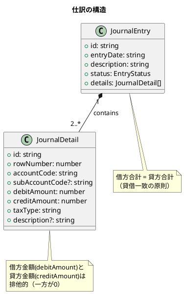
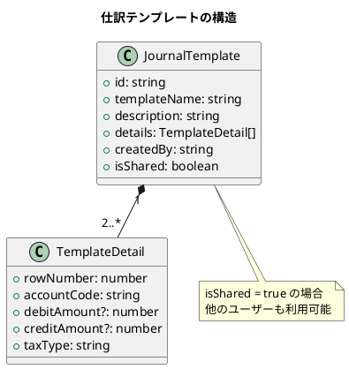
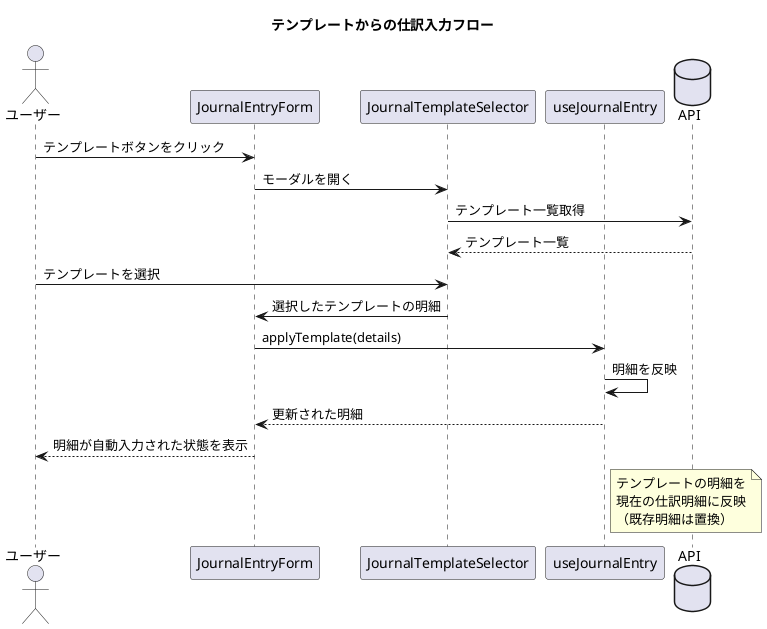

# 第11章: 仕訳入力

本章では、財務会計システムの中核機能である仕訳入力の実装を解説します。複式簿記の原則に基づく借方・貸方入力、勘定科目選択、消費税自動計算、貸借バランス検証など、仕訳入力に必要な機能を実装します。

## 11.1 仕訳入力画面

### 11.1.1 仕訳入力の概念

仕訳（Journal Entry）は、取引を借方と貸方に分けて記録する複式簿記の基本単位です。1つの仕訳は必ず借方合計と貸方合計が一致する必要があります。



### 11.1.2 型定義

**src/types/journalEntry.ts**:

```typescript
// 仕訳ステータス
export type EntryStatus = 'draft' | 'pending' | 'approved' | 'rejected';

// 仕訳ヘッダー
export interface JournalEntry {
  id: string;
  slipNumber: string;        // 伝票番号
  entryDate: string;         // 仕訳日付
  description: string;       // 摘要
  status: EntryStatus;       // ステータス
  fiscalYear: number;        // 会計年度
  fiscalMonth: number;       // 会計月
  details: JournalDetail[];  // 仕訳明細
  createdBy: string;         // 作成者
  createdAt: string;         // 作成日時
  updatedAt: string;         // 更新日時
  version: number;           // 楽観的ロック用バージョン
}

// 仕訳明細
export interface JournalDetail {
  id: string;
  rowNumber: number;         // 行番号
  accountCode: string;       // 勘定科目コード
  accountName: string;       // 勘定科目名
  subAccountCode?: string;   // 補助科目コード
  subAccountName?: string;   // 補助科目名
  departmentCode?: string;   // 部門コード
  departmentName?: string;   // 部門名
  debitAmount: number;       // 借方金額
  creditAmount: number;      // 貸方金額
  taxType: string;           // 課税区分
  taxRate: number;           // 税率
  taxAmount: number;         // 税額
  description?: string;      // 明細摘要
}

// 仕訳登録リクエスト
export interface JournalEntryRequest {
  entryDate: string;
  description: string;
  details: JournalDetailRequest[];
}

// 仕訳明細登録リクエスト
export interface JournalDetailRequest {
  rowNumber: number;
  accountCode: string;
  subAccountCode?: string;
  departmentCode?: string;
  debitAmount: number;
  creditAmount: number;
  taxType: string;
  description?: string;
}
```

### 11.1.3 JournalEntryContainer

**src/components/journal/entry/JournalEntryContainer.tsx**:

```typescript
import React, { useState, useCallback } from 'react';
import { useNavigate, useParams } from 'react-router-dom';
import { useQueryClient } from '@tanstack/react-query';
import {
  useGetJournalEntry,
  useCreateJournalEntry,
  useUpdateJournalEntry,
  getGetJournalEntriesQueryKey,
} from '@/api/generated/journal-entry/journal-entry';
import { JournalEntryRequest, JournalDetailRequest } from '@/api/model';
import { JournalEntryForm } from '@/views/journal/entry/JournalEntryForm';
import { Loading } from '@/views/common/Loading';
import { ErrorMessage } from '@/views/common/ErrorMessage';
import { useMessage } from '@/providers/MessageProvider';
import { useAccountingPeriod } from '@/providers/AccountingPeriodProvider';

export const JournalEntryContainer: React.FC = () => {
  const { id } = useParams<{ id?: string }>();
  const navigate = useNavigate();
  const queryClient = useQueryClient();
  const { showSuccess, showError } = useMessage();
  const { currentPeriod, isMonthClosed } = useAccountingPeriod();

  const isEditMode = Boolean(id);

  // 編集時は既存データを取得
  const {
    data: existingEntry,
    isLoading,
    error,
  } = useGetJournalEntry(id!, {
    query: {
      enabled: isEditMode,
    },
  });

  // 登録 mutation
  const createMutation = useCreateJournalEntry();

  // 更新 mutation
  const updateMutation = useUpdateJournalEntry();

  // 保存処理
  const handleSave = useCallback(
    async (data: JournalEntryRequest) => {
      // 月次締め済みチェック
      if (isMonthClosed(data.entryDate)) {
        showError('指定された日付の月は締め処理済みのため、仕訳を登録できません。');
        return;
      }

      try {
        if (isEditMode && id) {
          await updateMutation.mutateAsync({
            id,
            data: {
              ...data,
              version: existingEntry!.version,
            },
          });
          showSuccess('仕訳を更新しました。');
        } else {
          const result = await createMutation.mutateAsync({ data });
          showSuccess('仕訳を登録しました。');
          navigate(`/journal/${result.id}`);
        }

        // キャッシュを無効化
        queryClient.invalidateQueries({
          queryKey: getGetJournalEntriesQueryKey(),
        });
      } catch (err: any) {
        if (err.response?.status === 409) {
          showError('他のユーザーによって更新されています。再読み込みしてください。');
        } else {
          showError('保存に失敗しました。');
        }
      }
    },
    [isEditMode, id, existingEntry, isMonthClosed, createMutation, updateMutation, navigate, queryClient, showSuccess, showError]
  );

  // キャンセル処理
  const handleCancel = useCallback(() => {
    navigate('/journal');
  }, [navigate]);

  // 下書き保存処理
  const handleSaveDraft = useCallback(
    async (data: JournalEntryRequest) => {
      try {
        if (isEditMode && id) {
          await updateMutation.mutateAsync({
            id,
            data: {
              ...data,
              status: 'draft',
              version: existingEntry!.version,
            },
          });
        } else {
          await createMutation.mutateAsync({
            data: {
              ...data,
              status: 'draft',
            },
          });
        }
        showSuccess('下書きを保存しました。');
      } catch (err) {
        showError('下書きの保存に失敗しました。');
      }
    },
    [isEditMode, id, existingEntry, createMutation, updateMutation, showSuccess, showError]
  );

  if (isEditMode && isLoading) {
    return <Loading />;
  }

  if (isEditMode && error) {
    return <ErrorMessage error={error} />;
  }

  // 承認済み仕訳は編集不可
  if (existingEntry?.status === 'approved') {
    return (
      <div className="error-container">
        <p>承認済みの仕訳は編集できません。</p>
        <button onClick={handleCancel}>一覧に戻る</button>
      </div>
    );
  }

  return (
    <JournalEntryForm
      entry={existingEntry}
      defaultDate={currentPeriod?.startDate}
      onSave={handleSave}
      onSaveDraft={handleSaveDraft}
      onCancel={handleCancel}
      isSaving={createMutation.isPending || updateMutation.isPending}
    />
  );
};
```

### 11.1.4 JournalEntryForm

**src/views/journal/entry/JournalEntryForm.tsx**:

```typescript
import React, { useState, useCallback, useMemo } from 'react';
import { JournalEntryResponse, JournalEntryRequest, JournalDetailRequest } from '@/api/model';
import { JournalDetailForm } from './JournalDetailForm';
import { BalanceValidator } from './BalanceValidator';
import { JournalTemplateSelector } from './JournalTemplateSelector';
import { useJournalEntry } from '@/hooks/useJournalEntry';
import { useBalanceValidation } from '@/hooks/useBalanceValidation';
import dayjs from 'dayjs';
import './JournalEntryForm.css';

interface Props {
  entry?: JournalEntryResponse;
  defaultDate?: string;
  onSave: (data: JournalEntryRequest) => Promise<void>;
  onSaveDraft: (data: JournalEntryRequest) => Promise<void>;
  onCancel: () => void;
  isSaving: boolean;
}

export const JournalEntryForm: React.FC<Props> = ({
  entry,
  defaultDate,
  onSave,
  onSaveDraft,
  onCancel,
  isSaving,
}) => {
  // 仕訳入力状態管理
  const {
    entryDate,
    setEntryDate,
    description,
    setDescription,
    details,
    addDetail,
    updateDetail,
    removeDetail,
    moveDetailUp,
    moveDetailDown,
    clearAll,
    applyTemplate,
  } = useJournalEntry(entry);

  // 貸借バランス検証
  const {
    debitTotal,
    creditTotal,
    difference,
    isBalanced,
    validationErrors,
  } = useBalanceValidation(details);

  // テンプレート選択モーダル
  const [showTemplateSelector, setShowTemplateSelector] = useState(false);

  // フォームのバリデーション
  const formErrors = useMemo(() => {
    const errors: string[] = [];

    if (!entryDate) {
      errors.push('仕訳日付は必須です。');
    }

    if (!description.trim()) {
      errors.push('摘要は必須です。');
    }

    if (details.length < 2) {
      errors.push('仕訳明細は最低2行必要です。');
    }

    // 明細のバリデーション
    details.forEach((detail, index) => {
      if (!detail.accountCode) {
        errors.push(`明細${index + 1}行目: 勘定科目を選択してください。`);
      }
      if (detail.debitAmount === 0 && detail.creditAmount === 0) {
        errors.push(`明細${index + 1}行目: 借方または貸方の金額を入力してください。`);
      }
      if (detail.debitAmount > 0 && detail.creditAmount > 0) {
        errors.push(`明細${index + 1}行目: 借方と貸方の両方に金額を入力することはできません。`);
      }
    });

    return errors;
  }, [entryDate, description, details]);

  // 保存可否判定
  const canSave = formErrors.length === 0 && isBalanced;

  // 保存処理
  const handleSave = useCallback(async () => {
    if (!canSave) return;

    const request: JournalEntryRequest = {
      entryDate,
      description,
      details: details.map((detail, index) => ({
        rowNumber: index + 1,
        accountCode: detail.accountCode,
        subAccountCode: detail.subAccountCode,
        departmentCode: detail.departmentCode,
        debitAmount: detail.debitAmount,
        creditAmount: detail.creditAmount,
        taxType: detail.taxType,
        description: detail.description,
      })),
    };

    await onSave(request);
  }, [canSave, entryDate, description, details, onSave]);

  // 下書き保存処理（貸借不一致でも保存可能）
  const handleSaveDraft = useCallback(async () => {
    if (formErrors.filter(e => !e.includes('貸借')).length > 0) return;

    const request: JournalEntryRequest = {
      entryDate,
      description,
      details: details.map((detail, index) => ({
        rowNumber: index + 1,
        accountCode: detail.accountCode,
        subAccountCode: detail.subAccountCode,
        departmentCode: detail.departmentCode,
        debitAmount: detail.debitAmount,
        creditAmount: detail.creditAmount,
        taxType: detail.taxType,
        description: detail.description,
      })),
    };

    await onSaveDraft(request);
  }, [formErrors, entryDate, description, details, onSaveDraft]);

  // テンプレート選択
  const handleSelectTemplate = useCallback(
    (template: JournalDetailRequest[]) => {
      applyTemplate(template);
      setShowTemplateSelector(false);
    },
    [applyTemplate]
  );

  return (
    <div className="journal-entry-form">
      <div className="form-header">
        <h2>{entry ? '仕訳編集' : '仕訳入力'}</h2>
        <div className="header-actions">
          <button
            type="button"
            className="btn-secondary"
            onClick={() => setShowTemplateSelector(true)}
          >
            テンプレートから入力
          </button>
          <button
            type="button"
            className="btn-secondary"
            onClick={clearAll}
          >
            クリア
          </button>
        </div>
      </div>

      {/* ヘッダー情報 */}
      <div className="form-section">
        <div className="form-row">
          <div className="form-group">
            <label htmlFor="entryDate">仕訳日付 *</label>
            <input
              type="date"
              id="entryDate"
              value={entryDate}
              onChange={(e) => setEntryDate(e.target.value)}
              required
            />
          </div>
          <div className="form-group slip-number">
            <label>伝票番号</label>
            <span className="readonly-value">
              {entry?.slipNumber || '（自動採番）'}
            </span>
          </div>
        </div>
        <div className="form-row">
          <div className="form-group description-group">
            <label htmlFor="description">摘要 *</label>
            <input
              type="text"
              id="description"
              value={description}
              onChange={(e) => setDescription(e.target.value)}
              placeholder="取引の内容を入力"
              maxLength={200}
              required
            />
          </div>
        </div>
      </div>

      {/* 仕訳明細 */}
      <div className="form-section details-section">
        <div className="section-header">
          <h3>仕訳明細</h3>
          <button
            type="button"
            className="btn-add"
            onClick={addDetail}
          >
            + 行追加
          </button>
        </div>

        <JournalDetailForm
          details={details}
          onUpdate={updateDetail}
          onRemove={removeDetail}
          onMoveUp={moveDetailUp}
          onMoveDown={moveDetailDown}
        />
      </div>

      {/* 貸借バランス表示 */}
      <BalanceValidator
        debitTotal={debitTotal}
        creditTotal={creditTotal}
        difference={difference}
        isBalanced={isBalanced}
        errors={validationErrors}
      />

      {/* バリデーションエラー表示 */}
      {formErrors.length > 0 && (
        <div className="validation-errors">
          <ul>
            {formErrors.map((error, index) => (
              <li key={index}>{error}</li>
            ))}
          </ul>
        </div>
      )}

      {/* アクションボタン */}
      <div className="form-actions">
        <button
          type="button"
          className="btn-secondary"
          onClick={onCancel}
          disabled={isSaving}
        >
          キャンセル
        </button>
        <button
          type="button"
          className="btn-secondary"
          onClick={handleSaveDraft}
          disabled={isSaving}
        >
          下書き保存
        </button>
        <button
          type="button"
          className="btn-primary"
          onClick={handleSave}
          disabled={!canSave || isSaving}
        >
          {isSaving ? '保存中...' : '保存'}
        </button>
      </div>

      {/* テンプレート選択モーダル */}
      {showTemplateSelector && (
        <JournalTemplateSelector
          onSelect={handleSelectTemplate}
          onClose={() => setShowTemplateSelector(false)}
        />
      )}
    </div>
  );
};
```

### 11.1.5 useJournalEntry フック

**src/hooks/useJournalEntry.ts**:

```typescript
import { useState, useCallback, useMemo } from 'react';
import { JournalEntryResponse, JournalDetailRequest } from '@/api/model';
import dayjs from 'dayjs';

// 仕訳明細の内部表現
export interface JournalDetailState {
  id: string;                 // 一意識別子（画面内）
  accountCode: string;
  accountName: string;
  subAccountCode?: string;
  subAccountName?: string;
  departmentCode?: string;
  departmentName?: string;
  debitAmount: number;
  creditAmount: number;
  taxType: string;
  description?: string;
}

// 初期明細の生成
const createEmptyDetail = (): JournalDetailState => ({
  id: crypto.randomUUID(),
  accountCode: '',
  accountName: '',
  debitAmount: 0,
  creditAmount: 0,
  taxType: 'non_taxable',
});

// 既存仕訳からの明細変換
const convertToDetailState = (
  detail: JournalEntryResponse['details'][0]
): JournalDetailState => ({
  id: detail.id || crypto.randomUUID(),
  accountCode: detail.accountCode,
  accountName: detail.accountName,
  subAccountCode: detail.subAccountCode,
  subAccountName: detail.subAccountName,
  departmentCode: detail.departmentCode,
  departmentName: detail.departmentName,
  debitAmount: detail.debitAmount,
  creditAmount: detail.creditAmount,
  taxType: detail.taxType,
  description: detail.description,
});

export const useJournalEntry = (existingEntry?: JournalEntryResponse) => {
  // ヘッダー情報
  const [entryDate, setEntryDate] = useState<string>(
    existingEntry?.entryDate || dayjs().format('YYYY-MM-DD')
  );
  const [description, setDescription] = useState<string>(
    existingEntry?.description || ''
  );

  // 明細情報
  const [details, setDetails] = useState<JournalDetailState[]>(() => {
    if (existingEntry?.details && existingEntry.details.length > 0) {
      return existingEntry.details.map(convertToDetailState);
    }
    // 新規作成時は2行の空明細
    return [createEmptyDetail(), createEmptyDetail()];
  });

  // 明細追加
  const addDetail = useCallback(() => {
    setDetails((prev) => [...prev, createEmptyDetail()]);
  }, []);

  // 明細更新
  const updateDetail = useCallback(
    (id: string, updates: Partial<JournalDetailState>) => {
      setDetails((prev) =>
        prev.map((detail) =>
          detail.id === id ? { ...detail, ...updates } : detail
        )
      );
    },
    []
  );

  // 明細削除
  const removeDetail = useCallback((id: string) => {
    setDetails((prev) => {
      const filtered = prev.filter((detail) => detail.id !== id);
      // 最低2行は維持
      if (filtered.length < 2) {
        return [...filtered, createEmptyDetail()];
      }
      return filtered;
    });
  }, []);

  // 明細の行移動（上へ）
  const moveDetailUp = useCallback((id: string) => {
    setDetails((prev) => {
      const index = prev.findIndex((d) => d.id === id);
      if (index <= 0) return prev;

      const newDetails = [...prev];
      [newDetails[index - 1], newDetails[index]] = [
        newDetails[index],
        newDetails[index - 1],
      ];
      return newDetails;
    });
  }, []);

  // 明細の行移動（下へ）
  const moveDetailDown = useCallback((id: string) => {
    setDetails((prev) => {
      const index = prev.findIndex((d) => d.id === id);
      if (index < 0 || index >= prev.length - 1) return prev;

      const newDetails = [...prev];
      [newDetails[index], newDetails[index + 1]] = [
        newDetails[index + 1],
        newDetails[index],
      ];
      return newDetails;
    });
  }, []);

  // 全クリア
  const clearAll = useCallback(() => {
    setEntryDate(dayjs().format('YYYY-MM-DD'));
    setDescription('');
    setDetails([createEmptyDetail(), createEmptyDetail()]);
  }, []);

  // テンプレート適用
  const applyTemplate = useCallback(
    (templateDetails: JournalDetailRequest[]) => {
      const newDetails = templateDetails.map((template) => ({
        id: crypto.randomUUID(),
        accountCode: template.accountCode,
        accountName: '', // 別途取得が必要
        subAccountCode: template.subAccountCode,
        departmentCode: template.departmentCode,
        debitAmount: template.debitAmount,
        creditAmount: template.creditAmount,
        taxType: template.taxType,
        description: template.description,
      }));

      // 最低2行を確保
      while (newDetails.length < 2) {
        newDetails.push(createEmptyDetail());
      }

      setDetails(newDetails);
    },
    []
  );

  // 借方にコピー（貸方明細を反転して借方明細に）
  const copyToDebit = useCallback((sourceId: string) => {
    const source = details.find((d) => d.id === sourceId);
    if (!source || source.creditAmount === 0) return;

    const newDetail: JournalDetailState = {
      ...createEmptyDetail(),
      accountCode: source.accountCode,
      accountName: source.accountName,
      debitAmount: source.creditAmount,
      creditAmount: 0,
      taxType: source.taxType,
    };

    setDetails((prev) => [...prev, newDetail]);
  }, [details]);

  // 貸方にコピー（借方明細を反転して貸方明細に）
  const copyToCredit = useCallback((sourceId: string) => {
    const source = details.find((d) => d.id === sourceId);
    if (!source || source.debitAmount === 0) return;

    const newDetail: JournalDetailState = {
      ...createEmptyDetail(),
      accountCode: source.accountCode,
      accountName: source.accountName,
      debitAmount: 0,
      creditAmount: source.debitAmount,
      taxType: source.taxType,
    };

    setDetails((prev) => [...prev, newDetail]);
  }, [details]);

  return {
    // ヘッダー
    entryDate,
    setEntryDate,
    description,
    setDescription,
    // 明細
    details,
    addDetail,
    updateDetail,
    removeDetail,
    moveDetailUp,
    moveDetailDown,
    // ユーティリティ
    clearAll,
    applyTemplate,
    copyToDebit,
    copyToCredit,
  };
};
```

## 11.2 仕訳明細入力

### 11.2.1 JournalDetailForm

**src/views/journal/entry/JournalDetailForm.tsx**:

```typescript
import React from 'react';
import { JournalDetailState } from '@/hooks/useJournalEntry';
import { JournalDetailRow } from './JournalDetailRow';
import './JournalDetailForm.css';

interface Props {
  details: JournalDetailState[];
  onUpdate: (id: string, updates: Partial<JournalDetailState>) => void;
  onRemove: (id: string) => void;
  onMoveUp: (id: string) => void;
  onMoveDown: (id: string) => void;
}

export const JournalDetailForm: React.FC<Props> = ({
  details,
  onUpdate,
  onRemove,
  onMoveUp,
  onMoveDown,
}) => {
  return (
    <div className="journal-detail-form">
      <table className="detail-table">
        <thead>
          <tr>
            <th className="col-row-number">行</th>
            <th className="col-account">勘定科目</th>
            <th className="col-sub-account">補助科目</th>
            <th className="col-department">部門</th>
            <th className="col-debit">借方金額</th>
            <th className="col-credit">貸方金額</th>
            <th className="col-tax-type">課税区分</th>
            <th className="col-description">明細摘要</th>
            <th className="col-actions">操作</th>
          </tr>
        </thead>
        <tbody>
          {details.map((detail, index) => (
            <JournalDetailRow
              key={detail.id}
              detail={detail}
              rowNumber={index + 1}
              isFirst={index === 0}
              isLast={index === details.length - 1}
              onUpdate={(updates) => onUpdate(detail.id, updates)}
              onRemove={() => onRemove(detail.id)}
              onMoveUp={() => onMoveUp(detail.id)}
              onMoveDown={() => onMoveDown(detail.id)}
            />
          ))}
        </tbody>
      </table>
    </div>
  );
};
```

### 11.2.2 JournalDetailRow

**src/views/journal/entry/JournalDetailRow.tsx**:

```typescript
import React, { useState, useCallback } from 'react';
import { JournalDetailState } from '@/hooks/useJournalEntry';
import { MoneyInput } from '@/views/common/MoneyInput';
import { AccountSelector } from '@/views/common/AccountSelector';
import { TaxTypeSelector } from '@/views/common/TaxTypeSelector';
import { FiChevronUp, FiChevronDown, FiTrash2 } from 'react-icons/fi';
import './JournalDetailRow.css';

interface Props {
  detail: JournalDetailState;
  rowNumber: number;
  isFirst: boolean;
  isLast: boolean;
  onUpdate: (updates: Partial<JournalDetailState>) => void;
  onRemove: () => void;
  onMoveUp: () => void;
  onMoveDown: () => void;
}

export const JournalDetailRow: React.FC<Props> = ({
  detail,
  rowNumber,
  isFirst,
  isLast,
  onUpdate,
  onRemove,
  onMoveUp,
  onMoveDown,
}) => {
  const [showAccountSelector, setShowAccountSelector] = useState(false);

  // 勘定科目選択
  const handleAccountSelect = useCallback(
    (account: { code: string; name: string }) => {
      onUpdate({
        accountCode: account.code,
        accountName: account.name,
      });
      setShowAccountSelector(false);
    },
    [onUpdate]
  );

  // 借方金額変更
  const handleDebitChange = useCallback(
    (value: number) => {
      onUpdate({
        debitAmount: value,
        // 借方に入力したら貸方はクリア
        creditAmount: value > 0 ? 0 : detail.creditAmount,
      });
    },
    [onUpdate, detail.creditAmount]
  );

  // 貸方金額変更
  const handleCreditChange = useCallback(
    (value: number) => {
      onUpdate({
        creditAmount: value,
        // 貸方に入力したら借方はクリア
        debitAmount: value > 0 ? 0 : detail.debitAmount,
      });
    },
    [onUpdate, detail.debitAmount]
  );

  // 課税区分変更
  const handleTaxTypeChange = useCallback(
    (taxType: string) => {
      onUpdate({ taxType });
    },
    [onUpdate]
  );

  // 明細摘要変更
  const handleDescriptionChange = useCallback(
    (e: React.ChangeEvent<HTMLInputElement>) => {
      onUpdate({ description: e.target.value });
    },
    [onUpdate]
  );

  // 行の状態判定
  const hasDebit = detail.debitAmount > 0;
  const hasCredit = detail.creditAmount > 0;
  const hasAmount = hasDebit || hasCredit;
  const rowClassName = `detail-row ${hasDebit ? 'debit-row' : ''} ${hasCredit ? 'credit-row' : ''}`;

  return (
    <tr className={rowClassName}>
      <td className="col-row-number">{rowNumber}</td>

      {/* 勘定科目 */}
      <td className="col-account">
        <div className="account-input">
          <input
            type="text"
            value={detail.accountName || detail.accountCode}
            onClick={() => setShowAccountSelector(true)}
            readOnly
            placeholder="選択..."
            className={!detail.accountCode ? 'empty' : ''}
          />
          {showAccountSelector && (
            <AccountSelector
              onSelect={handleAccountSelect}
              onClose={() => setShowAccountSelector(false)}
            />
          )}
        </div>
      </td>

      {/* 補助科目 */}
      <td className="col-sub-account">
        <input
          type="text"
          value={detail.subAccountName || ''}
          readOnly
          placeholder="-"
          disabled={!detail.accountCode}
        />
      </td>

      {/* 部門 */}
      <td className="col-department">
        <input
          type="text"
          value={detail.departmentName || ''}
          readOnly
          placeholder="-"
        />
      </td>

      {/* 借方金額 */}
      <td className="col-debit">
        <MoneyInput
          value={detail.debitAmount}
          onChange={handleDebitChange}
          disabled={hasCredit}
        />
      </td>

      {/* 貸方金額 */}
      <td className="col-credit">
        <MoneyInput
          value={detail.creditAmount}
          onChange={handleCreditChange}
          disabled={hasDebit}
        />
      </td>

      {/* 課税区分 */}
      <td className="col-tax-type">
        <TaxTypeSelector
          value={detail.taxType}
          onChange={handleTaxTypeChange}
          disabled={!hasAmount}
        />
      </td>

      {/* 明細摘要 */}
      <td className="col-description">
        <input
          type="text"
          value={detail.description || ''}
          onChange={handleDescriptionChange}
          placeholder="明細の備考"
          maxLength={100}
        />
      </td>

      {/* 操作ボタン */}
      <td className="col-actions">
        <div className="action-buttons">
          <button
            type="button"
            onClick={onMoveUp}
            disabled={isFirst}
            title="上へ移動"
            className="btn-icon"
          >
            <FiChevronUp />
          </button>
          <button
            type="button"
            onClick={onMoveDown}
            disabled={isLast}
            title="下へ移動"
            className="btn-icon"
          >
            <FiChevronDown />
          </button>
          <button
            type="button"
            onClick={onRemove}
            title="削除"
            className="btn-icon btn-delete"
          >
            <FiTrash2 />
          </button>
        </div>
      </td>
    </tr>
  );
};
```

### 11.2.3 TaxTypeSelector

**src/views/common/TaxTypeSelector.tsx**:

```typescript
import React from 'react';
import { useGetTaxTypes } from '@/api/generated/tax-type/tax-type';
import './TaxTypeSelector.css';

interface Props {
  value: string;
  onChange: (value: string) => void;
  disabled?: boolean;
}

export const TaxTypeSelector: React.FC<Props> = ({
  value,
  onChange,
  disabled = false,
}) => {
  const { data: taxTypes, isLoading } = useGetTaxTypes();

  if (isLoading) {
    return <select disabled><option>読込中...</option></select>;
  }

  return (
    <select
      value={value}
      onChange={(e) => onChange(e.target.value)}
      disabled={disabled}
      className="tax-type-selector"
    >
      <option value="non_taxable">対象外</option>
      {taxTypes?.map((taxType) => (
        <option key={taxType.code} value={taxType.code}>
          {taxType.name}（{taxType.rate}%）
        </option>
      ))}
    </select>
  );
};
```

## 11.3 貸借バランス検証

### 11.3.1 useBalanceValidation フック

**src/hooks/useBalanceValidation.ts**:

```typescript
import { useMemo } from 'react';
import Decimal from 'decimal.js';
import { JournalDetailState } from './useJournalEntry';

interface BalanceValidationResult {
  debitTotal: number;
  creditTotal: number;
  difference: number;
  isBalanced: boolean;
  validationErrors: string[];
}

export const useBalanceValidation = (
  details: JournalDetailState[]
): BalanceValidationResult => {
  return useMemo(() => {
    const errors: string[] = [];

    // 借方合計・貸方合計の計算（decimal.js で精度保証）
    let debitTotal = new Decimal(0);
    let creditTotal = new Decimal(0);

    details.forEach((detail, index) => {
      if (detail.debitAmount > 0 && detail.creditAmount > 0) {
        errors.push(
          `${index + 1}行目: 借方と貸方の両方に金額が入力されています。`
        );
      }

      debitTotal = debitTotal.plus(new Decimal(detail.debitAmount || 0));
      creditTotal = creditTotal.plus(new Decimal(detail.creditAmount || 0));
    });

    // 差額計算
    const difference = debitTotal.minus(creditTotal);
    const isBalanced = difference.isZero();

    if (!isBalanced) {
      const diffValue = difference.toNumber();
      if (diffValue > 0) {
        errors.push(
          `貸借が一致していません。借方が ${Math.abs(diffValue).toLocaleString()} 円多くなっています。`
        );
      } else {
        errors.push(
          `貸借が一致していません。貸方が ${Math.abs(diffValue).toLocaleString()} 円多くなっています。`
        );
      }
    }

    // 合計が0の場合のチェック
    if (debitTotal.isZero() && creditTotal.isZero()) {
      errors.push('借方・貸方のいずれかに金額を入力してください。');
    }

    return {
      debitTotal: debitTotal.toNumber(),
      creditTotal: creditTotal.toNumber(),
      difference: difference.toNumber(),
      isBalanced,
      validationErrors: errors,
    };
  }, [details]);
};
```

### 11.3.2 BalanceValidator

**src/views/journal/entry/BalanceValidator.tsx**:

```typescript
import React from 'react';
import { FiCheckCircle, FiAlertCircle } from 'react-icons/fi';
import './BalanceValidator.css';

interface Props {
  debitTotal: number;
  creditTotal: number;
  difference: number;
  isBalanced: boolean;
  errors: string[];
}

export const BalanceValidator: React.FC<Props> = ({
  debitTotal,
  creditTotal,
  difference,
  isBalanced,
  errors,
}) => {
  const formatMoney = (amount: number) => amount.toLocaleString();

  return (
    <div className={`balance-validator ${isBalanced ? 'balanced' : 'unbalanced'}`}>
      <div className="balance-summary">
        <div className="balance-row">
          <span className="label">借方合計:</span>
          <span className="amount debit">{formatMoney(debitTotal)} 円</span>
        </div>
        <div className="balance-row">
          <span className="label">貸方合計:</span>
          <span className="amount credit">{formatMoney(creditTotal)} 円</span>
        </div>
        <div className="balance-divider" />
        <div className="balance-row difference">
          <span className="label">差額:</span>
          <span className={`amount ${difference === 0 ? 'zero' : 'non-zero'}`}>
            {difference >= 0 ? '+' : ''}{formatMoney(difference)} 円
          </span>
        </div>
      </div>

      <div className="balance-status">
        {isBalanced ? (
          <div className="status-indicator success">
            <FiCheckCircle />
            <span>貸借一致</span>
          </div>
        ) : (
          <div className="status-indicator error">
            <FiAlertCircle />
            <span>貸借不一致</span>
          </div>
        )}
      </div>

      {errors.length > 0 && (
        <div className="balance-errors">
          <ul>
            {errors.map((error, index) => (
              <li key={index}>{error}</li>
            ))}
          </ul>
        </div>
      )}
    </div>
  );
};
```

### 11.3.3 スタイル定義

**src/views/journal/entry/BalanceValidator.css**:

```css
.balance-validator {
  display: flex;
  flex-wrap: wrap;
  gap: 1rem;
  padding: 1rem;
  border-radius: 4px;
  background-color: #f8f9fa;
  margin-top: 1rem;
}

.balance-validator.balanced {
  border-left: 4px solid #28a745;
}

.balance-validator.unbalanced {
  border-left: 4px solid #dc3545;
  background-color: #fff8f8;
}

.balance-summary {
  flex: 1;
  min-width: 200px;
}

.balance-row {
  display: flex;
  justify-content: space-between;
  padding: 0.25rem 0;
}

.balance-row .label {
  color: #666;
}

.balance-row .amount {
  font-weight: bold;
  font-family: 'Consolas', monospace;
}

.balance-row .amount.debit {
  color: #0066cc;
}

.balance-row .amount.credit {
  color: #cc0066;
}

.balance-row.difference .amount.zero {
  color: #28a745;
}

.balance-row.difference .amount.non-zero {
  color: #dc3545;
}

.balance-divider {
  border-top: 1px solid #ddd;
  margin: 0.5rem 0;
}

.balance-status {
  display: flex;
  align-items: center;
}

.status-indicator {
  display: flex;
  align-items: center;
  gap: 0.5rem;
  padding: 0.5rem 1rem;
  border-radius: 4px;
  font-weight: bold;
}

.status-indicator.success {
  background-color: #d4edda;
  color: #155724;
}

.status-indicator.error {
  background-color: #f8d7da;
  color: #721c24;
}

.balance-errors {
  width: 100%;
  margin-top: 0.5rem;
}

.balance-errors ul {
  margin: 0;
  padding-left: 1.5rem;
  color: #dc3545;
}

.balance-errors li {
  margin: 0.25rem 0;
}
```

## 11.4 仕訳テンプレート

### 11.4.1 テンプレートの概念

仕訳テンプレートは、よく使用する仕訳パターンを保存し、再利用するための機能です。



### 11.4.2 JournalTemplateContainer

**src/components/journal/template/JournalTemplateContainer.tsx**:

```typescript
import React, { useState, useCallback } from 'react';
import { useQueryClient } from '@tanstack/react-query';
import {
  useGetJournalTemplates,
  useCreateJournalTemplate,
  useUpdateJournalTemplate,
  useDeleteJournalTemplate,
  getGetJournalTemplatesQueryKey,
} from '@/api/generated/journal-template/journal-template';
import {
  JournalTemplateResponse,
  JournalTemplateRequest,
} from '@/api/model';
import { JournalTemplateCollection } from '@/views/journal/template/JournalTemplateCollection';
import { JournalTemplateEditModal } from '@/views/journal/template/JournalTemplateEditModal';
import { Loading } from '@/views/common/Loading';
import { ErrorMessage } from '@/views/common/ErrorMessage';
import { useConfirm } from '@/hooks/useConfirm';
import { ConfirmModal } from '@/views/common/ConfirmModal';
import { useMessage } from '@/providers/MessageProvider';

export const JournalTemplateContainer: React.FC = () => {
  const queryClient = useQueryClient();
  const { showSuccess, showError } = useMessage();
  const { confirmState, confirm, handleConfirm, handleCancel } = useConfirm();

  // テンプレート一覧取得
  const { data: templates, isLoading, error } = useGetJournalTemplates();

  // 各種 mutation
  const createMutation = useCreateJournalTemplate();
  const updateMutation = useUpdateJournalTemplate();
  const deleteMutation = useDeleteJournalTemplate();

  // 編集モーダル
  const [editingTemplate, setEditingTemplate] = useState<JournalTemplateResponse | null>(null);
  const [showCreateModal, setShowCreateModal] = useState(false);

  // 新規作成
  const handleCreate = useCallback(async (data: JournalTemplateRequest) => {
    try {
      await createMutation.mutateAsync({ data });
      showSuccess('テンプレートを作成しました。');
      setShowCreateModal(false);
      queryClient.invalidateQueries({
        queryKey: getGetJournalTemplatesQueryKey(),
      });
    } catch (err) {
      showError('テンプレートの作成に失敗しました。');
    }
  }, [createMutation, queryClient, showSuccess, showError]);

  // 更新
  const handleUpdate = useCallback(async (data: JournalTemplateRequest) => {
    if (!editingTemplate) return;

    try {
      await updateMutation.mutateAsync({
        id: editingTemplate.id,
        data,
      });
      showSuccess('テンプレートを更新しました。');
      setEditingTemplate(null);
      queryClient.invalidateQueries({
        queryKey: getGetJournalTemplatesQueryKey(),
      });
    } catch (err) {
      showError('テンプレートの更新に失敗しました。');
    }
  }, [editingTemplate, updateMutation, queryClient, showSuccess, showError]);

  // 削除
  const handleDelete = useCallback(async (template: JournalTemplateResponse) => {
    const confirmed = await confirm(
      `テンプレート「${template.templateName}」を削除しますか？`
    );
    if (!confirmed) return;

    try {
      await deleteMutation.mutateAsync({ id: template.id });
      showSuccess('テンプレートを削除しました。');
      queryClient.invalidateQueries({
        queryKey: getGetJournalTemplatesQueryKey(),
      });
    } catch (err) {
      showError('テンプレートの削除に失敗しました。');
    }
  }, [confirm, deleteMutation, queryClient, showSuccess, showError]);

  if (isLoading) return <Loading />;
  if (error) return <ErrorMessage error={error} />;

  return (
    <div className="journal-template-container">
      <JournalTemplateCollection
        templates={templates || []}
        onEdit={setEditingTemplate}
        onDelete={handleDelete}
        onCreate={() => setShowCreateModal(true)}
      />

      {/* 新規作成モーダル */}
      {showCreateModal && (
        <JournalTemplateEditModal
          onSave={handleCreate}
          onClose={() => setShowCreateModal(false)}
          isSaving={createMutation.isPending}
        />
      )}

      {/* 編集モーダル */}
      {editingTemplate && (
        <JournalTemplateEditModal
          template={editingTemplate}
          onSave={handleUpdate}
          onClose={() => setEditingTemplate(null)}
          isSaving={updateMutation.isPending}
        />
      )}

      {/* 確認モーダル */}
      <ConfirmModal
        isOpen={confirmState.isOpen}
        message={confirmState.message}
        onConfirm={handleConfirm}
        onCancel={handleCancel}
      />
    </div>
  );
};
```

### 11.4.3 JournalTemplateSelector

**src/views/journal/entry/JournalTemplateSelector.tsx**:

```typescript
import React, { useState, useCallback } from 'react';
import Modal from 'react-modal';
import { useGetJournalTemplates } from '@/api/generated/journal-template/journal-template';
import { JournalDetailRequest } from '@/api/model';
import { Loading } from '@/views/common/Loading';
import { FiSearch, FiX } from 'react-icons/fi';
import './JournalTemplateSelector.css';

interface Props {
  onSelect: (details: JournalDetailRequest[]) => void;
  onClose: () => void;
}

export const JournalTemplateSelector: React.FC<Props> = ({
  onSelect,
  onClose,
}) => {
  const { data: templates, isLoading } = useGetJournalTemplates();
  const [searchKeyword, setSearchKeyword] = useState('');

  // 検索フィルタ
  const filteredTemplates = templates?.filter((template) =>
    template.templateName.toLowerCase().includes(searchKeyword.toLowerCase()) ||
    template.description?.toLowerCase().includes(searchKeyword.toLowerCase())
  );

  // テンプレート選択
  const handleSelect = useCallback(
    (templateId: string) => {
      const template = templates?.find((t) => t.id === templateId);
      if (template) {
        onSelect(template.details);
      }
    },
    [templates, onSelect]
  );

  return (
    <Modal
      isOpen={true}
      onRequestClose={onClose}
      className="template-selector-modal"
      overlayClassName="modal-overlay"
    >
      <div className="modal-header">
        <h3>仕訳テンプレート選択</h3>
        <button className="btn-close" onClick={onClose}>
          <FiX />
        </button>
      </div>

      <div className="modal-body">
        {/* 検索バー */}
        <div className="search-bar">
          <FiSearch />
          <input
            type="text"
            placeholder="テンプレート名で検索..."
            value={searchKeyword}
            onChange={(e) => setSearchKeyword(e.target.value)}
          />
        </div>

        {isLoading ? (
          <Loading />
        ) : (
          <div className="template-list">
            {filteredTemplates?.length === 0 ? (
              <div className="empty-message">
                テンプレートがありません
              </div>
            ) : (
              filteredTemplates?.map((template) => (
                <div
                  key={template.id}
                  className="template-item"
                  onClick={() => handleSelect(template.id)}
                >
                  <div className="template-info">
                    <h4>{template.templateName}</h4>
                    <p>{template.description}</p>
                    <div className="template-details">
                      {template.details.slice(0, 3).map((detail, index) => (
                        <span key={index} className="detail-preview">
                          {detail.accountCode}
                          {index < Math.min(template.details.length, 3) - 1 && ' / '}
                        </span>
                      ))}
                      {template.details.length > 3 && (
                        <span className="more">+{template.details.length - 3}件</span>
                      )}
                    </div>
                  </div>
                  <div className="template-badge">
                    {template.isShared ? '共有' : '個人'}
                  </div>
                </div>
              ))
            )}
          </div>
        )}
      </div>
    </Modal>
  );
};
```

### 11.4.4 テンプレートから仕訳入力への流れ



## 11.5 消費税自動計算

### 11.5.1 useTaxCalculation フック

**src/hooks/useTaxCalculation.ts**:

```typescript
import { useCallback } from 'react';
import Decimal from 'decimal.js';
import { useGetTaxCodes } from '@/api/generated/tax-code/tax-code';

interface TaxCalculationResult {
  taxIncludedAmount: number;  // 税込金額
  taxExcludedAmount: number;  // 税抜金額
  taxAmount: number;          // 税額
}

export const useTaxCalculation = () => {
  const { data: taxCodes } = useGetTaxCodes();

  // 税率の取得
  const getTaxRate = useCallback(
    (taxType: string): number => {
      if (taxType === 'non_taxable') return 0;

      const taxCode = taxCodes?.find((code) => code.code === taxType);
      return taxCode?.rate ?? 0;
    },
    [taxCodes]
  );

  // 税込金額から計算（内税）
  const calculateFromTaxIncluded = useCallback(
    (taxIncludedAmount: number, taxType: string): TaxCalculationResult => {
      const rate = getTaxRate(taxType);

      if (rate === 0) {
        return {
          taxIncludedAmount,
          taxExcludedAmount: taxIncludedAmount,
          taxAmount: 0,
        };
      }

      const taxIncluded = new Decimal(taxIncludedAmount);
      const taxRate = new Decimal(rate).dividedBy(100);

      // 税抜金額 = 税込金額 / (1 + 税率)
      const taxExcluded = taxIncluded.dividedBy(
        new Decimal(1).plus(taxRate)
      ).toDecimalPlaces(0, Decimal.ROUND_DOWN);

      // 税額 = 税込金額 - 税抜金額
      const tax = taxIncluded.minus(taxExcluded);

      return {
        taxIncludedAmount,
        taxExcludedAmount: taxExcluded.toNumber(),
        taxAmount: tax.toNumber(),
      };
    },
    [getTaxRate]
  );

  // 税抜金額から計算（外税）
  const calculateFromTaxExcluded = useCallback(
    (taxExcludedAmount: number, taxType: string): TaxCalculationResult => {
      const rate = getTaxRate(taxType);

      if (rate === 0) {
        return {
          taxIncludedAmount: taxExcludedAmount,
          taxExcludedAmount,
          taxAmount: 0,
        };
      }

      const taxExcluded = new Decimal(taxExcludedAmount);
      const taxRate = new Decimal(rate).dividedBy(100);

      // 税額 = 税抜金額 × 税率（端数切り捨て）
      const tax = taxExcluded
        .times(taxRate)
        .toDecimalPlaces(0, Decimal.ROUND_DOWN);

      // 税込金額 = 税抜金額 + 税額
      const taxIncluded = taxExcluded.plus(tax);

      return {
        taxIncludedAmount: taxIncluded.toNumber(),
        taxExcludedAmount,
        taxAmount: tax.toNumber(),
      };
    },
    [getTaxRate]
  );

  return {
    getTaxRate,
    calculateFromTaxIncluded,
    calculateFromTaxExcluded,
  };
};
```

### 11.5.2 税額計算の統合

仕訳明細入力時に課税区分を選択すると、自動的に税額が計算されます。

**JournalDetailRow の拡張**:

```typescript
// JournalDetailRow.tsx に追加

import { useTaxCalculation } from '@/hooks/useTaxCalculation';

// コンポーネント内
const { calculateFromTaxIncluded } = useTaxCalculation();

// 課税区分変更時に税額を自動計算
const handleTaxTypeChange = useCallback(
  (taxType: string) => {
    const amount = detail.debitAmount || detail.creditAmount;

    if (amount > 0 && taxType !== 'non_taxable') {
      const { taxAmount } = calculateFromTaxIncluded(amount, taxType);
      onUpdate({
        taxType,
        taxAmount,
      });
    } else {
      onUpdate({
        taxType,
        taxAmount: 0,
      });
    }
  },
  [detail.debitAmount, detail.creditAmount, calculateFromTaxIncluded, onUpdate]
);
```

## 11.6 スタイル定義

### 11.6.1 仕訳入力フォームのスタイル

**src/views/journal/entry/JournalEntryForm.css**:

```css
.journal-entry-form {
  max-width: 1200px;
  margin: 0 auto;
  padding: 1.5rem;
}

.form-header {
  display: flex;
  justify-content: space-between;
  align-items: center;
  margin-bottom: 1.5rem;
}

.form-header h2 {
  margin: 0;
  font-size: 1.5rem;
  color: #333;
}

.header-actions {
  display: flex;
  gap: 0.5rem;
}

.form-section {
  background: #fff;
  border: 1px solid #e0e0e0;
  border-radius: 4px;
  padding: 1rem;
  margin-bottom: 1rem;
}

.form-row {
  display: flex;
  gap: 1rem;
  margin-bottom: 1rem;
}

.form-row:last-child {
  margin-bottom: 0;
}

.form-group {
  display: flex;
  flex-direction: column;
  gap: 0.25rem;
}

.form-group label {
  font-size: 0.875rem;
  color: #666;
  font-weight: 500;
}

.form-group input[type="date"],
.form-group input[type="text"] {
  padding: 0.5rem;
  border: 1px solid #ddd;
  border-radius: 4px;
  font-size: 1rem;
}

.form-group input:focus {
  outline: none;
  border-color: #0066cc;
  box-shadow: 0 0 0 2px rgba(0, 102, 204, 0.1);
}

.description-group {
  flex: 1;
}

.description-group input {
  width: 100%;
}

.slip-number .readonly-value {
  padding: 0.5rem;
  background: #f5f5f5;
  border: 1px solid #ddd;
  border-radius: 4px;
  color: #666;
}

.details-section .section-header {
  display: flex;
  justify-content: space-between;
  align-items: center;
  margin-bottom: 1rem;
}

.details-section h3 {
  margin: 0;
  font-size: 1.125rem;
}

.btn-add {
  padding: 0.5rem 1rem;
  background: #28a745;
  color: #fff;
  border: none;
  border-radius: 4px;
  cursor: pointer;
}

.btn-add:hover {
  background: #218838;
}

.validation-errors {
  background: #fff8f8;
  border: 1px solid #dc3545;
  border-radius: 4px;
  padding: 1rem;
  margin-top: 1rem;
}

.validation-errors ul {
  margin: 0;
  padding-left: 1.5rem;
  color: #dc3545;
}

.form-actions {
  display: flex;
  justify-content: flex-end;
  gap: 0.5rem;
  margin-top: 1.5rem;
  padding-top: 1rem;
  border-top: 1px solid #e0e0e0;
}

.btn-primary,
.btn-secondary {
  padding: 0.75rem 1.5rem;
  border-radius: 4px;
  font-size: 1rem;
  cursor: pointer;
}

.btn-primary {
  background: #0066cc;
  color: #fff;
  border: none;
}

.btn-primary:hover:not(:disabled) {
  background: #0052a3;
}

.btn-primary:disabled {
  background: #ccc;
  cursor: not-allowed;
}

.btn-secondary {
  background: #fff;
  color: #666;
  border: 1px solid #ddd;
}

.btn-secondary:hover:not(:disabled) {
  background: #f5f5f5;
}
```

### 11.6.2 明細テーブルのスタイル

**src/views/journal/entry/JournalDetailForm.css**:

```css
.journal-detail-form {
  overflow-x: auto;
}

.detail-table {
  width: 100%;
  border-collapse: collapse;
  font-size: 0.875rem;
}

.detail-table th,
.detail-table td {
  padding: 0.5rem;
  border: 1px solid #e0e0e0;
  text-align: left;
}

.detail-table th {
  background: #f5f5f5;
  font-weight: 500;
  color: #333;
  white-space: nowrap;
}

/* カラム幅の定義 */
.col-row-number {
  width: 40px;
  text-align: center;
}

.col-account {
  width: 180px;
}

.col-sub-account {
  width: 120px;
}

.col-department {
  width: 100px;
}

.col-debit,
.col-credit {
  width: 130px;
}

.col-tax-type {
  width: 120px;
}

.col-description {
  width: auto;
  min-width: 150px;
}

.col-actions {
  width: 100px;
  text-align: center;
}

/* 行のスタイル */
.detail-row.debit-row {
  background-color: #f0f7ff;
}

.detail-row.credit-row {
  background-color: #fff0f5;
}

/* 入力フィールド */
.detail-table input,
.detail-table select {
  width: 100%;
  padding: 0.375rem;
  border: 1px solid #ddd;
  border-radius: 4px;
  font-size: 0.875rem;
}

.detail-table input:focus,
.detail-table select:focus {
  outline: none;
  border-color: #0066cc;
}

.detail-table input.empty {
  color: #999;
}

.detail-table input:disabled,
.detail-table select:disabled {
  background: #f5f5f5;
  cursor: not-allowed;
}

/* アクションボタン */
.action-buttons {
  display: flex;
  gap: 0.25rem;
  justify-content: center;
}

.btn-icon {
  padding: 0.25rem;
  background: transparent;
  border: 1px solid transparent;
  border-radius: 4px;
  cursor: pointer;
  color: #666;
}

.btn-icon:hover:not(:disabled) {
  background: #f0f0f0;
  border-color: #ddd;
}

.btn-icon:disabled {
  color: #ccc;
  cursor: not-allowed;
}

.btn-icon.btn-delete:hover:not(:disabled) {
  color: #dc3545;
  background: #fff5f5;
}
```

## 11.7 まとめ

本章では、仕訳入力機能の実装について解説しました。

### 主要コンポーネント

1. **JournalEntryContainer**: 仕訳入力画面のコンテナ
2. **JournalEntryForm**: 仕訳入力フォーム全体
3. **JournalDetailForm / JournalDetailRow**: 明細入力テーブル
4. **BalanceValidator**: 貸借バランス検証・表示
5. **JournalTemplateSelector**: テンプレート選択モーダル

### カスタムフック

1. **useJournalEntry**: 仕訳入力状態の管理
2. **useBalanceValidation**: 貸借バランス検証
3. **useTaxCalculation**: 消費税計算

### 設計のポイント

- **複式簿記の原則**: 借方・貸方の排他入力、貸借一致の検証
- **decimal.js**: 金額計算の精度保証
- **テンプレート機能**: よく使う仕訳パターンの再利用
- **バリデーション**: リアルタイムでのエラー表示
- **月次締めチェック**: 締め済み月への仕訳登録防止
