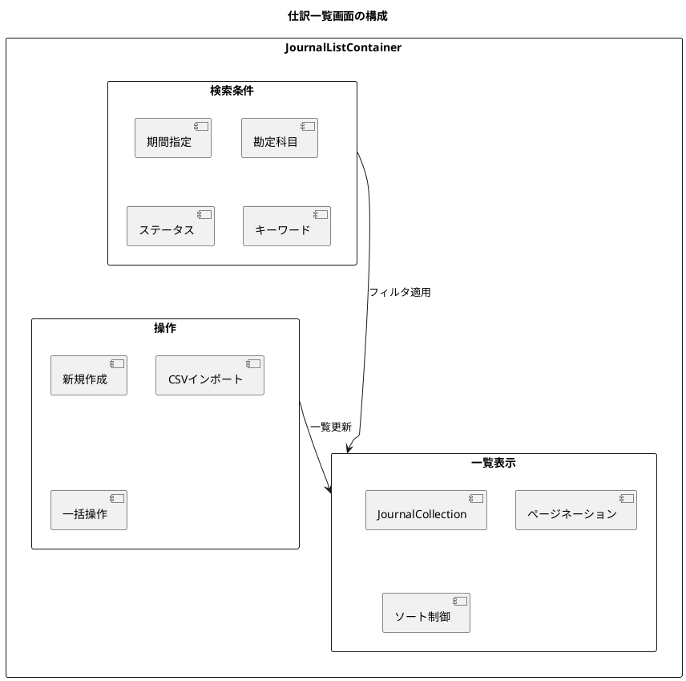

# 第12章: 仕訳一覧・検索

本章では、登録済み仕訳の一覧表示と検索機能の実装を解説します。ページネーション、ソート、複合条件検索、CSV インポートなど、仕訳データを効率的に管理するための機能を実装します。

## 12.1 仕訳一覧

### 12.1.1 一覧画面の概要

仕訳一覧画面では、登録済みの仕訳を一覧形式で表示し、詳細の確認や編集、削除などの操作を行います。



### 12.1.2 型定義

**src/types/journalSearch.ts**:

```typescript
// 仕訳検索パラメータ
export interface JournalSearchParams {
  startDate?: string;          // 開始日
  endDate?: string;            // 終了日
  accountCode?: string;        // 勘定科目コード
  status?: EntryStatus[];      // ステータス（複数選択可）
  minAmount?: number;          // 最小金額
  maxAmount?: number;          // 最大金額
  keyword?: string;            // 摘要キーワード
  createdBy?: string;          // 作成者
  page?: number;               // ページ番号
  size?: number;               // 1ページあたりの件数
  sortBy?: string;             // ソート項目
  sortOrder?: 'asc' | 'desc';  // ソート順
}

// 仕訳一覧レスポンス（ページング対応）
export interface JournalListResponse {
  content: JournalEntrySummary[];
  totalElements: number;
  totalPages: number;
  size: number;
  number: number;
  first: boolean;
  last: boolean;
}

// 仕訳サマリー（一覧用）
export interface JournalEntrySummary {
  id: string;
  slipNumber: string;
  entryDate: string;
  description: string;
  status: EntryStatus;
  debitTotal: number;
  creditTotal: number;
  detailCount: number;
  createdBy: string;
  createdAt: string;
}

// ステータス表示用
export const STATUS_LABELS: Record<EntryStatus, string> = {
  draft: '下書き',
  pending: '承認待ち',
  approved: '承認済',
  rejected: '差戻し',
};

export const STATUS_COLORS: Record<EntryStatus, string> = {
  draft: '#6c757d',
  pending: '#ffc107',
  approved: '#28a745',
  rejected: '#dc3545',
};
```

### 12.1.3 JournalListContainer

**src/components/journal/list/JournalListContainer.tsx**:

```typescript
import React, { useState, useCallback, useMemo } from 'react';
import { useNavigate } from 'react-router-dom';
import { useQueryClient } from '@tanstack/react-query';
import {
  useGetJournalEntries,
  useDeleteJournalEntry,
  getGetJournalEntriesQueryKey,
} from '@/api/generated/journal-entry/journal-entry';
import { JournalSearchParams, JournalEntrySummary } from '@/types/journalSearch';
import { JournalCollection } from '@/views/journal/list/JournalCollection';
import { JournalSearchForm } from '@/views/journal/list/JournalSearchForm';
import { JournalSearchModal } from '@/views/journal/list/JournalSearchModal';
import { Pagination } from '@/views/common/Pagination';
import { Loading } from '@/views/common/Loading';
import { ErrorMessage } from '@/views/common/ErrorMessage';
import { useConfirm } from '@/hooks/useConfirm';
import { ConfirmModal } from '@/views/common/ConfirmModal';
import { useMessage } from '@/providers/MessageProvider';
import { useAccountingPeriod } from '@/providers/AccountingPeriodProvider';
import './JournalListContainer.css';

const DEFAULT_PAGE_SIZE = 20;

export const JournalListContainer: React.FC = () => {
  const navigate = useNavigate();
  const queryClient = useQueryClient();
  const { showSuccess, showError } = useMessage();
  const { currentPeriod } = useAccountingPeriod();
  const { confirmState, confirm, handleConfirm, handleCancel } = useConfirm();

  // 検索パラメータ
  const [searchParams, setSearchParams] = useState<JournalSearchParams>({
    startDate: currentPeriod?.startDate,
    endDate: currentPeriod?.endDate,
    page: 0,
    size: DEFAULT_PAGE_SIZE,
    sortBy: 'entryDate',
    sortOrder: 'desc',
  });

  // 詳細検索モーダル
  const [showSearchModal, setShowSearchModal] = useState(false);

  // 仕訳一覧取得
  const {
    data: journalPage,
    isLoading,
    error,
    isFetching,
  } = useGetJournalEntries(searchParams, {
    query: {
      keepPreviousData: true, // ページ切替時にちらつき防止
    },
  });

  // 削除 mutation
  const deleteMutation = useDeleteJournalEntry();

  // 新規作成
  const handleCreate = useCallback(() => {
    navigate('/journal/new');
  }, [navigate]);

  // 詳細表示
  const handleSelect = useCallback(
    (journal: JournalEntrySummary) => {
      navigate(`/journal/${journal.id}`);
    },
    [navigate]
  );

  // 編集
  const handleEdit = useCallback(
    (journal: JournalEntrySummary) => {
      if (journal.status === 'approved') {
        showError('承認済みの仕訳は編集できません。');
        return;
      }
      navigate(`/journal/${journal.id}/edit`);
    },
    [navigate, showError]
  );

  // 削除
  const handleDelete = useCallback(
    async (journal: JournalEntrySummary) => {
      if (journal.status === 'approved') {
        showError('承認済みの仕訳は削除できません。');
        return;
      }

      const confirmed = await confirm(
        `伝票番号「${journal.slipNumber}」を削除しますか？\nこの操作は取り消せません。`
      );
      if (!confirmed) return;

      try {
        await deleteMutation.mutateAsync({ id: journal.id });
        showSuccess('仕訳を削除しました。');
        queryClient.invalidateQueries({
          queryKey: getGetJournalEntriesQueryKey(),
        });
      } catch (err) {
        showError('仕訳の削除に失敗しました。');
      }
    },
    [confirm, deleteMutation, queryClient, showSuccess, showError]
  );

  // 検索条件変更
  const handleSearch = useCallback((params: Partial<JournalSearchParams>) => {
    setSearchParams((prev) => ({
      ...prev,
      ...params,
      page: 0, // 検索条件変更時は1ページ目に戻る
    }));
  }, []);

  // 詳細検索
  const handleAdvancedSearch = useCallback(
    (params: JournalSearchParams) => {
      setSearchParams({
        ...params,
        page: 0,
        size: DEFAULT_PAGE_SIZE,
      });
      setShowSearchModal(false);
    },
    []
  );

  // ページ変更
  const handlePageChange = useCallback((page: number) => {
    setSearchParams((prev) => ({ ...prev, page }));
  }, []);

  // ソート変更
  const handleSortChange = useCallback(
    (sortBy: string, sortOrder: 'asc' | 'desc') => {
      setSearchParams((prev) => ({ ...prev, sortBy, sortOrder }));
    },
    []
  );

  // 検索条件クリア
  const handleClearSearch = useCallback(() => {
    setSearchParams({
      startDate: currentPeriod?.startDate,
      endDate: currentPeriod?.endDate,
      page: 0,
      size: DEFAULT_PAGE_SIZE,
      sortBy: 'entryDate',
      sortOrder: 'desc',
    });
  }, [currentPeriod]);

  // CSV インポート
  const handleImport = useCallback(() => {
    navigate('/journal/import');
  }, [navigate]);

  if (error) {
    return <ErrorMessage error={error} />;
  }

  return (
    <div className="journal-list-container">
      <div className="list-header">
        <h2>仕訳一覧</h2>
        <div className="header-actions">
          <button className="btn-secondary" onClick={handleImport}>
            CSV インポート
          </button>
          <button className="btn-primary" onClick={handleCreate}>
            新規作成
          </button>
        </div>
      </div>

      {/* 簡易検索フォーム */}
      <JournalSearchForm
        params={searchParams}
        onSearch={handleSearch}
        onAdvancedSearch={() => setShowSearchModal(true)}
        onClear={handleClearSearch}
      />

      {/* 一覧表示 */}
      {isLoading ? (
        <Loading />
      ) : (
        <>
          <div className={`list-content ${isFetching ? 'fetching' : ''}`}>
            <JournalCollection
              journals={journalPage?.content || []}
              sortBy={searchParams.sortBy}
              sortOrder={searchParams.sortOrder}
              onSelect={handleSelect}
              onEdit={handleEdit}
              onDelete={handleDelete}
              onSortChange={handleSortChange}
            />
          </div>

          {/* ページネーション */}
          {journalPage && journalPage.totalPages > 1 && (
            <Pagination
              currentPage={journalPage.number}
              totalPages={journalPage.totalPages}
              totalElements={journalPage.totalElements}
              pageSize={journalPage.size}
              onPageChange={handlePageChange}
            />
          )}
        </>
      )}

      {/* 詳細検索モーダル */}
      {showSearchModal && (
        <JournalSearchModal
          initialParams={searchParams}
          onSearch={handleAdvancedSearch}
          onClose={() => setShowSearchModal(false)}
        />
      )}

      {/* 確認モーダル */}
      <ConfirmModal
        isOpen={confirmState.isOpen}
        message={confirmState.message}
        onConfirm={handleConfirm}
        onCancel={handleCancel}
      />
    </div>
  );
};
```

### 12.1.4 JournalCollection

**src/views/journal/list/JournalCollection.tsx**:

```typescript
import React from 'react';
import { JournalEntrySummary, STATUS_LABELS, STATUS_COLORS } from '@/types/journalSearch';
import { FiEdit2, FiTrash2, FiChevronUp, FiChevronDown } from 'react-icons/fi';
import dayjs from 'dayjs';
import './JournalCollection.css';

interface Props {
  journals: JournalEntrySummary[];
  sortBy?: string;
  sortOrder?: 'asc' | 'desc';
  onSelect: (journal: JournalEntrySummary) => void;
  onEdit: (journal: JournalEntrySummary) => void;
  onDelete: (journal: JournalEntrySummary) => void;
  onSortChange: (sortBy: string, sortOrder: 'asc' | 'desc') => void;
}

export const JournalCollection: React.FC<Props> = ({
  journals,
  sortBy,
  sortOrder,
  onSelect,
  onEdit,
  onDelete,
  onSortChange,
}) => {
  // ソートヘッダーのクリック処理
  const handleSortClick = (column: string) => {
    if (sortBy === column) {
      // 同じカラムをクリック → 順序を反転
      onSortChange(column, sortOrder === 'asc' ? 'desc' : 'asc');
    } else {
      // 別のカラムをクリック → 降順で開始
      onSortChange(column, 'desc');
    }
  };

  // ソートインジケーター
  const SortIndicator: React.FC<{ column: string }> = ({ column }) => {
    if (sortBy !== column) return null;
    return sortOrder === 'asc' ? <FiChevronUp /> : <FiChevronDown />;
  };

  // 金額フォーマット
  const formatMoney = (amount: number) => amount.toLocaleString();

  // 日付フォーマット
  const formatDate = (date: string) => dayjs(date).format('YYYY/MM/DD');

  if (journals.length === 0) {
    return (
      <div className="empty-list">
        <p>仕訳データがありません</p>
      </div>
    );
  }

  return (
    <table className="journal-table">
      <thead>
        <tr>
          <th
            className="sortable"
            onClick={() => handleSortClick('slipNumber')}
          >
            伝票番号 <SortIndicator column="slipNumber" />
          </th>
          <th
            className="sortable"
            onClick={() => handleSortClick('entryDate')}
          >
            仕訳日付 <SortIndicator column="entryDate" />
          </th>
          <th>摘要</th>
          <th className="amount-header">借方金額</th>
          <th className="amount-header">貸方金額</th>
          <th>明細数</th>
          <th>ステータス</th>
          <th
            className="sortable"
            onClick={() => handleSortClick('createdAt')}
          >
            作成日時 <SortIndicator column="createdAt" />
          </th>
          <th>作成者</th>
          <th className="actions-header">操作</th>
        </tr>
      </thead>
      <tbody>
        {journals.map((journal) => (
          <tr
            key={journal.id}
            className={`journal-row status-${journal.status}`}
            onClick={() => onSelect(journal)}
          >
            <td className="slip-number">{journal.slipNumber}</td>
            <td className="entry-date">{formatDate(journal.entryDate)}</td>
            <td className="description" title={journal.description}>
              {journal.description}
            </td>
            <td className="amount debit">{formatMoney(journal.debitTotal)}</td>
            <td className="amount credit">{formatMoney(journal.creditTotal)}</td>
            <td className="detail-count">{journal.detailCount}行</td>
            <td className="status">
              <span
                className="status-badge"
                style={{ backgroundColor: STATUS_COLORS[journal.status] }}
              >
                {STATUS_LABELS[journal.status]}
              </span>
            </td>
            <td className="created-at">
              {dayjs(journal.createdAt).format('YYYY/MM/DD HH:mm')}
            </td>
            <td className="created-by">{journal.createdBy}</td>
            <td className="actions" onClick={(e) => e.stopPropagation()}>
              <button
                className="btn-icon"
                onClick={() => onEdit(journal)}
                disabled={journal.status === 'approved'}
                title="編集"
              >
                <FiEdit2 />
              </button>
              <button
                className="btn-icon btn-delete"
                onClick={() => onDelete(journal)}
                disabled={journal.status === 'approved'}
                title="削除"
              >
                <FiTrash2 />
              </button>
            </td>
          </tr>
        ))}
      </tbody>
    </table>
  );
};
```

### 12.1.5 Pagination

**src/views/common/Pagination.tsx**:

```typescript
import React, { useCallback, useMemo } from 'react';
import { FiChevronLeft, FiChevronRight, FiChevronsLeft, FiChevronsRight } from 'react-icons/fi';
import './Pagination.css';

interface Props {
  currentPage: number;
  totalPages: number;
  totalElements: number;
  pageSize: number;
  onPageChange: (page: number) => void;
}

export const Pagination: React.FC<Props> = ({
  currentPage,
  totalPages,
  totalElements,
  pageSize,
  onPageChange,
}) => {
  // 表示するページ番号の範囲を計算
  const pageNumbers = useMemo(() => {
    const pages: number[] = [];
    const maxVisiblePages = 5;

    let startPage = Math.max(0, currentPage - Math.floor(maxVisiblePages / 2));
    let endPage = Math.min(totalPages - 1, startPage + maxVisiblePages - 1);

    // 開始ページを調整
    if (endPage - startPage < maxVisiblePages - 1) {
      startPage = Math.max(0, endPage - maxVisiblePages + 1);
    }

    for (let i = startPage; i <= endPage; i++) {
      pages.push(i);
    }

    return pages;
  }, [currentPage, totalPages]);

  // 表示件数の計算
  const startIndex = currentPage * pageSize + 1;
  const endIndex = Math.min((currentPage + 1) * pageSize, totalElements);

  return (
    <div className="pagination">
      <div className="pagination-info">
        {totalElements}件中 {startIndex}〜{endIndex}件を表示
      </div>

      <div className="pagination-controls">
        {/* 最初のページへ */}
        <button
          className="page-btn"
          onClick={() => onPageChange(0)}
          disabled={currentPage === 0}
          title="最初のページ"
        >
          <FiChevronsLeft />
        </button>

        {/* 前のページへ */}
        <button
          className="page-btn"
          onClick={() => onPageChange(currentPage - 1)}
          disabled={currentPage === 0}
          title="前のページ"
        >
          <FiChevronLeft />
        </button>

        {/* ページ番号 */}
        {pageNumbers[0] > 0 && (
          <>
            <button className="page-btn" onClick={() => onPageChange(0)}>
              1
            </button>
            {pageNumbers[0] > 1 && <span className="ellipsis">...</span>}
          </>
        )}

        {pageNumbers.map((page) => (
          <button
            key={page}
            className={`page-btn ${page === currentPage ? 'active' : ''}`}
            onClick={() => onPageChange(page)}
          >
            {page + 1}
          </button>
        ))}

        {pageNumbers[pageNumbers.length - 1] < totalPages - 1 && (
          <>
            {pageNumbers[pageNumbers.length - 1] < totalPages - 2 && (
              <span className="ellipsis">...</span>
            )}
            <button
              className="page-btn"
              onClick={() => onPageChange(totalPages - 1)}
            >
              {totalPages}
            </button>
          </>
        )}

        {/* 次のページへ */}
        <button
          className="page-btn"
          onClick={() => onPageChange(currentPage + 1)}
          disabled={currentPage === totalPages - 1}
          title="次のページ"
        >
          <FiChevronRight />
        </button>

        {/* 最後のページへ */}
        <button
          className="page-btn"
          onClick={() => onPageChange(totalPages - 1)}
          disabled={currentPage === totalPages - 1}
          title="最後のページ"
        >
          <FiChevronsRight />
        </button>
      </div>
    </div>
  );
};
```

## 12.2 仕訳検索

### 12.2.1 簡易検索フォーム

**src/views/journal/list/JournalSearchForm.tsx**:

```typescript
import React, { useState, useCallback } from 'react';
import { JournalSearchParams, EntryStatus, STATUS_LABELS } from '@/types/journalSearch';
import { FiSearch, FiFilter, FiX } from 'react-icons/fi';
import './JournalSearchForm.css';

interface Props {
  params: JournalSearchParams;
  onSearch: (params: Partial<JournalSearchParams>) => void;
  onAdvancedSearch: () => void;
  onClear: () => void;
}

export const JournalSearchForm: React.FC<Props> = ({
  params,
  onSearch,
  onAdvancedSearch,
  onClear,
}) => {
  const [keyword, setKeyword] = useState(params.keyword || '');

  // キーワード検索実行
  const handleKeywordSearch = useCallback(() => {
    onSearch({ keyword });
  }, [keyword, onSearch]);

  // Enter キーで検索
  const handleKeyPress = useCallback(
    (e: React.KeyboardEvent) => {
      if (e.key === 'Enter') {
        handleKeywordSearch();
      }
    },
    [handleKeywordSearch]
  );

  // 期間変更
  const handleDateChange = useCallback(
    (field: 'startDate' | 'endDate', value: string) => {
      onSearch({ [field]: value });
    },
    [onSearch]
  );

  // ステータス変更
  const handleStatusChange = useCallback(
    (e: React.ChangeEvent<HTMLSelectElement>) => {
      const value = e.target.value;
      onSearch({
        status: value ? [value as EntryStatus] : undefined,
      });
    },
    [onSearch]
  );

  // 検索条件があるかどうか
  const hasFilters =
    params.keyword ||
    params.accountCode ||
    params.status?.length ||
    params.minAmount ||
    params.maxAmount ||
    params.createdBy;

  return (
    <div className="journal-search-form">
      <div className="search-row">
        {/* 期間指定 */}
        <div className="search-group date-range">
          <label>期間</label>
          <div className="date-inputs">
            <input
              type="date"
              value={params.startDate || ''}
              onChange={(e) => handleDateChange('startDate', e.target.value)}
            />
            <span>〜</span>
            <input
              type="date"
              value={params.endDate || ''}
              onChange={(e) => handleDateChange('endDate', e.target.value)}
            />
          </div>
        </div>

        {/* ステータス */}
        <div className="search-group">
          <label>ステータス</label>
          <select
            value={params.status?.[0] || ''}
            onChange={handleStatusChange}
          >
            <option value="">すべて</option>
            {Object.entries(STATUS_LABELS).map(([value, label]) => (
              <option key={value} value={value}>
                {label}
              </option>
            ))}
          </select>
        </div>

        {/* キーワード */}
        <div className="search-group keyword-group">
          <label>摘要</label>
          <div className="keyword-input">
            <input
              type="text"
              value={keyword}
              onChange={(e) => setKeyword(e.target.value)}
              onKeyPress={handleKeyPress}
              placeholder="キーワードを入力..."
            />
            <button
              className="btn-search"
              onClick={handleKeywordSearch}
            >
              <FiSearch />
            </button>
          </div>
        </div>

        {/* 詳細検索ボタン */}
        <div className="search-actions">
          <button
            className="btn-advanced"
            onClick={onAdvancedSearch}
          >
            <FiFilter />
            詳細検索
          </button>

          {hasFilters && (
            <button className="btn-clear" onClick={onClear}>
              <FiX />
              クリア
            </button>
          )}
        </div>
      </div>

      {/* 適用中のフィルタ表示 */}
      {hasFilters && (
        <div className="applied-filters">
          <span className="filter-label">適用中:</span>
          {params.keyword && (
            <span className="filter-tag">摘要: {params.keyword}</span>
          )}
          {params.accountCode && (
            <span className="filter-tag">勘定科目: {params.accountCode}</span>
          )}
          {params.status?.length && (
            <span className="filter-tag">
              ステータス: {params.status.map((s) => STATUS_LABELS[s]).join(', ')}
            </span>
          )}
          {(params.minAmount || params.maxAmount) && (
            <span className="filter-tag">
              金額: {params.minAmount?.toLocaleString() || '0'}〜
              {params.maxAmount?.toLocaleString() || '∞'}
            </span>
          )}
        </div>
      )}
    </div>
  );
};
```

### 12.2.2 詳細検索モーダル

**src/views/journal/list/JournalSearchModal.tsx**:

```typescript
import React, { useState, useCallback } from 'react';
import Modal from 'react-modal';
import { JournalSearchParams, EntryStatus, STATUS_LABELS } from '@/types/journalSearch';
import { AccountSelector } from '@/views/common/AccountSelector';
import { MoneyInput } from '@/views/common/MoneyInput';
import { FiX } from 'react-icons/fi';
import './JournalSearchModal.css';

interface Props {
  initialParams: JournalSearchParams;
  onSearch: (params: JournalSearchParams) => void;
  onClose: () => void;
}

export const JournalSearchModal: React.FC<Props> = ({
  initialParams,
  onSearch,
  onClose,
}) => {
  const [params, setParams] = useState<JournalSearchParams>({
    ...initialParams,
  });
  const [showAccountSelector, setShowAccountSelector] = useState(false);
  const [selectedAccountName, setSelectedAccountName] = useState('');

  // パラメータ更新
  const updateParam = useCallback(
    <K extends keyof JournalSearchParams>(
      key: K,
      value: JournalSearchParams[K]
    ) => {
      setParams((prev) => ({ ...prev, [key]: value }));
    },
    []
  );

  // ステータス選択（複数選択）
  const handleStatusToggle = useCallback((status: EntryStatus) => {
    setParams((prev) => {
      const currentStatus = prev.status || [];
      const newStatus = currentStatus.includes(status)
        ? currentStatus.filter((s) => s !== status)
        : [...currentStatus, status];
      return { ...prev, status: newStatus.length > 0 ? newStatus : undefined };
    });
  }, []);

  // 勘定科目選択
  const handleAccountSelect = useCallback(
    (account: { code: string; name: string }) => {
      updateParam('accountCode', account.code);
      setSelectedAccountName(account.name);
      setShowAccountSelector(false);
    },
    [updateParam]
  );

  // 勘定科目クリア
  const handleAccountClear = useCallback(() => {
    updateParam('accountCode', undefined);
    setSelectedAccountName('');
  }, [updateParam]);

  // 検索実行
  const handleSearch = useCallback(() => {
    onSearch(params);
  }, [params, onSearch]);

  // 条件クリア
  const handleClear = useCallback(() => {
    setParams({
      page: 0,
      size: initialParams.size,
      sortBy: initialParams.sortBy,
      sortOrder: initialParams.sortOrder,
    });
    setSelectedAccountName('');
  }, [initialParams]);

  return (
    <Modal
      isOpen={true}
      onRequestClose={onClose}
      className="journal-search-modal"
      overlayClassName="modal-overlay"
    >
      <div className="modal-header">
        <h3>詳細検索</h3>
        <button className="btn-close" onClick={onClose}>
          <FiX />
        </button>
      </div>

      <div className="modal-body">
        {/* 期間 */}
        <div className="search-section">
          <h4>期間</h4>
          <div className="form-row">
            <div className="form-group">
              <label>開始日</label>
              <input
                type="date"
                value={params.startDate || ''}
                onChange={(e) => updateParam('startDate', e.target.value)}
              />
            </div>
            <div className="form-group">
              <label>終了日</label>
              <input
                type="date"
                value={params.endDate || ''}
                onChange={(e) => updateParam('endDate', e.target.value)}
              />
            </div>
          </div>
        </div>

        {/* 勘定科目 */}
        <div className="search-section">
          <h4>勘定科目</h4>
          <div className="form-row">
            <div className="form-group account-group">
              <div className="account-input">
                <input
                  type="text"
                  value={
                    selectedAccountName ||
                    params.accountCode ||
                    ''
                  }
                  onClick={() => setShowAccountSelector(true)}
                  readOnly
                  placeholder="勘定科目を選択..."
                />
                {params.accountCode && (
                  <button
                    className="btn-clear-input"
                    onClick={handleAccountClear}
                  >
                    <FiX />
                  </button>
                )}
              </div>
              {showAccountSelector && (
                <AccountSelector
                  onSelect={handleAccountSelect}
                  onClose={() => setShowAccountSelector(false)}
                />
              )}
            </div>
          </div>
        </div>

        {/* 金額範囲 */}
        <div className="search-section">
          <h4>金額</h4>
          <div className="form-row">
            <div className="form-group">
              <label>最小金額</label>
              <MoneyInput
                value={params.minAmount || 0}
                onChange={(value) => updateParam('minAmount', value || undefined)}
              />
            </div>
            <div className="form-group">
              <label>最大金額</label>
              <MoneyInput
                value={params.maxAmount || 0}
                onChange={(value) => updateParam('maxAmount', value || undefined)}
              />
            </div>
          </div>
        </div>

        {/* ステータス */}
        <div className="search-section">
          <h4>ステータス</h4>
          <div className="status-checkboxes">
            {(Object.keys(STATUS_LABELS) as EntryStatus[]).map((status) => (
              <label key={status} className="checkbox-label">
                <input
                  type="checkbox"
                  checked={params.status?.includes(status) || false}
                  onChange={() => handleStatusToggle(status)}
                />
                {STATUS_LABELS[status]}
              </label>
            ))}
          </div>
        </div>

        {/* キーワード */}
        <div className="search-section">
          <h4>キーワード</h4>
          <div className="form-row">
            <div className="form-group full-width">
              <label>摘要</label>
              <input
                type="text"
                value={params.keyword || ''}
                onChange={(e) => updateParam('keyword', e.target.value)}
                placeholder="摘要に含まれる文字列"
              />
            </div>
          </div>
        </div>

        {/* 作成者 */}
        <div className="search-section">
          <h4>作成者</h4>
          <div className="form-row">
            <div className="form-group">
              <label>作成者名</label>
              <input
                type="text"
                value={params.createdBy || ''}
                onChange={(e) => updateParam('createdBy', e.target.value)}
                placeholder="作成者名"
              />
            </div>
          </div>
        </div>
      </div>

      <div className="modal-footer">
        <button className="btn-secondary" onClick={handleClear}>
          条件をクリア
        </button>
        <button className="btn-secondary" onClick={onClose}>
          キャンセル
        </button>
        <button className="btn-primary" onClick={handleSearch}>
          検索
        </button>
      </div>
    </Modal>
  );
};
```

### 12.2.3 検索パラメータのフック化

**src/hooks/useJournalSearch.ts**:

```typescript
import { useState, useCallback, useMemo } from 'react';
import { useSearchParams } from 'react-router-dom';
import { JournalSearchParams, EntryStatus } from '@/types/journalSearch';

const DEFAULT_PAGE_SIZE = 20;

export const useJournalSearch = () => {
  const [searchParams, setSearchParams] = useSearchParams();

  // URL パラメータから検索条件を復元
  const params: JournalSearchParams = useMemo(() => {
    const statusParam = searchParams.get('status');
    return {
      startDate: searchParams.get('startDate') || undefined,
      endDate: searchParams.get('endDate') || undefined,
      accountCode: searchParams.get('accountCode') || undefined,
      status: statusParam ? (statusParam.split(',') as EntryStatus[]) : undefined,
      minAmount: searchParams.get('minAmount')
        ? Number(searchParams.get('minAmount'))
        : undefined,
      maxAmount: searchParams.get('maxAmount')
        ? Number(searchParams.get('maxAmount'))
        : undefined,
      keyword: searchParams.get('keyword') || undefined,
      createdBy: searchParams.get('createdBy') || undefined,
      page: Number(searchParams.get('page') || 0),
      size: Number(searchParams.get('size') || DEFAULT_PAGE_SIZE),
      sortBy: searchParams.get('sortBy') || 'entryDate',
      sortOrder: (searchParams.get('sortOrder') as 'asc' | 'desc') || 'desc',
    };
  }, [searchParams]);

  // 検索条件を URL パラメータに反映
  const updateParams = useCallback(
    (newParams: Partial<JournalSearchParams>) => {
      const merged = { ...params, ...newParams };

      const urlParams = new URLSearchParams();

      Object.entries(merged).forEach(([key, value]) => {
        if (value !== undefined && value !== null && value !== '') {
          if (Array.isArray(value)) {
            urlParams.set(key, value.join(','));
          } else {
            urlParams.set(key, String(value));
          }
        }
      });

      setSearchParams(urlParams);
    },
    [params, setSearchParams]
  );

  // 検索条件をクリア
  const clearParams = useCallback(() => {
    setSearchParams(new URLSearchParams());
  }, [setSearchParams]);

  return {
    params,
    updateParams,
    clearParams,
  };
};
```

## 12.3 仕訳詳細

### 12.3.1 JournalSingleContainer

**src/components/journal/detail/JournalSingleContainer.tsx**:

```typescript
import React, { useCallback } from 'react';
import { useParams, useNavigate } from 'react-router-dom';
import { useQueryClient } from '@tanstack/react-query';
import {
  useGetJournalEntry,
  useDeleteJournalEntry,
  getGetJournalEntriesQueryKey,
} from '@/api/generated/journal-entry/journal-entry';
import { JournalSingle } from '@/views/journal/detail/JournalSingle';
import { Loading } from '@/views/common/Loading';
import { ErrorMessage } from '@/views/common/ErrorMessage';
import { useConfirm } from '@/hooks/useConfirm';
import { ConfirmModal } from '@/views/common/ConfirmModal';
import { useMessage } from '@/providers/MessageProvider';

export const JournalSingleContainer: React.FC = () => {
  const { id } = useParams<{ id: string }>();
  const navigate = useNavigate();
  const queryClient = useQueryClient();
  const { showSuccess, showError } = useMessage();
  const { confirmState, confirm, handleConfirm, handleCancel } = useConfirm();

  // 仕訳詳細取得
  const { data: journal, isLoading, error } = useGetJournalEntry(id!);

  // 削除 mutation
  const deleteMutation = useDeleteJournalEntry();

  // 一覧に戻る
  const handleBack = useCallback(() => {
    navigate('/journal');
  }, [navigate]);

  // 編集
  const handleEdit = useCallback(() => {
    if (journal?.status === 'approved') {
      showError('承認済みの仕訳は編集できません。');
      return;
    }
    navigate(`/journal/${id}/edit`);
  }, [id, journal, navigate, showError]);

  // 削除
  const handleDelete = useCallback(async () => {
    if (journal?.status === 'approved') {
      showError('承認済みの仕訳は削除できません。');
      return;
    }

    const confirmed = await confirm(
      `伝票番号「${journal?.slipNumber}」を削除しますか？\nこの操作は取り消せません。`
    );
    if (!confirmed) return;

    try {
      await deleteMutation.mutateAsync({ id: id! });
      showSuccess('仕訳を削除しました。');
      queryClient.invalidateQueries({
        queryKey: getGetJournalEntriesQueryKey(),
      });
      navigate('/journal');
    } catch (err) {
      showError('仕訳の削除に失敗しました。');
    }
  }, [id, journal, confirm, deleteMutation, queryClient, navigate, showSuccess, showError]);

  // コピーして新規作成
  const handleCopy = useCallback(() => {
    navigate('/journal/new', {
      state: { copyFrom: journal },
    });
  }, [journal, navigate]);

  if (isLoading) return <Loading />;
  if (error) return <ErrorMessage error={error} />;
  if (!journal) return <ErrorMessage error={new Error('仕訳が見つかりません')} />;

  return (
    <>
      <JournalSingle
        journal={journal}
        onBack={handleBack}
        onEdit={handleEdit}
        onDelete={handleDelete}
        onCopy={handleCopy}
      />

      <ConfirmModal
        isOpen={confirmState.isOpen}
        message={confirmState.message}
        onConfirm={handleConfirm}
        onCancel={handleCancel}
      />
    </>
  );
};
```

### 12.3.2 JournalSingle

**src/views/journal/detail/JournalSingle.tsx**:

```typescript
import React from 'react';
import { JournalEntryResponse } from '@/api/model';
import { STATUS_LABELS, STATUS_COLORS } from '@/types/journalSearch';
import { FiArrowLeft, FiEdit2, FiTrash2, FiCopy } from 'react-icons/fi';
import dayjs from 'dayjs';
import './JournalSingle.css';

interface Props {
  journal: JournalEntryResponse;
  onBack: () => void;
  onEdit: () => void;
  onDelete: () => void;
  onCopy: () => void;
}

export const JournalSingle: React.FC<Props> = ({
  journal,
  onBack,
  onEdit,
  onDelete,
  onCopy,
}) => {
  // 金額フォーマット
  const formatMoney = (amount: number) => amount.toLocaleString();

  // 借方合計・貸方合計の計算
  const debitTotal = journal.details.reduce(
    (sum, d) => sum + d.debitAmount,
    0
  );
  const creditTotal = journal.details.reduce(
    (sum, d) => sum + d.creditAmount,
    0
  );

  const isEditable = journal.status !== 'approved';

  return (
    <div className="journal-single">
      {/* ヘッダー */}
      <div className="detail-header">
        <button className="btn-back" onClick={onBack}>
          <FiArrowLeft />
          一覧に戻る
        </button>
        <div className="header-actions">
          <button className="btn-secondary" onClick={onCopy}>
            <FiCopy />
            コピー
          </button>
          <button
            className="btn-secondary"
            onClick={onEdit}
            disabled={!isEditable}
          >
            <FiEdit2 />
            編集
          </button>
          <button
            className="btn-danger"
            onClick={onDelete}
            disabled={!isEditable}
          >
            <FiTrash2 />
            削除
          </button>
        </div>
      </div>

      {/* 伝票情報 */}
      <div className="slip-info">
        <div className="slip-header">
          <h2>仕訳伝票</h2>
          <span
            className="status-badge"
            style={{ backgroundColor: STATUS_COLORS[journal.status] }}
          >
            {STATUS_LABELS[journal.status]}
          </span>
        </div>

        <div className="info-grid">
          <div className="info-item">
            <label>伝票番号</label>
            <span>{journal.slipNumber}</span>
          </div>
          <div className="info-item">
            <label>仕訳日付</label>
            <span>{dayjs(journal.entryDate).format('YYYY年MM月DD日')}</span>
          </div>
          <div className="info-item">
            <label>会計年度</label>
            <span>{journal.fiscalYear}年度</span>
          </div>
          <div className="info-item">
            <label>会計月</label>
            <span>{journal.fiscalMonth}月</span>
          </div>
        </div>

        <div className="info-full">
          <label>摘要</label>
          <p>{journal.description}</p>
        </div>
      </div>

      {/* 明細テーブル */}
      <div className="detail-section">
        <h3>仕訳明細</h3>
        <table className="detail-table">
          <thead>
            <tr>
              <th className="col-row">行</th>
              <th className="col-account">勘定科目</th>
              <th className="col-sub-account">補助科目</th>
              <th className="col-debit">借方金額</th>
              <th className="col-credit">貸方金額</th>
              <th className="col-tax">課税区分</th>
              <th className="col-description">明細摘要</th>
            </tr>
          </thead>
          <tbody>
            {journal.details.map((detail, index) => (
              <tr
                key={detail.id}
                className={
                  detail.debitAmount > 0 ? 'debit-row' : 'credit-row'
                }
              >
                <td className="col-row">{index + 1}</td>
                <td className="col-account">
                  <span className="account-code">{detail.accountCode}</span>
                  <span className="account-name">{detail.accountName}</span>
                </td>
                <td className="col-sub-account">
                  {detail.subAccountName || '-'}
                </td>
                <td className="col-debit amount">
                  {detail.debitAmount > 0
                    ? formatMoney(detail.debitAmount)
                    : ''}
                </td>
                <td className="col-credit amount">
                  {detail.creditAmount > 0
                    ? formatMoney(detail.creditAmount)
                    : ''}
                </td>
                <td className="col-tax">{detail.taxType}</td>
                <td className="col-description">
                  {detail.description || '-'}
                </td>
              </tr>
            ))}
          </tbody>
          <tfoot>
            <tr className="total-row">
              <td colSpan={3} className="total-label">
                合計
              </td>
              <td className="col-debit amount">
                {formatMoney(debitTotal)}
              </td>
              <td className="col-credit amount">
                {formatMoney(creditTotal)}
              </td>
              <td colSpan={2}></td>
            </tr>
          </tfoot>
        </table>
      </div>

      {/* 監査情報 */}
      <div className="audit-section">
        <h3>監査情報</h3>
        <div className="audit-grid">
          <div className="audit-item">
            <label>作成者</label>
            <span>{journal.createdBy}</span>
          </div>
          <div className="audit-item">
            <label>作成日時</label>
            <span>
              {dayjs(journal.createdAt).format('YYYY/MM/DD HH:mm:ss')}
            </span>
          </div>
          <div className="audit-item">
            <label>更新日時</label>
            <span>
              {dayjs(journal.updatedAt).format('YYYY/MM/DD HH:mm:ss')}
            </span>
          </div>
          <div className="audit-item">
            <label>バージョン</label>
            <span>{journal.version}</span>
          </div>
        </div>
      </div>
    </div>
  );
};
```

## 12.4 仕訳一括登録（CSV インポート）

### 12.4.1 JournalUploadContainer

**src/components/journal/upload/JournalUploadContainer.tsx**:

```typescript
import React, { useState, useCallback } from 'react';
import { useNavigate } from 'react-router-dom';
import { useQueryClient } from '@tanstack/react-query';
import {
  useUploadJournalEntries,
  getGetJournalEntriesQueryKey,
} from '@/api/generated/journal-entry/journal-entry';
import { JournalUploadForm } from '@/views/journal/upload/JournalUploadForm';
import { JournalUploadPreview } from '@/views/journal/upload/JournalUploadPreview';
import { JournalUploadResult } from '@/views/journal/upload/JournalUploadResult';
import { useMessage } from '@/providers/MessageProvider';
import { parseJournalCsv, JournalCsvRow, CsvParseError } from '@/utils/journalCsvParser';

type UploadStep = 'select' | 'preview' | 'result';

interface UploadResult {
  successCount: number;
  errorCount: number;
  errors: Array<{ row: number; message: string }>;
}

export const JournalUploadContainer: React.FC = () => {
  const navigate = useNavigate();
  const queryClient = useQueryClient();
  const { showSuccess, showError } = useMessage();

  const [step, setStep] = useState<UploadStep>('select');
  const [parsedRows, setParsedRows] = useState<JournalCsvRow[]>([]);
  const [parseErrors, setParseErrors] = useState<CsvParseError[]>([]);
  const [uploadResult, setUploadResult] = useState<UploadResult | null>(null);

  const uploadMutation = useUploadJournalEntries();

  // ファイル選択・解析
  const handleFileSelect = useCallback(async (file: File) => {
    try {
      const result = await parseJournalCsv(file);
      setParsedRows(result.rows);
      setParseErrors(result.errors);
      setStep('preview');
    } catch (err) {
      showError('CSV ファイルの読み込みに失敗しました。');
    }
  }, [showError]);

  // アップロード実行
  const handleUpload = useCallback(async () => {
    if (parseErrors.length > 0) {
      showError('エラーのある行があります。修正してから再度アップロードしてください。');
      return;
    }

    try {
      const result = await uploadMutation.mutateAsync({
        data: { entries: parsedRows },
      });

      setUploadResult({
        successCount: result.successCount,
        errorCount: result.errorCount,
        errors: result.errors || [],
      });
      setStep('result');

      if (result.successCount > 0) {
        queryClient.invalidateQueries({
          queryKey: getGetJournalEntriesQueryKey(),
        });
        showSuccess(`${result.successCount}件の仕訳を登録しました。`);
      }
    } catch (err) {
      showError('アップロードに失敗しました。');
    }
  }, [parsedRows, parseErrors, uploadMutation, queryClient, showSuccess, showError]);

  // やり直し
  const handleReset = useCallback(() => {
    setParsedRows([]);
    setParseErrors([]);
    setUploadResult(null);
    setStep('select');
  }, []);

  // 一覧に戻る
  const handleBack = useCallback(() => {
    navigate('/journal');
  }, [navigate]);

  return (
    <div className="journal-upload-container">
      <h2>仕訳一括登録</h2>

      {step === 'select' && (
        <JournalUploadForm
          onFileSelect={handleFileSelect}
          onCancel={handleBack}
        />
      )}

      {step === 'preview' && (
        <JournalUploadPreview
          rows={parsedRows}
          errors={parseErrors}
          onUpload={handleUpload}
          onBack={handleReset}
          isUploading={uploadMutation.isPending}
        />
      )}

      {step === 'result' && uploadResult && (
        <JournalUploadResult
          result={uploadResult}
          onRetry={handleReset}
          onFinish={handleBack}
        />
      )}
    </div>
  );
};
```

### 12.4.2 CSV パーサー

**src/utils/journalCsvParser.ts**:

```typescript
import dayjs from 'dayjs';

export interface JournalCsvRow {
  entryDate: string;
  description: string;
  accountCode: string;
  debitAmount: number;
  creditAmount: number;
  taxType: string;
  detailDescription?: string;
}

export interface CsvParseError {
  row: number;
  column: string;
  message: string;
}

export interface CsvParseResult {
  rows: JournalCsvRow[];
  errors: CsvParseError[];
}

// CSV ヘッダー定義
const EXPECTED_HEADERS = [
  '仕訳日付',
  '摘要',
  '勘定科目コード',
  '借方金額',
  '貸方金額',
  '課税区分',
  '明細摘要',
];

export const parseJournalCsv = async (file: File): Promise<CsvParseResult> => {
  const text = await file.text();
  const lines = text.split('\n').map((line) => line.trim());

  const rows: JournalCsvRow[] = [];
  const errors: CsvParseError[] = [];

  if (lines.length < 2) {
    errors.push({
      row: 0,
      column: 'ファイル',
      message: 'CSV ファイルにデータがありません。',
    });
    return { rows, errors };
  }

  // ヘッダー検証
  const headers = parseCSVLine(lines[0]);
  const headerValidation = validateHeaders(headers);
  if (headerValidation) {
    errors.push({
      row: 1,
      column: 'ヘッダー',
      message: headerValidation,
    });
    return { rows, errors };
  }

  // データ行の解析
  for (let i = 1; i < lines.length; i++) {
    if (!lines[i]) continue; // 空行スキップ

    const values = parseCSVLine(lines[i]);
    const rowNumber = i + 1;

    // 日付検証
    const entryDate = values[0];
    if (!entryDate || !dayjs(entryDate, 'YYYY-MM-DD', true).isValid()) {
      errors.push({
        row: rowNumber,
        column: '仕訳日付',
        message: '日付形式が不正です（YYYY-MM-DD）',
      });
    }

    // 摘要検証
    const description = values[1];
    if (!description) {
      errors.push({
        row: rowNumber,
        column: '摘要',
        message: '摘要は必須です',
      });
    }

    // 勘定科目コード検証
    const accountCode = values[2];
    if (!accountCode) {
      errors.push({
        row: rowNumber,
        column: '勘定科目コード',
        message: '勘定科目コードは必須です',
      });
    }

    // 金額検証
    const debitAmount = parseAmount(values[3]);
    const creditAmount = parseAmount(values[4]);

    if (debitAmount === null && values[3]) {
      errors.push({
        row: rowNumber,
        column: '借方金額',
        message: '金額形式が不正です',
      });
    }

    if (creditAmount === null && values[4]) {
      errors.push({
        row: rowNumber,
        column: '貸方金額',
        message: '金額形式が不正です',
      });
    }

    if ((debitAmount || 0) === 0 && (creditAmount || 0) === 0) {
      errors.push({
        row: rowNumber,
        column: '金額',
        message: '借方または貸方に金額を入力してください',
      });
    }

    if ((debitAmount || 0) > 0 && (creditAmount || 0) > 0) {
      errors.push({
        row: rowNumber,
        column: '金額',
        message: '借方と貸方の両方に金額を入力することはできません',
      });
    }

    // 課税区分
    const taxType = values[5] || 'non_taxable';

    // 明細摘要
    const detailDescription = values[6];

    rows.push({
      entryDate,
      description,
      accountCode,
      debitAmount: debitAmount || 0,
      creditAmount: creditAmount || 0,
      taxType,
      detailDescription,
    });
  }

  return { rows, errors };
};

// CSV 行のパース（ダブルクォート対応）
const parseCSVLine = (line: string): string[] => {
  const result: string[] = [];
  let current = '';
  let inQuotes = false;

  for (let i = 0; i < line.length; i++) {
    const char = line[i];

    if (char === '"') {
      if (inQuotes && line[i + 1] === '"') {
        current += '"';
        i++;
      } else {
        inQuotes = !inQuotes;
      }
    } else if (char === ',' && !inQuotes) {
      result.push(current.trim());
      current = '';
    } else {
      current += char;
    }
  }

  result.push(current.trim());
  return result;
};

// ヘッダー検証
const validateHeaders = (headers: string[]): string | null => {
  if (headers.length < EXPECTED_HEADERS.length - 1) {
    return `カラム数が不足しています（最低${EXPECTED_HEADERS.length - 1}列必要）`;
  }

  for (let i = 0; i < EXPECTED_HEADERS.length - 1; i++) {
    if (headers[i] !== EXPECTED_HEADERS[i]) {
      return `ヘッダー「${EXPECTED_HEADERS[i]}」が見つかりません`;
    }
  }

  return null;
};

// 金額パース
const parseAmount = (value: string): number | null => {
  if (!value) return 0;

  // カンマを除去
  const normalized = value.replace(/,/g, '');

  const num = Number(normalized);
  if (isNaN(num)) return null;
  if (num < 0) return null;

  return num;
};
```

### 12.4.3 JournalUploadForm

**src/views/journal/upload/JournalUploadForm.tsx**:

```typescript
import React, { useCallback, useRef, useState } from 'react';
import { FiUpload, FiDownload, FiFile } from 'react-icons/fi';
import './JournalUploadForm.css';

interface Props {
  onFileSelect: (file: File) => void;
  onCancel: () => void;
}

export const JournalUploadForm: React.FC<Props> = ({
  onFileSelect,
  onCancel,
}) => {
  const fileInputRef = useRef<HTMLInputElement>(null);
  const [selectedFile, setSelectedFile] = useState<File | null>(null);
  const [dragOver, setDragOver] = useState(false);

  // ファイル選択
  const handleFileChange = useCallback(
    (e: React.ChangeEvent<HTMLInputElement>) => {
      const file = e.target.files?.[0];
      if (file) {
        setSelectedFile(file);
      }
    },
    []
  );

  // ドラッグ＆ドロップ
  const handleDrop = useCallback((e: React.DragEvent) => {
    e.preventDefault();
    setDragOver(false);

    const file = e.dataTransfer.files?.[0];
    if (file && file.name.endsWith('.csv')) {
      setSelectedFile(file);
    }
  }, []);

  const handleDragOver = useCallback((e: React.DragEvent) => {
    e.preventDefault();
    setDragOver(true);
  }, []);

  const handleDragLeave = useCallback(() => {
    setDragOver(false);
  }, []);

  // アップロード実行
  const handleUpload = useCallback(() => {
    if (selectedFile) {
      onFileSelect(selectedFile);
    }
  }, [selectedFile, onFileSelect]);

  // テンプレートダウンロード
  const handleDownloadTemplate = useCallback(() => {
    const template = [
      '仕訳日付,摘要,勘定科目コード,借方金額,貸方金額,課税区分,明細摘要',
      '2024-04-01,売上計上,111,100000,0,taxable_10,',
      '2024-04-01,売上計上,411,0,100000,taxable_10,',
    ].join('\n');

    const blob = new Blob([template], { type: 'text/csv;charset=utf-8;' });
    const url = URL.createObjectURL(blob);
    const a = document.createElement('a');
    a.href = url;
    a.download = 'journal_template.csv';
    a.click();
    URL.revokeObjectURL(url);
  }, []);

  return (
    <div className="journal-upload-form">
      <div className="upload-instructions">
        <h3>CSV ファイルのアップロード</h3>
        <p>
          仕訳データを CSV 形式でまとめてアップロードできます。
          テンプレートをダウンロードして、必要な情報を入力してください。
        </p>
        <button
          className="btn-template"
          onClick={handleDownloadTemplate}
        >
          <FiDownload />
          テンプレートをダウンロード
        </button>
      </div>

      <div
        className={`drop-zone ${dragOver ? 'drag-over' : ''} ${
          selectedFile ? 'has-file' : ''
        }`}
        onDrop={handleDrop}
        onDragOver={handleDragOver}
        onDragLeave={handleDragLeave}
        onClick={() => fileInputRef.current?.click()}
      >
        <input
          ref={fileInputRef}
          type="file"
          accept=".csv"
          onChange={handleFileChange}
          hidden
        />

        {selectedFile ? (
          <div className="selected-file">
            <FiFile className="file-icon" />
            <span className="file-name">{selectedFile.name}</span>
            <span className="file-size">
              ({(selectedFile.size / 1024).toFixed(1)} KB)
            </span>
          </div>
        ) : (
          <div className="drop-message">
            <FiUpload className="upload-icon" />
            <p>CSV ファイルをドラッグ＆ドロップ</p>
            <p className="sub">または クリックしてファイルを選択</p>
          </div>
        )}
      </div>

      <div className="form-actions">
        <button className="btn-secondary" onClick={onCancel}>
          キャンセル
        </button>
        <button
          className="btn-primary"
          onClick={handleUpload}
          disabled={!selectedFile}
        >
          次へ
        </button>
      </div>
    </div>
  );
};
```

### 12.4.4 JournalUploadPreview

**src/views/journal/upload/JournalUploadPreview.tsx**:

```typescript
import React from 'react';
import { JournalCsvRow, CsvParseError } from '@/utils/journalCsvParser';
import { FiAlertCircle, FiCheckCircle } from 'react-icons/fi';
import './JournalUploadPreview.css';

interface Props {
  rows: JournalCsvRow[];
  errors: CsvParseError[];
  onUpload: () => void;
  onBack: () => void;
  isUploading: boolean;
}

export const JournalUploadPreview: React.FC<Props> = ({
  rows,
  errors,
  onUpload,
  onBack,
  isUploading,
}) => {
  const hasErrors = errors.length > 0;

  // 行番号ごとのエラーをグループ化
  const errorsByRow = errors.reduce((acc, error) => {
    if (!acc[error.row]) {
      acc[error.row] = [];
    }
    acc[error.row].push(error);
    return acc;
  }, {} as Record<number, CsvParseError[]>);

  return (
    <div className="journal-upload-preview">
      {/* サマリー */}
      <div className="preview-summary">
        <div className="summary-item">
          <span className="label">総行数:</span>
          <span className="value">{rows.length}件</span>
        </div>
        <div className="summary-item">
          {hasErrors ? (
            <>
              <FiAlertCircle className="error-icon" />
              <span className="label">エラー:</span>
              <span className="value error">{errors.length}件</span>
            </>
          ) : (
            <>
              <FiCheckCircle className="success-icon" />
              <span className="value success">エラーなし</span>
            </>
          )}
        </div>
      </div>

      {/* エラー一覧 */}
      {hasErrors && (
        <div className="error-list">
          <h4>エラー一覧</h4>
          <ul>
            {errors.map((error, index) => (
              <li key={index}>
                <span className="error-row">{error.row}行目</span>
                <span className="error-column">[{error.column}]</span>
                <span className="error-message">{error.message}</span>
              </li>
            ))}
          </ul>
        </div>
      )}

      {/* プレビューテーブル */}
      <div className="preview-table-wrapper">
        <table className="preview-table">
          <thead>
            <tr>
              <th>行</th>
              <th>仕訳日付</th>
              <th>摘要</th>
              <th>勘定科目</th>
              <th>借方金額</th>
              <th>貸方金額</th>
              <th>課税区分</th>
            </tr>
          </thead>
          <tbody>
            {rows.map((row, index) => {
              const rowNumber = index + 2; // ヘッダー行を考慮
              const rowErrors = errorsByRow[rowNumber];
              const hasRowError = Boolean(rowErrors);

              return (
                <tr
                  key={index}
                  className={hasRowError ? 'error-row' : ''}
                >
                  <td>{rowNumber}</td>
                  <td>{row.entryDate}</td>
                  <td>{row.description}</td>
                  <td>{row.accountCode}</td>
                  <td className="amount">
                    {row.debitAmount > 0
                      ? row.debitAmount.toLocaleString()
                      : ''}
                  </td>
                  <td className="amount">
                    {row.creditAmount > 0
                      ? row.creditAmount.toLocaleString()
                      : ''}
                  </td>
                  <td>{row.taxType}</td>
                </tr>
              );
            })}
          </tbody>
        </table>
      </div>

      {/* アクションボタン */}
      <div className="form-actions">
        <button className="btn-secondary" onClick={onBack}>
          戻る
        </button>
        <button
          className="btn-primary"
          onClick={onUpload}
          disabled={hasErrors || isUploading}
        >
          {isUploading ? '登録中...' : '登録実行'}
        </button>
      </div>
    </div>
  );
};
```

## 12.5 スタイル定義

### 12.5.1 一覧テーブルのスタイル

**src/views/journal/list/JournalCollection.css**:

```css
.journal-table {
  width: 100%;
  border-collapse: collapse;
  font-size: 0.875rem;
}

.journal-table th,
.journal-table td {
  padding: 0.75rem 0.5rem;
  border-bottom: 1px solid #e0e0e0;
  text-align: left;
}

.journal-table th {
  background: #f5f5f5;
  font-weight: 500;
  white-space: nowrap;
}

.journal-table th.sortable {
  cursor: pointer;
  user-select: none;
}

.journal-table th.sortable:hover {
  background: #eee;
}

.journal-table th svg {
  margin-left: 0.25rem;
  vertical-align: middle;
}

.journal-row {
  cursor: pointer;
  transition: background-color 0.15s;
}

.journal-row:hover {
  background-color: #f8f9fa;
}

.journal-row.status-draft {
  opacity: 0.8;
}

.journal-row.status-rejected {
  background-color: #fff5f5;
}

.slip-number {
  font-family: 'Consolas', monospace;
  color: #0066cc;
}

.entry-date {
  white-space: nowrap;
}

.description {
  max-width: 200px;
  overflow: hidden;
  text-overflow: ellipsis;
  white-space: nowrap;
}

.amount {
  text-align: right;
  font-family: 'Consolas', monospace;
}

.amount.debit {
  color: #0066cc;
}

.amount.credit {
  color: #cc0066;
}

.detail-count {
  text-align: center;
  color: #666;
}

.status-badge {
  display: inline-block;
  padding: 0.25rem 0.5rem;
  border-radius: 4px;
  color: #fff;
  font-size: 0.75rem;
  font-weight: 500;
}

.created-at,
.created-by {
  color: #666;
  font-size: 0.8125rem;
}

.actions {
  white-space: nowrap;
}

.actions .btn-icon {
  padding: 0.25rem;
  margin: 0 0.125rem;
  background: transparent;
  border: none;
  border-radius: 4px;
  cursor: pointer;
  color: #666;
}

.actions .btn-icon:hover:not(:disabled) {
  background: #f0f0f0;
  color: #333;
}

.actions .btn-icon:disabled {
  color: #ccc;
  cursor: not-allowed;
}

.actions .btn-delete:hover:not(:disabled) {
  color: #dc3545;
}

.empty-list {
  text-align: center;
  padding: 3rem;
  color: #666;
}
```

### 12.5.2 ページネーションのスタイル

**src/views/common/Pagination.css**:

```css
.pagination {
  display: flex;
  justify-content: space-between;
  align-items: center;
  margin-top: 1rem;
  padding: 1rem 0;
}

.pagination-info {
  color: #666;
  font-size: 0.875rem;
}

.pagination-controls {
  display: flex;
  gap: 0.25rem;
}

.page-btn {
  min-width: 2rem;
  height: 2rem;
  padding: 0 0.5rem;
  display: flex;
  align-items: center;
  justify-content: center;
  border: 1px solid #ddd;
  border-radius: 4px;
  background: #fff;
  cursor: pointer;
  font-size: 0.875rem;
  transition: all 0.15s;
}

.page-btn:hover:not(:disabled):not(.active) {
  background: #f5f5f5;
  border-color: #ccc;
}

.page-btn:disabled {
  color: #ccc;
  cursor: not-allowed;
}

.page-btn.active {
  background: #0066cc;
  border-color: #0066cc;
  color: #fff;
}

.ellipsis {
  display: flex;
  align-items: center;
  padding: 0 0.5rem;
  color: #666;
}
```

## 12.6 まとめ

本章では、仕訳一覧・検索機能の実装について解説しました。

### 主要コンポーネント

1. **JournalListContainer**: 仕訳一覧画面のコンテナ
2. **JournalCollection**: 仕訳一覧テーブル
3. **JournalSearchForm / JournalSearchModal**: 検索フォーム
4. **JournalSingleContainer / JournalSingle**: 仕訳詳細表示
5. **JournalUploadContainer**: CSV インポート機能
6. **Pagination**: ページネーション

### カスタムフック

1. **useJournalSearch**: URL パラメータと連動した検索条件管理

### 機能のポイント

- **ページネーション**: TanStack Query の keepPreviousData でちらつき防止
- **ソート**: クリックでの昇順/降順切り替え
- **複合条件検索**: 期間、勘定科目、ステータス、金額範囲、キーワード
- **URL パラメータ連携**: 検索条件を URL に保持（ブックマーク可能）
- **CSV インポート**: ファイル解析、プレビュー、バリデーション
- **ドラッグ＆ドロップ**: ファイルアップロードの UX 向上
