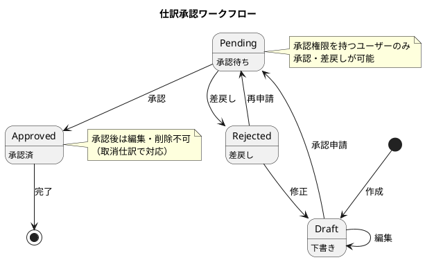

# 第13章: 仕訳承認・ワークフロー

本章では、仕訳の承認ワークフロー機能の実装を解説します。承認待ち一覧、承認・差戻し操作、一括承認、承認履歴など、内部統制の観点から重要な機能を実装します。

## 13.1 承認ワークフローの概要

### 13.1.1 承認フローの概念

財務会計システムでは、仕訳の正確性と内部統制を確保するために承認ワークフローを導入します。



### 13.1.2 型定義

**src/types/approval.ts**:

```typescript
// 承認ステータス
export type ApprovalStatus = 'draft' | 'pending' | 'approved' | 'rejected';

// 承認待ち仕訳
export interface PendingApproval {
  id: string;
  slipNumber: string;
  entryDate: string;
  description: string;
  debitTotal: number;
  creditTotal: number;
  detailCount: number;
  createdBy: string;
  createdAt: string;
  requestedAt: string;     // 承認申請日時
  requestedBy: string;     // 承認申請者
}

// 承認リクエスト
export interface ApprovalRequest {
  journalEntryId: string;
  comment?: string;
}

// 一括承認リクエスト
export interface BulkApprovalRequest {
  journalEntryIds: string[];
  comment?: string;
}

// 差戻しリクエスト
export interface RejectRequest {
  journalEntryId: string;
  reason: string;  // 差戻し理由は必須
}

// 承認履歴
export interface ApprovalHistory {
  id: string;
  journalEntryId: string;
  action: 'request' | 'approve' | 'reject';
  actionBy: string;
  actionAt: string;
  comment?: string;
}

// 承認一覧レスポンス
export interface ApprovalListResponse {
  content: PendingApproval[];
  totalElements: number;
  totalPages: number;
  size: number;
  number: number;
}
```

### 13.1.3 承認権限の管理

```typescript
// src/types/permission.ts

export type UserRole = 'accountant' | 'approver' | 'admin' | 'auditor';

export interface Permission {
  canCreateJournal: boolean;
  canEditJournal: boolean;
  canDeleteJournal: boolean;
  canRequestApproval: boolean;
  canApprove: boolean;
  canReject: boolean;
  canBulkApprove: boolean;
  canViewAuditLog: boolean;
}

// ロール別権限
export const ROLE_PERMISSIONS: Record<UserRole, Permission> = {
  accountant: {
    canCreateJournal: true,
    canEditJournal: true,
    canDeleteJournal: true,
    canRequestApproval: true,
    canApprove: false,
    canReject: false,
    canBulkApprove: false,
    canViewAuditLog: false,
  },
  approver: {
    canCreateJournal: true,
    canEditJournal: true,
    canDeleteJournal: true,
    canRequestApproval: true,
    canApprove: true,
    canReject: true,
    canBulkApprove: true,
    canViewAuditLog: true,
  },
  admin: {
    canCreateJournal: true,
    canEditJournal: true,
    canDeleteJournal: true,
    canRequestApproval: true,
    canApprove: true,
    canReject: true,
    canBulkApprove: true,
    canViewAuditLog: true,
  },
  auditor: {
    canCreateJournal: false,
    canEditJournal: false,
    canDeleteJournal: false,
    canRequestApproval: false,
    canApprove: false,
    canReject: false,
    canBulkApprove: false,
    canViewAuditLog: true,
  },
};
```

## 13.2 承認待ち一覧

### 13.2.1 JournalApprovalContainer

**src/components/journal/approval/JournalApprovalContainer.tsx**:

```typescript
import React, { useState, useCallback, useMemo } from 'react';
import { useNavigate } from 'react-router-dom';
import { useQueryClient } from '@tanstack/react-query';
import {
  useGetPendingApprovals,
  useApproveJournal,
  useRejectJournal,
  useBulkApproveJournals,
  getGetPendingApprovalsQueryKey,
  getGetJournalEntriesQueryKey,
} from '@/api/generated/approval/approval';
import { PendingApproval, RejectRequest, BulkApprovalRequest } from '@/types/approval';
import { ApprovalCollection } from '@/views/journal/approval/ApprovalCollection';
import { ApprovalDetailModal } from '@/views/journal/approval/ApprovalDetailModal';
import { RejectModal } from '@/views/journal/approval/RejectModal';
import { BulkApprovalModal } from '@/views/journal/approval/BulkApprovalModal';
import { Pagination } from '@/views/common/Pagination';
import { Loading } from '@/views/common/Loading';
import { ErrorMessage } from '@/views/common/ErrorMessage';
import { useConfirm } from '@/hooks/useConfirm';
import { ConfirmModal } from '@/views/common/ConfirmModal';
import { useMessage } from '@/providers/MessageProvider';
import { useAuth } from '@/providers/AuthProvider';
import { ROLE_PERMISSIONS } from '@/types/permission';
import './JournalApprovalContainer.css';

const DEFAULT_PAGE_SIZE = 20;

export const JournalApprovalContainer: React.FC = () => {
  const navigate = useNavigate();
  const queryClient = useQueryClient();
  const { showSuccess, showError } = useMessage();
  const { user } = useAuth();
  const { confirmState, confirm, handleConfirm, handleCancel } = useConfirm();

  // 権限チェック
  const permissions = useMemo(
    () => ROLE_PERMISSIONS[user?.role || 'accountant'],
    [user?.role]
  );

  // ページング
  const [page, setPage] = useState(0);
  const [pageSize] = useState(DEFAULT_PAGE_SIZE);

  // 選択状態（一括承認用）
  const [selectedIds, setSelectedIds] = useState<Set<string>>(new Set());

  // モーダル状態
  const [detailTarget, setDetailTarget] = useState<PendingApproval | null>(null);
  const [rejectTarget, setRejectTarget] = useState<PendingApproval | null>(null);
  const [showBulkModal, setShowBulkModal] = useState(false);

  // 承認待ち一覧取得
  const {
    data: approvalPage,
    isLoading,
    error,
  } = useGetPendingApprovals({ page, size: pageSize });

  // 各種 mutation
  const approveMutation = useApproveJournal();
  const rejectMutation = useRejectJournal();
  const bulkApproveMutation = useBulkApproveJournals();

  // キャッシュ無効化
  const invalidateQueries = useCallback(() => {
    queryClient.invalidateQueries({
      queryKey: getGetPendingApprovalsQueryKey(),
    });
    queryClient.invalidateQueries({
      queryKey: getGetJournalEntriesQueryKey(),
    });
  }, [queryClient]);

  // 詳細表示
  const handleSelect = useCallback((approval: PendingApproval) => {
    setDetailTarget(approval);
  }, []);

  // 仕訳詳細へ遷移
  const handleViewDetail = useCallback(
    (approval: PendingApproval) => {
      navigate(`/journal/${approval.id}`);
    },
    [navigate]
  );

  // 承認
  const handleApprove = useCallback(
    async (approval: PendingApproval, comment?: string) => {
      if (!permissions.canApprove) {
        showError('承認権限がありません。');
        return;
      }

      const confirmed = await confirm(
        `伝票番号「${approval.slipNumber}」を承認しますか？`
      );
      if (!confirmed) return;

      try {
        await approveMutation.mutateAsync({
          data: {
            journalEntryId: approval.id,
            comment,
          },
        });
        showSuccess('承認しました。');
        setDetailTarget(null);
        invalidateQueries();
      } catch (err) {
        showError('承認に失敗しました。');
      }
    },
    [permissions, confirm, approveMutation, invalidateQueries, showSuccess, showError]
  );

  // 差戻し
  const handleReject = useCallback(
    async (request: RejectRequest) => {
      if (!permissions.canReject) {
        showError('差戻し権限がありません。');
        return;
      }

      try {
        await rejectMutation.mutateAsync({ data: request });
        showSuccess('差戻ししました。');
        setRejectTarget(null);
        setDetailTarget(null);
        invalidateQueries();
      } catch (err) {
        showError('差戻しに失敗しました。');
      }
    },
    [permissions, rejectMutation, invalidateQueries, showSuccess, showError]
  );

  // 差戻しモーダルを開く
  const handleOpenReject = useCallback((approval: PendingApproval) => {
    setRejectTarget(approval);
  }, []);

  // 選択切り替え
  const handleToggleSelect = useCallback((id: string) => {
    setSelectedIds((prev) => {
      const newSet = new Set(prev);
      if (newSet.has(id)) {
        newSet.delete(id);
      } else {
        newSet.add(id);
      }
      return newSet;
    });
  }, []);

  // 全選択/解除
  const handleToggleSelectAll = useCallback(() => {
    if (!approvalPage?.content) return;

    if (selectedIds.size === approvalPage.content.length) {
      setSelectedIds(new Set());
    } else {
      setSelectedIds(new Set(approvalPage.content.map((a) => a.id)));
    }
  }, [approvalPage?.content, selectedIds.size]);

  // 一括承認
  const handleBulkApprove = useCallback(
    async (comment?: string) => {
      if (!permissions.canBulkApprove) {
        showError('一括承認権限がありません。');
        return;
      }

      if (selectedIds.size === 0) {
        showError('承認する仕訳を選択してください。');
        return;
      }

      try {
        const request: BulkApprovalRequest = {
          journalEntryIds: Array.from(selectedIds),
          comment,
        };
        const result = await bulkApproveMutation.mutateAsync({ data: request });
        showSuccess(`${result.successCount}件を承認しました。`);
        setShowBulkModal(false);
        setSelectedIds(new Set());
        invalidateQueries();
      } catch (err) {
        showError('一括承認に失敗しました。');
      }
    },
    [permissions, selectedIds, bulkApproveMutation, invalidateQueries, showSuccess, showError]
  );

  // ページ変更
  const handlePageChange = useCallback((newPage: number) => {
    setPage(newPage);
    setSelectedIds(new Set()); // ページ変更時は選択をクリア
  }, []);

  if (!permissions.canApprove) {
    return (
      <div className="no-permission">
        <p>承認画面の閲覧権限がありません。</p>
      </div>
    );
  }

  if (error) {
    return <ErrorMessage error={error} />;
  }

  return (
    <div className="journal-approval-container">
      <div className="approval-header">
        <h2>承認待ち一覧</h2>
        <div className="header-stats">
          <span className="pending-count">
            承認待ち: {approvalPage?.totalElements || 0}件
          </span>
        </div>
      </div>

      {/* 一括操作バー */}
      {approvalPage && approvalPage.content.length > 0 && (
        <div className="bulk-action-bar">
          <label className="select-all">
            <input
              type="checkbox"
              checked={selectedIds.size === approvalPage.content.length}
              onChange={handleToggleSelectAll}
            />
            すべて選択
          </label>
          <span className="selected-count">
            {selectedIds.size}件選択中
          </span>
          <button
            className="btn-bulk-approve"
            onClick={() => setShowBulkModal(true)}
            disabled={selectedIds.size === 0}
          >
            一括承認
          </button>
        </div>
      )}

      {/* 一覧表示 */}
      {isLoading ? (
        <Loading />
      ) : (
        <>
          <ApprovalCollection
            approvals={approvalPage?.content || []}
            selectedIds={selectedIds}
            onSelect={handleSelect}
            onApprove={(a) => handleApprove(a)}
            onReject={handleOpenReject}
            onToggleSelect={handleToggleSelect}
            onViewDetail={handleViewDetail}
          />

          {/* ページネーション */}
          {approvalPage && approvalPage.totalPages > 1 && (
            <Pagination
              currentPage={approvalPage.number}
              totalPages={approvalPage.totalPages}
              totalElements={approvalPage.totalElements}
              pageSize={approvalPage.size}
              onPageChange={handlePageChange}
            />
          )}
        </>
      )}

      {/* 詳細モーダル */}
      {detailTarget && (
        <ApprovalDetailModal
          approval={detailTarget}
          onApprove={(comment) => handleApprove(detailTarget, comment)}
          onReject={() => handleOpenReject(detailTarget)}
          onClose={() => setDetailTarget(null)}
          isApproving={approveMutation.isPending}
        />
      )}

      {/* 差戻しモーダル */}
      {rejectTarget && (
        <RejectModal
          approval={rejectTarget}
          onReject={handleReject}
          onClose={() => setRejectTarget(null)}
          isRejecting={rejectMutation.isPending}
        />
      )}

      {/* 一括承認モーダル */}
      {showBulkModal && (
        <BulkApprovalModal
          selectedCount={selectedIds.size}
          onApprove={handleBulkApprove}
          onClose={() => setShowBulkModal(false)}
          isApproving={bulkApproveMutation.isPending}
        />
      )}

      {/* 確認モーダル */}
      <ConfirmModal
        isOpen={confirmState.isOpen}
        message={confirmState.message}
        onConfirm={handleConfirm}
        onCancel={handleCancel}
      />
    </div>
  );
};
```

### 13.2.2 ApprovalCollection

**src/views/journal/approval/ApprovalCollection.tsx**:

```typescript
import React from 'react';
import { PendingApproval } from '@/types/approval';
import { FiCheck, FiX, FiEye } from 'react-icons/fi';
import dayjs from 'dayjs';
import './ApprovalCollection.css';

interface Props {
  approvals: PendingApproval[];
  selectedIds: Set<string>;
  onSelect: (approval: PendingApproval) => void;
  onApprove: (approval: PendingApproval) => void;
  onReject: (approval: PendingApproval) => void;
  onToggleSelect: (id: string) => void;
  onViewDetail: (approval: PendingApproval) => void;
}

export const ApprovalCollection: React.FC<Props> = ({
  approvals,
  selectedIds,
  onSelect,
  onApprove,
  onReject,
  onToggleSelect,
  onViewDetail,
}) => {
  const formatMoney = (amount: number) => amount.toLocaleString();

  if (approvals.length === 0) {
    return (
      <div className="empty-approval-list">
        <p>承認待ちの仕訳はありません</p>
      </div>
    );
  }

  return (
    <table className="approval-table">
      <thead>
        <tr>
          <th className="col-checkbox"></th>
          <th>伝票番号</th>
          <th>仕訳日付</th>
          <th>摘要</th>
          <th className="amount-header">借方金額</th>
          <th className="amount-header">貸方金額</th>
          <th>作成者</th>
          <th>申請日時</th>
          <th className="actions-header">操作</th>
        </tr>
      </thead>
      <tbody>
        {approvals.map((approval) => (
          <tr
            key={approval.id}
            className={`approval-row ${selectedIds.has(approval.id) ? 'selected' : ''}`}
          >
            <td className="col-checkbox">
              <input
                type="checkbox"
                checked={selectedIds.has(approval.id)}
                onChange={() => onToggleSelect(approval.id)}
                onClick={(e) => e.stopPropagation()}
              />
            </td>
            <td
              className="slip-number"
              onClick={() => onSelect(approval)}
            >
              {approval.slipNumber}
            </td>
            <td onClick={() => onSelect(approval)}>
              {dayjs(approval.entryDate).format('YYYY/MM/DD')}
            </td>
            <td
              className="description"
              onClick={() => onSelect(approval)}
              title={approval.description}
            >
              {approval.description}
            </td>
            <td className="amount debit">
              {formatMoney(approval.debitTotal)}
            </td>
            <td className="amount credit">
              {formatMoney(approval.creditTotal)}
            </td>
            <td>{approval.createdBy}</td>
            <td className="requested-at">
              {dayjs(approval.requestedAt).format('MM/DD HH:mm')}
            </td>
            <td className="actions">
              <button
                className="btn-icon btn-view"
                onClick={() => onViewDetail(approval)}
                title="詳細"
              >
                <FiEye />
              </button>
              <button
                className="btn-icon btn-approve"
                onClick={() => onApprove(approval)}
                title="承認"
              >
                <FiCheck />
              </button>
              <button
                className="btn-icon btn-reject"
                onClick={() => onReject(approval)}
                title="差戻し"
              >
                <FiX />
              </button>
            </td>
          </tr>
        ))}
      </tbody>
    </table>
  );
};
```

## 13.3 承認・差戻し操作

### 13.3.1 ApprovalDetailModal

**src/views/journal/approval/ApprovalDetailModal.tsx**:

```typescript
import React, { useState, useCallback } from 'react';
import Modal from 'react-modal';
import { PendingApproval } from '@/types/approval';
import { useGetJournalEntry } from '@/api/generated/journal-entry/journal-entry';
import { Loading } from '@/views/common/Loading';
import { FiX, FiCheck, FiXCircle } from 'react-icons/fi';
import dayjs from 'dayjs';
import './ApprovalDetailModal.css';

interface Props {
  approval: PendingApproval;
  onApprove: (comment?: string) => void;
  onReject: () => void;
  onClose: () => void;
  isApproving: boolean;
}

export const ApprovalDetailModal: React.FC<Props> = ({
  approval,
  onApprove,
  onReject,
  onClose,
  isApproving,
}) => {
  const [comment, setComment] = useState('');

  // 仕訳詳細を取得
  const { data: journalEntry, isLoading } = useGetJournalEntry(approval.id);

  const handleApprove = useCallback(() => {
    onApprove(comment || undefined);
  }, [comment, onApprove]);

  const formatMoney = (amount: number) => amount.toLocaleString();

  return (
    <Modal
      isOpen={true}
      onRequestClose={onClose}
      className="approval-detail-modal"
      overlayClassName="modal-overlay"
    >
      <div className="modal-header">
        <h3>承認確認 - {approval.slipNumber}</h3>
        <button className="btn-close" onClick={onClose}>
          <FiX />
        </button>
      </div>

      <div className="modal-body">
        {isLoading ? (
          <Loading />
        ) : journalEntry ? (
          <>
            {/* 仕訳情報 */}
            <div className="approval-info">
              <div className="info-row">
                <div className="info-item">
                  <label>伝票番号</label>
                  <span>{journalEntry.slipNumber}</span>
                </div>
                <div className="info-item">
                  <label>仕訳日付</label>
                  <span>{dayjs(journalEntry.entryDate).format('YYYY年MM月DD日')}</span>
                </div>
              </div>
              <div className="info-row">
                <div className="info-item full-width">
                  <label>摘要</label>
                  <span>{journalEntry.description}</span>
                </div>
              </div>
            </div>

            {/* 明細テーブル */}
            <div className="detail-preview">
              <h4>仕訳明細</h4>
              <table className="preview-table">
                <thead>
                  <tr>
                    <th>勘定科目</th>
                    <th className="amount-col">借方金額</th>
                    <th className="amount-col">貸方金額</th>
                    <th>課税区分</th>
                  </tr>
                </thead>
                <tbody>
                  {journalEntry.details.map((detail, index) => (
                    <tr key={index}>
                      <td>
                        {detail.accountCode} {detail.accountName}
                      </td>
                      <td className="amount debit">
                        {detail.debitAmount > 0
                          ? formatMoney(detail.debitAmount)
                          : ''}
                      </td>
                      <td className="amount credit">
                        {detail.creditAmount > 0
                          ? formatMoney(detail.creditAmount)
                          : ''}
                      </td>
                      <td>{detail.taxType}</td>
                    </tr>
                  ))}
                </tbody>
                <tfoot>
                  <tr>
                    <td className="total-label">合計</td>
                    <td className="amount debit">
                      {formatMoney(approval.debitTotal)}
                    </td>
                    <td className="amount credit">
                      {formatMoney(approval.creditTotal)}
                    </td>
                    <td></td>
                  </tr>
                </tfoot>
              </table>
            </div>

            {/* 申請情報 */}
            <div className="request-info">
              <div className="info-item">
                <label>作成者</label>
                <span>{approval.createdBy}</span>
              </div>
              <div className="info-item">
                <label>申請日時</label>
                <span>
                  {dayjs(approval.requestedAt).format('YYYY/MM/DD HH:mm')}
                </span>
              </div>
            </div>

            {/* コメント入力 */}
            <div className="comment-section">
              <label htmlFor="approvalComment">承認コメント（任意）</label>
              <textarea
                id="approvalComment"
                value={comment}
                onChange={(e) => setComment(e.target.value)}
                placeholder="承認時のコメントを入力..."
                rows={3}
              />
            </div>
          </>
        ) : (
          <p>仕訳データが見つかりません</p>
        )}
      </div>

      <div className="modal-footer">
        <button className="btn-secondary" onClick={onClose}>
          キャンセル
        </button>
        <button
          className="btn-danger"
          onClick={onReject}
          disabled={isApproving}
        >
          <FiXCircle />
          差戻し
        </button>
        <button
          className="btn-success"
          onClick={handleApprove}
          disabled={isApproving || isLoading}
        >
          <FiCheck />
          {isApproving ? '承認中...' : '承認'}
        </button>
      </div>
    </Modal>
  );
};
```

### 13.3.2 RejectModal

**src/views/journal/approval/RejectModal.tsx**:

```typescript
import React, { useState, useCallback } from 'react';
import Modal from 'react-modal';
import { PendingApproval, RejectRequest } from '@/types/approval';
import { FiX, FiAlertTriangle } from 'react-icons/fi';
import './RejectModal.css';

interface Props {
  approval: PendingApproval;
  onReject: (request: RejectRequest) => void;
  onClose: () => void;
  isRejecting: boolean;
}

export const RejectModal: React.FC<Props> = ({
  approval,
  onReject,
  onClose,
  isRejecting,
}) => {
  const [reason, setReason] = useState('');
  const [error, setError] = useState('');

  const handleSubmit = useCallback(() => {
    if (!reason.trim()) {
      setError('差戻し理由を入力してください。');
      return;
    }

    onReject({
      journalEntryId: approval.id,
      reason: reason.trim(),
    });
  }, [approval.id, reason, onReject]);

  return (
    <Modal
      isOpen={true}
      onRequestClose={onClose}
      className="reject-modal"
      overlayClassName="modal-overlay"
    >
      <div className="modal-header reject-header">
        <FiAlertTriangle className="warning-icon" />
        <h3>差戻し確認</h3>
        <button className="btn-close" onClick={onClose}>
          <FiX />
        </button>
      </div>

      <div className="modal-body">
        <p className="reject-message">
          伝票番号「<strong>{approval.slipNumber}</strong>」を差戻しますか？
        </p>

        <div className="summary-info">
          <div className="info-item">
            <label>仕訳日付</label>
            <span>{approval.entryDate}</span>
          </div>
          <div className="info-item">
            <label>摘要</label>
            <span>{approval.description}</span>
          </div>
          <div className="info-item">
            <label>作成者</label>
            <span>{approval.createdBy}</span>
          </div>
        </div>

        <div className="reason-section">
          <label htmlFor="rejectReason">
            差戻し理由 <span className="required">*</span>
          </label>
          <textarea
            id="rejectReason"
            value={reason}
            onChange={(e) => {
              setReason(e.target.value);
              setError('');
            }}
            placeholder="差戻しの理由を入力してください（作成者に通知されます）"
            rows={4}
            className={error ? 'has-error' : ''}
          />
          {error && <p className="error-message">{error}</p>}
        </div>

        <div className="notice">
          <p>
            差戻しを行うと、作成者に通知が送信されます。
            差戻された仕訳は修正後、再度承認申請が必要です。
          </p>
        </div>
      </div>

      <div className="modal-footer">
        <button className="btn-secondary" onClick={onClose}>
          キャンセル
        </button>
        <button
          className="btn-danger"
          onClick={handleSubmit}
          disabled={isRejecting}
        >
          {isRejecting ? '処理中...' : '差戻し実行'}
        </button>
      </div>
    </Modal>
  );
};
```

## 13.4 一括承認

### 13.4.1 BulkApprovalModal

**src/views/journal/approval/BulkApprovalModal.tsx**:

```typescript
import React, { useState, useCallback } from 'react';
import Modal from 'react-modal';
import { FiX, FiCheck, FiAlertCircle } from 'react-icons/fi';
import './BulkApprovalModal.css';

interface Props {
  selectedCount: number;
  onApprove: (comment?: string) => void;
  onClose: () => void;
  isApproving: boolean;
}

export const BulkApprovalModal: React.FC<Props> = ({
  selectedCount,
  onApprove,
  onClose,
  isApproving,
}) => {
  const [comment, setComment] = useState('');
  const [confirmed, setConfirmed] = useState(false);

  const handleApprove = useCallback(() => {
    if (!confirmed) return;
    onApprove(comment || undefined);
  }, [confirmed, comment, onApprove]);

  return (
    <Modal
      isOpen={true}
      onRequestClose={onClose}
      className="bulk-approval-modal"
      overlayClassName="modal-overlay"
    >
      <div className="modal-header">
        <h3>一括承認</h3>
        <button className="btn-close" onClick={onClose}>
          <FiX />
        </button>
      </div>

      <div className="modal-body">
        <div className="bulk-info">
          <FiAlertCircle className="info-icon" />
          <p>
            <strong>{selectedCount}件</strong>の仕訳を一括で承認します。
          </p>
        </div>

        <div className="warning-notice">
          <p>
            一括承認を実行すると、選択したすべての仕訳が承認済みになります。
            承認後は編集・削除ができなくなります。
          </p>
        </div>

        <div className="comment-section">
          <label htmlFor="bulkComment">承認コメント（任意）</label>
          <textarea
            id="bulkComment"
            value={comment}
            onChange={(e) => setComment(e.target.value)}
            placeholder="すべての仕訳に共通のコメントを入力..."
            rows={3}
          />
        </div>

        <div className="confirm-check">
          <label>
            <input
              type="checkbox"
              checked={confirmed}
              onChange={(e) => setConfirmed(e.target.checked)}
            />
            上記の内容を確認し、一括承認を実行します
          </label>
        </div>
      </div>

      <div className="modal-footer">
        <button className="btn-secondary" onClick={onClose}>
          キャンセル
        </button>
        <button
          className="btn-success"
          onClick={handleApprove}
          disabled={!confirmed || isApproving}
        >
          <FiCheck />
          {isApproving ? '承認中...' : `${selectedCount}件を承認`}
        </button>
      </div>
    </Modal>
  );
};
```

## 13.5 承認履歴

### 13.5.1 ApprovalHistoryContainer

**src/components/journal/approval/ApprovalHistoryContainer.tsx**:

```typescript
import React, { useState, useCallback } from 'react';
import { useParams } from 'react-router-dom';
import {
  useGetApprovalHistory,
} from '@/api/generated/approval/approval';
import { ApprovalHistory } from '@/types/approval';
import { ApprovalHistoryTimeline } from '@/views/journal/approval/ApprovalHistoryTimeline';
import { Loading } from '@/views/common/Loading';
import { ErrorMessage } from '@/views/common/ErrorMessage';

export const ApprovalHistoryContainer: React.FC = () => {
  const { journalId } = useParams<{ journalId: string }>();

  const {
    data: history,
    isLoading,
    error,
  } = useGetApprovalHistory(journalId!, {
    query: {
      enabled: Boolean(journalId),
    },
  });

  if (isLoading) return <Loading />;
  if (error) return <ErrorMessage error={error} />;

  return (
    <div className="approval-history-container">
      <h3>承認履歴</h3>
      <ApprovalHistoryTimeline history={history || []} />
    </div>
  );
};
```

### 13.5.2 ApprovalHistoryTimeline

**src/views/journal/approval/ApprovalHistoryTimeline.tsx**:

```typescript
import React from 'react';
import { ApprovalHistory } from '@/types/approval';
import { FiSend, FiCheck, FiX, FiClock } from 'react-icons/fi';
import dayjs from 'dayjs';
import './ApprovalHistoryTimeline.css';

interface Props {
  history: ApprovalHistory[];
}

const ACTION_CONFIG = {
  request: {
    icon: FiSend,
    label: '承認申請',
    color: '#0066cc',
  },
  approve: {
    icon: FiCheck,
    label: '承認',
    color: '#28a745',
  },
  reject: {
    icon: FiX,
    label: '差戻し',
    color: '#dc3545',
  },
};

export const ApprovalHistoryTimeline: React.FC<Props> = ({ history }) => {
  if (history.length === 0) {
    return (
      <div className="empty-history">
        <FiClock />
        <p>承認履歴はありません</p>
      </div>
    );
  }

  return (
    <div className="approval-timeline">
      {history.map((item, index) => {
        const config = ACTION_CONFIG[item.action];
        const Icon = config.icon;

        return (
          <div key={item.id} className="timeline-item">
            <div className="timeline-marker" style={{ borderColor: config.color }}>
              <Icon style={{ color: config.color }} />
            </div>
            <div className="timeline-content">
              <div className="timeline-header">
                <span className="action-label" style={{ color: config.color }}>
                  {config.label}
                </span>
                <span className="action-time">
                  {dayjs(item.actionAt).format('YYYY/MM/DD HH:mm:ss')}
                </span>
              </div>
              <div className="timeline-body">
                <span className="action-by">{item.actionBy}</span>
                {item.comment && (
                  <p className="action-comment">{item.comment}</p>
                )}
              </div>
            </div>
            {index < history.length - 1 && <div className="timeline-line" />}
          </div>
        );
      })}
    </div>
  );
};
```

## 13.6 承認申請機能

### 13.6.1 RequestApprovalButton

仕訳詳細画面から承認申請を行うボタンコンポーネント。

**src/views/journal/detail/RequestApprovalButton.tsx**:

```typescript
import React, { useCallback } from 'react';
import { useRequestApproval } from '@/api/generated/approval/approval';
import { useQueryClient } from '@tanstack/react-query';
import { getGetJournalEntryQueryKey } from '@/api/generated/journal-entry/journal-entry';
import { useMessage } from '@/providers/MessageProvider';
import { useConfirm } from '@/hooks/useConfirm';
import { ConfirmModal } from '@/views/common/ConfirmModal';
import { FiSend } from 'react-icons/fi';

interface Props {
  journalId: string;
  slipNumber: string;
  currentStatus: string;
}

export const RequestApprovalButton: React.FC<Props> = ({
  journalId,
  slipNumber,
  currentStatus,
}) => {
  const queryClient = useQueryClient();
  const { showSuccess, showError } = useMessage();
  const { confirmState, confirm, handleConfirm, handleCancel } = useConfirm();

  const requestMutation = useRequestApproval();

  const handleRequest = useCallback(async () => {
    const confirmed = await confirm(
      `伝票番号「${slipNumber}」の承認を申請しますか？`
    );
    if (!confirmed) return;

    try {
      await requestMutation.mutateAsync({
        data: { journalEntryId: journalId },
      });
      showSuccess('承認申請しました。');
      queryClient.invalidateQueries({
        queryKey: getGetJournalEntryQueryKey(journalId),
      });
    } catch (err) {
      showError('承認申請に失敗しました。');
    }
  }, [journalId, slipNumber, confirm, requestMutation, queryClient, showSuccess, showError]);

  // 下書き状態のみ申請可能
  const canRequest = currentStatus === 'draft';

  return (
    <>
      <button
        className="btn-request-approval"
        onClick={handleRequest}
        disabled={!canRequest || requestMutation.isPending}
      >
        <FiSend />
        {requestMutation.isPending ? '申請中...' : '承認申請'}
      </button>

      <ConfirmModal
        isOpen={confirmState.isOpen}
        message={confirmState.message}
        onConfirm={handleConfirm}
        onCancel={handleCancel}
      />
    </>
  );
};
```

### 13.6.2 ステータス遷移コンポーネント

**src/views/journal/detail/StatusTransition.tsx**:

```typescript
import React from 'react';
import { EntryStatus, STATUS_LABELS } from '@/types/journalSearch';
import { FiArrowRight } from 'react-icons/fi';
import './StatusTransition.css';

interface Props {
  currentStatus: EntryStatus;
}

const STATUS_FLOW: EntryStatus[] = ['draft', 'pending', 'approved'];

export const StatusTransition: React.FC<Props> = ({ currentStatus }) => {
  const currentIndex = STATUS_FLOW.indexOf(currentStatus);

  return (
    <div className="status-transition">
      {STATUS_FLOW.map((status, index) => (
        <React.Fragment key={status}>
          <div
            className={`status-step ${
              index <= currentIndex ? 'completed' : ''
            } ${status === currentStatus ? 'current' : ''}`}
          >
            <div className="step-circle">{index + 1}</div>
            <span className="step-label">{STATUS_LABELS[status]}</span>
          </div>
          {index < STATUS_FLOW.length - 1 && (
            <FiArrowRight className="step-arrow" />
          )}
        </React.Fragment>
      ))}
    </div>
  );
};
```

## 13.7 スタイル定義

### 13.7.1 承認一覧のスタイル

**src/views/journal/approval/ApprovalCollection.css**:

```css
.approval-table {
  width: 100%;
  border-collapse: collapse;
  font-size: 0.875rem;
}

.approval-table th,
.approval-table td {
  padding: 0.75rem 0.5rem;
  border-bottom: 1px solid #e0e0e0;
  text-align: left;
}

.approval-table th {
  background: #f5f5f5;
  font-weight: 500;
}

.approval-row {
  transition: background-color 0.15s;
}

.approval-row:hover {
  background-color: #f8f9fa;
}

.approval-row.selected {
  background-color: #e8f4ff;
}

.col-checkbox {
  width: 40px;
  text-align: center;
}

.slip-number {
  color: #0066cc;
  cursor: pointer;
  font-family: 'Consolas', monospace;
}

.slip-number:hover {
  text-decoration: underline;
}

.description {
  max-width: 200px;
  overflow: hidden;
  text-overflow: ellipsis;
  white-space: nowrap;
}

.amount {
  text-align: right;
  font-family: 'Consolas', monospace;
}

.amount.debit {
  color: #0066cc;
}

.amount.credit {
  color: #cc0066;
}

.requested-at {
  color: #666;
  font-size: 0.8125rem;
}

.actions {
  white-space: nowrap;
}

.actions .btn-icon {
  padding: 0.375rem;
  margin: 0 0.125rem;
  border: none;
  border-radius: 4px;
  cursor: pointer;
  transition: all 0.15s;
}

.btn-view {
  background: #e8f4ff;
  color: #0066cc;
}

.btn-view:hover {
  background: #cce5ff;
}

.btn-approve {
  background: #d4edda;
  color: #28a745;
}

.btn-approve:hover {
  background: #c3e6cb;
}

.btn-reject {
  background: #f8d7da;
  color: #dc3545;
}

.btn-reject:hover {
  background: #f5c6cb;
}

.empty-approval-list {
  text-align: center;
  padding: 3rem;
  color: #666;
}
```

### 13.7.2 タイムラインのスタイル

**src/views/journal/approval/ApprovalHistoryTimeline.css**:

```css
.approval-timeline {
  position: relative;
  padding: 1rem 0;
}

.timeline-item {
  position: relative;
  display: flex;
  gap: 1rem;
  padding-bottom: 1.5rem;
}

.timeline-item:last-child {
  padding-bottom: 0;
}

.timeline-marker {
  flex-shrink: 0;
  width: 2.5rem;
  height: 2.5rem;
  display: flex;
  align-items: center;
  justify-content: center;
  background: #fff;
  border: 2px solid;
  border-radius: 50%;
  z-index: 1;
}

.timeline-marker svg {
  font-size: 1rem;
}

.timeline-line {
  position: absolute;
  left: 1.25rem;
  top: 2.5rem;
  bottom: 0;
  width: 2px;
  background: #e0e0e0;
}

.timeline-content {
  flex: 1;
  padding-top: 0.25rem;
}

.timeline-header {
  display: flex;
  justify-content: space-between;
  align-items: center;
  margin-bottom: 0.25rem;
}

.action-label {
  font-weight: 600;
}

.action-time {
  font-size: 0.8125rem;
  color: #666;
}

.timeline-body {
  background: #f8f9fa;
  border-radius: 4px;
  padding: 0.75rem;
}

.action-by {
  font-weight: 500;
  color: #333;
}

.action-comment {
  margin-top: 0.5rem;
  padding-top: 0.5rem;
  border-top: 1px solid #e0e0e0;
  color: #666;
  font-size: 0.875rem;
  white-space: pre-wrap;
}

.empty-history {
  display: flex;
  flex-direction: column;
  align-items: center;
  gap: 0.5rem;
  padding: 2rem;
  color: #999;
}

.empty-history svg {
  font-size: 2rem;
}
```

### 13.7.3 ステータス遷移のスタイル

**src/views/journal/detail/StatusTransition.css**:

```css
.status-transition {
  display: flex;
  align-items: center;
  gap: 0.5rem;
  padding: 1rem;
  background: #f8f9fa;
  border-radius: 4px;
}

.status-step {
  display: flex;
  flex-direction: column;
  align-items: center;
  gap: 0.25rem;
}

.step-circle {
  width: 2rem;
  height: 2rem;
  display: flex;
  align-items: center;
  justify-content: center;
  border: 2px solid #ddd;
  border-radius: 50%;
  background: #fff;
  color: #999;
  font-weight: 600;
  font-size: 0.875rem;
}

.status-step.completed .step-circle {
  border-color: #28a745;
  background: #28a745;
  color: #fff;
}

.status-step.current .step-circle {
  border-color: #0066cc;
  background: #0066cc;
  color: #fff;
  box-shadow: 0 0 0 4px rgba(0, 102, 204, 0.2);
}

.step-label {
  font-size: 0.75rem;
  color: #666;
}

.status-step.current .step-label {
  color: #0066cc;
  font-weight: 600;
}

.step-arrow {
  color: #ddd;
  flex-shrink: 0;
}

.status-step.completed + .step-arrow {
  color: #28a745;
}
```

## 13.8 まとめ

本章では、仕訳承認・ワークフロー機能の実装について解説しました。

### 主要コンポーネント

1. **JournalApprovalContainer**: 承認待ち一覧画面のコンテナ
2. **ApprovalCollection**: 承認待ち一覧テーブル
3. **ApprovalDetailModal**: 承認確認モーダル
4. **RejectModal**: 差戻しモーダル
5. **BulkApprovalModal**: 一括承認モーダル
6. **ApprovalHistoryTimeline**: 承認履歴タイムライン

### 設計のポイント

- **権限管理**: ロールベースのアクセス制御（ROLE_PERMISSIONS）
- **承認フロー**: draft → pending → approved の状態遷移
- **差戻し理由**: 差戻し時は理由を必須とし、作成者にフィードバック
- **一括承認**: 複数仕訳の効率的な承認処理
- **承認履歴**: タイムライン形式での履歴表示
- **内部統制**: 承認済み仕訳の編集・削除を制限

### ワークフローの流れ

```
1. 経理担当者が仕訳を作成（draft）
2. 承認申請（draft → pending）
3. 承認者が確認・承認（pending → approved）
   または差戻し（pending → rejected → draft）
4. 承認済み仕訳は編集不可（取消仕訳で対応）
```

この承認ワークフローにより、仕訳の正確性と内部統制を確保し、財務データの信頼性を担保します。
