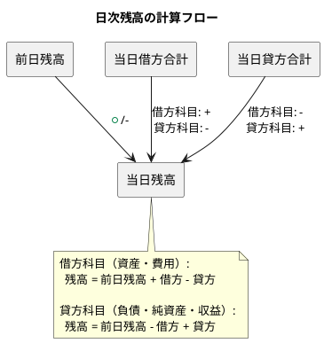

# 第14章: 日次残高照会

本章では、勘定科目の日次残高を照会する機能の実装を解説します。日付ごとの残高確認、残高推移グラフ、勘定科目別明細など、日々の経理業務で必要となる残高照会機能を実装します。

## 14.1 日次残高の概念

### 14.1.1 残高計算の仕組み

日次残高は、各勘定科目の特定日時点での残高を表します。前日残高に当日の仕訳を加減算して算出されます。



### 14.1.2 型定義

**src/types/balance.ts**:

```typescript
// 日次残高
export interface DailyBalance {
  id: string;
  accountCode: string;
  accountName: string;
  balanceDate: string;          // 残高日付
  openingBalance: number;       // 期首残高
  debitAmount: number;          // 当日借方合計
  creditAmount: number;         // 当日貸方合計
  closingBalance: number;       // 当日残高
  cumulativeDebit: number;      // 累計借方
  cumulativeCredit: number;     // 累計貸方
}

// 日次残高検索パラメータ
export interface DailyBalanceSearchParams {
  date: string;                 // 基準日
  accountCode?: string;         // 勘定科目コード（指定時は単一科目）
  bsplType?: 'B' | 'P';        // BS/PL区分
  elementType?: string;         // 勘定要素
  includeZeroBalance?: boolean; // 残高0の科目も表示
}

// 残高推移データ
export interface BalanceTrend {
  date: string;
  balance: number;
  debitAmount: number;
  creditAmount: number;
}

// 勘定科目別日次明細
export interface AccountDailyDetail {
  date: string;
  slipNumber: string;
  description: string;
  debitAmount: number;
  creditAmount: number;
  balance: number;
  journalEntryId: string;
}

// 残高表示設定
export interface BalanceDisplaySettings {
  showZeroBalance: boolean;
  groupByElement: boolean;
  sortBy: 'code' | 'name' | 'balance';
  sortOrder: 'asc' | 'desc';
}
```

### 14.1.3 残高の符号と表示

```typescript
// src/utils/balanceUtils.ts

import { Account } from '@/api/model';

/**
 * 残高の符号を正規化する
 * 借方科目（資産・費用）: 正の値が通常
 * 貸方科目（負債・純資産・収益）: 正の値が通常
 */
export const normalizeBalance = (
  balance: number,
  debitCreditType: '借' | '貸'
): number => {
  // 貸方科目の場合、符号を反転して正の値で表示
  if (debitCreditType === '貸') {
    return -balance;
  }
  return balance;
};

/**
 * 残高の表示形式を決定
 */
export const formatBalanceDisplay = (
  balance: number,
  debitCreditType: '借' | '貸'
): { value: string; isNegative: boolean } => {
  const normalized = normalizeBalance(balance, debitCreditType);
  const isNegative = normalized < 0;
  const absValue = Math.abs(normalized).toLocaleString();

  return {
    value: isNegative ? `△${absValue}` : absValue,
    isNegative,
  };
};

/**
 * 勘定要素に基づいて残高が借方か貸方かを判定
 */
export const getBalanceSide = (
  elementType: string
): '借' | '貸' => {
  const debitElements = ['資産', '費用'];
  return debitElements.includes(elementType) ? '借' : '貸';
};
```

## 14.2 日次残高一覧

### 14.2.1 DailyBalanceContainer

**src/components/balance/daily/DailyBalanceContainer.tsx**:

```typescript
import React, { useState, useCallback, useMemo } from 'react';
import { useNavigate } from 'react-router-dom';
import {
  useGetDailyBalances,
} from '@/api/generated/balance/balance';
import { DailyBalanceSearchParams, BalanceDisplaySettings } from '@/types/balance';
import { DailyBalanceCollection } from '@/views/balance/daily/DailyBalanceCollection';
import { DailyBalanceSearchForm } from '@/views/balance/daily/DailyBalanceSearchForm';
import { BalanceDisplaySettingsPanel } from '@/views/balance/common/BalanceDisplaySettingsPanel';
import { Loading } from '@/views/common/Loading';
import { ErrorMessage } from '@/views/common/ErrorMessage';
import { useAccountingPeriod } from '@/providers/AccountingPeriodProvider';
import dayjs from 'dayjs';
import './DailyBalanceContainer.css';

export const DailyBalanceContainer: React.FC = () => {
  const navigate = useNavigate();
  const { currentPeriod } = useAccountingPeriod();

  // 検索条件
  const [searchParams, setSearchParams] = useState<DailyBalanceSearchParams>({
    date: dayjs().format('YYYY-MM-DD'),
    includeZeroBalance: false,
  });

  // 表示設定
  const [displaySettings, setDisplaySettings] = useState<BalanceDisplaySettings>({
    showZeroBalance: false,
    groupByElement: true,
    sortBy: 'code',
    sortOrder: 'asc',
  });

  // 日次残高取得
  const {
    data: balances,
    isLoading,
    error,
  } = useGetDailyBalances(searchParams);

  // 検索条件変更
  const handleSearch = useCallback((params: Partial<DailyBalanceSearchParams>) => {
    setSearchParams((prev) => ({ ...prev, ...params }));
  }, []);

  // 表示設定変更
  const handleSettingsChange = useCallback(
    (settings: Partial<BalanceDisplaySettings>) => {
      setDisplaySettings((prev) => ({ ...prev, ...settings }));
    },
    []
  );

  // 勘定科目詳細へ遷移
  const handleAccountClick = useCallback(
    (accountCode: string) => {
      navigate(`/balance/daily/${accountCode}`, {
        state: { date: searchParams.date },
      });
    },
    [navigate, searchParams.date]
  );

  // グラフ表示へ遷移
  const handleShowTrend = useCallback(
    (accountCode: string) => {
      navigate(`/balance/trend/${accountCode}`, {
        state: {
          startDate: currentPeriod?.startDate,
          endDate: searchParams.date,
        },
      });
    },
    [navigate, currentPeriod, searchParams.date]
  );

  // 残高データの加工（ソート、グルーピング）
  const processedBalances = useMemo(() => {
    if (!balances) return [];

    let result = [...balances];

    // 残高0の除外
    if (!displaySettings.showZeroBalance) {
      result = result.filter((b) => b.closingBalance !== 0);
    }

    // ソート
    result.sort((a, b) => {
      let comparison = 0;
      switch (displaySettings.sortBy) {
        case 'code':
          comparison = a.accountCode.localeCompare(b.accountCode);
          break;
        case 'name':
          comparison = a.accountName.localeCompare(b.accountName);
          break;
        case 'balance':
          comparison = Math.abs(a.closingBalance) - Math.abs(b.closingBalance);
          break;
      }
      return displaySettings.sortOrder === 'asc' ? comparison : -comparison;
    });

    return result;
  }, [balances, displaySettings]);

  // 要素別グルーピング
  const groupedBalances = useMemo(() => {
    if (!displaySettings.groupByElement) {
      return { ungrouped: processedBalances };
    }

    const groups: Record<string, typeof processedBalances> = {
      資産: [],
      負債: [],
      純資産: [],
      収益: [],
      費用: [],
    };

    processedBalances.forEach((balance) => {
      // 勘定科目の要素タイプに基づいてグルーピング
      // ※ 実際のデータには elementType が含まれている想定
      const elementType = (balance as any).elementType || '資産';
      if (groups[elementType]) {
        groups[elementType].push(balance);
      }
    });

    return groups;
  }, [processedBalances, displaySettings.groupByElement]);

  if (error) {
    return <ErrorMessage error={error} />;
  }

  return (
    <div className="daily-balance-container">
      <div className="page-header">
        <h2>日次残高照会</h2>
        <div className="header-info">
          <span className="balance-date">
            基準日: {dayjs(searchParams.date).format('YYYY年MM月DD日')}
          </span>
        </div>
      </div>

      {/* 検索フォーム */}
      <DailyBalanceSearchForm
        params={searchParams}
        onSearch={handleSearch}
      />

      {/* 表示設定 */}
      <BalanceDisplaySettingsPanel
        settings={displaySettings}
        onChange={handleSettingsChange}
      />

      {/* 残高一覧 */}
      {isLoading ? (
        <Loading />
      ) : (
        <DailyBalanceCollection
          balances={processedBalances}
          groupedBalances={groupedBalances}
          groupByElement={displaySettings.groupByElement}
          onAccountClick={handleAccountClick}
          onShowTrend={handleShowTrend}
        />
      )}
    </div>
  );
};
```

### 14.2.2 DailyBalanceSearchForm

**src/views/balance/daily/DailyBalanceSearchForm.tsx**:

```typescript
import React, { useState, useCallback } from 'react';
import { DailyBalanceSearchParams } from '@/types/balance';
import { AccountSelector } from '@/views/common/AccountSelector';
import { FiCalendar, FiFilter, FiX } from 'react-icons/fi';
import './DailyBalanceSearchForm.css';

interface Props {
  params: DailyBalanceSearchParams;
  onSearch: (params: Partial<DailyBalanceSearchParams>) => void;
}

export const DailyBalanceSearchForm: React.FC<Props> = ({
  params,
  onSearch,
}) => {
  const [showAccountSelector, setShowAccountSelector] = useState(false);
  const [selectedAccountName, setSelectedAccountName] = useState('');

  // 日付変更
  const handleDateChange = useCallback(
    (e: React.ChangeEvent<HTMLInputElement>) => {
      onSearch({ date: e.target.value });
    },
    [onSearch]
  );

  // BS/PL区分変更
  const handleBsplChange = useCallback(
    (e: React.ChangeEvent<HTMLSelectElement>) => {
      const value = e.target.value as 'B' | 'P' | '';
      onSearch({ bsplType: value || undefined });
    },
    [onSearch]
  );

  // 勘定要素変更
  const handleElementChange = useCallback(
    (e: React.ChangeEvent<HTMLSelectElement>) => {
      onSearch({ elementType: e.target.value || undefined });
    },
    [onSearch]
  );

  // 勘定科目選択
  const handleAccountSelect = useCallback(
    (account: { code: string; name: string }) => {
      onSearch({ accountCode: account.code });
      setSelectedAccountName(account.name);
      setShowAccountSelector(false);
    },
    [onSearch]
  );

  // 勘定科目クリア
  const handleAccountClear = useCallback(() => {
    onSearch({ accountCode: undefined });
    setSelectedAccountName('');
  }, [onSearch]);

  // 残高0表示切り替え
  const handleZeroBalanceToggle = useCallback(
    (e: React.ChangeEvent<HTMLInputElement>) => {
      onSearch({ includeZeroBalance: e.target.checked });
    },
    [onSearch]
  );

  return (
    <div className="daily-balance-search-form">
      <div className="search-row">
        {/* 日付選択 */}
        <div className="search-group">
          <label>
            <FiCalendar />
            基準日
          </label>
          <input
            type="date"
            value={params.date}
            onChange={handleDateChange}
          />
        </div>

        {/* BS/PL区分 */}
        <div className="search-group">
          <label>BS/PL区分</label>
          <select
            value={params.bsplType || ''}
            onChange={handleBsplChange}
          >
            <option value="">すべて</option>
            <option value="B">貸借対照表（BS）</option>
            <option value="P">損益計算書（PL）</option>
          </select>
        </div>

        {/* 勘定要素 */}
        <div className="search-group">
          <label>勘定要素</label>
          <select
            value={params.elementType || ''}
            onChange={handleElementChange}
          >
            <option value="">すべて</option>
            <option value="資産">資産</option>
            <option value="負債">負債</option>
            <option value="純資産">純資産</option>
            <option value="収益">収益</option>
            <option value="費用">費用</option>
          </select>
        </div>

        {/* 勘定科目 */}
        <div className="search-group">
          <label>勘定科目</label>
          <div className="account-input">
            <input
              type="text"
              value={selectedAccountName || params.accountCode || ''}
              onClick={() => setShowAccountSelector(true)}
              readOnly
              placeholder="指定なし"
            />
            {params.accountCode && (
              <button
                className="btn-clear"
                onClick={handleAccountClear}
              >
                <FiX />
              </button>
            )}
          </div>
          {showAccountSelector && (
            <AccountSelector
              onSelect={handleAccountSelect}
              onClose={() => setShowAccountSelector(false)}
            />
          )}
        </div>
      </div>

      <div className="search-options">
        <label className="checkbox-label">
          <input
            type="checkbox"
            checked={params.includeZeroBalance}
            onChange={handleZeroBalanceToggle}
          />
          残高0の科目も表示
        </label>
      </div>
    </div>
  );
};
```

### 14.2.3 DailyBalanceCollection

**src/views/balance/daily/DailyBalanceCollection.tsx**:

```typescript
import React from 'react';
import { DailyBalance } from '@/types/balance';
import { FiTrendingUp, FiChevronRight } from 'react-icons/fi';
import { formatBalanceDisplay } from '@/utils/balanceUtils';
import './DailyBalanceCollection.css';

interface Props {
  balances: DailyBalance[];
  groupedBalances: Record<string, DailyBalance[]>;
  groupByElement: boolean;
  onAccountClick: (accountCode: string) => void;
  onShowTrend: (accountCode: string) => void;
}

const ELEMENT_LABELS: Record<string, { label: string; color: string }> = {
  資産: { label: '資産', color: '#0066cc' },
  負債: { label: '負債', color: '#cc0066' },
  純資産: { label: '純資産', color: '#6600cc' },
  収益: { label: '収益', color: '#00cc66' },
  費用: { label: '費用', color: '#cc6600' },
};

export const DailyBalanceCollection: React.FC<Props> = ({
  balances,
  groupedBalances,
  groupByElement,
  onAccountClick,
  onShowTrend,
}) => {
  const formatMoney = (amount: number) => amount.toLocaleString();

  // 残高行のレンダリング
  const renderBalanceRow = (balance: DailyBalance) => {
    const debitCreditType = (balance as any).debitCreditType || '借';
    const { value: displayBalance, isNegative } = formatBalanceDisplay(
      balance.closingBalance,
      debitCreditType
    );

    return (
      <tr
        key={balance.id}
        className="balance-row"
        onClick={() => onAccountClick(balance.accountCode)}
      >
        <td className="account-code">{balance.accountCode}</td>
        <td className="account-name">{balance.accountName}</td>
        <td className="amount opening">{formatMoney(balance.openingBalance)}</td>
        <td className="amount debit">{formatMoney(balance.debitAmount)}</td>
        <td className="amount credit">{formatMoney(balance.creditAmount)}</td>
        <td className={`amount closing ${isNegative ? 'negative' : ''}`}>
          {displayBalance}
        </td>
        <td className="actions">
          <button
            className="btn-icon"
            onClick={(e) => {
              e.stopPropagation();
              onShowTrend(balance.accountCode);
            }}
            title="推移を表示"
          >
            <FiTrendingUp />
          </button>
          <FiChevronRight className="detail-arrow" />
        </td>
      </tr>
    );
  };

  // グループヘッダーのレンダリング
  const renderGroupHeader = (elementType: string, balances: DailyBalance[]) => {
    const config = ELEMENT_LABELS[elementType];
    const total = balances.reduce((sum, b) => sum + b.closingBalance, 0);

    return (
      <tr className="group-header" style={{ borderLeftColor: config.color }}>
        <td colSpan={5}>
          <span className="group-label">{config.label}</span>
          <span className="group-count">({balances.length}科目)</span>
        </td>
        <td className="amount closing">
          {formatMoney(total)}
        </td>
        <td></td>
      </tr>
    );
  };

  if (balances.length === 0) {
    return (
      <div className="empty-balance">
        <p>該当する残高データがありません</p>
      </div>
    );
  }

  return (
    <div className="daily-balance-collection">
      <table className="balance-table">
        <thead>
          <tr>
            <th className="col-code">科目コード</th>
            <th className="col-name">勘定科目</th>
            <th className="col-amount">期首残高</th>
            <th className="col-amount">借方合計</th>
            <th className="col-amount">貸方合計</th>
            <th className="col-amount">残高</th>
            <th className="col-actions"></th>
          </tr>
        </thead>
        <tbody>
          {groupByElement ? (
            // グループ表示
            Object.entries(groupedBalances).map(([elementType, balances]) => {
              if (balances.length === 0) return null;
              return (
                <React.Fragment key={elementType}>
                  {renderGroupHeader(elementType, balances)}
                  {balances.map(renderBalanceRow)}
                </React.Fragment>
              );
            })
          ) : (
            // フラット表示
            balances.map(renderBalanceRow)
          )}
        </tbody>
      </table>

      {/* 合計行 */}
      <div className="balance-summary">
        <div className="summary-item">
          <span className="label">表示科目数:</span>
          <span className="value">{balances.length}科目</span>
        </div>
        <div className="summary-item">
          <span className="label">借方合計:</span>
          <span className="value debit">
            {formatMoney(balances.reduce((sum, b) => sum + b.debitAmount, 0))}
          </span>
        </div>
        <div className="summary-item">
          <span className="label">貸方合計:</span>
          <span className="value credit">
            {formatMoney(balances.reduce((sum, b) => sum + b.creditAmount, 0))}
          </span>
        </div>
      </div>
    </div>
  );
};
```

## 14.3 残高推移グラフ

### 14.3.1 BalanceTrendContainer

**src/components/balance/trend/BalanceTrendContainer.tsx**:

```typescript
import React, { useState, useCallback } from 'react';
import { useParams, useLocation, useNavigate } from 'react-router-dom';
import {
  useGetBalanceTrend,
  useGetAccount,
} from '@/api/generated/balance/balance';
import { BalanceTrendChart } from '@/views/balance/trend/BalanceTrendChart';
import { BalanceTrendTable } from '@/views/balance/trend/BalanceTrendTable';
import { PeriodSelector } from '@/views/common/PeriodSelector';
import { Loading } from '@/views/common/Loading';
import { ErrorMessage } from '@/views/common/ErrorMessage';
import { useAccountingPeriod } from '@/providers/AccountingPeriodProvider';
import { FiArrowLeft, FiGrid, FiBarChart2 } from 'react-icons/fi';
import dayjs from 'dayjs';
import './BalanceTrendContainer.css';

type ViewMode = 'chart' | 'table';

export const BalanceTrendContainer: React.FC = () => {
  const { accountCode } = useParams<{ accountCode: string }>();
  const location = useLocation();
  const navigate = useNavigate();
  const { currentPeriod } = useAccountingPeriod();

  // 初期値の設定
  const initialState = location.state as {
    startDate?: string;
    endDate?: string;
  } | null;

  const [startDate, setStartDate] = useState(
    initialState?.startDate || currentPeriod?.startDate || dayjs().startOf('month').format('YYYY-MM-DD')
  );
  const [endDate, setEndDate] = useState(
    initialState?.endDate || dayjs().format('YYYY-MM-DD')
  );
  const [viewMode, setViewMode] = useState<ViewMode>('chart');

  // 勘定科目情報取得
  const {
    data: account,
    isLoading: isLoadingAccount,
  } = useGetAccount(accountCode!);

  // 残高推移データ取得
  const {
    data: trendData,
    isLoading: isLoadingTrend,
    error,
  } = useGetBalanceTrend(
    accountCode!,
    { startDate, endDate },
    {
      query: {
        enabled: Boolean(accountCode),
      },
    }
  );

  // 期間変更
  const handlePeriodChange = useCallback(
    (start: string, end: string) => {
      setStartDate(start);
      setEndDate(end);
    },
    []
  );

  // 戻る
  const handleBack = useCallback(() => {
    navigate(-1);
  }, [navigate]);

  const isLoading = isLoadingAccount || isLoadingTrend;

  if (error) {
    return <ErrorMessage error={error} />;
  }

  return (
    <div className="balance-trend-container">
      <div className="page-header">
        <button className="btn-back" onClick={handleBack}>
          <FiArrowLeft />
          戻る
        </button>
        <div className="header-info">
          <h2>残高推移</h2>
          {account && (
            <span className="account-info">
              {account.accountCode} {account.accountName}
            </span>
          )}
        </div>
      </div>

      {/* 期間選択・表示切替 */}
      <div className="trend-controls">
        <PeriodSelector
          startDate={startDate}
          endDate={endDate}
          onChange={handlePeriodChange}
        />
        <div className="view-toggle">
          <button
            className={`toggle-btn ${viewMode === 'chart' ? 'active' : ''}`}
            onClick={() => setViewMode('chart')}
          >
            <FiBarChart2 />
            グラフ
          </button>
          <button
            className={`toggle-btn ${viewMode === 'table' ? 'active' : ''}`}
            onClick={() => setViewMode('table')}
          >
            <FiGrid />
            表
          </button>
        </div>
      </div>

      {/* 推移表示 */}
      {isLoading ? (
        <Loading />
      ) : (
        <>
          {viewMode === 'chart' ? (
            <BalanceTrendChart
              data={trendData || []}
              accountName={account?.accountName || ''}
            />
          ) : (
            <BalanceTrendTable data={trendData || []} />
          )}
        </>
      )}
    </div>
  );
};
```

### 14.3.2 BalanceTrendChart

**src/views/balance/trend/BalanceTrendChart.tsx**:

```typescript
import React, { useMemo, useRef, useEffect } from 'react';
import { BalanceTrend } from '@/types/balance';
import dayjs from 'dayjs';
import './BalanceTrendChart.css';

interface Props {
  data: BalanceTrend[];
  accountName: string;
}

export const BalanceTrendChart: React.FC<Props> = ({ data, accountName }) => {
  const canvasRef = useRef<HTMLCanvasElement>(null);

  // グラフ描画
  useEffect(() => {
    const canvas = canvasRef.current;
    if (!canvas || data.length === 0) return;

    const ctx = canvas.getContext('2d');
    if (!ctx) return;

    // キャンバスサイズ
    const width = canvas.width;
    const height = canvas.height;
    const padding = { top: 40, right: 60, bottom: 60, left: 80 };
    const chartWidth = width - padding.left - padding.right;
    const chartHeight = height - padding.top - padding.bottom;

    // クリア
    ctx.clearRect(0, 0, width, height);

    // 最大値・最小値の計算
    const balances = data.map((d) => d.balance);
    const maxBalance = Math.max(...balances, 0);
    const minBalance = Math.min(...balances, 0);
    const range = maxBalance - minBalance || 1;

    // スケール関数
    const scaleX = (index: number) =>
      padding.left + (index / (data.length - 1)) * chartWidth;
    const scaleY = (value: number) =>
      padding.top + chartHeight - ((value - minBalance) / range) * chartHeight;

    // 背景グリッド
    ctx.strokeStyle = '#e0e0e0';
    ctx.lineWidth = 1;

    // 横グリッド線
    const yTicks = 5;
    for (let i = 0; i <= yTicks; i++) {
      const y = padding.top + (i / yTicks) * chartHeight;
      ctx.beginPath();
      ctx.moveTo(padding.left, y);
      ctx.lineTo(width - padding.right, y);
      ctx.stroke();

      // Y軸ラベル
      const value = maxBalance - (i / yTicks) * range;
      ctx.fillStyle = '#666';
      ctx.font = '12px sans-serif';
      ctx.textAlign = 'right';
      ctx.fillText(value.toLocaleString(), padding.left - 10, y + 4);
    }

    // ゼロライン
    if (minBalance < 0 && maxBalance > 0) {
      const zeroY = scaleY(0);
      ctx.strokeStyle = '#999';
      ctx.lineWidth = 2;
      ctx.beginPath();
      ctx.moveTo(padding.left, zeroY);
      ctx.lineTo(width - padding.right, zeroY);
      ctx.stroke();
    }

    // 面グラフ（残高）
    ctx.beginPath();
    ctx.moveTo(scaleX(0), scaleY(0));
    data.forEach((d, i) => {
      ctx.lineTo(scaleX(i), scaleY(d.balance));
    });
    ctx.lineTo(scaleX(data.length - 1), scaleY(0));
    ctx.closePath();
    ctx.fillStyle = 'rgba(0, 102, 204, 0.1)';
    ctx.fill();

    // 折れ線グラフ（残高）
    ctx.beginPath();
    ctx.strokeStyle = '#0066cc';
    ctx.lineWidth = 2;
    data.forEach((d, i) => {
      if (i === 0) {
        ctx.moveTo(scaleX(i), scaleY(d.balance));
      } else {
        ctx.lineTo(scaleX(i), scaleY(d.balance));
      }
    });
    ctx.stroke();

    // データポイント
    data.forEach((d, i) => {
      ctx.beginPath();
      ctx.arc(scaleX(i), scaleY(d.balance), 4, 0, Math.PI * 2);
      ctx.fillStyle = '#0066cc';
      ctx.fill();
    });

    // X軸ラベル
    ctx.fillStyle = '#666';
    ctx.font = '11px sans-serif';
    ctx.textAlign = 'center';

    // 日付ラベルの間引き
    const labelInterval = Math.ceil(data.length / 10);
    data.forEach((d, i) => {
      if (i % labelInterval === 0 || i === data.length - 1) {
        ctx.fillText(
          dayjs(d.date).format('MM/DD'),
          scaleX(i),
          height - padding.bottom + 20
        );
      }
    });

    // タイトル
    ctx.fillStyle = '#333';
    ctx.font = 'bold 14px sans-serif';
    ctx.textAlign = 'center';
    ctx.fillText(`${accountName} 残高推移`, width / 2, 20);

  }, [data, accountName]);

  if (data.length === 0) {
    return (
      <div className="empty-chart">
        <p>表示するデータがありません</p>
      </div>
    );
  }

  return (
    <div className="balance-trend-chart">
      <canvas
        ref={canvasRef}
        width={800}
        height={400}
      />
      <div className="chart-legend">
        <span className="legend-item">
          <span className="legend-color balance" />
          残高
        </span>
      </div>
    </div>
  );
};
```

### 14.3.3 BalanceTrendTable

**src/views/balance/trend/BalanceTrendTable.tsx**:

```typescript
import React from 'react';
import { BalanceTrend } from '@/types/balance';
import dayjs from 'dayjs';
import './BalanceTrendTable.css';

interface Props {
  data: BalanceTrend[];
}

export const BalanceTrendTable: React.FC<Props> = ({ data }) => {
  const formatMoney = (amount: number) => amount.toLocaleString();

  if (data.length === 0) {
    return (
      <div className="empty-table">
        <p>表示するデータがありません</p>
      </div>
    );
  }

  return (
    <div className="balance-trend-table">
      <table>
        <thead>
          <tr>
            <th>日付</th>
            <th className="amount-col">借方</th>
            <th className="amount-col">貸方</th>
            <th className="amount-col">残高</th>
          </tr>
        </thead>
        <tbody>
          {data.map((item, index) => {
            // 前日との差額
            const prevBalance = index > 0 ? data[index - 1].balance : item.balance;
            const diff = item.balance - prevBalance;

            return (
              <tr key={item.date}>
                <td className="date-col">
                  {dayjs(item.date).format('YYYY/MM/DD (ddd)')}
                </td>
                <td className="amount debit">
                  {item.debitAmount > 0 ? formatMoney(item.debitAmount) : '-'}
                </td>
                <td className="amount credit">
                  {item.creditAmount > 0 ? formatMoney(item.creditAmount) : '-'}
                </td>
                <td className="amount balance">
                  {formatMoney(item.balance)}
                  {diff !== 0 && (
                    <span className={`diff ${diff > 0 ? 'positive' : 'negative'}`}>
                      ({diff > 0 ? '+' : ''}{formatMoney(diff)})
                    </span>
                  )}
                </td>
              </tr>
            );
          })}
        </tbody>
      </table>
    </div>
  );
};
```

## 14.4 勘定科目別明細

### 14.4.1 AccountDailyDetailContainer

**src/components/balance/daily/AccountDailyDetailContainer.tsx**:

```typescript
import React, { useState, useCallback } from 'react';
import { useParams, useLocation, useNavigate } from 'react-router-dom';
import {
  useGetAccountDailyDetails,
  useGetAccount,
} from '@/api/generated/balance/balance';
import { AccountDailyDetailView } from '@/views/balance/daily/AccountDailyDetailView';
import { Loading } from '@/views/common/Loading';
import { ErrorMessage } from '@/views/common/ErrorMessage';
import { useAccountingPeriod } from '@/providers/AccountingPeriodProvider';
import { FiArrowLeft } from 'react-icons/fi';
import dayjs from 'dayjs';
import './AccountDailyDetailContainer.css';

export const AccountDailyDetailContainer: React.FC = () => {
  const { accountCode } = useParams<{ accountCode: string }>();
  const location = useLocation();
  const navigate = useNavigate();
  const { currentPeriod } = useAccountingPeriod();

  // 初期値
  const initialState = location.state as { date?: string } | null;
  const [date, setDate] = useState(
    initialState?.date || dayjs().format('YYYY-MM-DD')
  );

  // 勘定科目情報取得
  const {
    data: account,
    isLoading: isLoadingAccount,
  } = useGetAccount(accountCode!);

  // 日次明細取得
  const {
    data: details,
    isLoading: isLoadingDetails,
    error,
  } = useGetAccountDailyDetails(accountCode!, date, {
    query: {
      enabled: Boolean(accountCode),
    },
  });

  // 日付変更
  const handleDateChange = useCallback((newDate: string) => {
    setDate(newDate);
  }, []);

  // 戻る
  const handleBack = useCallback(() => {
    navigate('/balance/daily');
  }, [navigate]);

  // 仕訳詳細へ遷移
  const handleJournalClick = useCallback(
    (journalEntryId: string) => {
      navigate(`/journal/${journalEntryId}`);
    },
    [navigate]
  );

  const isLoading = isLoadingAccount || isLoadingDetails;

  if (error) {
    return <ErrorMessage error={error} />;
  }

  return (
    <div className="account-daily-detail-container">
      <div className="page-header">
        <button className="btn-back" onClick={handleBack}>
          <FiArrowLeft />
          一覧に戻る
        </button>
        <div className="header-info">
          <h2>勘定科目別明細</h2>
          {account && (
            <span className="account-info">
              {account.accountCode} {account.accountName}
            </span>
          )}
        </div>
      </div>

      {/* 日付選択 */}
      <div className="date-selector">
        <label>基準日</label>
        <input
          type="date"
          value={date}
          onChange={(e) => handleDateChange(e.target.value)}
        />
      </div>

      {/* 明細表示 */}
      {isLoading ? (
        <Loading />
      ) : (
        <AccountDailyDetailView
          account={account}
          details={details || []}
          date={date}
          onJournalClick={handleJournalClick}
        />
      )}
    </div>
  );
};
```

### 14.4.2 AccountDailyDetailView

**src/views/balance/daily/AccountDailyDetailView.tsx**:

```typescript
import React, { useMemo } from 'react';
import { Account, AccountDailyDetail } from '@/types/balance';
import { FiExternalLink } from 'react-icons/fi';
import dayjs from 'dayjs';
import './AccountDailyDetailView.css';

interface Props {
  account?: Account;
  details: AccountDailyDetail[];
  date: string;
  onJournalClick: (journalEntryId: string) => void;
}

export const AccountDailyDetailView: React.FC<Props> = ({
  account,
  details,
  date,
  onJournalClick,
}) => {
  const formatMoney = (amount: number) => amount.toLocaleString();

  // 集計
  const summary = useMemo(() => {
    const debitTotal = details.reduce((sum, d) => sum + d.debitAmount, 0);
    const creditTotal = details.reduce((sum, d) => sum + d.creditAmount, 0);
    const lastBalance = details.length > 0 ? details[details.length - 1].balance : 0;

    return { debitTotal, creditTotal, lastBalance };
  }, [details]);

  return (
    <div className="account-daily-detail-view">
      {/* サマリー */}
      <div className="detail-summary">
        <div className="summary-card">
          <span className="label">基準日</span>
          <span className="value">{dayjs(date).format('YYYY年MM月DD日')}</span>
        </div>
        <div className="summary-card">
          <span className="label">取引件数</span>
          <span className="value">{details.length}件</span>
        </div>
        <div className="summary-card">
          <span className="label">借方合計</span>
          <span className="value debit">{formatMoney(summary.debitTotal)}</span>
        </div>
        <div className="summary-card">
          <span className="label">貸方合計</span>
          <span className="value credit">{formatMoney(summary.creditTotal)}</span>
        </div>
        <div className="summary-card highlight">
          <span className="label">残高</span>
          <span className="value">{formatMoney(summary.lastBalance)}</span>
        </div>
      </div>

      {/* 明細一覧 */}
      {details.length === 0 ? (
        <div className="empty-details">
          <p>該当日の取引はありません</p>
        </div>
      ) : (
        <table className="detail-table">
          <thead>
            <tr>
              <th>伝票番号</th>
              <th>摘要</th>
              <th className="amount-col">借方</th>
              <th className="amount-col">貸方</th>
              <th className="amount-col">残高</th>
              <th className="link-col"></th>
            </tr>
          </thead>
          <tbody>
            {details.map((detail, index) => (
              <tr key={`${detail.slipNumber}-${index}`}>
                <td className="slip-number">{detail.slipNumber}</td>
                <td className="description" title={detail.description}>
                  {detail.description}
                </td>
                <td className="amount debit">
                  {detail.debitAmount > 0
                    ? formatMoney(detail.debitAmount)
                    : ''}
                </td>
                <td className="amount credit">
                  {detail.creditAmount > 0
                    ? formatMoney(detail.creditAmount)
                    : ''}
                </td>
                <td className="amount balance">{formatMoney(detail.balance)}</td>
                <td className="link-col">
                  <button
                    className="btn-link"
                    onClick={() => onJournalClick(detail.journalEntryId)}
                    title="仕訳を表示"
                  >
                    <FiExternalLink />
                  </button>
                </td>
              </tr>
            ))}
          </tbody>
          <tfoot>
            <tr className="total-row">
              <td colSpan={2}>合計</td>
              <td className="amount debit">{formatMoney(summary.debitTotal)}</td>
              <td className="amount credit">{formatMoney(summary.creditTotal)}</td>
              <td className="amount balance">{formatMoney(summary.lastBalance)}</td>
              <td></td>
            </tr>
          </tfoot>
        </table>
      )}
    </div>
  );
};
```

## 14.5 共通コンポーネント

### 14.5.1 BalanceDisplaySettingsPanel

**src/views/balance/common/BalanceDisplaySettingsPanel.tsx**:

```typescript
import React from 'react';
import { BalanceDisplaySettings } from '@/types/balance';
import { FiSettings } from 'react-icons/fi';
import './BalanceDisplaySettingsPanel.css';

interface Props {
  settings: BalanceDisplaySettings;
  onChange: (settings: Partial<BalanceDisplaySettings>) => void;
}

export const BalanceDisplaySettingsPanel: React.FC<Props> = ({
  settings,
  onChange,
}) => {
  return (
    <div className="balance-display-settings">
      <div className="settings-header">
        <FiSettings />
        <span>表示設定</span>
      </div>

      <div className="settings-options">
        {/* 残高0表示 */}
        <label className="checkbox-option">
          <input
            type="checkbox"
            checked={settings.showZeroBalance}
            onChange={(e) => onChange({ showZeroBalance: e.target.checked })}
          />
          残高0の科目を表示
        </label>

        {/* グルーピング */}
        <label className="checkbox-option">
          <input
            type="checkbox"
            checked={settings.groupByElement}
            onChange={(e) => onChange({ groupByElement: e.target.checked })}
          />
          勘定要素でグループ化
        </label>

        {/* ソート */}
        <div className="sort-options">
          <label>並び順</label>
          <select
            value={settings.sortBy}
            onChange={(e) =>
              onChange({ sortBy: e.target.value as 'code' | 'name' | 'balance' })
            }
          >
            <option value="code">科目コード順</option>
            <option value="name">科目名順</option>
            <option value="balance">残高順</option>
          </select>
          <select
            value={settings.sortOrder}
            onChange={(e) =>
              onChange({ sortOrder: e.target.value as 'asc' | 'desc' })
            }
          >
            <option value="asc">昇順</option>
            <option value="desc">降順</option>
          </select>
        </div>
      </div>
    </div>
  );
};
```

## 14.6 スタイル定義

### 14.6.1 日次残高一覧のスタイル

**src/views/balance/daily/DailyBalanceCollection.css**:

```css
.daily-balance-collection {
  margin-top: 1rem;
}

.balance-table {
  width: 100%;
  border-collapse: collapse;
  font-size: 0.875rem;
}

.balance-table th,
.balance-table td {
  padding: 0.75rem 0.5rem;
  border-bottom: 1px solid #e0e0e0;
  text-align: left;
}

.balance-table th {
  background: #f5f5f5;
  font-weight: 500;
  position: sticky;
  top: 0;
  z-index: 1;
}

.col-code {
  width: 100px;
}

.col-name {
  width: 200px;
}

.col-amount {
  width: 120px;
  text-align: right;
}

.col-actions {
  width: 80px;
}

/* グループヘッダー */
.group-header {
  background: #f8f9fa;
  border-left: 4px solid;
}

.group-header td {
  padding: 0.5rem;
  font-weight: 500;
}

.group-label {
  font-size: 0.9375rem;
  color: #333;
}

.group-count {
  margin-left: 0.5rem;
  font-size: 0.8125rem;
  color: #666;
  font-weight: normal;
}

/* 残高行 */
.balance-row {
  cursor: pointer;
  transition: background-color 0.15s;
}

.balance-row:hover {
  background-color: #f8f9fa;
}

.account-code {
  font-family: 'Consolas', monospace;
  color: #0066cc;
}

.amount {
  text-align: right;
  font-family: 'Consolas', monospace;
}

.amount.opening {
  color: #666;
}

.amount.debit {
  color: #0066cc;
}

.amount.credit {
  color: #cc0066;
}

.amount.closing {
  font-weight: 600;
}

.amount.closing.negative {
  color: #dc3545;
}

.actions {
  display: flex;
  align-items: center;
  justify-content: flex-end;
  gap: 0.25rem;
}

.btn-icon {
  padding: 0.375rem;
  background: transparent;
  border: none;
  border-radius: 4px;
  cursor: pointer;
  color: #666;
}

.btn-icon:hover {
  background: #f0f0f0;
  color: #0066cc;
}

.detail-arrow {
  color: #ccc;
}

/* サマリー */
.balance-summary {
  display: flex;
  justify-content: flex-end;
  gap: 2rem;
  margin-top: 1rem;
  padding: 1rem;
  background: #f8f9fa;
  border-radius: 4px;
}

.summary-item {
  display: flex;
  gap: 0.5rem;
}

.summary-item .label {
  color: #666;
}

.summary-item .value {
  font-weight: 600;
  font-family: 'Consolas', monospace;
}

.summary-item .value.debit {
  color: #0066cc;
}

.summary-item .value.credit {
  color: #cc0066;
}

.empty-balance {
  text-align: center;
  padding: 3rem;
  color: #666;
}
```

### 14.6.2 残高推移グラフのスタイル

**src/views/balance/trend/BalanceTrendChart.css**:

```css
.balance-trend-chart {
  background: #fff;
  border: 1px solid #e0e0e0;
  border-radius: 4px;
  padding: 1rem;
}

.balance-trend-chart canvas {
  width: 100%;
  max-width: 800px;
  height: auto;
  display: block;
  margin: 0 auto;
}

.chart-legend {
  display: flex;
  justify-content: center;
  gap: 2rem;
  margin-top: 1rem;
  padding-top: 1rem;
  border-top: 1px solid #e0e0e0;
}

.legend-item {
  display: flex;
  align-items: center;
  gap: 0.5rem;
  font-size: 0.875rem;
  color: #666;
}

.legend-color {
  width: 16px;
  height: 4px;
  border-radius: 2px;
}

.legend-color.balance {
  background: #0066cc;
}

.empty-chart {
  text-align: center;
  padding: 3rem;
  color: #666;
}
```

## 14.7 まとめ

本章では、日次残高照会機能の実装について解説しました。

### 主要コンポーネント

1. **DailyBalanceContainer**: 日次残高一覧画面のコンテナ
2. **DailyBalanceCollection**: 残高一覧テーブル（グループ表示対応）
3. **BalanceTrendContainer / BalanceTrendChart**: 残高推移グラフ
4. **AccountDailyDetailContainer / AccountDailyDetailView**: 勘定科目別明細

### 機能のポイント

- **残高計算**: 借方科目・貸方科目に応じた残高の符号処理
- **グルーピング**: 勘定要素（資産・負債・純資産・収益・費用）別の表示
- **推移グラフ**: Canvas API を使用した残高推移の可視化
- **明細ドリルダウン**: 残高一覧 → 科目別明細 → 仕訳詳細への遷移
- **表示設定**: ソート、フィルタ、残高0表示の切り替え
