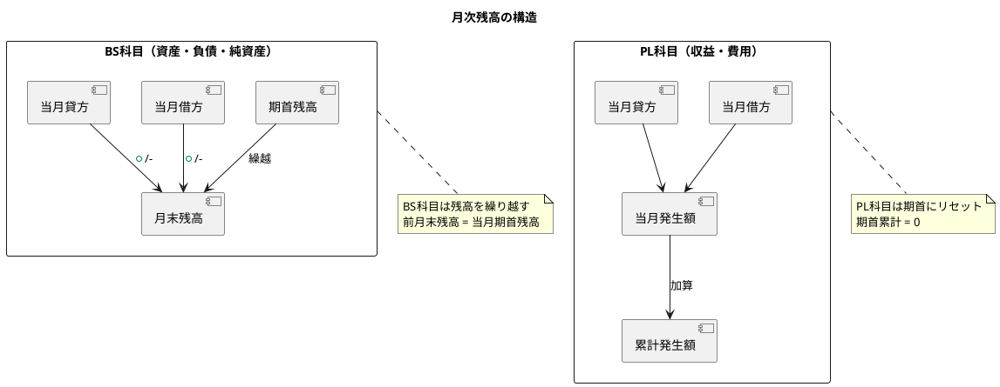

# 第15章: 月次残高照会

本章では、勘定科目の月次残高を照会する機能の実装を解説します。月別残高一覧、12ヶ月推移表、前月比較、累計表示など、月次決算や経営分析に必要な機能を実装します。

## 15.1 月次残高の概念

### 15.1.1 月次残高と累計

月次残高は、各勘定科目の月末時点での残高を表します。損益計算書（PL）科目は月次の発生額、貸借対照表（BS）科目は累計残高として表示します。



### 15.1.2 型定義

**src/types/monthlyBalance.ts**:

```typescript
// 月次残高
export interface MonthlyBalance {
  id: string;
  accountCode: string;
  accountName: string;
  year: number;              // 年度
  month: number;             // 月（1-12）
  openingBalance: number;    // 月初残高
  debitAmount: number;       // 当月借方合計
  creditAmount: number;      // 当月貸方合計
  closingBalance: number;    // 月末残高
  cumulativeDebit: number;   // 累計借方
  cumulativeCredit: number;  // 累計貸方
  bsplType: 'B' | 'P';       // BS/PL区分
  elementType: string;       // 勘定要素
}

// 月次残高検索パラメータ
export interface MonthlyBalanceSearchParams {
  year: number;
  month: number;
  bsplType?: 'B' | 'P';
  elementType?: string;
  accountCode?: string;
  includeZeroBalance?: boolean;
}

// 月次推移データ
export interface MonthlyTrendData {
  accountCode: string;
  accountName: string;
  bsplType: 'B' | 'P';
  elementType: string;
  months: MonthlyAmount[];
  yearTotal: number;
}

// 月別金額
export interface MonthlyAmount {
  month: number;
  amount: number;
  previousYearAmount?: number;  // 前年同月
}

// 前月比較データ
export interface MonthComparison {
  accountCode: string;
  accountName: string;
  currentMonth: number;
  previousMonth: number;
  difference: number;
  changeRate: number;  // 変動率（%）
}

// 12ヶ月推移表示設定
export interface MonthlyTrendSettings {
  showPreviousYear: boolean;     // 前年同月を表示
  showCumulative: boolean;       // 累計を表示
  showChangeRate: boolean;       // 変動率を表示
  highlightThreshold: number;    // ハイライト閾値（%）
}
```

## 15.2 月次残高一覧

### 15.2.1 MonthlyBalanceContainer

**src/components/balance/monthly/MonthlyBalanceContainer.tsx**:

```typescript
import React, { useState, useCallback, useMemo } from 'react';
import { useNavigate } from 'react-router-dom';
import {
  useGetMonthlyBalances,
} from '@/api/generated/balance/balance';
import { MonthlyBalanceSearchParams, MonthlyBalance } from '@/types/monthlyBalance';
import { MonthlyBalanceCollection } from '@/views/balance/monthly/MonthlyBalanceCollection';
import { MonthlyBalanceSearchForm } from '@/views/balance/monthly/MonthlyBalanceSearchForm';
import { MonthComparisonView } from '@/views/balance/monthly/MonthComparisonView';
import { Loading } from '@/views/common/Loading';
import { ErrorMessage } from '@/views/common/ErrorMessage';
import { useAccountingPeriod } from '@/providers/AccountingPeriodProvider';
import dayjs from 'dayjs';
import './MonthlyBalanceContainer.css';

export const MonthlyBalanceContainer: React.FC = () => {
  const navigate = useNavigate();
  const { currentPeriod } = useAccountingPeriod();

  // 現在の年月を取得
  const now = dayjs();
  const currentYear = currentPeriod?.year || now.year();
  const currentMonth = now.month() + 1;

  // 検索条件
  const [searchParams, setSearchParams] = useState<MonthlyBalanceSearchParams>({
    year: currentYear,
    month: currentMonth,
    includeZeroBalance: false,
  });

  // 比較表示モード
  const [showComparison, setShowComparison] = useState(false);

  // 月次残高取得
  const {
    data: balances,
    isLoading,
    error,
  } = useGetMonthlyBalances(searchParams);

  // 前月残高取得（比較用）
  const prevMonth = searchParams.month === 1 ? 12 : searchParams.month - 1;
  const prevYear = searchParams.month === 1 ? searchParams.year - 1 : searchParams.year;

  const {
    data: prevBalances,
    isLoading: isLoadingPrev,
  } = useGetMonthlyBalances(
    { ...searchParams, year: prevYear, month: prevMonth },
    {
      query: {
        enabled: showComparison,
      },
    }
  );

  // 検索条件変更
  const handleSearch = useCallback((params: Partial<MonthlyBalanceSearchParams>) => {
    setSearchParams((prev) => ({ ...prev, ...params }));
  }, []);

  // 年月変更
  const handleYearMonthChange = useCallback(
    (year: number, month: number) => {
      setSearchParams((prev) => ({ ...prev, year, month }));
    },
    []
  );

  // 12ヶ月推移へ遷移
  const handleShowTrend = useCallback(
    (accountCode: string) => {
      navigate(`/balance/monthly/trend/${accountCode}`, {
        state: { year: searchParams.year },
      });
    },
    [navigate, searchParams.year]
  );

  // 科目詳細へ遷移
  const handleAccountClick = useCallback(
    (accountCode: string) => {
      navigate(`/balance/monthly/${accountCode}`, {
        state: {
          year: searchParams.year,
          month: searchParams.month,
        },
      });
    },
    [navigate, searchParams]
  );

  // 比較データの作成
  const comparisonData = useMemo(() => {
    if (!showComparison || !balances || !prevBalances) return [];

    return balances.map((current) => {
      const prev = prevBalances.find(
        (p) => p.accountCode === current.accountCode
      );
      const prevAmount = prev?.closingBalance || 0;
      const difference = current.closingBalance - prevAmount;
      const changeRate =
        prevAmount !== 0
          ? (difference / Math.abs(prevAmount)) * 100
          : current.closingBalance !== 0
          ? 100
          : 0;

      return {
        accountCode: current.accountCode,
        accountName: current.accountName,
        currentMonth: current.closingBalance,
        previousMonth: prevAmount,
        difference,
        changeRate,
      };
    });
  }, [showComparison, balances, prevBalances]);

  if (error) {
    return <ErrorMessage error={error} />;
  }

  return (
    <div className="monthly-balance-container">
      <div className="page-header">
        <h2>月次残高照会</h2>
        <div className="header-info">
          <span className="balance-period">
            {searchParams.year}年{searchParams.month}月
          </span>
        </div>
      </div>

      {/* 検索フォーム */}
      <MonthlyBalanceSearchForm
        params={searchParams}
        onSearch={handleSearch}
        onYearMonthChange={handleYearMonthChange}
      />

      {/* 表示切替 */}
      <div className="view-toggle">
        <button
          className={`toggle-btn ${!showComparison ? 'active' : ''}`}
          onClick={() => setShowComparison(false)}
        >
          残高一覧
        </button>
        <button
          className={`toggle-btn ${showComparison ? 'active' : ''}`}
          onClick={() => setShowComparison(true)}
        >
          前月比較
        </button>
      </div>

      {/* 残高表示 */}
      {isLoading || (showComparison && isLoadingPrev) ? (
        <Loading />
      ) : showComparison ? (
        <MonthComparisonView
          data={comparisonData}
          currentPeriod={`${searchParams.year}/${searchParams.month}`}
          previousPeriod={`${prevYear}/${prevMonth}`}
        />
      ) : (
        <MonthlyBalanceCollection
          balances={balances || []}
          onAccountClick={handleAccountClick}
          onShowTrend={handleShowTrend}
        />
      )}
    </div>
  );
};
```

### 15.2.2 MonthlyBalanceSearchForm

**src/views/balance/monthly/MonthlyBalanceSearchForm.tsx**:

```typescript
import React, { useCallback } from 'react';
import { MonthlyBalanceSearchParams } from '@/types/monthlyBalance';
import { FiChevronLeft, FiChevronRight } from 'react-icons/fi';
import './MonthlyBalanceSearchForm.css';

interface Props {
  params: MonthlyBalanceSearchParams;
  onSearch: (params: Partial<MonthlyBalanceSearchParams>) => void;
  onYearMonthChange: (year: number, month: number) => void;
}

export const MonthlyBalanceSearchForm: React.FC<Props> = ({
  params,
  onSearch,
  onYearMonthChange,
}) => {
  // 前月へ
  const handlePrevMonth = useCallback(() => {
    const newMonth = params.month === 1 ? 12 : params.month - 1;
    const newYear = params.month === 1 ? params.year - 1 : params.year;
    onYearMonthChange(newYear, newMonth);
  }, [params, onYearMonthChange]);

  // 翌月へ
  const handleNextMonth = useCallback(() => {
    const newMonth = params.month === 12 ? 1 : params.month + 1;
    const newYear = params.month === 12 ? params.year + 1 : params.year;
    onYearMonthChange(newYear, newMonth);
  }, [params, onYearMonthChange]);

  // 年度選択
  const handleYearChange = useCallback(
    (e: React.ChangeEvent<HTMLSelectElement>) => {
      onYearMonthChange(Number(e.target.value), params.month);
    },
    [params.month, onYearMonthChange]
  );

  // 月選択
  const handleMonthChange = useCallback(
    (e: React.ChangeEvent<HTMLSelectElement>) => {
      onYearMonthChange(params.year, Number(e.target.value));
    },
    [params.year, onYearMonthChange]
  );

  // BS/PL区分変更
  const handleBsplChange = useCallback(
    (e: React.ChangeEvent<HTMLSelectElement>) => {
      const value = e.target.value as 'B' | 'P' | '';
      onSearch({ bsplType: value || undefined });
    },
    [onSearch]
  );

  // 勘定要素変更
  const handleElementChange = useCallback(
    (e: React.ChangeEvent<HTMLSelectElement>) => {
      onSearch({ elementType: e.target.value || undefined });
    },
    [onSearch]
  );

  // 年度の選択肢を生成（過去5年〜現在）
  const currentYear = new Date().getFullYear();
  const yearOptions = Array.from({ length: 6 }, (_, i) => currentYear - 5 + i);

  return (
    <div className="monthly-balance-search-form">
      {/* 年月ナビゲーション */}
      <div className="month-navigator">
        <button className="nav-btn" onClick={handlePrevMonth}>
          <FiChevronLeft />
        </button>

        <div className="year-month-selector">
          <select value={params.year} onChange={handleYearChange}>
            {yearOptions.map((year) => (
              <option key={year} value={year}>
                {year}年
              </option>
            ))}
          </select>
          <select value={params.month} onChange={handleMonthChange}>
            {Array.from({ length: 12 }, (_, i) => i + 1).map((month) => (
              <option key={month} value={month}>
                {month}月
              </option>
            ))}
          </select>
        </div>

        <button className="nav-btn" onClick={handleNextMonth}>
          <FiChevronRight />
        </button>
      </div>

      {/* フィルター */}
      <div className="filter-row">
        <div className="filter-group">
          <label>BS/PL区分</label>
          <select
            value={params.bsplType || ''}
            onChange={handleBsplChange}
          >
            <option value="">すべて</option>
            <option value="B">貸借対照表（BS）</option>
            <option value="P">損益計算書（PL）</option>
          </select>
        </div>

        <div className="filter-group">
          <label>勘定要素</label>
          <select
            value={params.elementType || ''}
            onChange={handleElementChange}
          >
            <option value="">すべて</option>
            <option value="資産">資産</option>
            <option value="負債">負債</option>
            <option value="純資産">純資産</option>
            <option value="収益">収益</option>
            <option value="費用">費用</option>
          </select>
        </div>

        <label className="checkbox-option">
          <input
            type="checkbox"
            checked={params.includeZeroBalance}
            onChange={(e) => onSearch({ includeZeroBalance: e.target.checked })}
          />
          残高0を表示
        </label>
      </div>
    </div>
  );
};
```

### 15.2.3 MonthlyBalanceCollection

**src/views/balance/monthly/MonthlyBalanceCollection.tsx**:

```typescript
import React, { useMemo } from 'react';
import { MonthlyBalance } from '@/types/monthlyBalance';
import { FiTrendingUp, FiChevronRight } from 'react-icons/fi';
import './MonthlyBalanceCollection.css';

interface Props {
  balances: MonthlyBalance[];
  onAccountClick: (accountCode: string) => void;
  onShowTrend: (accountCode: string) => void;
}

const ELEMENT_ORDER = ['資産', '負債', '純資産', '収益', '費用'];

export const MonthlyBalanceCollection: React.FC<Props> = ({
  balances,
  onAccountClick,
  onShowTrend,
}) => {
  const formatMoney = (amount: number) => amount.toLocaleString();

  // 要素別にグループ化
  const groupedBalances = useMemo(() => {
    const groups: Record<string, MonthlyBalance[]> = {};

    ELEMENT_ORDER.forEach((element) => {
      groups[element] = balances.filter((b) => b.elementType === element);
    });

    return groups;
  }, [balances]);

  // 要素別合計
  const elementTotals = useMemo(() => {
    const totals: Record<string, number> = {};

    Object.entries(groupedBalances).forEach(([element, items]) => {
      totals[element] = items.reduce((sum, b) => sum + b.closingBalance, 0);
    });

    return totals;
  }, [groupedBalances]);

  if (balances.length === 0) {
    return (
      <div className="empty-balance">
        <p>該当する残高データがありません</p>
      </div>
    );
  }

  return (
    <div className="monthly-balance-collection">
      {ELEMENT_ORDER.map((element) => {
        const items = groupedBalances[element];
        if (items.length === 0) return null;

        return (
          <div key={element} className="element-section">
            <div className="element-header">
              <h3>{element}</h3>
              <span className="element-total">
                合計: {formatMoney(elementTotals[element])}
              </span>
            </div>

            <table className="balance-table">
              <thead>
                <tr>
                  <th className="col-code">科目コード</th>
                  <th className="col-name">勘定科目</th>
                  <th className="col-amount">月初残高</th>
                  <th className="col-amount">借方</th>
                  <th className="col-amount">貸方</th>
                  <th className="col-amount">月末残高</th>
                  <th className="col-actions"></th>
                </tr>
              </thead>
              <tbody>
                {items.map((balance) => (
                  <tr
                    key={balance.id}
                    className="balance-row"
                    onClick={() => onAccountClick(balance.accountCode)}
                  >
                    <td className="account-code">{balance.accountCode}</td>
                    <td className="account-name">{balance.accountName}</td>
                    <td className="amount">
                      {formatMoney(balance.openingBalance)}
                    </td>
                    <td className="amount debit">
                      {formatMoney(balance.debitAmount)}
                    </td>
                    <td className="amount credit">
                      {formatMoney(balance.creditAmount)}
                    </td>
                    <td className="amount closing">
                      {formatMoney(balance.closingBalance)}
                    </td>
                    <td className="actions">
                      <button
                        className="btn-icon"
                        onClick={(e) => {
                          e.stopPropagation();
                          onShowTrend(balance.accountCode);
                        }}
                        title="12ヶ月推移"
                      >
                        <FiTrendingUp />
                      </button>
                      <FiChevronRight className="detail-arrow" />
                    </td>
                  </tr>
                ))}
              </tbody>
            </table>
          </div>
        );
      })}

      {/* BS/PL合計 */}
      <div className="grand-total">
        <div className="total-section bs-total">
          <h4>貸借対照表合計</h4>
          <div className="total-values">
            <span className="label">資産:</span>
            <span className="value">{formatMoney(elementTotals['資産'] || 0)}</span>
            <span className="label">負債・純資産:</span>
            <span className="value">
              {formatMoney((elementTotals['負債'] || 0) + (elementTotals['純資産'] || 0))}
            </span>
          </div>
        </div>
        <div className="total-section pl-total">
          <h4>損益計算書合計</h4>
          <div className="total-values">
            <span className="label">収益:</span>
            <span className="value">{formatMoney(elementTotals['収益'] || 0)}</span>
            <span className="label">費用:</span>
            <span className="value">{formatMoney(elementTotals['費用'] || 0)}</span>
            <span className="label">当期利益:</span>
            <span className="value profit">
              {formatMoney((elementTotals['収益'] || 0) - (elementTotals['費用'] || 0))}
            </span>
          </div>
        </div>
      </div>
    </div>
  );
};
```

## 15.3 月次推移表

### 15.3.1 MonthlyTrendContainer

**src/components/balance/monthly/MonthlyTrendContainer.tsx**:

```typescript
import React, { useState, useCallback } from 'react';
import { useParams, useLocation, useNavigate } from 'react-router-dom';
import {
  useGetMonthlyTrend,
  useGetAccount,
} from '@/api/generated/balance/balance';
import { MonthlyTrendSettings } from '@/types/monthlyBalance';
import { MonthlyTrendTable } from '@/views/balance/monthly/MonthlyTrendTable';
import { MonthlyTrendChart } from '@/views/balance/monthly/MonthlyTrendChart';
import { MonthlyTrendSettingsPanel } from '@/views/balance/monthly/MonthlyTrendSettingsPanel';
import { Loading } from '@/views/common/Loading';
import { ErrorMessage } from '@/views/common/ErrorMessage';
import { FiArrowLeft, FiGrid, FiBarChart2 } from 'react-icons/fi';
import './MonthlyTrendContainer.css';

type ViewMode = 'table' | 'chart';

export const MonthlyTrendContainer: React.FC = () => {
  const { accountCode } = useParams<{ accountCode: string }>();
  const location = useLocation();
  const navigate = useNavigate();

  const initialState = location.state as { year?: number } | null;
  const [year, setYear] = useState(
    initialState?.year || new Date().getFullYear()
  );
  const [viewMode, setViewMode] = useState<ViewMode>('table');

  // 表示設定
  const [settings, setSettings] = useState<MonthlyTrendSettings>({
    showPreviousYear: false,
    showCumulative: true,
    showChangeRate: false,
    highlightThreshold: 20,
  });

  // 勘定科目情報取得
  const { data: account, isLoading: isLoadingAccount } = useGetAccount(
    accountCode!
  );

  // 月次推移データ取得
  const {
    data: trendData,
    isLoading: isLoadingTrend,
    error,
  } = useGetMonthlyTrend(accountCode!, year, {
    query: {
      enabled: Boolean(accountCode),
    },
  });

  // 前年データ取得
  const { data: prevYearData } = useGetMonthlyTrend(
    accountCode!,
    year - 1,
    {
      query: {
        enabled: Boolean(accountCode) && settings.showPreviousYear,
      },
    }
  );

  // 設定変更
  const handleSettingsChange = useCallback(
    (newSettings: Partial<MonthlyTrendSettings>) => {
      setSettings((prev) => ({ ...prev, ...newSettings }));
    },
    []
  );

  // 年度変更
  const handleYearChange = useCallback((newYear: number) => {
    setYear(newYear);
  }, []);

  // 戻る
  const handleBack = useCallback(() => {
    navigate(-1);
  }, [navigate]);

  const isLoading = isLoadingAccount || isLoadingTrend;

  if (error) {
    return <ErrorMessage error={error} />;
  }

  return (
    <div className="monthly-trend-container">
      <div className="page-header">
        <button className="btn-back" onClick={handleBack}>
          <FiArrowLeft />
          戻る
        </button>
        <div className="header-info">
          <h2>12ヶ月推移</h2>
          {account && (
            <span className="account-info">
              {account.accountCode} {account.accountName}
            </span>
          )}
        </div>
      </div>

      {/* 年度選択・表示切替 */}
      <div className="trend-controls">
        <div className="year-selector">
          <label>年度</label>
          <select
            value={year}
            onChange={(e) => handleYearChange(Number(e.target.value))}
          >
            {Array.from({ length: 6 }, (_, i) => new Date().getFullYear() - i).map(
              (y) => (
                <option key={y} value={y}>
                  {y}年度
                </option>
              )
            )}
          </select>
        </div>

        <div className="view-toggle">
          <button
            className={`toggle-btn ${viewMode === 'table' ? 'active' : ''}`}
            onClick={() => setViewMode('table')}
          >
            <FiGrid />
            表
          </button>
          <button
            className={`toggle-btn ${viewMode === 'chart' ? 'active' : ''}`}
            onClick={() => setViewMode('chart')}
          >
            <FiBarChart2 />
            グラフ
          </button>
        </div>
      </div>

      {/* 表示設定 */}
      <MonthlyTrendSettingsPanel
        settings={settings}
        onChange={handleSettingsChange}
      />

      {/* 推移表示 */}
      {isLoading ? (
        <Loading />
      ) : (
        <>
          {viewMode === 'table' ? (
            <MonthlyTrendTable
              data={trendData}
              prevYearData={settings.showPreviousYear ? prevYearData : undefined}
              settings={settings}
              year={year}
            />
          ) : (
            <MonthlyTrendChart
              data={trendData}
              prevYearData={settings.showPreviousYear ? prevYearData : undefined}
              accountName={account?.accountName || ''}
              year={year}
            />
          )}
        </>
      )}
    </div>
  );
};
```

### 15.3.2 MonthlyTrendTable

**src/views/balance/monthly/MonthlyTrendTable.tsx**:

```typescript
import React, { useMemo } from 'react';
import { MonthlyTrendData, MonthlyTrendSettings } from '@/types/monthlyBalance';
import './MonthlyTrendTable.css';

interface Props {
  data?: MonthlyTrendData;
  prevYearData?: MonthlyTrendData;
  settings: MonthlyTrendSettings;
  year: number;
}

export const MonthlyTrendTable: React.FC<Props> = ({
  data,
  prevYearData,
  settings,
  year,
}) => {
  const formatMoney = (amount: number) => amount.toLocaleString();

  // 累計の計算
  const cumulativeData = useMemo(() => {
    if (!data?.months) return [];

    let cumulative = 0;
    return data.months.map((m) => {
      cumulative += m.amount;
      return cumulative;
    });
  }, [data]);

  // 前年同月データのマッピング
  const prevYearMap = useMemo(() => {
    if (!prevYearData?.months) return {};

    const map: Record<number, number> = {};
    prevYearData.months.forEach((m) => {
      map[m.month] = m.amount;
    });
    return map;
  }, [prevYearData]);

  if (!data?.months || data.months.length === 0) {
    return (
      <div className="empty-trend">
        <p>表示するデータがありません</p>
      </div>
    );
  }

  return (
    <div className="monthly-trend-table">
      <table>
        <thead>
          <tr>
            <th className="row-header">項目</th>
            {data.months.map((m) => (
              <th key={m.month} className="month-header">
                {m.month}月
              </th>
            ))}
            <th className="total-header">合計</th>
          </tr>
        </thead>
        <tbody>
          {/* 当期 */}
          <tr className="current-row">
            <td className="row-label">{year}年度</td>
            {data.months.map((m, index) => {
              const prevAmount = prevYearMap[m.month];
              const isHighlighted =
                settings.showChangeRate &&
                prevAmount &&
                Math.abs((m.amount - prevAmount) / prevAmount) * 100 >
                  settings.highlightThreshold;

              return (
                <td
                  key={m.month}
                  className={`amount ${isHighlighted ? 'highlighted' : ''}`}
                >
                  {formatMoney(m.amount)}
                </td>
              );
            })}
            <td className="amount total">{formatMoney(data.yearTotal)}</td>
          </tr>

          {/* 累計 */}
          {settings.showCumulative && (
            <tr className="cumulative-row">
              <td className="row-label">累計</td>
              {cumulativeData.map((cumulative, index) => (
                <td key={index} className="amount cumulative">
                  {formatMoney(cumulative)}
                </td>
              ))}
              <td className="amount"></td>
            </tr>
          )}

          {/* 前年同月 */}
          {settings.showPreviousYear && prevYearData && (
            <tr className="prev-year-row">
              <td className="row-label">{year - 1}年度</td>
              {data.months.map((m) => (
                <td key={m.month} className="amount prev-year">
                  {prevYearMap[m.month] !== undefined
                    ? formatMoney(prevYearMap[m.month])
                    : '-'}
                </td>
              ))}
              <td className="amount prev-year">
                {formatMoney(prevYearData.yearTotal)}
              </td>
            </tr>
          )}

          {/* 前年比 */}
          {settings.showPreviousYear && settings.showChangeRate && prevYearData && (
            <tr className="change-rate-row">
              <td className="row-label">前年比</td>
              {data.months.map((m) => {
                const prev = prevYearMap[m.month];
                if (!prev) return <td key={m.month} className="rate">-</td>;

                const rate = ((m.amount - prev) / Math.abs(prev)) * 100;
                const isPositive = rate >= 0;

                return (
                  <td
                    key={m.month}
                    className={`rate ${isPositive ? 'positive' : 'negative'}`}
                  >
                    {isPositive ? '+' : ''}
                    {rate.toFixed(1)}%
                  </td>
                );
              })}
              <td className="rate">
                {prevYearData.yearTotal !== 0
                  ? `${(
                      ((data.yearTotal - prevYearData.yearTotal) /
                        Math.abs(prevYearData.yearTotal)) *
                      100
                    ).toFixed(1)}%`
                  : '-'}
              </td>
            </tr>
          )}
        </tbody>
      </table>
    </div>
  );
};
```

### 15.3.3 MonthlyTrendChart

**src/views/balance/monthly/MonthlyTrendChart.tsx**:

```typescript
import React, { useRef, useEffect } from 'react';
import { MonthlyTrendData } from '@/types/monthlyBalance';
import './MonthlyTrendChart.css';

interface Props {
  data?: MonthlyTrendData;
  prevYearData?: MonthlyTrendData;
  accountName: string;
  year: number;
}

export const MonthlyTrendChart: React.FC<Props> = ({
  data,
  prevYearData,
  accountName,
  year,
}) => {
  const canvasRef = useRef<HTMLCanvasElement>(null);

  useEffect(() => {
    const canvas = canvasRef.current;
    if (!canvas || !data?.months) return;

    const ctx = canvas.getContext('2d');
    if (!ctx) return;

    const width = canvas.width;
    const height = canvas.height;
    const padding = { top: 50, right: 40, bottom: 60, left: 80 };
    const chartWidth = width - padding.left - padding.right;
    const chartHeight = height - padding.top - padding.bottom;

    // クリア
    ctx.clearRect(0, 0, width, height);

    // データの準備
    const currentAmounts = data.months.map((m) => m.amount);
    const prevAmounts = prevYearData?.months.map((m) => m.amount) || [];

    const allAmounts = [...currentAmounts, ...prevAmounts];
    const maxAmount = Math.max(...allAmounts, 0);
    const minAmount = Math.min(...allAmounts, 0);
    const range = maxAmount - minAmount || 1;

    // バーの幅
    const barWidth = chartWidth / 12 * 0.35;
    const groupWidth = chartWidth / 12;

    // スケール
    const scaleY = (value: number) =>
      padding.top + chartHeight - ((value - minAmount) / range) * chartHeight;

    // 背景グリッド
    ctx.strokeStyle = '#e0e0e0';
    ctx.lineWidth = 1;

    for (let i = 0; i <= 5; i++) {
      const y = padding.top + (i / 5) * chartHeight;
      ctx.beginPath();
      ctx.moveTo(padding.left, y);
      ctx.lineTo(width - padding.right, y);
      ctx.stroke();

      // Y軸ラベル
      const value = maxAmount - (i / 5) * range;
      ctx.fillStyle = '#666';
      ctx.font = '11px sans-serif';
      ctx.textAlign = 'right';
      ctx.fillText((value / 1000).toFixed(0) + 'k', padding.left - 8, y + 4);
    }

    // ゼロライン
    if (minAmount < 0 && maxAmount > 0) {
      const zeroY = scaleY(0);
      ctx.strokeStyle = '#333';
      ctx.lineWidth = 1;
      ctx.beginPath();
      ctx.moveTo(padding.left, zeroY);
      ctx.lineTo(width - padding.right, zeroY);
      ctx.stroke();
    }

    // バーの描画
    data.months.forEach((m, index) => {
      const x = padding.left + index * groupWidth + groupWidth / 2;

      // 当期バー
      const currentHeight = Math.abs(m.amount) / range * chartHeight;
      const currentY = m.amount >= 0 ? scaleY(m.amount) : scaleY(0);

      ctx.fillStyle = '#0066cc';
      ctx.fillRect(
        x - barWidth - 2,
        currentY,
        barWidth,
        m.amount >= 0 ? currentHeight : -currentHeight
      );

      // 前年バー
      if (prevYearData?.months[index]) {
        const prevAmount = prevYearData.months[index].amount;
        const prevHeight = Math.abs(prevAmount) / range * chartHeight;
        const prevY = prevAmount >= 0 ? scaleY(prevAmount) : scaleY(0);

        ctx.fillStyle = '#cccccc';
        ctx.fillRect(
          x + 2,
          prevY,
          barWidth,
          prevAmount >= 0 ? prevHeight : -prevHeight
        );
      }
    });

    // X軸ラベル
    ctx.fillStyle = '#666';
    ctx.font = '12px sans-serif';
    ctx.textAlign = 'center';

    for (let i = 0; i < 12; i++) {
      const x = padding.left + i * groupWidth + groupWidth / 2;
      ctx.fillText(`${i + 1}月`, x, height - padding.bottom + 20);
    }

    // タイトル
    ctx.fillStyle = '#333';
    ctx.font = 'bold 14px sans-serif';
    ctx.textAlign = 'center';
    ctx.fillText(`${accountName} ${year}年度 月次推移`, width / 2, 25);

    // 凡例
    ctx.font = '12px sans-serif';
    ctx.fillStyle = '#0066cc';
    ctx.fillRect(width - 150, 15, 16, 12);
    ctx.fillStyle = '#333';
    ctx.textAlign = 'left';
    ctx.fillText(`${year}年度`, width - 130, 25);

    if (prevYearData) {
      ctx.fillStyle = '#cccccc';
      ctx.fillRect(width - 150, 35, 16, 12);
      ctx.fillStyle = '#333';
      ctx.fillText(`${year - 1}年度`, width - 130, 45);
    }

  }, [data, prevYearData, accountName, year]);

  if (!data?.months || data.months.length === 0) {
    return (
      <div className="empty-chart">
        <p>表示するデータがありません</p>
      </div>
    );
  }

  return (
    <div className="monthly-trend-chart">
      <canvas ref={canvasRef} width={900} height={400} />
    </div>
  );
};
```

## 15.4 前月比較

### 15.4.1 MonthComparisonView

**src/views/balance/monthly/MonthComparisonView.tsx**:

```typescript
import React, { useMemo } from 'react';
import { MonthComparison } from '@/types/monthlyBalance';
import { FiTrendingUp, FiTrendingDown, FiMinus } from 'react-icons/fi';
import './MonthComparisonView.css';

interface Props {
  data: MonthComparison[];
  currentPeriod: string;
  previousPeriod: string;
}

export const MonthComparisonView: React.FC<Props> = ({
  data,
  currentPeriod,
  previousPeriod,
}) => {
  const formatMoney = (amount: number) => amount.toLocaleString();

  // 変動の大きい順にソート
  const sortedData = useMemo(() => {
    return [...data].sort(
      (a, b) => Math.abs(b.changeRate) - Math.abs(a.changeRate)
    );
  }, [data]);

  // 変動アイコンの取得
  const getTrendIcon = (rate: number) => {
    if (rate > 5) return <FiTrendingUp className="trend-up" />;
    if (rate < -5) return <FiTrendingDown className="trend-down" />;
    return <FiMinus className="trend-flat" />;
  };

  // 変動率の表示クラス
  const getRateClass = (rate: number) => {
    if (rate > 20) return 'rate high-increase';
    if (rate > 5) return 'rate increase';
    if (rate < -20) return 'rate high-decrease';
    if (rate < -5) return 'rate decrease';
    return 'rate';
  };

  if (data.length === 0) {
    return (
      <div className="empty-comparison">
        <p>比較するデータがありません</p>
      </div>
    );
  }

  return (
    <div className="month-comparison-view">
      <div className="comparison-header">
        <span className="period-label">{previousPeriod}</span>
        <span className="arrow">→</span>
        <span className="period-label current">{currentPeriod}</span>
      </div>

      <table className="comparison-table">
        <thead>
          <tr>
            <th className="col-code">科目コード</th>
            <th className="col-name">勘定科目</th>
            <th className="col-amount">前月</th>
            <th className="col-amount">当月</th>
            <th className="col-diff">増減</th>
            <th className="col-rate">変動率</th>
            <th className="col-trend"></th>
          </tr>
        </thead>
        <tbody>
          {sortedData.map((item) => (
            <tr key={item.accountCode}>
              <td className="account-code">{item.accountCode}</td>
              <td className="account-name">{item.accountName}</td>
              <td className="amount">{formatMoney(item.previousMonth)}</td>
              <td className="amount">{formatMoney(item.currentMonth)}</td>
              <td
                className={`amount diff ${
                  item.difference >= 0 ? 'positive' : 'negative'
                }`}
              >
                {item.difference >= 0 ? '+' : ''}
                {formatMoney(item.difference)}
              </td>
              <td className={getRateClass(item.changeRate)}>
                {item.changeRate >= 0 ? '+' : ''}
                {item.changeRate.toFixed(1)}%
              </td>
              <td className="trend">{getTrendIcon(item.changeRate)}</td>
            </tr>
          ))}
        </tbody>
      </table>

      {/* サマリー */}
      <div className="comparison-summary">
        <div className="summary-item">
          <span className="label">増加科目:</span>
          <span className="value increase">
            {data.filter((d) => d.difference > 0).length}科目
          </span>
        </div>
        <div className="summary-item">
          <span className="label">減少科目:</span>
          <span className="value decrease">
            {data.filter((d) => d.difference < 0).length}科目
          </span>
        </div>
        <div className="summary-item">
          <span className="label">変動なし:</span>
          <span className="value">
            {data.filter((d) => d.difference === 0).length}科目
          </span>
        </div>
      </div>
    </div>
  );
};
```

## 15.5 スタイル定義

### 15.5.1 月次残高一覧のスタイル

**src/views/balance/monthly/MonthlyBalanceCollection.css**:

```css
.monthly-balance-collection {
  margin-top: 1rem;
}

.element-section {
  margin-bottom: 2rem;
}

.element-header {
  display: flex;
  justify-content: space-between;
  align-items: center;
  padding: 0.75rem 1rem;
  background: linear-gradient(to right, #f5f5f5, #fff);
  border-left: 4px solid #0066cc;
  margin-bottom: 0.5rem;
}

.element-header h3 {
  margin: 0;
  font-size: 1rem;
  color: #333;
}

.element-total {
  font-weight: 600;
  font-family: 'Consolas', monospace;
}

.balance-table {
  width: 100%;
  border-collapse: collapse;
  font-size: 0.875rem;
}

.balance-table th,
.balance-table td {
  padding: 0.625rem 0.5rem;
  border-bottom: 1px solid #e0e0e0;
  text-align: left;
}

.balance-table th {
  background: #fafafa;
  font-weight: 500;
  font-size: 0.8125rem;
  color: #666;
}

.col-code { width: 100px; }
.col-name { width: 180px; }
.col-amount { width: 110px; text-align: right; }
.col-actions { width: 70px; }

.balance-row {
  cursor: pointer;
  transition: background-color 0.15s;
}

.balance-row:hover {
  background-color: #f8f9fa;
}

.account-code {
  font-family: 'Consolas', monospace;
  color: #0066cc;
}

.amount {
  text-align: right;
  font-family: 'Consolas', monospace;
}

.amount.debit { color: #0066cc; }
.amount.credit { color: #cc0066; }
.amount.closing { font-weight: 600; }

/* 合計セクション */
.grand-total {
  display: flex;
  gap: 2rem;
  margin-top: 2rem;
  padding: 1.5rem;
  background: #f8f9fa;
  border-radius: 8px;
}

.total-section {
  flex: 1;
  padding: 1rem;
  background: #fff;
  border-radius: 4px;
  box-shadow: 0 1px 3px rgba(0, 0, 0, 0.1);
}

.total-section h4 {
  margin: 0 0 1rem 0;
  padding-bottom: 0.5rem;
  border-bottom: 2px solid #e0e0e0;
  font-size: 0.9375rem;
}

.bs-total h4 { border-color: #0066cc; }
.pl-total h4 { border-color: #00cc66; }

.total-values {
  display: grid;
  grid-template-columns: auto 1fr;
  gap: 0.5rem 1rem;
  font-size: 0.875rem;
}

.total-values .label {
  color: #666;
}

.total-values .value {
  text-align: right;
  font-weight: 600;
  font-family: 'Consolas', monospace;
}

.total-values .value.profit {
  color: #00cc66;
  font-size: 1rem;
}
```

### 15.5.2 推移表のスタイル

**src/views/balance/monthly/MonthlyTrendTable.css**:

```css
.monthly-trend-table {
  overflow-x: auto;
  margin-top: 1rem;
}

.monthly-trend-table table {
  width: 100%;
  min-width: 900px;
  border-collapse: collapse;
  font-size: 0.875rem;
}

.monthly-trend-table th,
.monthly-trend-table td {
  padding: 0.75rem 0.5rem;
  border: 1px solid #e0e0e0;
  text-align: right;
}

.monthly-trend-table th {
  background: #f5f5f5;
  font-weight: 500;
}

.row-header {
  width: 100px;
  text-align: left;
}

.month-header {
  width: 70px;
}

.total-header {
  width: 90px;
  background: #eef;
}

.row-label {
  text-align: left;
  font-weight: 500;
  background: #fafafa;
}

.current-row .amount {
  font-family: 'Consolas', monospace;
}

.current-row .amount.total {
  background: #eef;
  font-weight: 600;
}

.current-row .amount.highlighted {
  background: #fff3cd;
}

.cumulative-row {
  background: #f8f9fa;
}

.cumulative-row .amount {
  color: #666;
  font-size: 0.8125rem;
}

.prev-year-row .amount {
  color: #999;
}

.change-rate-row .rate {
  font-size: 0.8125rem;
}

.change-rate-row .rate.positive {
  color: #28a745;
}

.change-rate-row .rate.negative {
  color: #dc3545;
}

.empty-trend {
  text-align: center;
  padding: 3rem;
  color: #666;
}
```

## 15.6 まとめ

本章では、月次残高照会機能の実装について解説しました。

### 主要コンポーネント

1. **MonthlyBalanceContainer**: 月次残高一覧画面のコンテナ
2. **MonthlyBalanceCollection**: 勘定要素別にグループ化された残高一覧
3. **MonthlyTrendContainer / MonthlyTrendTable / MonthlyTrendChart**: 12ヶ月推移表
4. **MonthComparisonView**: 前月比較ビュー

### 機能のポイント

- **勘定要素別グループ化**: 資産・負債・純資産・収益・費用ごとの表示
- **12ヶ月推移表**: 当期実績、累計、前年同月、前年比の表示
- **前月比較**: 増減額・変動率の可視化
- **BS/PL合計**: 貸借一致の確認、当期利益の表示
- **棒グラフ表示**: Canvas API を使用した月次推移の可視化
