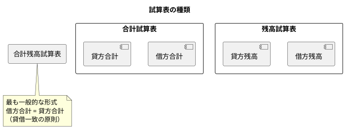

# 第16章: 試算表

本章では、試算表（Trial Balance）の実装を解説します。合計残高試算表、勘定科目別試算表、部門別試算表など、会計処理の正確性を確認するための帳票機能を実装します。

## 16.1 試算表の概念

### 16.1.1 試算表とは

試算表は、一定期間の全ての勘定科目について、借方合計・貸方合計・残高を一覧表示した帳票です。複式簿記では借方合計と貸方合計が必ず一致するため、試算表は仕訳の正確性を検証する重要なツールです。



### 16.1.2 型定義

**src/types/trialBalance.ts**:

```typescript
// 試算表の種類
export type TrialBalanceType = 'total' | 'balance' | 'both';

// 試算表データ
export interface TrialBalance {
  accountCode: string;
  accountName: string;
  elementType: string;
  bsplType: 'B' | 'P';
  debitTotal: number;       // 借方合計
  creditTotal: number;      // 貸方合計
  debitBalance: number;     // 借方残高
  creditBalance: number;    // 貸方残高
}

// 試算表検索パラメータ
export interface TrialBalanceSearchParams {
  year: number;
  month: number;
  type: TrialBalanceType;
  bsplType?: 'B' | 'P';
  elementType?: string;
  departmentCode?: string;
  includeZeroBalance?: boolean;
}

// 試算表サマリー
export interface TrialBalanceSummary {
  totalDebit: number;
  totalCredit: number;
  balanceDebit: number;
  balanceCredit: number;
  isBalanced: boolean;
  difference: number;
}

// 勘定科目別試算表
export interface AccountTrialBalance {
  accountCode: string;
  accountName: string;
  months: MonthlyTrialData[];
  yearTotal: TrialBalance;
  previousYear?: TrialBalance;
}

// 月別試算表データ
export interface MonthlyTrialData {
  month: number;
  debitTotal: number;
  creditTotal: number;
  debitBalance: number;
  creditBalance: number;
}

// 部門別試算表
export interface DepartmentTrialBalance {
  departmentCode: string;
  departmentName: string;
  accounts: TrialBalance[];
  summary: TrialBalanceSummary;
}
```

## 16.2 合計残高試算表

### 16.2.1 TrialBalanceContainer

**src/components/balance/trial/TrialBalanceContainer.tsx**:

```typescript
import React, { useState, useCallback, useMemo } from 'react';
import {
  useGetTrialBalance,
} from '@/api/generated/balance/balance';
import { TrialBalanceSearchParams, TrialBalanceType, TrialBalanceSummary } from '@/types/trialBalance';
import { TrialBalanceView } from '@/views/balance/trial/TrialBalanceView';
import { TrialBalanceSearchForm } from '@/views/balance/trial/TrialBalanceSearchForm';
import { TrialBalanceSummaryPanel } from '@/views/balance/trial/TrialBalanceSummaryPanel';
import { Loading } from '@/views/common/Loading';
import { ErrorMessage } from '@/views/common/ErrorMessage';
import { useAccountingPeriod } from '@/providers/AccountingPeriodProvider';
import dayjs from 'dayjs';
import './TrialBalanceContainer.css';

export const TrialBalanceContainer: React.FC = () => {
  const { currentPeriod } = useAccountingPeriod();
  const now = dayjs();

  // 検索条件
  const [searchParams, setSearchParams] = useState<TrialBalanceSearchParams>({
    year: currentPeriod?.year || now.year(),
    month: now.month() + 1,
    type: 'both',
    includeZeroBalance: false,
  });

  // 試算表データ取得
  const {
    data: trialBalanceData,
    isLoading,
    error,
  } = useGetTrialBalance(searchParams);

  // サマリーの計算
  const summary: TrialBalanceSummary = useMemo(() => {
    if (!trialBalanceData) {
      return {
        totalDebit: 0,
        totalCredit: 0,
        balanceDebit: 0,
        balanceCredit: 0,
        isBalanced: true,
        difference: 0,
      };
    }

    const totalDebit = trialBalanceData.reduce((sum, t) => sum + t.debitTotal, 0);
    const totalCredit = trialBalanceData.reduce((sum, t) => sum + t.creditTotal, 0);
    const balanceDebit = trialBalanceData.reduce((sum, t) => sum + t.debitBalance, 0);
    const balanceCredit = trialBalanceData.reduce((sum, t) => sum + t.creditBalance, 0);

    const difference = Math.abs(totalDebit - totalCredit);
    const isBalanced = difference < 0.01; // 浮動小数点誤差を考慮

    return {
      totalDebit,
      totalCredit,
      balanceDebit,
      balanceCredit,
      isBalanced,
      difference,
    };
  }, [trialBalanceData]);

  // 検索条件変更
  const handleSearch = useCallback((params: Partial<TrialBalanceSearchParams>) => {
    setSearchParams((prev) => ({ ...prev, ...params }));
  }, []);

  // 試算表種類変更
  const handleTypeChange = useCallback((type: TrialBalanceType) => {
    setSearchParams((prev) => ({ ...prev, type }));
  }, []);

  // 印刷
  const handlePrint = useCallback(() => {
    window.print();
  }, []);

  // Excel出力
  const handleExport = useCallback(() => {
    // エクスポート処理は別途実装
    console.log('Export trial balance');
  }, []);

  if (error) {
    return <ErrorMessage error={error} />;
  }

  return (
    <div className="trial-balance-container">
      <div className="page-header">
        <h2>合計残高試算表</h2>
        <div className="header-actions">
          <button className="btn-secondary" onClick={handlePrint}>
            印刷
          </button>
          <button className="btn-secondary" onClick={handleExport}>
            Excel出力
          </button>
        </div>
      </div>

      {/* 検索フォーム */}
      <TrialBalanceSearchForm
        params={searchParams}
        onSearch={handleSearch}
        onTypeChange={handleTypeChange}
      />

      {/* サマリーパネル */}
      <TrialBalanceSummaryPanel
        summary={summary}
        type={searchParams.type}
        year={searchParams.year}
        month={searchParams.month}
      />

      {/* 試算表 */}
      {isLoading ? (
        <Loading />
      ) : (
        <TrialBalanceView
          data={trialBalanceData || []}
          type={searchParams.type}
          summary={summary}
        />
      )}
    </div>
  );
};
```

### 16.2.2 TrialBalanceSearchForm

**src/views/balance/trial/TrialBalanceSearchForm.tsx**:

```typescript
import React, { useCallback } from 'react';
import { TrialBalanceSearchParams, TrialBalanceType } from '@/types/trialBalance';
import { FiChevronLeft, FiChevronRight } from 'react-icons/fi';
import './TrialBalanceSearchForm.css';

interface Props {
  params: TrialBalanceSearchParams;
  onSearch: (params: Partial<TrialBalanceSearchParams>) => void;
  onTypeChange: (type: TrialBalanceType) => void;
}

export const TrialBalanceSearchForm: React.FC<Props> = ({
  params,
  onSearch,
  onTypeChange,
}) => {
  // 前月へ
  const handlePrevMonth = useCallback(() => {
    const newMonth = params.month === 1 ? 12 : params.month - 1;
    const newYear = params.month === 1 ? params.year - 1 : params.year;
    onSearch({ year: newYear, month: newMonth });
  }, [params, onSearch]);

  // 翌月へ
  const handleNextMonth = useCallback(() => {
    const newMonth = params.month === 12 ? 1 : params.month + 1;
    const newYear = params.month === 12 ? params.year + 1 : params.year;
    onSearch({ year: newYear, month: newMonth });
  }, [params, onSearch]);

  // 年度選択
  const handleYearChange = useCallback(
    (e: React.ChangeEvent<HTMLSelectElement>) => {
      onSearch({ year: Number(e.target.value) });
    },
    [onSearch]
  );

  // 月選択
  const handleMonthChange = useCallback(
    (e: React.ChangeEvent<HTMLSelectElement>) => {
      onSearch({ month: Number(e.target.value) });
    },
    [onSearch]
  );

  const currentYear = new Date().getFullYear();
  const yearOptions = Array.from({ length: 6 }, (_, i) => currentYear - 5 + i);

  return (
    <div className="trial-balance-search-form">
      {/* 期間選択 */}
      <div className="period-section">
        <div className="month-navigator">
          <button className="nav-btn" onClick={handlePrevMonth}>
            <FiChevronLeft />
          </button>

          <div className="year-month-selector">
            <select value={params.year} onChange={handleYearChange}>
              {yearOptions.map((year) => (
                <option key={year} value={year}>
                  {year}年
                </option>
              ))}
            </select>
            <select value={params.month} onChange={handleMonthChange}>
              {Array.from({ length: 12 }, (_, i) => i + 1).map((month) => (
                <option key={month} value={month}>
                  {month}月
                </option>
              ))}
            </select>
          </div>

          <button className="nav-btn" onClick={handleNextMonth}>
            <FiChevronRight />
          </button>
        </div>
      </div>

      {/* 試算表種類 */}
      <div className="type-section">
        <label>表示形式</label>
        <div className="type-buttons">
          <button
            className={`type-btn ${params.type === 'total' ? 'active' : ''}`}
            onClick={() => onTypeChange('total')}
          >
            合計試算表
          </button>
          <button
            className={`type-btn ${params.type === 'balance' ? 'active' : ''}`}
            onClick={() => onTypeChange('balance')}
          >
            残高試算表
          </button>
          <button
            className={`type-btn ${params.type === 'both' ? 'active' : ''}`}
            onClick={() => onTypeChange('both')}
          >
            合計残高試算表
          </button>
        </div>
      </div>

      {/* フィルター */}
      <div className="filter-section">
        <div className="filter-group">
          <label>BS/PL区分</label>
          <select
            value={params.bsplType || ''}
            onChange={(e) =>
              onSearch({ bsplType: (e.target.value as 'B' | 'P') || undefined })
            }
          >
            <option value="">すべて</option>
            <option value="B">BS（貸借対照表）</option>
            <option value="P">PL（損益計算書）</option>
          </select>
        </div>

        <div className="filter-group">
          <label>勘定要素</label>
          <select
            value={params.elementType || ''}
            onChange={(e) =>
              onSearch({ elementType: e.target.value || undefined })
            }
          >
            <option value="">すべて</option>
            <option value="資産">資産</option>
            <option value="負債">負債</option>
            <option value="純資産">純資産</option>
            <option value="収益">収益</option>
            <option value="費用">費用</option>
          </select>
        </div>

        <label className="checkbox-option">
          <input
            type="checkbox"
            checked={params.includeZeroBalance}
            onChange={(e) => onSearch({ includeZeroBalance: e.target.checked })}
          />
          残高0を表示
        </label>
      </div>
    </div>
  );
};
```

### 16.2.3 TrialBalanceView

**src/views/balance/trial/TrialBalanceView.tsx**:

```typescript
import React, { useMemo } from 'react';
import { TrialBalance, TrialBalanceType, TrialBalanceSummary } from '@/types/trialBalance';
import './TrialBalanceView.css';

interface Props {
  data: TrialBalance[];
  type: TrialBalanceType;
  summary: TrialBalanceSummary;
}

const ELEMENT_ORDER = ['資産', '負債', '純資産', '収益', '費用'];

export const TrialBalanceView: React.FC<Props> = ({ data, type, summary }) => {
  const formatMoney = (amount: number) => amount.toLocaleString();

  // 勘定要素別にグループ化
  const groupedData = useMemo(() => {
    const groups: Record<string, TrialBalance[]> = {};

    ELEMENT_ORDER.forEach((element) => {
      groups[element] = data.filter((t) => t.elementType === element);
    });

    return groups;
  }, [data]);

  // 要素別小計
  const elementSubtotals = useMemo(() => {
    const subtotals: Record<string, {
      debitTotal: number;
      creditTotal: number;
      debitBalance: number;
      creditBalance: number;
    }> = {};

    Object.entries(groupedData).forEach(([element, items]) => {
      subtotals[element] = {
        debitTotal: items.reduce((sum, t) => sum + t.debitTotal, 0),
        creditTotal: items.reduce((sum, t) => sum + t.creditTotal, 0),
        debitBalance: items.reduce((sum, t) => sum + t.debitBalance, 0),
        creditBalance: items.reduce((sum, t) => sum + t.creditBalance, 0),
      };
    });

    return subtotals;
  }, [groupedData]);

  // 表示するカラムの決定
  const showTotal = type === 'total' || type === 'both';
  const showBalance = type === 'balance' || type === 'both';

  if (data.length === 0) {
    return (
      <div className="empty-trial-balance">
        <p>該当するデータがありません</p>
      </div>
    );
  }

  return (
    <div className="trial-balance-view">
      <table className="trial-balance-table">
        <thead>
          <tr>
            <th className="col-code">科目コード</th>
            <th className="col-name">勘定科目</th>
            {showTotal && (
              <>
                <th className="col-amount">借方合計</th>
                <th className="col-amount">貸方合計</th>
              </>
            )}
            {showBalance && (
              <>
                <th className="col-amount">借方残高</th>
                <th className="col-amount">貸方残高</th>
              </>
            )}
          </tr>
        </thead>
        <tbody>
          {ELEMENT_ORDER.map((element) => {
            const items = groupedData[element];
            if (items.length === 0) return null;

            const subtotal = elementSubtotals[element];

            return (
              <React.Fragment key={element}>
                {/* 要素ヘッダー */}
                <tr className="element-header">
                  <td
                    colSpan={
                      2 + (showTotal ? 2 : 0) + (showBalance ? 2 : 0)
                    }
                  >
                    【{element}】
                  </td>
                </tr>

                {/* 科目行 */}
                {items.map((item) => (
                  <tr key={item.accountCode} className="account-row">
                    <td className="account-code">{item.accountCode}</td>
                    <td className="account-name">{item.accountName}</td>
                    {showTotal && (
                      <>
                        <td className="amount debit">
                          {item.debitTotal > 0
                            ? formatMoney(item.debitTotal)
                            : ''}
                        </td>
                        <td className="amount credit">
                          {item.creditTotal > 0
                            ? formatMoney(item.creditTotal)
                            : ''}
                        </td>
                      </>
                    )}
                    {showBalance && (
                      <>
                        <td className="amount debit">
                          {item.debitBalance > 0
                            ? formatMoney(item.debitBalance)
                            : ''}
                        </td>
                        <td className="amount credit">
                          {item.creditBalance > 0
                            ? formatMoney(item.creditBalance)
                            : ''}
                        </td>
                      </>
                    )}
                  </tr>
                ))}

                {/* 小計行 */}
                <tr className="subtotal-row">
                  <td colSpan={2} className="subtotal-label">
                    {element}計
                  </td>
                  {showTotal && (
                    <>
                      <td className="amount debit">
                        {formatMoney(subtotal.debitTotal)}
                      </td>
                      <td className="amount credit">
                        {formatMoney(subtotal.creditTotal)}
                      </td>
                    </>
                  )}
                  {showBalance && (
                    <>
                      <td className="amount debit">
                        {formatMoney(subtotal.debitBalance)}
                      </td>
                      <td className="amount credit">
                        {formatMoney(subtotal.creditBalance)}
                      </td>
                    </>
                  )}
                </tr>
              </React.Fragment>
            );
          })}
        </tbody>
        <tfoot>
          <tr className="grand-total-row">
            <td colSpan={2} className="total-label">
              合計
            </td>
            {showTotal && (
              <>
                <td className="amount debit total">
                  {formatMoney(summary.totalDebit)}
                </td>
                <td className="amount credit total">
                  {formatMoney(summary.totalCredit)}
                </td>
              </>
            )}
            {showBalance && (
              <>
                <td className="amount debit total">
                  {formatMoney(summary.balanceDebit)}
                </td>
                <td className="amount credit total">
                  {formatMoney(summary.balanceCredit)}
                </td>
              </>
            )}
          </tr>
        </tfoot>
      </table>
    </div>
  );
};
```

### 16.2.4 TrialBalanceSummaryPanel

**src/views/balance/trial/TrialBalanceSummaryPanel.tsx**:

```typescript
import React from 'react';
import { TrialBalanceSummary, TrialBalanceType } from '@/types/trialBalance';
import { FiCheckCircle, FiAlertCircle } from 'react-icons/fi';
import './TrialBalanceSummaryPanel.css';

interface Props {
  summary: TrialBalanceSummary;
  type: TrialBalanceType;
  year: number;
  month: number;
}

export const TrialBalanceSummaryPanel: React.FC<Props> = ({
  summary,
  type,
  year,
  month,
}) => {
  const formatMoney = (amount: number) => amount.toLocaleString();

  const showTotal = type === 'total' || type === 'both';
  const showBalance = type === 'balance' || type === 'both';

  return (
    <div className={`trial-balance-summary ${summary.isBalanced ? 'balanced' : 'unbalanced'}`}>
      <div className="summary-header">
        <div className="period-info">
          <span className="year">{year}年</span>
          <span className="month">{month}月度</span>
        </div>
        <div className={`balance-status ${summary.isBalanced ? 'ok' : 'error'}`}>
          {summary.isBalanced ? (
            <>
              <FiCheckCircle />
              <span>貸借一致</span>
            </>
          ) : (
            <>
              <FiAlertCircle />
              <span>貸借不一致（差額: {formatMoney(summary.difference)}）</span>
            </>
          )}
        </div>
      </div>

      <div className="summary-body">
        {showTotal && (
          <div className="summary-section">
            <h4>合計</h4>
            <div className="summary-row">
              <span className="label">借方合計:</span>
              <span className="value debit">{formatMoney(summary.totalDebit)}</span>
            </div>
            <div className="summary-row">
              <span className="label">貸方合計:</span>
              <span className="value credit">{formatMoney(summary.totalCredit)}</span>
            </div>
          </div>
        )}

        {showBalance && (
          <div className="summary-section">
            <h4>残高</h4>
            <div className="summary-row">
              <span className="label">借方残高:</span>
              <span className="value debit">{formatMoney(summary.balanceDebit)}</span>
            </div>
            <div className="summary-row">
              <span className="label">貸方残高:</span>
              <span className="value credit">{formatMoney(summary.balanceCredit)}</span>
            </div>
          </div>
        )}
      </div>
    </div>
  );
};
```

## 16.3 勘定科目別試算表

### 16.3.1 AccountTrialBalanceContainer

**src/components/balance/trial/AccountTrialBalanceContainer.tsx**:

```typescript
import React, { useState, useCallback } from 'react';
import { useParams, useNavigate } from 'react-router-dom';
import {
  useGetAccountTrialBalance,
  useGetAccount,
} from '@/api/generated/balance/balance';
import { AccountTrialBalanceView } from '@/views/balance/trial/AccountTrialBalanceView';
import { Loading } from '@/views/common/Loading';
import { ErrorMessage } from '@/views/common/ErrorMessage';
import { FiArrowLeft } from 'react-icons/fi';
import './AccountTrialBalanceContainer.css';

export const AccountTrialBalanceContainer: React.FC = () => {
  const { accountCode } = useParams<{ accountCode: string }>();
  const navigate = useNavigate();

  const currentYear = new Date().getFullYear();
  const [year, setYear] = useState(currentYear);
  const [showPreviousYear, setShowPreviousYear] = useState(false);

  // 勘定科目情報取得
  const { data: account, isLoading: isLoadingAccount } = useGetAccount(
    accountCode!
  );

  // 勘定科目別試算表取得
  const {
    data: trialData,
    isLoading: isLoadingTrial,
    error,
  } = useGetAccountTrialBalance(accountCode!, year);

  // 前年データ取得
  const { data: prevYearData } = useGetAccountTrialBalance(
    accountCode!,
    year - 1,
    {
      query: {
        enabled: showPreviousYear,
      },
    }
  );

  // 年度変更
  const handleYearChange = useCallback((newYear: number) => {
    setYear(newYear);
  }, []);

  // 戻る
  const handleBack = useCallback(() => {
    navigate('/balance/trial');
  }, [navigate]);

  const isLoading = isLoadingAccount || isLoadingTrial;

  if (error) {
    return <ErrorMessage error={error} />;
  }

  return (
    <div className="account-trial-balance-container">
      <div className="page-header">
        <button className="btn-back" onClick={handleBack}>
          <FiArrowLeft />
          試算表に戻る
        </button>
        <div className="header-info">
          <h2>勘定科目別試算表</h2>
          {account && (
            <span className="account-info">
              {account.accountCode} {account.accountName}
            </span>
          )}
        </div>
      </div>

      {/* 年度選択・オプション */}
      <div className="controls">
        <div className="year-selector">
          <label>年度</label>
          <select
            value={year}
            onChange={(e) => handleYearChange(Number(e.target.value))}
          >
            {Array.from({ length: 6 }, (_, i) => currentYear - i).map((y) => (
              <option key={y} value={y}>
                {y}年度
              </option>
            ))}
          </select>
        </div>

        <label className="checkbox-option">
          <input
            type="checkbox"
            checked={showPreviousYear}
            onChange={(e) => setShowPreviousYear(e.target.checked)}
          />
          前年比較を表示
        </label>
      </div>

      {/* 試算表 */}
      {isLoading ? (
        <Loading />
      ) : (
        <AccountTrialBalanceView
          data={trialData}
          prevYearData={showPreviousYear ? prevYearData : undefined}
          year={year}
        />
      )}
    </div>
  );
};
```

### 16.3.2 AccountTrialBalanceView

**src/views/balance/trial/AccountTrialBalanceView.tsx**:

```typescript
import React, { useMemo } from 'react';
import { AccountTrialBalance } from '@/types/trialBalance';
import './AccountTrialBalanceView.css';

interface Props {
  data?: AccountTrialBalance;
  prevYearData?: AccountTrialBalance;
  year: number;
}

export const AccountTrialBalanceView: React.FC<Props> = ({
  data,
  prevYearData,
  year,
}) => {
  const formatMoney = (amount: number) => amount.toLocaleString();

  // 累計計算
  const cumulativeData = useMemo(() => {
    if (!data?.months) return [];

    let debitCum = 0;
    let creditCum = 0;

    return data.months.map((m) => {
      debitCum += m.debitTotal;
      creditCum += m.creditTotal;
      return {
        month: m.month,
        debitCumulative: debitCum,
        creditCumulative: creditCum,
      };
    });
  }, [data]);

  if (!data?.months) {
    return (
      <div className="empty-data">
        <p>データがありません</p>
      </div>
    );
  }

  return (
    <div className="account-trial-balance-view">
      <table className="trial-table">
        <thead>
          <tr>
            <th rowSpan={2} className="col-month">
              月
            </th>
            <th colSpan={2} className="header-group">
              当月
            </th>
            <th colSpan={2} className="header-group">
              累計
            </th>
            <th colSpan={2} className="header-group">
              残高
            </th>
            {prevYearData && (
              <th colSpan={2} className="header-group prev-year">
                前年同月
              </th>
            )}
          </tr>
          <tr>
            <th className="col-amount">借方</th>
            <th className="col-amount">貸方</th>
            <th className="col-amount">借方累計</th>
            <th className="col-amount">貸方累計</th>
            <th className="col-amount">借方残高</th>
            <th className="col-amount">貸方残高</th>
            {prevYearData && (
              <>
                <th className="col-amount prev">借方</th>
                <th className="col-amount prev">貸方</th>
              </>
            )}
          </tr>
        </thead>
        <tbody>
          {data.months.map((month, index) => {
            const cumulative = cumulativeData[index];
            const prevMonth = prevYearData?.months.find(
              (m) => m.month === month.month
            );

            return (
              <tr key={month.month}>
                <td className="month-col">{month.month}月</td>
                <td className="amount debit">
                  {month.debitTotal > 0 ? formatMoney(month.debitTotal) : ''}
                </td>
                <td className="amount credit">
                  {month.creditTotal > 0 ? formatMoney(month.creditTotal) : ''}
                </td>
                <td className="amount cumulative">
                  {formatMoney(cumulative.debitCumulative)}
                </td>
                <td className="amount cumulative">
                  {formatMoney(cumulative.creditCumulative)}
                </td>
                <td className="amount debit">
                  {month.debitBalance > 0 ? formatMoney(month.debitBalance) : ''}
                </td>
                <td className="amount credit">
                  {month.creditBalance > 0
                    ? formatMoney(month.creditBalance)
                    : ''}
                </td>
                {prevYearData && (
                  <>
                    <td className="amount prev">
                      {prevMonth?.debitTotal
                        ? formatMoney(prevMonth.debitTotal)
                        : '-'}
                    </td>
                    <td className="amount prev">
                      {prevMonth?.creditTotal
                        ? formatMoney(prevMonth.creditTotal)
                        : '-'}
                    </td>
                  </>
                )}
              </tr>
            );
          })}
        </tbody>
        <tfoot>
          <tr className="total-row">
            <td>年計</td>
            <td className="amount debit">
              {formatMoney(data.yearTotal.debitTotal)}
            </td>
            <td className="amount credit">
              {formatMoney(data.yearTotal.creditTotal)}
            </td>
            <td className="amount"></td>
            <td className="amount"></td>
            <td className="amount debit">
              {formatMoney(data.yearTotal.debitBalance)}
            </td>
            <td className="amount credit">
              {formatMoney(data.yearTotal.creditBalance)}
            </td>
            {prevYearData && (
              <>
                <td className="amount prev">
                  {formatMoney(prevYearData.yearTotal.debitTotal)}
                </td>
                <td className="amount prev">
                  {formatMoney(prevYearData.yearTotal.creditTotal)}
                </td>
              </>
            )}
          </tr>
        </tfoot>
      </table>
    </div>
  );
};
```

## 16.4 部門別試算表

### 16.4.1 DepartmentTrialBalanceContainer

**src/components/balance/trial/DepartmentTrialBalanceContainer.tsx**:

```typescript
import React, { useState, useCallback } from 'react';
import {
  useGetDepartmentTrialBalance,
  useGetDepartments,
} from '@/api/generated/balance/balance';
import { DepartmentTrialBalanceView } from '@/views/balance/trial/DepartmentTrialBalanceView';
import { DepartmentComparisonView } from '@/views/balance/trial/DepartmentComparisonView';
import { Loading } from '@/views/common/Loading';
import { ErrorMessage } from '@/views/common/ErrorMessage';
import { useAccountingPeriod } from '@/providers/AccountingPeriodProvider';
import './DepartmentTrialBalanceContainer.css';

type ViewMode = 'single' | 'comparison';

export const DepartmentTrialBalanceContainer: React.FC = () => {
  const { currentPeriod } = useAccountingPeriod();
  const currentYear = currentPeriod?.year || new Date().getFullYear();
  const currentMonth = new Date().getMonth() + 1;

  const [year, setYear] = useState(currentYear);
  const [month, setMonth] = useState(currentMonth);
  const [selectedDepartment, setSelectedDepartment] = useState<string>('');
  const [viewMode, setViewMode] = useState<ViewMode>('single');

  // 部門一覧取得
  const { data: departments } = useGetDepartments();

  // 部門別試算表取得
  const {
    data: trialData,
    isLoading,
    error,
  } = useGetDepartmentTrialBalance(
    { year, month, departmentCode: selectedDepartment || undefined },
    {
      query: {
        enabled: viewMode === 'single' || !selectedDepartment,
      },
    }
  );

  // 年月変更
  const handleYearMonthChange = useCallback(
    (newYear: number, newMonth: number) => {
      setYear(newYear);
      setMonth(newMonth);
    },
    []
  );

  // 部門選択
  const handleDepartmentChange = useCallback((code: string) => {
    setSelectedDepartment(code);
  }, []);

  if (error) {
    return <ErrorMessage error={error} />;
  }

  return (
    <div className="department-trial-balance-container">
      <div className="page-header">
        <h2>部門別試算表</h2>
      </div>

      {/* 検索条件 */}
      <div className="controls">
        <div className="control-group">
          <label>年度</label>
          <select
            value={year}
            onChange={(e) => handleYearMonthChange(Number(e.target.value), month)}
          >
            {Array.from({ length: 6 }, (_, i) => currentYear - i).map((y) => (
              <option key={y} value={y}>
                {y}年
              </option>
            ))}
          </select>
        </div>

        <div className="control-group">
          <label>月</label>
          <select
            value={month}
            onChange={(e) => handleYearMonthChange(year, Number(e.target.value))}
          >
            {Array.from({ length: 12 }, (_, i) => i + 1).map((m) => (
              <option key={m} value={m}>
                {m}月
              </option>
            ))}
          </select>
        </div>

        <div className="control-group">
          <label>部門</label>
          <select
            value={selectedDepartment}
            onChange={(e) => handleDepartmentChange(e.target.value)}
          >
            <option value="">すべて</option>
            {departments?.map((dept) => (
              <option key={dept.code} value={dept.code}>
                {dept.name}
              </option>
            ))}
          </select>
        </div>

        <div className="view-toggle">
          <button
            className={`toggle-btn ${viewMode === 'single' ? 'active' : ''}`}
            onClick={() => setViewMode('single')}
          >
            単一表示
          </button>
          <button
            className={`toggle-btn ${viewMode === 'comparison' ? 'active' : ''}`}
            onClick={() => setViewMode('comparison')}
          >
            部門間比較
          </button>
        </div>
      </div>

      {/* 試算表表示 */}
      {isLoading ? (
        <Loading />
      ) : viewMode === 'single' ? (
        <DepartmentTrialBalanceView data={trialData || []} />
      ) : (
        <DepartmentComparisonView
          data={trialData || []}
          departments={departments || []}
        />
      )}
    </div>
  );
};
```

### 16.4.2 DepartmentTrialBalanceView

**src/views/balance/trial/DepartmentTrialBalanceView.tsx**:

```typescript
import React from 'react';
import { DepartmentTrialBalance } from '@/types/trialBalance';
import './DepartmentTrialBalanceView.css';

interface Props {
  data: DepartmentTrialBalance[];
}

export const DepartmentTrialBalanceView: React.FC<Props> = ({ data }) => {
  const formatMoney = (amount: number) => amount.toLocaleString();

  if (data.length === 0) {
    return (
      <div className="empty-data">
        <p>データがありません</p>
      </div>
    );
  }

  return (
    <div className="department-trial-balance-view">
      {data.map((department) => (
        <div key={department.departmentCode} className="department-section">
          <div className="department-header">
            <h3>{department.departmentName}</h3>
            <div className="department-summary">
              <span className={`balance-status ${department.summary.isBalanced ? 'ok' : 'error'}`}>
                {department.summary.isBalanced ? '貸借一致' : '貸借不一致'}
              </span>
            </div>
          </div>

          <table className="trial-table">
            <thead>
              <tr>
                <th className="col-code">科目コード</th>
                <th className="col-name">勘定科目</th>
                <th className="col-amount">借方合計</th>
                <th className="col-amount">貸方合計</th>
                <th className="col-amount">借方残高</th>
                <th className="col-amount">貸方残高</th>
              </tr>
            </thead>
            <tbody>
              {department.accounts.map((account) => (
                <tr key={account.accountCode}>
                  <td className="account-code">{account.accountCode}</td>
                  <td className="account-name">{account.accountName}</td>
                  <td className="amount debit">
                    {account.debitTotal > 0
                      ? formatMoney(account.debitTotal)
                      : ''}
                  </td>
                  <td className="amount credit">
                    {account.creditTotal > 0
                      ? formatMoney(account.creditTotal)
                      : ''}
                  </td>
                  <td className="amount debit">
                    {account.debitBalance > 0
                      ? formatMoney(account.debitBalance)
                      : ''}
                  </td>
                  <td className="amount credit">
                    {account.creditBalance > 0
                      ? formatMoney(account.creditBalance)
                      : ''}
                  </td>
                </tr>
              ))}
            </tbody>
            <tfoot>
              <tr className="total-row">
                <td colSpan={2}>合計</td>
                <td className="amount debit">
                  {formatMoney(department.summary.totalDebit)}
                </td>
                <td className="amount credit">
                  {formatMoney(department.summary.totalCredit)}
                </td>
                <td className="amount debit">
                  {formatMoney(department.summary.balanceDebit)}
                </td>
                <td className="amount credit">
                  {formatMoney(department.summary.balanceCredit)}
                </td>
              </tr>
            </tfoot>
          </table>
        </div>
      ))}
    </div>
  );
};
```

## 16.5 スタイル定義

### 16.5.1 試算表のスタイル

**src/views/balance/trial/TrialBalanceView.css**:

```css
.trial-balance-view {
  margin-top: 1rem;
  overflow-x: auto;
}

.trial-balance-table {
  width: 100%;
  border-collapse: collapse;
  font-size: 0.875rem;
}

.trial-balance-table th,
.trial-balance-table td {
  padding: 0.625rem 0.5rem;
  border: 1px solid #e0e0e0;
}

.trial-balance-table th {
  background: #f5f5f5;
  font-weight: 500;
  text-align: center;
}

.col-code {
  width: 100px;
  text-align: left;
}

.col-name {
  width: 180px;
  text-align: left;
}

.col-amount {
  width: 110px;
  text-align: right;
}

/* 要素ヘッダー */
.element-header td {
  background: #e8f4ff;
  font-weight: 600;
  color: #0066cc;
  padding: 0.5rem;
}

/* 科目行 */
.account-row .account-code {
  font-family: 'Consolas', monospace;
}

.account-row .amount {
  font-family: 'Consolas', monospace;
}

.account-row .amount.debit {
  color: #0066cc;
}

.account-row .amount.credit {
  color: #cc0066;
}

/* 小計行 */
.subtotal-row {
  background: #f8f9fa;
}

.subtotal-row .subtotal-label {
  font-weight: 500;
  text-align: right;
  padding-right: 1rem;
}

.subtotal-row .amount {
  font-weight: 600;
}

/* 合計行 */
.grand-total-row {
  background: #333;
  color: #fff;
}

.grand-total-row .total-label {
  font-weight: 600;
  text-align: center;
}

.grand-total-row .amount.total {
  font-weight: 700;
  font-size: 0.9375rem;
}

.empty-trial-balance {
  text-align: center;
  padding: 3rem;
  color: #666;
}

/* 印刷用スタイル */
@media print {
  .trial-balance-table {
    font-size: 10pt;
  }

  .trial-balance-table th,
  .trial-balance-table td {
    padding: 4px 6px;
  }
}
```

### 16.5.2 サマリーパネルのスタイル

**src/views/balance/trial/TrialBalanceSummaryPanel.css**:

```css
.trial-balance-summary {
  display: flex;
  justify-content: space-between;
  align-items: flex-start;
  padding: 1rem 1.5rem;
  background: #f8f9fa;
  border-radius: 8px;
  margin-bottom: 1rem;
}

.trial-balance-summary.balanced {
  border-left: 4px solid #28a745;
}

.trial-balance-summary.unbalanced {
  border-left: 4px solid #dc3545;
  background: #fff8f8;
}

.summary-header {
  display: flex;
  flex-direction: column;
  gap: 0.5rem;
}

.period-info {
  display: flex;
  gap: 0.5rem;
  font-size: 1.125rem;
  font-weight: 600;
}

.balance-status {
  display: flex;
  align-items: center;
  gap: 0.5rem;
  padding: 0.375rem 0.75rem;
  border-radius: 4px;
  font-size: 0.875rem;
  font-weight: 500;
}

.balance-status.ok {
  background: #d4edda;
  color: #155724;
}

.balance-status.error {
  background: #f8d7da;
  color: #721c24;
}

.summary-body {
  display: flex;
  gap: 2rem;
}

.summary-section h4 {
  margin: 0 0 0.5rem 0;
  font-size: 0.8125rem;
  color: #666;
  text-transform: uppercase;
}

.summary-row {
  display: flex;
  justify-content: space-between;
  gap: 1rem;
  padding: 0.25rem 0;
}

.summary-row .label {
  color: #666;
}

.summary-row .value {
  font-weight: 600;
  font-family: 'Consolas', monospace;
}

.summary-row .value.debit {
  color: #0066cc;
}

.summary-row .value.credit {
  color: #cc0066;
}
```

## 16.6 まとめ

本章では、試算表機能の実装について解説しました。

### 主要コンポーネント

1. **TrialBalanceContainer / TrialBalanceView**: 合計残高試算表
2. **TrialBalanceSummaryPanel**: 貸借一致確認パネル
3. **AccountTrialBalanceContainer / AccountTrialBalanceView**: 勘定科目別試算表
4. **DepartmentTrialBalanceContainer / DepartmentTrialBalanceView**: 部門別試算表

### 機能のポイント

- **試算表の種類**: 合計試算表、残高試算表、合計残高試算表の切り替え
- **貸借一致確認**: 借方合計と貸方合計の一致をリアルタイムで検証
- **勘定要素別表示**: 資産・負債・純資産・収益・費用ごとのグループ表示と小計
- **勘定科目別試算表**: 月次推移、累計、前年比較
- **部門別試算表**: 部門ごとの試算表と部門間比較
- **印刷対応**: 印刷用スタイルの適用

### 試算表の重要性

試算表は財務会計の基本となる帳票であり、以下の目的で使用されます：

1. **仕訳の検証**: 借方・貸方の合計一致を確認
2. **決算準備**: 月次・年次決算の基礎データ
3. **経営分析**: 各勘定科目の残高推移の把握
4. **内部統制**: 会計処理の正確性を担保
