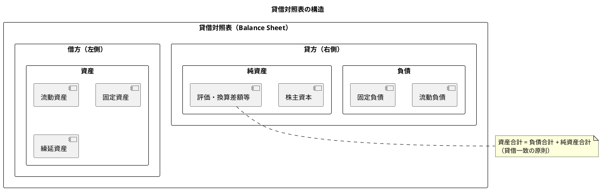

# 第17章: 貸借対照表

本章では、財務諸表の一つである貸借対照表（Balance Sheet）の表示機能を実装します。勘定式・報告式のレイアウト、期間比較、構成比分析、帳票出力など、経営分析に必要な機能を実装します。

## 17.1 貸借対照表の概念

### 17.1.1 貸借対照表とは

貸借対照表は、特定時点における企業の財政状態を表す財務諸表です。資産・負債・純資産の3つの要素で構成され、「資産 = 負債 + 純資産」という等式が成り立ちます。



### 17.1.2 型定義

**src/types/balanceSheet.ts**:

```typescript
// 貸借対照表データ
export interface BalanceSheet {
  reportDate: string;           // 基準日
  fiscalYear: number;           // 会計年度
  fiscalMonth: number;          // 会計月
  assets: BalanceSheetSection;  // 資産の部
  liabilities: BalanceSheetSection;  // 負債の部
  equity: BalanceSheetSection;  // 純資産の部
  totalAssets: number;          // 資産合計
  totalLiabilitiesAndEquity: number;  // 負債・純資産合計
  isBalanced: boolean;          // 貸借一致
}

// 貸借対照表セクション
export interface BalanceSheetSection {
  name: string;
  items: BalanceSheetItem[];
  total: number;
}

// 貸借対照表項目
export interface BalanceSheetItem {
  accountCode: string;
  accountName: string;
  level: number;              // 階層レベル（0: 大分類、1: 中分類、2: 科目）
  amount: number;             // 金額
  previousAmount?: number;    // 前期金額
  composition?: number;       // 構成比（%）
  isSubtotal?: boolean;       // 小計行フラグ
  children?: BalanceSheetItem[];
}

// 貸借対照表検索パラメータ
export interface BalanceSheetParams {
  year: number;
  month: number;
  compareWithPreviousYear?: boolean;
  showComposition?: boolean;
}

// 表示形式
export type BalanceSheetLayout = 'account' | 'report';

// 勘定式（左右対照）
export interface AccountFormLayout {
  leftSide: BalanceSheetSection;   // 資産
  rightSide: {
    liabilities: BalanceSheetSection;
    equity: BalanceSheetSection;
  };
}

// 報告式（上下列挙）
export interface ReportFormLayout {
  sections: BalanceSheetSection[];
}

// 比較データ
export interface BalanceSheetComparison {
  current: BalanceSheet;
  previous: BalanceSheet;
  differences: {
    accountCode: string;
    accountName: string;
    currentAmount: number;
    previousAmount: number;
    difference: number;
    changeRate: number;
  }[];
}
```

## 17.2 貸借対照表表示

### 17.2.1 BalanceSheetContainer

**src/components/statement/balanceSheet/BalanceSheetContainer.tsx**:

```typescript
import React, { useState, useCallback, useMemo } from 'react';
import {
  useGetBalanceSheet,
} from '@/api/generated/statement/statement';
import {
  BalanceSheetParams,
  BalanceSheetLayout,
  BalanceSheet,
} from '@/types/balanceSheet';
import { BalanceSheetView } from '@/views/statement/balanceSheet/BalanceSheetView';
import { BalanceSheetAccountForm } from '@/views/statement/balanceSheet/BalanceSheetAccountForm';
import { BalanceSheetReportForm } from '@/views/statement/balanceSheet/BalanceSheetReportForm';
import { BalanceSheetSearchForm } from '@/views/statement/balanceSheet/BalanceSheetSearchForm';
import { BalanceSheetSummary } from '@/views/statement/balanceSheet/BalanceSheetSummary';
import { Loading } from '@/views/common/Loading';
import { ErrorMessage } from '@/views/common/ErrorMessage';
import { useAccountingPeriod } from '@/providers/AccountingPeriodProvider';
import dayjs from 'dayjs';
import './BalanceSheetContainer.css';

export const BalanceSheetContainer: React.FC = () => {
  const { currentPeriod } = useAccountingPeriod();
  const now = dayjs();

  // 検索条件
  const [params, setParams] = useState<BalanceSheetParams>({
    year: currentPeriod?.year || now.year(),
    month: now.month() + 1,
    compareWithPreviousYear: false,
    showComposition: true,
  });

  // 表示形式
  const [layout, setLayout] = useState<BalanceSheetLayout>('account');

  // 貸借対照表データ取得
  const {
    data: balanceSheet,
    isLoading,
    error,
  } = useGetBalanceSheet(params);

  // 前期データ取得（比較表示用）
  const {
    data: previousBalanceSheet,
    isLoading: isLoadingPrevious,
  } = useGetBalanceSheet(
    { ...params, year: params.year - 1 },
    {
      query: {
        enabled: params.compareWithPreviousYear,
      },
    }
  );

  // 検索条件変更
  const handleParamsChange = useCallback(
    (newParams: Partial<BalanceSheetParams>) => {
      setParams((prev) => ({ ...prev, ...newParams }));
    },
    []
  );

  // レイアウト変更
  const handleLayoutChange = useCallback((newLayout: BalanceSheetLayout) => {
    setLayout(newLayout);
  }, []);

  // 印刷
  const handlePrint = useCallback(() => {
    window.print();
  }, []);

  // Excel出力
  const handleExport = useCallback(() => {
    // エクスポート処理
    console.log('Export balance sheet');
  }, []);

  // PDF出力
  const handleExportPdf = useCallback(() => {
    // PDF出力処理
    console.log('Export balance sheet as PDF');
  }, []);

  const isLoadingData = isLoading || (params.compareWithPreviousYear && isLoadingPrevious);

  if (error) {
    return <ErrorMessage error={error} />;
  }

  return (
    <div className="balance-sheet-container">
      <div className="page-header">
        <h2>貸借対照表</h2>
        <div className="header-actions">
          <button className="btn-secondary" onClick={handlePrint}>
            印刷
          </button>
          <button className="btn-secondary" onClick={handleExport}>
            Excel
          </button>
          <button className="btn-secondary" onClick={handleExportPdf}>
            PDF
          </button>
        </div>
      </div>

      {/* 検索フォーム */}
      <BalanceSheetSearchForm
        params={params}
        layout={layout}
        onParamsChange={handleParamsChange}
        onLayoutChange={handleLayoutChange}
      />

      {/* 貸借対照表表示 */}
      {isLoadingData ? (
        <Loading />
      ) : balanceSheet ? (
        <>
          {/* サマリー */}
          <BalanceSheetSummary
            balanceSheet={balanceSheet}
            previousBalanceSheet={
              params.compareWithPreviousYear ? previousBalanceSheet : undefined
            }
          />

          {/* 本体 */}
          {layout === 'account' ? (
            <BalanceSheetAccountForm
              balanceSheet={balanceSheet}
              previousBalanceSheet={
                params.compareWithPreviousYear ? previousBalanceSheet : undefined
              }
              showComposition={params.showComposition}
            />
          ) : (
            <BalanceSheetReportForm
              balanceSheet={balanceSheet}
              previousBalanceSheet={
                params.compareWithPreviousYear ? previousBalanceSheet : undefined
              }
              showComposition={params.showComposition}
            />
          )}
        </>
      ) : (
        <div className="empty-data">
          <p>データがありません</p>
        </div>
      )}
    </div>
  );
};
```

### 17.2.2 BalanceSheetSearchForm

**src/views/statement/balanceSheet/BalanceSheetSearchForm.tsx**:

```typescript
import React, { useCallback } from 'react';
import { BalanceSheetParams, BalanceSheetLayout } from '@/types/balanceSheet';
import { FiChevronLeft, FiChevronRight, FiColumns, FiList } from 'react-icons/fi';
import './BalanceSheetSearchForm.css';

interface Props {
  params: BalanceSheetParams;
  layout: BalanceSheetLayout;
  onParamsChange: (params: Partial<BalanceSheetParams>) => void;
  onLayoutChange: (layout: BalanceSheetLayout) => void;
}

export const BalanceSheetSearchForm: React.FC<Props> = ({
  params,
  layout,
  onParamsChange,
  onLayoutChange,
}) => {
  // 前月へ
  const handlePrevMonth = useCallback(() => {
    const newMonth = params.month === 1 ? 12 : params.month - 1;
    const newYear = params.month === 1 ? params.year - 1 : params.year;
    onParamsChange({ year: newYear, month: newMonth });
  }, [params, onParamsChange]);

  // 翌月へ
  const handleNextMonth = useCallback(() => {
    const newMonth = params.month === 12 ? 1 : params.month + 1;
    const newYear = params.month === 12 ? params.year + 1 : params.year;
    onParamsChange({ year: newYear, month: newMonth });
  }, [params, onParamsChange]);

  const currentYear = new Date().getFullYear();
  const yearOptions = Array.from({ length: 6 }, (_, i) => currentYear - 5 + i);

  return (
    <div className="balance-sheet-search-form">
      {/* 期間選択 */}
      <div className="period-section">
        <div className="month-navigator">
          <button className="nav-btn" onClick={handlePrevMonth}>
            <FiChevronLeft />
          </button>

          <div className="year-month-selector">
            <select
              value={params.year}
              onChange={(e) => onParamsChange({ year: Number(e.target.value) })}
            >
              {yearOptions.map((year) => (
                <option key={year} value={year}>
                  {year}年
                </option>
              ))}
            </select>
            <select
              value={params.month}
              onChange={(e) => onParamsChange({ month: Number(e.target.value) })}
            >
              {Array.from({ length: 12 }, (_, i) => i + 1).map((month) => (
                <option key={month} value={month}>
                  {month}月末
                </option>
              ))}
            </select>
          </div>

          <button className="nav-btn" onClick={handleNextMonth}>
            <FiChevronRight />
          </button>
        </div>
      </div>

      {/* レイアウト切替 */}
      <div className="layout-section">
        <label>表示形式</label>
        <div className="layout-buttons">
          <button
            className={`layout-btn ${layout === 'account' ? 'active' : ''}`}
            onClick={() => onLayoutChange('account')}
            title="勘定式"
          >
            <FiColumns />
            勘定式
          </button>
          <button
            className={`layout-btn ${layout === 'report' ? 'active' : ''}`}
            onClick={() => onLayoutChange('report')}
            title="報告式"
          >
            <FiList />
            報告式
          </button>
        </div>
      </div>

      {/* オプション */}
      <div className="options-section">
        <label className="checkbox-option">
          <input
            type="checkbox"
            checked={params.compareWithPreviousYear}
            onChange={(e) =>
              onParamsChange({ compareWithPreviousYear: e.target.checked })
            }
          />
          前期比較
        </label>

        <label className="checkbox-option">
          <input
            type="checkbox"
            checked={params.showComposition}
            onChange={(e) =>
              onParamsChange({ showComposition: e.target.checked })
            }
          />
          構成比表示
        </label>
      </div>
    </div>
  );
};
```

### 17.2.3 BalanceSheetAccountForm（勘定式）

**src/views/statement/balanceSheet/BalanceSheetAccountForm.tsx**:

```typescript
import React from 'react';
import { BalanceSheet, BalanceSheetItem } from '@/types/balanceSheet';
import './BalanceSheetAccountForm.css';

interface Props {
  balanceSheet: BalanceSheet;
  previousBalanceSheet?: BalanceSheet;
  showComposition?: boolean;
}

export const BalanceSheetAccountForm: React.FC<Props> = ({
  balanceSheet,
  previousBalanceSheet,
  showComposition = true,
}) => {
  const formatMoney = (amount: number) => amount.toLocaleString();
  const formatPercent = (value: number) => `${value.toFixed(1)}%`;

  // 項目行のレンダリング
  const renderItem = (
    item: BalanceSheetItem,
    previousItem?: BalanceSheetItem,
    totalAssets?: number
  ) => {
    const composition = totalAssets
      ? (item.amount / totalAssets) * 100
      : 0;
    const difference = previousItem
      ? item.amount - previousItem.amount
      : undefined;

    return (
      <tr
        key={item.accountCode}
        className={`item-row level-${item.level} ${item.isSubtotal ? 'subtotal' : ''}`}
      >
        <td className="account-name">
          {'　'.repeat(item.level)}
          {item.accountName}
        </td>
        <td className="amount">{formatMoney(item.amount)}</td>
        {previousBalanceSheet && (
          <>
            <td className="amount prev">
              {previousItem ? formatMoney(previousItem.amount) : '-'}
            </td>
            <td className={`amount diff ${(difference || 0) >= 0 ? 'positive' : 'negative'}`}>
              {difference !== undefined
                ? `${difference >= 0 ? '+' : ''}${formatMoney(difference)}`
                : '-'}
            </td>
          </>
        )}
        {showComposition && (
          <td className="composition">{formatPercent(composition)}</td>
        )}
      </tr>
    );
  };

  // セクションのレンダリング
  const renderSection = (
    section: { name: string; items: BalanceSheetItem[]; total: number },
    previousSection?: { items: BalanceSheetItem[]; total: number },
    totalAssets?: number
  ) => {
    return (
      <>
        {section.items.map((item) => {
          const prevItem = previousSection?.items.find(
            (p) => p.accountCode === item.accountCode
          );
          return renderItem(item, prevItem, totalAssets);
        })}
        <tr className="section-total">
          <td className="account-name">{section.name}合計</td>
          <td className="amount total">{formatMoney(section.total)}</td>
          {previousBalanceSheet && previousSection && (
            <>
              <td className="amount prev total">
                {formatMoney(previousSection.total)}
              </td>
              <td
                className={`amount diff ${
                  section.total - previousSection.total >= 0
                    ? 'positive'
                    : 'negative'
                }`}
              >
                {section.total - previousSection.total >= 0 ? '+' : ''}
                {formatMoney(section.total - previousSection.total)}
              </td>
            </>
          )}
          {showComposition && <td className="composition">-</td>}
        </tr>
      </>
    );
  };

  const totalAssets = balanceSheet.totalAssets;

  return (
    <div className="balance-sheet-account-form">
      <div className="report-header">
        <h3>貸借対照表</h3>
        <p className="report-date">
          {balanceSheet.fiscalYear}年{balanceSheet.fiscalMonth}月末日現在
        </p>
      </div>

      <div className="two-column-layout">
        {/* 左側：資産の部 */}
        <div className="left-column">
          <table className="bs-table">
            <thead>
              <tr>
                <th className="col-name">資産の部</th>
                <th className="col-amount">金額</th>
                {previousBalanceSheet && (
                  <>
                    <th className="col-amount">前期</th>
                    <th className="col-amount">増減</th>
                  </>
                )}
                {showComposition && <th className="col-composition">構成比</th>}
              </tr>
            </thead>
            <tbody>
              {renderSection(
                balanceSheet.assets,
                previousBalanceSheet?.assets,
                totalAssets
              )}
            </tbody>
            <tfoot>
              <tr className="grand-total">
                <td>資産合計</td>
                <td className="amount">{formatMoney(balanceSheet.totalAssets)}</td>
                {previousBalanceSheet && (
                  <>
                    <td className="amount">
                      {formatMoney(previousBalanceSheet.totalAssets)}
                    </td>
                    <td className="amount">
                      {formatMoney(
                        balanceSheet.totalAssets - previousBalanceSheet.totalAssets
                      )}
                    </td>
                  </>
                )}
                {showComposition && <td className="composition">100.0%</td>}
              </tr>
            </tfoot>
          </table>
        </div>

        {/* 右側：負債・純資産の部 */}
        <div className="right-column">
          <table className="bs-table">
            <thead>
              <tr>
                <th className="col-name">負債・純資産の部</th>
                <th className="col-amount">金額</th>
                {previousBalanceSheet && (
                  <>
                    <th className="col-amount">前期</th>
                    <th className="col-amount">増減</th>
                  </>
                )}
                {showComposition && <th className="col-composition">構成比</th>}
              </tr>
            </thead>
            <tbody>
              {/* 負債の部 */}
              <tr className="section-header">
                <td colSpan={showComposition ? 5 : 4}>【負債の部】</td>
              </tr>
              {renderSection(
                balanceSheet.liabilities,
                previousBalanceSheet?.liabilities,
                totalAssets
              )}

              {/* 純資産の部 */}
              <tr className="section-header">
                <td colSpan={showComposition ? 5 : 4}>【純資産の部】</td>
              </tr>
              {renderSection(
                balanceSheet.equity,
                previousBalanceSheet?.equity,
                totalAssets
              )}
            </tbody>
            <tfoot>
              <tr className="grand-total">
                <td>負債・純資産合計</td>
                <td className="amount">
                  {formatMoney(balanceSheet.totalLiabilitiesAndEquity)}
                </td>
                {previousBalanceSheet && (
                  <>
                    <td className="amount">
                      {formatMoney(previousBalanceSheet.totalLiabilitiesAndEquity)}
                    </td>
                    <td className="amount">
                      {formatMoney(
                        balanceSheet.totalLiabilitiesAndEquity -
                          previousBalanceSheet.totalLiabilitiesAndEquity
                      )}
                    </td>
                  </>
                )}
                {showComposition && <td className="composition">100.0%</td>}
              </tr>
            </tfoot>
          </table>
        </div>
      </div>
    </div>
  );
};
```

### 17.2.4 BalanceSheetReportForm（報告式）

**src/views/statement/balanceSheet/BalanceSheetReportForm.tsx**:

```typescript
import React from 'react';
import { BalanceSheet, BalanceSheetItem } from '@/types/balanceSheet';
import './BalanceSheetReportForm.css';

interface Props {
  balanceSheet: BalanceSheet;
  previousBalanceSheet?: BalanceSheet;
  showComposition?: boolean;
}

export const BalanceSheetReportForm: React.FC<Props> = ({
  balanceSheet,
  previousBalanceSheet,
  showComposition = true,
}) => {
  const formatMoney = (amount: number) => amount.toLocaleString();
  const formatPercent = (value: number) => `${value.toFixed(1)}%`;

  const totalAssets = balanceSheet.totalAssets;

  // 項目行のレンダリング
  const renderItem = (
    item: BalanceSheetItem,
    previousItem?: BalanceSheetItem
  ) => {
    const composition = totalAssets ? (item.amount / totalAssets) * 100 : 0;

    return (
      <tr
        key={item.accountCode}
        className={`item-row level-${item.level} ${item.isSubtotal ? 'subtotal' : ''}`}
      >
        <td className="account-name">
          {'　'.repeat(item.level)}
          {item.accountName}
        </td>
        <td className="amount">{formatMoney(item.amount)}</td>
        {previousBalanceSheet && (
          <td className="amount prev">
            {previousItem ? formatMoney(previousItem.amount) : '-'}
          </td>
        )}
        {showComposition && (
          <td className="composition">{formatPercent(composition)}</td>
        )}
      </tr>
    );
  };

  return (
    <div className="balance-sheet-report-form">
      <div className="report-header">
        <h3>貸借対照表</h3>
        <p className="report-date">
          {balanceSheet.fiscalYear}年{balanceSheet.fiscalMonth}月末日現在
        </p>
      </div>

      <table className="bs-report-table">
        <thead>
          <tr>
            <th className="col-name">勘定科目</th>
            <th className="col-amount">金額</th>
            {previousBalanceSheet && <th className="col-amount">前期</th>}
            {showComposition && <th className="col-composition">構成比</th>}
          </tr>
        </thead>
        <tbody>
          {/* 資産の部 */}
          <tr className="section-header">
            <td colSpan={4}>【資産の部】</td>
          </tr>
          {balanceSheet.assets.items.map((item) => {
            const prevItem = previousBalanceSheet?.assets.items.find(
              (p) => p.accountCode === item.accountCode
            );
            return renderItem(item, prevItem);
          })}
          <tr className="section-total">
            <td>資産合計</td>
            <td className="amount">{formatMoney(balanceSheet.assets.total)}</td>
            {previousBalanceSheet && (
              <td className="amount">
                {formatMoney(previousBalanceSheet.assets.total)}
              </td>
            )}
            {showComposition && <td className="composition">100.0%</td>}
          </tr>

          {/* 負債の部 */}
          <tr className="section-header">
            <td colSpan={4}>【負債の部】</td>
          </tr>
          {balanceSheet.liabilities.items.map((item) => {
            const prevItem = previousBalanceSheet?.liabilities.items.find(
              (p) => p.accountCode === item.accountCode
            );
            return renderItem(item, prevItem);
          })}
          <tr className="section-total">
            <td>負債合計</td>
            <td className="amount">
              {formatMoney(balanceSheet.liabilities.total)}
            </td>
            {previousBalanceSheet && (
              <td className="amount">
                {formatMoney(previousBalanceSheet.liabilities.total)}
              </td>
            )}
            {showComposition && (
              <td className="composition">
                {formatPercent(
                  (balanceSheet.liabilities.total / totalAssets) * 100
                )}
              </td>
            )}
          </tr>

          {/* 純資産の部 */}
          <tr className="section-header">
            <td colSpan={4}>【純資産の部】</td>
          </tr>
          {balanceSheet.equity.items.map((item) => {
            const prevItem = previousBalanceSheet?.equity.items.find(
              (p) => p.accountCode === item.accountCode
            );
            return renderItem(item, prevItem);
          })}
          <tr className="section-total">
            <td>純資産合計</td>
            <td className="amount">{formatMoney(balanceSheet.equity.total)}</td>
            {previousBalanceSheet && (
              <td className="amount">
                {formatMoney(previousBalanceSheet.equity.total)}
              </td>
            )}
            {showComposition && (
              <td className="composition">
                {formatPercent((balanceSheet.equity.total / totalAssets) * 100)}
              </td>
            )}
          </tr>
        </tbody>
        <tfoot>
          <tr className="grand-total">
            <td>負債・純資産合計</td>
            <td className="amount">
              {formatMoney(balanceSheet.totalLiabilitiesAndEquity)}
            </td>
            {previousBalanceSheet && (
              <td className="amount">
                {formatMoney(previousBalanceSheet.totalLiabilitiesAndEquity)}
              </td>
            )}
            {showComposition && <td className="composition">100.0%</td>}
          </tr>
        </tfoot>
      </table>
    </div>
  );
};
```

## 17.3 期間比較

### 17.3.1 BalanceSheetComparisonContainer

**src/components/statement/balanceSheet/BalanceSheetComparisonContainer.tsx**:

```typescript
import React, { useState, useCallback, useMemo } from 'react';
import {
  useGetBalanceSheet,
} from '@/api/generated/statement/statement';
import { BalanceSheetComparison } from '@/types/balanceSheet';
import { BalanceSheetComparisonView } from '@/views/statement/balanceSheet/BalanceSheetComparisonView';
import { Loading } from '@/views/common/Loading';
import { ErrorMessage } from '@/views/common/ErrorMessage';
import { useAccountingPeriod } from '@/providers/AccountingPeriodProvider';
import dayjs from 'dayjs';
import './BalanceSheetComparisonContainer.css';

export const BalanceSheetComparisonContainer: React.FC = () => {
  const { currentPeriod } = useAccountingPeriod();
  const now = dayjs();

  // 比較期間
  const [currentYear, setCurrentYear] = useState(
    currentPeriod?.year || now.year()
  );
  const [currentMonth, setCurrentMonth] = useState(now.month() + 1);
  const [previousYear, setPreviousYear] = useState(
    (currentPeriod?.year || now.year()) - 1
  );
  const [previousMonth, setPreviousMonth] = useState(now.month() + 1);

  // 当期データ取得
  const {
    data: currentData,
    isLoading: isLoadingCurrent,
    error: currentError,
  } = useGetBalanceSheet({ year: currentYear, month: currentMonth });

  // 前期データ取得
  const {
    data: previousData,
    isLoading: isLoadingPrevious,
    error: previousError,
  } = useGetBalanceSheet({ year: previousYear, month: previousMonth });

  // 比較データの作成
  const comparisonData: BalanceSheetComparison | null = useMemo(() => {
    if (!currentData || !previousData) return null;

    // 全項目の差額を計算
    const differences: BalanceSheetComparison['differences'] = [];

    const processItems = (
      currentItems: any[],
      previousItems: any[]
    ) => {
      currentItems.forEach((item) => {
        const prevItem = previousItems.find(
          (p) => p.accountCode === item.accountCode
        );
        const previousAmount = prevItem?.amount || 0;
        const difference = item.amount - previousAmount;
        const changeRate =
          previousAmount !== 0
            ? (difference / Math.abs(previousAmount)) * 100
            : item.amount !== 0
            ? 100
            : 0;

        differences.push({
          accountCode: item.accountCode,
          accountName: item.accountName,
          currentAmount: item.amount,
          previousAmount,
          difference,
          changeRate,
        });
      });
    };

    processItems(currentData.assets.items, previousData.assets.items);
    processItems(currentData.liabilities.items, previousData.liabilities.items);
    processItems(currentData.equity.items, previousData.equity.items);

    return {
      current: currentData,
      previous: previousData,
      differences,
    };
  }, [currentData, previousData]);

  const isLoading = isLoadingCurrent || isLoadingPrevious;
  const error = currentError || previousError;

  if (error) {
    return <ErrorMessage error={error} />;
  }

  return (
    <div className="balance-sheet-comparison-container">
      <div className="page-header">
        <h2>貸借対照表 期間比較</h2>
      </div>

      {/* 期間選択 */}
      <div className="period-selector">
        <div className="period-group">
          <label>当期</label>
          <select
            value={currentYear}
            onChange={(e) => setCurrentYear(Number(e.target.value))}
          >
            {Array.from({ length: 6 }, (_, i) => now.year() - i).map((y) => (
              <option key={y} value={y}>
                {y}年
              </option>
            ))}
          </select>
          <select
            value={currentMonth}
            onChange={(e) => setCurrentMonth(Number(e.target.value))}
          >
            {Array.from({ length: 12 }, (_, i) => i + 1).map((m) => (
              <option key={m} value={m}>
                {m}月
              </option>
            ))}
          </select>
        </div>

        <span className="vs">vs</span>

        <div className="period-group">
          <label>前期</label>
          <select
            value={previousYear}
            onChange={(e) => setPreviousYear(Number(e.target.value))}
          >
            {Array.from({ length: 6 }, (_, i) => now.year() - i).map((y) => (
              <option key={y} value={y}>
                {y}年
              </option>
            ))}
          </select>
          <select
            value={previousMonth}
            onChange={(e) => setPreviousMonth(Number(e.target.value))}
          >
            {Array.from({ length: 12 }, (_, i) => i + 1).map((m) => (
              <option key={m} value={m}>
                {m}月
              </option>
            ))}
          </select>
        </div>
      </div>

      {/* 比較表示 */}
      {isLoading ? (
        <Loading />
      ) : comparisonData ? (
        <BalanceSheetComparisonView data={comparisonData} />
      ) : (
        <div className="empty-data">
          <p>データがありません</p>
        </div>
      )}
    </div>
  );
};
```

### 17.3.2 BalanceSheetComparisonView

**src/views/statement/balanceSheet/BalanceSheetComparisonView.tsx**:

```typescript
import React, { useMemo } from 'react';
import { BalanceSheetComparison } from '@/types/balanceSheet';
import { FiTrendingUp, FiTrendingDown, FiMinus } from 'react-icons/fi';
import './BalanceSheetComparisonView.css';

interface Props {
  data: BalanceSheetComparison;
}

export const BalanceSheetComparisonView: React.FC<Props> = ({ data }) => {
  const formatMoney = (amount: number) => amount.toLocaleString();
  const formatPercent = (value: number) => `${value.toFixed(1)}%`;

  // 増減の大きい順にソート
  const sortedDifferences = useMemo(() => {
    return [...data.differences].sort(
      (a, b) => Math.abs(b.difference) - Math.abs(a.difference)
    );
  }, [data.differences]);

  // 増減アイコン
  const getTrendIcon = (rate: number) => {
    if (rate > 5) return <FiTrendingUp className="trend-up" />;
    if (rate < -5) return <FiTrendingDown className="trend-down" />;
    return <FiMinus className="trend-flat" />;
  };

  return (
    <div className="balance-sheet-comparison-view">
      {/* サマリー */}
      <div className="comparison-summary">
        <div className="summary-card">
          <h4>総資産</h4>
          <div className="amounts">
            <div className="current">
              <span className="label">当期</span>
              <span className="value">
                {formatMoney(data.current.totalAssets)}
              </span>
            </div>
            <div className="previous">
              <span className="label">前期</span>
              <span className="value">
                {formatMoney(data.previous.totalAssets)}
              </span>
            </div>
            <div
              className={`difference ${
                data.current.totalAssets >= data.previous.totalAssets
                  ? 'positive'
                  : 'negative'
              }`}
            >
              <span className="label">増減</span>
              <span className="value">
                {formatMoney(
                  data.current.totalAssets - data.previous.totalAssets
                )}
              </span>
            </div>
          </div>
        </div>

        <div className="summary-card">
          <h4>純資産</h4>
          <div className="amounts">
            <div className="current">
              <span className="label">当期</span>
              <span className="value">
                {formatMoney(data.current.equity.total)}
              </span>
            </div>
            <div className="previous">
              <span className="label">前期</span>
              <span className="value">
                {formatMoney(data.previous.equity.total)}
              </span>
            </div>
            <div
              className={`difference ${
                data.current.equity.total >= data.previous.equity.total
                  ? 'positive'
                  : 'negative'
              }`}
            >
              <span className="label">増減</span>
              <span className="value">
                {formatMoney(
                  data.current.equity.total - data.previous.equity.total
                )}
              </span>
            </div>
          </div>
        </div>
      </div>

      {/* 増減明細 */}
      <div className="difference-table-section">
        <h4>科目別増減</h4>
        <table className="difference-table">
          <thead>
            <tr>
              <th className="col-code">コード</th>
              <th className="col-name">勘定科目</th>
              <th className="col-amount">当期</th>
              <th className="col-amount">前期</th>
              <th className="col-amount">増減額</th>
              <th className="col-rate">増減率</th>
              <th className="col-trend"></th>
            </tr>
          </thead>
          <tbody>
            {sortedDifferences.slice(0, 20).map((item) => (
              <tr key={item.accountCode}>
                <td className="account-code">{item.accountCode}</td>
                <td className="account-name">{item.accountName}</td>
                <td className="amount">{formatMoney(item.currentAmount)}</td>
                <td className="amount">{formatMoney(item.previousAmount)}</td>
                <td
                  className={`amount diff ${
                    item.difference >= 0 ? 'positive' : 'negative'
                  }`}
                >
                  {item.difference >= 0 ? '+' : ''}
                  {formatMoney(item.difference)}
                </td>
                <td
                  className={`rate ${
                    item.changeRate >= 0 ? 'positive' : 'negative'
                  }`}
                >
                  {item.changeRate >= 0 ? '+' : ''}
                  {formatPercent(item.changeRate)}
                </td>
                <td className="trend">{getTrendIcon(item.changeRate)}</td>
              </tr>
            ))}
          </tbody>
        </table>
      </div>
    </div>
  );
};
```

## 17.4 構成比分析

### 17.4.1 BalanceSheetAnalysisContainer

**src/components/statement/balanceSheet/BalanceSheetAnalysisContainer.tsx**:

```typescript
import React, { useState, useCallback, useMemo } from 'react';
import {
  useGetBalanceSheet,
} from '@/api/generated/statement/statement';
import { BalanceSheetAnalysisView } from '@/views/statement/balanceSheet/BalanceSheetAnalysisView';
import { BalanceSheetPieChart } from '@/views/statement/balanceSheet/BalanceSheetPieChart';
import { Loading } from '@/views/common/Loading';
import { ErrorMessage } from '@/views/common/ErrorMessage';
import { useAccountingPeriod } from '@/providers/AccountingPeriodProvider';
import dayjs from 'dayjs';
import './BalanceSheetAnalysisContainer.css';

type AnalysisTarget = 'assets' | 'liabilities' | 'equity' | 'all';

export const BalanceSheetAnalysisContainer: React.FC = () => {
  const { currentPeriod } = useAccountingPeriod();
  const now = dayjs();

  const [year, setYear] = useState(currentPeriod?.year || now.year());
  const [month, setMonth] = useState(now.month() + 1);
  const [analysisTarget, setAnalysisTarget] = useState<AnalysisTarget>('all');

  // 貸借対照表データ取得
  const {
    data: balanceSheet,
    isLoading,
    error,
  } = useGetBalanceSheet({ year, month });

  // 構成比データの作成
  const compositionData = useMemo(() => {
    if (!balanceSheet) return null;

    const totalAssets = balanceSheet.totalAssets;

    const assetComposition = balanceSheet.assets.items.map((item) => ({
      name: item.accountName,
      value: item.amount,
      percentage: (item.amount / totalAssets) * 100,
    }));

    const liabilityComposition = balanceSheet.liabilities.items.map((item) => ({
      name: item.accountName,
      value: item.amount,
      percentage: (item.amount / totalAssets) * 100,
    }));

    const equityComposition = balanceSheet.equity.items.map((item) => ({
      name: item.accountName,
      value: item.amount,
      percentage: (item.amount / totalAssets) * 100,
    }));

    return {
      assets: assetComposition,
      liabilities: liabilityComposition,
      equity: equityComposition,
      summary: {
        assetsTotal: balanceSheet.assets.total,
        liabilitiesTotal: balanceSheet.liabilities.total,
        equityTotal: balanceSheet.equity.total,
        assetsPercent: 100,
        liabilitiesPercent:
          (balanceSheet.liabilities.total / totalAssets) * 100,
        equityPercent: (balanceSheet.equity.total / totalAssets) * 100,
      },
    };
  }, [balanceSheet]);

  if (error) {
    return <ErrorMessage error={error} />;
  }

  return (
    <div className="balance-sheet-analysis-container">
      <div className="page-header">
        <h2>貸借対照表 構成比分析</h2>
      </div>

      {/* 期間選択 */}
      <div className="controls">
        <div className="control-group">
          <label>期間</label>
          <select
            value={year}
            onChange={(e) => setYear(Number(e.target.value))}
          >
            {Array.from({ length: 6 }, (_, i) => now.year() - i).map((y) => (
              <option key={y} value={y}>
                {y}年
              </option>
            ))}
          </select>
          <select
            value={month}
            onChange={(e) => setMonth(Number(e.target.value))}
          >
            {Array.from({ length: 12 }, (_, i) => i + 1).map((m) => (
              <option key={m} value={m}>
                {m}月
              </option>
            ))}
          </select>
        </div>

        <div className="control-group">
          <label>分析対象</label>
          <select
            value={analysisTarget}
            onChange={(e) => setAnalysisTarget(e.target.value as AnalysisTarget)}
          >
            <option value="all">全体</option>
            <option value="assets">資産</option>
            <option value="liabilities">負債</option>
            <option value="equity">純資産</option>
          </select>
        </div>
      </div>

      {/* 分析表示 */}
      {isLoading ? (
        <Loading />
      ) : compositionData ? (
        <div className="analysis-content">
          <div className="chart-section">
            <BalanceSheetPieChart
              data={compositionData}
              target={analysisTarget}
            />
          </div>
          <div className="table-section">
            <BalanceSheetAnalysisView
              data={compositionData}
              target={analysisTarget}
            />
          </div>
        </div>
      ) : (
        <div className="empty-data">
          <p>データがありません</p>
        </div>
      )}
    </div>
  );
};
```

### 17.4.2 BalanceSheetPieChart

**src/views/statement/balanceSheet/BalanceSheetPieChart.tsx**:

```typescript
import React, { useRef, useEffect } from 'react';
import './BalanceSheetPieChart.css';

interface CompositionItem {
  name: string;
  value: number;
  percentage: number;
}

interface Props {
  data: {
    assets: CompositionItem[];
    liabilities: CompositionItem[];
    equity: CompositionItem[];
    summary: {
      assetsTotal: number;
      liabilitiesTotal: number;
      equityTotal: number;
      assetsPercent: number;
      liabilitiesPercent: number;
      equityPercent: number;
    };
  };
  target: 'assets' | 'liabilities' | 'equity' | 'all';
}

const COLORS = [
  '#0066cc', '#00aaff', '#00ccaa', '#00cc66', '#66cc00',
  '#aacc00', '#ccaa00', '#cc6600', '#cc0066', '#aa00cc',
];

export const BalanceSheetPieChart: React.FC<Props> = ({ data, target }) => {
  const canvasRef = useRef<HTMLCanvasElement>(null);

  useEffect(() => {
    const canvas = canvasRef.current;
    if (!canvas) return;

    const ctx = canvas.getContext('2d');
    if (!ctx) return;

    const width = canvas.width;
    const height = canvas.height;
    const centerX = width / 2;
    const centerY = height / 2;
    const radius = Math.min(width, height) / 2 - 40;

    // クリア
    ctx.clearRect(0, 0, width, height);

    // 描画するデータの選択
    let chartData: CompositionItem[];
    let title: string;

    if (target === 'all') {
      chartData = [
        { name: '資産', value: data.summary.assetsTotal, percentage: 50 },
        { name: '負債', value: data.summary.liabilitiesTotal, percentage: data.summary.liabilitiesPercent / 2 },
        { name: '純資産', value: data.summary.equityTotal, percentage: data.summary.equityPercent / 2 },
      ];
      title = '財政状態の構成';
    } else {
      chartData = data[target].filter((item) => item.value > 0);
      title = target === 'assets' ? '資産の構成' : target === 'liabilities' ? '負債の構成' : '純資産の構成';
    }

    // 円グラフの描画
    let startAngle = -Math.PI / 2;
    const total = chartData.reduce((sum, item) => sum + item.value, 0);

    chartData.forEach((item, index) => {
      const sliceAngle = (item.value / total) * Math.PI * 2;

      ctx.beginPath();
      ctx.moveTo(centerX, centerY);
      ctx.arc(centerX, centerY, radius, startAngle, startAngle + sliceAngle);
      ctx.closePath();
      ctx.fillStyle = COLORS[index % COLORS.length];
      ctx.fill();

      // ラベル
      const labelAngle = startAngle + sliceAngle / 2;
      const labelRadius = radius * 0.7;
      const labelX = centerX + Math.cos(labelAngle) * labelRadius;
      const labelY = centerY + Math.sin(labelAngle) * labelRadius;

      if (item.value / total > 0.05) {
        ctx.fillStyle = '#fff';
        ctx.font = 'bold 12px sans-serif';
        ctx.textAlign = 'center';
        ctx.textBaseline = 'middle';
        ctx.fillText(`${((item.value / total) * 100).toFixed(1)}%`, labelX, labelY);
      }

      startAngle += sliceAngle;
    });

    // タイトル
    ctx.fillStyle = '#333';
    ctx.font = 'bold 14px sans-serif';
    ctx.textAlign = 'center';
    ctx.fillText(title, centerX, 20);

  }, [data, target]);

  // 凡例
  const getLegendData = () => {
    if (target === 'all') {
      return [
        { name: '資産', color: COLORS[0] },
        { name: '負債', color: COLORS[1] },
        { name: '純資産', color: COLORS[2] },
      ];
    }
    return data[target]
      .filter((item) => item.value > 0)
      .map((item, index) => ({
        name: item.name,
        color: COLORS[index % COLORS.length],
      }));
  };

  return (
    <div className="balance-sheet-pie-chart">
      <canvas ref={canvasRef} width={400} height={400} />
      <div className="chart-legend">
        {getLegendData().map((item, index) => (
          <div key={index} className="legend-item">
            <span
              className="legend-color"
              style={{ backgroundColor: item.color }}
            />
            <span className="legend-label">{item.name}</span>
          </div>
        ))}
      </div>
    </div>
  );
};
```

## 17.5 帳票出力

### 17.5.1 BalanceSheetExportContainer

**src/components/statement/balanceSheet/BalanceSheetExportContainer.tsx**:

```typescript
import React, { useState, useCallback } from 'react';
import {
  useGetBalanceSheet,
  useExportBalanceSheetPdf,
  useExportBalanceSheetExcel,
} from '@/api/generated/statement/statement';
import { BalanceSheetExportForm } from '@/views/statement/balanceSheet/BalanceSheetExportForm';
import { Loading } from '@/views/common/Loading';
import { ErrorMessage } from '@/views/common/ErrorMessage';
import { useMessage } from '@/providers/MessageProvider';
import { useAccountingPeriod } from '@/providers/AccountingPeriodProvider';
import dayjs from 'dayjs';

export interface ExportOptions {
  year: number;
  month: number;
  format: 'pdf' | 'excel';
  layout: 'account' | 'report';
  includeComparison: boolean;
  includeComposition: boolean;
  paperSize: 'A4' | 'A3';
  orientation: 'portrait' | 'landscape';
}

export const BalanceSheetExportContainer: React.FC = () => {
  const { currentPeriod } = useAccountingPeriod();
  const { showSuccess, showError } = useMessage();
  const now = dayjs();

  const [options, setOptions] = useState<ExportOptions>({
    year: currentPeriod?.year || now.year(),
    month: now.month() + 1,
    format: 'pdf',
    layout: 'account',
    includeComparison: false,
    includeComposition: true,
    paperSize: 'A4',
    orientation: 'portrait',
  });

  const [isExporting, setIsExporting] = useState(false);

  const exportPdfMutation = useExportBalanceSheetPdf();
  const exportExcelMutation = useExportBalanceSheetExcel();

  // オプション変更
  const handleOptionsChange = useCallback(
    (newOptions: Partial<ExportOptions>) => {
      setOptions((prev) => ({ ...prev, ...newOptions }));
    },
    []
  );

  // エクスポート実行
  const handleExport = useCallback(async () => {
    setIsExporting(true);

    try {
      if (options.format === 'pdf') {
        const blob = await exportPdfMutation.mutateAsync({ data: options });
        downloadBlob(blob, `balance_sheet_${options.year}_${options.month}.pdf`);
        showSuccess('PDF を出力しました。');
      } else {
        const blob = await exportExcelMutation.mutateAsync({ data: options });
        downloadBlob(blob, `balance_sheet_${options.year}_${options.month}.xlsx`);
        showSuccess('Excel を出力しました。');
      }
    } catch (err) {
      showError('出力に失敗しました。');
    } finally {
      setIsExporting(false);
    }
  }, [options, exportPdfMutation, exportExcelMutation, showSuccess, showError]);

  // ファイルダウンロード
  const downloadBlob = (blob: Blob, filename: string) => {
    const url = URL.createObjectURL(blob);
    const a = document.createElement('a');
    a.href = url;
    a.download = filename;
    a.click();
    URL.revokeObjectURL(url);
  };

  return (
    <div className="balance-sheet-export-container">
      <div className="page-header">
        <h2>貸借対照表 出力</h2>
      </div>

      <BalanceSheetExportForm
        options={options}
        onChange={handleOptionsChange}
        onExport={handleExport}
        isExporting={isExporting}
      />
    </div>
  );
};
```

## 17.6 スタイル定義

### 17.6.1 勘定式レイアウトのスタイル

**src/views/statement/balanceSheet/BalanceSheetAccountForm.css**:

```css
.balance-sheet-account-form {
  margin-top: 1rem;
}

.report-header {
  text-align: center;
  margin-bottom: 1.5rem;
  padding: 1rem;
  background: #f8f9fa;
  border-radius: 4px;
}

.report-header h3 {
  margin: 0 0 0.5rem 0;
  font-size: 1.25rem;
}

.report-header .report-date {
  margin: 0;
  color: #666;
}

.two-column-layout {
  display: grid;
  grid-template-columns: 1fr 1fr;
  gap: 1rem;
}

.bs-table {
  width: 100%;
  border-collapse: collapse;
  font-size: 0.875rem;
}

.bs-table th,
.bs-table td {
  padding: 0.5rem;
  border: 1px solid #e0e0e0;
}

.bs-table th {
  background: #f5f5f5;
  font-weight: 500;
  text-align: center;
}

.col-name {
  text-align: left;
  width: 40%;
}

.col-amount {
  text-align: right;
  width: 20%;
}

.col-composition {
  text-align: right;
  width: 10%;
}

/* 階層レベル */
.item-row.level-0 .account-name {
  font-weight: 600;
}

.item-row.level-1 .account-name {
  padding-left: 1rem;
}

.item-row.level-2 .account-name {
  padding-left: 2rem;
}

.item-row.subtotal {
  background: #fafafa;
  font-weight: 500;
}

.amount {
  font-family: 'Consolas', monospace;
}

.amount.prev {
  color: #666;
}

.amount.diff.positive {
  color: #28a745;
}

.amount.diff.negative {
  color: #dc3545;
}

/* セクション */
.section-header td {
  background: #e8f4ff;
  font-weight: 600;
  color: #0066cc;
}

.section-total {
  background: #f0f0f0;
  font-weight: 600;
}

.section-total .amount.total {
  border-top: 1px solid #333;
}

/* 合計行 */
.grand-total {
  background: #333;
  color: #fff;
  font-weight: 700;
}

.grand-total td {
  border-color: #333;
}

/* 印刷用 */
@media print {
  .two-column-layout {
    display: block;
  }

  .left-column,
  .right-column {
    page-break-inside: avoid;
  }

  .bs-table {
    font-size: 9pt;
  }
}
```

### 17.6.2 サマリーのスタイル

**src/views/statement/balanceSheet/BalanceSheetSummary.css**:

```css
.balance-sheet-summary {
  display: flex;
  gap: 1rem;
  margin-bottom: 1.5rem;
}

.summary-card {
  flex: 1;
  padding: 1rem;
  background: #fff;
  border: 1px solid #e0e0e0;
  border-radius: 8px;
  box-shadow: 0 2px 4px rgba(0, 0, 0, 0.05);
}

.summary-card h4 {
  margin: 0 0 0.75rem 0;
  padding-bottom: 0.5rem;
  border-bottom: 2px solid #0066cc;
  font-size: 0.875rem;
  color: #666;
}

.summary-value {
  font-size: 1.5rem;
  font-weight: 700;
  font-family: 'Consolas', monospace;
  color: #333;
}

.summary-label {
  font-size: 0.75rem;
  color: #999;
  margin-top: 0.25rem;
}

.balance-check {
  display: flex;
  align-items: center;
  gap: 0.5rem;
  margin-top: 0.5rem;
  font-size: 0.875rem;
}

.balance-check.ok {
  color: #28a745;
}

.balance-check.error {
  color: #dc3545;
}
```

## 17.7 まとめ

本章では、貸借対照表の表示機能の実装について解説しました。

### 主要コンポーネント

1. **BalanceSheetContainer**: 貸借対照表画面のコンテナ
2. **BalanceSheetAccountForm**: 勘定式レイアウト（左右対照）
3. **BalanceSheetReportForm**: 報告式レイアウト（上下列挙）
4. **BalanceSheetComparisonView**: 期間比較表示
5. **BalanceSheetPieChart**: 構成比円グラフ
6. **BalanceSheetExportContainer**: 帳票出力

### 機能のポイント

- **2つのレイアウト**: 勘定式（左右対照）と報告式（上下列挙）の切り替え
- **期間比較**: 当期と前期の増減額・増減率の表示
- **構成比分析**: 総資産に対する各科目の構成比
- **階層表示**: 大分類・中分類・科目のインデント表示
- **帳票出力**: PDF / Excel 形式でのダウンロード
- **印刷対応**: 印刷用スタイルの適用
