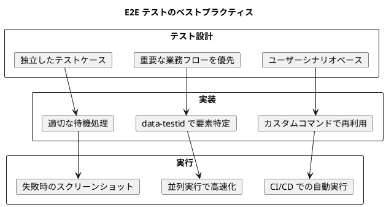

# 第24章: E2E テスト

本章では、Cypress を使用したエンドツーエンド（E2E）テストの実装を解説します。単体テストではカバーしきれないユーザー操作の一連のフローを検証し、財務会計システム全体の品質を担保します。

## 24.1 Cypress 設定

### Cypress のインストール

E2E テスト環境を構築するため、Cypress と関連パッケージをインストールします。

```bash
npm install -D cypress @testing-library/cypress
```

### cypress.config.ts

Cypress の設定ファイルを作成します。財務会計システムの特性に合わせた設定を行います。

```typescript
// cypress.config.ts
import { defineConfig } from 'cypress';

export default defineConfig({
  e2e: {
    baseUrl: 'http://localhost:5173',
    viewportWidth: 1280,
    viewportHeight: 720,
    defaultCommandTimeout: 10000,
    requestTimeout: 15000,
    responseTimeout: 30000,
    video: true,
    screenshotOnRunFailure: true,
    specPattern: 'cypress/e2e/**/*.cy.{js,jsx,ts,tsx}',
    supportFile: 'cypress/support/e2e.ts',
    fixturesFolder: 'cypress/fixtures',
    downloadsFolder: 'cypress/downloads',
    env: {
      apiUrl: 'http://localhost:8080/api',
      testUser: 'test@example.com',
      testPassword: 'password123',
      adminUser: 'admin@example.com',
      adminPassword: 'admin123',
    },
    retries: {
      runMode: 2,
      openMode: 0,
    },
    setupNodeEvents(on, config) {
      // タスク登録
      on('task', {
        log(message) {
          console.log(message);
          return null;
        },
        // データベースリセット用タスク
        async resetDatabase() {
          const response = await fetch(`${config.env.apiUrl}/test/reset`, {
            method: 'POST',
          });
          return response.ok;
        },
        // テストデータ投入用タスク
        async seedTestData(data: { type: string }) {
          const response = await fetch(`${config.env.apiUrl}/test/seed/${data.type}`, {
            method: 'POST',
          });
          return response.ok;
        },
      });

      return config;
    },
  },
  component: {
    devServer: {
      framework: 'react',
      bundler: 'vite',
    },
  },
});
```

### ディレクトリ構成

E2E テストのディレクトリ構成は以下のようになります。

```
cypress/
├── e2e/                      # E2E テストファイル
│   ├── auth/                 # 認証テスト
│   │   └── login.cy.ts
│   ├── master/               # マスタ管理テスト
│   │   ├── account.cy.ts
│   │   └── accountingPeriod.cy.ts
│   ├── journal/              # 仕訳管理テスト
│   │   ├── entry.cy.ts
│   │   ├── list.cy.ts
│   │   └── approval.cy.ts
│   ├── statement/            # 財務諸表テスト
│   │   ├── balanceSheet.cy.ts
│   │   └── profitLoss.cy.ts
│   └── closing/              # 決算処理テスト
│       ├── monthlyClosing.cy.ts
│       └── yearEndClosing.cy.ts
├── fixtures/                 # テストデータ
│   ├── accounts.json
│   ├── journals.json
│   └── users.json
├── support/                  # サポートファイル
│   ├── commands.ts           # カスタムコマンド
│   ├── e2e.ts               # E2E 設定
│   └── index.d.ts           # 型定義
└── downloads/                # ダウンロードファイル
```

### サポートファイル

E2E テストの共通設定を記述します。

```typescript
// cypress/support/e2e.ts
import './commands';
import '@testing-library/cypress/add-commands';

// グローバルなエラーハンドリング
Cypress.on('uncaught:exception', (err) => {
  // React の開発モードエラーを無視
  if (err.message.includes('ResizeObserver loop')) {
    return false;
  }
  return true;
});

// 各テスト前の共通処理
beforeEach(() => {
  // ローカルストレージをクリア
  cy.clearLocalStorage();
  // Cookie をクリア
  cy.clearCookies();
});
```

### カスタムコマンド

財務会計システム用のカスタムコマンドを定義します。

```typescript
// cypress/support/commands.ts
import { Account, JournalEntry } from '../../src/api/model';

declare global {
  namespace Cypress {
    interface Chainable {
      // 認証
      login(email?: string, password?: string): Chainable<void>;
      loginAsAdmin(): Chainable<void>;
      logout(): Chainable<void>;

      // データ操作
      resetDatabase(): Chainable<void>;
      seedTestData(type: string): Chainable<void>;

      // 仕訳操作
      createJournalEntry(entry: Partial<JournalEntry>): Chainable<void>;
      selectAccount(fieldName: string, accountCode: string): Chainable<void>;
      inputMoney(fieldName: string, amount: number): Chainable<void>;

      // 検証
      verifyBalance(accountCode: string, expectedBalance: number): Chainable<void>;
      verifyJournalSaved(): Chainable<void>;
      verifyDebitCreditBalance(): Chainable<void>;

      // ナビゲーション
      navigateToMenu(menu: string, submenu?: string): Chainable<void>;
      waitForPageLoad(): Chainable<void>;
    }
  }
}

// ログインコマンド
Cypress.Commands.add('login', (email?: string, password?: string) => {
  const userEmail = email ?? Cypress.env('testUser');
  const userPassword = password ?? Cypress.env('testPassword');

  cy.session([userEmail, userPassword], () => {
    cy.visit('/login');
    cy.get('[data-testid="email-input"]').type(userEmail);
    cy.get('[data-testid="password-input"]').type(userPassword);
    cy.get('[data-testid="login-button"]').click();
    cy.url().should('not.include', '/login');
    cy.get('[data-testid="user-menu"]').should('be.visible');
  });
});

// 管理者ログイン
Cypress.Commands.add('loginAsAdmin', () => {
  cy.login(Cypress.env('adminUser'), Cypress.env('adminPassword'));
});

// ログアウト
Cypress.Commands.add('logout', () => {
  cy.get('[data-testid="user-menu"]').click();
  cy.get('[data-testid="logout-button"]').click();
  cy.url().should('include', '/login');
});

// データベースリセット
Cypress.Commands.add('resetDatabase', () => {
  cy.task('resetDatabase');
});

// テストデータ投入
Cypress.Commands.add('seedTestData', (type: string) => {
  cy.task('seedTestData', { type });
});

// 勘定科目選択
Cypress.Commands.add('selectAccount', (fieldName: string, accountCode: string) => {
  cy.get(`[data-testid="${fieldName}-selector"]`).click();
  cy.get('[data-testid="account-search-input"]').type(accountCode);
  cy.get(`[data-testid="account-option-${accountCode}"]`).click();
});

// 金額入力
Cypress.Commands.add('inputMoney', (fieldName: string, amount: number) => {
  cy.get(`[data-testid="${fieldName}-input"]`)
    .clear()
    .type(amount.toString());
});

// 仕訳作成
Cypress.Commands.add('createJournalEntry', (entry: Partial<JournalEntry>) => {
  cy.visit('/journal/entry');

  // 日付入力
  if (entry.journalDate) {
    cy.get('[data-testid="journal-date-input"]')
      .clear()
      .type(entry.journalDate);
  }

  // 摘要入力
  if (entry.description) {
    cy.get('[data-testid="description-input"]')
      .clear()
      .type(entry.description);
  }

  // 明細行を入力（実装は後述）
});

// 貸借バランス検証
Cypress.Commands.add('verifyDebitCreditBalance', () => {
  cy.get('[data-testid="debit-total"]').invoke('text').then((debitText) => {
    cy.get('[data-testid="credit-total"]').invoke('text').then((creditText) => {
      const debit = parseInt(debitText.replace(/[,円]/g, ''), 10);
      const credit = parseInt(creditText.replace(/[,円]/g, ''), 10);
      expect(debit).to.equal(credit);
    });
  });
});

// 仕訳保存完了の検証
Cypress.Commands.add('verifyJournalSaved', () => {
  cy.get('[data-testid="success-message"]')
    .should('be.visible')
    .and('contain', '仕訳を登録しました');
});

// 残高検証
Cypress.Commands.add('verifyBalance', (accountCode: string, expectedBalance: number) => {
  cy.get(`[data-testid="balance-${accountCode}"]`)
    .invoke('text')
    .then((text) => {
      const balance = parseInt(text.replace(/[,円]/g, ''), 10);
      expect(balance).to.equal(expectedBalance);
    });
});

// メニューナビゲーション
Cypress.Commands.add('navigateToMenu', (menu: string, submenu?: string) => {
  cy.get(`[data-testid="menu-${menu}"]`).click();
  if (submenu) {
    cy.get(`[data-testid="submenu-${submenu}"]`).click();
  }
});

// ページロード待機
Cypress.Commands.add('waitForPageLoad', () => {
  cy.get('[data-testid="loading-indicator"]').should('not.exist');
  cy.get('[data-testid="page-content"]').should('be.visible');
});

export {};
```

### 型定義ファイル

TypeScript でカスタムコマンドを認識させるための型定義を追加します。

```typescript
// cypress/support/index.d.ts
/// <reference types="cypress" />

import { Account, JournalEntry } from '../../src/api/model';

declare global {
  namespace Cypress {
    interface Chainable {
      login(email?: string, password?: string): Chainable<void>;
      loginAsAdmin(): Chainable<void>;
      logout(): Chainable<void>;
      resetDatabase(): Chainable<void>;
      seedTestData(type: string): Chainable<void>;
      createJournalEntry(entry: Partial<JournalEntry>): Chainable<void>;
      selectAccount(fieldName: string, accountCode: string): Chainable<void>;
      inputMoney(fieldName: string, amount: number): Chainable<void>;
      verifyBalance(accountCode: string, expectedBalance: number): Chainable<void>;
      verifyJournalSaved(): Chainable<void>;
      verifyDebitCreditBalance(): Chainable<void>;
      navigateToMenu(menu: string, submenu?: string): Chainable<void>;
      waitForPageLoad(): Chainable<void>;
    }
  }
}
```

### フィクスチャデータ

テストで使用するフィクスチャデータを準備します。

```json
// cypress/fixtures/accounts.json
{
  "accounts": [
    {
      "accountCode": "111",
      "accountName": "現金",
      "bsplType": "B",
      "debitCreditType": "借",
      "elementType": "資産"
    },
    {
      "accountCode": "121",
      "accountName": "普通預金",
      "bsplType": "B",
      "debitCreditType": "借",
      "elementType": "資産"
    },
    {
      "accountCode": "211",
      "accountName": "買掛金",
      "bsplType": "B",
      "debitCreditType": "貸",
      "elementType": "負債"
    },
    {
      "accountCode": "411",
      "accountName": "売上高",
      "bsplType": "P",
      "debitCreditType": "貸",
      "elementType": "収益"
    },
    {
      "accountCode": "511",
      "accountName": "仕入高",
      "bsplType": "P",
      "debitCreditType": "借",
      "elementType": "費用"
    }
  ]
}
```

```json
// cypress/fixtures/journals.json
{
  "sampleJournals": [
    {
      "journalDate": "2024-04-01",
      "description": "商品仕入",
      "details": [
        { "accountCode": "511", "debitAmount": 100000, "creditAmount": 0 },
        { "accountCode": "211", "debitAmount": 0, "creditAmount": 100000 }
      ]
    },
    {
      "journalDate": "2024-04-05",
      "description": "売上計上",
      "details": [
        { "accountCode": "121", "debitAmount": 150000, "creditAmount": 0 },
        { "accountCode": "411", "debitAmount": 0, "creditAmount": 150000 }
      ]
    }
  ]
}
```

```json
// cypress/fixtures/users.json
{
  "testUser": {
    "email": "test@example.com",
    "password": "password123",
    "name": "テストユーザー",
    "role": "ACCOUNTANT"
  },
  "adminUser": {
    "email": "admin@example.com",
    "password": "admin123",
    "name": "管理者",
    "role": "ADMIN"
  },
  "auditorUser": {
    "email": "auditor@example.com",
    "password": "auditor123",
    "name": "監査担当者",
    "role": "AUDITOR"
  }
}
```

## 24.2 認証テスト

認証機能のテストを実装します。ログイン、ログアウト、権限制御などを検証します。

```typescript
// cypress/e2e/auth/login.cy.ts
describe('認証機能', () => {
  beforeEach(() => {
    cy.visit('/login');
  });

  describe('ログイン', () => {
    it('正しい認証情報でログインできる', () => {
      cy.get('[data-testid="email-input"]').type(Cypress.env('testUser'));
      cy.get('[data-testid="password-input"]').type(Cypress.env('testPassword'));
      cy.get('[data-testid="login-button"]').click();

      // ダッシュボードにリダイレクト
      cy.url().should('include', '/dashboard');
      cy.get('[data-testid="user-menu"]').should('contain', 'テストユーザー');
    });

    it('誤った認証情報でエラーが表示される', () => {
      cy.get('[data-testid="email-input"]').type('wrong@example.com');
      cy.get('[data-testid="password-input"]').type('wrongpassword');
      cy.get('[data-testid="login-button"]').click();

      cy.get('[data-testid="error-message"]')
        .should('be.visible')
        .and('contain', 'メールアドレスまたはパスワードが正しくありません');
      cy.url().should('include', '/login');
    });

    it('必須項目が未入力の場合はバリデーションエラー', () => {
      cy.get('[data-testid="login-button"]').click();

      cy.get('[data-testid="email-error"]')
        .should('be.visible')
        .and('contain', 'メールアドレスを入力してください');
      cy.get('[data-testid="password-error"]')
        .should('be.visible')
        .and('contain', 'パスワードを入力してください');
    });

    it('メールアドレスの形式が不正な場合はエラー', () => {
      cy.get('[data-testid="email-input"]').type('invalid-email');
      cy.get('[data-testid="password-input"]').type('password123');
      cy.get('[data-testid="login-button"]').click();

      cy.get('[data-testid="email-error"]')
        .should('be.visible')
        .and('contain', '有効なメールアドレスを入力してください');
    });
  });

  describe('ログアウト', () => {
    beforeEach(() => {
      cy.login();
      cy.visit('/dashboard');
    });

    it('ログアウトしてログイン画面に戻る', () => {
      cy.get('[data-testid="user-menu"]').click();
      cy.get('[data-testid="logout-button"]').click();

      cy.url().should('include', '/login');
      cy.get('[data-testid="email-input"]').should('be.visible');
    });

    it('ログアウト後は認証が必要なページにアクセスできない', () => {
      cy.logout();
      cy.visit('/journal/entry');

      cy.url().should('include', '/login');
    });
  });

  describe('セッション管理', () => {
    it('セッションが有効な間は再ログイン不要', () => {
      cy.login();
      cy.visit('/dashboard');
      cy.get('[data-testid="user-menu"]').should('be.visible');

      // ページをリロード
      cy.reload();
      cy.get('[data-testid="user-menu"]').should('be.visible');
      cy.url().should('include', '/dashboard');
    });
  });

  describe('権限制御', () => {
    it('一般ユーザーは管理者メニューにアクセスできない', () => {
      cy.login();
      cy.visit('/admin/users');

      cy.get('[data-testid="access-denied-message"]')
        .should('be.visible')
        .and('contain', 'アクセス権限がありません');
    });

    it('管理者は管理者メニューにアクセスできる', () => {
      cy.loginAsAdmin();
      cy.visit('/admin/users');

      cy.get('[data-testid="user-list"]').should('be.visible');
    });

    it('監査担当者は監査ログにアクセスできる', () => {
      cy.login(Cypress.env('auditorUser'), Cypress.env('auditorPassword'));
      cy.visit('/audit/logs');

      cy.get('[data-testid="audit-log-table"]').should('be.visible');
    });
  });
});
```

### パスワード変更テスト

```typescript
// cypress/e2e/auth/password.cy.ts
describe('パスワード管理', () => {
  beforeEach(() => {
    cy.login();
    cy.visit('/settings/password');
  });

  it('パスワードを変更できる', () => {
    const newPassword = 'newPassword123';

    cy.get('[data-testid="current-password-input"]').type(Cypress.env('testPassword'));
    cy.get('[data-testid="new-password-input"]').type(newPassword);
    cy.get('[data-testid="confirm-password-input"]').type(newPassword);
    cy.get('[data-testid="change-password-button"]').click();

    cy.get('[data-testid="success-message"]')
      .should('be.visible')
      .and('contain', 'パスワードを変更しました');
  });

  it('現在のパスワードが間違っている場合はエラー', () => {
    cy.get('[data-testid="current-password-input"]').type('wrongpassword');
    cy.get('[data-testid="new-password-input"]').type('newPassword123');
    cy.get('[data-testid="confirm-password-input"]').type('newPassword123');
    cy.get('[data-testid="change-password-button"]').click();

    cy.get('[data-testid="error-message"]')
      .should('be.visible')
      .and('contain', '現在のパスワードが正しくありません');
  });

  it('新しいパスワードと確認が一致しない場合はエラー', () => {
    cy.get('[data-testid="current-password-input"]').type(Cypress.env('testPassword'));
    cy.get('[data-testid="new-password-input"]').type('newPassword123');
    cy.get('[data-testid="confirm-password-input"]').type('differentPassword');
    cy.get('[data-testid="change-password-button"]').click();

    cy.get('[data-testid="confirm-password-error"]')
      .should('be.visible')
      .and('contain', 'パスワードが一致しません');
  });

  it('パスワードの強度が不十分な場合はエラー', () => {
    cy.get('[data-testid="current-password-input"]').type(Cypress.env('testPassword'));
    cy.get('[data-testid="new-password-input"]').type('weak');
    cy.get('[data-testid="confirm-password-input"]').type('weak');
    cy.get('[data-testid="change-password-button"]').click();

    cy.get('[data-testid="new-password-error"]')
      .should('be.visible')
      .and('contain', 'パスワードは8文字以上で、英字と数字を含む必要があります');
  });
});
```

## 24.3 マスタ管理テスト

### 勘定科目マスタテスト

```typescript
// cypress/e2e/master/account.cy.ts
describe('勘定科目マスタ', () => {
  beforeEach(() => {
    cy.loginAsAdmin();
    cy.seedTestData('accounts');
    cy.visit('/master/accounts');
    cy.waitForPageLoad();
  });

  describe('一覧表示', () => {
    it('勘定科目一覧が表示される', () => {
      cy.get('[data-testid="account-table"]').should('be.visible');
      cy.get('[data-testid="account-row"]').should('have.length.greaterThan', 0);
    });

    it('B/S 科目でフィルタできる', () => {
      cy.get('[data-testid="filter-bs"]').click();

      cy.get('[data-testid="account-row"]').each(($row) => {
        cy.wrap($row).find('[data-testid="bspl-type"]').should('contain', 'B/S');
      });
    });

    it('P/L 科目でフィルタできる', () => {
      cy.get('[data-testid="filter-pl"]').click();

      cy.get('[data-testid="account-row"]').each(($row) => {
        cy.wrap($row).find('[data-testid="bspl-type"]').should('contain', 'P/L');
      });
    });

    it('科目名で検索できる', () => {
      cy.get('[data-testid="search-input"]').type('現金');
      cy.get('[data-testid="search-button"]').click();

      cy.get('[data-testid="account-row"]').should('have.length', 1);
      cy.get('[data-testid="account-row"]').first().should('contain', '現金');
    });
  });

  describe('勘定科目登録', () => {
    it('新規勘定科目を登録できる', () => {
      cy.get('[data-testid="add-account-button"]').click();

      // モーダルが開く
      cy.get('[data-testid="account-edit-modal"]').should('be.visible');

      // フォーム入力
      cy.get('[data-testid="account-code-input"]').type('999');
      cy.get('[data-testid="account-name-input"]').type('テスト科目');
      cy.get('[data-testid="bspl-type-select"]').select('B');
      cy.get('[data-testid="debit-credit-type-select"]').select('借');
      cy.get('[data-testid="element-type-select"]').select('資産');
      cy.get('[data-testid="display-order-input"]').clear().type('999');

      cy.get('[data-testid="save-button"]').click();

      // 成功メッセージ
      cy.get('[data-testid="success-message"]')
        .should('be.visible')
        .and('contain', '勘定科目を登録しました');

      // 一覧に追加されている
      cy.get('[data-testid="search-input"]').type('999');
      cy.get('[data-testid="search-button"]').click();
      cy.get('[data-testid="account-row"]').should('contain', 'テスト科目');
    });

    it('科目コードが重複する場合はエラー', () => {
      cy.get('[data-testid="add-account-button"]').click();

      cy.get('[data-testid="account-code-input"]').type('111'); // 既存の科目コード
      cy.get('[data-testid="account-name-input"]').type('重複テスト');
      cy.get('[data-testid="bspl-type-select"]').select('B');
      cy.get('[data-testid="debit-credit-type-select"]').select('借');
      cy.get('[data-testid="element-type-select"]').select('資産');

      cy.get('[data-testid="save-button"]').click();

      cy.get('[data-testid="error-message"]')
        .should('be.visible')
        .and('contain', '科目コードが既に存在します');
    });

    it('必須項目が未入力の場合はバリデーションエラー', () => {
      cy.get('[data-testid="add-account-button"]').click();
      cy.get('[data-testid="save-button"]').click();

      cy.get('[data-testid="account-code-error"]').should('be.visible');
      cy.get('[data-testid="account-name-error"]').should('be.visible');
    });
  });

  describe('勘定科目編集', () => {
    it('既存の勘定科目を編集できる', () => {
      cy.get('[data-testid="account-row"]').first().click();
      cy.get('[data-testid="edit-button"]').click();

      cy.get('[data-testid="account-edit-modal"]').should('be.visible');
      cy.get('[data-testid="account-name-input"]')
        .clear()
        .type('更新後の科目名');

      cy.get('[data-testid="save-button"]').click();

      cy.get('[data-testid="success-message"]')
        .should('be.visible')
        .and('contain', '勘定科目を更新しました');
    });

    it('編集をキャンセルできる', () => {
      cy.get('[data-testid="account-row"]').first().click();
      cy.get('[data-testid="edit-button"]').click();

      cy.get('[data-testid="account-name-input"]').clear().type('変更した名前');
      cy.get('[data-testid="cancel-button"]').click();

      // モーダルが閉じる
      cy.get('[data-testid="account-edit-modal"]').should('not.exist');

      // 変更が反映されていない
      cy.get('[data-testid="account-row"]').first().should('not.contain', '変更した名前');
    });
  });

  describe('勘定科目削除', () => {
    it('使用されていない勘定科目を削除できる', () => {
      // テスト用科目を追加
      cy.get('[data-testid="add-account-button"]').click();
      cy.get('[data-testid="account-code-input"]').type('998');
      cy.get('[data-testid="account-name-input"]').type('削除用科目');
      cy.get('[data-testid="bspl-type-select"]').select('B');
      cy.get('[data-testid="debit-credit-type-select"]').select('借');
      cy.get('[data-testid="element-type-select"]').select('資産');
      cy.get('[data-testid="save-button"]').click();

      // 作成した科目を検索して削除
      cy.get('[data-testid="search-input"]').clear().type('998');
      cy.get('[data-testid="search-button"]').click();
      cy.get('[data-testid="account-row"]').first().click();
      cy.get('[data-testid="delete-button"]').click();

      // 確認ダイアログ
      cy.get('[data-testid="confirm-dialog"]').should('be.visible');
      cy.get('[data-testid="confirm-button"]').click();

      cy.get('[data-testid="success-message"]')
        .should('be.visible')
        .and('contain', '勘定科目を削除しました');
    });

    it('仕訳で使用中の勘定科目は削除できない', () => {
      // 仕訳で使用されている科目（現金 111）を選択
      cy.get('[data-testid="search-input"]').type('111');
      cy.get('[data-testid="search-button"]').click();
      cy.get('[data-testid="account-row"]').first().click();
      cy.get('[data-testid="delete-button"]').click();

      cy.get('[data-testid="confirm-dialog"]').should('be.visible');
      cy.get('[data-testid="confirm-button"]').click();

      cy.get('[data-testid="error-message"]')
        .should('be.visible')
        .and('contain', 'この勘定科目は仕訳で使用されているため削除できません');
    });
  });
});
```

### 会計期間マスタテスト

```typescript
// cypress/e2e/master/accountingPeriod.cy.ts
describe('会計期間マスタ', () => {
  beforeEach(() => {
    cy.loginAsAdmin();
    cy.visit('/master/accounting-periods');
    cy.waitForPageLoad();
  });

  describe('一覧表示', () => {
    it('会計期間一覧が表示される', () => {
      cy.get('[data-testid="period-table"]').should('be.visible');
      cy.get('[data-testid="period-row"]').should('have.length.greaterThan', 0);
    });

    it('期間のステータスが表示される', () => {
      cy.get('[data-testid="period-row"]').first().within(() => {
        cy.get('[data-testid="period-status"]').should('be.visible');
      });
    });
  });

  describe('会計期間登録', () => {
    it('新規会計期間を登録できる', () => {
      cy.get('[data-testid="add-period-button"]').click();

      cy.get('[data-testid="period-name-input"]').type('2025年度');
      cy.get('[data-testid="start-date-input"]').type('2025-04-01');
      cy.get('[data-testid="end-date-input"]').type('2026-03-31');

      cy.get('[data-testid="save-button"]').click();

      cy.get('[data-testid="success-message"]')
        .should('be.visible')
        .and('contain', '会計期間を登録しました');
    });

    it('期間が重複する場合はエラー', () => {
      cy.get('[data-testid="add-period-button"]').click();

      cy.get('[data-testid="period-name-input"]').type('重複期間');
      cy.get('[data-testid="start-date-input"]').type('2024-04-01'); // 既存期間と重複
      cy.get('[data-testid="end-date-input"]').type('2024-09-30');

      cy.get('[data-testid="save-button"]').click();

      cy.get('[data-testid="error-message"]')
        .should('be.visible')
        .and('contain', '指定された期間は既存の会計期間と重複しています');
    });

    it('終了日が開始日より前の場合はエラー', () => {
      cy.get('[data-testid="add-period-button"]').click();

      cy.get('[data-testid="period-name-input"]').type('不正期間');
      cy.get('[data-testid="start-date-input"]').type('2025-04-01');
      cy.get('[data-testid="end-date-input"]').type('2025-03-01');

      cy.get('[data-testid="save-button"]').click();

      cy.get('[data-testid="end-date-error"]')
        .should('be.visible')
        .and('contain', '終了日は開始日より後の日付を指定してください');
    });
  });

  describe('会計期間切り替え', () => {
    it('作業中の会計期間を切り替えできる', () => {
      // ヘッダーの期間セレクターをクリック
      cy.get('[data-testid="period-selector"]').click();

      // 別の期間を選択
      cy.get('[data-testid="period-option"]').eq(1).click();

      // 選択した期間が表示される
      cy.get('[data-testid="current-period"]').should('contain', '2023年度');
    });
  });
});
```

## 24.4 仕訳管理テスト

### 仕訳入力テスト

```typescript
// cypress/e2e/journal/entry.cy.ts
describe('仕訳入力', () => {
  beforeEach(() => {
    cy.login();
    cy.seedTestData('accounts');
    cy.visit('/journal/entry');
    cy.waitForPageLoad();
  });

  describe('基本的な仕訳入力', () => {
    it('シンプルな仕訳を入力して保存できる', () => {
      // 日付入力
      cy.get('[data-testid="journal-date-input"]').type('2024-04-01');

      // 摘要入力
      cy.get('[data-testid="description-input"]').type('現金売上');

      // 借方明細（現金 100,000円）
      cy.get('[data-testid="detail-row-0"]').within(() => {
        cy.get('[data-testid="debit-account-selector"]').click();
      });
      cy.get('[data-testid="account-search-input"]').type('111');
      cy.get('[data-testid="account-option-111"]').click();
      cy.get('[data-testid="detail-row-0"]').within(() => {
        cy.get('[data-testid="debit-amount-input"]').type('100000');
      });

      // 貸方明細（売上高 100,000円）
      cy.get('[data-testid="detail-row-0"]').within(() => {
        cy.get('[data-testid="credit-account-selector"]').click();
      });
      cy.get('[data-testid="account-search-input"]').type('411');
      cy.get('[data-testid="account-option-411"]').click();
      cy.get('[data-testid="detail-row-0"]').within(() => {
        cy.get('[data-testid="credit-amount-input"]').type('100000');
      });

      // 保存
      cy.get('[data-testid="save-button"]').click();

      cy.verifyJournalSaved();
    });

    it('複数行の仕訳を入力できる', () => {
      cy.get('[data-testid="journal-date-input"]').type('2024-04-02');
      cy.get('[data-testid="description-input"]').type('複合仕訳テスト');

      // 1行目: 仕入高 80,000円
      cy.selectAccount('debit-account-0', '511');
      cy.inputMoney('debit-amount-0', 80000);

      // 行追加
      cy.get('[data-testid="add-row-button"]').click();

      // 2行目: 仮払消費税 8,000円
      cy.selectAccount('debit-account-1', '171');
      cy.inputMoney('debit-amount-1', 8000);

      // 貸方: 買掛金 88,000円
      cy.selectAccount('credit-account-0', '211');
      cy.inputMoney('credit-amount-0', 88000);

      // 貸借バランス確認
      cy.verifyDebitCreditBalance();

      cy.get('[data-testid="save-button"]').click();
      cy.verifyJournalSaved();
    });
  });

  describe('貸借バランス検証', () => {
    it('貸借が一致しない場合は保存できない', () => {
      cy.get('[data-testid="journal-date-input"]').type('2024-04-03');
      cy.get('[data-testid="description-input"]').type('バランス不一致テスト');

      // 借方のみ入力
      cy.selectAccount('debit-account-0', '111');
      cy.inputMoney('debit-amount-0', 100000);

      // 貸方は 50,000円だけ
      cy.selectAccount('credit-account-0', '411');
      cy.inputMoney('credit-amount-0', 50000);

      // 保存ボタンが無効
      cy.get('[data-testid="save-button"]').should('be.disabled');

      // バランスエラーが表示
      cy.get('[data-testid="balance-error"]')
        .should('be.visible')
        .and('contain', '貸借が一致していません');
    });

    it('リアルタイムで貸借バランスが計算される', () => {
      // 借方 100,000円を入力
      cy.selectAccount('debit-account-0', '111');
      cy.inputMoney('debit-amount-0', 100000);

      cy.get('[data-testid="debit-total"]').should('contain', '100,000');
      cy.get('[data-testid="credit-total"]').should('contain', '0');
      cy.get('[data-testid="balance-diff"]').should('contain', '100,000');

      // 貸方 100,000円を入力
      cy.selectAccount('credit-account-0', '411');
      cy.inputMoney('credit-amount-0', 100000);

      cy.get('[data-testid="debit-total"]').should('contain', '100,000');
      cy.get('[data-testid="credit-total"]').should('contain', '100,000');
      cy.get('[data-testid="balance-diff"]').should('contain', '0');
    });
  });

  describe('金額入力', () => {
    it('3桁カンマ区切りで表示される', () => {
      cy.selectAccount('debit-account-0', '111');
      cy.get('[data-testid="debit-amount-0-input"]').type('1234567');

      cy.get('[data-testid="debit-amount-0-input"]').should('have.value', '1,234,567');
    });

    it('負の金額は入力できない', () => {
      cy.selectAccount('debit-account-0', '111');
      cy.get('[data-testid="debit-amount-0-input"]').type('-100');

      cy.get('[data-testid="debit-amount-0-input"]').should('have.value', '100');
    });

    it('小数点は入力できない', () => {
      cy.selectAccount('debit-account-0', '111');
      cy.get('[data-testid="debit-amount-0-input"]').type('100.50');

      cy.get('[data-testid="debit-amount-0-input"]').should('have.value', '10,050');
    });
  });

  describe('消費税自動計算', () => {
    it('課税仕入の場合、消費税が自動計算される', () => {
      cy.get('[data-testid="journal-date-input"]').type('2024-04-04');
      cy.get('[data-testid="description-input"]').type('課税仕入');

      // 課税区分を選択
      cy.get('[data-testid="tax-type-selector"]').click();
      cy.get('[data-testid="tax-type-option-taxable"]').click();

      // 税込金額を入力
      cy.selectAccount('debit-account-0', '511');
      cy.inputMoney('debit-amount-0', 110000);

      // 消費税が自動計算される
      cy.get('[data-testid="tax-amount"]').should('contain', '10,000');
    });
  });

  describe('テンプレート機能', () => {
    it('テンプレートから仕訳を入力できる', () => {
      cy.get('[data-testid="template-selector"]').click();
      cy.get('[data-testid="template-option"]').first().click();

      // テンプレートの値が反映される
      cy.get('[data-testid="description-input"]').should('not.have.value', '');
      cy.get('[data-testid="debit-account-0-selector"]')
        .should('contain.text', '');
    });

    it('現在の仕訳をテンプレートとして保存できる', () => {
      // 仕訳を入力
      cy.get('[data-testid="journal-date-input"]').type('2024-04-05');
      cy.get('[data-testid="description-input"]').type('テンプレート保存テスト');
      cy.selectAccount('debit-account-0', '111');
      cy.inputMoney('debit-amount-0', 50000);
      cy.selectAccount('credit-account-0', '411');
      cy.inputMoney('credit-amount-0', 50000);

      // テンプレートとして保存
      cy.get('[data-testid="save-as-template-button"]').click();
      cy.get('[data-testid="template-name-input"]').type('売上入金テンプレート');
      cy.get('[data-testid="template-save-button"]').click();

      cy.get('[data-testid="success-message"]')
        .should('be.visible')
        .and('contain', 'テンプレートを保存しました');
    });
  });

  describe('入力補助機能', () => {
    it('行の削除ができる', () => {
      cy.get('[data-testid="add-row-button"]').click();
      cy.get('[data-testid="detail-row"]').should('have.length', 2);

      cy.get('[data-testid="delete-row-button-1"]').click();
      cy.get('[data-testid="detail-row"]').should('have.length', 1);
    });

    it('行の入れ替えができる', () => {
      // 2行追加
      cy.get('[data-testid="add-row-button"]').click();
      cy.selectAccount('debit-account-0', '111');
      cy.selectAccount('debit-account-1', '121');

      // 行を入れ替え
      cy.get('[data-testid="move-down-button-0"]').click();

      // 順序が入れ替わっている
      cy.get('[data-testid="detail-row-0"]').should('contain', '121');
      cy.get('[data-testid="detail-row-1"]').should('contain', '111');
    });

    it('入力をクリアできる', () => {
      cy.get('[data-testid="journal-date-input"]').type('2024-04-06');
      cy.get('[data-testid="description-input"]').type('クリアテスト');
      cy.selectAccount('debit-account-0', '111');
      cy.inputMoney('debit-amount-0', 10000);

      cy.get('[data-testid="clear-button"]').click();

      cy.get('[data-testid="confirm-dialog"]').should('be.visible');
      cy.get('[data-testid="confirm-button"]').click();

      cy.get('[data-testid="journal-date-input"]').should('have.value', '');
      cy.get('[data-testid="description-input"]').should('have.value', '');
    });
  });
});
```

### 仕訳一覧・検索テスト

```typescript
// cypress/e2e/journal/list.cy.ts
describe('仕訳一覧・検索', () => {
  beforeEach(() => {
    cy.login();
    cy.seedTestData('journals');
    cy.visit('/journal/list');
    cy.waitForPageLoad();
  });

  describe('一覧表示', () => {
    it('仕訳一覧が表示される', () => {
      cy.get('[data-testid="journal-table"]').should('be.visible');
      cy.get('[data-testid="journal-row"]').should('have.length.greaterThan', 0);
    });

    it('ページネーションが機能する', () => {
      cy.get('[data-testid="pagination"]').should('be.visible');
      cy.get('[data-testid="next-page-button"]').click();
      cy.url().should('include', 'page=2');
    });

    it('1ページあたりの表示件数を変更できる', () => {
      cy.get('[data-testid="page-size-selector"]').select('50');
      cy.get('[data-testid="journal-row"]').should('have.length.lte', 50);
    });
  });

  describe('仕訳検索', () => {
    it('期間で検索できる', () => {
      cy.get('[data-testid="search-button"]').click();
      cy.get('[data-testid="search-modal"]').should('be.visible');

      cy.get('[data-testid="date-from-input"]').type('2024-04-01');
      cy.get('[data-testid="date-to-input"]').type('2024-04-30');
      cy.get('[data-testid="execute-search-button"]').click();

      cy.get('[data-testid="journal-row"]').each(($row) => {
        cy.wrap($row)
          .find('[data-testid="journal-date"]')
          .invoke('text')
          .then((dateText) => {
            const date = new Date(dateText);
            expect(date.getMonth()).to.equal(3); // 4月
          });
      });
    });

    it('勘定科目で検索できる', () => {
      cy.get('[data-testid="search-button"]').click();
      cy.get('[data-testid="search-modal"]').should('be.visible');

      cy.get('[data-testid="account-filter-selector"]').click();
      cy.get('[data-testid="account-option-111"]').click();
      cy.get('[data-testid="execute-search-button"]').click();

      cy.get('[data-testid="journal-row"]').each(($row) => {
        cy.wrap($row).should('contain', '111');
      });
    });

    it('金額範囲で検索できる', () => {
      cy.get('[data-testid="search-button"]').click();

      cy.get('[data-testid="amount-min-input"]').type('50000');
      cy.get('[data-testid="amount-max-input"]').type('100000');
      cy.get('[data-testid="execute-search-button"]').click();

      // 結果が表示される
      cy.get('[data-testid="journal-table"]').should('be.visible');
    });

    it('摘要キーワードで検索できる', () => {
      cy.get('[data-testid="search-button"]').click();

      cy.get('[data-testid="keyword-input"]').type('仕入');
      cy.get('[data-testid="execute-search-button"]').click();

      cy.get('[data-testid="journal-row"]').each(($row) => {
        cy.wrap($row)
          .find('[data-testid="description"]')
          .should('contain', '仕入');
      });
    });

    it('複合条件で検索できる', () => {
      cy.get('[data-testid="search-button"]').click();

      cy.get('[data-testid="date-from-input"]').type('2024-04-01');
      cy.get('[data-testid="date-to-input"]').type('2024-04-30');
      cy.get('[data-testid="keyword-input"]').type('売上');
      cy.get('[data-testid="amount-min-input"]').type('10000');
      cy.get('[data-testid="execute-search-button"]').click();

      // 複合条件に一致する結果のみ表示
      cy.get('[data-testid="journal-table"]').should('be.visible');
    });
  });

  describe('仕訳詳細', () => {
    it('仕訳をクリックして詳細を表示できる', () => {
      cy.get('[data-testid="journal-row"]').first().click();

      cy.get('[data-testid="journal-detail-panel"]').should('be.visible');
      cy.get('[data-testid="detail-journal-date"]').should('be.visible');
      cy.get('[data-testid="detail-description"]').should('be.visible');
      cy.get('[data-testid="detail-lines"]').should('be.visible');
    });

    it('詳細から編集画面に遷移できる', () => {
      cy.get('[data-testid="journal-row"]').first().click();
      cy.get('[data-testid="edit-journal-button"]').click();

      cy.url().should('include', '/journal/edit/');
    });
  });

  describe('仕訳削除', () => {
    it('未承認の仕訳を削除できる', () => {
      // 未承認の仕訳を選択
      cy.get('[data-testid="journal-row"]')
        .filter(':contains("未承認")')
        .first()
        .click();

      cy.get('[data-testid="delete-journal-button"]').click();
      cy.get('[data-testid="confirm-dialog"]').should('be.visible');
      cy.get('[data-testid="confirm-button"]').click();

      cy.get('[data-testid="success-message"]')
        .should('be.visible')
        .and('contain', '仕訳を削除しました');
    });

    it('承認済みの仕訳は削除できない', () => {
      // 承認済みの仕訳を選択
      cy.get('[data-testid="journal-row"]')
        .filter(':contains("承認済")')
        .first()
        .click();

      cy.get('[data-testid="delete-journal-button"]').should('be.disabled');
    });
  });
});
```

### 仕訳承認フローテスト

```typescript
// cypress/e2e/journal/approval.cy.ts
describe('仕訳承認フロー', () => {
  describe('承認待ち一覧', () => {
    beforeEach(() => {
      cy.loginAsAdmin();
      cy.seedTestData('pending-journals');
      cy.visit('/journal/approval');
      cy.waitForPageLoad();
    });

    it('承認待ち仕訳一覧が表示される', () => {
      cy.get('[data-testid="approval-table"]').should('be.visible');
      cy.get('[data-testid="approval-row"]').should('have.length.greaterThan', 0);
    });

    it('仕訳を個別承認できる', () => {
      cy.get('[data-testid="approval-row"]').first().within(() => {
        cy.get('[data-testid="approve-button"]').click();
      });

      cy.get('[data-testid="approval-dialog"]').should('be.visible');
      cy.get('[data-testid="approval-comment-input"]').type('確認済み');
      cy.get('[data-testid="confirm-approve-button"]').click();

      cy.get('[data-testid="success-message"]')
        .should('be.visible')
        .and('contain', '仕訳を承認しました');
    });

    it('仕訳を差戻しできる', () => {
      cy.get('[data-testid="approval-row"]').first().within(() => {
        cy.get('[data-testid="reject-button"]').click();
      });

      cy.get('[data-testid="rejection-dialog"]').should('be.visible');
      cy.get('[data-testid="rejection-reason-input"]').type('金額を再確認してください');
      cy.get('[data-testid="confirm-reject-button"]').click();

      cy.get('[data-testid="success-message"]')
        .should('be.visible')
        .and('contain', '仕訳を差戻しました');
    });

    it('差戻し理由が未入力の場合はエラー', () => {
      cy.get('[data-testid="approval-row"]').first().within(() => {
        cy.get('[data-testid="reject-button"]').click();
      });

      cy.get('[data-testid="confirm-reject-button"]').click();

      cy.get('[data-testid="rejection-reason-error"]')
        .should('be.visible')
        .and('contain', '差戻し理由を入力してください');
    });
  });

  describe('一括承認', () => {
    beforeEach(() => {
      cy.loginAsAdmin();
      cy.seedTestData('pending-journals');
      cy.visit('/journal/approval');
      cy.waitForPageLoad();
    });

    it('複数の仕訳を一括承認できる', () => {
      // 複数選択
      cy.get('[data-testid="select-checkbox"]').eq(0).check();
      cy.get('[data-testid="select-checkbox"]').eq(1).check();
      cy.get('[data-testid="select-checkbox"]').eq(2).check();

      cy.get('[data-testid="bulk-approve-button"]').click();

      cy.get('[data-testid="bulk-approval-dialog"]').should('be.visible');
      cy.get('[data-testid="selected-count"]').should('contain', '3');
      cy.get('[data-testid="confirm-bulk-approve-button"]').click();

      cy.get('[data-testid="success-message"]')
        .should('be.visible')
        .and('contain', '3件の仕訳を承認しました');
    });

    it('全選択/全解除ができる', () => {
      cy.get('[data-testid="select-all-checkbox"]').check();
      cy.get('[data-testid="select-checkbox"]').each(($checkbox) => {
        cy.wrap($checkbox).should('be.checked');
      });

      cy.get('[data-testid="select-all-checkbox"]').uncheck();
      cy.get('[data-testid="select-checkbox"]').each(($checkbox) => {
        cy.wrap($checkbox).should('not.be.checked');
      });
    });
  });

  describe('承認権限', () => {
    it('一般ユーザーは承認できない', () => {
      cy.login(); // 一般ユーザー
      cy.visit('/journal/approval');

      cy.get('[data-testid="access-denied-message"]')
        .should('be.visible')
        .and('contain', '承認権限がありません');
    });
  });

  describe('承認履歴', () => {
    beforeEach(() => {
      cy.loginAsAdmin();
      cy.visit('/journal/list');
      cy.waitForPageLoad();
    });

    it('承認済み仕訳の承認履歴を確認できる', () => {
      cy.get('[data-testid="journal-row"]')
        .filter(':contains("承認済")')
        .first()
        .click();

      cy.get('[data-testid="approval-history-button"]').click();

      cy.get('[data-testid="approval-history-modal"]').should('be.visible');
      cy.get('[data-testid="approval-history-item"]').should('have.length.greaterThan', 0);
    });
  });
});
```

## 24.5 財務諸表テスト

### 貸借対照表テスト

```typescript
// cypress/e2e/statement/balanceSheet.cy.ts
describe('貸借対照表', () => {
  beforeEach(() => {
    cy.login();
    cy.seedTestData('financial-data');
    cy.visit('/statement/balance-sheet');
    cy.waitForPageLoad();
  });

  describe('表示', () => {
    it('貸借対照表が表示される', () => {
      cy.get('[data-testid="balance-sheet"]').should('be.visible');

      // 資産の部
      cy.get('[data-testid="assets-section"]').should('be.visible');
      cy.get('[data-testid="assets-total"]').should('be.visible');

      // 負債の部
      cy.get('[data-testid="liabilities-section"]').should('be.visible');
      cy.get('[data-testid="liabilities-total"]').should('be.visible');

      // 純資産の部
      cy.get('[data-testid="equity-section"]').should('be.visible');
      cy.get('[data-testid="equity-total"]').should('be.visible');
    });

    it('資産合計と負債純資産合計が一致する', () => {
      cy.get('[data-testid="assets-total"]').invoke('text').then((assetsText) => {
        cy.get('[data-testid="liabilities-equity-total"]').invoke('text').then((liabilitiesEquityText) => {
          const assets = parseInt(assetsText.replace(/[,円]/g, ''), 10);
          const liabilitiesEquity = parseInt(liabilitiesEquityText.replace(/[,円]/g, ''), 10);
          expect(assets).to.equal(liabilitiesEquity);
        });
      });
    });

    it('勘定式表示に切り替えられる', () => {
      cy.get('[data-testid="format-account"]').click();

      cy.get('[data-testid="account-format-layout"]').should('be.visible');
      cy.get('[data-testid="left-column"]').should('contain', '資産');
      cy.get('[data-testid="right-column"]').should('contain', '負債');
    });

    it('報告式表示に切り替えられる', () => {
      cy.get('[data-testid="format-report"]').click();

      cy.get('[data-testid="report-format-layout"]').should('be.visible');
    });
  });

  describe('期間選択', () => {
    it('月次を選択して表示できる', () => {
      cy.get('[data-testid="period-selector"]').click();
      cy.get('[data-testid="period-option-monthly"]').click();
      cy.get('[data-testid="month-selector"]').select('2024-04');

      cy.get('[data-testid="balance-sheet"]').should('be.visible');
      cy.get('[data-testid="period-label"]').should('contain', '2024年4月');
    });

    it('日次を選択して表示できる', () => {
      cy.get('[data-testid="period-selector"]').click();
      cy.get('[data-testid="period-option-daily"]').click();
      cy.get('[data-testid="date-picker"]').type('2024-04-30');

      cy.get('[data-testid="balance-sheet"]').should('be.visible');
      cy.get('[data-testid="period-label"]').should('contain', '2024年4月30日');
    });
  });

  describe('期間比較', () => {
    it('前期比較が表示できる', () => {
      cy.get('[data-testid="comparison-toggle"]').click();
      cy.get('[data-testid="comparison-type"]').select('previous-year');

      cy.get('[data-testid="current-period-column"]').should('be.visible');
      cy.get('[data-testid="previous-period-column"]').should('be.visible');
      cy.get('[data-testid="difference-column"]').should('be.visible');
    });

    it('増減額と増減率が表示される', () => {
      cy.get('[data-testid="comparison-toggle"]').click();
      cy.get('[data-testid="comparison-type"]').select('previous-year');

      cy.get('[data-testid="difference-amount"]').should('be.visible');
      cy.get('[data-testid="difference-ratio"]').should('be.visible');
    });
  });

  describe('構成比分析', () => {
    it('構成比が表示される', () => {
      cy.get('[data-testid="analysis-toggle"]').click();

      cy.get('[data-testid="composition-ratio-column"]').should('be.visible');
      cy.get('[data-testid="ratio-value"]').each(($el) => {
        cy.wrap($el).invoke('text').should('match', /\d+\.\d+%/);
      });
    });

    it('構成比グラフが表示される', () => {
      cy.get('[data-testid="chart-toggle"]').click();

      cy.get('[data-testid="composition-chart"]').should('be.visible');
    });
  });

  describe('帳票出力', () => {
    it('PDF 出力ができる', () => {
      cy.get('[data-testid="export-button"]').click();
      cy.get('[data-testid="export-pdf"]').click();

      // ダウンロード開始を確認
      cy.get('[data-testid="download-progress"]').should('be.visible');
    });

    it('Excel 出力ができる', () => {
      cy.get('[data-testid="export-button"]').click();
      cy.get('[data-testid="export-excel"]').click();

      cy.get('[data-testid="download-progress"]').should('be.visible');
    });
  });

  describe('明細展開', () => {
    it('科目の明細を展開できる', () => {
      cy.get('[data-testid="expand-button-111"]').click();

      cy.get('[data-testid="detail-rows-111"]').should('be.visible');
      cy.get('[data-testid="sub-account-row"]').should('have.length.greaterThan', 0);
    });

    it('全展開/全折りたたみができる', () => {
      cy.get('[data-testid="expand-all-button"]').click();
      cy.get('[data-testid="detail-rows"]').should('have.length.greaterThan', 0);

      cy.get('[data-testid="collapse-all-button"]').click();
      cy.get('[data-testid="detail-rows"]').should('have.length', 0);
    });
  });
});
```

### 損益計算書テスト

```typescript
// cypress/e2e/statement/profitLoss.cy.ts
describe('損益計算書', () => {
  beforeEach(() => {
    cy.login();
    cy.seedTestData('financial-data');
    cy.visit('/statement/profit-loss');
    cy.waitForPageLoad();
  });

  describe('表示', () => {
    it('損益計算書が表示される', () => {
      cy.get('[data-testid="profit-loss"]').should('be.visible');

      // 売上高
      cy.get('[data-testid="sales-section"]').should('be.visible');

      // 売上原価
      cy.get('[data-testid="cost-of-sales-section"]').should('be.visible');

      // 販管費
      cy.get('[data-testid="sg-and-a-section"]').should('be.visible');
    });

    it('段階利益が正しく計算される', () => {
      // 売上総利益
      cy.get('[data-testid="gross-profit"]').should('be.visible');

      // 営業利益
      cy.get('[data-testid="operating-income"]').should('be.visible');

      // 経常利益
      cy.get('[data-testid="ordinary-income"]').should('be.visible');

      // 当期純利益
      cy.get('[data-testid="net-income"]').should('be.visible');
    });

    it('売上総利益の計算が正しい', () => {
      cy.get('[data-testid="sales-total"]').invoke('text').then((salesText) => {
        cy.get('[data-testid="cost-of-sales-total"]').invoke('text').then((costText) => {
          cy.get('[data-testid="gross-profit"]').invoke('text').then((grossText) => {
            const sales = parseInt(salesText.replace(/[,円]/g, ''), 10);
            const cost = parseInt(costText.replace(/[,円]/g, ''), 10);
            const gross = parseInt(grossText.replace(/[,円]/g, ''), 10);
            expect(gross).to.equal(sales - cost);
          });
        });
      });
    });
  });

  describe('期間比較', () => {
    it('前期比較が表示できる', () => {
      cy.get('[data-testid="comparison-toggle"]').click();
      cy.get('[data-testid="comparison-type"]').select('previous-year');

      cy.get('[data-testid="current-column"]').should('be.visible');
      cy.get('[data-testid="previous-column"]').should('be.visible');
    });

    it('月次比較が表示できる', () => {
      cy.get('[data-testid="comparison-toggle"]').click();
      cy.get('[data-testid="comparison-type"]').select('previous-month');

      cy.get('[data-testid="current-month-column"]').should('be.visible');
      cy.get('[data-testid="previous-month-column"]').should('be.visible');
    });
  });

  describe('売上比率分析', () => {
    it('売上比率が表示される', () => {
      cy.get('[data-testid="ratio-toggle"]').click();

      cy.get('[data-testid="sales-ratio-column"]').should('be.visible');

      // 売上高は 100%
      cy.get('[data-testid="sales-ratio"]').should('contain', '100.0%');
    });
  });

  describe('月次推移', () => {
    it('月次推移表が表示される', () => {
      cy.get('[data-testid="trend-tab"]').click();

      cy.get('[data-testid="monthly-trend-table"]').should('be.visible');
      cy.get('[data-testid="month-column"]').should('have.length', 12);
    });

    it('月次推移グラフが表示される', () => {
      cy.get('[data-testid="trend-tab"]').click();
      cy.get('[data-testid="chart-toggle"]').click();

      cy.get('[data-testid="trend-chart"]').should('be.visible');
    });
  });

  describe('予実比較', () => {
    it('予算対比が表示できる', () => {
      cy.get('[data-testid="budget-comparison-tab"]').click();

      cy.get('[data-testid="budget-column"]').should('be.visible');
      cy.get('[data-testid="actual-column"]').should('be.visible');
      cy.get('[data-testid="variance-column"]').should('be.visible');
    });

    it('達成率が表示される', () => {
      cy.get('[data-testid="budget-comparison-tab"]').click();

      cy.get('[data-testid="achievement-rate"]').should('be.visible');
    });
  });

  describe('帳票出力', () => {
    it('PDF 出力ができる', () => {
      cy.get('[data-testid="export-button"]').click();
      cy.get('[data-testid="export-pdf"]').click();

      cy.get('[data-testid="download-progress"]').should('be.visible');
    });
  });
});
```

## 24.6 決算処理テスト

### 月次締めテスト

```typescript
// cypress/e2e/closing/monthlyClosing.cy.ts
describe('月次締め処理', () => {
  beforeEach(() => {
    cy.loginAsAdmin();
    cy.seedTestData('closing-data');
    cy.visit('/closing/monthly');
    cy.waitForPageLoad();
  });

  describe('月次締めステータス表示', () => {
    it('各月の締めステータスが表示される', () => {
      cy.get('[data-testid="closing-status-table"]').should('be.visible');
      cy.get('[data-testid="month-row"]').should('have.length', 12);
    });

    it('締め済み/未締めのステータスが区別される', () => {
      cy.get('[data-testid="status-closed"]').should('be.visible');
      cy.get('[data-testid="status-open"]').should('be.visible');
    });
  });

  describe('月次締め実行', () => {
    it('未締めの月を締めることができる', () => {
      // 未締めの月を選択
      cy.get('[data-testid="month-row"]')
        .filter(':contains("未締め")')
        .first()
        .within(() => {
          cy.get('[data-testid="close-button"]').click();
        });

      cy.get('[data-testid="closing-confirm-dialog"]').should('be.visible');
      cy.get('[data-testid="confirm-close-button"]').click();

      // 処理中表示
      cy.get('[data-testid="closing-progress"]').should('be.visible');

      // 完了メッセージ
      cy.get('[data-testid="success-message"]', { timeout: 30000 })
        .should('be.visible')
        .and('contain', '月次締めを完了しました');
    });

    it('締め前にチェック項目が表示される', () => {
      cy.get('[data-testid="month-row"]')
        .filter(':contains("未締め")')
        .first()
        .within(() => {
          cy.get('[data-testid="close-button"]').click();
        });

      cy.get('[data-testid="pre-closing-check"]').should('be.visible');
      cy.get('[data-testid="check-item"]').should('have.length.greaterThan', 0);
    });

    it('チェック項目にエラーがある場合は警告', () => {
      // エラーがある月を選択（テストデータで設定）
      cy.get('[data-testid="month-row-with-error"]').within(() => {
        cy.get('[data-testid="close-button"]').click();
      });

      cy.get('[data-testid="check-error"]').should('be.visible');
      cy.get('[data-testid="check-error-item"]').should('have.length.greaterThan', 0);
    });
  });

  describe('月次締め解除', () => {
    it('締め済みの月を解除できる', () => {
      cy.get('[data-testid="month-row"]')
        .filter(':contains("締め済み")')
        .first()
        .within(() => {
          cy.get('[data-testid="reopen-button"]').click();
        });

      cy.get('[data-testid="reopen-confirm-dialog"]').should('be.visible');
      cy.get('[data-testid="reopen-reason-input"]').type('修正仕訳の入力のため');
      cy.get('[data-testid="confirm-reopen-button"]').click();

      cy.get('[data-testid="success-message"]')
        .should('be.visible')
        .and('contain', '月次締めを解除しました');
    });

    it('解除理由が必須', () => {
      cy.get('[data-testid="month-row"]')
        .filter(':contains("締め済み")')
        .first()
        .within(() => {
          cy.get('[data-testid="reopen-button"]').click();
        });

      cy.get('[data-testid="confirm-reopen-button"]').click();

      cy.get('[data-testid="reopen-reason-error"]')
        .should('be.visible')
        .and('contain', '解除理由を入力してください');
    });
  });

  describe('締め済み月の制限', () => {
    it('締め済み月には仕訳を入力できない', () => {
      cy.visit('/journal/entry');

      // 締め済み月の日付を入力
      cy.get('[data-testid="journal-date-input"]').type('2024-04-15');

      // エラーメッセージ
      cy.get('[data-testid="date-error"]')
        .should('be.visible')
        .and('contain', '指定された日付は月次締め済みです');

      cy.get('[data-testid="save-button"]').should('be.disabled');
    });
  });
});
```

### 年次決算テスト

```typescript
// cypress/e2e/closing/yearEndClosing.cy.ts
describe('年次決算処理', () => {
  beforeEach(() => {
    cy.loginAsAdmin();
    cy.seedTestData('year-end-data');
    cy.visit('/closing/year-end');
    cy.waitForPageLoad();
  });

  describe('年次決算ステータス', () => {
    it('決算処理のステップが表示される', () => {
      cy.get('[data-testid="closing-steps"]').should('be.visible');
      cy.get('[data-testid="step-item"]').should('have.length', 4);
    });

    it('現在のステップがハイライトされる', () => {
      cy.get('[data-testid="step-current"]').should('be.visible');
    });
  });

  describe('決算整理仕訳', () => {
    it('決算整理仕訳の一覧が表示される', () => {
      cy.get('[data-testid="closing-journal-tab"]').click();

      cy.get('[data-testid="closing-journal-table"]').should('be.visible');
    });

    it('減価償却費を計上できる', () => {
      cy.get('[data-testid="closing-journal-tab"]').click();
      cy.get('[data-testid="add-depreciation-button"]').click();

      cy.get('[data-testid="depreciation-modal"]').should('be.visible');

      // 対象資産を選択
      cy.get('[data-testid="asset-checkbox"]').first().check();
      cy.get('[data-testid="calculate-button"]').click();

      // 計算結果が表示される
      cy.get('[data-testid="depreciation-amount"]').should('be.visible');

      cy.get('[data-testid="create-journal-button"]').click();

      cy.get('[data-testid="success-message"]')
        .should('be.visible')
        .and('contain', '減価償却仕訳を作成しました');
    });

    it('引当金を計上できる', () => {
      cy.get('[data-testid="closing-journal-tab"]').click();
      cy.get('[data-testid="add-provision-button"]').click();

      cy.get('[data-testid="provision-modal"]').should('be.visible');

      cy.get('[data-testid="provision-type-select"]').select('賞与引当金');
      cy.get('[data-testid="provision-amount-input"]').type('1000000');
      cy.get('[data-testid="create-journal-button"]').click();

      cy.get('[data-testid="success-message"]')
        .should('be.visible')
        .and('contain', '引当金仕訳を作成しました');
    });
  });

  describe('繰越処理', () => {
    it('繰越処理を実行できる', () => {
      // 全ての月次締めが完了している前提
      cy.get('[data-testid="carry-forward-tab"]').click();

      cy.get('[data-testid="carry-forward-preview"]').should('be.visible');

      // プレビューを確認
      cy.get('[data-testid="bs-carry-forward-table"]').should('be.visible');

      cy.get('[data-testid="execute-carry-forward-button"]').click();

      cy.get('[data-testid="carry-forward-confirm-dialog"]').should('be.visible');
      cy.get('[data-testid="confirm-button"]').click();

      cy.get('[data-testid="success-message"]', { timeout: 60000 })
        .should('be.visible')
        .and('contain', '繰越処理を完了しました');
    });

    it('繰越仕訳のプレビューが表示される', () => {
      cy.get('[data-testid="carry-forward-tab"]').click();

      cy.get('[data-testid="preview-journals-button"]').click();

      cy.get('[data-testid="carry-forward-journals-modal"]').should('be.visible');
      cy.get('[data-testid="carry-forward-journal-row"]').should('have.length.greaterThan', 0);
    });
  });

  describe('次期繰越', () => {
    it('次期会計期間を作成できる', () => {
      cy.get('[data-testid="next-period-tab"]').click();

      cy.get('[data-testid="next-period-preview"]').should('be.visible');
      cy.get('[data-testid="next-period-name"]').should('contain', '2025年度');

      cy.get('[data-testid="create-next-period-button"]').click();

      cy.get('[data-testid="confirm-dialog"]').should('be.visible');
      cy.get('[data-testid="confirm-button"]').click();

      cy.get('[data-testid="success-message"]')
        .should('be.visible')
        .and('contain', '次期会計期間を作成しました');
    });
  });

  describe('決算確定', () => {
    it('決算を確定できる', () => {
      // 全てのステップが完了している前提
      cy.get('[data-testid="finalize-tab"]').click();

      cy.get('[data-testid="finalize-checklist"]').should('be.visible');

      // チェックリストを確認
      cy.get('[data-testid="check-item"]').each(($item) => {
        cy.wrap($item).find('[data-testid="check-status"]').should('contain', '完了');
      });

      cy.get('[data-testid="finalize-button"]').click();

      cy.get('[data-testid="finalize-confirm-dialog"]').should('be.visible');
      cy.get('[data-testid="finalize-password-input"]').type(Cypress.env('adminPassword'));
      cy.get('[data-testid="confirm-finalize-button"]').click();

      cy.get('[data-testid="success-message"]')
        .should('be.visible')
        .and('contain', '決算を確定しました');
    });

    it('確定後は修正できない', () => {
      // 確定済みの期間を表示
      cy.visit('/closing/year-end?period=2023');

      cy.get('[data-testid="finalized-badge"]').should('be.visible');
      cy.get('[data-testid="edit-button"]').should('not.exist');
    });
  });
});
```

## 24.7 テスト実行

### npm スクリプトの設定

```json
// package.json
{
  "scripts": {
    "cypress:open": "cypress open",
    "cypress:run": "cypress run",
    "cypress:run:headed": "cypress run --headed",
    "cypress:run:chrome": "cypress run --browser chrome",
    "cypress:run:firefox": "cypress run --browser firefox",
    "e2e": "start-server-and-test dev http://localhost:5173 cypress:run",
    "e2e:open": "start-server-and-test dev http://localhost:5173 cypress:open"
  }
}
```

### CI/CD での実行

```yaml
# .github/workflows/e2e.yml
name: E2E Tests

on:
  push:
    branches: [main, develop]
  pull_request:
    branches: [main]

jobs:
  e2e:
    runs-on: ubuntu-latest

    services:
      postgres:
        image: postgres:15
        env:
          POSTGRES_USER: test
          POSTGRES_PASSWORD: test
          POSTGRES_DB: accounting_test
        ports:
          - 5432:5432
        options: >-
          --health-cmd pg_isready
          --health-interval 10s
          --health-timeout 5s
          --health-retries 5

    steps:
      - uses: actions/checkout@v4

      - name: Setup Node.js
        uses: actions/setup-node@v4
        with:
          node-version: '20'
          cache: 'npm'

      - name: Install dependencies
        run: npm ci

      - name: Start backend
        run: |
          cd ../backend
          ./gradlew bootRun &
          sleep 30

      - name: Run E2E tests
        uses: cypress-io/github-action@v6
        with:
          start: npm run dev
          wait-on: 'http://localhost:5173'
          wait-on-timeout: 120
          browser: chrome

      - name: Upload screenshots
        uses: actions/upload-artifact@v4
        if: failure()
        with:
          name: cypress-screenshots
          path: cypress/screenshots

      - name: Upload videos
        uses: actions/upload-artifact@v4
        if: always()
        with:
          name: cypress-videos
          path: cypress/videos
```

## 24.8 本章のまとめ

本章では、Cypress を使用した E2E テストの実装について解説しました。

### 学んだこと

1. **Cypress 設定**
   - `cypress.config.ts` での基本設定
   - カスタムコマンドの実装
   - フィクスチャデータの準備

2. **認証テスト**
   - ログイン/ログアウトフロー
   - セッション管理
   - 権限制御の検証

3. **マスタ管理テスト**
   - CRUD 操作の検証
   - バリデーションエラーの確認
   - データ整合性チェック

4. **仕訳管理テスト**
   - 仕訳入力フロー
   - 貸借バランス検証
   - 承認ワークフロー

5. **財務諸表テスト**
   - 貸借対照表の表示検証
   - 損益計算書の計算検証
   - 期間比較機能

6. **決算処理テスト**
   - 月次締め/解除
   - 年次決算フロー
   - 繰越処理

### E2E テストのベストプラクティス



### テストカバレッジの考え方

E2E テストは実行コストが高いため、以下の観点で対象を選定します。

| 優先度 | 対象 | 理由 |
|--------|------|------|
| 高 | 認証フロー | セキュリティの基盤 |
| 高 | 仕訳入力・保存 | 業務の核心機能 |
| 高 | 決算処理 | 取り消し困難な操作 |
| 中 | 財務諸表表示 | 経営判断に影響 |
| 中 | マスタ管理 | データ整合性に影響 |
| 低 | UI の細部 | 単体テストでカバー |

第8部（テストと品質）は以上で完了です。第23章の単体テストと本章の E2E テストにより、フロントエンドの品質を多層的に担保する体制が整いました。
